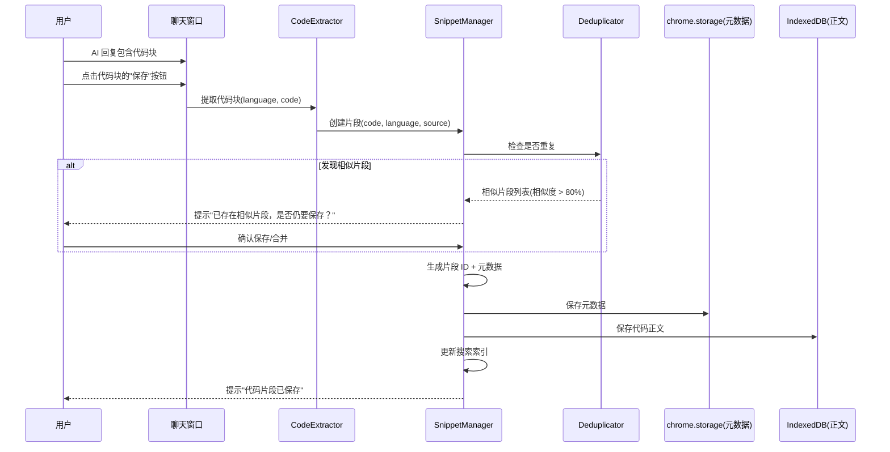

# YP-09-136: 代码片段库 — 一键保存 AI 代码、语言标签分类、代码感知搜索、语法高亮、导入导出、使用分析

> 需求编号：YP-09-136 · 优先级：P2 · 人天：0.3d · 状态：需求已编写
> 依赖：YP-09-110（Markdown 编辑器增强）、YP-09-47（代码高亮增强）

## 背景

### 问题陈述

YiPet 用户在与 AI 对话中频繁获取代码片段（算法实现、配置模板、SQL 查询、Shell 脚本等），但当前的代码管理方式存在严重问题：

1. **代码片段散落**：AI 生成的代码散落在各个会话中，用户需要反复翻找历史对话才能找到之前用过的代码
2. **无结构化保存**：用户只能手动复制代码到外部工具（如笔记应用、Gist、本地文件），割裂的体验打断工作流
3. **代码查找困难**：会话内搜索只能搜索文本，无法按语言、函数名、变量名等代码语义搜索
4. **无复用机制**：用户想再次使用之前 AI 生成的代码时，需要重新描述需求让 AI 再次生成，浪费 token 和时间
5. **无版本追踪**：同一段代码的多次修改无法追踪，用户无法对比不同版本
6. **代码知识孤立**：有价值的代码片段无法沉淀为个人知识库，随会话归档而丢失

**核心矛盾**：AI 对话是代码片段的主要来源，但 YiPet 缺乏将代码从对话中提取、组织、复用的机制。用户被迫在 YiPet 和外部代码管理工具之间切换，代码片段无法沉淀为长期可用的个人资产。

### 影响范围

| # | 影响 | 严重程度 | 典型场景 |
|---|------|----------|----------|
| 1 | AI 生成的代码散落在各会话中，难以查找 | 高 | 用户需要之前 AI 生成的一段 Python 脚本，翻遍 10 个会话 |
| 2 | 代码片段无法结构化保存 | 高 | 用户每天收到 5+ 段代码，全部手动复制到外部工具 |
| 3 | 重复让 AI 生成相似代码 | 中 | 用户忘记之前保存的代码片段，重新描述需求让 AI 生成 |
| 4 | 代码版本无法追踪 | 中 | 用户修改了 AI 生成的代码，但原始版本丢失 |
| 5 | 代码片段无法分享 | 低 | 用户想分享一段代码片段给同事，需要手动复制粘贴 |

### 挑战

| 挑战 | 说明 |
|------|------|
| 代码块提取 | 从 AI 回复的 Markdown 中准确提取代码块，区分语言、处理嵌套代码块 |
| 代码感知搜索 | 支持按函数名、变量名、类名等代码语义搜索，而非仅全文匹配 |
| 语法高亮 | 在扩展受限环境中实现高质量的语法高亮，支持 50+ 语言 |
| 存储空间管理 | 代码片段（含语法高亮元数据）累积可能占用大量 chrome.storage 空间 |
| 导入导出兼容性 | 支持 JSON 和 Gist 格式导入导出，需处理不同格式的字段映射 |
| 代码去重 | 用户可能多次保存相同或相似的代码片段，需智能去重提示 |

---

## 一、现状分析

### 1.1 当前代码管理能力

```
现有代码相关功能:
├── AI 聊天
│   ├── Markdown 代码块渲染                    # ✅ 存在
│   │   ├── 语法高亮（highlight.js）           # ✅ 存在（YP-09-47）
│   │   ├── 复制按钮（每个代码块）             # ✅ 存在
│   │   └── 行号显示                           # ⚠️ 部分存在
│   ├── 代码块保存                              # ❌ 不存在
│   ├── 代码片段库                              # ❌ 不存在
│   └── 代码复用                                # ❌ 不存在
├── Markdown 编辑器 (YP-09-110)
│   ├── 代码块编辑                              # ✅ 存在
│   └── 代码块保存到片段库                      # ❌ 不存在
└── 会话搜索 (YP-09-114)
    ├── 全文搜索                                # ✅ 存在
    └── 代码感知搜索                            # ❌ 不存在

缺失:
├── SnippetManager: 代码片段管理核心        # ❌ 不存在
├── CodeExtractor: 代码块提取器             # ❌ 不存在
├── SnippetStore: 片段持久化存储            # ❌ 不存在
├── CodeAwareSearch: 代码感知搜索引擎       # ❌ 不存在
├── SnippetViewer: 片段查看器                # ❌ 不存在
├── SnippetImporter: 导入导出引擎            # ❌ 不存在
├── UsageAnalytics: 使用统计分析             # ❌ 不存在
└── SnippetInsert: 片段插入聊天              # ❌ 不存在
```

### 1.2 代码片段生命周期

```
当前流程（无片段库）:
AI 生成代码 → 用户复制 → 粘贴到外部工具 → 需要使用 → 翻找外部工具 → 复制回来 → 粘贴到聊天

目标流程:
AI 生成代码 → 一键保存到片段库 → 需要使用 → 片段库搜索 → 一键插入聊天
```

### 1.3 代码片段来源分析

| 来源 | 占比 | 典型语言 | 片段大小 |
|------|------|----------|----------|
| AI 聊天回复 | 80% | Python, JavaScript, TypeScript, SQL, Shell | 10-200 行 |
| 用户手动添加 | 10% | 各种语言 | 5-500 行 |
| 网页代码块 | 5% | JavaScript, HTML, CSS | 20-300 行 |
| 导入 | 5% | 各种语言 | 不定 |

### 1.4 根因矩阵

| 症状 | 根因 | 触发条件 | 频率 |
|------|------|----------|------|
| 代码片段散落 | 无集中式代码片段管理 | 每次 AI 生成代码后 | 高 |
| 查找代码困难 | 无代码感知搜索 | 需要复用之前代码时 | 高 |
| 重复请求 AI 生成代码 | 无代码复用机制 | 需要之前用过的代码时 | 中 |
| 代码版本丢失 | 无版本追踪 | 修改代码后 | 中 |
| 代码片段无法分享 | 无导出功能 | 需要分享代码时 | 低 |

---

## 二、设计决策

### 决策 1：代码片段存储方式 — chrome.storage.local vs IndexedDB vs 后端存储

| 选项 | 容量 | 查询能力 | 同步能力 | 复杂度 |
|------|------|----------|----------|--------|
| chrome.storage.local | 10MB（总计） | 有限（仅 key-value） | 支持 chrome.storage.sync | 低 |
| IndexedDB | 无限制（受磁盘限制） | 丰富（索引、排序、过滤） | 不支持 | 中 |
| 后端存储（YiAi MongoDB） | 无限制 | 丰富 | 天然支持 | 高 |
| 混合（chrome.storage + IndexedDB） | 大 | 丰富 | 元数据同步 | 中 |

**选择：混合（chrome.storage.local + IndexedDB）。** chrome.storage.local 存储片段元数据（标题、语言、标签、创建时间、使用次数），IndexedDB 存储片段正文（代码内容、语法高亮元数据）。元数据可在设置同步时同步到 chrome.storage.sync，代码正文保留在本地。无需后端存储，保持离线可用。

### 决策 2：代码感知搜索策略 — 全文搜索 vs 正则搜索 vs 结构化搜索

| 选项 | 搜索准确度 | 实现复杂度 | 索引大小 | 代码语义理解 |
|------|-----------|-----------|----------|-------------|
| 全文搜索（Fuse.js） | 中 | 低 | 小 | 无 |
| 正则搜索（按函数名/变量名） | 中 | 低 | 小 | 有限 |
| 结构化搜索（AST 解析） | 高 | 高 | 大 | 有 |
| 全文 + 正则混合 | 中 | 低 | 小 | 有限 |

**选择：全文 + 正则混合（Fuse.js + 代码模式正则）。** AST 解析在浏览器扩展中实现复杂且体积大（需要各语言的解析器）。Fuse.js 提供模糊搜索，配合代码模式正则匹配（如 `function\s+\w+`、`const\s+\w+`）可覆盖大部分搜索场景。搜索索引在保存片段时生成，存储在内存中。

### 决策 3：语法高亮方案 — highlight.js vs Prism.js vs 无高亮

| 选项 | 语言支持 | 体积 | 渲染性能 | 主题支持 |
|------|----------|------|----------|----------|
| highlight.js | 190+ 语言 | ~200KB（全量） | 高 | 多主题 |
| Prism.js | 280+ 语言 | ~50KB（核心） | 高 | 多主题 |
| 无高亮 | 0 | 0 | 最高 | 无 |
| 复用现有 highlight.js | 190+ 语言 | 0（已存在） | 高 | 多主题 |

**选择：复用现有 highlight.js。** YiPet 已经在 Markdown 渲染中使用 highlight.js（YP-09-47），直接复用现有依赖，无需额外引入。片段查看器中使用相同的 highlight.js 实例，确保代码块渲染与聊天中一致。

### 决策 4：导入导出格式 — JSON vs Gist vs Markdown vs 全部支持

| 选项 | 元数据保留 | 可移植性 | 实现复杂度 |
|------|-----------|----------|-----------|
| JSON | 完整 | 高 | 低 |
| Gist API | 有限 | 最高（GitHub 生态） | 中 |
| Markdown | 中 | 高 | 低 |
| 全部支持 | 完整 | 高 | 中 |

**选择：JSON + Gist API 两种格式。** JSON 格式保留完整元数据，适合本地备份和迁移。Gist API 格式适合公开分享和 GitHub 集成，但不保留标签、使用次数等元数据。Markdown 导出可在后续版本中支持。

### 设计决策记录

| 决策 | 选项 A | 选项 B | 选项 C | 选择 | 理由 |
|------|--------|--------|--------|------|------|
| 存储方式 | chrome.storage | IndexedDB | 混合 | **混合** | 元数据同步 + 正文大容量 |
| 搜索策略 | 全文搜索 | 正则搜索 | 混合 | **混合** | 模糊搜索 + 代码模式匹配 |
| 语法高亮 | highlight.js | Prism.js | 复用现有 | **复用现有** | 零额外依赖，一致性 |
| 导入导出 | JSON | Gist | 全部支持 | **JSON + Gist** | 覆盖备份和分享场景 |

---

## 三、目标架构

### 3.1 代码片段库系统架构

```mermaid
graph TD
    subgraph "代码来源层"
        A1[AI 聊天回复: 代码块提取]
        A2[用户手动添加: 片段编辑器]
        A3[网页代码块: 右键菜单保存]
        A4[导入: JSON/Gist 文件]
    end

    subgraph "片段管理层"
        B1[SnippetManager: 片段管理核心]
        B2[CodeExtractor: 代码块提取]
        B3[Deduplicator: 片段去重]
        B4[VersionTracker: 版本追踪]
    end

    subgraph "存储层"
        C1[chrome.storage.local: 元数据]
        C2[IndexedDB: 代码正文]
        C3[SearchIndex: 搜索索引(内存)]
    end

    subgraph "搜索与浏览层"
        D1[CodeAwareSearch: 代码感知搜索]
        D2[LanguageFilter: 语言筛选]
        D3[TagFilter: 标签筛选]
        D4[FavoriteFilter: 收藏筛选]
        D5[SnippetList: 片段列表]
    end

    subgraph "展示与复用层"
        E1[SnippetViewer: 片段查看器]
        E2[SyntaxHighlighter: 语法高亮]
        E3[SnippetInsert: 一键插入聊天]
        E4[CopyActions: 复制操作]
    end

    subgraph "导入导出层"
        F1[JSONExporter: JSON 导出]
        F2[GistExporter: Gist 导出]
        F3[JSONImporter: JSON 导入]
        F4[GistImporter: Gist 导入]
    end

    subgraph "分析层"
        G1[UsageAnalytics: 使用统计]
        G2[MostUsed: 最常用片段]
        G3[LanguageStats: 语言分布]
    end

    A1 --> B1
    A2 --> B1
    A3 --> B1
    A4 --> B1

    B1 --> B2
    B1 --> B3
    B1 --> B4

    B1 --> C1
    B1 --> C2
    B1 --> C3

    C1 --> D1
    C2 --> D1
    C3 --> D1

    D1 --> D2
    D1 --> D3
    D1 --> D4
    D1 --> D5

    D5 --> E1
    E1 --> E2
    E1 --> E3
    E1 --> E4

    B1 --> F1
    B1 --> F2
    F3 --> B1
    F4 --> B1

    C1 --> G1
    G1 --> G2
    G1 --> G3
```

### 3.2 代码片段保存流程



### 3.3 片段查看器布局

```
┌──────────────────────────────────────────────────────────────┐
│  📁 代码片段库                                     [+ 新建]   │
│  ─────────────────────────────────────────────────────────── │
│  🔍 [搜索代码片段...                     ]  [语言 ▼] [标签 ▼] │
│  ─────────────────────────────────────────────────────────── │
│  ┌─────────────────────────────────────────────────────────┐ │
│  │ 📄 debounce-function.ts                     ⭐ 3 次使用  │ │
│  │   TypeScript · 工具函数 · 前端             2026-09-05   │ │
│  │   function debounce<T extends (...args: any)...         │ │
│  ├─────────────────────────────────────────────────────────┤ │
│  │ 📄 postgres-connection-pool.py               ⭐ 5 次使用  │ │
│  │   Python · 数据库 · 连接池                 2026-09-03   │ │
│  │   from psycopg2 import pool...                          │ │
│  ├─────────────────────────────────────────────────────────┤ │
│  │ 📄 docker-compose-template.yml               ⭐ 8 次使用  │ │
│  │   YAML · DevOps · 模板                      2026-08-28   │ │
│  │   version: '3.8'\nservices:\n  app:...                  │ │
│  └─────────────────────────────────────────────────────────┘ │
│  ─────────────────────────────────────────────────────────── │
│  共 23 个片段 · TypeScript: 8 · Python: 6 · SQL: 4 · 其他: 5 │
└──────────────────────────────────────────────────────────────┘
```

### 3.4 片段详情视图

```
┌──────────────────────────────────────────────────────────────┐
│  ← 返回列表                                                  │
│  ─────────────────────────────────────────────────────────── │
│  📄 debounce-function.ts                                     │
│  ─────────────────────────────────────────────────────────── │
│  🏷 TypeScript  ⭐ 收藏  📊 使用 3 次  📅 2026-09-05         │
│  标签: 工具函数, 前端, 性能优化, debounce                     │
│  来源: AI 会话 "React 性能优化讨论"                           │
│  ─────────────────────────────────────────────────────────── │
│  ```typescript                                               │
│  function debounce<T extends (...args: any[]) => any>(       │
│    fn: T,                                                    │
│    delay: number = 300                                       │
│  ): (...args: Parameters<T>) => void {                       │
│    let timer: ReturnType<typeof setTimeout>;                 │
│    return (...args: Parameters<T>) => {                      │
│      clearTimeout(timer);                                    │
│      timer = setTimeout(() => fn(...args), delay);           │
│    };                                                        │
│  }                                                           │
│  ```                                                         │
│  ─────────────────────────────────────────────────────────── │
│  [📋 复制] [💬 插入聊天] [✏️ 编辑] [📤 导出] [🗑 删除]       │
│  ─────────────────────────────────────────────────────────── │
│  📝 备注: React 搜索框防抖使用，delay 300ms 效果最佳          │
│  🔄 版本: v1 (2026-09-05) · 原始版本                         │
└──────────────────────────────────────────────────────────────┘
```

### 3.5 性能指标

| 指标 | 目标值 | 说明 |
|------|--------|------|
| 片段列表加载 | < 100ms | 从 chrome.storage 读取元数据列表 |
| 片段详情加载 | < 50ms | 从 IndexedDB 读取代码正文 |
| 代码感知搜索 | < 200ms | 搜索 100 个片段 |
| 代码块保存 | < 100ms | 提取 + 去重检查 + 写入存储 |
| 语法高亮渲染 | < 50ms | 单片段渲染 |
| 导入 JSON（100 片段） | < 2s | 解析 + 批量写入 |
| 导出 JSON（100 片段） | < 1s | 序列化 + 下载 |

---

## 四、具体改动

### 4.1 代码片段数据类型

```typescript
// src/snippets/types.ts (新增)

export type SnippetLanguage =
  | 'typescript' | 'javascript' | 'python' | 'sql' | 'shell'
  | 'html' | 'css' | 'json' | 'yaml' | 'markdown'
  | 'rust' | 'go' | 'java' | 'c' | 'cpp' | 'ruby' | 'php'
  | string;

export interface CodeSnippet {
  id: string;
  title: string;                    // 片段标题（文件名或函数名）
  language: SnippetLanguage;
  code: string;                     // 代码正文
  tags: string[];                   // 标签
  favorite: boolean;                // 是否收藏
  useCount: number;                 // 使用次数
  lastUsedAt: string | null;        // 最后使用时间
  createdAt: string;                // 创建时间
  updatedAt: string;                // 更新时间
  source: {
    type: 'ai_chat' | 'manual' | 'webpage' | 'import';
    sessionId?: string;             // 来源会话 ID
    messageId?: string;             // 来源消息 ID
    pageUrl?: string;               // 来源页面 URL
    importSource?: string;          // 导入来源描述
  };
  notes: string;                    // 备注
  versions: SnippetVersion[];       // 版本历史
  metadata: {
    functions: string[];            // 提取的函数名
    variables: string[];            // 提取的变量名
    classes: string[];              // 提取的类名
    imports: string[];              // 提取的导入语句
    lineCount: number;              // 行数
    charCount: number;              // 字符数
    keywords: string[];             // 搜索关键词
  };
}

export interface SnippetVersion {
  id: string;
  code: string;
  createdAt: string;
  note: string;                     // 版本说明
  isOriginal: boolean;              // 是否为原始版本
}

export interface SnippetSearchResult {
  snippet: CodeSnippet;
  score: number;                    // 搜索匹配度 0-1
  matches: {
    field: 'title' | 'code' | 'tags' | 'functions' | 'variables' | 'classes';
    text: string;
    positions: [number, number][];  // 匹配位置
  }[];
}

export interface SnippetImportResult {
  imported: number;
  skipped: number;                  // 重复跳过的
  errors: { filename: string; error: string }[];
}

export interface SnippetUsageStats {
  totalSnippets: number;
  totalUses: number;
  mostUsed: { snippet: CodeSnippet; useCount: number }[];
  languageDistribution: { language: string; count: number }[];
  weeklyCreated: { date: string; count: number }[];
  topTags: { tag: string; count: number }[];
}
```

### 4.2 代码片段管理器

```typescript
// src/snippets/services/snippet-manager.ts (新增)

class SnippetManager {
  private metaStore: MetaStore;
  private codeStore: CodeStore;
  private searchIndex: SearchIndex;
  private deduplicator: Deduplicator;

  async saveSnippet(params: {
    code: string;
    language: SnippetLanguage;
    title?: string;
    tags?: string[];
    source: CodeSnippet['source'];
    notes?: string;
  }): Promise<CodeSnippet> {
    // 1. 提取代码元数据
    const metadata = this.extractMetadata(params.code, params.language);
    const title = params.title || this.generateTitle(params.code, params.language);

    // 2. 去重检查
    const similar = await this.deduplicator.findSimilar(params.code);
    if (similar.length > 0) {
      throw new DuplicateError('Similar snippet exists', similar);
    }

    // 3. 创建片段
    const snippet: CodeSnippet = {
      id: generateId(),
      title,
      language: params.language,
      code: params.code,
      tags: params.tags || [],
      favorite: false,
      useCount: 0,
      lastUsedAt: null,
      createdAt: new Date().toISOString(),
      updatedAt: new Date().toISOString(),
      source: params.source,
      notes: params.notes || '',
      versions: [{
        id: generateId(),
        code: params.code,
        createdAt: new Date().toISOString(),
        note: '原始版本',
        isOriginal: true,
      }],
      metadata,
    };

    // 4. 持久化
    await this.metaStore.save(snippet);
    await this.codeStore.save(snippet.id, params.code);
    this.searchIndex.add(snippet);

    return snippet;
  }

  async search(query: string, options?: {
    language?: SnippetLanguage;
    tags?: string[];
    favorite?: boolean;
    limit?: number;
  }): Promise<SnippetSearchResult[]> {
    const results = this.searchIndex.search(query);

    let filtered = results;
    if (options?.language) {
      filtered = filtered.filter(r => r.snippet.language === options.language);
    }
    if (options?.tags) {
      filtered = filtered.filter(r =>
        options.tags!.some(tag => r.snippet.tags.includes(tag))
      );
    }
    if (options?.favorite) {
      filtered = filtered.filter(r => r.snippet.favorite);
    }

    return filtered.slice(0, options?.limit || 50);
  }

  private extractMetadata(code: string, language: SnippetLanguage): CodeSnippet['metadata'] {
    const functions = this.extractFunctions(code, language);
    const variables = this.extractVariables(code, language);
    const classes = this.extractClasses(code, language);
    const imports = this.extractImports(code, language);

    return {
      functions,
      variables,
      classes,
      imports,
      lineCount: code.split('\n').length,
      charCount: code.length,
      keywords: [...functions, ...variables, ...classes],
    };
  }

  private extractFunctions(code: string, language: string): string[] {
    const patterns: Record<string, RegExp> = {
      typescript: /(?:function|const|async function)\s+(\w+)/g,
      javascript: /(?:function|const|async function)\s+(\w+)/g,
      python: /def\s+(\w+)/g,
      go: /func\s+(?:\(\w+\s+\*?\w+\)\s+)?(\w+)/g,
      rust: /fn\s+(\w+)/g,
      java: /(?:public|private|protected)\s+(?:static\s+)?(?:[\w<>]+\s+)?(\w+)\s*\(/g,
    };

    const pattern = patterns[language] || /(?:function|def|fn)\s+(\w+)/g;
    return [...new Set([...code.matchAll(pattern)].map(m => m[1]))];
  }
}
```

### 4.3 文件变更清单

| 文件 | 操作 | 说明 |
|------|------|------|
| `src/snippets/types.ts` | 新增 | 代码片段数据模型定义 |
| `src/snippets/services/snippet-manager.ts` | 新增 | 片段管理核心服务 |
| `src/snippets/services/code-extractor.ts` | 新增 | 代码块提取器 |
| `src/snippets/services/deduplicator.ts` | 新增 | 片段去重检查 |
| `src/snippets/services/search-index.ts` | 新增 | 搜索索引（内存） |
| `src/snippets/services/meta-store.ts` | 新增 | 元数据存储（chrome.storage） |
| `src/snippets/services/code-store.ts` | 新增 | 代码正文存储（IndexedDB） |
| `src/snippets/services/snippet-importer.ts` | 新增 | 导入引擎（JSON + Gist） |
| `src/snippets/services/snippet-exporter.ts` | 新增 | 导出引擎（JSON + Gist） |
| `src/snippets/services/usage-analytics.ts` | 新增 | 使用统计分析 |
| `src/snippets/components/snippet-list.vue` | 新增 | 片段列表组件 |
| `src/snippets/components/snippet-viewer.vue` | 新增 | 片段查看器组件 |
| `src/snippets/components/snippet-editor.vue` | 新增 | 片段编辑器组件 |
| `src/snippets/components/snippet-search.vue` | 新增 | 片段搜索栏组件 |
| `src/snippets/components/snippet-import-dialog.vue` | 新增 | 导入对话框 |
| `src/snippets/components/snippet-export-dialog.vue` | 新增 | 导出对话框 |
| `src/snippets/components/snippet-stats.vue` | 新增 | 使用统计面板 |
| `src/snippets/stores/snippets.ts` | 新增 | 片段状态管理 |
| `src/content/snippet-save-button.ts` | 新增 | 代码块保存按钮注入 |
| `src/popup/App.vue` | 修改 | 添加片段库入口 |
| `tests/unit/snippets/snippet-manager.test.ts` | 新增 | 片段管理测试 |
| `tests/unit/snippets/search-index.test.ts` | 新增 | 搜索索引测试 |
| `tests/unit/snippets/deduplicator.test.ts` | 新增 | 去重测试 |

---

## 五、实施步骤

| 步骤 | 操作 | 路径 | 验证 | 人天 |
|------|------|------|------|------|
| 1 | 定义代码片段数据模型 | `src/snippets/types.ts` | 类型定义完整，覆盖所有接口 | 0.02 |
| 2 | 实现元数据存储和代码正文存储 | `src/snippets/services/meta-store.ts` + `code-store.ts` | 读写正常，分片存储 | 0.04 |
| 3 | 实现片段管理核心服务 | `src/snippets/services/snippet-manager.ts` | CRUD + 代码元数据提取 | 0.06 |
| 4 | 实现搜索索引和代码感知搜索 | `src/snippets/services/search-index.ts` | 模糊搜索 + 代码模式匹配 | 0.04 |
| 5 | 实现去重检查 | `src/snippets/services/deduplicator.ts` | 相似度计算 + 提示 | 0.03 |
| 6 | 实现片段列表和查看器 UI | `src/snippets/components/` | 列表 + 查看 + 搜索 + 筛选 | 0.06 |
| 7 | 实现导入导出 | `src/snippets/services/snippet-importer.ts` + `exporter.ts` | JSON + Gist 格式 | 0.03 |
| 8 | 实现代码块保存按钮注入 | `src/content/snippet-save-button.ts` | AI 回复代码块显示保存按钮 | 0.02 |

**总人天：0.3d**

---

## 六、测试规格

### 场景 1：从 AI 回复保存代码片段

**GIVEN** AI 回复包含一个 TypeScript 代码块（debounce 函数）
**WHEN** 用户点击代码块右上角的"保存到片段库"按钮
**THEN** 片段应保存到片段库，标题自动生成为函数名"debounce"
**AND** 语言应自动识别为 TypeScript
**AND** 元数据应提取函数名"debounce"
**AND** 用户应看到"代码片段已保存"提示
**AND** 在片段列表中应能看到新保存的片段

### 场景 2：代码感知搜索

**GIVEN** 片段库中有 20 个片段，其中一个包含函数"debounce"
**WHEN** 用户在搜索框中输入"debounce"
**THEN** 应返回包含"debounce"的片段，匹配函数名、标题、代码内容
**AND** 匹配结果应按相关度排序
**AND** 搜索结果应高亮显示匹配位置
**AND** 搜索应在 200ms 内完成

### 场景 3：片段去重提示

**GIVEN** 片段库中已存在一个 debounce 函数片段
**WHEN** 用户尝试保存另一个相似的 debounce 实现（相似度 > 80%）
**THEN** 应弹出提示"已存在相似片段，是否仍要保存？"
**AND** 应展示相似片段的标题和预览
**AND** 用户可选择"仍要保存"、"合并为新版本"或"取消"

### 场景 4：片段插入聊天

**GIVEN** 用户在片段查看器中查看一个 Python 代码片段
**WHEN** 用户点击"插入聊天"按钮
**THEN** 代码片段应插入到当前活跃的聊天输入框中
**AND** 代码应保持原格式（缩进、换行）
**AND** 片段的使用次数应增加 1
**AND** 最后使用时间应更新

### 场景 5：导入导出 JSON

**GIVEN** 用户有一个包含 50 个片段的 JSON 文件
**WHEN** 用户点击"导入"，选择 JSON 文件
**THEN** 50 个片段应成功导入（已存在的跳过）
**AND** 应显示导入结果：导入 50 个，跳过 0 个，错误 0 个
**WHEN** 用户点击"导出"，选择 JSON 格式
**THEN** 应下载包含所有片段（含元数据）的 JSON 文件
**AND** 文件应包含完整的 tags、versions、metadata 等字段

### 场景 6：片段使用统计

**GIVEN** 用户使用片段库 30 天，累计保存 50 个片段，使用 120 次
**WHEN** 用户打开使用统计面板
**THEN** 应展示最常用片段 Top 10（按使用次数排序）
**AND** 应展示语言分布饼图
**AND** 应展示每周新增片段趋势
**AND** 应展示热门标签

---

## 七、风险与缓解

| 风险 | 概率 | 影响 | 缓解措施 |
|------|------|------|------|
| IndexedDB 在隐身模式下不可用 | 中 | 中 | 降级为 chrome.storage.local 存储，片段数量受限时提示用户 |
| 搜索索引内存占用过大 | 中 | 中 | 限制搜索索引为 1000 个片段，超出部分仅搜索元数据 |
| 代码提取正则不准确（函数名/变量名提取错误） | 中 | 低 | 提取失败不影响保存，仅影响搜索精度，正则持续优化 |
| 导入大量片段阻塞 UI | 低 | 中 | 分批导入（每批 50 条），使用 requestIdleCallback 在空闲时写入 |
| 代码块保存按钮与 Markdown 渲染冲突 | 中 | 低 | 使用 MutationObserver 监听代码块渲染，在渲染完成后注入按钮 |
| chrome.storage.local 配额不足 | 低 | 中 | 代码正文存储在 IndexedDB，仅元数据存储在 chrome.storage |

---

## 八、回滚策略

| 场景 | 回滚操作 | 影响 |
|------|----------|------|
| IndexedDB 性能问题 | 降级为 chrome.storage.local 存储全部数据 | 存储容量受限 |
| 搜索索引内存泄漏 | 禁用搜索索引，降级为 chrome.storage 全文扫描 | 搜索速度下降 |
| 导入功能导致数据损坏 | 禁用导入功能，提示用户手动添加 | 失去批量导入能力 |
| 代码块保存按钮干扰页面 | 隐藏保存按钮，仅保留 Popup 内手动添加 | 便捷性下降 |
| 使用统计性能问题 | 禁用统计功能，仅保留基本 CRUD | 失去使用分析 |

---

## 九、设计决策记录

### D-01：代码片段存储分片策略

- **问题**：代码片段元数据和正文如何分片存储
- **选项**：全存 chrome.storage、全存 IndexedDB、分片存储
- **选择**：分片存储（元数据在 chrome.storage，正文在 IndexedDB）
- **理由**：元数据需要快速读取（列表展示）且支持 chrome.storage.sync 同步，正文可能较大适合 IndexedDB 的大容量

### D-02：代码块保存按钮位置

- **问题**：AI 回复中的代码块保存按钮放在哪里
- **选项**：代码块右上角、代码块底部、聊天消息工具栏
- **选择**：代码块右上角（与现有复制按钮并列）
- **理由**：与现有复制按钮保持一致的交互模式，用户已习惯在代码块右上角找操作按钮

### D-03：相似度计算算法

- **问题**：去重检查使用什么算法计算代码相似度
- **选项**：Levenshtein 距离、Jaccard 相似度（token 级别）、SimHash
- **选择**：Jaccard 相似度（token 级别）
- **理由**：Jaccard 相似度对代码重构（变量重命名）不敏感，计算速度快，适合浏览器环境

### D-04：搜索索引更新策略

- **问题**：搜索索引何时更新
- **选项**：保存时更新、定时批量更新、启动时全量重建
- **选择**：保存时增量更新 + 启动时验证
- **理由**：增量更新保证搜索实时性，启动时验证确保索引不丢失（处理 Service Worker 重启场景）

---

## 十、可观测性

### 指标

| 指标 | 类型 | 说明 |
|------|------|------|
| `yipet.snippets.total` | Gauge | 片段总数 |
| `yipet.snippets.saved_from_chat` | Counter | 从 AI 聊天保存的片段数 |
| `yipet.snippets.searched` | Counter | 搜索次数 |
| `yipet.snippets.inserted` | Counter | 插入聊天次数 |
| `yipet.snippets.imported` | Counter | 导入片段数 |
| `yipet.snippets.exported` | Counter | 导出次数 |
| `yipet.snippets.dedup_triggered` | Counter | 去重提示次数 |
| `yipet.snippets.search_duration` | Histogram | 搜索耗时分布 |

### 告警

| 告警 | 条件 | 级别 |
|------|------|------|
| 片段总数超过 1000 | 片段数 > 1000 | INFO |
| chrome.storage 使用率超过 80% | 使用量 > 8MB | WARNING |
| 搜索耗时超过 500ms | 连续 10 次搜索 | WARNING |
| 导入失败率超过 10% | 单次导入失败 > 10% | WARNING |

---

## 十一、代码审查检查清单

- [ ] 代码片段数据模型定义完整（CodeSnippet/SnippetVersion/SnippetSearchResult/SnippetUsageStats）
- [ ] 元数据存储在 chrome.storage.local，代码正文存储在 IndexedDB
- [ ] 片段管理器支持 CRUD、去重检查、版本追踪
- [ ] 代码提取器从 Markdown 代码块中正确提取语言和代码
- [ ] 代码元数据提取器支持函数名、变量名、类名、导入语句提取
- [ ] 搜索索引支持 Fuse.js 模糊搜索 + 代码模式正则匹配
- [ ] 搜索支持按语言、标签、收藏筛选
- [ ] 片段查看器复用现有 highlight.js 进行语法高亮
- [ ] 代码块保存按钮注入到 AI 回复的代码块右上角
- [ ] 导入支持 JSON 格式（完整元数据）和 Gist 格式
- [ ] 导出支持 JSON 格式（完整元数据）和 Gist 格式
- [ ] 使用统计面板展示最常用片段、语言分布、每周趋势
- [ ] 单元测试覆盖片段管理、搜索索引、去重检查、导入导出

---

## 回归问题预测

| # | 预测问题 | 原因 | 验证方法 |
|---|---------|------|---------|
| 1 | 代码块保存按钮在流式渲染过程中出现闪烁或重复渲染 | SSE 流式渲染时，代码块内容逐步更新，MutationObserver 可能多次触发保存按钮注入 | 在 AI 流式回复包含代码块时，观察保存按钮是否重复出现 |
| 2 | 从代码块中提取的代码包含 Markdown 语法残留（如多余的反引号或语言标识符） | 代码块提取器的正则匹配边界不准确，未正确处理嵌套代码块或代码块内包含反引号 | 保存包含 Markdown 代码块示例的代码（如代码块内演示 Markdown 语法），验证提取结果正确 |
| 3 | IndexedDB 写入失败时静默丢弃数据，用户未感知 | IndexedDB 事务失败时未 catch 错误，或错误处理未通知用户 | 在 IndexedDB 配额耗尽时保存代码片段，验证错误提示和降级存储 |
| 4 | 搜索索引在 Service Worker 重启后丢失，搜索返回空结果 | 搜索索引存储在内存中，SW 重启后未从存储重建 | 关闭浏览器后重新打开，搜索已有片段，验证结果正常 |
| 5 | 导入 JSON 文件时，文件中的片段 ID 与现有片段 ID 冲突，导致数据覆盖 | 导入时直接使用文件中的 ID 而不重新生成，与现有片段 ID 冲突 | 导入包含与现有片段相同 ID 的 JSON 文件，验证不覆盖现有数据 |
| 6 | 代码片段使用统计在多个标签页中累加不一致 | 使用次数存储在 chrome.storage，多个标签页同时更新可能导致 race condition | 在两个标签页中同时插入同一片段，验证使用次数正确累加 |

---

## 性能分析

### 代码片段库关键操作耗时

| 操作 | 耗时 | 说明 |
|------|------|------|
| 片段列表加载（100 片段） | < 50ms | 从 chrome.storage 读取元数据列表 |
| 片段详情加载 | < 50ms | 从 IndexedDB 读取代码正文 |
| 代码块保存（提取 + 存储） | < 100ms | 提取代码块 + 写入两个存储 |
| 代码感知搜索（100 片段） | < 200ms | Fuse.js 模糊搜索 + 正则匹配 |
| 语法高亮渲染 | < 50ms | highlight.js 单片段渲染 |
| 导入 JSON（100 片段） | < 2s | 解析 + 批量写入 |
| 导出 JSON（100 片段） | < 1s | 序列化 + Blob 下载 |
| 去重检查（100 片段） | < 100ms | Jaccard 相似度计算 |
| 使用统计聚合 | < 100ms | 从 chrome.storage 读取 + 聚合计算 |

### 数据量预估

| 模块 | 数据项 | 大小 |
|------|--------|------|
| 元数据（100 片段） | 标题 + 语言 + 标签 + 统计 + 版本 | ~50KB |
| 代码正文（100 片段，平均 200 行） | 代码内容 | ~500KB |
| 搜索索引（100 片段） | 关键词 + 位置映射 | ~100KB |
| 使用统计缓存 | 聚合数据 | ~10KB |

### 对宿主页面的影响

| 场景 | 页面影响 | 说明 |
|------|----------|------|
| 代码块保存按钮注入 | 极低 | 仅在代码块右上角添加一个按钮 |
| 片段库浏览 | 零影响 | 在 Popup 中展示 |
| 片段搜索 | 零影响 | 在 Popup 中操作 |
| 导入导出 | 零影响 | 在 Popup 中操作 |
| 使用统计 | 零影响 | 在 Popup 中展示 |

---

## 相关文档

- [Markdown 编辑器增强](../110-需求-Markdown编辑器增强.md) — 代码块编辑和保存入口
- [代码高亮增强](../47-需求-代码高亮增强.md) — 语法高亮基础设施
- [会话内搜索](../114-需求-会话内搜索.md) — 搜索框架参考
- [消息格式化工具栏](../113-需求-消息格式化工具栏.md) — 代码块操作按钮参考

*PRD 来源: `projects/yipet/requirements/2026-09/136-需求-代码片段库.md`*