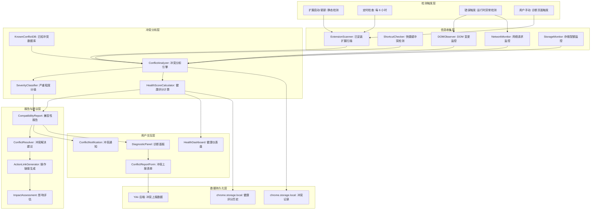
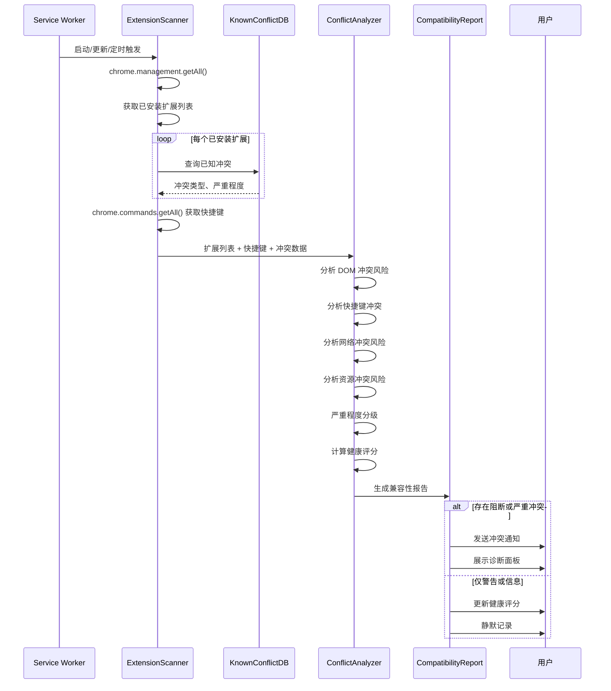

# YP-09-137: 扩展兼容性检查 — 冲突扩展检测、已知冲突数据库、兼容性报告、冲突解决建议、健康评分、用户冲突上报

> 需求编号：YP-09-137 · 优先级：P2 · 人天：0.2d · 状态：需求已编写
> 依赖：YP-09-20（JS 冲突检测与隔离）、YP-09-70（兼容性工具链）

## 背景

### 问题陈述

YiPet 作为 Chrome 扩展，在用户的浏览器生态中与其他扩展共存。当多个扩展同时操作 DOM、注入脚本、使用相同快捷键或修改网络请求时，可能产生冲突导致功能异常：

1. **DOM 修改冲突**：其他扩展（如广告拦截器、翻译扩展、页面美化工具）也修改 DOM，与 YiPet 的 Content Script 注入产生冲突，导致宠物渲染异常或页面功能失效
2. **脚本注入冲突**：其他扩展注入的脚本可能修改全局变量、原型链或事件监听器，与 YiPet 的运行环境产生冲突
3. **快捷键冲突**：多个扩展注册相同或相似的快捷键，导致快捷键无法触发或触发错误的功能
4. **网络请求拦截**：VPN/代理扩展、广告拦截器可能拦截或修改 YiPet 到 YiAi 后端的请求，导致通信失败
5. **存储配额抢占**：多个扩展同时使用 chrome.storage.local，可能导致 YiPet 的存储配额被挤占
6. **用户无感知**：用户不清楚是哪个扩展导致了 YiPet 的问题，只能逐一禁用扩展排查，体验极差

**核心矛盾**：Chrome 扩展生态缺乏统一的兼容性检测机制，用户需要手动排查扩展冲突。YiPet 作为 DOM 注入、网络通信、快捷键密集使用的扩展，需要主动检测和报告冲突，帮助用户快速定位问题。

### 影响范围

| # | 影响 | 严重程度 | 典型场景 |
|---|------|----------|----------|
| 1 | DOM 冲突导致宠物渲染异常 | 高 | 广告拦截器删除了 YiPet 的注入容器，宠物不显示 |
| 2 | 快捷键冲突导致功能无法触发 | 高 | 另一个扩展占用了 Ctrl+Shift+P，YiPet 的 Popup 快捷键失效 |
| 3 | 网络请求被拦截导致通信失败 | 高 | VPN 扩展修改了请求头，YiAi 后端认证失败 |
| 4 | 用户无法定位冲突来源 | 高 | 用户发现 YiPet 功能异常，但不知道是哪个扩展导致 |
| 5 | 脚本注入冲突导致 JS 错误 | 中 | 其他扩展污染了 Array.prototype，YiPet 的代码逻辑异常 |
| 6 | 存储配额被挤占 | 中 | 多个扩展同时大量写入 chrome.storage，YiPet 写入失败 |

### 挑战

| 挑战 | 说明 |
|------|------|
| 扩展信息获取有限 | chrome.management API 只能获取已安装扩展的 ID、名称、版本，无法获取扩展的具体行为 |
| 已知冲突数据库维护 | 需要持续收集和更新已知冲突扩展列表，依赖用户反馈和社区报告 |
| 冲突检测不完美 | 仅能检测已知模式的冲突，新型冲突或未知扩展的冲突无法自动检测 |
| 误报控制 | 相似功能扩展（如翻译工具）不一定冲突，需区分"可能冲突"和"确定冲突" |
| 用户隐私 | 收集已安装扩展列表涉及用户隐私，需明确告知并获得用户同意 |
| 被动检测局限 | 仅能在 YiPet 启动时或错误发生时检测，无法实时监控所有扩展行为 |

---

## 一、现状分析

### 1.1 当前兼容性检测能力

```
现有兼容性相关功能:
├── JS 冲突检测与隔离 (YP-09-20)
│   ├── 全局变量污染检测           # ✅ 存在
│   ├── 原型链修改检测              # ✅ 存在
│   └── 冲突扩展检测                # ❌ 不存在
├── 兼容性工具链 (YP-09-70)
│   ├── 浏览器版本检测              # ✅ 存在
│   ├── API 可用性检测              # ✅ 存在
│   └── 扩展冲突检测                # ❌ 不存在
├── 诊断信息收集 (YP-09-69)
│   ├── 错误日志收集                # ✅ 存在
│   ├── 环境信息收集                # ✅ 存在
│   └── 已安装扩展列表              # ❌ 不存在
├── 错误边界与降级 (YP-09-34)
│   ├── 错误捕获和降级              # ✅ 存在
│   └── 冲突扩展提示                # ❌ 不存在
└── 沙箱逃逸防护 (YP-09-71)
    ├── 脚本隔离                    # ✅ 存在
    └── 扩展冲突隔离                # ❌ 不存在

缺失:
├── ExtensionConflictDetector: 扩展冲突检测器   # ❌ 不存在
├── KnownConflictDB: 已知冲突数据库             # ❌ 不存在
├── CompatibilityReport: 兼容性报告生成器        # ❌ 不存在
├── HealthScore: 扩展健康评分系统                # ❌ 不存在
├── ConflictResolver: 冲突解决建议引擎           # ❌ 不存在
├── UserReport: 用户冲突上报                     # ❌ 不存在
└── ProactiveWarning: 主动冲突预警              # ❌ 不存在
```

### 1.2 扩展冲突分类

```
扩展冲突分类:
├── DOM 冲突
│   ├── 广告拦截器: 删除/隐藏 DOM 元素
│   ├── 翻译扩展: 替换文本节点
│   ├── 页面美化工具: 修改 CSS/布局
│   ├── 阅读模式: 重构页面结构
│   └── 辅助功能: 修改 ARIA 属性和焦点
├── 脚本冲突
│   ├── UserScript 管理器: 注入自定义脚本
│   ├── 开发者工具: 修改全局对象
│   ├── 密码管理器: 注入表单相关脚本
│   └── 购物助手: 注入价格跟踪脚本
├── 快捷键冲突
│   ├── 截图工具: 占用 Ctrl+Shift+S
│   ├── 剪贴板管理: 占用 Ctrl+Shift+V
│   ├── 标签管理: 占用 Ctrl+Shift+T
│   └── 其他 AI 助手: 占用 Ctrl+Shift+P
├── 网络冲突
│   ├── VPN/代理: 修改请求路由
│   ├── 广告拦截器: 拦截特定域名请求
│   ├── 防火墙扩展: 修改请求头
│   └── 流量节省: 压缩/修改响应
└── 资源冲突
    ├── 存储: 抢占 chrome.storage 配额
    ├── CPU: 大量计算占用主线程
    └── 内存: 大量内存分配导致扩展被回收
```

### 1.3 冲突检测流程现状

```
当前流程（无自动检测）:
用户发现 YiPet 异常 → 猜测是扩展冲突 → 手动打开 chrome://extensions → 逐个禁用扩展 → 刷新页面测试 → 重复直到找到冲突扩展 → 决定禁用哪个

目标流程:
YiPet 启动 → 自动扫描已安装扩展 → 匹配已知冲突数据库 → 检测运行时冲突 → 生成兼容性报告 → 展示冲突和建议 → 用户一键处理
```

### 1.4 根因矩阵

| 症状 | 根因 | 触发条件 | 频率 |
|------|------|----------|------|
| 宠物不显示 | 其他扩展删除了注入容器 | 广告拦截器/翻译扩展同时运行 | 中 |
| 快捷键无响应 | 快捷键被其他扩展占用 | 多个扩展注册相同快捷键 | 中 |
| API 请求失败 | 网络请求被代理/VPN 拦截 | VPN 扩展修改请求路由 | 中 |
| 扩展频繁崩溃 | 内存被其他扩展挤占 | 多个内存密集型扩展同时运行 | 低 |
| 无法定位冲突源 | 无自动检测和报告 | 任何扩展冲突场景 | 高 |

---

## 二、设计决策

### 决策 1：冲突检测方式 — 静态检测 vs 运行时检测 vs 混合

| 选项 | 准确率 | 覆盖范围 | 性能影响 | 误报率 |
|------|--------|----------|----------|--------|
| 静态检测（已知冲突数据库匹配） | 中 | 仅已知冲突 | 极低 | 低 |
| 运行时检测（监控 DOM/快捷键/网络） | 高 | 全部冲突 | 中 | 中 |
| 混合（静态 + 运行时） | 高 | 已知 + 实时冲突 | 中 | 低 |

**选择：混合（静态 + 运行时）。** 静态检测在扩展启动时执行，通过已知冲突数据库匹配已安装扩展，快速识别已知冲突。运行时检测在 Content Script 中监控 DOM 变更、快捷键注册状态和网络请求异常，实时发现未知冲突。两者结合实现最大覆盖。

### 决策 2：已知冲突数据库维护方式 — 本地内置 vs 远程拉取 vs 用户上报

| 选项 | 数据新鲜度 | 离线可用 | 维护成本 | 隐私 |
|------|-----------|----------|----------|------|
| 本地内置（JSON 文件） | 低（版本更新时更新） | 高 | 低 | 高 |
| 远程拉取（定期从服务器获取） | 高 | 低 | 中 | 中 |
| 用户上报（众包数据） | 中 | 高 | 低 | 高 |
| 混合（本地 + 远程 + 用户上报） | 高 | 高 | 中 | 中 |

**选择：混合（本地内置 + 远程拉取 + 用户上报）。** 本地内置基础冲突数据库（覆盖 Top 50 常见冲突扩展），扩展启动时从 YiAi 后端拉取最新冲突数据（可选，需用户同意），用户可通过"报告冲突"功能上报新发现的冲突。远程拉取默认关闭，用户可在隐私设置中开启。

### 决策 3：冲突严重程度分级 — 三级 vs 四级 vs 五级

| 选项 | 区分度 | 用户理解 | 处置建议 |
|------|--------|----------|----------|
| 三级（严重/警告/信息） | 中 | 高 | 清晰 |
| 四级（阻断/严重/警告/信息） | 中 | 中 | 清晰 |
| 五级（阻断/严重/中等/警告/信息） | 高 | 低 | 复杂 |

**选择：四级（阻断/严重/警告/信息）。** 阻断级：冲突导致 YiPet 完全无法使用（如核心快捷键被占用、API 请求全部失败）。严重级：冲突导致重要功能不可用（如宠物渲染异常、聊天功能异常）。警告级：冲突导致次要功能不可用或性能下降。信息级：存在潜在冲突风险但当前未触发。

### 决策 4：冲突解决策略 — 自动解决 vs 建议解决 vs 仅报告

| 选项 | 用户体验 | 风险 | 实现复杂度 |
|------|----------|------|-----------|
| 自动解决（自动修改快捷键/禁用冲突扩展） | 高 | 高（Chrome 不允许自动禁用扩展） | 高 |
| 建议解决（提供解决建议，用户手动操作） | 中 | 低 | 低 |
| 仅报告（仅展示冲突，不提供建议） | 低 | 低 | 极低 |
| 建议 + 一键操作（建议 + 可执行的操作链接） | 高 | 低 | 中 |

**选择：建议 + 一键操作。** Chrome 不允许扩展自动禁用其他扩展，因此无法自动解决。提供明确的解决建议，并为每个建议提供可执行的操作链接（如"打开 chrome://extensions/shortcuts"修改快捷键，"打开扩展管理页面"禁用冲突扩展）。用户可通过一键操作快速导航到相关页面。

### 设计决策记录

| 决策 | 选项 A | 选项 B | 选项 C | 选择 | 理由 |
|------|--------|--------|--------|------|------|
| 检测方式 | 静态 | 运行时 | 混合 | **混合** | 已知 + 实时双覆盖 |
| 数据库维护 | 本地内置 | 远程拉取 | 混合 | **混合** | 离线可用 + 数据新鲜 |
| 严重程度 | 三级 | 四级 | 五级 | **四级** | 区分度足够，用户易理解 |
| 冲突解决 | 自动解决 | 建议解决 | 建议 + 一键 | **建议 + 一键** | 遵守 Chrome 限制，体验好 |

---

## 三、目标架构

### 3.1 扩展兼容性检查系统架构



### 3.2 兼容性检测流程



### 3.3 兼容性报告页面

```
┌──────────────────────────────────────────────────────────────┐
│  🔍 扩展兼容性检查                                            │
│  ─────────────────────────────────────────────────────────── │
│  🟢 健康评分: 85/100  ·  上次检查: 2026-09-09 14:30          │
│  ─────────────────────────────────────────────────────────── │
│                                                                │
│  ⚠️ 发现 2 个冲突 · 1 个严重 · 1 个警告 · 0 个信息            │
│                                                                │
│  ┌─────────────────────────────────────────────────────────┐ │
│  │ 🔴 严重冲突                                              │ │
│  │ ──────────────────────────────────────────────────────── │ │
│  │ 📦 扩展: AdGuard 广告拦截器 v4.3.1                       │ │
│  │ ⚠️ 冲突类型: DOM 修改冲突                                │ │
│  │ 📋 影响: 可能删除 YiPet 的注入容器，导致宠物不显示        │ │
│  │ 💡 建议: 将 YiPet 添加到 AdGuard 的白名单/过滤例外       │ │
│  │ 🔗 操作: [打开 AdGuard 设置] [添加白名单教程]             │ │
│  │ 📊 置信度: 高 (83% 的同类冲突用户报告此问题)              │ │
│  └─────────────────────────────────────────────────────────┘ │
│                                                                │
│  ┌─────────────────────────────────────────────────────────┐ │
│  │ 🟡 警告冲突                                              │ │
│  │ ──────────────────────────────────────────────────────── │ │
│  │ 📦 扩展: 划词翻译 v8.2.0                                 │ │
│  │ ⚠️ 冲突类型: 快捷键冲突                                  │ │
│  │ 📋 影响: 与 YiPet 的 Ctrl+Shift+T 快捷键冲突             │ │
│  │ 💡 建议: 修改 YiPet 或划词翻译的快捷键                   │ │
│  │ 🔗 操作: [修改 YiPet 快捷键] [打开快捷键设置]            │ │
│  │ 📊 置信度: 中 (快捷键键位相同，但可能未同时使用)          │ │
│  └─────────────────────────────────────────────────────────┘ │
│                                                                │
│  ─────────────────────────────────────────────────────────── │
│  📊 已安装扩展: 23 个                                          │
│  ✅ 兼容: 19 个  ·  ⚠️ 冲突: 2 个  ·  ❓ 未知: 2 个          │
│                                                                │
│  [🔄 重新检查] [📤 报告新冲突] [📋 导出报告] [⚙ 设置]       │
└──────────────────────────────────────────────────────────────┘
```

### 3.4 冲突上报表单

```
┌──────────────────────────────────────────────────────────────┐
│  📤 报告扩展冲突                                              │
│  ─────────────────────────────────────────────────────────── │
│                                                                │
│  📦 冲突扩展名称: [___________________________]               │
│                                                                │
│  ⚠️ 冲突类型:                                                 │
│  ○ DOM 修改冲突  ○ 快捷键冲突  ○ 网络请求冲突                 │
│  ○ 脚本注入冲突  ○ 存储冲突    ○ 性能冲突                     │
│  ○ 其他: [___________________________]                        │
│                                                                │
│  📋 冲突描述:                                                  │
│  ┌─────────────────────────────────────────────────────────┐ │
│  │ 请描述冲突的具体表现（如：安装 AdGuard 后，宠物不显示）   │ │
│  │                                                         │ │
│  │                                                         │ │
│  └─────────────────────────────────────────────────────────┘ │
│                                                                │
│  📎 复现步骤:                                                  │
│  ┌─────────────────────────────────────────────────────────┐ │
│  │ 1. 安装 AdGuard 4.3.1                                    │ │
│  │ 2. 打开任意网页                                            │ │
│  │ 3. YiPet 宠物不显示                                       │ │
│  └─────────────────────────────────────────────────────────┘ │
│                                                                │
│  □ 同意将扩展列表和冲突信息匿名上报（仅用于改进兼容性检测）    │
│                                                                │
│  [提交报告] [取消]                                             │
└──────────────────────────────────────────────────────────────┘
```

### 3.5 性能指标

| 指标 | 目标值 | 说明 |
|------|--------|------|
| 静态检测耗时 | < 200ms | chrome.management.getAll() + 数据库匹配 |
| 已知冲突数据库查询 | < 10ms | 内存 Map 查找 |
| 快捷键冲突检测 | < 50ms | chrome.commands.getAll() |
| 运行时 DOM 监控启动 | < 5ms | MutationObserver 初始化 |
| 兼容性报告生成 | < 50ms | 数据分析 + 模板渲染 |
| 健康评分计算 | < 10ms | 加权评分算法 |
| 远程冲突数据拉取 | < 2s | 从 YiAi 后端获取最新数据 |

---

## 四、具体改动

### 4.1 兼容性检测数据类型

```typescript
// src/compatibility/types.ts (新增)

export type ConflictSeverity = 'blocking' | 'critical' | 'warning' | 'info';

export type ConflictType = 'dom_modification' | 'script_injection' | 'shortcut' | 'network_interception' | 'storage_contention' | 'performance' | 'unknown';

export interface InstalledExtension {
  id: string;
  name: string;
  version: string;
  enabled: boolean;
  mayDisable: boolean;              // 是否允许用户禁用
  installType: 'admin' | 'development' | 'normal' | 'sideload' | 'other';
  permissions: string[];            // 扩展声明的权限
  hostPermissions: string[];        // 主机权限
}

export interface KnownConflict {
  extensionId: string;
  extensionName: string;            // 扩展名称（用于匹配）
  extensionNamePattern: string;     // 名称匹配模式（正则）
  conflictType: ConflictType;
  severity: ConflictSeverity;
  description: string;              // 冲突描述
  impact: string;                   // 对 YiPet 的影响
  suggestion: string;               // 解决建议
  actionLink?: string;              // 操作链接
  confidence: 'high' | 'medium' | 'low';
  reportCount: number;              // 用户上报次数
  firstReported: string;            // 首次上报时间
  lastReported: string;             // 最近上报时间
  affectedVersions: {               // 冲突涉及的版本
    extensionVersion: string;
    yipetVersion: string;
  }[];
}

export interface DetectedConflict {
  id: string;
  extension: InstalledExtension;
  knownConflict?: KnownConflict;
  conflictType: ConflictType;
  severity: ConflictSeverity;
  description: string;
  impact: string;
  suggestion: string;
  actionLink?: string;
  confidence: 'high' | 'medium' | 'low';
  detectedAt: string;
  resolved: boolean;
  resolvedAt?: string;
}

export interface CompatibilityReport {
  id: string;
  generatedAt: string;
  healthScore: number;              // 0-100
  totalExtensions: number;
  compatibleCount: number;
  conflictCount: number;
  unknownCount: number;
  conflicts: DetectedConflict[];
  summary: {
    blocking: number;
    critical: number;
    warning: number;
    info: number;
  };
  recommendations: string[];        // 总体建议
  previousHealthScore?: number;     // 上次健康评分
  scoreChange?: number;             // 评分变化
}

export interface HealthScoreBreakdown {
  total: number;                    // 总分 0-100
  factors: {
    domConflict: { score: number; weight: number };     // 权重 0.35
    shortcutConflict: { score: number; weight: number }; // 权重 0.25
    networkConflict: { score: number; weight: number };  // 权重 0.20
    otherConflict: { score: number; weight: number };    // 权重 0.10
    extensionCount: { score: number; weight: number };   // 权重 0.10
  };
}

export interface UserConflictReport {
  conflictExtensionName: string;
  conflictType: ConflictType;
  description: string;
  reproductionSteps: string;
  yiPetVersion: string;
  browserVersion: string;
  installedExtensions: InstalledExtension[];  // 匿名化处理
  submittedAt: string;
}
```

### 4.2 扩展兼容性检测器

```typescript
// src/compatibility/services/extension-conflict-detector.ts (新增)

class ExtensionConflictDetector {
  private knownConflictDB: KnownConflictDB;
  private shortcutChecker: ShortcutChecker;
  private domObserver: DOMConflictObserver;
  private networkMonitor: NetworkConflictMonitor;
  private storageMonitor: StorageConflictMonitor;
  private healthCalculator: HealthScoreCalculator;

  async detect(): Promise<CompatibilityReport> {
    // 1. 获取已安装扩展列表
    const extensions = await this.getInstalledExtensions();

    // 2. 静态检测：匹配已知冲突数据库
    const knownConflicts = await this.detectKnownConflicts(extensions);

    // 3. 运行时检测：检测快捷键冲突
    const shortcutConflicts = await this.shortcutChecker.detect(extensions);

    // 4. 运行时检测：检测 DOM 冲突迹象
    const domConflicts = await this.domObserver.detect();

    // 5. 运行时检测：检测网络冲突
    const networkConflicts = await this.networkMonitor.detect();

    // 6. 运行时检测：检测存储冲突
    const storageConflicts = await this.storageMonitor.detect();

    // 7. 合并所有冲突
    const allConflicts = [
      ...knownConflicts,
      ...shortcutConflicts,
      ...domConflicts,
      ...networkConflicts,
      ...storageConflicts,
    ];

    // 8. 去重（同一扩展可能产生多个冲突）
    const uniqueConflicts = this.deduplicateConflicts(allConflicts);

    // 9. 计算健康评分
    const healthScore = this.healthCalculator.calculate(uniqueConflicts, extensions.length);

    // 10. 生成报告
    return this.generateReport(extensions, uniqueConflicts, healthScore);
  }

  private async getInstalledExtensions(): Promise<InstalledExtension[]> {
    return new Promise((resolve) => {
      chrome.management.getAll((exts) => {
        resolve(exts.map(ext => ({
          id: ext.id,
          name: ext.name,
          version: ext.version,
          enabled: ext.enabled,
          mayDisable: ext.mayDisable,
          installType: ext.installType,
          permissions: ext.permissions || [],
          hostPermissions: ext.hostPermissions || [],
        })));
      });
    });
  }

  private async detectKnownConflicts(
    extensions: InstalledExtension[]
  ): Promise<DetectedConflict[]> {
    const conflicts: DetectedConflict[] = [];

    for (const ext of extensions) {
      if (!ext.enabled) continue;

      const known = await this.knownConflictDB.match(ext);
      if (known) {
        conflicts.push({
          id: generateId(),
          extension: ext,
          knownConflict: known,
          conflictType: known.conflictType,
          severity: known.severity,
          description: known.description,
          impact: known.impact,
          suggestion: known.suggestion,
          actionLink: known.actionLink,
          confidence: known.confidence,
          detectedAt: new Date().toISOString(),
          resolved: false,
        });
      }
    }

    return conflicts;
  }

  private deduplicateConflicts(conflicts: DetectedConflict[]): DetectedConflict[] {
    const seen = new Map<string, DetectedConflict>();

    for (const conflict of conflicts) {
      const key = `${conflict.extension.id}-${conflict.conflictType}`;
      const existing = seen.get(key);

      // 保留严重程度更高的冲突
      if (!existing || this.severityRank(conflict.severity) > this.severityRank(existing.severity)) {
        seen.set(key, conflict);
      }
    }

    return [...seen.values()];
  }

  private severityRank(severity: ConflictSeverity): number {
    return { blocking: 4, critical: 3, warning: 2, info: 1 }[severity];
  }
}
```

### 4.3 文件变更清单

| 文件 | 操作 | 说明 |
|------|------|------|
| `src/compatibility/types.ts` | 新增 | 兼容性检测数据模型定义 |
| `src/compatibility/services/extension-conflict-detector.ts` | 新增 | 扩展冲突检测核心服务 |
| `src/compatibility/services/known-conflict-db.ts` | 新增 | 已知冲突数据库管理 |
| `src/compatibility/services/shortcut-checker.ts` | 新增 | 快捷键冲突检测 |
| `src/compatibility/services/dom-conflict-observer.ts` | 新增 | DOM 冲突运行时监控 |
| `src/compatibility/services/network-conflict-monitor.ts` | 新增 | 网络冲突监控 |
| `src/compatibility/services/storage-conflict-monitor.ts` | 新增 | 存储冲突监控 |
| `src/compatibility/services/health-score-calculator.ts` | 新增 | 健康评分计算 |
| `src/compatibility/services/compatibility-report-generator.ts` | 新增 | 兼容性报告生成 |
| `src/compatibility/services/conflict-resolver.ts` | 新增 | 冲突解决建议引擎 |
| `src/compatibility/services/user-conflict-reporter.ts` | 新增 | 用户冲突上报 |
| `src/compatibility/data/known-conflicts.json` | 新增 | 内置已知冲突数据库 |
| `src/compatibility/components/diagnostic-panel.vue` | 新增 | 诊断面板 |
| `src/compatibility/components/conflict-card.vue` | 新增 | 冲突卡片组件 |
| `src/compatibility/components/health-dashboard.vue` | 新增 | 健康仪表盘 |
| `src/compatibility/components/conflict-report-form.vue` | 新增 | 冲突上报表单 |
| `src/compatibility/stores/compatibility.ts` | 新增 | 兼容性状态管理 |
| `src/sw/compatibility-checker.ts` | 新增 | Service Worker 兼容性检查 |
| `src/popup/App.vue` | 修改 | 添加兼容性检查入口 |
| `tests/unit/compatibility/conflict-detector.test.ts` | 新增 | 冲突检测测试 |
| `tests/unit/compatibility/health-score.test.ts` | 新增 | 健康评分测试 |
| `tests/unit/compatibility/known-conflict-db.test.ts` | 新增 | 已知冲突数据库测试 |

---

## 五、实施步骤

| 步骤 | 操作 | 路径 | 验证 | 人天 |
|------|------|------|------|------|
| 1 | 定义兼容性检测数据模型 | `src/compatibility/types.ts` | 类型定义完整 | 0.02 |
| 2 | 构建已知冲突数据库 | `src/compatibility/data/known-conflicts.json` | 覆盖 Top 50 常见冲突扩展 | 0.03 |
| 3 | 实现扩展扫描器 | `src/compatibility/services/extension-conflict-detector.ts` | 正确获取已安装扩展列表 | 0.04 |
| 4 | 实现已知冲突数据库匹配 | `src/compatibility/services/known-conflict-db.ts` | 通过 ID 和名称模式匹配 | 0.03 |
| 5 | 实现快捷键冲突检测 | `src/compatibility/services/shortcut-checker.ts` | 检测快捷键注册冲突 | 0.02 |
| 6 | 实现健康评分计算 | `src/compatibility/services/health-score-calculator.ts` | 加权评分正确 | 0.02 |
| 7 | 实现诊断面板 UI | `src/compatibility/components/` | 报告展示 + 冲突解决建议 | 0.03 |
| 8 | 实现用户冲突上报 | `src/compatibility/services/user-conflict-reporter.ts` | 冲突报告表单 + 数据提交 | 0.01 |

**总人天：0.2d**

---

## 六、测试规格

### 场景 1：静态冲突检测 — 已知冲突扩展

**GIVEN** 用户安装了 AdGuard 广告拦截器（已知冲突扩展）
**WHEN** YiPet 启动或用户手动触发兼容性检查
**THEN** 应检测到 AdGuard 与 YiPet 的 DOM 修改冲突
**AND** 冲突严重程度应为"严重"(critical)
**AND** 应展示冲突描述："可能删除 YiPet 的注入容器，导致宠物不显示"
**AND** 应提供解决建议："将 YiPet 添加到 AdGuard 的白名单"
**AND** 应提供操作链接：打开 AdGuard 设置页面

### 场景 2：快捷键冲突检测

**GIVEN** 用户安装了另一个扩展，占用了 Ctrl+Shift+P 快捷键
**AND** YiPet 的 Popup 快捷键也是 Ctrl+Shift+P
**WHEN** YiPet 执行兼容性检查
**THEN** 应检测到快捷键冲突
**AND** 冲突严重程度应为"严重"(critical)
**AND** 应建议修改 YiPet 或冲突扩展的快捷键
**AND** 应提供操作链接：打开 chrome://extensions/shortcuts

### 场景 3：健康评分计算

**GIVEN** 用户安装了 20 个扩展，其中 1 个阻断冲突、2 个警告冲突
**WHEN** YiPet 计算扩展健康评分
**THEN** 健康评分应低于 60（满分 100）
**AND** 评分明细应展示各因子的扣分情况
**AND** 应在诊断面板中展示健康评分趋势图（与上次评分对比）

### 场景 4：无冲突场景

**GIVEN** 用户安装了 15 个扩展，全部与 YiPet 兼容
**WHEN** YiPet 执行兼容性检查
**THEN** 应显示"未发现冲突"的绿色状态
**AND** 健康评分应高于 90
**AND** 不应发送冲突通知
**AND** 兼容性报告应保存到历史记录

### 场景 5：用户上报冲突

**GIVEN** 用户发现一个未在已知冲突数据库中的扩展导致了 YiPet 异常
**WHEN** 用户在诊断面板中点击"报告新冲突"
**AND** 填写冲突扩展名称、冲突类型、描述、复现步骤
**AND** 勾选同意匿名上报
**AND** 点击"提交报告"
**THEN** 冲突报告应提交到 YiAi 后端
**AND** 应显示"感谢您的反馈"确认信息
**AND** 该冲突应标记为"用户已上报"

### 场景 6：远程冲突数据更新

**GIVEN** 用户在隐私设置中开启了"自动更新冲突数据"
**AND** YiAi 后端有最新的冲突数据（比本地内置数据新）
**WHEN** YiPet 启动时拉取远程冲突数据
**THEN** 应合并本地和远程冲突数据（远程数据优先）
**AND** 合并后的已知冲突数据库条目数应增加
**AND** 应记录数据更新时间
**WHEN** 用户关闭"自动更新冲突数据"
**THEN** 应仅使用本地内置冲突数据库

---

## 七、风险与缓解

| 风险 | 概率 | 影响 | 缓解措施 |
|------|------|------|------|
| chrome.management API 权限被用户拒绝 | 中 | 高 | 降级为仅运行时检测（DOM/快捷键/网络），不扫描已安装扩展 |
| 已知冲突数据库误报（标记兼容扩展为冲突） | 中 | 中 | 提供"这不是冲突"反馈按钮，用户可标记误报，降低置信度 |
| 已知冲突数据库漏报（未标记已知冲突扩展） | 高 | 中 | 依赖用户上报和运行时检测补充，定期更新数据库 |
| 扩展名称变更导致已知冲突匹配失败 | 中 | 中 | 使用扩展 ID 匹配（不变），名称匹配作为辅助 |
| 隐私顾虑（扫描已安装扩展） | 中 | 中 | 明确告知用户，提供 opt-out 选项，数据不上传（除非用户同意） |
| 运行时检测误报（正常操作被识别为冲突） | 中 | 低 | 设置检测阈值，连续多次触发才报告，用户可标记误报 |

---

## 八、回滚策略

| 场景 | 回滚操作 | 影响 |
|------|----------|------|
| 兼容性检测导致性能问题 | 禁用运行时检测，仅保留静态检测 | 无法发现未知冲突 |
| 已知冲突数据库误报过多 | 禁用已知冲突数据库，仅保留运行时检测 | 已知冲突无法自动识别 |
| 远程冲突数据拉取失败 | 降级为本地内置数据库 | 冲突数据可能不是最新 |
| 健康评分系统引起用户焦虑 | 隐藏健康评分，仅展示冲突列表 | 失去量化评估 |
| 用户隐私投诉 | 禁用扩展扫描，仅保留运行时检测 | 检测覆盖度下降 |

---

## 九、设计决策记录

### D-01：检测触发时机

- **问题**：兼容性检测在何时触发
- **选项**：仅启动时、启动时 + 定时、启动时 + 定时 + 错误时
- **选择**：启动时 + 定时（每 6 小时）+ 错误时
- **理由**：启动时检测覆盖安装/更新场景，定时检测覆盖用户安装新扩展的场景，错误时检测覆盖运行时冲突

### D-02：健康评分权重分配

- **问题**：健康评分各因素的权重如何分配
- **选项**：均等权重、按影响程度加权、按冲突频率加权
- **选择**：按影响程度加权（DOM 冲突 35%，快捷键冲突 25%，网络冲突 20%，其他冲突 10%，扩展数量 10%）
- **理由**：DOM 冲突直接影响宠物渲染，权重最高；扩展数量本身不直接导致冲突，权重最低

### D-03：冲突数据远程更新频率

- **问题**：远程冲突数据多久更新一次
- **选项**：每次启动时、每 24 小时、每 7 天
- **选择**：每次启动时（如果距上次更新超过 6 小时）
- **理由**：平衡数据新鲜度和网络请求频率，避免频繁请求

### D-04：用户冲突上报隐私处理

- **问题**：用户上报冲突时，如何处理已安装扩展列表的隐私问题
- **选项**：不上报扩展列表、匿名化上报、完整上报（需用户同意）
- **选择**：匿名化上报（仅上报冲突扩展的 ID 和名称，不上报完整扩展列表）
- **理由**：保护用户隐私，同时提供足够的冲突信息用于分析

---

## 十、可观测性

### 指标

| 指标 | 类型 | 说明 |
|------|------|------|
| `yipet.compatibility.checks_total` | Counter | 兼容性检查总次数 |
| `yipet.compatibility.conflicts_detected` | Counter | 检测到的冲突总数 |
| `yipet.compatibility.conflicts_by_severity` | Gauge | 按严重程度分组的冲突数 |
| `yipet.compatibility.health_score` | Gauge | 当前健康评分 |
| `yipet.compatibility.known_conflict_db_size` | Gauge | 已知冲突数据库条目数 |
| `yipet.compatibility.user_reports` | Counter | 用户冲突上报次数 |
| `yipet.compatibility.false_positives` | Counter | 用户标记的误报次数 |
| `yipet.compatibility.remote_data_fetch_failures` | Counter | 远程数据拉取失败次数 |

### 告警

| 告警 | 条件 | 级别 |
|------|------|------|
| 健康评分持续下降 | 连续 3 次检查评分下降 | WARNING |
| 已知冲突数据库超过 30 天未更新 | 上次更新 > 30 天 | INFO |
| 远程数据拉取连续失败 3 次 | 3 次失败 | WARNING |
| 用户上报同一扩展冲突超过 5 次 | 5 次上报 | INFO（应加入已知冲突数据库） |

---

## 十一、代码审查检查清单

- [ ] 兼容性检测数据模型定义完整（InstalledExtension/KnownConflict/DetectedConflict/CompatibilityReport）
- [ ] 扩展冲突检测器通过 chrome.management.getAll() 扫描已安装扩展
- [ ] 已知冲突数据库支持扩展 ID 匹配和名称模式匹配
- [ ] 内置已知冲突数据库覆盖 Top 50 常见冲突扩展
- [ ] 快捷键冲突检测通过 chrome.commands.getAll() 检测快捷键冲突
- [ ] 运行时 DOM 冲突监控通过 MutationObserver 检测 DOM 异常
- [ ] 运行时网络冲突监控检测 API 请求失败模式
- [ ] 健康评分计算使用加权评分算法（DOM 35%/快捷键 25%/网络 20%/其他 10%/扩展数量 10%）
- [ ] 兼容性报告包含冲突列表、严重程度、解决建议、操作链接
- [ ] 冲突解决建议提供可执行的操作链接（chrome://extensions/shortcuts 等）
- [ ] 用户冲突上报表单包含冲突类型、描述、复现步骤
- [ ] 远程冲突数据更新在用户同意后执行，失败时降级为本地数据库
- [ ] 单元测试覆盖冲突检测、健康评分、已知冲突数据库匹配

---

## 回归问题预测

| # | 预测问题 | 原因 | 验证方法 |
|---|---------|------|---------|
| 1 | chrome.management.getAll() 在企业托管环境中返回的扩展列表包含策略管理的扩展，mayDisable 为 false，但检测器仍建议用户禁用 | 冲突解决建议生成时未检查 mayDisable 属性，建议用户禁用策略管理的扩展 | 在企业托管环境中运行检测，验证策略管理扩展的解决建议不包括"禁用"选项 |
| 2 | 已知冲突数据库中的扩展名称与用户安装的扩展名称不完全匹配（如大小写、空格差异），导致无法匹配 | 名称匹配使用精确匹配而非模糊匹配，语言/地区版本的扩展名称可能不同 | 安装名称包含特殊字符的已知冲突扩展，验证匹配成功 |
| 3 | 远程冲突数据拉取失败时，错误处理不当导致整个兼容性检测中断 | 远程拉取失败时未正确 catch 异常，导致 Promise 链中断 | 在 YiAi 后端不可用的情况下执行兼容性检测，验证检测正常完成 |
| 4 | 健康评分历史记录无限增长，导致 chrome.storage 配额不足 | 健康评分记录未设置上限，每次检查都追加记录 | 模拟 100 次兼容性检查，验证健康评分历史记录不超过 30 条 |
| 5 | 运行时 DOM 监控的 MutationObserver 在页面频繁更新（如实时协作编辑）时产生大量回调，影响页面性能 | MutationObserver 回调未做节流，频繁 DOM 变更触发大量分析计算 | 在 Google Docs 等高 DOM 变更页面打开 YiPet，验证页面性能无明显下降 |
| 6 | 用户上报冲突的表单数据中包含特殊字符（如 HTML 标签），在展示或存储时未正确转义 | 用户输入的描述和复现步骤未做 XSS 过滤，直接渲染到诊断面板 | 在冲突描述中输入 `<script>alert(1)</script>`，验证展示时正确转义 |

---

## 性能分析

### 兼容性检测关键操作耗时

| 操作 | 耗时 | 说明 |
|------|------|------|
| 扩展列表获取 | < 100ms | chrome.management.getAll() |
| 已知冲突数据库加载 | < 10ms | 从 chrome.storage 读取 JSON |
| 已知冲突匹配（50 扩展） | < 20ms | 内存 Map 查找 + 名称模式匹配 |
| 快捷键冲突检测 | < 50ms | chrome.commands.getAll() |
| 运行时 DOM 监控初始化 | < 5ms | MutationObserver 注册 |
| 健康评分计算 | < 10ms | 加权算法 |
| 兼容性报告生成 | < 50ms | 数据聚合 + 模板渲染 |
| 远程数据拉取 | < 2s | 网络请求（异步，不阻塞）|
| 用户冲突上报 | < 500ms | 网络请求（异步，不阻塞）|
| 冲突通知发送 | < 5ms | chrome.notifications.create() |

### 数据量预估

| 模块 | 数据项 | 大小 |
|------|--------|------|
| 已知冲突数据库（内置） | 50 条冲突记录 | ~15KB |
| 已知冲突数据库（远程） | 200 条冲突记录 | ~60KB |
| 兼容性报告历史（30 条） | 报告 JSON | ~30KB |
| 健康评分历史（30 条） | 评分 + 时间戳 | ~5KB |
| 用户冲突上报缓存（10 条） | 上报表单数据 | ~10KB |

### 对宿主页面的影响

| 场景 | 页面影响 | 说明 |
|------|----------|------|
| 静态兼容性检测 | 零影响 | 在 Service Worker 中执行 |
| 运行时 DOM 监控 | 极低 | 仅 MutationObserver 回调，做了节流处理 |
| 运行时网络监控 | 零影响 | 在 Service Worker 中监听 |
| 诊断面板展示 | 零影响 | 在 Popup 中展示 |
| 冲突通知 | 极低 | 系统通知，不阻塞页面 |

---

## 相关文档

- [JS 冲突检测与隔离](../20-需求-JS冲突检测与隔离.md) — 全局变量污染和原型链修改检测
- [兼容性工具链](../70-需求-兼容性工具链.md) — 浏览器版本和 API 可用性检测
- [诊断信息收集](../69-需求-诊断信息收集.md) — 错误日志和环境信息收集
- [错误边界与降级](../34-需求-错误边界与降级.md) — 错误捕获和降级策略
- [沙箱逃逸防护](../71-需求-沙箱逃逸防护.md) — 脚本隔离和沙箱安全

*PRD 来源: `projects/yipet/requirements/2026-09/137-需求-扩展兼容性检查.md`*