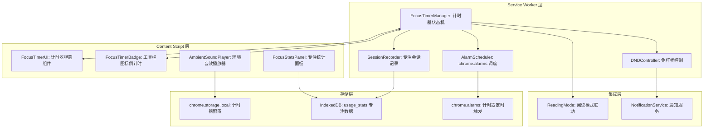
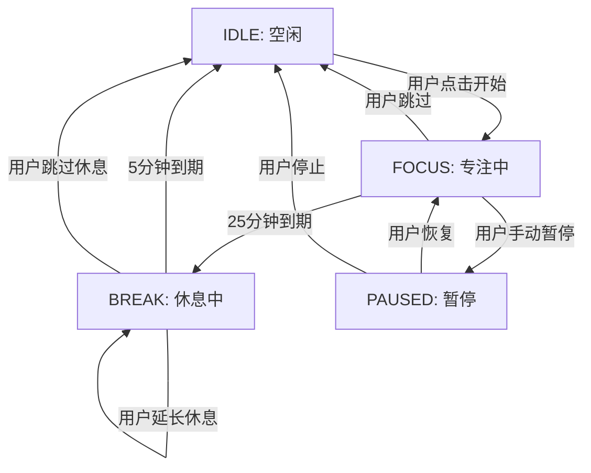

# YP-09-138: 专注计时器 — 番茄钟风格专注计时、会话追踪与免打扰模式

> 需求编号：YP-09-138 · 优先级：P2 · 人天：0.2d · 状态：需求已编写
> 依赖：YP-09-102（阅读模式与专注模式）

## 背景

### 问题陈述

用户在浏览器中工作时容易分心，缺乏结构化的专注时间管理工具。YiPet 作为浏览器伴侣，天然适合提供专注计时功能。当前存在以下问题：

1. **无专注时间管理**：用户无法在浏览器中设定专注时段，容易在社交网络和娱乐内容中分心
2. **缺乏工作节奏感**：没有番茄钟式的工作/休息循环，用户要么过长时间工作，要么频繁中断
3. **专注数据不可追踪**：用户无法了解自己的专注时长分布和趋势
4. **无免打扰保护**：专注期间浏览器通知仍会弹出，打断工作流
5. **缺乏环境辅助**：没有白噪音或环境音效帮助进入专注状态
6. **与阅读模式割裂**：阅读模式（YP-09-102）与专注计时是两个独立功能，无法联动

**核心矛盾**：浏览器扩展的功能边界有限，需要在 Content Script 中实现一个完整的计时器系统，同时确保计时器在页面切换时持续运行（依赖 Service Worker）。

### 影响范围

| # | 影响 | 严重程度 | 典型场景 |
|---|------|----------|----------|
| 1 | 用户容易分心，工作效率低 | 中 | 工作时频繁切换标签页查看社交媒体 |
| 2 | 缺乏工作节奏，长时间工作不休息 | 中 | 连续编码 3 小时，效率递减 |
| 3 | 无法量化专注时间 | 低 | 不知道每天实际专注了多久 |
| 4 | 浏览器通知打断专注 | 中 | 专注期间收到企业微信消息通知 |
| 5 | 阅读模式与专注计时分离 | 低 | 阅读时想用番茄钟，需切换工具 |

### 挑战

| 挑战 | 说明 |
|------|------|
| 跨标签页计时 | Content Script 在单个标签页运行，页面切换时计时器需在 SW 中维护 |
| DND 模式实现 | Chrome 扩展无法直接控制系统通知，需通过 chrome.notifications API 限制 |
| 环境音效 | 需要音频资源，需考虑 CSP 限制和自动播放策略 |
| 与阅读模式联动 | 需在阅读模式（YP-09-102）中嵌入专注计时器入口 |
| 性能影响 | 计时器需持续运行但不影响页面性能 |

---

## 一、现状分析

### 1.1 当前专注相关功能

```
现有功能:
├── 阅读模式 (YP-09-102)
│   ├── 页面内容提取 + 纯净阅读
│   ├── 无专注计时功能
│   └── 无免打扰模式
├── 定时提醒 (YP-09-118)
│   ├── 日程提醒
│   └── 非专注计时器
└── 无环境音效、无 DND 模式、无专注统计

缺失:
├── 番茄钟计时器            # ❌ 不存在
├── 专注会话追踪            # ❌ 不存在
├── 免打扰模式              # ❌ 不存在
├── 环境音效播放            # ❌ 不存在
├── 专注统计面板            # ❌ 不存在
├── 自定义时长配置          # ❌ 不存在
└── 与阅读模式联动          # ❌ 不存在
```

### 1.2 根因矩阵

| 症状 | 根因 | 触发条件 | 频率 |
|------|------|----------|------|
| 工作中容易分心 | 无结构化专注时段 | 浏览器使用场景 | 高 |
| 长时间工作不休息 | 无休息提醒 | 沉浸式工作 | 中 |
| 专注数据无法追踪 | 无专注会话记录 | 任何使用场景 | 低 |
| 通知打断专注 | 无 DND 模式 | 专注期间 | 中 |
| 阅读时无法专注计时 | 阅读模式与计时器分离 | 使用阅读模式 | 中 |

---

## 二、设计决策

### 决策 1：计时器运行位置 — Service Worker vs Content Script vs Offscreen

| 选项 | 跨标签页 | 后台运行 | 实现复杂度 | 可靠性 |
|------|----------|----------|-----------|--------|
| Service Worker | 是 | 是（MV3 可能被终止） | 中 | 中 |
| Content Script | 否 | 否（页面关闭即停止） | 低 | 低 |
| Offscreen Document | 是 | 是 | 高 | 高 |

**选择：Service Worker 为主 + Content Script 为 UI。** Service Worker 维护计时器状态，即使页面切换也能持续运行。使用 `chrome.alarms` API 替代 `setInterval`（`setInterval` 在 SW 休眠时可能不触发）。UI 层通过 `chrome.runtime.sendMessage` 与 SW 同步状态。如果 SW 被终止，`chrome.alarms` 可在 SW 重新激活时恢复计时器。

### 决策 2：DND 模式实现 — chrome.notifications API vs 页面元素拦截 vs 两者结合

| 选项 | 系统通知 | 页面通知 | 复杂度 | 覆盖率 |
|------|----------|----------|--------|--------|
| chrome.notifications API | 仅扩展通知 | 不覆盖 | 低 | 低 |
| 页面元素拦截 | 不覆盖 | 覆盖 | 高 | 中 |
| 两者结合 | 扩展通知 | 可配合 | 中 | 中 |

**选择：chrome.notifications API + 可选的静音模式。** Chrome 扩展无法控制系统级通知或宿主页面的通知。DND 模式通过 `chrome.notifications` API 抑制扩展自身通知，同时在 Content Script 中提供"静音标签页"选项（通过 `chrome.tabs.update({ muted: true })` 静音标签页音频）。对于宿主页面通知，提供用户指引（建议在系统设置中开启专注模式）。

### 决策 3：环境音效方案 — Web Audio API vs HTML5 Audio vs 预加载音频文件

| 选项 | 体积 | 灵活性 | 兼容性 | 循环播放 |
|------|------|--------|--------|----------|
| Web Audio API 合成 | 0KB | 极高 | 良好 | 天然支持 |
| HTML5 Audio 文件 | 100-500KB | 低 | 良好 | 需手动循环 |
| 预加载音频文件 | 100-500KB | 中 | 良好 | 需手动循环 |

**选择：Web Audio API 合成 + 可选音频文件。** 白噪音/粉红噪音/棕色噪音可通过 Web Audio API 实时合成，无需任何音频文件，体积为 0。自然音效（雨声、海浪、森林）使用短音频文件循环播放，通过 `chrome.runtime.getURL` 加载扩展内资源。

### 决策 4：专注统计存储 — 复用 usage-stats vs 独立存储

| 选项 | 复用性 | 维护成本 | 数据一致性 |
|------|--------|----------|-----------|
| 复用 usage-stats (YP-09-108) | 高 | 低 | 统一统计 |
| 独立 IndexedDB store | 低 | 高 | 独立 |

**选择：复用 usage-stats。** 专注计时作为新的 metric 类型（`focus_minutes`、`break_minutes`、`focus_sessions`）加入现有统计系统，避免重复建设存储层，统计数据统一展示。

### 设计决策记录

| 决策 | 选项 A | 选项 B | 选项 C | 选择 | 理由 |
|------|--------|--------|--------|------|------|
| 计时器位置 | Service Worker | Content Script | Offscreen | **SW 为主** | 跨标签页 + chrome.alarms 可靠性 |
| DND 实现 | notifications API | 页面拦截 | 两者结合 | **API + 静音** | 扩展能力边界内最优 |
| 环境音效 | Web Audio 合成 | Audio 文件 | 预加载 | **合成 + 文件** | 0 体积合成 + 可选自然音效 |
| 统计存储 | 复用 usage-stats | 独立存储 | - | **复用** | 统一统计，避免重复 |

---

## 三、目标架构

### 3.1 专注计时器系统架构



### 3.2 计时器状态机



### 3.3 性能指标

| 指标 | 改造前 | 改造后 |
|------|--------|--------|
| 计时器精度 | N/A | 秒级（chrome.alarms 最小间隔 1 分钟，秒级由 SW setInterval 补充） |
| 状态同步延迟 | N/A | < 100ms（SW 消息往返） |
| 环境音效合成延迟 | N/A | < 10ms（Web Audio API 初始化） |
| DND 切换延迟 | N/A | < 50ms |
| 存储占用 | 0 | 音频文件 < 200KB + 统计数据 < 50KB/月 |

---

## 四、具体改动

### 4.1 计时器核心服务（Service Worker）

```typescript
// src/sw/services/focus-timer.ts (新增)

type TimerState = 'idle' | 'focus' | 'break' | 'paused';
type TimerMode = 'pomodoro' | 'custom';

interface FocusTimerConfig {
  mode: TimerMode;
  focusDuration: number;    // 专注时长（分钟）
  breakDuration: number;    // 休息时长（分钟）
  longBreakDuration: number; // 长休息时长（分钟）
  sessionsBeforeLongBreak: number; // 几个番茄钟后长休息
  autoStartBreak: boolean;  // 自动开始休息
  autoStartFocus: boolean;  // 自动开始下一轮专注
  dndEnabled: boolean;      // 免打扰模式
  soundEnabled: boolean;    // 环境音效
  soundType: 'white' | 'pink' | 'brown' | 'rain' | 'ocean' | 'forest';
  soundVolume: number;      // 音量 0-100
}

interface FocusSession {
  id: string;
  date: string;
  startTime: number;
  endTime: number;
  duration: number;         // 实际专注分钟
  type: 'focus' | 'break';
  completed: boolean;       // 是否完整完成
  interruptions: number;    // 中断次数
}

class FocusTimerManager {
  private state: TimerState = 'idle';
  private config: FocusTimerConfig = {
    mode: 'pomodoro',
    focusDuration: 25,
    breakDuration: 5,
    longBreakDuration: 15,
    sessionsBeforeLongBreak: 4,
    autoStartBreak: true,
    autoStartFocus: false,
    dndEnabled: false,
    soundEnabled: false,
    soundType: 'white',
    soundVolume: 50,
  };
  private remainingSeconds: number = 0;
  private completedSessions: number = 0;
  private currentSession: FocusSession | null = null;
  private secondInterval: ReturnType<typeof setInterval> | null = null;
  private readonly ALARM_NAME = 'focus-timer-alarm';
  private readonly SECOND_TICK_ALARM = 'focus-timer-second-tick';

  async initialize(): Promise<void> {
    const stored = await chrome.storage.local.get('focusTimerConfig');
    if (stored.focusTimerConfig) {
      this.config = { ...this.config, ...stored.focusTimerConfig };
    }
    // 监听 alarms
    chrome.alarms.onAlarm.addListener((alarm) => {
      if (alarm.name === this.ALARM_NAME) {
        this.onTimerComplete();
      }
    });
    // 监听消息
    chrome.runtime.onMessage.addListener((msg, sender, sendResponse) => {
      if (msg.type === 'FOCUS_TIMER_GET_STATE') {
        sendResponse(this.getState());
      }
      return true;
    });
  }

  async start(): Promise<void> {
    if (this.state === 'focus' || this.state === 'break') return;
    this.state = 'focus';
    this.remainingSeconds = this.config.focusDuration * 60;
    this.currentSession = {
      id: this.generateId(),
      date: new Date().toISOString().slice(0, 10),
      startTime: Date.now(),
      endTime: 0,
      duration: 0,
      type: 'focus',
      completed: false,
      interruptions: 0,
    };
    await this.setAlarm();
    this.startSecondTick();
    this.broadcastState();
    if (this.config.dndEnabled) {
      await this.enableDND();
    }
  }

  async pause(): Promise<void> {
    if (this.state !== 'focus' && this.state !== 'break') return;
    this.state = 'paused';
    await this.clearAlarm();
    this.stopSecondTick();
    this.broadcastState();
  }

  async resume(): Promise<void> {
    if (this.state !== 'paused') return;
    this.state = this.currentSession?.type === 'focus' ? 'focus' : 'break';
    await this.setAlarm();
    this.startSecondTick();
    this.broadcastState();
  }

  async stop(): Promise<void> {
    if (this.currentSession) {
      this.currentSession.endTime = Date.now();
      this.currentSession.duration = Math.round(
        (this.config.focusDuration * 60 - this.remainingSeconds) / 60
      );
      this.currentSession.completed = false;
      await this.recordSession(this.currentSession);
    }
    this.state = 'idle';
    this.remainingSeconds = 0;
    this.currentSession = null;
    await this.clearAlarm();
    this.stopSecondTick();
    if (this.config.dndEnabled) {
      await this.disableDND();
    }
    this.broadcastState();
  }

  async skip(): Promise<void> {
    // 跳过当前阶段
    if (this.state === 'focus') {
      this.currentSession!.completed = true;
      this.currentSession!.endTime = Date.now();
      this.currentSession!.duration = this.config.focusDuration;
      await this.recordSession(this.currentSession!);
      this.completedSessions++;
      await this.startBreak();
    } else if (this.state === 'break') {
      this.currentSession!.endTime = Date.now();
      await this.recordSession(this.currentSession!);
      this.state = 'idle';
      this.broadcastState();
    }
  }

  private async startBreak(): Promise<void> {
    this.state = 'break';
    const isLongBreak = this.completedSessions > 0
      && this.completedSessions % this.config.sessionsBeforeLongBreak === 0;
    this.remainingSeconds = isLongBreak
      ? this.config.longBreakDuration * 60
      : this.config.breakDuration * 60;
    this.currentSession = {
      id: this.generateId(),
      date: new Date().toISOString().slice(0, 10),
      startTime: Date.now(),
      endTime: 0,
      duration: 0,
      type: 'break',
      completed: false,
      interruptions: 0,
    };
    await this.setAlarm();
    this.startSecondTick();
    this.broadcastState();
  }

  private async onTimerComplete(): Promise<void> {
    this.stopSecondTick();
    if (this.state === 'focus') {
      this.currentSession!.completed = true;
      this.currentSession!.endTime = Date.now();
      this.currentSession!.duration = this.config.focusDuration;
      await this.recordSession(this.currentSession!);
      this.completedSessions++;
      // 通知用户
      chrome.notifications.create({
        type: 'basic',
        iconUrl: 'icons/icon128.png',
        title: '番茄钟完成',
        message: '专注时间结束，休息一下吧',
      });
      if (this.config.autoStartBreak) {
        await this.startBreak();
      } else {
        this.state = 'idle';
        this.broadcastState();
      }
    } else if (this.state === 'break') {
      this.currentSession!.endTime = Date.now();
      await this.recordSession(this.currentSession!);
      chrome.notifications.create({
        type: 'basic',
        iconUrl: 'icons/icon128.png',
        title: '休息结束',
        message: '休息时间结束，开始新的专注吧',
      });
      if (this.config.autoStartFocus) {
        await this.start();
      } else {
        this.state = 'idle';
        this.broadcastState();
      }
    }
  }

  private async setAlarm(): Promise<void> {
    await chrome.alarms.create(this.ALARM_NAME, {
      delayInMinutes: this.remainingSeconds / 60,
    });
  }

  private async clearAlarm(): Promise<void> {
    await chrome.alarms.clear(this.ALARM_NAME);
  }

  private startSecondTick(): void {
    this.stopSecondTick();
    this.secondInterval = setInterval(() => {
      if (this.remainingSeconds > 0) {
        this.remainingSeconds--;
        this.broadcastTick();
      }
    }, 1000);
  }

  private stopSecondTick(): void {
    if (this.secondInterval) {
      clearInterval(this.secondInterval);
      this.secondInterval = null;
    }
  }

  private async enableDND(): Promise<void> {
    // 静音所有标签页
    const tabs = await chrome.tabs.query({});
    for (const tab of tabs) {
      if (tab.id) {
        chrome.tabs.update(tab.id, { muted: true });
      }
    }
    await chrome.storage.local.set({ dndEnabled: true });
  }

  private async disableDND(): Promise<void> {
    const tabs = await chrome.tabs.query({});
    for (const tab of tabs) {
      if (tab.id) {
        chrome.tabs.update(tab.id, { muted: false });
      }
    }
    await chrome.storage.local.set({ dndEnabled: false });
  }

  private async recordSession(session: FocusSession): Promise<void> {
    // 通过 usageStats 记录专注数据
    // 发送消息到 Content Script 记录
    const tabs = await chrome.tabs.query({ active: true });
    for (const tab of tabs) {
      if (tab.id) {
        chrome.tabs.sendMessage(tab.id, {
          type: 'FOCUS_SESSION_COMPLETE',
          session,
        });
      }
    }
  }

  private broadcastState(): void {
    chrome.runtime.sendMessage({
      type: 'FOCUS_TIMER_STATE_CHANGED',
      state: this.getState(),
    }).catch(() => {});
  }

  private broadcastTick(): void {
    chrome.runtime.sendMessage({
      type: 'FOCUS_TIMER_TICK',
      remainingSeconds: this.remainingSeconds,
      state: this.state,
    }).catch(() => {});
  }

  getState() {
    return {
      state: this.state,
      remainingSeconds: this.remainingSeconds,
      completedSessions: this.completedSessions,
      currentSession: this.currentSession,
      config: this.config,
    };
  }

  private generateId(): string {
    return `focus_${Date.now()}_${Math.random().toString(36).slice(2, 8)}`;
  }
}

export const focusTimer = new FocusTimerManager();
```

### 4.2 环境音效播放器（Content Script）

```typescript
// src/content/services/ambient-sound.ts (新增)

type SoundType = 'white' | 'pink' | 'brown' | 'rain' | 'ocean' | 'forest';

class AmbientSoundPlayer {
  private audioContext: AudioContext | null = null;
  private sourceNode: AudioBufferSourceNode | null = null;
  private gainNode: GainNode | null = null;
  private isPlaying: boolean = false;
  private currentType: SoundType = 'white';
  private volume: number = 0.5;

  async play(type: SoundType, volume: number = 0.5): Promise<void> {
    this.stop();
    this.currentType = type;
    this.volume = volume / 100;

    this.audioContext = new AudioContext();
    this.gainNode = this.audioContext.createGain();
    this.gainNode.gain.value = this.volume;
    this.gainNode.connect(this.audioContext.destination);

    if (['white', 'pink', 'brown'].includes(type)) {
      this.playNoise(type);
    } else {
      await this.playNaturalSound(type);
    }
    this.isPlaying = true;
  }

  private playNoise(type: 'white' | 'pink' | 'brown'): void {
    const bufferSize = this.audioContext!.sampleRate * 2;
    const buffer = this.audioContext!.createBuffer(1, bufferSize, this.audioContext!.sampleRate);
    const data = buffer.getChannelData(0);

    // 白噪音：均匀随机分布
    // 粉红噪音：功率谱密度与频率成反比
    // 棕色噪音：功率谱密度与频率平方成反比
    let b0 = 0, b1 = 0, b2 = 0, b3 = 0, b4 = 0, b5 = 0, b6 = 0;
    for (let i = 0; i < bufferSize; i++) {
      const white = Math.random() * 2 - 1;
      if (type === 'white') {
        data[i] = white * 0.3;
      } else if (type === 'pink') {
        b0 = 0.99886 * b0 + white * 0.0555179;
        b1 = 0.99332 * b1 + white * 0.0750759;
        b2 = 0.96900 * b2 + white * 0.1538520;
        b3 = 0.86650 * b3 + white * 0.3104856;
        b4 = 0.55000 * b4 + white * 0.5329522;
        b5 = -0.7616 * b5 - white * 0.0168980;
        data[i] = (b0 + b1 + b2 + b3 + b4 + b5 + b6 + white * 0.5362) * 0.11;
        b6 = white * 0.115926;
      } else {
        data[i] = (data[i - 1] || 0) + white * 0.02;
        data[i] = Math.max(-1, Math.min(1, data[i] * 0.5));
      }
    }

    this.sourceNode = this.audioContext!.createBufferSource();
    this.sourceNode.buffer = buffer;
    this.sourceNode.loop = true;
    this.sourceNode.connect(this.gainNode!);
    this.sourceNode.start();
  }

  private async playNaturalSound(type: 'rain' | 'ocean' | 'forest'): Promise<void> {
    const soundFiles: Record<string, string> = {
      rain: 'sounds/rain.mp3',
      ocean: 'sounds/ocean.mp3',
      forest: 'sounds/forest.mp3',
    };
    const url = chrome.runtime.getURL(soundFiles[type]);
    const response = await fetch(url);
    const arrayBuffer = await response.arrayBuffer();
    const audioBuffer = await this.audioContext!.decodeAudioData(arrayBuffer);

    this.sourceNode = this.audioContext!.createBufferSource();
    this.sourceNode.buffer = audioBuffer;
    this.sourceNode.loop = true;
    this.sourceNode.connect(this.gainNode!);
    this.sourceNode.start();
  }

  setVolume(volume: number): void {
    this.volume = volume / 100;
    if (this.gainNode) {
      this.gainNode.gain.value = this.volume;
    }
  }

  stop(): void {
    if (this.sourceNode) {
      try { this.sourceNode.stop(); } catch {}
      this.sourceNode.disconnect();
      this.sourceNode = null;
    }
    if (this.audioContext) {
      this.audioContext.close();
      this.audioContext = null;
    }
    this.isPlaying = false;
  }

  getIsPlaying(): boolean {
    return this.isPlaying;
  }
}

export const ambientSound = new AmbientSoundPlayer();
```

### 4.3 专注计时器 UI 组件

```vue
<!-- src/content/components/FocusTimer.vue (新增) -->

<script setup lang="ts">
import { ref, computed, onMounted, onUnmounted } from 'vue';
import { ambientSound } from '../services/ambient-sound';

type TimerState = 'idle' | 'focus' | 'break' | 'paused';

interface TimerStateData {
  state: TimerState;
  remainingSeconds: number;
  completedSessions: number;
  currentSession: { type: string; date: string } | null;
  config: Record<string, unknown>;
}

const timerState = ref<TimerStateData>({
  state: 'idle',
  remainingSeconds: 0,
  completedSessions: 0,
  currentSession: null,
  config: {},
});

const formattedTime = computed(() => {
  const mins = Math.floor(timerState.value.remainingSeconds / 60);
  const secs = timerState.value.remainingSeconds % 60;
  return `${String(mins).padStart(2, '0')}:${String(secs).padStart(2, '0')}`;
});

const progressPercent = computed(() => {
  const total = timerState.value.state === 'focus'
    ? (timerState.value.config.focusDuration as number || 25) * 60
    : (timerState.value.config.breakDuration as number || 5) * 60;
  return ((total - timerState.value.remainingSeconds) / total) * 100;
});

const stateLabel = computed(() => {
  const labels: Record<TimerState, string> = {
    idle: '准备开始',
    focus: '专注中',
    break: '休息中',
    paused: '已暂停',
  };
  return labels[timerState.value.state];
});

function handleStart() { chrome.runtime.sendMessage({ type: 'FOCUS_TIMER_START' }); }
function handlePause() { chrome.runtime.sendMessage({ type: 'FOCUS_TIMER_PAUSE' }); }
function handleResume() { chrome.runtime.sendMessage({ type: 'FOCUS_TIMER_RESUME' }); }
function handleStop() { chrome.runtime.sendMessage({ type: 'FOCUS_TIMER_STOP' }); }
function handleSkip() { chrome.runtime.sendMessage({ type: 'FOCUS_TIMER_SKIP' }); }

function handleSoundToggle() {
  if (ambientSound.getIsPlaying()) {
    ambientSound.stop();
  } else {
    ambientSound.play('white', timerState.value.config.soundVolume as number || 50);
  }
}

function requestState() {
  chrome.runtime.sendMessage({ type: 'FOCUS_TIMER_GET_STATE' }, (response) => {
    if (response) timerState.value = response;
  });
}

onMounted(() => {
  requestState();
  const listener = (msg: { type: string; state?: TimerStateData }) => {
    if (msg.type === 'FOCUS_TIMER_STATE_CHANGED' && msg.state) {
      timerState.value = msg.state;
    }
  };
  chrome.runtime.onMessage.addListener(listener);
  onUnmounted(() => chrome.runtime.onMessage.removeListener(listener));
});
</script>

<template>
  <div class="focus-timer" :class="`state-${timerState.state}`">
    <div class="timer-ring">
      <svg viewBox="0 0 120 120" class="timer-svg">
        <circle cx="60" cy="60" r="54" class="timer-ring-bg" />
        <circle cx="60" cy="60" r="54" class="timer-ring-progress"
          :stroke-dasharray="`${2 * Math.PI * 54}`"
          :stroke-dashoffset="`${2 * Math.PI * 54 * (1 - progressPercent / 100)}`" />
      </svg>
      <div class="timer-center">
        <div class="timer-time">{{ formattedTime }}</div>
        <div class="timer-label">{{ stateLabel }}</div>
      </div>
    </div>

    <div class="timer-controls">
      <button v-if="timerState.state === 'idle'" @click="handleStart" class="btn-start">
        开始专注
      </button>
      <template v-if="timerState.state === 'focus' || timerState.state === 'break'">
        <button @click="handlePause" class="btn-pause">暂停</button>
        <button @click="handleSkip" class="btn-skip">跳过</button>
        <button @click="handleStop" class="btn-stop">结束</button>
      </template>
      <button v-if="timerState.state === 'paused'" @click="handleResume" class="btn-resume">
        继续
      </button>
      <button v-if="timerState.state === 'paused'" @click="handleStop" class="btn-stop">
        结束
      </button>
    </div>

    <div class="timer-session-count">
      已完成 {{ timerState.completedSessions }} 个番茄钟
    </div>

    <div class="timer-extras">
      <button class="btn-sound" @click="handleSoundToggle">
        环境音效
      </button>
    </div>
  </div>
</template>
```

### 4.4 文件变更清单

| 文件 | 操作 | 说明 |
|------|------|------|
| `src/sw/services/focus-timer.ts` | 新增 | Service Worker 计时器核心服务 |
| `src/content/services/ambient-sound.ts` | 新增 | 环境音效播放器（Web Audio API） |
| `src/content/components/FocusTimer.vue` | 新增 | 专注计时器 UI 组件 |
| `src/content/components/FocusTimerSettings.vue` | 新增 | 计时器设置面板 |
| `src/content/components/FocusStats.vue` | 新增 | 专注统计面板 |
| `src/content/types/focus-timer.ts` | 新增 | 计时器相关类型定义 |
| `src/content/components/ReadingMode.vue` | 修改 | 嵌入专注计时器入口 |
| `src/content/components/Popup.vue` | 修改 | 添加专注计时器快捷入口 |
| `sounds/rain.mp3` | 新增 | 雨声环境音效 |
| `sounds/ocean.mp3` | 新增 | 海浪环境音效 |
| `sounds/forest.mp3` | 新增 | 森林环境音效 |

---

## 五、实施步骤

| 步骤 | 操作 | 路径 | 验证 | 人天 |
|------|------|------|------|------|
| 1 | 实现计时器状态机 | `focus-timer.ts` | 状态转换正确，边界条件覆盖 | 0.03 |
| 2 | 集成 chrome.alarms | `focus-timer.ts` | 专注结束触发 alarm，SW 休眠后恢复 | 0.03 |
| 3 | 实现 SW-Content Script 通信 | `focus-timer.ts` | 状态同步延迟 < 100ms | 0.02 |
| 4 | 实现环境音效播放器 | `ambient-sound.ts` | 白/粉/棕噪音合成正常，自然音效循环播放 | 0.03 |
| 5 | 实现计时器 UI 组件 | `FocusTimer.vue` | 环形进度条渲染，按钮交互正确 | 0.03 |
| 6 | 实现 DND 模式 | `focus-timer.ts` | 标签页静音，扩展通知抑制 | 0.02 |
| 7 | 实现专注统计面板 | `FocusStats.vue` | 日/周/月专注数据展示 | 0.02 |
| 8 | 与阅读模式联动 | `ReadingMode.vue` | 阅读模式中可启动专注计时 | 0.02 |

**总人天：0.2d**

---

## 六、测试规格

### 场景 1：标准番茄钟流程

**GIVEN** 用户打开专注计时器，默认配置为 25 分钟专注 + 5 分钟休息
**WHEN** 用户点击"开始专注"
**THEN** 计时器开始 25 分钟倒计时，状态为"专注中"
**AND** 25 分钟后自动切换到 5 分钟休息，状态为"休息中"
**AND** 5 分钟后计时器回到空闲状态
**AND** 一个专注会话被记录，包含完整的开始和结束时间

### 场景 2：暂停和恢复

**GIVEN** 计时器正在专注中，已过去 10 分钟
**WHEN** 用户点击"暂停"
**THEN** 计时器暂停，剩余时间保持在 15 分钟
**AND** 用户点击"继续"
**THEN** 计时器从 15 分钟继续倒计时

### 场景 3：环境音效播放

**GIVEN** 用户选择了白噪音环境音效，音量 50%
**WHEN** 用户点击"环境音效"按钮
**THEN** 通过 Web Audio API 合成白噪音并播放
**AND** 音量为 50%
**AND** 用户切换到粉红噪音
**THEN** 白噪音停止，粉红噪音开始播放
**AND** 用户再次点击关闭环境音效，播放停止

### 场景 4：免打扰模式

**GIVEN** 用户在设置中启用了免打扰模式
**WHEN** 用户开始专注计时
**THEN** 所有标签页音频被静音
**AND** 专注结束时标签页音频恢复
**AND** 用户手动停止计时
**THEN** 标签页音频立即恢复

### 场景 5：跨标签页计时

**GIVEN** 用户在标签页 A 开始了 25 分钟专注计时
**WHEN** 用户切换到标签页 B
**THEN** 标签页 B 的计时器 UI 显示正确的剩余时间
**AND** 计时器在 Service Worker 中持续运行
**AND** 25 分钟后计时器正确触发完成事件

### 场景 6：专注统计

**GIVEN** 用户完成了 3 个番茄钟（每个 25 分钟）和 2 次休息（每个 5 分钟）
**WHEN** 用户打开专注统计面板
**THEN** 显示今日专注总时长 75 分钟，休息总时长 10 分钟
**AND** 显示本周专注趋势图
**AND** 显示完成的番茄钟总数 3

---

## 七、风险与缓解

| 风险 | 概率 | 影响 | 缓解措施 |
|------|------|------|----------|
| SW 被 MV3 终止导致计时器丢失 | 中 | 高 | 使用 chrome.alarms 持久化计时终点，SW 恢复后重新计算剩余时间 |
| 环境音效自动播放被浏览器阻止 | 中 | 低 | 在用户首次点击时初始化 AudioContext，遵循自动播放策略 |
| 自然音效文件体积过大 | 中 | 中 | 使用短循环音频（10-30 秒），压缩至 128kbps，总计 < 200KB |
| DND 模式无法抑制系统通知 | 高 | 低 | 明确告知用户 DND 仅能抑制扩展通知和标签页音频，建议配合系统专注模式 |
| chrome.alarms 最小间隔 1 分钟 | 高 | 中 | 秒级精度由 SW 的 setInterval 维护，alarm 仅作为兜底恢复机制 |

---

## 八、回滚策略

| 场景 | 回滚操作 | 影响 |
|------|----------|------|
| 计时器导致 SW 频繁唤醒 | 增大 chrome.alarms 间隔，减少消息广播频率 | 倒计时精度降低 |
| 环境音效播放失败 | 降级为仅静音模式，移除音效功能 | 失去环境音效辅助 |
| 音频文件体积过大 | 仅保留 Web Audio 合成噪音，删除自然音效文件 | 失去自然音效选项 |
| DND 导致用户漏接重要通知 | 添加白名单标签页（不静音特定标签页） | 需用户手动配置 |

---

## 九、设计决策记录

### D-01：计时器运行位置

- **问题**：计时器逻辑应运行在 Service Worker 还是 Content Script
- **选项**：Service Worker、Content Script、Offscreen Document
- **选择**：Service Worker 为主 + Content Script 为 UI
- **理由**：Content Script 随页面生命周期，页面关闭即停止；Offscreen Document 复杂度高；SW 可跨标签页，chrome.alarms 提供持久化兜底

### D-02：秒级精度实现

- **问题**：chrome.alarms 最小间隔为 1 分钟，如何实现秒级倒计时
- **选项**：仅用 alarms（分钟级精度）、alarms + setInterval（秒级）、仅用 setInterval
- **选择**：alarms + setInterval 双轨制
- **理由**：setInterval 在 SW 休眠时停止，alarms 作为兜底；SW 恢复时根据 alarm 触发时间反算剩余秒数

### D-03：环境音效生成方式

- **问题**：环境音效应使用预录音频文件还是实时合成
- **选项**：纯音频文件、纯 Web Audio 合成、合成 + 文件混合
- **选择**：合成 + 文件混合
- **理由**：白/粉/棕噪音可零体积合成；自然音效（雨声等）无法合成，使用短循环音频文件

### D-04：DND 实现范围

- **问题**：免打扰模式应覆盖哪些通知渠道
- **选项**：仅扩展通知、扩展通知 + 标签页静音、扩展通知 + 标签页静音 + 系统通知
- **选择**：扩展通知 + 标签页静音
- **理由**：Chrome 扩展 API 无法操作系统级通知；标签页静音是可控且有效的减少干扰手段

---

## 十、可观测性

### 指标

| 指标 | 类型 | 说明 |
|------|------|------|
| `yipet.focus_timer.state` | Gauge | 当前计时器状态 (0=idle,1=focus,2=break,3=paused) |
| `yipet.focus_timer.remaining_seconds` | Gauge | 剩余秒数 |
| `yipet.focus_timer.completed_sessions` | Counter | 已完成的番茄钟数 |
| `yipet.focus_timer.interruptions` | Counter | 中断次数 |
| `yipet.ambient_sound.playing` | Gauge | 音效播放状态 (0/1) |
| `yipet.ambient_sound.type` | Gauge | 当前音效类型 |
| `yipet.dnd.active` | Gauge | 免打扰模式状态 (0/1) |

### 告警

| 告警 | 条件 | 级别 |
|------|------|------|
| 计时器状态异常 | 状态在 focus/break 但剩余秒数为 0 超过 5 秒 | ERROR |
| SW 消息超时 | SW 状态同步请求超时 > 500ms 连续 3 次 | WARNING |
| AudioContext 创建失败 | 用户点击播放但 AudioContext 状态为 closed | WARNING |

---

## 十一、代码审查检查清单

- [ ] 计时器状态机完整，所有状态转换有定义，无非法状态转换
- [ ] chrome.alarms 正确创建和清除，alarm name 唯一不冲突
- [ ] setInterval 在组件销毁时正确清除，无内存泄漏
- [ ] SW-Content Script 消息定义了完整的类型，有超时处理
- [ ] 环境音效 AudioContext 在停止时正确关闭，释放资源
- [ ] 白/粉/棕色噪音算法正确，输出音量在 [-1, 1] 范围内
- [ ] 自然音效文件使用 chrome.runtime.getURL 加载，遵循 CSP
- [ ] DND 模式切换时记录原始静音状态，恢复时还原而非全部取消静音
- [ ] 专注会话数据正确记录到 IndexedDB，包含完整的开始/结束时间
- [ ] 计时器 UI 环形进度条动画流畅，使用 requestAnimationFrame
- [ ] 配置变更通过 chrome.storage.local 持久化，SW 和 Content Script 同步
- [ ] 阅读模式联动入口正确，不破坏阅读模式现有功能

---

## 回归问题预测

| # | 预测问题 | 原因 | 验证方法 |
|---|---------|------|---------|
| 1 | 用户在专注计时期间关闭所有标签页，Service Worker 中的 setInterval 在 30 秒后被浏览器终止，导致秒级倒计时停止，但 chrome.alarms 仍会在 25 分钟后触发，用户重新打开标签页时看到的时间与实际不符 | MV3 规定 SW 在无活动 30 秒后休眠，setInterval 随之停止；chrome.alarms 的触发时间是基于挂钟时间的，所以 SW 恢复时 alarm 已经触发，但 Content Script 的倒计时 UI 显示的是旧值 | 在 SW 的 `onAlarm` 处理中计算实际剩余时间（alarm 计划时间 - 当前时间），如果为负数则表示已完成；在 Content Script 中监听 `FOCUS_TIMER_STATE_CHANGED` 消息，始终以 SW 状态为准 |
| 2 | 环境音效的 AudioContext 在用户多次切换音效类型时未正确关闭旧 context，导致浏览器限制 AudioContext 数量（Chrome 限制约 6 个），超过限制后新的 AudioContext 进入 suspended 状态，音效无声音 | 每次 `play()` 创建新的 AudioContext 但 `stop()` 时可能因异步问题未及时关闭 | 在 `play()` 开始时先调用 `stop()` 关闭旧 context；`stop()` 中先 `close()` 再置 null；添加 AudioContext 状态检查，suspended 时自动 resume |
| 3 | DND 模式恢复时，`chrome.tabs.update({ muted: false })` 将所有标签页取消静音，包括用户手动静音的标签页，导致用户原本静音的标签页（如自动播放视频的页面）恢复声音 | `chrome.tabs.update` 无法区分用户手动静音还是 DND 模式静音，`muted` 属性只有 true/false | 在 DND 启用时记录每个标签页的原始 `mutedInfo.muted` 状态，恢复时仅恢复 DND 静音的标签页，保持用户手动静音的标签页不变 |
| 4 | 专注计时器 UI 在 Content Script 的 Shadow DOM 中渲染，环形进度条 SVG 的 `stroke-dashoffset` 计算依赖 JavaScript 动态更新，但在低性能设备上每秒更新一次导致页面卡顿 | SVG 属性更新触发样式重计算和重绘，在 Shadow DOM 中重绘可能影响宿主页面 | 使用 CSS `will-change: stroke-dashoffset` 提示浏览器优化；每秒更新限制为仅在秒数变化时更新（而非 requestAnimationFrame 60fps） |
| 5 | 用户在不同标签页中多次打开计时器 UI，每个 Content Script 实例都向 SW 发送 `FOCUS_TIMER_GET_STATE` 请求，SW 的消息处理可能导致重复响应和状态不一致 | 多个 Content Script 同时请求状态，SW 的 `sendResponse` 被多次调用，如果 SW 在两次响应之间状态变化，后请求的标签页可能收到过时状态 | SW 使用 `chrome.runtime.sendMessage` 广播状态变更，而非逐个响应请求；Content Script 端缓存状态，仅在收到广播时更新，减少轮询请求 |
| 6 | 自然音效文件（rain.mp3 等）通过 `fetch(url)` 加载到 ArrayBuffer 再解码，但 `decodeAudioData` 是异步操作，在用户快速切换音效类型时，前一个 `decodeAudioData` 的回调可能在切换后执行，导致播放错误的音效 | `decodeAudioData` 的 Promise 回调在 fetch 和 decode 完成后执行，如果用户在这期间切换了音效类型，回调中的 `sourceNode` 连接的是过时的 GainNode | 在 `decodeAudioData` 回调中检查当前 `currentType` 是否匹配，不匹配则忽略；使用 AbortController 取消未完成的 fetch 请求 |

---

## 性能分析

### 各操作耗时

| 阶段 | 预估耗时 | 说明 |
|------|----------|------|
| 计时器状态变更 | < 1ms | 内存操作 + chrome.storage.local 异步写入 |
| SW-Content Script 消息往返 | 5-50ms | 取决于 SW 是否活跃 |
| 环境音效启动（合成） | 5-10ms | Web Audio API 初始化 + 噪声生成 |
| 环境音效启动（自然） | 100-200ms | fetch + decodeAudioData |
| 环形进度条更新 | < 1ms | SVG stroke-dashoffset 更新 |
| DND 切换 | 10-50ms | chrome.tabs.query 批量更新 |
| 专注统计加载 | 20-50ms | IndexedDB 读取 |

### 内存影响

| 项目 | 体积 | 说明 |
|------|------|------|
| focus-timer.ts (SW) | ~3KB | 状态机 + alarm 管理 |
| ambient-sound.ts | ~2KB | Web Audio API 封装 |
| FocusTimer.vue | ~5KB | UI 组件 |
| 环境音效文件 | < 200KB | 3 个短循环音频，128kbps |
| 计时器运行时内存 | < 500KB | AudioContext 缓冲区 |

### 对 Content Script 注入速度的影响

| 阶段 | 影响 | 说明 |
|------|------|------|
| 初始注入 | +2KB | ambient-sound 模块 |
| 计时器 UI 渲染 | 0 | 仅在用户打开时渲染 |
| 环境音效初始化 | 0 | 仅在用户点击播放时初始化 |
| 音频文件加载 | 0 | 延迟加载，不阻塞注入 |