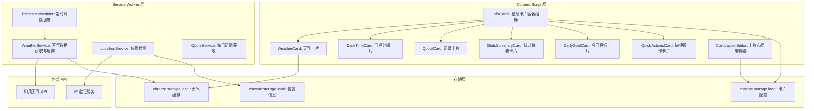
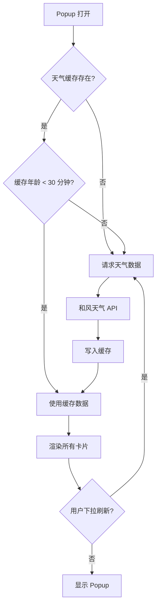

# YP-09-139: 天气与信息卡片 — 位置感知天气显示、可配置信息卡片与布局自定义

> 需求编号：YP-09-139 · 优先级：P2 · 人天：0.2d · 状态：需求已编写
> 依赖：YP-09-15（Popup 皮肤中心）

## 背景

### 问题陈述

YiPet 的 Popup 窗口当前仅显示宠物互动和聊天入口，缺乏实用信息展示。用户每次打开 Popup 时希望快速获取天气、时间、励志语录等实用信息，而不是去其他网站或扩展查看。当前存在以下问题：

1. **信息获取路径长**：用户需要切换到天气网站或系统状态栏才能查看天气
2. **Popup 空间利用率低**：Popup 仅有宠物动画，大量空间浪费
3. **缺乏个性化**：用户无法选择在 Popup 中显示哪些信息
4. **无位置感知**：天气需要手动输入城市，无法自动定位
5. **信息刷新不及时**：天气数据过时，用户看到的是几小时前的信息
6. **卡片布局不灵活**：信息卡片固定排列，无法自定义顺序和尺寸

**核心矛盾**：Popup 空间有限（MV3 要求弹窗 < 800x600），需要在有限空间内展示最多样化的信息，同时保持简洁优雅。

### 影响范围

| # | 影响 | 严重程度 | 典型场景 |
|---|------|----------|----------|
| 1 | 获取天气需要切换标签页 | 低 | 出门前想快速查看天气 |
| 2 | Popup 信息密度低 | 低 | 打开 Popup 只看到宠物，无实用信息 |
| 3 | 无法自定义信息卡片 | 低 | 用户只关心天气和时间，但无法隐藏其他 |
| 4 | 天气数据过时 | 低 | 显示的是 3 小时前的天气，实际已下雨 |

### 挑战

| 挑战 | 说明 |
|------|------|
| 天气 API 来源 | 需要免费、可靠、支持中文城市的天气 API |
| 位置隐私 | 获取用户位置需要明确授权，不能静默获取 |
| GeoIP 降级 | 用户拒绝位置权限时，需要 IP 定位降级方案 |
| 数据刷新 | 在 Popup 生命周期间如何刷新数据（Popup 关闭后状态丢失） |
| 布局适配 | 不同卡片尺寸不同，需要灵活的网格布局 |
| CSP 限制 | Popup 的 CSP 可能限制外部 API 请求 |

---

## 一、现状分析

### 1.1 当前 Popup 信息展示现状

```
现有 Popup 内容:
├── 宠物动画区域（主要空间）
├── 宠物状态指示器
├── 聊天入口按钮
├── 设置按钮
└── 无任何信息卡片

缺失:
├── 天气信息卡片            # ❌ 不存在
├── 日期时间卡片            # ❌ 不存在
├── 励志语录卡片            # ❌ 不存在
├── 使用统计摘要卡片        # ❌ 不存在
├── 卡片布局自定义          # ❌ 不存在
├── 位置自动检测            # ❌ 不存在
└── 数据刷新机制            # ❌ 不存在
```

### 1.2 根因矩阵

| 症状 | 根因 | 触发条件 | 频率 |
|------|------|----------|------|
| Popup 信息密度低 | 未设计信息卡片功能 | 每次打开 Popup | 高 |
| 需要切换查看天气 | 无天气集成 | 出门前/天气变化时 | 中 |
| 天气数据过时 | 无定时刷新机制 | 长时间未刷新 | 中 |
| 无法个性化 | 无卡片配置系统 | 用户偏好不同 | 低 |
| 位置不准确 | 无位置检测 | 旅行/移动时 | 低 |

---

## 二、设计决策

### 决策 1：天气 API 选择 — OpenWeatherMap vs 和风天气 vs Visual Crossing

| 选项 | 免费额度 | 中文支持 | 位置精度 | 数据丰富度 |
|------|----------|----------|----------|-----------|
| OpenWeatherMap | 1000 次/天 | 需手动配置 | 城市级 | 高 |
| 和风天气 | 1000 次/天 | 原生支持 | 区县级 | 高 |
| Visual Crossing | 1000 次/天 | 不支持 | 地址级 | 中 |

**选择：和风天气（QWeather）API。** 原生中文支持，区县级精度覆盖中国城市，免费额度 1000 次/天满足个人使用。API 返回结构化 JSON，包含当前天气 + 3 天预报 + 空气质量。需在 Service Worker 中缓存天气数据，减少 API 调用次数。

### 决策 2：位置获取方式 — 浏览器 Geolocation API vs IP 定位 vs 手动输入

| 选项 | 精度 | 用户授权 | 离线可用 | 隐私 |
|------|------|----------|----------|------|
| Geolocation API | GPS 级 | 需要弹窗授权 | 否 | 需授权 |
| IP 定位 | 城市级 | 不需要 | 是 | 较好 |
| 手动输入 | 城市级 | 不需要 | 是 | 最好 |

**选择：IP 定位为默认 + Geolocation API 为可选 + 手动输入为兜底。** 大多数用户只需要城市级天气，IP 定位无需授权即可满足需求。对精度要求高的用户可手动授权 Geolocation API。手动输入城市作为最终兜底。位置信息仅存储在本地 chrome.storage.local，不上传。

### 决策 3：信息卡片架构 — 固定卡片 vs 可配置卡片 vs 插件化卡片

| 选项 | 灵活性 | 实现复杂度 | 扩展性 |
|------|--------|-----------|--------|
| 固定卡片（4 种） | 低 | 低 | 低 |
| 可配置卡片（拖拽排序） | 中 | 中 | 中 |
| 插件化卡片（动态注册） | 高 | 高 | 高 |

**选择：可配置卡片（拖拽排序 + 显示/隐藏 + 尺寸选择）。** 插件化架构过度设计（0.2d 无法完成），固定卡片缺乏灵活性。可配置卡片提供 6 种卡片类型（天气、日期时间、语录、统计摘要、今日目标、快捷操作），用户可拖拽排序、显示/隐藏、选择卡片尺寸（小/中/大）。

### 决策 4：数据刷新策略 — 定时刷新 vs 按需刷新 vs 两者

| 选项 | 数据新鲜度 | API 调用量 | 用户体验 |
|------|-----------|-----------|----------|
| 定时刷新（每 30 分钟） | 高 | 高 | 好 |
| 按需刷新（打开 Popup 时） | 中 | 低 | 中 |
| 两者结合 | 最高 | 中 | 最好 |

**选择：两者结合。** Service Worker 每 30 分钟通过 chrome.alarms 定时刷新天气数据并缓存。Popup 打开时检查缓存年龄，超过 30 分钟则主动刷新。用户可手动下拉刷新所有卡片。

### 设计决策记录

| 决策 | 选项 A | 选项 B | 选项 C | 选择 | 理由 |
|------|--------|--------|--------|------|------|
| 天气 API | OpenWeatherMap | 和风天气 | Visual Crossing | **和风天气** | 原生中文 + 区县级精度 |
| 位置获取 | Geolocation | IP 定位 | 手动输入 | **IP 优先** | 无需授权，城市级精度足够 |
| 卡片架构 | 固定卡片 | 可配置卡片 | 插件化 | **可配置** | 灵活性与复杂度平衡 |
| 刷新策略 | 定时刷新 | 按需刷新 | 两者结合 | **两者结合** | 数据新鲜度最优 |

---

## 三、目标架构

### 3.1 信息卡片系统架构



### 3.2 数据流



### 3.3 性能指标

| 指标 | 改造前 | 改造后 |
|------|--------|--------|
| Popup 打开到显示完整信息 | 即时 | < 200ms（缓存命中）/ < 1s（API 请求） |
| 天气数据新鲜度 | N/A | < 30 分钟 |
| 卡片布局自定义 | N/A | 拖拽排序 + 显示/隐藏 |
| 外部 API 调用量 | 0 | < 48 次/天（30 分钟间隔） |
| 存储占用 | 0 | < 50KB（配置 + 缓存） |

---

## 四、具体改动

### 4.1 天气服务（Service Worker）

```typescript
// src/sw/services/weather-service.ts (新增)

interface WeatherData {
  location: { name: string; lat: number; lon: number };
  current: {
    temp: number;          // 当前温度（摄氏度）
    feelsLike: number;     // 体感温度
    humidity: number;      // 湿度百分比
    windSpeed: number;     // 风速 km/h
    windDir: string;       // 风向
    text: string;          // 天气描述（晴/多云/雨等）
    icon: string;          // 天气图标代码
    visibility: number;    // 能见度 km
    pressure: number;      // 气压 hPa
    updateTime: string;    // 数据更新时间
  };
  forecast: Array<{
    date: string;
    tempMax: number;
    tempMin: number;
    text: string;
    icon: string;
    humidity: number;
  }>;
  airQuality?: {
    aqi: number;
    level: string;
    primary: string;
  };
}

class WeatherService {
  private readonly API_KEY = ''; // 由用户配置或内置
  private readonly BASE_URL = 'https://devapi.qweather.com/v7';
  private readonly CACHE_KEY = 'weatherCache';
  private readonly REFRESH_ALARM = 'weather-refresh';

  async initialize(): Promise<void> {
    chrome.alarms.onAlarm.addListener((alarm) => {
      if (alarm.name === this.REFRESH_ALARM) {
        this.refreshWeather();
      }
    });
    // 每 30 分钟刷新一次
    chrome.alarms.create(this.REFRESH_ALARM, { periodInMinutes: 30 });
  }

  async getWeather(forceRefresh: boolean = false): Promise<WeatherData | null> {
    if (!forceRefresh) {
      const cached = await this.getCachedWeather();
      if (cached && this.isCacheValid(cached)) {
        return cached;
      }
    }
    return await this.refreshWeather();
  }

  private async refreshWeather(): Promise<WeatherData | null> {
    try {
      const location = await this.getLocation();
      const [currentRes, forecastRes, airRes] = await Promise.all([
        fetch(`${this.BASE_URL}/weather/now?location=${location.lon},${location.lat}&key=${this.API_KEY}`),
        fetch(`${this.BASE_URL}/weather/7d?location=${location.lon},${location.lat}&key=${this.API_KEY}`),
        fetch(`${this.BASE_URL}/air/now?location=${location.lon},${location.lat}&key=${this.API_KEY}`),
      ]);
      const currentData = await currentRes.json();
      const forecastData = await forecastRes.json();
      const airData = airRes.ok ? await airRes.json() : null;

      const weather: WeatherData = {
        location: { name: location.name, lat: location.lat, lon: location.lon },
        current: {
          temp: currentData.now.temp,
          feelsLike: currentData.now.feelsLike,
          humidity: currentData.now.humidity,
          windSpeed: currentData.now.windSpeed,
          windDir: currentData.now.windDir,
          text: currentData.now.text,
          icon: currentData.now.icon,
          visibility: currentData.now.vis,
          pressure: currentData.now.pressure,
          updateTime: currentData.now.obsTime,
        },
        forecast: forecastData.daily.slice(0, 5).map((d: any) => ({
          date: d.fxDate,
          tempMax: d.tempMax,
          tempMin: d.tempMin,
          text: d.textDay,
          icon: d.iconDay,
          humidity: d.humidity,
        })),
        airQuality: airData ? {
          aqi: airData.now.aqi,
          level: airData.now.level,
          primary: airData.now.primary,
        } : undefined,
      };

      await chrome.storage.local.set({
        [this.CACHE_KEY]: { data: weather, timestamp: Date.now() },
      });
      return weather;
    } catch (error) {
      console.warn('[WeatherService] Failed to fetch weather:', error);
      return await this.getCachedWeather();
    }
  }

  private async getCachedWeather(): Promise<WeatherData | null> {
    const result = await chrome.storage.local.get(this.CACHE_KEY);
    return result[this.CACHE_KEY]?.data || null;
  }

  private isCacheValid(cached: WeatherData): boolean {
    const timestamp = (await chrome.storage.local.get(this.CACHE_KEY))[this.CACHE_KEY]?.timestamp || 0;
    return Date.now() - timestamp < 30 * 60 * 1000;
  }

  private async getLocation(): Promise<{ name: string; lat: number; lon: number }> {
    const stored = await chrome.storage.local.get('userLocation');
    if (stored.userLocation) return stored.userLocation;

    // IP 定位降级
    try {
      const response = await fetch('https://geoapi.qweather.com/v2/city/lookup?location=auto_ip&key=' + this.API_KEY);
      const data = await response.json();
      const location = {
        name: data.location?.[0]?.name || '北京',
        lat: parseFloat(data.location?.[0]?.lat) || 39.9,
        lon: parseFloat(data.location?.[0]?.lon) || 116.4,
      };
      await chrome.storage.local.set({ userLocation: location });
      return location;
    } catch {
      return { name: '北京', lat: 39.9, lon: 116.4 };
    }
  }
}

export const weatherService = new WeatherService();
```

### 4.2 信息卡片系统（Content Script）

```typescript
// src/content/types/info-cards.ts (新增)

type CardType = 'weather' | 'datetime' | 'quote' | 'stats' | 'dailyGoal' | 'quickActions';
type CardSize = 'small' | 'medium' | 'large';

interface CardDefinition {
  type: CardType;
  title: string;
  icon: string;
  defaultSize: CardSize;
  defaultVisible: boolean;
  refreshInterval: number; // 秒
}

interface CardConfig {
  type: CardType;
  visible: boolean;
  size: CardSize;
  order: number;
}

const CARD_DEFINITIONS: Record<CardType, CardDefinition> = {
  weather: {
    type: 'weather', title: '天气', icon: '🌤️',
    defaultSize: 'medium', defaultVisible: true, refreshInterval: 1800,
  },
  datetime: {
    type: 'datetime', title: '日期时间', icon: '📅',
    defaultSize: 'small', defaultVisible: true, refreshInterval: 1,
  },
  quote: {
    type: 'quote', title: '每日一言', icon: '💬',
    defaultSize: 'small', defaultVisible: true, refreshInterval: 86400,
  },
  stats: {
    type: 'stats', title: '使用统计', icon: '📊',
    defaultSize: 'small', defaultVisible: false, refreshInterval: 300,
  },
  dailyGoal: {
    type: 'dailyGoal', title: '今日目标', icon: '🎯',
    defaultSize: 'small', defaultVisible: false, refreshInterval: 60,
  },
  quickActions: {
    type: 'quickActions', title: '快捷操作', icon: '⚡',
    defaultSize: 'small', defaultVisible: true, refreshInterval: 0,
  },
};
```

### 4.3 卡片容器组件

```vue
<!-- src/content/components/InfoCards.vue (新增) -->

<script setup lang="ts">
import { ref, onMounted, computed } from 'vue';
import WeatherCard from './cards/WeatherCard.vue';
import DateTimeCard from './cards/DateTimeCard.vue';
import QuoteCard from './cards/QuoteCard.vue';
import StatsCard from './cards/StatsCard.vue';
import DailyGoalCard from './cards/DailyGoalCard.vue';
import QuickActionsCard from './cards/QuickActionsCard.vue';
import type { CardConfig, CardType } from '../types/info-cards';

const cards = ref<CardConfig[]>([]);
const isEditing = ref(false);

const visibleCards = computed(() =>
  cards.value
    .filter(c => c.visible)
    .sort((a, b) => a.order - b.order)
);

const cardComponentMap: Record<CardType, any> = {
  weather: WeatherCard,
  datetime: DateTimeCard,
  quote: QuoteCard,
  stats: StatsCard,
  dailyGoal: DailyGoalCard,
  quickActions: QuickActionsCard,
};

async function loadConfig(): Promise<void> {
  const result = await chrome.storage.local.get('infoCardConfig');
  if (result.infoCardConfig) {
    cards.value = result.infoCardConfig;
  } else {
    // 默认配置
    const { CARD_DEFINITIONS } = await import('../types/info-cards');
    cards.value = Object.values(CARD_DEFINITIONS).map((def, i) => ({
      type: def.type,
      visible: def.defaultVisible,
      size: def.defaultSize,
      order: i,
    }));
  }
}

async function saveConfig(): Promise<void> {
  await chrome.storage.local.set({ infoCardConfig: cards.value });
}

function toggleVisibility(card: CardConfig): void {
  card.visible = !card.visible;
  saveConfig();
}

function moveCard(index: number, direction: 'up' | 'down'): void {
  const target = direction === 'up' ? index - 1 : index + 1;
  if (target < 0 || target >= visibleCards.value.length) return;
  const a = visibleCards.value[index];
  const b = visibleCards.value[target];
  [a.order, b.order] = [b.order, a.order];
  saveConfig();
}

function changeSize(card: CardConfig): void {
  const sizes: Array<'small' | 'medium' | 'large'> = ['small', 'medium', 'large'];
  const current = sizes.indexOf(card.size);
  card.size = sizes[(current + 1) % sizes.length];
  saveConfig();
}

onMounted(() => loadConfig());
</script>

<template>
  <div class="info-cards">
    <div class="cards-header">
      <span class="cards-title">信息卡片</span>
      <button class="btn-edit" @click="isEditing = !isEditing">
        {{ isEditing ? '完成' : '编辑' }}
      </button>
    </div>

    <div class="cards-grid" :class="{ 'is-editing': isEditing }">
      <div
        v-for="(card, index) in visibleCards"
        :key="card.type"
        class="card-wrapper"
        :class="[`size-${card.size}`]"
      >
        <component :is="cardComponentMap[card.type]" :size="card.size" />
        <div v-if="isEditing" class="card-edit-overlay">
          <button class="btn-move-up" @click="moveCard(index, 'up')">上移</button>
          <button class="btn-move-down" @click="moveCard(index, 'down')">下移</button>
          <button class="btn-size" @click="changeSize(card)">
            尺寸: {{ card.size }}
          </button>
          <button class="btn-hide" @click="toggleVisibility(card)">隐藏</button>
        </div>
      </div>
    </div>

    <div v-if="isEditing" class="hidden-cards">
      <span class="hidden-title">已隐藏的卡片：</span>
      <button
        v-for="card in cards.filter(c => !c.visible)"
        :key="card.type"
        class="btn-show"
        @click="toggleVisibility(card)"
      >
        {{ card.type }}
      </button>
    </div>
  </div>
</template>
```

### 4.4 文件变更清单

| 文件 | 操作 | 说明 |
|------|------|------|
| `src/sw/services/weather-service.ts` | 新增 | 天气数据获取与缓存服务 |
| `src/sw/services/location-service.ts` | 新增 | 位置检测服务 |
| `src/sw/services/quote-service.ts` | 新增 | 每日语录获取服务 |
| `src/content/types/info-cards.ts` | 新增 | 卡片类型定义和配置 |
| `src/content/components/InfoCards.vue` | 新增 | 卡片容器组件 |
| `src/content/components/cards/WeatherCard.vue` | 新增 | 天气卡片 |
| `src/content/components/cards/DateTimeCard.vue` | 新增 | 日期时间卡片 |
| `src/content/components/cards/QuoteCard.vue` | 新增 | 语录卡片 |
| `src/content/components/cards/StatsCard.vue` | 新增 | 统计摘要卡片 |
| `src/content/components/cards/DailyGoalCard.vue` | 新增 | 今日目标卡片 |
| `src/content/components/cards/QuickActionsCard.vue` | 新增 | 快捷操作卡片 |
| `src/content/components/Popup.vue` | 修改 | 集成信息卡片容器 |
| `src/content/services/api-client.ts` | 修改 | 添加天气 API 代理方法 |

---

## 五、实施步骤

| 步骤 | 操作 | 路径 | 验证 | 人天 |
|------|------|------|------|------|
| 1 | 实现天气服务（API 调用 + 缓存） | `weather-service.ts` | 和风天气 API 返回数据正确解析 | 0.03 |
| 2 | 实现位置检测服务 | `location-service.ts` | IP 定位返回城市，手动输入持久化 | 0.02 |
| 3 | 实现卡片类型定义和配置管理 | `info-cards.ts` | 配置持久化，默认值正确 | 0.02 |
| 4 | 实现天气卡片组件 | `WeatherCard.vue` | 当前天气 + 3 天预报渲染 | 0.03 |
| 5 | 实现日期时间卡片 | `DateTimeCard.vue` | 实时时钟 + 日期显示 | 0.01 |
| 6 | 实现语录卡片 | `QuoteCard.vue` | 每日一言加载和显示 | 0.02 |
| 7 | 实现卡片容器（网格布局 + 拖拽） | `InfoCards.vue` | 卡片排序、显示/隐藏、尺寸切换 | 0.03 |
| 8 | 实现其他卡片（统计/目标/快捷操作） | 各卡片组件 | 简单卡片渲染 | 0.02 |
| 9 | 集成到 Popup 页面 | `Popup.vue` | Popup 中正确显示卡片 | 0.02 |

**总人天：0.2d**

---

## 六、测试规格

### 场景 1：天气信息获取与显示

**GIVEN** 用户位于北京，天气缓存为空
**WHEN** 用户打开 Popup
**THEN** 天气卡片应显示北京当前天气（温度、天气描述、湿度、风速）
**AND** 应显示 3 天天气预报（最高/最低温度、天气图标）
**AND** 应显示空气质量指数（AQI）
**AND** 天气数据应缓存到 chrome.storage.local

### 场景 2：天气缓存命中

**GIVEN** 天气数据已缓存，缓存时间 < 30 分钟
**WHEN** 用户再次打开 Popup
**THEN** 天气卡片应立即显示缓存数据，无需发起 API 请求
**AND** Popup 打开时间 < 200ms

### 场景 3：卡片布局自定义

**GIVEN** 用户打开 Popup 并进入编辑模式
**WHEN** 用户将天气卡片拖到第一位，将语录卡片隐藏
**THEN** 天气卡片应显示在第一位
**AND** 语录卡片应不可见
**AND** 用户退出编辑模式后，应显示隐藏卡片列表
**AND** 配置应持久化到 chrome.storage.local

### 场景 4：位置切换

**GIVEN** 用户当前定位为北京
**WHEN** 用户在设置中手动输入"上海"
**THEN** 天气卡片应刷新为上海天气
**AND** 手动输入的位置应持久化，不因 IP 定位而覆盖

### 场景 5：定时自动刷新

**GIVEN** 天气缓存已存在 35 分钟
**WHEN** 用户打开 Popup
**THEN** 应发起新的天气 API 请求
**AND** 新数据覆盖旧缓存
**AND** 缓存时间戳更新

### 场景 6：卡片尺寸切换

**GIVEN** 天气卡片当前为中等尺寸
**WHEN** 用户在编辑模式下点击"尺寸"按钮
**THEN** 天气卡片切换为大尺寸，显示更多详情（未来 5 天预报）
**AND** 再次点击切换为小尺寸，仅显示当前温度和天气图标
**AND** 尺寸配置持久化

---

## 七、风险与缓解

| 风险 | 概率 | 影响 | 缓解措施 |
|------|------|------|----------|
| 和风天气 API 限流 | 低 | 中 | 30 分钟缓存 + 本地默认语录，超限时使用缓存数据 |
| API Key 泄露 | 中 | 中 | API Key 不硬编码在源码中，通过环境变量或配置页面注入 |
| IP 定位不准确 | 中 | 低 | 提供手动输入城市作为兜底，显示当前定位城市供用户确认 |
| 卡片过多导致 Popup 过高 | 中 | 中 | 限制 Popup 最大高度 600px，卡片区域超出时滚动 |
| 实时时钟更新影响性能 | 低 | 低 | 使用 CSS animation 代替 JavaScript setInterval 更新秒针 |

---

## 八、回滚策略

| 场景 | 回滚操作 | 影响 |
|------|----------|------|
| 天气 API 不可用 | 显示"天气数据暂不可用"，保留其他卡片 | 天气卡片无数据 |
| 卡片布局影响 Popup 性能 | 限制可见卡片数量最多 6 个 | 功能受限 |
| 定时刷新导致 API 超额 | 延长刷新间隔至 2 小时 | 数据新鲜度降低 |
| 位置服务异常 | 降级为手动输入城市模式 | 失去自动定位 |

---

## 九、设计决策记录

### D-01：天气 API 选择

- **问题**：使用哪个天气 API 提供商
- **选项**：OpenWeatherMap、和风天气、Visual Crossing
- **选择**：和风天气（QWeather）
- **理由**：原生中文支持，区县级精度，免费额度 1000 次/天，API 响应结构清晰

### D-02：位置获取策略

- **问题**：如何获取用户位置
- **选项**：浏览器 Geolocation API、IP 定位、手动输入
- **选择**：IP 定位默认 + Geolocation 可选 + 手动输入兜底
- **理由**：IP 定位无需授权，城市级精度满足天气需求；隐私敏感的天气查询不需要 GPS 精度

### D-03：卡片架构设计

- **问题**：信息卡片应如何组织
- **选项**：固定卡片、可配置卡片、插件化卡片
- **选择**：可配置卡片（拖拽排序 + 显示/隐藏 + 尺寸选择）
- **理由**：0.2d 预算内实现合理的灵活性，不过度工程化

### D-04：语录数据来源

- **问题**：每日一言从哪里获取
- **选项**：外部 API、本地语料库、用户自定义
- **选择**：本地语料库 + 用户自定义
- **理由**：减少外部依赖，无需网络即可显示；语料库内置 365 条中英文名言，每日轮换；用户可添加自己的语录

---

## 十、可观测性

### 指标

| 指标 | 类型 | 说明 |
|------|------|------|
| `yipet.weather.cache_age_seconds` | Gauge | 天气缓存年龄 |
| `yipet.weather.api_calls` | Counter | 天气 API 调用次数 |
| `yipet.weather.api_errors` | Counter | 天气 API 调用失败次数 |
| `yipet.cards.visible_count` | Gauge | 可见卡片数量 |
| `yipet.cards.config_changes` | Counter | 卡片配置变更次数 |
| `yipet.cards.render_ms` | Histogram | 卡片渲染耗时 |

### 告警

| 告警 | 条件 | 级别 |
|------|------|------|
| 天气 API 连续失败 | 连续 3 次 API 调用失败 | WARNING |
| 缓存过期 | 缓存年龄 > 2 小时 | WARNING |
| 卡片渲染超时 | 卡片渲染 > 500ms | WARNING |

---

## 十一、代码审查检查清单

- [ ] 和风天气 API Key 不硬编码在源码中，通过配置管理
- [ ] 天气数据缓存有完整的年龄检查逻辑
- [ ] 位置信息仅存储在 chrome.storage.local，不上传
- [ ] 卡片配置有默认值，首次加载时正确初始化
- [ ] 卡片组件使用动态 import 懒加载，减少 Popup 初始加载时间
- [ ] 日期时间卡片使用 CSS animation 而非 setInterval
- [ ] 天气卡片在网络异常时显示友好降级提示
- [ ] 卡片容器在编辑模式下有明确的视觉反馈
- [ ] 拖拽排序使用原生 HTML5 Drag and Drop API，无需额外依赖
- [ ] 所有卡片组件在 Shadow DOM 中正确渲染
- [ ] IP 定位失败时静默降级为默认城市，不阻塞 Popup 打开
- [ ] 卡片内容不包含用户隐私数据，语录来自本地语料库

---

## 回归问题预测

| # | 预测问题 | 原因 | 验证方法 |
|---|---------|------|---------|
| 1 | 和风天气 API 在免费额度用完后返回 403，天气卡片显示空白，用户以为功能故障 | 和风天气免费额度 1000 次/天，30 分钟刷新 = 48 次/天，但如果用户频繁手动刷新或打开 Popup，可能超额 | 在 fetch 响应中检查 HTTP 状态码，403 时显示"API 额度已用完，请稍后再试"；记录 API 调用次数，接近限额时延长刷新间隔 |
| 2 | IP 定位服务返回的城市与用户实际位置不符（如 VPN 用户），天气显示不准确，用户困惑 | IP 定位基于网络出口 IP，VPN 或代理用户的地理位置与实际不符 | 在天气卡片中显示当前定位城市名称，让用户可感知；提供手动修改城市入口，手动设置后不再使用 IP 定位 |
| 3 | 卡片拖拽排序在 Popup 的 Shadow DOM 中使用 HTML5 Drag and Drop API，但 `dragstart` 事件的 `dataTransfer` 在 Shadow DOM 中无法正确获取拖拽源元素 | Shadow DOM 的封闭性导致 `dataTransfer.setData` 和 `getData` 在 Shadow Root 边界失效 | 使用 `dragover` 事件 + Vue 响应式数据管理拖拽状态，不依赖 `dataTransfer`；在拖拽开始时记录源索引，在 `drop` 时基于索引交换顺序 |
| 4 | 实时时钟卡片使用 CSS animation 更新，但 `animation` 在 Popup 不可见时（如用户切换到其他窗口）仍持续运行，导致不必要的 CPU 消耗 | CSS animation 在元素不可见时仍可能触发重计算，尤其在 Popup 关闭后 Shadow DOM 未被销毁时 | 在 Popup 的 `visibilitychange` 事件中暂停/恢复动画；Popup 关闭时完全销毁组件，停止所有 timer 和 animation |
| 5 | 天气卡片在首次加载时需要等待 API 请求返回（约 500ms），在此期间 Popup 已渲染但天气卡片位置为空白，造成布局抖动 | 异步数据加载完成时间晚于组件首次渲染，卡片高度从 0 变为实际高度，导致其他卡片位置跳动 | 使用骨架屏占位，预设卡片最小高度（small: 80px, medium: 120px, large: 180px），数据加载完成后填充内容 |
| 6 | 用户手动输入城市名称（如"南京"），但和风天气 API 的 `city/lookup` 接口返回多个匹配结果（如"南京市"、"南京市江宁区"），取第一个结果可能不是用户期望的 | 城市名称模糊匹配，和风天气的 lookup API 返回数组，默认取第一个可能不准确 | 在用户输入城市名称后，显示 lookup 返回的前 5 个结果供用户选择；选择后存储 `locationId` 而非城市名称，精确匹配 |

---

## 性能分析

### 各操作耗时

| 阶段 | 预估耗时 | 说明 |
|------|----------|------|
| Popup 打开（缓存命中） | < 50ms | 卡片配置 + 缓存数据读取 |
| 天气 API 请求 | 200-500ms | 和风天气 API（3 个端点并行） |
| 天气卡片渲染 | 5-10ms | 简单 DOM 操作 |
| 日期时间卡片渲染 | < 1ms | CSS animation 驱动 |
| 语录卡片渲染 | < 1ms | 本地数据读取 |
| 卡片拖拽排序 | < 5ms | 数组排序 + DOM 重排 |
| 卡片配置保存 | 10-20ms | chrome.storage.local 写入 |

### 内存影响

| 项目 | 体积 | 说明 |
|------|------|------|
| weather-service.ts | ~2KB | API 调用 + 缓存逻辑 |
| 卡片组件（6 个） | ~10KB | Vue 组件 + 样式 |
| InfoCards 容器 | ~3KB | 布局管理 + 拖拽 |
| 天气缓存 | ~2KB | JSON 数据 |
| 语录语料库 | ~20KB | 365 条中英文名言 |

### 对 Popup 打开速度的影响

| 阶段 | 影响 | 说明 |
|------|------|------|
| 卡片配置读取 | +5ms | chrome.storage.local 读取 |
| 天气缓存读取 | +5ms | 缓存命中时 |
| 天气 API 请求 | +200-500ms | 仅缓存未命中时，异步不阻塞渲染 |
| 卡片组件渲染 | +10ms | 所有可见卡片渲染 |