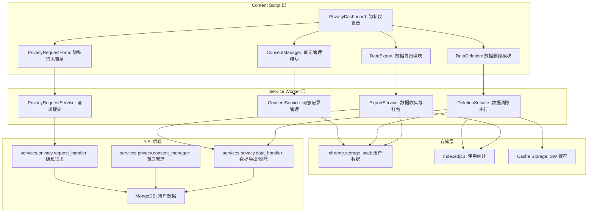
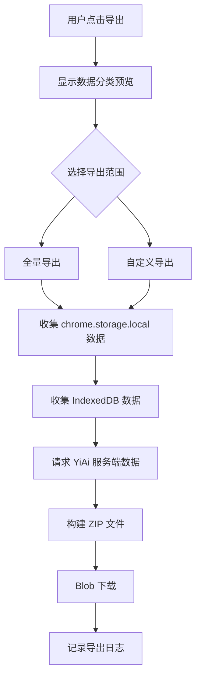

# YP-09-140: 数据导出合规工具 — GDPR 合规数据导出、删除、同意管理与隐私请求表单

> 需求编号：YP-09-140 · 优先级：P2 · 人天：0.2d · 状态：需求已编写
> 依赖：YP-09-132（隐私仪表盘）、YP-09-108（使用统计）

## 背景

### 问题陈述

GDPR（欧盟通用数据保护条例）和全球隐私法规（如 CCPA、PIPL）要求应用提供数据可携带权和被遗忘权。YiPet 作为浏览器扩展，虽然数据主要存储在本地，但仍需为用户提供完整的数据管理工具。当前存在以下问题：

1. **无数据导出功能**：用户无法导出自己的聊天记录、设置、统计数据
2. **无数据删除功能**：用户无法一键清除所有数据，只能手动逐个删除
3. **无同意管理**：用户初始同意后，无法查看或修改同意范围
4. **无数据处理记录**：用户不知道自己的数据被如何处理/存储/传输
5. **无隐私请求流程**：用户无法提交正式的数据访问/删除请求
6. **数据分类不清晰**：用户不知道哪些数据存储在本地，哪些传输到服务器

**核心矛盾**：YiPet 的大部分数据存储在本地（chrome.storage.local + IndexedDB），但 AI 聊天请求会发送到 YiAi 后端。需要在"本地数据管理"和"服务端数据管理"之间划清界限，让用户清晰了解数据流向。

### 影响范围

| # | 影响 | 严重程度 | 典型场景 |
|---|------|----------|----------|
| 1 | 无法导出数据 | 中 | 用户想迁移到其他工具，但数据被锁定 |
| 2 | 无法一键删除 | 中 | 用户想完全清除使用痕迹 |
| 3 | 同意范围不透明 | 中 | 用户不清楚自己同意了哪些数据处理 |
| 4 | 数据流向不清晰 | 中 | 用户不知道哪些数据发送到了服务器 |
| 5 | 合规风险 | 高 | GDPR 要求必须提供数据导出和删除功能 |

### 挑战

| 挑战 | 说明 |
|------|------|
| 数据分散 | 数据存储在 chrome.storage.local、IndexedDB、Service Worker 缓存中 |
| ZIP 打包 | 在浏览器中创建 ZIP 文件（需要 JSZip 库） |
| 服务端数据删除 | 需要调用 YiAi 后端 API 删除服务器端数据 |
| 隐私请求表单 | 需要将请求提交到 YiAi 后端或发送邮件 |
| 用户确认 | 删除操作不可逆，需要多步确认流程 |

---

## 一、现状分析

### 1.1 当前数据管理现状

```
现有数据存储位置:
├── chrome.storage.local
│   ├── sessions: 聊天会话
│   ├── settings: 用户设置
│   ├── recentEmojis: 最近表情
│   └── 无导出/删除功能
├── IndexedDB (yipet_usage_stats)
│   ├── daily_stats: 每日统计
│   ├── events: 原始事件
│   └── 无导出/删除功能
├── Cache Storage (Service Worker)
│   └── 无导出/删除功能
└── YiAi 后端 (MongoDB)
    ├── 聊天消息（通过 RPC）
    └── 无客户端删除接口

缺失:
├── 数据导出功能            # ❌ 不存在
├── 数据删除功能            # ❌ 不存在
├── 同意管理界面            # ❌ 不存在
├── 数据处理活动日志        # ❌ 不存在
├── 隐私请求表单            # ❌ 不存在
└── 数据分类视图            # ❌ 不存在
```

### 1.2 数据分类

| 数据类别 | 存储位置 | 敏感度 | 是否传输到服务器 | 导出 | 删除 |
|----------|----------|--------|-----------------|------|------|
| 聊天消息 | chrome.storage.local + YiAi MongoDB | 高 | 是（AI 请求） | 需要 | 需要 |
| 用户设置 | chrome.storage.local | 低 | 否 | 需要 | 需要 |
| 使用统计 | IndexedDB | 低 | 可选（匿名遥测） | 需要 | 需要 |
| 表情历史 | chrome.storage.local | 低 | 否 | 需要 | 需要 |
| 环境音效缓存 | Cache Storage | 低 | 否 | 不需要 | 需要 |
| AI 对话记录 | YiAi MongoDB | 高 | 是 | 需要 | 需要 |

### 1.3 根因矩阵

| 症状 | 根因 | 触发条件 | 频率 |
|------|------|----------|------|
| 无法导出数据 | 无导出功能 | 用户想迁移数据 | 低 |
| 无法完全删除 | 无批量删除功能 | 用户想清除数据 | 低 |
| 数据流向不透明 | 无数据分类视图 | 用户关心隐私 | 中 |
| 合规风险 | 无 GDPR 工具 | 监管检查 | 低 |

---

## 二、设计决策

### 决策 1：数据导出格式 — JSON vs JSON + ZIP vs 分类导出

| 选项 | 完整性 | 用户友好 | 实现复杂度 |
|------|--------|----------|-----------|
| 单一 JSON 文件 | 中 | 中 | 低 |
| JSON + ZIP 打包 | 高 | 高 | 中 |
| 分类导出（多个文件） | 高 | 中 | 中 |

**选择：ZIP 打包，包含分类 JSON 文件。** 使用 JSZip 库（约 30KB gzip）将不同类别数据组织为独立 JSON 文件（sessions.json、settings.json、stats.json、manifest.json），打包为 ZIP 下载。manifest.json 包含导出时间、数据版本、扩展版本等元信息。

### 决策 2：删除范围 — 仅本地 vs 本地 + 服务端 vs 分级删除

| 选项 | 覆盖范围 | 实现复杂度 | 合规性 |
|------|----------|-----------|--------|
| 仅本地数据 | 部分 | 低 | 不足 |
| 本地 + 服务端 | 完整 | 中 | 满足 |
| 分级删除（按类别） | 完整 | 高 | 满足 |

**选择：本地 + 服务端，并提供分级删除。** 一键全部删除时，同时清除本地数据（chrome.storage.local + IndexedDB + Cache Storage）和调用 YiAi 后端删除 API。提供分类删除选项（仅删除聊天记录/仅删除统计/仅重置设置），满足用户不同需求。

### 决策 3：同意管理范围 — 记录式 vs 交互式 vs 两者结合

| 选项 | 用户控制 | 合规证明 | 复杂度 |
|------|----------|----------|--------|
| 记录式（仅展示同意记录） | 低 | 中 | 低 |
| 交互式（可修改同意） | 高 | 中 | 中 |
| 两者结合 | 高 | 高 | 中 |

**选择：两者结合。** 展示同意历史记录（何时同意了哪些条款），同时提供交互式开关（AI 数据处理同意、匿名遥测同意、位置信息同意）。每次同意变更都记录时间戳和版本号。

### 决策 4：隐私请求表单 — 前端表单 vs 邮件模板 vs API 提交

| 选项 | 可追踪 | 用户友好 | 实现复杂度 |
|------|--------|----------|-----------|
| 前端表单 + API 提交 | 高 | 高 | 中 |
| 邮件模板（mailto:） | 低 | 中 | 低 |
| 两者都提供 | 高 | 最高 | 中 |

**选择：前端表单 + API 提交 + 邮件模板作为备选。** 主流程通过 RPC 提交到 YiAi 后端（`services.privacy.request_handler`），后端创建工单并返回请求 ID。同时提供邮件模板作为离线备选方案。

### 设计决策记录

| 决策 | 选项 A | 选项 B | 选项 C | 选择 | 理由 |
|------|--------|--------|--------|------|------|
| 导出格式 | 单一 JSON | JSON + ZIP | 分类导出 | **JSON + ZIP** | 多文件分类清晰，ZIP 方便下载 |
| 删除范围 | 仅本地 | 本地 + 服务端 | 分级删除 | **本地 + 服务端 + 分级** | 完整覆盖 + 灵活选择 |
| 同意管理 | 记录式 | 交互式 | 两者结合 | **两者结合** | 合规证明 + 用户控制 |
| 隐私表单 | 前端表单 | 邮件模板 | 两者 | **前端表单 + 邮件** | 主流程 + 离线备选 |

---

## 三、目标架构

### 3.1 数据合规系统架构



### 3.2 数据导出流程



### 3.3 性能指标

| 指标 | 改造前 | 改造后 |
|------|--------|--------|
| 数据导出（全量） | N/A | < 5s（含服务端请求） |
| 本地数据删除 | N/A | < 1s |
| 服务端数据删除 | N/A | < 3s（API 请求） |
| ZIP 打包 | N/A | < 2s（JSZip 内存操作） |
| 存储占用 | 0 | JSZip 库 ~30KB gzip |

---

## 四、具体改动

### 4.1 数据导出服务（Service Worker）

```typescript
// src/sw/services/data-export.ts (新增)

import JSZip from 'jszip';

interface ExportManifest {
  exportDate: string;
  extensionVersion: string;
  dataVersion: '1.0';
  categories: Array<{
    name: string;
    count: number;
    source: 'local' | 'server';
  }>;
}

interface ExportOptions {
  categories: Array<'sessions' | 'settings' | 'stats' | 'emojis' | 'serverMessages'>;
  includeServerData: boolean;
}

class DataExportService {
  async exportData(options: ExportOptions): Promise<Blob> {
    const zip = new JSZip();
    const manifest: ExportManifest = {
      exportDate: new Date().toISOString(),
      extensionVersion: chrome.runtime.getManifest().version,
      dataVersion: '1.0',
      categories: [],
    };

    // 导出聊天会话
    if (options.categories.includes('sessions')) {
      const sessions = await chrome.storage.local.get('sessions');
      const sessionData = JSON.stringify(sessions.sessions || [], null, 2);
      zip.file('sessions.json', sessionData);
      manifest.categories.push({
        name: 'sessions',
        count: (sessions.sessions || []).length,
        source: 'local',
      });
    }

    // 导出设置
    if (options.categories.includes('settings')) {
      const settings = await chrome.storage.local.get('settings');
      const settingsData = JSON.stringify(settings.settings || {}, null, 2);
      zip.file('settings.json', settingsData);
      manifest.categories.push({
        name: 'settings',
        count: Object.keys(settings.settings || {}).length,
        source: 'local',
      });
    }

    // 导出使用统计
    if (options.categories.includes('stats')) {
      const stats = await this.getStatsFromIndexedDB();
      zip.file('stats.json', JSON.stringify(stats, null, 2));
      manifest.categories.push({
        name: 'stats',
        count: stats.length,
        source: 'local',
      });
    }

    // 导出表情历史
    if (options.categories.includes('emojis')) {
      const emojis = await chrome.storage.local.get('recentEmojis');
      zip.file('emojis.json', JSON.stringify(emojis.recentEmojis || [], null, 2));
      manifest.categories.push({
        name: 'emojis',
        count: (emojis.recentEmojis || []).length,
        source: 'local',
      });
    }

    // 导出服务端数据
    if (options.includeServerData && options.categories.includes('serverMessages')) {
      try {
        const serverData = await this.fetchServerData();
        zip.file('server_messages.json', JSON.stringify(serverData, null, 2));
        manifest.categories.push({
          name: 'serverMessages',
          count: serverData.length,
          source: 'server',
        });
      } catch (error) {
        zip.file('server_messages_error.txt', `Failed to fetch server data: ${error}`);
      }
    }

    // 添加 manifest
    zip.file('manifest.json', JSON.stringify(manifest, null, 2));

    // 生成 ZIP Blob
    const zipBlob = await zip.generateAsync({
      type: 'blob',
      compression: 'DEFLATE',
      compressionOptions: { level: 6 },
    });

    return zipBlob;
  }

  private async getStatsFromIndexedDB(): Promise<any[]> {
    return new Promise((resolve, reject) => {
      const request = indexedDB.open('yipet_usage_stats', 1);
      request.onsuccess = () => {
        const db = request.result;
        const transaction = db.transaction('daily_stats', 'readonly');
        const store = transaction.objectStore('daily_stats');
        const getAll = store.getAll();
        getAll.onsuccess = () => resolve(getAll.result || []);
        getAll.onerror = () => reject(getAll.error);
      };
      request.onerror = () => reject(request.error);
    });
  }

  private async fetchServerData(): Promise<any[]> {
    const response = await fetch('http://localhost:10086', {
      method: 'POST',
      headers: { 'Content-Type': 'application/json' },
      body: JSON.stringify({
        module_name: 'services.privacy.data_handler',
        method_name: 'export_user_data',
        parameters: {},
      }),
    });
    const result = await response.json();
    if (result.code === 0) return result.data;
    throw new Error(result.message);
  }

  async deleteAllData(includesServer: boolean): Promise<void> {
    // 清除本地存储
    await chrome.storage.local.clear();

    // 清除 IndexedDB
    await this.deleteIndexedDB('yipet_usage_stats');

    // 清除 Cache Storage
    const cacheNames = await caches.keys();
    for (const name of cacheNames) {
      await caches.delete(name);
    }

    // 清除 Service Worker 注册
    const registrations = await navigator.serviceWorker.getRegistrations();
    for (const reg of registrations) {
      await reg.unregister();
    }

    // 服务端删除
    if (includesServer) {
      await fetch('http://localhost:10086', {
        method: 'POST',
        headers: { 'Content-Type': 'application/json' },
        body: JSON.stringify({
          module_name: 'services.privacy.data_handler',
          method_name: 'delete_user_data',
          parameters: {},
        }),
      });
    }
  }

  async deleteDataByCategory(categories: string[]): Promise<void> {
    for (const category of categories) {
      switch (category) {
        case 'sessions':
          await chrome.storage.local.remove('sessions');
          break;
        case 'settings':
          await chrome.storage.local.remove('settings');
          break;
        case 'stats':
          await this.clearStatsFromIndexedDB();
          break;
        case 'emojis':
          await chrome.storage.local.remove('recentEmojis');
          break;
      }
    }
  }

  private async deleteIndexedDB(name: string): Promise<void> {
    return new Promise((resolve, reject) => {
      const request = indexedDB.deleteDatabase(name);
      request.onsuccess = () => resolve();
      request.onerror = () => reject(request.error);
    });
  }

  private async clearStatsFromIndexedDB(): Promise<void> {
    return new Promise((resolve, reject) => {
      const request = indexedDB.open('yipet_usage_stats', 1);
      request.onsuccess = () => {
        const db = request.result;
        const transaction = db.transaction('daily_stats', 'readwrite');
        const store = transaction.objectStore('daily_stats');
        store.clear();
        transaction.oncomplete = () => { db.close(); resolve(); };
        transaction.onerror = () => reject(transaction.error);
      };
      request.onerror = () => reject(request.error);
    });
  }
}

export const dataExport = new DataExportService();
```

### 4.2 同意管理服务

```typescript
// src/sw/services/consent-manager.ts (新增)

interface ConsentRecord {
  id: string;
  type: 'ai_processing' | 'telemetry' | 'location' | 'storage';
  granted: boolean;
  timestamp: number;
  version: string;
  policyUrl: string;
}

interface ConsentHistory {
  records: ConsentRecord[];
  lastUpdated: number;
}

class ConsentManager {
  private readonly CONSENT_KEY = 'consentHistory';

  async initialize(): Promise<void> {
    const stored = await chrome.storage.local.get(this.CONSENT_KEY);
    if (!stored[this.CONSENT_KEY]) {
      const defaultHistory: ConsentHistory = {
        records: [
          {
            id: 'initial_ai_processing',
            type: 'ai_processing',
            granted: true,
            timestamp: Date.now(),
            version: '1.0',
            policyUrl: '',
          },
          {
            id: 'initial_telemetry',
            type: 'telemetry',
            granted: false,
            timestamp: Date.now(),
            version: '1.0',
            policyUrl: '',
          },
          {
            id: 'initial_location',
            type: 'location',
            granted: false,
            timestamp: Date.now(),
            version: '1.0',
            policyUrl: '',
          },
          {
            id: 'initial_storage',
            type: 'storage',
            granted: true,
            timestamp: Date.now(),
            version: '1.0',
            policyUrl: '',
          },
        ],
        lastUpdated: Date.now(),
      };
      await chrome.storage.local.set({ [this.CONSENT_KEY]: defaultHistory });
    }
  }

  async getConsentHistory(): Promise<ConsentHistory> {
    const result = await chrome.storage.local.get(this.CONSENT_KEY);
    return result[this.CONSENT_KEY];
  }

  async getConsentStatus(type: string): Promise<boolean> {
    const history = await this.getConsentHistory();
    const latest = history.records
      .filter(r => r.type === type)
      .sort((a, b) => b.timestamp - a.timestamp)[0];
    return latest?.granted ?? false;
  }

  async setConsent(type: string, granted: boolean): Promise<void> {
    const history = await this.getConsentHistory();
    const record: ConsentRecord = {
      id: `${type}_${Date.now()}`,
      type: type as ConsentRecord['type'],
      granted,
      timestamp: Date.now(),
      version: '1.0',
      policyUrl: '',
    };
    history.records.push(record);
    history.lastUpdated = Date.now();
    await chrome.storage.local.set({ [this.CONSENT_KEY]: history });
  }

  async getProcessingActivityLog(): Promise<Array<{
    activity: string;
    dataType: string;
    destination: 'local' | 'server';
    timestamp: number;
    consentRequired: boolean;
  }>> {
    return [
      {
        activity: 'AI 聊天请求',
        dataType: '聊天消息内容',
        destination: 'server',
        timestamp: Date.now(),
        consentRequired: true,
      },
      {
        activity: '本地聊天存储',
        dataType: '聊天会话数据',
        destination: 'local',
        timestamp: Date.now(),
        consentRequired: true,
      },
      {
        activity: '使用统计收集',
        dataType: '聚合使用指标',
        destination: 'local',
        timestamp: Date.now(),
        consentRequired: false,
      },
      {
        activity: '匿名遥测上报',
        dataType: '聚合统计',
        destination: 'server',
        timestamp: Date.now(),
        consentRequired: true,
      },
      {
        activity: '天气信息查询',
        dataType: 'IP 地理位置',
        destination: 'server',
        timestamp: Date.now(),
        consentRequired: true,
      },
      {
        activity: '环境音效缓存',
        dataType: '音频文件',
        destination: 'local',
        timestamp: Date.now(),
        consentRequired: false,
      },
    ];
  }
}

export const consentManager = new ConsentManager();
```

### 4.3 隐私仪表盘 UI 组件

```vue
<!-- src/content/components/PrivacyDashboard.vue (新增) -->

<script setup lang="ts">
import { ref, onMounted } from 'vue';
import { dataExport } from '../../sw/services/data-export';
import { consentManager } from '../../sw/services/consent-manager';
import type { ConsentHistory, ConsentRecord } from '../../sw/services/consent-manager';

const activeTab = ref<'overview' | 'export' | 'delete' | 'consent' | 'request'>('overview');
const exportLoading = ref(false);
const deleteLoading = ref(false);
const deleteConfirmText = ref('');
const consentHistory = ref<ConsentHistory | null>(null);
const processingActivities = ref<any[]>([]);
const privacyRequest = ref({
  type: 'access',
  email: '',
  description: '',
});

const exportCategories = ref({
  sessions: true,
  settings: true,
  stats: true,
  emojis: true,
  serverMessages: true,
});

async function handleExport(): Promise<void> {
  exportLoading.value = true;
  try {
    const blob = await dataExport.exportData({
      categories: Object.entries(exportCategories.value)
        .filter(([, v]) => v)
        .map(([k]) => k as any),
      includeServerData: exportCategories.value.serverMessages,
    });
    const url = URL.createObjectURL(blob);
    const a = document.createElement('a');
    a.href = url;
    a.download = `yipet-data-export-${new Date().toISOString().slice(0, 10)}.zip`;
    a.click();
    URL.revokeObjectURL(url);
  } finally {
    exportLoading.value = false;
  }
}

async function handleDeleteAll(): Promise<void> {
  if (deleteConfirmText.value !== '删除') return;
  deleteLoading.value = true;
  try {
    await dataExport.deleteAllData(true);
    deleteConfirmText.value = '';
  } finally {
    deleteLoading.value = false;
  }
}

async function handleConsentToggle(type: string, granted: boolean): Promise<void> {
  await consentManager.setConsent(type, granted);
  await loadConsentData();
}

async function handleSubmitPrivacyRequest(): Promise<void> {
  await fetch('http://localhost:10086', {
    method: 'POST',
    headers: { 'Content-Type': 'application/json' },
    body: JSON.stringify({
      module_name: 'services.privacy.request_handler',
      method_name: 'submit_request',
      parameters: privacyRequest.value,
    }),
  });
}

async function loadConsentData(): Promise<void> {
  consentHistory.value = await consentManager.getConsentHistory();
  processingActivities.value = await consentManager.getProcessingActivityLog();
}

onMounted(() => loadConsentData());
</script>

<template>
  <div class="privacy-dashboard">
    <div class="pd-header">
      <h2>隐私与数据管理</h2>
    </div>

    <div class="pd-tabs">
      <button v-for="tab in ['overview', 'export', 'delete', 'consent', 'request']"
        :key="tab" class="pd-tab" :class="{ active: activeTab === tab }"
        @click="activeTab = tab">
        {{ { overview: '概览', export: '导出', delete: '删除', consent: '同意', request: '请求' }[tab] }}
      </button>
    </div>

    <!-- 概览 -->
    <div v-if="activeTab === 'overview'" class="pd-content">
      <h3>数据处理活动</h3>
      <div class="activity-list">
        <div v-for="act in processingActivities" :key="act.activity" class="activity-item">
          <span class="act-name">{{ act.activity }}</span>
          <span class="act-dest" :class="act.destination">
            {{ act.destination === 'local' ? '本地' : '服务器' }}
          </span>
          <span v-if="act.consentRequired" class="act-consent">需同意</span>
        </div>
      </div>
    </div>

    <!-- 导出 -->
    <div v-if="activeTab === 'export'" class="pd-content">
      <h3>数据导出</h3>
      <p class="pd-hint">选择要导出的数据类别，将打包为 ZIP 文件下载</p>
      <div class="export-options">
        <label v-for="(_, key) in exportCategories" :key="key" class="export-option">
          <input type="checkbox" v-model="exportCategories[key]" />
          {{ { sessions: '聊天会话', settings: '设置', stats: '使用统计', emojis: '表情历史', serverMessages: '服务端消息' }[key] }}
        </label>
      </div>
      <button class="btn-primary" :disabled="exportLoading" @click="handleExport">
        {{ exportLoading ? '导出中...' : '导出数据 (ZIP)' }}
      </button>
    </div>

    <!-- 删除 -->
    <div v-if="activeTab === 'delete'" class="pd-content">
      <h3>数据删除</h3>
      <div class="delete-warning">
        删除操作不可逆！将永久删除所有本地和服务端数据。
      </div>
      <div class="delete-confirm">
        <p>请输入"删除"确认：</p>
        <input v-model="deleteConfirmText" type="text" placeholder="输入"删除"" />
        <button class="btn-danger" :disabled="deleteConfirmText !== '删除' || deleteLoading"
          @click="handleDeleteAll">
          {{ deleteLoading ? '删除中...' : '永久删除所有数据' }}
        </button>
      </div>
    </div>

    <!-- 同意管理 -->
    <div v-if="activeTab === 'consent' && consentHistory" class="pd-content">
      <h3>同意管理</h3>
      <div class="consent-list">
        <div v-for="record in consentHistory.records" :key="record.id" class="consent-item">
          <span class="consent-type">
            {{ { ai_processing: 'AI 数据处理', telemetry: '匿名遥测', location: '位置信息', storage: '本地存储' }[record.type] }}
          </span>
          <label class="consent-toggle">
            <input type="checkbox" :checked="record.granted"
              @change="handleConsentToggle(record.type, !record.granted)" />
            <span>{{ record.granted ? '已同意' : '未同意' }}</span>
          </label>
          <span class="consent-time">{{ new Date(record.timestamp).toLocaleString() }}</span>
        </div>
      </div>
    </div>

    <!-- 隐私请求 -->
    <div v-if="activeTab === 'request'" class="pd-content">
      <h3>隐私请求</h3>
      <p class="pd-hint">根据 GDPR 第 15-22 条，您有权提交数据访问、更正、删除等请求</p>
      <form @submit.prevent="handleSubmitPrivacyRequest" class="privacy-form">
        <select v-model="privacyRequest.type">
          <option value="access">数据访问请求</option>
          <option value="rectification">数据更正请求</option>
          <option value="erasure">数据删除请求（被遗忘权）</option>
          <option value="restriction">限制处理请求</option>
          <option value="portability">数据可携带权请求</option>
          <option value="objection">反对处理请求</option>
        </select>
        <input v-model="privacyRequest.email" type="email" placeholder="联系邮箱" required />
        <textarea v-model="privacyRequest.description" placeholder="详细描述您的请求" rows="4" />
        <button type="submit" class="btn-primary">提交请求</button>
      </form>
    </div>
  </div>
</template>
```

### 4.4 文件变更清单

| 文件 | 操作 | 说明 |
|------|------|------|
| `src/sw/services/data-export.ts` | 新增 | 数据导出与删除核心服务 |
| `src/sw/services/consent-manager.ts` | 新增 | 同意记录与管理服务 |
| `src/content/components/PrivacyDashboard.vue` | 新增 | 隐私仪表盘 UI 组件 |
| `src/content/types/privacy.ts` | 新增 | 隐私相关类型定义 |
| `src/content/components/Popup.vue` | 修改 | 添加隐私仪表盘入口 |
| `src/content/components/Settings.vue` | 修改 | 添加隐私设置区域 |
| `package.json` | 修改 | 添加 jszip 依赖 |

---

## 五、实施步骤

| 步骤 | 操作 | 路径 | 验证 | 人天 |
|------|------|------|------|------|
| 1 | 实现数据收集服务 | `data-export.ts` | 从 chrome.storage + IndexedDB 收集完整数据 | 0.03 |
| 2 | 实现 ZIP 打包 | `data-export.ts` | JSZip 打包多文件，Blob 下载 | 0.02 |
| 3 | 实现数据删除服务 | `data-export.ts` | 清除所有本地存储 + 服务端 API | 0.03 |
| 4 | 实现同意管理服务 | `consent-manager.ts` | 同意记录持久化，历史可追溯 | 0.02 |
| 5 | 实现隐私仪表盘 UI | `PrivacyDashboard.vue` | 5 个标签页功能完整 | 0.04 |
| 6 | 实现隐私请求表单 | `PrivacyDashboard.vue` | 表单提交到 YiAi 后端 | 0.02 |
| 7 | 集成到 Popup 和设置 | `Popup.vue`, `Settings.vue` | 入口正确，导航流畅 | 0.02 |
| 8 | 安装 JSZip 依赖 | `package.json` | 打包成功，体积增加 < 30KB gzip | 0.02 |

**总人天：0.2d**

---

## 六、测试规格

### 场景 1：全量数据导出

**GIVEN** 用户有 10 个聊天会话、自定义设置、30 天使用统计
**WHEN** 用户选择全量导出并点击"导出数据"
**THEN** 应下载一个 ZIP 文件，包含 sessions.json、settings.json、stats.json、emojis.json、manifest.json
**AND** manifest.json 应包含导出时间、扩展版本、数据版本
**AND** 每个 JSON 文件应包含完整数据

### 场景 2：全部数据删除

**GIVEN** 用户有本地聊天数据、设置、统计数据
**WHEN** 用户输入"删除"确认并点击"永久删除所有数据"
**THEN** chrome.storage.local 应被清空
**AND** IndexedDB 数据库应被删除
**AND** Cache Storage 应被清除
**AND** 服务端数据应通过 API 删除

### 场景 3：同意管理变更

**GIVEN** 用户当前同意 AI 数据处理和本地存储
**WHEN** 用户取消 AI 数据处理同意
**THEN** 同意记录应新增一条 `granted: false` 的记录
**AND** 同意历史中应保留旧记录
**AND** 后续 AI 聊天请求应被阻止

### 场景 4：数据处理活动日志

**GIVEN** 用户打开隐私仪表盘概览
**WHEN** 查看数据处理活动列表
**THEN** 应列出所有数据处理活动（AI 聊天、本地存储、统计、遥测、天气、缓存）
**AND** 每个活动应标注目标（本地/服务器）
**AND** 每个活动应标注是否需要同意

### 场景 5：隐私请求提交

**GIVEN** 用户填写了数据访问请求表单
**WHEN** 用户点击"提交请求"
**THEN** 请求应通过 RPC 发送到 YiAi 后端
**AND** 后端应返回请求 ID
**AND** 用户应看到提交成功的确认信息

### 场景 6：分类删除

**GIVEN** 用户只想删除聊天记录，保留设置和统计
**WHEN** 用户选择仅删除"聊天会话"类别
**THEN** 仅 chrome.storage.local 中的 sessions 被删除
**AND** settings 和 stats 不受影响
**AND** 服务端聊天数据通过 API 删除

---

## 七、风险与缓解

| 风险 | 概率 | 影响 | 缓解措施 |
|------|------|------|----------|
| 删除操作不可逆导致数据丢失 | 低 | 高 | 多步确认 + 输入"删除"确认 + 提示导出备份 |
| JSZip 体积增加 | 中 | 低 | 使用 tree-shaking 仅导入必要模块，gzip 后约 10KB |
| 服务端删除 API 不可用 | 中 | 中 | 本地删除独立执行，服务端删除失败时提示用户稍后重试 |
| 隐私请求表单被滥用 | 低 | 低 | 添加邮箱验证和请求频率限制 |

---

## 八、回滚策略

| 场景 | 回滚操作 | 影响 |
|------|----------|------|
| JSZip 导致构建失败 | 降级为单个 JSON 文件导出 | 失去 ZIP 打包功能 |
| 服务端 API 不可用 | 仅提供本地数据导出和删除 | 服务端数据管理功能受限 |
| 同意管理变更导致功能异常 | 恢复默认同意配置 | 用户需重新设置同意 |

---

## 九、设计决策记录

### D-01：导出格式选择

- **问题**：数据导出使用什么格式
- **选项**：单一 JSON、多文件 JSON、ZIP 打包
- **选择**：ZIP 打包多文件 JSON
- **理由**：不同数据类别分文件存储，结构清晰；ZIP 方便下载和传输；manifest.json 提供元信息

### D-02：删除范围设计

- **问题**：删除操作应覆盖哪些范围
- **选项**：仅本地、本地 + 服务端、分级删除
- **选择**：本地 + 服务端 + 分级删除
- **理由**：满足 GDPR 被遗忘权，同时提供灵活的分类删除满足不同需求

### D-03：同意管理粒度

- **问题**：同意管理应按什么粒度划分
- **选项**：单一同意、分类同意、逐项同意
- **选择**：分类同意（4 类）
- **理由**：AI 处理、遥测、位置、存储 4 类覆盖主要数据处理场景，不过度细分

### D-04：隐私请求提交方式

- **问题**：隐私请求如何提交到后端
- **选项**：RPC API、邮件、两者
- **选择**：RPC API + 邮件备选
- **理由**：API 提交可追踪、可自动化；邮件作为离线备选确保可达性

---

## 十、可观测性

### 指标

| 指标 | 类型 | 说明 |
|------|------|------|
| `yipet.privacy.export_count` | Counter | 数据导出次数 |
| `yipet.privacy.export_duration_ms` | Histogram | 导出耗时 |
| `yipet.privacy.export_size_bytes` | Histogram | 导出文件大小 |
| `yipet.privacy.deletion_count` | Counter | 数据删除次数 |
| `yipet.privacy.consent_changes` | Counter | 同意变更次数 |
| `yipet.privacy.request_submitted` | Counter | 隐私请求提交次数 |

### 告警

| 告警 | 条件 | 级别 |
|------|------|------|
| 导出失败 | 导出操作连续失败 3 次 | ERROR |
| 服务端删除失败 | 3 次重试后仍失败 | WARNING |
| ZIP 生成超时 | 打包 > 10s | WARNING |

---

## 十一、代码审查检查清单

- [ ] 数据导出覆盖所有本地存储（chrome.storage.local + IndexedDB + Cache Storage）
- [ ] ZIP 文件包含 manifest.json，记录导出时间和版本
- [ ] 数据删除有多步确认，防止误操作
- [ ] 删除操作不可逆，有明确的警告提示
- [ ] 同意记录有完整的变更历史，不可篡改
- [ ] 同意变更后立即生效，阻止或允许相应的数据处理
- [ ] 隐私请求表单有必填字段验证
- [ ] 服务端 API 调用有超时和重试机制
- [ ] JSZip 使用动态 import，减少初始加载体积
- [ ] 导出过程有进度提示，避免用户感知"卡死"
- [ ] 数据处理活动列表准确反映实际数据流向
- [ ] 删除操作在 Service Worker 中执行，确保跨标签页一致性

---

## 回归问题预测

| # | 预测问题 | 原因 | 验证方法 |
|---|---------|------|---------|
| 1 | 用户导出数据后 ZIP 文件解压失败，文件损坏 | JSZip 在生成 Blob 时如果被 Service Worker 的 fetch 事件拦截修改，可能导致二进制数据损坏 | 在导出时跳过 SW 缓存（使用 `{ cache: 'no-store' }` 或不通过 fetch 下载）；使用 `URL.createObjectURL` 直接下载 Blob，不经过 SW |
| 2 | 删除所有数据后，Service Worker 被 unregister，但新的 SW 在下次打开时自动重新注册，导致用户数据被"恢复"（实际是新建的默认数据） | SW 的 unregister 是异步的，且浏览器可能在下一次导航时重新注册 SW | 在删除操作后提示用户手动刷新扩展或重启浏览器；在 SW 注册时检查是否存在"已被清除"标记 |
| 3 | 分级删除时，用户选择仅删除聊天记录，但 IndexedDB 中的使用统计引用了已删除的会话 ID，导致统计面板显示空引用 | 使用统计和聊天会话是独立的存储，删除操作不会级联更新统计系统中的引用 | 在使用统计面板中处理空引用，显示"已删除的会话"而非崩溃；定期清理统计中的孤立引用 |
| 4 | JSZip 的 `generateAsync` 在主线程执行，生成大型 ZIP 文件（>10MB）时阻塞 UI 线程，导致 Popup 无响应 | JSZip 的压缩操作是 CPU 密集型的，在主线程执行会阻塞 UI 渲染 | 使用 OffscreenCanvas 或 Web Worker 执行 ZIP 生成；对于大型数据，分批导出而非一次性打包 |
| 5 | 隐私请求表单提交时，网络请求失败但用户未收到明确反馈，以为请求已提交 | fetch 请求失败时 catch 块只记录了 console.warn，UI 没有显示错误状态 | 在 catch 块中设置错误状态变量，UI 显示"提交失败，请稍后重试或使用邮件方式"；保留表单数据不丢失 |
| 6 | 同意管理切换 AI 数据处理为"未同意"时，正在进行的 SSE 聊天流未中断，用户消息继续发送到服务器 | 同意变更是在 Service Worker 中记录的，但 Content Script 中的 SSE 连接已经建立，不会主动中断 | 在同意变更时广播消息到所有 Content Script，Content Script 检查当前是否有活跃的 SSE 连接，如果有则中断并提示用户 |

---

## 性能分析

### 各操作耗时

| 阶段 | 预估耗时 | 说明 |
|------|----------|------|
| 数据收集（本地） | 50-200ms | chrome.storage.local + IndexedDB 读取 |
| 数据收集（服务端） | 500-2000ms | YiAi API 请求 |
| ZIP 打包（小数据 < 1MB） | 100-500ms | JSZip 压缩 |
| ZIP 打包（大数据 < 10MB） | 1000-5000ms | 主要在压缩计算 |
| 本地数据删除 | 50-200ms | chrome.storage.local.clear + IndexedDB.deleteDatabase |
| 服务端数据删除 | 500-2000ms | YiAi API 请求 |
| 隐私请求提交 | 200-500ms | RPC API 请求 |

### 内存影响

| 项目 | 体积 | 说明 |
|------|------|------|
| JSZip 库 | ~30KB gzip | 动态 import |
| data-export.ts | ~3KB | 导出/删除逻辑 |
| consent-manager.ts | ~2KB | 同意管理 |
| PrivacyDashboard.vue | ~8KB | UI 组件 |

### 对 Content Script 注入速度的影响

| 阶段 | 影响 | 说明 |
|------|------|------|
| 初始注入 | 0 | 隐私工具仅在用户打开时初始化 |
| ZIP 导出 | 0 | 仅在 Popup 中执行，不阻塞页面 |