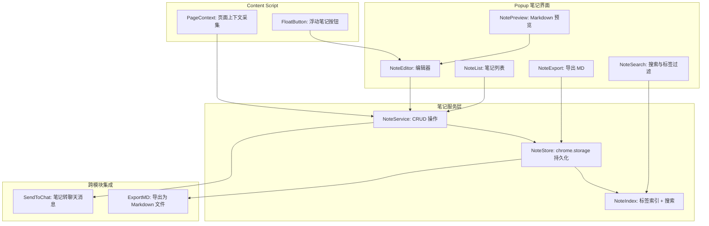
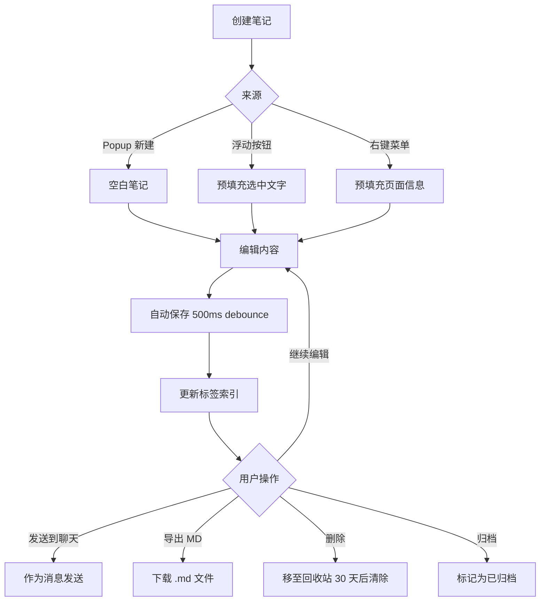

# YP-09-141: 快捷笔记 — 扩展弹窗内快速记录、markdown 笔记、自动保存、搜索标签、笔记转聊天、导出 MD

> 需求编号：YP-09-141 · 优先级：P2 · 人天：0.2d · 状态：需求已编写
> 依赖：YP-09-42（设置面板重构）

## 背景

### 问题陈述

YiPet 当前定位为 AI 聊天伴侣，但用户在浏览网页时经常产生碎片化想法和临时记录需求——看到一段有用信息、想到一个待办事项、记录一个灵感。当前用户必须切换到其他笔记应用（Notion、Obsidian、系统备忘录）才能记录，打断了浏览工作流，体验割裂。

1. **记录流程中断**：用户需要离开当前页面，打开其他笔记应用，记录后再切回浏览器
2. **上下文丢失**：记录的笔记与当前浏览的页面失去关联，事后难以追溯笔记来源
3. **无标签体系**：笔记缺少分类和标签，长期积累后难以检索
4. **无法复用**：笔记内容无法直接发送到聊天中作为上下文，需要手动复制粘贴
5. **跨设备问题**：chrome.storage 仅本地存储，笔记无法跨设备同步

**核心矛盾**：用户需要一个轻量级、零切换成本的笔记工具，但 Chrome 扩展的 Popup 窗口空间有限（800x600px），需要设计一个在有限空间内高效记录和管理的笔记系统。

### 影响范围

| # | 影响 | 严重程度 | 典型场景 |
|---|------|----------|----------|
| 1 | 碎片化想法无法快速记录 | 高 | 用户在阅读技术文章时产生灵感，需要立即记录 |
| 2 | 笔记与页面上下文脱节 | 中 | 一周后回顾笔记，忘记笔记来源和背景 |
| 3 | 笔记无法用于 AI 对话 | 中 | 用户想将笔记作为聊天上下文，需手动复制粘贴 |
| 4 | 笔记积累后难以检索 | 中 | 50+ 条笔记后，无法快速找到目标笔记 |
| 5 | 无导出能力 | 低 | 用户想将笔记迁移到其他笔记应用 |

### 挑战

| 挑战 | 说明 |
|------|------|
| 存储容量 | chrome.storage.local 有 10MB 限制（sync 仅 102KB），大量笔记需合理管理存储 |
| Popup 空间限制 | Popup 窗口 800x600px，需在有限空间内设计笔记列表、编辑器、搜索界面 |
| 实时自动保存 | 用户输入时需实时保存防止丢失，但频繁写入 chrome.storage 有性能开销 |
| Markdown 渲染 | 编辑器需支持 Markdown 预览，但引入完整 Markdown 渲染库会增加扩展体积 |
| 笔记与页面关联 | 需记录笔记创建时的页面 URL 和标题，但 privacy 敏感页面需脱敏处理 |

---

## 一、现状分析

### 1.1 当前笔记能力

```
现有笔记相关功能（无）:
├── Popup 窗口
│   └── 仅聊天功能，无笔记入口
├── Content Script
│   └── 无笔记相关功能
├── Service Worker
│   └── 无笔记存储或同步
└── chrome.storage
    └── 仅存储会话和设置，无笔记数据

缺失:
├── 笔记 CRUD 操作                  # ❌ 不存在
├── 笔记存储层                      # ❌ 不存在
├── markdown 编辑器                 # ❌ 不存在
├── 笔记搜索与标签过滤              # ❌ 不存在
├── 笔记导出                       # ❌ 不存在
├── 笔记转聊天消息                 # ❌ 不存在
├── 自动保存                       # ❌ 不存在
└── 页面浮动笔记按钮               # ❌ 不存在
```

### 1.2 用户行为流程（现状 vs 目标）

```mermaid
graph TD
    subgraph Current["现状：无笔记功能"]
        C1[用户浏览网页] --> C2[产生想法]
        C2 --> C3[切换至其他笔记应用]
        C3 --> C4[记录笔记]
        C4 --> C5[切换回浏览器]
        C5 --> C6[手动复制笔记到聊天]
    end

    subgraph Target["目标：内置快捷笔记"]
        T1[用户浏览网页] --> T2[产生想法]
        T2 --> T3[点击扩展图标或浮动按钮]
        T3 --> T4[在 Popup 中快速记录]
        T4 --> T5[自动保存 + 自动关联页面]
        T5 --> T6[一键发送到聊天 / 导出 MD]
    end

    style Current fill:#f8d7da,stroke:#dc3545
    style Target fill:#d4edda,stroke:#28a745
```



### 1.3 根因矩阵

| 症状 | 根因 | 触发条件 | 频率 |
|------|------|----------|------|
| 无笔记功能 | 未实现笔记模块 | 用户有记录需求 | 高 |
| 记录流程中断 | 无内置笔记工具 | 用户浏览中产生想法 | 高 |
| 笔记与上下文无关 | 未记录页面关联信息 | 回顾笔记时 | 中 |
| 笔记无法检索 | 无标签和搜索 | 笔记数量 > 20 | 中 |
| 笔记无法复用 | 无导出和转聊天 | 用户想使用笔记内容 | 中 |

---

## 二、设计决策

### 决策 1：笔记存储方案 — chrome.storage.local vs IndexedDB vs 后端 API

| 选项 | 容量 | 离线可用 | 跨设备同步 | 查询能力 |
|------|------|----------|-----------|----------|
| chrome.storage.local | 10MB | 是 | 否 | 仅 key-value |
| IndexedDB | 无限制 | 是 | 否 | 索引 + 游标查询 |
| 后端 API (YiAi) | 无限制 | 否 | 是 | 完整查询 |

**选择：chrome.storage.local + 可选后端同步。** 笔记数据量小（每条 1-5KB），10MB 可存储 2000+ 条笔记。使用 chrome.storage.local 保证离线可用和零延迟。后续通过 chrome.storage.sync 或后端 API 实现跨设备同步。IndexedDB 的查询能力在此场景下不需要（笔记数量有限，内存过滤足够）。

### 决策 2：Markdown 编辑器 — 自建简易编辑器 vs 引入成熟库 vs 纯文本 + 预览

| 选项 | 体积 | 功能完整度 | 实现复杂度 |
|------|------|-----------|-----------|
| 自建简易编辑器（textarea + 工具栏） | 极小（< 5KB） | 基础 | 低 |
| 引入 Monaco/CodeMirror | 大（500KB+） | 完整 | 中 |
| 纯文本输入 + Markdown 预览 | 极小 | 编辑和预览分离 | 低 |

**选择：纯文本输入 + Markdown 预览（分栏模式）。** 扩展体积敏感，不引入大型编辑器库。使用 textarea 进行纯文本编辑，右侧实时渲染 Markdown 预览。支持常用 Markdown 语法（标题、粗体、斜体、列表、链接、代码块、引用）。工具栏提供快捷插入按钮（Markdown 语法提示）。

### 决策 3：笔记关联页面 — 自动记录 vs 手动关联 vs 不关联

| 选项 | 用户体验 | 隐私风险 | 实现复杂度 |
|------|----------|----------|-----------|
| 自动记录（创建时获取当前页面 URL + 标题） | 高 | 中（敏感页面 URL 泄露） | 低 |
| 手动关联（用户手动输入来源） | 中 | 低 | 低 |
| 不关联 | 低 | 无 | 极低 |

**选择：自动记录 + 隐私页面过滤。** 默认自动记录当前页面的 URL 和标题作为笔记来源。对 chrome://、file://、以及用户配置的隐私域名列表中的页面，不记录 URL 仅记录"隐私页面"标记。用户可在设置中配置隐私域名列表。

### 决策 4：浮动笔记按钮 — 始终显示 vs 仅在文字选中时 vs 用户配置

| 选项 | 侵入性 | 触发频率 | 用户体验 |
|------|--------|----------|----------|
| 始终显示（页面右下角浮动按钮） | 高 | — | 方便但干扰页面 |
| 仅在文字选中时显示 | 中 | 中 | 上下文相关，但易忽略 |
| 用户配置（可选择显示模式） | 低 | — | 灵活，默认关闭 |

**选择：用户配置，默认关闭。** 浮动按钮可能干扰页面浏览体验，默认关闭。用户可在设置中开启，并选择显示模式（始终显示 / 选中文字时显示）。浮动按钮点击后直接在 Popup 中创建笔记并预填充选中文字。

### 设计决策记录

| 决策 | 选项 A | 选项 B | 选项 C | 选择 | 理由 |
|------|--------|--------|--------|------|------|
| 存储方案 | chrome.storage.local | IndexedDB | 后端 API | **chrome.storage.local** | 容量足够，离线可用，零延迟 |
| 编辑器 | 自建简易 | 引入成熟库 | 纯文本+预览 | **纯文本+预览** | 扩展体积敏感，分栏模式足够 |
| 页面关联 | 自动记录 | 手动关联 | 不关联 | **自动+隐私过滤** | 自动化 + 隐私保护 |
| 浮动按钮 | 始终显示 | 选中文字 | 用户配置 | **用户配置** | 默认关闭，减少干扰 |

---

## 三、目标架构

### 3.1 笔记系统架构



### 3.2 笔记生命周期



### 3.3 性能指标

| 指标 | 目标值 | 说明 |
|------|--------|------|
| 笔记列表加载 | < 50ms | 从 chrome.storage 读取并渲染 100 条笔记 |
| 自动保存延迟 | 500ms debounce | 用户停止输入 500ms 后保存 |
| 搜索响应 | < 100ms | 内存过滤 1000 条笔记 |
| Markdown 预览渲染 | < 30ms | 简易 Markdown 解析 |
| 笔记转聊天 | < 50ms | 内容传递到聊天输入框 |
| 存储占用（单条笔记） | < 5KB | 含标题、内容、标签、元数据 |

---

## 四、具体改动

### 4.1 笔记类型定义

```typescript
// src/notes/types.ts (新增)

export interface Note {
  id: string;                    // 唯一标识 (crypto.randomUUID())
  title: string;                 // 笔记标题（自动取首行）
  content: string;               // Markdown 内容
  tags: string[];                // 标签列表
  sourceUrl?: string;            // 来源页面 URL（隐私页面为空）
  sourceTitle?: string;          // 来源页面标题
  isArchived: boolean;           // 是否归档
  isDeleted: boolean;            // 是否已删除（软删除）
  deletedAt?: number;            // 删除时间戳
  createdAt: number;             // 创建时间戳
  updatedAt: number;             // 更新时间戳
  wordCount: number;             // 字数统计
}

export interface NoteCreateParams {
  title?: string;
  content?: string;
  tags?: string[];
  sourceUrl?: string;
  sourceTitle?: string;
}

export interface NoteUpdateParams {
  title?: string;
  content?: string;
  tags?: string[];
  isArchived?: boolean;
}

export interface NoteSearchParams {
  query?: string;                // 搜索关键词
  tags?: string[];               // 标签过滤
  isArchived?: boolean;          // 是否归档
  sortBy?: 'updatedAt' | 'createdAt' | 'title';
  sortOrder?: 'asc' | 'desc';
}
```

### 4.2 笔记服务

```typescript
// src/notes/NoteService.ts (新增)

import type { Note, NoteCreateParams, NoteUpdateParams, NoteSearchParams } from './types';

const STORAGE_KEY = 'yipet_notes';
const MAX_NOTES = 5000;  // 最大笔记数

export class NoteService {
  private notes: Note[] = [];
  private tagIndex: Map<string, Set<string>> = new Map();  // tag -> noteId[]

  /** 初始化：从 chrome.storage 加载所有笔记 */
  async initialize(): Promise<void> {
    const result = await chrome.storage.local.get(STORAGE_KEY);
    this.notes = result[STORAGE_KEY] ?? [];
    this.rebuildTagIndex();
  }

  /** 创建笔记 */
  async create(params: NoteCreateParams): Promise<Note> {
    const content = params.content ?? '';
    const note: Note = {
      id: crypto.randomUUID(),
      title: params.title ?? this.extractTitle(content),
      content,
      tags: params.tags ?? this.extractTags(content),
      sourceUrl: params.sourceUrl,
      sourceTitle: params.sourceTitle,
      isArchived: false,
      isDeleted: false,
      createdAt: Date.now(),
      updatedAt: Date.now(),
      wordCount: this.countWords(content),
    };

    this.notes.unshift(note);  // 最新笔记在前
    this.addToTagIndex(note);
    await this.persist();
    this.enforceMaxNotes();
    return note;
  }

  /** 更新笔记 */
  async update(id: string, params: NoteUpdateParams): Promise<Note | null> {
    const note = this.notes.find(n => n.id === id && !n.isDeleted);
    if (!note) return null;

    if (params.content !== undefined) {
      note.content = params.content;
      note.title = params.title ?? this.extractTitle(note.content);
      note.tags = params.tags ?? this.extractTags(note.content);
      note.wordCount = this.countWords(note.content);
    }
    if (params.title !== undefined) note.title = params.title;
    if (params.tags !== undefined) {
      this.removeFromTagIndex(note);
      note.tags = params.tags;
      this.addToTagIndex(note);
    }
    if (params.isArchived !== undefined) note.isArchived = params.isArchived;

    note.updatedAt = Date.now();
    await this.persist();
    return note;
  }

  /** 软删除笔记 */
  async delete(id: string): Promise<boolean> {
    const note = this.notes.find(n => n.id === id);
    if (!note) return false;
    note.isDeleted = true;
    note.deletedAt = Date.now();
    this.removeFromTagIndex(note);
    await this.persist();
    return true;
  }

  /** 永久删除（清理超过 30 天的已删除笔记） */
  async purgeDeleted(): Promise<number> {
    const threshold = Date.now() - 30 * 24 * 60 * 60 * 1000;
    const before = this.notes.length;
    this.notes = this.notes.filter(
      n => !n.isDeleted || (n.deletedAt && n.deletedAt > threshold)
    );
    await this.persist();
    return before - this.notes.length;
  }

  /** 搜索笔记 */
  search(params: NoteSearchParams = {}): Note[] {
    let results = this.notes.filter(n => !n.isDeleted);

    if (params.isArchived !== undefined) {
      results = results.filter(n => n.isArchived === params.isArchived);
    }

    if (params.query) {
      const q = params.query.toLowerCase();
      results = results.filter(
        n => n.title.toLowerCase().includes(q) ||
             n.content.toLowerCase().includes(q) ||
             n.tags.some(t => t.toLowerCase().includes(q))
      );
    }

    if (params.tags && params.tags.length > 0) {
      results = results.filter(
        n => params.tags!.every(t => n.tags.includes(t))
      );
    }

    const sortBy = params.sortBy ?? 'updatedAt';
    const sortOrder = params.sortOrder ?? 'desc';
    results.sort((a, b) => {
      const va = a[sortBy] as string | number;
      const vb = b[sortBy] as string | number;
      if (va < vb) return sortOrder === 'asc' ? -1 : 1;
      if (va > vb) return sortOrder === 'asc' ? 1 : -1;
      return 0;
    });

    return results;
  }

  /** 获取所有标签及其笔记数量 */
  getTags(): { tag: string; count: number }[] {
    const tags: { tag: string; count: number }[] = [];
    for (const [tag, noteIds] of this.tagIndex) {
      tags.push({ tag, count: noteIds.size });
    }
    return tags.sort((a, b) => b.count - a.count);
  }

  /** 导出笔记为 Markdown */
  exportAsMarkdown(ids: string[]): string {
    const notes = ids
      .map(id => this.notes.find(n => n.id === id))
      .filter((n): n is Note => n !== undefined);

    return notes.map(note => {
      const frontmatter = [
        '---',
        `title: "${note.title}"`,
        `tags: [${note.tags.join(', ')}]`,
        `created: ${new Date(note.createdAt).toISOString()}`,
        `updated: ${new Date(note.updatedAt).toISOString()}`,
        note.sourceUrl ? `source: ${note.sourceUrl}` : '',
        '---',
      ].filter(Boolean).join('\n');

      return `${frontmatter}\n\n${note.content}`;
    }).join('\n\n---\n\n');
  }

  // --- 私有方法 ---

  private extractTitle(content: string): string {
    const firstLine = content.split('\n')[0]?.trim() ?? '';
    // 去除 Markdown 标题标记
    return firstLine.replace(/^#+\s*/, '') || '未命名笔记';
  }

  private extractTags(content: string): string[] {
    const tags: string[] = [];
    for (const match of content.matchAll(/#([\w\u4e00-\u9fff]+)/g)) {
      const tag = match[1];
      if (tag && !tags.includes(tag)) {
        tags.push(tag);
      }
    }
    return tags;
  }

  private countWords(content: string): number {
    return content.replace(/\s/g, '').length;
  }

  private addToTagIndex(note: Note): void {
    for (const tag of note.tags) {
      if (!this.tagIndex.has(tag)) {
        this.tagIndex.set(tag, new Set());
      }
      this.tagIndex.get(tag)!.add(note.id);
    }
  }

  private removeFromTagIndex(note: Note): void {
    for (const tag of note.tags) {
      this.tagIndex.get(tag)?.delete(note.id);
      if (this.tagIndex.get(tag)?.size === 0) {
        this.tagIndex.delete(tag);
      }
    }
  }

  private rebuildTagIndex(): void {
    this.tagIndex.clear();
    for (const note of this.notes) {
      if (!note.isDeleted) {
        this.addToTagIndex(note);
      }
    }
  }

  private async persist(): Promise<void> {
    await chrome.storage.local.set({ [STORAGE_KEY]: this.notes });
  }

  private enforceMaxNotes(): void {
    if (this.notes.length > MAX_NOTES) {
      const toDelete = this.notes.splice(MAX_NOTES);
      for (const note of toDelete) {
        this.removeFromTagIndex(note);
      }
    }
  }
}
```

### 4.3 笔记编辑器组件（Vue 3）

```typescript
// src/components/NoteEditor.vue (新增)

// Vue 3 组合式 API 组件
// 分栏布局：左侧 textarea 编辑，右侧 Markdown 实时预览
// 工具栏：标题、粗体、斜体、列表、链接、代码块、引用快捷插入
// 自动保存：500ms debounce 后保存到 chrome.storage
// 标签输入：支持 Enter 添加标签，点击 × 删除标签

import { ref, watch, computed, onMounted, onUnmounted } from 'vue';
import { NoteService } from '@/notes/NoteService';
import type { Note } from '@/notes/types';

const noteService = new NoteService();

const currentNote = ref<Note | null>(null);
const content = ref('');
const title = ref('');
const tags = ref<string[]>([]);
const tagInput = ref('');
const previewMode = ref<'split' | 'edit' | 'preview'>('split');
let saveTimer: ReturnType<typeof setTimeout> | null = null;

// 自动保存（500ms debounce）
watch(content, (newContent) => {
  if (saveTimer) clearTimeout(saveTimer);
  saveTimer = setTimeout(() => {
    if (currentNote.value) {
      noteService.update(currentNote.value.id, { content: newContent });
    }
  }, 500);
});

function addTag() {
  const tag = tagInput.value.trim();
  if (tag && !tags.value.includes(tag)) {
    tags.value.push(tag);
    tagInput.value = '';
    if (currentNote.value) {
      noteService.update(currentNote.value.id, { tags: tags.value });
    }
  }
}

function removeTag(tag: string) {
  tags.value = tags.value.filter(t => t !== tag);
  if (currentNote.value) {
    noteService.update(currentNote.value.id, { tags: tags.value });
  }
}

function sendToChat() {
  if (!currentNote.value) return;
  // 通过 CustomEvent 通知聊天模块
  window.dispatchEvent(new CustomEvent('yipet:note:send-to-chat', {
    detail: { content: currentNote.value.content }
  }));
}

function exportAsMD() {
  if (!currentNote.value) return;
  const md = noteService.exportAsMarkdown([currentNote.value.id]);
  const blob = new Blob([md], { type: 'text/markdown' });
  const url = URL.createObjectURL(blob);
  const a = document.createElement('a');
  a.href = url;
  a.download = `${currentNote.value.title.replace(/[^a-zA-Z0-9\u4e00-\u9fff]/g, '_')}.md`;
  a.click();
  URL.revokeObjectURL(url);
}

// 工具栏：插入 Markdown 语法
function insertMarkdown(syntax: string) {
  const textarea = document.querySelector('.note-editor-textarea') as HTMLTextAreaElement;
  if (!textarea) return;
  const start = textarea.selectionStart;
  const end = textarea.selectionEnd;
  const selected = content.value.substring(start, end);
  const replacement = syntax.replace('$1', selected);
  content.value = content.value.substring(0, start) + replacement + content.value.substring(end);
}

// 简易 Markdown 渲染
function renderMarkdown(text: string): string {
  return text
    .replace(/^### (.+)$/gm, '<h3>$1</h3>')
    .replace(/^## (.+)$/gm, '<h2>$1</h2>')
    .replace(/^# (.+)$/gm, '<h1>$1</h1>')
    .replace(/\*\*(.+?)\*\*/g, '<strong>$1</strong>')
    .replace(/\*(.+?)\*/g, '<em>$1</em>')
    .replace(/`(.+?)`/g, '<code>$1</code>')
    .replace(/^\- (.+)$/gm, '<li>$1</li>')
    .replace(/^> (.+)$/gm, '<blockquote>$1</blockquote>')
    .replace(/\[(.+?)\]\((.+?)\)/g, '<a href="$2" target="_blank">$1</a>')
    .replace(/\n/g, '<br>');
}
```

### 4.4 浮动笔记按钮（Content Script）

```typescript
// src/content/NoteFloatButton.ts (新增)

// 在页面右下角注入浮动笔记按钮
// 根据用户配置显示模式（始终显示 / 选中文字时显示）

export class NoteFloatButton {
  private button: HTMLDivElement | null = null;
  private visible = false;
  private mode: 'always' | 'selection' = 'selection';

  constructor() {
    this.loadConfig();
    this.bindEvents();
  }

  private async loadConfig() {
    const result = await chrome.storage.local.get('yipet_note_float_button');
    this.mode = result['yipet_note_float_button'] ?? 'selection';
    if (this.mode === 'always') this.show();
  }

  private bindEvents() {
    document.addEventListener('mouseup', () => {
      if (this.mode !== 'selection') return;
      const selection = window.getSelection();
      if (selection && selection.toString().trim().length > 0) {
        this.show();
      } else {
        this.hide();
      }
    });
  }

  private show() {
    if (this.button) return;
    this.button = document.createElement('div');
    this.button.className = 'yipet-note-float-btn';
    this.button.innerHTML = '📝';
    this.button.title = '快捷笔记';
    this.button.style.cssText = `
      position: fixed; bottom: 80px; right: 20px; z-index: 2147483646;
      width: 44px; height: 44px; border-radius: 50%;
      background: #4f46e5; color: white; font-size: 20px;
      display: flex; align-items: center; justify-content: center;
      cursor: pointer; box-shadow: 0 2px 8px rgba(0,0,0,0.3);
      transition: transform 0.2s; border: none; user-select: none;
    `;
    this.button.addEventListener('click', () => this.handleClick());
    document.body.appendChild(this.button);
    this.visible = true;
  }

  private hide() {
    // 延迟隐藏，避免点击按钮时按钮已消失
    setTimeout(() => {
      if (this.button && !this.button.matches(':hover')) {
        this.button.remove();
        this.button = null;
        this.visible = false;
      }
    }, 200);
  }

  private handleClick() {
    const selection = window.getSelection()?.toString().trim() ?? '';
    const pageTitle = document.title;
    const pageUrl = this.shouldRecordUrl() ? window.location.href : '';

    // 通知 Popup 创建笔记
    chrome.runtime.sendMessage({
      type: 'CREATE_NOTE',
      data: {
        content: selection,
        sourceTitle: pageTitle,
        sourceUrl: pageUrl,
      },
    });
  }

  private shouldRecordUrl(): boolean {
    const url = window.location.href;
    return !url.startsWith('chrome://') &&
           !url.startsWith('file://') &&
           !url.startsWith('about:');
  }

  destroy() {
    this.button?.remove();
    this.button = null;
  }
}
```

### 4.5 文件变更清单

| 文件 | 操作 | 说明 |
|------|------|------|
| `src/notes/types.ts` | 新增 | 笔记类型定义 |
| `src/notes/NoteService.ts` | 新增 | 笔记 CRUD 服务 + 存储层 |
| `src/notes/NoteIndex.ts` | 新增 | 标签索引 + 搜索 |
| `src/components/NoteEditor.vue` | 新增 | 笔记编辑器组件（分栏模式） |
| `src/components/NoteList.vue` | 新增 | 笔记列表组件（搜索 + 标签过滤） |
| `src/components/NoteTagInput.vue` | 新增 | 标签输入组件 |
| `src/content/NoteFloatButton.ts` | 新增 | 页面浮动笔记按钮 |
| `src/popup/App.vue` | 修改 | 集成笔记入口（Tab 切换） |
| `src/popup/router.ts` | 修改 | 添加笔记相关路由 |

---

## 五、实施步骤

| 步骤 | 操作 | 路径 | 验证 | 人天 |
|------|------|------|------|------|
| 1 | 定义笔记类型和存储 schema | `src/notes/types.ts` | 类型检查通过 | 0.01 |
| 2 | 实现 NoteService CRUD 操作 | `src/notes/NoteService.ts` | 创建、读取、更新、删除笔记正常 | 0.04 |
| 3 | 实现标签索引和搜索 | `src/notes/NoteIndex.ts` | 标签过滤和关键词搜索正确 | 0.02 |
| 4 | 实现 NoteEditor 组件（分栏 + 预览） | `src/components/NoteEditor.vue` | 编辑和预览功能正常 | 0.04 |
| 5 | 实现 NoteList 组件（列表 + 搜索 + 过滤） | `src/components/NoteList.vue` | 列表展示、搜索、标签过滤正常 | 0.03 |
| 6 | 实现自动保存（500ms debounce） | `src/components/NoteEditor.vue` | 停止输入 500ms 后自动保存 | 0.01 |
| 7 | 实现笔记导出为 MD | `src/notes/NoteService.ts` | 导出 .md 文件内容正确 | 0.01 |
| 8 | 实现笔记转聊天消息 | `src/components/NoteEditor.vue` | 内容发送到聊天输入框 | 0.01 |
| 9 | 实现浮动笔记按钮 | `src/content/NoteFloatButton.ts` | 选中文字后显示按钮，点击创建笔记 | 0.02 |
| 10 | 集成到 Popup 主界面 | `src/popup/App.vue` | Tab 切换笔记和聊天 | 0.01 |

**总人天：0.2d**

---

## 六、测试规格

### 场景 1：创建笔记并自动保存

**GIVEN** 用户在 Popup 笔记界面
**WHEN** 用户输入笔记内容 "今天学习了 RAG 技术 #学习 #RAG"
**THEN** 笔记应自动提取标题 "今天学习了 RAG 技术"
**AND** 自动提取标签 ["学习", "RAG"]
**AND** 停止输入 500ms 后自动保存到 chrome.storage.local
**AND** 刷新 Popup 后笔记应仍然存在

### 场景 2：笔记搜索与标签过滤

**GIVEN** 已有 20 条笔记，其中 5 条标签包含 "RAG"，3 条标题包含 "Python"
**WHEN** 用户搜索 "Python"
**THEN** 应返回 3 条标题包含 "Python" 的笔记
**AND** 用户选择标签 "RAG" 过滤
**THEN** 应仅返回同时包含 "RAG" 标签的笔记

### 场景 3：笔记导出为 Markdown

**GIVEN** 用户有一条笔记，内容为 "# 学习笔记\n\n## RAG\n检索增强生成技术"
**WHEN** 用户点击导出按钮
**THEN** 应下载一个 .md 文件
**AND** 文件内容应包含完整的 YAML frontmatter（title, tags, created, updated）和 Markdown 正文
**AND** 文件名应为笔记标题的 sanitized 版本

### 场景 4：笔记转聊天消息

**GIVEN** 用户有一条笔记，内容为 "请帮我总结 RAG 的优势"
**WHEN** 用户点击 "发送到聊天" 按钮
**THEN** 笔记内容应作为消息发送到当前聊天会话
**AND** 聊天窗口应自动打开并显示该消息
**AND** AI 应基于该消息内容进行回复

### 场景 5：浮动笔记按钮（选中文字时显示）

**GIVEN** 用户在设置中开启浮动按钮，模式为 "选中文字时显示"
**WHEN** 用户在页面中选中一段文字 "重要内容"
**THEN** 页面右下角应显示浮动笔记按钮
**AND** 点击按钮后，Popup 应创建笔记并预填充选中文字 "重要内容"
**AND** 笔记来源应记录当前页面的 URL 和标题

### 场景 6：隐私页面不记录 URL

**GIVEN** 用户在 chrome://extensions 页面
**WHEN** 用户创建笔记
**THEN** 笔记的 sourceUrl 应为空字符串
**AND** sourceTitle 应记录为 "隐私页面"
**AND** 笔记内容正常保存

---

## 七、风险与缓解

| 风险 | 概率 | 影响 | 缓解措施 |
|------|------|------|----------|
| chrome.storage.local 10MB 限制被大量笔记占满 | 低 | 中 | 限制最大 5000 条笔记，超出后自动删除最旧笔记；显示存储使用量 |
| 自动保存频繁写入 chrome.storage 导致性能问题 | 中 | 低 | 500ms debounce 减少写入频率；仅保存变更的笔记 |
| 浮动按钮干扰 Gmail、Google Docs 等 Web 应用 | 中 | 中 | 默认关闭浮动按钮；用户可配置白名单/黑名单域名 |
| Markdown 渲染 XSS 风险 | 低 | 高 | 使用 textContent 而非 innerHTML 渲染；转义 HTML 特殊字符 |
| Popup 关闭时自动保存未完成 | 低 | 中 | Popup 关闭前触发 beforeunload 保存；Service Worker 保持存储写入 |

---

## 八、回滚策略

| 场景 | 回滚操作 | 影响 |
|------|----------|------|
| 笔记功能导致 Popup 加载缓慢 | 移除笔记 Tab，仅保留聊天功能 | 失去笔记功能，聊天功能正常 |
| 浮动按钮导致页面布局异常 | 关闭浮动按钮功能，禁用相关 Content Script | 失去浮动按钮，Popup 笔记仍可用 |
| 自动保存导致存储写入异常 | 切换为手动保存模式 | 存在丢失未保存笔记的风险 |
| 笔记数据损坏 | 提供笔记数据导出功能（JSON），用户可备份后清空 | 已导出数据可恢复，未导出数据丢失 |

---

## 九、设计决策记录

### D-01：为什么使用 chrome.storage.local 而非 IndexedDB？

笔记数据量小（每条 1-5KB），10MB 可存储 2000+ 条笔记。chrome.storage.local 的 API 更简单（`get`/`set`），且与扩展的存储体系一致（会话、设置均已使用 chrome.storage）。IndexedDB 的索引查询能力在此场景下不需要（笔记数量有限，内存过滤足够）。

### D-02：为什么自动保存使用 500ms debounce 而非实时保存？

chrome.storage.local 的写入是异步但有开销的（序列化 + 写入磁盘）。用户快速输入时（每秒 5-10 次按键），实时保存会产生大量写入操作。500ms debounce 在用户停止输入后一次性保存，平衡了数据安全和性能。

### D-03：为什么标签从内容中自动提取而非手动输入？

减少用户操作步骤。用户在 Markdown 内容中使用 `#标签` 语法时自动提取为标签，同时支持手动添加/删除标签。这种混合方式既保持了 Markdown 的纯文本可移植性，又提供了结构化标签管理。

### D-04：为什么软删除而非硬删除？

笔记可能包含重要信息，误删除后需要恢复。软删除将笔记标记为 `isDeleted: true`，30 天后自动清理。用户可在回收站中恢复或永久删除笔记。

---

## 十、可观测性

### 指标

| 指标 | 类型 | 说明 |
|------|------|------|
| `yipet.notes.total_count` | Gauge | 笔记总数（含已删除） |
| `yipet.notes.active_count` | Gauge | 活跃笔记数（不含已删除） |
| `yipet.notes.created_total` | Counter | 创建笔记总数 |
| `yipet.notes.exported_total` | Counter | 导出笔记次数 |
| `yipet.notes.sent_to_chat_total` | Counter | 笔记转聊天次数 |
| `yipet.notes.avg_word_count` | Gauge | 平均笔记字数 |
| `yipet.notes.storage_usage_bytes` | Gauge | chrome.storage 中笔记数据占用 |

### 告警

| 告警 | 条件 | 级别 |
|------|------|------|
| 笔记存储接近上限 | 笔记数 > 4500（90% MAX） | WARNING |
| 存储使用量接近 10MB | 笔记数据 > 8MB | WARNING |
| 自动保存失败率升高 | 连续 10 次保存失败 | ERROR |

---

## 十一、代码审查检查清单

- [ ] NoteService 使用 crypto.randomUUID() 生成唯一 ID
- [ ] 自动保存使用 500ms debounce，避免频繁写入 chrome.storage
- [ ] 标签从 Markdown 内容中自动提取 `#标签` 语法
- [ ] 搜索支持标题、内容、标签三维匹配
- [ ] 笔记内容在渲染 Markdown 预览前进行 HTML 转义
- [ ] 浮动按钮在隐私页面（chrome://、file://）不记录 URL
- [ ] 笔记导出包含完整的 YAML frontmatter 和 Markdown 正文
- [ ] 笔记转聊天通过 CustomEvent 解耦，不直接操作聊天模块
- [ ] 软删除的笔记 30 天后自动清理
- [ ] 笔记数量上限 5000 条，超出后自动删除最旧笔记
- [ ] Popup 关闭前触发 beforeunload 保存当前编辑中的笔记

---

## 回归问题预测

| # | 预测问题 | 原因 | 验证方法 |
|---|---------|------|---------|
| 1 | chrome.storage.local 在 Service Worker 和 Popup 中读写不一致，NoteService 在 Popup 中加载笔记后，SW 中间接修改存储导致 Popup 中数据过期 | chrome.storage 的 `onChanged` 事件在 Popup 关闭时不会触发，Popup 重新打开时读取的是旧数据 | 在 Popup 和 SW 中同时修改笔记，验证 Popup 重新打开后数据一致性 |
| 2 | 自动保存的 debounce 在 Popup 关闭时未完成，笔记内容丢失 | 用户输入后立即关闭 Popup（< 500ms），debounce 定时器未触发，`beforeunload` 的处理可能因异步限制而失败 | 输入后立即关闭 Popup，重新打开验证笔记内容是否保存 |
| 3 | 浮动按钮的 `mouseup` 事件在 Gmail/Google Docs 等富文本编辑器中触发异常，选中文字后按钮不显示或位置偏移 | 这些应用使用自定义的选区管理（如 Gmail 的 contenteditable），`window.getSelection()` 返回的选区信息不准确 | 在 Gmail、Google Docs、Notion 中测试浮动按钮的选中文字检测 |
| 4 | 标签提取正则 `/#([\w\u4e00-\u9fff]+)/g` 在中文 + 英文混合标签中匹配不全，如 `#AI学习` 仅匹配到 `#AI` 或 `#AI学习` 取决于引擎实现 | JavaScript 的 `\w` 不包含中文字符，`\u4e00-\u9fff` 仅覆盖基本汉字，`\w` 和 `[\u4e00-\u9fff]` 的字符类组合在 `+` 量词下可能产生多次匹配 | 使用 `#人工智能AI2024` 等混合标签测试正则提取，验证标签完整性 |
| 5 | 笔记导出为 .md 文件时，笔记标题包含 `/` `\` 等特殊字符，`a.download` 设置的文件名在 Windows 上下载失败 | 文件系统不允许文件名中包含 `/` `\` `:` `*` `?` `"` `<` `>` `|` 等字符，sanitize 不完整时下载失败 | 使用包含特殊字符的标题测试导出，在 Windows 和 macOS 上验证下载 |
| 6 | 笔记数量接近 5000 条上限时，`enforceMaxNotes()` 触发删除操作，但 `splice` 后的 `persist()` 写入大量数据导致 chrome.storage.local 写入超时 | chrome.storage.local 的单次写入有大小限制（约 8MB 序列化后），5000 条笔记序列化后可能接近 10MB，写入超时或失败 | 创建 5000 条测试笔记，验证 enforceMaxNotes 触发后的写入行为 |

---

## 性能分析

### 笔记系统各阶段耗时

| 阶段 | 预估耗时 | 说明 |
|------|----------|------|
| NoteService 初始化 | < 30ms | 从 chrome.storage.local 加载所有笔记 |
| 创建笔记 | < 5ms | 内存操作 + 异步存储写入 |
| 自动保存（debounce） | 500ms 延迟 | 用户停止输入后触发，不阻塞 UI |
| 搜索（1000 条笔记） | < 10ms | 内存数组过滤，无 I/O |
| 标签索引重建 | < 20ms | 遍历所有笔记重建 Map |
| Markdown 预览渲染 | < 10ms | 正则替换，无 DOM 解析 |
| 导出 MD（100 条笔记） | < 50ms | 字符串拼接 + Blob 创建 |
| 浮动按钮显示 | < 5ms | DOM 元素创建和插入 |

### 存储空间预估

| 场景 | 笔记数 | 单条大小 | 总存储 | chrome.storage 使用率 |
|------|--------|----------|--------|----------------------|
| 轻度使用 | 50 | 2KB | 100KB | 1% |
| 中度使用 | 200 | 3KB | 600KB | 6% |
| 重度使用 | 1000 | 4KB | 4MB | 40% |
| 超重度使用 | 5000 | 2KB | 10MB | 100%（接近上限） |

### 优化建议

| 优化 | 预期收益 | 复杂度 | 说明 |
|------|---------|--------|------|
| 分页加载 | 初始化耗时降低 80% | 低 | 仅加载最近 50 条笔记，滚动加载更多 |
| 内容摘要 | 列表渲染加速 | 低 | 列表仅显示标题和摘要（前 100 字），不加载完整内容 |
| 增量存储 | 写入耗时降低 50% | 中 | 仅保存变更的笔记而非全量写入 |
| 笔记压缩 | 存储空间节省 30% | 低 | 使用 LZString 压缩笔记内容后存储 |