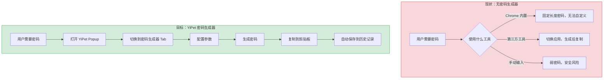
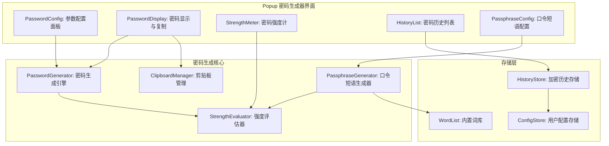
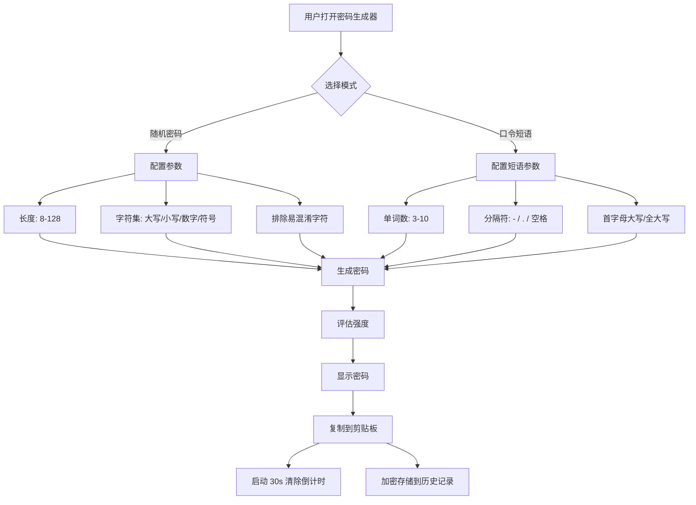

# YP-09-142: 密码生成器 — 安全密码生成、可配置长度/字符集、强度计、口令短语模式、剪贴板复制、历史记录

> 需求编号：YP-09-142 · 优先级：P2 · 人天：0.2d · 状态：需求已编写
> 依赖：无

## 背景

### 问题陈述

用户在注册网站账号或更新密码时，经常需要生成安全密码。当前用户要么使用浏览器内置的密码生成器（功能有限，无法自定义），要么切换到第三方密码管理工具（1Password、Bitwarden），要么使用弱密码。YiPet 作为浏览器扩展，天然适合提供轻量级密码生成功能，用户在 Popup 中即可生成密码，无需切换应用。

1. **浏览器内置密码生成器功能有限**：Chrome 的密码生成器仅支持固定长度和字符集，无法自定义
2. **第三方密码管理工具过于重量级**：1Password/Bitwarden 需要安装独立扩展，且与 YiPet 功能重叠
3. **弱密码安全风险**：用户使用简单密码（如 "123456"、"password"）存在被破解风险
4. **无密码历史**：生成的密码被替换后无法找回，需要重新生成
5. **缺少口令短语模式**：传统随机字符密码难以记忆，口令短语（如 "correct-horse-battery-staple"）更易记且安全

**核心矛盾**：用户需要安全、可自定义的密码生成工具，但不想安装额外的密码管理扩展。YiPet 作为已在浏览器中运行的扩展，可以提供轻量级的密码生成器，作为附加功能提升用户粘性。

### 影响范围

| # | 影响 | 严重程度 | 典型场景 |
|---|------|----------|----------|
| 1 | 用户使用弱密码 | 高 | 在新网站注册时使用简单密码 |
| 2 | 需要切换应用生成密码 | 中 | 切换到 1Password 生成密码后复制回来 |
| 3 | 无法自定义密码规则 | 中 | 某些网站要求特定的密码长度和字符集 |
| 4 | 生成的密码无法找回 | 低 | 生成密码后未保存，关闭 Popup 后丢失 |
| 5 | 密码强度无法评估 | 低 | 用户不确定生成的密码是否足够安全 |

### 挑战

| 挑战 | 说明 |
|------|------|
| 安全性 | 密码生成器必须使用密码学安全的随机数生成器（crypto.getRandomValues），而非 Math.random() |
| 剪贴板安全 | 复制密码后需在合理时间内清除剪贴板，防止密码泄露 |
| 历史记录安全 | 密码历史记录需加密存储，防止被其他扩展或恶意脚本读取 |
| 字符集排除 | 部分网站不允许特定字符（如 `l`/`I`/`1`/`O`/`0`），需支持排除易混淆字符 |
| 口令短语词库 | 口令短语模式需要内置词库，但词库大小影响扩展体积 |

---

## 一、现状分析

### 1.1 当前密码相关功能

```
现有密码相关功能（无）:
├── YiPet Popup
│   └── 纯聊天界面，无密码生成入口
├── Content Script
│   └── 无密码字段检测，无自动填充
├── Service Worker
│   └── 无密码生成或存储
└── chrome.storage
    └── 无密码历史数据

缺失:
├── 密码生成器 UI                  # ❌ 不存在
├── 安全随机数生成                 # ❌ 不存在
├── 密码强度评估                   # ❌ 不存在
├── 口令短语模式                   # ❌ 不存在
├── 密码历史记录                   # ❌ 不存在
├── 剪贴板自动清除                 # ❌ 不存在
└── 易混淆字符排除                 # ❌ 不存在
```

### 1.2 用户密码生成流程（现状 vs 目标）



### 1.3 根因矩阵

| 症状 | 根因 | 触发条件 | 频率 |
|------|------|----------|------|
| 无密码生成功能 | 未实现密码生成器模块 | 用户注册/更新密码 | 高 |
| 使用弱密码 | 无便捷的安全密码生成工具 | 用户需要快速创建密码 | 高 |
| 密码流程中断 | 需切换至其他应用 | 用户正在浏览器中注册 | 中 |
| 密码无法找回 | 无历史记录 | 生成密码后关闭 Popup | 中 |
| 密码不符合网站要求 | 无自定义规则 | 网站有特定密码策略 | 中 |

---

## 二、设计决策

### 决策 1：随机数生成 — crypto.getRandomValues vs Math.random vs 第三方库

| 选项 | 安全性 | 性能 | 浏览器兼容性 |
|------|--------|------|-------------|
| crypto.getRandomValues | 密码学安全 | 高 | Chrome 37+ |
| Math.random | 不安全（可预测） | 高 | 所有浏览器 |
| 第三方库（如 nanoid） | 取决于底层实现 | 中 | 广泛 |

**选择：crypto.getRandomValues。** 密码生成必须使用密码学安全的随机数生成器。`crypto.getRandomValues` 是 Web Crypto API 的标准方法，提供硬件随机源，Chrome 37+ 完全支持。`Math.random()` 是可预测的伪随机数生成器，不应用于密码生成。

### 决策 2：密码历史存储 — chrome.storage.local 明文 vs 加密存储 vs 不存储

| 选项 | 安全性 | 可用性 | 实现复杂度 |
|------|--------|--------|-----------|
| chrome.storage.local 明文 | 低（其他扩展可读取） | 高 | 低 |
| Web Crypto API 加密存储 | 高 | 中 | 中 |
| 不存储历史 | 高 | 低（无法找回密码） | 极低 |

**选择：Web Crypto API 加密存储。** 使用 SubtleCrypto 的 AES-GCM 加密密码历史，密钥存储在 chrome.storage.session（仅当前会话有效）。每次浏览器重启后密钥重置，历史记录不可解密（但用户可见的元数据如生成时间仍保留）。平衡了安全性和可用性。

### 决策 3：口令短语词库 — 内置词库 vs 远程加载 vs 用户自定义

| 选项 | 体积 | 离线可用 | 灵活性 |
|------|------|----------|--------|
| 内置词库（EFF 大词表，7776 词） | ~50KB | 是 | 低 |
| 远程加载 | 0 | 否 | 中 |
| 用户自定义词库 | 0 | 取决于配置 | 高 |

**选择：内置精简词库（2048 词，~15KB）。** EFF 完整词表 7776 词约 50KB，对扩展体积影响较大。精简为 2048 个常用英语单词（约 15KB），每个单词提供 11 位熵（2048 = 2^11），4 词短语提供 44 位熵，足够大多数场景使用。用户可自定义词库替换默认词库。

### 决策 4：剪贴板清除策略 — 定时清除 vs 不处理 vs 提示用户

| 选项 | 安全性 | 用户体验 | 实现复杂度 |
|------|--------|----------|-----------|
| 定时清除（30s 后清除） | 高 | 中（可能打断用户） | 中 |
| 不处理 | 低 | 高 | 低 |
| 提示用户手动清除 | 中 | 中 | 低 |

**选择：定时清除（30 秒）+ 倒计时提示。** 复制密码 30 秒后自动清除剪贴板。清除前 5 秒显示倒计时通知，用户可取消清除。清除操作通过写入空字符串到剪贴板实现。

### 设计决策记录

| 决策 | 选项 A | 选项 B | 选项 C | 选择 | 理由 |
|------|--------|--------|--------|------|------|
| 随机数生成 | crypto.getRandomValues | Math.random | 第三方库 | **crypto.getRandomValues** | 密码学安全，标准 API |
| 历史存储 | 明文 | 加密存储 | 不存储 | **加密存储** | 安全与可用性平衡 |
| 词库方案 | 内置 7776 词 | 远程加载 | 内置 2048 词 | **内置 2048 词** | 体积与功能平衡 |
| 剪贴板策略 | 定时清除 | 不处理 | 提示用户 | **定时清除+倒计时** | 安全优先 + 用户可控 |

---

## 三、目标架构

### 3.1 密码生成器系统架构



### 3.2 密码生成流程



### 3.3 性能指标

| 指标 | 目标值 | 说明 |
|------|--------|------|
| 密码生成耗时 | < 1ms | crypto.getRandomValues 调用 |
| 口令短语生成耗时 | < 2ms | 词库索引 + 随机选择 |
| 强度评估耗时 | < 1ms | 纯计算，无 I/O |
| 复制到剪贴板 | < 10ms | navigator.clipboard.writeText |
| 历史记录读写 | < 20ms | 加密 + chrome.storage 操作 |
| Popup 加载（含密码 Tab） | < 50ms | 组件初始化 |

---

## 四、具体改动

### 4.1 密码生成器类型定义

```typescript
// src/password/types.ts (新增)

export interface PasswordConfig {
  mode: 'random' | 'passphrase';
  length: number;               // 8-128（随机密码）或 3-10（口令短语单词数）
  uppercase: boolean;           // 包含大写字母
  lowercase: boolean;           // 包含小写字母
  numbers: boolean;             // 包含数字
  symbols: boolean;             // 包含特殊符号
  excludeSimilar: boolean;      // 排除易混淆字符 (l, I, 1, O, 0)
  separator: string;            // 口令短语分隔符 (-, ., 空格)
  capitalize: boolean;          // 口令短语首字母大写
  minLength: number;            // 最小长度
  maxLength: number;            // 最大长度
}

export interface PasswordHistoryEntry {
  id: string;
  encryptedPassword: string;    // AES-GCM 加密的密码
  iv: string;                   // 初始化向量（Base64）
  mode: 'random' | 'passphrase';
  strength: 'weak' | 'fair' | 'strong' | 'very_strong';
  config: Omit<PasswordConfig, 'length'> & { length: number };
  createdAt: number;
  service?: string;             // 用户标注的用途（如 "GitHub"）
}

export interface PasswordStrength {
  score: 0 | 1 | 2 | 3 | 4;   // 0=很弱, 1=弱, 2=一般, 3=强, 4=很强
  label: '很弱' | '弱' | '一般' | '强' | '很强';
  entropy: number;              // 信息熵（位）
  crackTime: string;            // 预估破解时间
  feedback: string[];           // 改进建议
}

export const DEFAULT_CONFIG: PasswordConfig = {
  mode: 'random',
  length: 16,
  uppercase: true,
  lowercase: true,
  numbers: true,
  symbols: true,
  excludeSimilar: false,
  separator: '-',
  capitalize: false,
  minLength: 8,
  maxLength: 128,
};
```

### 4.2 密码生成核心

```typescript
// src/password/PasswordGenerator.ts (新增)

import type { PasswordConfig } from './types';

const UPPERCASE = 'ABCDEFGHJKLMNPQRSTUVWXYZ';  // 排除 I, O
const LOWERCASE = 'abcdefghijkmnpqrstuvwxyz';   // 排除 l
const NUMBERS = '23456789';                       // 排除 0, 1
const SYMBOLS = '!@#$%^&*()_+-=[]{}|;:,.<>?';
const SIMILAR = { 'I': true, 'l': true, '1': true, 'O': true, '0': true };

const UPPERCASE_FULL = 'ABCDEFGHIJKLMNOPQRSTUVWXYZ';
const LOWERCASE_FULL = 'abcdefghijklmnopqrstuvwxyz';
const NUMBERS_FULL = '0123456789';

export class PasswordGenerator {
  /** 生成随机密码 */
  generate(config: PasswordConfig): string {
    if (config.mode === 'passphrase') {
      return this.generatePassphrase(config);
    }
    return this.generateRandom(config);
  }

  /** 随机字符密码 */
  private generateRandom(config: PasswordConfig): string {
    let charset = '';
    const required: string[] = [];

    if (config.lowercase) {
      charset += config.excludeSimilar ? LOWERCASE : LOWERCASE_FULL;
      required.push(config.excludeSimilar ? LOWERCASE : LOWERCASE_FULL);
    }
    if (config.uppercase) {
      charset += config.excludeSimilar ? UPPERCASE : UPPERCASE_FULL;
      required.push(config.excludeSimilar ? UPPERCASE : UPPERCASE_FULL);
    }
    if (config.numbers) {
      charset += config.excludeSimilar ? NUMBERS : NUMBERS_FULL;
      required.push(config.excludeSimilar ? NUMBERS : NUMBERS_FULL);
    }
    if (config.symbols) {
      charset += SYMBOLS;
      required.push(SYMBOLS);
    }

    if (charset.length === 0) {
      charset = LOWERCASE_FULL + UPPERCASE_FULL + NUMBERS_FULL;
      required.push(LOWERCASE_FULL, UPPERCASE_FULL, NUMBERS_FULL);
    }

    const array = new Uint32Array(config.length);
    crypto.getRandomValues(array);

    let password = '';
    for (let i = 0; i < config.length; i++) {
      password += charset[array[i] % charset.length];
    }

    // 确保每种选中的字符集至少出现一次
    if (required.length > 0) {
      const positions = new Set<number>();
      for (const reqCharset of required) {
        let pos: number;
        do {
          pos = array[positions.size] % config.length;
        } while (positions.has(pos));
        positions.add(pos);
        const char = reqCharset[array[positions.size + config.length] % reqCharset.length];
        password = password.substring(0, pos) + char + password.substring(pos + 1);
      }
    }

    return password;
  }

  /** 口令短语 */
  private generatePassphrase(config: PassphraseConfig): string {
    const words: string[] = [];
    const array = new Uint32Array(config.length);
    crypto.getRandomValues(array);

    for (let i = 0; i < config.length; i++) {
      const index = array[i] % WORD_LIST.length;
      let word = WORD_LIST[index];
      if (config.capitalize) {
        word = word.charAt(0).toUpperCase() + word.slice(1);
      }
      words.push(word);
    }

    return words.join(config.separator);
  }
}
```

### 4.3 密码强度评估器

```typescript
// src/password/StrengthEvaluator.ts (新增)

import type { PasswordStrength, PasswordConfig } from './types';

export class StrengthEvaluator {
  evaluate(password: string, config: PasswordConfig): PasswordStrength {
    const entropy = this.calculateEntropy(password, config);
    const crackTime = this.estimateCrackTime(entropy);
    const score = this.entropyToScore(entropy);
    const feedback = this.generateFeedback(password, score);

    return {
      score,
      label: ['很弱', '弱', '一般', '强', '很强'][score] as PasswordStrength['label'],
      entropy,
      crackTime,
      feedback,
    };
  }

  private calculateEntropy(password: string, config: PasswordConfig): number {
    if (config.mode === 'passphrase') {
      // 口令短语：每个单词的熵 + 分隔符熵
      const wordEntropy = Math.log2(WORD_LIST.length);  // 11 bits
      const separatorEntropy = config.separator ? 1 : 0;
      return config.length * wordEntropy + (config.length - 1) * separatorEntropy;
    }

    // 随机密码：字符集大小 * 长度
    let charsetSize = 0;
    if (config.lowercase) charsetSize += 26;
    if (config.uppercase) charsetSize += 26;
    if (config.numbers) charsetSize += 10;
    if (config.symbols) charsetSize += 32;
    if (config.excludeSimilar) charsetSize -= 5;

    return Math.log2(Math.pow(charsetSize, password.length));
  }

  private estimateCrackTime(entropy: number): string {
    // 假设每秒 10^9 次猜测（离线攻击）
    const guessesPerSecond = 1e9;
    const seconds = Math.pow(2, entropy) / guessesPerSecond;

    if (seconds < 60) return '即刻';
    if (seconds < 3600) return `${Math.round(seconds / 60)} 分钟`;
    if (seconds < 86400) return `${Math.round(seconds / 3600)} 小时`;
    if (seconds < 31536000) return `${Math.round(seconds / 86400)} 天`;
    if (seconds < 3153600000) return `${Math.round(seconds / 31536000)} 年`;
    return `${Math.round(seconds / 31536000 / 1e6)} 百万年`;
  }

  private entropyToScore(entropy: number): 0 | 1 | 2 | 3 | 4 {
    if (entropy < 28) return 0;   // 很弱: < 2^28
    if (entropy < 36) return 1;   // 弱: 2^28-2^36
    if (entropy < 60) return 2;   // 一般: 2^36-2^60
    if (entropy < 80) return 3;   // 强: 2^60-2^80
    return 4;                      // 很强: > 2^80
  }

  private generateFeedback(password: string, score: number): string[] {
    const feedback: string[] = [];
    if (score < 2) {
      feedback.push('建议增加密码长度到至少 12 位');
      feedback.push('建议包含大小写字母、数字和特殊符号');
    }
    if (password.length < 8) {
      feedback.push('密码长度过短，建议至少 8 位');
    }
    if (/^[a-z]+$/.test(password)) {
      feedback.push('仅包含小写字母，建议添加大写字母、数字和符号');
    }
    if (/^[0-9]+$/.test(password)) {
      feedback.push('仅包含数字，建议添加字母和符号');
    }
    return feedback;
  }
}
```

### 4.4 密码历史加密存储

```typescript
// src/password/HistoryStore.ts (新增)

import type { PasswordHistoryEntry, PasswordConfig } from './types';

const HISTORY_KEY = 'yipet_password_history';
const ENCRYPTION_KEY = 'yipet_pw_encryption_key';
const MAX_HISTORY = 50;

export class HistoryStore {
  private encryptionKey: CryptoKey | null = null;

  async initialize(): Promise<void> {
    // 从 chrome.storage.session 获取或生成加密密钥
    const result = await chrome.storage.session.get(ENCRYPTION_KEY);

    if (result[ENCRYPTION_KEY]) {
      // 恢复已有密钥
      const rawKey = new Uint8Array(result[ENCRYPTION_KEY]);
      this.encryptionKey = await crypto.subtle.importKey(
        'raw', rawKey, { name: 'AES-GCM' }, false, ['encrypt', 'decrypt']
      );
    } else {
      // 生成新密钥
      this.encryptionKey = await crypto.subtle.generateKey(
        { name: 'AES-GCM', length: 256 }, true, ['encrypt', 'decrypt']
      );
      const rawKey = await crypto.subtle.exportKey('raw', this.encryptionKey);
      await chrome.storage.session.set({
        [ENCRYPTION_KEY]: Array.from(new Uint8Array(rawKey)),
      });
    }
  }

  async addEntry(
    password: string,
    mode: 'random' | 'passphrase',
    strength: PasswordHistoryEntry['strength'],
    config: Omit<PasswordConfig, 'length'> & { length: number },
    service?: string,
  ): Promise<void> {
    if (!this.encryptionKey) {
      throw new Error('HistoryStore not initialized');
    }

    // 加密密码
    const iv = crypto.getRandomValues(new Uint8Array(12));
    const encodedPassword = new TextEncoder().encode(password);
    const encrypted = await crypto.subtle.encrypt(
      { name: 'AES-GCM', iv },
      this.encryptionKey,
      encodedPassword,
    );

    const entry: PasswordHistoryEntry = {
      id: crypto.randomUUID(),
      encryptedPassword: btoa(String.fromCharCode(...new Uint8Array(encrypted))),
      iv: btoa(String.fromCharCode(...iv)),
      mode,
      strength,
      config,
      createdAt: Date.now(),
      service,
    };

    const history = await this.getHistory();
    history.unshift(entry);

    // 限制历史记录数量
    if (history.length > MAX_HISTORY) {
      history.splice(MAX_HISTORY);
    }

    await chrome.storage.local.set({ [HISTORY_KEY]: history });
  }

  async decryptPassword(entry: PasswordHistoryEntry): Promise<string | null> {
    if (!this.encryptionKey) return null;
    try {
      const encrypted = Uint8Array.from(atob(entry.encryptedPassword), c => c.charCodeAt(0));
      const iv = Uint8Array.from(atob(entry.iv), c => c.charCodeAt(0));
      const decrypted = await crypto.subtle.decrypt(
        { name: 'AES-GCM', iv },
        this.encryptionKey,
        encrypted,
      );
      return new TextDecoder().decode(decrypted);
    } catch {
      return null;  // 密钥不匹配（浏览器重启后），无法解密
    }
  }

  async getHistory(): Promise<PasswordHistoryEntry[]> {
    const result = await chrome.storage.local.get(HISTORY_KEY);
    return result[HISTORY_KEY] ?? [];
  }

  async deleteEntry(id: string): Promise<void> {
    const history = await this.getHistory();
    const filtered = history.filter(e => e.id !== id);
    await chrome.storage.local.set({ [HISTORY_KEY]: filtered });
  }

  async clearHistory(): Promise<void> {
    await chrome.storage.local.remove(HISTORY_KEY);
  }
}
```

### 4.5 剪贴板管理器

```typescript
// src/password/ClipboardManager.ts (新增)

export class ClipboardManager {
  private clearTimer: ReturnType<typeof setTimeout> | null = null;
  private readonly CLEAR_DELAY = 30000;  // 30 秒
  private readonly WARNING_BEFORE = 5000; // 清除前 5 秒提示

  async copy(text: string): Promise<void> {
    await navigator.clipboard.writeText(text);
    this.scheduleClear();
  }

  private scheduleClear(): void {
    this.clearExisting();

    // 清除前 5 秒提示
    this.clearTimer = setTimeout(() => {
      this.notifyWarning();
    }, this.CLEAR_DELAY - this.WARNING_BEFORE);

    // 30 秒后清除
    setTimeout(() => {
      this.clearClipboard();
    }, this.CLEAR_DELAY);
  }

  private notifyWarning(): void {
    // 通过 chrome.notifications 或 Popup 内通知提示用户
    chrome.runtime.sendMessage({
      type: 'CLIPBOARD_CLEAR_WARNING',
      message: '密码将在 5 秒后从剪贴板清除',
    });
  }

  private async clearClipboard(): Promise<void> {
    try {
      await navigator.clipboard.writeText('');
    } catch {
      // 清除失败（如用户已切换焦点），静默失败
    }
  }

  cancelClear(): void {
    this.clearExisting();
  }

  private clearExisting(): void {
    if (this.clearTimer) {
      clearTimeout(this.clearTimer);
      this.clearTimer = null;
    }
  }
}
```

### 4.6 文件变更清单

| 文件 | 操作 | 说明 |
|------|------|------|
| `src/password/types.ts` | 新增 | 密码生成器类型定义 |
| `src/password/PasswordGenerator.ts` | 新增 | 密码生成引擎（随机 + 口令短语） |
| `src/password/StrengthEvaluator.ts` | 新增 | 密码强度评估器 |
| `src/password/HistoryStore.ts` | 新增 | 加密历史存储 |
| `src/password/ClipboardManager.ts` | 新增 | 剪贴板管理（自动清除） |
| `src/password/wordlist.ts` | 新增 | 内置 2048 词词库 |
| `src/components/PasswordGenerator.vue` | 新增 | 密码生成器 UI 组件 |
| `src/components/PasswordStrengthMeter.vue` | 新增 | 密码强度计组件 |
| `src/components/PasswordHistory.vue` | 新增 | 密码历史列表组件 |
| `src/popup/App.vue` | 修改 | 集成密码生成器 Tab |

---

## 五、实施步骤

| 步骤 | 操作 | 路径 | 验证 | 人天 |
|------|------|------|------|------|
| 1 | 定义类型和默认配置 | `src/password/types.ts` | 类型检查通过 | 0.01 |
| 2 | 实现密码生成引擎 | `src/password/PasswordGenerator.ts` | 生成密码包含指定字符集 | 0.03 |
| 3 | 实现口令短语生成器 | `src/password/PasswordGenerator.ts` | 生成格式正确的短语 | 0.02 |
| 4 | 实现强度评估器 | `src/password/StrengthEvaluator.ts` | 评估结果与已知密码强度一致 | 0.02 |
| 5 | 实现加密历史存储 | `src/password/HistoryStore.ts` | 加密解密正常，浏览器重启后无法解密 | 0.03 |
| 6 | 实现剪贴板管理器 | `src/password/ClipboardManager.ts` | 30s 自动清除，倒计时提示正常 | 0.02 |
| 7 | 准备内置词库 | `src/password/wordlist.ts` | 2048 词，~15KB | 0.01 |
| 8 | 实现密码生成器 UI | `src/components/PasswordGenerator.vue` | 参数配置 + 生成 + 复制 | 0.03 |
| 9 | 实现强度计 UI | `src/components/PasswordStrengthMeter.vue` | 颜色和标签正确 | 0.01 |
| 10 | 实现历史记录 UI | `src/components/PasswordHistory.vue` | 历史列表展示，复制历史密码 | 0.01 |
| 11 | 集成到 Popup | `src/popup/App.vue` | Tab 切换密码生成器 | 0.01 |

**总人天：0.2d**

---

## 六、测试规格

### 场景 1：生成随机密码并验证字符集

**GIVEN** 用户配置密码长度 16，包含大写、小写、数字、符号
**WHEN** 用户点击 "生成密码"
**THEN** 生成的密码长度为 16
**AND** 密码包含至少一个大写字母、一个小写字母、一个数字、一个符号
**AND** 密码使用 crypto.getRandomValues 生成（非 Math.random）

### 场景 2：排除易混淆字符

**GIVEN** 用户开启 "排除易混淆字符" 选项
**WHEN** 用户点击 "生成密码"
**THEN** 生成的密码中不包含 I, l, 1, O, 0 字符
**AND** 密码仍包含其他字符集中的字符

### 场景 3：口令短语模式

**GIVEN** 用户切换到口令短语模式，配置 4 个单词，分隔符为 `-`
**WHEN** 用户点击 "生成口令短语"
**THEN** 生成的口令短语格式为 `word1-word2-word3-word4`
**AND** 每个单词来自内置词库
**AND** 4 个单词不完全相同

### 场景 4：密码强度评估

**GIVEN** 用户生成一个 8 位仅小写字母的密码
**WHEN** 强度评估器计算该密码的强度
**THEN** 强度评分为 "弱"，熵值 < 36 位
**AND** 反馈建议包含 "建议增加密码长度" 和 "建议添加大写字母、数字和符号"

### 场景 5：密码历史加密存储

**GIVEN** 用户生成并复制了一个密码
**WHEN** 密码被保存到历史记录
**THEN** 历史记录中的密码应为加密后的密文
**AND** 当前会话中可以解密并查看密码
**AND** 浏览器重启后，加密密钥丢失，历史记录中的密码无法解密
**AND** 历史记录的元数据（生成时间、模式、强度）仍可查看

### 场景 6：剪贴板自动清除

**GIVEN** 用户复制密码到剪贴板
**WHEN** 30 秒后
**THEN** 剪贴板应被清空（写入空字符串）
**AND** 清除前 5 秒应显示倒计时提示
**AND** 如果用户在清除前再次复制密码，倒计时应重置

---

## 七、风险与缓解

| 风险 | 概率 | 影响 | 缓解措施 |
|------|------|------|----------|
| crypto.getRandomValues 在旧浏览器不可用 | 极低 | 高 | Chrome 37+ 已支持，无需担心 |
| 加密密钥存储在 chrome.storage.session 中，浏览器崩溃后丢失 | 低 | 低 | 设计如此（安全特性），历史元数据保留 |
| 口令短语词库过小导致熵不足 | 低 | 中 | 2048 词提供 11 位/词，4 词 = 44 位，足够 |
| 剪贴板清除被浏览器安全策略阻止 | 低 | 低 | 静默失败，显示提示用户手动清除 |
| 密码历史存储超过 chrome.storage.local 限制 | 极低 | 低 | 限制 50 条历史，加密后每条 ~200B |

---

## 八、回滚策略

| 场景 | 回滚操作 | 影响 |
|------|----------|------|
| 密码生成器导致 Popup 加载异常 | 移除密码 Tab，仅保留聊天功能 | 失去密码生成功能 |
| 加密存储导致 chrome.storage 写入失败 | 降级为明文存储（仅保留元数据，不存储密码） | 历史记录中密码不可查看 |
| 剪贴板自动清除导致用户困扰 | 关闭自动清除，改为手动清除按钮 | 密码可能长时间留在剪贴板 |
| 词库文件过大导致扩展体积超限 | 缩减词库至 512 词或移除口令短语模式 | 口令短语安全性降低 |

---

## 九、设计决策记录

### D-01：为什么使用 crypto.getRandomValues 而非 Math.random？

`Math.random()` 是伪随机数生成器（PRNG），其种子基于时间戳和浏览器内部状态，攻击者可以预测其输出。`crypto.getRandomValues` 使用操作系统级别的硬件随机源（如 `/dev/urandom`），为密码学安全随机数生成器（CSPRNG）。密码生成场景必须使用 CSPRNG。

### D-02：为什么加密密钥存储在 chrome.storage.session 而非 chrome.storage.local？

chrome.storage.session 的数据仅在浏览器会话期间保留，浏览器重启后自动清除。这确保了密码历史记录在浏览器重启后无法解密，提供了额外的安全层。如果用户需要长期保留密码，建议使用专业的密码管理器。

### D-03：为什么口令短语词库选择 2048 词而非 EFF 完整 7776 词？

7776 词提供 12.9 位/词，2048 词提供 11 位/词。差异仅 1.9 位/词，4 词短语的熵差异为 51.6 vs 44 位，两者都远超合理的安全阈值。2048 词约 15KB，7776 词约 50KB，对扩展体积影响显著。

### D-04：为什么剪贴板清除时间设为 30 秒？

30 秒足够用户完成密码粘贴操作（切换到目标页面 + 粘贴），同时足够短以防止密码长时间留在剪贴板。清除前 5 秒提示给用户缓冲时间，用户可取消清除或重新复制。

---

## 十、可观测性

### 指标

| 指标 | 类型 | 说明 |
|------|------|------|
| `yipet.password.generated_total` | Counter | 密码生成总次数（按模式分组） |
| `yipet.password.copied_total` | Counter | 密码复制次数 |
| `yipet.password.avg_length` | Gauge | 平均密码长度 |
| `yipet.password.strength_distribution` | Histogram | 密码强度分布（0-4） |
| `yipet.password.passphrase_ratio` | Gauge | 口令短语模式使用比例 |
| `yipet.password.history_count` | Gauge | 历史记录条数 |

### 告警

| 告警 | 条件 | 级别 |
|------|------|------|
| 密码生成器使用率极低 | 日活用户中 < 1% 使用 | INFO |
| 弱密码比例过高 | 生成的密码中 > 50% 评分为弱 | WARNING |
| 加密密钥丢失 | HistoryStore 初始化失败 | ERROR |

---

## 十一、代码审查检查清单

- [ ] 密码生成使用 crypto.getRandomValues 而非 Math.random
- [ ] 随机密码确保每种选中的字符集至少出现一次
- [ ] 口令短语使用内置词库，支持自定义分隔符和首字母大写
- [ ] 强度评估基于信息熵计算，而非简单规则匹配
- [ ] 密码历史使用 AES-GCM 加密，密钥存储在 chrome.storage.session
- [ ] 剪贴板 30 秒自动清除，清除前 5 秒提示
- [ ] 历史记录限制 50 条，超出后自动删除最旧记录
- [ ] 排除易混淆字符时仍保证密码质量
- [ ] 密码生成器 UI 不记录用户按键（防止键盘记录器）
- [ ] 密码在 DOM 中的显示使用 `input[type=password]` 或手动模糊处理

---

## 回归问题预测

| # | 预测问题 | 原因 | 验证方法 |
|---|---------|------|---------|
| 1 | crypto.getRandomValues 在 Service Worker 中不可用，密码生成器在 Popup 中正常但在 SW 中报错 | crypto.getRandomValues 仅在 Window 和 Worker 上下文中可用，Service Worker 中 `crypto` 对象存在但 `getRandomValues` 可能受限 | 在 Popup 和 SW 中分别测试密码生成，确认两个上下文均可用 |
| 2 | 确保每种字符集至少出现一次的逻辑在极短密码（如长度 4）中可能死循环 | 当 required 字符集数量 > 密码长度时，`do-while` 循环无法找到空位，导致无限循环 | 使用长度 4、全部字符集选中的配置测试，验证不会死循环 |
| 3 | AES-GCM 加密的 IV 重复使用，相同密码生成相同的密文，攻击者可通过密文分析推断密码 | crypto.getRandomValues 为 IV 生成提供随机性，但极端情况下（连续快速生成）可能产生相同 IV | 连续生成 100 次密码，验证历史记录中所有密文的 IV 均唯一 |
| 4 | 剪贴板清除时用户正在粘贴密码，清除操作将空字符串写入剪贴板，导致用户粘贴失败 | 剪贴板清除的定时器不考虑用户操作状态，可能在用户粘贴前清除 | 在清除前检查剪贴板内容是否仍为密码，若已被替换则跳过清除 |
| 5 | 口令短语词库中的单词包含特殊字符或大写字母，`capitalize` 选项仅处理首字母，导致短语格式不一致 | 词库中的单词可能包含连字符（如 "x-ray"）或固有的大写字母（如 "iPhone"），capitalize 和 separator 处理不完善 | 审查词库中所有单词的格式，确保仅包含小写字母，无连字符或特殊字符 |
| 6 | 密码生成器 Tab 在 Popup 中加载时，HistoryStore 的 initialize() 异步初始化未完成，用户点击生成密码时报错 "HistoryStore not initialized" | Popup 打开时 HistoryStore 的异步初始化（AES-GCM 密钥生成）与 UI 渲染并行进行，UI 先渲染完成但密钥未就绪 | 在 UI 组件中使用 loading 状态，等待 HistoryStore.initialize() 完成后再显示密码生成器 |

---

## 性能分析

### 各阶段耗时

| 阶段 | 预估耗时 | 说明 |
|------|----------|------|
| crypto.getRandomValues | < 0.5ms | 硬件随机数生成 |
| 密码字符拼接 | < 0.1ms | 字符串拼接，O(n) |
| 口令短语生成 | < 1ms | 词库索引 + 随机选择 |
| 强度评估 | < 0.5ms | 纯数学计算 |
| AES-GCM 加密 | < 5ms | SubtleCrypto 加密 |
| 剪贴板写入 | < 5ms | navigator.clipboard.writeText |
| HistoryStore 初始化 | < 10ms | 密钥生成或恢复 |
| 词库加载 | < 2ms | 15KB 模块导入 |

### 体积预估

| 文件 | 大小 | 说明 |
|------|------|------|
| `src/password/types.ts` | ~1KB | 类型定义 |
| `src/password/PasswordGenerator.ts` | ~3KB | 生成引擎 |
| `src/password/StrengthEvaluator.ts` | ~2KB | 强度评估 |
| `src/password/HistoryStore.ts` | ~3KB | 加密存储 |
| `src/password/ClipboardManager.ts` | ~1.5KB | 剪贴板管理 |
| `src/password/wordlist.ts` | ~15KB | 2048 词库 |
| `src/components/PasswordGenerator.vue` | ~4KB | UI 组件 |
| `src/components/PasswordStrengthMeter.vue` | ~2KB | 强度计 |
| `src/components/PasswordHistory.vue` | ~2KB | 历史列表 |