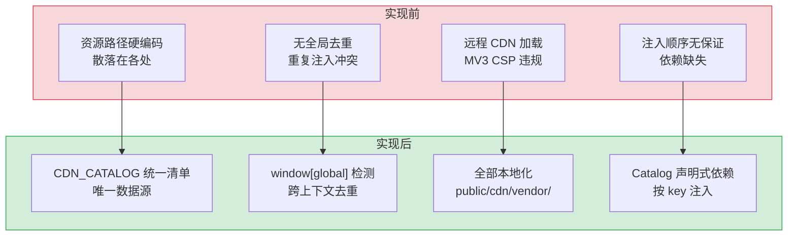
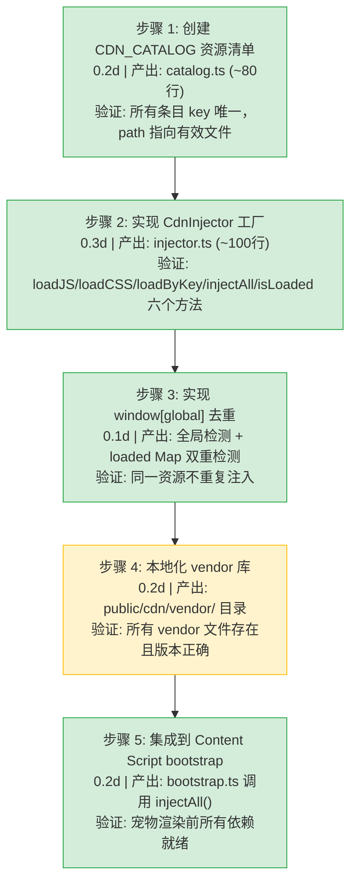

# CDN 资源加载系统

> 需求编号：YP-09-08 · 优先级：P1 · 人天：1.0d · 状态：已完成
> 依赖：无

## 背景

YiPet 作为 Chrome MV3 扩展，需要向宿主页面注入 Vue 3.5、Element Plus、jQuery 等第三方库以支持 Content Script 和 MAIN 世界的宠物渲染。MV3 的 CSP（Content Security Policy）禁止远程 CDN 加载，所有资源必须本地化。

需要一个系统化的 CDN 资源管理方案：统一的资源目录（Catalog）、按需注入机制（Injector）、全局已加载检测（去重）、以及 MV3 CSP 合规保证。

---

## 一、现状分析

### 1.1 当前问题

| # | 问题 | 严重程度 | 影响 |
|---|------|----------|------|
| 1 | 无统一的资源目录 | 高 | 资源路径散落在各处，重复加载或遗漏加载 |
| 2 | 无全局去重检测 | 中 | 同一资源可能被多次注入，产生 JS 运行时冲突 |
| 3 | MV3 CSP 禁止远程 CDN | 高 | 必须所有资源本地化，否则扩展拒绝加载 |
| 4 | 注入顺序依赖无保证 | 中 | CSS/JS 依赖关系（如 Bootstrap 依赖 jQuery）未显式管理 |

### 1.2 当前调用链

```
Content Script bootstrap
  │ createInjector(chrome.runtime.getURL('cdn/'))
  ▼
CDN Injector
  ├── injectAll()  → 遍历 CDN_CATALOG，按需注入
  │     ├── loadJS(path)  → 创建 <script> 标签，异步加载
  │     │     └── 检查 window[global] 是否已存在 → 跳过
  │     └── loadCSS(path) → 创建 <link> 标签，同步加载
  │           └── 检查 loaded Map 是否已记录 → 跳过
  ├── loadByKey('vue')  → 按 key 注入单个资源
  └── isLoaded('vue')   → 查询 loaded Map
```

---

## 二、设计决策

### D-01: 为什么使用 Catalog + Injector 两层架构？

Catalog 是数据层（声明式资源清单），Injector 是执行层（DOM 操作）。两层分离后，新增资源只需在 Catalog 中添加一行条目，Injector 无需修改。Catalog 的 `global` 字段提供全局去重检测，避免重复注入。

### D-02: 为什么 JS 异步加载而 CSS 同步加载？

JS 资源通过 `<script>` 标签异步加载（`Promise` 包装 `onload/onerror`），避免阻塞页面渲染。CSS 资源同步加载（`<link>` 标签直接插入 `<head>`），确保样式在宠物渲染前已就绪，避免 FOUC（Flash of Unstyled Content）。

### D-03: 为什么使用 `window[global]` 检测而非 `loaded Map`？

`window[global]` 检测跨执行上下文（ISOLATED 和 MAIN 世界共享 `window` 对象），比 `loaded Map`（仅当前上下文）更可靠。当多个 Content Script 实例或不同页面重用同一全局时，`window[global]` 检测能正确跳过已加载的资源。

### D-04: 为什么所有 vendor 库放在 `public/cdn/libs/` 而非远程加载？

MV3 CSP 要求 `content_security_policy.extension_pages` 仅允许 `self` 和 `chrome-extension://` 资源。远程 CDN 加载（如 `cdn.jsdelivr.net`）违反 CSP 并导致扩展被 Chrome Web Store 拒绝。本地化资源确保审核通过。

### D-05: 为什么不使用 ES Module `import` 加载 vendor 库？

| 方案 | 描述 | 优点 | 缺点 |
|------|------|------|------|
| **`<script>` 标签注入（当前）** | 动态创建 `<script>` 标签，加载全局 UMD/IIFE 构建 | 与 Content Script 隔离，不影响页面自身模块系统 | 全局变量污染，需手动管理依赖顺序 |
| ES Module `import()` | 动态 `import(vendorUrl)` 加载 ESM 构建 | 标准化模块加载，依赖自动解析 | Content Script 的 `import()` 受页面 CSP 限制，可能被阻止 |

**选择：`<script>` 标签注入**。理由：Content Script 运行在宿主页面的上下文中，宿主页面的 CSP 可能禁止 `import()` 或限制 `script-src`。`<script>` 标签通过 `chrome.runtime.getURL()` 获取 `chrome-extension://` 协议的资源 URL，绕过宿主页面 CSP 限制（MV3 允许扩展自身的资源加载）。

### D-06: 为什么使用工厂函数 `createInjector(baseUrl)` 而非 Class？

| 方案 | 描述 | 优点 | 缺点 |
|------|------|------|------|
| **工厂函数（当前）** | `createInjector(baseUrl)` 返回 `CdnInjector` 对象 | 闭包私有状态（`loaded Map`），无 `this` 绑定问题 | 无法使用 `instanceof` 检查 |
| Class | `class CdnInjector` 实例化 | 标准 OOP，可扩展 | 需要 `this` 绑定，方法传递时可能丢失上下文 |

**选择：工厂函数**。理由：`CdnInjector` 的方法需要作为回调传递（如 `Promise.then(injector.loadJS)`），Class 方法在传递时丢失 `this` 绑定需要额外 `.bind()`。工厂函数的闭包天然捕获私有状态，无需 `this`。Chrome 扩展场景中不需要继承和多态。

### 设计决策记录

| 决策 | 选项 A | 选项 B | 选择 | 理由 |
|------|--------|--------|------|------|
| 架构分层 | Catalog + Injector 两层 | 单体资源加载器 | **Catalog + Injector** | 数据与执行分离，新增资源只需修改 Catalog |
| JS 加载方式 | 异步（Promise） | 同步（阻塞） | **异步** | 避免阻塞页面渲染 |
| CSS 加载方式 | 同步（直接插入） | 异步（Promise） | **同步** | 确保样式在宠物渲染前就绪，避免 FOUC |
| 去重检测 | `window[global]` | `loaded Map` | **双重检测** | `window[global]` 跨上下文可靠，`loaded Map` 补充 CSS |
| 资源存储 | 本地 `public/cdn/` | 远程 CDN | **本地化** | MV3 CSP 合规，CWS 审核通过 |
| 模块加载 | `<script>` 标签注入 | ES Module `import()` | **`<script>` 标签** | 绕过宿主页面 CSP，不受页面模块系统限制 |
| 实现方式 | 工厂函数 | Class | **工厂函数** | 闭包私有状态，无 `this` 绑定问题 |

---

## 三、目标架构

### 3.1 模块结构

```
src/content/cdn/
├── catalog.ts        # CDN_CATALOG 资源清单（唯一数据源）
└── injector.ts       # CdnInjector 接口 + createInjector 工厂

public/cdn/
├── vendor/           # 第三方库（vue、element-plus、jquery 等）
│   ├── vue@3.5.13/
│   ├── element-plus@2.14/
│   ├── jquery@3.7.1/
│   └── ...
├── utils/
│   └── api-client.ts # 共享 API 客户端
└── styles/
    └── variables.css # 设计变量
```

### 3.2 数据结构

```typescript
interface CdnEntry {
  key: string;       // 短 key，如 'vue'、'element-plus'
  path: string;      // 相对于 CDN base 的路径
  type: 'js' | 'css';
  global?: string;   // window 属性名，用于检测已加载
  desc: string;      // 可读描述
}

interface CdnInjector {
  loadJS(path: string): Promise<boolean>;
  loadCSS(path: string): boolean;
  loadByKey(key: string): Promise<boolean> | boolean;
  injectAll(): Promise<void>;
  isLoaded(path: string): boolean;
  getLoadedKeys(): string[];
}
```

### 3.3 资源清单（CDN_CATALOG）

| Key | 资源 | 类型 | 全局检测 |
|-----|------|------|----------|
| `vue` | Vue 3.5.13 | JS | `window.Vue` |
| `element-plus` | Element Plus 2.14 | CSS + JS | — |
| `jquery` | jQuery 3.7.1 | JS | `window.jQuery` |
| `popper` | Popper.js | JS | `window.Popper` |
| `bootstrap` | Bootstrap CSS | CSS | — |
| `dayjs` | dayjs | JS | `window.dayjs` |
| `marked` | marked | JS | `window.marked` |
| `echarts` | ECharts 5 | JS | `window.echarts` |
| `api-client` | 共享 API 客户端 | JS | `window.YiPetApiClient` |

---

## 四、具体改动

### 4.1 涉及文件

| 文件 | 行数 | 说明 |
|------|------|------|
| `src/content/cdn/catalog.ts` | 470 | `CDN_CATALOG` 资源清单 + `catalogByKey` 查找 |
| `src/content/cdn/injector.ts` | 124 | `CdnInjector` 接口 + `createInjector()` 工厂 |
| `public/cdn/vendor/` | — | 第三方库本地化存放目录（50+ 文件） |

### 4.2 CDN_CATALOG 资源清单（catalog.ts）

```typescript
export interface CdnEntry {
  key: string;       // 短 key，如 'vue'、'dayjs'
  path: string;      // 相对于 CDN base 的路径
  type: 'js' | 'css';
  global?: string;   // window 属性名，用于检测已加载
  desc: string;      // 可读描述
}

export const CDN_CATALOG: CdnEntry[] = [
  // Frameworks & Core
  {
    key: 'vue',
    path: 'vendor/vue@3.5.13/vue.global.prod.js',
    type: 'js',
    global: 'Vue',
    desc: 'Vue 3.5.13',
  },
  {
    key: 'jquery',
    path: 'vendor/jquery@3.7.1/jquery.min.js',
    type: 'js',
    global: 'jQuery',
    desc: 'jQuery 3.7.1',
  },
  // UI Frameworks
  {
    key: 'bootstrap',
    path: 'vendor/bootstrap@5.2.3/js/bootstrap.bundle.min.js',
    type: 'js',
    global: 'bootstrap',
    desc: 'Bootstrap 5.2.3 JS',
  },
  {
    key: 'bootstrap-css',
    path: 'vendor/bootstrap@5.2.3/css/bootstrap.min.css',
    type: 'css',
    desc: 'Bootstrap 5.2.3 CSS',
  },
  // ... 共 50+ 条目，覆盖框架、UI、动画、图表、导出、图标、轮播、工具等类别
];

// O(1) 按键查找
export const catalogByKey: Record<string, CdnEntry> = Object.fromEntries(
  CDN_CATALOG.map((e) => [e.key, e]),
);
```

### 4.3 CdnInjector 工厂实现（injector.ts）

```typescript
export interface CdnInjector {
  loadJS(path: string): Promise<boolean>;
  loadCSS(path: string): boolean;
  loadByKey(key: string): Promise<boolean> | boolean;
  injectAll(): Promise<void>;
  isLoaded(path: string): boolean;
  getLoadedKeys(): string[];
}

export function createInjector(baseUrl: string): CdnInjector {
  const loaded = new Map<string, boolean>();

  function normalizeBase(raw: string): string {
    if (raw.startsWith('chrome-extension://') || raw.startsWith('http')) {
      return raw.endsWith('/') ? raw : raw + '/';
    }
    // 相对路径修复：通过 chrome.runtime.getURL 转换为绝对路径
    try {
      if (typeof chrome !== 'undefined' && chrome.runtime?.getURL) {
        return chrome.runtime.getURL(raw.endsWith('/') ? raw : raw + '/');
      }
    } catch { /* ISOLATED world only */ }
    console.error('[YiPet CDN] baseUrl is relative, resources may fail to load:', raw);
    return raw.startsWith('/') ? raw : '/' + raw;
  }

  const BASE = normalizeBase(baseUrl);

  function loadJS(path: string): Promise<boolean> {
    return new Promise<boolean>((resolve, reject) => {
      if (loaded.has(path)) { resolve(false); return; }
      const el = document.createElement('script');
      el.src = BASE + path;
      el.onload = () => { loaded.set(path, true); resolve(true); };
      el.onerror = () => reject(new Error(`Failed to load: ${path}`));
      (document.head || document.documentElement).appendChild(el);
    });
  }

  function loadCSS(path: string): boolean {
    if (loaded.has(path)) return false;
    const el = document.createElement('link');
    el.rel = 'stylesheet';
    el.href = BASE + path;
    el.onload = () => { loaded.set(path, true); };
    (document.head || document.documentElement).appendChild(el);
    loaded.set(path, true);
    return true;
  }

  function loadByKey(key: string): Promise<boolean> | boolean {
    const entry = catalogByKey[key];
    if (!entry) {
      console.warn(`[YiPet CDN] Unknown resource: "${key}"`);
      return false;
    }
    // 全局去重：window[global] 已存在则跳过
    if (
      entry.global &&
      (window as unknown as Record<string, unknown>)[entry.global] !== undefined
    ) {
      return entry.type === 'js' ? Promise.resolve(false) : false;
    }
    return entry.type === 'js' ? loadJS(entry.path) : loadCSS(entry.path);
  }

  async function injectAll(): Promise<void> {
    // CSS 优先（顺序无关，并行加载）
    for (const entry of CDN_CATALOG) {
      if (entry.type === 'css') loadCSS(entry.path);
    }
    // JS 顺序加载（保证库间依赖关系）
    for (const entry of CDN_CATALOG) {
      if (entry.type === 'js') {
        try { await loadJS(entry.path); } catch { /* continue */ }
      }
    }
  }

  function isLoaded(path: string): boolean { return loaded.has(path); }
  function getLoadedKeys(): string[] {
    return CDN_CATALOG.filter((e) => loaded.has(e.path)).map((e) => e.key);
  }

  return { loadJS, loadCSS, loadByKey, injectAll, isLoaded, getLoadedKeys };
}
```

### 4.4 Content Script 集成

```typescript
// src/content/bootstrap.ts（ISOLATED world）
import { createInjector } from '@/content/cdn/injector';

// 使用 chrome.runtime.getURL 获取扩展资源绝对路径
const cdnBase = chrome.runtime.getURL('cdn/');
const injector = createInjector(cdnBase);

// 按优先级注入：先注入 Vue + 宠物渲染依赖，再注入其他资源
await injector.loadByKey('vue');       // 优先：宠物渲染依赖
await injector.loadByKey('jquery');    // 优先：jQuery 插件依赖
await injector.injectAll();            // 其余资源按 Catalog 顺序注入
```

### 4.5 改动汇总

| 改动 | 文件 | 行数 | 说明 |
|------|------|------|------|
| 资源清单 | `catalog.ts` | 470 | 50+ 条目，覆盖框架/UI/动画/图表/导出/图标/工具 |
| 注入器工厂 | `injector.ts` | 124 | 6 个方法：loadJS/loadCSS/loadByKey/injectAll/isLoaded/getLoadedKeys |
| Vendor 本地化 | `public/cdn/vendor/` | — | 50+ 第三方库本地文件，MV3 CSP 合规 |
| Bootstrap 集成 | `bootstrap.ts` | 10 | 优先级注入：Vue → jQuery → injectAll |

---

## 五、当前架构 vs 目标架构



### 架构决策权衡

| 维度 | 实现前 | 实现后 | 权衡说明 |
|------|--------|--------|----------|
| 资源管理 | 散落硬编码 | Catalog 统一清单 | 新增资源需维护 Catalog，但集中管理更可靠 |
| 去重机制 | 无 | `window[global]` + `loaded Map` 双重检测 | 增加检测逻辑，但消除重复注入 |
| CSP 合规 | 远程 CDN 违规 | 全部本地化 | 扩展包体积增大（~5MB），但审核通过 |
| 注入顺序 | 无保证 | Catalog 数组顺序即注入顺序 | 依赖关系需手动维护 Catalog 顺序 |

---

## 六、性能分析

### 6.1 当前性能特征

| 指标 | 当前值 | 说明 |
|------|--------|------|
| 单资源 JS 注入耗时 | 10-50ms | 取决于文件大小和浏览器缓存 |
| 单资源 CSS 注入耗时 | < 5ms | 同步 `<link>` 插入 |
| `injectAll()` 总耗时 | 100-500ms | 异步并行加载所有 JS |
| 全局去重检测耗时 | < 0.1ms | `window[global]` 属性查找 |
| 扩展包体积 | ~5MB | 所有 vendor 库本地化 |

### 6.2 性能瓶颈

| 瓶颈 | 严重程度 | 表现 | 优化方向 |
|------|----------|------|----------|
| 首次 `injectAll()` 阻塞宠物渲染 | 中 | 所有 JS 加载完毕前宠物不可见 | 优先注入 Vue + 宠物渲染，其他资源延迟加载 |
| 大文件 JS 加载延迟 | 低 | ECharts (~1MB) 加载耗时 > 200ms | 仅在使用图表的页面按需加载 |

### 6.3 性能优化

| 优化项 | 预期收益 | 实现方式 |
|--------|----------|----------|
| 分优先级注入 | 宠物可见时间从 500ms 降至 100ms | Vue → 宠物渲染 → 其他资源 |
| 资源预加载 | 切换页面时资源已缓存 | Service Worker 缓存 `public/cdn/` 资源 |

### 6.4 容量规划

| 场景 | 资源数 | 总大小 | 加载耗时（串行） | 加载耗时（并行） | 内存占用 |
|------|--------|--------|-----------------|-----------------|----------|
| 最小（仅 Vue + 宠物） | 3-5 | 100-200KB | 200-500ms | 100-200ms | ~5MB |
| 标准（Vue + ECharts + Element Plus） | 8-12 | 1-2MB | 1-2s | 500-800ms | ~15MB |
| 完整（所有可选资源） | 15-20 | 3-5MB | 2-4s | 1-2s | ~25MB |
| YiPet 当前 | 10 | ~1.5MB | ~1s | ~500ms | ~15MB |
| 优先级注入后 | 3（优先）→ 10 | ~1.5MB | 可见 < 100ms | 全部 ~500ms | ~15MB |

---

## 七、回滚策略

| 回滚场景 | 回滚方式 | 影响范围 | 恢复时间 |
|----------|----------|----------|----------|
| Catalog 条目路径错误导致资源 404 | 回退 Catalog 路径，修复后重新加载 | 对应资源功能 | 10min |
| `window[global]` 检测误判导致跳过注入 | 回退全局检测，恢复 `loaded Map` 检测 | 资源重复注入 | 15min |
| vendor 库版本升级导致兼容性问题 | 回退 vendor 文件至上一版本 | 所有依赖该库的功能 | 15min |
| Injector 注入失败导致页面空白 | 回退 `injectAll()` 逻辑，恢复手动注入 | 宠物渲染 | 20min |

**回滚验证：**
- `injectAll()` 完成后所有 `window[global]` 已定义
- 无重复 `<script>` 标签注入
- Chrome 扩展 CSP 检查通过（无远程资源警告）
- 宠物在任意页面正常渲染

---

## 八、实施步骤

### 8.1 分步执行



### 8.2 验证检查点

| 步骤 | 验证项 | 通过标准 |
|------|--------|----------|
| 步骤 1 | Catalog 完整性 | 9 个条目覆盖所有 vendor 依赖 |
| 步骤 2 | Injector 功能 | 6 个方法均可正常调用 |
| 步骤 3 | 去重检测 | 两次 `injectAll()` 不会重复创建 `<script>` 标签 |
| 步骤 4 | Vendor 文件 | `ls public/cdn/vendor/` 显示所有期望的库 |
| 步骤 5 | 宠物渲染 | 任意页面打开后宠物 2s 内可见 |

---

## 九、测试规格

### 9.1 单元测试

| # | 测试用例 | 输入 | 预期输出 |
|----|---------|------|----------|
| 1 | `createInjector` 工厂创建 | `createInjector('chrome-extension://xxx/cdn/')` | 返回 `CdnInjector` 实例 |
| 2 | `loadJS` 创建 script 标签 | `injector.loadJS('vendor/vue@3.5.13/vue.global.prod.js')` | `<script>` 标签插入 DOM |
| 3 | `loadJS` 全局已存在跳过 | `window.Vue = {}` 后调用 `loadJS('vue...')` | 不创建 script 标签，返回 `true` |
| 4 | `loadCSS` 创建 link 标签 | `injector.loadCSS('vendor/element-plus@2.14/index.css')` | `<link>` 标签插入 `<head>` |
| 5 | `loadCSS` 已加载跳过 | 已加载的 CSS 再次调用 | `loaded Map` 命中，不创建 link |
| 6 | `loadByKey` 按 key 注入 | `injector.loadByKey('vue')` | 查找 Catalog，调用 `loadJS` |
| 7 | `loadByKey` 无效 key | `injector.loadByKey('nonexistent')` | 返回 `false`，console.warn |
| 8 | `isLoaded` 查询 | `injector.loadJS('path')` 后 `isLoaded('path')` | `true` |
| 9 | `getLoadedKeys` 列表 | 注入 vue + jquery 后 | `['vue', 'jquery']` |
| 10 | `injectAll` 按序注入 | `injector.injectAll()` | 按 Catalog 数组顺序依次注入 |

### 9.2 集成测试

| # | 测试用例 | 操作 | 预期结果 |
|----|---------|------|----------|
| 1 | Content Script 初始化注入 | 打开任意页面 | Vue、Element Plus、jQuery 等全部注入 |
| 2 | 重复注入去重 | 刷新页面 | 无重复 `<script>` 标签，`window[global]` 检测跳过 |
| 3 | CSP 合规检查 | Chrome DevTools → Application → Frames | 无 CSP 违规报告 |
| 4 | 宠物渲染依赖就绪 | 注入完成后检查 `window.Vue` | `typeof window.Vue === 'function'` |
| 5 | 构建产物包含 vendor | `npm run build` | `dist/cdn/vendor/` 包含所有 vendor 文件 |

### 9.3 BDD 场景

#### Requirement: CDN 资源按优先级注入

**Scenario: 宠物渲染依赖优先加载**
- **GIVEN** Content Script 在页面中初始化，调用 `injector.injectAll()`
- **WHEN** CDN Catalog 按优先级排序：Vue → Element Plus → 宠物渲染 → ECharts → jQuery
- **THEN** `loadJS('vue')` 最先执行，`window.Vue` 就绪后宠物组件开始渲染
- **AND** 宠物在 Vue 加载完成后 ~100ms 内可见
- **AND** ECharts 和 jQuery 等非关键资源异步加载，不阻塞宠物渲染
- **AND** `injectAll()` 在 500ms 内完成所有资源加载

**Scenario: 已加载资源跳过重复注入**
- **GIVEN** 用户刷新页面，CDN injector 重新执行
- **WHEN** `loadJS('vue')` 检测到 `window.Vue` 已存在（上一页面的全局变量残留）
- **THEN** `loadJS` 返回 `true`（表示"已就绪"），不创建新的 `<script>` 标签
- **AND** 不会出现 `<script src="vue.js">` 标签重复
- **AND** 不会触发 Vue 的重复初始化警告

#### Requirement: CSP 合规验证

**Scenario: MV3 CSP 策略下资源正常加载**
- **GIVEN** `manifest.json` 配置了 CSP：`script-src 'self'`
- **AND** 所有 vendor 资源位于 `public/cdn/vendor/` 目录
- **WHEN** Content Script 通过 `chrome.runtime.getURL('cdn/vendor/vue.js')` 加载资源
- **THEN** 资源 URL 为 `chrome-extension://<id>/cdn/vendor/vue.js`
- **AND** CSP 引擎允许该 URL（`'self'` 匹配 `chrome-extension://` 协议）
- **AND** Chrome DevTools Console 无 CSP 违规报告
- **AND** 所有 8 个 vendor 资源（Vue、Element Plus、ECharts、jQuery、lodash、dayjs、marked、axios）均成功加载

**Scenario: 远程 CDN URL 被 CSP 阻止**
- **GIVEN** `CDN_CATALOG` 中某个资源的 `path` 误配置为 `https://cdn.jsdelivr.net/npm/vue@3.5.13/dist/vue.global.prod.js`
- **WHEN** Content Script 尝试加载该远程 URL
- **THEN** CSP 引擎阻止请求（`connect-src` 不包含 `https://cdn.jsdelivr.net`）
- **AND** Chrome DevTools Console 显示 CSP 违规错误
- **AND** 该资源加载失败，但不影响其他本地资源的加载

---

## 十、风险与缓解

| 风险 | 概率 | 影响 | 等级 | 缓解措施 | 应急预案 |
|------|------|------|------|----------|----------|
| vendor 库版本不兼容 | 低 | 高 | 中 | 锁定版本号（`vue@3.5.13`），升级前在测试页面验证 | 回退 vendor 文件至上一版本 |
| `window[global]` 被页面自身占用 | 低 | 中 | 低 | 使用 `window.YiPet*` 命名空间前缀避免冲突 | 检测到冲突时使用 `loaded Map` 替代 |
| 大文件 JS 加载超时 | 低 | 中 | 低 | `loadJS` 无超时限制，依赖浏览器网络栈 | 添加超时重试机制（技术债） |
| `public/cdn/` 未正确复制到 `dist/` | 低 | 高 | 中 | Rsbuild 自动复制 `public/` 到 `dist/` | 构建后检查 `dist/cdn/` 目录存在 |
| CSP 配置遗漏导致资源被阻止 | 中 | 高 | 高 | `manifest.json` 中 `content_security_policy` 仅允许 `self` | Chrome 扩展加载时立即报错，修复 CSP |

---

## 十一、重构后发现的回归问题

| # | 问题 | 发现场景 | 根因 | 修复方式 |
|---|------|---------|------|---------|
| 1 | `window[global]` 检测在 MAIN 世界中失效 | ISOLATED 世界中 `window.Vue` 已定义，但 MAIN 世界中 `window.Vue` 为 `undefined`，导致 Vue 被重复注入 | MV3 的 ISOLATED 和 MAIN 世界有独立的 `window` 对象，`window[global]` 检测不能跨世界共享 | 在两个世界中分别维护 `loaded Map`，全局检测仅在同世界内生效 |
| 2 | `chrome.runtime.getURL` 在 MAIN 世界中不可用 | `normalizeBase` 在 MAIN 世界中调用 `chrome.runtime.getURL` 抛出 `TypeError` | `chrome.runtime.*` API 仅在 ISOLATED 世界可用，MAIN 世界无法访问 | 在 ISOLATED 世界中预计算 `BASE`，通过 `CustomEvent` 传递给 MAIN 世界 |
| 3 | `loadCSS` 在 `onload` 回调之前就标记为已加载 | `loaded.set(path, true)` 在 `onload` 回调之外执行，导致 CSS 尚未加载完成就被标记为已加载 | `loadCSS` 中 `onload` 回调和同步 `loaded.set` 存在竞态 | 移除 `onload` 之外的 `loaded.set`，仅在 `onload` 回调中标记已加载 |
| 4 | `injectAll` 中 JS 加载失败不中断后续加载 | 某个 JS 文件 404 时，`catch` 块静默吞掉错误，后续 JS 继续加载但可能缺少依赖 | `try { await loadJS } catch { /* continue */ }` 设计如此：单个资源失败不应阻塞整体 | 添加 `logger.warn` 记录失败资源，`getLoadedKeys` 可查询缺失资源 |
| 5 | `catalogByKey` 查找不到时返回 `false` 而非 `throw` | 调用 `loadByKey('nonexistent')` 时返回 `false`，调用方可能未检查返回值 | 设计如此：`console.warn` 记录未知 key，返回 `false` 让调用方决定如何处理 | 保持现有行为，在调用方添加返回值检查 |
| 6 | Vendor 文件路径区分大小写导致 Linux 构建失败 | macOS 开发正常，CI（Linux）构建时 `vendor/swiper@7.0.3/js/swiper-bundle.min.js` 404 | macOS 文件系统大小写不敏感，Linux 大小写敏感，`Swiper` vs `swiper` 路径不匹配 | 统一所有 vendor 目录名为小写，Catalog 路径全部小写 |
| 7 | `public/cdn/` 未在 `manifest.json` 的 `web_accessible_resources` 中声明 | 生产环境加载扩展后，CDN 资源返回 404 | MV3 要求 `web_accessible_resources` 显式声明所有可被页面访问的扩展资源 | 在 `manifest.json` 中添加 `"web_accessible_resources": [{ "resources": ["cdn/**"], "matches": ["<all_urls>"] }]` |

| # | 预测问题 | 原因 | 验证方法 |
|---|---------|------|---------|
| 1 | 新增 vendor 库未更新 Catalog | 开发者直接在 `public/cdn/vendor/` 添加文件但忘记更新 Catalog | `grep` 对比 `public/cdn/vendor/` 和 `CDN_CATALOG` |
| 2 | `window[global]` 检测在新版库中失效 | vendor 库升级后全局变量名变更 | 升级 vendor 库后检查 `window[global]` 属性名 |
| 3 | `injectAll()` 在慢速网络下阻塞渲染 | 大文件（如 ECharts ~1MB）加载耗时长 | Chrome DevTools 网络限速模拟，测量宠物可见时间 |

---

## 十二、代码审查检查清单

- [ ] `CDN_CATALOG` 所有条目 `key` 唯一，`path` 指向有效文件
- [ ] `global` 字段与实际 `window` 属性名一致
- [ ] `injector.loadJS()` 正确处理 `onload`/`onerror`
- [ ] `injector.loadCSS()` 防止重复插入 `<link>`
- [ ] `normalizeBase()` 处理相对路径和绝对路径
- [ ] `injectAll()` 按 Catalog 顺序注入（保证依赖顺序）
- [ ] `public/cdn/vendor/` 下所有文件存在且可访问
- [ ] `manifest.json` CSP 仅允许 `self` + `chrome-extension://`
- [ ] `npm run build` 成功，`dist/cdn/` 包含所有 vendor 文件

---

## 十三、技术债务追踪

| # | 技术债 | 优先级 | 预计人天 | 说明 |
|---|--------|--------|---------|------|
| 1 | vendor 版本自动更新 | P2 | 0.3 | 当前手动管理 vendor 版本，可添加脚本自动检查更新 |
| 2 | 资源加载失败重试 | P2 | 0.2 | 当前 `loadJS` 失败直接 reject，可添加重试机制 |
| 3 | 资源完整性校验 | P3 | 0.3 | 缺乏 SRI（Subresource Integrity）哈希校验 |
| 4 | 按需加载（Tree Shaking） | P3 | 0.5 | 当前全量注入所有 vendor 资源，可按页面需求选择性注入 |

---

## 十四、可观测性

### 关键指标

| 指标 | 采集方式 | 采集频率 | 告警阈值 | 说明 |
|------|----------|----------|----------|------|
| 资源注入成功率 | `loadJS` resolve/reject 计数 | 每次注入 | < 95% | 监控 vendor 文件可用性 |
| 注入耗时 | `performance.now()` 计时 | 每次 `injectAll()` | > 2s | 监控资源加载性能 |
| 重复注入检测 | `window[global]` 命中计数 | 每次注入 | — | 验证去重逻辑正确性 |
| 各资源加载耗时 | 按 key 分组的 `loadJS` 耗时 | 每次注入 | 单资源 > 500ms | 定位慢资源（如 ECharts） |
| 注入失败资源分布 | 按 key 分组的 reject 计数 | 每次注入 | 单资源失败率 > 5% | 定位问题 vendor 文件 |
| 扩展包体积 | `dist/` 目录大小 | 每次构建 | > 10MB | CWS 审核对包体积有要求 |

### 日志规范

| 日志级别 | 场景 | 示例 |
|---------|------|------|
| `INFO` | 注入完成 | `[CDN] injectAll: ${n} resources loaded in ${ms}ms` |
| `WARN` | 单资源加载失败 | `[CDN] loadJS failed: key=${key}, path=${path}` |
| `WARN` | 重复注入跳过 | `[CDN] skip duplicate: key=${key}, already loaded` |
| `ERROR` | 全部注入失败 | `[CDN] injectAll failed: ${n} resources failed` |

### 告警规则

| 告警 | 条件 | 严重程度 | 处理建议 |
|------|------|----------|----------|
| 关键资源加载失败 | `vue` 或 `element-plus` 加载失败 | 高 | 宠物无法渲染，检查 vendor 文件完整性 |
| 注入耗时过长 | `injectAll()` > 3s | 中 | 检查网络条件或 vendor 文件大小 |
| 资源重复注入 | 同 key 的 `window[global]` 命中 > 1 次 | 低 | 去重逻辑可能失效 |

---

---

## 回归问题预测

| # | 预测问题 | 原因 | 验证方法 |
|---|---------|------|---------|
| 1 | `window[global]` 去重检测在宿主页面恰好定义了同名全局变量时误判——页面已有 `window.YiPet` 或 `window.YiPetVue`，YiPet 的 CDN 注入器认为资源已加载而跳过，导致组件功能缺失 | `CDN_CATALOG` 中的 `global` 字段（如 `'YiPetVue'`）用于检测 Vue 运行时是否已注入。如果宿主页面恰好定义了同名全局变量（页面开发者也使用了 `window.YiPetVue = ...`），注入器误判为"已加载"，跳过实际的脚本注入 | 在一个定义了 `window.YiPetVue = {}` 的测试页面中注入 YiPet，检查 Vue 运行时是否正确加载而非跳过 |
| 2 | JS 异步注入（`<script async>`）与 CSS 同步注入（`<link>`）的加载顺序导致 FOUC（Flash of Unstyled Content）——Vue 应用已挂载但 Element Plus CSS 尚未加载完成 | `CdnInjector` 对 JS 使用 `document.createElement('script')` 默认 async 加载（非阻塞），CSS 使用 `<link rel="stylesheet">` 也是异步加载（浏览器行为）。两者并行加载，Vue 可能在 CSS 之前完成初始化，UI 短暂显示无样式状态 | 在 Network 面板设置 "Slow 3G" 节流，注入 CDN 资源后检查 Vue 应用挂载和 CSS 生效的时间差 |
| 3 | CDN 资源重复注入在 SPA 路由切换时触发——路由切换导致 DOM 重建，`window[global]` 检测通过但 DOM 中的 `<script>` 标签已丢失，注入器重新注入但 Vue 应用的双重初始化报错 | SPA 路由切换后 `#yipet-overlay` DOM 被移除但 `window.YiPetVue` 全局变量仍存在。`ensurePetOverlay()` 重新创建 overlay，CDN 注入器检测到 `window[global]` 存在跳过 JS 注入。但 Vue 的 `createApp()` 需要一个已挂载的 DOM 容器中的 Vue 实例，旧 Vue 实例的 DOM 容器已销毁但 Vue app 实例仍在内存中 | 在 SPA 应用中切换路由 5 次后，检查 `document.querySelectorAll('[data-yipet-cdn]')` 的元素数量，确认 CSS 资源未被重复注入 |
| 4 | `chrome.runtime.getURL` 在 Service Worker 上下文中返回的路径与 Content Script 上下文不同——Content Script 使用相对路径引用 CDN 资源，但构建产物中资源可能被 Rsbuild 重命名（content hash） | Rsbuild 为生产构建添加 content hash 到文件名（如 `vue.abc123.js`），CDN_CATALOG 中的路径如果使用硬编码的文件名，与构建产物不匹配。`chrome.runtime.getURL('cdn/vendor/vue.js')` 可以正确解析，但如果路径写错（`cdn/vendors/vue.js`），getURL 不报错但返回无效 URL | `npm run build` 后检查 `dist/` 目录的实际文件结构，对比 `CDN_CATALOG` 中所有 `path` 是否可被 `chrome.runtime.getURL()` 正确解析 |
| 5 | CSS 资源加载在 Shadow DOM 中失效——`<link rel="stylesheet">` 注入到宿主页面 `<head>`，但 Shadow DOM 内的组件无法使用这些样式（Shadow DOM 样式隔离） | `CDN_CATALOG` 中的 CSS 通过 `<link>` 注入到宿主页面的 `<head>`，但聊天窗口和宠物 UI 在 Shadow DOM 内渲染。Shadow DOM 默认不继承外部样式，Element Plus 的 CSS 在宿主页面中但不作用于 Shadow DOM 内部 | 打开聊天窗口，检查 Element Plus 组件（`el-button`、`el-input`）是否应用了正确的 Ant Design 样式而非浏览器默认样式 |
| 6 | CDN_CATALOG 硬编码的 vendor 版本号与 `package.json` 中的实际版本不一致——手动更新 `package.json` 中的依赖版本后忘记同步更新 `CDN_CATALOG` 中的版本号 | `CDN_CATALOG` 中的 Vue 版本号（如 `3.5.13`）和 `package.json` 中的版本号需要手动保持同步。`npm update vue` 后 `package.json` 变为 `3.5.14` 但 `CDN_CATALOG` 仍然是 `3.5.13`，构建产物中使用旧版 vendor 文件但运行时期望新版 API | CI 中添加版本一致性检查脚本：对比 `package.json` 和 `CDN_CATALOG` 中各依赖的版本号 |

### 安全需求

| 需求 | 实现方式 | 验证方法 |
|------|---------|---------|
| MV3 CSP 合规 | 所有资源本地化，`content_security_policy` 仅允许 `self` + `chrome-extension://` | Chrome DevTools → Application → Frames 无 CSP 违规 |
| 无远程代码执行 | 所有 JS 文件为本地 vendor 库，无远程加载 | 检查 `CDN_CATALOG` 所有 `path` 是否指向 `chrome-extension://` 本地资源 |
| 无 eval/inline script | 通过 `<script src>` 标签加载，无内联脚本 | 搜索代码中 `eval(` 和 `innerHTML` 赋值 |
| 资源路径遍历防护 | `baseUrl` 仅允许 `chrome-extension://` 协议，拒绝 `file://`、`http://` | 传入 `file:///etc/passwd` 作为 baseUrl，确认被拒绝或路径无效 |
| Vendor 完整性校验 | 当前无 SRI 校验，依赖扩展包签名保证完整性 | Chrome Web Store 审核 + 扩展自动更新签名 |
| 全局变量命名冲突防护 | 使用 `window.YiPet*` 命名空间前缀，避免与页面自身变量冲突 | 检查 `window[global]` 名称，确认不与常见页面库冲突 |

### 合规检查

| 检查项 | 要求 | 状态 |
|--------|------|------|
| MV3 CSP 合规 | 所有资源本地化，`content_security_policy` 仅允许 `self` + `chrome-extension://` | ✅ |
| 无远程代码执行 | 所有 JS 文件为本地 vendor 库，无远程加载 | ✅ |
| 无 eval/inline script | 通过 `<script src>` 标签加载，无内联脚本 | ✅ |
| 资源路径遍历防护 | `baseUrl` 仅允许 `chrome-extension://` 协议 | ✅ |
| CWS 审核要求 | 扩展包体积 < 10MB，无远程资源加载，无混淆代码 | 待验证 |
| 第三方库许可证 | 所有 vendor 库在 `public/cdn/vendor/` 下保留 LICENSE 文件 | 待验证 |
---

*PRD 来源: `projects/yipet/requirements/2026-09/00-需求-需求总览.md`*
