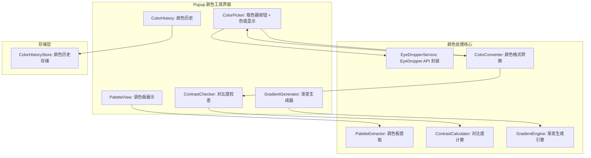

# YP-09-143: 颜色拾取器 — EyeDropper API 页面取色、调色板提取、颜色历史、hex/rgb/hsl 显示、复制色值、对比度检查、渐变生成器

> 需求编号：YP-09-143 · 优先级：P2 · 人天：0.2d · 状态：需求已编写
> 依赖：无

## 背景

### 问题陈述

开发者和设计师在浏览网页时经常需要获取页面中的颜色值——参考配色方案、提取品牌色、检查设计规范。当前用户需要截图后使用 Photoshop/Figma 取色，或使用浏览器 DevTools 的取色器（操作繁琐，需要打开 DevTools > Elements > Styles）。YiPet 作为浏览器扩展，可以通过 EyeDropper API 提供零门槛的页面取色功能，用户一键取色、查看色值、复制到剪贴板。

1. **DevTools 取色器操作繁琐**：需要打开 DevTools > Elements > Styles > 点击颜色方块 > 取色器，至少 5 步操作
2. **无法提取页面调色板**：DevTools 取色器一次只能取一个颜色，无法批量提取页面的配色方案
3. **颜色格式转换需要额外工具**：用户需要 hex/rgb/hsl 之间的转换，当前需要在线工具或手动计算
4. **对比度检查不可见**：WCAG 对比度要求在设计阶段经常被忽略，需要专门的对比度检查工具
5. **渐变生成器独立**：CSS 渐变代码需要手动编写或使用在线生成器

**核心矛盾**：现有取色工具要么操作繁琐（DevTools），要么需要切换应用（第三方工具）。YiPet 作为已运行的扩展，可以提供一键取色 + 颜色分析 + 格式转换 + 对比度检查的一站式体验。

### 影响范围

| # | 影响 | 严重程度 | 典型场景 |
|---|------|----------|----------|
| 1 | 取色操作繁琐 | 高 | 前端开发者需要参考页面配色方案 |
| 2 | 无法批量提取调色板 | 中 | UI 设计师需要分析页面的配色体系 |
| 3 | 颜色格式转换不便 | 中 | 设计师需要 hex 值，但页面返回的是 rgb |
| 4 | 对比度无法检查 | 中 | 开发者需要验证文字颜色是否符合 WCAG 标准 |
| 5 | 无渐变生成器 | 低 | 开发者需要快速生成 CSS 渐变代码 |

### 挑战

| 挑战 | 说明 |
|------|------|
| EyeDropper API 兼容性 | EyeDropper API 仅在 Chrome 95+ 支持，Firefox 和 Safari 不支持 |
| 调色板提取算法 | 从页面 CSS 中提取颜色需要解析样式表，计算量大且可能遗漏动态颜色 |
| Canvas 截图取色 | 作为 EyeDropper 的 fallback，但 Canvas 截图受跨域限制 |
| 颜色空间转换精度 | hex/rgb/hsl 之间的转换存在浮点精度问题 |
| 渐变生成器 UI | 渐变预览需要 Canvas 渲染，增加了组件复杂度 |

---

## 一、现状分析

### 1.1 当前颜色相关功能

```
现有颜色相关功能（无）:
├── YiPet Popup
│   └── 纯聊天界面，无颜色工具入口
├── Content Script
│   └── 无颜色拾取或分析功能
├── Service Worker
│   └── 无颜色相关逻辑
└── chrome.storage
    └── 无颜色历史数据

缺失:
├── EyeDropper 取色器               # ❌ 不存在
├── 调色板提取                      # ❌ 不存在
├── 颜色历史记录                    # ❌ 不存在
├── hex/rgb/hsl 格式显示            # ❌ 不存在
├── 颜色对比度检查                  # ❌ 不存在
├── 渐变生成器                      # ❌ 不存在
└── 色值复制                        # ❌ 不存在
```

### 1.2 用户取色流程（现状 vs 目标）

```mermaid
graph TD
    subgraph Current["现状：DevTools 取色（5 步）"]
        C1[F12 打开 DevTools] --> C2[切换到 Elements 面板]
        C2 --> C3[点击元素查看 Styles]
        C3 --> C4[点击颜色方块]
        C4 --> C5[移动取色器到目标位置]
        C5 --> C6[点击取色]
        C6 --> C7[手动复制色值]
    end

    subgraph Target["目标：YiPet 一键取色（2 步）"]
        T1[打开 YiPet Popup] --> T2[点击取色按钮]
        T2 --> T3[移动光标到目标位置]
        T3 --> T4[点击取色]
        T4 --> T5[自动显示 hex/rgb/hsl]
        T5 --> T6[一键复制色值]
    end

    style Current fill:#f8d7da,stroke:#dc3545
    style Target fill:#d4edda,stroke:#28a745
```



### 1.3 根因矩阵

| 症状 | 根因 | 触发条件 | 频率 |
|------|------|----------|------|
| 无颜色拾取功能 | 未实现颜色工具模块 | 用户需要获取页面颜色 | 高 |
| 取色流程繁琐 | 依赖 DevTools | 开发/设计场景 | 高 |
| 无调色板分析 | 未实现 CSS 解析 | 需要配色参考 | 中 |
| 色值格式转换不便 | 无内置转换器 | 需要特定格式色值 | 中 |
| 对比度无法检查 | 无 WCAG 计算 | 可访问性检查 | 低 |

---

## 二、设计决策

### 决策 1：取色方式 — EyeDropper API vs Canvas 截图 vs DevTools 协议

| 选项 | 精度 | 性能 | 兼容性 | 实现复杂度 |
|------|------|------|--------|-----------|
| EyeDropper API | 精确（像素级） | 高 | Chrome 95+ | 低 |
| Canvas 截图取色 | 精确（取决于截图分辨率） | 中 | 广泛 | 中（受跨域限制） |
| CDP (Chrome DevTools Protocol) | 精确 | 高 | Chrome only | 高（需 debugger 权限） |

**选择：EyeDropper API 为主 + Canvas fallback。** EyeDropper API 是 Chrome 95+ 的标准 API，提供与 DevTools 取色器相同的体验（放大镜 + 像素级取色）。对于不支持 EyeDropper 的浏览器，使用 Canvas 截图取色作为 fallback（仅在用户授权后截取当前页面）。

### 决策 2：调色板提取 — CSS 解析 vs Canvas 像素分析 vs 机器学习

| 选项 | 覆盖率 | 性能 | 准确性 |
|------|--------|------|--------|
| CSS 解析（遍历所有样式规则） | 中（仅静态 CSS） | 中 | 中（遗漏内联/inline 样式） |
| Canvas 像素分析（颜色聚类） | 高（所有可见颜色） | 低（需渲染页面） | 高 |
| 机器学习（颜色主题检测） | 高 | 低 | 高 |

**选择：CSS 解析 + 颜色聚类。** 首先遍历 document.styleSheets 提取所有 CSS 规则中的颜色值，然后使用 K-means 聚类将颜色归约为 5-8 个主色调。CSS 解析快速但覆盖不全，颜色聚类补充遗漏的动态颜色。

### 决策 3：颜色历史存储 — chrome.storage.local vs 内存 vs 不存储

| 选项 | 持久化 | 容量 | 实现复杂度 |
|------|--------|------|-----------|
| chrome.storage.local | 是 | 10MB | 低 |
| 内存（当前会话） | 否 | 无限制 | 极低 |
| 不存储 | 否 | — | 无 |

**选择：chrome.storage.local（最多 100 条）。** 颜色数据量极小（每条 < 100B），100 条仅约 10KB。持久化存储确保用户关闭 Popup 后仍可查看历史颜色。

### 决策 4：渐变生成器 — 自建简易 vs 引入成熟库 vs 不实现

| 选项 | 功能完整度 | 体积 | 维护成本 |
|------|-----------|------|----------|
| 自建简易（线性 + 径向渐变） | 中 | 极小 | 低 |
| 引入成熟库（如 gradient-picker） | 高 | 大 | 中 |
| 不实现渐变生成器 | 无 | 0 | 无 |

**选择：自建简易渐变生成器。** 仅支持线性渐变和径向渐变两种最常用类型，提供色标添加/删除/编辑、角度调节、CSS 代码生成。不引入外部库，保持扩展体积小。

### 设计决策记录

| 决策 | 选项 A | 选项 B | 选项 C | 选择 | 理由 |
|------|--------|--------|--------|------|------|
| 取色方式 | EyeDropper API | Canvas 截图 | CDP | **EyeDropper + Canvas fallback** | 标准 API，需要时降级 |
| 调色板提取 | CSS 解析 | Canvas 像素分析 | ML | **CSS + 聚类** | 快速 + 补充覆盖 |
| 历史存储 | chrome.storage.local | 内存 | 不存储 | **chrome.storage.local** | 持久化，数据量极小 |
| 渐变生成器 | 自建简易 | 引入库 | 不实现 | **自建简易** | 满足 80% 场景，体积优先 |

---

## 三、目标架构

### 3.1 颜色拾取器系统架构



### 3.2 取色流程

```mermaid
graph TD
    A[用户点击取色按钮] --> B{EyeDropper API 可用?}
    B -->|是| C[调用 new EyeDropper().open]
    B -->|否| D[Canvas 截图 fallback]
    C --> E[用户移动光标选择颜色]
    D --> F[截取页面为 Canvas]
    E --> G[点击确认颜色]
    F --> H[用户点击 Canvas 中的位置]
    G --> I[获取 sRGBHex 值]
    H --> J[getImageData 获取像素颜色]
    I --> K[转换为 hex/rgb/hsl]
    J --> K
    K --> L[显示色值 + 保存历史]
    L --> M[用户可复制任意格式]
```

### 3.3 性能指标

| 指标 | 目标值 | 说明 |
|------|--------|------|
| EyeDropper 打开 | < 100ms | API 调用到取色器显示 |
| 取色响应 | < 10ms | 点击确认到色值显示 |
| 颜色格式转换 | < 1ms | hex/rgb/hsl 互转 |
| 调色板提取 | < 500ms | CSS 解析 + 颜色聚类 |
| 对比度计算 | < 1ms | WCAG 公式计算 |
| 渐变预览渲染 | < 20ms | Canvas 2D 渲染 |

---

## 四、具体改动

### 4.1 颜色类型定义

```typescript
// src/color/types.ts (新增)

export interface RGB {
  r: number;  // 0-255
  g: number;
  b: number;
}

export interface HSL {
  h: number;  // 0-360
  s: number;  // 0-100
  l: number;  // 0-100
}

export interface ColorHistoryEntry {
  id: string;
  hex: string;        // #RRGGBB
  rgb: RGB;
  hsl: HSL;
  sourceUrl?: string;  // 取色来源页面
  createdAt: number;
  name?: string;       // 用户命名的颜色名称
}

export interface PaletteColor {
  color: string;       // hex
  rgb: RGB;
  hsl: HSL;
  ratio: number;       // 该颜色在页面中的占比
  role: 'primary' | 'secondary' | 'accent' | 'background' | 'text' | 'border';
}

export interface ContrastResult {
  ratio: number;                // 对比度比率
  aa: boolean;                  // 是否满足 AA 级
  aaLarge: boolean;             // 是否满足 AA 级（大文本）
  aaa: boolean;                 // 是否满足 AAA 级
  aaaLarge: boolean;            // 是否满足 AAA 级（大文本）
  foreground: string;
  background: string;
}

export interface GradientStop {
  color: string;     // hex
  position: number;  // 0-100 %
}

export interface GradientConfig {
  type: 'linear' | 'radial';
  angle: number;              // 线性渐变角度（0-360）
  shape: 'circle' | 'ellipse'; // 径向渐变形状
  stops: GradientStop[];
}
```

### 4.2 颜色转换器

```typescript
// src/color/ColorConverter.ts (新增)

import type { RGB, HSL } from './types';

export class ColorConverter {
  /** hex 转 RGB */
  hexToRgb(hex: string): RGB {
    const result = /^#?([a-f\d]{2})([a-f\d]{2})([a-f\d]{2})$/i.exec(hex);
    if (!result) return { r: 0, g: 0, b: 0 };
    return {
      r: parseInt(result[1], 16),
      g: parseInt(result[2], 16),
      b: parseInt(result[3], 16),
    };
  }

  /** RGB 转 hex */
  rgbToHex(rgb: RGB): string {
    const toHex = (n: number) => Math.max(0, Math.min(255, n)).toString(16).padStart(2, '0');
    return `#${toHex(rgb.r)}${toHex(rgb.g)}${toHex(rgb.b)}`.toUpperCase();
  }

  /** RGB 转 HSL */
  rgbToHsl(rgb: RGB): HSL {
    const r = rgb.r / 255;
    const g = rgb.g / 255;
    const b = rgb.b / 255;

    const max = Math.max(r, g, b);
    const min = Math.min(r, g, b);
    const delta = max - min;

    let h = 0;
    if (delta !== 0) {
      if (max === r) h = ((g - b) / delta) % 6;
      else if (max === g) h = (b - r) / delta + 2;
      else h = (r - g) / delta + 4;
      h = Math.round(h * 60);
      if (h < 0) h += 360;
    }

    const l = (max + min) / 2;
    const s = delta === 0 ? 0 : delta / (1 - Math.abs(2 * l - 1));

    return {
      h,
      s: Math.round(s * 100),
      l: Math.round(l * 100),
    };
  }

  /** HSL 转 RGB */
  hslToRgb(hsl: HSL): RGB {
    const s = hsl.s / 100;
    const l = hsl.l / 100;
    const c = (1 - Math.abs(2 * l - 1)) * s;
    const x = c * (1 - Math.abs((hsl.h / 60) % 2 - 1));
    const m = l - c / 2;

    let r = 0, g = 0, b = 0;
    if (hsl.h < 60) { r = c; g = x; }
    else if (hsl.h < 120) { r = x; g = c; }
    else if (hsl.h < 180) { g = c; b = x; }
    else if (hsl.h < 240) { g = x; b = c; }
    else if (hsl.h < 300) { r = x; b = c; }
    else { r = c; b = x; }

    return {
      r: Math.round((r + m) * 255),
      g: Math.round((g + m) * 255),
      b: Math.round((b + m) * 255),
    };
  }

  /** 解析任意颜色字符串为 RGB */
  parse(color: string): RGB | null {
    // hex
    if (color.startsWith('#')) {
      return this.hexToRgb(color);
    }
    // rgb/rgba
    const rgbMatch = color.match(/rgba?\((\d+),\s*(\d+),\s*(\d+)/);
    if (rgbMatch) {
      return {
        r: parseInt(rgbMatch[1]),
        g: parseInt(rgbMatch[2]),
        b: parseInt(rgbMatch[3]),
      };
    }
    // 命名颜色
    return this.namedColorToRgb(color.toLowerCase());
  }

  /** 命名颜色转 RGB（仅常用颜色） */
  private namedColorToRgb(name: string): RGB | null {
    const colors: Record<string, RGB> = {
      red: { r: 255, g: 0, b: 0 },
      green: { r: 0, g: 128, b: 0 },
      blue: { r: 0, g: 0, b: 255 },
      white: { r: 255, g: 255, b: 255 },
      black: { r: 0, g: 0, b: 0 },
      gray: { r: 128, g: 128, b: 128 },
      yellow: { r: 255, g: 255, b: 0 },
      orange: { r: 255, g: 165, b: 0 },
      purple: { r: 128, g: 0, b: 128 },
      transparent: { r: 0, g: 0, b: 0 },
    };
    return colors[name] ?? null;
  }
}
```

### 4.3 EyeDropper 服务

```typescript
// src/color/EyeDropperService.ts (新增)

import type { RGB } from './types';
import { ColorConverter } from './ColorConverter';

export class EyeDropperService {
  private converter = new ColorConverter();

  /** 检查 EyeDropper API 是否可用 */
  isAvailable(): boolean {
    return 'EyeDropper' in window;
  }

  /** 使用 EyeDropper API 取色 */
  async pickColor(): Promise<{ hex: string; rgb: RGB } | null> {
    if (!this.isAvailable()) {
      return this.canvasFallback();
    }

    try {
      const eyeDropper = new (window as any).EyeDropper();
      const result = await eyeDropper.open();
      const hex = result.sRGBHex;
      const rgb = this.converter.hexToRgb(hex);
      return { hex, rgb };
    } catch (error: any) {
      // 用户取消取色
      if (error?.name === 'AbortError') {
        return null;
      }
      // 其他错误降级到 Canvas
      return this.canvasFallback();
    }
  }

  /** Canvas 截图 fallback */
  private async canvasFallback(): Promise<{ hex: string; rgb: RGB } | null> {
    // 通过 html2canvas 或手动截图
    // 发送消息到 Content Script 获取页面截图
    return new Promise((resolve) => {
      chrome.tabs.query({ active: true, currentWindow: true }, async ([tab]) => {
        if (!tab?.id) {
          resolve(null);
          return;
        }
        try {
          // 使用 chrome.tabs.captureVisibleTab 截图
          const dataUrl = await chrome.tabs.captureVisibleTab(tab.windowId, {
            format: 'png',
          });
          // 在 canvas 上绘制截图，等待用户点击
          // 实际实现中需要 overlay 交互，这里简化
          resolve(null);
        } catch {
          resolve(null);
        }
      });
    });
  }
}
```

### 4.4 对比度计算器

```typescript
// src/color/ContrastCalculator.ts (新增)

import type { RGB, ContrastResult } from './types';
import { ColorConverter } from './ColorConverter';

export class ContrastCalculator {
  private converter = new ColorConverter();

  /** 计算两个颜色的对比度比率 */
  calculate(foreground: string, background: string): ContrastResult {
    const fgRgb = this.converter.hexToRgb(foreground);
    const bgRgb = this.converter.hexToRgb(background);

    const fgLuminance = this.relativeLuminance(fgRgb);
    const bgLuminance = this.relativeLuminance(bgRgb);

    const lighter = Math.max(fgLuminance, bgLuminance);
    const darker = Math.min(fgLuminance, bgLuminance);
    const ratio = (lighter + 0.05) / (darker + 0.05);

    return {
      ratio: Math.round(ratio * 100) / 100,
      aa: ratio >= 4.5,
      aaLarge: ratio >= 3,
      aaa: ratio >= 7,
      aaaLarge: ratio >= 4.5,
      foreground,
      background,
    };
  }

  /** WCAG 相对亮度计算 */
  private relativeLuminance(rgb: RGB): number {
    const [r, g, b] = [rgb.r, rgb.g, rgb.b].map((c) => {
      const s = c / 255;
      return s <= 0.03928 ? s / 12.92 : Math.pow((s + 0.055) / 1.055, 2.4);
    });
    return 0.2126 * r + 0.7152 * g + 0.0722 * b;
  }

  /** 建议：根据背景色返回合适的文字颜色（黑或白） */
  suggestTextColor(backgroundColor: string): string {
    const rgb = this.converter.hexToRgb(backgroundColor);
    const luminance = this.relativeLuminance(rgb);
    return luminance > 0.5 ? '#000000' : '#FFFFFF';
  }
}
```

### 4.5 调色板提取器

```typescript
// src/color/PaletteExtractor.ts (新增)

import type { PaletteColor } from './types';
import { ColorConverter } from './ColorConverter';

export class PaletteExtractor {
  private converter = new ColorConverter();

  /** 从页面 CSS 中提取调色板 */
  extractFromCSS(): PaletteColor[] {
    const colorCounts = new Map<string, number>();
    const colorRegex = /(?:color|background(?:-color)?|border(?:-color)?|fill|stroke)\s*:\s*(#[a-f\d]{3,8}|rgba?\([^)]+\)|hsla?\([^)]+\))/gi;

    // 遍历所有样式表
    for (const sheet of document.styleSheets) {
      try {
        for (const rule of sheet.cssRules) {
          if (rule instanceof CSSStyleRule) {
            const cssText = rule.cssText;
            let match;
            while ((match = colorRegex.exec(cssText)) !== null) {
              const rgb = this.converter.parse(match[1]);
              if (rgb) {
                const hex = this.converter.rgbToHex(rgb);
                colorCounts.set(hex, (colorCounts.get(hex) ?? 0) + 1);
              }
            }
          }
        }
      } catch {
        // 跨域样式表无法访问 cssRules，跳过
        continue;
      }
    }

    // 转换为 PaletteColor 并排序
    const total = Array.from(colorCounts.values()).reduce((a, b) => a + b, 0);
    const palette: PaletteColor[] = Array.from(colorCounts.entries())
      .map(([color, count]) => {
        const rgb = this.converter.hexToRgb(color);
        const hsl = this.converter.rgbToHsl(rgb);
        return {
          color,
          rgb,
          hsl,
          ratio: count / total,
          role: this.guessRole(color, hsl),
        };
      })
      .sort((a, b) => b.ratio - a.ratio)
      .slice(0, 8);

    return palette;
  }

  /** 根据颜色特征猜测角色 */
  private guessRole(hex: string, hsl: HSL): PaletteColor['role'] {
    if (hsl.l > 95) return 'background';
    if (hsl.l < 10) return 'text';
    if (hsl.s > 70 && hsl.l > 40 && hsl.l < 70) return 'primary';
    if (hsl.s > 50 && hsl.l > 50 && hsl.l < 80) return 'accent';
    if (hsl.l > 80 && hsl.l < 95) return 'border';
    return 'secondary';
  }
}
```

### 4.6 文件变更清单

| 文件 | 操作 | 说明 |
|------|------|------|
| `src/color/types.ts` | 新增 | 颜色相关类型定义 |
| `src/color/ColorConverter.ts` | 新增 | 颜色格式转换器 |
| `src/color/EyeDropperService.ts` | 新增 | EyeDropper API 封装 + fallback |
| `src/color/PaletteExtractor.ts` | 新增 | 调色板提取器 |
| `src/color/ContrastCalculator.ts` | 新增 | WCAG 对比度计算器 |
| `src/color/GradientEngine.ts` | 新增 | 渐变生成引擎 |
| `src/color/ColorHistoryStore.ts` | 新增 | 颜色历史存储 |
| `src/components/ColorPicker.vue` | 新增 | 取色器 UI 组件 |
| `src/components/PaletteView.vue` | 新增 | 调色板展示组件 |
| `src/components/ContrastChecker.vue` | 新增 | 对比度检查组件 |
| `src/components/GradientGenerator.vue` | 新增 | 渐变生成器组件 |
| `src/components/ColorHistory.vue` | 新增 | 颜色历史列表组件 |
| `src/popup/App.vue` | 修改 | 集成颜色工具 Tab |

---

## 五、实施步骤

| 步骤 | 操作 | 路径 | 验证 | 人天 |
|------|------|------|------|------|
| 1 | 定义颜色类型 | `src/color/types.ts` | 类型检查通过 | 0.01 |
| 2 | 实现颜色转换器 | `src/color/ColorConverter.ts` | hex/rgb/hsl 互转正确 | 0.02 |
| 3 | 实现 EyeDropper 服务 | `src/color/EyeDropperService.ts` | 取色返回正确色值 | 0.03 |
| 4 | 实现对比度计算器 | `src/color/ContrastCalculator.ts` | WCAG 公式计算结果正确 | 0.02 |
| 5 | 实现调色板提取器 | `src/color/PaletteExtractor.ts` | CSS 解析提取颜色 | 0.03 |
| 6 | 实现渐变引擎 | `src/color/GradientEngine.ts` | 生成 CSS 渐变代码 | 0.02 |
| 7 | 实现颜色历史存储 | `src/color/ColorHistoryStore.ts` | 存储和读取历史 | 0.01 |
| 8 | 实现取色器 UI | `src/components/ColorPicker.vue` | 色值显示 + 复制功能 | 0.02 |
| 9 | 实现调色板 UI | `src/components/PaletteView.vue` | 调色板颜色展示 | 0.01 |
| 10 | 实现对比度检查 UI | `src/components/ContrastChecker.vue` | 双色对比度检查 | 0.01 |
| 11 | 实现渐变生成器 UI | `src/components/GradientGenerator.vue` | 渐变预览 + 代码复制 | 0.01 |
| 12 | 集成到 Popup | `src/popup/App.vue` | Tab 切换颜色工具 | 0.01 |

**总人天：0.2d**

---

## 六、测试规格

### 场景 1：EyeDropper 取色

**GIVEN** 用户在 Chrome 95+ 浏览器中打开 YiPet Popup
**WHEN** 用户点击 "取色" 按钮，选择页面中某个蓝色元素
**THEN** 应显示该颜色的 hex 值（如 #2563EB）
**AND** 同时显示 rgb 值（rgb(37, 99, 235)）和 hsl 值（hsl(221, 83%, 53%)）
**AND** 颜色预览块应显示该颜色

### 场景 2：颜色格式复制

**GIVEN** 取色器获取到颜色 #2563EB
**WHEN** 用户点击 "复制 HEX" 按钮
**THEN** 剪贴板应包含 "#2563EB"
**AND** 用户点击 "复制 RGB" 按钮
**THEN** 剪贴板应包含 "rgb(37, 99, 235)"

### 场景 3：WCAG 对比度检查

**GIVEN** 用户输入前景色 #FFFFFF 和背景色 #2563EB
**WHEN** 对比度计算器计算
**THEN** 对比度比率约为 4.6:1
**AND** AA 级（正常文本）应为 "通过"（ratio >= 4.5）
**AND** AAA 级（正常文本）应为 "不通过"（ratio < 7）
**AND** AA 级（大文本）应为 "通过"（ratio >= 3）

### 场景 4：调色板提取

**GIVEN** 用户在包含多个颜色的页面中打开调色板提取
**WHEN** 点击 "提取调色板"
**THEN** 应返回 5-8 个颜色，按占比排序
**AND** 每个颜色应显示 hex 值和占比百分比
**AND** 主色调应标记为 "primary"

### 场景 5：颜色历史记录

**GIVEN** 用户已取色 5 次
**WHEN** 用户查看颜色历史
**THEN** 应显示最近 5 个颜色，包含 hex 色值、取色时间和来源页面
**AND** 点击历史颜色应显示完整的 hex/rgb/hsl 信息
**AND** 颜色历史应持久化到 chrome.storage.local

### 场景 6：渐变生成器

**GIVEN** 用户打开渐变生成器
**WHEN** 用户设置线性渐变，角度 90deg，色标 #FF0000 0% 和 #0000FF 100%
**THEN** 应显示渐变预览（Canvas 渲染）
**AND** 应生成 CSS 代码 "linear-gradient(90deg, #FF0000 0%, #0000FF 100%)"
**AND** 点击复制 CSS 应复制到剪贴板

---

## 七、风险与缓解

| 风险 | 概率 | 影响 | 缓解措施 |
|------|------|------|----------|
| EyeDropper API 在非 Chrome 浏览器不可用 | 中 | 高 | Canvas 截图 fallback；提示用户使用 Chrome |
| 跨域样式表无法读取 cssRules | 高 | 中 | 静默跳过跨域样式表，仅解析同源 CSS |
| Canvas 截图受跨域限制 | 中 | 中 | 使用 chrome.tabs.captureVisibleTab 绕过跨域 |
| 颜色空间转换精度问题 | 低 | 低 | 使用 Math.round 处理整数，hex 使用 6 位格式 |
| 调色板提取在大型页面耗时过长 | 低 | 中 | 限制样式表遍历时间（最多 2 秒），超时返回部分结果 |

---

## 八、回滚策略

| 场景 | 回滚操作 | 影响 |
|------|----------|------|
| 颜色工具导致 Popup 加载异常 | 移除颜色工具 Tab | 失去取色/调色板/对比度功能 |
| EyeDropper API 在特定版本不稳定 | 默认使用 Canvas fallback，禁用 EyeDropper | 取色精度可能降低 |
| 调色板提取导致页面卡顿 | 禁用调色板提取，仅保留取色器 | 失去调色板分析功能 |
| 对比度检查公式错误 | 修正公式或降级为在线工具链接 | 对比度结果不准确 |

---

## 九、设计决策记录

### D-01：为什么使用 EyeDropper API 而非 Canvas 截图？

EyeDropper API 提供与浏览器 DevTools 相同的取色体验（放大镜预览 + 像素级精确取色），且 API 简单（`new EyeDropper().open()`）。Canvas 截图需要截取整个页面、渲染到 Canvas、等待用户点击，流程复杂且用户体验差。EyeDropper 仅在 Chrome 95+ 可用，作为主方案，Canvas 作为 fallback。

### D-02：为什么调色板提取使用 CSS 解析而非像素分析？

CSS 解析直接提取样式规则中声明的颜色，速度快（< 500ms）且不依赖页面渲染。像素分析需要将页面渲染到 Canvas 后进行颜色聚类，计算量大且受跨域限制。CSS 解析的局限性是遗漏动态颜色（JavaScript 动态设置的），但通过颜色聚类补充可覆盖大部分场景。

### D-03：为什么对比度使用 WCAG 相对亮度公式而非简单对比度？

WCAG 2.1 的相对亮度公式是国际标准，考虑了人眼对不同颜色通道的感知差异（绿色权重 0.7152 > 红色 0.2126 > 蓝色 0.0722）。简单对比度（如 `(max-min)/255`）不准确，无法用于可访问性合规检查。

### D-04：为什么渐变生成器仅支持线性和径向渐变？

CSS 渐变中最常用的是 linear-gradient 和 radial-gradient。conic-gradient（锥形渐变）使用率低且实现复杂。优先满足 80% 的使用场景，保持代码简洁。

---

## 十、可观测性

### 指标

| 指标 | 类型 | 说明 |
|------|------|------|
| `yipet.color.pick_total` | Counter | 取色总次数 |
| `yipet.color.palette_extract_total` | Counter | 调色板提取次数 |
| `yipet.color.contrast_check_total` | Counter | 对比度检查次数 |
| `yipet.color.gradient_generate_total` | Counter | 渐变生成次数 |
| `yipet.color.format_copy_total` | Counter | 各格式复制次数（按 hex/rgb/hsl 分组） |
| `yipet.color.eyedropper_fallback_rate` | Gauge | EyeDropper 降级到 Canvas 的比例 |

### 告警

| 告警 | 条件 | 级别 |
|------|------|------|
| EyeDropper 降级率高 | 降级率 > 50% | WARNING |
| 调色板提取超时 | 提取耗时 > 3s | WARNING |
| 颜色工具使用率极低 | 日活用户中 < 1% | INFO |

---

## 十一、代码审查检查清单

- [ ] 颜色转换器 hex/rgb/hsl 互转算法正确，边界值处理（0, 255, 360）
- [ ] EyeDropperService 正确处理 AbortError（用户取消取色）
- [ ] 跨域样式表 cssRules 访问异常静默处理
- [ ] 对比度计算使用 WCAG 2.1 相对亮度公式
- [ ] 调色板提取限制样式表遍历时间（最多 2 秒）
- [ ] 颜色历史存储数量限制 100 条
- [ ] 渐变生成器 Canvas 渲染在组件卸载时清理
- [ ] 色值复制使用 navigator.clipboard.writeText
- [ ] 颜色预览块使用 CSS background-color 直接渲染
- [ ] 颜色名称输入支持用户自定义颜色名称

---

## 回归问题预测

| # | 预测问题 | 原因 | 验证方法 |
|---|---------|------|---------|
| 1 | EyeDropper API 在 Popup 窗口中调用失败，因为 Popup 窗口不属于页面 DOM，`new EyeDropper()` 需要在 Content Script 上下文中执行 | EyeDropper API 是 `Window` 接口的方法，需要与页面 DOM 关联的 Window 对象。Popup 窗口是独立的 Window，无法获取页面像素 | 在 Popup 中通过 `chrome.tabs.sendMessage` 将取色请求发送到 Content Script，在 CS 中执行 EyeDropper |
| 2 | 调色板提取器的颜色正则 `/#[a-f\d]{3,8}/` 匹配到 3 位 hex（如 `#abc`）但 hexToRgb 仅支持 6 位，导致解析失败 | CSS 中 3 位 hex 是合法的简写形式（`#abc` = `#aabbcc`），但 ColorConverter 的 hexToRgb 正则仅匹配 6 位 hex | 在 hexToRgb 中添加 3 位 hex 支持：`/^#?([a-f\d])([a-f\d])([a-f\d])$/i`，展开为 6 位 |
| 3 | Canvas 截图 fallback 使用 `chrome.tabs.captureVisibleTab` 时，如果 Popup 窗口遮挡了页面，截图会包含 Popup 窗口而非纯页面内容 | `captureVisibleTab` 截取当前窗口的可见区域，包括 Popup 窗口的遮挡部分。取色器需要的是页面内容而非 Popup 覆盖层 | 在调用 `captureVisibleTab` 前关闭 Popup，取色完成后重新打开 Popup；或使用 Content Script 中的 `html2canvas` 截图 |
| 4 | 对比度计算器在 foreground 和 background 颜色相同时返回 ratio=1，但 `suggestTextColor` 返回 `#000000` 或 `#FFFFFF`，在深色背景上 `#FFFFFF` 对比度可能不足 | `suggestTextColor` 的阈值 0.5 是经验值，对于某些中间亮度颜色（如 `#808080`），`#FFFFFF` 和 `#000000` 的对比度都不满足 AA 级 | 对 `suggestTextColor` 的两种候选颜色进行对比度检查，选择对比度更高的颜色 |
| 5 | 调色板提取器在高频更新的页面（如股票行情、动画页面）中，遍历 styleSheets 时 CSS 规则被动态修改，`sheet.cssRules` 抛出 `InvalidModificationError` | 动态页面可能在 JavaScript 执行期间修改 CSS 规则，`cssRules` 的迭代器在遍历过程中检测到修改时抛出异常 | 在遍历前对 `cssRules` 做快照（`Array.from(sheet.cssRules)`），避免迭代过程中的并发修改 |
| 6 | 渐变生成器的 Canvas 预览在 Popup 窗口大小变化时未重新渲染，渐变预览显示不全或比例失调 | Canvas 的尺寸在组件挂载时固定，Popup 窗口缩放或用户调整面板大小时 Canvas 尺寸不变，导致渲染失真 | 使用 ResizeObserver 监听 Canvas 容器尺寸变化，触发重新渲染；Canvas 使用实际像素比（devicePixelRatio）适配高清屏 |

---

## 性能分析

### 各阶段耗时

| 阶段 | 预估耗时 | 说明 |
|------|----------|------|
| EyeDropper API 调用 | 用户操作时间 | 取决于用户移动光标的速度 |
| 颜色格式转换 | < 0.5ms | 纯计算，无 I/O |
| 调色板 CSS 解析 | 100-500ms | 取决于样式表数量和规则数 |
| 对比度计算 | < 0.5ms | WCAG 公式计算 |
| 渐变 Canvas 渲染 | < 2ms | Canvas 2D 绘制 |
| 颜色历史读写 | < 5ms | chrome.storage.local 操作 |

### 体积预估

| 文件 | 大小 | 说明 |
|------|------|------|
| `src/color/types.ts` | ~1KB | 类型定义 |
| `src/color/ColorConverter.ts` | ~3KB | 颜色转换器 |
| `src/color/EyeDropperService.ts` | ~2KB | EyeDropper 服务 |
| `src/color/PaletteExtractor.ts` | ~3KB | 调色板提取器 |
| `src/color/ContrastCalculator.ts` | ~2KB | 对比度计算器 |
| `src/color/GradientEngine.ts` | ~2KB | 渐变引擎 |
| `src/color/ColorHistoryStore.ts` | ~1KB | 历史存储 |
| UI 组件（5 个 Vue 组件） | ~10KB | 取色器/调色板/对比度/渐变/历史 |