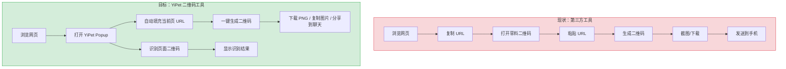
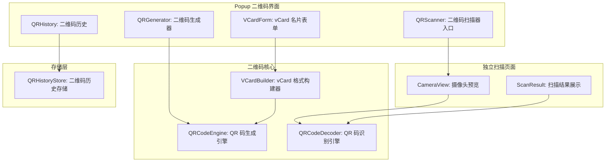
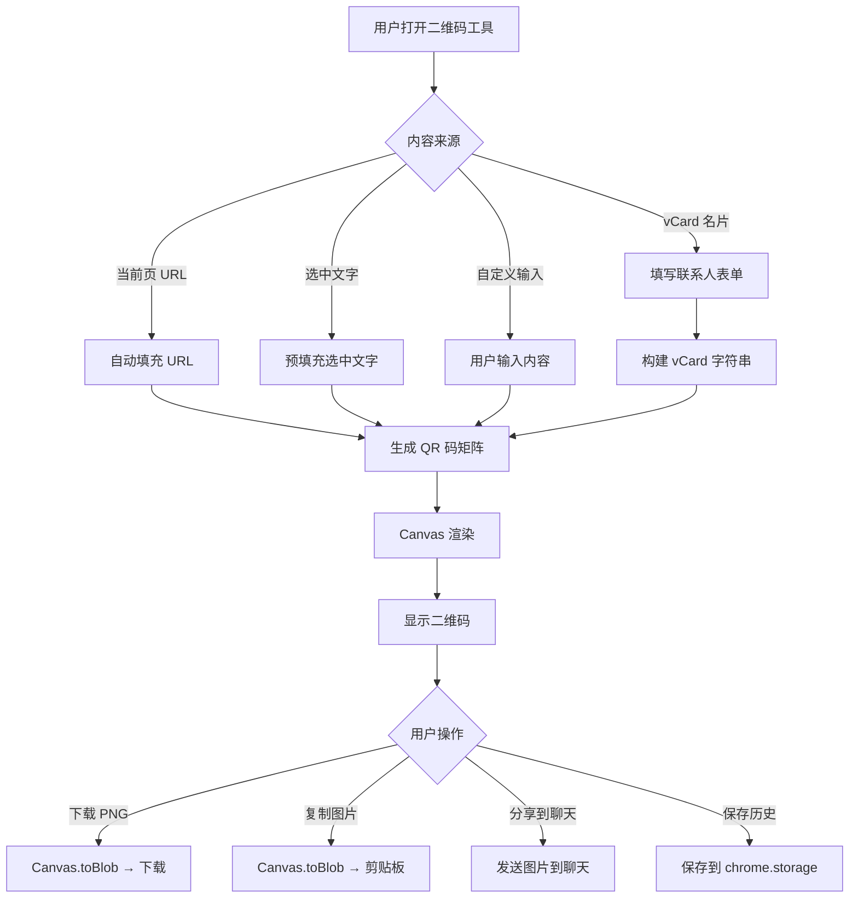

# YP-09-144: 二维码生成与识别 — 当前页 URL/选中文字/自定义输入生成 QR、摄像头扫描、图片识别、分享到聊天、下载 PNG、vCard 名片

> 需求编号：YP-09-144 · 优先级：P2 · 人天：0.2d · 状态：需求已编写
> 依赖：无

## 背景

### 问题陈述

用户在浏览网页时经常需要分享当前页面 URL 到手机——扫码打开、分享给同事、保存为书签。当前用户需要使用第三方二维码生成工具（草料二维码、QR Code Generator），复制 URL、粘贴到工具、生成二维码、截图保存。整个流程需要 5-6 步，耗时且中断浏览体验。此外，用户也需要识别页面中的二维码（如登录验证、扫码支付），当前需要拿起手机扫码，操作割裂。

1. **二维码生成流程繁琐**：需要切换到第三方工具，复制粘贴 URL，生成后截图保存
2. **无法识别页面中的二维码**：页面中的二维码需要用手机扫码，无法在浏览器中直接识别
3. **缺少 vCard 名片分享**：用户需要分享联系方式时，需要手动创建 vCard 或使用第三方工具
4. **二维码无法直接用于聊天**：生成的二维码需要手动保存图片后才能在聊天中发送
5. **无二维码历史**：生成的二维码无法追溯，需要重新生成

**核心矛盾**：用户需要快捷的二维码生成和识别工具，但现有工具要么需要切换应用，要么功能单一。YiPet 作为浏览器扩展，天然适合处理页面 URL 和图片，可以一键生成/识别二维码。

### 影响范围

| # | 影响 | 严重程度 | 典型场景 |
|---|------|----------|----------|
| 1 | 二维码生成流程繁琐 | 高 | 用户需要分享当前页面到手机 |
| 2 | 无法识别页面二维码 | 中 | 页面中有微信登录二维码，用户需要手机扫码 |
| 3 | 缺少 vCard 分享 | 中 | 用户需要分享联系方式 |
| 4 | 二维码无法直接用于聊天 | 低 | 用户想将二维码图片发送给 AI 分析 |
| 5 | 无二维码历史 | 低 | 用户需要重新生成之前生成过的二维码 |

### 挑战

| 挑战 | 说明 |
|------|------|
| QR 码生成库体积 | qrcode 等主流库体积较大（~20KB），需评估对扩展体积的影响 |
| 摄像头权限 | 二维码扫描需要摄像头权限，用户需授权，且 Popup 窗口中摄像头访问受限 |
| 图片二维码识别 | 从页面图片中识别二维码需要图像处理，jsQR 库对图片质量敏感 |
| vCard 格式复杂度 | vCard 3.0/4.0 格式字段多，需要设计合理的 UI 收集用户信息 |
| 跨域图片 | 页面中的二维码图片可能跨域，Canvas 读取时受 taint 限制 |

---

## 一、现状分析

### 1.1 当前二维码相关功能

```
现有二维码相关功能（无）:
├── YiPet Popup
│   └── 纯聊天界面，无二维码工具入口
├── Content Script
│   └── 无二维码生成或识别功能
├── Service Worker
│   └── 无二维码相关逻辑
└── chrome.storage
    └── 无二维码历史数据

缺失:
├── QR 码生成                      # ❌ 不存在
├── QR 码识别（摄像头）            # ❌ 不存在
├── QR 码识别（图片）              # ❌ 不存在
├── 二维码下载为 PNG               # ❌ 不存在
├── 二维码分享到聊天              # ❌ 不存在
├── vCard 名片生成                 # ❌ 不存在
├── 二维码历史记录                 # ❌ 不存在
└── 自定义输入生成                 # ❌ 不存在
```

### 1.2 用户二维码流程（现状 vs 目标）



### 1.3 根因矩阵

| 症状 | 根因 | 触发条件 | 频率 |
|------|------|----------|------|
| 无二维码生成功能 | 未实现二维码工具模块 | 用户需要分享页面 | 高 |
| 生成流程繁琐 | 依赖第三方工具 | 需要分享 URL | 高 |
| 无法识别页面二维码 | 无图片识别功能 | 遇到页面二维码 | 中 |
| 无 vCard 分享 | 未实现 vCard 格式 | 分享联系方式 | 中 |
| 无二维码历史 | 未存储生成记录 | 需要重新生成 | 低 |

---

## 二、设计决策

### 决策 1：QR 码生成库 — qrcode vs qrcode-generator vs 自建

| 选项 | 体积 | 功能 | 性能 |
|------|------|------|------|
| qrcode（npm） | ~20KB | 完整（Canvas/SVG/DataURL） | 高 |
| qrcode-generator | ~8KB | 基础（仅矩阵生成） | 高 |
| 自建（基于 QR 码规范） | ~5KB | 基础 | 中 |

**选择：qrcode-generator + 自定义渲染。** qrcode-generator 仅生成 QR 码矩阵数据（体积小），Canvas 渲染由自定义代码实现。总体积约 12KB，比完整 qrcode 库节省 40%。生成的矩阵数据可以灵活渲染为 Canvas、SVG 或 PNG。

### 决策 2：QR 码识别 — jsQR vs ZXing vs 云端 API

| 选项 | 体积 | 离线可用 | 识别率 | 速度 |
|------|------|----------|--------|------|
| jsQR | ~30KB | 是 | 高（清晰图片） | 快 |
| ZXing（WASM） | ~500KB | 是 | 很高 | 快 |
| 云端 API | 0 | 否 | 很高 | 慢（网络延迟） |

**选择：jsQR。** 30KB 的体积在可接受范围内，识别率在清晰图片上足够高。ZXing WASM 版本 500KB 对扩展体积影响太大。云端 API 依赖网络且需要隐私考虑（图片上传到第三方）。

### 决策 3：二维码内容类型 — URL 优先 vs 全类型支持

| 选项 | 用户体验 | 实现复杂度 |
|------|----------|-----------|
| URL 优先（自动填充当前页 URL） | 高（覆盖 80% 场景） | 低 |
| 全类型支持（URL/文本/电话/短信/邮件/WiFi） | 高 | 高 |

**选择：URL 优先 + 文本 + vCard。** URL 是最常见的二维码内容，覆盖 80% 场景。文本输入支持自定义内容。vCard 作为专门的分享功能，提供表单收集联系人信息。电话/短信/邮件/WiFi 等格式使用率低，暂不实现，用户可通过自定义文本输入。

### 决策 4：摄像头扫描实现 — Popup 内嵌 vs 独立页面 vs Content Script 注入

| 选项 | 实现复杂度 | 用户体验 | 权限要求 |
|------|-----------|----------|----------|
| Popup 内嵌（getUserMedia） | 中 | 好（Popup 内完成） | 摄像头权限 |
| 独立页面（chrome.tabs.create） | 低 | 中（新标签页） | 摄像头权限 |
| Content Script 注入 | 高 | 好（页面内完成） | 摄像头权限 |

**选择：独立页面（chrome.tabs.create）。** Popup 窗口关闭后摄像头流会中断，不适合持续扫描。独立页面（扩展内 HTML 页面）可以持续访问摄像头，且页面生命周期独立于 Popup。Content Script 注入需要向页面注入摄像头访问代码，安全风险较高。

### 设计决策记录

| 决策 | 选项 A | 选项 B | 选项 C | 选择 | 理由 |
|------|--------|--------|--------|------|------|
| 生成库 | qrcode | qrcode-generator | 自建 | **qrcode-generator** | 体积小，渲染灵活 |
| 识别库 | jsQR | ZXing WASM | 云端 API | **jsQR** | 30KB 可接受，离线可用 |
| 内容类型 | URL 优先 | 全类型 | URL + vCard | **URL + 文本 + vCard** | 覆盖 95% 场景 |
| 摄像头扫描 | Popup 内嵌 | 独立页面 | CS 注入 | **独立页面** | 生命周期独立，安全 |

---

## 三、目标架构

### 3.1 二维码系统架构



### 3.2 二维码生成流程



### 3.3 性能指标

| 指标 | 目标值 | 说明 |
|------|--------|------|
| QR 码生成 | < 5ms | 矩阵生成 + Canvas 渲染 |
| QR 码识别（图片） | < 50ms | jsQR 解码 |
| QR 码识别（摄像头） | < 100ms/帧 | 实时扫描 |
| PNG 下载生成 | < 20ms | Canvas.toBlob |
| vCard 生成 | < 1ms | 字符串拼接 |
| Popup 加载（含 QR Tab） | < 50ms | 组件初始化 |

---

## 四、具体改动

### 4.1 二维码类型定义

```typescript
// src/qrcode/types.ts (新增)

export type QRContentType = 'url' | 'text' | 'vcard';

export interface QRCodeConfig {
  contentType: QRContentType;
  content: string;           // 二维码内容
  size: number;              // 尺寸（px），默认 256
  errorCorrection: 'L' | 'M' | 'Q' | 'H';  // 纠错等级
  margin: number;            // 边距（模块数），默认 4
  foreground: string;        // 前景色 hex，默认 #000000
  background: string;        // 背景色 hex，默认 #FFFFFF
}

export interface QRHistoryEntry {
  id: string;
  contentType: QRContentType;
  content: string;
  label: string;             // 用户可读的标签（如页面标题）
  size: number;
  createdAt: number;
  sourceUrl?: string;
}

export interface VCardData {
  firstName: string;
  lastName: string;
  organization?: string;
  title?: string;
  phone?: string;
  email?: string;
  website?: string;
  address?: string;
  note?: string;
}

export interface QRScanResult {
  text: string;              // 解码后的文本
  format?: string;           // 二维码格式（URL/文本/电话等）
  confidence: number;        // 识别置信度（0-1）
}

export const DEFAULT_QR_CONFIG: QRCodeConfig = {
  contentType: 'url',
  content: '',
  size: 256,
  errorCorrection: 'M',
  margin: 4,
  foreground: '#000000',
  background: '#FFFFFF',
};
```

### 4.2 QR 码生成引擎

```typescript
// src/qrcode/QRCodeEngine.ts (新增)

import type { QRCodeConfig } from './types';
import QRCodeGenerator from 'qrcode-generator';

export class QRCodeEngine {
  /** 生成 QR 码矩阵并渲染到 Canvas */
  generate(config: QRCodeConfig): HTMLCanvasElement {
    // 确定 QR 码类型号（根据内容和纠错等级）
    const typeNumber = this.determineTypeNumber(config.content, config.errorCorrection);

    const qr = new QRCodeGenerator(typeNumber, config.errorCorrection);
    qr.addData(config.content);
    qr.make();

    const moduleCount = qr.getModuleCount();
    const size = config.size;
    const margin = config.margin;
    const cellSize = Math.floor(size / (moduleCount + margin * 2));

    const canvas = document.createElement('canvas');
    canvas.width = size;
    canvas.height = size;
    const ctx = canvas.getContext('2d')!;

    // 背景
    ctx.fillStyle = config.background;
    ctx.fillRect(0, 0, size, size);

    // 绘制 QR 码模块
    const offsetX = Math.floor((size - cellSize * moduleCount) / 2);
    const offsetY = Math.floor((size - cellSize * moduleCount) / 2);

    ctx.fillStyle = config.foreground;
    for (let row = 0; row < moduleCount; row++) {
      for (let col = 0; col < moduleCount; col++) {
        if (qr.isDark(row, col)) {
          ctx.fillRect(
            offsetX + col * cellSize,
            offsetY + row * cellSize,
            cellSize,
            cellSize,
          );
        }
      }
    }

    return canvas;
  }

  /** 生成 PNG Data URL */
  async generateDataURL(config: QRCodeConfig): Promise<string> {
    const canvas = this.generate(config);
    return canvas.toDataURL('image/png');
  }

  /** 生成 PNG Blob 用于下载 */
  async generateBlob(config: QRCodeConfig): Promise<Blob> {
    const canvas = this.generate(config);
    return new Promise((resolve, reject) => {
      canvas.toBlob((blob) => {
        if (blob) resolve(blob);
        else reject(new Error('Canvas toBlob failed'));
      }, 'image/png');
    });
  }

  /** 下载 QR 码为 PNG 文件 */
  async download(config: QRCodeConfig, filename: string): Promise<void> {
    const blob = await this.generateBlob(config);
    const url = URL.createObjectURL(blob);
    const a = document.createElement('a');
    a.href = url;
    a.download = `${filename.replace(/[^a-zA-Z0-9\u4e00-\u9fff]/g, '_')}.png`;
    a.click();
    URL.revokeObjectURL(url);
  }

  /** 将 QR 码图片复制到剪贴板 */
  async copyToClipboard(config: QRCodeConfig): Promise<void> {
    const blob = await this.generateBlob(config);
    await navigator.clipboard.write([
      new ClipboardItem({ 'image/png': blob }),
    ]);
  }

  /** 根据内容长度和纠错等级确定 QR 码类型号 */
  private determineTypeNumber(content: string, errorLevel: string): number {
    const length = content.length;
    // 简化：根据内容长度估算类型号
    // 类型号 1-40，数字越大容量越大
    if (length < 20) return 1;
    if (length < 40) return 2;
    if (length < 60) return 3;
    if (length < 100) return 4;
    if (length < 200) return 6;
    if (length < 400) return 10;
    return 20;  // 最大支持约 1000 字符
  }
}
```

### 4.3 QR 码识别引擎

```typescript
// src/qrcode/QRCodeDecoder.ts (新增)

import jsQR from 'jsqr';
import type { QRScanResult } from './types';

export class QRCodeDecoder {
  /** 从 Canvas/ImageData 识别二维码 */
  decodeFromImageData(imageData: ImageData): QRScanResult | null {
    const result = jsQR(imageData.data, imageData.width, imageData.height);

    if (!result) return null;

    return {
      text: result.data,
      format: this.guessFormat(result.data),
      confidence: 1.0,  // jsQR 不提供置信度，解码成功即为 1.0
    };
  }

  /** 从图片元素识别二维码 */
  decodeFromImage(img: HTMLImageElement): QRScanResult | null {
    const canvas = document.createElement('canvas');
    canvas.width = img.naturalWidth;
    canvas.height = img.naturalHeight;
    const ctx = canvas.getContext('2d')!;
    ctx.drawImage(img, 0, 0);

    const imageData = ctx.getImageData(0, 0, canvas.width, canvas.height);
    return this.decodeFromImageData(imageData);
  }

  /** 从视频帧识别二维码 */
  decodeFromVideo(video: HTMLVideoElement): QRScanResult | null {
    const canvas = document.createElement('canvas');
    canvas.width = video.videoWidth;
    canvas.height = video.videoHeight;
    const ctx = canvas.getContext('2d')!;
    ctx.drawImage(video, 0, 0);

    const imageData = ctx.getImageData(0, 0, canvas.width, canvas.height);
    return this.decodeFromImageData(imageData);
  }

  /** 从页面中识别二维码（右键菜单触发） */
  detectOnPage(): { img: HTMLImageElement; result: QRScanResult }[] {
    const results: { img: HTMLImageElement; result: QRScanResult }[] = [];
    const images = document.querySelectorAll('img');

    for (const img of images) {
      try {
        const result = this.decodeFromImage(img as HTMLImageElement);
        if (result) {
          results.push({ img: img as HTMLImageElement, result });
        }
      } catch {
        // 跨域图片无法读取像素，跳过
        continue;
      }
    }

    return results;
  }

  /** 猜测二维码内容格式 */
  private guessFormat(text: string): string {
    if (/^https?:\/\//i.test(text)) return 'URL';
    if (/^mailto:/i.test(text)) return 'Email';
    if (/^tel:/i.test(text)) return 'Phone';
    if (/^BEGIN:VCARD/i.test(text)) return 'vCard';
    if (/^WIFI:/i.test(text)) return 'WiFi';
    if (/^smsto:/i.test(text)) return 'SMS';
    return 'Text';
  }
}
```

### 4.4 vCard 构建器

```typescript
// src/qrcode/VCardBuilder.ts (新增)

import type { VCardData } from './types';

export class VCardBuilder {
  /** 构建 vCard 3.0 格式字符串 */
  build(data: VCardData): string {
    const lines: string[] = [
      'BEGIN:VCARD',
      'VERSION:3.0',
      `FN:${data.lastName}${data.firstName}`,
      `N:${data.lastName};${data.firstName};;;`,
    ];

    if (data.organization) {
      lines.push(`ORG:${data.organization}`);
    }
    if (data.title) {
      lines.push(`TITLE:${data.title}`);
    }
    if (data.phone) {
      lines.push(`TEL;TYPE=CELL:${data.phone}`);
    }
    if (data.email) {
      lines.push(`EMAIL:${data.email}`);
    }
    if (data.website) {
      lines.push(`URL:${data.website}`);
    }
    if (data.address) {
      lines.push(`ADR;TYPE=HOME:;;${data.address.replace(/,/g, ';')}`);
    }
    if (data.note) {
      lines.push(`NOTE:${data.note}`);
    }

    lines.push('END:VCARD');
    return lines.join('\n');
  }

  /** 解析 vCard 字符串 */
  parse(vcard: string): VCardData | null {
    try {
      const lines = vcard.split('\n');
      const data: Partial<VCardData> = {};

      for (const line of lines) {
        if (line.startsWith('FN:')) {
          const fullName = line.substring(3);
          data.lastName = fullName;
          data.firstName = '';
        }
        if (line.startsWith('N:')) {
          const parts = line.substring(2).split(';');
          data.lastName = parts[0] || '';
          data.firstName = parts[1] || '';
        }
        if (line.startsWith('ORG:')) data.organization = line.substring(4);
        if (line.startsWith('TITLE:')) data.title = line.substring(6);
        if (line.startsWith('TEL')) data.phone = line.split(':').pop();
        if (line.startsWith('EMAIL')) data.email = line.split(':').pop();
        if (line.startsWith('URL:')) data.website = line.substring(4);
        if (line.startsWith('NOTE:')) data.note = line.substring(5);
      }

      if (data.lastName) {
        return data as VCardData;
      }
      return null;
    } catch {
      return null;
    }
  }
}
```

### 4.5 摄像头扫描页面

```typescript
// src/qrcode/scanner.html (新增)

// 独立的摄像头扫描页面，通过 chrome.tabs.create 打开
// 页面包含摄像头预览、扫描结果展示、操作按钮

class ScannerPage {
  private video: HTMLVideoElement | null = null;
  private stream: MediaStream | null = null;
  private decoder: QRCodeDecoder;
  private scanning = false;
  private animationId: number | null = null;

  constructor() {
    this.decoder = new QRCodeDecoder();
  }

  async startCamera(): Promise<void> {
    try {
      this.stream = await navigator.mediaDevices.getUserMedia({
        video: { facingMode: 'environment' },  // 后置摄像头
      });
      this.video = document.getElementById('scanner-video') as HTMLVideoElement;
      this.video.srcObject = this.stream;
      await this.video.play();

      this.scanning = true;
      this.scanLoop();
    } catch (error) {
      console.error('[QR Scanner] Camera access denied:', error);
      // 显示错误提示：无法访问摄像头
    }
  }

  private scanLoop(): void {
    if (!this.scanning || !this.video) return;

    const result = this.decoder.decodeFromVideo(this.video);
    if (result) {
      this.scanning = false;
      this.stopCamera();
      this.onScanResult(result);
    }

    this.animationId = requestAnimationFrame(() => this.scanLoop());
  }

  private onScanResult(result: QRScanResult): void {
    // 显示扫描结果
    // 如果结果是 URL，提供 "打开链接" 按钮
    // 如果结果是文本，提供 "复制" 按钮
    // 如果结果是 vCard，提供 "保存联系人" 按钮
  }

  stopCamera(): void {
    this.scanning = false;
    if (this.animationId) {
      cancelAnimationFrame(this.animationId);
    }
    if (this.stream) {
      this.stream.getTracks().forEach(track => track.stop());
      this.stream = null;
    }
  }
}
```

### 4.6 文件变更清单

| 文件 | 操作 | 说明 |
|------|------|------|
| `src/qrcode/types.ts` | 新增 | 二维码类型定义 |
| `src/qrcode/QRCodeEngine.ts` | 新增 | QR 码生成引擎 |
| `src/qrcode/QRCodeDecoder.ts` | 新增 | QR 码识别引擎 |
| `src/qrcode/VCardBuilder.ts` | 新增 | vCard 格式构建器 |
| `src/qrcode/QRHistoryStore.ts` | 新增 | 二维码历史存储 |
| `src/qrcode/scanner.html` | 新增 | 摄像头扫描页面 |
| `src/qrcode/scanner.ts` | 新增 | 扫描页面逻辑 |
| `src/components/QRGenerator.vue` | 新增 | 二维码生成器 UI 组件 |
| `src/components/QRHistory.vue` | 新增 | 二维码历史列表 |
| `src/components/VCardForm.vue` | 新增 | vCard 名片表单 |
| `src/popup/App.vue` | 修改 | 集成二维码工具 Tab |
| `manifest.json` | 修改 | 添加摄像头权限 |

---

## 五、实施步骤

| 步骤 | 操作 | 路径 | 验证 | 人天 |
|------|------|------|------|------|
| 1 | 定义类型和默认配置 | `src/qrcode/types.ts` | 类型检查通过 | 0.01 |
| 2 | 实现 QR 码生成引擎 | `src/qrcode/QRCodeEngine.ts` | 生成可扫描的二维码 | 0.03 |
| 3 | 实现 QR 码识别引擎 | `src/qrcode/QRCodeDecoder.ts` | 识别二维码返回正确内容 | 0.02 |
| 4 | 实现 vCard 构建器 | `src/qrcode/VCardBuilder.ts` | 生成符合 vCard 3.0 规范的字符串 | 0.02 |
| 5 | 实现二维码历史存储 | `src/qrcode/QRHistoryStore.ts` | 存储和读取历史 | 0.01 |
| 6 | 实现二维码生成器 UI | `src/components/QRGenerator.vue` | 自动填充 URL，生成 + 下载 + 复制 | 0.03 |
| 7 | 实现 vCard 表单 UI | `src/components/VCardForm.vue` | 填写联系人信息，生成 vCard 二维码 | 0.02 |
| 8 | 实现摄像头扫描页面 | `src/qrcode/scanner.html` + `scanner.ts` | 摄像头预览 + 实时扫描 | 0.03 |
| 9 | 实现页面二维码识别 | `src/qrcode/QRCodeDecoder.ts` | 右键菜单触发识别 | 0.01 |
| 10 | 实现分享到聊天 | `src/components/QRGenerator.vue` | 生成图片发送到聊天 | 0.01 |
| 11 | 添加摄像头权限 | `manifest.json` | 权限声明正确 | 0.01 |

**总人天：0.2d**

---

## 六、测试规格

### 场景 1：生成当前页 URL 二维码

**GIVEN** 用户在 https://example.com/article 页面打开 YiPet Popup
**WHEN** 用户切换到二维码 Tab，自动填充当前页 URL
**THEN** Canvas 应渲染包含该 URL 的二维码
**AND** 二维码尺寸为 256x256px
**AND** 用手机扫码应打开 https://example.com/article

### 场景 2：下载二维码为 PNG

**GIVEN** 已生成二维码
**WHEN** 用户点击 "下载 PNG" 按钮
**THEN** 应触发浏览器下载，文件名为 `qr_article.png`
**AND** 下载的 PNG 文件尺寸为 256x256px
**AND** PNG 文件包含正确的二维码图案

### 场景 3：从图片识别二维码

**GIVEN** 页面中有一个包含二维码的 `` 元素，内容为 "https://test.com"
**WHEN** 用户右键点击该图片，选择 "识别二维码"
**THEN** 应识别出二维码内容 "https://test.com"
**AND** 格式识别为 "URL"
**AND** 提供 "打开链接" 按钮

### 场景 4：摄像头扫描二维码

**GIVEN** 用户打开摄像头扫描页面，授权摄像头
**WHEN** 用户将摄像头对准手机上的二维码（内容为 "Hello World"）
**THEN** 摄像头预览应实时显示
**AND** 扫描到二维码后应停止扫描
**AND** 显示识别结果 "Hello World" 和格式 "Text"
**AND** 提供 "复制" 按钮

### 场景 5：vCard 名片生成

**GIVEN** 用户填写 vCard 表单：姓名 "张三"、电话 "13800138000"、邮箱 "zhangsan@example.com"
**WHEN** 用户点击 "生成名片二维码"
**THEN** 应生成包含 vCard 3.0 格式的二维码
**AND** vCard 内容应包含 `BEGIN:VCARD`、`FN:张三`、`TEL:13800138000`、`EMAIL:zhangsan@example.com`
**AND** 手机扫码后应能直接保存联系人

### 场景 6：二维码分享到聊天

**GIVEN** 已生成二维码
**WHEN** 用户点击 "分享到聊天" 按钮
**THEN** 二维码应作为图片消息发送到当前聊天会话
**AND** 聊天窗口应自动打开并显示该图片
**AND** 图片附带说明文字 "当前页面二维码: https://example.com/article"

---

## 七、风险与缓解

| 风险 | 概率 | 影响 | 缓解措施 |
|------|------|------|----------|
| 摄像头权限被用户拒绝 | 中 | 中 | 提示用户手动授权；提供图片识别作为替代方案 |
| 跨域图片无法识别二维码 | 中 | 中 | 使用 chrome.tabs.captureVisibleTab 截图后识别 |
| qrcode-generator 对超长 URL 生成失败 | 低 | 中 | 检测内容长度，超长时提示用户缩短 URL（如使用短链接） |
| jsQR 对模糊/小尺寸二维码识别率低 | 中 | 中 | 对图片进行预处理（放大、二值化、去噪）提升识别率 |
| Popup 关闭时摄像头扫描页面仍打开 | 低 | 低 | 扫描页面独立于 Popup 生命周期，关闭 Popup 不影响扫描 |

---

## 八、回滚策略

| 场景 | 回滚操作 | 影响 |
|------|------|------|
| 二维码工具导致 Popup 加载异常 | 移除二维码 Tab | 失去二维码生成/识别功能 |
| 摄像头扫描页面崩溃 | 移除摄像头扫描入口，仅保留图片识别 | 失去摄像头扫描，图片识别仍可用 |
| 二维码生成库体积过大 | 降级为仅生成 URL 二维码（使用更小的库） | 失去 vCard 等高级功能 |
| 图片识别误报率高 | 关闭自动识别，改为手动触发 | 识别功能可用但需手动触发 |

---

## 九、设计决策记录

### D-01：为什么使用 qrcode-generator 而非完整 qrcode 库？

qrcode-generator 仅生成 QR 码矩阵数据（二维布尔数组），体积约 8KB。完整 qrcode 库包含 Canvas/SVG 渲染、PNG 导出、颜色配置等，体积约 20KB。自定义渲染代码约 4KB，总体积 12KB，节省 40%。且自定义渲染可灵活控制 Canvas 绘制细节（如圆角模块、Logo 嵌入等未来扩展）。

### D-02：为什么摄像头扫描使用独立页面而非 Popup 内嵌？

Popup 窗口的 `getUserMedia` 在 Popup 关闭后自动释放摄像头流，导致扫描中断。独立页面（通过 `chrome.tabs.create` 打开）的生命周期独立于 Popup，用户可以关闭 Popup 后继续扫描。此外，独立页面可以使用全屏 Canvas 渲染摄像头预览，扫描体验更好。

### D-03：为什么 vCard 使用 3.0 而非 4.0？

vCard 4.0 是最新版本，但部分旧设备（Android 8 以下、iOS 13 以下）可能不完全支持。vCard 3.0 兼容性最好，几乎所有现代设备都支持。3.0 和 4.0 的功能差异对名片分享场景影响不大。

### D-04：为什么二维码纠错等级默认使用 M（15%）？

M 级纠错可修复 15% 的损坏，在大多数场景下足够。L 级（7%）纠错能力弱，二维码稍有污损可能无法识别。Q 级（25%）和 H 级（30%）会增加二维码尺寸（模块数），对于扫描场景不必要。M 级是平衡容量和纠错能力的最佳选择。

---

## 十、可观测性

### 指标

| 指标 | 类型 | 说明 |
|------|------|------|
| `yipet.qrcode.generate_total` | Counter | 二维码生成总次数（按类型分组） |
| `yipet.qrcode.download_total` | Counter | 二维码下载次数 |
| `yipet.qrcode.scan_total` | Counter | 二维码扫描次数（按识别方式分组） |
| `yipet.qrcode.scan_success_rate` | Gauge | 扫描成功率 |
| `yipet.qrcode.vcard_generate_total` | Counter | vCard 生成次数 |
| `yipet.qrcode.share_to_chat_total` | Counter | 分享到聊天次数 |

### 告警

| 告警 | 条件 | 级别 |
|------|------|------|
| 摄像头权限拒绝率高 | 拒绝率 > 70% | WARNING |
| 图片识别成功率低 | 成功率 < 50% | WARNING |
| 二维码工具使用率极低 | 日活用户中 < 1% | INFO |

---

## 十一、代码审查检查清单

- [ ] QR 码生成使用 qrcode-generator，自定义 Canvas 渲染
- [ ] QR 码识别使用 jsQR，支持图片和视频帧
- [ ] vCard 生成符合 vCard 3.0 规范
- [ ] 摄像头扫描页面独立于 Popup，生命周期不受 Popup 影响
- [ ] 跨域图片识别失败时静默跳过，不抛出异常
- [ ] 二维码下载使用 Canvas.toBlob，文件名 sanitize 特殊字符
- [ ] 二维码复制到剪贴板使用 ClipboardItem API
- [ ] 二维码历史限制 50 条，超出后自动删除最旧记录
- [ ] 摄像头权限在 manifest.json 中声明
- [ ] 扫描页面关闭时正确释放摄像头流（track.stop()）

---

## 回归问题预测

| # | 预测问题 | 原因 | 验证方法 |
|---|---------|------|---------|
| 1 | qrcode-generator 的 typeNumber 自动确定逻辑在超长 URL 时生成的 typeNumber 不够大，导致 `addData` 抛出 "code length overflow" 异常 | 当前 `determineTypeNumber` 基于简单映射，未考虑纠错等级和数据类型（数字/字母/字节）对容量的影响，超长 URL 可能需要更大的 typeNumber | 使用 500 字符的 URL 测试，验证 typeNumber 是否足够 |
| 2 | jsQR 在暗色模式页面上识别率低，因为页面中的二维码图片可能被 CSS filter 反转（如 `filter: invert(1)`），Canvas 绘制时保留了反转效果 | 暗色模式扩展（如 Dark Reader）通过 CSS filter 反转颜色，`ctx.drawImage` 绘制时包含 filter 效果，导致识别失败 | 在暗色模式页面测试图片识别，预先检测并反转图片颜色 |
| 3 | 摄像头扫描页面的 `requestAnimationFrame` 循环在标签页切换到后台时继续运行，消耗 CPU 资源 | Chrome 在后台标签页中限制 `requestAnimationFrame` 为 1fps，但 `scanLoop` 的递归调用未检测页面可见性，持续消耗资源 | 使用 `document.visibilitychange` 事件，页面隐藏时暂停扫描，页面可见时恢复 |
| 4 | 二维码复制到剪贴板时，`navigator.clipboard.write` 在非 HTTPS 页面上不可用，用户点击 "复制图片" 按钮无响应 | Clipboard API 的 `write` 方法仅在安全上下文（HTTPS 或 localhost）中可用，HTTP 页面和某些扩展页面可能不支持 | 检测 `navigator.clipboard.write` 是否可用，不可用时降级为 "下载 PNG" 替代 |
| 5 | vCard 构建器对特殊字符（如姓名中的逗号、分号）未转义，生成的 vCard 格式不符合规范，部分设备无法正确解析 | vCard 3.0 规范中逗号、分号、冒号等字符需要转义（`\,`、`\;`、`\:`），`VCardBuilder.build()` 未进行转义处理 | 使用包含特殊字符的姓名（如 "Smith, John"）测试，验证生成的 vCard 可被手机正确解析 |
| 6 | 二维码历史记录中的 `sourceUrl` 存储了 chrome:// 或 file:// 页面的 URL，历史记录导出时包含敏感信息 | 历史记录未过滤隐私页面 URL，类似 `chrome://settings` 或 `file:///Users/xxx/secret.html` 的 URL 被存储 | 在保存历史记录前过滤隐私 URL，仅对 http/https 页面记录 sourceUrl |

---

## 性能分析

### 各阶段耗时

| 阶段 | 预估耗时 | 说明 |
|------|----------|------|
| QR 码矩阵生成 | < 2ms | qrcode-generator 计算 |
| Canvas 渲染 | < 3ms | Canvas 2D 绘制 |
| PNG Blob 生成 | < 10ms | Canvas.toBlob（异步） |
| jsQR 解码（图片） | < 50ms | 图像处理 + 解码 |
| jsQR 解码（视频帧） | < 30ms | 640x480 帧 |
| vCard 字符串构建 | < 0.5ms | 字符串拼接 |
| 摄像头启动 | < 500ms | getUserMedia + 视频播放 |

### 体积预估

| 文件 | 大小 | 说明 |
|------|------|------|
| qrcode-generator（依赖） | ~8KB | npm 包 |
| jsQR（依赖） | ~30KB | npm 包 |
| `src/qrcode/types.ts` | ~1KB | 类型定义 |
| `src/qrcode/QRCodeEngine.ts` | ~3KB | 生成引擎 |
| `src/qrcode/QRCodeDecoder.ts` | ~2KB | 识别引擎 |
| `src/qrcode/VCardBuilder.ts` | ~2KB | vCard 构建器 |
| `src/qrcode/QRHistoryStore.ts` | ~1KB | 历史存储 |
| `src/qrcode/scanner.html` + `scanner.ts` | ~3KB | 扫描页面 |
| UI 组件（3 个 Vue 组件） | ~6KB | 生成器/历史/vCard 表单 |

### 第三方依赖体积影响

| 依赖 | 体积 | 必要性 |
|------|------|--------|
| qrcode-generator | 8KB | 必须（QR 码生成核心） |
| jsQR | 30KB | 必须（QR 码识别核心） |
| **总计** | **38KB** | 占扩展总预算（500KB）的 7.6% |