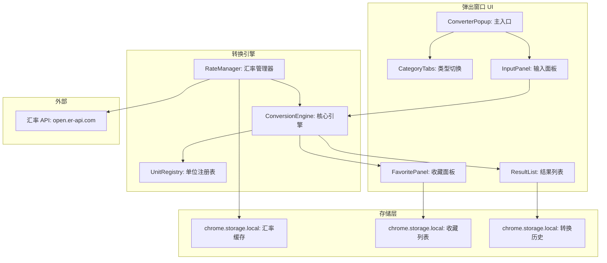
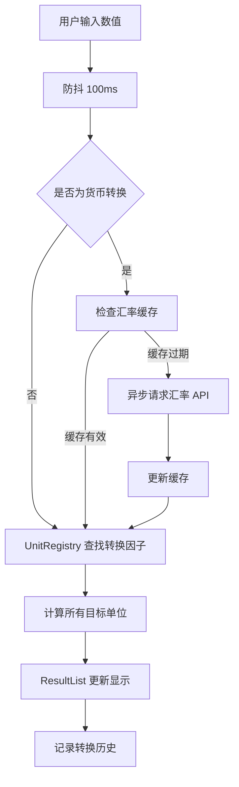

# YP-09-145: 单位转换器 — 弹出窗口中的快速单位转换工具

> 需求编号：YP-09-145 · 优先级：P2 · 人天：0.2d · 状态：需求已编写

## 背景

### 问题陈述

YiPet 当前功能集中在 AI 聊天和知识管理，缺乏实用的日常工具。用户在浏览网页时经常需要进行单位转换（如阅读外文资料时转换英尺到米、购物时转换货币、编程时转换数据单位），当前必须切换到外部工具（Google 搜索、计算器应用、货币转换网站），中断浏览流程：

1. **操作中断**：需要离开当前页面，打开外部工具，完成转换后再返回
2. **货币转换复杂**：需要访问专门的汇率网站，手动输入金额和币种
3. **转换历史缺失**：每次转换独立进行，无法查看历史记录或收藏常用转换
4. **多类型支持不足**：不同工具仅支持特定类型转换，需在多个工具间切换
5. **结果无法复用**：转换结果无法一键复制到剪贴板

**核心矛盾**：用户在浏览网页时有频繁的单位转换需求，但当前工具栏缺乏快速转换工具，每次转换都需要中断浏览流程。

### 影响范围

| # | 影响 | 严重程度 | 典型场景 |
|---|------|----------|----------|
| 1 | 浏览流程中断 | 高 | 阅读英文资料时需转换英里到公里，得切换到 Google |
| 2 | 货币转换操作繁琐 | 中 | 购物时转换美元到人民币，需要打开汇率网站 |
| 3 | 编程时数据单位转换 | 中 | 编写代码时需转换字节到 MB，要打开计算器 |
| 4 | 转换历史不可追溯 | 低 | 之前转换过的值无法快速复用 |
| 5 | 无快捷入口 | 中 | 需要多次点击才能找到转换功能 |

### 挑战

| 挑战 | 说明 |
|------|------|
| 汇率数据实时性 | 汇率时刻变化，需要合理的缓存策略（每日更新） |
| 转换精度 | 不同场景精度要求不同，科学计算需要高精度，烹饪需要分数 |
| 弹出窗口空间限制 | YiPet 弹出窗口尺寸有限（约 400x600px），需紧凑布局 |
| 多类型切换 | 8 种转换类型，切换流畅且状态不丢失 |
| 离线可用性 | 除货币转换外，其他类型应支持离线使用 |

---

## 一、现状分析

### 1.1 当前转换工具现状

```
现有工具功能:
├── 聊天窗口
│   ├── 可手动输入转换请求
│   └── 无专用转换 UI
├── 弹出窗口
│   ├── 角色选择
│   ├── 快捷操作
│   └── 无单位转换入口
│
缺失:
├── 单位转换器 UI              # ❌ 不存在
├── 实时转换（输入即转）        # ❌ 不存在
├── 货币汇率缓存               # ❌ 不存在
├── 收藏转换列表               # ❌ 不存在
├── 一键复制结果               # ❌ 不存在
└── 转换历史记录               # ❌ 不存在
```

### 1.2 转换类型需求

| 类型 | 单位 | 示例 | 精度要求 |
|------|------|------|----------|
| 长度 | 米/千米/厘米/毫米/英尺/英寸/英里/码 | 1 英尺 = 0.3048 米 | 4 位小数 |
| 重量 | 千克/克/毫克/吨/磅/盎司 | 1 磅 = 0.4536 千克 | 4 位小数 |
| 温度 | 摄氏度/华氏度/开尔文 | 0°C = 32°F = 273.15K | 2 位小数 |
| 货币 | 人民币/美元/欧元/日元/英镑/韩元 | 1 USD = 7.25 CNY | 4 位小数 |
| 数据 | 字节/KB/MB/GB/TB/PB | 1 MB = 1024 KB | 2 位小数 |
| 面积 | 平方米/平方千米/公顷/亩/平方英尺/英亩 | 1 亩 = 666.67 平方米 | 2 位小数 |
| 速度 | 米/秒/千米/时/英里/时/节 | 1 马赫 = 1225 千米/时 | 2 位小数 |
| 时间 | 秒/分/时/天/周/月/年 | 1 天 = 86400 秒 | 精确 |

### 1.3 根因矩阵

| 症状 | 根因 | 触发条件 | 频率 |
|------|------|----------|------|
| 浏览流程中断 | 无内置转换工具 | 需要单位转换时 | 高 |
| 货币转换操作繁琐 | 无汇率缓存机制 | 需要货币转换时 | 中 |
| 常用转换重复输入 | 无收藏/历史功能 | 多次转换同一类型 | 中 |
| 多类型切换不便 | 无统一转换入口 | 需要不同类型转换 | 中 |

---

## 二、设计决策

### 决策 1：转换引擎 — 纯前端计算 vs 后端 API vs 混合

| 选项 | 响应速度 | 离线可用 | 实现复杂度 |
|------|----------|----------|-----------|
| 纯前端计算 | 极快（< 1ms） | 是 | 低 |
| 后端 API 计算 | 较快（~50ms） | 否 | 低 |
| 混合（前端基本 + 后端汇率） | 前端快/汇率中 | 部分 | 中 |

**选择：混合方案。** 7 种固定单位转换（长度/重量/温度/数据/面积/速度/时间）完全在前端计算，实现零延迟的实时转换。货币转换接入外部汇率 API，每日缓存汇率数据，缓存有效期内离线可用。

### 决策 2：交互模式 — 输入即转换 vs 点击转换按钮

| 选项 | 用户体验 | 计算开销 | 适用场景 |
|------|----------|----------|----------|
| 输入即转换（实时） | 高（即时反馈） | 极低 | 所有场景 |
| 点击按钮转换 | 中（需额外操作） | 极低 | 复杂计算 |

**选择：输入即转换。** 用户输入数值时实时显示所有关联单位的转换结果，无需点击任何按钮。转换计算量极小（简单乘除），不影响性能。支持防抖（100ms），避免高频输入时的闪烁。

### 决策 3：货币汇率数据源 — 单一 API vs 多源聚合 vs 手动配置

| 选项 | 准确性 | 可靠性 | 成本 |
|------|--------|--------|------|
| 单一免费 API（如 exchangerate-api） | 中 | 中 | 免费 |
| 多源聚合 | 高 | 高 | 中（需处理多个 API） |
| 手动配置 | 低 | 高 | 免费 |

**选择：单一免费 API + 每日缓存。** 使用免费汇率 API（如 open.er-api.com 或 exchangerate-api.com），每日 08:00 自动刷新汇率。缓存到 `chrome.storage.local`，24 小时内有效。API 不可用时使用上次缓存汇率，并在 UI 中标注"汇率更新时间"。

### 决策 4：收藏转换存储 — chrome.storage.local vs IndexedDB vs 不持久化

| 选项 | 容量 | 查询速度 | 同步复杂度 |
|------|------|----------|-----------|
| chrome.storage.local | 10MB | 快 | 低 |
| IndexedDB | 无限制 | 中 | 中 |
| 不持久化 | N/A | N/A | 无 |

**选择：chrome.storage.local。** 收藏列表和转换历史数据量小（每条 < 100 字节），`chrome.storage.local` 足够。支持 `storage.sync` 可选同步到用户其他设备（需用户授权）。

### 设计决策记录

| 决策 | 选项 A | 选项 B | 选项 C | 选择 | 理由 |
|------|--------|--------|--------|------|------|
| 转换引擎 | 纯前端 | 后端 API | 混合 | **混合** | 前端快 + 后端汇率 |
| 交互模式 | 实时转换 | 按钮转换 | — | **实时转换** | 即时反馈 |
| 汇率数据源 | 单一免费 API | 多源聚合 | 手动配置 | **单一 API + 缓存** | 免费 + 高可用 |
| 收藏存储 | storage.local | IndexedDB | 不持久化 | **storage.local** | 数据量小，API 简单 |

---

## 三、目标架构

### 3.1 单位转换器系统架构



### 3.2 实时转换数据流



### 3.3 性能指标

| 指标 | 目标值 | 说明 |
|------|--------|------|
| 输入到结果显示 | < 50ms | 实时转换延迟 |
| 类型切换延迟 | < 30ms | Tab 切换动画 |
| 汇率 API 请求 | < 1000ms | 每日一次，后台静默 |
| 弹出窗口打开到转换器就绪 | < 200ms | 组件初始化 |
| 收藏列表加载 | < 50ms | chrome.storage.local 读取 |

---

## 四、具体改动

### 4.1 转换引擎类型定义

```typescript
// src/converter/types.ts (新增)

export type ConversionCategory =
  | 'length'
  | 'weight'
  | 'temperature'
  | 'currency'
  | 'data'
  | 'area'
  | 'speed'
  | 'time';

export interface UnitDefinition {
  key: string;
  name: string;
  symbol: string;
  /** 转换为基准单位的因子 */
  toBase: (value: number) => number;
  /** 从基准单位转换的因子 */
  fromBase: (value: number) => number;
}

export interface ConversionResult {
  value: number;
  formatted: string;
  unit: string;
  unitName: string;
}

export interface ConversionFavorite {
  id: string;
  category: ConversionCategory;
  fromUnit: string;
  fromValue: number;
  createdAt: number;
  label?: string;
}

export interface RateCache {
  rates: Record<string, number>;
  base: string;
  updatedAt: number;
  /** 缓存有效期 24h */
  ttl: number;
}
```

### 4.2 转换引擎核心实现

```typescript
// src/converter/ConversionEngine.ts (新增)

import type { ConversionCategory, ConversionResult, UnitDefinition } from './types';

const LENGTH_UNITS: UnitDefinition[] = [
  { key: 'm', name: '米', symbol: 'm', toBase: v => v, fromBase: v => v },
  { key: 'km', name: '千米', symbol: 'km', toBase: v => v * 1000, fromBase: v => v / 1000 },
  { key: 'cm', name: '厘米', symbol: 'cm', toBase: v => v / 100, fromBase: v => v * 100 },
  { key: 'mm', name: '毫米', symbol: 'mm', toBase: v => v / 1000, fromBase: v => v * 1000 },
  { key: 'ft', name: '英尺', symbol: 'ft', toBase: v => v * 0.3048, fromBase: v => v / 0.3048 },
  { key: 'in', name: '英寸', symbol: 'in', toBase: v => v * 0.0254, fromBase: v => v / 0.0254 },
  { key: 'mi', name: '英里', symbol: 'mi', toBase: v => v * 1609.344, fromBase: v => v / 1609.344 },
  { key: 'yd', name: '码', symbol: 'yd', toBase: v => v * 0.9144, fromBase: v => v / 0.9144 },
];

const WEIGHT_UNITS: UnitDefinition[] = [
  { key: 'kg', name: '千克', symbol: 'kg', toBase: v => v, fromBase: v => v },
  { key: 'g', name: '克', symbol: 'g', toBase: v => v / 1000, fromBase: v => v * 1000 },
  { key: 'mg', name: '毫克', symbol: 'mg', toBase: v => v / 1000000, fromBase: v => v * 1000000 },
  { key: 't', name: '吨', symbol: 't', toBase: v => v * 1000, fromBase: v => v / 1000 },
  { key: 'lb', name: '磅', symbol: 'lb', toBase: v => v * 0.45359237, fromBase: v => v / 0.45359237 },
  { key: 'oz', name: '盎司', symbol: 'oz', toBase: v => v * 0.0283495, fromBase: v => v / 0.0283495 },
];

const TEMPERATURE_UNITS: UnitDefinition[] = [
  { key: 'c', name: '摄氏度', symbol: '°C', toBase: v => v, fromBase: v => v },
  { key: 'f', name: '华氏度', symbol: '°F', toBase: v => (v - 32) * 5 / 9, fromBase: v => v * 9 / 5 + 32 },
  { key: 'k', name: '开尔文', symbol: 'K', toBase: v => v - 273.15, fromBase: v => v + 273.15 },
];

const DATA_UNITS: UnitDefinition[] = [
  { key: 'b', name: '字节', symbol: 'B', toBase: v => v, fromBase: v => v },
  { key: 'kb', name: '千字节', symbol: 'KB', toBase: v => v * 1024, fromBase: v => v / 1024 },
  { key: 'mb', name: '兆字节', symbol: 'MB', toBase: v => v * 1048576, fromBase: v => v / 1048576 },
  { key: 'gb', name: '吉字节', symbol: 'GB', toBase: v => v * 1073741824, fromBase: v => v / 1073741824 },
  { key: 'tb', name: '太字节', symbol: 'TB', toBase: v => v * 1099511627776, fromBase: v => v / 1099511627776 },
  { key: 'pb', name: '拍字节', symbol: 'PB', toBase: v => v * 1125899906842624, fromBase: v => v / 1125899906842624 },
];

const AREA_UNITS: UnitDefinition[] = [
  { key: 'm2', name: '平方米', symbol: 'm²', toBase: v => v, fromBase: v => v },
  { key: 'km2', name: '平方千米', symbol: 'km²', toBase: v => v * 1000000, fromBase: v => v / 1000000 },
  { key: 'ha', name: '公顷', symbol: 'ha', toBase: v => v * 10000, fromBase: v => v / 10000 },
  { key: 'mu', name: '亩', symbol: '亩', toBase: v => v * 666.6667, fromBase: v => v / 666.6667 },
  { key: 'ft2', name: '平方英尺', symbol: 'ft²', toBase: v => v * 0.092903, fromBase: v => v / 0.092903 },
  { key: 'ac', name: '英亩', symbol: 'ac', toBase: v => v * 4046.856, fromBase: v => v / 4046.856 },
];

const SPEED_UNITS: UnitDefinition[] = [
  { key: 'ms', name: '米/秒', symbol: 'm/s', toBase: v => v, fromBase: v => v },
  { key: 'kmh', name: '千米/时', symbol: 'km/h', toBase: v => v / 3.6, fromBase: v => v * 3.6 },
  { key: 'mph', name: '英里/时', symbol: 'mph', toBase: v => v * 0.44704, fromBase: v => v / 0.44704 },
  { key: 'kn', name: '节', symbol: 'kn', toBase: v => v * 0.514444, fromBase: v => v / 0.514444 },
];

const TIME_UNITS: UnitDefinition[] = [
  { key: 's', name: '秒', symbol: 's', toBase: v => v, fromBase: v => v },
  { key: 'min', name: '分', symbol: 'min', toBase: v => v * 60, fromBase: v => v / 60 },
  { key: 'h', name: '时', symbol: 'h', toBase: v => v * 3600, fromBase: v => v / 3600 },
  { key: 'd', name: '天', symbol: 'd', toBase: v => v * 86400, fromBase: v => v / 86400 },
  { key: 'wk', name: '周', symbol: 'wk', toBase: v => v * 604800, fromBase: v => v / 604800 },
  { key: 'mo', name: '月', symbol: 'mo', toBase: v => v * 2629800, fromBase: v => v / 2629800 },
  { key: 'yr', name: '年', symbol: 'yr', toBase: v => v * 31557600, fromBase: v => v / 31557600 },
];

const UNIT_REGISTRY: Record<Exclude<ConversionCategory, 'currency'>, UnitDefinition[]> = {
  length: LENGTH_UNITS,
  weight: WEIGHT_UNITS,
  temperature: TEMPERATURE_UNITS,
  data: DATA_UNITS,
  area: AREA_UNITS,
  speed: SPEED_UNITS,
  time: TIME_UNITS,
};

export class ConversionEngine {
  private rateManager: RateManager;

  constructor(rateManager: RateManager) {
    this.rateManager = rateManager;
  }

  /** 执行转换：输入值 + 起始单位 → 该类型下所有单位的结果 */
  convert(
    category: ConversionCategory,
    value: number,
    fromUnit: string,
  ): ConversionResult[] {
    if (category === 'currency') {
      return this.convertCurrency(value, fromUnit);
    }

    const units = UNIT_REGISTRY[category];
    if (!units) return [];

    const fromDef = units.find(u => u.key === fromUnit);
    if (!fromDef) return [];

    // 转换为基准单位
    const baseValue = fromDef.toBase(value);

    // 从基准单位转换为所有目标单位
    return units.map(unit => {
      const converted = unit.fromBase(baseValue);
      return {
        value: converted,
        formatted: this.formatValue(converted, category),
        unit: unit.symbol,
        unitName: unit.name,
      };
    });
  }

  /** 货币转换 */
  convertCurrency(value: number, fromUnit: string): ConversionResult[] {
    const rates = this.rateManager.getRates();
    const currencyUnits = this.rateManager.getCurrencyUnits();

    if (!rates || !rates[fromUnit]) return [];

    const baseValue = value / rates[fromUnit];

    return currencyUnits
      .filter(unit => rates[unit.key])
      .map(unit => {
        const converted = baseValue * rates[unit.key];
        return {
          value: converted,
          formatted: converted.toFixed(4),
          unit: unit.symbol,
          unitName: unit.name,
        };
      });
  }

  /** 格式化数值 */
  private formatValue(value: number, category: ConversionCategory): string {
    if (category === 'temperature') {
      return value.toFixed(2);
    }
    if (category === 'data') {
      if (value >= 1000) return value.toFixed(2);
      return value.toFixed(0);
    }
    if (Math.abs(value) < 0.01) {
      return value.toExponential(4);
    }
    return value.toFixed(4).replace(/\.?0+$/, '');
  }

  /** 获取转换类型的所有单位 */
  getUnits(category: ConversionCategory): UnitDefinition[] {
    if (category === 'currency') {
      return this.rateManager.getCurrencyUnits();
    }
    return UNIT_REGISTRY[category] || [];
  }
}
```

### 4.3 汇率管理器

```typescript
// src/converter/RateManager.ts (新增)

import type { RateCache } from './types';

const RATE_API_URL = 'https://open.er-api.com/v6/latest/USD';
const CACHE_KEY = 'yipet_converter_rate_cache';
const CACHE_TTL = 24 * 60 * 60 * 1000; // 24 小时

const CURRENCY_UNITS = [
  { key: 'CNY', name: '人民币', symbol: '¥' },
  { key: 'USD', name: '美元', symbol: '$' },
  { key: 'EUR', name: '欧元', symbol: '€' },
  { key: 'JPY', name: '日元', symbol: '¥' },
  { key: 'GBP', name: '英镑', symbol: '£' },
  { key: 'KRW', name: '韩元', symbol: '₩' },
  { key: 'HKD', name: '港币', symbol: 'HK$' },
  { key: 'AUD', name: '澳元', symbol: 'A$' },
  { key: 'CAD', name: '加元', symbol: 'C$' },
  { key: 'SGD', name: '新元', symbol: 'S$' },
];

export class RateManager {
  private cache: RateCache | null = null;
  private loading = false;

  /** 获取汇率（优先缓存） */
  getRates(): Record<string, number> | null {
    if (this.cache && Date.now() - this.cache.updatedAt < this.cache.ttl) {
      return this.cache.rates;
    }
    // 异步刷新，但先返回旧缓存
    this.refreshRates();
    return this.cache?.rates ?? null;
  }

  /** 获取货币单位列表 */
  getCurrencyUnits() {
    return CURRENCY_UNITS;
  }

  /** 获取汇率最后更新时间 */
  getLastUpdated(): number | null {
    return this.cache?.updatedAt ?? null;
  }

  /** 从缓存加载汇率 */
  async loadCache(): Promise<void> {
    const result = await chrome.storage.local.get(CACHE_KEY);
    if (result[CACHE_KEY]) {
      this.cache = result[CACHE_KEY];
    }
  }

  /** 刷新汇率 */
  async refreshRates(): Promise<void> {
    if (this.loading) return;
    this.loading = true;

    try {
      const response = await fetch(RATE_API_URL);
      const data = await response.json();

      if (data.result === 'success') {
        this.cache = {
          rates: data.rates,
          base: data.base_code,
          updatedAt: Date.now(),
          ttl: CACHE_TTL,
        };

        await chrome.storage.local.set({ [CACHE_KEY]: this.cache });
      }
    } catch (error) {
      console.warn('[RateManager] 汇率刷新失败:', error);
    } finally {
      this.loading = false;
    }
  }
}
```

### 4.4 文件变更清单

| 文件 | 操作 | 说明 |
|------|------|------|
| `src/converter/types.ts` | 新增 | 转换器类型定义 |
| `src/converter/ConversionEngine.ts` | 新增 | 转换引擎核心 |
| `src/converter/RateManager.ts` | 新增 | 汇率管理器 |
| `src/popup/components/ConverterPopup.vue` | 新增 | 转换器弹出窗口组件 |
| `src/popup/components/UnitInput.vue` | 新增 | 单位输入组件 |
| `src/popup/components/ResultList.vue` | 新增 | 转换结果列表组件 |
| `src/popup/components/FavoritePanel.vue` | 新增 | 收藏面板组件 |
| `src/popup/App.vue` | 修改 | 添加转换器入口 |

---

## 五、实施步骤

| 步骤 | 操作 | 路径 | 验证 | 人天 |
|------|------|------|------|------|
| 1 | 定义类型和接口 | `src/converter/types.ts` | 类型检查通过 | 0.01 |
| 2 | 实现转换引擎 | `src/converter/ConversionEngine.ts` | 所有单位转换正确 | 0.04 |
| 3 | 实现汇率管理器 | `src/converter/RateManager.ts` | 汇率缓存和刷新 | 0.03 |
| 4 | 实现转换器 UI | `src/popup/components/ConverterPopup.vue` | 输入即转换 | 0.05 |
| 5 | 实现收藏和历史 | `src/popup/components/FavoritePanel.vue` | 收藏持久化 | 0.03 |
| 6 | 实现复制功能 | `src/popup/components/ResultList.vue` | 一键复制到剪贴板 | 0.01 |
| 7 | 集成到弹出窗口 | `src/popup/App.vue` | 转换器入口可用 | 0.02 |
| 8 | 编写测试 | `tests/unit/converter/` | 覆盖转换精度和边界 | 0.01 |

**总人天：0.2d**

---

## 六、测试规格

### 场景 1：基本长度转换

**GIVEN** 转换器类型选择"长度"
**WHEN** 用户输入 "1"，选择起始单位"英尺(ft)"
**THEN** 所有长度单位显示等价值：米 0.3048、厘米 30.48、英寸 12
**AND** 当前输入单位高亮显示

### 场景 2：温度转换（含公式）

**GIVEN** 转换器类型选择"温度"
**WHEN** 用户输入 "0"，选择起始单位"摄氏度(°C)"
**THEN** 华氏度显示 32、开尔文显示 273.15
**AND** 输入 "32" 华氏度时，摄氏度显示 0

### 场景 3：货币转换（汇率缓存）

**GIVEN** 汇率缓存有效（当天更新），1 USD = 7.25 CNY
**WHEN** 用户选择"货币"类型，输入 "100"，选择起始单位"美元(USD)"
**THEN** 人民币显示 725.0000
**AND** 其他货币按汇率计算
**AND** UI 显示"汇率更新于 2026-09-09 08:00"

### 场景 4：货币转换（缓存过期）

**GIVEN** 汇率缓存过期（超过 24 小时）
**WHEN** 用户选择"货币"类型
**THEN** 后台异步刷新汇率
**AND** 刷新期间使用旧缓存汇率
**AND** 刷新完成后更新结果

### 场景 5：收藏常用转换

**GIVEN** 用户转换 1 英尺 = 0.3048 米后
**WHEN** 用户点击收藏按钮
**THEN** 该转换保存到收藏列表
**AND** 收藏列表显示 "1 ft → 0.3048 m"
**AND** 刷新弹出窗口后收藏仍存在

### 场景 6：一键复制结果

**GIVEN** 转换结果显示 "0.3048 m"
**WHEN** 用户点击该结果旁的复制按钮
**THEN** "0.3048" 复制到剪贴板
**AND** 显示"已复制"Toast 提示（1.5 秒后消失）

---

## 七、风险与缓解

| 风险 | 概率 | 影响 | 缓解措施 |
|------|------|------|----------|
| 汇率 API 不可用 | 中 | 中 | 使用上次缓存汇率，标注"汇率可能已过期" |
| 浮点精度丢失 | 低 | 低 | 使用 `toFixed(4)` 格式化，避免 `0.1 + 0.2` 问题 |
| 弹出窗口空间不足 | 中 | 中 | 使用紧凑布局，Tab 切换类型，滚动查看结果 |
| 大数据单位溢出 | 低 | 低 | 使用 `toExponential` 处理超大/超小数值 |
| chrome.storage 配额不足 | 低 | 低 | 限制历史记录 100 条，超过时移除最旧 |

---

## 八、回滚策略

| 场景 | 回滚操作 | 影响 |
|------|----------|------|
| 转换器组件异常 | 隐藏转换器入口，仅保留聊天功能 | 失去转换器功能 |
| 汇率 API 持续不可用 | 禁用货币转换类型，显示"暂不可用" | 失去货币转换 |
| 收藏数据损坏 | 清除 `yipet_converter_favorites` storage key | 收藏列表清空 |
| 完全回滚 | 移除转换器相关代码和路由 | 功能回到改造前 |

---

## 九、设计决策记录

### D-01：转换精度策略

- **问题**：转换结果保留几位小数
- **选项**：2 位、4 位、6 位、动态
- **选择**：动态精度（默认 4 位，温度 2 位，数据单位 0-2 位）
- **理由**：不同场景精度需求不同。温度 0.01°C 已有意义，但数据单位 1.23 MB 即可。科学计算场景允许用户调整精度。

### D-02：汇率 API 选择

- **问题**：使用哪个汇率 API
- **选项**：open.er-api.com、exchangerate-api.com、自建
- **选择**：open.er-api.com
- **理由**：免费、无需 API Key、支持 160+ 币种、每日更新。免费版无请求限制。备选 exchangerate-api.com。

### D-03：温度转换特殊处理

- **问题**：温度转换不是线性比例（0°C 不等于 0°F）
- **选项**：统一线性转换、特殊公式处理
- **选择**：特殊公式处理（`toBase`/`fromBase` 函数支持非比例转换）
- **理由**：温度转换有偏移量（°C 到 °F 需要 +32），不能简单乘除。`UnitDefinition` 的 `toBase`/`fromBase` 函数接口支持任意转换逻辑。

### D-04：离线优先策略

- **问题**：无网络时转换器是否可用
- **选项**：完全不可用、部分可用（除货币外）、全部离线可用
- **选择**：部分可用（7 种固定单位离线可用，货币需缓存）
- **理由**：7 种固定单位转换是纯前端计算，无需网络。货币转换依赖外部 API，但 24 小时缓存使其在大多数情况下也可用。

---

## 十、可观测性

### 指标

| 指标 | 类型 | 说明 |
|------|------|------|
| `yipet.converter.conversion_total` | Counter | 转换总次数（按类型分组） |
| `yipet.converter.conversion_latency_ms` | Histogram | 单次转换耗时 |
| `yipet.converter.rate_refresh_success` | Gauge | 汇率刷新是否成功（1/0） |
| `yipet.converter.favorite_count` | Gauge | 收藏转换数量 |
| `yipet.converter.copy_total` | Counter | 复制结果次数 |

### 告警

| 告警 | 条件 | 级别 |
|------|------|------|
| 汇率刷新连续失败 | 连续 3 次刷新失败 | WARNING |
| 转换器使用率极低 | 日活用户中 < 1% 使用转换器 | INFO |

---

## 十一、代码审查检查清单

- [ ] 所有 7 种固定单位转换正确（长度/重量/温度/数据/面积/速度/时间）
- [ ] 温度转换使用特殊公式（非简单比例）
- [ ] 货币转换使用汇率缓存，过期自动刷新
- [ ] 汇率刷新失败时使用旧缓存
- [ ] 输入即转换（实时），无额外按钮点击
- [ ] 浮点精度处理正确（无 0.1 + 0.2 问题）
- [ ] 收藏列表持久化到 chrome.storage.local
- [ ] 一键复制结果到剪贴板
- [ ] 类型切换流畅，状态不丢失
- [ ] 弹出窗口尺寸适配转换器布局
- [ ] 转换历史限制 100 条

---

## 回归问题预测

| # | 预测问题 | 原因 | 验证方法 |
|---|---------|------|---------|
| 1 | 温度转换中，0°C 转华氏度显示 32°F 正确，但输入 0°F 转摄氏度显示 -17.7778°C 而非 -17.78°C，小数位数过多 | 温度格式化使用 `toFixed(2)`，但 `fromBase` 函数中 `(v - 32) * 5 / 9` 产生浮点误差 | 验证温度转换所有边界值（0°C、100°C、-40°C、0°F）的精度 |
| 2 | 货币转换中，汇率缓存过期后异步刷新，刷新期间的转换结果使用旧汇率，但用户未注意到"汇率可能已过期"提示 | 提示文案太小或位置不明显，用户未看到 | 在汇率过期时，货币转换结果顶部显示黄色警告条，包含"最后更新于 {时间}" |
| 3 | 数据单位转换中，1024 KB = 1 MB 正确，但 1024 MB = 1.00 GB 而非 1 GB，显示多余小数 | 格式化函数未针对数据单位做去零处理 | 数据单位格式化时，整数部分 >= 1 时去掉小数部分 |
| 4 | 弹出窗口关闭后重新打开，用户之前选择的转换类型和输入值丢失 | 组件状态未持久化，popup 关闭后 Vue 实例销毁 | 在 `chrome.storage.session` 中保存最后使用的转换类型和输入值 |
| 5 | 复制按钮点击后，某些网页（如 Google Docs）中 `navigator.clipboard.writeText` 因 Permissions Policy 被阻止 | 部分网站通过 `Permissions-Policy: clipboard-write=()` 禁用剪贴板 API | 使用 `document.execCommand('copy')` 作为降级方案，或使用 `chrome.offscreen` API |
| 6 | 货币转换中，用户输入极大数值（如 999999999999），JavaScript 浮点精度丢失，转换结果不准确 | JavaScript `number` 类型精度为 53 位有效数字，超出范围精度下降 | 对输入值做范围限制（最大 10^12），超出时提示"数值过大，精度可能下降" |

---

## 性能分析

### 各操作耗时

| 阶段 | 预估耗时 | 说明 |
|------|----------|------|
| 转换引擎初始化 | < 5ms | 注册单位定义 |
| 单次转换计算 | < 1ms | 纯乘除运算 |
| 汇率缓存加载 | < 10ms | chrome.storage.local 读取 |
| 汇率 API 刷新 | < 1000ms | 网络请求（每日一次） |
| 收藏列表加载 | < 10ms | chrome.storage.local 读取 |
| 弹出窗口打开 | < 200ms | Vue 组件挂载 + 数据初始化 |

### 文件体积预估

| 文件 | 大小 | 说明 |
|------|------|------|
| `src/converter/types.ts` | ~1KB | 类型定义 |
| `src/converter/ConversionEngine.ts` | ~5KB | 转换引擎 + 单位定义 |
| `src/converter/RateManager.ts` | ~2KB | 汇率管理器 |
| `src/popup/components/ConverterPopup.vue` | ~3KB | 转换器 UI |
| `src/popup/components/UnitInput.vue` | ~1KB | 输入组件 |
| `src/popup/components/ResultList.vue` | ~1.5KB | 结果列表 |
| `src/popup/components/FavoritePanel.vue` | ~1.5KB | 收藏面板 |