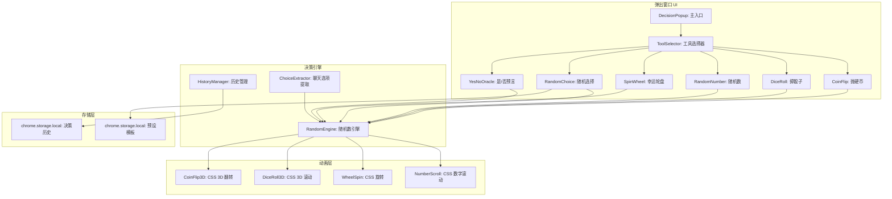
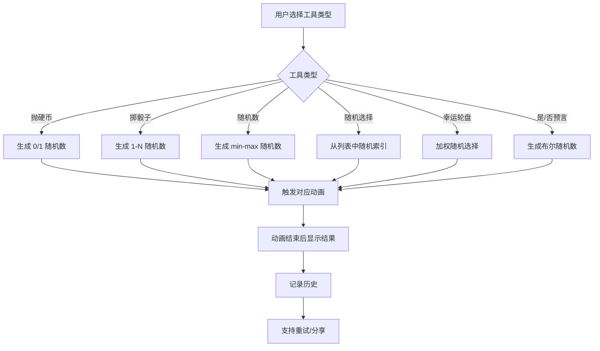

# YP-09-146: 随机决策助手 — 抛硬币/掷骰子/随机选择/幸运轮盘/趣味动画

> 需求编号：YP-09-146 · 优先级：P2 · 人天：0.2d · 状态：需求已编写
> 依赖：YP-09-145（单位转换器，共享弹出窗口入口）

## 背景

### 问题陈述

用户在日常浏览和工作中经常遇到需要随机决策的场景：选择午餐吃什么、决定团队活动顺序、从多个选项中随机抽取、解决"谁来负责"的争议。当前用户依赖外部工具（手机应用、网页工具）或物理道具（硬币、骰子），存在以下问题：

1. **工具不在手边**：需要随机决策时，手边没有硬币或骰子
2. **外部工具分散**：不同决策类型需要不同工具（硬币、骰子、随机数生成器、抽签工具）
3. **缺乏趣味性**：简单的布尔随机结果缺乏趣味性，用户期望视觉反馈
4. **聊天上下文无法利用**：在 AI 聊天中无法直接"帮我选一个"
5. **选择列表管理不便**：手动输入多个选项并随机抽取，操作繁琐

**核心矛盾**：用户有高频的随机决策需求，但缺乏一个集成的、有趣的、可快速访问的随机决策工具。YiPet 作为常驻浏览器伴侣，天然适合承载此类轻量工具。

### 影响范围

| # | 影响 | 严重程度 | 典型场景 |
|---|------|----------|----------|
| 1 | 决策效率低 | 中 | 午餐选择犹豫不决，需要打开多个工具 |
| 2 | 趣味性不足 | 中 | 团队活动用手机抛硬币，缺乏仪式感 |
| 3 | 聊天上下文割裂 | 中 | 在聊天中讨论选项后，需手动切换工具随机选择 |
| 4 | 选项列表输入繁琐 | 低 | 每次都要重新输入相同的选项列表 |

### 挑战

| 挑战 | 说明 |
|------|------|
| 动画性能 | 弹出窗口空间有限，CSS 动画需流畅运行 |
| 随机性可验证 | 用户可能质疑随机结果的公平性 |
| 动画时长控制 | 动画需足够长以产生"悬念"感，但不能太长影响体验 |
| 选项列表输入 | 弹出窗口内输入多个选项的交互设计 |

---

## 一、现状分析

### 1.1 当前随机决策功能现状

```
现有功能:
├── 聊天窗口
│   ├── 可请求 AI "帮我抛个硬币"
│   └── 无专用随机决策 UI
├── 弹出窗口
│   ├── 角色切换
│   ├── 快捷操作
│   └── 无随机决策入口
│
缺失:
├── 抛硬币（带翻转动画）        # ❌ 不存在
├── 掷骰子（带滚动动画）        # ❌ 不存在
├── 随机数生成器               # ❌ 不存在
├── 列表随机选择               # ❌ 不存在
├── 幸运轮盘                   # ❌ 不存在
├── 是/否预言                  # ❌ 不存在
├── 聊天上下文"帮我选"          # ❌ 不存在
└── 历史记录                   # ❌ 不存在
```

### 1.2 随机决策工具功能矩阵

| 工具 | 输入 | 输出 | 动画 | 适用场景 |
|------|------|------|------|----------|
| 抛硬币 | 无 | 正面/反面 | 硬币翻转 3D 动画 | 二选一决策 |
| 掷骰子 | 骰子数量 1-6 | 点数 | 骰子滚动动画 | 1-N 随机数 |
| 随机数 | 最小/最大值 | 随机整数 | 数字滚动动画 | 任意范围随机 |
| 随机选择 | 选项列表 | 1 个选中项 | 高亮轮转动画 | 多选一决策 |
| 幸运轮盘 | 选项列表 | 1 个选中项 | 旋转轮盘动画 | 有趣的随机选择 |
| 是/否预言 | 问题文本 | 是/否 | 水晶球动画 | 趣味问答 |

### 1.3 根因矩阵

| 症状 | 根因 | 触发条件 | 频率 |
|------|------|----------|------|
| 无处随机决策 | 无集成随机工具 | 需要随机决策时 | 中 |
| 决策缺乏趣味性 | 纯文本结果无动画 | 社交场景需要趣味性 | 中 |
| 选项列表管理不便 | 无持久化列表功能 | 多次使用相同选项列表 | 中 |
| 工具分散 | 不同决策类型需不同工具 | 不同场景切换 | 中 |

---

## 二、设计决策

### 决策 1：随机数生成 — Math.random() vs crypto.getRandomValues() vs 外部 API

| 选项 | 随机性 | 性能 | 可验证性 |
|------|--------|------|----------|
| Math.random() | 伪随机（足够） | 极快 | 不可验证 |
| crypto.getRandomValues() | 真随机 | 快 | 不可验证 |
| 外部 API（random.org） | 真随机 | 慢 | 可验证 |

**选择：crypto.getRandomValues()。** 对于非安全场景，`Math.random()` 足够。但 `crypto.getRandomValues()` 提供密码学安全的随机数，且浏览器原生支持，性能良好。不引入外部 API 依赖，保持离线可用。

### 决策 2：动画实现方式 — CSS Animation vs Canvas vs Web Animations API

| 选项 | 流畅度 | 开发复杂度 | 兼容性 |
|------|--------|-----------|--------|
| CSS Animation | 高（GPU 加速） | 低 | 优秀 |
| Canvas | 高（完全控制） | 高 | 优秀 |
| Web Animations API | 高 | 中 | 良好 |

**选择：CSS Animation + CSS 3D Transform。** 硬币翻转、骰子滚动、轮盘旋转均可通过 CSS 3D Transform 实现，GPU 加速，性能优秀。仅需少许 JavaScript 控制动画触发和结果映射。

### 决策 3：选项列表来源 — 手动输入 vs 聊天上下文提取 vs 预设模板

| 选项 | 灵活性 | 操作效率 | 实现复杂度 |
|------|--------|----------|-----------|
| 手动输入 | 高 | 低 | 低 |
| 聊天上下文提取 | 中 | 高 | 中 |
| 预设模板 | 低 | 高 | 低 |

**选择：三种方式都支持。** 手动输入作为主要方式（支持换行/逗号分隔）。聊天上下文提取：当用户在聊天中提到"帮我从 A、B、C 中选一个"时，AI 自动提取选项并触发随机选择。预设模板：提供常用列表（午餐选择、团建活动、抽奖名单）。

### 决策 4：结果持久化 — 保存历史 vs 仅当前会话 vs 不保存

| 选项 | 可追溯性 | 存储开销 | 趣味性 |
|------|----------|----------|--------|
| 保存历史（最近 50 条） | 高 | 低 | 高（可查看统计） |
| 仅当前会话 | 低 | 极低 | 低 |
| 不保存 | 无 | 无 | 低 |

**选择：保存最近 50 条历史。** 历史记录支持查看统计（如抛硬币正反面比例），增加趣味性。存储到 `chrome.storage.local`，数据量小（每条 < 200 字节）。

### 设计决策记录

| 决策 | 选项 A | 选项 B | 选项 C | 选择 | 理由 |
|------|--------|--------|--------|------|------|
| 随机数生成 | Math.random | crypto | 外部 API | **crypto** | 安全 + 原生 |
| 动画实现 | CSS Animation | Canvas | Web Animations | **CSS 3D** | GPU 加速 |
| 选项来源 | 手动输入 | 聊天提取 | 预设模板 | **三者都支持** | 最大灵活性 |
| 结果持久化 | 保存历史 | 仅当前会话 | 不保存 | **保存 50 条** | 趣味性 |

---

## 三、目标架构

### 3.1 随机决策助手系统架构



### 3.2 随机决策流程



### 3.3 性能指标

| 指标 | 目标值 | 说明 |
|------|--------|------|
| 随机数生成延迟 | < 1ms | crypto.getRandomValues() |
| 动画帧率 | 60fps | CSS 3D Transform GPU 加速 |
| 抛硬币动画时长 | 1.5s | 翻转 3 圈 + 结果展示 |
| 骰子滚动动画时长 | 1.2s | 滚动 + 停止 |
| 轮盘旋转动画时长 | 2-3s | 旋转 + 减速停止 |
| 历史记录加载 | < 10ms | chrome.storage.local 读取 |

---

## 四、具体改动

### 4.1 随机引擎类型定义

```typescript
// src/decision/types.ts (新增)

export type DecisionTool =
  | 'coin-flip'
  | 'dice-roll'
  | 'random-number'
  | 'random-choice'
  | 'spin-wheel'
  | 'yes-no-oracle';

export interface CoinFlipResult {
  value: boolean; // true = 正面, false = 反面
  label: string;
  heads: boolean;
}

export interface DiceRollResult {
  values: number[]; // 每个骰子的点数
  total: number;
  count: number;
}

export interface RandomNumberResult {
  value: number;
  min: number;
  max: number;
}

export interface RandomChoiceResult {
  selected: string;
  selectedIndex: number;
  options: string[];
  totalOptions: number;
}

export interface SpinWheelResult {
  selected: string;
  selectedIndex: number;
  options: string[];
  rotation: number; // 旋转角度
}

export interface YesNoResult {
  answer: boolean;
  label: string;
  question: string;
}

export type DecisionResult =
  | { tool: 'coin-flip'; result: CoinFlipResult }
  | { tool: 'dice-roll'; result: DiceRollResult }
  | { tool: 'random-number'; result: RandomNumberResult }
  | { tool: 'random-choice'; result: RandomChoiceResult }
  | { tool: 'spin-wheel'; result: SpinWheelResult }
  | { tool: 'yes-no-oracle'; result: YesNoResult };

export interface DecisionHistory {
  id: string;
  timestamp: number;
  tool: DecisionTool;
  result: DecisionResult;
}

export interface PresetList {
  id: string;
  name: string;
  options: string[];
  createdAt: number;
}
```

### 4.2 随机引擎实现

```typescript
// src/decision/RandomEngine.ts (新增)

import type { CoinFlipResult, DiceRollResult, RandomNumberResult, RandomChoiceResult, SpinWheelResult, YesNoResult } from './types';

export class RandomEngine {
  /** 生成密码学安全的随机整数 [0, max) */
  private randomInt(max: number): number {
    const array = new Uint32Array(1);
    crypto.getRandomValues(array);
    return array[0] % max;
  }

  /** 生成密码学安全的随机浮点数 [0, 1) */
  private random(): number {
    const array = new Uint32Array(1);
    crypto.getRandomValues(array);
    return array[0] / 4294967296; // 2^32
  }

  /** 抛硬币 */
  flipCoin(): CoinFlipResult {
    const value = this.random() >= 0.5;
    return {
      value,
      label: value ? '正面' : '反面',
      heads: value,
    };
  }

  /** 掷骰子 */
  rollDice(count: number = 1): DiceRollResult {
    const values: number[] = [];
    for (let i = 0; i < count; i++) {
      values.push(this.randomInt(6) + 1);
    }
    return {
      values,
      total: values.reduce((sum, v) => sum + v, 0),
      count,
    };
  }

  /** 随机数 */
  randomNumber(min: number, max: number): RandomNumberResult {
    const value = this.randomInt(max - min + 1) + min;
    return { value, min, max };
  }

  /** 从列表中随机选择 */
  randomChoice(options: string[]): RandomChoiceResult {
    const selectedIndex = this.randomInt(options.length);
    return {
      selected: options[selectedIndex],
      selectedIndex,
      options,
      totalOptions: options.length,
    };
  }

  /** 幸运轮盘（加权随机，带旋转角度） */
  spinWheel(options: string[]): SpinWheelResult {
    const selectedIndex = this.randomInt(options.length);
    // 360 / N 为每份角度，选中角度 = index * 份 + 份/2
    const segmentAngle = 360 / options.length;
    const targetAngle = selectedIndex * segmentAngle + segmentAngle / 2;
    // 指针在顶部（0°），旋转盘使选中扇区对准指针
    const rotation = 360 - targetAngle + 360 * 5; // 至少转 5 圈
    return {
      selected: options[selectedIndex],
      selectedIndex,
      options,
      rotation,
    };
  }

  /** 是/否预言 */
  askOracle(question: string): YesNoResult {
    const answer = this.random() >= 0.5;
    const yesLabels = ['是的', '没错', '当然', '肯定', '毫无疑问'];
    const noLabels = ['不是', '再想想', '未必', '不好说', '换个问题试试'];
    const labels = answer ? yesLabels : noLabels;
    const label = labels[this.randomInt(labels.length)];

    return { answer, label, question };
  }
}
```

### 4.3 抛硬币 CSS 3D 动画

```css
/* src/decision/components/CoinFlip.css */

.coin-container {
  width: 100px;
  height: 100px;
  perspective: 600px;
  margin: 20px auto;
}

.coin {
  width: 100%;
  height: 100%;
  position: relative;
  transform-style: preserve-3d;
  transition: none;
}

.coin.flipping {
  animation: coin-flip 1.5s ease-out forwards;
}

.coin-face {
  position: absolute;
  width: 100%;
  height: 100%;
  border-radius: 50%;
  backface-visibility: hidden;
  display: flex;
  align-items: center;
  justify-content: center;
  font-size: 40px;
}

.coin-front {
  background: linear-gradient(135deg, #ffd700, #ffb800);
  transform: rotateY(0deg);
}

.coin-back {
  background: linear-gradient(135deg, #c0c0c0, #a0a0a0);
  transform: rotateY(180deg);
}

@keyframes coin-flip {
  0% { transform: rotateY(0deg) rotateX(0deg); }
  100% { transform: rotateY(var(--flip-degrees, 1080deg)) rotateX(0deg); }
}
```

### 4.4 幸运轮盘组件

```vue
<!-- src/decision/components/SpinWheel.vue (新增) -->

<script setup lang="ts">
import { ref, computed } from 'vue';
import { RandomEngine } from '../RandomEngine';

const props = defineProps<{
  options: string[];
}>();

const engine = new RandomEngine();
const spinning = ref(false);
const result = ref<string>('');
const rotation = ref(0);

const colors = ['#FF6B6B', '#4ECDC4', '#45B7D1', '#96CEB4', '#FFEAA7', '#DDA0DD', '#98D8C8', '#F7DC6F'];

function spin() {
  if (spinning.value) return;
  spinning.value = true;
  result.value = '';

  const outcome = engine.spinWheel(props.options);
  rotation.value = outcome.rotation;
  result.value = outcome.selected;
}

function onAnimationEnd() {
  spinning.value = false;
}
</script>

<template>
  <div class="spin-wheel">
    <div class="wheel-pointer">▼</div>
    <div
      class="wheel"
      :class="{ spinning }"
      :style="{ transform: `rotate(${rotation}deg)` }"
      @transitionend="onAnimationEnd"
    >
      <div
        v-for="(option, index) in options"
        :key="index"
        class="wheel-segment"
        :style="{
          transform: `rotate(${(360 / options.length) * index}deg)`,
          backgroundColor: colors[index % colors.length],
        }"
      >
        <span class="segment-label">{{ option }}</span>
      </div>
    </div>
    <button class="spin-btn" @click="spin" :disabled="spinning">
      {{ spinning ? '转动中...' : '开始!' }}
    </button>
    <div v-if="result" class="spin-result">
      结果: <strong>{{ result }}</strong>
    </div>
  </div>
</template>
```

### 4.5 文件变更清单

| 文件 | 操作 | 说明 |
|------|------|------|
| `src/decision/types.ts` | 新增 | 决策类型定义 |
| `src/decision/RandomEngine.ts` | 新增 | 随机数引擎 |
| `src/decision/HistoryManager.ts` | 新增 | 历史记录管理 |
| `src/decision/components/CoinFlip.vue` | 新增 | 抛硬币组件 |
| `src/decision/components/DiceRoll.vue` | 新增 | 掷骰子组件 |
| `src/decision/components/RandomNumber.vue` | 新增 | 随机数组件 |
| `src/decision/components/RandomChoice.vue` | 新增 | 随机选择组件 |
| `src/decision/components/SpinWheel.vue` | 新增 | 幸运轮盘组件 |
| `src/decision/components/YesNoOracle.vue` | 新增 | 是/否预言组件 |
| `src/decision/components/DecisionPopup.vue` | 新增 | 决策助手主入口 |
| `src/popup/App.vue` | 修改 | 添加决策助手入口 |

---

## 五、实施步骤

| 步骤 | 操作 | 路径 | 验证 | 人天 |
|------|------|------|------|------|
| 1 | 定义类型接口 | `src/decision/types.ts` | 类型检查通过 | 0.01 |
| 2 | 实现随机引擎 | `src/decision/RandomEngine.ts` | 所有工具随机性正确 | 0.03 |
| 3 | 实现抛硬币（含 3D 动画） | `src/decision/components/CoinFlip.vue` | 硬币翻转动画流畅 | 0.03 |
| 4 | 实现掷骰子（含动画） | `src/decision/components/DiceRoll.vue` | 骰子滚动动画流畅 | 0.02 |
| 5 | 实现随机数生成器 | `src/decision/components/RandomNumber.vue` | min/max 范围正确 | 0.01 |
| 6 | 实现随机选择 + 幸运轮盘 | `src/decision/components/` | 选项列表随机选择 | 0.04 |
| 7 | 实现是/否预言 | `src/decision/components/YesNoOracle.vue` | 随机结果 + 趣味文案 | 0.02 |
| 8 | 实现历史记录管理 | `src/decision/HistoryManager.ts` | 历史持久化 | 0.02 |
| 9 | 集成到弹出窗口 | `src/decision/components/DecisionPopup.vue` | 入口可用 | 0.02 |

**总人天：0.2d**

---

## 六、测试规格

### 场景 1：抛硬币

**GIVEN** 用户打开决策助手，选择"抛硬币"
**WHEN** 用户点击硬币
**THEN** 硬币执行 3D 翻转动画（1.5 秒）
**AND** 动画结束后显示"正面"或"反面"
**AND** 结果记录到历史，显示正反面比例

### 场景 2：掷骰子

**GIVEN** 用户选择"掷骰子"，设置骰子数量为 3
**WHEN** 用户点击"掷骰子"
**THEN** 3 个骰子显示滚动动画（1.2 秒）
**AND** 显示每个骰子的点数和总和
**AND** 点数范围 3-18

### 场景 3：随机数生成

**GIVEN** 用户选择"随机数"，设置范围 1-100
**WHEN** 用户点击"生成"
**THEN** 显示一个 1-100 之间的随机整数
**AND** 数字滚动动画（0.5 秒）
**AND** 再次点击生成新随机数

### 场景 4：随机选择

**GIVEN** 用户输入选项列表："火锅, 烧烤, 日料, 披萨, 沙拉"
**WHEN** 用户点击"随机选择"
**THEN** 选项高亮轮转动画（1 秒）
**AND** 最终停留在一个选项上
**AND** 显示"选中: 火锅"

### 场景 5：幸运轮盘

**GIVEN** 用户输入 6 个选项
**WHEN** 用户点击轮盘"开始"
**THEN** 轮盘旋转 5+ 圈后减速停止
**AND** 指针指向的选项作为结果
**AND** 旋转期间按钮禁用

### 场景 6：是/否预言

**GIVEN** 用户输入问题"今天适合出门吗"
**WHEN** 用户点击"占卜"
**THEN** 水晶球播放动画（1 秒）
**AND** 显示随机的"是"或"否"答案
**AND** 附带趣味文案（如"是的"、"再想想"）

---

## 七、风险与缓解

| 风险 | 概率 | 影响 | 缓解措施 |
|------|------|------|----------|
| 动画在低性能设备上卡顿 | 低 | 中 | 使用 CSS will-change 优化，检测设备性能降级动画 |
| 随机结果被用户质疑 | 低 | 低 | 使用 crypto.getRandomValues()，UI 标注"密码学安全随机" |
| 选项列表输入体验差 | 中 | 中 | 支持逗号/换行/空格分隔，提供预设模板 |
| 弹出窗口内动画占用空间 | 低 | 低 | 动画元素控制在 200x200px 以内 |

---

## 八、回滚策略

| 场景 | 回滚操作 | 影响 |
|------|----------|------|
| 动画性能问题 | 降级为静态结果展示（无动画） | 失去趣味性 |
| 决策助手组件异常 | 隐藏决策助手入口 | 失去决策工具 |
| 历史数据损坏 | 清除 `yipet_decision_history` storage key | 历史清空 |
| 完全回滚 | 移除决策助手相关代码 | 功能回到改造前 |

---

## 九、设计决策记录

### D-01：动画时长设计

- **问题**：各工具的动画时长如何设定
- **选项**：统一 1s、1-3s 分类型、可配置
- **选择**：1-3 秒分类型（掷骰子 1.2s、抛硬币 1.5s、轮盘 2-3s）
- **理由**：不同工具需要不同的"悬念"时长。轮盘因旋转圈数多，需要更长时间。掷骰子和抛硬币保持轻快节奏。所有动画时长可配置。

### D-02：预设模板设计

- **问题**：提供哪些预设选项列表
- **选项**：不提供、固定 5 个、用户可自定义
- **选择**：固定 5 个 + 用户可自定义
- **理由**：预设降低首次使用门槛。用户可另存为自定义模板。预设列表：午餐选择、团建活动、抽奖名单、学习计划、观影清单。

### D-03：聊天上下文"帮我选"

- **问题**：如何从聊天上下文提取选项
- **选项**：AI 自动提取、用户手动标记、正则匹配
- **选择**：AI 自动提取 + 用户手动标记
- **理由**：AI 可识别"从 A、B、C 中选一个"等模式，但某些场景需要用户手动选中选项文本后触发。两种方式互为补充。

### D-04：历史记录统计

- **问题**：历史记录是否展示统计信息
- **选项**：不展示、简单统计、详细统计
- **选择**：简单统计
- **理由**：展示抛硬币正反面比例、骰子点数分布、最常被选中的选项。增加趣味性但不增加复杂度。

---

## 十、可观测性

### 指标

| 指标 | 类型 | 说明 |
|------|------|------|
| `yipet.decision.total` | Counter | 决策总次数（按工具类型分组） |
| `yipet.decision.animation_duration_ms` | Histogram | 动画时长 |
| `yipet.decision.retry_total` | Counter | 重试次数（用户不满意结果） |
| `yipet.decision.history_size` | Gauge | 历史记录数量 |

### 告警

| 告警 | 条件 | 级别 |
|------|------|------|
| 动画帧率过低 | 动画执行 > 预期时长 2x | WARNING |
| 决策工具使用率极低 | 日活用户中 < 1% 使用 | INFO |

---

## 十一、代码审查检查清单

- [ ] 使用 crypto.getRandomValues() 而非 Math.random()
- [ ] 抛硬币 3D 动画使用 CSS transform-style: preserve-3d
- [ ] 骰子点数范围正确（1-6，N 个骰子 N-6N）
- [ ] 随机数范围正确（min 到 max 包含两端）
- [ ] 幸运轮盘旋转角度正确映射到选中项
- [ ] 是/否预言文案随机多样
- [ ] 动画结束后才显示结果
- [ ] 历史记录持久化到 chrome.storage.local
- [ ] 历史记录限制 50 条
- [ ] 动画元素使用 will-change 优化性能
- [ ] 支持从聊天上下文提取选项

---

## 回归问题预测

| # | 预测问题 | 原因 | 验证方法 |
|---|---------|------|---------|
| 1 | crypto.getRandomValues() 在某些浏览器中不可用（如旧版 Edge），randomInt() 抛出 TypeError | `crypto.getRandomValues` 在非安全上下文（HTTP）中可能不可用 | 在 randomInt() 中添加降级：如果 crypto 不可用，回退到 Math.random() |
| 2 | 幸运轮盘中，选项数量为 1 时，segmentAngle 为 360°，旋转角度计算错误 | 单个选项的轮盘逻辑边界情况 | 选项数量 < 2 时禁用轮盘，显示"至少需要 2 个选项" |
| 3 | 用户快速连续点击"抛硬币"，多个动画同时播放，视觉效果混乱 | 未锁定按钮状态，多个动画同时触发 | 动画进行中时禁用按钮，`spinning` 状态控制 |
| 4 | 历史记录中，抛硬币的正反面比例在多次使用后可能出现极端偏差（如 50 次中 40 次正面），用户质疑随机性 | 真随机序列中极端偏差是正常现象，但用户可能不理解 | 不显示比例统计，或显示时附带说明"随机序列中短期偏差是正常的" |
| 5 | 随机选择中，选项列表包含重复项，选中概率不均等 | 用户输入"火锅, 火锅, 烧烤"，火锅被选中概率是烧烤的 2 倍 | 提供"去重"选项，默认去重；允许用户选择保留重复以模拟加权随机 |
| 6 | 弹出窗口关闭后重开，轮盘/骰子动画的 CSS 状态残留，显示不正确的中间状态 | CSS 动画在 popup 关闭时被中断，下次打开时 animation 状态未重置 | 在组件 mounted 时检查并重置所有动画状态 |

---

## 性能分析

### 各操作耗时

| 阶段 | 预估耗时 | 说明 |
|------|----------|------|
| 随机数生成 | < 1ms | crypto.getRandomValues() |
| 抛硬币动画 | 1500ms | CSS 3D 翻转 |
| 掷骰子动画 | 1200ms | CSS 滚动 |
| 轮盘旋转动画 | 2500ms | CSS 旋转 + 减速 |
| 随机选择动画 | 1000ms | 选项高亮轮转 |
| 历史记录加载 | < 10ms | chrome.storage.local 读取 |

### 文件体积预估

| 文件 | 大小 | 说明 |
|------|------|------|
| `src/decision/types.ts` | ~1.5KB | 类型定义 |
| `src/decision/RandomEngine.ts` | ~2KB | 随机引擎 |
| `src/decision/HistoryManager.ts` | ~1KB | 历史管理 |
| `src/decision/components/CoinFlip.vue` | ~2KB | 抛硬币 |
| `src/decision/components/DiceRoll.vue` | ~2KB | 掷骰子 |
| `src/decision/components/RandomNumber.vue` | ~1KB | 随机数 |
| `src/decision/components/RandomChoice.vue` | ~2KB | 随机选择 |
| `src/decision/components/SpinWheel.vue` | ~3KB | 幸运轮盘 |
| `src/decision/components/YesNoOracle.vue` | ~1.5KB | 是/否预言 |
| `src/decision/components/DecisionPopup.vue` | ~2KB | 主入口 |