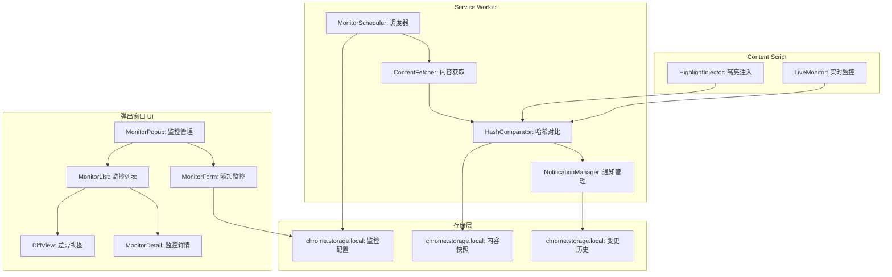
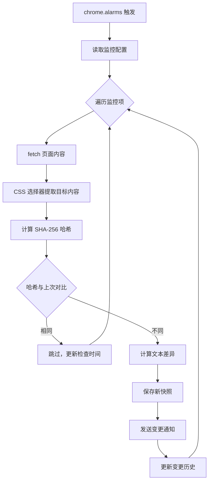

# YP-09-147: 网页监控与变更通知 — CSS 选择器监控页面变更、可视化差异高亮、变更通知

> 需求编号：YP-09-147 · 优先级：P2 · 人天：0.3d · 状态：需求已编写
> 依赖：YP-09-95（消息通知系统）

## 背景

### 问题陈述

用户需要跟踪网页内容变化，但缺乏自动化工具：抢购商品需要监控价格变化、求职者需要监控招聘页面更新、研究者需要监控政策页面修改、开发者需要监控文档更新。当前用户依赖手动刷新页面、定期检查，效率极低：

1. **手动检查低效**：需要记住并定期访问目标页面，人工对比内容变化
2. **变更不可见**：页面更新后，用户不知道具体改了什么（仅凭记忆对比）
3. **通知缺失**：页面变更时无法及时获知，可能错过重要更新
4. **监控粒度粗糙**：只能监控整个页面，无法指定关注的特定区域（如价格、标题）
5. **多项监控管理困难**：同时监控多个页面时，缺乏统一管理界面

**核心矛盾**：用户需要及时获知页面变更，但当前没有自动化监控机制，完全依赖手动检查和记忆。

### 影响范围

| # | 影响 | 严重程度 | 典型场景 |
|---|------|----------|----------|
| 1 | 错过重要更新 | 高 | 商品降价、招聘信息更新未能及时发现 |
| 2 | 手动检查效率低 | 高 | 每天手动刷新 5+ 个页面检查更新 |
| 3 | 变更内容不可见 | 中 | 页面更新后不知道具体改了什么 |
| 4 | 监控管理混乱 | 中 | 同时监控多个页面，易遗漏 |
| 5 | 无历史对比 | 低 | 无法查看页面变更历史 |

### 挑战

| 挑战 | 说明 |
|------|------|
| 页面动态加载 | 许多页面使用 JS 动态渲染内容，初始 HTML 不包含完整内容 |
| 反爬虫机制 | 部分网站检测并阻止自动化访问 |
| 内容哈希精确性 | 如何区分"有意义的内容变化"和"无关紧要的变化"（如广告、时间戳） |
| Service Worker 检查频率 | MV3 限制 Service Worker 生命周期，定时检查需合理设计 |
| CORS 限制 | 跨域页面内容获取受限 |

---

## 一、现状分析

### 1.1 当前网页监控现状

```
现有监控功能:
├── 无自动化监控机制
├── 无页面变更检测
├── 无差异高亮
├── 无监控列表管理
└── 无变更通知

用户当前做法:
├── 手动刷新页面
├── 肉眼对比内容
├── 浏览器书签记录目标页面
└── 心理记忆"之前是这个价格"
```

### 1.2 监控需求矩阵

| 监控类型 | 监控粒度 | 检测方式 | 通知方式 | 适用场景 |
|----------|----------|----------|----------|----------|
| 整页监控 | 整个页面 | 内容哈希 | 通知 | 政策页面、公告页面 |
| 元素监控 | CSS 选择器 | 内容哈希 | 通知 | 价格、标题、状态 |
| 文本监控 | 特定文本 | 字符串匹配 | 通知 | 关键词出现/消失 |
| 数字监控 | CSS 选择器 | 数值变化 | 通知 | 价格、库存、数量 |

### 1.3 根因矩阵

| 症状 | 根因 | 触发条件 | 频率 |
|------|------|----------|------|
| 无法及时获知变更 | 无自动化监控 | 页面更新时 | 高 |
| 错过重要信息 | 无通知机制 | 商品降价/招聘更新 | 高 |
| 变更内容不明确 | 无差异对比 | 页面内容变化 | 中 |
| 监控管理混乱 | 无统一管理界面 | 多项监控并存 | 中 |
| 监控频率难以把握 | 无智能调度 | 高频检查浪费资源 | 中 |

---

## 二、设计决策

### 决策 1：监控执行方式 — Service Worker 定时 vs Content Script 注入 vs chrome.alarms API

| 选项 | 持久性 | 跨域能力 | 资源消耗 |
|------|--------|----------|----------|
| Service Worker 定时 + fetch | 中（SW 可能被终止） | 部分受限 | 低 |
| Content Script 注入 | 高（页面打开时） | 无（同域） | 低 |
| chrome.alarms API | 高（系统级调度） | 依赖 SW | 极低 |

**选择：chrome.alarms API + Service Worker。** `chrome.alarms` 是 Chrome 原生定时器 API，即使 Service Worker 被终止也能在预定时间唤醒。SW 中使用 `fetch` 获取页面内容，计算哈希对比。对于需要 JS 渲染的页面，降级为 Content Script 注入模式（仅当用户访问该页面时检测）。

### 决策 2：内容变更检测 — 内容哈希 vs DOM 树对比 vs 截图对比

| 选项 | 精确度 | 性能 | 抗噪能力 |
|------|--------|------|----------|
| 内容哈希（SHA-256） | 高（逐字节） | 极快 | 低（时间戳变化也触发） |
| DOM 树对比 | 中 | 中 | 中（可忽略 class/id 变化） |
| 截图对比 | 中 | 慢 | 中 |

**选择：内容哈希 + CSS 选择器过滤。** 使用 SHA-256 计算目标元素（通过 CSS 选择器指定）的 `textContent` 哈希。相比整页哈希，选择器过滤可排除广告、时间戳等无关内容。提供"忽略模式"（正则表达式）进一步排除动态内容。

### 决策 3：检查频率策略 — 固定间隔 vs 智能自适应 vs 手动触发

| 选项 | 及时性 | 资源消耗 | 适用场景 |
|------|--------|----------|----------|
| 固定间隔（5m/15m/1h/6h/24h） | 取决于间隔 | 取决于间隔 | 所有场景 |
| 智能自适应 | 高 | 低 | 动态页面 |
| 仅手动触发 | 低 | 极低 | 低频页面 |

**选择：固定间隔（用户可选）。** 提供 5 个预设间隔：5 分钟、15 分钟、1 小时、6 小时、24 小时。用户根据页面的更新频率选择合适的间隔。5 分钟间隔限制最多 3 个监控项（避免资源滥用）。同时支持手动触发检查。

### 决策 4：差异可视化 — 并列对比 vs 内联高亮 vs 统一 diff 视图

| 选项 | 直观性 | 实现复杂度 | 空间利用 |
|------|--------|-----------|----------|
| 并列对比（左右分栏） | 高 | 中 | 低（需大空间） |
| 内联高亮（在原页面标注） | 高 | 高 | 高 |
| 统一 diff 视图（+/- 行） | 高 | 低 | 中 |

**选择：统一 diff 视图 + 内联高亮。** 在弹出窗口中显示统一 diff 视图（类似 git diff），新增内容绿色背景、删除内容红色背景、不变内容无标记。在原始页面上，通过 Content Script 注入高亮标注变更区域。

### 设计决策记录

| 决策 | 选项 A | 选项 B | 选项 C | 选择 | 理由 |
|------|--------|--------|--------|------|------|
| 执行方式 | SW 定时 | CS 注入 | chrome.alarms | **chrome.alarms + SW** | 系统级调度 |
| 变更检测 | 内容哈希 | DOM 对比 | 截图对比 | **内容哈希 + 选择器** | 快速 + 精确 |
| 检查频率 | 固定间隔 | 智能自适应 | 手动触发 | **固定间隔可选** | 用户可控 |
| 差异可视化 | 并列对比 | 内联高亮 | 统一 diff | **diff + 内联高亮** | 直观 + 空间友好 |

---

## 三、目标架构

### 3.1 网页监控系统架构



### 3.2 监控检查流程



### 3.3 性能指标

| 指标 | 目标值 | 说明 |
|------|--------|------|
| 单次检查耗时 | < 3s | fetch + 哈希计算 + 对比 |
| 哈希计算延迟 | < 50ms | 单页 SHA-256 |
| 差异计算延迟 | < 100ms | 文本 diff 算法 |
| 通知送达延迟 | < 500ms | 从检测到通知弹出 |
| 监控列表加载 | < 50ms | chrome.storage.local 读取 |
| chrome.alarms 精度 | ~1min | 实际触发时间可能有偏差 |

---

## 四、具体改动

### 4.1 监控类型定义

```typescript
// src/monitor/types.ts (新增)

export type CheckInterval = 5 | 15 | 60 | 360 | 1440; // 分钟

export interface MonitorConfig {
  id: string;
  url: string;
  /** 监控名称 */
  name: string;
  /** CSS 选择器（可选，不填则监控整页） */
  selector?: string;
  /** 忽略模式（正则表达式，匹配的内容不计入哈希） */
  ignorePatterns?: string[];
  /** 检查间隔（分钟） */
  checkInterval: CheckInterval;
  /** 是否启用 */
  enabled: boolean;
  /** 创建时间 */
  createdAt: number;
  /** 上次检查时间 */
  lastCheckedAt?: number;
  /** 上次检查哈希 */
  lastHash?: string;
  /** 通知方式 */
  notifyOnChange: boolean;
  /** 标签 */
  tags?: string[];
}

export interface ContentSnapshot {
  id: string;
  monitorId: string;
  url: string;
  content: string;
  hash: string;
  selector?: string;
  capturedAt: number;
  contentLength: number;
}

export interface ChangeRecord {
  id: string;
  monitorId: string;
  detectedAt: number;
  previousHash: string;
  currentHash: string;
  diff: TextDiff;
  snapshotId: string;
  viewed: boolean;
}

export interface TextDiff {
  type: 'added' | 'removed' | 'unchanged';
  value: string;
}[]
```

### 4.2 监控调度器

```typescript
// src/sw/MonitorScheduler.ts (新增)

import type { MonitorConfig, ContentSnapshot, ChangeRecord } from '../monitor/types';

const ALARM_PREFIX = 'yipet-monitor-';
const STORAGE_KEY_MONITORS = 'yipet_monitor_configs';
const STORAGE_KEY_SNAPSHOTS = 'yipet_monitor_snapshots';
const STORAGE_KEY_CHANGES = 'yipet_monitor_changes';

export class MonitorScheduler {
  private monitors: MonitorConfig[] = [];

  /** 初始化调度器 */
  async initialize(): Promise<void> {
    await this.loadMonitors();
    this.setupAlarms();
    chrome.alarms.onAlarm.addListener(this.handleAlarm.bind(this));
  }

  /** 加载监控配置 */
  private async loadMonitors(): Promise<void> {
    const result = await chrome.storage.local.get(STORAGE_KEY_MONITORS);
    this.monitors = result[STORAGE_KEY_MONITORS] || [];
  }

  /** 保存监控配置 */
  async saveMonitors(): Promise<void> {
    await chrome.storage.local.set({ [STORAGE_KEY_MONITORS]: this.monitors });
    this.setupAlarms();
  }

  /** 添加监控项 */
  async addMonitor(config: MonitorConfig): Promise<void> {
    this.monitors.push(config);
    await this.saveMonitors();
    // 立即执行首次检查
    await this.checkMonitor(config.id);
  }

  /** 移除监控项 */
  async removeMonitor(id: string): Promise<void> {
    this.monitors = this.monitors.filter(m => m.id !== id);
    await this.saveMonitors();
  }

  /** 设置 chrome.alarms */
  private setupAlarms(): void {
    // 清除所有旧 alarms
    chrome.alarms.clearAll();

    // 为每个监控项创建 alarm
    const activeMonitors = this.monitors.filter(m => m.enabled);
    for (const monitor of activeMonitors) {
      chrome.alarms.create(`${ALARM_PREFIX}${monitor.id}`, {
        periodInMinutes: monitor.checkInterval,
        delayInMinutes: 1, // 首次延迟 1 分钟
      });
    }
  }

  /** 处理 alarm 触发 */
  private async handleAlarm(alarm: chrome.alarms.Alarm): Promise<void> {
    if (!alarm.name.startsWith(ALARM_PREFIX)) return;

    const monitorId = alarm.name.replace(ALARM_PREFIX, '');
    await this.checkMonitor(monitorId);
  }

  /** 检查单个监控项 */
  async checkMonitor(monitorId: string): Promise<void> {
    const monitor = this.monitors.find(m => m.id === monitorId);
    if (!monitor) return;

    try {
      // 获取页面内容
      const content = await this.fetchContent(monitor.url, monitor.selector);
      const hash = await this.computeHash(content);

      // 对比哈希
      if (monitor.lastHash && monitor.lastHash !== hash) {
        // 内容已变更
        const previousContent = await this.getLastSnapshot(monitorId);
        const diff = this.computeDiff(previousContent, content);

        await this.recordChange(monitor, hash, diff);
        await this.sendNotification(monitor, diff);
      }

      // 更新监控状态
      monitor.lastHash = hash;
      monitor.lastCheckedAt = Date.now();
      await this.saveSnapshots(monitorId, content, hash);
      await this.saveMonitors();

    } catch (error) {
      console.error(`[Monitor] 检查失败 ${monitor.name}:`, error);
    }
  }

  /** 获取页面内容 */
  private async fetchContent(url: string, selector?: string): Promise<string> {
    const response = await fetch(url);
    const html = await response.text();

    if (!selector) {
      // 整页：提取纯文本
      return this.extractText(html);
    }

    // 使用 DOMParser 解析 HTML 并提取选择器内容
    const parser = new DOMParser();
    const doc = parser.parseFromString(html, 'text/html');
    const element = doc.querySelector(selector);
    return element?.textContent?.trim() || '';
  }

  /** 提取纯文本（去除 HTML 标签） */
  private extractText(html: string): string {
    return html.replace(/<script[^>]*>[\s\S]*?<\/script>/gi, '')
      .replace(/<style[^>]*>[\s\S]*?<\/style>/gi, '')
      .replace(/<[^>]+>/g, ' ')
      .replace(/\s+/g, ' ')
      .trim();
  }

  /** 计算 SHA-256 哈希 */
  private async computeHash(content: string): Promise<string> {
    const encoder = new TextEncoder();
    const data = encoder.encode(content);
    const hashBuffer = await crypto.subtle.digest('SHA-256', data);
    const hashArray = Array.from(new Uint8Array(hashBuffer));
    return hashArray.map(b => b.toString(16).padStart(2, '0')).join('');
  }

  /** 计算文本差异 */
  private computeDiff(oldText: string, newText: string): TextDiff[] {
    const oldLines = oldText.split('\n');
    const newLines = newText.split('\n');
    const diffs: TextDiff[] = [];

    const maxLen = Math.max(oldLines.length, newLines.length);
    for (let i = 0; i < maxLen; i++) {
      if (i >= oldLines.length) {
        diffs.push({ type: 'added', value: newLines[i] });
      } else if (i >= newLines.length) {
        diffs.push({ type: 'removed', value: oldLines[i] });
      } else if (oldLines[i] !== newLines[i]) {
        diffs.push({ type: 'removed', value: oldLines[i] });
        diffs.push({ type: 'added', value: newLines[i] });
      } else {
        diffs.push({ type: 'unchanged', value: oldLines[i] });
      }
    }

    return diffs;
  }

  /** 发送变更通知 */
  private async sendNotification(monitor: MonitorConfig, diff: TextDiff[]): Promise<void> {
    const addedLines = diff.filter(d => d.type === 'added').length;
    const removedLines = diff.filter(d => d.type === 'removed').length;

    chrome.notifications.create({
      type: 'basic',
      iconUrl: '/icons/icon48.png',
      title: `页面变更: ${monitor.name}`,
      message: `${addedLines} 行新增, ${removedLines} 行删除`,
      priority: 1,
    });
  }

  /** 获取上次快照 */
  private async getLastSnapshot(monitorId: string): Promise<string> {
    const result = await chrome.storage.local.get(STORAGE_KEY_SNAPSHOTS);
    const snapshots = result[STORAGE_KEY_SNAPSHOTS] || {};
    return snapshots[monitorId]?.content || '';
  }

  /** 保存快照 */
  private async saveSnapshots(monitorId: string, content: string, hash: string): Promise<void> {
    const result = await chrome.storage.local.get(STORAGE_KEY_SNAPSHOTS);
    const snapshots = result[STORAGE_KEY_SNAPSHOTS] || {};
    snapshots[monitorId] = { content, hash, capturedAt: Date.now() };
    await chrome.storage.local.set({ [STORAGE_KEY_SNAPSHOTS]: snapshots });
  }

  /** 记录变更 */
  private async recordChange(monitor: MonitorConfig, hash: string, diff: TextDiff[]): Promise<void> {
    const result = await chrome.storage.local.get(STORAGE_KEY_CHANGES);
    const changes: ChangeRecord[] = result[STORAGE_KEY_CHANGES] || [];

    changes.unshift({
      id: `change-${Date.now()}`,
      monitorId: monitor.id,
      detectedAt: Date.now(),
      previousHash: monitor.lastHash || '',
      currentHash: hash,
      diff,
      snapshotId: monitor.id,
      viewed: false,
    });

    // 限制最多 100 条变更记录
    if (changes.length > 100) {
      changes.length = 100;
    }

    await chrome.storage.local.set({ [STORAGE_KEY_CHANGES]: changes });
  }
}
```

### 4.3 差异高亮注入器（Content Script）

```typescript
// src/content/HighlightInjector.ts (新增)

import type { MonitorConfig } from '../monitor/types';

export class HighlightInjector {
  /** 在页面上高亮变更区域 */
  highlightChanges(monitor: MonitorConfig, addedText: string[], removedText: string[]): void {
    if (!monitor.selector) return;

    const element = document.querySelector(monitor.selector);
    if (!element) return;

    // 高亮新增内容
    this.highlightText(element, addedText, 'yipet-highlight-added', '#d4edda');

    // 高亮删除内容（通过插入标记）
    this.highlightText(element, removedText, 'yipet-highlight-removed', '#f8d7da');
  }

  private highlightText(element: Element, texts: string[], className: string, bgColor: string): void {
    // 遍历文本节点，高亮匹配文本
    const walker = document.createTreeWalker(element, NodeFilter.SHOW_TEXT);
    const textNodes: Text[] = [];
    while (walker.nextNode()) {
      textNodes.push(walker.currentNode as Text);
    }

    for (const node of textNodes) {
      for (const text of texts) {
        if (text.length < 3) continue; // 忽略太短的文本
        const index = node.textContent?.indexOf(text);
        if (index !== undefined && index >= 0) {
          const span = document.createElement('span');
          span.className = className;
          span.style.cssText = `
            background-color: ${bgColor};
            padding: 1px 2px;
            border-radius: 2px;
          `;
          span.textContent = text;
          node.parentNode?.replaceChild(span, node);
          break;
        }
      }
    }
  }

  /** 注入差异查看面板 */
  injectDiffPanel(diff: { added: string[]; removed: string[] }): void {
    // 检查是否已存在面板
    if (document.getElementById('yipet-diff-panel')) return;

    const panel = document.createElement('div');
    panel.id = 'yipet-diff-panel';
    panel.style.cssText = `
      position: fixed;
      top: 10px;
      right: 10px;
      width: 350px;
      max-height: 400px;
      background: white;
      border: 1px solid #ddd;
      border-radius: 8px;
      box-shadow: 0 4px 12px rgba(0,0,0,0.15);
      z-index: 99999;
      overflow: hidden;
      font-size: 13px;
    `;

    panel.innerHTML = `
      <div style="padding: 10px; background: #f0f0f0; border-bottom: 1px solid #ddd; display: flex; justify-content: space-between;">
        <strong>YiPet 页面变更</strong>
        <button id="yipet-diff-close" style="border: none; background: none; cursor: pointer;">&times;</button>
      </div>
      <div style="padding: 10px; max-height: 340px; overflow-y: auto;">
        ${diff.removed.length > 0 ? `<div style="margin-bottom: 8px;"><strong>删除 (${diff.removed.length}):</strong></div>
          ${diff.removed.map(t => `<div style="background: #f8d7da; padding: 2px 4px; margin: 2px 0; border-radius: 2px;">${this.escapeHtml(t)}</div>`).join('')}` : ''}
        ${diff.added.length > 0 ? `<div style="margin-bottom: 8px;"><strong>新增 (${diff.added.length}):</strong></div>
          ${diff.added.map(t => `<div style="background: #d4edda; padding: 2px 4px; margin: 2px 0; border-radius: 2px;">${this.escapeHtml(t)}</div>`).join('')}` : ''}
      </div>
    `;

    document.body.appendChild(panel);
    document.getElementById('yipet-diff-close')?.addEventListener('click', () => panel.remove());
  }

  private escapeHtml(text: string): string {
    const div = document.createElement('div');
    div.textContent = text;
    return div.innerHTML;
  }
}
```

### 4.4 文件变更清单

| 文件 | 操作 | 说明 |
|------|------|------|
| `src/monitor/types.ts` | 新增 | 监控类型定义 |
| `src/sw/MonitorScheduler.ts` | 新增 | SW 监控调度器 |
| `src/content/HighlightInjector.ts` | 新增 | CS 差异高亮注入器 |
| `src/popup/components/MonitorPopup.vue` | 新增 | 监控管理弹出窗口 |
| `src/popup/components/MonitorList.vue` | 新增 | 监控列表组件 |
| `src/popup/components/MonitorForm.vue` | 新增 | 添加监控表单 |
| `src/popup/components/DiffView.vue` | 新增 | 差异视图组件 |
| `src/sw/index.ts` | 修改 | 注册 MonitorScheduler |
| `manifest.json` | 修改 | 声明 alarms, notifications 权限 |
| `src/popup/App.vue` | 修改 | 添加监控入口 |

---

## 五、实施步骤

| 步骤 | 操作 | 路径 | 验证 | 人天 |
|------|------|------|------|------|
| 1 | 定义监控类型 | `src/monitor/types.ts` | 类型检查通过 | 0.01 |
| 2 | 实现监控调度器 | `src/sw/MonitorScheduler.ts` | chrome.alarms 正常触发 | 0.08 |
| 3 | 实现内容获取和哈希 | `src/sw/MonitorScheduler.ts` | fetch + SHA-256 正确 | 0.03 |
| 4 | 实现差异计算 | `src/sw/MonitorScheduler.ts` | 文本 diff 正确 | 0.03 |
| 5 | 实现差异高亮注入 | `src/content/HighlightInjector.ts` | 页面上高亮变更 | 0.04 |
| 6 | 实现监控管理 UI | `src/popup/components/Monitor*.vue` | 添加/删除/查看监控 | 0.05 |
| 7 | 实现差异视图 | `src/popup/components/DiffView.vue` | 统一 diff 视图 | 0.03 |
| 8 | 集成通知和权限 | `src/sw/index.ts` + `manifest.json` | 变更通知弹出 | 0.02 |
| 9 | 编写测试 | `tests/unit/monitor/` | 覆盖哈希/diff/调度 | 0.01 |

**总人天：0.3d**

---

## 六、测试规格

### 场景 1：添加监控项

**GIVEN** 用户打开监控管理页面
**WHEN** 用户输入 URL "https://example.com/jobs"、选择器 ".job-list"、间隔 1 小时
**THEN** 监控项添加到列表
**AND** 立即执行首次检查
**AND** chrome.alarms 创建对应定时任务

### 场景 2：检测到页面变更

**GIVEN** 监控项已配置，上次快照哈希为 "abc123"
**WHEN** 定时检查触发，当前页面内容哈希为 "def456"
**THEN** 计算文本差异（新增/删除行）
**AND** 保存新快照
**AND** 发送通知"页面变更: {监控名称}"
**AND** 变更记录保存到历史

### 场景 3：未检测到变更

**GIVEN** 监控项已配置，上次快照哈希为 "abc123"
**WHEN** 定时检查触发，当前页面内容哈希仍为 "abc123"
**THEN** 不发送通知
**AND** 更新 lastCheckedAt 时间
**AND** 不创建变更记录

### 场景 4：CSS 选择器监控

**GIVEN** 监控项配置选择器 ".price-value"
**WHEN** 定时检查触发
**THEN** 仅提取 `.price-value` 元素的文本内容
**AND** 对该内容计算哈希
**AND** 页面其他部分变化不触发变更

### 场景 5：差异视图

**GIVEN** 监控项有 2 次变更记录
**WHEN** 用户点击监控项查看变更详情
**THEN** 显示统一 diff 视图
**AND** 新增行绿色背景
**AND** 删除行红色背景
**AND** 不变行无高亮

### 场景 6：页面内差异高亮

**GIVEN** 用户访问被监控的页面，且上次检测到变更
**WHEN** Content Script 注入差异高亮
**THEN** 页面右上角显示差异面板
**AND** 变更内容在原页面上高亮标注
**AND** 用户可关闭面板

---

## 七、风险与缓解

| 风险 | 概率 | 影响 | 缓解措施 |
|------|------|------|----------|
| fetch 跨域限制 | 中 | 高 | 提示用户手动访问页面触发 CS 检测 |
| 动态渲染页面无法获取内容 | 高 | 中 | 降级为 CS 注入模式（用户访问时检测） |
| chrome.alarms 精度不足 | 低 | 中 | 频繁检查场景（5 分钟）使用 CS 定时器补充 |
| 反爬虫拦截 | 中 | 中 | 使用正常 User-Agent，降低检查频率 |
| 内存占用增长 | 低 | 低 | 限制快照数量 50 个，变更记录 100 条 |

---

## 八、回滚策略

| 场景 | 回滚操作 | 影响 |
|------|----------|------|
| 监控调度器异常 | 清除所有 chrome.alarms，停止监控 | 失去自动监控 |
| 差异高亮影响页面渲染 | 移除 HighlightInjector 注入 | 页面正常显示 |
| 通知过于频繁 | 限制通知频率（每小时最多 1 条/监控项） | 通知减少 |
| 完全回滚 | 移除监控相关代码和权限 | 功能回到改造前 |

---

## 九、设计决策记录

### D-01：检查频率限制

- **问题**：是否限制高频检查
- **选项**：不限制、限制 5 分钟间隔最多 3 项、限制所有间隔
- **选择**：限制 5 分钟间隔最多 3 项
- **理由**：5 分钟间隔的 fetch 请求频率较高，限制 3 项避免资源滥用。15 分钟及以上间隔不限制。

### D-02：忽略模式设计

- **问题**：如何处理页面中的动态内容（时间戳、广告、随机内容）
- **选项**：不处理、自动检测、用户配置正则
- **选择**：用户配置正则表达式
- **理由**：自动检测不可靠，不同页面动态内容位置不同。用户可配置正则忽略模式（如 `/\d{4}-\d{2}-\d{2}/` 忽略日期）。

### D-03：内容快照存储

- **问题**：快照存储到 chrome.storage.local 还是 IndexedDB
- **选项**：chrome.storage.local、IndexedDB
- **选择**：chrome.storage.local
- **理由**：每个快照仅存储文本内容（通常 < 100KB），总共 50 个快照 < 5MB，在 chrome.storage.local 的 10MB 限制内。

### D-04：SW 内容获取 vs CS 内容获取

- **问题**：由 Service Worker 还是 Content Script 获取页面内容
- **选项**：SW fetch、CS 读取 DOM、两者结合
- **选择**：两者结合（SW fetch 为主，CS 为补充）
- **理由**：SW fetch 可定时自动执行，但无法获取 JS 渲染后的内容。CS 可读取渲染后的 DOM，但需要用户访问页面。SW 作为主要方式，CS 在用户访问页面时补充检测。

---

## 十、可观测性

### 指标

| 指标 | 类型 | 说明 |
|------|------|------|
| `yipet.monitor.active_count` | Gauge | 活跃监控项数量 |
| `yipet.monitor.check_total` | Counter | 检查总次数 |
| `yipet.monitor.check_duration_ms` | Histogram | 单次检查耗时 |
| `yipet.monitor.change_detected_total` | Counter | 变更检测次数 |
| `yipet.monitor.fetch_error_total` | Counter | fetch 失败次数 |
| `yipet.monitor.alarm_missed_total` | Counter | alarm 触发但 SW 未就绪次数 |

### 告警

| 告警 | 条件 | 级别 |
|------|------|------|
| 监控项连续失败 | 同一监控项连续 3 次检查失败 | WARNING |
| 通知过于频繁 | 1 小时内变更通知 > 10 条 | WARNING |
| 快照存储接近上限 | 总快照大小 > 8MB | INFO |

---

## 十一、代码审查检查清单

- [ ] chrome.alarms 权限在 manifest.json 中声明
- [ ] notifications 权限在 manifest.json 中声明
- [ ] 内容哈希使用 SHA-256（crypto.subtle.digest）
- [ ] CSS 选择器支持标准选择器语法
- [ ] 忽略模式正则表达式正确过滤动态内容
- [ ] 定时检查正确处理 fetch 错误（网络超时、404）
- [ ] 差异计算正确区分新增/删除/不变
- [ ] 变更通知不频繁发送（每小时最多 1 条/监控项）
- [ ] 监控配置持久化到 chrome.storage.local
- [ ] 快照数量限制 50 个
- [ ] 变更记录限制 100 条
- [ ] 差异高亮面板不影响页面正常操作

---

## 回归问题预测

| # | 预测问题 | 原因 | 验证方法 |
|---|---------|------|---------|
| 1 | chrome.alarms 在 Service Worker 被终止后，alarm 触发但 SW 重启需要时间，检查可能延迟 5-30 秒 | MV3 中 SW 在空闲 30 秒后被终止，alarm 触发时需重新启动 SW | 在 alarm 处理中增加启动时间日志，监控实际检查延迟 |
| 2 | 页面使用 `Content-Type: text/plain` 或返回非 HTML 内容时，DOMParser 解析失败，`querySelector` 返回 null | 非 HTML 页面（如 API 响应、纯文本文件）中 `querySelector` 无意义 | 检查 `Content-Type` 响应头，仅对 HTML 页面使用选择器提取 |
| 3 | 用户监控竞争对手网站时，被反爬虫机制检测到频繁请求，IP 被暂时封禁 | 短时间内高频请求同一域名触发反爬虫 | 限制同一域名下最多 2 个监控项，最小间隔 15 分钟 |
| 4 | 差异高亮面板在页面上注入后，与页面原有的 CSS 样式冲突，面板布局错乱 | 面板 CSS 未使用 Shadow DOM 隔离，受页面全局样式影响 | 使用 Shadow DOM 或 iframe 隔离面板样式 |
| 5 | 文本内容过长（> 1MB）时，SHA-256 哈希计算和差异计算阻塞主线程 | crypto.subtle.digest 是异步 API，但大量文本的内容提取和差异计算是同步的 | 对内容长度做限制（最大 500KB），超出时截断并提示用户 |
| 6 | 监控项 URL 包含 hash fragment（如 `#section-1`），fetch 获取到的是完整页面而非 fragment 内容，导致监控范围不准确 | fetch 请求忽略 URL hash fragment | 在 URL 解析时去除 hash fragment，提示用户使用选择器精确指定监控范围 |

---

## 性能分析

### 各操作耗时

| 阶段 | 预估耗时 | 说明 |
|------|----------|------|
| 页面 fetch | 500-2000ms | 网络请求 |
| 文本提取 | < 50ms | DOMParser + textContent |
| SHA-256 哈希 | < 50ms | crypto.subtle.digest |
| 文本 diff | < 100ms | 行级对比 |
| 通知发送 | < 100ms | chrome.notifications.create |
| 差异高亮注入 | < 200ms | Content Script 注入 |

### 文件体积预估

| 文件 | 大小 | 说明 |
|------|------|------|
| `src/monitor/types.ts` | ~1.5KB | 类型定义 |
| `src/sw/MonitorScheduler.ts` | ~6KB | 调度器 + 内容获取 + 哈希 + diff |
| `src/content/HighlightInjector.ts` | ~3KB | 高亮注入器 |
| `src/popup/components/MonitorPopup.vue` | ~3KB | 监控管理 UI |
| `src/popup/components/MonitorList.vue` | ~2KB | 监控列表 |
| `src/popup/components/MonitorForm.vue` | ~2KB | 添加表单 |
| `src/popup/components/DiffView.vue` | ~2KB | 差异视图 |