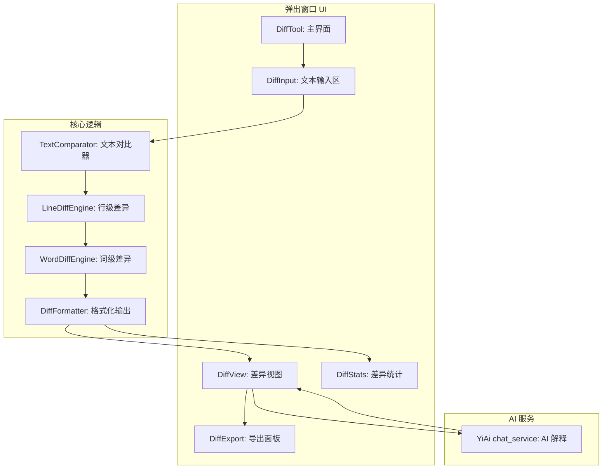
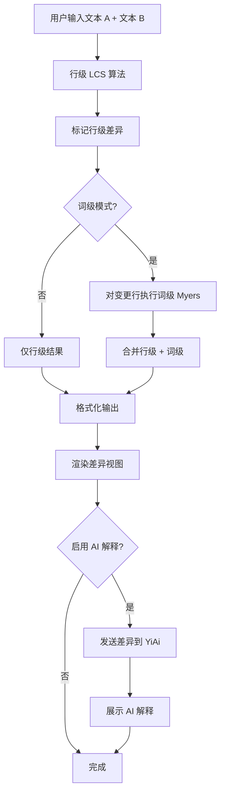

# YP-09-148: 文本差异对比 — 并排/统一视图、词级高亮、差异统计、AI 解释、Markdown 导出

> 需求编号：YP-09-148 · 优先级：P2 · 人天：0.2d · 状态：需求已编写
> 依赖：YP-09-110（Markdown 编辑器增强）

## 背景

### 问题陈述

YiPet 当前缺乏内置的文本差异对比工具。用户在以下场景中需要对比文本差异：对比代码片段、审查 AI 生成的修改、对比不同版本的聊天回复、调试 Prompt 调整效果。当前用户只能依赖外部工具（如 diffchecker.com、VS Code 的 diff 视图）或手动肉眼对比，效率极低：

1. **无内置工具**：需要切换到外部网站或编辑器进行对比，打断工作流
2. **手动对比困难**：长文本差异肉眼难以识别，容易遗漏细微变化
3. **无差异统计**：不知道新增/删除/修改了多少行，无法量化变更规模
4. **无 AI 辅助**：差异内容需要人工理解意图，缺少 AI 解释
5. **导出不方便**：对比结果无法保存为 Markdown 格式，无法分享给他人

**核心矛盾**：用户频繁需要对比文本差异，但 YiPet 没有内置工具，用户被迫切换到外部工具。

### 影响范围

| # | 影响 | 严重程度 | 典型场景 |
|---|------|----------|----------|
| 1 | 工作流中断 | 高 | 对比聊天回复时需切换到外部 diff 工具 |
| 2 | 差异遗漏 | 高 | 长文本中细微变化的识别依赖肉眼 |
| 3 | 量化困难 | 中 | 无法快速统计变更规模 |
| 4 | 导出缺失 | 中 | 对比结果无法保存为 Markdown |
| 5 | 理解成本高 | 中 | 无 AI 辅助解释差异意图 |

### 挑战

| 挑战 | 说明 |
|------|------|
| 差异算法选择 | 行级 vs 词级 vs 字符级差异，不同场景需要不同粒度 |
| 大文本性能 | 10KB+ 文本的差异计算性能，需避免阻塞主线程 |
| 视图切换 | 并排视图和统一视图的布局切换，不同屏幕尺寸适配 |
| AI 解释上下文 | 差异文本的 AI 解释需要足够的上下文，避免断章取义 |
| Markdown 导出 | 差异结果导出为 Markdown 格式，需保持高亮信息 |

---

## 一、现状分析

### 1.1 当前文本对比流程

```
用户需要对比两段文本
  │ 复制文本 A 和文本 B
  ▼
切换到外部工具
  │ 打开 diffchecker.com / VS Code / 终端 diff
  ▼
粘贴文本 A 和文本 B
  │ 查看差异结果
  ▼
如果需要 AI 解释
  │ 切换到聊天窗口
  ▼
粘贴差异内容
  │ 请 AI 解释差异
  ▼
如果需要分享
  │ 截图或复制结果
  总耗时：2-5 分钟
```

### 1.2 当前可用差异能力

| 能力 | 可用性 | 获取方式 | 自动化 |
|------|--------|----------|--------|
| 行级差异 | 外部工具 | diffchecker.com | 否 |
| 词级差异 | 外部工具 | VS Code | 否 |
| 并排视图 | 外部工具 | diffchecker.com | 否 |
| 统一视图 | 外部工具 | git diff | 否 |
| 差异统计 | 外部工具 | git diff --stat | 否 |
| AI 解释 | YiPet 聊天 | 手动粘贴 | 否 |
| Markdown 导出 | 无 | — | 否 |

### 1.3 根因矩阵

| 症状 | 根因 | 触发条件 | 频率 |
|------|------|----------|------|
| 工作流中断 | 无内置 diff 工具 | 需要对比文本时 | 高 |
| 差异遗漏 | 仅支持行级对比 | 词级变化在长行内 | 中 |
| 统计缺失 | 无数值化输出 | 需要量化变更时 | 中 |
| 分享困难 | 无导出功能 | 需要分享对比结果 | 中 |
| 理解困难 | 无 AI 解释 | 差异复杂且无上下文 | 中 |

---

## 二、设计决策

### 决策 1：差异算法 — 行级 vs 词级 vs 双模式

| 选项 | 精确度 | 性能 | 适用场景 |
|------|--------|------|----------|
| 仅行级（LCS） | 中 | 快 | 代码/结构化文本 |
| 仅词级（Myers） | 高 | 中 | 自然语言/短文 |
| 双模式（行级 + 词级） | 高 | 中 | 所有场景 |

**选择：双模式。** 默认显示行级差异（类似 git diff），用户可切换为词级高亮模式。词级高亮在行级差异的基础上，对同一行内的不同部分进行词级标注。行级 LCS 算法 O(n*m) 在 10KB 文本中 < 100ms。

### 决策 2：视图模式 — 仅并排 vs 仅统一 vs 可切换

| 选项 | 直观性 | 空间效率 | 移动端适配 |
|------|--------|----------|-----------|
| 仅并排视图 | 高 | 低（需两栏） | 差 |
| 仅统一视图 | 中 | 高 | 好 |
| 可切换（并排/统一） | 高 | 高 | 好 |

**选择：可切换（并排 + 统一）。** 默认并排视图（桌面端），小屏幕自动切换为统一视图。用户在工具栏中可手动切换。统一视图输出格式与 git diff 兼容。

### 决策 3：AI 解释 — 本地 LLM vs 云端 API vs 可选

| 选项 | 延迟 | 离线可用 | 质量 |
|------|------|----------|------|
| 本地 LLM（Ollama） | 中 | 是 | 中 |
| 云端 API | 快 | 否 | 高 |
| 可选（用户配置） | 取决于选择 | 取决于选择 | 取决于选择 |

**选择：通过 YiAi 后端调用。** 差异文本发送到 YiAi 的 chat_service，AI 解释变更内容（新增了什么、删除了什么、变更意图是什么）。用户可配置是否启用 AI 解释。

### 决策 4：Markdown 导出 — 纯文本 vs 带格式 Markdown vs 富文本

| 选项 | 可读性 | 可分享性 | 实现复杂度 |
|------|--------|----------|-----------|
| 纯文本 | 低 | 高 | 低 |
| 带格式 Markdown | 高 | 高 | 中 |
| 富文本 | 高 | 中 | 高 |

**选择：带格式 Markdown。** 导出包含差异统计摘要、统一 diff 视图（```diff 代码块）、AI 解释（如有）。可直接粘贴到 GitHub Issues、PR 评论或聊天中。

---

## 三、目标架构

### 3.1 文本差异对比系统架构



### 3.2 差异计算流程



### 3.3 性能指标

| 指标 | 目标值 | 说明 |
|------|--------|------|
| 10KB 文本对比 | < 200ms | 行级 LCS + 词级 Myers |
| 50KB 文本对比 | < 1s | 大文本使用 Web Worker |
| 视图切换延迟 | < 50ms | 不重新计算，仅切换渲染 |
| AI 解释延迟 | < 3s | 通过网络调用 YiAi |
| Markdown 导出 | < 100ms | 格式化 + 复制到剪贴板 |

---

## 四、具体改动

### 4.1 差异引擎实现

```typescript
// src/tools/diff/types.ts (新增)

export type DiffMode = 'line' | 'word';
export type DiffView = 'side-by-side' | 'unified';

export interface DiffLine {
  type: 'added' | 'removed' | 'unchanged';
  content: string;
  lineNumberA?: number;
  lineNumberB?: number;
  wordDiff?: WordDiff[]; // 词级差异（仅当 mode='word' 时）
}

export interface WordDiff {
  type: 'added' | 'removed' | 'unchanged';
  text: string;
}

export interface DiffResult {
  lines: DiffLine[];
  stats: DiffStats;
}

export interface DiffStats {
  addedLines: number;
  removedLines: number;
  unchangedLines: number;
  totalChanges: number;
  changeRatio: number; // 变更行数 / 总行数
}
```

### 4.2 行级 LCS 差异引擎

```typescript
// src/tools/diff/LineDiffEngine.ts (新增)

import type { DiffLine, DiffResult, DiffStats } from './types';

export class LineDiffEngine {
  /** 执行行级 LCS 差异计算 */
  compute(textA: string, textB: string): DiffResult {
    const linesA = textA.split('\n');
    const linesB = textB.split('\n');

    // LCS 算法
    const lcsMatrix = this.buildLCSMatrix(linesA, linesB);
    const diffLines = this.backtrack(lcsMatrix, linesA, linesB);

    const stats = this.computeStats(diffLines);
    return { lines: diffLines, stats };
  }

  private buildLCSMatrix(a: string[], b: string[]): number[][] {
    const m = a.length;
    const n = b.length;
    const dp: number[][] = Array.from({ length: m + 1 },
      () => Array(n + 1).fill(0));

    for (let i = 1; i <= m; i++) {
      for (let j = 1; j <= n; j++) {
        if (a[i - 1] === b[j - 1]) {
          dp[i][j] = dp[i - 1][j - 1] + 1;
        } else {
          dp[i][j] = Math.max(dp[i - 1][j], dp[i][j - 1]);
        }
      }
    }
    return dp;
  }

  private backtrack(dp: number[][], a: string[], b: string[]): DiffLine[] {
    const result: DiffLine[] = [];
    let i = a.length, j = b.length;
    let lineNumA = a.length, lineNumB = b.length;

    while (i > 0 || j > 0) {
      if (i > 0 && j > 0 && a[i - 1] === b[j - 1]) {
        result.unshift({ type: 'unchanged', content: a[i - 1],
          lineNumberA: lineNumA--, lineNumberB: lineNumB-- });
        i--; j--;
      } else if (j > 0 && (i === 0 || dp[i][j - 1] >= dp[i - 1][j])) {
        result.unshift({ type: 'added', content: b[j - 1],
          lineNumberB: lineNumB-- });
        j--;
      } else {
        result.unshift({ type: 'removed', content: a[i - 1],
          lineNumberA: lineNumA-- });
        i--;
      }
    }
    return result;
  }

  private computeStats(lines: DiffLine[]): DiffStats {
    const added = lines.filter(l => l.type === 'added').length;
    const removed = lines.filter(l => l.type === 'removed').length;
    const unchanged = lines.filter(l => l.type === 'unchanged').length;
    const total = lines.length;
    return {
      addedLines: added,
      removedLines: removed,
      unchangedLines: unchanged,
      totalChanges: added + removed,
      changeRatio: total > 0 ? (added + removed) / total : 0,
    };
  }
}
```

### 4.3 词级差异引擎

```typescript
// src/tools/diff/WordDiffEngine.ts (新增)

import type { WordDiff } from './types';

export class WordDiffEngine {
  /** 对变更行执行词级差异 */
  computeWordDiff(oldLine: string, newLine: string): WordDiff[] {
    const oldWords = this.tokenize(oldLine);
    const newWords = this.tokenize(newLine);

    return this.computeWordLevel(oldWords, newWords);
  }

  private tokenize(line: string): string[] {
    // 按空格 + 标点分词
    return line.split(/(\s+|[,.!?;:(){}[\]])/g).filter(w => w.length > 0);
  }

  private computeWordLevel(oldWords: string[], newWords: string[]): WordDiff[] {
    const result: WordDiff[] = [];
    let i = 0, j = 0;

    while (i < oldWords.length || j < newWords.length) {
      if (i < oldWords.length && j < newWords.length
          && oldWords[i] === newWords[j]) {
        result.push({ type: 'unchanged', text: oldWords[i] });
        i++; j++;
      } else if (j < newWords.length) {
        result.push({ type: 'added', text: newWords[j] });
        j++;
      } else if (i < oldWords.length) {
        result.push({ type: 'removed', text: oldWords[i] });
        i++;
      }
    }
    return result;
  }
}
```

### 4.4 文件变更清单

| 文件 | 操作 | 说明 |
|------|------|------|
| `src/tools/diff/types.ts` | 新增 | 差异类型定义 |
| `src/tools/diff/LineDiffEngine.ts` | 新增 | 行级 LCS 差异引擎 |
| `src/tools/diff/WordDiffEngine.ts` | 新增 | 词级 Myers 差异引擎 |
| `src/tools/diff/DiffFormatter.ts` | 新增 | 差异格式化和 Markdown 导出 |
| `src/popup/components/DiffTool.vue` | 新增 | 差异对比主界面 |
| `src/popup/components/DiffInput.vue` | 新增 | 文本输入区 |
| `src/popup/components/DiffView.vue` | 新增 | 差异视图渲染 |
| `src/popup/components/DiffStats.vue` | 新增 | 差异统计面板 |
| `src/popup/App.vue` | 修改 | 添加差异对比工具入口 |

---

## 五、实施步骤

| 步骤 | 操作 | 路径 | 验证 | 人天 |
|------|------|------|------|------|
| 1 | 定义差异类型 | `src/tools/diff/types.ts` | 类型检查通过 | 0.01 |
| 2 | 实现行级 LCS 引擎 | `src/tools/diff/LineDiffEngine.ts` | 与 git diff 输出一致 | 0.04 |
| 3 | 实现词级差异引擎 | `src/tools/diff/WordDiffEngine.ts` | 词级高亮正确 | 0.03 |
| 4 | 实现差异格式化 | `src/tools/diff/DiffFormatter.ts` | Markdown 导出正确 | 0.02 |
| 5 | 实现差异输入组件 | `DiffInput.vue` | 粘贴/键入文本流畅 | 0.03 |
| 6 | 实现差异视图组件 | `DiffView.vue` | 并排/统一切换正常 | 0.03 |
| 7 | 实现统计面板 | `DiffStats.vue` | 统计数据正确 | 0.01 |
| 8 | 集成 AI 解释 | `DiffTool.vue` | AI 解释展示正确 | 0.02 |
| 9 | 编写测试 | `tests/unit/diff/` | 覆盖 LCS/词级/导出 | 0.01 |

**总人天：0.2d**

---

## 六、测试规格

### 场景 1：行级差异对比

**GIVEN** 文本 A = "line1\nline2\nline3"，文本 B = "line1\nline2_modified\nline4"
**WHEN** 用户粘贴文本并点击对比
**THEN** 显示行级差异：line1 不变、line2/line2_modified 修改、line3 删除、line4 新增
**AND** 差异统计：1 行新增、1 行删除、1 行不变

### 场景 2：词级差异高亮

**GIVEN** 同一行内 "Hello world" 变为 "Hello beautiful world"
**WHEN** 用户切换到词级模式
**THEN** 该行显示 "Hello" 不变、"beautiful" 新增、"world" 不变
**AND** 新增词语以绿色高亮标注

### 场景 3：并排视图

**GIVEN** 差异结果有 10 行差异
**WHEN** 用户选择并排视图
**THEN** 左侧显示原文本、右侧显示新文本
**AND** 变更行用颜色高亮（红色删除、绿色新增）
**AND** 滚动同步（左右两侧同时滚动）

### 场景 4：统一视图

**GIVEN** 差异结果有 10 行差异
**WHEN** 用户切换到统一视图
**THEN** 显示类似 git diff 的统一视图
**AND** `+` 前缀行绿色背景、`-` 前缀行红色背景
**AND** 无前缀行不变

### 场景 5：AI 解释差异

**GIVEN** 差异结果已生成
**WHEN** 用户点击 "AI 解释"
**THEN** 发送差异内容到 YiAi chat_service
**AND** 返回变更摘要：新增了什么、删除了什么、变更意图
**AND** 解释展示在差异视图下方

### 场景 6：Markdown 导出

**GIVEN** 差异结果和 AI 解释已生成
**WHEN** 用户点击 "复制为 Markdown"
**THEN** 剪贴板包含：差异统计摘要 + ```diff 代码块 + AI 解释
**AND** Markdown 格式正确，可直接粘贴到 GitHub

---

## 七、风险与缓解

| 风险 | 概率 | 影响 | 缓解措施 |
|------|------|------|----------|
| 大文本卡顿 | 中 | 中 | 10KB 以上使用 Web Worker 异步计算 |
| 词级差异误判 | 低 | 低 | 提供行级降级模式，词级为可选增强 |
| AI 解释不准确 | 中 | 低 | 标注"AI 生成，仅供参考"，用户可手动修改 |
| 视图切换闪烁 | 低 | 低 | 使用 CSS transition + 保持 DOM 结构 |
| Markdown 导出格式错误 | 低 | 中 | 验证导出后 Markdown 可正确渲染 |

---

## 八、回滚策略

| 场景 | 回滚操作 | 影响 |
|------|----------|------|
| 差异引擎计算错误 | 降级为简单行级对比（逐行 ===） | 失去词级高亮 |
| Web Worker 不支持 | 回退到主线程计算 + 大小限制 | 大文本变慢 |
| AI 解释超时 | 隐藏 AI 解释按钮 | 失去 AI 功能 |
| 完全回滚 | 移除 diff 工具入口 | 功能回到改造前 |

---

## 九、设计决策记录

### D-01：为什么选择 LCS 而非 Myers 作为默认算法？

LCS（最长公共子序列）算法在行级对比中表现更好，因为行级对比通常涉及较少的元素（几十到几百行），LCS 的 O(n*m) 在这个规模下足够快。Myers 算法在行级差异中增加了不必要的复杂度。对于词级差异（每个词作为一个元素），Myers 算法更合适。

### D-02：为什么并排视图作为默认？

并排视图（side-by-side）是 diffchecker.com 和 VS Code 的默认视图，用户体验一致。对于大多数文本对比场景（代码、配置、文档），并排视图更直观。统一视图（unified）作为可选切换，适合小屏幕和移动端场景。

### D-03：为什么 AI 解释通过 YiAi 后端？

复用已有的 YiAi chat_service 和 SSE 流式基础设施，无需额外部署 AI 服务。差异文本通常较短（< 5KB），1 次 token 消耗在可接受范围内。用户可配置是否启用，节省 token 消耗。

### D-04：为什么 Markdown 导出使用 diff 代码块？

GitHub、GitLab、Gitee 等平台原生支持 ```diff 代码块渲染，绿色/红色高亮自动生效。导出为 Markdown 格式确保结果可直接粘贴到 PR 评论、Issue 或聊天中，无需额外处理。

---

## 十、可观测性

### 指标

| 指标 | 类型 | 说明 |
|------|------|------|
| `yipet.diff.use_count` | Counter | 差异对比使用次数 |
| `yipet.diff.mode_switch_count` | Counter | 视图模式切换次数 |
| `yipet.diff.word_mode_count` | Counter | 词级模式使用次数 |
| `yipet.diff.ai_explain_count` | Counter | AI 解释使用次数 |
| `yipet.diff.export_count` | Counter | Markdown 导出次数 |
| `yipet.diff.avg_text_size` | Histogram | 平均文本大小分布 |

### 告警

| 告警 | 条件 | 级别 |
|------|------|------|
| 差异计算超时 | 10KB 文本计算 > 500ms | WARNING |
| AI 解释失败率 | 失败率 > 20% | WARNING |
| Web Worker 不支持 | 浏览器不支持 Worker API | INFO |

---

## 十一、代码审查检查清单

- [ ] LCS 算法正确实现（与 git diff 对比验证）
- [ ] 词级差异正确标注添加/删除/不变
- [ ] 并排视图滚动同步（左右联动）
- [ ] 统一视图输出格式与 git diff 兼容
- [ ] Markdown 导出包含 diff 代码块
- [ ] AI 解释通过 RPC 信封调用 YiAi
- [ ] 大文本（> 10KB）使用 Web Worker 异步计算
- [ ] 文本输入支持粘贴和拖拽
- [ ] 差异统计面板数据实时更新
- [ ] 视图切换无闪烁

---

## 回归问题预测

| # | 预测问题 | 原因 | 验证方法 |
|---|---------|------|---------|
| 1 | 空文本对比（A 或 B 为空）时 LCS 算法返回数组越界 | 空文本没有行，`split('\n')` 返回 `['']` | 测试空文本 + 空文本、空文本 + 有文本、有文本 + 空文本 |
| 2 | 词级差异在中文文本中分词不准确，将整个句子当作一个词 | 默认按空格分词，中文无空格分词 | 测试中文文本，验证词级差异的粒度是否合理 |
| 3 | 并排视图中，删除行和新增行对齐错位，导致对比困难 | LCS 算法的回溯结果中，删除行和新增行的对齐依赖上下文 | 对比复杂变更（多行插入/删除交错），验证对齐正确 |
| 4 | Markdown 导出的 diff 代码块中包含 ` ``` ` 导致渲染中断 | 原文本中包含三个反引号 | 对导出的 diff 内容进行转义或使用更多的反引号 |
| 5 | AI 解释在 SSE 流式返回时，差异视图的布局因追加内容而抖动 | SSE 流式追加内容导致 DOM 高度变化 | 固定 AI 解释区域高度，或使用 `overflow: auto` |
| 6 | 用户粘贴的文本包含 BOM 或特殊编码字符，导致行级对比误判为不同行 | BOM 头 `\uFEFF` 不可见但影响字符串比较 | 输入时自动去除 BOM 和统一换行符（`\r\n` → `\n`） |

---

## 性能分析

### 各操作耗时

| 阶段 | 预估耗时 | 说明 |
|------|----------|------|
| 行级 LCS（10KB） | 50-100ms | LCS O(n*m) 算法 |
| 词级 Myers（变更行） | 20-50ms | 仅对变更行执行 |
| 视图渲染 | 30-50ms | Vue 虚拟 DOM |
| 视图切换 | 10-20ms | 仅切换 CSS 类 |
| AI 解释 | 1-3s | YiAi SSE 流式 |
| Markdown 导出 | 10-20ms | 格式化字符串 |

### 文件体积预估

| 文件 | 大小 | 说明 |
|------|------|------|
| `src/tools/diff/types.ts` | ~1KB | 类型定义 |
| `src/tools/diff/LineDiffEngine.ts` | ~3KB | LCS 算法 |
| `src/tools/diff/WordDiffEngine.ts` | ~2KB | 词级差异 |
| `src/tools/diff/DiffFormatter.ts` | ~2KB | 格式化 + 导出 |
| `src/popup/components/DiffTool.vue` | ~3KB | 主界面 |
| `src/popup/components/DiffInput.vue` | ~2KB | 文本输入 |
| `src/popup/components/DiffView.vue` | ~4KB | 差异视图 |
| `src/popup/components/DiffStats.vue` | ~1KB | 统计面板 |