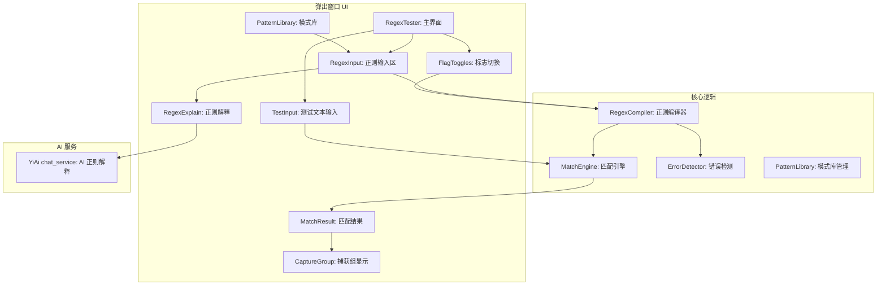
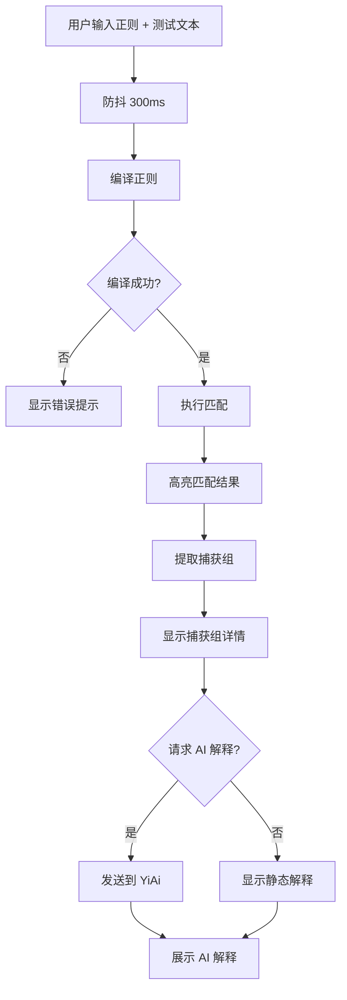

# YP-09-149: 正则表达式测试器 — 实时匹配、捕获组、AI 解释、常用模式库、错误检测、标志切换

> 需求编号：YP-09-149 · 优先级：P2 · 人天：0.2d · 状态：需求已编写
> 依赖：YP-09-110（Markdown 编辑器增强）

## 背景

### 问题陈述

正则表达式是开发者日常工具，但编写和调试正则表达式极其困难。YiPet 用户（开发者）经常需要在聊天中编写正则表达式，但缺乏实时测试和验证工具。当前用户依赖外部工具（regex101.com、regexr.com）或反复修改代码测试，效率极低：

1. **无内置工具**：需要切换到外部网站测试正则，打断工作流
2. **实时反馈缺失**：修改正则后无法立即看到匹配结果
3. **捕获组不直观**：不知道每个捕获组匹配了什么内容
4. **错误提示不友好**：JavaScript 的正则错误信息难以理解
5. **模式复用困难**：常用的正则模式（邮箱、URL、手机号）需要反复编写

**核心矛盾**：正则表达式调试高度依赖实时反馈，但 YiPet 没有内置测试工具，用户被迫切换到外部工具。

### 影响范围

| # | 影响 | 严重程度 | 典型场景 |
|---|------|----------|----------|
| 1 | 工作流中断 | 高 | 编写正则后需切换到 regex101 测试 |
| 2 | 调试效率低 | 高 | 修改正则 → 切换工具 → 重新测试 → 回到代码 |
| 3 | 捕获组不可见 | 中 | 复杂正则的捕获组结果难以理解 |
| 4 | 模式复用困难 | 中 | 常用正则模式反复编写 |
| 5 | 错误排查困难 | 中 | 正则语法错误提示不友好 |

### 挑战

| 挑战 | 说明 |
|------|------|
| 实时匹配性能 | 每次按键触发正则编译和匹配，大文本 + 复杂正则可能卡顿 |
| 正则引擎差异 | JavaScript 正则引擎（缺乏 lookbehind 等特性）与 Python/PCRE 不同 |
| 错误检测 | 需要捕获 SyntaxError 并给出友好提示，而非浏览器原生错误 |
| 捕获组显示 | 多层捕获组 + 命名捕获组的可视化展示 |
| 模式库管理 | 常用正则模式的存储、搜索、导入 |

---

## 一、现状分析

### 1.1 当前正则测试流程

```
用户需要测试正则表达式
  │ 在聊天中编写正则
  ▼
切换到外部工具
  │ 打开 regex101.com / regexr.com
  ▼
粘贴正则表达式
  │ 粘贴测试文本
  ▼
观察匹配结果
  │ 查看捕获组
  │ 阅读正则解释
  ▼
回到聊天窗口
  │ 复制正则到代码中
  总耗时：1-3 分钟
```

### 1.2 当前可用正则能力

| 能力 | 可用性 | 获取方式 | 自动化 |
|------|--------|----------|--------|
| 正则匹配 | 外部工具 | regex101.com | 否 |
| 捕获组显示 | 外部工具 | regex101.com | 否 |
| 正则解释 | 外部工具 | regex101.com | 否 |
| 错误检测 | 外部工具 | 浏览器控制台 | 否 |
| 标志切换 | 外部工具 | regex101.com | 否 |
| 模式库 | 外部工具 | 个人笔记 | 否 |

### 1.3 根因矩阵

| 症状 | 根因 | 触发条件 | 频率 |
|------|------|----------|------|
| 工作流中断 | 无内置正则测试工具 | 需要测试正则时 | 高 |
| 调试效率低 | 缺乏实时反馈 | 修改正则表达式时 | 高 |
| 捕获组不直观 | 缺乏可视化 | 复杂正则有多组捕获 | 中 |
| 模式复用困难 | 无模式库 | 编写常用正则时 | 中 |
| 错误排查困难 | 原生错误信息不友好 | 正则语法错误时 | 中 |

---

## 二、设计决策

### 决策 1：正则引擎 — JavaScript 原生 vs 模拟其他引擎

| 选项 | 兼容性 | 特性支持 | 实现复杂度 |
|------|--------|----------|-----------|
| JavaScript 原生 RegExp | 完全一致 | 不支持 lookbehind（ES2018 前） | 低 |
| 模拟 PCRE/Python | 不一致 | 全特性 | 极高 |
| 标注引擎差异 | 完全一致 | 显示差异警告 | 低 |

**选择：JavaScript 原生 RegExp + 差异警告。** 使用原生 `new RegExp()` 确保与运行时行为一致。对于不支持的特性（如 ES2018 前的 lookbehind），标注明确警告。

### 决策 2：实时匹配策略 — 每次按键 vs 防抖 vs 手动触发

| 选项 | 实时性 | 性能 | 用户体验 |
|------|--------|------|----------|
| 每次按键 | 最高 | 低（大文本卡顿） | 好 |
| 防抖（300ms） | 高 | 中 | 好 |
| 手动触发 | 低 | 高 | 差 |

**选择：防抖（300ms）。** 300ms 防抖平衡了实时性和性能。对于超大文本（> 50KB），自动切换为向导模式（手动触发）。正则语法错误时立即停止匹配（不等防抖）。

### 决策 3：AI 解释 — 本地 vs 远程 vs 静态规则

| 选项 | 准确度 | 延迟 | 维护成本 |
|------|--------|------|----------|
| 静态规则模板 | 中 | 极快 | 低 |
| 远程 AI（YiAi） | 高 | 中 | 低 |
| 本地 AI | 中 | 快 | 高 |

**选择：静态规则 + 远程 AI 可选。** 基础解释使用静态规则模板（如 `\d+` → "匹配一个或多个数字"），复杂正则使用 AI 解释。静态规则覆盖 80% 的常见模式，AI 解释覆盖剩余 20%。

### 决策 4：模式库存储 — localStorage vs IndexedDB vs chrome.storage

| 选项 | 容量 | 同步 | 访问速度 |
|------|------|------|----------|
| localStorage | 5-10MB | 否 | 快 |
| IndexedDB | 大 | 否 | 中 |
| chrome.storage | 10MB | 是（跨设备） | 快 |

**选择：chrome.storage.local。** 模式库数据量小（< 100KB），chrome.storage 支持跨设备同步（可选），访问速度快。

---

## 三、目标架构

### 3.1 正则测试器系统架构



### 3.2 正则测试流程



### 3.3 性能指标

| 指标 | 目标值 | 说明 |
|------|--------|------|
| 防抖后匹配延迟 | < 100ms | 编译 + 匹配 + 渲染 |
| 错误检测延迟 | < 10ms | 仅编译，不等防抖 |
| 捕获组提取 | < 20ms | 遍历匹配结果 |
| 模式库加载 | < 30ms | chrome.storage.local 读取 |
| AI 解释延迟 | < 3s | YiAi SSE 流式 |

---

## 四、具体改动

### 4.1 正则测试器类型定义

```typescript
// src/tools/regex/types.ts (新增)

export type RegexFlag = 'g' | 'i' | 'm' | 's' | 'u' | 'y';

export interface RegexPattern {
  id: string;
  name: string;
  pattern: string;
  flags: RegexFlag[];
  description: string;
  category: RegexCategory;
  createdAt: number;
}

export type RegexCategory = 'common' | 'validation' | 'parsing' | 'replace' | 'custom';

export interface MatchResult {
  index: number;
  match: string;
  length: number;
  groups: CaptureGroupResult[];
}

export interface CaptureGroupResult {
  name: string | null;
  index: number;
  value: string | undefined;
  startPosition: number;
}

export interface RegexCompileError {
  message: string;
  position: number;
  suggestion: string;
}
```

### 4.2 正则编译器

```typescript
// src/tools/regex/RegexCompiler.ts (新增)

import type { RegexFlag, RegexCompileError } from './types';

export class RegexCompiler {
  private static ERROR_PATTERNS: Array<{
    pattern: RegExp;
    message: string;
    suggestion: string;
  }> = [
    { pattern: /\\$/, message: '转义字符不完整',
      suggestion: '反斜杠 \\ 需要后跟一个可转义的字符（如 \\d, \\w, \\n）' },
    { pattern: /\(\)/, message: '空捕获组',
      suggestion: '空括号 () 不会匹配任何内容，考虑添加内容或使用 (?:) 非捕获组' },
    { pattern: /\[\]/, message: '空字符类',
      suggestion: '空方括号 [] 不会匹配任何字符，添加字符或删除' },
    { pattern: /\{\}/, message: '空量词',
      suggestion: '空花括号 {} 无效，指定最小和最大次数（如 {1,3}）' },
    { pattern: /\(\?<[^>]*>/, message: '使用了命名捕获组',
      suggestion: 'JavaScript 支持命名捕获组 (?<name>pattern)，但部分旧浏览器不支持' },
    { pattern: /\(\?<=/, message: '使用了后行断言 lookbehind',
      suggestion: 'ES2018+ 支持 lookbehind，Chrome 62+ 可用，但 Safari 16.4+ 才支持' },
  ];

  compile(pattern: string, flags: RegexFlag[]): RegExp {
    try {
      return new RegExp(pattern, flags.join(''));
    } catch (e) {
      const error = this.parseError(pattern, e as SyntaxError);
      throw error;
    }
  }

  parseError(pattern: string, error: SyntaxError): RegexCompileError {
    const message = error.message;
    // 提取错误位置
    const posMatch = message.match(/position (\d+)/);
    const position = posMatch ? parseInt(posMatch[1]) : 0;

    // 匹配已知错误模式
    for (const ep of RegexCompiler.ERROR_PATTERNS) {
      if (ep.pattern.test(pattern)) {
        return { message: ep.message, position, suggestion: ep.suggestion };
      }
    }

    return {
      message: message.replace('Invalid regular expression: ', ''),
      position,
      suggestion: '请检查正则语法，确保括号匹配、量词完整',
    };
  }
}
```

### 4.3 匹配引擎

```typescript
// src/tools/regex/MatchEngine.ts (新增)

import type { MatchResult, CaptureGroupResult, RegexFlag } from './types';

export class MatchEngine {
  execute(pattern: string, flags: RegexFlag[], testText: string): MatchResult[] {
    const regex = new RegExp(pattern, flags.join(''));
    const results: MatchResult[] = [];

    let match: RegExpExecArray | null;
    while ((match = regex.exec(testText)) !== null) {
      const groups: CaptureGroupResult[] = [];

      // 提取捕获组
      for (let i = 1; i < match.length; i++) {
        groups.push({
          name: this.getGroupName(regex, i),
          index: i,
          value: match[i],
          startPosition: match.index + match[0].indexOf(match[i] || ''),
        });
      }

      results.push({
        index: match.index,
        match: match[0],
        length: match[0].length,
        groups,
      });

      // 防止无限循环
      if (!flags.includes('g') || match[0].length === 0) break;
    }

    return results;
  }

  private getGroupName(regex: RegExp, index: number): string | null {
    // 从正则源码中提取命名捕获组名称
    const source = regex.source;
    const namedGroups = source.matchAll(/\(\?<(\w+)>/g);
    const names = Array.from(namedGroups).map(m => m[1]);
    return names[index - 1] || null;
  }
}
```

### 4.4 文件变更清单

| 文件 | 操作 | 说明 |
|------|------|------|
| `src/tools/regex/types.ts` | 新增 | 正则类型定义 |
| `src/tools/regex/RegexCompiler.ts` | 新增 | 正则编译器 + 错误检测 |
| `src/tools/regex/MatchEngine.ts` | 新增 | 匹配引擎 + 捕获组提取 |
| `src/tools/regex/PatternLibrary.ts` | 新增 | 模式库管理 |
| `src/tools/regex/RegexExplainer.ts` | 新增 | 静态解释 + AI 解释 |
| `src/popup/components/RegexTester.vue` | 新增 | 主界面 |
| `src/popup/components/RegexInput.vue` | 新增 | 正则输入区 |
| `src/popup/components/RegexFlagToggles.vue` | 新增 | 标志切换 |
| `src/popup/components/RegexTestInput.vue` | 新增 | 测试文本输入 |
| `src/popup/components/RegexMatchResult.vue` | 新增 | 匹配结果 + 捕获组 |
| `src/popup/components/RegexPatternLibrary.vue` | 新增 | 模式库面板 |
| `src/popup/App.vue` | 修改 | 添加正则测试器入口 |

---

## 五、实施步骤

| 步骤 | 操作 | 路径 | 验证 | 人天 |
|------|------|------|------|------|
| 1 | 定义正则类型 | `src/tools/regex/types.ts` | 类型检查通过 | 0.01 |
| 2 | 实现正则编译器 | `src/tools/regex/RegexCompiler.ts` | 错误检测友好提示 | 0.03 |
| 3 | 实现匹配引擎 | `src/tools/regex/MatchEngine.ts` | 捕获组正确提取 | 0.03 |
| 4 | 实现模式库 | `src/tools/regex/PatternLibrary.ts` | CRUD 正常 | 0.02 |
| 5 | 实现正则解释 | `src/tools/regex/RegexExplainer.ts` | 静态规则 + AI 解释 | 0.03 |
| 6 | 实现正则输入组件 | `RegexInput.vue` + `RegexFlagToggles.vue` | 防抖 + 错误提示 | 0.03 |
| 7 | 实现匹配结果组件 | `RegexMatchResult.vue` | 高亮 + 捕获组 | 0.03 |
| 8 | 实现模式库面板 | `RegexPatternLibrary.vue` | 搜索 + 选择 | 0.01 |
| 9 | 编写测试 | `tests/unit/regex/` | 覆盖编译/匹配/错误 | 0.01 |

**总人天：0.2d**

---

## 六、测试规格

### 场景 1：基本正则匹配

**GIVEN** 正则 `\d{3}-\d{4}`，测试文本 "电话: 010-1234, 021-5678"
**WHEN** 用户输入正则和测试文本
**THEN** 匹配到 2 个结果："010-1234" 和 "021-5678"
**AND** 匹配结果在文本中高亮

### 场景 2：捕获组提取

**GIVEN** 正则 `(\w+)@(\w+\.\w+)`，测试文本 "contact@example.com"
**WHEN** 正则匹配成功
**THEN** 捕获组 1 = "contact"，捕获组 2 = "example.com"
**AND** 捕获组在匹配结果下方展开显示

### 场景 3：正则语法错误

**GIVEN** 正则 `[abc`（未闭合的字符类）
**WHEN** 用户输入（防抖 300ms 后）
**THEN** 显示错误提示："字符类未闭合"
**AND** 给出建议："添加 ] 闭合字符类"
**AND** 错误位置高亮显示

### 场景 4：标志切换

**GIVEN** 正则 `hello`，测试文本 "Hello HELLO hello"
**WHEN** 用户切换标志 `i`（忽略大小写）
**THEN** 匹配到 3 个结果："Hello"、"HELLO"、"hello"
**WHEN** 用户取消 `i` 标志
**THEN** 仅匹配到 1 个结果："hello"

### 场景 5：模式库

**GIVEN** 模式库包含 "邮箱" 模式 `[\w.-]+@[\w.-]+\.\w+`
**WHEN** 用户打开模式库，选择 "邮箱"
**THEN** 正则输入区自动填充该模式
**AND** 标志设置为默认值
**AND** 显示模式描述

### 场景 6：AI 正则解释

**GIVEN** 正则 `^(?=.*[A-Z])(?=.*[a-z])(?=.*\d).{8,}$`
**WHEN** 用户点击 "AI 解释"
**THEN** 发送正则到 YiAi chat_service
**AND** 返回解释："密码强度校验：至少 8 个字符，包含至少 1 个大写字母、1 个小写字母、1 个数字"
**AND** 解释展示在正则输入区下方

---

## 七、风险与缓解

| 风险 | 概率 | 影响 | 缓解措施 |
|------|------|------|----------|
| 大文本 + 复杂正则卡顿 | 中 | 中 | 防抖 + 文本大小限制（50KB），Web Worker 异步匹配 |
| 正则引擎差异 | 中 | 中 | 明确标注使用 JavaScript 引擎，不支持的特性给出警告 |
| 捕获组命名冲突 | 低 | 低 | 支持命名捕获组和编号捕获组共存 |
| 模式库数据丢失 | 低 | 中 | 支持导出为 JSON + 导入恢复 |
| AI 解释不准确 | 中 | 低 | 提供静态解释作为兜底，AI 标注"仅供参考" |

---

## 八、回滚策略

| 场景 | 回滚操作 | 影响 |
|------|----------|------|
| 正则编译错误导致崩溃 | 捕获异常，显示错误提示 | 不崩溃 |
| 匹配引擎性能问题 | 限制文本大小 + 匹配次数 | 大文本禁用自动匹配 |
| 模式库损坏 | 重置为默认模式库 | 用户自定义模式丢失 |
| 完全回滚 | 移除正则测试器入口 | 功能回到改造前 |

---

## 九、设计决策记录

### D-01：为什么使用 JavaScript 原生 RegExp 而非模拟 PCRE？

JavaScript 是 YiPet 的运行环境，使用原生 RegExp 确保正则的行为与运行时完全一致。模拟 PCRE 或 Python 正则引擎虽然能支持更多特性，但行为差异会导致用户困惑（"为什么在测试器中能匹配，在代码中不能"）。对于不支持的特性（如 lookbehind），标注警告即可。

### D-02：为什么选择防抖而非每次按键？

每次按键触发正则编译和匹配，对于大文本（> 50KB）和复杂正则，可能造成明显卡顿（200ms+）。300ms 防抖将匹配次数从 20 次/秒降低到 3 次/秒，性能提升 6 倍。错误检测不防抖，立即反馈。

### D-03：为什么模式库使用 chrome.storage.local？

模式库数据量小（< 100KB），chrome.storage.local 提供 10MB 配额，足够使用。相比 IndexedDB，chrome.storage 的 API 更简单，读取速度更快。可选支持 `chrome.storage.sync` 跨设备同步。

### D-04：为什么 AI 解释作为可选功能？

正则解释对 AI 的依赖不强，80% 的常见正则可以通过静态规则模板解释（如 `\d+` → "匹配一个或多个数字"）。AI 解释仅用于复杂正则，节省 token 消耗。用户可手动触发 AI 解释，而非每次自动触发。

---

## 十、可观测性

### 指标

| 指标 | 类型 | 说明 |
|------|------|------|
| `yipet.regex.use_count` | Counter | 正则测试器使用次数 |
| `yipet.regex.error_count` | Counter | 正则语法错误次数 |
| `yipet.regex.ai_explain_count` | Counter | AI 解释使用次数 |
| `yipet.regex.pattern_library_count` | Counter | 模式库使用次数 |
| `yipet.regex.flag_toggle_count` | Counter | 标志切换次数 |
| `yipet.regex.avg_text_size` | Histogram | 平均测试文本大小 |

### 告警

| 告警 | 条件 | 级别 |
|------|------|------|
| 匹配超时 | 单次匹配 > 500ms | WARNING |
| AI 解释失败率 | 失败率 > 20% | WARNING |
| 模式库存储满 | 使用量 > 8MB | INFO |

---

## 十一、代码审查检查清单

- [ ] 正则编译错误友好提示（非原生 SyntaxError）
- [ ] 匹配结果正确高亮（支持多次匹配）
- [ ] 捕获组正确提取（命名 + 编号）
- [ ] 标志切换即时生效（g/i/m/s/u/y）
- [ ] 防抖 300ms 生效（错误检测不防抖）
- [ ] 模式库 CRUD 正常（添加/删除/搜索/选择）
- [ ] 静态解释覆盖常见模式（\d, \w, \s, ., *, +, ?, {}, [], (), |, ^, $）
- [ ] AI 解释通过 RPC 信封调用 YiAi
- [ ] 大文本（> 50KB）限制或使用 Web Worker
- [ ] 正则分享功能（复制正则 + 测试文本）

---

## 回归问题预测

| # | 预测问题 | 原因 | 验证方法 |
|---|---------|------|---------|
| 1 | 正则匹配死循环（如 `a*` 匹配空字符串时 `exec` 无限循环） | 全局匹配模式下，空匹配未前进 lastIndex | 测试 `a*` 匹配 "bbb"，验证不会死循环 |
| 2 | 捕获组在全局匹配模式下，`exec` 的 lastIndex 行为导致捕获组信息丢失 | 全局 `exec` 每次调用前进 lastIndex，但捕获组信息在每次调用中正确 | 验证全局匹配模式下多次 exec 的捕获组正确性 |
| 3 | 正则中的 Unicode 字符（如 emoji）匹配失败或位置计算错误 | JavaScript 中 emoji 的 length 可能为 2，导致位置偏移 | 测试包含 emoji 的文本，验证匹配位置正确 |
| 4 | 模式库中存储的正则包含特殊字符（如 `\`），导入时 escape 错误 | JSON 序列化/反序列化时反斜杠被转义 | 导出 → 导入模式库，验证正则源码不变 |
| 5 | 用户输入的正则包含换行符，JavaScript 默认 `.` 不匹配换行 | 未启用 `s` 标志时 `.` 不匹配 `\n` | 在标志说明中提示 `s` 标志的作用 |
| 6 | 测试文本包含 HTML 标签，匹配结果渲染时被浏览器解析为 HTML | 匹配结果使用 v-html 或 textContent 未转义 | 验证 `<script>alert(1)</script>` 在匹配结果中显示为纯文本 |

---

## 性能分析

### 各操作耗时

| 阶段 | 预估耗时 | 说明 |
|------|----------|------|
| 正则编译 | < 5ms | new RegExp() |
| 匹配执行（10KB） | 10-50ms | RegExp.exec() 循环 |
| 捕获组提取 | < 10ms | 遍历 match 结果 |
| 错误检测 | < 5ms | 不防抖，立即反馈 |
| 模式库加载 | < 30ms | chrome.storage.local |
| 匹配高亮渲染 | 20-50ms | Vue 虚拟 DOM |
| AI 解释 | 1-3s | YiAi SSE 流式 |

### 文件体积预估

| 文件 | 大小 | 说明 |
|------|------|------|
| `src/tools/regex/types.ts` | ~1KB | 类型定义 |
| `src/tools/regex/RegexCompiler.ts` | ~2KB | 编译器 + 错误检测 |
| `src/tools/regex/MatchEngine.ts` | ~2KB | 匹配引擎 |
| `src/tools/regex/PatternLibrary.ts` | ~2KB | 模式库管理 |
| `src/tools/regex/RegexExplainer.ts` | ~2KB | 解释器 |
| `src/popup/components/RegexTester.vue` | ~3KB | 主界面 |
| `src/popup/components/RegexInput.vue` | ~2KB | 正则输入 |
| `src/popup/components/RegexMatchResult.vue` | ~3KB | 匹配结果 |
| `src/popup/components/RegexPatternLibrary.vue` | ~2KB | 模式库 UI |