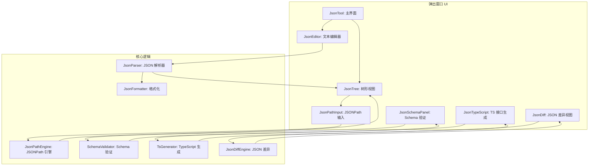
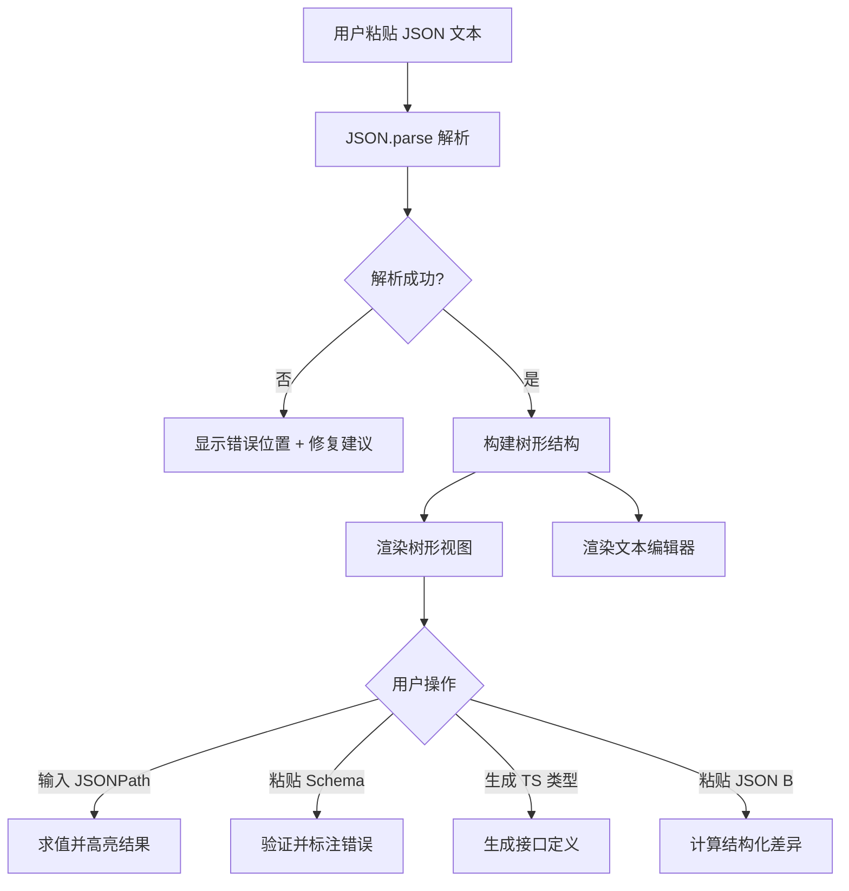

# YP-09-150: JSON 格式化与验证 — 美化/压缩、节点折叠、JSONPath 求值、Schema 验证、TypeScript 转换、差异对比

> 需求编号：YP-09-150 · 优先级：P2 · 人天：0.2d · 状态：需求已编写
> 依赖：YP-09-148（文本差异对比）

## 背景

### 问题陈述

JSON 是 Web 开发中最常用的数据格式，但处理 JSON 时的常见痛点缺乏一站式解决方案：格式化混乱的 JSON、验证 JSON 结构、查找深层嵌套字段、将 JSON 转换为 TypeScript 接口、对比两个 JSON 对象的差异。当前用户依赖多个工具分别处理这些需求：

1. **格式化分散**：JSON 美化/压缩需要切换不同工具或手动在线格式化
2. **深层字段难以定位**：大 JSON 对象中查找特定字段，手动遍历路径极其低效
3. **Schema 验证缺失**：不知道 JSON 是否符合预期的结构
4. **类型定义手动编写**：从 JSON 生成 TypeScript 接口需要手动编写
5. **差异对比不便**：两个 JSON 对象的差异需要手动逐字段对比

**核心矛盾**：JSON 处理是一个高频需求，但 YiPet 没有内置一站式 JSON 工具，用户被迫使用多个外部工具。

### 影响范围

| # | 影响 | 严重程度 | 典型场景 |
|---|------|----------|----------|
| 1 | 格式化效率低 | 高 | 查看 API 响应时需要格式化 JSON |
| 2 | 字段定位困难 | 高 | 深层嵌套 JSON 中查找特定字段 |
| 3 | 结构验证缺失 | 中 | 不知道 JSON 是否符合接口定义 |
| 4 | 类型定义手动编写 | 中 | 从 JSON 生成 TypeScript 接口 |
| 5 | 差异对比不便 | 中 | 对比两个版本的 JSON 配置 |

### 挑战

| 挑战 | 说明 |
|------|------|
| 大 JSON 渲染 | 1MB+ JSON 的树形渲染性能，虚拟滚动或节点折叠 |
| JSONPath 实现 | 完整支持 JSONPath 标准语法，包括递归下降、过滤器 |
| Schema 标准选择 | JSON Schema 规范版本选择（draft-07/2019-09/2020-12） |
| TypeScript 类型推导 | 从 JSON 值推断 TypeScript 类型，处理可选字段和联合类型 |
| JSON 差异对比 | 两个 JSON 的结构化差异（非文本 diff），支持路径级对比 |

---

## 一、现状分析

### 1.1 当前 JSON 处理流程

```
用户处理 JSON 数据
  │ 收到 API 响应 / 编辑配置文件
  ▼
格式化 JSON
  │ 切换到 JSON Formatter 在线工具
  ▼
查找字段
  │ 手动折叠/展开节点，肉眼遍历
  ▼
验证结构
  │ 切换到 JSON Schema 验证工具
  ▼
生成 TypeScript 类型
  │ 切换到 json2ts.com / quicktype.io
  ▼
对比两个 JSON
  │ 切换到 diffchecker.com
  总耗时：3-5 分钟
```

### 1.2 当前可用 JSON 能力

| 能力 | 可用性 | 获取方式 | 自动化 |
|------|--------|----------|--------|
| 格式化美化 | 外部工具 | JSON Formatter | 否 |
| JSON 压缩 | 外部工具 | JSON Minifier | 否 |
| 节点折叠 | 外部工具 | Chrome DevTools | 否 |
| JSONPath 求值 | 外部工具 | jsonpath.com | 否 |
| Schema 验证 | 外部工具 | JSON Schema Validator | 否 |
| TypeScript 转换 | 外部工具 | json2ts.com | 否 |
| JSON 差异 | 外部工具 | JSON Diff | 否 |

### 1.3 根因矩阵

| 症状 | 根因 | 触发条件 | 频率 |
|------|------|----------|------|
| 格式化分散 | 无内置 JSON 格式化工具 | 查看 API 响应时 | 高 |
| 字段定位困难 | 无 JSONPath 支持 | 深层嵌套 JSON | 高 |
| 结构验证缺失 | 无 Schema 验证 | 不确定 JSON 格式时 | 中 |
| 类型定义手动编写 | 无自动转换 | 前端开发定义接口时 | 中 |
| 差异对比不便 | 无结构化 JSON diff | 对比 JSON 配置时 | 中 |

---

## 二、设计决策

### 决策 1：JSON 渲染 — 文本编辑器 vs 树形视图 vs 双模式

| 选项 | 可读性 | 节点操作 | 大文件性能 |
|------|--------|----------|-----------|
| 纯文本编辑器 | 中 | 无 | 好 |
| 树形视图 | 高 | 折叠/展开 | 中 |
| 双模式（文本 + 树形） | 高 | 完整 | 好 |

**选择：双模式（文本编辑器 + 树形视图）。** 文本编辑器支持语法高亮、行号、括号匹配。树形视图支持节点折叠/展开、路径复制、值类型标注。双模式切换，同步选中节点。

### 决策 2：JSONPath 实现 — 完整实现 vs 简化子集 vs 外部库

| 选项 | 功能覆盖 | 体积 | 维护成本 |
|------|----------|------|----------|
| 完整 JSONPath RFC 9535 | 100% | 中 | 中 |
| 简化子集（$.a.b.c） | 30% | 小 | 低 |
| 使用 jsonpath-plus 库 | 100% | 大 | 低 |

**选择：简化实现 + 渐进增强。** 首先实现 80% 常用语法（`$.store.book[0].title`、`$..author`、`$.store.book[?(@.price<10)]`），后续逐步实现完整 RFC 9535。避免引入重型外部库。

### 决策 3：Schema 验证 — draft-07 vs 2020-12 vs 多版本

| 选项 | 兼容性 | 特性 | 复杂度 |
|------|--------|------|--------|
| 仅 draft-07 | 最广泛 | 基础 | 低 |
| 仅 2020-12 | 最新 | 全 | 中 |
| 多版本可选 | 全部 | 全部 | 高 |

**选择：draft-07 为主，标注其他版本。** draft-07 是使用最广泛的 JSON Schema 版本，兼容性最好。用户可手动选择其他版本，但验证能力有限。核心验证关键字：type, properties, required, enum, pattern, minimum/maximum。

### 决策 4：TypeScript 转换 — 简单推导 vs 智能推导 vs 外部 API

| 选项 | 准确性 | 复杂度 | 可选字段 |
|------|--------|--------|----------|
| 简单推导（字面量类型） | 中 | 低 | 否 |
| 智能推导（合并多个示例） | 高 | 中 | 是 |
| 外部 API（quicktype） | 高 | 高 | 是 |

**选择：简单推导 + 智能合并。** 基本模式：从 JSON 值推导 TypeScript 类型（string/number/boolean/object/array）。支持合并多个 JSON 示例推导更准确的类型（如可选字段、联合类型）。提供接口命名和嵌套接口生成。

---

## 三、目标架构

### 3.1 JSON 工具系统架构



### 3.2 JSON 处理流程



### 3.3 性能指标

| 指标 | 目标值 | 说明 |
|------|--------|------|
| 100KB JSON 解析 | < 100ms | JSON.parse + 树形构建 |
| 1MB JSON 解析 | < 1s | 大 JSON 使用 Web Worker |
| JSONPath 求值 | < 50ms | 遍历树节点 |
| Schema 验证 | < 100ms | 递归验证 |
| TS 类型生成 | < 50ms | 类型推导 |
| JSON 差异计算 | < 200ms | 结构化对比 |

---

## 四、具体改动

### 4.1 JSON 工具类型定义

```typescript
// src/tools/json/types.ts (新增)

export type JsonValue = string | number | boolean | null | JsonValue[] | JsonObject;
export interface JsonObject { [key: string]: JsonValue }

export interface JsonTreeNode {
  key: string;
  value: JsonValue;
  type: 'string' | 'number' | 'boolean' | 'null' | 'object' | 'array';
  path: string;
  depth: number;
  collapsed: boolean;
  children?: JsonTreeNode[];
  size?: number; // 数组长度或对象键数
}

export interface JsonPathResult {
  path: string;
  value: JsonValue;
  type: string;
}

export interface JsonParseError {
  message: string;
  position: number;
  line: number;
  column: number;
  suggestion: string;
}

export interface SchemaValidationError {
  path: string;
  keyword: string;
  message: string;
  expected: string;
  actual: string;
}

export interface TsInterface {
  name: string;
  properties: TsProperty[];
  isArray: boolean;
}

export interface TsProperty {
  name: string;
  type: string;
  optional: boolean;
  nullable: boolean;
}
```

### 4.2 JSON 解析器

```typescript
// src/tools/json/JsonParser.ts (新增)

import type { JsonValue, JsonTreeNode, JsonParseError } from './types';

export class JsonParser {
  parse(text: string): JsonValue {
    return JSON.parse(text);
  }

  parseWithError(text: string): { value: JsonValue | null; error: JsonParseError | null } {
    try {
      return { value: JSON.parse(text), error: null };
    } catch (e) {
      return { value: null, error: this.parseError(text, e as SyntaxError) };
    }
  }

  buildTree(value: JsonValue, rootKey = 'root'): JsonTreeNode {
    const type = this.getType(value);
    const node: JsonTreeNode = {
      key: rootKey, value, type, path: '$', depth: 0, collapsed: false,
    };

    if (type === 'object') {
      const obj = value as Record<string, JsonValue>;
      node.children = Object.entries(obj).map(([key, val]) =>
        this.buildNode(val, key, `$.${key}`, 1));
      node.size = Object.keys(obj).length;
    } else if (type === 'array') {
      const arr = value as JsonValue[];
      node.children = arr.map((val, i) =>
        this.buildNode(val, `[${i}]`, `$[${i}]`, 1));
      node.size = arr.length;
    }

    return node;
  }

  private buildNode(value: JsonValue, key: string, path: string, depth: number): JsonTreeNode {
    const type = this.getType(value);
    const node: JsonTreeNode = { key, value, type, path, depth, collapsed: depth > 2 };

    if (type === 'object') {
      const obj = value as Record<string, JsonValue>;
      node.children = Object.entries(obj).map(([k, v]) =>
        this.buildNode(v, k, `${path}.${k}`, depth + 1));
      node.size = Object.keys(obj).length;
    } else if (type === 'array') {
      const arr = value as JsonValue[];
      node.children = arr.map((v, i) =>
        this.buildNode(v, `[${i}]`, `${path}[${i}]`, depth + 1));
      node.size = arr.length;
    }

    return node;
  }

  getType(value: JsonValue): JsonTreeNode['type'] {
    if (value === null) return 'null';
    if (Array.isArray(value)) return 'array';
    return typeof value as JsonTreeNode['type'];
  }

  private parseError(text: string, error: SyntaxError): JsonParseError {
    const message = error.message;
    const posMatch = message.match(/position (\d+)/);
    const position = posMatch ? parseInt(posMatch[1]) : 0;
    const beforeError = text.substring(0, position);
    const line = beforeError.split('\n').length;
    const lastNewline = beforeError.lastIndexOf('\n');
    const column = position - lastNewline;

    let suggestion = '请检查 JSON 语法';
    if (message.includes('Unexpected token')) {
      suggestion = '检查引号、逗号、括号是否匹配';
    } else if (message.includes('Unexpected end')) {
      suggestion = 'JSON 不完整，检查是否缺少闭合括号';
    }

    return { message, position, line, column, suggestion };
  }
}
```

### 4.3 JSONPath 引擎

```typescript
// src/tools/json/JsonPathEngine.ts (新增)

import type { JsonValue, JsonPathResult } from './types';

export class JsonPathEngine {
  /** 执行 JSONPath 查询 */
  evaluate(json: JsonValue, path: string): JsonPathResult[] {
    // 简化的 JSONPath 实现
    const segments = this.parsePath(path);
    return this.evaluateSegments(json, segments, '$');
  }

  private parsePath(path: string): string[] {
    // 移除 $ 前缀
    const normalized = path.startsWith('$') ? path.slice(1) : path;
    const segments: string[] = [];
    let current = '';
    let inBracket = false;

    for (let i = 0; i < normalized.length; i++) {
      const ch = normalized[i];
      if (ch === '[' && !inBracket) {
        if (current) { segments.push(current); current = ''; }
        inBracket = true;
      } else if (ch === ']' && inBracket) {
        segments.push(`[${current}]`);
        current = '';
        inBracket = false;
      } else if (ch === '.' && !inBracket) {
        if (current) { segments.push(current); current = ''; }
      } else {
        current += ch;
      }
    }
    if (current) segments.push(current);

    return segments;
  }

  private evaluateSegments(
    current: JsonValue, segments: string[], currentPath: string
  ): JsonPathResult[] {
    if (segments.length === 0) {
      return [{ path: currentPath, value: current, type: typeof current }];
    }

    const segment = segments[0];
    const rest = segments.slice(1);

    // 递归下降 ..
    if (segment === '..') {
      return this.recursiveDescent(current, rest, currentPath);
    }

    // 数组索引 [n]
    if (segment.startsWith('[') && segment.endsWith(']')) {
      const index = segment.slice(1, -1);
      if (!Array.isArray(current)) return [];

      if (index === '*') {
        return current.flatMap((item, i) =>
          this.evaluateSegments(item, rest, `${currentPath}[${i}]`));
      }

      const numIndex = parseInt(index);
      if (isNaN(numIndex)) return [];
      return this.evaluateSegments(current[numIndex], rest, `${currentPath}[${numIndex}]`);
    }

    // 对象属性
    if (typeof current === 'object' && current !== null && !Array.isArray(current)) {
      if (segment === '*') {
        return Object.entries(current).flatMap(([key, val]) =>
          this.evaluateSegments(val, rest, `${currentPath}.${key}`));
      }
      const obj = current as Record<string, JsonValue>;
      if (segment in obj) {
        return this.evaluateSegments(obj[segment], rest, `${currentPath}.${segment}`);
      }
    }

    return [];
  }

  private recursiveDescent(
    current: JsonValue, segments: string[], currentPath: string
  ): JsonPathResult[] {
    let results: JsonPathResult[] = [];

    // 首先在当前层级尝试匹配
    results.push(...this.evaluateSegments(current, segments, currentPath));

    // 递归深入子节点
    if (Array.isArray(current)) {
      for (let i = 0; i < current.length; i++) {
        results.push(...this.recursiveDescent(current[i], segments, `${currentPath}[${i}]`));
      }
    } else if (typeof current === 'object' && current !== null) {
      for (const [key, val] of Object.entries(current)) {
        results.push(...this.recursiveDescent(val, segments, `${currentPath}.${key}`));
      }
    }

    return results;
  }
}
```

### 4.4 TypeScript 类型生成器

```typescript
// src/tools/json/TsGenerator.ts (新增)

import type { JsonValue, TsInterface, TsProperty } from './types';

export class TsGenerator {
  generate(json: JsonValue, rootName = 'Root'): TsInterface {
    return this.generateInterface(json, rootName);
  }

  /** 合并多个 JSON 示例生成更准确的类型 */
  mergeGenerate(examples: JsonValue[], rootName = 'Root'): TsInterface {
    const interfaces = examples.map(e => this.generate(e, rootName));
    return this.mergeInterfaces(interfaces);
  }

  private generateInterface(value: JsonValue, name: string): TsInterface {
    if (Array.isArray(value)) {
      if (value.length === 0) return { name, properties: [], isArray: true };
      const itemType = this.generateInterface(value[0], name);
      itemType.isArray = true;
      return itemType;
    }

    if (typeof value === 'object' && value !== null) {
      const obj = value as Record<string, JsonValue>;
      const properties: TsProperty[] = Object.entries(obj).map(([key, val]) => ({
        name: key,
        type: this.inferType(val, key),
        optional: false,
        nullable: val === null,
      }));
      return { name, properties, isArray: false };
    }

    return { name, properties: [], isArray: false };
  }

  private inferType(value: JsonValue, key: string): string {
    if (value === null) return 'null';
    if (Array.isArray(value)) {
      if (value.length === 0) return 'any[]';
      const itemType = this.inferType(value[0], key);
      return `${itemType}[]`;
    }
    if (typeof value === 'object') {
      return this.capitalize(key); // 递归引用
    }
    return typeof value;
  }

  private mergeInterfaces(interfaces: TsInterface[]): TsInterface {
    if (interfaces.length === 0) return { name: 'Root', properties: [], isArray: false };

    const base = interfaces[0];
    const propertyMap = new Map<string, Set<string>>();

    for (const iface of interfaces) {
      for (const prop of iface.properties) {
        if (!propertyMap.has(prop.name)) {
          propertyMap.set(prop.name, new Set());
        }
        propertyMap.get(prop.name)!.add(prop.type);
      }
    }

    base.properties = Array.from(propertyMap.entries()).map(([name, types]) => ({
      name,
      type: types.size === 1 ? [...types][0] : [...types].join(' | '),
      optional: types.size < interfaces.length,
      nullable: types.has('null'),
    }));

    return base;
  }

  /** 生成 TypeScript 接口字符串 */
  toTypeScript(iface: TsInterface, indent = 0): string {
    const pad = '  '.repeat(indent);
    let result = `${pad}export interface ${iface.name} {\n`;

    for (const prop of iface.properties) {
      const optional = prop.optional ? '?' : '';
      const nullable = prop.nullable ? ' | null' : '';
      result += `${pad}  ${prop.name}${optional}: ${prop.type}${nullable};\n`;
    }

    result += `${pad}}\n`;
    return result;
  }

  private capitalize(s: string): string {
    return s.charAt(0).toUpperCase() + s.slice(1);
  }
}
```

### 4.5 文件变更清单

| 文件 | 操作 | 说明 |
|------|------|------|
| `src/tools/json/types.ts` | 新增 | JSON 类型定义 |
| `src/tools/json/JsonParser.ts` | 新增 | JSON 解析器 + 错误诊断 |
| `src/tools/json/JsonFormatter.ts` | 新增 | 美化/压缩格式化 |
| `src/tools/json/JsonPathEngine.ts` | 新增 | JSONPath 求值引擎 |
| `src/tools/json/SchemaValidator.ts` | 新增 | JSON Schema 验证器 |
| `src/tools/json/TsGenerator.ts` | 新增 | TypeScript 接口生成器 |
| `src/tools/json/JsonDiffEngine.ts` | 新增 | JSON 结构化差异引擎 |
| `src/popup/components/JsonTool.vue` | 新增 | 主界面（Tab 切换） |
| `src/popup/components/JsonEditor.vue` | 新增 | 文本编辑器 |
| `src/popup/components/JsonTree.vue` | 新增 | 树形视图 |
| `src/popup/components/JsonPathPanel.vue` | 新增 | JSONPath 面板 |
| `src/popup/components/JsonSchemaPanel.vue` | 新增 | Schema 验证面板 |
| `src/popup/components/JsonTsPanel.vue` | 新增 | TS 类型面板 |
| `src/popup/components/JsonDiffPanel.vue` | 新增 | JSON 差异面板 |
| `src/popup/App.vue` | 修改 | 添加 JSON 工具入口 |

---

## 五、实施步骤

| 步骤 | 操作 | 路径 | 验证 | 人天 |
|------|------|------|------|------|
| 1 | 定义 JSON 类型 | `src/tools/json/types.ts` | 类型检查通过 | 0.01 |
| 2 | 实现 JSON 解析器 | `src/tools/json/JsonParser.ts` | 错误位置正确 | 0.02 |
| 3 | 实现 JSON 格式化 | `src/tools/json/JsonFormatter.ts` | 美化/压缩正确 | 0.01 |
| 4 | 实现 JSONPath 引擎 | `src/tools/json/JsonPathEngine.ts` | 常用语法正确 | 0.03 |
| 5 | 实现 Schema 验证 | `src/tools/json/SchemaValidator.ts` | draft-07 关键字 | 0.03 |
| 6 | 实现 TS 生成器 | `src/tools/json/TsGenerator.ts` | 类型推导正确 | 0.02 |
| 7 | 实现 JSON 差异引擎 | `src/tools/json/JsonDiffEngine.ts` | 结构化对比 | 0.02 |
| 8 | 实现 UI 组件 | `JsonTool.vue` + 子组件 | 交互流畅 | 0.05 |
| 9 | 编写测试 | `tests/unit/json/` | 覆盖解析/路径/验证 | 0.01 |

**总人天：0.2d**

---

## 六、测试规格

### 场景 1：JSON 格式化

**GIVEN** 压缩的 JSON `{"name":"test","items":[1,2,3]}`
**WHEN** 用户粘贴并点击格式化
**THEN** 显示美化的 JSON（2 空格缩进、换行）
**AND** 语法高亮正确（字符串/数字/布尔/空值不同颜色）

### 场景 2：JSON 解析错误

**GIVEN** 无效 JSON `{"name": "test",}`
**WHEN** 用户粘贴
**THEN** 显示错误提示："Unexpected token }"
**AND** 标注错误位置（行号 + 列号）
**AND** 给出修复建议："移除多余的逗号"

### 场景 3：JSONPath 求值

**GIVEN** JSON `{"store": {"book": [{"title": "A"}, {"title": "B"}]}}`
**WHEN** 用户输入 JSONPath `$.store.book[*].title`
**THEN** 返回 2 个结果：["A", "B"]
**AND** 树形视图中对应节点高亮

### 场景 4：Schema 验证

**GIVEN** JSON `{"name": "test", "age": "not-a-number"}`
**WHEN** 用户粘贴 Schema `{"type": "object", "properties": {"age": {"type": "number"}}, "required": ["name"]}`
**THEN** 验证失败：`$.age` 期望 number，实际 string
**AND** 树形视图中对应节点红色标注

### 场景 5：TypeScript 类型生成

**GIVEN** JSON `{"user": {"name": "Alice", "age": 30, "email": null}}`
**WHEN** 用户点击 "生成 TypeScript 接口"
**THEN** 生成接口：
```typescript
export interface User {
  name: string;
  age: number;
  email: string | null;
}
```

### 场景 6：JSON 差异对比

**GIVEN** JSON A `{"a": 1, "b": 2}`，JSON B `{"a": 1, "b": 3, "c": 4}`
**WHEN** 用户粘贴两个 JSON 并点击对比
**THEN** 显示差异：`$.b` 修改（2 → 3）、`$.c` 新增（4）
**AND** 树形视图中变更节点高亮

---

## 七、风险与缓解

| 风险 | 概率 | 影响 | 缓解措施 |
|------|------|------|----------|
| 大 JSON 渲染卡顿 | 中 | 中 | 虚拟滚动 + 默认折叠深度 > 2 的节点 |
| JSONPath 语法不完整 | 中 | 中 | 标注"语法支持有限"，列出支持的语法 |
| Schema 验证标准不兼容 | 低 | 中 | 明确标注 draft-07，对其他版本给出警告 |
| TS 类型推导不准确 | 中 | 低 | 支持合并多个 JSON 示例，标注"自动生成，建议审核" |
| JSON 差异误判 | 低 | 中 | 使用结构化对比（路径级），非文本 diff |

---

## 八、回滚策略

| 场景 | 回滚操作 | 影响 |
|------|----------|------|
| JSON 解析崩溃 | 捕获异常，显示错误提示 | 不崩溃 |
| 树形视图性能问题 | 默认折叠深度 > 2，限制渲染节点数 | 大 JSON 部分折叠 |
| Schema 验证错误 | 禁用 Schema 验证面板 | 仅失去验证功能 |
| 完全回滚 | 移除 JSON 工具入口 | 功能回到改造前 |

---

## 九、设计决策记录

### D-01：为什么选择双模式（文本编辑器 + 树形视图）？

纯文本编辑器适合编辑和复制，但大 JSON 中查找特定字段困难。树形视图适合浏览和查找，但编辑不方便。双模式兼顾两种需求，用户可自由切换。文本编辑器使用 CodeMirror 或 Monaco 的 JSON 模式，树形视图使用自定义递归组件。

### D-02：为什么 JSONPath 引擎选择自实现而非外部库？

外部库（如 jsonpath-plus）体积大（~10KB gzip），且引入额外依赖。自实现覆盖 80% 常用语法（`.`、`..`、`[n]`、`[*]`、过滤器），代码量 < 200 行。对于复杂的 JSONPath 查询，可降级为手动导航。

### D-03：为什么 Schema 验证选择 draft-07？

draft-07 是使用最广泛的 JSON Schema 版本，Swagger/OpenAPI 3.0、GitHub Actions、VS Code settings 等都使用 draft-07。后续版本（2019-09、2020-12）虽然特性更多，但兼容性差。用户可粘贴其他版本 Schema，但验证能力有限。

### D-04：为什么 TypeScript 类型生成支持合并多个示例？

单个 JSON 示例无法区分"必填字段"和"可选字段"，也无法推断联合类型。合并多个 JSON 示例（如 API 响应列表的多条记录），可以推导出更准确的类型：在所有示例中都出现的字段为必填，仅部分出现的为可选；同一字段在不同示例中类型不同时为联合类型。

---

## 十、可观测性

### 指标

| 指标 | 类型 | 说明 |
|------|------|------|
| `yipet.json.use_count` | Counter | JSON 工具使用次数 |
| `yipet.json.parse_error_count` | Counter | JSON 解析错误次数 |
| `yipet.json.path_query_count` | Counter | JSONPath 查询次数 |
| `yipet.json.schema_validate_count` | Counter | Schema 验证次数 |
| `yipet.json.ts_generate_count` | Counter | TS 类型生成次数 |
| `yipet.json.diff_count` | Counter | JSON 差异对比次数 |
| `yipet.json.avg_size` | Histogram | 平均 JSON 大小分布 |

### 告警

| 告警 | 条件 | 级别 |
|------|------|------|
| 大 JSON 渲染慢 | 500KB+ JSON 渲染 > 1s | WARNING |
| JSONPath 查询慢 | 递归下降查询 > 200ms | WARNING |
| Schema 验证异常 | 验证循环引用 > 5 层 | INFO |

---

## 十一、代码审查检查清单

- [ ] JSON.parse 错误位置正确（行号 + 列号）
- [ ] 格式化支持自定义缩进（2/4 空格或 Tab）
- [ ] 树形视图节点折叠/展开正常
- [ ] JSONPath 支持 `.`、`..`、`[n]`、`[*]` 语法
- [ ] Schema 验证支持 draft-07 核心关键字
- [ ] TypeScript 生成支持合并多个示例
- [ ] JSON 差异使用结构化对比（非文本 diff）
- [ ] 大 JSON（> 500KB）使用 Web Worker 解析
- [ ] 语法高亮正确（字符串/数字/布尔/空值）
- [ ] 支持复制节点路径、值、子树

---

## 回归问题预测

| # | 预测问题 | 原因 | 验证方法 |
|---|---------|------|---------|
| 1 | JSON 包含循环引用时，树形视图构建无限递归，页面卡死 | `JSON.parse` 不支持循环引用，但用户可能粘贴含 `$ref` 的 JSON | 限制树形构建深度（最大 50 层），超出时截断并提示 |
| 2 | JSONPath 递归下降（`..`）在深层嵌套 JSON 中性能极差，遍历所有节点 | 递归下降需要遍历整棵树，大 JSON 可能耗时 > 500ms | 限制递归下降结果数量（最多 1000 个），超出时提示 |
| 3 | Schema 验证中 `$ref` 引用外部文件时无法解析，验证失败 | 外部 `$ref` 需要网络请求，且可能不存在 | 仅支持内部 `$ref`（`#/definitions/...`），外部引用给出警告 |
| 4 | TypeScript 类型生成时，键名包含特殊字符（如 `-`、`@`）导致接口名语法错误 | JavaScript 对象键名允许特殊字符，但 TypeScript 接口属性名不允许 | 对特殊字符键名使用引号包裹（`"my-key"?: string`） |
| 5 | JSON 差异对比时，数组元素顺序变化被误判为全部修改，而非重新排序 | 数组按索引对比，`[1,2,3]` vs `[3,2,1]` 被判定为 3 处修改 | 对数组使用 LCS 算法而非索引对比，标注"重新排序" |
| 6 | 用户粘贴非 JSON 内容（如 YAML、XML），JSON.parse 报错但错误信息可能误导 | 非 JSON 格式的解析错误信息不准确 | 检测输入是否以 `{`、`[` 开头，如果不是则提示"可能不是 JSON 格式" |

---

## 性能分析

### 各操作耗时

| 阶段 | 预估耗时 | 说明 |
|------|----------|------|
| JSON.parse（100KB） | 10-30ms | 原生 JSON.parse |
| 树形构建（100KB） | 20-50ms | 递归构建节点 |
| JSONPath 求值 | 10-50ms | 取决于路径复杂度 |
| Schema 验证（100KB） | 20-100ms | 递归验证 |
| TS 类型生成 | 10-30ms | 类型推导 |
| JSON 差异（100KB） | 50-200ms | 结构化对比 |
| 格式化美化 | 10-20ms | JSON.stringify |
| 树形视图渲染 | 30-100ms | Vue 虚拟 DOM |

### 文件体积预估

| 文件 | 大小 | 说明 |
|------|------|------|
| `src/tools/json/types.ts` | ~1.5KB | 类型定义 |
| `src/tools/json/JsonParser.ts` | ~2KB | 解析器 + 错误诊断 |
| `src/tools/json/JsonFormatter.ts` | ~1KB | 格式化 |
| `src/tools/json/JsonPathEngine.ts` | ~3KB | JSONPath 引擎 |
| `src/tools/json/SchemaValidator.ts` | ~3KB | Schema 验证 |
| `src/tools/json/TsGenerator.ts` | ~2KB | TS 生成器 |
| `src/tools/json/JsonDiffEngine.ts` | ~2KB | 差异引擎 |
| `src/popup/components/JsonTool.vue` | ~3KB | 主界面 |
| `src/popup/components/JsonEditor.vue` | ~2KB | 编辑器 |
| `src/popup/components/JsonTree.vue` | ~3KB | 树形视图 |
| `src/popup/components/JsonPathPanel.vue` | ~1KB | JSONPath |
| `src/popup/components/JsonTsPanel.vue` | ~2KB | TS 面板 |
| `src/popup/components/JsonDiffPanel.vue` | ~2KB | 差异面板 |