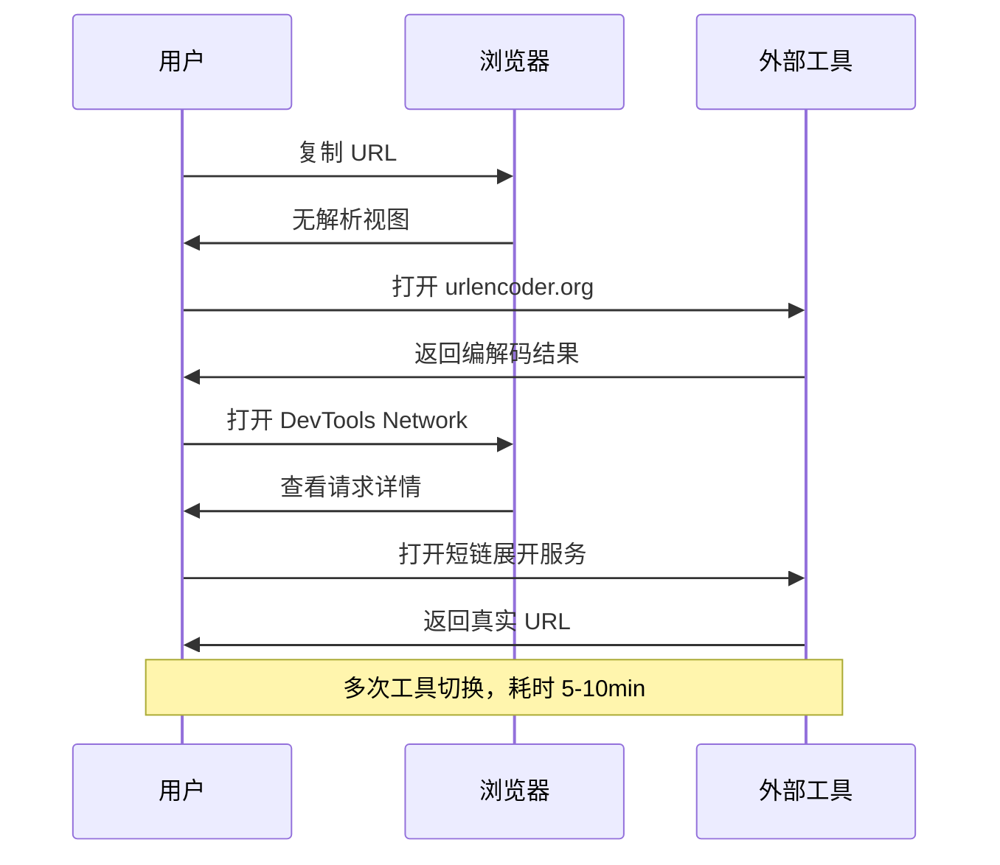
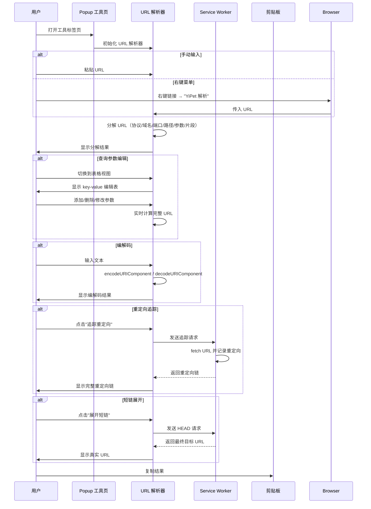
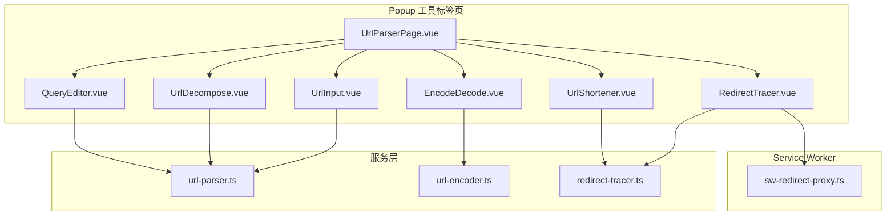

# YP-09-151: URL 解析器 — 协议/域名/路径/查询参数/片段解析、编解码、重定向追踪、短链集成

> 需求编号：YP-09-151 · 优先级：P2 · 人天：0.2d · 状态：需求已编写
> 依赖：无

## 背景

### 问题陈述

开发者和技术用户在日常工作中频繁需要解析和调试 URL，但浏览器原生提供的 URL 解析能力极其有限。当前用户只能依赖 Chrome DevTools 的 Network 面板查看 URL 部分信息，或手动复制 URL 到外部工具（如 Postman、curl 命令）进行解析。对于 URL 编解码、查询参数编辑、重定向追踪等常见需求，缺少一个轻量级、即时可用的浏览器内工具。

1. **URL 分解困难**：用户需要手动识别协议、域名、端口、路径、查询参数等组成部分，容易遗漏
2. **编解码需求**：URL 编码/解码是日常开发高频操作，但需要打开外部工具或编写代码
3. **查询参数编辑不便**：手动编辑 URL 查询字符串容易出错，缺乏可视化编辑器
4. **重定向链不可见**：浏览器 Network 面板可查看重定向，但信息分散，缺少聚合视图
5. **短链展开无工具**：用户收到短链接后无法快速预览真实目标 URL

**核心矛盾**：浏览器是 URL 的主要消费场景，但缺少内置的 URL 诊断工具，用户被迫在多个工具间切换。

### 影响范围

| # | 影响 | 严重程度 | 典型场景 |
|---|------|----------|----------|
| 1 | URL 解析效率低 | 中 | 开发者手动分解 URL 各组成部分 |
| 2 | 编解码切换成本高 | 中 | 需打开外部工具进行 URL 编解码 |
| 3 | 查询参数调试困难 | 中 | 手动编辑 URL 查询字符串容易出错 |
| 4 | 重定向追踪不可见 | 中 | 无法直观查看完整重定向链 |
| 5 | 短链安全风险 | 中 | 无法预览短链目标 URL |

### 挑战

| 挑战 | 说明 |
|------|------|
| URL 标准兼容 | 需兼容 RFC 3986 标准，处理各种边缘情况（IPv6、国际域名、特殊协议） |
| 编解码正确性 | `encodeURIComponent` vs `encodeURI` 的区别需要正确处理 |
| 重定向追踪限制 | 跨域重定向可能受 CORS 限制，需通过 Service Worker 代理 |
| 短链服务多样性 | 不同短链服务（t.co、bit.ly 等）的展开方式不同 |
| 大 URL 性能 | 超长 URL（>10KB）的解析和渲染性能 |

---

## 一、现状分析

### 1.1 当前 URL 解析流程

```
用户遇到 URL 需要解析
  │ 复制 URL
  ▼
打开 Chrome DevTools
  │ Network 面板 → 查看请求详情
  │ 或 Console 中执行 new URL(...)
  ▼
需要编解码时
  │ 打开外部工具（如 urlencoder.org）
  │ 或在 Console 中执行 encodeURIComponent(...)
  ▼
需要追踪重定向时
  │ 在 Network 面板中逐个查看请求
  │ 手动拼接重定向链
  ▼
总耗时：5-10 分钟（含工具切换）
```

### 1.2 当前可用能力

| 能力 | 可用性 | 获取方式 | 便捷度 |
|------|--------|----------|--------|
| URL 分解 | ⚠️ | DevTools Network 面板 | 中 |
| URL 编码 | ⚠️ | Console 中 `encodeURIComponent()` | 低 |
| URL 解码 | ⚠️ | Console 中 `decodeURIComponent()` | 低 |
| 查询参数编辑 | ❌ | 无内置工具 | — |
| 重定向追踪 | ⚠️ | Network 面板逐条查看 | 低 |
| 短链展开 | ❌ | 需外部服务 | — |

### 1.3 改造前数据流



### 1.4 根因矩阵

| 症状 | 根因 | 触发条件 | 频率 |
|------|------|----------|------|
| URL 解析不便 | 浏览器无内置 URL 解析工具 | 每次需要解析 URL | 高 |
| 编解码需切换工具 | 无浏览器内编解码器 | 每次需要编解码 | 高 |
| 查询参数编辑易错 | 手动编辑缺少可视化 | 调试 API 请求 | 中 |
| 重定向链不直观 | 信息分散在 Network 面板 | 分析重定向行为 | 中 |
| 短链无法预览 | 缺少短链展开功能 | 收到短链接 | 中 |

---

## 二、设计决策

### 决策 1：URL 解析器入口 — Popup 独立页面 vs 侧边栏 vs 聊天窗口内嵌

| 选项 | 便捷性 | 实现复杂度 | 是否干扰主流程 |
|------|--------|-----------|---------------|
| Popup 独立标签页 | 中 | 低 | 否 |
| 侧边栏常驻 | 高 | 中 | 是 |
| 聊天窗口内嵌 | 低 | 中 | 否 |

**选择：Popup 独立标签页。** URL 解析器是独立工具，不应与聊天流程混合。在 Popup 中新增"工具"标签页，URL 解析器作为其中一个工具。实现简单，不干扰主流程。

### 决策 2：重定向追踪方式 — fetch API vs Service Worker 代理 vs chrome.webRequest

| 选项 | 跨域能力 | 实现复杂度 | 权限需求 |
|------|----------|-----------|---------|
| fetch API（无 redirect: manual） | 弱 | 低 | 无 |
| Service Worker 代理 | 强 | 中 | 无 |
| chrome.webRequest | 强 | 低 | 需 webRequest 权限 |

**选择：chrome.webRequest（MV3 降级为 fetch + Service Worker 代理）。** MV3 中 `chrome.webRequest` 在 Service Worker 中可用，可监听重定向事件。对于跨域重定向，通过 Service Worker 的 fetch 事件代理请求。

### 决策 3：短链展开时机 — 用户手动触发 vs 自动展开 vs 右键菜单

| 选项 | 便捷性 | 安全性 | 实现复杂度 |
|------|--------|--------|-----------|
| 用户手动粘贴 | 低 | 高 | 低 |
| 自动展开（检测剪贴板） | 高 | 中 | 中 |
| 右键菜单触发 | 中 | 高 | 中 |

**选择：手动粘贴 + 右键菜单。** 用户可手动粘贴 URL 到解析器，同时支持右键菜单"使用 YiPet 解析此链接"直接传入 URL。自动展开剪贴板存在隐私风险（用户可能复制了敏感内容）。

### 决策 4：查询参数编辑器 — 纯文本编辑 vs 表格编辑 vs 两者

| 选项 | 易用性 | 实现复杂度 | 适用场景 |
|------|--------|-----------|---------|
| 纯文本编辑 | 低 | 低 | 简单修改 |
| 表格编辑（key-value） | 高 | 中 | 复杂参数管理 |
| 纯文本 + 表格切换 | 高 | 中 | 所有场景 |

**选择：纯文本 + 表格切换。** 提供两种视图：表格视图（key-value 行编辑，支持添加/删除/排序参数）和纯文本视图（直接编辑完整查询字符串）。两种视图实时同步。

### 设计决策记录

| 决策 | 选项 A | 选项 B | 选项 C | 选择 | 理由 |
|------|--------|--------|--------|------|------|
| 入口方式 | Popup 标签 | 侧边栏 | 聊天内嵌 | **Popup 标签** | 独立工具，不干扰主流程 |
| 重定向追踪 | fetch API | SW 代理 | webRequest | **SW 代理** | MV3 兼容，跨域支持 |
| 短链展开 | 手动粘贴 | 自动展开 | 右键菜单 | **手动 + 右键** | 平衡便捷和隐私 |
| 参数编辑器 | 纯文本 | 表格 | 两者 | **两者切换** | 覆盖所有场景 |

---

## 三、目标架构

### 3.1 改造后 URL 解析流程



### 3.2 URL 解析器组件结构



### 3.3 性能指标

| 指标 | 改造前 | 改造后 |
|------|--------|--------|
| URL 解析耗时 | 5-10min（工具切换） | < 1s（一键解析） |
| 编解码操作 | 打开外部网站 | 即时输入即时结果 |
| 重定向追踪 | 手动逐条查看 Network | 一键展示完整链路 |
| 短链展开 | 需外部服务 | 一键展开 |

---

## 四、具体改动

### 4.1 URL 解析器核心

```typescript
// 改造前：无 URL 解析功能
// src/services/url-parser.ts (改造后)

interface ParsedURL {
  raw: string;
  protocol: string;
  hostname: string;
  port: string;
  pathname: string;
  search: string;
  hash: string;
  queryParams: QueryParam[];
}

interface QueryParam {
  key: string;
  value: string;
  encoded: boolean;
}

class UrlParser {
  parse(rawUrl: string): ParsedURL | null {
    try {
      const url = new URL(rawUrl);
      const params: QueryParam[] = [];
      url.searchParams.forEach((value, key) => {
        params.push({
          key,
          value,
          encoded: value !== decodeURIComponent(value),
        });
      });

      return {
        raw: rawUrl,
        protocol: url.protocol.replace(':', ''),
        hostname: url.hostname,
        port: url.port || (url.protocol === 'https:' ? '443' : '80'),
        pathname: url.pathname,
        search: url.search,
        hash: url.hash,
        queryParams: params,
      };
    } catch {
      return null;
    }
  }

  buildURL(parsed: ParsedURL): string {
    const url = new URL(`${parsed.protocol}://${parsed.hostname}`);
    if (parsed.port && parsed.port !== '80' && parsed.port !== '443') {
      url.port = parsed.port;
    }
    url.pathname = parsed.pathname;
    parsed.queryParams.forEach((p) => url.searchParams.set(p.key, p.value));
    url.hash = parsed.hash;
    return url.toString();
  }

  encode(value: string, component: boolean = true): string {
    return component ? encodeURIComponent(value) : encodeURI(value);
  }

  decode(value: string, component: boolean = true): string {
    return component ? decodeURIComponent(value) : decodeURI(value);
  }
}
```

### 4.2 重定向追踪器

```typescript
// src/services/redirect-tracer.ts

interface RedirectHop {
  order: number;
  url: string;
  statusCode: number;
  statusText: string;
  location?: string;
  duration: number;
}

interface RedirectChain {
  hops: RedirectHop[];
  totalDuration: number;
  finalURL: string;
  totalHops: number;
}

class RedirectTracer {
  async trace(url: string, maxHops: number = 10): Promise<RedirectChain> {
    const hops: RedirectHop[] = [];
    let currentURL = url;
    let order = 0;
    const startTime = performance.now();

    while (order < maxHops) {
      const hopStart = performance.now();
      try {
        const response = await fetch(currentURL, {
          method: 'HEAD',
          redirect: 'manual',
        });

        const statusCode = response.status;
        const duration = performance.now() - hopStart;

        if (statusCode >= 300 && statusCode < 400) {
          const location = response.headers.get('Location');
          hops.push({
            order,
            url: currentURL,
            statusCode,
            statusText: response.statusText,
            location: location || undefined,
            duration,
          });
          if (location) {
            currentURL = new URL(location, currentURL).toString();
          } else {
            break;
          }
        } else {
          hops.push({
            order,
            url: currentURL,
            statusCode,
            statusText: response.statusText,
            duration,
          });
          break;
        }
        order++;
      } catch (err) {
        hops.push({
          order,
          url: currentURL,
          statusCode: 0,
          statusText: `Error: ${(err as Error).message}`,
          duration: performance.now() - hopStart,
        });
        break;
      }
    }

    return {
      hops,
      totalDuration: performance.now() - startTime,
      finalURL: currentURL,
      totalHops: hops.length,
    };
  }

  async expandShortURL(shortURL: string): Promise<string> {
    try {
      const response = await fetch(shortURL, {
        method: 'HEAD',
        redirect: 'follow',
      });
      return response.url;
    } catch {
      return shortURL;
    }
  }
}
```

### 4.3 查询参数编辑器

```typescript
// src/components/tools/QueryEditor.vue (改造后)

interface QueryEditorProps {
  params: QueryParam[];
  mode: 'table' | 'text';
}

// 表格视图：逐行编辑 key-value
// 功能：
// - 添加参数行（+ 按钮）
// - 删除参数行（× 按钮）
// - 编辑 key/value 输入框
// - 编码状态指示器（绿色=已编码，黄色=需编码）
// - 一键编码所有参数值
// - 拖拽排序参数

// 纯文本视图：直接编辑完整查询字符串
// 功能：
// - 语法高亮（key=value 分段着色）
// - 实时校验（非法字符提示）
// - 一键编码/解码全部
```

### 4.4 文件变更清单

| 文件 | 操作 | 说明 |
|------|------|------|
| `src/services/url-parser.ts` | 新增 | URL 解析核心逻辑 |
| `src/services/redirect-tracer.ts` | 新增 | 重定向追踪服务 |
| `src/pages/tools/UrlParserPage.vue` | 新增 | URL 解析器主页面 |
| `src/components/tools/UrlInput.vue` | 新增 | URL 输入组件 |
| `src/components/tools/UrlDecompose.vue` | 新增 | URL 分解结果展示 |
| `src/components/tools/QueryEditor.vue` | 新增 | 查询参数编辑器 |
| `src/components/tools/EncodeDecode.vue` | 新增 | 编解码工具 |
| `src/components/tools/RedirectTracer.vue` | 新增 | 重定向追踪展示 |
| `src/components/tools/UrlShortener.vue` | 新增 | 短链展开组件 |
| `src/sw/redirect-proxy.ts` | 新增 | SW 重定向代理 |
| `src/popup/router.ts` | 修改 | 添加工具页路由 |
| `tests/unit/url-parser.test.ts` | 新增 | URL 解析器测试 |

---

## 五、实施步骤

| 步骤 | 操作 | 路径 | 验证 | 人天 |
|------|------|------|------|------|
| 1 | 实现 URL 解析核心 | `src/services/url-parser.ts` | 解析各类 URL 正确分解 | 0.03 |
| 2 | 实现 UI 组件 | `src/components/tools/*.vue` | 分解结果可视化展示 | 0.05 |
| 3 | 实现查询参数编辑器 | `src/components/tools/QueryEditor.vue` | 表格/文本视图切换同步 | 0.04 |
| 4 | 实现编解码工具 | `src/components/tools/EncodeDecode.vue` | 编码/解码正确 | 0.02 |
| 5 | 实现重定向追踪 | `src/services/redirect-tracer.ts` | 追踪 3xx 重定向链 | 0.03 |
| 6 | 实现短链展开 | `src/services/redirect-tracer.ts` | 展开短链获取真实 URL | 0.01 |
| 7 | 集成到 Popup 路由 | `src/popup/router.ts` | 工具标签页可访问 | 0.02 |

**总人天：0.2d**

---

## 六、测试规格

### 场景 1：标准 URL 解析

**GIVEN** 用户输入 URL `https://example.com:8080/path/to/page?q=search&lang=zh#section`
**WHEN** 执行解析
**THEN** 协议应显示为 `https`
**AND** 域名应显示为 `example.com`
**AND** 端口应显示为 `8080`
**AND** 路径应显示为 `/path/to/page`
**AND** 查询参数应显示 `q=search` 和 `lang=zh`
**AND** 片段应显示为 `section`

### 场景 2：URL 编码

**GIVEN** 用户输入文本 `你好 world`
**WHEN** 点击编码
**THEN** 输出应为 `%E4%BD%A0%E5%A5%BD%20world`
**AND** 点击解码应还原为 `你好 world`

### 场景 3：查询参数编辑同步

**GIVEN** URL 包含 3 个查询参数
**WHEN** 用户在表格视图中删除一个参数
**THEN** 纯文本视图中的查询字符串应同步更新
**AND** 完整 URL 应实时更新

### 场景 4：重定向链追踪

**GIVEN** URL `http://example.com/redirect` 返回 301 → `https://example.com/new` 返回 200
**WHEN** 用户点击"追踪重定向"
**THEN** 应显示 2 跳重定向链
**AND** 每跳应显示状态码、目标 URL、耗时
**AND** 最终 URL 应显示为 `https://example.com/new`

### 场景 5：短链展开

**GIVEN** 短链 `https://bit.ly/abc123` 重定向到 `https://example.com/very/long/path`
**WHEN** 用户点击"展开短链"
**THEN** 应显示真实目标 URL
**AND** 应显示重定向次数

### 场景 6：无效 URL 处理

**GIVEN** 用户输入 `not a valid url`
**WHEN** 执行解析
**THEN** 应显示错误提示"无效的 URL 格式"
**AND** 不应崩溃或抛出未捕获异常

---

## 七、风险与缓解

| 风险 | 概率 | 影响 | 缓解措施 |
|------|------|------|----------|
| 重定向追踪跨域失败 | 中 | 中 | 通过 Service Worker 代理请求 |
| URL 编码字符集不完整 | 低 | 中 | 使用浏览器原生 `encodeURIComponent` |
| 超长 URL 渲染卡顿 | 低 | 低 | 截断显示 + 虚拟滚动 |
| 短链展开超时 | 中 | 低 | 设置 5s 超时，超时提示用户 |
| 右键菜单注册失败 | 低 | 低 | 降级为手动粘贴输入 |

---

## 八、回滚策略

| 场景 | 回滚操作 | 影响 |
|------|----------|------|
| URL 解析器性能问题 | 移除工具标签页路由 | 功能不可用 |
| 重定向追踪导致请求异常 | 移除重定向追踪功能 | 仅失去重定向追踪 |
| 右键菜单与其他扩展冲突 | 移除右键菜单注册 | 仅可通过手动粘贴 |

---

## 九、设计决策记录

### D-01：URL 标准支持

- **问题**：URL 解析器应支持哪些 URL 标准
- **选项**：仅 HTTP/HTTPS、所有 RFC 3986 协议、自定义协议
- **选择**：使用浏览器原生 `new URL()` 解析
- **理由**：浏览器 `URL` 构造函数已实现 RFC 3986，支持所有标准协议（http/https/ftp/ws/wss/mailto/data/blob），无需自行实现解析器

### D-02：查询参数编码策略

- **问题**：查询参数值何时自动编码
- **选项**：始终编码、按需编码、用户手动编码
- **选择**：按需编码
- **理由**：显示解码后的值便于用户阅读，但构建 URL 时自动检测并编码特殊字符，编码状态用颜色指示器标注

### D-03：重定向追踪最大跳数

- **问题**：重定向追踪的最大跳数限制
- **选项**：5 跳、10 跳、20 跳、无限制
- **选择**：10 跳
- **理由**：HTTP 规范建议客户端限制重定向次数（通常 5-20）；10 跳覆盖绝大多数场景，同时防止重定向循环导致无限请求

### D-04：短链展开方式

- **问题**：短链展开使用 HEAD 还是 GET 请求
- **选项**：HEAD 请求、GET 请求
- **选择**：HEAD 请求
- **理由**：HEAD 请求仅获取响应头，不下载响应体，带宽消耗小，速度更快。对于需要 GET 才能重定向的罕见短链服务，降级为 GET 请求

---

## 十、可观测性

### 指标

| 指标 | 类型 | 说明 |
|------|------|------|
| `yipet.url.parser.usage` | Counter | URL 解析器使用次数 |
| `yipet.url.encode.count` | Counter | 编码操作次数 |
| `yipet.url.decode.count` | Counter | 解码操作次数 |
| `yipet.url.redirect.trace` | Counter | 重定向追踪次数 |
| `yipet.url.short.expand` | Counter | 短链展开次数 |
| `yipet.url.parser.error` | Counter | 解析失败次数 |

### 告警

| 告警 | 条件 | 级别 |
|------|------|------|
| 解析失败率过高 | 1h 内失败率 > 20% | WARNING |
| 重定向追踪超时率过高 | 1h 内超时率 > 30% | WARNING |

---

## 十一、代码审查检查清单

- [ ] URL 解析器正确分解协议/域名/端口/路径/查询参数/片段
- [ ] 编解码使用 `encodeURIComponent`/`decodeURIComponent` 正确处理
- [ ] 查询参数编辑器表格/文本视图实时同步
- [ ] 重定向追踪正确记录每跳状态码和目标 URL
- [ ] 重定向追踪最大跳数限制（10 跳）
- [ ] 短链展开使用 HEAD 请求，设置 5s 超时
- [ ] 无效 URL 输入有友好错误提示
- [ ] 右键菜单"YiPet 解析"正确注册和注销
- [ ] 所有输入有 XSS 防护（不直接渲染用户输入为 HTML）
- [ ] 单元测试覆盖各类 URL 格式和边缘情况
- [ ] 超长 URL（>10KB）渲染不卡顿

---

## 回归问题预测

| # | 预测问题 | 原因 | 验证方法 |
|---|---------|------|---------|
| 1 | URL 解析器对含有特殊字符的查询参数（如 `q=hello+world&filter=name:desc`）编码/解码不一致，导致参数值在表格视图和文本视图间切换时丢失原始值 | 表格视图使用 `decodeURIComponent` 显示，但 `+` 号在 URL 中表示空格，如果先解码再编码可能导致 `+` 变成 `%20` | 构造包含 `+`、`%20`、`:` 等特殊字符的 URL，在表格/文本视图间切换 10 次，验证参数值不变 |
| 2 | 重定向追踪中 fetch 请求的 `redirect: 'manual'` 跨域时无法获取 `Location` 响应头（CORS 限制 opaque response） | `redirect: 'manual'` 对跨域请求返回 opaque response，`response.headers` 不可读 | 对跨域 URL 执行重定向追踪，验证能获取 Location 头或降级提示用户 |
| 3 | 短链展开时某些短链服务（如 t.co）返回 200 + meta refresh 或 JavaScript 重定向而非 HTTP 3xx | HEAD 请求只能追踪 HTTP 3xx 重定向，无法解析 HTML meta refresh 或 JS 重定向 | 输入 t.co 短链，验证展开后显示真实 URL 或提示需要 GET 请求解析 |
| 4 | 查询参数编辑器拖拽排序时，参数顺序变化但 URL 构建未同步，导致复制出的 URL 参数顺序与显示不一致 | 拖拽排序使用 `Array.sort` 或 splice 移动，但 URL 构建时使用 `searchParams` 的迭代顺序可能不同 | 拖拽排序参数后复制完整 URL，验证参数顺序与表格显示一致 |
| 5 | URL 解析器未正确处理 IPv6 地址（如 `https://[::1]:8080/path`），`new URL()` 解析成功但展示的 hostname 格式异常 | `new URL('https://[::1]:8080/path').hostname` 返回 `::1`（不含方括号），用户可能困惑 | 输入 IPv6 URL，验证 hostname 展示正确且后续构建 URL 时能正确还原方括号 |
| 6 | 右键菜单"YiPet 解析此链接"在 Service Worker 未激活时注册失败，静默失败导致用户看不到菜单项 | `chrome.contextMenus.create` 在 SW 启动时注册，但 SW 被终止后重启时可能遗漏 re-register | 重启浏览器后，右键点击任意链接，验证"YiPet 解析此链接"菜单项存在 |

---

## 性能分析

### URL 解析器关键操作耗时

| 操作 | 耗时 | 说明 |
|------|------|------|
| `new URL()` 解析 | < 0.1ms | 浏览器原生 API，同步解析 |
| URL 编码 `encodeURIComponent()` | < 0.1ms | 浏览器原生 API |
| URL 解码 `decodeURIComponent()` | < 0.1ms | 浏览器原生 API |
| 查询参数表格渲染 (50 参数) | < 5ms | Vue 3 响应式渲染 |
| 重定向追踪 (10 跳) | 取决于网络延迟 | 每跳 HEAD 请求 50-500ms |
| 短链展开 (HEAD) | 100-500ms | 含重定向跟踪 |
| 完整 URL 工具页面加载 | < 50ms | Vue 组件挂载 |

### 数据量预估

| 模块 | 数据项 | 大小 |
|------|--------|------|
| 标准 URL 解析 | 协议/域名/路径/参数/片段 | ~1KB |
| 查询参数 (50 个) | key-value 对 | ~2KB |
| 重定向链 (10 跳) | 每跳 URL + 状态码 + 耗时 | ~5KB |
| 编解码 | 输入/输出文本对 | ~1KB |

### 对宿主页面的影响

| 场景 | 页面影响 | 说明 |
|------|----------|------|
| Popup 工具页使用 | 零影响 | 仅在 Popup 中运行 |

---

## 相关文档

- [RFC 3986 - URI Generic Syntax](https://datatracker.ietf.org/doc/html/rfc3986)
- [MDN - URL API](https://developer.mozilla.org/en-US/docs/Web/API/URL)
- [MDN - encodeURIComponent](https://developer.mozilla.org/en-US/docs/Web/JavaScript/Reference/Global_Objects/encodeURIComponent)