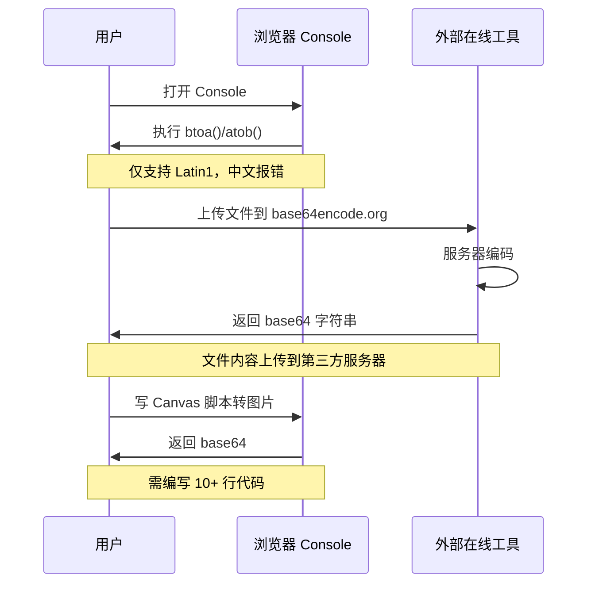
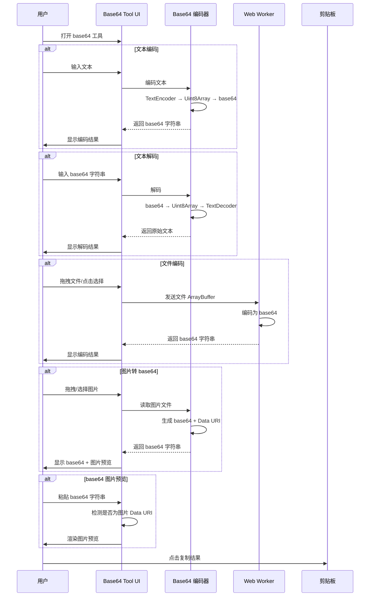
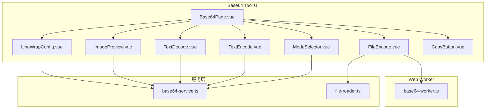

# YP-09-152: base64 编解码器 — 文本/文件模式、图片互转、行宽配置、URL 安全模式、拖拽文件支持

> 需求编号：YP-09-152 · 优先级：P2 · 人天：0.2d · 状态：需求已编写
> 依赖：无

## 背景

### 问题陈述

Base64 编解码是前端开发和日常工作中最高频的数据转换操作之一。开发者需要将图片转为 base64 嵌入 HTML/CSS，将文件内容编码为 base64 传输，或将 base64 字符串解码为原始数据。然而，当前浏览器没有内置的 base64 工具，用户只能依赖：

1. 命令行 `base64` 命令（仅 macOS/Linux）
2. 在线工具（如 base64encode.org）——有隐私风险（数据上传到第三方服务器）
3. 浏览器 Console 中 `btoa()`/`atob()` ——不支持 Unicode 字符，无文件处理能力
4. 编写临时脚本——效率极低

**核心矛盾**：base64 编解码是高频需求，但浏览器缺少安全、便捷、功能完整的本地工具。

### 影响范围

| # | 影响 | 严重程度 | 典型场景 |
|---|------|----------|----------|
| 1 | 文本编解码不便 | 高 | 每次需要编码/解码字符串 |
| 2 | 图片转 base64 需外部工具 | 高 | 开发中嵌入图片到 HTML/CSS |
| 3 | base64 图片预览困难 | 中 | 收到 base64 图片无法直接查看 |
| 4 | 文件编码需上传 | 中 | 在线工具上传文件有隐私风险 |
| 5 | Unicode 编码出错 | 低 | `btoa()` 对中文直接报错 |

### 挑战

| 挑战 | 说明 |
|------|------|
| Unicode 字符处理 | 浏览器 `btoa()`/`atob()` 仅支持 Latin1，需手动处理 UTF-8 |
| 大文件编解码 | 大文件（>10MB）的 base64 编解码可能阻塞主线程 |
| 图片格式兼容 | 需支持 JPEG/PNG/GIF/WebP/SVG 等多种图片格式 |
| 拖拽文件处理 | 拖拽文件需通过 FileReader API 读取，处理各种文件类型 |
| 行宽配置 | MIME 标准建议每 76 字符换行，但用户可能有不同需求 |

---

## 一、现状分析

### 1.1 当前 base64 编解码流程

```
用户需要 base64 编码
  │
  ├─ 文本编码
  │   ├─ 打开 Console
  │   ├─ 输入 btoa(unescape(encodeURIComponent(text)))
  │   └─ 复制结果
  │
  ├─ 文件编码
  │   ├─ 打开 base64encode.org
  │   ├─ 上传文件（隐私风险）
  │   └─ 复制结果
  │
  ├─ 图片转 base64
  │   ├─ 打开在线工具
  │   ├─ 上传图片
  │   └─ 复制 base64 字符串
  │
  └─ base64 解码
      ├─ 打开 Console
      ├─ 输入 decodeURIComponent(escape(atob(str)))
      └─ 查看结果
```

### 1.2 当前可用能力

| 能力 | 可用性 | 获取方式 | 限制 |
|------|--------|----------|------|
| 文本编码 | ⚠️ | `btoa()` | 不支持 Unicode |
| 文本解码 | ⚠️ | `atob()` | 不支持 Unicode |
| 文件编码 | ❌ | 需在线工具 | 隐私风险 |
| 图片转 base64 | ❌ | 需 Canvas API | 需编写代码 |
| base64 图片预览 | ⚠️ | `` | 需手动拼接 HTML |
| URL 安全 base64 | ❌ | 无内置支持 | — |

### 1.3 改造前数据流



### 1.4 根因矩阵

| 症状 | 根因 | 触发条件 | 频率 |
|------|------|----------|------|
| 中文编码失败 | `btoa()` 不支持 Unicode | 编码中文文本 | 高 |
| 隐私风险 | 在线工具上传文件到服务器 | 编码文件 | 中 |
| 操作繁琐 | 图片转 base64 需写脚本 | 嵌入图片 | 中 |
| 无法预览 | base64 图片缺少查看工具 | 收到 base64 图片 | 中 |
| 格式不兼容 | URL-safe base64 需手动替换 | API 开发 | 中 |

---

## 二、设计决策

### 决策 1：Unicode 处理方式 — TextEncoder vs 手动转换 vs 库

| 选项 | 兼容性 | 实现复杂度 | 性能 |
|------|--------|-----------|------|
| TextEncoder/TextDecoder API | 高（Chrome 38+） | 低 | 高 |
| unescape/encodeURIComponent | 高（所有浏览器） | 低 | 中 |
| 第三方库（js-base64） | 高 | 低 | 高 |

**选择：TextEncoder/TextDecoder API。** 这是现代浏览器的标准方式，支持完整 UTF-8，性能优于手动转换。Chrome MV3 要求 Chrome 88+，完全支持 TextEncoder。

### 决策 2：文件读取方式 — FileReader vs Blob.arrayBuffer vs createImageBitmap

| 选项 | 文件类型支持 | 内存效率 | 实现复杂度 |
|------|------------|----------|-----------|
| FileReader.readAsDataURL | 图片为主 | 低（一次性加载） | 低 |
| FileReader.readAsArrayBuffer | 所有文件 | 中 | 中 |
| Blob.arrayBuffer() | 所有文件 | 高（流式） | 中 |

**选择：FileReader.readAsArrayBuffer。** 支持所有文件类型，将 ArrayBuffer 转为 Uint8Array 再编码为 base64，兼容性最好。对于大文件（>10MB），使用 Web Worker 避免阻塞主线程。

### 决策 3：图片预览方式 — Data URI vs Blob URL vs Canvas

| 选项 | 内存管理 | 实现复杂度 | 适用场景 |
|------|----------|-----------|---------|
| Data URI（`data:image/...`） | 中 | 低 | 小图片 |
| Blob URL + revoke | 好 | 中 | 大图片 |
| Canvas 渲染 | 好 | 高 | 需编辑 |

**选择：Data URI。** base64 字符串本身就是 Data URI 格式，直接设为 `` 即可预览。对于大图片，提供缩略图预览选项。

### 决策 4：行宽配置 — 无换行 vs 76 字符 vs 可配置

| 选项 | 标准兼容 | 可读性 | 实现复杂度 |
|------|----------|--------|-----------|
| 无换行 | 高 | 低 | 低 |
| 固定 76 字符 | 高（MIME 标准） | 高 | 低 |
| 可配置（0/64/76/80） | 高 | 高 | 中 |

**选择：可配置行宽。** 默认 76 字符（MIME 标准），用户可切换为 0（无换行）、64（PEM 证书格式）、76（MIME）、80（终端宽度）。

### 设计决策记录

| 决策 | 选项 A | 选项 B | 选项 C | 选择 | 理由 |
|------|--------|--------|--------|------|------|
| Unicode 处理 | TextEncoder | 手动转换 | js-base64 库 | **TextEncoder** | 标准 API，高性能 |
| 文件读取 | readAsDataURL | readAsArrayBuffer | Blob.arrayBuffer | **readAsArrayBuffer** | 支持所有文件类型 |
| 图片预览 | Data URI | Blob URL | Canvas | **Data URI** | 实现简单，功能匹配 |
| 行宽配置 | 无换行 | 76 固定 | 可配置 | **可配置** | 覆盖多种使用场景 |

---

## 三、目标架构

### 3.1 改造后 base64 编解码流程



### 3.2 组件结构



### 3.3 性能指标

| 指标 | 改造前 | 改造后 |
|------|--------|--------|
| 文本编码（1KB） | 30s（打开工具 + 输入） | < 1s（即时） |
| 图片转 base64（1MB） | 2min（上传在线工具） | < 2s（本地处理） |
| base64 图片预览 | 30s（拼接 HTML） | < 1s（即时渲染） |
| 大文件编码（10MB） | 不可行（在线工具限制） | 3-5s（Web Worker） |

---

## 四、具体改动

### 4.1 Base64 编解码服务

```typescript
// 改造前：无 base64 服务
// src/services/base64-service.ts (改造后)

type LineWidth = 0 | 64 | 76 | 80;

class Base64Service {
  // Unicode 安全的文本编码
  encodeText(text: string, lineWidth: LineWidth = 76): string {
    const encoder = new TextEncoder();
    const bytes = encoder.encode(text);
    const binary = Array.from(bytes, (byte) => String.fromCharCode(byte)).join('');
    const base64 = btoa(binary);
    return this.wrapLines(base64, lineWidth);
  }

  // Unicode 安全的文本解码
  decodeText(base64: string): string {
    const binary = atob(base64.replace(/\s/g, ''));
    const bytes = new Uint8Array(binary.length);
    for (let i = 0; i < binary.length; i++) {
      bytes[i] = binary.charCodeAt(i);
    }
    const decoder = new TextDecoder();
    return decoder.decode(bytes);
  }

  // 文件/二进制编码
  async encodeFile(file: File, lineWidth: LineWidth = 0): Promise<string> {
    const buffer = await file.arrayBuffer();
    const bytes = new Uint8Array(buffer);
    const binary = Array.from(bytes, (byte) => String.fromCharCode(byte)).join('');
    const base64 = btoa(binary);
    return this.wrapLines(base64, lineWidth);
  }

  // 判断是否为图片 base64
  isImageBase64(base64: string): boolean {
    return /^data:image\//.test(base64.trim());
  }

  // 获取 base64 数据的 MIME 类型
  getMimeType(base64: string): string | null {
    const match = base64.match(/^data:([^;]+);base64,/);
    return match ? match[1] : null;
  }

  // 转为 URL-safe base64
  toUrlSafe(base64: string): string {
    return base64.replace(/\+/g, '-').replace(/\//g, '_').replace(/=+$/, '');
  }

  // 从 URL-safe base64 还原
  fromUrlSafe(urlSafe: string): string {
    let base64 = urlSafe.replace(/-/g, '+').replace(/_/g, '/');
    while (base64.length % 4) base64 += '=';
    return base64;
  }

  // 行宽格式化
  private wrapLines(base64: string, lineWidth: LineWidth): string {
    if (lineWidth === 0) return base64;
    return base64.match(new RegExp(`.{1,${lineWidth}}`, 'g'))?.join('\n') ?? base64;
  }

  // 复制到剪贴板
  async copyToClipboard(text: string): Promise<void> {
    await navigator.clipboard.writeText(text);
  }
}
```

### 4.2 Web Worker 大文件处理

```typescript
// src/workers/base64-worker.ts

self.onmessage = async (event: MessageEvent<{ buffer: ArrayBuffer; lineWidth: number }>) => {
  const { buffer, lineWidth } = event.data;
  const bytes = new Uint8Array(buffer);
  const chunkSize = 4096;
  let result = '';

  for (let i = 0; i < bytes.length; i += chunkSize) {
    const chunk = bytes.slice(i, i + chunkSize);
    const binary = Array.from(chunk, (byte) => String.fromCharCode(byte)).join('');
    result += btoa(binary);
  }

  if (lineWidth > 0) {
    result = result.match(new RegExp(`.{1,${lineWidth}}`, 'g'))?.join('\n') ?? result;
  }

  self.postMessage({ result });
};
```

### 4.3 拖拽文件支持

```typescript
// src/components/tools/FileDropZone.vue (改造后)

// 支持拖拽和点击选择文件
// 功能：
// - 拖拽文件到区域时高亮边框
// - 支持多文件批量编码
// - 显示文件名、大小、类型
// - 图片文件自动显示缩略图预览
// - 编码完成后显示 base64 长度和复制按钮
// - 大文件（>10MB）自动切换到 Web Worker 处理
```

### 4.4 文件变更清单

| 文件 | 操作 | 说明 |
|------|------|------|
| `src/services/base64-service.ts` | 新增 | Base64 编解码核心服务 |
| `src/workers/base64-worker.ts` | 新增 | Web Worker 大文件处理 |
| `src/pages/tools/Base64Page.vue` | 新增 | Base64 工具主页面 |
| `src/components/tools/ModeSelector.vue` | 新增 | 文本/文件模式切换 |
| `src/components/tools/TextEncode.vue` | 新增 | 文本编码组件 |
| `src/components/tools/TextDecode.vue` | 新增 | 文本解码组件 |
| `src/components/tools/FileEncode.vue` | 新增 | 文件编码组件 |
| `src/components/tools/FileDropZone.vue` | 新增 | 拖拽文件区域 |
| `src/components/tools/ImagePreview.vue` | 新增 | 图片预览组件 |
| `src/components/tools/LineWrapConfig.vue` | 新增 | 行宽配置选择器 |
| `src/popup/router.ts` | 修改 | 添加 base64 工具路由 |
| `tests/unit/base64-service.test.ts` | 新增 | Base64 服务测试 |

---

## 五、实施步骤

| 步骤 | 操作 | 路径 | 验证 | 人天 |
|------|------|------|------|------|
| 1 | 实现 base64 核心服务 | `src/services/base64-service.ts` | 文本/文件编码解码正确 | 0.04 |
| 2 | 实现 Web Worker | `src/workers/base64-worker.ts` | 大文件不阻塞主线程 | 0.02 |
| 3 | 创建 UI 组件 | `src/components/tools/*.vue` | 文本/文件模式切换正常 | 0.06 |
| 4 | 实现拖拽文件支持 | `src/components/tools/FileDropZone.vue` | 拖拽文件自动编码 | 0.03 |
| 5 | 实现图片预览 | `src/components/tools/ImagePreview.vue` | base64 图片正确渲染 | 0.02 |
| 6 | 实现 URL-safe 模式 | `src/services/base64-service.ts` | URL-safe 编解码正确 | 0.01 |
| 7 | 集成到 Popup 路由 | `src/popup/router.ts` | 工具页面可访问 | 0.02 |

**总人天：0.2d**

---

## 六、测试规格

### 场景 1：Unicode 文本编码解码

**GIVEN** 用户输入文本 `你好，世界！Hello World!`
**WHEN** 点击编码
**THEN** 应生成正确的 base64 字符串
**AND** 点击解码应还原为 `你好，世界！Hello World!`

### 场景 2：图片文件转 base64

**GIVEN** 用户拖拽一张 PNG 图片到工具
**WHEN** 文件编码完成
**THEN** 应显示 base64 字符串（以 `data:image/png;base64,` 开头）
**AND** 应显示图片预览缩略图
**AND** 应显示文件大小和编码后大小

### 场景 3：base64 图片预览

**GIVEN** 用户粘贴 base64 图片字符串 `data:image/png;base64,iVBORw0KGgo...`
**WHEN** 工具检测到图片格式
**THEN** 应自动渲染图片预览
**AND** 应显示图片格式和尺寸

### 场景 4：行宽配置

**GIVEN** 用户编码一段长文本并选择行宽 76
**WHEN** 编码完成
**THEN** 输出应每 76 个字符换行
**AND** 切换到行宽 0 时应移除所有换行

### 场景 5：URL-safe base64 编码

**GIVEN** 用户编码文本并勾选"URL 安全模式"
**WHEN** 编码完成
**THEN** 输出中 `+` 应替换为 `-`，`/` 应替换为 `_`
**AND** 不应包含末尾 `=` 填充字符

### 场景 6：大文件 Web Worker 处理

**GIVEN** 用户拖拽一个 15MB 的文件
**WHEN** 编码开始
**THEN** 应显示进度条
**AND** 主线程 UI 应保持响应（不卡顿）
**AND** 编码完成后应显示结果

---

## 七、风险与缓解

| 风险 | 概率 | 影响 | 缓解措施 |
|------|------|------|----------|
| `btoa()` 大文件内存溢出 | 中 | 高 | 大文件（>10MB）分块处理，Web Worker 中执行 |
| 图片格式不支持 | 低 | 低 | 提示支持的格式，不支持时降级为原始文件编码 |
| 拖拽文件类型错误 | 中 | 低 | 文件类型校验，不支持的类型显示友好提示 |
| 剪贴板写入失败 | 低 | 低 | 降级为选中文本让用户手动复制 |
| Data URI 图片过大导致渲染卡顿 | 低 | 中 | 大图显示缩略图，点击查看原图 |

---

## 八、回滚策略

| 场景 | 回滚操作 | 影响 |
|------|----------|------|
| Web Worker 编码失败 | 回退到主线程编码 + 显示"大文件可能卡顿"警告 | 大文件处理体验下降 |
| 图片预览内存泄漏 | 限制预览图片最大尺寸为 1920px | 超大图片无法预览 |
| Tool 路由冲突 | 移除 base64 工具路由 | 功能不可用 |

---

## 九、设计决策记录

### D-01：大文件阈值

- **问题**：何时切换到 Web Worker 处理
- **选项**：1MB、5MB、10MB、永不切换
- **选择**：10MB
- **理由**：10MB 以下文件主线程编码耗时 < 100ms，用户体验可接受；10MB 以上可能超过 200ms，影响 UI 响应

### D-02：行宽默认值

- **问题**：默认行宽配置
- **选项**：0（无换行）、64、76、80
- **选择**：76（MIME 标准）
- **理由**：RFC 2045 规定 base64 内容编码每行最多 76 字符；但提供切换选项覆盖 PEM 证书（64）和终端宽度（80）

### D-03：图片预览策略

- **问题**：base64 图片预览的渲染方式
- **选项**：直接 `` 渲染、Canvas 缩略图、两者结合
- **选择**：两者结合
- **理由**：小图片直接 `` 渲染（最快）；大图片先 Canvas 缩放到 400px 显示缩略图，点击查看原图

### D-04：URL-safe base64 处理

- **问题**：URL-safe base64 的编码策略
- **选项**：始终输出标准 base64、始终输出 URL-safe、用户可选
- **选择**：用户可选（默认标准 base64）
- **理由**：不同场景需求不同，PEM 证书需要标准 base64，JWT 需要 URL-safe base64

---

## 十、可观测性

### 指标

| 指标 | 类型 | 说明 |
|------|------|------|
| `yipet.base64.encode.text` | Counter | 文本编码次数 |
| `yipet.base64.decode.text` | Counter | 文本解码次数 |
| `yipet.base64.encode.file` | Counter | 文件编码次数 |
| `yipet.base64.encode.file.size` | Histogram | 编码文件大小分布 |
| `yipet.base64.urlsafe.usage` | Counter | URL-safe 模式使用次数 |
| `yipet.base64.copy` | Counter | 复制结果次数 |

### 告警

| 告警 | 条件 | 级别 |
|------|------|------|
| 编码失败率过高 | 1h 内失败率 > 10% | WARNING |
| Web Worker 超时 | 单次编码 > 30s | WARNING |

---

## 十一、代码审查检查清单

- [ ] 文本编码/解码正确处理 Unicode 字符（中文、Emoji、特殊符号）
- [ ] 文件编码支持所有文件类型（不限于图片）
- [ ] 图片文件自动显示缩略图预览
- [ ] 大文件（>10MB）使用 Web Worker 处理
- [ ] 拖拽文件支持（dragenter/dragover/drop 事件）
- [ ] 行宽配置：0/64/76/80 可选
- [ ] URL-safe base64 编解码正确（+ → -、/ → _、去填充）
- [ ] 复制结果到剪贴板
- [ ] 解码无效 base64 时有友好错误提示
- [ ] 图片预览对超大图片有尺寸限制
- [ ] 单元测试覆盖所有编解码模式

---

## 回归问题预测

| # | 预测问题 | 原因 | 验证方法 |
|---|---------|------|---------|
| 1 | 包含 Emoji（如 🎉、👨‍👩‍👧）的文本编码后解码，Emoji 显示为乱码或  | Emoji 可能由多个 code point 组成（如 ZWJ 序列），TextEncoder 使用 UTF-8 编码正确但 TextDecoder 解码时可能因浏览器实现差异导致 surrogate pair 错误 | 输入包含简单 Emoji（😀）和复合 Emoji（👨‍👩‍👧），编码后解码，验证输出与原始文本完全一致 |
| 2 | 大文件编码时 Web Worker 中 `btoa()` 对分块处理后的二进制字符串，在 chunk 边界处产生错误字符 | 分块 `btoa()` 假设每个 chunk 独立编码，但 base64 编码块大小必须为 3 的倍数，chunk 边界不在 3 的倍数时最后一个 chunk 的填充字符会破坏连续编码结果 | 用 4096 字节的 chunk 大小编码 10MB 文件，对比一次性主线程编码结果，验证完全一致 |
| 3 | 拖拽文件时，某些文件类型（如 .heic、.webp）的 MIME 类型检测失败，文件被当作普通二进制编码而非图片 | 文件类型检测依赖 `file.type` 属性，但某些浏览器对 HEIC/WebP 返回空字符串或不正确的 MIME 类型 | 拖拽 .png/.jpg/.webp/.gif 文件，验证所有文件类型正确识别为图片并显示预览 |
| 4 | URL-safe base64 解码时，长度不是 4 的倍数的字符串（如截断的 JWT Token）在 `fromUrlSafe` 中补等号后仍解码失败，抛出 uncautht 异常 | `fromUrlSafe` 假设输入是完整的 URL-safe base64，但用户可能粘贴截断的字符串，补等号后长度仍不是 4 的倍数 | 输入各种长度不完整的 URL-safe base64 字符串，验证有友好错误提示而非 uncautht 异常 |
| 5 | 图片转 base64 后，生成的 Data URI 在复制到剪贴板时因字符串过长（>1MB）导致 `navigator.clipboard.writeText` 失败 | 剪贴板 API 对大文本有隐性限制（不同浏览器 1-5MB），超大图片的 base64 字符串可能超过限制 | 用 5MB 图片编码，验证复制到剪贴板成功或降级为下载文件 |
| 6 | 行宽配置为 76 时，末尾行如果不足 76 字符，被错误地添加了额外的换行符 | `String.match()` 分组正则可能产生空字符串的尾随项，`.join('\n')` 时生成多余换行 | 对不同长度的 base64 字符串应用行宽 76，验证末尾无多余换行且换行总数为 Math.ceil(len/76) - 1 |

---

## 性能分析

### Base64 编解码关键操作耗时

| 操作 | 耗时 | 说明 |
|------|------|------|
| TextEncoder 编码（1KB） | < 0.1ms | 浏览器原生 API |
| `btoa()` 编码（1KB） | < 0.1ms | 浏览器原生 API |
| 文本编码（1KB） | < 0.5ms | TextEncoder + btoa 组合 |
| 文本解码（1KB） | < 0.5ms | atob + TextDecoder 组合 |
| 文件编码（1MB） | < 50ms | ArrayBuffer → btoa |
| 文件编码（10MB） | < 500ms | Web Worker 中分块处理 |
| 图片预览渲染（Data URI） | < 10ms | 浏览器原生图片解码 |
| 行宽格式化（1MB base64） | < 5ms | 正则匹配 + join |

### 数据量预估

| 操作 | 输入 | 输出 | 膨胀率 |
|------|------|------|--------|
| 文本编码 | 1KB | ~1.37KB | 1.37x |
| 文件编码 | 1MB | ~1.37MB | 1.37x |
| 图片文件 | 1MB PNG | ~1.37MB base64 | 1.37x |

### 对宿主页面的影响

| 场景 | 页面影响 | 说明 |
|------|----------|------|
| Popup 工具页使用 | 零影响 | 仅在 Popup 中运行 |
| Web Worker 大文件编码 | 零影响 | 独立线程处理 |

---

## 相关文档

- [RFC 4648 - Base64 Data Encodings](https://datatracker.ietf.org/doc/html/rfc4648)
- [MDN - btoa()](https://developer.mozilla.org/en-US/docs/Web/API/btoa)
- [MDN - TextEncoder](https://developer.mozilla.org/en-US/docs/Web/API/TextEncoder)