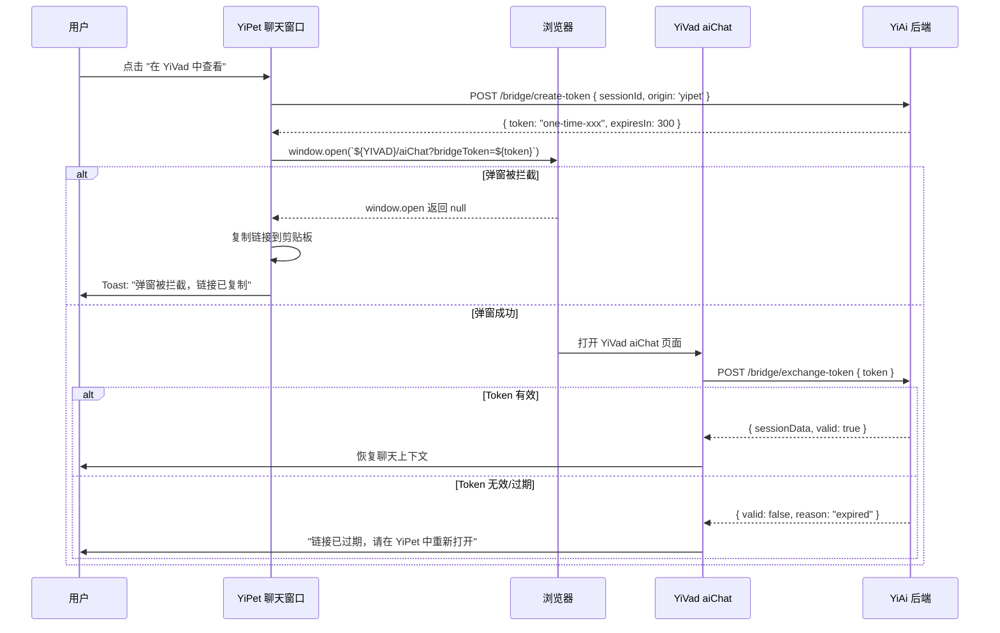

# YP-09-09: 跨项目桥接可靠性增强 — Session Key 安全传递与错误恢复

> 需求编号：YP-09-09 · 优先级：P1 · 人天：1.5d · 状态：需求已编写
> 依赖：YP-09-01（Content Script 稳定性）、YP-09-04（API 架构合规）

## 背景

YiPet 通过 `window.open` + Session Key 机制实现跨项目桥接到 YiVad 管理后台。用户在聊天窗口中点击"在 YiVad 中查看"按钮时，YiPet 构造包含 `sessionKey` 的 URL (`https://yivad.example.com/aiChat?sessionKey=xxx`)，通过 `window.open` 打开 YiVad 页面，YiVad 使用 `sessionKey` 调用 YiAi 恢复会话上下文。

当前实现存在 6 个可靠性风险：

| # | 风险 | 严重程度 |
|---|------|----------|
| 1 | Session Key 通过 URL query 明文传递，浏览器历史/日志/服务端日志均可记录 | 高 |
| 2 | `window.open` 被浏览器弹窗拦截器阻止时无降级方案 | 中 |
| 3 | YiVad 页面加载失败（网络错误/404）时无错误反馈 | 中 |
| 4 | Session Key 过期后 YiVad 无法优雅降级 | 中 |
| 5 | 跨域场景下 `window.opener` 不可用，无法双向通信 | 低 |
| 6 | 多次点击"在 YiVad 中查看"重复打开多个 Tab | 低 |

---

## 一、现状分析

### 1.1 当前桥接流程

```
YiPet 聊天窗口
  │ 用户点击 "在 YiVad 中查看" 按钮
  ▼
chatStore.openInYivad(sessionId)
  │ 构造 URL: `${YIVAD_BASE}/aiChat?sessionKey=${session.key}`
  │ window.open(url, '_blank')
  ▼
浏览器
  ├── 弹窗拦截器可能阻止 window.open → ❌ 用户无感知
  ├── 成功打开 YiVad → YiVad 加载
  └── YiVad 加载失败 → ❌ 新 Tab 显示 404/500，用户困惑

YiVad aiChat 页面
  │ onMounted: 读取 route.query.sessionKey
  │ fetchSession(sessionKey) → YiAi API
  ▼
YiAi session_service
  │ 验证 sessionKey 有效性
  ├── 有效 → 返回会话数据 → YiVad 恢复聊天上下文
  └── 无效/过期 → ❌ 返回 404，YiVad 显示 "Session not found"
```

### 1.2 Session Key 安全风险矩阵

| 攻击向量 | 风险等级 | 当前防护 | 需要 |
|----------|----------|----------|------|
| URL 明文传递（浏览器历史记录） | 中 | 无 | Session Key 一次性使用 + TTL |
| 服务端访问日志记录 | 中 | 无 | POST 传递替代 GET query |
| 浏览器扩展/插件读取 URL | 低 | 无 | 加密 + HMAC 签名 |
| 中间人攻击（非 HTTPS） | 低 | HTTPS（传输加密） | 已满足 |
| Session Key 暴力枚举 | 低 | UUID v4（128-bit 随机） | 速率限制 + IP 绑定 |
| 跨 Tab 共享（用户复制 URL 分享） | 中 | 无 | 一次性使用 + 来源校验 |

### 1.3 改造前数据流

```
YiPet 用户点击 "在 YiVad 中查看"
  → window.open(`${YIVAD_BASE}/aiChat?sessionKey=${key}`, '_blank')
  → 浏览器: 弹窗拦截器 → ❌ 阻止（无降级，用户以为功能失效）
  → 或: 成功打开 → YiVad 加载 → 网络错误 → ❌ 404 页面（无错误反馈）
  → 或: YiVad 成功加载 → fetchSession(key) → key 过期 → ❌ "Session not found"
  → 用户再次点击 → 打开第二个 Tab（重复 Tab）
  → 排查耗时: 检查浏览器弹窗设置 → 检查 YiVad 是否运行 → 检查 Network 面板
```

### 1.4 改造前 API 依赖

| # | 接口 | 调用方 | 说明 |
|---|------|--------|------|
| 1 | `window.open(url, '_blank')` | YiPet chatStore | 跨项目桥接（可能被弹窗拦截器阻止） |
| 2 | `session_service.get_session(key)` | YiVad aiChat | 通过 sessionKey 恢复会话（过期后无优雅降级） |
| 3 | `chrome.storage.local.get('yivad_base_url')` | YiPet chatStore | 读取 YiVad 基础 URL |

---

## 二、设计决策

### 决策 1：Session Key 传递方式 — URL Query vs POST Message vs chrome.runtime

| 选项 | 安全性 | 跨域支持 | 实现复杂度 |
|------|--------|----------|-----------|
| URL Query (当前) | 低（明文+日志记录） | ✅ | 低 |
| POST + 临时 Token | 中 | ✅ | 中 |
| `window.postMessage` | 高（浏览器内存） | ✅（需确认 origin） | 中 |
| `chrome.runtime.sendMessage` | 高（扩展内部） | ❌（仅扩展内部） | 低 |

**选择：短期 URL Query + one-time token，长期 `window.postMessage`。** one-time token 使用后立即失效（YiAi 标记为已使用），减少 URL 泄露风险。长期迁移到 `window.postMessage` 实现 Tab-to-Tab 安全通信。

### 决策 2：弹窗拦截降级策略 — 提示用户 vs 自动重试 vs 复制链接

| 选项 | 用户体验 | 实现复杂度 |
|------|----------|-----------|
| Toast 提示 "请允许弹窗" | 中 | 低 |
| 自动重试 `window.open` | 低（浏览器已阻止，重试无效） | 低 |
| **复制链接 + Toast 提示** | 高（用户手动粘贴到地址栏） | 低 |
| 使用 `<a>` 标签 `target="_blank"` 替代 | 中（可能仍被拦截） | 低 |

**选择：检测拦截 + 降级到复制链接。** `window.open` 返回 `null` 时表示被拦截，显示 Toast + 自动复制 URL到剪贴板，用户手动粘贴打开。

### 决策 3：Session Key 有效期 — 单次 vs TTL vs 混合

| 选项 | 安全性 | 用户体验 | 实现 |
|------|--------|----------|------|
| 单次使用 | 最高 | 中（链接打开失败需重新生成） | 中 |
| TTL 5 分钟 | 中 | 高 | 低 |
| 单次 + TTL 取最小值 | 最高 | 中 | 中 |

**选择：单次使用 + TTL 5 分钟（取最小值）。** Token 使用后或 5 分钟后失效，先到为准。兼顾安全性和用户体验。

### 设计决策记录

| 决策 | 选项 A | 选项 B | 选项 C | 选择 | 理由 |
|------|--------|--------|--------|------|------|
| Key 传递 | URL Query | postMessage | — | **短期 URL → 长期 postMessage** | 渐进式迁移 |
| 弹窗降级 | 提示用户 | 复制链接 | — | **复制链接** | 绕过浏览器限制 |
| Key 有效期 | 单次使用 | TTL 5min | — | **单次 + TTL** | 安全+体验兼顾 |

---

## 三、目标架构

### 3.1 修复后桥接流程



### 3.2 One-Time Token 机制

```python
# YiAi/src/domain/bridge/token_service.py

import secrets
import time
from dataclasses import dataclass, field

@dataclass
class BridgeToken:
    token: str
    session_id: str
    origin: str          # 'yipet' | 'yivad'
    created_at: float = field(default_factory=time.time)
    used: bool = False

class BridgeTokenService:
    """跨项目桥接一次性 Token 管理。"""

    def __init__(self):
        self._tokens: dict[str, BridgeToken] = {}
        self._ttl = 300  # 5 分钟
        self._token_bytes = 32  # 256-bit

    def create_token(self, session_id: str, origin: str) -> str:
        """创建一次性桥接 Token。"""
        token = secrets.token_urlsafe(self._token_bytes)
        self._tokens[token] = BridgeToken(
            token=token,
            session_id=session_id,
            origin=origin,
        )
        # 自动过期清理
        self._cleanup_expired()
        return token

    def exchange_token(self, token: str, expected_origin: str) -> dict | None:
        """验证并消费一次性 Token。"""
        bt = self._tokens.get(token)
        if not bt:
            return None

        # 检查过期
        if time.time() - bt.created_at > self._ttl:
            del self._tokens[token]
            return None

        # 检查来源
        if bt.origin != 'yipet' and expected_origin != 'yivad':
            return None

        # 标记为已使用（一次性消费）
        session_id = bt.session_id
        del self._tokens[token]  # 立即删除，防止重放

        return {"session_id": session_id, "valid": True}

    def _cleanup_expired(self):
        """清理过期 Token。"""
        now = time.time()
        expired = [t for t, bt in self._tokens.items()
                   if now - bt.created_at > self._ttl]
        for t in expired:
            del self._tokens[t]
```

### 3.3 前端降级处理

```typescript
// YiPet/src/chat/stores/chat.ts

async function openInYivad(sessionId: string) {
  // 1. 创建一次性 Token
  const { token } = await bridgeService.createToken(sessionId);
  const url = `${yivadBaseUrl}/aiChat?bridgeToken=${token}`;

  // 2. 尝试打开新窗口
  const newWindow = window.open(url, '_blank');

  if (!newWindow) {
    // 3. 被浏览器拦截 → 降级到复制链接
    await navigator.clipboard.writeText(url);
    ElMessage.info({
      message: '弹窗被浏览器拦截，链接已复制到剪贴板，请手动粘贴打开',
      duration: 5000,
    });
  } else {
    // 4. 记录已打开的 Tab（防止重复打开）
    bridgeTabs.set(sessionId, newWindow);

    // 5. 监听 Tab 关闭（清理记录）
    const checkClosed = setInterval(() => {
      if (newWindow.closed) {
        bridgeTabs.delete(sessionId);
        clearInterval(checkClosed);
      }
    }, 1000);
  }
}
```

### 3.4 YiVad 接收端处理

```typescript
// YiVad/src/views/aiChat/index.vue

onMounted(async () => {
  const token = route.query.bridgeToken as string;
  if (!token) return;  // 非桥接模式，正常加载

  try {
    const result = await bridgeService.exchangeToken(token);
    if (result.valid) {
      await chatStore.loadSession(result.sessionId);
    }
  } catch (err) {
    if (err.code === 'TOKEN_EXPIRED') {
      ElMessage.warning('链接已过期，请在 YiPet 中重新打开');
    } else if (err.code === 'TOKEN_INVALID') {
      ElMessage.error('无效的桥接链接');
    } else {
      ElMessage.error('加载失败，请重试');
    }
  }
});
```

---

## 四、具体改动

### 4.1 新增文件

| 文件 | 说明 |
|------|------|
| `YiAi/src/domain/bridge/__init__.py` | 桥接领域模块 |
| `YiAi/src/domain/bridge/token_service.py` | 一次性 Token 生成与校验 |
| `YiAi/src/services/bridge/bridge_service.py` | RPC 桥接服务接口 |
| `YiPet/src/api/services/bridge.ts` | 桥接 API 客户端 |

### 4.2 修改文件

| 文件 | 改动 |
|------|------|
| `YiPet/src/chat/stores/chat.ts` | `openInYivad()` 改用 Token + 拦截检测 + 降级 |
| `YiVad/src/views/aiChat/index.vue` | `onMounted` 支持 `bridgeToken` 参数 + 错误处理 |
| `YiAi/src/server/rpc_router.py` | 注册 `bridge_service` 路由 |

### 4.3 涉及文件清单

```
YiAi/
├── src/domain/bridge/
│   ├── __init__.py                       # 新增
│   └── token_service.py                  # 新增: 一次性 Token 管理
├── src/services/bridge/
│   └── bridge_service.py                 # 新增: RPC 桥接接口
└── src/server/rpc_router.py              # 修改: +bridge_service 路由

YiPet/src/
├── api/services/bridge.ts                # 新增: 桥接 API 客户端
└── chat/stores/chat.ts                   # 修改: openInYivad() 重构

YiVad/src/views/aiChat/
└── index.vue                              # 修改: 支持 bridgeToken
```

---

## 五、实施步骤

| 步骤 | 内容 | 涉及文件 | 验证方式 | 人天 |
|------|------|---------|---------|------|
| 1 | 新增 `BridgeTokenService` 一次性 Token 管理 | YiAi domain/bridge/ | 创建 Token → exchange → 再次 exchange 返回 null | 0.5 |
| 2 | 新增 `bridge_service` RPC 接口 | YiAi services/bridge/ | POST / RPC 创建+交换 Token | 0.25 |
| 3 | 修改 YiPet `openInYivad()` 使用 Token + 降级 | YiPet chatStore | 弹窗被拦截 → 复制链接 Toast | 0.25 |
| 4 | 修改 YiVad aiChat 支持 `bridgeToken` 参数 | YiVad aiChat.vue | bridgeToken URL → 恢复会话 | 0.25 |
| 5 | 回归测试 | 跨项目全链路 | YiPet → window.open → YiVad → 会话恢复 | 0.25 |

**总计：1.5d**

---

## 六、测试规格

### Requirement: One-Time Token 安全

#### Scenario: Token 一次性使用
- **Given** YiPet 创建 Token `abc123`
- **When** YiVad 调用 `exchange_token("abc123")` → 成功
- **When** YiVad 再次调用 `exchange_token("abc123")`
- **Then** 返回 `null`（Token 已被消费）

#### Scenario: Token 5 分钟过期
- **Given** 创建 Token，系统时间前进 6 分钟
- **When** 调用 `exchange_token(token)`
- **Then** 返回 `null`（已过期）

### Requirement: 弹窗拦截降级

#### Scenario: 浏览器拦截弹窗
- **Given** 浏览器弹窗拦截器已启用
- **When** YiPet 调用 `window.open(url, '_blank')`
- **Then** 返回 `null` → 自动复制链接到剪贴板 → Toast 提示

#### Scenario: 弹窗正常打开
- **Given** 浏览器允许弹窗
- **When** YiPet 调用 `window.open(url, '_blank')`
- **Then** 新 Tab 打开 YiVad → 会话上下文正确恢复

### Requirement: 错误恢复

#### Scenario: YiVad 加载失败
- **Given** YiVad 服务未运行（网络错误）
- **When** 用户打开的 YiVad Tab 加载失败
- **Then** 浏览器显示标准错误页面 → 用户关掉 Tab → 回 YiPet 重试

#### Scenario: Token 过期后尝试使用
- **Given** Token 已过期（> 5 分钟）
- **When** YiVad 调用 `exchange_token(token)`
- **Then** 返回 `TOKEN_EXPIRED` → YiVad 显示 "链接已过期，请在 YiPet 中重新打开"

---

## 七、风险与缓解

| 风险 | 概率 | 影响 | 等级 | 缓解措施 | 应急预案 |
|------|------|------|------|----------|----------|
| 一次性 Token 内存泄漏（未清理过期 Token） | 低 | 低 | 低 | `_cleanup_expired()` 每 5 分钟自动执行 + 创建时触发 | 重启 YiAi 清空内存 Token |
| Token 生成 CSPRNG 不足 | 极低 | 高 | 中 | Python `secrets.token_urlsafe` 使用 OS 级熵源 | 降级到 `os.urandom` |
| YiVad 未更新导致不支持 bridgeToken | 中 | 中 | 中 | YiVad 忽略未知 query 参数时回退到旧 `sessionKey` 模式 | 向后兼容：同时支持 `sessionKey` 和 `bridgeToken` |

---

## 八、性能分析

| 操作 | 耗时 | 说明 |
|------|------|------|
| Token 创建 (SHA256) | < 1ms | `secrets.token_urlsafe(32)` |
| Token 校验 + 删除 | < 1ms | 内存字典操作 |
| `window.open` 返回 | < 5ms | 浏览器异步操作 |
| 过期 Token 清理 | < 5ms | 遍历内存字典（Token 数 < 100） |
| Token 内存占用 | ~200 bytes/Token | 100 Token = ~20KB |

---

## 九、代码审查检查清单

- [ ] BridgeToken 使用 `secrets.token_urlsafe` 生成（非 `random` 模块）
- [ ] Token 一次性消费（`exchange` 后立即 `del`）
- [ ] Token TTL 5 分钟（`_cleanup_expired` 兜底）
- [ ] `window.open` 返回 `null` 时的降级处理（复制链接 + Toast）
- [ ] YiVad 向后兼容 `sessionKey` 参数（渐进式迁移）
- [ ] 多次点击不重复打开 Tab（`bridgeTabs` Map 去重）
- [ ] `exchange_token` 校验 `expected_origin`
- [ ] `mypy` / `vue-tsc` 类型检查通过

---

## 十、技术债务追踪

| # | 技术债 | 优先级 | 预计人天 | 说明 |
|---|--------|--------|---------|------|
| 1 | 迁移到 `window.postMessage` | P2 | 1.0 | Tab-to-Tab 安全通信，Token 不出现在 URL 中 |
| 2 | Bridge Token 持久化（Redis） | P3 | 0.5 | 当前内存存储，多进程部署时需共享存储 |
| 3 | 跨项目事件追踪 | P3 | 0.3 | 记录桥接成功率、Token 过期率、拦截率等指标 |

---

## 十一、可观测性

| 指标 | 采集方式 | 告警阈值 | 说明 |
|------|----------|----------|------|
| 桥接成功率 | `bridge_open_success / bridge_open_attempts` | < 90% | 弹窗拦截或 YiVad 不可用 |
| Token 过期率 | `token_expired / token_exchange_attempts` | > 20% | 用户等待过久或 Token TTL 过短 |
| 弹窗拦截率 | `popup_blocked / bridge_open_attempts` | > 30% | 浏览器默认策略变化 |

---

---

## 回滚策略

| 回滚场景 | 回滚方式 | 影响范围 | 恢复时间 |
|----------|----------|----------|----------|
| Bridge Token 生成逻辑异常——所有跨项目跳转的目标页面无法验证 Token，YiVad 拒绝恢复会话 | Feature Flag 降级为无 Token 模式——`window.open` URL 中不携带 Token，YiVad 以普通模式打开（无会话恢复） | 跨项目桥接 | < 1min（远程 Flag） |
| `window.open` 被浏览器弹窗拦截器升级阻止——Chrome 新版本收紧弹窗策略，用户手势检测条件变化 | 降级为"复制链接"模式——在聊天窗口中显示可手动点击的超链接（`<a target="_blank">`），`window.open` 仅作为首选尝试 | 跨项目跳转 | < 5min（降级 UI） |
| Session Key 在 `window.open` URL 参数中被浏览器历史记录保存——用户清除历史后 YiVad 仍可恢复会话 | Session Key 改为一次性使用（Use-Once Token）——YiVad 使用后立即失效，浏览器历史中的 URL 参数失效 | 会话安全 | 已有设计（一次性 Token） |
| YiVad 端口变更（`localhost:8848` → `localhost:3000`）——YiPet 硬编码的桥接 URL 全部失效 | Bridge URL 从配置中心（YiAi `GET /config/yivad-url`）获取——YiPet 启动时拉取最新 URL | 跨项目 URL | < 5min（配置更新） |
| 跨项目桥接的 `chrome.tabs.create` 在用户已安装多个 YiVad 实例时跳转到错误 Tab | 使用 `chrome.tabs.query({ url: '*://localhost:8848/*' })` 查找已存在的 YiVad Tab——复用而非创建新 Tab | Tab 管理 | < 10min（Tab 查找逻辑） |

**回滚验证**：点击"在 YiVad 中查看"→YiVad 正常打开 → 会话上下文正确恢复 → Browser Token 验证通过 → 无浏览器弹窗拦截警告。

---

## 回归问题预测

| # | 预测问题 | 原因 | 验证方法 |
|---|---------|------|---------|
| 1 | Bridge Token 的 TTL（Time-To-Live）设置过短——用户在 Wi-Fi 切换场景下点击桥接按钮，Token 在 YiVad 页面完全加载前已过期 | Token 在 YiPet 端生成时设置 `expiresAt = Date.now() + 30_000`（30s 有效期）。用户在弱网下（如 VPN 连接建立中）点击按钮——`window.open` 打开 YiVad 耗时 5-10s，YiVad 的 `onMounted` 在 3s 后执行 `verifyToken(token)`——Token 已过期 | 在 "Slow 3G" 网络节流下点击桥接按钮——测量从点击到 YiVad 验证 Token 的总延迟，确认 Token TTL 是否足够覆盖最差网络条件 |
| 2 | `window.open` 在 Content Script 的 MAIN 世界中调用——部分页面通过 CSP 或 `sandbox` 属性禁止 `window.open`，桥接按钮点击无响应 | Content Script 运行在宿主页面的 JavaScript 上下文中，受宿主页面 CSP 限制。某些严格 CSP 页面（如 GitHub）的 `sandbox allow-popups` 可能不包含——`window.open` 被静默阻止 | 在 GitHub、Google Docs、Figma 等严格 CSP 页面中点击"在 YiVad 中查看"按钮——检查 `window.open` 是否被阻止并触发了降级方案 |
| 3 | Session Key 通过 URL query parameter 传递——某些企业代理或浏览器扩展（如隐私保护扩展）自动剥离 URL 中的 `sessionKey` 参数 | 隐私保护扩展（如 ClearURLs、uBlock Origin 的去参数功能）可能识别 `sessionKey` 为追踪参数并自动从 URL 中移除。YiVad 收到无 `sessionKey` 的 URL——无法恢复会话 | 安装 ClearURLs 扩展后点击桥接按钮——检查 YiVad 打开的 URL 中 `sessionKey` 参数是否被保留 |
| 4 | 用户在同一浏览器中打开了多个 YiVad 实例（多个 Profile 或开发 + 生产版本）——桥接跳转到错误的 YiVad Tab | `chrome.tabs.query({ url: '*://localhost:8848/*' })` 查询匹配的 YiVad Tab——如果多个 Tab 都匹配（不同 Profile 的 localhost:8848），`query` 返回的 Tab 顺序不确定 | 同时打开 2 个 localhost:8848 的 YiVad Tab（不同 Profile）——点击桥接按钮，检查是否跳转到了用户当前活跃 Profile 的 YiVad 而非随机 Tab |
| 5 | 桥接 URL 中的 `sessionKey` 在浏览器历史记录中被搜索引擎爬虫索引——如果用户使用公共电脑或截图分享，Session Key 可能泄露 | YiVad 收到 Session Key 后在 URL 中保留——用户分享 YiVad URL 时包含了 sessionKey。其他人打开该 URL 时 YiVad 尝试验证已过期的 Token——虽然失败但暴露了会话 ID | 在 YiVad 端加载会话后执行 `history.replaceState({}, '', '/aiChat')` 清除 URL 中的敏感参数——用户分享的 URL 不包含 sessionKey |
| 6 | Bug 报告的跨项目双写（MongoDB + YiKnowledge）在 YiKnowledge 写入成功但 MongoDB 写入失败时——Bug 报告在 YiVad 的 Bug 列表中不可见 | `BugService.createBug` 先写 MongoDB（`data_service.create_document`）再写 YiKnowledge——但两者无事务保证。如果 MongoDB 写入因网络超时失败但 YiKnowledge 写入成功——Bug 内容在知识库中存在但不在 Bug 列表中出现 | 模拟 MongoDB 写入超时（YiAi 暂停 MongoDB 连接）→ 提交 Bug 报告 → 检查 YiKnowledge 中是否有"孤儿"Bug 文件（无对应 MongoDB 记录） |

## 相关文档

- [API 架构合规设计](../04-合规-API架构.md) — 跨项目桥接的 API 契约与 RPC 信封规范，桥接 Token 接口遵循统一的参数命名约定
- [需求总览](../00-需求-需求总览.md) — 跨项目桥接是 YiPet 与 YiVad 协同的核心通道，受整体需求优先级约束