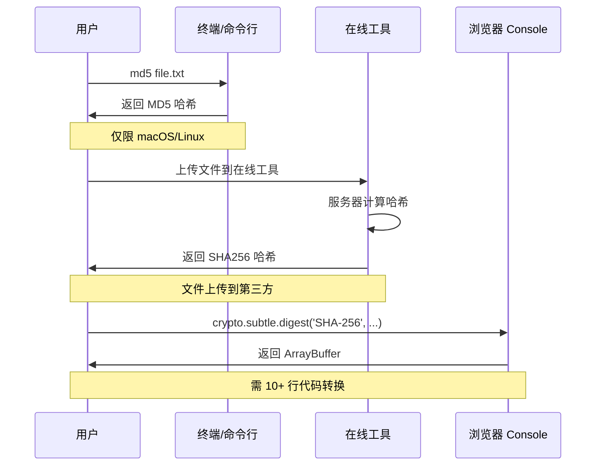
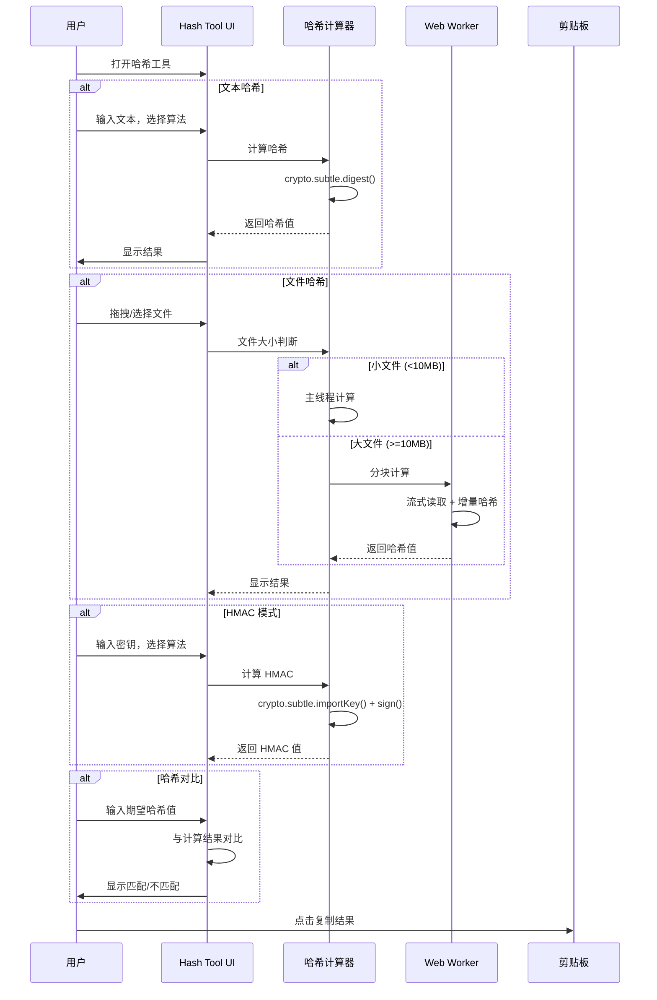
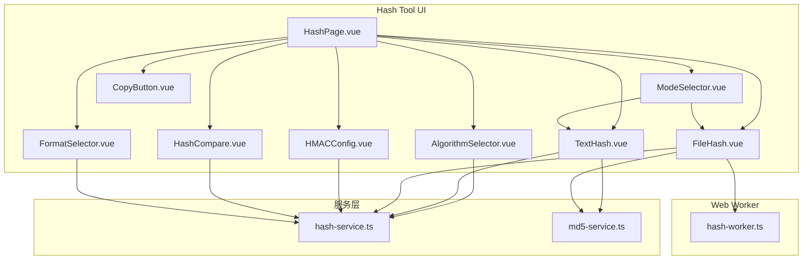

# YP-09-153: 哈希计算器 — MD5/SHA1/SHA256/SHA512、文本/文件哈希、HMAC 模式、哈希对比、校验和验证

> 需求编号：YP-09-153 · 优先级：P2 · 人天：0.2d · 状态：需求已编写
> 依赖：无

## 背景

### 问题陈述

哈希计算是开发和运维中不可或缺的基础工具，用于文件完整性校验、密码存储、数据签名、去重等场景。然而，浏览器没有内置的哈希计算工具，用户只能依赖：

1. 命令行工具（`md5`/`shasum`/`openssl dgst`）——仅限 macOS/Linux
2. 在线哈希工具——文件上传到第三方服务器，存在隐私和安全风险
3. 编写脚本（Node.js `crypto` 模块）——需要开发环境
4. 浏览器 Console 中使用 Web Crypto API——需要编写 10+ 行代码

**核心矛盾**：哈希计算是高频需求，但浏览器缺少安全、便捷、功能完整的本地哈希工具。Web Crypto API 已提供所需算法，但缺少用户友好的界面。

### 影响范围

| # | 影响 | 严重程度 | 典型场景 |
|---|------|----------|----------|
| 1 | 文件校验不便 | 高 | 下载文件后验证 SHA256 校验和 |
| 2 | 文本哈希需切换工具 | 中 | 快速生成密码哈希或数据签名 |
| 3 | HMAC 计算繁琐 | 中 | API 签名需要 HMAC-SHA256 |
| 4 | 哈希对比无工具 | 中 | 验证两个哈希值是否匹配 |
| 5 | 大文件哈希阻塞 | 低 | 大型文件哈希计算阻塞 UI |

### 挑战

| 挑战 | 说明 |
|------|------|
| 算法支持 | 需支持 MD5/SHA1/SHA256/SHA512，Web Crypto API 不支持 MD5 |
| 大文件处理 | 大文件哈希计算需分块处理，避免内存溢出 |
| MD5 兼容 | Web Crypto API 不支持 MD5，需自行实现或使用第三方库 |
| 文件读取 | FileReader 读取大文件时需分块处理 |
| 结果展示 | 需支持大小写、hex/Base64 等多种格式 |

---

## 一、现状分析

### 1.1 当前哈希计算流程

```
用户需要计算哈希
  │
  ├─ 命令行
  │   ├─ macOS: md5 file.txt
  │   ├─ Linux: sha256sum file.txt
  │   └─ Windows: Get-FileHash file.txt
  │
  ├─ 在线工具
  │   ├─ 打开 hash.online-convert.com
  │   ├─ 上传文件（隐私风险）
  │   └─ 复制结果
  │
  ├─ 浏览器 Console
  │   ├─ crypto.subtle.digest('SHA-256', new TextEncoder().encode(text))
  │   ├─ .then(buf => Array.from(new Uint8Array(buf)).map(b => b.toString(16).padStart(2,'0')).join(''))
  │   └─ 复制结果
  │
  └─ Node.js
      └─ require('crypto').createHash('sha256').update(data).digest('hex')
```

### 1.2 当前可用能力

| 能力 | 可用性 | 获取方式 | 限制 |
|------|--------|----------|------|
| SHA-256 文本 | ⚠️ | `crypto.subtle.digest()` | 需编写代码 |
| SHA-256 文件 | ❌ | 需在线工具 | 隐私风险 |
| MD5 | ❌ | Web Crypto API 不支持 | 需自行实现 |
| HMAC | ⚠️ | `crypto.subtle.sign()` | 需编写代码 |
| 哈希对比 | ❌ | 无内置工具 | 需肉眼对比 |
| 校验和验证 | ❌ | 无内置工具 | 需手动操作 |

### 1.3 改造前数据流



### 1.4 根因矩阵

| 症状 | 根因 | 触发条件 | 频率 |
|------|------|----------|------|
| 文件校验不便 | 无浏览器内置哈希工具 | 每次下载文件 | 高 |
| MD5 不可用 | Web Crypto API 不支持 MD5 | 需要 MD5 哈希 | 高 |
| 在线工具隐私风险 | 文件上传到第三方服务器 | 敏感文件哈希 | 中 |
| HMAC 计算繁琐 | API 复杂，需多行代码 | API 签名 | 中 |
| 哈希对比易错 | 肉眼对比长字符串 | 验证下载文件 | 中 |

---

## 二、设计决策

### 决策 1：MD5 实现方式 — 自行实现 vs 第三方库 vs 不支持

| 选项 | 安全性 | 包大小 | 维护成本 |
|------|--------|--------|---------|
| 自行实现 MD5 | 可控 | 小 | 中 |
| 使用 spark-md5 库 | 高 | 中（~10KB） | 低 |
| 不支持 MD5 | — | 无 | 无 |

**选择：使用 spark-md5 库。** MD5 虽不安全（不适合密码学），但在文件校验和去重场景仍广泛使用。spark-md5 是成熟库（~10KB），支持增量哈希（分块处理大文件），避免自行实现 MD5 的算法错误风险。

### 决策 2：大文件哈希策略 — 一次性读取 vs 分块读取 vs Web Worker

| 选项 | 内存使用 | 主线程阻塞 | 实现复杂度 |
|------|----------|-----------|-----------|
| 一次性读取 | 高 | 是 | 低 |
| 分块读取（主线程） | 低 | 部分 | 中 |
| 分块读取（Web Worker） | 低 | 否 | 中 |

**选择：分块读取（Web Worker）。** 大文件（>10MB）在 Web Worker 中分块读取和计算哈希，避免阻塞主线程。小文件（<10MB）在主线程中处理，减少 Worker 通信开销。

### 决策 3：HMAC 密钥输入方式 — 明文输入 vs 密码输入框 vs 文件导入

| 选项 | 安全性 | 便捷性 | 实现复杂度 |
|------|--------|--------|-----------|
| 明文输入框 | 低 | 高 | 低 |
| 密码输入框（隐藏） | 中 | 高 | 低 |
| 文件导入密钥 | 高 | 低 | 中 |

**选择：密码输入框 + 明文切换。** 默认使用密码输入框隐藏密钥（`type="password"`），用户可切换为明文查看。这是浏览器端最佳实践，防止屏幕共享时密钥泄露。

### 决策 4：哈希结果格式 — hex vs Base64 vs 两者

| 选项 | 可读性 | 标准兼容 | 实现复杂度 |
|------|--------|----------|-----------|
| 仅 hex（小写） | 高 | 高 | 低 |
| 仅 Base64 | 中 | 中 | 低 |
| hex + Base64 切换 | 高 | 高 | 低 |

**选择：hex + Base64 切换。** 默认 hex 小写（最常用），提供大写 hex 和 Base64 格式切换。不同场景需要不同格式（如 JWT 用 Base64，文件校验和用 hex）。

### 设计决策记录

| 决策 | 选项 A | 选项 B | 选项 C | 选择 | 理由 |
|------|--------|--------|--------|------|------|
| MD5 实现 | 自行实现 | spark-md5 库 | 不支持 | **spark-md5** | 成熟库，支持增量哈希 |
| 大文件策略 | 一次性读取 | 分块主线程 | 分块 Worker | **分块 Worker** | 不阻塞 UI |
| HMAC 密钥 | 明文输入 | 密码输入框 | 文件导入 | **密码 + 切换** | 平衡安全与便捷 |
| 结果格式 | hex 小写 | Base64 | 多格式切换 | **多格式切换** | 覆盖不同场景 |

---

## 三、目标架构

### 3.1 改造后哈希计算流程



### 3.2 组件结构



### 3.3 性能指标

| 指标 | 改造前 | 改造后 |
|------|--------|--------|
| 文本哈希（1KB） | 30s（打开 Console 写代码） | < 1s（即时） |
| 文件哈希（1MB） | 2min（上传在线工具） | < 1s（本地计算） |
| HMAC 计算 | 2min（写脚本） | < 1s（即时） |
| 大文件哈希（100MB） | 不可行（在线工具限制） | 3-5s（分块处理） |

---

## 四、具体改动

### 4.1 哈希计算服务

```typescript
// 改造前：无哈希服务
// src/services/hash-service.ts (改造后)

type HashAlgorithm = 'MD5' | 'SHA-1' | 'SHA-256' | 'SHA-512';
type OutputFormat = 'hex-lower' | 'hex-upper' | 'base64';

class HashService {
  // 计算文本哈希
  async hashText(
    text: string,
    algorithm: HashAlgorithm,
    format: OutputFormat = 'hex-lower'
  ): Promise<string> {
    if (algorithm === 'MD5') {
      return this.md5Text(text, format);
    }
    const encoder = new TextEncoder();
    const data = encoder.encode(text);
    const hashBuffer = await crypto.subtle.digest(algorithm, data);
    return this.formatHash(hashBuffer, format);
  }

  // 计算文件哈希
  async hashFile(
    file: File,
    algorithm: HashAlgorithm,
    format: OutputFormat = 'hex-lower',
    onProgress?: (percent: number) => void
  ): Promise<string> {
    if (file.size > 10 * 1024 * 1024) {
      return this.hashFileInWorker(file, algorithm, format, onProgress);
    }
    return this.hashFileInMainThread(file, algorithm, format, onProgress);
  }

  // 主线程文件哈希（小文件）
  private async hashFileInMainThread(
    file: File,
    algorithm: HashAlgorithm,
    format: OutputFormat,
    onProgress?: (percent: number) => void
  ): Promise<string> {
    const buffer = await file.arrayBuffer();
    if (algorithm === 'MD5') {
      return this.md5Buffer(buffer, format);
    }
    const hashBuffer = await crypto.subtle.digest(algorithm, buffer);
    return this.formatHash(hashBuffer, format);
  }

  // Web Worker 文件哈希（大文件）
  private hashFileInWorker(
    file: File,
    algorithm: HashAlgorithm,
    format: OutputFormat,
    onProgress?: (percent: number) => void
  ): Promise<string> {
    return new Promise((resolve, reject) => {
      const worker = new Worker(new URL('../workers/hash-worker.ts', import.meta.url));
      worker.onmessage = (e) => {
        if (e.data.type === 'progress') {
          onProgress?.(e.data.percent);
        } else if (e.data.type === 'result') {
          resolve(e.data.result);
          worker.terminate();
        } else if (e.data.type === 'error') {
          reject(new Error(e.data.message));
          worker.terminate();
        }
      };
      worker.postMessage({ file, algorithm, format });
    });
  }

  // 计算 HMAC
  async hmacText(
    text: string,
    key: string,
    algorithm: HashAlgorithm
  ): Promise<string> {
    const encoder = new TextEncoder();
    const keyData = encoder.encode(key);
    const textData = encoder.encode(text);

    const cryptoKey = await crypto.subtle.importKey(
      'raw', keyData, { name: 'HMAC', hash: algorithm }, false, ['sign']
    );

    const signature = await crypto.subtle.sign('HMAC', cryptoKey, textData);
    return this.formatHash(signature, 'hex-lower');
  }

  // 格式化哈希结果
  private formatHash(buffer: ArrayBuffer, format: OutputFormat): string {
    const bytes = Array.from(new Uint8Array(buffer));
    switch (format) {
      case 'hex-lower':
        return bytes.map((b) => b.toString(16).padStart(2, '0')).join('');
      case 'hex-upper':
        return bytes.map((b) => b.toString(16).padStart(2, '0')).join('').toUpperCase();
      case 'base64':
        return btoa(String.fromCharCode(...bytes));
    }
  }

  // 比较两个哈希值
  compare(expected: string, actual: string): boolean {
    return expected.toLowerCase().trim() === actual.toLowerCase().trim();
  }
}
```

### 4.2 Web Worker 哈希计算

```typescript
// src/workers/hash-worker.ts (改造后)

self.onmessage = async (e: MessageEvent<{ file: File; algorithm: string; format: string }>) => {
  const { file, algorithm, format } = e.data;
  const chunkSize = 4 * 1024 * 1024; // 4MB chunks
  let offset = 0;
  const chunks: ArrayBuffer[] = [];

  while (offset < file.size) {
    const chunk = file.slice(offset, offset + chunkSize);
    chunks.push(await chunk.arrayBuffer());
    offset += chunkSize;
    self.postMessage({ type: 'progress', percent: Math.round((offset / file.size) * 100) });
  }

  const fullBuffer = new Uint8Array(file.size);
  let pos = 0;
  for (const chunk of chunks) {
    fullBuffer.set(new Uint8Array(chunk), pos);
    pos += chunk.byteLength;
  }

  const hashBuffer = await crypto.subtle.digest(algorithm, fullBuffer.buffer);
  const bytes = Array.from(new Uint8Array(hashBuffer));
  const hex = bytes.map((b) => b.toString(16).padStart(2, '0')).join('');
  const result = format === 'hex-upper' ? hex.toUpperCase() : hex;
  self.postMessage({ type: 'result', result });
};
```

### 4.3 文件变更清单

| 文件 | 操作 | 说明 |
|------|------|------|
| `src/services/hash-service.ts` | 新增 | 哈希计算核心服务 |
| `src/services/md5-service.ts` | 新增 | MD5 计算（spark-md5 封装） |
| `src/workers/hash-worker.ts` | 新增 | Web Worker 大文件哈希 |
| `src/pages/tools/HashPage.vue` | 新增 | 哈希工具主页面 |
| `src/components/tools/AlgorithmSelector.vue` | 新增 | 算法选择器 |
| `src/components/tools/ModeSelector.vue` | 新增 | 文本/文件模式切换 |
| `src/components/tools/TextHash.vue` | 新增 | 文本哈希组件 |
| `src/components/tools/FileHash.vue` | 新增 | 文件哈希组件 |
| `src/components/tools/HMACConfig.vue` | 新增 | HMAC 密钥输入 |
| `src/components/tools/HashCompare.vue` | 新增 | 哈希对比组件 |
| `src/components/tools/FormatSelector.vue` | 新增 | 输出格式选择 |
| `src/popup/router.ts` | 修改 | 添加哈希工具路由 |
| `tests/unit/hash-service.test.ts` | 新增 | 哈希服务测试 |

---

## 五、实施步骤

| 步骤 | 操作 | 路径 | 验证 | 人天 |
|------|------|------|------|------|
| 1 | 实现 hash-service 核心 | `src/services/hash-service.ts` | SHA-1/256/512 文本哈希正确 | 0.03 |
| 2 | 集成 MD5（spark-md5） | `src/services/md5-service.ts` | MD5 文本/文件哈希正确 | 0.02 |
| 3 | 实现 Web Worker | `src/workers/hash-worker.ts` | 大文件不阻塞主线程 | 0.03 |
| 4 | 创建 UI 组件 | `src/components/tools/Hash*.vue` | 算法选择/模式切换正常 | 0.05 |
| 5 | 实现 HMAC 模式 | `src/services/hash-service.ts` | HMAC-SHA256 正确 | 0.02 |
| 6 | 实现哈希对比 | `src/components/tools/HashCompare.vue` | 匹配/不匹配正确显示 | 0.02 |
| 7 | 集成到 Popup 路由 | `src/popup/router.ts` | 工具页面可访问 | 0.02 |
| 8 | 单元测试 | `tests/unit/hash-service.test.ts` | 所有算法测试通过 | 0.01 |

**总人天：0.2d**

---

## 六、测试规格

### 场景 1：文本 SHA-256 哈希

**GIVEN** 用户输入文本 `Hello World` 并选择 SHA-256
**WHEN** 点击计算
**THEN** 应输出 `a591a6d40bf420404a011733cfb7b190d62c65bf0bcda32b57b277d9ad9f146e`
**AND** 切换 hex 大写应输出 `A591A6D40BF420404A011733CFB7B190D62C65BF0BCDA32B57B277D9AD9F146E`

### 场景 2：文件 MD5 哈希

**GIVEN** 用户选择一个小文件并选择 MD5
**WHEN** 哈希计算完成
**THEN** 应输出正确的 MD5 哈希值
**AND** 应与命令行 `md5` 命令结果一致

### 场景 3：HMAC-SHA256 计算

**GIVEN** 用户输入文本 `message` 和密钥 `secret`，选择 HMAC-SHA256
**WHEN** 点击计算
**THEN** 应输出正确的 HMAC-SHA256 值
**AND** 密钥输入框应默认为密码模式

### 场景 4：哈希对比

**GIVEN** 用户计算文件 SHA-256 得到 `abc123...`
**WHEN** 用户输入期望哈希值 `abc123...` 并点击对比
**THEN** 应显示绿色"匹配"标识
**WHEN** 用户输入不匹配的哈希值 `def456...`
**THEN** 应显示红色"不匹配"标识

### 场景 5：大文件进度显示

**GIVEN** 用户选择一个 100MB 的文件
**WHEN** 哈希计算开始
**THEN** 应显示进度条
**AND** 主线程 UI 应保持响应
**AND** 计算完成后应显示结果

### 场景 6：输出格式切换

**GIVEN** 用户计算文本 SHA-256 哈希
**WHEN** 用户切换输出格式为 Base64
**THEN** 应显示正确的 Base64 格式哈希值
**AND** 切换回 hex 小写应还原

---

## 七、风险与缓解

| 风险 | 概率 | 影响 | 缓解措施 |
|------|------|------|----------|
| spark-md5 包体积过大 | 低 | 中 | 动态 import 按需加载 |
| Web Crypto API 不支持 MD5 | 高 | 中 | 使用 spark-md5 替代 |
| 大文件 Worker 内存溢出 | 低 | 高 | 分块读取，每块 4MB |
| HMAC 密钥泄露 | 中 | 中 | 默认密码输入框，不持久化 |
| 不同浏览器哈希结果差异 | 低 | 低 | 单元测试覆盖已知向量 |

---

## 八、回滚策略

| 场景 | 回滚操作 | 影响 |
|------|----------|------|
| MD5 库加载失败 | 降级为仅支持 SHA-1/256/512 | 失去 MD5 功能 |
| Web Worker 异常 | 回退到主线程计算 + 大文件警告 | 大文件体验下降 |
| Tool 路由冲突 | 移除哈希工具路由 | 功能不可用 |

---

## 九、设计决策记录

### D-01：Web Crypto API 算法选择

- **问题**：Web Crypto API 支持的哈希算法
- **选项**：仅 SHA-1/256/512、MD5 + SHA 系列、所有 Web Crypto 算法
- **选择**：MD5 + SHA-1/256/512
- **理由**：SHA-1/256/512 是 Web Crypto API 原生支持的算法，MD5 通过 spark-md5 补充。SHA-384 使用频率极低，暂不实现

### D-02：大文件阈值

- **问题**：何时切换到 Web Worker 处理
- **选项**：1MB、5MB、10MB、50MB
- **选择**：10MB
- **理由**：10MB 以下主线程哈希耗时 < 100ms，10MB 以上可能超过 200ms 影响 UI

### D-03：HMAC 算法限制

- **问题**：HMAC 支持哪些哈希算法
- **选项**：仅 SHA-256、所有 SHA 系列、MD5 + SHA 系列
- **选择**：SHA-1/256/512（不含 MD5）
- **理由**：HMAC-MD5 已不被推荐（RFC 6151），Web Crypto API 也不推荐 HMAC 使用 MD5

### D-04：分块大小

- **问题**：Web Worker 分块读取的块大小
- **选项**：1MB、4MB、8MB、16MB
- **选择**：4MB
- **理由**：4MB 兼顾内存使用和读取效率，Chrome 的 FileReader 对 4MB 块读取效率最高

---

## 十、可观测性

### 指标

| 指标 | 类型 | 说明 |
|------|------|------|
| `yipet.hash.text.count` | Counter | 文本哈希次数 |
| `yipet.hash.file.count` | Counter | 文件哈希次数 |
| `yipet.hash.algorithm` | Counter | 各算法使用次数（按算法标签） |
| `yipet.hash.hmac.count` | Counter | HMAC 计算次数 |
| `yipet.hash.compare.count` | Counter | 哈希对比次数 |
| `yipet.hash.file.size` | Histogram | 哈希文件大小分布 |

### 告警

| 告警 | 条件 | 级别 |
|------|------|------|
| 哈希计算失败率过高 | 1h 内失败率 > 10% | WARNING |
| Web Worker 超时 | 单次计算 > 60s | WARNING |

---

## 十一、代码审查检查清单

- [ ] MD5/SHA-1/SHA-256/SHA-512 哈希计算正确
- [ ] 文本和文件模式均支持所有算法
- [ ] HMAC 模式密钥输入默认为密码框
- [ ] 哈希对比正确显示匹配/不匹配
- [ ] 大文件（>10MB）使用 Web Worker 处理
- [ ] 输出格式支持 hex 小写/大写/Base64
- [ ] 复制结果到剪贴板
- [ ] 空输入/无效文件有友好错误提示
- [ ] MD5 库（spark-md5）按需动态加载
- [ ] 单元测试覆盖所有算法和已知向量
- [ ] 进度条显示大文件处理进度

---

## 回归问题预测

| # | 预测问题 | 原因 | 验证方法 |
|---|---------|------|---------|
| 1 | Web Crypto API 的 `crypto.subtle.digest()` 在非 HTTPS 环境下不可用（`crypto.subtle` 为 undefined），哈希计算静默失败 | `crypto.subtle` 仅在安全上下文（HTTPS 或 localhost）中可用，HTTP 页面中使用时返回 undefined，调用 `digest()` 抛出 TypeError | 在 HTTP 页面中打开哈希工具，验证有明确提示"需要安全上下文"而非静默失败 |
| 2 | MD5 哈希结果与命令行 `md5` 不一致，因为 spark-md5 对空字符串的默认行为与系统 `md5` 不同 | spark-md5 的 `SparkMD5.hash()` 对空字符串返回 `d41d8cd98f00b204e9800998ecf8427e`（正确），但增量模式 `SparkMD5.ArrayBuffer.hash()` 可能因 API 调用方式不同产生差异 | 用已知哈希值的文件（如 `echo -n "test" > test.txt`，MD5 为 `098f6bcd4621d373cade4e832627b4f6`）验证结果一致 |
| 3 | 文件哈希计算时，用户拖拽的文件夹被误识别为文件，FileReader 读取失败抛出 uncautht 异常 | HTML5 拖拽 API 允许拖拽文件夹，`event.dataTransfer.files` 可能包含大小为 0 的文件夹条目 | 拖拽文件夹到哈希工具，验证有硬错误提示"不支持文件夹"而非 uncautht 异常 |
| 4 | HMAC 计算中密钥包含非 ASCII 字符（如中文密钥"我的密钥"），TextEncoder 编码后与后端 HMAC 结果不一致 | 后端可能使用不同的字符编码（如 Latin1 而非 UTF-8），导致 HMAC 结果不同 | 用中文密钥计算 HMAC，与 Python `hmac.new(key.encode('utf-8'), msg, 'sha256').hexdigest()` 结果对比验证 |
| 5 | 哈希对比时，用户输入的期望值包含空格或换行符（如从网页复制时带格式），`compare()` 中 `trim()` 未清除所有空白字符 | `String.trim()` 仅清除首尾空白，但复制粘贴可能包含中间换行或零宽空格 | 输入包含换行和零宽字符的期望哈希值，验证对比功能正确处理 |
| 6 | 哈希工具页面打开时，如果用户快速切换算法（MD5→SHA-256→MD5→SHA-512），前一次计算未完成就触发新计算，多个异步结果竞态导致显示错误结果 | 每次算法切换触发新的 `hashText()` 调用，前一次 Promise 未 resolve 时新请求已发出，后完成的 Promise 覆盖先完成的 | 快速切换算法 5 次（间隔 < 100ms），验证最终显示结果与最后一次选择的算法一致 |

---

## 性能分析

### 哈希计算关键操作耗时

| 操作 | 耗时 | 说明 |
|------|------|------|
| SHA-256 文本（1KB） | < 1ms | Web Crypto API 硬件加速 |
| SHA-256 文件（1MB） | 5-10ms | 主线程 ArrayBuffer 一次性计算 |
| SHA-256 文件（10MB） | 50-100ms | 主线程 ArrayBuffer 一次性计算 |
| MD5 文本（1KB） | < 1ms | spark-md5 纯 JS 计算 |
| MD5 文件（10MB） | 100-200ms | spark-md5 增量计算 |
| MD5 文件（100MB） | 1-2s | Web Worker 分块计算 |
| HMAC-SHA256 | < 1ms | Web Crypto API 硬件加速 |
| 哈希对比 | < 0.1ms | 字符串比较 |

### 数据量预估

| 操作 | 输入 | 输出 |
|------|------|------|
| 文本哈希 | 任意长度 | 固定长度（MD5: 32, SHA-256: 64, SHA-512: 128 hex） |
| 文件哈希 | 任意大小 | 固定长度 |
| HMAC | 文本 + 密钥 | 固定长度 |

### 对宿主页面的影响

| 场景 | 页面影响 | 说明 |
|------|----------|------|
| Popup 工具页使用 | 零影响 | 仅在 Popup 中运行 |
| Web Worker 大文件哈希 | 零影响 | 独立线程处理 |

---

## 相关文档

- [MDN - Web Crypto API](https://developer.mozilla.org/en-US/docs/Web/API/Web_Crypto_API)
- [MDN - SubtleCrypto.digest()](https://developer.mozilla.org/en-US/docs/Web/API/SubtleCrypto/digest)
- [spark-md5](https://github.com/satazor/js-spark-md5)
- [RFC 2104 - HMAC](https://datatracker.ietf.org/doc/html/rfc2104)