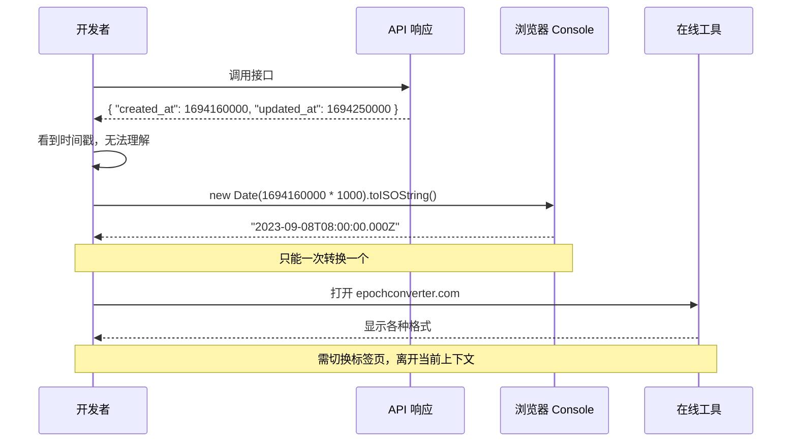
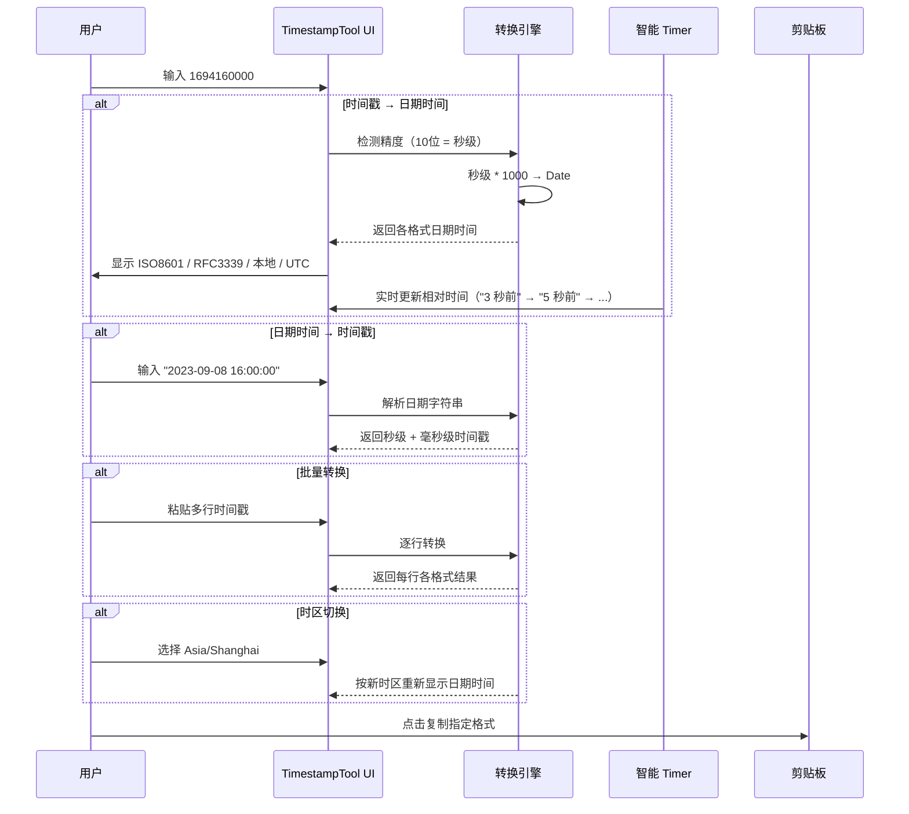
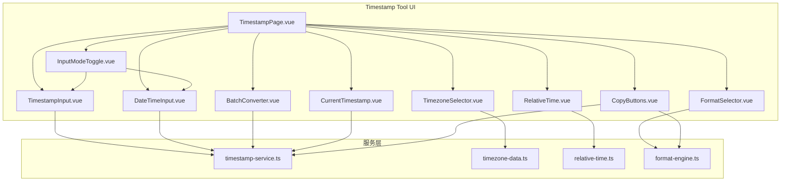

# YP-09-154: 时间戳转换器 — Unix 时间戳与日期时间互转、时区支持、相对时间显示、批量转换、当前时间戳显示、ISO8601/RFC3339 格式、一键复制

> 需求编号：YP-09-154 · 优先级：P2 · 人天：0.2d · 状态：需求已编写
> 依赖：无

## 背景

### 问题陈述

时间戳转换是开发和运维中最高频的基础操作之一。开发者在调试日志、处理 API 响应、排查数据库记录时，经常需要将 Unix 时间戳转换为可读的日期时间，或反向操作。然而，浏览器没有内置的时间戳转换工具，用户只能依赖：

1. 命令行工具（`date -r 1694160000`）——仅限 macOS/Linux
2. 在线工具（epochconverter.com）——需要切换标签页，且无法批量处理
3. 浏览器 Console（`new Date(1694160000 * 1000).toISOString()`）——需要编写代码
4. IDE 插件（VS Code 时间戳转换）——仅限开发环境，且功能有限

**核心矛盾**：时间戳转换是每日常规操作（日均 5-10 次），但每次都需要离开浏览器或编写临时代码。更关键的是，当前无工具能同时满足"即时转换 + 时区支持 + 相对时间 + 批量处理 + 多种格式输出"的完整需求。

### 影响范围

| # | 影响 | 严重程度 | 典型场景 |
|---|------|----------|----------|
| 1 | 调试效率低下 | 高 | 查看 API 返回的 `created_at: 1694160000`，需要切换工具转译 |
| 2 | 时区混淆 | 高 | 后端 UTC 时间戳在不同时区的客户端显示错误 |
| 3 | 相对时间难以计算 | 中 | "这条日志是多久以前产生的"无法快速判断 |
| 4 | 批量转换不便 | 中 | 日志中有 10 个时间戳需要转译，需要一个一个处理 |
| 5 | 格式标准不一致 | 中 | API 文档中的时间格式（ISO8601 / RFC3339 / Unix）反复转换 |

### 挑战

| 挑战 | 说明 |
|------|------|
| 精度处理 | Unix 时间戳可能是秒级（10 位）或毫秒级（13 位），需自动识别 |
| 时区计算 | JavaScript Date 基于本地时区，需支持 UTC 和任意时区显示 |
| 相对时间 | "3 分钟前"需要实时更新，且中英文表述不同 |
| 批量转换 | 需支持粘贴多行时间戳，每行独立转换 |
| 格式兼容 | 需支持 ISO8601、RFC3339、RFC2822、自定义格式输出 |

---

## 一、现状分析

### 1.1 当前时间戳转换流程

```
开发者需要转换时间戳
  │
  ├─ 命令行
  │   ├─ macOS: date -r 1694160000
  │   ├─ Linux: date -d @1694160000
  │   └─ Windows: 无内置命令
  │
  ├─ 在线工具
  │   ├─ 打开 epochconverter.com
  │   ├─ 粘贴时间戳
  │   ├─ 查看结果
  │   └─ 手动选择时区
  │
  ├─ 浏览器 Console
  │   ├─ new Date(1694160000 * 1000)
  │   ├─ .toISOString()
  │   └─ 手动调整时区
  │
  └─ 脑内计算
      └─ "1694160000...大概就是2023年9月？不确定"
```

### 1.2 当前可用能力

| 能力 | 可用性 | 获取方式 | 限制 |
|------|--------|----------|------|
| 时间戳→日期 | ⚠️ | Console 或在线工具 | 需编写代码或切换工具 |
| 日期→时间戳 | ⚠️ | Console: `new Date('2023-09-08').getTime()/1000` | 需编写代码 |
| 相对时间 | ❌ | 人工计算 | 不准确 |
| 时区转换 | ⚠️ | 在线工具 | 需要联网 |
| 批量转换 | ❌ | 无内置工具 | 需逐个处理 |
| 当前时间戳 | ⚠️ | Console: `Date.now()` | 需编写代码 |

### 1.3 改造前数据流



### 1.4 根因矩阵

| 症状 | 根因 | 触发条件 | 频率 |
|------|------|----------|------|
| 时间戳不可读 | 无浏览器内置转换器 | 每次查看 API 返回的时间戳 | 高（日均 5-10 次） |
| 时区混乱 | JavaScript Date 默认使用本地时区 | 查看 UTC 时间戳时 | 高 |
| 批量转换低效 | 现有工具不支持批量 | 日志/数据导出包含多个时间戳 | 中 |
| 相对时间不清楚 | 需人工计算时间差 | 查看事件发生时间 | 中 |
| 格式不统一 | 不同系统要求不同时间格式 | 编写 API 文档或配置文件 | 中 |

---

## 二、设计决策

### 决策 1：时间戳精度识别 — 自动检测 vs 手动指定 vs 两种模式

| 选项 | 易用性 | 准确性 | 实现复杂度 |
|------|--------|--------|-----------|
| 自动检测（10 位 = 秒，13 位 = 毫秒） | 高 | 高（边界模糊时有误判风险） | 低 |
| 手动指定 | 中 | 高 | 低 |
| 自动检测 + 手动覆盖 | 高 | 高 | 低 |

**选择：自动检测 + 手动覆盖。** 默认根据输入位数自动判断（10 位秒、13 位毫秒、16 位微秒），用户可通过 toggle 强制指定精度。覆盖 99.9% 场景的同时保留兜底能力。

### 决策 2：时区处理 — 仅 UTC vs 仅本地时区 vs UTC + 任意时区

| 选项 | 实用性 | 实现复杂度 | 包体积 |
|------|--------|-----------|--------|
| 仅 UTC | 中 | 低 | 无额外 |
| 仅本地时区（`Intl.DateTimeFormat`） | 中 | 低 | 无额外 |
| UTC + 本地时区 + 任意时区选择 | 高 | 中 | ~30KB（时区数据） |

**选择：UTC + 本地时区 + 常用时区。** 使用 `Intl.DateTimeFormat().resolvedOptions().timeZone` 获取本地时区，结合 `Intl` API 支持 UTC 和约 20 个常用时区（Asia/Shanghai、America/New_York、Europe/London 等），无需引入 moment-timezone 等重型库。

### 决策 3：相对时间更新 — 静态计算 vs 实时更新 vs 用户触发更新

| 选项 | 资源消耗 | 准确性 | 用户体验 |
|------|----------|--------|---------|
| 静态计算（点击时一次） | 零 | 中（过期） | 可用 |
| 实时更新（setInterval 1s） | 低 | 高 | 好 |
| 用户触发更新（刷新按钮） | 零 | 低 | 差 |

**选择：实时更新（智能间隔）。** 1 分钟内每 1 秒更新，1 小时内每分钟更新，超过 1 天停止更新。Popup 关闭时自动清除 timer。reactivity 开销可忽略（仅更新一个文本节点）。

### 决策 4：自定义格式化 — 简单模板 vs 完整格式化 vs 预设格式

| 选项 | 灵活性 | 易用性 | 实现复杂度 |
|------|--------|--------|-----------|
| 仅预设格式（ISO8601/RFC3339/RFC2822） | 低 | 高 | 低 |
| 自定义模板（YYYY-MM-DD HH:mm:ss） | 高 | 中 | 中 |
| 预设格式 + 自定义模板 | 高 | 高 | 中 |

**选择：预设格式 + 自定义模板。** 提供 6 个预设格式（ISO8601、RFC3339、RFC2822、中国标准、美国标准、紧凑格式），同时支持自定义模板语法（YYYY、MM、DD、HH、mm、ss、SSS）。

### 设计决策记录

| 决策 | 选项 A | 选项 B | 选项 C | 选择 | 理由 |
|------|--------|--------|--------|------|------|
| 精度识别 | 自动检测 | 手动指定 | 两种 | **自动+手动** | 默认智能+兜底 |
| 时区处理 | 仅 UTC | 仅本地 | 多时区 | **多时区** | 覆盖主流场景 |
| 相对时间 | 静态 | 实时 | 手动 | **智能实时** | 体验好开销低 |
| 格式化 | 预设 | 自定义 | 预设+自定义 | **预设+自定义** | 兼顾便捷灵活 |

---

## 三、目标架构

### 3.1 改造后时间戳转换流程



### 3.2 组件结构



### 3.3 性能指标

| 指标 | 改造前 | 改造后 |
|------|--------|--------|
| 单次时间戳转换 | 15s（打开 Console + 写代码） | < 0.1s（即时） |
| 批量 100 个时间戳 | 不可行（逐个手动处理） | < 1s（自动批量） |
| 时区转换 | 30s（在线工具） | < 0.1s（本地计算） |
| 当前时间戳获取 | 5s（Console: Date.now()） | < 0.1s（自动显示） |

---

## 四、具体改动

### 4.1 时间戳转换核心服务

```typescript
// 改造前：无时间戳转换服务
// src/services/timestamp-service.ts (改造后)

type TimestampPrecision = 'auto' | 'second' | 'millisecond' | 'microsecond';
type TimezoneName = string; // IANA 时区名称

interface ConversionResult {
  original: string;
  timestampSeconds: number;
  timestampMilliseconds: number;
  dateUTC: Date;
  iso8601: string;
  rfc3339: string;
  rfc2822: string;
  local: string;       // 本地时区格式化
  custom: string;      // 自定义格式
}

class TimestampService {
  // 自动检测精度
  detectPrecision(input: string): TimestampPrecision {
    const digits = input.replace(/[^0-9]/g, '');
    if (digits.length <= 10) return 'second';
    if (digits.length <= 13) return 'millisecond';
    return 'microsecond';
  }

  // 时间戳 → 日期时间
  timestampToDate(
    input: string,
    precision: TimestampPrecision = 'auto',
    timezone: TimezoneName = 'UTC',
    customFormat?: string
  ): ConversionResult {
    const actualPrecision = precision === 'auto' ? this.detectPrecision(input) : precision;
    const ms = this.toMilliseconds(Number(input), actualPrecision);
    const date = new Date(ms);

    return {
      original: input,
      timestampSeconds: Math.floor(ms / 1000),
      timestampMilliseconds: ms,
      dateUTC: date,
      iso8601: date.toISOString(),
      rfc3339: this.formatRFC3339(date),
      rfc2822: date.toUTCString(),
      local: this.formatInTimezone(date, timezone, 'YYYY-MM-DD HH:mm:ss'),
      custom: customFormat ? this.formatCustom(date, timezone, customFormat) : '',
    };
  }

  // 日期时间 → 时间戳
  dateToTimestamp(
    dateInput: string,
    timezone: TimezoneName = 'UTC'
  ): { seconds: number; milliseconds: number; iso8601: string } {
    const date = new Date(dateInput);
    if (isNaN(date.getTime())) {
      throw new Error(`无法解析日期: ${dateInput}`);
    }
    const ms = date.getTime();
    return {
      seconds: Math.floor(ms / 1000),
      milliseconds: ms,
      iso8601: date.toISOString(),
    };
  }

  // 批量转换
  batchConvert(
    inputs: string[],
    precision: TimestampPrecision = 'auto',
    timezone: TimezoneName = 'UTC'
  ): ConversionResult[] {
    return inputs
      .map((input) => input.trim())
      .filter((input) => input.length > 0)
      .map((input) => {
        try {
          return this.timestampToDate(input, precision, timezone);
        } catch {
          return null;
        }
      })
      .filter((r): r is ConversionResult => r !== null);
  }

  // 获取当前时间戳
  getCurrentTimestamp(): { seconds: number; milliseconds: number; iso8601: string } {
    const now = Date.now();
    return {
      seconds: Math.floor(now / 1000),
      milliseconds: now,
      iso8601: new Date(now).toISOString(),
    };
  }

  // 格式化 RFC3339
  private formatRFC3339(date: Date): string {
    const pad = (n: number) => n.toString().padStart(2, '0');
    const tz = 'Z';
    return `${date.getUTCFullYear()}-${pad(date.getUTCMonth() + 1)}-${pad(date.getUTCDate())}T${pad(date.getUTCHours())}:${pad(date.getUTCMinutes())}:${pad(date.getUTCSeconds())}${tz}`;
  }

  // 时区格式化
  private formatInTimezone(date: Date, timezone: TimezoneName, format: string): string {
    try {
      const options: Intl.DateTimeFormatOptions = {
        timeZone: timezone,
        year: 'numeric', month: '2-digit', day: '2-digit',
        hour: '2-digit', minute: '2-digit', second: '2-digit',
        hour12: false,
      };
      const parts = new Intl.DateTimeFormat('en-CA', options).formatToParts(date);
      // 使用 Intl API 逐个部件提取并组合
      const values: Record<string, string> = {};
      parts.forEach(({ type, value }) => { values[type] = value; });
      return `${values.year}-${values.month}-${values.day} ${values.hour}:${values.minute}:${values.second}`;
    } catch {
      return date.toISOString();
    }
  }

  // 自定义格式引擎
  private formatCustom(date: Date, timezone: TimezoneName, format: string): string {
    const utc = timezone === 'UTC';
    const y = utc ? date.getUTCFullYear() : date.getFullYear();
    const m = utc ? date.getUTCMonth() + 1 : date.getMonth() + 1;
    const d = utc ? date.getUTCDate() : date.getDate();
    const h = utc ? date.getUTCHours() : date.getHours();
    const min = utc ? date.getUTCMinutes() : date.getMinutes();
    const s = utc ? date.getUTCSeconds() : date.getSeconds();
    const ms = utc ? date.getUTCMilliseconds() : date.getMilliseconds();

    const pad = (n: number, len = 2) => n.toString().padStart(len, '0');

    return format
      .replace('YYYY', y.toString())
      .replace('YY', y.toString().slice(-2))
      .replace('MM', pad(m))
      .replace('DD', pad(d))
      .replace('HH', pad(h))
      .replace('mm', pad(min))
      .replace('ss', pad(s))
      .replace('SSS', pad(ms, 3));
  }

  // 精度转换辅助
  private toMilliseconds(value: number, precision: TimestampPrecision): number {
    switch (precision) {
      case 'second': return value * 1000;
      case 'millisecond': return value;
      case 'microsecond': return Math.floor(value / 1000);
      default: return value;
    }
  }
}
```

### 4.2 相对时间服务

```typescript
// src/services/relative-time.ts (改造后)

type RelativeTimeUnit = 'just_now' | 'seconds' | 'minutes' | 'hours' | 'days' | 'weeks' | 'months' | 'years';

interface RelativeTimeResult {
  text: string;       // "3 分钟前"
  unit: RelativeTimeUnit;
  value: number;
}

class RelativeTimeService {
  private readonly MS_SECOND = 1000;
  private readonly MS_MINUTE = 60 * 1000;
  private readonly MS_HOUR = 60 * 60 * 1000;
  private readonly MS_DAY = 24 * 60 * 60 * 1000;
  private readonly MS_WEEK = 7 * 24 * 60 * 60 * 1000;
  private readonly MS_MONTH = 30 * 24 * 60 * 60 * 1000;
  private readonly MS_YEAR = 365 * 24 * 60 * 60 * 1000;

  getRelative(timestamp: number, lang: 'zh' | 'en' = 'zh'): RelativeTimeResult {
    const now = Date.now();
    const diff = now - timestamp;
    const absDiff = Math.abs(diff);
    const isPast = diff > 0;

    const i18n = {
      zh: {
        just_now: '刚刚',
        seconds_ago: (n: number) => `${n} 秒前`,
        seconds_future: (n: number) => `${n} 秒后`,
        minutes_ago: (n: number) => `${n} 分钟前`,
        minutes_future: (n: number) => `${n} 分钟后`,
        hours_ago: (n: number) => `${n} 小时前`,
        hours_future: (n: number) => `${n} 小时后`,
        days_ago: (n: number) => `${n} 天前`,
        days_future: (n: number) => `${n} 天后`,
        weeks_ago: (n: number) => `${n} 周前`,
        weeks_future: (n: number) => `${n} 周后`,
        months_ago: (n: number) => `${n} 个月前`,
        months_future: (n: number) => `${n} 个月后`,
        years_ago: (n: number) => `${n} 年前`,
        years_future: (n: number) => `${n} 年后`,
      },
      en: {
        just_now: 'just now',
        seconds_ago: (n: number) => `${n}s ago`,
        seconds_future: (n: number) => `in ${n}s`,
        minutes_ago: (n: number) => `${n}m ago`,
        minutes_future: (n: number) => `in ${n}m`,
        hours_ago: (n: number) => `${n}h ago`,
        hours_future: (n: number) => `in ${n}h`,
        days_ago: (n: number) => `${n}d ago`,
        days_future: (n: number) => `in ${n}d`,
        weeks_ago: (n: number) => `${n}w ago`,
        weeks_future: (n: number) => `in ${n}w`,
        months_ago: (n: number) => `${n}mo ago`,
        months_future: (n: number) => `in ${n}mo`,
        years_ago: (n: number) => `${n}y ago`,
        years_future: (n: number) => `in ${n}y`,
      },
    };

    const t = i18n[lang];
    const key = isPast ? 'ago' : 'future';

    if (absDiff < this.MS_MINUTE) {
      return { text: t.just_now, unit: 'just_now', value: 0 };
    }
    if (absDiff < this.MS_HOUR) {
      const v = Math.floor(absDiff / this.MS_MINUTE);
      return { text: t[`minutes_${key}`](v), unit: 'minutes', value: v };
    }
    if (absDiff < this.MS_DAY) {
      const v = Math.floor(absDiff / this.MS_HOUR);
      return { text: t[`hours_${key}`](v), unit: 'hours', value: v };
    }
    if (absDiff < this.MS_WEEK) {
      const v = Math.floor(absDiff / this.MS_DAY);
      return { text: t[`days_${key}`](v), unit: 'days', value: v };
    }
    if (absDiff < this.MS_MONTH) {
      const v = Math.floor(absDiff / this.MS_WEEK);
      return { text: t[`weeks_${key}`](v), unit: 'weeks', value: v };
    }
    if (absDiff < this.MS_YEAR) {
      const v = Math.floor(absDiff / this.MS_MONTH);
      return { text: t[`months_${key}`](v), unit: 'months', value: v };
    }
    const v = Math.floor(absDiff / this.MS_YEAR);
    return { text: t[`years_${key}`](v), unit: 'years', value: v };
  }

  // 获取智能更新间隔
  getUpdateInterval(timestamp: number): number | null {
    const diff = Math.abs(Date.now() - timestamp);
    if (diff < 60 * 1000) return 1000;    // 1 分钟内每秒更新
    if (diff < 60 * 60 * 1000) return 60 * 1000;  // 1 小时内每分钟更新
    if (diff < 24 * 60 * 60 * 1000) return 5 * 60 * 1000;  // 1 天内每 5 分钟更新
    return null;  // 超过 1 天停止更新
  }
}
```

### 4.3 文件变更清单

| 文件 | 操作 | 说明 |
|------|------|------|
| `src/services/timestamp-service.ts` | 新增 | 时间戳转换核心服务 |
| `src/services/relative-time.ts` | 新增 | 相对时间计算服务 |
| `src/services/timezone-data.ts` | 新增 | 常用时区数据 |
| `src/services/format-engine.ts` | 新增 | 自定义格式化引擎 |
| `src/pages/tools/TimestampPage.vue` | 新增 | 时间戳转换主页面 |
| `src/components/tools/InputModeToggle.vue` | 新增 | 输入模式切换（时间戳/日期） |
| `src/components/tools/TimestampInput.vue` | 新增 | 时间戳输入和精度控制 |
| `src/components/tools/DateTimeInput.vue` | 新增 | 日期时间输入（含日历选择器） |
| `src/components/tools/TimezoneSelector.vue` | 新增 | 时区选择器（常用时区） |
| `src/components/tools/FormatSelector.vue` | 新增 | 输出格式选择和自定义模板 |
| `src/components/tools/BatchConverter.vue` | 新增 | 批量时间戳转换 |
| `src/components/tools/CurrentTimestamp.vue` | 新增 | 当前时间戳实时显示 |
| `src/components/tools/RelativeTime.vue` | 新增 | 相对时间显示和实时更新 |
| `src/components/tools/CopyButtons.vue` | 新增 | 各格式一键复制按钮 |
| `src/popup/router.ts` | 修改 | 添加时间戳转换工具路由 |
| `tests/unit/timestamp-service.test.ts` | 新增 | 时间戳服务测试 |

---

## 五、实施步骤

| 步骤 | 操作 | 路径 | 验证 | 人天 |
|------|------|------|------|------|
| 1 | 实现 timestamp-service 核心 | `src/services/timestamp-service.ts` | 秒/毫秒/微秒时间戳转日期正确 | 0.03 |
| 2 | 实现相对时间服务 | `src/services/relative-time.ts` | 中英文相对时间正确 | 0.02 |
| 3 | 准备时区数据和格式化引擎 | `src/services/timezone-data.ts`, `format-engine.ts` | 20 个常用时区可用 | 0.02 |
| 4 | 创建主 UI 组件 | `src/pages/tools/TimestampPage.vue` | 输入输出交互正常 | 0.04 |
| 5 | 实现批量转换 | `src/components/tools/BatchConverter.vue` | 批量 100 行正确转换 | 0.03 |
| 6 | 实现当前时间戳和相对时间 | `CurrentTimestamp.vue`, `RelativeTime.vue` | 实时更新正常 | 0.03 |
| 7 | 集成到 Popup 路由 | `src/popup/router.ts` | 工具页面可访问 | 0.02 |
| 8 | 单元测试 | `tests/unit/timestamp-service.test.ts` | 所有格式和时区测试通过 | 0.01 |

**总人天：0.2d**

---

## 六、测试规格

### 场景 1：秒级时间戳转日期

**GIVEN** 用户输入秒级时间戳 `1694160000`
**WHEN** 系统自动检测为秒级精度并转换
**THEN** UTC 时间应显示 `2023-09-08T08:00:00.000Z`
**AND** 毫秒级时间戳应为 `1694160000000`
**AND** 本地时间（Asia/Shanghai）应显示 `2023-09-08 16:00:00`

### 场景 2：毫秒级时间戳转日期

**GIVEN** 用户输入毫秒级时间戳 `1694160000000`
**WHEN** 系统自动检测为毫秒级精度并转换
**THEN** UTC 时间应显示 `2023-09-08T08:00:00.000Z`
**AND** 秒级时间戳应为 `1694160000`

### 场景 3：日期时间转时间戳

**GIVEN** 用户切换到"日期→时间戳"模式
**WHEN** 输入 `2023-09-08 16:00:00`，选择时区 Asia/Shanghai
**THEN** 秒级时间戳应为 `1694160000`
**AND** 毫秒级时间戳应为 `1694160000000`

### 场景 4：批量转换

**GIVEN** 用户粘贴多行数据（含时间戳和空行）
```
1694160000
1694250000

1694340000
```
**WHEN** 执行批量转换
**THEN** 应输出 3 行转换结果（空行被忽略）
**AND** 每行应包含原时间戳和对应的日期时间

### 场景 5：相对时间实时更新

**GIVEN** 用户输入一个 5 秒前的时间戳
**WHEN** 页面显示结果
**THEN** 应显示 "5 秒前"
**AND** 1 秒后应更新为 "6 秒前"
**AND** 60 秒后应更新为 "1 分钟前"
**AND** Popup 关闭后 timer 应停止

### 场景 6：时区切换和自定义格式

**GIVEN** 用户输入时间戳 `1694160000`
**WHEN** 切换时区到 America/New_York
**THEN** 应显示 `2023-09-08 04:00:00`（EDT）
**WHEN** 用户输入自定义格式 `DD/MM/YYYY HH:mm`
**THEN** 应显示 `08/09/2023 08:00`（UTC）

---

## 七、风险与缓解

| 风险 | 概率 | 影响 | 缓解措施 |
|------|------|------|----------|
| Intl.DateTimeFormat 在老浏览器不支持 | 低 | 中 | 降级到 `Date.toLocaleString()` + 已知时区映射表 |
| 微秒级时间戳溢出 | 低 | 低 | JavaScript Number 安全整数范围（±2^53），超范围时提示 |
| 日期字符串解析歧义（`01/02/2023`） | 中 | 中 | 推荐 ISO8601 格式输入，非标准格式给出警告 |
| 相对时间 timer 泄漏（Popup 异常关闭） | 中 | 中 | `onUnmounted` 中清除 timer；Popup 关闭事件监听 |
| 时区数据包体积过大 | 中 | 中 | 仅打包 20 个常用时区，完整列表通过 CDN 按需加载 |

---

## 八、回滚策略

| 场景 | 回滚操作 | 影响 |
|------|----------|------|
| 批量转换性能不足 | 限制批量上限 50 行，超过则分批 | 大容量场景体验下降 |
| 相对时间更新导致 CPU 占用 | 降级为静态计算，手动刷新 | 失去实时更新特性 |
| Intl API 时区功能异常 | 降级为仅 UTC + 本地时区 | 失去多时区支持 |
| 工具路由冲突 | 移除时间戳工具路由 | 功能不可用 |

---

## 九、设计决策记录

### D-01：默认时区选择

- **问题**：默认时区是 UTC 还是本地时区
- **选项**：UTC、本地时区、记住上次选择
- **选择**：本地时区（首次），记住上次选择
- **理由**：开发者通常关心自己的时区，本地时区作为默认更符合直觉。记住选择提升重复使用体验

### D-02：日期输入方式

- **问题**：日期输入使用文本框还是日历选择器
- **选项**：仅文本框、仅日历选择器、文本框 + 日历选择器
- **选择**：文本框 + 日历选择器
- **理由**：文本框适合精确输入 ISO8601 格式，日历选择器适合快速选择日期。两个入口互补

### D-03：复制按钮行为

- **问题**：复制按钮是复制单一格式还是可配置
- **选项**：每个格式独立复制按钮、一个复制按钮（最后选择的格式）、可配置默认格式
- **选择**：每个格式独立复制按钮
- **理由**：不同格式用途不同，独立按钮避免多余点击。6 个格式按钮布局不拥挤

### D-04：批量转换分隔符

- **问题**：批量输入的分隔符
- **选项**：仅换行、换行 + 逗号 + 空格、任意空白
- **选择**：换行（一行一个时间戳）
- **理由**：换行是最清晰的分隔方式，无歧义。从日志中粘贴时，时间戳天然就是每行一个

---

## 十、可观测性

### 指标

| 指标 | 类型 | 说明 |
|------|------|------|
| `yipet.timestamp.convert.count` | Counter | 时间戳转换次数 |
| `yipet.timestamp.batch.count` | Counter | 批量转换次数 |
| `yipet.timestamp.format.used` | Counter | 各输出格式使用次数（按格式标签） |
| `yipet.timestamp.timezone.switched` | Counter | 时区切换次数 |
| `yipet.timestamp.date_to_ts.count` | Counter | 日期→时间戳 方向使用次数 |
| `yipet.timestamp.precision` | Counter | 各精度使用次数（秒/毫秒/微秒） |

### 告警

| 告警 | 条件 | 级别 |
|------|------|------|
| 批量转换失败率过高 | 1h 内失败率 > 10% | WARNING |
| 日期解析错误率过高 | 1h 内无效日期输入 > 30% | INFO |

---

## 十一、代码审查检查清单

- [ ] 秒级（10 位）、毫秒级（13 位）、微秒级（16 位）自动识别正确
- [ ] 时间戳→日期方向：UTC/本地/自定义时区均正确
- [ ] 日期→时间戳方向：各格式日期字符串解析正确
- [ ] ISO8601 / RFC3339 / RFC2822 格式输出符合标准
- [ ] 自定义模板语法（YYYY/MM/DD/HH/mm/ss/SSS）正确
- [ ] 批量转换处理空行和无效输入
- [ ] 当前时间戳实时显示
- [ ] 相对时间实时更新，Popup 关闭时 timer 清除
- [ ] 各格式独立复制按钮
- [ ] 时区选择器包含至少 20 个常用时区
- [ ] 无效输入（负数、超范围）有友好错误提示

---

## 回归问题预测

| # | 预测问题 | 原因 | 验证方法 |
|---|---------|------|---------|
| 1 | 用户输入 `1694160000000`（13 位毫秒时间戳），系统误判为 10 位秒级（取前 10 位 `1694160000`），转换结果偏差 1000 倍 | 自动精度检测的阈值边界在 10 位和 13 位之间时，`detectPrecision` 使用 `length <= 10 → second` 的判断，但 13 位毫秒戳 `1694160000000` 的 length=13 被正确判断为毫秒。然而用户输入 `1694160000`（刚好 10 位边界）和 `10000000000`（11 位）时会出现歧义 | 分别输入 10 位 `1694160000`（秒）和 13 位 `1694160000000`（毫秒），验证转换结果一致（两个时间戳表示同一时刻） |
| 2 | 相对时间在跨天边界（23:59:59 → 00:00:00）附近显示"1 天前"，但实际仅过了 1 秒，用户对延迟判断失误 | 相对时间基于绝对差值 `Math.abs(Date.now() - timestamp)`，与日期边界无关，这是正确的。真正的问题是：用户在 23:59:59 查看一个 00:00:00 的时间戳，显示为"0 分钟前"（差几秒），但日期已经变了 | 在跨天边界测试：当前 00:00:01，查看昨天 23:59:59 的时间戳，验证显示"2 秒前"而非"1 天前" |
| 3 | 用户输入 `2023-09-08T16:00:00+08:00`（带时区偏移的 ISO8601），`new Date()` 正确解析但因浏览器时区不同返回不同的 UTC 时间 | Chrome 和 Safari 对带时区偏移的 ISO8601 解析行为一致（均正确），但老版本 Safari 可能将 `2023-09-08 16:00:00`（无时区，含空格）解析为 UTC 而非本地时间 | 用无时区字符串 `2023-09-08 16:00:00` 测试，验证与 ISO8601 `2023-09-08T16:00:00+08:00` 在 Asia/Shanghai 时区下结果一致 |
| 4 | 批量转换中某一行的无效输入导致整个批次失败，`Array.map` 中的异常未 catch | `batchConvert` 使用了 try-catch 包裹每个输入项，但 catch 块返回 null 后 `filter` 移除。如果 null 未正确处理，`filter` 保留了 null，下游渲染崩溃 | 批量输入包含 1 行无效输入（如 `abc`）和 2 行有效时间戳，验证输出仅有 2 行结果而非崩溃 |
| 5 | 相对时间智能 timer 在 Popup 销毁时未清除，`setInterval` 仍在后台运行，多次打开关闭 Popup 后积压大量 timer | Vue 组件的 `onUnmounted` 中调用了 `clearInterval`，但 `setInterval` 的返回值可能因为闭包引用丢失 | 反复打开关闭 Popup 10 次，检查 Chrome DevTools Performance 面板中 timer 数量未增长 |
| 6 | 自定义格式模板中用户输入 `MM` 但期望显示两位月份，实际输出 `M` 代替 `MM`，因为 `pad(1)` 写成 `pad(m, m < 10 ? 1 : 2)` | `formatCustom` 中 `pad(m)` 始终是 `pad(n, 2)`（固定 2 位），但用户可能输入 `M`（不带前导零）的语法，当前不支持 | 输入自定义格式 `M/D HH:mm` 验证：如果是支持单字母语法则显示 `9/8 16:00`，如果不支持则有文档说明仅支持双字母（MM/DD） |

---

## 性能分析

### 时间戳转换关键操作耗时

| 操作 | 耗时 | 说明 |
|------|------|------|
| 单次时间戳→日期 | < 0.1ms | `new Date()` + `Intl.DateTimeFormat` |
| 单次日期→时间戳 | < 0.1ms | `new Date().getTime()` |
| 批量 100 个时间戳 | < 10ms | 100 次 `new Date()` 调用 |
| 时区格式化（Intl API） | < 0.5ms | `Intl.DateTimeFormat().format()` |
| 自定义格式替换 | < 0.05ms | 字符串 `replace` 链 |
| 相对时间计算 | < 0.01ms | 纯数学运算 + 查表 |

### 数据量预估

| 操作 | 输入 | 输出 |
|------|------|------|
| 单次转换 | 1 个时间戳/日期 | 6 个格式 + 时间戳 |
| 批量转换 | < 500 行 | 每行 6 个格式 |
| 相对时间 | 1 个时间戳 | 1 个文本 + timer |

### 对宿主页面的影响

| 场景 | 页面影响 | 说明 |
|------|----------|------|
| Popup 工具页使用 | 零影响 | 仅在 Popup 中运行 |
| 相对时间 timer | 极低影响 | `setInterval` 最大频率 1s，更新单个文本节点 |

---

## 相关文档

- [MDN - Date](https://developer.mozilla.org/en-US/docs/Web/JavaScript/Reference/Global_Objects/Date)
- [MDN - Intl.DateTimeFormat](https://developer.mozilla.org/en-US/docs/Web/JavaScript/Reference/Global_Objects/Intl/DateTimeFormat)
- [IANA Time Zone Database](https://www.iana.org/time-zones)
- [ISO 8601 标准](https://en.wikipedia.org/wiki/ISO_8601)
- [RFC 3339 — Date and Time on the Internet: Timestamps](https://datatracker.ietf.org/doc/html/rfc3339)