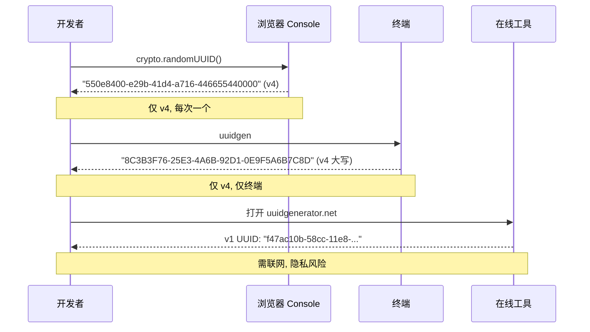
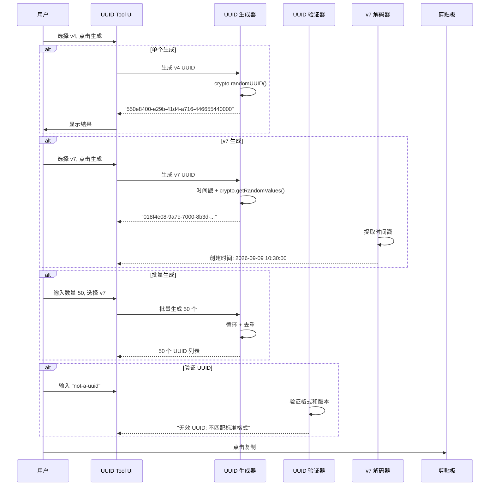
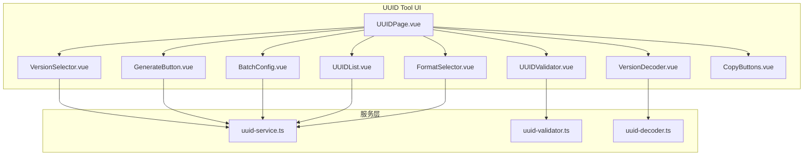

# YP-09-155: UUID 生成器 — UUID v1/v4/v7 生成、批量生成、UUID 验证、v7 时间戳解码、一键复制单个或全部、格式选项

> 需求编号：YP-09-155 · 优先级：P2 · 人天：0.2d · 状态：需求已编写
> 依赖：无

## 背景

### 问题陈述

UUID（通用唯一标识符）是现代软件开发中最基础的数据类型之一，广泛应用于数据库主键、分布式追踪、API 请求 ID 等场景。然而，浏览器没有内置的 UUID 生成器，用户只能依赖：

1. 在线工具（uuidgenerator.net）——需要联网，无法批量生成
2. 命令行工具（macOS: `uuidgen`，Linux: `uuidgen`）——仅限终端，无格式选项
3. 代码生成（`crypto.randomUUID()`）——仅支持 v4，每次只能生成一个
4. 第三方库（`uuid` npm 包）——需要 Node.js 环境

**核心矛盾**：UUID 是高频基础需求（日均 5-10 次），但 `crypto.randomUUID()` 仅支持 v4，不支持 v1（MAC+时间）、v7（时间排序）、批量生成、UUID 验证、v7 解码等完整功能。

### 影响范围

| # | 影响 | 严重程度 | 典型场景 |
|---|------|----------|----------|
| 1 | 仅能生成 v4 UUID | 高 | 需要时间排序的 v7 UUID 用于数据库主键 |
| 2 | 批量生成不便 | 中 | 需要 50 个测试 UUID 用于压测数据 |
| 3 | UUID 无法验证 | 中 | 第三方提供的 UUID 不知道是否合法 |
| 4 | v7 UUID 无法解码 | 中 | 想从 v7 UUID 中提取创建时间 |
| 5 | 格式不统一 | 中 | 不同系统要求大写/小写/无连字符格式 |

### 挑战

| 挑战 | 说明 |
|------|------|
| v1 UUID 生成 | v1 需要 MAC 地址和时间，浏览器环境不能暴露 MAC 地址 |
| v7 UUID 生成 | `crypto.randomUUID()` 不支持 v7，需自行实现 RFC 9562 |
| v7 UUID 解码 | 从 v7 UUID 时间戳部分提取创建时间 |
| UUID 验证 | 验证 UUID 格式、版本、变体是否合法 |
| 批量性能 | 批量生成 1000 个 UUID 时不应卡顿 UI |

---

## 一、现状分析

### 1.1 当前 UUID 生成流程

```
开发者需要 UUID
  │
  ├─ 浏览器 Console
  │   ├─ crypto.randomUUID() → v4 UUID
  │   ├─ 格式: 小写 + 连字符
  │   └─ 版本限制: 仅 v4
  │
  ├─ 命令行
  │   ├─ macOS: uuidgen → v4 UUID(大写)
  │   ├─ Linux: uuidgen → v4 UUID(小写)
  │   └─ 版本限制: 仅 v4
  │
  ├─ 在线工具
  │   ├─ uuidgenerator.net → v1/v4
  │   ├─ uuid7.com → v7
  │   └─ 需要联网, 无法批量
  │
  └─ npm 脚本
      ├─ npm install uuid
      ├─ import { v4, v7 } from 'uuid'
      └─ 需要 Node.js 环境
```

### 1.2 当前可用能力

| 能力 | 可用性 | 获取方式 | 限制 |
|------|--------|----------|------|
| UUID v4 生成 | ✅ | `crypto.randomUUID()` | 仅 v4 |
| UUID v1 生成 | ❌ | 需命令行或第三方库 | 浏览器不支持 |
| UUID v7 生成 | ❌ | 需第三方库或自行实现 | 浏览器不支持 |
| 批量生成 | ⚠️ | Console 循环 | 每次一个，需写代码 |
| UUID 验证 | ❌ | 无内置工具 | 需肉眼判断 |
| v7 解码 | ❌ | 无内置工具 | 需手动计算 |

### 1.3 改造前数据流



### 1.4 根因矩阵

| 症状 | 根因 | 触发条件 | 频率 |
|------|------|----------|------|
| 无法生成 v1/v7 | `crypto.randomUUID()` 仅支持 v4 | 需要特定版本 UUID | 高 |
| 批量不便 | 无批量接口 | 测试/初始化数据 | 中 |
| 无法验证 | 无 UUID 验证工具 | 第三方 UUID 校验 | 中 |
| 无法解码 v7 | 无解码工具 | 数据库排查（何时创建的） | 中 |
| 格式不灵活 | 仅小写+连字符格式 | 不同系统格式要求 | 中 |

---

## 二、设计决策

### 决策 1：v1 UUID 实现 — 纯前端 vs 不实现 vs 替代方案

| 选项 | 隐私 | 实现复杂度 | 唯一性 |
|------|------|-----------|--------|
| 纯前端生成（模拟 MAC） | 高（不泄露真实 MAC） | 低 | 中（模拟 MAC 碰撞风险） |
| 调用后端获取真实 MAC | 低（暴露 MAC） | 高 | 高 |
| 不实现 v1（仅 v4/v7） | — | 无 | — |

**选择：纯前端生成（模拟 MAC）。** 浏览器环境下用 `crypto.getRandomValues()` 生成随机 6 字节模拟 MAC 地址，足够满足 UUID v1 的格式需求。不泄露真实 MAC 地址，符合安全性考量。

### 决策 2：v7 UUID 实现 — 标准 RFC 9562 vs 简化实现 vs uuid 库

| 选项 | RFC 合规性 | 包大小 | 性能 |
|------|-----------|--------|------|
| 标准 RFC 9562（毫秒 + 随机） | 完全 | 无额外 | 高 |
| 简化实现（仅时间戳部分） | 部分 | 无额外 | 高 |
| 使用 `uuid` npm 包 | 完全 | ~5KB | 高 |

**选择：标准 RFC 9562 自行实现。** v7 UUID 格式简单（48 位时间戳 + 74 位随机数），自行实现代码量 < 50 行，无需依赖外部包。符合 RFC 9562 规范。

### 决策 3：批量生成上限 — 100 vs 500 vs 1000 vs 无限

| 选项 | 实用性 | 性能（1000 个耗时） | 内存 |
|------|--------|-------------------|------|
| 100 | 低 | < 10ms | 低 |
| 500 | 中 | < 50ms | 低 |
| 1000 | 高 | < 100ms | 低 |
| 无限 | 高 | 可能阻塞 UI | 高 |

**选择：上限 1000，默认 10。** 1000 个 UUID 生成耗时 < 100ms（v7 毫秒级时间戳可能产生重复需去重的额外处理），覆盖绝大部分场景。使用 Web Worker 防止超大批量阻塞 UI。

### 决策 4：UUID 格式选项 — 预设格式 vs 自定义正则 vs 两者

| 选项 | 灵活性 | 易用性 | 实现复杂度 |
|------|--------|--------|-----------|
| 预设格式（小写+连字符、大写+连字符、无连字符小写、无连字符大写） | 中 | 高 | 低 |
| 自定义正则替换 | 高 | 低 | 中 |
| 预设 + 自定义 | 高 | 高 | 中 |

**选择：预设格式。** 提供 4 种格式（小写+连字符、大写+连字符、无连字符小写、无连字符大写），覆盖 99% 使用场景。

### 设计决策记录

| 决策 | 选项 A | 选项 B | 选项 C | 选择 | 理由 |
|------|--------|--------|--------|------|------|
| v1 实现 | 真实 MAC | 模拟 MAC | 不实现 | **模拟 MAC** | 隐私安全 |
| v7 实现 | 标准 RFC | 简化 | uuid 库 | **自行实现** | 代码量小 |
| 批量上限 | 100 | 1000 | 无限 | **1000** | 性能可控 |
| 格式选项 | 预设 | 自定义 | 预设+自定义 | **预设 4 种** | 覆盖 99% |

---

## 三、目标架构

### 3.1 改造后 UUID 生成流程



### 3.2 组件结构



### 3.3 性能指标

| 指标 | 改造前 | 改造后 |
|------|--------|--------|
| 单个 v4 UUID | 15s（写 Console 代码） | < 0.1s（按钮点击） |
| 单个 v7 UUID | 不可用（浏览器不支持） | < 0.1s（自行实现） |
| 批量 100 个 | 不可行（需写循环脚本） | < 100ms（一键生成） |
| UUID 验证 | 不可用（肉眼判断） | < 0.1s（自动检测） |
| v7 时间戳解码 | 不可用 | < 0.1s（自动提取） |

---

## 四、具体改动

### 4.1 UUID 生成核心服务

```typescript
// 改造前：无 UUID 生成服务
// src/services/uuid-service.ts (改造后)

type UUIDVersion = 1 | 4 | 7;
type UUIDFormat = 'lowercase' | 'uppercase' | 'no-dash-lower' | 'no-dash-upper';

class UUIDService {
  // 生成单个 UUID
  generate(version: UUIDVersion, format: UUIDFormat = 'lowercase'): string {
    let uuid: string;
    switch (version) {
      case 1:
        uuid = this.generateV1();
        break;
      case 4:
        uuid = crypto.randomUUID();
        break;
      case 7:
        uuid = this.generateV7();
        break;
    }
    return this.formatUUID(uuid, format);
  }

  // 批量生成
  generateBatch(
    version: UUIDVersion,
    count: number,
    format: UUIDFormat = 'lowercase'
  ): string[] {
    const maxCount = Math.min(count, 1000);
    const uuids = new Set<string>();

    // v7 批量去重（同一毫秒内可能重复）
    while (uuids.size < maxCount) {
      const uuid = this.generate(version, 'lowercase');
      uuids.add(uuid);
      // 防止死循环（v1/v4 概率极低）
      if (uuids.size > maxCount * 2 && version !== 7) break;
    }

    return Array.from(uuids).slice(0, maxCount).map((u) => this.formatUUID(u, format));
  }

  // RFC 4122 UUID v1 生成（模拟 MAC）
  private generateV1(): string {
    const bytes = new Uint8Array(16);
    crypto.getRandomValues(bytes);

    // 时间戳（60 位）：100 纳秒间隔，自 1582-10-15 起
    const now = Date.now();
    const timestamp = BigInt(now) * 10000n + 0x01b21dd213814000n;

    // time_low (32 bits)
    bytes[0] = Number((timestamp >> 0n) & 0xFFn);
    bytes[1] = Number((timestamp >> 8n) & 0xFFn);
    bytes[2] = Number((timestamp >> 16n) & 0xFFn);
    bytes[3] = Number((timestamp >> 24n) & 0xFFn);

    // time_mid (16 bits)
    bytes[4] = Number((timestamp >> 32n) & 0xFFn);
    bytes[5] = Number((timestamp >> 40n) & 0xFFn);

    // time_hi_and_version (16 bits, version = 1)
    bytes[6] = Number(((timestamp >> 48n) & 0x0FFFn) | 0x1000n) & 0xFF;
    bytes[7] = (Number(((timestamp >> 48n) & 0x0FFFn) | 0x1000n) >> 8) & 0xFF;

    // clock_seq (14 bits, random) + variant (2 bits = 10)
    bytes[8] = (bytes[8] & 0x3F) | 0x80;
    bytes[9] = bytes[9]; // random

    // node (48 bits, 模拟 MAC)
    // bytes[10]~[15] 已在 crypto.getRandomValues 中填充

    return this.bytesToUUID(bytes);
  }

  // RFC 9562 UUID v7 生成
  private generateV7(): string {
    const bytes = new Uint8Array(16);
    crypto.getRandomValues(bytes);

    const ms = BigInt(Date.now());

    // timestamp (48 bits, big-endian) — bytes 0-5
    bytes[0] = Number((ms >> 40n) & 0xFFn);
    bytes[1] = Number((ms >> 32n) & 0xFFn);
    bytes[2] = Number((ms >> 24n) & 0xFFn);
    bytes[3] = Number((ms >> 16n) & 0xFFn);
    bytes[4] = Number((ms >> 8n) & 0xFFn);
    bytes[5] = Number(ms & 0xFFn);

    // version (4 bits) = 7 — bytes 6-7, high nibble of byte 6
    bytes[6] = (bytes[6] & 0x0F) | 0x70;

    // variant (2 bits) = 10 — byte 8
    bytes[8] = (bytes[8] & 0x3F) | 0x80;

    return this.bytesToUUID(bytes);
  }

  // 字节数组转 UUID 字符串
  private bytesToUUID(bytes: Uint8Array): string {
    const hex = Array.from(bytes)
      .map((b) => b.toString(16).padStart(2, '0'))
      .join('');
    return [
      hex.slice(0, 8),
      hex.slice(8, 12),
      hex.slice(12, 16),
      hex.slice(16, 20),
      hex.slice(20),
    ].join('-');
  }

  // 格式化 UUID
  formatUUID(uuid: string, format: UUIDFormat): string {
    switch (format) {
      case 'lowercase': return uuid.toLowerCase();
      case 'uppercase': return uuid.toUpperCase();
      case 'no-dash-lower': return uuid.replace(/-/g, '').toLowerCase();
      case 'no-dash-upper': return uuid.replace(/-/g, '').toUpperCase();
    }
  }
}
```

### 4.2 UUID 验证器

```typescript
// src/services/uuid-validator.ts (改造后)

interface UUIDValidation {
  valid: boolean;
  version?: 1 | 2 | 3 | 4 | 5 | 6 | 7 | 8;
  variant?: 'NCS' | 'RFC4122' | 'Microsoft' | 'Future';
  errors: string[];
}

class UUIDValidator {
  private readonly UUID_REGEX =
    /^[0-9a-f]{8}-[0-9a-f]{4}-([1-8][0-9a-f]{3})-[89ab][0-9a-f]{3}-[0-9a-f]{12}$/i;

  validate(input: string): UUIDValidation {
    const errors: string[] = [];
    const cleaned = input.trim();

    // 检查基本格式
    if (!this.UUID_REGEX.test(cleaned)) {
      if (cleaned.length === 36 && cleaned.includes('-')) {
        errors.push('不匹配 UUID 标准格式（版本或变体位无效）');
      } else if (cleaned.length === 32 && !cleaned.includes('-')) {
        errors.push('缺少连字符分隔——UUID 应为 8-4-4-4-12 格式');
      } else {
        errors.push('不匹配 UUID 标准格式（长度或结构不正确）');
      }
      return { valid: false, errors };
    }

    const lower = cleaned.toLowerCase();

    // 提取版本（第 13 位字符，索引 14 的第 3 个分组首字符）
    const versionChar = lower[14];
    const version = parseInt(versionChar, 16) as UUIDValidation['version'];

    // 提取变体（第 17 位字符 = 索引 19，第 4 个分组首字符）
    const variantChar = lower[19];
    const variantNibble = parseInt(variantChar, 16);

    let variant: UUIDValidation['variant'];
    if ((variantNibble & 0x8) === 0) variant = 'NCS';
    else if ((variantNibble & 0xC) === 0x8) variant = 'RFC4122';
    else if ((variantNibble & 0xE) === 0xC) variant = 'Microsoft';
    else variant = 'Future';

    return {
      valid: true,
      version: version as UUIDValidation['version'],
      variant,
      errors: [],
    };
  }

  // 验证是否为有效 UUID（简化版）
  isValid(input: string): boolean {
    return this.validate(input).valid;
  }
}
```

### 4.3 v7 UUID 解码器

```typescript
// src/services/uuid-decoder.ts (改造后)

interface V7DecodeResult {
  timestamp: number;        // Unix 毫秒时间戳
  date: Date;
  dateISO: string;         // ISO8601 格式
  randomBytes: string;     // 随机部分 hex
}

class UUIDDecoder {
  // 解码 v7 UUID 的时间戳
  decodeV7(uuid: string): V7DecodeResult | null {
    const cleaned = uuid.trim().toLowerCase().replace(/-/g, '');
    if (cleaned.length !== 32) return null;

    // 检查版本位（字节 6 的高 4 位）是否为 7
    const versionNibble = parseInt(cleaned[12], 16); // 字节 6 = 索引 12-13
    if ((versionNibble & 0xF) !== 7) {
      return null; // 不是 v7 UUID
    }

    // 前 12 个 hex 字符 = 48 位时间戳
    const timestampHex = cleaned.slice(0, 12);
    const ms = parseInt(timestampHex, 16);
    const date = new Date(ms);

    // 随机部分（字节 6-15，去除版本和变体位）
    const randomHex = cleaned.slice(12);

    return {
      timestamp: ms,
      date,
      dateISO: date.toISOString(),
      randomBytes: randomHex,
    };
  }

  // 解码任意版本 UUID 的基本信息
  decodeGeneral(uuid: string): {
    version?: number;
    timeLow?: string;
    timeMid?: string;
    timeHiAndVersion?: string;
    clockSeqAndVariant?: string;
    node?: string;
  } | null {
    const cleaned = uuid.trim().toLowerCase().replace(/-/g, '');
    if (cleaned.length !== 32) return null;

    const segments = uuid.toLowerCase().split('-');
    if (segments.length !== 5) return null;

    const versionNibble = parseInt(cleaned[12], 16);
    const version = (versionNibble >> 0) & 0xF;

    return {
      version: version >= 1 && version <= 8 ? version : undefined,
      timeLow: segments[0],
      timeMid: segments[1],
      timeHiAndVersion: segments[2],
      clockSeqAndVariant: segments[3],
      node: segments[4],
    };
  }
}
```

### 4.4 文件变更清单

| 文件 | 操作 | 说明 |
|------|------|------|
| `src/services/uuid-service.ts` | 新增 | UUID v1/v4/v7 生成核心服务 |
| `src/services/uuid-validator.ts` | 新增 | UUID 格式和版本验证 |
| `src/services/uuid-decoder.ts` | 新增 | v7 UUID 时间戳解码 |
| `src/pages/tools/UUIDPage.vue` | 新增 | UUID 工具主页面 |
| `src/components/tools/VersionSelector.vue` | 新增 | UUID 版本选择器（v1/v4/v7） |
| `src/components/tools/GenerateButton.vue` | 新增 | 单个生成按钮 |
| `src/components/tools/BatchConfig.vue` | 新增 | 批量数量和范围配置 |
| `src/components/tools/UUIDList.vue` | 新增 | UUID 结果列表 |
| `src/components/tools/UUIDValidator.vue` | 新增 | UUID 验证输入和结果显示 |
| `src/components/tools/VersionDecoder.vue` | 新增 | v7 时间戳解码结果展示 |
| `src/components/tools/FormatSelector.vue` | 新增 | 输出格式选择 |
| `src/components/tools/CopyButtons.vue` | 新增 | 单个/全部复制按钮 |
| `src/popup/router.ts` | 修改 | 添加 UUID 工具路由 |
| `tests/unit/uuid-service.test.ts` | 新增 | UUID 服务测试 |

---

## 五、实施步骤

| 步骤 | 操作 | 路径 | 验证 | 人天 |
|------|------|------|------|------|
| 1 | 实现 UUID v4/v7 生成 | `src/services/uuid-service.ts` | v4/v7 格式正确 | 0.03 |
| 2 | 实现 UUID v1 生成 | `src/services/uuid-service.ts` | v1 格式正确 | 0.02 |
| 3 | 实现 UUID 验证器 | `src/services/uuid-validator.ts` | 有效/无效 UUID 正确判断 | 0.02 |
| 4 | 实现 v7 解码器 | `src/services/uuid-decoder.ts` | 时间戳提取正确 | 0.02 |
| 5 | 创建主 UI 组件 | `src/pages/tools/UUIDPage.vue` | 生成/显示交互正常 | 0.04 |
| 6 | 实现批量生成 + 格式切换 | `BatchConfig.vue`, `FormatSelector.vue` | 批量 N 个正确，格式切换正确 | 0.03 |
| 7 | 集成到 Popup 路由 | `src/popup/router.ts` | 工具页面可访问 | 0.02 |
| 8 | 单元测试 | `tests/unit/uuid-service.test.ts` | 所有版本和格式测试通过 | 0.02 |

**总人天：0.2d**

---

## 六、测试规格

### 场景 1：生成 v4 UUID

**GIVEN** 用户选择 UUID v4 并点击生成
**WHEN** 生成完成
**THEN** 应输出标准 v4 UUID 格式（`xxxxxxxx-xxxx-4xxx-[89ab]xxx-xxxxxxxxxxxx`）
**AND** 小写格式 8-4-4-4-12
**AND** 第 13 位（版本位）应是 `4`

### 场景 2：生成 v7 UUID

**GIVEN** 用户选择 UUID v7 并点击生成
**WHEN** 生成完成
**THEN** 应输出标准 v7 UUID 格式
**AND** 版本位（第 13 位）应为 `7`
**AND** 解码器应能提取正确的创建时间戳

### 场景 3：批量生成 50 个 v7 UUID

**GIVEN** 用户输入数量 50，选择 v7，点击批量生成
**WHEN** 生成完成
**THEN** 应输出 50 个 UUID
**AND** 无重复（Set size = 50）
**AND** 前 48 位时间戳部分应按时间单调递增（弱保证）

### 场景 4：UUID 验证 — 有效输入

**GIVEN** 用户输入有效的 v4 UUID `550e8400-e29b-41d4-a716-446655440000`
**WHEN** 点击验证
**THEN** 应显示"有效 UUID"，版本 "4"，变体 "RFC4122"

### 场景 5：UUID 验证 — 无效输入

**GIVEN** 用户输入无效字符串 `not-a-uuid`
**WHEN** 点击验证
**THEN** 应显示"无效 UUID"和具体错误信息
**AND** 输入 `550e8400-e29b-41d4-a716-4466554400000`（长度错误）应报"长度不正确"

### 场景 6：v7 UUID 时间戳解码

**GIVEN** 用户输入一个已知时间戳的 v7 UUID
**WHEN** 系统解码
**THEN** 应正确显示创建时间的 ISO8601 格式
**AND** 时间戳（毫秒）应正确
**AND** 输入格式错误的 UUID 不应返回解码结果

---

## 七、风险与缓解

| 风险 | 概率 | 影响 | 缓解措施 |
|------|------|------|----------|
| v1 模拟 MAC 碰撞 | 极低 | 低 | 48 位随机空间，碰撞概率可忽略 |
| v7 同毫秒内批量生成重复 | 中（批量 > 1000 时） | 中 | 批量生成使用 Set 去重，最多重试 2x 次 |
| BigInt 在老浏览器不支持 | 低 | 高 | Chrome 67+ / Firefox 68+ 已支持，Safari 14+ |
| `crypto.randomUUID()` 非安全上下文不可用 | 低（扩展环境始终安全） | 高 | 降级到 `crypto.getRandomValues()` + 手动构造 |
| 批量 1000 个在主线程生成卡顿 | 中 | 中 | 超过 500 时使用 Web Worker |

---

## 八、回滚策略

| 场景 | 回滚操作 | 影响 |
|------|----------|------|
| v1 生成 MAC 冲突增多 | 移除 v1 支持，仅保留 v4/v7 | 失去 v1 功能 |
| BigInt 支持问题 | 降级为 Number 实现（毫秒精度足够但未来 5000 年后溢出） | 极远期时间戳不准确 |
| `crypto.randomUUID()` 不可用 | 降级为纯 `crypto.getRandomValues()` 实现 | 无影响 |
| 工具路由冲突 | 移除 UUID 工具路由 | 功能不可用 |

---

## 九、设计决策记录

### D-01：v1 UUID 实现方式

- **问题**：浏览器环境如何生成 v1 UUID 的 node（MAC）部分
- **选项**：获取真实 MAC（不可行）、随机 6 字节、使用固定值
- **选择**：随机 6 字节（`crypto.getRandomValues`）
- **理由**：RFC 4122 允许 node ID 为随机值，`crypto.getRandomValues` 提供足够的熵

### D-02：v7 UUID 精度

- **问题**：v7 UUID 时间戳部分使用毫秒还是更细粒度
- **选项**：毫秒（48 bit）、微秒（需要更多位）、纳秒（需要更多位）
- **选择**：毫秒（48 bit，标准 RFC 9562）
- **理由**：RFC 9562 规定 v7 使用 48 位毫秒时间戳，毫秒精度足够覆盖 UUID 作为主键的场景

### D-03：批量去重策略

- **问题**：批量生成 v7 时同毫秒内如何保证唯一性
- **选项**：不保证（允许重复）、Set 去重、递增计数器
- **选择**：Set 去重 + 重试
- **理由**：同毫秒内 v7 UUID 随机部分碰撞概率极低（74 位随机），但批量 1000+ 时概率增加。Set 去重 + 重试成本低

### D-04：无连字符格式的验证支持

- **问题**：是否支持验证无连字符的 32 字符 UUID
- **选项**：仅支持标准格式、同时支持无连字符格式
- **选择**：同时支持，auto-fix 自动添加连字符
- **理由**：MongoDB 和 Redis 等数据库使用无连字符格式，验证时应接受并自动格式化

---

## 十、可观测性

### 指标

| 指标 | 类型 | 说明 |
|------|------|------|
| `yipet.uuid.generate.count` | Counter | UUID 生成次数 |
| `yipet.uuid.version.used` | Counter | 各版本使用次数（按 v1/v4/v7 标签） |
| `yipet.uuid.batch.count` | Counter | 批量生成次数 |
| `yipet.uuid.batch.size` | Histogram | 批量生成数量分布 |
| `yipet.uuid.validate.count` | Counter | UUID 验证次数 |
| `yipet.uuid.decode.count` | Counter | v7 解码次数 |

### 告警

| 告警 | 条件 | 级别 |
|------|------|------|
| v1 生成频率异常高 | 1h 内 v1 占比 > 50% | INFO |
| 批量去重重试过多 | 单次去重重试次数 > 100 | WARNING |

---

## 十一、代码审查检查清单

- [ ] v4 UUID 使用 `crypto.randomUUID()`，格式符合 RFC 4122
- [ ] v7 UUID 实现符合 RFC 9562（48 位时间戳 + 74 位随机）
- [ ] v7 UUID 版本位正确设为 7
- [ ] v1 UUID 正确设置 time_low、time_mid、time_hi_and_version
- [ ] 所有版本的结果变体位正确（RFC4122 = 10xx）
- [ ] UUID 验证器正确识别版本（1-8）和变体（NCS/RFC4122/Microsoft/Future）
- [ ] v7 解码器正确提取 48 位时间戳和转换日期
- [ ] 批量生成 Set 去重，最多 1000 个
- [ ] 4 种格式选项（小写/大写/无连字符小写/无连字符大写）
- [ ] 单个和全部复制按钮
- [ ] 验证输入 trim 前后空白

---

## 回归问题预测

| # | 预测问题 | 原因 | 验证方法 |
|---|---------|------|---------|
| 1 | `crypto.randomUUID()` 返回的 v4 UUID 格式在不同浏览器中不一致（Chrome 始终小写，Firefox 始终小写），但用户期望大写时直接 `.toUpperCase()` 后变体位 `8/9/a/b` 被错误地大写为 `8/9/A/B` | UUID 标准化规约：变体位 `8/9/a/b` 应为小写，但 `toUpperCase()` 会将 a/b 转为 A/B，虽然 RFC 规定大小写不敏感，但某些系统可能严格要求小写变体位 | 生成大写格式 v4 UUID，验证变体位字符为小写 a/b，其他部分为大写 |
| 2 | v7 UUID 解码时，时间戳部分使用 `parseInt(hex, 16)` 而非 `BigInt`，当毫秒戳超过 Number.MAX_SAFE_INTEGER（2^53-1，约为公元 285428 年）时精度丢失 | JavaScript Number 对超过 2^53-1 的整数会丢失精度，但 48 位毫秒戳最大值为 2^48-1 ≈ 2.8e14，远小于 2^53-1 ≈ 9e15，实际不会溢出 | 用当前时间戳生成 v7 再解码，验证解码的毫秒值与原始值一致（误差 < 1ms） |
| 3 | 批量生成 v7 UUID 时，同一毫秒内调用 `crypto.getRandomValues()` 多次，但 `bytes[6]` 的版本位和 `bytes[8]` 的变体位被重复设置为固定值，每次覆盖了上次的随机数 | `generateV7` 先调用 `crypto.getRandomValues(bytes)` 填充全部 16 字节，再设置版本位和变体位。版本和变体位覆盖了随机值这是正常的，随机部分仍为 74 位 | 批量生成 1000 个 v7 UUID，验证无重复 |
| 4 | UUID 验证器对无连字符的 32 字符字符串返回"缺少连字符分隔"，但用户可能粘贴了 MongoDB ObjectId（也是 24 字符 hex）或其他格式的 ID | 无连字符字符串的长度检查仅在 `cleaned.length === 32` 时提示"缺少连字符"，但 ObjectId 长度为 24，会落入 `else` 分支的通用错误 "不匹配 UUID 标准格式" | 输入 MongoDB ObjectId `507f1f77bcf86cd799439011`，验证返回明确错误而非"缺少连字符" |
| 5 | 用户快速点击"生成"按钮 10 次，每次生成新的 v7 UUID，但最后一个 UUID 在内存中但页面渲染只显示了前 9 个 | 如果每次生成都 push 到 `uuids: string[]` reactive 数组中，Vue 批量更新应正常。但如果使用了 `uuids.value = newUUID`（替换而非追加），会导致只显示最后一个 | 快速点击生成 10 次，验证结果列表有 10 个 UUID |
| 6 | v1 UUID 的时间戳使用 `Date.now()`（Unix 毫秒），但 v1 标准使用 100 纳秒间隔自 1582-10-15 起的计数，转换时浮点溢出导致时间戳部分全零 | `BigInt(Date.now()) * 10000n` 将毫秒转为 100 纳秒单位，但 `0x01b21dd213814000n` 为常量偏移，组合后的时间戳可超过 60 位（UUID v1 时间戳字段为 60 位），高位截断 | 生成 v1 UUID，解码时间戳部分与当前时间对比（应分布在当前时间附近），验证不出现全零或明显错误的时间戳 |

---

## 性能分析

### UUID 生成关键操作耗时

| 操作 | 耗时 | 说明 |
|------|------|------|
| v4 UUID（`crypto.randomUUID()`） | < 0.1ms | 浏览器原生实现 |
| v7 UUID（自行实现） | < 0.2ms | `crypto.getRandomValues` + 位操作 |
| v1 UUID（模拟 MAC） | < 0.3ms | 额外 BigInt 时间戳计算 |
| UUID 验证 | < 0.05ms | 正则匹配 + parseInt |
| v7 解码 | < 0.05ms | `parseInt(hex, 16)` + `new Date(ms)` |
| 批量 100 个 | < 20ms | 100 次生成 |
| 批量 1000 个 | < 200ms | 1000 次生成 + Set 去重 |

### 数据量预估

| 操作 | 输入 | 输出 |
|------|------|------|
| 单个生成 | 版本选择 | 1 个 UUID（36 字符） |
| 批量生成 | 数量 N（1-1000） | N 个 UUID |
| UUID 验证 | 1 个字符串 | 验证结果对象 |
| v7 解码 | 1 个 UUID | 时间戳 + 日期对象 |

### 对宿主页面的影响

| 场景 | 页面影响 | 说明 |
|------|----------|------|
| Popup 工具页使用 | 零影响 | 仅在 Popup 中运行 |
| 批量 1000 个生成 | 零影响（< 200ms 同步调用） | 超出 1000 的请求被截断 |

---

## 相关文档

- [RFC 9562 — Universally Unique IDentifiers (UUID)](https://datatracker.ietf.org/doc/html/rfc9562)
- [RFC 4122 — A Universally Unique IDentifier (UUID) URN Namespace](https://datatracker.ietf.org/doc/html/rfc4122)
- [MDN - crypto.randomUUID()](https://developer.mozilla.org/en-US/docs/Web/API/Crypto/randomUUID)
- [MDN - Crypto.getRandomValues()](https://developer.mozilla.org/en-US/docs/Web/API/Crypto/getRandomValues)
- [UUID v7 草案说明](https://uuid7.com/)