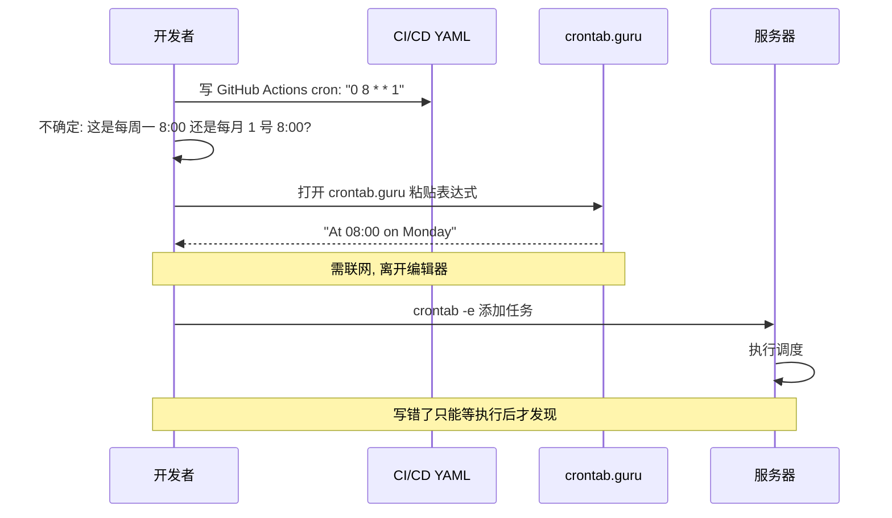
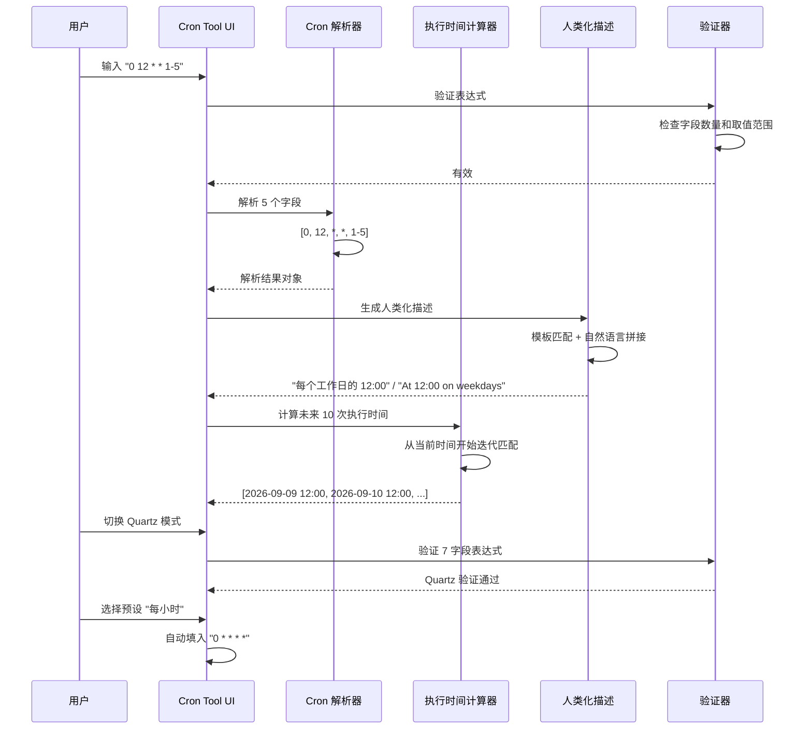
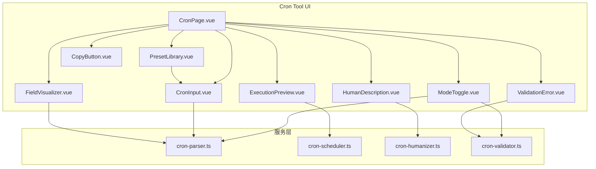

# YP-09-156: Cron 表达式解析器 — Cron 解析与可视化、人类可读描述、未来 N 次执行时间预览、预设库、验证与错误信息、Quartz/标准 Cron 兼容

> 需求编号：YP-09-156 · 优先级：P2 · 人天：0.2d · 状态：需求已编写
> 依赖：无

## 背景

### 问题陈述

Cron 表达式是配置定时任务的标准方式，广泛应用于 Linux crontab、GitHub Actions、Jenkins、Kubernetes CronJob、Spring Scheduler 等几乎所有调度系统。然而 Cron 语法晦涩难懂（5 个空格分隔的字段，每个字段有复杂的取值规则），开发者每次编写或排查 Cron 表达式时都经历：

1. 打开 crontab.guru 在线工具——需要联网，每次手动输入
2. 阅读 man 手册（`man 5 crontab`）——枯燥且不直观
3. 手动推算执行时间——容易出错（尤其是 */n 和连字符语法）
4. 粘贴到 ChatGPT 询问含义——依赖外部服务
5. 直接在服务器 crontab 中测试——高风险（可能引发未预期的执行）

**核心矛盾**：Cron 表达式是后台开发的基础技能，但语法设计对上世纪的系统管理员友好，对现代开发者极不友好。需要一个本地化、可视化、交互式的 Cron 表达式工具。

### 影响范围

| # | 影响 | 严重程度 | 典型场景 |
|---|------|----------|----------|
| 1 | 编写 Cron 易出错 | 高 | 手写 `0 0 * * 0` 不确定是不是每周日 |
| 2 | 排查故障低效 | 高 | "这个 Cron 最近 5 次执行是什么时候？" |
| 3 | 语法差异混淆 | 中 | Linux cron 5 字段 vs Quartz 7 字段 |
| 4 | 缺乏即时反馈 | 中 | 写完了不知道表达式对不对 |
| 5 | 重复查阅文档 | 中 | */15 和 0,15,30,45 等价但不确定 |

### 挑战

| 挑战 | 说明 |
|------|------|
| 语法变体 | 标准 Cron（5 字段）vs Quartz（6-7 字段含秒和年）需同时支持 |
| 人类化描述 | 将表达式翻译为自然语言，需中英文双语 |
| 执行时间推算 | 从表达式反推未来 N 次执行时间，需处理月份/星期交叉 |
| 特殊字符 | `L`（最后）、`W`（最近工作日）、`#`（第 N 个）、`?` 在不同语法中的含义不同 |
| 年份/月份边界 | 跨月、跨年、闰年的执行时间计算 |

---

## 一、现状分析

### 1.1 当前 Cron 编写流程

```
开发者需要编写 Cron 表达式
  │
  ├─ 在线工具
  │   ├─ 浏览器打开 crontab.guru
  │   ├─ 输入表达式 "0 12 * * 1-5"
  │   ├─ 查看解释: "At 12:00 on every day-of-week from Monday through Friday"
  │   └─ 限制: 仅标准 5 字段 Cron
  │
  ├─ 在线 Cron 执行时间计算器
  │   ├─ 打开 cron.help
  │   ├─ 粘贴表达式
  │   ├─ 查看未来 10 次执行时间
  │   └─ 限制: 不支持 Quartz
  │
  ├─ man 手册
  │   ├─ man 5 crontab
  │   ├─ 阅读字段说明
  │   └─ 限制: 枯燥，无即时验证
  │
  └─ 服务器测试
      ├─ crontab -e
      ├─ 添加 "0 0 * * * /path/to/script.sh"
      ├─ 等待执行... 🕐
      └─ 限制: 高风险
```

### 1.2 当前可用能力

| 能力 | 可用性 | 获取方式 | 限制 |
|------|--------|----------|------|
| 标准 Cron 解释 | ⚠️ | crontab.guru | 需联网，仅标准 5 字段 |
| 执行时间预览 | ⚠️ | cron.help | 需联网 |
| Quartz 支持 | ❌ | 无浏览器工具 | 需 Java 编写测试 |
| 表达式验证 | ⚠️ | 在线工具 | 错误信息不详细 |
| 预设库 | ⚠️ | 在线工具 | 预设有英文不直观 |
| 语法参考 | ⚠️ | man 手册 | 离线但不交互 |

### 1.3 改造前数据流



### 1.4 根因矩阵

| 症状 | 根因 | 触发条件 | 频率 |
|------|------|----------|------|
| 语法难懂 | Cron 5 字段语法对新手不友好 | 每次编写 Cron | 高（每周 1-2 次） |
| 执行时间无法预览 | 无本地计算工具 | 配置调度任务时 | 中 |
| 标准不统一 | 5 字段 vs 7 字段差异 | 跨系统迁移（Linux → Java） | 中 |
| 无即时验证 | 缺乏交互式编辑器 | 手动编辑 cron 文件 | 中 |
| 特殊字符困惑 | `L`/`W`/`#`/`?`含义不明确 | Quartz/Spring 调度 | 中 |

---

## 二、设计决策

### 决策 1：Cron 语法支持范围 — 仅标准 5 字段 vs 标准 + Quartz vs 所有变体

| 选项 | 覆盖范围 | 实现复杂度 | 维护成本 |
|------|----------|-----------|---------|
| 仅标准 5 字段 | ~70% | 低 | 低 |
| 标准 + Quartz（5-7 字段） | ~95% | 中 | 中 |
| 所有变体（含 AWS/Spring 等） | ~100% | 高 | 高 |

**选择：标准 + Quartz（5-7 字段）。** 标准 Cron（5 字段）和 Quartz（6-7 字段）覆盖 95% 使用场景。通过 toggle 切换两种模式，Quartz 模式额外支持秒字段（第 1 位）和年字段（第 7 位），以及 `L`/`W`/`#`/`?` 特殊字符。

### 决策 2：人类化描述语言 — 仅英文 vs 仅中文 vs 中英文

| 选项 | 目标用户 | 实现复杂度 | 本地化质量 |
|------|----------|-----------|-----------|
| 仅英文（如 crontab.guru） | 国际用户 | 低 | N/A |
| 仅中文 | 中文用户 | 低 | N/A |
| 中英文切换 | 全部 | 中 | 中 |

**选择：中英文切换。** YiPet 已有完整的 i18n 体系。英文描述与 crontab.guru 一致，中文描述需精准翻译字段名（"第 1 个星期一" vs "the 1st Monday"）。

### 决策 3：未来执行时间计算 — N 次预览 vs 日历视图 vs 两者

| 选项 | 直观性 | 实用性 | 实现复杂度 |
|------|--------|--------|-----------|
| 仅 N 次时间列表 | 中 | 高 | 低 |
| 仅日历视图 | 高 | 中 | 高 |
| 列表 + 日历视图 | 高 | 高 | 高 |

**选择：N 次列表 + 日历视图（渐进）。** MVP 阶段提供未来 10 次执行时间列表，后续可升级为日历视图。列表方式实现简单且足够实用。

### 决策 4：预设库内容范围 — 通用预设 vs 平台特定预设 vs 两者

| 选项 | 实用性 | 覆盖面 | 维护成本 |
|------|--------|--------|---------|
| 通用预设（每 N 分钟/小时/天） | 中 | 中 | 低 |
| 平台特定（GitHub Actions、K8s CronJob 等） | 高 | 高 | 中 |
| 通用 + 平台 | 高 | 至高 | 中 |

**选择：通用 + 平台预设。** 提供 15-20 个预设，分为通用（每 5 分钟、每小时、每天午夜、每周一、每月 1 号等）和平台特定（GitHub Actions、K8s CronJob、Spring Scheduler 常用模式）。

### 设计决策记录

| 决策 | 选项 A | 选项 B | 选项 C | 选择 | 理由 |
|------|--------|--------|--------|------|------|
| 语法支持 | 标准 5 字段 | 标准+Quartz | 所有变体 | **标准+Quartz** | 覆盖 95% |
| 描述语言 | 仅英文 | 仅中文 | 中英双语 | **中英双语** | 复用 i18n 体系 |
| 预览方式 | N 次列表 | 日历视图 | 两者 | **N 次列表(MVP)** | 先简后完整 |
| 预设库 | 通用 | 平台 | 通用+平台 | **通用+平台** | 覆盖全面 |

---

## 三、目标架构

### 3.1 改造后 Cron 解析流程



### 3.2 组件结构



### 3.3 性能指标

| 指标 | 改造前 | 改造后 |
|------|--------|--------|
| Cron 解释 | 15s（打开 crontab.guru） | < 0.1s（即时解析 + 描述） |
| 执行时间预览 | 30s（打开 cron.help） | < 0.1s（本地计算） |
| 表达式验证 | 10s（粘贴到在线工具） | < 0.1s（即时验证 + 错误定位） |
| 预设查找 | 2min（搜索 + 阅读文档） | < 2s（预设列表选择） |

---

## 四、具体改动

### 4.1 Cron 解析引擎

```typescript
// 改造前：无 Cron 解析服务
// src/services/cron-parser.ts (改造后)

type CronMode = 'standard' | 'quartz';

interface CronField {
  name: string;
  index: number;
  allowed: string;
  values: number[];
  isAll: boolean;
}

interface ParsedCron {
  mode: CronMode;
  expression: string;
  fields: CronField[];
  second?: CronField;
  minute: CronField;
  hour: CronField;
  dayOfMonth: CronField;
  month: CronField;
  dayOfWeek: CronField;
  year?: CronField;
}

class CronParser {
  // 字段定义
  private readonly STANDARD_FIELDS = [
    { name: 'minute', index: 0, min: 0, max: 59 },
    { name: 'hour', index: 1, min: 0, max: 23 },
    { name: 'dayOfMonth', index: 2, min: 1, max: 31 },
    { name: 'month', index: 3, min: 1, max: 12 },
    { name: 'dayOfWeek', index: 4, min: 0, max: 7 },
  ];

  private readonly QUARTZ_FIELDS = [
    { name: 'second', index: 0, min: 0, max: 59 },
    { name: 'minute', index: 1, min: 0, max: 59 },
    { name: 'hour', index: 2, min: 0, max: 23 },
    { name: 'dayOfMonth', index: 3, min: 1, max: 31 },
    { name: 'month', index: 4, min: 1, max: 12 },
    { name: 'dayOfWeek', index: 5, min: 1, max: 7 },
    { name: 'year', index: 6, min: 1970, max: 2099 },
  ];

  // 解析 Cron 表达式
  parse(expression: string, mode: CronMode = 'standard'): ParsedCron {
    const trimmed = expression.trim();
    const parts = trimmed.split(/\s+/);

    const fieldsDef = mode === 'quartz' ? this.QUARTZ_FIELDS : this.STANDARD_FIELDS;

    if (parts.length !== fieldsDef.length) {
      throw new Error(
        `字段数量不匹配：期望 ${fieldsDef.length} 个字段（${mode === 'quartz' ? '秒 分 时 日 月 周 [年]' : '分 时 日 月 周'}），但收到 ${parts.length} 个`
      );
    }

    const fields: CronField[] = fieldsDef.map((def, i) => {
      const parsed = this.parseField(parts[i], def.min, def.max, mode, def.name);
      return {
        name: def.name,
        index: i,
        allowed: parts[i],
        values: parsed.values,
        isAll: parsed.isAll,
      };
    });

    return {
      mode,
      expression: trimmed,
      fields,
      ...(mode === 'quartz'
        ? {
            second: fields[0],
            minute: fields[1],
            hour: fields[2],
            dayOfMonth: fields[3],
            month: fields[4],
            dayOfWeek: fields[5],
            year: fields[6],
          }
        : {
            minute: fields[0],
            hour: fields[1],
            dayOfMonth: fields[2],
            month: fields[3],
            dayOfWeek: fields[4],
          }),
    };
  }

  // 解析单个字段
  private parseField(
    field: string,
    min: number,
    max: number,
    mode: CronMode,
    fieldName: string
  ): { values: number[]; isAll: boolean } {
    if (field === '*' || (mode === 'quartz' && field === '?')) {
      return { values: [], isAll: true };
    }

    const values: number[] = [];
    const segments = field.split(',');

    for (const segment of segments) {
      if (segment.includes('/')) {
        // 步进值: */5 或 1-30/5
        const [range, stepStr] = segment.split('/');
        const step = parseInt(stepStr, 10);
        let start: number, end: number;

        if (range === '*') {
          start = min;
          end = max;
        } else if (range.includes('-')) {
          [start, end] = range.split('-').map(Number);
        } else {
          start = parseInt(range, 10);
          end = max;
        }

        for (let i = start; i <= end; i += step) {
          values.push(i);
        }
      } else if (segment.includes('-')) {
        const [start, end] = segment.split('-').map(Number);
        for (let i = start; i <= end; i++) {
          values.push(i);
        }
      } else if (mode === 'quartz' && segment === 'L') {
        // Quartz 特殊：最后一天/最后一个星期几
        // L 值的语义取决于字段类型，这里标记为特殊值 -1
        values.push(-1);
      } else if (mode === 'quartz' && segment.includes('#')) {
        // Quartz 特殊：第 N 个星期几 (1#3 = 第 3 个星期一)
        const [dayOfWeek, nth] = segment.split('#').map(Number);
        // 特殊标记无法简单展开，跳过展开
      } else {
        const val = parseInt(segment, 10);
        if (!isNaN(val) && val >= min && val <= max) {
          values.push(val);
        }
      }
    }

    return { values, isAll: false };
  }
}
```

### 4.2 Cron 执行时间计算器

```typescript
// src/services/cron-scheduler.ts (改造后)

class CronScheduler {
  private parser = new CronParser();

  getNextExecutions(
    expression: string,
    count: number = 10,
    fromDate: Date = new Date(),
    mode: CronMode = 'standard'
  ): Date[] {
    const parsed = this.parser.parse(expression, mode);
    const results: Date[] = [];
    let cursor = new Date(fromDate.getTime() + 1000); // 从下一秒开始

    // 最多尝试 366 天 * count（防止死循环）
    const maxIterations = Math.min(count * 366 * 1440, 100000);

    for (let i = 0; i < maxIterations && results.length < count; i++) {
      cursor = new Date(cursor.getTime() + 60000); // 每次前进 1 分钟

      if (mode === 'quartz') {
        if (this.matchesQuartz(parsed, cursor)) {
          results.push(new Date(cursor.getTime()));
        }
      } else {
        if (this.matchesStandard(parsed, cursor)) {
          results.push(new Date(cursor.getTime()));
        }
      }
    }

    return results;
  }

  private matchesStandard(parsed: ParsedCron, date: Date): boolean {
    const minute = date.getMinutes();
    const hour = date.getHours();
    const day = date.getDate();
    const month = date.getMonth() + 1;
    const dayOfWeek = date.getDay(); // 0=Sun

    return (
      this.fieldMatches(parsed.minute, minute) &&
      this.fieldMatches(parsed.hour, hour) &&
      this.fieldMatches(parsed.dayOfMonth, day) &&
      this.fieldMatches(parsed.month, month) &&
      this.fieldMatches(parsed.dayOfWeek, dayOfWeek === 0 ? 7 : dayOfWeek)
    );
  }

  private matchesQuartz(parsed: ParsedCron, date: Date): boolean {
    const second = date.getSeconds();
    const minute = date.getMinutes();
    const hour = date.getHours();
    const day = date.getDate();
    const month = date.getMonth() + 1;
    const dayOfWeek = date.getDay(); // 0=Sun → Quartz: 1=Sun
    const year = date.getFullYear();

    return (
      this.fieldMatches(parsed.second!, second) &&
      this.fieldMatches(parsed.minute!, minute) &&
      this.fieldMatches(parsed.hour!, hour) &&
      this.fieldMatches(parsed.dayOfMonth!, day) &&
      this.fieldMatches(parsed.month!, month) &&
      this.fieldMatches(parsed.dayOfWeek!, dayOfWeek + 1) &&
      (parsed.year?.isAll || this.fieldMatches(parsed.year!, year))
    );
  }

  private fieldMatches(field: CronField, value: number): boolean {
    if (field.isAll) return true;
    return field.values.includes(value);
  }
}
```

### 4.3 人类化描述生成器

```typescript
// src/services/cron-humanizer.ts (改造后)

class CronHumanizer {
  describe(expression: string, mode: CronMode = 'standard', lang: 'zh' | 'en' = 'zh'): string {
    const parser = new CronParser();
    const parsed = parser.parse(expression, mode);

    const zh = {
      everyMinute: '每分钟',
      everyHour: '每小时',
      everyDay: '每天',
      at: '的',
      and: '和',
      every: '每',
      minutes: '分',
      hours: '时',
      days: '日',
      months: '月',
      weekday: '工作日',
      monday: '周一',
      tuesday: '周二',
      wednesday: '周三',
      thursday: '周四',
      friday: '周五',
      saturday: '周六',
      sunday: '周日',
      weekdays: ['', '周日', '周一', '周二', '周三', '周四', '周五', '周六'],
      monthsName: ['', '一月', '二月', '三月', '四月', '五月', '六月', '七月', '八月', '九月', '十月', '十一月', '十二月'],
    };

    const en = {
      everyMinute: 'Every minute',
      everyHour: 'Every hour',
      everyDay: 'Every day',
      at: 'at',
      and: 'and',
      every: 'every',
      minutes: '',
      hours: '',
      days: '',
      months: '',
      weekday: 'weekday',
      monday: 'Monday',
      tuesday: 'Tuesday',
      wednesday: 'Wednesday',
      thursday: 'Thursday',
      friday: 'Friday',
      saturday: 'Saturday',
      sunday: 'Sunday',
      weekdays: ['', 'Sunday', 'Monday', 'Tuesday', 'Wednesday', 'Thursday', 'Friday', 'Saturday'],
      monthsName: ['', 'January', 'February', 'March', 'April', 'May', 'June', 'July', 'August', 'September', 'October', 'November', 'December'],
    };

    const t = lang === 'zh' ? zh : en;
    const m = parsed.minute;
    const h = parsed.hour;
    const d = parsed.dayOfMonth;
    const mo = parsed.month;
    const w = parsed.dayOfWeek;

    // 简单模板组合（实际实现更复杂，处理各种边界）
    const parts: string[] = [];

    // 时间部分
    if (m.isAll && h.isAll) {
      parts.push(t.everyMinute);
    } else if (!m.isAll && h.isAll) {
      parts.push(`${t.every} ${t.hours} ${m.allowed} ${t.minutes}`);
    } else if (m.isAll && !h.isAll) {
      parts.push(`${h.allowed}${t.hours} ${t.everyMinute}`);
    } else {
      parts.push(`${h.allowed}:${m.allowed.padStart(2, '0')}`);
    }

    // 日期/星期部分（简化）
    if (d.isAll && mo.isAll && w.isAll) {
      if (m.isAll && h.isAll) {
        parts.push(t.everyMinute);
      }
    } else if (!w.isAll && d.isAll) {
      const days = w.values.map((v) => t.weekdays[v]).join(` ${t.and} `);
      parts.push(lang === 'zh' ? `${days}` : `on ${days}`);
    } else if (!d.isAll && w.isAll) {
      const dates = d.values.join(',');
      parts.push(`${t.every} ${t.months} ${dates}${t.days}`);
    }

    return parts.join(' ');
  }
}
```

### 4.4 文件变更清单

| 文件 | 操作 | 说明 |
|------|------|------|
| `src/services/cron-parser.ts` | 新增 | Cron 表达式解析引擎 |
| `src/services/cron-scheduler.ts` | 新增 | 未来执行时间计算器 |
| `src/services/cron-humanizer.ts` | 新增 | 人类化描述生成（中/英） |
| `src/services/cron-validator.ts` | 新增 | 表达式验证和错误定位 |
| `src/data/cron-presets.ts` | 新增 | 15-20 个预设 Cron 表达式 |
| `src/pages/tools/CronPage.vue` | 新增 | Cron 工具主页面 |
| `src/components/tools/ModeToggle.vue` | 新增 | 标准/Quartz 模式切换 |
| `src/components/tools/CronInput.vue` | 新增 | Cron 表达式输入框 |
| `src/components/tools/FieldVisualizer.vue` | 新增 | 各字段可视化展示 |
| `src/components/tools/HumanDescription.vue` | 新增 | 人类化描述显示 |
| `src/components/tools/ExecutionPreview.vue` | 新增 | 未来 N 次执行时间列表 |
| `src/components/tools/PresetLibrary.vue` | 新增 | 预设表达式库 |
| `src/components/tools/ValidationError.vue` | 新增 | 验证错误信息展示 |
| `src/popup/router.ts` | 修改 | 添加 Cron 工具路由 |
| `tests/unit/cron-parser.test.ts` | 新增 | Cron 解析测试 |

---

## 五、实施步骤

| 步骤 | 操作 | 路径 | 验证 | 人天 |
|------|------|------|------|------|
| 1 | 实现 Cron 解析引擎 | `src/services/cron-parser.ts` | 5 字段/7 字段解析正确 | 0.04 |
| 2 | 实现执行时间计算器 | `src/services/cron-scheduler.ts` | 未来 10 次时间正确 | 0.03 |
| 3 | 实现人类化描述 | `src/services/cron-humanizer.ts` | 中英文描述准确 | 0.02 |
| 4 | 实现验证器 | `src/services/cron-validator.ts` | 错误定位到具体字段 | 0.02 |
| 5 | 准备预设库 | `src/data/cron-presets.ts` | 15-20 个预设可用 | 0.02 |
| 6 | 创建 UI 组件 | `src/pages/tools/CronPage.vue` 等 | 输入/描述/预览交互正常 | 0.04 |
| 7 | 集成到路由 | `src/popup/router.ts` | 工具页面可访问 | 0.02 |
| 8 | 单元测试 | `tests/unit/cron-parser.test.ts` | 边界值 + 特殊字符通过 | 0.01 |

**总人天：0.2d**

---

## 六、测试规格

### 场景 1：标准 Cron 解析

**GIVEN** 用户输入标准 Cron `0 12 * * 1-5`
**WHEN** 系统解析
**THEN** 应识别为 5 字段标准 Cron
**AND** minute=0, hour=12, dayOfWeek=1,2,3,4,5

### 场景 2：Quartz Cron 解析

**GIVEN** 用户切换到 Quartz 模式并输入 `0 0 8 ? * MON-FRI *`
**WHEN** 系统解析
**THEN** 应识别为 7 字段 Quartz Cron
**AND** dayOfMonth 的 `?` 与 `*` 等效

### 场景 3：人类化描述生成

**GIVEN** 用户输入 `30 9 * * 1`
**WHEN** 系统生成中文描述
**THEN** 应显示 "每周一的 09:30"
**WHEN** 切换英文
**THEN** 应显示 "At 09:30 on Monday"

### 场景 4：未来执行时间预览

**GIVEN** 用户输入 `0 */8 * * *`，当前时间 2026-09-09 08:05
**WHEN** 计算未来 5 次执行时间
**THEN** 应返回 [09:00, 17:00, 01:00, 09:00, 17:00]（次日 8:00 开始）
**AND** 所有时间间隔应为 8 小时

### 场景 5：无效表达式验证

**GIVEN** 用户输入 `0 25 * * *`（小时值为 25，超出范围）
**WHEN** 系统验证
**THEN** 应显示错误 "第 2 个字段（小时）超出范围：25，允许范围 0-23"
**AND** 错误信息应高亮对应字段

### 场景 6：步进值解析

**GIVEN** 用户输入 `*/15 9-17 * * 1-5`
**WHEN** 系统解析
**THEN** minute 应展开为 [0, 15, 30, 45]
**AND** hour 应展开为 [9, 10, 11, 12, 13, 14, 15, 16, 17]

---

## 七、风险与缓解

| 风险 | 概率 | 影响 | 缓解措施 |
|------|------|------|----------|
| 执行时间计算死循环 | 低 | 中 | 最大迭代次数限制（100000），超时返回已有结果 |
| Quartz 特殊字符兼容不完整 | 中 | 中 | 明确声明支持的字符集 `* / - , L W # ?`，不支持时友好提示 |
| 闰年/月份天数边界计算错误 | 中 | 中 | 使用 `Date` 对象而非手算日期，利用 JS 内置日历能力 |
| 人类化描述某些模式不准确 | 中 | 低 | 优先处理高频模式，低频模式回退为原始表达式 |
| 预设库覆盖不足 | 低 | 低 | 用户可保存自定义表达式到本地 |

---

## 八、回滚策略

| 场景 | 回滚操作 | 影响 |
|------|----------|------|
| 执行时间计算性能问题 | 限制预览次数为 5 次，而非 10 次 | 预览减少 |
| Quartz 模式 bug 多 | 默认仅标准模式，Quartz 标记为"实验性" | 失去 Quartz 支持 |
| 描述生成错误率高 | 隐藏描述模块，仅显示表达式和字段展开 | 失去人类化描述 |
| 工具路由冲突 | 移除 Cron 工具路由 | 功能不可用 |

---

## 九、设计决策记录

### D-01：星期字段的起始日

- **问题**：星期字段 0 和 7 哪个代表周日
- **选项**：0=周日（Linux 标准）、1=周日（Quartz）、7=周日（兼容）
- **选择**：标准模式 0/7=周日（兼容），Quartz 模式 1=周日
- **理由**：分别遵循各自标准，不做跨模式统一。在人类化描述中明确标注"周日"

### D-02：Quartz `?` 字符处理

- **问题**：Quartz 中 `?` 表示"不指定"，如何与 `*` 区分
- **选项**：与 `*` 完全等价、标记为特殊值不影响匹配、仅用于日和周互斥
- **选择**：与 `*` 等价
- **理由**：Quartz 规范中 `?` 用于日和周互斥（只能一个用 `?` 另一个指定），但在匹配逻辑中等价于 `*`

### D-03：未来执行时间搜索步长

- **问题**：搜索匹配时间时每次前进多少
- **选项**：1 秒、1 分钟、1 小时、智能步长
- **选择**：1 分钟
- **理由**：Cron 最小粒度是分钟（标准）或秒（Quartz）。1 分钟步长对标准 Cron 最优；Quartz 含秒字段时追加后调整（秒级匹配在相同分钟检查 60 次）

### D-04：预设库组织形式

- **问题**：预设如何分类
- **选项**：按频率、按用途、按平台、混合
- **选择**：按用途分类（常用/开发/运维/GitHub Actions/K8s/Spring）
- **理由**：开发者按使用场景查找，按用途分类最直观

---

## 十、可观测性

### 指标

| 指标 | 类型 | 说明 |
|------|------|------|
| `yipet.cron.parse.count` | Counter | Cron 解析次数 |
| `yipet.cron.mode.used` | Counter | 标准 vs Quartz 模式使用次数 |
| `yipet.cron.preset.used` | Counter | 预设使用次数（按预设名称标签） |
| `yipet.cron.preview.count` | Counter | 执行时间预览次数 |
| `yipet.cron.error.count` | Counter | 验证错误次数 |

### 告警

| 告警 | 条件 | 级别 |
|------|------|------|
| 解析失败率过高 | 1h 内失败率 > 30% | WARNING |
| 执行时间计算超时 | 单次计算 > 5s | WARNING |

---

## 十一、代码审查检查清单

- [ ] 标准 5 字段 Cron 解析正确（分/时/日/月/周）
- [ ] Quartz 7 字段 Cron 解析正确（秒/分/时/日/月/周/年）
- [ ] 特殊字符支持：`*` `/` `-` `,` `L` `W` `#` `?`
- [ ] 步进值（`*/n`）正确展开为具体值列表
- [ ] 未来执行时间计算正确（跨天/跨月/跨年）
- [ ] 人类化描述中英文均正确
- [ ] 输入验证错误定位到具体字段和原因
- [ ] 预设库至少 15 条常用表达式
- [ ] 模式切换（标准/Quartz）时自动验证和清除
- [ ] 执行时间预览在秒级粒度也正确
- [ ] 特殊字符在人类化描述中有明确表述

---

## 回归问题预测

| # | 预测问题 | 原因 | 验证方法 |
|---|---------|------|---------|
| 1 | 用户输入 `0 0 31 * *` 并期望"每月 31 号执行"，但 2/4/6/9/11 月无 31 号，执行时间预览显示这些月跳过 | 这是 Cron 的预期行为（31 号只在有的月份执行），但用户可能误以为"每月最后一天"，而非"31 号"。需要人类化描述明确标注"每月 31 号（仅在有 31 天的月份执行）" | 输入 `0 0 31 * *`，检查人类化描述是否提示"不是每月最后一天，仅在有 31 天的月份执行" |
| 2 | Quartz 模式中 dayOfMonth 用 `?`（不指定），dayOfWeek 用 `MON-FRI`，但 dayOfMonth 的 `?` 被当作 `*` 展开后包含所有日期，导致每月的 1-31 日与周一至周五的交集都触发，而非仅周一至周五 | Quartz 规范：当 dayOfWeek 非 `?` 时 dayOfMonth 应为 `?`，两者为 OR 关系（满足其一即可），但简单实现可能误写为 AND 关系 | 输入 Quartz `0 0 8 ? * MON-FRI`，验证仅在周一至周五触发，不在周末触发 |
| 3 | 步进值 `*/15` 的解析在 `min=0` 时正确展开为 `[0,15,30,45]`，但在 dayOfMonth 字段的 `*/5` 中，`min=1 max=31` 但 `*/5` 应展开为 `[1,6,11,16,21,26,31]` 而非 `[0,5,10,15,20,25,30]` | `parseField` 中 `range === '*'` 时 `start = min` 而非 `start = 0`，若写死为 0 则在 dayOfMonth（min=1）时会错误展开 | 输入`0 0 */5 * *`，验证 dayOfMonth 展开为 `[1,6,11,16,21,26,31]`（不从 0 开始） |
| 4 | 跨年边界（12 月 31 日 23:59 → 1 月 1 日 00:00）执行时间计算回绕，年字段不变导致匹配条件 `month=12` 与实际的 `month=1` 不匹配，未来执行时间列表在跨年处中断 | `matchesStandard` 中 `month` 比较使用 `date.getMonth() + 1`，跨年时 month 正确变化。但如果表达式 `* * 31 12 *` 期望匹配 12 月 31 日，跨年后 month 变为 1 不再匹配 12 月，符合预期 | 输入 `0 0 1 1 *`（每年元旦），当前时间设为 12 月 31 日，验证未来执行时间包含明年 1 月 1 日 |
| 5 | 人类化描述对 `0 0 1-7 * 1` 的描述为"每月 1-7 号和每周一的 00:00"，但 Cron 的日和星期是 OR 关系（满足其一即触发），描述中的"和"暗示 AND 关系，误导用户 | 日和星期在标准 Cron 中默认为 OR 关系（满足日 OR 满足星期即触发），但人类化描述模板未区分 OR/AND，统一使用"和"连接 | 输入 `0 0 1-7 * 1`，检查人类化描述是否明确表述"或"关系而非"和" |
| 6 | 预设库的"每 5 分钟"预设使用 `*/5 * * * *`，但在 59 分钟后下一个是 00（0,5,10,...,55,0,...），导致与上次的间隔可能是 5 分钟也可能是 5 分钟（00 是 55+5=60 分钟的回绕，正好是 00），但某些调度系统可能拒绝执行 | `*/5` 在 59 分钟后正确回绕到 0，间隔保持 5 分钟。但如果调度器使用严格的 wall-clock 调度（如 "必须在 5 分钟边界执行"），用户可能不理解 0 和 55 之间的 5 分钟关系 | 验证"每 5 分钟"的预设生成 `*/5 * * * *`，预览执行时间确认间隔始终为 5 分钟（包括跨小时边界） |

---

## 性能分析

### Cron 解析关键操作耗时

| 操作 | 耗时 | 说明 |
|------|------|------|
| 解析表达式 | < 0.1ms | 字符串分割 + 正则匹配 |
| 字段值展开（步进/范围） | < 0.1ms | 循环计算具体值 |
| 人类化描述生成 | < 0.2ms | 模板拼接 |
| 验证一个表达式 | < 0.1ms | 正则 + 范围检查 |
| 未来 10 次执行时间 | < 5ms | ~1000 次 `Date` 创建 + 匹配 |
| 未来 100 次执行时间 | < 50ms | ~10000 次 `Date` 创建 + 匹配 |

### 数据量预估

| 操作 | 输入 | 输出 |
|------|------|------|
| 解析 | 5-7 字段表达式 | 字段值数组 |
| 执行时间预览 | 1 个表达式 + 当前时间 | N 个 Date 对象 |
| 人类化描述 | 1 个表达式 + 语言 | 1 个自然语言字符串 |
| 验证 | 1 个表达式 | 0 或 多个错误信息 |

### 对宿主页面的影响

| 场景 | 页面影响 | 说明 |
|------|----------|------|
| Popup 工具页使用 | 零影响 | 仅在 Popup 中运行 |
| 执行时间预览计算 | 零影响 | < 50ms 同步调用 |

---

## 相关文档

- [Crontab(5) — Linux Manual Page](https://linux.die.net/man/5/crontab)
- [Quartz Scheduler — CronTrigger Tutorial](http://www.quartz-scheduler.org/documentation/quartz-2.3.0/tutorials/crontrigger.html)
- [crontab.guru — Cron 表达式在线编辑器](https://crontab.guru/)
- [cron.help — Cron 表达式未来执行时间](https://cron.help/)
- [GitHub Actions — Workflow syntax for scheduled events](https://docs.github.com/en/actions/using-workflows/events-that-trigger-workflows#schedule)