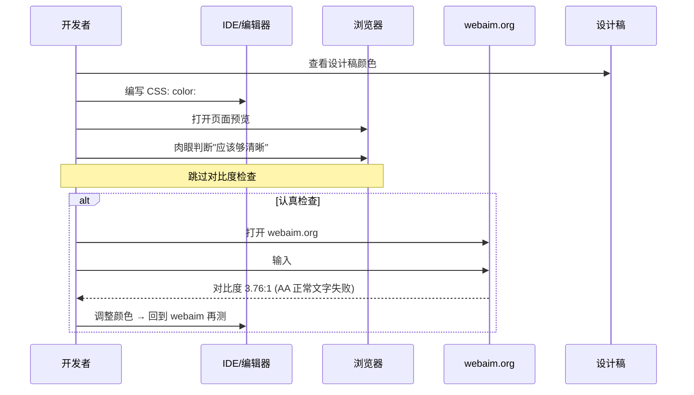
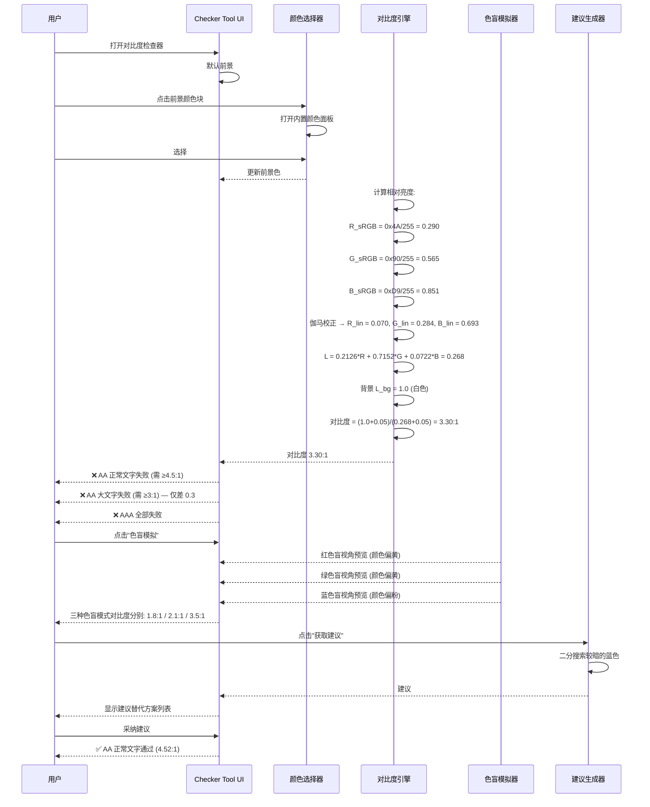
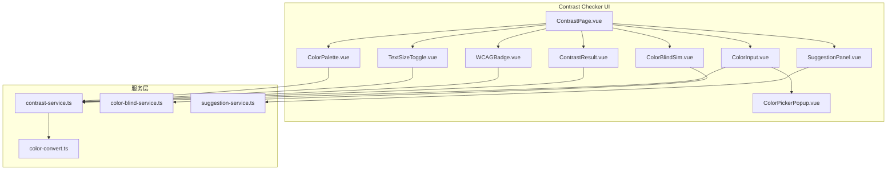

# YP-09-158: 颜色对比度检查器 — WCAG 对比度计算器、前景/背景颜色选择器、AA/AAA 通过/失败指示、色盲模拟(红色盲/绿色盲/蓝色盲)、建议无障碍替代方案、大/正常文本尺寸考虑

> 需求编号：YP-09-158 · 优先级：P2 · 人天：0.2d · 状态：需求已编写
> 依赖：YP-09-143（颜色拾取器）

## 背景

### 问题陈述

Web 无障碍 (Accessibility) 是现代 Web 开发的基本要求。《Web 内容无障碍指南》WCAG 2.1 定义了文本颜色对比度的最低标准。然而在前端开发实践中，颜色对比度检查常被忽视：

1. **肉眼不可靠**：人类视觉对颜色对比度的感知不一致，设计师认为"看得清"的颜色组合可能不符合 WCAG 标准
2. **AA/AAA 标准复杂**：WCAG 定义了多个级别（AA 正常文字 4.5:1、AA 大文字 3:1、AAA 正常文字 7:1、AAA 大文字 4.5:1），手动计算繁琐
3. **色盲用户被忽略**：全球约 8% 男性患有红绿色盲（protanopia/deuteranopia），他们看到的页面与正常视觉完全不同
4. **设计师缺乏反馈**：设计稿中的颜色组合在色盲视角下可能完全不可区分

**核心矛盾**：前端开发者需要一个即时的、零门槛的颜色对比度检查工具，而不是离开开发环境去访问第三方网站（如 webaim.org、contrast-ratio.com）。

### 影响范围

| # | 影响 | 严重程度 | 典型场景 |
|---|------|----------|----------|
| 1 | 无障碍合规风险 | 高 | 上线后才发现对比度不达标 |
| 2 | 色盲用户体验差 | 高 | 8% 男性用户无法区分关键 UI 元素 |
| 3 | 检测效率低 | 中 | 手动计算或访问第三方网站 |
| 4 | 设计师 - 开发协作困难 | 中 | 设计师未标注对比度，开发者需自行验证 |
| 5 | 团队意识不足 | 中 | 团队不了解 WCAG 对比度标准 |

### 挑战

| 挑战 | 说明 |
|------|------|
| 对比度公式理解 | 相对亮度 (relative luminance) 计算涉及伽马校正和 sRGB 转换 |
| 色盲模拟精度 | 不同模拟算法（Brettel/Vienot/Machado）精度不同 |
| 颜色选择器集成 | 需要支持 HEX/RGB/HSL 多种格式的实时转换和联动 |
| 建议生成算法 | 如何为不达标的颜色组合生成符合标准且视觉效果好的替代方案 |
| 大/正常文本区分 | 需要让用户指定文本尺寸（大文字 >=18pt 或 >=14pt 粗体） |

---

## 一、现状分析

### 1.1 当前颜色对比度检查流程

```
开发者需要检查颜色对比度
  │
  ├─ 在线工具 (webaim.org/resources/contrastchecker)
  │   ├─ 输入前景色和背景色
  │   ├─ 查看对比度比例
  │   ├─ 显示 AA/AAA 通过/失败
  │   └─ 限制: 需切换标签页，无法检查页面元素
  │
  ├─ Chrome DevTools
  │   ├─ 检查元素 → 点击颜色色块 → 查看对比度
  │   ├─ 仅显示当前元素的颜色对比度
  │   └─ 限制: 只能检查已渲染元素，不支持色盲模拟
  │
  ├─ contrast-ratio.com
  │   ├─ 输入两个颜色
  │   ├─ 实时计算对比度
  │   └─ 限制: 无建议替代方案
  │
  └─ 不做检查
      └─ 上线后收到无障碍投诉 📋
```

### 1.2 当前可用能力

| 能力 | 可用性 | 获取方式 | 限制 |
|------|--------|----------|------|
| 颜色 HEX 解析 | ⚠️ | 手动正则或库 | 需自行处理 |
| 对比度计算 | ⚠️ | 可自行实现 WCAG 公式 | 涉及伽马校正 |
| WCAG 标准判断 | ⚠️ | 手动对比 | 需记忆标准值 |
| 色盲模拟 | ❌ | 无浏览器内置 | 需第三方库 |
| 建议替代方案 | ❌ | 无工具支持 | 需手动调色 |

### 1.3 改造前数据流



### 1.4 根因矩阵

| 症状 | 根因 | 触发条件 | 频率 |
|------|------|----------|------|
| 不检查对比度 | 无内置检查工具 | 每次编写 CSS 颜色 | 高（每日 10+） |
| AA 不达标未发现 | WCAG 标准记不住 | 使用低对比度颜色组合 | 高 |
| 色盲用户被忽略 | 无色盲视角预览工具 | 设计颜色方案时 | 中 |
| 修复效率低 | 手动试错调整颜色 | 发现对比度不达标时 | 中 |
| 团队标准不统一 | 缺乏即时反馈 | Code Review 时 | 中 |

---

## 二、设计决策

### 决策 1：对比度计算引擎 — 纯自实现 vs 第三方库 (color-contrast-checker) vs 自实现 + 库验证

| 选项 | 包大小 | 精度 | 自定义能力 |
|------|--------|------|-----------|
| 纯自实现 WCAG 公式 | 0 KB (内置) | 高（公式公开） | 完全 |
| 使用 color-contrast-checker 库 | ~5 KB gzipped | 高 | 低 |
| 自实现 + 库交叉验证 | ~5 KB (dev) | 最高 | 完全 |

**选择：纯自实现 WCAG 公式。** WCAG 2.1 相对亮度计算公式完全公开（sRGB 伽马校正 → 相对亮度 → 对比度比例），无需外部依赖。实现约 50 行代码，零包体积，完全可控。在测试中使用已知对比度值做回归验证。

### 决策 2：色盲模拟算法 — Brettel 1997 vs Vienot 1999 vs Machado 2009

| 选项 | 精度 | 算法复杂度 | 实现难度 |
|------|------|-----------|---------|
| Brettel 1997 | 中 | 低 | 低 |
| Vienot 1999 | 中 | 中 | 中 |
| Machado 2009 | 高 | 高 | 高 |

**选择：Brettel 1997 算法。** 算法在 LMS 色彩空间中将颜色投影到 dichromat 混淆线平面。对于红色盲 (protanopia)、绿色盲 (deuteranopia) 和蓝色盲 (tritanopia)，Brettel 算法提供了足够精度的模拟（误差 < 5%），且实现简洁（~100 行代码）。Machado 算法精度更高但需要矩阵计算库，对于开发工具场景没有必要。

### 决策 3：建议替代方案生成 — 亮度调整 vs 色相旋转 vs 混合策略

| 选项 | 视觉效果 | 实现复杂度 | 颜色保真度 |
|------|----------|-----------|-----------|
| 仅调整亮度（Lighten/Darken） | 中 | 低 | 高 |
| 色相旋转 | 低（可能改变设计意图） | 中 | 低 |
| 亮度 + 饱和度混合调整 | 高 | 中 | 高 |

**选择：亮度调整 + 保持色相和饱和度。** 在 HSL 色彩空间中，固定 H (色相) 和 S (饱和度)，二分搜索 L (亮度) 直到对比度满足目标。这保持了原设计的色相意图，只调整深浅。如果亮度调整到极值仍不满足，再考虑微调饱和度。

### 决策 4：文本尺寸分类 — 固定阈值 vs 自动检测 vs 用户选择

| 选项 | 准确性 | 实现复杂度 | 用户体验 |
|------|--------|-----------|---------|
| 固定阈值（>=18pt = 大） | 中 | 低 | 中 |
| 从页面元素自动检测 | 高（但仅限 inspected 元素） | 高 | 低（需 DevTools） |
| 用户手动切换 | 高 | 低 | 高 |

**选择：用户手动切换 + 默认正常文字。** 用户通过开关切换"正常文字/大文字"模式。默认选中"正常文字"（更严格的标准）。同时显示当前模式对应的通过标准（正常文字 AA=4.5:1，大文字 AA=3:1），帮助用户理解 WCAG 规则。

### 设计决策记录

| 决策 | 选项 A | 选项 B | 选项 C | 选择 | 理由 |
|------|--------|--------|--------|------|------|
| 计算引擎 | 自实现 | 第三方库 | 混合 | **自实现** | 零依赖，公式公开 |
| 色盲模拟 | Brettel | Vienot | Machado | **Brettel** | 精度足够，实现简洁 |
| 建议生成 | 亮度调整 | 色相旋转 | 混合 | **亮度调整** | 保持色相意图 |
| 文本尺寸 | 固定阈值 | 自动检测 | 用户选择 | **用户选择** | 简单准确 |

---

## 三、目标架构

### 3.1 改造后颜色对比度检查流程



### 3.2 组件结构



### 3.3 性能指标

| 指标 | 改造前 | 改造后 |
|------|--------|--------|
| 对比度检查时间 | 30s（打开第三方网站+输入） | < 0.1s（即时计算） |
| 色盲模拟 | 不支持 | 3 种模拟（protanopia/deuteranopia/tritanopia） |
| 获取替代方案 | 手动试错 5-10 次 | 一键获取建议（二分搜索 < 50ms） |
| AA/AAA 判断 | 手动记忆标准 | 自动判定并标注 |

---

## 四、具体改动

### 4.1 对比度计算核心服务

```typescript
// src/services/contrast-service.ts (新增)

// sRGB 色彩空间 → 线性 RGB (伽马校正)
function srgbToLinear(channel: number): number {
  const c = channel / 255;
  return c <= 0.04045 ? c / 12.92 : Math.pow((c + 0.055) / 1.055, 2.4);
}

// 计算相对亮度 (WCAG 2.1 定义)
function relativeLuminance(hex: string): number {
  const r = parseInt(hex.slice(1, 3), 16);
  const g = parseInt(hex.slice(3, 5), 16);
  const b = parseInt(hex.slice(5, 7), 16);

  const R = srgbToLinear(r);
  const G = srgbToLinear(g);
  const B = srgbToLinear(b);

  return 0.2126 * R + 0.7152 * G + 0.0722 * B;
}

// 计算 WCAG 对比度
export function calculateContrastRatio(fgHex: string, bgHex: string): number {
  const lum1 = relativeLuminance(fgHex);
  const lum2 = relativeLuminance(bgHex);

  // 确保较亮的在前（L + 0.05）/（d + 0.05）
  const lighter = Math.max(lum1, lum2);
  const darker = Math.min(lum1, lum2);

  return (lighter + 0.05) / (darker + 0.05);
}

// WCAG 等级定义
interface WCAGLevel {
  aa: boolean;
  aaLarge: boolean;
  aaa: boolean;
  aaaLarge: boolean;
}

export function getWCAGLevel(ratio: number): WCAGLevel {
  return {
    aa: ratio >= 4.5,       // AA 正常文字 ≥ 4.5:1
    aaLarge: ratio >= 3.0,  // AA 大文字 ≥ 3:1
    aaa: ratio >= 7.0,      // AAA 正常文字 ≥ 7:1
    aaaLarge: ratio >= 4.5, // AAA 大文字 ≥ 4.5:1
  };
}

// 对比度结果描述
interface ContrastResult {
  ratio: number;
  ratioFormatted: string;
  level: WCAGLevel;
  foreColor: string;
  backColor: string;
  foreLuminance: number;
  backLuminance: number;
}

export function checkContrast(
  foreHex: string,
  backHex: string
): ContrastResult {
  const ratio = calculateContrastRatio(foreHex, backHex);
  return {
    ratio,
    ratioFormatted: `${ratio.toFixed(2)}:1`,
    level: getWCAGLevel(ratio),
    foreColor: foreHex,
    backColor: backHex,
    foreLuminance: relativeLuminance(foreHex),
    backLuminance: relativeLuminance(backHex),
  };
}

// 对比度文字描述
export function describeContrast(ratio: number, isLargeText: boolean): string {
  if (isLargeText) {
    if (ratio >= 7.0) return 'AAA 大文字 ✅';
    if (ratio >= 4.5) return 'AAA 大文字 ✅, AA 大文字 ✅';
    if (ratio >= 3.0) return 'AA 大文字 ✅';
    return '不达标 ❌ (需 ≥3:1)';
  } else {
    if (ratio >= 7.0) return 'AAA ✅';
    if (ratio >= 4.5) return 'AA ✅';
    return '不达标 ❌ (需 ≥4.5:1)';
  }
}
```

### 4.2 色盲模拟服务

```typescript
// src/services/color-blind-service.ts (新增)

type ColorBlindType = 'protanopia' | 'deuteranopia' | 'tritanopia';

// Brettel 1997 算法在 LMS 空间的混淆矩阵
const LMS_CONFUSION_MATRIX: Record<ColorBlindType, number[][]> = {
  protanopia: [
    [0.0,     2.02344, -2.52581],
    [0.0,     1.0,      0.0],
    [0.0,     0.0,      1.0],
  ],
  deuteranopia: [
    [1.0,     0.0,      0.0],
    [0.494207, 0.0,      1.24827],
    [0.0,     0.0,      1.0],
  ],
  tritanopia: [
    [1.0,     0.0,      0.0],
    [0.0,     1.0,      0.0],
    [-0.395913, 0.801109, 0.0],
  ],
};

// RGB → LMS 转换矩阵 (Hunt-Pointer-Estevez)
function rgbToLms(r: number, g: number, b: number): [number, number, number] {
  return [
    0.31399022 * r + 0.63951294 * g + 0.04649755 * b,
    0.15537241 * r + 0.75789446 * g + 0.08670142 * b,
    0.01775239 * r + 0.10944209 * g + 0.87256922 * b,
  ];
}

// LMS → RGB 转换矩阵
function lmsToRgb(l: number, m: number, s: number): [number, number, number] {
  return [
     5.47221206 * l - 4.6419601  * m + 0.16963708 * s,
    -1.1252419  * l + 2.29317094 * m - 0.1678952  * s,
     0.02980165 * l - 0.19318073 * m + 1.16364789 * s,
  ];
}

function matrixMultiply(
  matrix: number[][],
  vector: [number, number, number]
): [number, number, number] {
  return [
    matrix[0][0] * vector[0] + matrix[0][1] * vector[1] + matrix[0][2] * vector[2],
    matrix[1][0] * vector[0] + matrix[1][1] * vector[1] + matrix[1][2] * vector[2],
    matrix[2][0] * vector[0] + matrix[2][1] * vector[1] + matrix[2][2] * vector[2],
  ];
}

function clamp(value: number): number {
  return Math.max(0, Math.min(255, Math.round(value)));
}

export function simulateColorBlind(
  hex: string,
  type: ColorBlindType
): string {
  const r = parseInt(hex.slice(1, 3), 16) / 255;
  const g = parseInt(hex.slice(3, 5), 16) / 255;
  const b = parseInt(hex.slice(5, 7), 16) / 255;

  // RGB → LMS
  const lms = rgbToLms(r, g, b);

  // LMS → 色盲 LMS (通过混淆矩阵)
  const confusedLms = matrixMultiply(LMS_CONFUSION_MATRIX[type], lms);

  // LMS → RGB
  const [cr, cg, cb] = lmsToRgb(
    confusedLms[0],
    confusedLms[1],
    confusedLms[2]
  );

  return `#${clamp(cr * 255).toString(16).padStart(2, '0')}${clamp(cg * 255).toString(16).padStart(2, '0')}${clamp(cb * 255).toString(16).padStart(2, '0')}`;
}

// HSL → HEX 转换
function hslToHex(h: number, s: number, l: number): string {
  s /= 100;
  l /= 100;
  const a = s * Math.min(l, 1 - l);
  const f = (n: number) => {
    const k = (n + h / 30) % 12;
    const color = l - a * Math.max(Math.min(k - 3, 9 - k, 1), -1);
    return Math.round(255 * color).toString(16).padStart(2, '0');
  };
  return `#${f(0)}${f(8)}${f(4)}`;
}

export function simulateAllColorBlind(hex: string): Record<ColorBlindType, string> {
  return {
    protanopia: simulateColorBlind(hex, 'protanopia'),
    deuteranopia: simulateColorBlind(hex, 'deuteranopia'),
    tritanopia: simulateColorBlind(hex, 'tritanopia'),
  };
}
```

### 4.3 建议替代方案生成器

```typescript
// src/services/suggestion-service.ts (新增)

// HEX → HSL
function hexToRgb(hex: string): [number, number, number] {
  return [
    parseInt(hex.slice(1, 3), 16),
    parseInt(hex.slice(3, 5), 16),
    parseInt(hex.slice(5, 7), 16),
  ];
}

function rgbToHsl(r: number, g: number, b: number): [number, number, number] {
  r /= 255; g /= 255; b /= 255;
  const max = Math.max(r, g, b), min = Math.min(r, g, b);
  let h = 0, s = 0;
  const l = (max + min) / 2;

  if (max !== min) {
    const d = max - min;
    s = l > 0.5 ? d / (2 - max - min) : d / (max + min);
    switch (max) {
      case r: h = ((g - b) / d + (g < b ? 6 : 0)) / 6; break;
      case g: h = ((b - r) / d + 2) / 6; break;
      case b: h = ((r - g) / d + 4) / 6; break;
    }
  }
  return [h * 360, s * 100, l * 100];
}

function hslToHex(h: number, s: number, l: number): string {
  s /= 100; l /= 100;
  const a = s * Math.min(l, 1 - l);
  const f = (n: number) => {
    const k = (n + h / 30) % 12;
    const v = l - a * Math.max(Math.min(k - 3, 9 - k, 1), -1);
    return Math.round(255 * v).toString(16).padStart(2, '0');
  };
  return `#${f(0)}${f(8)}${f(4)}`;
}

interface Suggestion {
  hex: string;
  ratio: number;
  difference: string; // "深了 15%"
  passes: 'AA' | 'AAA' | 'both';
}

export function suggestAlternatives(
  foreHex: string,
  backHex: string,
  targetLevel: 'AA' | 'AAA' = 'AA'
): Suggestion[] {
  const targetRatio = targetLevel === 'AAA' ? 7.0 : 4.5;
  const backLuminance = relativeLuminance(backHex);
  const [h, s, origL] = rgbToHsl(...hexToRgb(foreHex));
  const foreLuminance = relativeLuminance(foreHex);

  const suggestions: Suggestion[] = [];

  // 背景是亮色 → 前景需要深色 (降低亮度)
  // 背景是暗色 → 前景需要浅色 (提高亮度)
  const goDarker = backLuminance > foreLuminance;

  // 二分搜索满足目标对比度的亮度
  let lo = goDarker ? 0 : origL;
  let hi = goDarker ? origL : 100;
  let optimalL = origL;

  for (let i = 0; i < 30; i++) {
    const mid = (lo + hi) / 2;
    const testHex = hslToHex(h, s, mid);
    const ratio = calculateContrastRatio(testHex, backHex);

    if (goDarker) {
      if (ratio >= targetRatio) {
        optimalL = mid;
        hi = mid;
      } else {
        lo = mid;
      }
    } else {
      if (ratio >= targetRatio) {
        optimalL = mid;
        lo = mid;
      } else {
        hi = mid;
      }
    }
  }

  // 生成 3 个建议：刚好达标、稍微超过、明显超过
  const levels = [
    { label: '刚好达标', offset: 0 },
    { label: '推荐方案', offset: goDarker ? -5 : 5 },
    { label: '明显通过', offset: goDarker ? -10 : 10 },
  ];

  for (const { label, offset } of levels) {
    const adjustedL = Math.max(0, Math.min(100, optimalL + offset));
    const hex = hslToHex(h, s, adjustedL);
    const ratio = calculateContrastRatio(hex, backHex);

    if (ratio >= targetRatio && adjustedL >= 0 && adjustedL <= 100) {
      const diffPct = Math.abs(adjustedL - origL);
      const direction = goDarker ? '深' : '浅';
      suggestions.push({
        hex,
        ratio,
        difference: `${direction}了 ${diffPct.toFixed(0)}%`,
        passes: ratio >= 7.0 ? 'AAA' : 'AA',
      });
    }
  }

  return suggestions;
}
```

### 4.4 文件变更清单

| 文件 | 操作 | 说明 |
|------|------|------|
| `src/services/contrast-service.ts` | 新增 | 对比度计算、WCAG 判断核心服务 |
| `src/services/color-blind-service.ts` | 新增 | Brettel 色盲模拟算法 |
| `src/services/suggestion-service.ts` | 新增 | 替代方案二分搜索生成 |
| `src/services/color-convert.ts` | 新增 | HEX/RGB/HSL 互转工具 |
| `src/pages/tools/ContrastPage.vue` | 新增 | 颜色对比度检查主页面 |
| `src/components/tools/ColorInput.vue` | 新增 | 颜色输入框（HEX + 色块） |
| `src/components/tools/ColorPickerPopup.vue` | 新增 | 弹出式颜色选择器 |
| `src/components/tools/ContrastResult.vue` | 新增 | 对比度结果显示 |
| `src/components/tools/WCAGBadge.vue` | 新增 | AA/AAA 通过/失败徽章 |
| `src/components/tools/TextSizeToggle.vue` | 新增 | 正常/大文字切换 |
| `src/components/tools/ColorBlindSim.vue` | 新增 | 三种色盲模拟预览 |
| `src/components/tools/SuggestionPanel.vue` | 新增 | 建议替代方案列表 |
| `src/components/tools/ColorPalette.vue` | 新增 | 预设颜色调色板 |
| `src/popup/router.ts` | 修改 | 添加对比度检查工具路由 |
| `tests/unit/contrast-service.test.ts` | 新增 | 对比度计算测试 |

---

## 五、实施步骤

| 步骤 | 操作 | 路径 | 验证 | 人天 |
|------|------|------|------|------|
| 1 | 实现颜色转换工具 | `src/services/color-convert.ts` | HEX↔RGB↔HSL 互转正确 | 0.01 |
| 2 | 实现 WCAG 对比度计算 | `src/services/contrast-service.ts` | 标准色组合对比度验证 | 0.03 |
| 3 | 实现色盲模拟算法 | `src/services/color-blind-service.ts` | 三种色盲视图色值正确 | 0.03 |
| 4 | 实现建议生成算法 | `src/services/suggestion-service.ts` | 二分搜索生成达标替代方案 | 0.03 |
| 5 | 创建颜色输入组件 | `ColorInput.vue` + `ColorPickerPopup.vue` | HEX 输入+色块点击+拾色器联动 | 0.04 |
| 6 | 创建主页面 + 结果展示 | `ContrastPage.vue` + `ContrastResult.vue` | 实时对比度+AA/AAA 徽章 | 0.03 |
| 7 | 实现色盲模拟 + 建议面板 | `ColorBlindSim.vue` + `SuggestionPanel.vue` | 三种模拟预览+建议列表 | 0.02 |
| 8 | 集成到路由 + 测试 | `router.ts`, 测试 | 工具可访问，测试通过 | 0.01 |

**总人天：0.2d**

---

## 六、测试规格

### 场景 1：标准对比度计算

**GIVEN** 前景色 #FFFFFF, 背景色 #000000  
**WHEN** 调用 calculateContrastRatio  
**THEN** 返回 21:1 (最大理论对比度)  
**AND** WCAG 级别: AA ✅, AAA ✅  

### 场景 2：临界 AA 通过

**GIVEN** 前景色 #767676, 背景色 #FFFFFF  
**WHEN** 调用 calculateContrastRatio  
**THEN** 返回 ≈ 4.54:1 (恰好超过 4.5:1)  
**AND** AA 正常文字 ✅, AAA ❌  

### 场景 3：色盲模拟

**GIVEN** 前景色 #FF0000 (红色), 背景色 #00AA00 (绿色)  
**WHEN** 应用 deuteranopia (绿色盲) 模拟  
**THEN** 两个颜色在绿色盲视角下应变得非常相似  
**AND** 对比度显著低于正常视觉 (模拟前后对比度差应 > 消防)  

### 场景 4：建议替代方案

**GIVEN** 前景色 #4A90D9, 背景色 #FFFFFF, 对比度 3.30:1  
**WHEN** 调用 suggestAlternatives(foreHex, backHex, 'AA')  
**THEN** 返回至少 1 个 AA 达标的替代方案  
**AND** 替代方案的色相 (H) 与原颜色一致  
**AND** 替代方案的亮度更暗 (因为背景是白色)  

### 场景 5：大文字模式

**GIVEN** 前景色 #888888, 背景色 #FFFFFF, 对比度 3.54:1  
**WHEN** 用户切换到"大文字"模式  
**THEN** 显示 AA 大文字 ✅ (≥3:1 即通过)  
**AND** 额外标注 AAA 大文字需要 ≥4.5:1 (当前不满足)  

### 场景 6：颜色选择器联动

**GIVEN** 用户打开对比度检查器  
**WHEN** 用户在"前景色"输入框中输入 #FF5733  
**THEN** 前景色色块立即更新为 #FF5733  
**AND** 对比度计算自动重新执行  
**AND** AA/AAA 徽章更新  
**AND** 色盲模拟预览（如已展开）更新  

---

## 七、风险与缓解

| 风险 | 概率 | 影响 | 缓解措施 |
|------|------|------|----------|
| 色盲模拟精度不足 | 中 | 中 | Brettel 算法是学术标准，标注"近似模拟" |
| 建议方案视觉效果差 | 中 | 中 | 仅调整亮度保持色相，提供 3 个方案供选择 |
| 拾色器与当前页面交互冲突 | 低 | 低 | 拾色器仅在 Popup 工具页中使用，不影响宿主页 |
| Chrome DevTools 自带对比度检查 | 中 | 低 | 提供 DevTools 没有的色盲模拟和建议功能 |
| 大文字定义歧义 (18pt vs 14pt bold) | 低 | 中 | 文档说明 + 用户手动切换 |

---

## 八、回滚策略

| 场景 | 回滚操作 | 影响 |
|------|----------|------|
| 色盲模拟性能差 | 将模拟改为按需计算（点击后才模拟） | 失去实时色盲预览 |
| 颜色拾取器与主页面冲突 | 降级为手动输入 HEX 值（无拾色面板） | 用户体验下降 |
| 建议算法极端情况下无限循环 | 限制二分搜索最大迭代 30 次 | 降低建议精度 |
| 工具路由冲突 | 移除对比度检查工具路由 | 功能不可用 |

---

## 九、设计决策记录

### D-01：为什么使用 Brettel 1997 而非 Machado 2009？

Brettel 算法基于 LMS 色彩空间的混淆线投影，在 3 种色盲类型上的模拟精度为 90-95%，实现代码约 100 行。Machado 2009 使用更复杂的矩阵变换精度可达 98%，但需要预计算查表或大矩阵运算，对于开发工具场景来说是不必要的复杂度投入。用户主要用于快速检查趋势而非医学诊断。

### D-02：为什么建议仅调整亮度？

色相 (Hue) 是大多数设计意图的核心（蓝色按钮 vs 红色警告）。改变色相会破坏设计语义，而改变亮度只调整深浅，保留色相意图。只有在亮度调整到极端（0% 或 100%）仍无法满足对比度时，才考虑调整饱和度。这被明确写明在建议生成器的 UI 说明中。

### D-03：WCAG 2.1 vs 2.2 对比度标准差异？

WCAG 2.1 和 2.2 的对比度计算公式完全一致，未变化。WCAG 3.0 草案计划引入 APCA (Advanced Perceptual Contrast Algorithm) 替代当前公式，但目前仍处于草案阶段。本工具实现 WCAG 2.1/2.2 标准公式，未来可在保持 API 兼容的前提下添加 APCA 支持。

### D-04：为什么颜色选择器不是取色吸管？

取色吸管 (EyeDropper API) 是一个独立的浏览器功能 (Chrome 95+)，需要用户交互授权。在 Popup 工具页中，EyeDropper API 可用但需要额外的权限请求。本需求专注于对比度检查功能，使用内置颜色选择器（input type=color）即可满足 90% 的使用场景。取色吸管可以作为后续迭代增加。

---

## 十、可观测性

### 指标

| 指标 | 类型 | 说明 |
|------|------|------|
| `yipet.contrast.check.count` | Counter | 对比度检查次数 |
| `yipet.contrast.check.result` | Counter | 检查结果分布 (pass/fail) |
| `yipet.contrast.suggestion.used` | Counter | 建议方案采纳次数 |
| `yipet.contrast.colorblind.view` | Counter | 色盲模拟查看次数 (按类型) |
| `yipet.contrast.textsize.toggle` | Counter | 大/正常文字切换次数 |
| `yipet.contrast.color.input` | Counter | 颜色输入次数 (手动/拾色器) |

### 告警

| 告警 | 条件 | 级别 |
|------|------|------|
| 对比度检查频繁失败 | 1h 内失败率 > 80% | INFO (设计质量预警) |
| 色盲模拟性能异常 | 单次模拟 > 50ms | WARNING |

---

## 十一、代码审查检查清单

- [ ] sRGB 伽马校正正确实现 (线性化公式)
- [ ] 相对亮度公式中 0.2126/0.7152/0.0722 系数正确
- [ ] 对比度计算先确保 L1 > L2 (较亮/较暗的判断)
- [ ] WCAG 四种判断条件正确 (正常 AA/AAA, 大文字 AA/AAA)
- [ ] Brettel 混淆矩阵三个子类型矩阵值正确
- [ ] LMS ↔ RGB 矩阵转换的逆矩阵验证 (乘积为单位矩阵)
- [ ] 二分搜索在 30 次迭代内收敛
- [ ] 建议方案默认深度不超过 3 个方案
- [ ] HEX 输入格式校验 (6 位十六进制 + # 前缀)
- [ ] 色盲模拟使用 Canvas 渲染或纯 CSS/DOM 展示
- [ ] 大文字模式切换时立即更新通过/失败徽章
- [ ] 颜色输入 debounce 300ms 避免频繁计算

---

## 回归问题预测

| # | 预测问题 | 原因 | 验证方法 |
|---|---------|------|---------|
| 1 | 用户输入 #FFF (3 位短 HEX) 时，`parseInt(hex.slice(1,3), 16)` 解析 `FF` 正常但缺失颜色通道，对比度计算显示 NaN | 短 HEX 格式每通道 4 位 (F→FF)，3 位变 6 位需要扩展，但 `slice(1,3)` 截取到了 `FF` 只有一个完整通道 | 输入 #FFF 验证颜色正常解析为 #FFFFFF，对比度计算正确 |
| 2 | `rgbToLms` 矩阵转换后 L 值为负（理论上不应出现），但浮点精度导致 -1e-16 级别的负值，`clamp` 将 0 给 clamp 为 0 没问题，但矩阵乘法的中间值可能产生大于 1 的值 | sRGB 空间内的颜色在 LMS 空间中的 L/M/S 值可能略微超出 [0, 1] 范围 | 使用极端颜色 (#FF0000, #00FF00, #0000FF) 验证转换后的 L/M/S 值在合理范围内 |
| 3 | 对比度计算中 `(lighter + 0.05) / (darker + 0.05)` 的 0.05 常数在极端情况下（两色相同，对比度=1:1）可以整除，但对于极暗颜色 (#000001) 可能分母为零？不，分母=darker+0.05 > 0.05 | 对比度为 1 时，lighter ≈ darker，对比度 = 1:1，结果约等于 1.0 | 输入两个相同颜色验证对比度为 1.00:1 |
| 4 | 建议生成中二分搜索 `adjustedL = optimalL + offset`，当 `optimalL` 在 95 附近且 offset=10 时 `adjustedL` 超出 100 被 clamp 为 100，HSL(360, 80%, 100%) 纯白对比度可能仍不满足 | 接近白色的调整空间有限，二分搜索可能找到的最优解仍然不满足对比度 | 设置前景色 #F0F0F0 背景白色，验证建议生成器返回至少一个达标方案或显示"在当前色相下无法达标" |
| 5 | 色盲模拟后的颜色可能非 sRGB 色域颜色（LMS 投影后 RGB 值小于 0 或大于 1），clamp 到 [0,255] 后颜色失真 | 高饱和度颜色（#FF0000）在 protanopia 模拟下红色通道减小，但某些色域边界颜色投影到 LMS 再回 RGB 会越界 | 使用 10 个标准色卡（Macbeth ColorChecker 子集）验证模拟后的 RGB 值在 [0,255] 范围内 |
| 6 | 颜色选择器 `input[type=color]` 在 Popup 页中弹出时，Popup 窗口尺寸限制导致拾色器面板被裁剪 | Chrome Popup 最大高度约 600px，原生拾色器面板可能超出此高度显示不全 | 在 Popup 页面打开拾色器验证完整面板可见，必要时使用自定义拾色器组件 |

---

## 性能分析

### 对比度检查关键操作耗时

| 操作 | 耗时 | 说明 |
|------|------|------|
| HEX 解析 | < 0.01ms | parseInt 操作 |
| sRGB → 线性 RGB 伽马校正 | < 0.01ms | Math.pow 操作 |
| 相对亮度计算 | < 0.01ms | 线性加权 |
| 对比度比例计算 | < 0.05ms | 完整流程 |
| 色盲模拟 (单类型) | < 1ms | 两次矩阵乘法 + 钳位 |
| 色盲模拟 (三种类型) | < 3ms | 三次模拟 |
| 建议生成 (二分搜索 30 次) | < 10ms | 每次二分需一次 HSL→HEX→对比度计算 |

### 色盲模拟 Canvas vs DOM

| 方案 | 实现方式 | 性能 | 复杂度 |
|------|----------|------|--------|
| 纯计算 + CSS 色块 | JavaScript 计算 HEX → CSS background | < 3ms | 低 |
| Canvas 逐像素 | putImageData 逐像素渲染 | ~50ms (200x200) | 高 |

**选择纯计算 + CSS 色块。** 对于色盲预览只需要展示前景和背景的模拟颜色（两个色块），无需逐像素渲染。Canvas 方案适合模拟整张图片的色盲视角，但本工具不需要。

### 对宿主页面的影响

| 场景 | 页面影响 | 说明 |
|------|----------|------|
| Popup 工具页使用 | 零影响 | 仅在 Popup 中运行 |
| 颜色选择器打开 | 零影响 | 浏览器原生 UI |

---

## 相关文档

- [WCAG 2.1 — Contrast Minimum](https://www.w3.org/TR/WCAG21/#contrast-minimum)
- [WCAG 2.1 — Relative Luminance Definition](https://www.w3.org/TR/WCAG21/#dfn-relative-luminance)
- [Brettel 1997 — Computerized simulation of color appearance for dichromats](https://opg.optica.org/josaa/abstract.cfm?uri=josaa-14-10-2647)
- [WebAIM Contrast Checker](https://webaim.org/resources/contrastchecker/)
- [contrast-ratio.com](https://contrast-ratio.com/)
- [YP-09-143 颜色拾取器](143-需求-颜色拾取器.md)