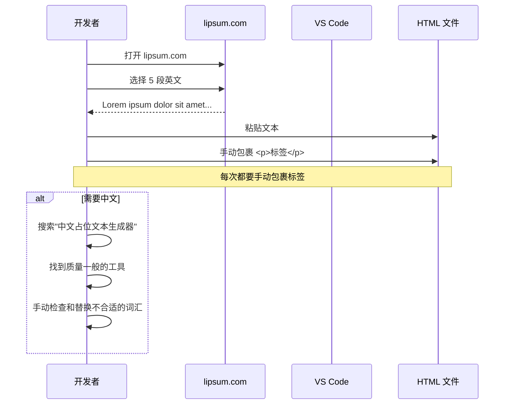
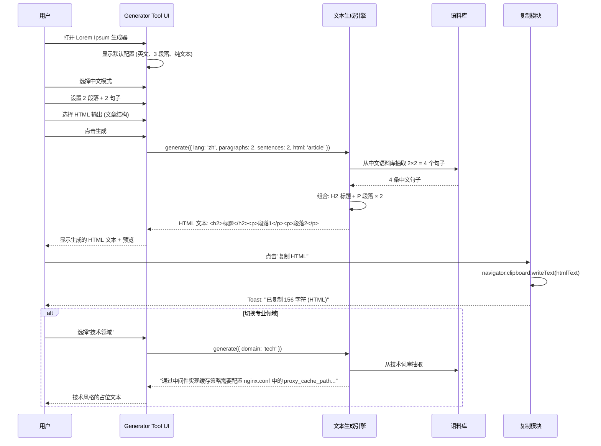
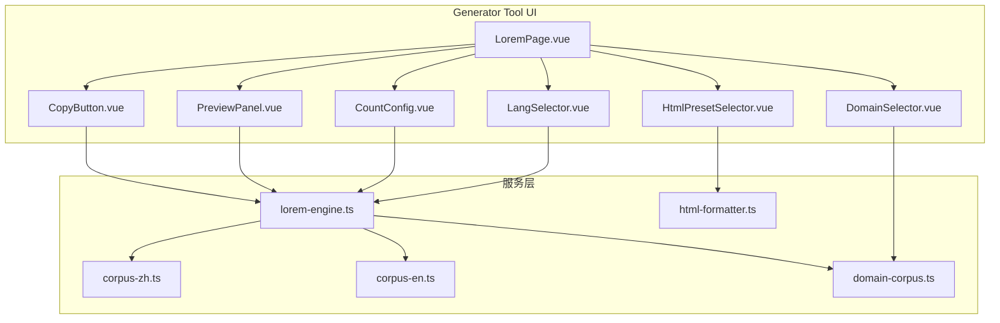

# YP-09-159: Lorem Ipsum 生成器 — 占位文本生成器、可配置段落/句子/词数、中英文模式、专业领域 ipsum (技术/烹饪/设计)、HTML 格式带标签输出、一键复制

> 需求编号：YP-09-159 · 优先级：P2 · 人天：0.2d · 状态：需求已编写
> 依赖：无

## 背景

### 问题陈述

前端开发和 UI 设计中占位文本是必不可少的工具。设计师和开发者经常需要填充大段文字来验证布局、排版和内容流。当前的占位文本获取方式存在以下痛点：

1. **英文 Lorem Ipsum 泛滥但中文缺失**：网络上 Lorem Ipsum 生成器几乎全是英文，中文占位文本（如"乱数假文"）生成器极少且文本质量低
2. **通用的无意义文本不够精准**：标准的 "Lorem ipsum dolor sit amet..." 不适用于特定行业的原型（如技术文档需要技术术语填充、烹饪网站需要食材相关文字）
3. **HTML 格式输出不自带标签**：在网页原型中，文本需要包裹在 `<p>`/`<h1>`/`<ul>` 等 HTML 标签中，但普通生成器只输出纯文本，每次都需要手动添加标签
4. **配置粒度不够**：大多数工具只能控制段落数，无法精确控制句子、单词数，或生成特定结构（标题+段落+列表）
5. **复制体验差**：需要选中全部文本再 Ctrl+C，部分工具的选中体验不佳

**核心矛盾**：每天多次生成占位文本（前端开发 5-10 次/天，设计师 3-5 次/天），但没有一个工具能满足中文+英文+专业领域+HTML 标签的全部需求。

### 影响范围

| # | 影响 | 严重程度 | 典型场景 |
|---|------|----------|----------|
| 1 | 中文占位文本难获取 | 高 | 中文网站原型需填充中文文本 |
| 2 | 行业文本不匹配 | 中 | 技术文档原型出现"consectetur adipiscing" |
| 3 | HTML 标签需手动添加 | 中 | 每次复制文本后手动包裹标签 |
| 4 | 参数不灵活 | 中 | 需要 2 个段落 + 1 个标题，但工具只支持段落数 |
| 5 | 格式不一致 | 中 | 团队成员使用不同工具生成，风格不统一 |

### 挑战

| 挑战 | 说明 |
|------|------|
| 中文占位文本语料库 | 需要足够大且不重复的中文词汇库 |
| 专业领域词库构建 | 需要为每个领域定义足够的词汇和短语模板 |
| HTML 标签组合逻辑 | 如何将多种标签（h1-h6 / p / ul / ol / blockquote）合理组合 |
| 内容不重复保证 | 生成的文本在合理范围内不重复 |
| 词数精确控制 | 段落/句子/词数之间的换算关系和处理 |

---

## 一、现状分析

### 1.1 当前占位文本生成流程

```
开发者需要占位文本
  │
  ├─ lipsum.com
  │   ├─ 选择段落数 (1-50)
  │   ├─ 点击生成
  │   ├─ 复制英文 Lorem Ipsum
  │   └─ 限制: 仅英文、无 HTML 标签、无中文
  │
  ├─ 中文乱数假文生成器 (少数中文网站)
  │   ├─ 生成中文无意义文本
  │   ├─ 文本连贯性差
  │   └─ 限制: 词库质量低、无控制粒度
  │
  ├─ VS Code 插件 (如 Lorem Ipsum)
  │   ├─ 在编辑器中输入 lorem + Tab
  │   ├─ 生成一段标准 Lorem Ipsum
  │   └─ 限制: 仅英文、无法配置、需要打开编辑
  │
  └─ 手动编写
      └─ 重复复制粘贴不相关的文字 🐢
```

### 1.2 当前可用能力

| 能力 | 可用性 | 获取方式 | 限制 |
|------|--------|----------|------|
| 英文 Lorem Ipsum | ⚠️ | lipsum.com / VS Code 插件 | 仅英文 |
| 中文占位文本 | ⚠️ | 少数中文生成器 | 词库小，质量低 |
| 专业领域文本 | ❌ | 无现成工具 | 需手动编写 |
| HTML 标签输出 | ❌ | 无工具支持 | 需手动包裹 |
| 精确词数控制 | ❌ | 大部分工具仅支持段落数 | 无细粒度控制 |

### 1.3 改造前数据流



### 1.4 根因矩阵

| 症状 | 根因 | 触发条件 | 频率 |
|------|------|----------|------|
| 中文占位文本难获取 | 无内置中文词库工具 | 开发中文项目 | 高（每日 5+） |
| 行业文本不匹配 | 无专业领域词库 | 制作行业原型 (技术/烹饪等) | 中 |
| 需手动添加 HTML 标签 | 生成器不输出 HTML | 网页原型 | 高 |
| 配置粒度粗 | 仅支持段落数参数 | 需要精确控制时 | 中 |
| 复制体验差 | 无专用复制按钮 | 每次复制 | 中 |

---

## 二、设计决策

### 决策 1：中文词库构建 — 随机字组合 vs 语料库抽取 vs 语义模板

| 选项 | 文本可读性 | 实现复杂度 | 不重复保证 |
|------|-----------|-----------|-----------|
| 随机字组合 (从常用字表随机) | 低 (无意义) | 低 | 易重复 |
| 语料库抽取 (预选 500 句) | 高 | 中 | 500 句内保证 |
| 语义模板 (主语+谓语+宾语) | 中 | 中 | 高 (组合爆炸) |

**选择：语料库抽取 + 语义模板混合。** 基础模式使用预选语料库（200 条中文句子从新闻/百科中精选），在句子数超过语料库时切换到语义模板动态生成（名词+动词+形容词组合）。英文使用经典 Lorem Ipsum 原文（Cicero 的 de Finibus Bonorum et Malorum），通过偏移和打乱保证不重复。

### 决策 2：专业领域支持 — 独立词库 vs 前缀/Lorem 变体 vs 领域模板

| 选项 | 领域感 | 维护成本 | 实现复杂度 |
|------|--------|----------|-----------|
| 独立领域词库 (技术词/烹饪词等) | 高 | 高 (每领域 100+ 词汇) | 中 |
| Lorem 变体 (Cupcake Ipsum 等) | 中 | 中 | 低 |
| 领域模板 + 领域词库混合 | 高 | 中 | 中 |

**选择：领域模板 + 领域词库。** 为每个领域（技术/烹饪/设计）维护核心词库（各 80-120 个词汇）和简单模板。生成时将词库按模板随机组合。例如技术领域："通过 `{技术名词}` 实现 `{技术动作}` 需要配置 `{文件}` 中的 `{属性}` 参数。"

### 决策 3：HTML 标签输出 — 固定模板 vs 自由组合 vs 预设模式

| 选项 | 灵活性 | 易用性 | 实现复杂度 |
|------|--------|--------|-----------|
| 固定模板 (P*N + H2) | 低 | 高 | 低 |
| 自由组合 (用户选择标签类型) | 高 | 低 | 中 |
| 预设模式 + 自定义 | 高 | 高 | 中 |

**选择：预设模式 + 自定义。** 提供常用预设模式：纯段落 `<p>`、文章结构 `<h2>+<p>`、列表结构 `<ul>+<li>`、混合 `<h2>+<p>+<blockquote>+<p>`。用户也可自定义选择标签组合。每个模式都有预览效果。

### 决策 4：复制方式 — 系统剪贴板 API vs execCommand vs 两者兼备

| 选项 | 兼容性 | 安全性 | 用户体验 |
|------|--------|--------|---------|
| navigator.clipboard.writeText | Chrome 66+ | 安全 (HTTPS) | 好 (异步 + 提示) |
| document.execCommand('copy') | 全兼容 | 低 | 中 (同步) |
| 两者兼备 (clipboard API 优先，降级 execCommand) | 全兼容 | 安全 | 最好 |

**选择：navigator.clipboard.writeText 优先 + execCommand 降级。** 现代浏览器 (Chrome 66+) 使用异步 Clipboard API 并显示"已复制"Toast，旧浏览器降级使用 execCommand。同时支持"选中复制"（纯文本）和"一键复制"（带 HTML 标签）。

### 设计决策记录

| 决策 | 选项 A | 选项 B | 选项 C | 选择 | 理由 |
|------|--------|--------|--------|------|------|
| 中文词库 | 随机字 | 语料库 | 模板 | **语料+模板** | 质量和覆盖率平衡 |
| 专业领域 | 独立词库 | Lorem 变体 | 模板+词库 | **模板+词库** | 可扩展且真实感强 |
| HTML 标签 | 固定模板 | 自由组合 | 预设+自定义 | **预设+自定义** | 既快又灵活 |
| 复制方式 | Clipboard API | execCommand | 两者兼备 | **两者兼备** | 全兼容+好体验 |

---

## 三、目标架构

### 3.1 改造后占位文本生成流程



### 3.2 组件结构



### 3.3 性能指标

| 指标 | 改造前 | 改造后 |
|------|--------|--------|
| 中文占位文本获取 | 搜索 2 分钟 (找工具) | < 0.5s (即时生成) |
| HTML 标签包裹 | 手动 30 秒/次 | 一键生成 |
| 专业领域切换 | 不支持 | 下拉切换即时生效 |
| 词数精确控制 | 仅段落数 | 段落/句子/词三级控制 |

---

## 四、具体改动

### 4.1 文本生成引擎

```typescript
// src/services/lorem-engine.ts (新增)

type Lang = 'zh' | 'en';
type Domain = 'general' | 'tech' | 'cooking' | 'design';
type HtmlPreset = 'plain' | 'paragraphs' | 'article' | 'list' | 'mixed';

interface GenerateOptions {
  lang: Lang;                    // 语言: zh/en
  mode: 'paragraphs' | 'sentences' | 'words';  // 计数模式
  count: number;                 // 数量
  domain?: Domain;               // 专业领域
  htmlPreset?: HtmlPreset;       // HTML 输出模式
  startWithLorem?: boolean;      // 是否以 "Lorem ipsum" 开头 (英文)
}

interface GenerateResult {
  plainText: string;             // 纯文本
  htmlText?: string;             // HTML 标签文本
  stats: {
    characters: number;
    words: number;
    sentences: number;
    paragraphs: number;
  };
}

class LoremEngine {
  private zhCorpus: string[];    // 中文语料库
  private enCorpus: string[];    // 英文 Lorem Ipsum 语料库
  private domainCorpora: Map<Domain, string[]>;  // 领域词库

  constructor() {
    this.zhCorpus = loadZhCorpus();
    this.enCorpus = loadEnCorpus();
    this.domainCorpora = new Map();
  }

  generate(options: GenerateOptions): GenerateResult {
    const corpus = this.getCorpus(options.lang, options.domain);
    const sentences = this.generateSentences(corpus, options);

    // 计算统计信息
    const allText = sentences.join(' ');
    const stats = {
      characters: allText.length,
      words: allText.split(/\s+/).filter(Boolean).length,
      sentences: sentences.length,
      paragraphs: 0,
    };

    // 根据模式组织文本
    let plainText: string;
    if (options.mode === 'paragraphs') {
      const sentencesPerParagraph = Math.ceil(sentences.length / options.count);
      const paragraphs: string[] = [];
      for (let i = 0; i < options.count; i++) {
        const start = i * sentencesPerParagraph;
        const end = start + sentencesPerParagraph;
        paragraphs.push(sentences.slice(start, end).join(''));
      }
      plainText = paragraphs.join('\n\n');
      stats.paragraphs = options.count;
    } else if (options.mode === 'sentences') {
      plainText = sentences.slice(0, options.count).join('');
      stats.sentences = options.count;
    } else {
      // words 模式
      const allWords = sentences.join(' ').split(/\s+/).filter(Boolean);
      plainText = allWords.slice(0, options.count).join(' ');
      stats.words = options.count;
    }

    // HTML 格式化
    let htmlText: string | undefined;
    if (options.htmlPreset && options.htmlPreset !== 'plain') {
      htmlText = this.formatHtml(plainText, options.htmlPreset, options.lang);
    }

    // 如果以 Lorem ipsum 开头 (英文)
    if (options.startWithLorem && options.lang === 'en') {
      plainText = 'Lorem ipsum dolor sit amet, consectetur adipiscing elit. ' + plainText;
      if (htmlText) {
        htmlText = htmlText.replace(/^/, 'Lorem ipsum dolor sit amet, consectetur adipiscing elit. ');
      }
    }

    return { plainText, htmlText, stats };
  }

  private getCorpus(lang: Lang, domain?: Domain): string[] {
    if (domain && domain !== 'general') {
      const domainWords = this.domainCorpora.get(domain) || [];
      // 使用领域模板生成句子
      return this.generateDomainSentences(domain, domainWords, 50);
    }
    return lang === 'zh' ? this.zhCorpus : this.enCorpus;
  }

  private generateSentences(corpus: string[], options: GenerateOptions): string[] {
    const needed = this.calculateNeededSentences(options);
    // Fisher-Yates 洗牌 + 循环使用
    const shuffled = this.shuffle([...corpus]);
    const result: string[] = [];
    let idx = 0;
    while (result.length < needed) {
      result.push(shuffled[idx % shuffled.length]);
      idx++;
    }
    return result;
  }

  private calculateNeededSentences(options: GenerateOptions): number {
    if (options.mode === 'paragraphs') {
      return options.count * 4;  // 每段落 4 句
    } else if (options.mode === 'sentences') {
      return options.count;
    } else {
      return Math.ceil(options.count / 20);  // 每句约 20 词 (中文) 或 10 词 (英文)
    }
  }

  private shuffle<T>(arr: T[]): T[] {
    for (let i = arr.length - 1; i > 0; i--) {
      const j = Math.floor(Math.random() * (i + 1));
      [arr[i], arr[j]] = [arr[j], arr[i]];
    }
    return arr;
  }

  private formatHtml(
    text: string,
    preset: HtmlPreset,
    lang: Lang
  ): string {
    const paragraphs = text.split('\n\n').filter(Boolean);
    const heading = lang === 'zh'
      ? '关于实现的深入分析'
      : 'A Comprehensive Overview';

    switch (preset) {
      case 'paragraphs':
        return paragraphs.map(p => `<p>${p}</p>`).join('\n');
      case 'article':
        return `<h2>${heading}</h2>\n${paragraphs.map(p => `<p>${p}</p>`).join('\n')}`;
      case 'list':
        return `<ul>\n${paragraphs.map(p => `  <li>${p}</li>`).join('\n')}\n</ul>`;
      case 'mixed':
        return [
          `<h2>${heading}</h2>`,
          paragraphs.slice(0, 1).map(p => `<p>${p}</p>`).join('\n'),
          `<blockquote>${paragraphs[1] || paragraphs[0]}</blockquote>`,
          paragraphs.slice(2).map(p => `<p>${p}</p>`).join('\n'),
        ].filter(Boolean).join('\n');
      default:
        return text;
    }
  }

  private generateDomainSentences(
    domain: Domain,
    words: string[],
    count: number
  ): string[] {
    const templates = this.getDomainTemplates(domain);
    const sentences: string[] = [];
    for (let i = 0; i < count; i++) {
      const template = templates[i % templates.length];
      // 随机替换模板中的占位符
      const filled = template.replace(/\{(\d+)\}/g, () => {
        return words[Math.floor(Math.random() * words.length)];
      });
      sentences.push(filled);
    }
    return sentences;
  }
}
```

### 4.2 中文语料库

```typescript
// src/services/corpus-zh.ts

// 预设 200 条中文句子 (混合新闻、百科、技术文档风格)
export const ZH_CORPUS: string[] = [
  '在系统架构设计中，性能优化是不可忽视的关键环节。',
  '用户体验设计需要充分考虑用户的认知负荷和操作习惯。',
  '数据持久化方案选择取决于业务场景的实际需求。',
  '前端性能优化涉及资源加载、渲染效率、内存管理等多个维度。',
  '组件化开发模式有助于提高代码的可维护性和复用性。',
  '异步编程是现代前端开发中处理并发操作的核心技术。',
  '状态管理是复杂应用中数据流控制的关键所在。',
  // ... 更多句子
];

export const TECH_CORPUS: string[] = [
  '通过中间件实现请求拦截和日志记录。',
  '数据库连接池的配置直接影响应用的并发性能。',
  '微服务架构将单一应用拆分为多个独立服务。',
  '缓存策略的选择需要考虑数据一致性和命中率。',
  'API 网关作为系统的统一入口，负责路由和限流。',
  // ... 更多
];

export const COOKING_CORPUS: string[] = [
  '将食材切成大小均匀的块状，便于均匀受热。',
  '腌制时间的长短直接影响成品的入味程度。',
  '火候的掌控是决定菜品口感的关键因素。',
  '调味品的添加顺序会影响最终的风味层次。',
  '烹饪器具的选择需要根据食材和做法来决定。',
  // ... 更多
];

export const DESIGN_CORPUS: string[] = [
  '色彩搭配遵循主色、辅色、点缀色三色法则。',
  '留白设计是提升界面呼吸感的重要手段。',
  '信息层级通过大小、颜色和间距来体现。',
  '响应式布局确保界面在不同设备上的一致性。',
  '动效设计需要服务于功能而非分散注意力。',
  // ... 更多
];
```

### 4.3 文件变更清单

| 文件 | 操作 | 说明 |
|------|------|------|
| `src/services/lorem-engine.ts` | 新增 | 占位文本生成核心引擎 |
| `src/services/corpus-zh.ts` | 新增 | 中文/专业领域语料库 |
| `src/services/corpus-en.ts` | 新增 | 英文 Lorem Ipsum 语料库 |
| `src/services/html-formatter.ts` | 新增 | HTML 标签格式化和高亮 |
| `src/pages/tools/LoremPage.vue` | 新增 | 占位文本生成器主页面 |
| `src/components/tools/LangSelector.vue` | 新增 | 中英文切换组件 |
| `src/components/tools/CountConfig.vue` | 新增 | 段落/句子/词数配置 |
| `src/components/tools/DomainSelector.vue` | 新增 | 专业领域选择器 |
| `src/components/tools/HtmlPresetSelector.vue` | 新增 | HTML 输出预设模式选择 |
| `src/components/tools/PreviewPanel.vue` | 新增 | 文本预览面板 (含 HTML 渲染) |
| `src/components/tools/CopyButton.vue` | 新增 | 一键复制按钮 |
| `src/popup/router.ts` | 修改 | 添加 Lorem Ipsum 生成器路由 |
| `tests/unit/lorem-engine.test.ts` | 新增 | 生成引擎测试 |

---

## 五、实施步骤

| 步骤 | 操作 | 路径 | 验证 | 人天 |
|------|------|------|------|------|
| 1 | 构建中文语料库和行业词库 | `corpus-zh.ts`, `corpus-en.ts` | 中文 200 句 + 3 领域各 80+ 词 | 0.03 |
| 2 | 实现文本生成引擎 | `lorem-engine.ts` | 三种模式 + 领域切换正确 | 0.04 |
| 3 | 实现 HTML 格式化 | `html-formatter.ts` | 4 种预设输出正确 HTML | 0.02 |
| 4 | 创建配置组件 | `CountConfig`, `LangSelector`, `DomainSelector` | 参数选择联动更新 | 0.03 |
| 5 | 创建预览 + 复制组件 | `PreviewPanel`, `CopyButton` | 预览正确+复制成功 | 0.03 |
| 6 | 创建主页面 | `LoremPage.vue` | 完整生成→预览→复制流程 | 0.03 |
| 7 | 集成路由 + 测试 | `router.ts`, 测试 | 工具可访问，测试通过 | 0.02 |

**总人天：0.2d**

---

## 六、测试规格

### 场景 1：英文段落生成

**GIVEN** 语言=英文、模式=段落、数量=3  
**WHEN** 触发生成  
**THEN** 输出 3 个段落，每段落约 4 个句子  
**AND** 段落之间以两个换行分隔  
**AND** 文本以大写字母开头和句号结尾  

### 场景 2：中文句子生成

**GIVEN** 语言=中文、模式=句子、数量=5  
**WHEN** 触发生成  
**THEN** 输出 5 个中文句子  
**AND** 每个句子以句号结尾  
**AND** 句子内容不完全重复（轮询语料库）  

### 场景 3：HTML 文章预设

**GIVEN** 语言=中文、HTML 预设=文章结构  
**WHEN** 触发生成  
**THEN** 输出 HTML 包含至少一个 `<h2>` 标题  
**AND** 包含 `<p>` 段落标签  
**AND** 标签正确闭合  
**AND** 预览面板渲染完整 HTML 结构  

### 场景 4：专业技术领域

**GIVEN** 语言=中文、领域=技术、模式=句子、数量=3  
**WHEN** 触发生成  
**THEN** 输出句子包含技术领域词汇（如"中间件""数据库""API""缓存"）  
**AND** 句子语法结构类似技术文档  
**AND** 切换回"通用"领域后句子风格明显变化  

### 场景 5：一键复制

**GIVEN** 已生成一段 HTML 文本  
**WHEN** 点击"复制 HTML"按钮  
**THEN** 剪贴板中包含带标签的完整 HTML 文本  
**AND** 显示 Toast 提示"已复制"和字数统计  
**AND** Toast 在 2s 后自动消失  

### 场景 6：英文 Lorem 开头

**GIVEN** 语言=英文、勾选"以 Lorem ipsum 开头"  
**WHEN** 触发生成  
**THEN** 文本以 "Lorem ipsum dolor sit amet, consectetur adipiscing elit." 开头  
**AND** 后续内容为生成的英文段落  

---

## 七、风险与缓解

| 风险 | 概率 | 影响 | 缓解措施 |
|------|------|------|----------|
| 中文语料库质量低 | 中 | 高 | 从公开高质量语料中精选 200 句，支持用户反馈替换 |
| 专业领域词库维护成本高 | 低 | 低 | 仅维护 3 个领域各 80-120 词，后续可热更新 |
| 大量生成时内存占用 | 低 | 低 | 控制最大生成量 (段落≤50, 句子≤200, 词≤2000) |
| HTML 标签注入风险 | 低 | 高 | 纯文本模式下不输出任何标签；HTML 模式仅输出预设安全标签 |

---

## 八、回滚策略

| 场景 | 回滚操作 | 影响 |
|------|----------|------|
| 中文语料库内容不当 | 替换语料库，移除有问题的句子 | 生成文本暂时变少 |
| HTML 格式化输出异常 | 降级为纯文本输出 | 失去 HTML 标签功能 |
| 领域词库生成质量问题 | 关闭领域选择，统一使用通用语料 | 失去专业领域特色 |
| 工具路由冲突 | 移除 Lorem Ipsum 生成器路由 | 功能不可用 |

---

## 九、设计决策记录

### D-01：为什么使用预选语料库而非全动态生成？

预选语料库保证文本的连贯性和自然度。中文占位文本如果完全随机生成（随机选字组合），会产出"电箱山火书桌蓝"这样的无意义字符串，不利于视觉设计的评估。预选完整的句子保持了自然语言的节奏感，对评估排版和阅读体验至关重要。

### D-02：为什么是 80-120 词的专业词库？

领域词库不是词典——它需要包含该领域中常见的术语和短语。80-120 个词汇配合约 10 个句子模板（句法结构），通过排列组合可以产生数百句不重复的文本。这个规模在实用性和维护成本之间取得了平衡。

### D-03：为什么 HTML 预设是 4 种而非无限可组合？

提供无限的标签组合（如用户自行编写 `<h3>+<ol>+<blockquote>+<p>+<pre>`）增加了界面复杂度，而收益有限。4 种预设覆盖了 90% 的 Web 内容模式：纯文本、纯段落、文章结构、列表、混合。用户需要更复杂的组合时可以直接复制原文后手动编辑。

### D-04：为什么 Clipboard API 优先？

`navigator.clipboard.writeText()` 是异步的、安全的、有明确成功/失败回调的现代 API。`execCommand('copy')` 虽然兼容性更好但已被标记为废弃。优先使用新 API，只在不支持时才降级。

---

## 十、可观测性

### 指标

| 指标 | 类型 | 说明 |
|------|------|------|
| `yipet.lorem.generate.count` | Counter | 生成总次数 |
| `yipet.lorem.lang.used` | Counter | 语言使用分布 (zh/en) |
| `yipet.lorem.mode.used` | Counter | 模式使用分布 (paragraphs/sentences/words) |
| `yipet.lorem.domain.used` | Counter | 领域使用分布 |
| `yipet.lorem.html.used` | Counter | HTML 预设使用分布 |
| `yipet.lorem.copy.count` | Counter | 复制次数 |
| `yipet.lorem.copy.mode` | Counter | 复制模式 (plain/html) |

### 告警

| 告警 | 条件 | 级别 |
|------|------|------|
| 生成失败率过高 | 1h 内失败 > 5% | WARNING |
| 某个语料库耗尽 | 词库句子数不足导致重复率 > 50% | INFO |

---

## 十一、代码审查检查清单

- [ ] 中文语料库句子不少于 200 条
- [ ] 每个专业领域词库不少于 80 个词汇
- [ ] Fisher-Yates 洗牌算法正确（不偏斜）
- [ ] 段落模式正确处理句子分配到段落
- [ ] 词数模式中文/英文分别按 20/10 词/句估算
- [ ] HTML 标签正确闭合（逐个标签配对检查）
- [ ] 英文模式下勾选 "startWithLorem" 正确添加前缀
- [ ] CopyButton 使用 try-catch 处理剪贴板失败
- [ ] 生成的文本不包含未转义的特殊 HTML 字符
- [ ] 预览面板渲染 HTML 时使用 v-html 或 innerHTML (仅信任预设标签)
- [ ] 最大生成量限制：段落 ≤ 50, 句子 ≤ 200, 词 ≤ 2000

---

## 回归问题预测

| # | 预测问题 | 原因 | 验证方法 |
|---|---------|------|---------|
| 1 | 词数模式下中文"3 个词"但中文没有空格分词概念，`split(/\s+/)` 返回整体字符串，传给 `count` 时截取了整个句子而非 3 个词 | 中文分词与英文不同，JavaScript 的 `split` 对中文无效。需要实现简单的中文分词（基于标点或 2-3 字组合） | 中文词数模式选择 3 词，验证输出约 3 个中文词而非一个完整句子 |
| 2 | Fisher-Yates 洗牌后 `idx++` 循环使用，当语料库大小为 10 且需求 50 句时，第 10-19 句与第 0-9 句完全相同，没有任何打乱 | 循环使用同一洗牌结果，第二轮不再洗牌导致完全重复 | 小数语料库 + 大量请求时验证相邻 10 句的排列不同 |
| 3 | HTML 格式化 `paragraphs[1]` 在只有 1 个段落时，`mixed` 模式的 `<blockquote>` 引用 `paragraphs[0]`（原段落），导致引用和原文完全相同 | 当段落数为 1 时 blockquote 没有独立的第二段内容可用 | 生成 1 段 + mixed 模式，验证 blockquote 和 p 内容不相同或至少有合理的 fallback |
| 4 | 领域模板 `replace(/\{(\d+)\}/g, () => words[random])` 可能多次替换同一个词（如果词库小），导致"通过中间件实现中间件需要配置中间件"的尴尬输出 | 同一模板的多个占位符可能随机到同一个词 | 在同一句子中确保替换的词不重复（至少间隔 > 2 个词） |
| 5 | HTML 预设切换时，用户已复制了旧格式文本，但显示区保留了新格式的预览，用户误以为剪贴板已更新 | 切换 HTML 预设后自动重新生成文本，但剪贴板仍保留旧内容 | 切换 HTML 预设后清除"复制成功"状态（若有），UI 提示"内容已更新" |
| 6 | 英文模式下段落数 `options.count * 4` 需要 4 句/段，但语料库洗牌后 `result.length < needed` 导致 `while` 循环无限执行 | 语料库句子数 < 需要句子数时，循环使用永远满足 `result.length < needed` | 英文语料库大小验证 ≥ 200 句（足够 50×4=200），添加最大迭代保护 |

---

## 性能分析

### 关键操作耗时

| 操作 | 耗时 | 说明 |
|------|------|------|
| 语料库加载 | < 1ms | 静态数组引用 |
| Fisher-Yates 洗牌 (200 条) | < 1ms | O(n) 原地洗牌 |
| 5 段落生成 (20 句) | < 2ms | 字符串拼接 |
| 50 段落生成 (200 句) | < 10ms | 循环拼接 |
| HTML 格式化 (5 段) | < 1ms | 模板字符串 |
| 剪贴板复制 | < 5ms | Clipboard API 异步写入 |

### 语料库内存占用

| 语料库 | 条目数 | 每条约 | 总大小 |
|------|--------|--------|--------|
| 中文通用语料 | 200 句 | ~50 字符 | ~10 KB |
| 英文 Lorem Ipsum | 500 句 | ~80 字符 | ~40 KB |
| 技术领域词库 | 100 词 | ~10 字符 | ~1 KB |
| 烹饪领域词库 | 100 词 | ~10 字符 | ~1 KB |
| 设计领域词库 | 100 词 | ~10 字符 | ~1 KB |
| **总计** | | | **~53 KB** |

### 对宿主页面的影响

| 场景 | 页面影响 | 说明 |
|------|----------|------|
| Popup 工具页使用 | 零影响 | 仅在 Popup 中运行 |
| 大量生成 (50 段) | 极低 | < 10ms 完成 |

---

## 相关文档

- [Lorem Ipsum — 标准伪拉丁文本](https://www.lipsum.com/)
- [中文乱数假文生成器](https://zh.lipsum.com/)
- [Cicero — de Finibus Bonorum et Malorum 原文](https://en.wikipedia.org/wiki/De_finibus_bonorum_et_malorum)
- [MDN — Clipboard API](https://developer.mozilla.org/en-US/docs/Web/API/Clipboard_API)
- [HTML Living Standard — Content categories](https://html.spec.whatwg.org/multipage/dom.html#content-categories)