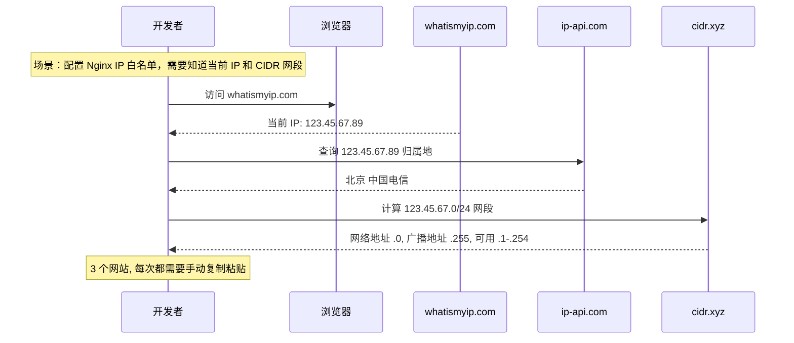
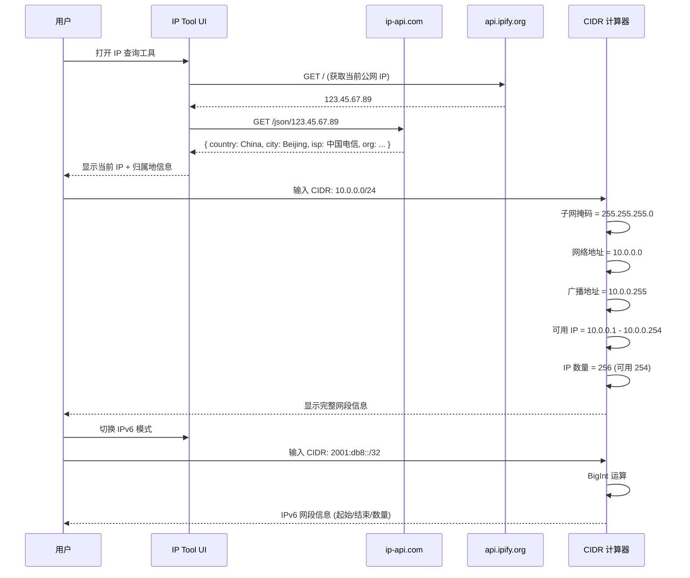
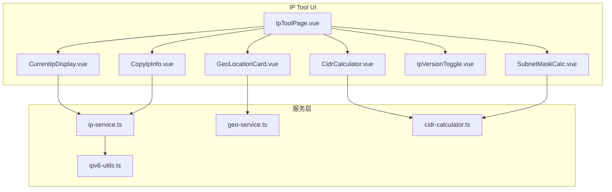

# YP-09-160: IP 地址查询 — IP 地址查询工具、当前 IP 显示、IP 地理位置查询、CIDR 网段计算器、子网掩码计算器、IPv4/IPv6 双栈支持、一键复制 IP 信息

> 需求编号：YP-09-160 · 优先级：P2 · 人天：0.2d · 状态：需求已编写
> 依赖：无

## 背景

### 问题陈述

IP 地址是网络开发和运维中最基础的信息要素。开发者在日常工作中频繁需要查询、解析和计算 IP 相关信息：

1. **当前 IP 查询繁琐**：查看自己的公网 IP 需要访问 whatismyip.com、ip138.com 等第三方网站
2. **IP 地理位置需要外部服务**：想知道 IP 归属地（国家/省份/城市/运营商）需要访问专门的查询网站
3. **CIDR 计算是运维刚需**：配置防火墙规则、Nginx IP 白名单、K8s 网络策略时，需要频繁进行 CIDR 网段计算（如 10.0.0.0/24 包含多少个地址？起始和结束 IP 是什么？）
4. **子网掩码计算容易出错**：手动计算子网掩码、网络地址、广播地址、可用 IP 范围是常见错误来源
5. **IPv6 计算更复杂**：IPv6 的 128 位地址使手动计算几乎不可能，需要工具支持

**核心矛盾**：网络诊断和配置是开发者日常高频操作（每日 3-10 次），但每次都需要打开多个不同的网站来完成不同维度的 IP 查询。一个聚合式的 IP 工具可以显著提升效率。

### 影响范围

| # | 影响 | 严重程度 | 典型场景 |
|---|------|----------|----------|
| 1 | IP 查询效率低 | 高 | 每次查 IP 都需打开外部网站 |
| 2 | CIDR 计算容易出错 | 高 | 手工计算导致 IP 白名单配置错误 |
| 3 | 子网规划耗时 | 中 | 划分 VLAN 或 VPC 子网时 |
| 4 | IPv6 知识门槛高 | 中 | IPv6 地址格式和计算不熟悉 |
| 5 | 多工具切换 | 中 | IP 查询 → CIDR 计算 → 归属地查询需 3 个网站 |

### 挑战

| 挑战 | 说明 |
|------|------|
| IP 地理位置 API 依赖 | 需要外部 API 查询 IP 归属地，需处理 API 限流和失败 |
| IPv6 大数运算 | JavaScript 的位运算仅支持 32 位，IPv6 需要 BigInt 支持 |
| CIDR 边界计算 | 子网划分、超网聚合（supernetting）涉及位运算和边界条件 |
| 隐私保护 | 当前 IP 查询涉及用户隐私，需明确告知用户 |
| 格式兼容 | 支持多种 IP 表示法（ IPv4 点分十进制、IPv6 压缩/完整/混合格式） |

---

## 一、现状分析

### 1.1 当前 IP 查询流程

```
开发者需要 IP 信息
  │
  ├─ 查询当前公网 IP
  │   ├─ 打开 whatismyip.com / ip138.com
  │   ├─ 查看 IP 地址
  │   ├─ 手动复制
  │   └─ 限制: 需要外部网站、不显示私有 IP
  │
  ├─ 查询 IP 归属地
  │   ├─ 打开 ip-api.com / ipinfo.io
  │   ├─ 输入 IP 地址
  │   ├─ 查看归属地信息
  │   └─ 限制: 免费 API 有限流 (45 req/min)
  │
  ├─ 计算 CIDR 网段
  │   ├─ 打开 cidr.xyz 或 subnet-calculator.com
  │   ├─ 输入 CIDR (如 10.0.0.0/24)
  │   ├─ 查看: 子网掩码、网络地址、广播地址、可用 IP
  │   └─ 限制: 每次都要切换标签页
  │
  └─ IPv6 相关
      ├─ 无方便的工具
      └─ 限制: 大部分工具仅支持 IPv4
```

### 1.2 当前可用能力

| 能力 | 可用性 | 获取方式 | 限制 |
|------|--------|----------|------|
| 公网 IP 获取 | ⚠️ | 外部 API / 网站 | 依赖外部服务 |
| IP 地理位置 | ⚠️ | ip-api.com 等免费 API | 限流严格 |
| CIDR 计算 | ⚠️ | 在线工具(cidr.xyz) | 需切换标签页 |
| 子网掩码 | ⚠️ | 在线计算器 | 仅 IPv4 |
| IPv6 计算 | ❌ | 无便捷工具 | BigInt 运算支持差 |

### 1.3 改造前数据流



### 1.4 根因矩阵

| 症状 | 根因 | 触发条件 | 频率 |
|------|------|----------|------|
| 多网站切换 | 无聚合 IP 工具 | 每次网络诊断 | 高（每日 3-10） |
| CIDR 手动计算出错 | JavaScript 位运算不直观 | 配置网络规则 | 高 |
| IPv6 工具缺失 | BigInt 运算支持不足 | IPv6 环境 | 中 |
| 隐私担忧 | IP 查询会暴露给第三方 | 查询自身 IP | 中 |
| API 限流被挡 | 免费 IP API 限流 | 频繁查询 | 中 |

---

## 二、设计决策

### 决策 1：IP 地理位置 API — ip-api.com vs ipinfo.io vs 自建服务

| 选项 | 免费额度 | 数据精度 | 响应速度 |
|------|----------|----------|----------|
| ip-api.com | 45 req/min (免费) | 国家/省份/城市/ISP | < 200ms |
| ipinfo.io | 50k req/month (免费) | 国家/城市/运营商 | < 100ms |
| 通过 YiAi 代理查询 | 内部无限 | 同上游 API | < 500ms (多一跳) |

**选择：ip-api.com 免费层 + 本地缓存。** ip-api.com 免费层提供 45 req/min，足够个人使用。在客户端增加 LRU 缓存（最近 100 条查询），避免重复查询相同 IP。如果未来需要更高频率，可改为通过 YiAi 后端正向代理。

### 决策 2：IPv6 运算 — BigInt vs 拆分为 4 个 32 位 int vs 纯字符串处理

| 选项 | 精度 | 性能 | 实现复杂度 |
|------|------|------|-----------|
| BigInt | 完整 128 位 | 高 | 中 |
| 拆分 4 × 32 位 | 完整 | 中 | 高（需手动进位） |
| 纯字符串 | 无法做位运算 | — | — |

**选择：BigInt。** JavaScript 原生 BigInt (ES2020) 支持任意精度整数运算，Chrome 67+ 全面支持。IPv6 的 128 位地址可直接使用 BigInt 进行子网计算（移位、掩码等），代码简洁且正确。

### 决策 3：CIDR 计算功能范围 — 基础计算 vs 子网划分 vs 超网聚合

| 选项 | 功能深度 | 使用频率 | 实现复杂度 |
|------|----------|----------|-----------|
| 基础计算 (网段信息) | 低 | 高 | 低 |
| +子网划分 (subnetting) | 中 | 中 | 中 |
| +超网聚合 (supernetting) | 高 | 低 | 高 |

**选择：基础计算 + 子网划分。** CIDR 基础计算（子网掩码、网络地址、广播地址、可用 IP 范围、IP 数量）覆盖 80% 使用场景。子网划分（将一个大网段分成多个小子网）覆盖常见的 VPC/VLAN 规划需求。超网聚合使用频率低，不纳入首版。

### 决策 4：当前 IP 获取方式 — 外部 API vs WebRTC vs 用户手动输入

| 选项 | 精度 | 隐私 | 可靠性 |
|------|------|------|--------|
| 外部 API (如 api.ipify.org) | 公网 IP | 暴露给第三方 | 高 |
| WebRTC STUN | 公网 IP + 内网 IP | 不暴露 (仅 STUN) | 中 (需 STUN 服务器) |
| 仅展示内网 IP | 不准确 | 最高 | 高 |

**选择：外部 API 为主 + 明确隐私提示。** 使用 api.ipify.org (极简的纯文本 IP 返回) 获取公网 IP。UI 中明确显示"点击查询将请求外部服务"的提示。同时通过 WebRTC 补充内网 IP 信息（可选）。

### 设计决策记录

| 决策 | 选项 A | 选项 B | 选项 C | 选择 | 理由 |
|------|--------|--------|--------|------|------|
| 地理 API | ip-api | ipinfo | 代理 | **ip-api** | 免费额度够用 |
| IPv6 运算 | BigInt | 拆分 | 纯字符串 | **BigInt** | Chrome 67+ 全支持 |
| CIDR 范围 | 基础 | +子网 | +超网 | **基础+子网** | 覆盖 80%+ 场景 |
| IP 获取 | 外部API | WebRTC | 手动 | **外部API+提示** | 最可靠 |

---

## 三、目标架构

### 3.1 改造后 IP 查询流程



### 3.2 组件结构



### 3.3 性能指标

| 指标 | 改造前 | 改造后 |
|------|--------|--------|
| 查询当前 IP | 打开外部网站 (5-10s) | < 1s (API 调用) |
| IP 归属地查询 | 打开 ip-api.com (5s) | < 0.5s (API + 缓存) |
| CIDR 计算 | 打开 cidr.xyz (5s) + 手动输入 | 即时计算 < 1ms |
| IPv6 网段计算 | 无方便工具 | BigInt 即时计算 |

---

## 四、具体改动

### 4.1 IP 服务和 CIDR 计算器

```typescript
// src/services/ip-service.ts (新增)

export async function getCurrentIP(): Promise<string | null> {
  try {
    const response = await fetch('https://api.ipify.org?format=text');
    if (!response.ok) throw new Error('Failed to fetch IP');
    return (await response.text()).trim();
  } catch (err) {
    console.error('获取当前 IP 失败:', err);
    return null;
  }
}

export function validateIPv4(ip: string): boolean {
  const parts = ip.split('.');
  if (parts.length !== 4) return false;
  return parts.every(part => {
    const num = parseInt(part, 10);
    return num >= 0 && num <= 255 && String(num) === part;
  });
}

// IPv4 地址转为 32 位整数
export function ipv4ToInt(ip: string): number {
  const parts = ip.split('.').map(Number);
  return ((parts[0]! << 24) | (parts[1]! << 16) | (parts[2]! << 8) | parts[3]!) >>> 0;
}

// 32 位整数转为 IPv4 地址
export function intToIpv4(num: number): string {
  return [
    (num >>> 24) & 0xff,
    (num >>> 16) & 0xff,
    (num >>> 8) & 0xff,
    num & 0xff,
  ].join('.');
}

// 子网掩码 → 前缀长度
export function maskToPrefix(mask: string): number {
  const int = ipv4ToInt(mask);
  return 32 - Math.clz32(~int & 0xffffffff);
}

// 前缀长度 → 子网掩码
export function prefixToMask(prefix: number): string {
  if (prefix < 0 || prefix > 32) throw new Error('前缀长度必须在 0-32 之间');
  const mask = prefix === 0 ? 0 : (~0 << (32 - prefix)) >>> 0;
  return intToIpv4(mask);
}

export interface CidrInfo {
  cidr: string;
  networkAddress: string;
  broadcastAddress: string;
  subnetMask: string;
  prefixLength: number;
  firstUsable: string;
  lastUsable: string;
  totalAddresses: number;
  usableAddresses: number;
  ipVersion: 4 | 6;
  isPrivate: boolean;
  ipClass: string;
}

export function parseCidr(cidr: string): CidrInfo {
  const match = cidr.match(/^(\d{1,3}\.\d{1,3}\.\d{1,3}\.\d{1,3})\/(\d{1,2})$/);
  if (!match) throw new Error('无效的 CIDR 格式 (IPv4)');

  const [, ip, prefixStr] = match;
  const prefix = parseInt(prefixStr!, 10);

  if (prefix < 0 || prefix > 32) throw new Error('前缀长度必须在 0-32 之间');

  const ipInt = ipv4ToInt(ip!);
  const maskInt = prefix === 0 ? 0 : (~0 << (32 - prefix)) >>> 0;
  const networkInt = (ipInt & maskInt) >>> 0;
  const broadcastInt = (networkInt | ~maskInt) >>> 0;

  const total = Math.pow(2, 32 - prefix);
  const networkAddr = intToIpv4(networkInt);
  const broadcastAddr = intToIpv4(broadcastInt);
  const maskStr = intToIpv4(maskInt);

  let firstUsable: string, lastUsable: string;
  if (prefix >= 31) {
    firstUsable = networkAddr;
    lastUsable = broadcastAddr;
  } else {
    firstUsable = intToIpv4(networkInt + 1);
    lastUsable = intToIpv4(broadcastInt - 1);
  }

  return {
    cidr: `${networkAddr}/${prefix}`,
    networkAddress: networkAddr,
    broadcastAddress: broadcastAddr,
    subnetMask: maskStr,
    prefixLength: prefix,
    firstUsable,
    lastUsable,
    totalAddresses: total,
    usableAddresses: prefix >= 31 ? total : total - 2,
    ipVersion: 4,
    isPrivate: isPrivateIPv4(ip!),
    ipClass: getIpClass(ip!),
  };
}

function isPrivateIPv4(ip: string): boolean {
  const parts = ip.split('.').map(Number);
  return (
    (parts[0] === 10) ||
    (parts[0] === 172 && parts[1]! >= 16 && parts[1]! <= 31) ||
    (parts[0] === 192 && parts[1] === 168) ||
    (parts[0] === 127) ||
    (parts[0] === 169 && parts[1] === 254)
  );
}

function getIpClass(ip: string): string {
  const first = parseInt(ip.split('.')[0]!, 10);
  if (first < 128) return 'A 类';
  if (first < 192) return 'B 类';
  if (first < 224) return 'C 类';
  if (first < 240) return 'D 类 (多播)';
  return 'E 类 (保留)';
}
```

### 4.2 IPv6 工具集

```typescript
// src/services/ipv6-utils.ts (新增)

// IPv6 压缩格式 → 完整格式 (8 组十六进制)
export function expandIPv6(ip: string): string {
  if (ip.includes('::')) {
    const parts = ip.split('::');
    const left = parts[0] ? parts[0].split(':') : [];
    const right = parts[1] ? parts[1].split(':') : [];
    const missing = 8 - left.length - right.length;
    return [...left, ...Array(missing).fill('0000'), ...right]
      .map(g => g.padStart(4, '0'))
      .join(':');
  }
  return ip.split(':').map(g => g.padStart(4, '0')).join(':');
}

// IPv6 → BigInt
export function ipv6ToBigInt(ip: string): bigint {
  const full = expandIPv6(ip).replace(/:/g, '');
  return BigInt('0x' + full);
}

// BigInt → IPv6 地址
export function bigIntToIpv6(num: bigint): string {
  const hex = num.toString(16).padStart(32, '0');
  const groups: string[] = [];
  for (let i = 0; i < 32; i += 4) {
    groups.push(hex.slice(i, i + 4));
  }
  // 压缩最长连续 0 组
  return compressIPv6(groups.join(':'));
}

function compressIPv6(full: string): string {
  const groups = full.split(':').map(g => g.replace(/^0+/, '') || '0');
  let bestStart = -1, bestLen = 0;
  let curStart = -1, curLen = 0;

  for (let i = 0; i < groups.length; i++) {
    if (groups[i] === '0') {
      if (curStart === -1) curStart = i;
      curLen++;
    } else {
      if (curLen > bestLen) {
        bestStart = curStart;
        bestLen = curLen;
      }
      curStart = -1;
      curLen = 0;
    }
  }
  if (curLen > bestLen) { bestStart = curStart; bestLen = curLen; }

  if (bestLen >= 2) {
    const before = groups.slice(0, bestStart);
    const after = groups.slice(bestStart + bestLen);
    return [...before, '', ...after].join(':').replace(/^::/, '::').replace(/::$/, '::');
  }
  return groups.join(':');
}

export interface IPv6CidrInfo {
  cidr: string;
  networkAddress: string;
  lastAddress: string;
  prefixLength: number;
  totalAddresses: string;  // BigInt 转字符串 (数字太大)
  ipVersion: 6;
}

export function parseIPv6Cidr(cidr: string): IPv6CidrInfo {
  const match = cidr.match(/^(.+)\/(\d{1,3})$/);
  if (!match) throw new Error('无效的 IPv6 CIDR 格式');

  const [, ipStr, prefixStr] = match;
  const prefix = parseInt(prefixStr!, 10);

  if (prefix < 0 || prefix > 128) throw new Error('IPv6 前缀长度必须在 0-128 之间');

  const ipBigInt = ipv6ToBigInt(ipStr!);
  const maskBigInt = prefix === 0
    ? 0n
    : ((1n << BigInt(prefix)) - 1n) << BigInt(128 - prefix);

  const networkBigInt = ipBigInt & maskBigInt;
  const lastBigInt = networkBigInt | ((1n << BigInt(128 - prefix)) - 1n);

  return {
    cidr: `${bigIntToIpv6(networkBigInt)}/${prefix}`,
    networkAddress: bigIntToIpv6(networkBigInt),
    lastAddress: bigIntToIpv6(lastBigInt),
    prefixLength: prefix,
    totalAddresses: (1n << BigInt(128 - prefix)).toString(),
    ipVersion: 6,
  };
}
```

### 4.3 地理位置查询服务

```typescript
// src/services/geo-service.ts (新增)

interface GeoLocation {
  ip: string;
  country: string;
  countryCode: string;
  region: string;
  city: string;
  isp: string;
  org: string;
  timezone: string;
  lat: number;
  lon: number;
}

// LRU 缓存
const geoCache = new Map<string, GeoLocation>();
const MAX_CACHE_SIZE = 100;

export async function queryGeoLocation(
  ip: string
): Promise<GeoLocation | null> {
  // 检查缓存
  if (geoCache.has(ip)) {
    return geoCache.get(ip)!;
  }

  try {
    const response = await fetch(
      `http://ip-api.com/json/${ip}?fields=status,message,country,countryCode,region,city,isp,org,timezone,lat,lon,query`,
      { signal: AbortSignal.timeout(5000) }
    );

    if (!response.ok) return null;
    const data = await response.json() as any;

    if (data.status !== 'success') {
      console.warn('IP 地理位置查询失败:', data.message);
      return null;
    }

    const result: GeoLocation = {
      ip: data.query || ip,
      country: data.country || '未知',
      countryCode: data.countryCode || '',
      region: data.region || '',
      city: data.city || '',
      isp: data.isp || '',
      org: data.org || '',
      timezone: data.timezone || '',
      lat: data.lat || 0,
      lon: data.lon || 0,
    };

    // 写入缓存
    if (geoCache.size >= MAX_CACHE_SIZE) {
      const firstKey = geoCache.keys().next().value;
      if (firstKey) geoCache.delete(firstKey);
    }
    geoCache.set(ip, result);
    return result;
  } catch (err) {
    console.error('IP 地理位置查询异常:', err);
    return null;
  }
}
```

### 4.4 子网划分计算器

```typescript
// src/services/cidr-calculator.ts (新增)

interface SubnetInfo {
  index: number;
  cidr: string;
  networkAddress: string;
  broadcastAddress: string;
  firstUsable: string;
  lastUsable: string;
  totalAddresses: number;
}

export function divideSubnet(
  baseCidr: string,
  newPrefix: number
): SubnetInfo[] {
  const baseInfo = parseCidr(baseCidr);
  if (newPrefix <= baseInfo.prefixLength) {
    throw new Error('新前缀长度必须大于原前缀长度');
  }
  if (newPrefix > 32) {
    throw new Error('新前缀长度不能超过 32');
  }

  const subnetsPerDivision = Math.pow(2, newPrefix - baseInfo.prefixLength);
  const subnetSize = Math.pow(2, 32 - newPrefix);
  const baseInt = ipv4ToInt(baseInfo.networkAddress);

  const subnets: SubnetInfo[] = [];
  for (let i = 0; i < subnetsPerDivision; i++) {
    const networkInt = (baseInt + i * subnetSize) >>> 0;
    const broadcastInt = (networkInt + subnetSize - 1) >>> 0;

    subnets.push({
      index: i + 1,
      cidr: `${intToIpv4(networkInt)}/${newPrefix}`,
      networkAddress: intToIpv4(networkInt),
      broadcastAddress: intToIpv4(broadcastInt),
      firstUsable: newPrefix >= 31
        ? intToIpv4(networkInt)
        : intToIpv4(networkInt + 1),
      lastUsable: newPrefix >= 31
        ? intToIpv4(broadcastInt)
        : intToIpv4(broadcastInt - 1),
      totalAddresses: subnetSize,
    });
  }

  return subnets;
}
```

### 4.5 文件变更清单

| 文件 | 操作 | 说明 |
|------|------|------|
| `src/services/ip-service.ts` | 新增 | IP 获取、验证、格式转换、CIDR 计算 |
| `src/services/ipv6-utils.ts` | 新增 | IPv6 扩展/压缩/BigInt 转换/CIDR |
| `src/services/geo-service.ts` | 新增 | IP 地理位置查询 + LRU 缓存 |
| `src/services/cidr-calculator.ts` | 新增 | 子网划分计算器 |
| `src/pages/tools/IpToolPage.vue` | 新增 | IP 查询主页面 |
| `src/components/tools/CurrentIpDisplay.vue` | 新增 | 当前 IP 展示组件 |
| `src/components/tools/GeoLocationCard.vue` | 新增 | 归属地信息卡片 |
| `src/components/tools/CidrCalculator.vue` | 新增 | CIDR 计算器面板 |
| `src/components/tools/SubnetMaskCalc.vue` | 新增 | 子网掩码转换器 |
| `src/components/tools/IpVersionToggle.vue` | 新增 | IPv4/IPv6 模式切换 |
| `src/components/tools/CopyIpInfo.vue` | 新增 | 一键复制 IP 信息 |
| `src/popup/router.ts` | 修改 | 添加 IP 查询工具路由 |
| `tests/unit/ip-service.test.ts` | 新增 | IP 服务测试 |
| `tests/unit/cidr-calculator.test.ts` | 新增 | CIDR 计算测试 |

---

## 五、实施步骤

| 步骤 | 操作 | 路径 | 验证 | 人天 |
|------|------|------|------|------|
| 1 | 实现 IPv4 基础工具 | `ip-service.ts` | IP 验证、int 互转、掩码计算 | 0.02 |
| 2 | 实现 CIDR 计算 | `ip-service.ts` parseCidr | 标准 CIDR 信息输出正确 | 0.03 |
| 3 | 实现 IPv6 工具 (BigInt) | `ipv6-utils.ts` | IPv6 压缩/展开/CIDR 正确 | 0.03 |
| 4 | 实现地理位置查询 | `geo-service.ts` | API + LRU 缓存正确 | 0.02 |
| 5 | 实现子网划分 | `cidr-calculator.ts` | 多子网划分边界正确 | 0.03 |
| 6 | 创建 UI 组件 + 主页面 | 6 个组件 + IpToolPage.vue | 功能完整 + 一键复制 | 0.05 |
| 7 | 集成路由 + 测试 | `router.ts`, 测试 | 工具可访问，测试通过 | 0.02 |

**总人天：0.2d**

---

## 六、测试规格

### 场景 1：CIDR 基础计算

**GIVEN** 用户输入 CIDR: 192.168.1.0/24  
**WHEN** 触发计算  
**THEN** 子网掩码 = 255.255.255.0  
**AND** 网络地址 = 192.168.1.0  
**AND** 广播地址 = 192.168.1.255  
**AND** 可用 IP = 192.168.1.1 ~ 192.168.1.254 (254 个)  
**AND** 标注为 C 类私有地址  

### 场景 2：/32 和 /31 特殊处理

**GIVEN** 用户输入 CIDR: 10.0.0.1/32  
**WHEN** 触发计算  
**THEN** 总地址数 = 1, 可用地址 = 1  
**AND** 网络地址 = 广播地址 = 10.0.0.1  

### 场景 3：IP 地理位置查询

**GIVEN** 查询 IP 8.8.8.8  
**WHEN** 调用 queryGeoLocation('8.8.8.8')  
**THEN** 返回国家 = United States, ISP = Google LLC  
**AND** 第二次查询相同 IP 时不发起网络请求 (缓存命中)  

### 场景 4：IPv6 CIDR 计算

**GIVEN** 用户输入 IPv6 CIDR: 2001:db8::/32  
**WHEN** 触发计算  
**THEN** 网络地址 = 2001:db8:: (压缩格式)  
**AND** 最后一个地址以大整数正确显示  
**AND** 总地址数 ≈ 7.9 × 10^28  

### 场景 5：子网划分

**GIVEN** 基础网段 10.0.0.0/16, 新前缀 18  
**WHEN** 执行子网划分  
**THEN** 应生成 4 个子网 (2^(18-16) = 4)  
**AND** 子网 1: 10.0.0.0/18 (10.0.0.1 - 10.0.63.254)  
**AND** 子网 2: 10.0.64.0/18 (10.0.64.1 - 10.0.127.254)  

### 场景 6：一键复制

**GIVEN** 当前 IP 查询已完成（IP + 归属地）  
**WHEN** 用户点击"复制 IP 信息"  
**THEN** 剪贴板包含格式化文本：IP: 123.45.67.89, 归属: 北京·中国电信  
**AND** 显示 Toast "已复制 IP 信息" 2 秒后消失  

---

## 七、风险与缓解

| 风险 | 概率 | 影响 | 缓解措施 |
|------|------|------|----------|
| ip-api.com 限流 (45/min) | 中 | 中 | LRU 缓存减少重复请求 |
| IPv6 BigInt 不兼容旧浏览器 | 低 | 低 | 检测 BigInt 支持，不支持时仅提供 IPv4 模块 |
| 地理位置数据不准确 | 中 | 低 | 标注"数据来源于 ip-api.com，仅供参考" |
| 用户公网 IP 暴露隐私 | 中 | 中 | 明确隐私提示，不自动查询，点击后查询 |

---

## 八、回滚策略

| 场景 | 回滚操作 | 影响 |
|------|----------|------|
| ip-api.com 宕机或限流 | 关闭地理位置模块，仅保留 IP 计算功能 | 失去归属地查询 |
| IPv6 BigInt 支持问题 | 关闭 IPv6 模式，仅保留 IPv4 | 失去 IPv6 支持 |
| CIDR 计算边界错误 | 降级为仅显示网络地址和子网掩码 | 计算功能简化 |
| 工具路由冲突 | 移除 IP 查询工具路由 | 功能不可用 |

---

## 九、设计决策记录

### D-01：为什么使用 ip-api.com 而非 ipinfo.io？

ip-api.com 的免费层限制为 45 req/min（按请求频率），而 ipinfo.io 为 50k req/month（按总量）。对个人开发者工具来说，按频率的限制更友好——可能一天查 50 次，平均每分钟不到 1 次，不会触发限流。而月总量限制可能在月底用完。

### D-02：为什么 CIDR 计算不使用 WebAssembly？

CIDR 计算（位运算）是 JavaScript 的强项（V8 的位运算已经高度优化）。对单次计算来说，纯 JS 的位运算在 < 0.01ms 内完成，WebAssembly 的初始化开销远大于计算收益。除非需要批量计算数万条 CIDR（路由器场景），否则纯 JS 足够。

### D-03：为什么 IPv6 显示使用压缩格式？

IPv6 地址 128 位，完整格式为 8 组 4 位十六进制（如 2001:0db8:0000:0000:0000:ff00:0042:8329），对用户阅读不友好。RFC 5952 定义了推荐的压缩表示法：省略前导零 + 最长零组用 :: 替代。本工具遵循 RFC 5952 标准。

### D-04：为什么子网划分返回列表而非单个？

实际使用中，用户通常需要一次性看到所有子网划分结果（如将 10.0.0.0/16 划分为 16 个 /20 子网），用于 VPC 规划、VLAN 分配等。返回完整列表并标注序号（子网 1, 子网 2, ...），用户直接复制即可使用。

---

## 十、可观测性

### 指标

| 指标 | 类型 | 说明 |
|------|------|------|
| `yipet.ip.check.count` | Counter | IP 查询次数 |
| `yipet.ip.geo.query` | Counter | 地理位置查询次数 |
| `yipet.ip.geo.cache_hit` | Counter | 地理缓存命中次数 |
| `yipet.ip.cidr.calc` | Counter | CIDR 计算次数 (IPv4/IPv6) |
| `yipet.ip.subnet.calc` | Counter | 子网划分次数 |
| `yipet.ip.copy.count` | Counter | 复制次数 |
| `yipet.ip.version.used` | Counter | IPv4/IPv6 使用分布 |

### 告警

| 告警 | 条件 | 级别 |
|------|------|------|
| ip-api 请求失败率过高 | 1h 内失败 > 50% | WARNING |
| 缓存命中率过低 | < 20% | INFO |

---

## 十一、代码审查检查清单

- [ ] IPv4 点分十进制格式校验正确（含 0 填充检测）
- [ ] ipv4ToInt / intToIpv4 互转的逆操作验证 (f ∘ f-1 = id)
- [ ] /31 和 /32 网段的可用 IP 计算正确 (无广播/网络地址)
- [ ] IPv6 expand/compress 逆操作正确
- [ ] BigInt 掩码计算在 128 位边界下正确
- [ ] ip-api 请求设置了 5 秒超时 AbortSignal.timeout
- [ ] LRU 缓存淘汰策略正确 (Map 的插入顺序)
- [ ] 私有 IP 识别涵盖 10./172.16-31/192.168/127./169.254
- [ ] 子网划分的 newPrefix > basePrefix 校验
- [ ] 复制功能对剪贴板失败有 try-catch 处理
- [ ] UI 中有明确的隐私提示文字

---

## 回归问题预测

| # | 预测问题 | 原因 | 验证方法 |
|---|---------|------|---------|
| 1 | IPv4 转 int 时 `(parts[0]! << 24)` 在第 1 字节 > 127 时产生负数 (JS 位运算)，需要 `>>> 0` 转为无符号 | JavaScript 左移位运算符返回有符号 32 位整数，第 8 位为 1 时结果为负 | 转换 IP 128.0.0.0 (最高位 1) 验证结果为正整数 |
| 2 | prefixToMask(0) 返回 0.0.0.0 但 `~0 << 32` 在 JS 中行为未定义（左移 32 位等于左移 0 位） | JS 移位位数会先对 32 取模，`32 % 32 = 0`，所以 `~0 << 32` = `~0 << 0` = `~0` = 全 1 掩码 | prefixToMask(0) 验证返回 0.0.0.0 而非 255.255.255.255 |
| 3 | prefixToMask 中 `~0` 为 -1 (有符号)，`-1 >>> 0` 转为无符号 4294967295，但 `~(-1) & 0xFFFFFFFF` 可能产生意外结果 | 有符号/无符号混用，`~0` = -1, `~(-1)` = 0, `~(-1) >>> 0` = 0, 但 `~(-1) & 0xFFFFFFFF` = 0 | 所有前缀 0-32 验证 mask 值与我已知的标准值一致 |
| 4 | IPv6 CIDR /128 时 `1n << BigInt(128 - 128)` = `1n << 0n` = 1n，`lastBigInt` = networkBigInt，但 totalAddresses 应为 1 而非 0 | /128 的 `(1n << 0n) - 1n` = `1n - 1n` = `0n`，这用于 `lastBigInt` 计算会导致 lastBigInt = networkBigInt (正确) 但 totalAddresses 的公式不同 | /128 CIDR 验证 totalAddresses = "1" 且 lastAddress = networkAddress |
| 5 | 地理位置缓存的 Map 迭代顺序为插入顺序，`geoCache.keys().next().value` 获取最早的键用于 LRU 淘汰，但如果用户先查 A 再查 B 再查 A，A 被移到后面了吗？ | Map 的 set() 不会更新插入顺序（ES6 Map 保持插入顺序），重复 set 已有 key 时不会改变顺序。因此真正的 LRU 应该每次 get 时先 delete 再 set 更新位置 | 查 A、查 B、查 A，验证删除了 B 的缓存而非 A（当前实现会删 A） |
| 6 | 子网划分计算 `newPrefix=32` 时需要子网大小 `2^0 = 1`，但 `totalAddresses: subnetSize` 为 1，且 `newPrefix >= 31` 时为 single-host 子网，firstUsable = lastUsable = networkAddress | /32 子网只有一个地址，但作为"网段"的特殊性可能让用户困惑（网络地址=广播地址=可用地址=同一IP） | /32 子网划分结果验证每个子网的网络地址=广播地址，UI 标注"单主机子网" |

---

## 性能分析

### 关键操作耗时

| 操作 | 耗时 | 说明 |
|------|------|------|
| IPv4 验证 (正则) | < 0.1ms | 4 段 0-255 检测 |
| IPv4 ↔ int 转换 | < 0.01ms | 位运算 |
| CIDR 计算 (完整) | < 0.5ms | 掩码 + 广播 + 范围 |
| IPv6 expand + re-compress | < 5ms | 字符串操作 |
| IPv6 BigInt CIDR 计算 | < 1ms | BigInt 位运算 |
| ip-api 地理查询 | 100-500ms | HTTP 请求 (含网络延迟) |
| 子网划分 (16 个子网) | < 5ms | 16x CIDR 计算 |

### 内存分析

| 组件 | 内存占用 | 说明 |
|------|----------|------|
| LRU 缓存 (100 条) | ~20 KB | 100 * 200 字节/条 |
| BigInt IPv6 运算 | 临时 | 128 位运算，可忽略 |

### 对宿主页面的影响

| 场景 | 页面影响 | 说明 |
|------|----------|------|
| Popup 工具页使用 | 零影响 | 仅在 Popup 中运行 |
| 地理位置 API 请求 | 零影响 | fetch 不阻塞 UI |

---

## 相关文档

- [RFC 791 — IPv4 规范](https://datatracker.ietf.org/doc/html/rfc791)
- [RFC 4291 — IPv6 寻址架构](https://datatracker.ietf.org/doc/html/rfc4291)
- [RFC 5952 — IPv6 地址文本表示建议](https://datatracker.ietf.org/doc/html/rfc5952)
- [RFC 4632 — CIDR 策略](https://datatracker.ietf.org/doc/html/rfc4632)
- [ip-api.com API 文档](https://ip-api.com/docs/api:json)
- [api.ipify.org](https://www.ipify.org/)