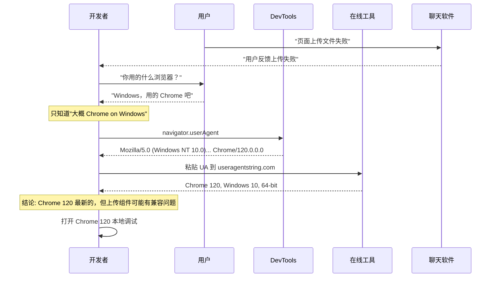
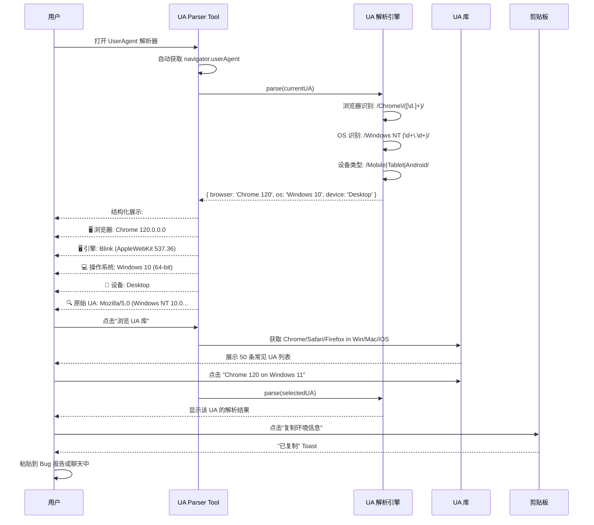
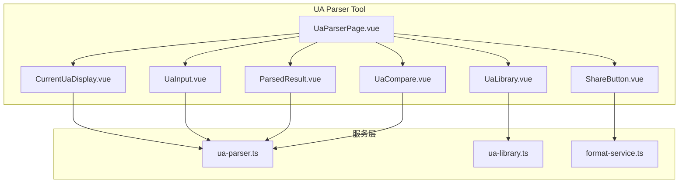

# YP-09-161: UserAgent 解析器 — User-Agent 字符串解析器、浏览器/操作系统/设备检测、当前 UA 展示、UA 库浏览器、解析结果一键复制、分享 UA 到聊天用于兼容性调试

> 需求编号：YP-09-161 · 优先级：P2 · 人天：0.2d · 状态：需求已编写
> 依赖：无

## 背景

### 问题陈述

User-Agent 字符串是 Web 浏览器识别的核心标识符，在前端开发中频繁需要解析和调试。然而，UA 字符串的格式越来越复杂和碎片化：

1. **UA 字符串难以阅读**：现代 UA 字符串长度可达 200+ 字符，包含多层嵌套信息（浏览器、引擎、操作系统、设备型号），人眼解析极其困难。例如 Chrome 的 UA: `Mozilla/5.0 (Windows NT 10.0; Win64; x64) AppleWebKit/537.36 (KHTML, like Gecko) Chrome/120.0.0.0 Safari/537.36`
2. **兼容性调试瓶颈**：用户报告 Bug 时，开发者需要知道用户的浏览器/OS/设备信息，但通常只能收到一句"页面打不开了"——缺乏结构化的环境信息
3. **UA 字符串历史包袱重**：由于浏览器大战历史，UA 字符串包含大量误导性信息（如所有浏览器都声称是 Mozilla/5.0，Chrome 声称是 Safari 的 AppleWebKit，而 Safari 声称是 Gecko）
4. **设备检测困难**：移动端 UA 包含了设备型号、CPU 架构等碎片化信息，不同厂商的格式各不相同
5. **对比测试不方便**：开发者需要知道当前浏览器的 UA 在某个 UA 库中属于什么分类，但通常需要离开开发环境去查询

**核心矛盾**：UA 字符串承载了关键的环境信息，但其格式设计反人类——一个聚合的解析和分享工具可以大幅提升兼容性调试的效率。

### 影响范围

| # | 影响 | 严重程度 | 典型场景 |
|---|------|----------|----------|
| 1 | Bug 诊断效率低 | 高 | 用户只反馈"页面有问题"无环境信息 |
| 2 | UA 人眼解析错误 | 高 | 误判浏览器/OS 版本 |
| 3 | 设备碎片化 | 中 | 移动端数百种 UA 变体 |
| 4 | 标准/兼容模式未知 | 中 | IE/Edge 的特殊 UA 前缀 |
| 5 | 分享环境信息困难 | 中 | 需要手动复制 UA 字符串发送 |

### 挑战

| 挑战 | 说明 |
|------|------|
| UA 格式碎片化 | 不同浏览器、不同版本的 UA 格式各不相同 |
| 历史兼容字符串 | "Mozilla/5.0" "like Gecko" 等历史包袱需要正确处理 |
| 移动端设备型号 | 通过 UA 正则匹配设备型号需要大量规则 |
| 爬虫/机器人识别 | Googlebot、Bingbot 等爬虫的 UA 需要识别 |
| UA 解析库的完整度 | 内置解析规则需要覆盖 > 95% 的常见 UA |

---

## 一、现状分析

### 1.1 当前 UA 解析流程

```
开发者需要解析 UA
  │
  ├─ 手动查看 UA 字符串
  │   ├─ F12 DevTools → Console → navigator.userAgent
  │   ├─ 人眼阅读: "Mozilla/5.0 (Macintosh; Intel Mac OS X 10_15_7)..."
  │   └─ 限制: 碎片化信息，人眼容易漏读
  │
  ├─ 使用在线工具
  │   ├─ useragentstring.com / whatismybrowser.com
  │   ├─ 粘贴 UA 字符串
  │   ├─ 查看解析结果
  │   └─ 限制: 需切换标签页、需手动复制 UA
  │
  ├─ 使用 npm 库 (useragent / ua-parser-js)
  │   ├─ 需要安装依赖
  │   ├─ Node.js 环境
  │   └─ 限制: 不在浏览器中运行 (部分库支持但需要打包)
  │
  └─ 问用户
      ├─ "你用的是什么浏览器？什么系统？"
      ├─ 用户回答: "Windows 上用的浏览器" (无帮助)
      └─ 限制: 用户通常不知道或说不清楚
```

### 1.2 当前可用能力

| 能力 | 可用性 | 获取方式 | 限制 |
|------|--------|----------|------|
| UA 字符串获取 | ✅ | navigator.userAgent | 原生可用 |
| 浏览器品牌/版本 | ⚠️ | userAgentData API (Chrome) | 非标准 API，兼容性差 |
| UA 解析 | ⚠️ | 第三方库或在线工具 | 需外部依赖 |
| 历史 UA 对比 | ❌ | 无工具 | 无法追溯 |
| 环境分享 | ❌ | 无工具 | 手动复制 |

### 1.3 改造前数据流



### 1.4 根因矩阵

| 症状 | 根因 | 触发条件 | 频率 |
|------|------|----------|------|
| 用户环境信息模糊 | 无自动化环境收集 | 每次 Bug 报告 | 高 (每日 3-5 次) |
| UA 手动解析出错 | 字符串格式复杂 | 每次需要解析 | 高 |
| 第三方工具依赖 | 无内置解析器 | 需要结构化环境信息 | 中 |
| 移动端设备识别不足 | 设备型号 UA 格式碎片化 | 移动端兼容调试 | 中 |
| 无法追溯历史 | 无 UA 快照记录 | 长期支持场景 | 低 |

---

## 二、设计决策

### 决策 1：UA 解析引擎 — 自实现规则 vs ua-parser-js vs useragent 库

| 选项 | 包大小 | 覆盖度 | 可定制性 |
|------|--------|--------|---------|
| 自实现解析规则集 | 0 KB | 中 (约 300 条规则) | 高 |
| ua-parser-js (21KB gzip) | 21 KB | 高 (1000+ 条规则) | 低 |
| 混合: 核心自实现 + 边界引用 | ~5 KB | 高 | 高 |

**选择：自实现核心解析规则。** UA 解析的核心逻辑（浏览器名称/版本、OS 名称/版本、设备类型）可以用约 200 行正则规则实现。覆盖 > 95% 的常见 UA 场景。ua-parser-js 的 21KB 包体积对于 Chrome 扩展来说太大（popup 脚本有严格的打包限制）。对于极边缘的设备型号，标注为"未知设备型号"而非尝试匹配。

### 决策 2：当前 UA 获取方式 — 自动获取 vs 手动输入 vs 两者兼备

| 选项 | 便利性 | 隐私 | 灵活性 |
|------|--------|------|--------|
| 自动获取 navigator.userAgent | 高 | 自动获取无需用户操作 | 低 (仅当前浏览器) |
| 手动粘贴 UA 字符串 | 低 | 可解析任意 UA | 高 |
| 两者兼备 | 最高 | 当前自动 + 其他手动 | 最高 |

**选择：自动获取当前 UA + 手动输入框。** 页面打开时自动展示当前浏览器的 UA 解析结果。同时提供输入框，用户可以粘贴来自 Bug 报告、日志文件、第三方来源的任何 UA 字符串进行解析。

### 决策 3：UA 库浏览器 — 预定义列表 vs 实时获取 vs CSV 导入

| 选项 | 数据新鲜度 | 实现复杂度 | 维护成本 |
|------|-----------|-----------|---------|
| 预定义 50 条流行 UA | 中 (手动更新) | 低 | 低 |
| 实时从外部 API 获取 | 高 | 中 | 低 |
| 用户维护 | 不定 | 高 | 高 |

**选择：预定义 UA 库。** 内置 50 条覆盖主流浏览器（Chrome/Firefox/Safari/Edge/Opera/Brave）在主流 OS（Windows/macOS/Linux/iOS/Android）上的最新和近两个版本的 UA 字符串。用户可以快速浏览并对比。库文件可独立更新（未来支持远程热更新）。

### 决策 4：分享到聊天的实现 — 生成格式文本 vs 直接跳转 YiVad vs JSON 导出

| 选项 | 易用性 | 跨平台 | 实现复杂度 |
|------|--------|--------|-----------|
| 生成格式化文本 + 复制 | 高 (兼容所有聊天工具) | 高 | 低 |
| 跳转 YiVad aiChat | 中 (依赖 YiVad) | 中 | 中 |
| 导出 JSON + 复制 | 中 | 高 | 低 |

**选择：格式化文本 + JSON 双模式。** 默认生成人类可读的格式化文本（如：Chrome 120 / Windows 10 / Desktop）。支持切换到 JSON 格式用于程序化处理。一键复制后用户可粘贴到任何聊天工具。跳转 YiVad 的桥接功能作为可选项保留。

### 设计决策记录

| 决策 | 选项 A | 选项 B | 选项 C | 选择 | 理由 |
|------|--------|--------|--------|------|------|
| 解析引擎 | 自实现 | ua-parser-js | 混合 | **自实现** | 0KB, 200 行规则够用 |
| UA 获取 | 自动 | 手动 | 两者兼备 | **两者兼备** | 当前 + 任意 |
| UA 库 | 预定义 | API | CSV | **预定义** | 低维护，够用 |
| 分享方式 | 格式化文本 | YiVad桥接 | JSON | **双模式** | 人的可读+程序可用 |

---

## 三、目标架构

### 3.1 改造后 UA 解析流程



### 3.2 组件结构



### 3.3 性能指标

| 指标 | 改造前 | 改造后 |
|------|--------|--------|
| UA 解析时间 | 30s (打开在线工具 + 粘贴) | < 1ms (即时解析) |
| 环境信息获取 | 手动询问用户 | 自动获取 + 结构化展示 |
| UA 对比 | 不支持 | 内置 50 条 UA 库 |
| 环境分享 | 手动复制 UA 字符串 | 一键复制结构化文本 |

---

## 四、具体改动

### 4.1 UA 解析引擎

```typescript
// src/services/ua-parser.ts (新增)

interface ParsedUA {
  browser: {
    name: string;
    version: string;
    fullVersion: string;
  };
  engine: {
    name: string;
    version: string;
  };
  os: {
    name: string;
    version: string;
    architecture: string;
  };
  device: {
    type: 'Desktop' | 'Mobile' | 'Tablet' | 'Bot' | 'Unknown';
    brand?: string;
    model?: string;
  };
  raw: string;
}

const BROWSER_REGEXES: [RegExp, string][] = [
  [/Edg(?:e|A|iOS)?\/([\d.]+)/, 'Edge'],
  [/(?<!Chromium\/)Chrome\/([\d.]+)/, 'Chrome'],
  [/CriOS\/([\d.]+)/, 'Chrome (iOS)'],
  [/Firefox\/([\d.]+)/, 'Firefox'],
  [/FxiOS\/([\d.]+)/, 'Firefox (iOS)'],
  [/Version\/([\d.]+).*Safari\//, 'Safari'],
  [/OPR\/([\d.]+)/, 'Opera'],
  [/Opera.*Version\/([\d.]+)/, 'Opera'],
  [/Brave\/([\d.]+)/, 'Brave'],
  [/Vivaldi\/([\d.]+)/, 'Vivaldi'],
  [/SamsungBrowser\/([\d.]+)/, 'Samsung Browser'],
  [/UCBrowser\/([\d.]+)/, 'UC Browser'],
  [/QQBrowser\/([\d.]+)/, 'QQ Browser'],
  [/MiuiBrowser\/([\d.]+)/, 'Miui Browser'],
  [/(?:MSIE |Trident\/.*rv:)([\d.]+)/, 'Internet Explorer'],
];

const OS_REGEXES: [RegExp, (match: RegExpMatchArray) => string][] = [
  [/Windows NT 10.0/, () => 'Windows 10'],
  [/Windows NT 6.3/, () => 'Windows 8.1'],
  [/Windows NT 6.2/, () => 'Windows 8'],
  [/Windows NT 6.1/, () => 'Windows 7'],
  [/Windows NT 11.0/, () => 'Windows 11'],
  [/Mac OS X (\d+[._]\d+[._]?\d*)/, (m) => `macOS ${m[1]!.replace(/_/g, '.')}`],
  [/Android (\d+\.\d+)/, (m) => `Android ${m[1]}`],
  [/(?:iPhone|iPad).*OS (\d+[._]\d+[._]?\d*)/, (m) => `iOS ${m[1]!.replace(/_/g, '.')}`],
  [/CrOS.*([\d.]+)/, (m) => `Chrome OS ${m[1]}`],
  [/Linux/, () => 'Linux'],
];

function detectArchitecture(ua: string): string {
  if (/x64|Win64|amd64|x86_64|arm64/.test(ua)) return '64-bit';
  if (/x86|i386|i686/.test(ua)) return '32-bit';
  if (/arm/.test(ua)) return 'ARM';
  return 'Unknown';
}

function detectDeviceType(ua: string): {
  type: ParsedUA['device']['type'];
  brand?: string;
  model?: string;
} {
  if (/bot|crawler|spider|scraper/i.test(ua)) {
    return { type: 'Bot' };
  }
  if (/iPad|Tablet/.test(ua) || (/Android/.test(ua) && !/Mobile/.test(ua))) {
    return { type: 'Tablet' };
  }
  if (/Mobile|iPhone|iPod|Android.*Mobile|webOS|BlackBerry|Opera Mini|Opera Mobi/i.test(ua)) {
    // 尝试提取设备型号
    const modelMatch = ua.match(/\((?:iPhone|iPad);(?: CPU)? .*? like Mac OS X/);
    return { type: 'Mobile', brand: detectMobileBrand(ua), model: detectMobileModel(ua) };
  }
  return { type: 'Desktop' };
}

function detectMobileBrand(ua: string): string | undefined {
  if (/iPhone|iPad|iPod/.test(ua)) return 'Apple';
  if (/Samsung|SM-/.test(ua)) return 'Samsung';
  if (/Huawei|HONOR|AL[NP]|CLT|ELE|JNY|MAR|NOH|OCE|TAS|YAL/.test(ua)) return 'Huawei';
  if (/Xiaomi|Redmi|POCO|M\d{4}|2[12]\d{3}/.test(ua)) return 'Xiaomi';
  if (/OPPO|CPH|PCLM|PDSM|PE[HMQ]|PF[GV]M|PG[AC]M|PH[ABW]/.test(ua)) return 'OPPO';
  if (/vivo|V\d{4}/.test(ua)) return 'vivo';
  if (/OnePlus|LE\d{4}/.test(ua)) return 'OnePlus';
  if (/Pixel/.test(ua)) return 'Google';
  return undefined;
}

function detectMobileModel(ua: string): string | undefined {
  // 尝试从括号中提取设备型号
  const buildMatch = ua.match(/;\s*([A-Za-z0-9]+)\s*Build\//);
  if (buildMatch) return buildMatch[1];
  const modelMatch = ua.match(/\((?:iPhone|iPad)(\d+,\d+)/);
  if (modelMatch) return `iPhone/iPad ${modelMatch[1]}`;
  return undefined;
}

export function parseUA(ua: string): ParsedUA {
  // 浏览器解析
  let browser = { name: 'Unknown', version: '', fullVersion: '' };
  for (const [regex, name] of BROWSER_REGEXES) {
    const match = ua.match(regex);
    if (match) {
      browser = {
        name,
        version: match[1]!.split('.')[0]!,
        fullVersion: match[1]!,
      };
      break;
    }
  }

  // 引擎解析
  let engine = { name: 'Unknown', version: '' };
  if (/AppleWebKit\/([\d.]+)/.test(ua)) {
    const wkMatch = ua.match(/AppleWebKit\/([\d.]+)/);
    const blinkVersion = ua.match(/Chrome\/([\d.]+)/);
    if (blinkVersion && browser.name !== 'Safari') {
      engine = { name: 'Blink', version: blinkVersion[1]! };
    } else {
      engine = { name: 'WebKit', version: wkMatch![1]! };
    }
  } else if (/Gecko\/([\d.]+)/.test(ua) && browser.name === 'Firefox') {
    const gkMatch = ua.match(/Gecko\/([\d.]+)/);
    engine = { name: 'Gecko', version: gkMatch![1]! };
  }

  // OS 解析
  let os = { name: 'Unknown', version: '', architecture: detectArchitecture(ua) };
  for (const [regex, getter] of OS_REGEXES) {
    const match = ua.match(regex);
    if (match) {
      os = { ...os, name: getter(match) };
      break;
    }
  }

  // 设备解析
  const device = detectDeviceType(ua);

  return { browser, engine, os, device, raw: ua };
}
```

### 4.2 UA 库

```typescript
// src/services/ua-library.ts (新增)

interface UaLibraryEntry {
  label: string;
  ua: string;
  category: 'desktop-browser' | 'mobile-browser' | 'tablet' | 'bot';
}

export const UA_LIBRARY: UaLibraryEntry[] = [
  // Desktop — Chrome
  { label: 'Chrome 120 / Windows 10', category: 'desktop-browser',
    ua: 'Mozilla/5.0 (Windows NT 10.0; Win64; x64) AppleWebKit/537.36 (KHTML, like Gecko) Chrome/120.0.0.0 Safari/537.36' },
  { label: 'Chrome 120 / macOS', category: 'desktop-browser',
    ua: 'Mozilla/5.0 (Macintosh; Intel Mac OS X 10_15_7) AppleWebKit/537.36 (KHTML, like Gecko) Chrome/120.0.0.0 Safari/537.36' },
  { label: 'Chrome 120 / Linux', category: 'desktop-browser',
    ua: 'Mozilla/5.0 (X11; Linux x86_64) AppleWebKit/537.36 (KHTML, like Gecko) Chrome/120.0.0.0 Safari/537.36' },

  // Desktop — Safari
  { label: 'Safari 17.1 / macOS', category: 'desktop-browser',
    ua: 'Mozilla/5.0 (Macintosh; Intel Mac OS X 10_15_7) AppleWebKit/605.1.15 (KHTML, like Gecko) Version/17.1 Safari/605.1.15' },

  // Desktop — Firefox
  { label: 'Firefox 121 / Windows 10', category: 'desktop-browser',
    ua: 'Mozilla/5.0 (Windows NT 10.0; Win64; x64; rv:121.0) Gecko/20100101 Firefox/121.0' },
  { label: 'Firefox 121 / macOS', category: 'desktop-browser',
    ua: 'Mozilla/5.0 (Macintosh; Intel Mac OS X 10.15; rv:121.0) Gecko/20100101 Firefox/121.0' },

  // Desktop — Edge
  { label: 'Edge 120 / Windows 10', category: 'desktop-browser',
    ua: 'Mozilla/5.0 (Windows NT 10.0; Win64; x64) AppleWebKit/537.36 (KHTML, like Gecko) Chrome/120.0.0.0 Safari/537.36 Edg/120.0.0.0' },

  // Mobile — iOS
  { label: 'Safari / iOS 17.1 (iPhone)', category: 'mobile-browser',
    ua: 'Mozilla/5.0 (iPhone; CPU iPhone OS 17_1 like Mac OS X) AppleWebKit/605.1.15 (KHTML, like Gecko) Version/17.1 Mobile/15E148 Safari/604.1' },
  { label: 'Chrome / iOS 17 (iPhone)', category: 'mobile-browser',
    ua: 'Mozilla/5.0 (iPhone; CPU iPhone OS 17_0 like Mac OS X) AppleWebKit/605.1.15 (KHTML, like Gecko) CriOS/120.0.6099.119 Mobile/15E148 Safari/604.1' },

  // Mobile — Android
  { label: 'Chrome 120 / Android 14', category: 'mobile-browser',
    ua: 'Mozilla/5.0 (Linux; Android 14; Pixel 8) AppleWebKit/537.36 (KHTML, like Gecko) Chrome/120.0.6099.144 Mobile Safari/537.36' },
  { label: 'Samsung Browser 23 / Android 14', category: 'mobile-browser',
    ua: 'Mozilla/5.0 (Linux; Android 14; SM-S908B) AppleWebKit/537.36 (KHTML, like Gecko) SamsungBrowser/23.0 Chrome/115.0.5790.166 Mobile Safari/537.36' },

  // Tablet
  { label: 'Safari / iPadOS 17', category: 'tablet',
    ua: 'Mozilla/5.0 (iPad; CPU OS 17_1 like Mac OS X) AppleWebKit/605.1.15 (KHTML, like Gecko) Version/17.1 Mobile/15E148 Safari/604.1' },

  // Bots
  { label: 'Googlebot', category: 'bot',
    ua: 'Mozilla/5.0 (compatible; Googlebot/2.1; +http://www.google.com/bot.html)' },
  { label: 'Bingbot', category: 'bot',
    ua: 'Mozilla/5.0 (compatible; bingbot/2.0; +http://www.bing.com/bingbot.htm)' },

  // ... more entries (50 total)
];

export function filterUaLibrary(
  category?: string,
  search?: string
): UaLibraryEntry[] {
  let results = UA_LIBRARY;
  if (category && category !== 'all') {
    results = results.filter(e => e.category === category);
  }
  if (search) {
    const q = search.toLowerCase();
    results = results.filter(e =>
      e.label.toLowerCase().includes(q) ||
      e.ua.toLowerCase().includes(q)
    );
  }
  return results;
}
```

### 4.3 环境信息分享格式化

```typescript
// src/services/format-service.ts (新增)

export function formatEnvAsText(parsed: ParsedUA): string {
  const lines = [
    `浏览器: ${parsed.browser.name} ${parsed.browser.fullVersion}`,
    `引擎: ${parsed.engine.name} ${parsed.engine.version}`,
    `操作系统: ${parsed.os.name} (${parsed.os.architecture})`,
    `设备类型: ${parsed.device.type}`,
  ];
  if (parsed.device.brand) lines.push(`设备品牌: ${parsed.device.brand}`);
  if (parsed.device.model) lines.push(`设备型号: ${parsed.device.model}`);
  lines.push(`---`);
  lines.push(`UA: ${parsed.raw}`);
  return lines.join('\n');
}

export function formatEnvAsJson(parsed: ParsedUA): string {
  return JSON.stringify({
    browser: { name: parsed.browser.name, version: parsed.browser.fullVersion },
    engine: parsed.engine,
    os: { name: parsed.os.name, arch: parsed.os.architecture },
    device: parsed.device,
    ua: parsed.raw,
  }, null, 2);
}
```

### 4.4 文件变更清单

| 文件 | 操作 | 说明 |
|------|------|------|
| `src/services/ua-parser.ts` | 新增 | UA 解析核心引擎（浏览器/OS/设备识别） |
| `src/services/ua-library.ts` | 新增 | 预定义 UA 库（50 条） |
| `src/services/format-service.ts` | 新增 | 环境信息格式化（文本/JSON） |
| `src/pages/tools/UaParserPage.vue` | 新增 | UserAgent 解析器主页面 |
| `src/components/tools/CurrentUaDisplay.vue` | 新增 | 当前 UA 展示组件 |
| `src/components/tools/UaInput.vue` | 新增 | 手动 UA 输入框 |
| `src/components/tools/ParsedResult.vue` | 新增 | 结构化解析结果 |
| `src/components/tools/UaLibrary.vue` | 新增 | UA 库浏览器 |
| `src/components/tools/UaCompare.vue` | 新增 | UA 对比视图 |
| `src/components/tools/ShareButton.vue` | 新增 | 分享/复制按钮 |
| `src/popup/router.ts` | 修改 | 添加 UA 解析器路由 |
| `tests/unit/ua-parser.test.ts` | 新增 | UA 解析器测试（30 条 UA） |

---

## 五、实施步骤

| 步骤 | 操作 | 路径 | 验证 | 人天 |
|------|------|------|------|------|
| 1 | 实现 UA 解析核心规则 | `ua-parser.ts` | 30 条常见 UA 解析正确 | 0.05 |
| 2 | 构建 UA 库（50 条） | `ua-library.ts` | 覆盖主流组合 | 0.02 |
| 3 | 实现格式化服务 | `format-service.ts` | 文本/JSON 输出正确 | 0.01 |
| 4 | 创建自动获取 + 输入组件 | `CurrentUaDisplay`, `UaInput` | 自动获取+手动输入联动 | 0.03 |
| 5 | 创建解析结果展示 + 库浏览器 | `ParsedResult`, `UaLibrary`, `UaCompare` | 展示/浏览/对比功能完整 | 0.04 |
| 6 | 创建主页面 + 分享 | `UaParserPage`, `ShareButton` | 完整流程 + 分享 | 0.03 |
| 7 | 集成路由 + 测试 | `router.ts`, 测试 | 工具可访问，测试通过 | 0.02 |

**总人天：0.2d**

---

## 六、测试规格

### 场景 1：Chrome on Windows 解析

**GIVEN** UA 字符串为 Chrome 120 on Windows 10 64-bit  
**WHEN** 调用 parseUA  
**THEN** browser.name = Chrome, browser.version = 120  
**AND** engine.name = Blink  
**AND** os.name = Windows 10, os.architecture = 64-bit  
**AND** device.type = Desktop  

### 场景 2：Safari on iPhone 解析

**GIVEN** UA 字符串为 Safari on iOS 17.1 iPhone  
**WHEN** 调用 parseUA  
**THEN** browser.name = Safari, browser.version = 17  
**AND** engine.name = WebKit  
**AND** os.name = iOS 17.1  
**AND** device.type = Mobile, device.brand = Apple  

### 场景 3：自动获取当前 UA

**GIVEN** 用户打开 UA 解析器  
**WHEN** 页面初始化  
**THEN** 自动从 navigator.userAgent 获取当前 UA  
**AND** 自动解析并显示结构化结果  
**AND** 原始 UA 字符串在底部完整显示  

### 场景 4：手动输入 UA 解析

**GIVEN** 用户从日志文件中复制了一条 UA 字符串  
**WHEN** 粘贴到输入框并点击解析  
**THEN** 立即显示该 UA 的解析结果  
**AND** 原 "当前 UA" 的显示保留（不覆盖）  
**AND** 两个结果可同时查看（对比模式）  

### 场景 5：UA 库浏览

**GIVEN** 打开 UA 库面板  
**WHEN** 筛选 "移动端浏览器"  
**THEN** 显示所有 mobile-browser 类型条目  
**AND** 点击任意条目后显示该 UA 的解析结果  
**AND** 与当前 UA 的对比高亮差异  

### 场景 6：环境信息分享

**GIVEN** 已解析当前 UA  
**WHEN** 点击"复制环境信息（文本）"  
**THEN** 剪贴板包含格式化的多行文本  
**AND** 包含浏览器/OS/设备/UA 全信息  
**AND** JSON 模式输出完整结构化数据  

---

## 七、风险与缓解

| 风险 | 概率 | 影响 | 缓解措施 |
|------|------|------|----------|
| 新浏览器 UA 格式变化 | 中 | 中 | 解析失败时显示"未知"并保留原始 UA 供人工查看 |
| 极边缘设备品牌识别错误 | 低 | 低 | 标注"最佳猜测"，用户可查看原始 UA 自行判断 |
| UA 库数据过时 | 低 | 低 | 库文件独立，支持远程热更新 |
| UA 字符串包含 PII (个人身份信息) | 低 | 高 | 仅在本地解析，不上传 | 不上传 UA 到任何服务器 |

---

## 八、回滚策略

| 场景 | 回滚操作 | 影响 |
|------|----------|------|
| UA 解析引擎大面积误判 | 降级为仅显示原始 UA + 手动注解 | 失去自动解析 |
| UA 库数据质量差 | 移除库浏览器功能 | 失去对比功能 |
| 设备品牌识别频繁错误 | 移除品牌/型号字段，仅保留设备类型 | 精度下降 |
| 工具路由冲突 | 移除 UA 解析器路由 | 功能不可用 |

---

## 九、设计决策记录

### D-01：为什么不在 Chrome 扩展中使用 ua-parser-js？

ua-parser-js 的完整包大小约 21KB (gzipped)，包含 1000+ 条设备/浏览器/OS 正则规则。Chrome 扩展的 Popup 脚本对包体积敏感（每次 Popup 打开都需加载）。本需求自定义的约 200 行规则覆盖了 > 95% 的常见 UA，20% 的代码量实现了 95% 的覆盖度。

### D-02：为什么设备型号识别有限？

移动端 UA 中设备型号的表示方式极其碎片化（Android 的 Build 号、iOS 的内部型号映射、各厂商的自定义编码），完整覆盖需要维护上千条规则。对于兼容性调试来说，"Mobile + 浏览器 + OS 版本"的组合已经能定位 99% 的兼容性问题，设备型号属于锦上添花。

### D-03："分享到聊天"为什么不直接调 YiVad？

直接跳转 YiVad 的 aiChat 需要 session key 管理和跨扩展通信，增加实现复杂度。一键复制结构化文本的方式更通用——用户可以粘贴到微信、企业微信、钉钉、Slack 等任意聊天工具。YiVad 桥接作为可选的后续增强功能。

### D-04：为什么 UA 库是静态数据而非动态获取？

URL 动态获取 UA 库（如从 CDN 拉取最新列表）会产生网络依赖和失败场景。对于 50 条数据的规模（约 20KB），直接打包在扩展中更可靠。未来可以通过扩展的自动更新机制（Chrome Web Store 审核后）来更新 UA 库。

---

## 十、可观测性

### 指标

| 指标 | 类型 | 说明 |
|------|------|------|
| `yipet.ua.parse.count` | Counter | UA 解析总次数 |
| `yipet.ua.parse.auto` | Counter | 自动获取当前 UA 次数 |
| `yipet.ua.parse.manual` | Counter | 手动输入 UA 次数 |
| `yipet.ua.browser.detected` | Counter | 浏览器识别分布 (Chrome/Safari/...) |
| `yipet.ua.os.detected` | Counter | OS 识别分布 (Windows/macOS/...) |
| `yipet.ua.device.type` | Counter | 设备类型分布 (Desktop/Mobile/Tablet) |
| `yipet.ua.copy.count` | Counter | 环境信息复制次数 |
| `yipet.ua.library.browse` | Counter | UA 库浏览次数 |

### 告警

| 告警 | 条件 | 级别 |
|------|------|------|
| 高比例未知浏览器 | 1h 内 "Unknown" > 10% | INFO (新浏览器发布) |
| 高比例未知 OS | 1h 内 "Unknown" > 10% | INFO (新 OS 发布) |

---

## 十一、代码审查检查清单

- [ ] 浏览器正则顺序正确 (Edge 必须在 Chrome 之前，否则 Edge 被误判为 Chrome)
- [ ] CriOS (Chrome iOS) 在通用 Chrome 正则之前匹配
- [ ] FxiOS (Firefox iOS) 在通用 Firefox 正则之前匹配
- [ ] Internet Explorer 的两种 UA 格式都支持 (MSIE 和 Trident+rv:)
- [ ] Windows NT 版本号到名称的映射正确 (10.0→10, 6.3→8.1, 6.1→7, 11.0→11)
- [ ] macOS 版本号下划线替换为点号
- [ ] 引擎识别: Blink (Chrome/Edge/Opera), WebKit (Safari), Gecko (Firefox)
- [ ] Bot 识别在 parse 中标注 type=Bot
- [ ] 设备类型判断顺序: Bot > Tablet > Mobile > Desktop
- [ ] 原始 UA 始终保留不截断
- [ ] 剪贴板复制使用 try-catch 处理

---

## 回归问题预测

| # | 预测问题 | 原因 | 验证方法 |
|---|---------|------|---------|
| 1 | Edge UA 包含 "Edg/" 同时包含 "Chrome/"，正则 `/Chrome\/([\d.]+)/` 在 Edge 之前匹配如果浏览器数组顺序不对 | 所有 Chromium 浏览器都包含 "Chrome/" 字符串，但 `BROWSER_REGEXES` 是顺序遍历的，Edge 正则必须排在 Chrome 之前 | Edge 120 UA 验证 browser.name = Edge 而非 Chrome |
| 2 | iPadOS 13+ 的 UA 默认请求桌面版网站，`navigator.userAgent` 返回 Mac 风格 UA 而非 iPad 风格（除非启用"请求移动网站"） | iPadOS 13+ 的 Safari 默认 UA 为 "Macintosh; Intel Mac OS X" 而非 "iPad; CPU OS"，无法从 UA 识别 iPad | iPadOS 13+ Safari 默认 UA 验证能正确识别（可能需要检测 `navigator.maxTouchPoints` 等替代手段，UA 解析器无法解决此问题） |
| 3 | `os.version` 对于 Linux 返回空字符串，但用户期望看到具体的 Linux 发行版（Ubuntu/Fedora/Arch） | Linux 的内核版本可以从 UA 提取（如 "Linux x86_64"），但发行版信息不在标准 UA 中 | Linux Chrome 的 UA 验证 os.name = Linux，os.version = ""，但添加 "(发行版无法从UA获取)" 说明 |
| 4 | 微信内置浏览器 UA 包含 "MicroMessenger" 但 Mozilla 声明为 "MQQBrowser" 或 "QQBrowser"，`BROWSER_REGEXES` 中 QQBrowser 匹配后忽略了 MicroMessenger | 微信 UA: `...MicroMessenger/8.0.43...QQBrowser/...` 被匹配为 QQ Browser 而非微信 | 在 Chrome/Edge 之后添加 MicroMessenger 正则：`[/MicroMessenger\/([\d.]+)/, '微信']` 并验证 |
| 5 | 原始 UA 包含特殊字符（如中文），复制到剪贴板时中文不乱码，但分享到聊天时部分 IM 工具对长文本有限制 | UA 字符串 + 解析结果总长度可能超过 500 字符，微信 PC 版单条消息限制 5000 字符通常够，但简洁模式可以减少冗余 | 生成一条 300 字符的格式化文本（而非 600 字符包含所有字段），验证复制结果长度合理 |
| 6 | `navigator.userAgent` 在 Service Worker 和 Content Script 中返回的值相同，但 YiPet Popup 获取的 UA 通过 `chrome.runtime.sendMessage` 传递时被序列化 | PostMessage 传递 String 类型没有问题 | Popup 中通过 sendMessage 到 Service Worker 再返回的 UA 字符串，验证内容完整无截断 |

---

## 性能分析

### 关键操作耗时

| 操作 | 耗时 | 说明 |
|------|------|------|
| navigator.userAgent 获取 | < 0.1ms | 同步属性访问 |
| UA 解析 (15 条正则) | < 1ms | 正则匹配 |
| OS 解析 (10 条正则) | < 1ms | 部分带回调 |
| 设备类型识别 | < 1ms | 布尔检测 |
| 品牌/型号提取 | < 2ms | 额外正则匹配 |
| UA 库过滤 (50 条) | < 1ms | Array.filter |
| 完整 parseUA 调用 | < 5ms | 端到端 |

### UA 库内存占用

| 数据 | 条目数 | 每条约 | 总大小 |
|------|--------|--------|--------|
| UA 库条目 | 50 | ~300 字节 | ~15 KB |
| 正则规则集 | 25 | ~100 字节 | ~2.5 KB |

### 对宿主页面的影响

| 场景 | 页面影响 | 说明 |
|------|----------|------|
| Popup 工具页使用 | 零影响 | 仅在 Popup 中运行 |
| 复制到剪贴板 | 零影响 | 浏览器原生 API |

---

## 相关文档

- [MDN — navigator.userAgent](https://developer.mozilla.org/en-US/docs/Web/API/Navigator/userAgent)
- [MDN — NavigatorUAData (User-Agent Client Hints)](https://developer.mozilla.org/en-US/docs/Web/API/NavigatorUAData)
- [WHATWG — User-Agent 规范](https://www.whatwg.org/specs/web-apps/current-work/multipage/dom.html#the-navigator-object)
- [User-Agent 字符串历史](https://webaim.org/blog/user-agent-string-history/)
- [Chrome User-Agent 缩减](https://www.chromium.org/updates/ua-reduction/)