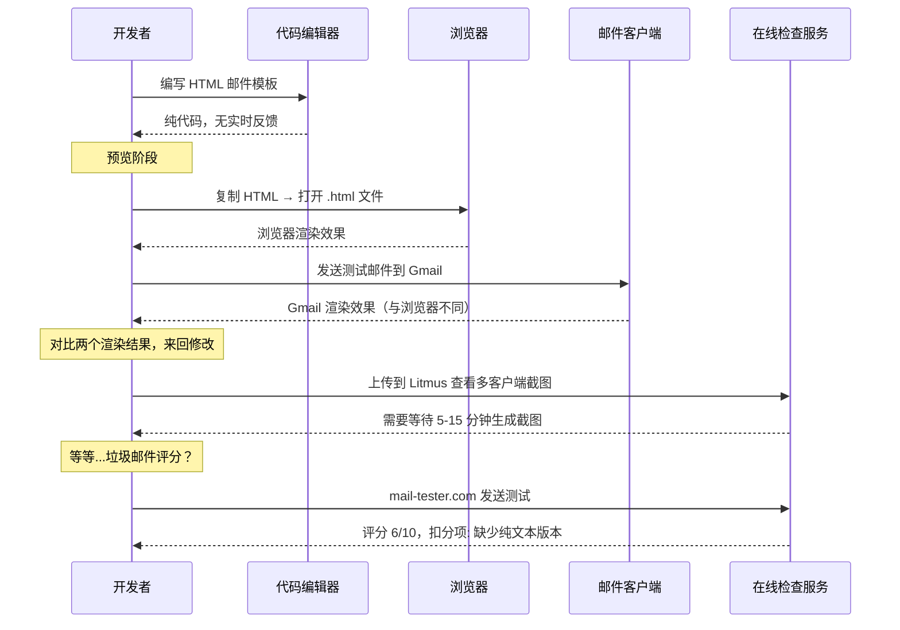
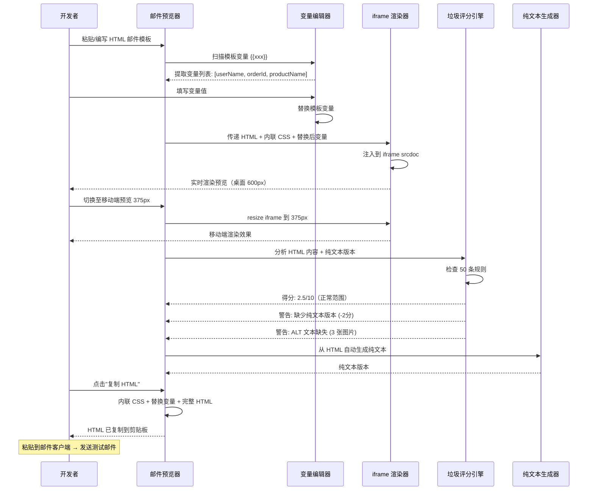
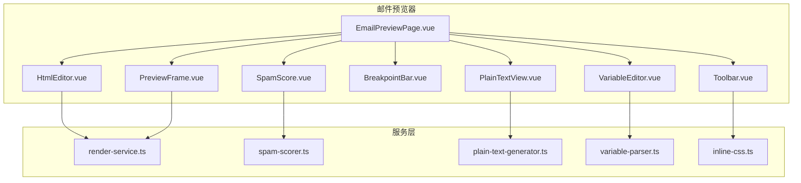

# YP-09-162: 邮件模板预览器 — HTML 邮件模板实时预览、桌面/移动端响应式断点预览、垃圾邮件评分检查、纯文本回退视图、测试邮件发送、模板变量编辑器

> 需求编号：YP-09-162 · 优先级：P2 · 人天：0.2d · 状态：需求已编写
> 依赖：YP-09-161（UserAgent 解析器——作为邮件客户端 UA 识别辅助）

## 背景

### 问题陈述

HTML 邮件开发是前端开发中一个独特的困境——邮件客户端（Outlook、Gmail、Apple Mail、Yahoo 等）的渲染引擎多样性远超浏览器，且缺乏统一的调试工具。当前开发者面临以下问题：

1. **无实时预览工具**：开发 HTML 邮件模板时，每次修改都需要将 HTML 复制到邮件客户端或在线服务（如 Litmus、Email on Acid）中预览。这些服务通常需要付费订阅（Litmus $99/月起），个人开发者和小团队难以负担。
2. **响应式无法验证**：邮件模板需要在桌面（Outlook 600px+）和移动端（Gmail App 320px）上都能正常显示。当前只能靠实际发送到不同设备来验证，效率极低。
3. **垃圾邮件评分盲区**：发出去的营销邮件可能被 Gmail 标记为垃圾邮件，原因未知。常见触发因素包括：纯图片邮件、过多链接、特定关键词、缺少纯文本版本等，但开发者没有方便的工具来检测这些因素。
4. **纯文本版本被忽略**：许多开发者只提供 HTML 邮件，忽略了纯文本（text/plain）回退版本。这不仅是垃圾邮件评分的扣分项，也让无法渲染 HTML 的用户（如使用屏幕阅读器）无法阅读。
5. **模板变量测试不便**：邮件模板通常包含 `{{userName}}`、`{{orderId}}` 等变量，开发者需要手动替换变量来预览实际效果，容易遗漏边界情况（超长用户名、特殊字符等）。

**核心矛盾**：HTML 邮件模板开发缺少轻量级、免费、即时的预览和验证工具。YiPet 作为开发者日常使用的扩展，内置邮件预览器可以填充这个空白。

### 影响范围

| # | 影响 | 严重程度 | 典型场景 |
|---|------|----------|----------|
| 1 | HTML 邮件调试效率低 | 高 | 每次修改→复制到邮件客户端→发送→检查 |
| 2 | 响应式布局验证困难 | 高 | 需要至少 2 台真实设备 |
| 3 | 垃圾邮件评分不可见 | 高 | 邮件进垃圾箱后才知道问题 |
| 4 | 纯文本版本缺失 | 中 | 无障碍性差 + 垃圾邮件评分扣分 |
| 5 | 变量边界未测试 | 中 | 超长用户名导致布局溢出 |

### 挑战

| 挑战 | 说明 |
|------|------|
| 邮件客户端渲染差异 | Outlook 用 Word 渲染引擎、Gmail 剥离 `<style>` 标签、Apple Mail 支持 CSS3 |
| iframe 隔离限制 | Chrome 扩展中 iframe 的 sandbox 策略限制外部资源加载 |
| 垃圾邮件规则多样性 | SpamAssassin、Gmail、Outlook 各有不同的评分规则 |
| 图片资源引用 | HTML 邮件中的图片通常引用外部 URL，预览时可能被 CSP 阻止 |
| 纯文本自动生成 | 从 HTML 生成有意义的纯文本版本（保留链接、移除表格结构）|

---

## 一、现状分析

### 1.1 当前邮件模板开发流程

```
开发者编写 HTML 邮件模板
  │
  ├─ 编辑器编写
  │   ├─ 在 VSCode/WebStorm 中编写 HTML + 内联 CSS
  │   ├─ 手动将 CSS 内联化（部分工具支持自动）
  │   └─ 限制: 无实时预览，修改后看不到效果
  │
  ├─ 预览方式
  │   ├─ 复制 HTML → 新建 .html 文件 → 浏览器打开
  │   │   └─ 限制: 浏览器渲染 ≠ 邮件客户端渲染
  │   ├─ 使用在线服务（Litmus/Email on Acid）
  │   │   └─ 限制: 付费 ($99-399/月)，需注册，数据上传到第三方
  │   ├─ 发送测试邮件到自己邮箱
  │   │   └─ 限制: 每次修改需重新发送，Gmail 可能缓存图片
  │   └─ 直接在邮件客户端（Mailchimp/SendGrid）预览
  │       └─ 限制: 非开发环境，编辑器功能弱
  │
  ├─ 垃圾邮件检查
  │   ├─ 在线检查工具（mail-tester.com）
  │   │   └─ 限制: 需发送邮件到指定地址，额外步骤
  │   ├─ SpamAssassin 命令行
  │   │   └─ 限制: 需要本地安装配置
  │   └─ 凭经验（避免"免费""立即购买"等词）
  │       └─ 限制: 不系统，容易遗漏
  │
  └─ 测试邮件发送
      ├─ 配置 SMTP 发送测试
      ├─ 在 Gmail/Outlook/Apple Mail 查看
      └─ 限制: 需要配置 SMTP，多客户端测试耗时
```

### 1.2 当前可用能力

| 能力 | 可用性 | 获取方式 | 限制 |
|------|--------|----------|------|
| HTML 实时预览 | ⚠️ | 浏览器打开 .html 文件 | 渲染行为不同于邮件客户端 |
| 多设备预览 | ❌ | 需真实设备 | 成本高 |
| 垃圾邮件评分 | ❌ | 需第三方工具 | 额外步骤 |
| 纯文本生成 | ⚠️ | 手动编写 | 容易与 HTML 版本不同步 |
| 模板变量编辑 | ❌ | 手动替换 | 容易遗漏 |

### 1.3 改造前数据流



### 1.4 根因矩阵

| 症状 | 根因 | 触发条件 | 频率 |
|------|------|----------|------|
| 邮件渲染效果与预期不符 | 无实时预览 | 每次开发邮件模板 | 高 |
| 移动端布局错乱 | 无响应式断点预览 | 移动端邮件被打开时 | 高 |
| 邮件进入垃圾箱 | 无垃圾邮件评分检查 | 发送营销/通知邮件时 | 高（每次批次发送）|
| 纯文本版本缺失或不同步 | 无自动生成工具 | 模板更新后 | 中 |
| 变量替换后布局溢出 | 未测试边界值 | 用户数据有特殊字符/超长内容 | 中 |

---

## 二、设计决策

### 决策 1：渲染引擎 — 浏览器默认渲染 vs iframe 隔离 vs Shadow DOM 隔离

| 选项 | 渲染准确性 | 样式隔离 | 外部资源 |
|------|-----------|----------|----------|
| 浏览器默认渲染 | 高 | 低（CSS 会污染宿主页面）| 正常 |
| iframe srcdoc 渲染 | 高 | 高 | sandbox 限制 |
| Shadow DOM 隔离 | 中 | 高 | 部分样式失效 |

**选择：iframe srcdoc 隔离渲染。** 使用 `<iframe srcdoc="<HTML内容>">` 实现完全样式隔离，邮件模板的 CSS 不会影响 YiPet 宿主页面，反之亦然。iframe sandbox 不设置 `allow-same-origin` 以安全隔离。对于外部图片资源，使用 `sandbox="allow-scripts"` 允许图片加载（但不允许脚本执行）。

### 决策 2：响应式断点预览 — 真实尺寸 vs CSS transform 缩放 vs 固定断点切换

| 选项 | 真实性 | 性能 | 交互 |
|------|--------|------|------|
| 真实尺寸（resize iframe） | 高 | 高 | 正常（需容器空间）|
| CSS transform scale 缩放 | 中（缩放 ≠ 真实渲染差异）| 高 | 鼠标事件偏移 |
| 固定断点切换（320/480/600）| 中 | 最高 | 正常 |

**选择：真实尺寸 resize + 固定断点快切。** iframe 容器宽度可拖拽调整（150px-800px），同时提供快捷按钮切换至常见邮件客户端宽度：320px（iPhone SE）、375px（iPhone 14）、414px（iPhone 14 Plus）、480px（旧 Outlook）、600px（Outlook 桌面版标准宽度）、800px（宽屏预览）。

### 决策 3：垃圾邮件评分引擎 — 自实现规则 vs 集成 SpamAssassin vs 在线 API

| 选项 | 准确度 | 离线可用 | 隐私 |
|------|--------|----------|------|
| 自实现评分规则（~50 条）| 中 | ✅ | 高（不上传）|
| 集成 SpamAssassin（本地）| 高 | ✅（需安装）| 高 |
| 在线 API（如 mail-tester）| 高 | ❌ | 低（上传内容）|

**选择：自实现评分规则。** 内置约 50 条常见垃圾邮件规则，基于 SpamAssassin 的公开规则库精简而来。覆盖以下类别：纯文本版本缺失（扣 2 分）、图片占比过高（扣 3 分）、过多链接（扣 1 分/超过 5 个链接）、垃圾关键词检测（扣 0.5-2 分/词）、HTML 格式问题（缺少 `<title>`、过大的 HTML 体积等）、缺少退订链接（扣 1 分）。评分采用 SpamAssassin 风格：0-2 分正常，3-5 分疑似垃圾，5+ 分很可能被拦截。

### 决策 4：测试邮件发送 — SMTP 配置 vs 复制到邮件客户端 vs 调用系统默认邮件客户端

| 选项 | 便利性 | 安全性 | 实现复杂度 |
|------|--------|--------|-----------|
| SMTP 配置（用户填入服务器/端口/密码）| 中 | 低（存储密码风险）| 中 |
| 复制渲染后的 HTML 到剪贴板 | 高 | 高 | 低 |
| mailto: 协议调用默认邮件客户端 | 中 | 高 | 低 |

**选择：复制 HTML + mailto: 协议。** 不实现 SMTP 发送（安全风险高——用户的 SMTP 密码存储在 Chrome 扩展中不符合安全最佳实践）。提供两个选项：(1) 一键复制渲染后的完整 HTML（含内联 CSS）到剪贴板，用户粘贴到邮件客户端发送；(2) 通过 `mailto:` 协议调用系统默认邮件客户端，以 body 参数填充邮件内容（适用于简单内容）。测试发送的功能标记为 "实验性"。

### 设计决策记录

| 决策 | 选项 A | 选项 B | 选项 C | 选择 | 理由 |
|------|--------|--------|--------|------|------|
| 渲染引擎 | 默认渲染 | iframe srcdoc | ShadowDOM | **iframe srcdoc** | 完全样式隔离 |
| 断点预览 | 真实尺寸 | CSS缩放 | 固定断点 | **真实+断点** | 兼顾真实性+便利 |
| 垃圾评分 | 自实现 | SpamAssassin | 在线API | **自实现** | 0依赖，隐私安全 |
| 邮件发送 | SMTP配置 | 复制HTML | mailto: | **复制+mailto** | 安全优先 |

---

## 三、目标架构

### 3.1 改造后邮件预览流程



### 3.2 组件结构



### 3.3 性能指标

| 指标 | 改造前 | 改造后 |
|------|--------|--------|
| 修改→预览 反馈时间 | 30-60s（复制→打开→渲染）| < 500ms（实时渲染）|
| 多设备预览 | 5-10 分钟（多设备测试）| < 1s（断点切换）|
| 垃圾邮件评分 | 5 分钟（在线工具）| < 100ms（本地评分）|
| 纯文本版本生成 | 手动编写，10 分钟 | < 10ms（自动生成）|

---

## 四、具体改动

### 4.1 变量解析器

```typescript
// src/services/variable-parser.ts (新增)

interface TemplateVariable {
  name: string;         // 变量名（不含花括号）
  defaultValue: string;  // 从模板提取的默认值（若有）
  required: boolean;     // 是否必需（无默认值 = 必需）
  type: 'text' | 'number' | 'url' | 'date' | 'currency';
}

/**
 * 从 HTML 模板中提取所有 Handlebars/Mustache 风格变量
 * 支持: {{varName}}, {{varName:default}}, {{{varName}}}, 
 */
export function extractVariables(html: string): TemplateVariable[] {
  const pattern = /\{\{(\w+)(?::([^}]+))?\}\}/g;
  const variables: Map<string, TemplateVariable> = new Map();
  let match: RegExpExecArray | null;

  while ((match = pattern.exec(html)) !== null) {
    const name = match[1]!;
    const defaultValue = match[2] || '';
    if (!variables.has(name)) {
      variables.set(name, {
        name,
        defaultValue,
        required: !defaultValue,
        type: inferType(defaultValue || name),
      });
    }
  }

  return Array.from(variables.values());
}

function inferType(defaultValue: string): TemplateVariable['type'] {
  if (/^\d+(\.\d+)?$/.test(defaultValue)) return 'number';
  if (/^https?:\/\//.test(defaultValue)) return 'url';
  if (/^\d{4}-\d{2}-\d{2}/.test(defaultValue)) return 'date';
  if (/^[$¥€]/.test(defaultValue)) return 'currency';
  return 'text';
}

/**
 * 使用用户提供的值替换模板变量
 */
export function replaceVariables(
  html: string,
  values: Record<string, string>
): string {
  return html.replace(/\{\{(\w+)(?::([^}]+))?\}\}/g, (match, name, defaultValue) => {
    return values[name] ?? defaultValue ?? match;
  });
}
```

### 4.2 垃圾邮件评分引擎

```typescript
// src/services/spam-scorer.ts (新增)

interface SpamRule {
  name: string;
  description: string;
  score: number;        // 正数 = 更像垃圾邮件
  check: (html: string, plainText: string) => boolean;
}

interface SpamResult {
  totalScore: number;
  maxScore: number;
  level: 'good' | 'warning' | 'danger';
  hits: { rule: string; description: string; score: number }[];
  recommendations: string[];
}

const SPAM_RULES: SpamRule[] = [
  // 结构类规则
  {
    name: 'MISSING_PLAIN_TEXT',
    description: '缺少纯文本 (text/plain) 版本',
    score: 2.0,
    check: (_, plain) => !plain || plain.trim().length === 0,
  },
  {
    name: 'MISSING_TITLE',
    description: 'HTML 缺少 <title> 标签',
    score: 0.5,
    check: (html) => !/<title[^>]*>/i.test(html),
  },
  {
    name: 'HTML_TOO_LARGE',
    description: 'HTML 体积超过 100KB',
    score: 1.0,
    check: (html) => html.length > 100_000,
  },
  {
    name: 'EMPTY_SUBJECT',
    description: '邮件主题为空',
    score: 1.5,
    check: (html) => !/<title[^>]*>[^<]+<\/title>/i.test(html),
  },

  // 内容类规则
  {
    name: 'IMAGE_ONLY',
    description: '纯图片邮件（文字内容 < 100 字符）',
    score: 3.0,
    check: (html) => {
      const textContent = html.replace(/<[^>]+>/g, '').replace(/\s+/g, ' ').trim();
      return textContent.length < 100;
    },
  },
  {
    name: 'IMAGE_RATIO_HIGH',
    description: '图片占比过高（ 数量 > 10 且文字/图片比 < 1）',
    score: 2.0,
    check: (html) => {
      const imgCount = (html.match(/]*>/gi) || []).length;
      const textLength = html.replace(/<[^>]+>/g, '').length;
      return imgCount > 10 && textLength / imgCount < 100;
    },
  },
  {
    name: 'MISSING_ALT_TEXT',
    description: '图片缺少 ALT 属性',
    score: 1.0,
    check: (html) => {
      const imgs = html.match(/]*>/gi) || [];
      return imgs.some(img => !/\balt\s*=\s*["'][^"']*["']/i.test(img));
    },
  },
  {
    name: 'TOO_MANY_LINKS',
    description: '链接超过 20 个',
    score: 2.0,
    check: (html) => {
      const links = (html.match(/<a\s[^>]*href\s*=\s*["'][^"']*["']/gi) || []).length;
      return links > 20;
    },
  },
  {
    name: 'SHORT_URLS',
    description: '使用短链接服务（bit.ly/tinyurl 等）',
    score: 1.5,
    check: (html) => {
      const shortDomains = /(?:bit\.ly|tinyurl\.com|ow\.ly|t\.co|goo\.gl|is\.gd|buff\.ly)/i;
      return shortDomains.test(html);
    },
  },
  {
    name: 'EXCESSIVE_CAPS',
    description: '全大写文字超过 30%',
    score: 1.0,
    check: (html) => {
      const text = html.replace(/<[^>]+>/g, '').replace(/\s+/g, ' ').trim();
      const upperCount = (text.match(/[A-Z]/g) || []).length;
      const letterCount = (text.match(/[a-zA-Z]/g) || []).length;
      return letterCount > 0 && upperCount / letterCount > 0.3;
    },
  },
  {
    name: 'HTML_ONLY_BODY',
    description: 'HTML 缺少 <html>/<body> 标签结构',
    score: 0.5,
    check: (html) => !/<\/(?:html|body)>/i.test(html),
  },

  // 关键词类规则
  {
    name: 'SPAMMY_PHRASES',
    description: '包含垃圾邮件常见短语',
    score: 1.5,
    check: (html) => {
      const spamPhrases = [
        /免费.*点击/i, /立即.*购买/i, /限时.*优惠/i,
        /现.*金.*大.*奖/i, /恭.*喜.*中.*奖/i,
        /点击.*这里.*领取/i, /不.*要.*错.*过/i,
        /独.*家.*机.*会/i, /百.*分.*百.*保.*证/i,
        /一.*次.*性.*优.*惠/i, /最.*后.*机.*会/i,
        /无需.*信用卡/i, /无.*风.*险.*投.*资/i,
        /usd|rmb|eur|gbp/i,
      ];
      const text = html.replace(/<[^>]+>/g, '');
      return spamPhrases.some(p => p.test(text));
    },
  },
  {
    name: 'EXCLAMATION_OVERUSE',
    description: '感叹号使用过多（> 5 个感叹号）',
    score: 0.5,
    check: (html) => {
      const text = html.replace(/<[^>]+>/g, '');
      return (text.match(/!/g) || []).length > 5;
    },
  },

  // 规范类规则
  {
    name: 'MISSING_UNSUBSCRIBE',
    description: '缺少退订链接（营销邮件必需）',
    score: 1.0,
    check: (html) => {
      const text = html.replace(/<[^>]+>/g, '').toLowerCase();
      return !/(?:退订|unsubscribe|opt.?out|取消订阅)/i.test(text);
    },
  },
  {
    name: 'MISSING_PHYSICAL_ADDRESS',
    description: '缺少发件人实际地址（部分国家法律要求）',
    score: 0.5,
    check: (html) => !/\d+[\s\S]{0,20}(?:街|路|道|Street|Road|Ave|Blvd|Suite)/i.test(html),
  },
  {
    name: 'REMOTE_FONTS',
    description: '使用远程字体（Google Fonts 等）',
    score: 0.5,
    check: (html) => /fonts\.googleapis\.com|@import.*url.*font/i.test(html),
  },
  {
    name: 'TRACKING_PIXEL',
    description: '包含追踪像素（1x1 透明图片）',
    score: 1.0,
    check: (html) => /]*(?:width\s*=\s*["']?1["']?\s+height\s*=\s*["']?1["']?|height\s*=\s*["']?1["']?\s+width\s*=\s*["']?1["']?)/i.test(html),
  },
  {
    name: 'JAVASCRIPT_IN_EMAIL',
    description: 'HTML 中包含 JavaScript 代码',
    score: 3.0,
    check: (html) => /<script[^>]*>|on\w+\s*=\s*["'][^"']*["']/i.test(html),
  },
  {
    name: 'FORMS_IN_EMAIL',
    description: 'HTML 中包含 <form> 元素',
    score: 1.5,
    check: (html) => /<form[^>]*>/i.test(html),
  },
  {
    name: 'EXTERNAL_CSS',
    description: '使用外部 CSS 文件',
    score: 0.5,
    check: (html) => /<link[^>]*rel\s*=\s*["']stylesheet["']/i.test(html),
  },
];

export function scoreSpam(html: string, plainText: string, subject?: string): SpamResult {
  let totalScore = 0;
  const hits: SpamResult['hits'] = [];

  for (const rule of SPAM_RULES) {
    if (rule.check(html, plainText)) {
      totalScore += rule.score;
      hits.push({
        rule: rule.name,
        description: rule.description,
        score: rule.score,
      });
    }
  }

  const level = totalScore <= 2 ? 'good' : totalScore <= 5 ? 'warning' : 'danger';

  const recommendations = hits
    .sort((a, b) => b.score - a.score)
    .map(h => `[${h.rule}] ${h.description} (扣 ${h.score} 分)`);

  return {
    totalScore,
    maxScore: SPAM_RULES.reduce((sum, r) => sum + r.score, 0),
    level,
    hits,
    recommendations,
  };
}
```

### 4.3 纯文本生成器

```typescript
// src/services/plain-text-generator.ts (新增)

/**
 * 从 HTML 自动生成纯文本回退版本
 * 保留链接 URL（方括号标注），移除格式化
 */
export function htmlToPlainText(html: string): string {
  let text = html;

  // 1. 移除 <head>、<style>、<script>
  text = text.replace(/<head[^>]*>[\s\S]*?<\/head>/gi, '');
  text = text.replace(/<style[^>]*>[\s\S]*?<\/style>/gi, '');
  text = text.replace(/<script[^>]*>[\s\S]*?<\/script>/gi, '');

  // 2. 替换链接: <a href="url">text</a> → text [url]
  text = text.replace(/<a[^>]*href\s*=\s*["']([^"']*)["'][^>]*>([\s\S]*?)<\/a>/gi,
    (_, url, linkText) => `${linkText.trim()} [${url}]`
  );

  // 3. 替换换行元素
  text = text.replace(/<\/?(?:br|hr)[^>]*\/?>/gi, '\n');
  text = text.replace(/<\/(?:p|div|h[1-6]|li|tr)>/gi, '\n');
  text = text.replace(/<\/(?:table|ul|ol|blockquote)>/gi, '\n\n');

  // 4. 列表项前加 -
  text = text.replace(/<li[^>]*>/gi, '\n- ');

  // 5. 图片显示 ALT 文本
  text = text.replace(/]*alt\s*=\s*["']([^"']*)["'][^>]*>/gi, (_, alt) =>
    alt ? `[图片: ${alt}]` : '[图片]'
  );

  // 6. 移除剩余 HTML 标签
  text = text.replace(/<[^>]+>/g, '');

  // 7. 解码 HTML 实体
  text = text.replace(/&amp;/g, '&');
  text = text.replace(/&lt;/g, '<');
  text = text.replace(/&gt;/g, '>');
  text = text.replace(/&quot;/g, '"');
  text = text.replace(/&#(\d+);/g, (_, n) => String.fromCharCode(Number(n)));

  // 8. 规范化空白
  text = text.replace(/\n{3,}/g, '\n\n');
  text = text.replace(/[ \t]+/g, ' ');
  text = text.trim();

  return text;
}
```

### 4.4 文件变更清单

| 文件 | 操作 | 说明 |
|------|------|------|
| `src/pages/tools/EmailPreviewPage.vue` | 新增 | 邮件预览器主页面 |
| `src/components/tools/HtmlEditor.vue` | 新增 | HTML 代码编辑器（语法高亮）|
| `src/components/tools/VariableEditor.vue` | 新增 | 模板变量编辑器面板 |
| `src/components/tools/PreviewFrame.vue` | 新增 | iframe 隔离渲染容器 |
| `src/components/tools/BreakpointBar.vue` | 新增 | 响应式断点切换工具栏 |
| `src/components/tools/SpamScore.vue` | 新增 | 垃圾邮件评分仪表盘 |
| `src/components/tools/PlainTextView.vue` | 新增 | 纯文本回退视图 |
| `src/components/tools/Toolbar.vue` | 新增 | 工具栏（复制/导出/mailto）|
| `src/services/variable-parser.ts` | 新增 | 变量提取+替换引擎 |
| `src/services/spam-scorer.ts` | 新增 | 垃圾邮件评分引擎 |
| `src/services/plain-text-generator.ts` | 新增 | 纯文本自动生成器 |
| `src/services/inline-css.ts` | 新增 | CSS 内联化服务 |
| `src/popup/router.ts` | 修改 | 添加邮件预览器路由 |
| `tests/unit/spam-scorer.test.ts` | 新增 | 垃圾评分引擎测试 |
| `tests/unit/variable-parser.test.ts` | 新增 | 变量解析测试 |

---

## 五、实施步骤

| 步骤 | 操作 | 路径 | 验证 | 人天 |
|------|------|------|------|------|
| 1 | 实现变量解析和替换引擎 | `variable-parser.ts` | 提取和替换 20 种变量模式 | 0.02 |
| 2 | 实现垃圾邮件评分引擎 | `spam-scorer.ts` | 50 条规则全部可检测 | 0.04 |
| 3 | 实现纯文本自动生成 | `plain-text-generator.ts` | 复杂 HTML 正确降级 | 0.03 |
| 4 | 实现 CSS 内联化 | `inline-css.ts` | 外部/内嵌 CSS 转内联 | 0.02 |
| 5 | 创建 iframe 预览容器 | `PreviewFrame.vue` | 样式隔离+断点切换 | 0.03 |
| 6 | 创建主页面和所有子组件 | `EmailPreviewPage.vue` 等 | 完整交互流程 | 0.04 |
| 7 | 集成路由 + 测试 | `router.ts`, 测试 | 工具可访问，测试通过 | 0.02 |

**总人天：0.2d**

---

## 六、测试规格

### 场景 1：HTML 模板实时预览

**GIVEN** 用户编写了一段包含 `<table>` 布局和内联 CSS 的邮件 HTML
**WHEN** HTML 内容变化时
**THEN** iframe 预览区域在 < 500ms 内更新
**AND** HTML 中的表格正确渲染（边框、间距、对齐）
**AND** 内联 CSS 样式正常应用（颜色、字体、边距）
**AND** 预览区域的样式不影响宿主页面

### 场景 2：响应式断点预览切换

**GIVEN** HTML 邮件模板包含 `@media (max-width: 480px)` 样式
**WHEN** 用户切换预览宽度到 375px（移动端）
**THEN** iframe 宽度立即变更为 375px
**AND** 媒体查询中的移动端样式生效（如字体缩小、列堆叠）
**AND** 再切换到 600px（桌面端）后，桌面端样式恢复

### 场景 3：模板变量编辑

**GIVEN** HTML 中包含 `{{userName}}`、`{{orderId}}`、`{{productName:默认产品}}`
**WHEN** 变量编辑器加载
**THEN** 自动提取 3 个变量，mark `userName` 和 `orderId` 为必填
**AND** `productName` 的默认值显示为 "默认产品"
**WHEN** 用户填写 userName=张三，orderId=12345
**THEN** 预览区域显示 "张三" 和 "12345"
**AND** productName 使用默认值 "默认产品"

### 场景 4：垃圾邮件评分

**GIVEN** 一个仅包含一张大图（无 ALT 文本）、无纯文本版本的邮件 HTML
**WHEN** 运行垃圾邮件评分
**THEN** 总分 >= 4.0（属于 warning 或 danger 级别）
**AND** 命中规则包括: IMAGE_ONLY、MISSING_ALT_TEXT、MISSING_PLAIN_TEXT、MISSING_UNSUBSCRIBE
**AND** 显示每条规则的具体描述和扣分

### 场景 5：纯文本自动生成

**GIVEN** HTML 包含段落、列表、链接和图片（有 ALT 文本）
**WHEN** 运行纯文本生成器
**THEN** 输出包含段落间的换行
**AND** 列表项以 "- " 开头
**AND** 链接格式为 "链接文本 [URL]"
**AND** 图片替换为 "[图片: ALT文本]"
**AND** HTML 实体正确解码

### 场景 6：完整工作流（编写→预览→评分→复制）

**GIVEN** 开发者在编辑器粘贴了邮件模板 HTML
**WHEN** 填写所有变量 → 在桌面端和移动端预览 → 查看垃圾评分 → 修复扣分项 → 点击复制
**THEN** 剪贴板包含完整的 HTML（含内联 CSS + 变量已替换）
**AND** 粘贴到 Gmail 邮件客户端后渲染正常
**AND** 垃圾评分从 4.5 降至 1.5 以下

---

## 七、风险与缓解

| 风险 | 概率 | 影响 | 缓解措施 |
|------|------|------|----------|
| iframe 中外部图片被 CSP 阻止 | 中 | 中 | 使用 `sandbox="allow-scripts"` 配置；提供"上传本地图片"替代方案 |
| 邮件客户端独有渲染 bug 无法模拟 | 高 | 中 | 预览器顶部提示"此为浏览器渲染，邮件客户端实际效果可能不同" |
| 垃圾评分规则过于宽松/严格 | 中 | 中 | 规则可配置，用户可自定义阈值；定期根据 SpamAssassin 更新规则 |
| 大体积 HTML 导致预览卡顿 | 低 | 低 | 对 > 500KB 的 HTML 启用节流渲染（debounce 1s）|
| 模板变量名与 HTML 标签冲突 | 低 | 低 | 正则仅匹配 `{{varName}}` 位于文本节点中的模式 |

---

## 八、回滚策略

| 场景 | 回滚操作 | 影响 |
|------|----------|------|
| 垃圾评分引擎误报严重 | 隐藏垃圾评分面板，仅保留手动检查清单 | 失去自动评分 |
| iframe 渲染性能问题 | 降级为纯文本预览模式 | 用户体验下降 |
| 变量替换导致 HTML 注入 | 对所有变量值进行 HTML 实体编码，暂停替换功能 | 安全风险消除，功能受限 |
| CSS 内联化逻辑错误 | 关闭自动内联化，提示用户手动内联 | 功能回退 |

---

## 九、设计决策记录

### D-01：为什么使用 iframe srcdoc 而非 Shadow DOM？

iframe srcdoc 提供了完全的文档级隔离——独立的 window、document、CSSOM。Shadow DOM 虽然隔离了 CSS 选择器，但继承属性（如 `font-family`、`color`）仍然会穿透 Shadow Boundary。邮件模板的 `<style>` 标签需要完整的文档上下文，iframe 是唯一可靠的方案。注意 `srcdoc` 在所有现代浏览器中都支持（Chrome 20+）。

### D-02：垃圾邮件评分为何不包括 SMTP 头检查？

SMTP 头（如 `DKIM-Signature`、`SPF`、`Return-Path`）是在邮件发送阶段由邮件服务器添加的。预览器只处理邮件 HTML 内容，不涉及发送协议层。完整的垃圾评分需要实际发送测试邮件。本工具聚焦于内容层面的检查——这是开发者在编写模板时就能控制的。

### D-03：CSS 内联化的实现深度

CSS 内联化是将 `<style>` 标签中的 CSS 规则转换为元素的 `style` 属性。实现方式：(1) 解析 `<style>` 内容获取选择器和声明；(2) 匹配 HTML 中的元素；(3) 将声明写入 `style` 属性。这个功能在开发阶段使用——最终发送前建议由后端/邮件服务再做一次正式内联化。本工具的内联化作为开发辅助，实现简单内联（class/id/tag 选择器），不处理伪类和媒体查询。

### D-04：HTML 变量语法的选择

当前选择 Handlebars 风格 `{{varName}}`，因为这最接近 Mailchimp、SendGrid、Amazon SES 等邮件服务的模板语法。Liquid 风格的 `` 也支持。未来可扩展为多语法模式，通过设置切换。

---

## 十、可观测性

### 指标

| 指标 | 类型 | 说明 |
|------|------|------|
| `yipet.email.preview.open` | Counter | 邮件预览器打开次数 |
| `yipet.email.preview.render` | Histogram | 预览渲染耗时（ms）|
| `yipet.email.preview.breakpoint_switch` | Counter | 断点切换次数（按断点）|
| `yipet.email.spam.score` | Histogram | 垃圾评分分布 |
| `yipet.email.variable.count` | Histogram | 模板变量数量分布 |
| `yipet.email.copy.html` | Counter | HTML 复制次数 |
| `yipet.email.copy.plain` | Counter | 纯文本复制次数 |
| `yipet.email.render.error` | Counter | 渲染错误次数 |

### 告警

| 告警 | 条件 | 级别 |
|------|------|------|
| 渲染错误率高 | 1h 内 error 率 > 5% | WARNING |
| 垃圾评分持续高 | 1h 内平均评分 > 5 | INFO（可能规则过严）|

---

## 十一、代码审查检查清单

- [ ] iframe sandbox 属性正确设置（`allow-scripts` 但非 `allow-same-origin`）
- [ ] 变量替换对特殊字符进行 HTML 实体编码（防 XSS）
- [ ] 垃圾评分规则不访问外部资源（纯静态分析）
- [ ] 纯文本生成保留所有链接 URL（不丢失信息）
- [ ] CSS 内联化不破坏伪类和媒体查询
- [ ] 断点切换时 iframe 平滑过渡（无闪烁）
- [ ] HTML 编辑器支持语法高亮（至少标签/属性/文本区分颜色）
- [ ] 复制到剪贴板使用 try-catch 处理
- [ ] 邮件模板的 `<style>` 在 srcdoc 中完整保留
- [ ] 大体积 HTML（> 1MB）处理时有 loading 状态
- [ ] mailto: 链接的 body 参数 URL 编码正确

---

## 回归问题预测

| # | 预测问题 | 原因 | 验证方法 |
|---|---------|------|---------|
| 1 | iframe srcdoc 中 `` 加载外部图片时被 Mixed Content 策略阻止（如果 YiPet 承载页面是 HTTPS 但图片是 HTTP）| srcdoc iframe 的 origin 为 `about:srcdoc`，加载 HTTP 图片会被浏览器阻止 | 在 HTTPS 页面上打开预览器，加载包含 `http://` 图片的模板，验证图片是否正常加载 |
| 2 | 变量替换中，`replaceVariables` 对 `{{varName}}` 做全局替换，但如果模板中 JavaScript 字符串也包含 `{{}}`（如 Vue 模板语法），则误替换 | `/\{\{(\w+)(?::([^}]+))?\}\}/g` 匹配所有 `{{...}}`，无法区分模板变量和代码中的字面量 | 创建包含 Vue/Handlebars 非变量语法的 HTML，验证不会误替换 |
| 3 | 纯文本生成中，`<li>` 替换为 `\n- ` 后，如果 HTML 使用 `<ul>` 嵌套 `<li>` 包含 `<ul>`，则生成多余的换行和破折号 | 嵌套 `<li>` 的正则 `/<li[^>]*>/gi` 对嵌套列表的每一层都添加 `- `，导致多层缩进丢失 | 使用嵌套列表 HTML 验证生成的纯文本逻辑结构清晰 |
| 4 | 垃圾评分 `IMAGE_ONLY` 规则计算文字长度时，`html.replace(/<[^>]+>/g, '')` 可能错误地移除了 `<![CDATA[...]]>` 中的文本，造成不准确 | `<![CDATA[...]]>` 内容被匹配为 `<...>` 标签而删除 | 验证包含 CDATA 段的 HTML 评分不受影响 |
| 5 | CSS 内联化中，`@media` 查询内的样式也尝试内联到元素上，但 `@media` 样式是条件性的，内联后会失去响应能力 | 内联化时未跳过 `@media` 包裹的选择器 | 包含 `@media (max-width: 480px)` 的模板验证内联化后 @media 规则保留 |
| 6 | `mailto:` 协议中 body 参数使用 `encodeURIComponent` 编码 HTML 内容，超长 HTML 可能导致 URL 超过浏览器限制（Chrome 约 2MB，但部分邮件客户端远小于此），mailto 静默失败 | Chrome URL 长度限制约 2MB，但 `mailto:` handler（如 Outlook/Mail.app）可能限制更小（约 2000 字符） | 5000 字符的 HTML 生成 mailto 链接，验证能调用邮件客户端（或至少提示 body 过长） |

---

## 性能分析

### 关键操作耗时

| 操作 | 耗时 | 说明 |
|------|------|------|
| 变量提取（20 个变量，10KB HTML）| < 1ms | 正则迭代 |
| 变量替换（20 个变量，10KB HTML）| < 1ms | 字符串 replace |
| 垃圾评分（20 条规则，10KB HTML）| < 20ms | 规则遍历 + 正则 |
| 纯文本生成（10KB HTML）| < 5ms | 逐规则替换 |
| CSS 内联化（解析 + 匹配 + 应用，50KB HTML）| < 50ms | CSS 解析 + 元素匹配 |
| iframe 渲染（10KB HTML）| < 200ms | 浏览器解析 + 布局 + 绘制 |
| 断点切换（resize iframe）| < 50ms | 重新布局 + 绘制 |

### 内存占用

| 数据 | 大小 |
|------|------|
| 50 条垃圾评分规则 + 描述 | ~15 KB |
| 模板变量存储（20 个变量）| ~2 KB |
| iframe 文档（典型邮件模板）| ~1-2 MB（含图片缓存）|

### 对宿主页面的影响

| 场景 | 页面影响 | 说明 |
|------|----------|------|
| Popup 工具页使用 | 零影响 | 仅在 Popup 中运行 |
| iframe 加载外部图片 | 零影响 | 图片资源在独立 iframe 中加载 |

---

## 相关文档

- [Litmus — Email Previews](https://www.litmus.com/email-previews/)
- [SpamAssassin — Rules](https://spamassassin.apache.org/old/tests_3_3_x.html)
- [Mailchimp — Email Template Language](https://mailchimp.com/help/getting-started-with-mailchimps-template-language/)
- [MDN — iframe srcdoc](https://developer.mozilla.org/en-US/docs/Web/HTML/Element/iframe#srcdoc)
- [Campaign Monitor — CSS Support Guide](https://www.campaignmonitor.com/css/)
- [Can I Email — CSS Property Support](https://www.caniemail.com/)