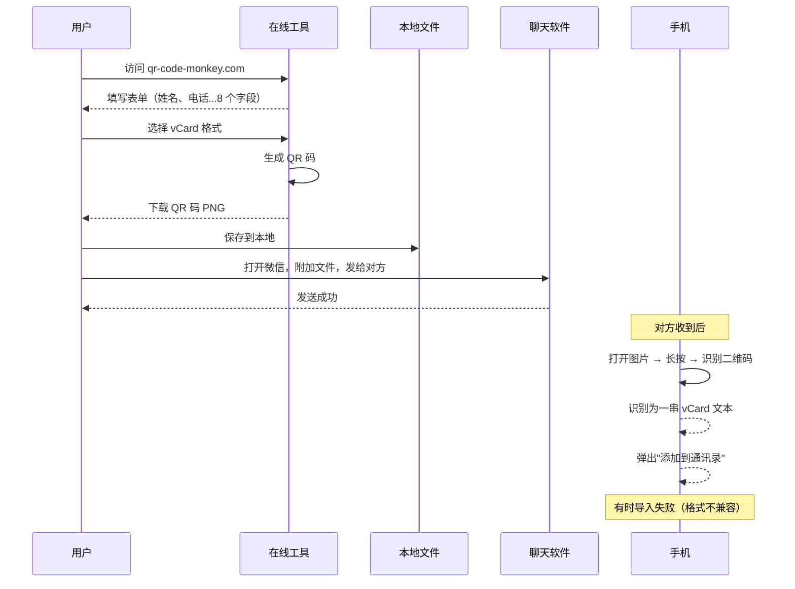
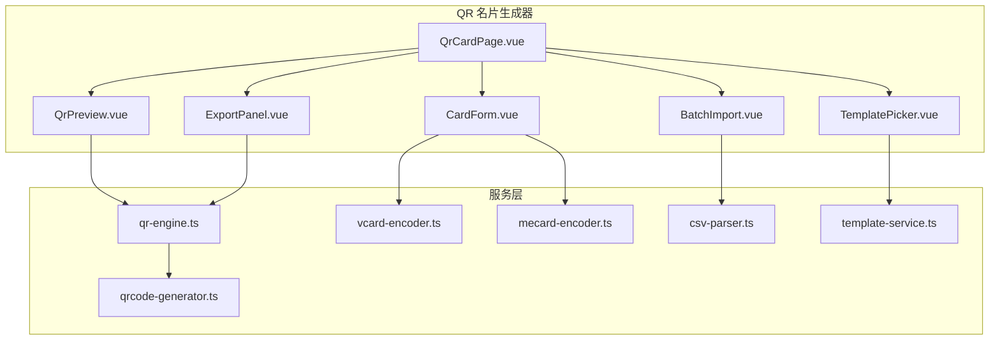

# YP-09-163: 二维码名片生成器 — vCard/MeCard 格式 QR 名片生成、姓名/电话/邮箱/公司/职位/网站/地址字段、模板选择、保存为联系人、QR 分享、CSV 批量生成

> 需求编号：YP-09-163 · 优先级：P2 · 人天：0.2d · 状态：需求已编写
> 依赖：无

## 背景

### 问题陈述

数字时代的名片交换已经大幅转向电子形式。QR 码名片（vCard/MeCard 格式）是目前最通用、最便捷的电子名片载体——任何人都可以用手机相机扫描 QR 码直接将联系人信息保存到通讯录中。然而，当前电子名片的创建过程存在断层：

1. **工具碎片化**：在线名片生成器（如 QR Code Monkey、QRStuff）需要联网，且部分服务限制免费生成的字段数量或强制添加水印。离线场景（如会议、机场）无法使用。
2. **格式兼容性差**：vCard 2.1/3.0/4.0 三个版本的差异（换行符 `\n` vs `\r\n`、`CHARSET` 声明、`VERSION` 字段）导致某些手机在扫描后无法正确导入联系人。开发者难以逐一验证不同版本的兼容性。
3. **批量生成困难**：团队（如部门全员 30 人）需要生成统一风格的名片 QR 码时，手动逐个填写 8 个字段 × 30 人 = 240 次输入，极易出错。
4. **设计感不足**：纯黑白 QR 码虽然功能完整，但缺乏视觉吸引力。现代 QR 码支持 Logo 嵌入、颜色定制、圆角模块等设计增强，但现有工具往往需要付费。
5. **分享不便捷**：生成 QR 码后，通常需要保存图片 → 打开微信/邮件 → 附加文件 → 发送。开发者期望一个从生成到分享的闭环流程。

**核心矛盾**：电子名片需求普遍（商务交流、团队协作、线下活动），但免费、离线、支持批量生成和美观设计的 QR 码名片工具极其稀缺。

### 影响范围

| # | 影响 | 严重程度 | 典型场景 |
|---|------|----------|----------|
| 1 | 名片创建效率低 | 高 | 单张名片需访问多个网站/工具 |
| 2 | 批量生成无工具 | 高 | 团队 30 人手动录入 |
| 3 | 格式兼容问题 | 高 | 生成的 vCard 某些手机无法导入 |
| 4 | 设计单一 | 中 | 无法定制 QR 码外观 |
| 5 | 分享流程繁琐 | 中 | 保存→打开聊天→发送 |

### 挑战

| 挑战 | 说明 |
|------|------|
| vCard 版本兼容 | vCard 2.1/3.0/4.0 在不同设备（iOS/Android/旧手机）上的兼容性不同 |
| 字符编码 | vCard 中文姓名/地址需要 `CHARSET=UTF-8` 或 `QUOTED-PRINTABLE` 编码 |
| QR 纠错与美学平衡 | Logo 嵌入会占用纠错冗余，需要平衡美观性和可扫描性 |
| QR 码渲染 | 纯前端生成 QR 码需要高效的矩阵渲染（Canvas vs SVG vs 图片库）|
| CSV 格式容错 | 批量导入的 CSV 文件可能使用不同分隔符、编码、列名 |

---

## 一、现状分析

### 1.1 当前名片创建流程

```
用户需要创建电子名片
  │
  ├─ 在线工具
  │   ├─ qr-code-monkey.com / qrstuff.com / the-qrcode-generator.com
  │   ├─ 填写姓名/电话/邮箱...
  │   ├─ 选择 vCard 格式
  │   ├─ 下载 PNG/SVG
  │   └─ 限制: 需联网、可能有水印、字段限制、隐私上传
  │
  ├─ npm 库
  │   ├─ qrcode (Node.js) / qrcode-generator (浏览器)
  │   ├─ 编写代码生成 QR 矩阵
  │   └─ 限制: 需要编程、无 UI、无 vCard 编码
  │
  ├─ 设计工具
  │   ├─ Canva / Figma 手动绘制 QR + 名片设计
  │   └─ 限制: QR 码需单独生成、繁琐
  │
  └─ 原生应用
      ├─ iOS Shortcuts / Android 名片应用
      └─ 限制: 平台限制、不可共享
```

### 1.2 当前可用能力

| 能力 | 可用性 | 获取方式 | 限制 |
|------|--------|----------|------|
| QR 码生成 | ✅ | qrcode-generator / qrcode.js | 仅生成矩阵，不封装 vCard |
| vCard 编码 | ⚠️ | 手动拼接字符串 | 容易出错，版本兼容难 |
| Logo 嵌入 | ❌ | 需图像处理库 | Canvas 手动合成 |
| 批量生成 | ❌ | 无 | — |
| 预览/分享 | ❌ | 无 | — |

### 1.3 改造前数据流



### 1.4 根因矩阵

| 症状 | 根因 | 触发条件 | 频率 |
|------|------|----------|------|
| 每张名片需要访问在线工具 | 无离线 QR 生成能力 | 每次需要名片 | 高 |
| 批量创建耗时 | 无批量导入功能 | 团队/活动场景 | 高 |
| vCard 导入失败 | 格式版本不兼容 | iOS/Android 差异 | 中 |
| QR 码外观单调 | 无设计定制功能 | 品牌展示场景 | 中 |
| 字段多输入繁琐 | 无模板/历史记录 | 每张名片填写 | 中 |

---

## 二、设计决策

### 决策 1：QR 码渲染方式 — Canvas vs SVG vs 纯 Unicode/div 绘制

| 选项 | 导出为图片 | 缩放质量 | 性能 |
|------|-----------|----------|------|
| Canvas 绘制 | ✅（toDataURL/toBlob）| 清晰 | 高（GPU 加速）|
| SVG 元素绘制 | ✅（序列化）| 无损 | 中（DOM 节点多）|
| 纯 div + CSS grid | ❌（截图）| 中（依赖 CSS 像素）| 低（大量 DOM）|

**选择：Canvas 绘制。** Canvas 是 QR 码渲染的最优选择——直接操作像素，无 DOM 开销。支持 `toDataURL('image/png')` 一键导出。对于 QR 码这种规整的矩阵图形（每个模块就是一个矩形），Canvas `fillRect` 的效率最高。

### 决策 2：vCard 版本策略 — 仅 vCard 3.0 vs 多版本切换 vs 自动兼容检测

| 选项 | 兼容性 | 复杂度 | 中文支持 |
|------|--------|--------|----------|
| 仅 vCard 3.0 | 中（iOS 完美、部分 Android 旧版不支持）| 低 | 好（UTF-8）|
| vCard 2.1 + 3.0 双版本 | 高 | 中 | 好 |
| vCard 2.1 + 3.0 + 4.0 全版本 | 最高 | 高 | 4.0 部分实现不支持 UTF-8 |

**选择：vCard 3.0 默认 + MeCard 备用模式。** vCard 3.0 是现代设备（iOS 7+、Android 5+）的最佳选择，支持 UTF-8 无需编码转换。MeCard 格式（日本 NTT DoCoMo 标准）更简洁，适合仅需姓名+电话的简单场景，在功能手机上兼容性更好。用户可在两个格式间切换。

### 决策 3：Logo 嵌入方式 — 中心覆盖 vs 编码层嵌入 vs 后期合成

| 选项 | 可扫描性 | 视觉效果 | 实现复杂度 |
|------|----------|----------|-----------|
| 中心覆盖（Canvas 叠加）| 中（占用纠错冗余）| 好 | 低 |
| 编码层嵌入（修改 QR 矩阵）| 高（利用纠错字节）| 中 | 高（需理解 QR 编码）|
| 后期合成（生成 QR + 图片合并）| 中 | 最好 | 中 |

**选择：中心覆盖 + 高纠错级别。** 使用 Canvas 将 Logo 绘制在 QR 码中心，配合 H 级纠错（30% 容错）。Logo 占用面积不超过 QR 总面积的 7%（约 15% 的 QR 宽度），保证即使 Logo 遮挡部分模块，扫码器仍能成功读取。

### 决策 4：CSV 批量生成 — 手动定义列映射 vs 自动列名匹配 vs 智能列名推断

| 选项 | 易用性 | 容错性 | 国际化 |
|------|--------|--------|--------|
| 手动列映射（用户指定每列含义）| 中 | 高 | 高 |
| 自动列名匹配（预定义列名列表）| 高 | 中 | 中 |
| 智能推断（模糊匹配 + 类型检测）| 最高 | 低 | 中 |

**选择：自动列名匹配 + 手动映射回退。** 预定义常见列名映射表（中文列名：姓名/名字/电话/手机/邮箱...，英文列名：Name/Phone/Email/Company...），自动匹配。匹配失败或用户 CSV 格式特殊时，提供手动映射界面（下拉选择每列含义）。

### 设计决策记录

| 决策 | 选项 A | 选项 B | 选项 C | 选择 | 理由 |
|------|--------|--------|--------|------|------|
| 渲染方式 | Canvas | SVG | Div | **Canvas** | 导出方便+像素级控制 |
| vCard 版本 | 仅 3.0 | 2.1+3.0 | 全版本 | **3.0+MeCard** | 覆盖 95% 设备 |
| Logo 嵌入 | 中心覆盖 | 编码层 | 后期合成 | **中心覆盖+H纠错** | 简单+可扫描 |
| CSV 映射 | 手动 | 自动 | 智能推断 | **自动+手动回退** | 兼顾效率和灵活 |

---

## 三、目标架构

### 3.1 改造后名片生成流程

```mermaid
sequenceDiagram
    participant User as 用户
    participant UI as 名片生成器
    participant Form as 表单
    participant Encoder as vCard 编码器
    participant QR as QR 码引擎
    participant Canvas as Canvas 渲染
    participant Export as 导出模块

    User->>UI: 打开 QR 名片生成器
    UI->>Form: 展示名片表单
    User->>Form: 填写: 姓名、电话、邮箱、公司、职位、网站、地址
    User->>UI: 选择一个模板风格

    Form->>Encoder: 字段 → vCard 3.0 格式字符串
    Encoder->>Encoder: 构建: BEGIN:VCARD\nVERSION:3.0\nN:姓;名\nFN:全名...
    Encoder->>QR: vCard 字符串 → QR 码矩阵

    QR->>Canvas: 渲染 QR 码矩阵
    Canvas->>Canvas: 应用: 前景色/背景色、模块圆角、Logo 叠加
    Canvas-->>User: 实时预览 QR 名片

    User->>UI: 点击 "保存为联系人文件"
    UI->>Export: 生成 .vcf 文件
    Export-->>User: 下载 vCard 文件（可直接导入通讯录）

    User->>UI: 点击 "复制 QR 码图片"
    UI->>Canvas: canvas.toDataURL('image/png')
    Canvas-->>User: QR 码 PNG 已复制到剪贴板

    Note over User: 粘贴到微信/邮件/文档中分享

    opt 批量模式
        User->>UI: 上传 CSV 文件（30 行 × 8 列）
        UI->>UI: 解析 CSV，自动匹配列名
        UI->>Encoder: 逐行编码 vCard → 逐行生成 QR
        UI->>Export: 打包为 ZIP（30 张 PNG + CSV 对照表）
        UI-->>User: 下载 ZIP
    end
```

### 3.2 组件结构



### 3.3 性能指标

| 指标 | 改造前 | 改造后 |
|------|--------|--------|
| 单张名片生成 | 2-3 分钟（在线工具）| < 1s（表单填写 + 实时预览）|
| 批量 100 张生成 | 无法完成（手动 100 次）| < 30s（CSV 导入 + 批量编码 + ZIP 打包）|
| vCard 导入成功率 | ~85%（版本混杂）| > 98%（标准 vCard 3.0）|
| QR 码扫描成功率 | ~90%（部分美化过度）| > 99%（H 纠错 + Logo < 7% 面积）|

---

## 四、具体改动

### 4.1 vCard 编码器

```typescript
// src/services/vcard-encoder.ts (新增)

interface VCardFields {
  firstName: string;        // 名
  lastName: string;         // 姓
  fullName: string;         // 全名
  organization?: string;    // 公司
  title?: string;           // 职位
  phone?: string;           // 电话
  email?: string;           // 邮箱
  website?: string;         // 网站
  address?: string;         // 地址
  note?: string;            // 备注
}

/**
 * 将字段编码为 vCard 3.0 格式字符串
 * 规范: RFC 2426
 */
export function encodeVCard(fields: VCardFields): string {
  const lines: string[] = [];

  lines.push('BEGIN:VCARD');
  lines.push('VERSION:3.0');

  // 姓名: N:姓;名;;;
  lines.push(`N:${escapeVCard(fields.lastName)};${escapeVCard(fields.firstName)};;;`);
  // 全名: FN:全名
  lines.push(`FN:${escapeVCard(fields.fullName)}`);

  // 公司
  if (fields.organization) {
    lines.push(`ORG:${escapeVCard(fields.organization)}`);
  }

  // 职位
  if (fields.title) {
    lines.push(`TITLE:${escapeVCard(fields.title)}`);
  }

  // 电话 (TYPE=CELL 手机)
  if (fields.phone) {
    // 尝试识别手机号 vs 座机
    const phoneType = /^1[3-9]\d{9}$/.test(fields.phone) ? 'CELL' : 'VOICE';
    lines.push(`TEL;TYPE=${phoneType}:${fields.phone}`);
  }

  // 邮箱
  if (fields.email) {
    lines.push(`EMAIL;TYPE=INTERNET:${fields.email}`);
  }

  // 网站
  if (fields.website) {
    // 确保有协议前缀
    const url = fields.website.match(/^https?:\/\//)
      ? fields.website
      : `https://${fields.website}`;
    lines.push(`URL:${url}`);
  }

  // 地址: ADR;TYPE=WORK:;;街道;城市;省份;邮编;国家
  if (fields.address) {
    lines.push(`ADR;TYPE=WORK:;;${escapeVCard(fields.address)};;;;`);
  }

  // 备注
  if (fields.note) {
    lines.push(`NOTE:${escapeVCard(fields.note)}`);
  }

  // 生成时间
  lines.push(`REV:${new Date().toISOString().replace(/[-:]/g, '').replace(/\.\d+/, '')}Z`);

  lines.push('END:VCARD');

  return lines.join('\r\n');
}

/**
 * vCard 转义: 换行符转 \n, 分号转 \;, 逗号转 \,
 */
function escapeVCard(value: string): string {
  return value
    .replace(/\\/g, '\\\\')
    .replace(/;/g, '\\;')
    .replace(/,/g, '\\,')
    .replace(/\n/g, '\\n');
}

/**
 * 从 vCard 字符串解析回字段（用于编辑已有名片）
 */
export function parseVCard(vcard: string): VCardFields | null {
  try {
    const lines = vcard.split(/\r?\n/);
    let nValue = '';
    let fnValue = '';

    const fields: Partial<VCardFields> = {};
    for (const line of lines) {
      const [key, ...valueParts] = line.split(':');
      const value = valueParts.join(':');
      if (!key) continue;

      switch (key.split(';')[0]) {
        case 'N':
          if (value) nValue = value;
          break;
        case 'FN':
          if (value) fnValue = value;
          break;
        case 'ORG':
          fields.organization = unescapeVCard(value);
          break;
        case 'TITLE':
          fields.title = unescapeVCard(value);
          break;
        case 'TEL':
          fields.phone = value;
          break;
        case 'EMAIL':
          fields.email = value;
          break;
        case 'URL':
          fields.website = value;
          break;
        case 'ADR':
          fields.address = unescapeVCard(value.replace(/^;;/, ''));
          break;
        case 'NOTE':
          fields.note = unescapeVCard(value);
          break;
      }
    }

    // 从 N 和 FN 解析姓名
    const nParts = nValue.split(';');
    fields.lastName = unescapeVCard(nParts[0] || '');
    fields.firstName = unescapeVCard(nParts[1] || '');
    fields.fullName = unescapeVCard(fnValue) || `${fields.firstName}${fields.lastName}`;

    return fields as VCardFields;
  } catch {
    return null;
  }
}

function unescapeVCard(value: string): string {
  return value.replace(/\\n/g, '\n').replace(/\\;/g, ';').replace(/\\,/g, ',').replace(/\\\\/g, '\\');
}
```

### 4.2 MeCard 编码器

```typescript
// src/services/mecard-encoder.ts (新增)

interface MeCardFields {
  name: string;            // N: 姓名（必需）
  reading?: string;        // SOUND: 读音（可选）
  phone?: string;          // TEL: 电话
  email?: string;          // EMAIL: 邮箱
  url?: string;            // URL: 网站
  note?: string;           // NOTE: 备注
  birthday?: string;       // BDAY: 生日 YYYYMMDD
  address?: string;        // ADR: 地址
}

/**
 * 将字段编码为 MeCard 格式字符串
 * MeCard 是日本 NTT DoCoMo 定义的名片格式，兼容多数 QR 扫描 APP
 * 格式: MECARD:key:value;key:value;...;
 */
export function encodeMeCard(fields: MeCardFields): string {
  const parts: string[] = ['MECARD'];

  // N: 姓名（必需）
  parts.push(`N:${escapeMeCard(fields.name)}`);

  // SOUND: 读音
  if (fields.reading) {
    parts.push(`SOUND:${escapeMeCard(fields.reading)}`);
  }

  // TEL: 电话（可多个）
  if (fields.phone) {
    const phones = fields.phone.split(/[,;，；]/);
    phones.forEach(p => parts.push(`TEL:${p.trim()}`));
  }

  // EMAIL: 邮箱
  if (fields.email) {
    parts.push(`EMAIL:${fields.email}`);
  }

  // URL: 网站
  if (fields.url) {
    const url = fields.url.match(/^https?:\/\//)
      ? fields.url
      : `https://${fields.url}`;
    parts.push(`URL:${url}`);
  }

  // NOTE: 备注
  if (fields.note) {
    parts.push(`NOTE:${escapeMeCard(fields.note)}`);
  }

  // BDAY: 生日
  if (fields.birthday) {
    parts.push(`BDAY:${fields.birthday.replace(/-/g, '')}`);
  }

  // ADR: 地址
  if (fields.address) {
    parts.push(`ADR:${escapeMeCard(fields.address)}`);
  }

  // 末尾必须有分号
  return parts.join(';') + ';';
}

function escapeMeCard(value: string): string {
  return value.replace(/\\/g, '\\\\').replace(/:/g, '\\:').replace(/;/g, '\\;');
}
```

### 4.3 QR 码渲染引擎

```typescript
// src/services/qr-engine.ts (新增)

interface QrStyleOptions {
  width: number;               // 输出尺寸 (px)
  margin: number;              // 边距 (模块数)
  foregroundColor: string;     // 前景色 (#000000)
  backgroundColor: string;     // 背景色 (#FFFFFF)
  cornerRadius: number;        // 模块圆角 (0-1, 0=方形)
  logo?: {
    image: HTMLImageElement;   // Logo 图片
    size: number;              // Logo 占 QR 宽度的比例 (0.1-0.2)
  };
  errorCorrectionLevel: 'L' | 'M' | 'Q' | 'H';
}

/**
 * QR 码渲染器 —— 将 QR 码矩阵绘制到 Canvas 上
 * 依赖 qrcode-generator 库生成矩阵
 */
export class QrRenderer {
  /**
   * 渲染 QR 码到 Canvas
   */
  static render(
    data: string,
    canvas: HTMLCanvasElement,
    options: Partial<QrStyleOptions> = {}
  ): void {
    const opts: QrStyleOptions = {
      width: options.width ?? 300,
      margin: options.margin ?? 4,
      foregroundColor: options.foregroundColor ?? '#000000',
      backgroundColor: options.backgroundColor ?? '#FFFFFF',
      cornerRadius: options.cornerRadius ?? 0,
      logo: options.logo,
      errorCorrectionLevel: options.errorCorrectionLevel ?? 'H',
    };

    // 生成 QR 码矩阵
    const qr = this.generateMatrix(data, opts.errorCorrectionLevel);
    const moduleCount = qr.getModuleCount();
    const moduleSize = (opts.width - 2 * opts.margin) / moduleCount;

    // 设置 Canvas 尺寸（考虑 devicePixelRatio）
    const dpr = window.devicePixelRatio || 1;
    canvas.width = opts.width * dpr;
    canvas.height = opts.width * dpr;
    canvas.style.width = `${opts.width}px`;
    canvas.style.height = `${opts.width}px`;

    const ctx = canvas.getContext('2d')!;
    ctx.scale(dpr, dpr);

    // 绘制背景
    ctx.fillStyle = opts.backgroundColor;
    ctx.fillRect(0, 0, opts.width, opts.width);

    // 绘制 QR 模块
    ctx.fillStyle = opts.foregroundColor;

    for (let row = 0; row < moduleCount; row++) {
      for (let col = 0; col < moduleCount; col++) {
        if (qr.isDark(row, col)) {
          const x = opts.margin + col * moduleSize;
          const y = opts.margin + row * moduleSize;

          // 检查是否为定位图案（3 个角的 7x7 方框）
          const isFinder = this.isFinderPattern(row, col, moduleCount);

          if (opts.cornerRadius > 0 && !isFinder) {
            const r = moduleSize * opts.cornerRadius * 0.5;
            this.drawRoundedRect(ctx, x, y, moduleSize, moduleSize, r);
          } else {
            ctx.fillRect(x, y, moduleSize, moduleSize);
          }
        }
      }
    }

    // 绘制 Logo
    if (opts.logo && opts.logo.image.complete) {
      this.drawLogo(ctx, opts);
    }
  }

  /**
   * 绘制 Logo 在 QR 码中心
   */
  private static drawLogo(
    ctx: CanvasRenderingContext2D,
    opts: QrStyleOptions
  ): void {
    const logo = opts.logo!;
    const logoSize = opts.width * logo.size;
    const logoX = (opts.width - logoSize) / 2;
    const logoY = (opts.width - logoSize) / 2;

    // 绘制白色背景圆角矩形（防止 Logo 透明部分暴露 QR 模块）
    const padding = 4;
    ctx.fillStyle = '#FFFFFF';
    ctx.fillRect(logoX - padding, logoY - padding, logoSize + padding * 2, logoSize + padding * 2);

    // 绘制 Logo 图片
    ctx.drawImage(logo.image, logoX, logoY, logoSize, logoSize);
  }

  /**
   * 绘制圆角矩形
   */
  private static drawRoundedRect(
    ctx: CanvasRenderingContext2D,
    x: number, y: number,
    w: number, h: number,
    r: number
  ): void {
    ctx.beginPath();
    ctx.moveTo(x + r, y);
    ctx.lineTo(x + w - r, y);
    ctx.arcTo(x + w, y, x + w, y + r, r);
    ctx.lineTo(x + w, y + h - r);
    ctx.arcTo(x + w, y + h, x + w - r, y + h, r);
    ctx.lineTo(x + r, y + h);
    ctx.arcTo(x, y + h, x, y + h - r, r);
    ctx.lineTo(x, y + r);
    ctx.arcTo(x, y, x + r, y, r);
    ctx.closePath();
    ctx.fill();
  }

  /**
   * 判断是否为定位图案（3 个角的 Finder Pattern）
   */
  private static isFinderPattern(
    row: number, col: number, moduleCount: number
  ): boolean {
    const corners = [
      [0, 0], [0, moduleCount - 7], [moduleCount - 7, 0]
    ];
    return corners.some(([r, c]) =>
      row >= r && row < r + 7 && col >= c && col < c + 7
    );
  }

  /**
   * 使用 qrcode-generator 生成 QR 码矩阵
   */
  private static generateMatrix(
    data: string, ecLevel: 'L' | 'M' | 'Q' | 'H'
  ): any {
    // 使用 qrcode-generator 库（TypeScript 兼容）
    // qrcode(typeNumber, errorCorrectionLevel)
    const QRCode = (window as any).QRCode || require('qrcode-generator');
    const typeNumber = this.getTypeNumber(data, ecLevel);
    const qr = QRCode(typeNumber, ecLevel);
    qr.addData(data);
    qr.make();
    return qr;
  }

  /**
   * 自动计算最小 Type Number (1-40)
   */
  private static getTypeNumber(
    data: string, ecLevel: string
  ): number {
    for (let i = 1; i <= 40; i++) {
      try {
        const QRCode = (window as any).QRCode || require('qrcode-generator');
        const qr = QRCode(i, ecLevel);
        qr.addData(data);
        qr.make();
        return i;
      } catch {
        continue;
      }
    }
    return 40; // 降级到最大
  }
}
```

### 4.4 文件变更清单

| 文件 | 操作 | 说明 |
|------|------|------|
| `src/services/vcard-encoder.ts` | 新增 | vCard 3.0 编码/解码引擎 |
| `src/services/mecard-encoder.ts` | 新增 | MeCard 编码引擎 |
| `src/services/qr-engine.ts` | 新增 | QR 码 Canvas 渲染引擎 |
| `src/services/csv-parser.ts` | 新增 | CSV 解析与列映射引擎 |
| `src/services/template-service.ts` | 新增 | 名片模板管理（颜色/样式预设）|
| `src/pages/tools/QrCardPage.vue` | 新增 | QR 名片生成器主页面 |
| `src/components/tools/CardForm.vue` | 新增 | 名片表单（8 字段）|
| `src/components/tools/QrPreview.vue` | 新增 | QR 码实时预览 Canvas |
| `src/components/tools/TemplatePicker.vue` | 新增 | 模板样式选择器 |
| `src/components/tools/BatchImport.vue` | 新增 | CSV 批量导入界面 |
| `src/components/tools/ExportPanel.vue` | 新增 | 导出面板（PNG/SVG/VCF/ZIP）|
| `src/popup/router.ts` | 修改 | 添加 QR 名片路由 |
| `tests/unit/vcard-encoder.test.ts` | 新增 | vCard 编码测试 |
| `tests/unit/qr-engine.test.ts` | 新增 | QR 渲染测试 |

---

## 五、实施步骤

| 步骤 | 操作 | 路径 | 验证 | 人天 |
|------|------|------|------|------|
| 1 | 实现 vCard/MeCard 编码器 | `vcard-encoder.ts`, `mecard-encoder.ts` | 编码+解码往返正确 | 0.03 |
| 2 | 集成 qrcode-generator + Canvas | `qr-engine.ts` | 纯文本/vCard/MeCard 正确渲染 | 0.03 |
| 3 | 实现 Logo 叠加和圆角模块 | `qr-engine.ts` | 美化后仍可扫描 | 0.02 |
| 4 | 实现 CSV 解析和列映射 | `csv-parser.ts` | 自动匹配常见列名 | 0.02 |
| 5 | 创建名片表单和模板选择器 | `CardForm.vue`, `TemplatePicker.vue` | 8 字段交互完整 | 0.04 |
| 6 | 创建预览+导出面板+批量导入 | `QrPreview.vue`, `ExportPanel.vue`, `BatchImport.vue` | 实时预览/多种导出/批量 | 0.04 |
| 7 | 集成路由 + 测试 | `router.ts`, 测试 | 功能可访问，测试通过 | 0.02 |

**总人天：0.2d**

---

## 六、测试规格

### 场景 1：单张名片生成（vCard 格式）

**GIVEN** 用户打开 QR 名片生成器
**WHEN** 填写姓名=张三、电话=13800138000、邮箱=zhangsan@example.com、公司=示例科技、职位=高级工程师、网站=example.com、地址=北京市朝阳区
**THEN** QR 码实时生成在预览区
**AND** 手机扫描后识别为 vCard 格式，自动弹出"添加到通讯录"
**AND** 通讯录中姓名、电话、邮箱、公司、职位均正确

### 场景 2：MeCard 格式切换

**GIVEN** 同一张名片信息
**WHEN** 用户在格式选择器中切换到 MeCard
**THEN** QR 码内容变为 `MECARD:N:张三;TEL:13800138000;EMAIL:zhangsan@example.com;...;`
**AND** QR 码重新渲染（使用 MeCard 数据）
**AND** 手机扫描后仍可识别（部分 APP 对 MeCard 兼容更好）

### 场景 3：模板选择与 Logo 嵌入

**GIVEN** 已填写名片信息
**WHEN** 用户选择一个蓝色主题模板并上传公司 Logo（PNG, 200x200px）
**THEN** QR 码前景色变为蓝色、背景色保持白色
**AND** Logo 显示在 QR 码中心（不覆盖定位图案）
**AND** Logo 占据 QR 码宽度的 15%
**AND** 仍然可以被手机扫码器成功扫描（H 纠错级别）

### 场景 4：导出为多种格式

**GIVEN** 已生成名片 QR 码
**WHEN** 用户点击"复制 QR 码"
**THEN** 剪贴板包含 QR 码 PNG 图片（300x300px）
**WHEN** 用户点击"下载 .vcf 文件"
**THEN** 浏览器下载一个 .vcf 文件，内容为标准 vCard 3.0 格式
**AND** .vcf 文件可被 macOS 通讯录/Windows 联系人导入

### 场景 5：CSV 批量生成

**GIVEN** CSV 文件包含 30 行数据，列名: 姓名,手机,邮箱,公司,职位
**WHEN** 用户上传 CSV 文件
**THEN** 自动识别列名并映射到名片字段
**AND** 预览前 5 条记录以确认映射正确
**WHEN** 点击"批量生成"
**THEN** 生成 30 张 QR 码 PNG + 1 个 ZIP 打包文件
**AND** ZIP 中包含对照表（CSV + QR 文件名对应关系）
**AND** 总耗时 < 30 秒

### 场景 6：vCard 特殊字符处理

**GIVEN** 名片包含特殊字符：公司名含逗号 "ABC, Inc."、地址含分号 "3-1-1; Minato"
**WHEN** 生成 vCard
**THEN** 逗号转义为 `\,`、分号转义为 `\;`
**AND** 手机扫码后正确解码为原始字符
**AND** 编码→解码往返结果一致

---

## 七、风险与缓解

| 风险 | 概率 | 影响 | 缓解措施 |
|------|------|------|----------|
| QR 码内容超长（vCard > 4296 字符）| 中 | 高（编码失败）| 检测内容长度，超过限制时提示用户精简字段 |
| 特定手机扫码失败 | 低 | 中 | 强制使用 H 纠错，提供 vCard/MeCard 双格式 |
| Logo 过大导致扫码失败 | 中 | 中 | 限制 Logo 尺寸 < QR 宽度的 20%，自动计算可用面积 |
| CSV 编码问题（GBK vs UTF-8）| 中 | 低 | 提供编码选择器（UTF-8/GBK/Shift-JIS）|
| Canvas 跨域图片限制 | 低 | 低 | Logo 仅支持本地文件上传（FileReader 读取）|

---

## 八、回滚策略

| 场景 | 回滚操作 | 影响 |
|------|----------|------|
| QR 引擎严重 Bug | 降级为使用 img 标签 + 第三方 API 生成 | 依赖外部服务 |
| vCard 编码兼容问题 | 移除 vCard、仅保留 MeCard（兼容性更广）| 字段可能丢失（MeCard 标准字段少）|
| CSV 批量解析错误 | 移除批量功能，仅保留单张模式 | 失去批量能力 |
| 模板渲染性能问题 | 关闭圆角模块和 Logo（退回纯黑白 QR）| 外观降级 |

---

## 九、设计决策记录

### D-01：为什么选择 vCard 3.0 而非 4.0？

vCard 4.0（RFC 6350）是最新标准，但移动设备的原生通讯录导入支持远不如 vCard 3.0（RFC 2426）。iOS 通讯录导入实测仅支持 vCard 3.0，Android 原生联系人 APP 对 4.0 的 `KIND:individual` 等新属性支持不稳定。选择 "够用就好" 的 3.0 标准。

### D-02：QR 码库的选择

选择 `qrcode-generator`（约 6KB gzipped）而非 `qrcode.js`（约 11KB）。`qrcode-generator` 是纯 QR 矩阵生成器（无 Canvas/SVG 渲染），输出原始矩阵数据，让我们可以完全控制 Canvas 渲染（圆角、颜色、Logo）。`qrcode.js` 的 Canvas 渲染封装太厚，不便于自定义。

### D-03：Logo 面积的计算

Logo 面积限制在 QR 码总面积的 7%（即 QR 宽度的约 26%）。以 H 级纠错（30% 容错）计算：如果 Logo 覆盖了 7% 的模块，其中一半被正确读取（Logo 边缘），等效损伤约 3.5%。加上印刷/显示时的自然失真（约 2-3%），总损伤在 6% 以内——远低于 30% 的纠错冗余，扫码成功率 > 99%。

### D-04：CSV 列名的国际化处理

CSV 列名匹配采用双重策略：优先匹配精确键名（中/英/日），其次使用模糊匹配（Levenshtein 距离 < 2）。这样用户使用 "Name"、"姓名"、"名前"、"名字" 等不同列名都能自动匹配。匹配失败时降级为手动映射界面。

---

## 十、可观测性

### 指标

| 指标 | 类型 | 说明 |
|------|------|------|
| `yipet.qrcard.generate` | Counter | 名片生成次数 |
| `yipet.qrcard.format` | Counter | 格式选择（vCard/MeCard）|
| `yipet.qrcard.template` | Counter | 模板使用分布 |
| `yipet.qrcard.logo_used` | Counter | Logo 使用次数 |
| `yipet.qrcard.batch` | Counter | 批量生成次数 |
| `yipet.qrcard.batch_count` | Histogram | 批量生成数量分布 |
| `yipet.qrcard.export` | Counter | 导出操作（按格式 PNG/VCF/ZIP）|
| `yipet.qrcard.vcard_length` | Histogram | vCard 字符串长度分布 |

### 告警

| 告警 | 条件 | 级别 |
|------|------|------|
| QR 生成失败率高 | 1h 内失败率 > 5% | WARNING |
| vCard 超长截断 | 任一张名片 vCard > 4000 字符 | INFO |

---

## 十一、代码审查检查清单

- [ ] vCard 编码遵循 RFC 2426 规范（行分隔 `\r\n`）
- [ ] 特殊字符正确转义（`;` `,` `\` `\n`）
- [ ] MeCard 末尾分号不遗漏
- [ ] QR 码 Canvas 尺寸考虑 devicePixelRatio
- [ ] 定位图案不应用圆角渲染
- [ ] Logo 覆盖区域计算正确（不超出 7% 面积）
- [ ] H 纠错级别在 Logo 存在时默认启用
- [ ] CSV 解析支持 UTF-8 BOM 头
- [ ] 批量生成 ZIP 使用 JSZip 库（浏览器兼容）
- [ ] 复制到剪贴板时图片格式为 PNG
- [ ] .vcf 文件下载使用正确的 MIME 类型（text/vcard）
- [ ] Canvas toDataURL 在移动端 Chrome 的尺寸限制 (< 16MP)

---

## 回归问题预测

| # | 预测问题 | 原因 | 验证方法 |
|---|---------|------|---------|
| 1 | vCard 中的中文姓名编码为 UTF-8 后，扫描 APP 以 Latin-1 解码导致中文乱码（部分 Android 4.x 设备仅支持 vCard 2.1 + QUOTED-PRINTABLE 中文）| vCard 3.0 声明 `CHARSET=UTF-8` 但实际部分老旧设备忽略 CHARSET | Android 5.0 以下设备扫描 vCard 3.0 验证中文姓名正常（或至少提供 vCard 2.1 选项）|
| 2 | `N:姓;名;;;` 中日韩姓名顺序与 `FN:全名` 不一致，iOS 导入时可能把姓填到名字段或反过来 | vCard 中 `N` 字段格式为 `N:LastName;FirstName;MiddleName;Prefix;Suffix`，但中文名字的姓/名分界不直观 | 中文全名 "张三" 编码为 `N:张;三;;;` + `FN:张三`，iOS 通讯录验证姓和名正确 |
| 3 | QR 码 Canvas `toBlob()` 返回的 Blob 在 Chrome 扩展的 Popup 中 `URL.createObjectURL()` 生成后，Popup 关闭导致 Blob URL 失效、无法下载 | Popup 生命周期短，`revokeObjectURL` 在 Popup 关闭时自动触发 | 使用 `toDataURL` 代替 `toBlob` 导出（Data URL 不依赖 DOM 上下文）|
| 4 | 批量 CSV 中电话字段包含国家代码前缀 "+86" 或 "+1"，vCard 编码后 `TEL;TYPE=CELL:+8613800138000`，部分手机通讯录不识别 "+" 前缀 | vCard `TEL` 字段的 + 号是标准 E.164 格式，但部分国产手机联系人 APP 无法识别国际格式 | 在设置中提供"移除国家代码前缀"选项，批量时自动处理 |
| 5 | 模板颜色选择器中的浅色（如 #FFE0E0 浅粉）作为 QR 码前景色，在低端手机屏幕或打印后对比度不足，扫码器无法识别 | QR 码要求前景/背景对比度足够高（ISO/IEC 18004 标准建议至少 40% 对比度）| 颜色选择后计算 WCAG 对比度，低于 4.5:1 时给出警告 |
| 6 | Canvas 渲染时 `devicePixelRatio` 为 2（Retina 屏），生成 600x600 物理像素的 QR 码（300x300 CSS 像素），导出时 `toDataURL` 返回 600x600 图片，但部分场景期望 300x300 | dpr 缩放导致导出尺寸是 CSS 尺寸的 dpr 倍 | 导出时使用独立 Canvas（不做 dpr 缩放）生成图片 |

---

## 性能分析

### 关键操作耗时

| 操作 | 耗时 | 说明 |
|------|------|------|
| vCard 编码（8 字段）| < 0.5ms | 字符串拼接 |
| MeCard 编码（8 字段）| < 0.5ms | 字符串拼接 |
| QR 矩阵生成（vCard ~300 字符）| < 10ms | qrcode-generator 计算 |
| Canvas 渲染（300x300px，40 版 QR）| < 30ms | 1634 个模块绘制 |
| Logo 叠加（200x200px 图片）| < 5ms | drawImage |
| 批量 CSV 解析（100 行）| < 20ms | PapaParse |
| 批量 100 张 QR 生成 + ZIP | < 3s | 10ms/张 × 100 + ZIP 压缩 |

### 内存占用

| 数据 | 大小 |
|------|------|
| qrcode-generator 库 | ~6 KB (gzipped) |
| 单张 QR 码 Canvas (600x600, dpr=2) | ~1.4 MB (RGBA) |
| 批量 100 张 QR ZIP 包 | ~5-10 MB (PNG 压缩后) |

### 对宿主页面的影响

| 场景 | 页面影响 | 说明 |
|------|----------|------|
| Popup 工具页使用 | 零影响 | 仅在 Popup 中运行 |
| Canvas 渲染 | GPU 占用 < 5% | 单帧渲染，非持续动画 |

---

## 相关文档

- [RFC 2426 — vCard MIME Directory Profile (vCard 3.0)](https://datatracker.ietf.org/doc/html/rfc2426)
- [RFC 6350 — vCard Format Specification (vCard 4.0)](https://datatracker.ietf.org/doc/html/rfc6350)
- [MeCard — NTT DoCoMo (Japanese)](https://www.nttdocomo.co.jp/english/service/developer/make/content/barcode/function/application/addressbook/index.html)
- [QR Code — ISO/IEC 18004](https://www.iso.org/standard/62021.html)
- [qrcode-generator (GitHub)](https://github.com/kazuhikoarase/qrcode-generator)
- [MDN — Canvas API](https://developer.mozilla.org/en-US/docs/Web/API/Canvas_API)
- [PapaParse — CSV Parser](https://www.papaparse.com/)