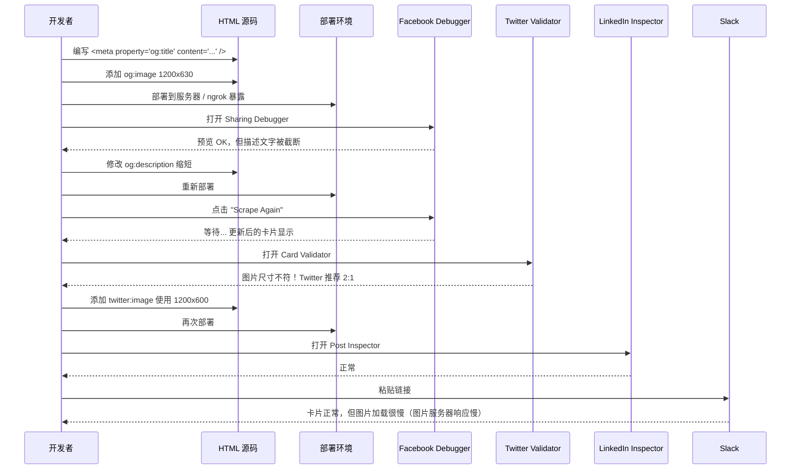
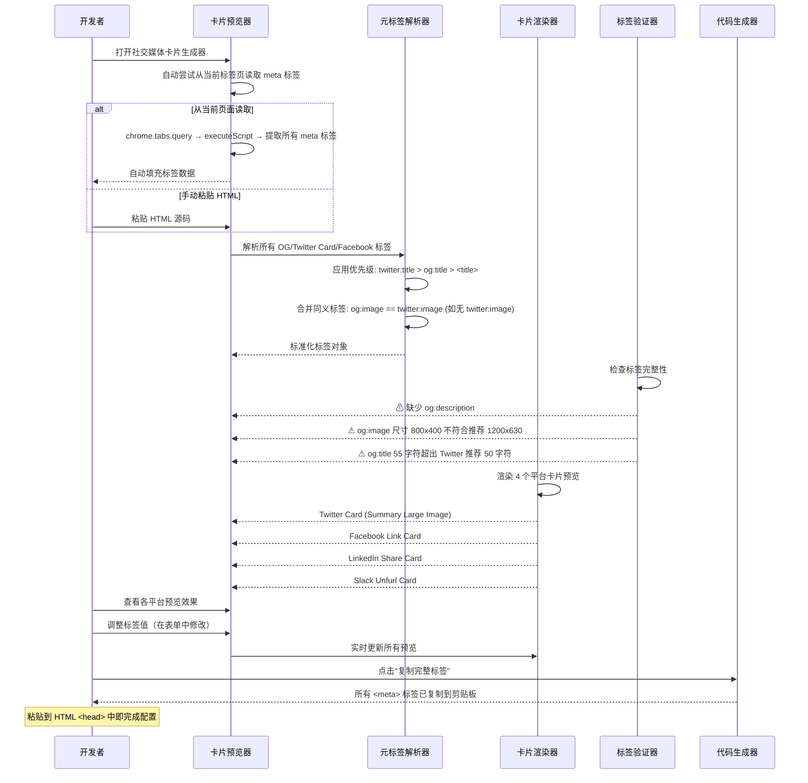
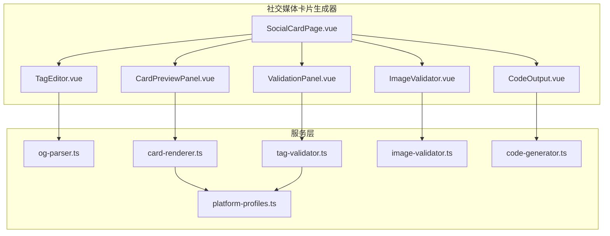

# YP-09-164: 社交媒体卡片生成器 — Open Graph/Twitter Card 元标签预览生成器、链接在 Twitter/Facebook/LinkedIn/Slack 上的实时预览、元标签一键复制、图片尺寸验证器

> 需求编号：YP-09-164 · 优先级：P2 · 人天：0.2d · 状态：需求已编写
> 依赖：无

## 背景

### 问题陈述

社交媒体卡片（Social Media Card）是当链接被分享到 Twitter、Facebook、LinkedIn、Slack 等平台时展示的富媒体预览卡片。正确配置 Open Graph（OG）和 Twitter Card 元标签直接影响点击率（CTR 提升 40-150%）。然而，开发者在配置这些标签时面临以下困境：

1. **无实时预览**：当前获取社交媒体卡片预览的唯一方式是实际将链接粘贴到每个平台查看。Facebook 的 Sharing Debugger、Twitter 的 Card Validator、LinkedIn 的 Post Inspector 都是独立的在线工具，每次修改标签后需要逐个访问。
2. **平台抓取缓存**：社交媒体平台对链接有强缓存（Facebook 24h-7d，Twitter 7d），修改 OG 标签后不会立即生效。开发者需要手动触发"重新抓取"（Scrape Again），但各平台的操作入口分散。
3. **图片尺寸不可见**：OG 图片要求特定尺寸（Facebook 1200x630px 1.91:1、Twitter 1200x675px 2:1 或 1:1 正方形、LinkedIn 1200x627px）。开发者上传不符合规范的图片后，平台会自动裁剪/缩放，导致卡片效果失控——但这些问题要在实际分享后才能发现。
4. **标签不完整或冲突**：一个链接上的 OG/Twitter Card 标签通常有 15-20 个。常见遗漏包括 `og:description` 超出推荐长度、`twitter:card` 与 `og:type` 不匹配、`og:image:width/height` 缺失。没有工具能系统性地检查这些错误。
5. **Slack/Discord 预览差异**：Slack 和 Discord 使用 Open Graph 协议但有各自的渲染规则（Slack 对 `og:image` 的缓存策略不同，Discord 对 `og:description` 的截断长度不同），这些差异往往被忽视。

**核心矛盾**：社交媒体卡片是链接的"门面"，直接影响分享转化率，但其配置和验证极其碎片化——没有一个聚合工具能在一个界面完成编写、预览、验证、调试。

### 影响范围

| # | 影响 | 严重程度 | 典型场景 |
|---|------|----------|----------|
| 1 | 卡片预览效率低 | 高 | 每次修改需访问 4 个平台验证 |
| 2 | 图片被不当裁剪 | 高 | 平台自动裁剪后重要信息被切掉 |
| 3 | 标签不完整 | 高 | 缺少描述导致卡片显示空白或默认文本 |
| 4 | 平台缓存导致更新延迟 | 中 | 修改后 7 天内看不到新卡片 |
| 5 | Slack/Discord 效果未知 | 中 | 企业内部分享的卡片效果无人检查 |

### 挑战

| 挑战 | 说明 |
|------|------|
| 平台渲染规则不透明 | Facebook/Twitter 的卡片渲染算法未公开文档 |
| 图片尺寸碎片化 | 6 个平台 × 不同场景的推荐尺寸各不相同 |
| 缓存清除机制复杂 | Facebook 需访问 Sharing Debugger，Twitter 需 Card Validator |
| 本地链接无法抓取 | 本地开发（localhost）的页面无法被平台抓取 |
| 标签语义冲突 | `og:title` vs `twitter:title` vs `<title>` 三者的优先级和回退规则 |

---

## 一、现状分析

### 1.1 当前卡片调试流程

```
开发者需要验证社交卡片配置
  │
  ├─ 部署到可访问 URL（或使用 ngrok 暴露 localhost）
  │   └─ 限制: 本地开发无法直接验证
  │
  ├─ 逐个平台验证
  │   ├─ Facebook Sharing Debugger (developers.facebook.com/tools/debug)
  │   │   ├─ 粘贴 URL
  │   │   ├─ 点击 "Debug" → 查看抓取结果
  │   │   ├─ 如标签有变更: 点击 "Scrape Again"
  │   │   └─ 限制: 需要 Facebook 账号登录
  │   │
  │   ├─ Twitter Card Validator (cards-dev.twitter.com/validator)
  │   │   ├─ 粘贴 URL
  │   │   ├─ 点击 "Preview Card"
  │   │   └─ 限制: 需要 Twitter 开发者账号
  │   │
  │   ├─ LinkedIn Post Inspector (linkedin.com/post-inspector)
  │   │   ├─ 粘贴 URL
  │   │   └─ 限制: 需要 LinkedIn 账号
  │   │
  │   ├─ 实际在 Slack/Discord 中粘贴链接
  │   │   └─ 限制: Slack 有独立缓存（约 30 分钟）
  │   │
  │   └─ 直接粘贴到微信/Telegram
  │       └─ 限制: 这些平台的预览机制不透明
  │
  └─ 修改标签 → 等待缓存清除 → 重复验证
      └─ 限制: 一个循环可能耗时 15-30 分钟
```

### 1.2 当前可用能力

| 能力 | 可用性 | 获取方式 | 限制 |
|------|--------|----------|------|
| Open Graph 标签编写 | ✅ | 手动编写 `<meta>` 标签 | 无验证 |
| 平台官方调试工具 | ⚠️ | Facebook/Twitter/LinkedIn 各自工具 | 需账号、逐个访问 |
| 在线卡片预览服务 | ⚠️ | opengraph.xyz / metatags.io | 需联网、可能抓取页面 |
| 图片尺寸验证 | ❌ | 无自动化工具 | — |
| 标签完整性检查 | ❌ | 无自动化工具 | — |

### 1.3 改造前数据流



### 1.4 根因矩阵

| 症状 | 根因 | 触发条件 | 频率 |
|------|------|----------|------|
| 跨平台验证耗时 | 无聚合预览工具 | 每次发布新页面/文章 | 高 |
| 图片被裁剪 | 不匹配平台推荐尺寸 | 图片尺寸非标准 | 高 |
| 描述文字被截断 | 超出平台字符限制 | 描述 > 200 字符 | 中 |
| 修改后卡片不更新 | 平台缓存 | 发布后修改标签 | 中 |
| 标签优先级混乱 | 多标签回退规则不明确 | og:title + twitter:title + <title> 同时存在 | 中 |

---

## 二、设计决策

### 决策 1：卡片预览实现 — 纯 CSS 模拟 vs 截图渲染 vs iframe 嵌入

| 选项 | 真实性 | 平台一致性 | 实现复杂度 |
|------|--------|-----------|-----------|
| 纯 CSS 模拟（模拟各平台卡片样式）| 中（视觉接近但非 100%）| 低（各平台样式差异大）| 中 |
| 截图渲染（打开各平台预览页截图）| 高 | 高 | 高（需后端/自动化）|
| iframe 嵌入各平台调试工具 | 最高 | 最高 | 低（但平台可能拒绝 iframe 嵌入）|

**选择：纯 CSS 模拟 + 实时标签读取。** 最实用的方案是在本地解析 `<meta>` 标签并在 CSS 模拟的各平台卡片 UI 中实时渲染。虽然无法 100% 复现平台的实际渲染结果（平台的字体、间距、阴影可能不同），但对于标签验证和基本视觉预览足够。用户仍可点击链接跳转到各平台的官方调试工具获取 100% 准确的预览。

### 决策 2：标签来源 — 手动输入 URL（远程抓取）vs 粘贴 HTML 源码 vs 从当前页面读取

| 选项 | 实时性 | 本地文件支持 | 网络依赖 |
|------|--------|-------------|----------|
| 输入 URL 远程抓取 | 需部署后 | ❌（需公网 URL）| 高 |
| 粘贴 HTML 源码 | 即时 | ✅ | ❌（完全离线）|
| 从当前页面自动读取 | 即时 | ✅ | ❌ |

**选择：HTML 源码粘贴 + 当前页面读取双模式。** "粘贴 HTML 源码" 是最适合开发调试的模式——开发者在编辑器中编写 HTML，直接粘贴到预览器立即看到卡片效果，无需部署。同时提供 "从当前标签页读取" 模式，通过 `chrome.tabs.query` + `chrome.scripting.executeScript` 获取当前页面的所有 `<meta>` 标签，适用于已部署页面的快速检查。

### 决策 3：支持平台范围 — 仅 OG + Twitter vs 全平台（含 Slack/Discord/微信/Telegram）vs 核心 4 平台

| 选项 | 覆盖度 | 维护成本 | 使用频率 |
|------|--------|----------|----------|
| 仅 OG + Twitter | 60% | 低 | — |
| 全平台（8+ 平台）| 100% | 高 | 部分平台使用少 |
| 核心 4 平台（Twitter + Facebook + LinkedIn + Slack）| 90% | 中 | 高 |

**选择：核心 4 平台 + 通用 OG 预览。** 覆盖 Twitter、Facebook、LinkedIn、Slack 四个最常用平台的实际卡片样式。额外提供一个 "通用 Open Graph 预览"，展示不符合特定平台样式的原始 `og:title/description/image` 渲染。

### 决策 4：图片尺寸验证 — 仅标签检查 vs 实际下载图片检查 vs 两者的组合

| 选项 | 准确性 | 网络依赖 | 实现复杂度 |
|------|--------|----------|-----------|
| 仅检查 `og:image:width/height` 标签 | 低（标签可能与实际不符）| ❌ | 低 |
| 实际下载图片获取尺寸 | 高 | ✅（需图片 URL 可访问）| 中 |
| 标签 + 实际尺寸双重验证 | 最高 | 部分 | 中 |

**选择：标签 + 实际尺寸双重验证。** 优先使用标签 `og:image:width/height`（如果存在），然后尝试通过 `new Image()` 加载图片获取真实尺寸。两者不一致时高亮警告。图片无法加载时仅使用标签值（带 "无法验证" 标注）。

### 设计决策记录

| 决策 | 选项 A | 选项 B | 选项 C | 选择 | 理由 |
|------|--------|--------|--------|------|------|
| 预览实现 | CSS 模拟 | 截图 | iframe | **CSS 模拟** | 即时+离线+可定制 |
| 标签来源 | URL 抓取 | HTML粘贴 | 当前页面 | **粘贴+当前页面** | 开发+已部署兼顾 |
| 平台覆盖 | OG+Twitter | 全平台 | 核心4 | **核心4+OG** | 覆盖 90% 场景 |
| 图片验证 | 标签检查 | 实际下载 | 双验证 | **双验证** | 最准确 |

---

## 三、目标架构

### 3.1 改造后卡片预览流程



### 3.2 组件结构



### 3.3 性能指标

| 指标 | 改造前 | 改造后 |
|------|--------|--------|
| 4 平台验证时间 | 15-30 分钟（分别访问 + 等待）| < 5s（一次解析 + 4 面板渲染）|
| 标签修改 → 预览反馈 | 5-10 分钟（修改+部署+scratch）| < 1s（实时）|
| 图片尺寸验证 | 手动检查属性 → 上传到平台才知 | < 1s（标签+实际双重检查）|
| 标签完整性检查 | 靠经验 → 漏掉后才发现 | < 1s（自动检测 20+ 标签）|

---

## 四、具体改动

### 4.1 Open Graph 解析器

```typescript
// src/services/og-parser.ts (新增)

interface OgTags {
  title: string;
  description: string;
  image: string;
  imageWidth: number | null;
  imageHeight: number | null;
  imageAlt: string;
  url: string;
  type: string;              // website, article, product, video...
  siteName: string;
  locale: string;
  // Twitter 专用
  twitterCard: 'summary' | 'summary_large_image' | 'app' | 'player';
  twitterTitle: string;
  twitterDescription: string;
  twitterImage: string;
  twitterSite: string;       // @username
  twitterCreator: string;    // @username
  // 额外
  publishedTime: string;
  modifiedTime: string;
  tags: string[];            // article:tag
  // 原始标签（用于调试）
  rawTags: Map<string, string>;
}

/**
 * 从 HTML 字符串或 Meta 元素中解析所有社交卡片相关标签
 */
export function parseOgTags(html: string): OgTags {
  const metaTags = extractMetaTags(html);
  const rawTags = new Map(metaTags.map(m => [m.name || m.property || '', m.content || '']));

  // 优先级: twitter:title > og:title > <title> > 空字符串
  const title = firstNonEmpty(
    getMeta(metaTags, 'twitter:title'),
    getMeta(metaTags, 'og:title'),
    getTitle(html),
  );

  // 优先级: twitter:description > og:description > meta description > 空
  const description = firstNonEmpty(
    getMeta(metaTags, 'twitter:description'),
    getMeta(metaTags, 'og:description'),
    getMeta(metaTags, 'description'),
  );

  // 图片优先级: twitter:image > og:image
  const image = firstNonEmpty(
    getMeta(metaTags, 'twitter:image'),
    getMeta(metaTags, 'og:image'),
  );

  const tags: OgTags = {
    title,
    description,
    image,
    imageWidth: parseInt(getMeta(metaTags, 'og:image:width')) || null,
    imageHeight: parseInt(getMeta(metaTags, 'og:image:height')) || null,
    imageAlt: getMeta(metaTags, 'og:image:alt'),
    url: firstNonEmpty(getMeta(metaTags, 'og:url'), ''),
    type: getMeta(metaTags, 'og:type') || 'website',
    siteName: getMeta(metaTags, 'og:site_name'),
    locale: getMeta(metaTags, 'og:locale') || 'en_US',
    twitterCard: parseTwitterCard(getMeta(metaTags, 'twitter:card')),
    twitterTitle: getMeta(metaTags, 'twitter:title') || title,
    twitterDescription: getMeta(metaTags, 'twitter:description') || description,
    twitterImage: getMeta(metaTags, 'twitter:image') || image,
    twitterSite: getMeta(metaTags, 'twitter:site'),
    twitterCreator: getMeta(metaTags, 'twitter:creator'),
    publishedTime: getMeta(metaTags, 'article:published_time') || '',
    modifiedTime: getMeta(metaTags, 'article:modified_time') || '',
    tags: parseArticleTags(metaTags),
    rawTags,
  };

  return tags;
}

function extractMetaTags(html: string): Array<{name?: string; property?: string; content?: string}> {
  const tags: Array<{name?: string; property?: string; content?: string}> = [];
  const regex = /<meta\s+([^>]+)>/gi;
  let match: RegExpExecArray | null;

  while ((match = regex.exec(html)) !== null) {
    const attrs = match[1]!;
    const name = extractAttr(attrs, 'name');
    const property = extractAttr(attrs, 'property');
    const content = extractAttr(attrs, 'content');
    if (name || property) {
      tags.push({ name, property, content });
    }
  }

  return tags;
}

function extractAttr(attrs: string, attrName: string): string {
  const match = attrs.match(new RegExp(`${attrName}\\s*=\\s*["']([^"']*)["']`, 'i'));
  return match ? match[1]! : '';
}

function getMeta(
  metaTags: Array<{name?: string; property?: string; content?: string}>,
  key: string
): string {
  const found = metaTags.find(m => m.property === key || m.name === key);
  return found?.content || '';
}

function getTitle(html: string): string {
  const match = html.match(/<title[^>]*>([^<]+)<\/title>/i);
  return match ? match[1]!.trim() : '';
}

function parseTwitterCard(card: string): OgTags['twitterCard'] {
  switch (card) {
    case 'summary': return 'summary';
    case 'summary_large_image': return 'summary_large_image';
    case 'app': return 'app';
    case 'player': return 'player';
    default: return 'summary';
  }
}

function parseArticleTags(
  metaTags: Array<{name?: string; property?: string; content?: string}>
): string[] {
  return metaTags
    .filter(m => m.property === 'article:tag')
    .map(m => m.content || '')
    .filter(Boolean);
}

function firstNonEmpty(...values: string[]): string {
  return values.find(v => v && v.trim().length > 0) || '';
}
```

### 4.2 平台卡片渲染器

```typescript
// src/services/card-renderer.ts (新增)
// 各平台卡片 CSS 配置

interface PlatformCardProfile {
  name: string;
  maxTitleLength: number;
  maxDescriptionLength: number;
  cardTypes: {
    [key: string]: {
      width: number;
      imageAspectRatio: number; // width/height
      titleFontSize: number;
      descriptionFontSize: number;
      maxLines: number;
      truncateDescription: boolean;
    };
  };
  recommendedImageSizes: Array<{width: number; height: number; label: string}>;
}

export const PLATFORM_PROFILES: Record<string, PlatformCardProfile> = {
  twitter: {
    name: 'Twitter / X',
    maxTitleLength: 50,
    maxDescriptionLength: 200,
    cardTypes: {
      summary: {
        width: 500,
        imageAspectRatio: 1,     // 1:1 正方形
        titleFontSize: 14,
        descriptionFontSize: 14,
        maxLines: 2,
        truncateDescription: true,
      },
      summary_large_image: {
        width: 500,
        imageAspectRatio: 2,     // 2:1 宽图
        titleFontSize: 14,
        descriptionFontSize: 14,
        maxLines: 2,
        truncateDescription: true,
      },
    },
    recommendedImageSizes: [
      { width: 1200, height: 675, label: 'Summary Large Image (2:1)' },
      { width: 1200, height: 1200, label: 'Summary Card (1:1)' },
    ],
  },
  facebook: {
    name: 'Facebook',
    maxTitleLength: 60,
    maxDescriptionLength: 160,
    cardTypes: {
      default: {
        width: 500,
        imageAspectRatio: 1.91,
        titleFontSize: 16,
        descriptionFontSize: 14,
        maxLines: 2,
        truncateDescription: true,
      },
    },
    recommendedImageSizes: [
      { width: 1200, height: 630, label: 'Link Share (1.91:1)' },
    ],
  },
  linkedin: {
    name: 'LinkedIn',
    maxTitleLength: 70,
    maxDescriptionLength: 256,
    cardTypes: {
      default: {
        width: 552,
        imageAspectRatio: 1.91,
        titleFontSize: 16,
        descriptionFontSize: 14,
        maxLines: 3,
        truncateDescription: true,
      },
    },
    recommendedImageSizes: [
      { width: 1200, height: 627, label: 'Share Image (1.91:1)' },
    ],
  },
  slack: {
    name: 'Slack',
    maxTitleLength: 80,
    maxDescriptionLength: 300,
    cardTypes: {
      default: {
        width: 360,
        imageAspectRatio: 1.91,
        titleFontSize: 14,
        descriptionFontSize: 12,
        maxLines: 3,
        truncateDescription: true,
      },
    },
    recommendedImageSizes: [
      { width: 1200, height: 630, label: 'Unfurl Image' },
    ],
  },
};

/**
 * 生成卡片预览的模拟数据（用于 CSS 渲染）
 */
export function getCardPreview(tags: OgTags, platform: string) {
  const profile = PLATFORM_PROFILES[platform];
  if (!profile) return null;

  const cardType = platform === 'twitter'
    ? tags.twitterCard
    : 'default';

  const config = profile.cardTypes[cardType];
  if (!config) return null;

  return {
    platform: profile.name,
    title: truncateText(tags.twitterTitle || tags.title, profile.maxTitleLength),
    description: truncateText(
      tags.twitterDescription || tags.description,
      profile.maxDescriptionLength
    ),
    image: tags.twitterImage || tags.image,
    imageWidth: config.width,
    imageHeight: Math.round(config.width / config.imageAspectRatio),
    url: tags.url,
    siteName: tags.siteName,
    config,
  };
}

function truncateText(text: string, maxLength: number): string {
  if (text.length <= maxLength) return text;
  return text.substring(0, maxLength - 3) + '...';
}
```

### 4.3 标签验证器

```typescript
// src/services/tag-validator.ts (新增)

interface ValidationWarning {
  level: 'error' | 'warning' | 'info';
  tag: string;
  message: string;
  recommendation: string;
}

/**
 * 验证 OG/Twitter Card 标签的完整性和正确性
 */
export function validateTags(tags: OgTags, imageActualSize?: {width: number; height: number}): ValidationWarning[] {
  const warnings: ValidationWarning[] = [];

  // === 必填标签检查 ===
  if (!tags.title) {
    warnings.push({
      level: 'error', tag: 'og:title',
      message: '标题缺失，各平台将使用 <title> 作为回退，可控性差',
      recommendation: '添加 <meta property="og:title" content="..." />',
    });
  }
  if (!tags.description) {
    warnings.push({
      level: 'error', tag: 'og:description',
      message: '描述缺失，平台可能显示页面上的随机文本',
      recommendation: '添加 <meta property="og:description" content="..." />',
    });
  }
  if (!tags.image) {
    warnings.push({
      level: 'error', tag: 'og:image',
      message: '图片缺失，卡片将不显示图片（点击率降低 40%+）',
      recommendation: '添加 <meta property="og:image" content="..." />',
    });
  }

  // === 长度检查 ===
  if (tags.title.length > 60) {
    warnings.push({
      level: 'warning', tag: 'og:title',
      message: `标题 ${tags.title.length} 字符，超过 Facebook 推荐 60 字符`,
      recommendation: '缩短标题至 60 字符以内',
    });
  }
  if (tags.title.length > 50) {
    warnings.push({
      level: 'info', tag: 'twitter:title',
      message: `标题 ${tags.title.length} 字符，超过 Twitter 推荐 50 字符`,
      recommendation: '为 Twitter 单独设置更短的 twitter:title',
    });
  }
  if (tags.description.length > 200) {
    warnings.push({
      level: 'warning', tag: 'og:description',
      message: `描述 ${tags.description.length} 字符，超过推荐 200 字符`,
      recommendation: '缩短描述或确保前 200 字符包含关键信息',
    });
  }

  // === 图片尺寸检查 ===
  if (tags.image && imageActualSize) {
    const { width, height } = imageActualSize;
    const ratio = width / height;

    if (width < 200 || height < 200) {
      warnings.push({
        level: 'error', tag: 'og:image',
        message: `图片尺寸 ${width}x${height} 过小，平台可能拒绝使用`,
        recommendation: '使用至少 1200x630 像素的图片',
      });
    }

    // Facebook 推荐 1.91:1
    if (Math.abs(ratio - 1.91) > 0.3) {
      warnings.push({
        level: 'warning', tag: 'og:image',
        message: `图片比例 ${ratio.toFixed(2)} 偏离 Facebook 推荐 1.91:1`,
        recommendation: '使用 1200x630 (1.91:1) 或确保关键内容在安全区域内',
      });
    }
  }

  // === 标签一致性检查 ===
  if (tags.twitterCard === 'summary_large_image' && !tags.twitterImage && !tags.image) {
    warnings.push({
      level: 'warning', tag: 'twitter:card',
      message: 'twitter:card = summary_large_image 但未设置 twitter:image',
      recommendation: '添加 <meta name="twitter:image" content="..." />',
    });
  }

  // === Article 类型特定检查 ===
  if (tags.type === 'article') {
    if (!tags.publishedTime) {
      warnings.push({
        level: 'info', tag: 'article:published_time',
        message: '文章型卡片建议提供发布时间',
        recommendation: '添加 <meta property="article:published_time" content="..." />',
      });
    }
  }

  // === 通用建议 ===
  if (!tags.twitterCard || tags.twitterCard === 'summary') {
    warnings.push({
      level: 'info', tag: 'twitter:card',
      message: '使用 summary 卡片（小图），建议使用 summary_large_image 以获得更大图片展示',
      recommendation: '设置 <meta name="twitter:card" content="summary_large_image" />',
    });
  }

  return warnings;
}
```

### 4.4 文件变更清单

| 文件 | 操作 | 说明 |
|------|------|------|
| `src/services/og-parser.ts` | 新增 | Open Graph/Twitter Card 元标签解析引擎 |
| `src/services/card-renderer.ts` | 新增 | 各平台卡片 CSS 模拟渲染配置 |
| `src/services/tag-validator.ts` | 新增 | 标签完整性/正确性验证器 |
| `src/services/image-validator.ts` | 新增 | 图片尺寸双重验证 |
| `src/services/code-generator.ts` | 新增 | 元标签代码生成器（复制用）|
| `src/services/platform-profiles.ts` | 新增 | 平台推荐尺寸/限制配置 |
| `src/pages/tools/SocialCardPage.vue` | 新增 | 社交媒体卡片预览器主页面 |
| `src/components/tools/TagEditor.vue` | 新增 | 标签编辑表单 |
| `src/components/tools/CardPreviewPanel.vue` | 新增 | 4 平台卡片预览面板 |
| `src/components/tools/ValidationPanel.vue` | 新增 | 验证警告列表面板 |
| `src/components/tools/CodeOutput.vue` | 新增 | HTML 代码输出面板 |
| `src/components/tools/ImageValidator.vue` | 新增 | 图片尺寸验证组件 |
| `src/popup/router.ts` | 修改 | 添加卡片预览器路由 |
| `tests/unit/og-parser.test.ts` | 新增 | 标签解析测试 |

---

## 五、实施步骤

| 步骤 | 操作 | 路径 | 验证 | 人天 |
|------|------|------|------|------|
| 1 | 实现 OG/Twitter 标签解析器 | `og-parser.ts` | 解析 30 种标签组合 | 0.03 |
| 2 | 实现平台卡片 CSS 渲染配置 | `card-renderer.ts`, `platform-profiles.ts` | 4 平台 CSS 卡片预览 | 0.03 |
| 3 | 实现标签验证器 | `tag-validator.ts` | 15+ 条验证规则 | 0.02 |
| 4 | 实现图片尺寸验证 | `image-validator.ts` | 标签+实际双重验证 | 0.02 |
| 5 | 实现代码生成器 | `code-generator.ts` | 完整标签HTML输出 | 0.01 |
| 6 | 创建主页面和子组件 | `SocialCardPage.vue` 等 | 编辑/预览/验证/复制 完整流程 | 0.05 |
| 7 | 集成路由 + 测试 | `router.ts`, 测试 | 工具可访问，测试通过 | 0.04 |

**总人天：0.2d**

---

## 六、测试规格

### 场景 1：完整标签解析

**GIVEN** HTML 包含标准的 Open Graph 和 Twitter Card 标签
**WHEN** 粘贴 HTML 并解析
**THEN** `og:title`、`og:description`、`og:image`、`og:type`、`og:url`、`og:site_name` 均正确提取
**AND** `twitter:card` = summary_large_image、`twitter:title`、`twitter:description` 正确提取
**AND** `article:published_time` 正确提取
**AND** rawTags Map 包含所有标签

### 场景 2：标签优先级（回退逻辑）

**GIVEN** HTML 同时包含 `<title>`、`og:title`、`twitter:title`（值各不相同）
**WHEN** 解析标签
**THEN** `title` 字段取值 `twitter:title`（最高优先级）
**AND** 如果 `twitter:title` 不存在，取 `og:title`
**AND** 如果两者都不存在，取 `<title>`
**AND** twitterTitle 字段保持 `twitter:title` 原值

### 场景 3：4 平台卡片预览

**GIVEN** 已解析标签数据
**WHEN** 渲染预览面板
**THEN** Twitter 卡片展示：宽图 2:1 大图 + 标题 + 描述
**AND** Facebook 卡片展示：1.91:1 图片 + 标题 + 描述 + 域名
**AND** LinkedIn 卡片展示：1.91:1 图片 + 标题 + 描述
**AND** Slack 卡片展示：1.91:1 缩略图 + 标题 + 描述 + 域名
**AND** 每个平台的标题/描述截断规则正确应用

### 场景 4：标签验证

**GIVEN** 标签数据缺少 `og:image` 和 `og:description`
**WHEN** 运行验证
**THEN** 输出 2 个 error 级别警告
**AND** 警告消息明确指出缺少的标签和后果
**AND** 警告消息包含具体的修复建议（完整 <meta> 标签代码）

### 场景 5：图片尺寸验证

**GIVEN** `og:image` 指向 800x400 的图片（比例 2:1，但尺寸偏小）
**WHEN** 验证图片
**THEN** 输出 warning: "图片尺寸 800x400，推荐至少 1200x630"
**AND** 如果 `og:image:width` 标签与图片实际尺寸不符，标注"标签与实际不一致"

### 场景 6：代码生成与复制

**GIVEN** 用户已在编辑器中填写完整标签
**WHEN** 点击 "复制完整 <meta> 标签"
**THEN** 剪贴板包含所有标签的 `<meta>` 代码（含 property/content 属性）
**AND** 标签按推荐顺序排列（og:title, og:description, og:image, og:url, og:type, twitter:card...）
**AND** 可直接粘贴替换 HTML `<head>` 中的社交标签区域

---

## 七、风险与缓解

| 风险 | 概率 | 影响 | 缓解措施 |
|------|------|------|----------|
| 平台更新卡片渲染样式 | 中 | 中 | CSS 模拟样式作为独立配置文件，可独立更新 |
| 图片 URL 跨域无法获取尺寸 | 中 | 低 | 仅依赖标签 `og:image:width/height`，标注 "无法验证实际尺寸" |
| 多个 og:image 标签选择混乱 | 低 | 中 | 使用第一个 og:image 值，列出所有图片供手动选择 |
| HTML 解析器对非标准格式容错差 | 低 | 中 | 使用宽松的正则匹配（不依赖 XML/HTML 严格解析）|
| 大体积 HTML（含内联 SVG/Base64 图片）解析慢 | 低 | 低 | 仅解析 `<head>` 部分（首个 `</head>` 之前的内容）|

---

## 八、回滚策略

| 场景 | 回滚操作 | 影响 |
|------|----------|------|
| 平台样式严重偏离实际 | 暂停平台特定预览，仅保留通用 OG 列表展示 | 失去视觉预览 |
| 图片验证阻塞 | 关闭自动图片加载，仅使用标签值 | 尺寸准确性下降 |
| HTML 解析误报严重 | 降级为手动填写标签表单（不使用解析器）| 需手动输入 |

---

## 九、设计决策记录

### D-01：为什么选择客户端解析而非服务端代理？

社交媒体平台通常需要公网可访问的 URL 来抓取 OG 标签。一个看似合理的方案是通过 YiAi 后端代理抓取。但这引入了网络依赖和延迟。本工具选择直接解析 HTML 源码——开发者在部署前的编辑阶段就能获得 100% 即时的预览。部署后的验证可以通过"从当前页面读取"模式实现，利用 Chrome 扩展的 tabs API 直接读取已渲染页面的 DOM。

### D-02：Slack Unfurl 预览的准确性

Slack 的 Unfurl 机制不同于传统社交媒体——Slack 在服务端抓取 OG 标签并缓存（约 30 分钟）。Slack 客户端仅展示 Slack 服务端返回的结果。本工具的 Slack 预览仅模拟客户端渲染样式（颜色、字体、间距），但实际的缓存和抓取行为无法模拟。在预览顶部明确标注 "基于 Slack 客户端样式模拟，实际效果取决于 Slack 服务端抓取"。

### D-03：多 og:image 标签处理

Open Graph 协议允许声明多个 `og:image` 标签（用于不同场景、不同分辨率的选择）。本工具默认使用第一个 `og:image` 进行预览，但列出所有图片 URL 供用户切换预览。同时检查是否声明了 `og:image:width/height` 来帮助平台选择最优尺寸。

### D-04：不支持的平台（微信/Telegram/Discord）

微信和 Telegram 使用自有的分享卡片渲染机制，不完全遵循 Open Graph 标准。微信的卡片通过微信服务端抓取，且对国内域名的抓取速度更慢。这些平台的渲染规则不公开，且没有官方预览工具。本工具的 "通用 OG 预览" 可为这些平台提供近似预览。Discord 基本遵循 Open Graph 标准，可以作为后续增强添加。

---

## 十、可观测性

### 指标

| 指标 | 类型 | 说明 |
|------|------|------|
| `yipet.socialcard.open` | Counter | 卡片预览器打开次数 |
| `yipet.socialcard.parse_html` | Counter | 粘贴 HTML 解析次数 |
| `yipet.socialcard.parse_current` | Counter | 从当前页面读取次数 |
| `yipet.socialcard.platform_view` | Counter | 各平台预览查看次数 |
| `yipet.socialcard.validation.warning` | Counter | 验证警告数量分布 |
| `yipet.socialcard.copy_code` | Counter | 复制标签代码次数 |
| `yipet.socialcard.missing_tags` | Histogram | 缺失标签类型分布 |

### 告警

| 告警 | 条件 | 级别 |
|------|------|------|
| 高频缺失必填标签 | 1h 内 > 50% 的解析缺失 og:image | INFO（可能是模板问题）|

---

## 十一、代码审查检查清单

- [ ] OG 标签解析使用 property 属性（非 name）作为主键
- [ ] Twitter 标签使用 name 属性（非 property）作为主键
- [ ] 回退逻辑正确: twitter:title > og:title > title
- [ ] 图片回退逻辑正确: twitter:image > og:image
- [ ] 多个同名标签取第一个值
- [ ] HTML 解析使用正则（不引入 DOM 解析器，避免执行脚本）
- [ ] article:tag 支持多个标签聚合
- [ ] CSS 模拟的卡片样式使用固定字体（避免依赖系统字体差异）
- [ ] 图片加载使用 Image() 并处理 onerror
- [ ] 复制到剪贴板时 HTML 格式保留（标签缩进）
- [ ] 平台配置数据与卡片渲染逻辑分离

---

## 回归问题预测

| # | 预测问题 | 原因 | 验证方法 |
|---|---------|------|---------|
| 1 | `og:image` 标签中使用相对路径（如 `/images/og.png`），预览无法加载图片——但实际分享时平台会基于 `og:url` 补全路径 | 解析器不处理路径拼接，直接使用原始值 | 相对路径的 `og:image` 在预览中显示 "无法加载"，但添加提示 "分享时平台会自动补全" |
| 2 | HTML 中 `<meta>` 标签使用单引号（`property='og:title'`）而非双引号，正则 `["']` 无法同时匹配两种引号 | 正则仅匹配双引号或仅匹配单引号 | 编写同时含单引号和双引号的 meta 标签测试 HTML，验证全部正确提取 |
| 3 | HTML `<head>` 中包含 `<meta charset="utf-8">` 等非 OG 标签，被误识别为社交卡片标签（如 charset 被错误地关联到某个 property）| 解析器未过滤非 OG/Twitter 前缀的 property/name | 解析包含非 OG 标签的完整 HTML，验证 rawTags 不包含 charset、viewport 等标签 |
| 4 | `og:locale:alternate` 标签（多语言备用）与 `og:locale` 标签属性名相似，解析器混淆两者 | `og:locale:alternate` 可能被错误地覆盖 `og:locale` 的值 | 同时包含 `og:locale` 和 `og:locale:alternate` 的 HTML，验证 locale 字段仅为 `og:locale` 的值 |
| 5 | 用户 HTML 中 `og:type` 设置为非标准值（如 "blog" 而非 "article"），预览器的 article 类型检查触发误报 | FB 识别的 type 值有限（website/article/product/video/music.book...），但用户可能使用自定义值 | og:type = "blog" 时验证器不报错（只对已知的 article 类型做特定检查）|
| 6 | 复制生成的 `<meta>` 标签时，`og:image:width` 和 `og:image:height` 的值来自图片实际尺寸验证，如果图片尚未加载完成，值为 null，生成的标签为 content=""（空内容）| 异步图片加载与同步代码生成之间存在竞争条件 | 代码生成时检查 imageWidth/imageHeight，若为 null 则省略这两个标签，并给出提示 |

---

## 性能分析

### 关键操作耗时

| 操作 | 耗时 | 说明 |
|------|------|------|
| HTML 解析（提取所有 <meta>）| < 5ms | 正则匹配 |
| 标签优先级应用 | < 1ms | 字符串比较 |
| 图片尺寸验证（加载图片）| 50-500ms | 取决于图片服务器响应速度 |
| 标签验证（15 条规则）| < 5ms | 字符串匹配 |
| 4 平台卡片 CSS 渲染 | < 20ms | 纯 CSS（无 JS 计算）|
| 代码生成 | < 1ms | 字符串拼接 |

### 内存占用

| 数据 | 大小 |
|------|------|
| 标签解析结果（20 个标签）| ~2 KB |
| 平台配置数据（4 平台）| ~5 KB |
| 图片加载（Image 对象）| ~200KB-5MB（取决于图片大小）|

### 对宿主页面的影响

| 场景 | 页面影响 | 说明 |
|------|----------|------|
| Popup 工具页使用 | 零影响 | 仅在 Popup 中运行 |
| 从当前页面读取标签 | 零影响 | 使用 chrome.tabs API（无页面注入）|

---

## 相关文档

- [Open Graph Protocol — ogp.me](https://ogp.me/)
- [Twitter Cards — Developer Documentation](https://developer.twitter.com/en/docs/twitter-for-websites/cards/overview/abouts-cards)
- [Facebook Sharing Debugger](https://developers.facebook.com/tools/debug/)
- [LinkedIn Post Inspector](https://www.linkedin.com/post-inspector/)
- [Slack — Unfurling Links](https://api.slack.com/reference/messaging/link-unfurling)
- [Discord — Embed Preview](https://discord.com/developers/docs/resources/channel#embed-object)
- [metatags.io — Online OG Preview Tool](https://metatags.io/)