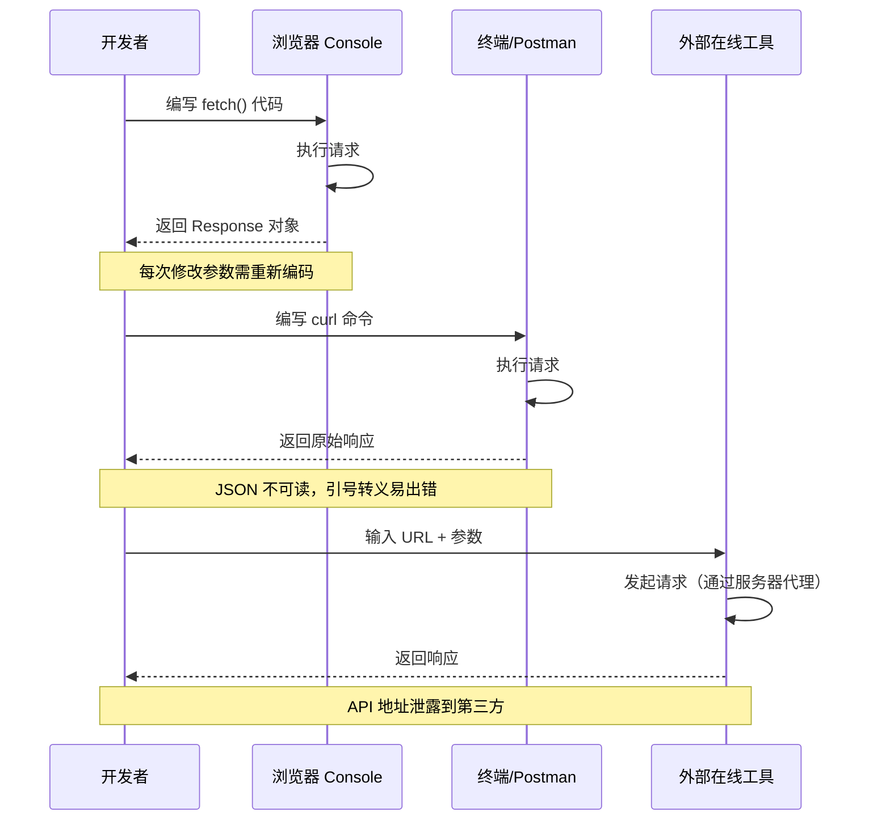
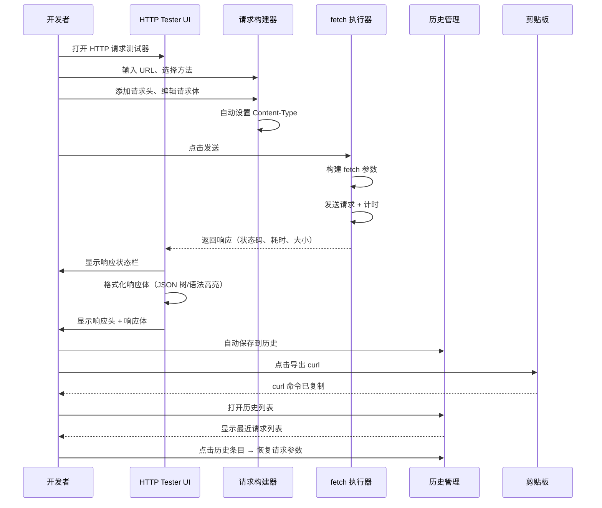
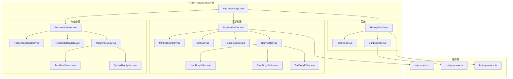

# YP-09-165: HTTP 请求测试器 — 请求构建器、自定义请求头编辑器、请求体编辑(JSON/Form/Text)、响应查看器、响应头展示、请求历史、curl 命令导出

> 需求编号：YP-09-165 · 优先级：P2 · 人天：0.2d · 状态：需求已编写
> 依赖：无

## 背景

### 问题陈述

HTTP 请求测试是前端开发和后端接口调试中最高频的操作之一。开发者在对接后端 API 时，需要快速发送 HTTP 请求并查看响应，以验证接口的正确性。然而，当前浏览器环境下发起自定义 HTTP 请求的方式存在明显痛点：

1. **浏览器 Console 手动 fetch**：每次都要写 5-10 行代码，修改请求头或请求体时需要重新输入代码，效率极低
2. **cURL 命令行**：功能强大但学习曲线陡峭，查看响应体（特别是 JSON）不够直观，无法图形化编辑请求参数
3. **Postman/Insomnia 等独立工具**：功能完善但需要切换出浏览器，无法利用浏览器已登录的 Cookie 和会话状态，且占用额外系统资源
4. **在线 API 测试工具**：存在隐私风险（API 地址和参数上传到第三方服务器），不适合测试内网接口
5. **浏览器 Network 面板**：只能查看已发起的请求，无法随意修改和重放请求

**核心矛盾**：HTTP 请求测试是高频需求，但浏览器缺少一个安全、便捷、功能完整的内置请求测试工具。YiPet 作为 Chrome 扩展，可以直接利用浏览器的 Cookie 和网络能力，在本地完成请求测试，无需切换工具。

### 影响范围

| # | 影响 | 严重程度 | 典型场景 |
|---|------|----------|----------|
| 1 | 接口调试效率低 | 高 | 每次测试 API 需要写 fetch 代码或切换工具 |
| 2 | 内网接口测试困难 | 高 | Postman 无法访问 localhost 或内网服务 |
| 3 | 请求重放不便 | 中 | 修改一个请求头后重新发送 |
| 4 | Cookie/认证状态丢失 | 中 | 切换工具后需要重新配置认证 |
| 5 | curl 命令拼写错误 | 中 | 复杂的 curl 命令（多层引号转义）极易出错 |
| 6 | 响应查看不直观 | 低 | JSON 响应需要手动格式化 |

### 挑战

| 挑战 | 说明 |
|------|------|
| 跨域请求限制 | 浏览器 CORS 策略会阻止对某些 API 的 fetch 请求，需在 Service Worker 中代理或提示用户 |
| 请求体格式切换 | JSON、FormData、纯文本三种格式的序列化方式和 Content-Type 自动设置不同 |
| curl 命令生成 | 需要正确处理引号转义、多行请求体、文件上传等边界情况 |
| 请求历史持久化 | 历史记录存储在 IndexedDB 或 chrome.storage，需要考虑存储空间限制 |
| 大响应体渲染 | JSON 响应体可能很大（>1MB），需要虚拟滚动或分段渲染 |

---

## 一、现状分析

### 1.1 当前 HTTP 请求测试流程

```
开发者需要测试 API
  │
  ├─ 浏览器 Console
  │   ├─ 打开 DevTools
  │   ├─ 编写 fetch() 调用（5-10 行代码）
  │   ├─ 处理 JSON 解析
  │   └─ console.log() 查看结果
  │   问题: 每次修改参数需重新输入，无历史记录
  │
  ├─ cURL 命令行
  │   ├─ 编写 curl 命令
  │   ├─ 处理多层引号转义
  │   └─ 终端查看响应（纯文本，不直观）
  │   问题: 学习曲线陡峭，JSON 响应难以阅读
  │
  ├─ Postman/Insomnia
  │   ├─ 切换应用（Alt+Tab）
  │   ├─ 重新配置认证信息
  │   ├─ 输入 URL 和参数
  │   ├─ 发送请求
  │   └─ 查看响应
  │   问题: 无法使用浏览器 Cookie，不能访问 localhost
  │
  └─ 在线工具 (reqbin.com 等)
      ├─ 打开网页
      ├─ 输入 API 地址
      └─ 发送请求
      问题: API 地址和参数上传到第三方服务器（隐私风险）
```

### 1.2 当前可用能力

| 能力 | 可用性 | 获取方式 | 限制 |
|------|--------|----------|------|
| 发送 GET 请求 | 是 | fetch() / XMLHttpRequest | CORS 限制 |
| 发送 POST 请求 | 是 | fetch() + body | 需手动序列化 JSON |
| 自定义请求头 | 是 | fetch() headers 参数 | 部分头受浏览器限制 |
| 请求历史 | 否 | 无内置支持 | — |
| curl 导出 | 否 | 需手动编写 | — |
| 响应 JSON 格式化 | 否 | 需手动 JSON.stringify | — |
| 响应头查看 | 是 | Network 面板 | 不可自定义请求 |

### 1.3 改造前数据流



### 1.4 根因矩阵

| 症状 | 根因 | 触发条件 | 频率 |
|------|------|----------|------|
| 调试效率低 | 无图形化请求构建器 | 每次测试 API 时 | 高 |
| 内网无法测试 | Postman 不共享浏览器 Cookie | 测试内网 API | 中 |
| 请求重放困难 | 无请求历史记录 | 需要重复发送相同请求 | 高 |
| JSON 响应难读 | 无内置 JSON 格式化/折叠 | 查看 JSON 响应时 | 高 |
| curl 编写错误 | 手动拼写易出错 | 需要分享 curl 命令给同事 | 中 |

---

## 二、设计决策

### 决策 1：请求发送方式 — fetch API vs XMLHttpRequest vs Service Worker 代理

| 选项 | CORS 绕过 | 实现复杂度 | Cookie 支持 |
|------|----------|-----------|------------|
| fetch API（Content Script） | 受 CORS 限制 | 低 | 是 |
| XMLHttpRequest | 受 CORS 限制 | 低 | 是 |
| Service Worker 代理 | 可绕过 CORS | 高 | 是 |

**选择：fetch API（Popup 页面）。** HTTP 请求测试器运行在扩展 Popup 页面中，Popup 拥有独立的 Origin（`chrome-extension://`），可以发送跨域请求（扩展已在 manifest 中声明 host_permissions）。对于非同源 API，依赖 manifest 中声明的权限或提示用户。Service Worker 代理方案对于当前规模过度设计。

### 决策 2：请求体编辑器 — 单一文本区 vs 多模式编辑器

| 选项 | 易用性 | 灵活性 | 实现复杂度 |
|------|--------|--------|-----------|
| 单一文本区（手动切换 Content-Type） | 低 | 高 | 低 |
| 多模式编辑器（JSON/Form/Text 选项卡） | 高 | 高 | 中 |
| Monaco Editor 集成 | 高 | 最高 | 高 |

**选择：多模式编辑器。** 提供 JSON、Form Data（键值对表格）、Plain Text 三种模式。JSON 模式使用语法高亮的 textarea（带缩进辅助），Form 模式使用可编辑表格（添加/删除键值对），Text 模式使用纯文本区域。Monaco Editor 对于 Popup 窗口体积过重（~5MB）。

### 决策 3：请求历史存储 — chrome.storage vs IndexedDB vs 内存

| 选项 | 持久化 | 容量 | 同步 |
|------|--------|------|------|
| chrome.storage.local | 是 | 10MB（可申请 unlimited） | 支持 |
| IndexedDB | 是 | 较大 | 不支持 |
| 仅内存 | 否 | 无限制 | 不支持 |

**选择：chrome.storage.local。** 请求历史数据量小（每次请求几 KB），10MB 足够保存数千条历史。chrome.storage 的同步功能可支持多设备（未来扩展）。需要实现最近 100 条的限制和自动清理策略。

### 决策 4：响应查看器 — 纯文本 vs 语法高亮 vs 树形折叠

| 选项 | 可读性 | 大响应性能 | 实现复杂度 |
|------|--------|-----------|-----------|
| 纯文本 | 低 | 高 | 低 |
| 语法高亮（JSON） | 高 | 中 | 中 |
| 树形折叠（JSON） | 最高 | 中 | 高 |

**选择：语法高亮 + 树形折叠。** JSON 响应自动解析为树形结构（可折叠/展开），支持路径复制。非 JSON 响应（HTML/XML/纯文本）显示为语法高亮文本。大响应体（>100KB）使用虚拟滚动。默认折叠嵌套超过 3 级的节点。

### 设计决策记录

| 决策 | 选项 A | 选项 B | 选项 C | 选择 | 理由 |
|------|--------|--------|--------|------|------|
| 请求发送 | fetch API | XMLHttpRequest | SW 代理 | **fetch API** | 现代 API，扩展权限绕过 CORS |
| 请求体编辑器 | 单一文本区 | 多模式 | Monaco | **多模式** | 覆盖主要用例，不引入重依赖 |
| 历史存储 | chrome.storage | IndexedDB | 内存 | **chrome.storage** | 容量足够，支持同步 |
| 响应查看器 | 纯文本 | 语法高亮 | 树形折叠 | **语法+树形** | JSON 可读性最大化 |

---

## 三、目标架构

### 3.1 改造后 HTTP 请求测试流程



### 3.2 组件结构



### 3.3 性能指标

| 指标 | 改造前 | 改造后 |
|------|--------|--------|
| 发起一个简单 GET 请求 | 30s（编写 fetch 代码） | < 5s（填写 URL + 点击发送） |
| 修改请求头重新发送 | 20s（修改 fetch 代码） | < 3s（点击重发） |
| 查看 JSON 响应 | 10s（JSON.stringify 格式化） | < 1s（自动树形渲染） |
| 导出 curl 命令 | 2min（手动编写） | < 1s（一键复制） |
| 恢复历史请求 | 不可行（手动查找 Console） | < 2s（点击历史条目） |

---

## 四、具体改动

### 4.1 HTTP 请求服务

```typescript
// 改造前：无 HTTP 请求服务
// src/services/http-service.ts (改造后)

type HttpMethod = 'GET' | 'POST' | 'PUT' | 'DELETE' | 'PATCH' | 'HEAD' | 'OPTIONS';

type BodyMode = 'none' | 'json' | 'form' | 'text';

interface HttpRequest {
  method: HttpMethod;
  url: string;
  headers: Record<string, string>;
  bodyMode: BodyMode;
  body: string;                    // JSON 字符串 / Form 编码 / 纯文本
  formFields?: { key: string; value: string }[];
}

interface HttpResponse {
  status: number;
  statusText: string;
  headers: Record<string, string>;
  body: string;
  timeMs: number;
  sizeBytes: number;
}

class HttpService {
  // 发送 HTTP 请求
  async sendRequest(request: HttpRequest): Promise<HttpResponse> {
    const startTime = performance.now();

    const fetchOptions: RequestInit = {
      method: request.method,
      headers: this.buildHeaders(request),
    };

    if (request.method !== 'GET' && request.method !== 'HEAD' && request.bodyMode !== 'none') {
      fetchOptions.body = this.buildBody(request);
    }

    const response = await fetch(request.url, fetchOptions);
    const endTime = performance.now();

    const responseBody = await response.text();
    const responseHeaders = this.parseHeaders(response.headers);

    return {
      status: response.status,
      statusText: response.statusText,
      headers: responseHeaders,
      body: responseBody,
      timeMs: Math.round(endTime - startTime),
      sizeBytes: new Blob([responseBody]).size,
    };
  }

  // 构建请求头
  private buildHeaders(request: HttpRequest): HeadersInit {
    const headers: Record<string, string> = { ...request.headers };

    // 根据 body 模式自动设置 Content-Type（如果用户未手动设置）
    if (!headers['Content-Type'] && !headers['content-type']) {
      switch (request.bodyMode) {
        case 'json':
          headers['Content-Type'] = 'application/json';
          break;
        case 'form':
          headers['Content-Type'] = 'application/x-www-form-urlencoded';
          break;
        case 'text':
          headers['Content-Type'] = 'text/plain';
          break;
      }
    }

    return headers;
  }

  // 构建请求体
  private buildBody(request: HttpRequest): string {
    switch (request.bodyMode) {
      case 'json':
        return request.body; // 已为 JSON 字符串
      case 'form':
        if (request.formFields) {
          return new URLSearchParams(
            Object.fromEntries(request.formFields.filter(f => f.key).map(f => [f.key, f.value]))
          ).toString();
        }
        return request.body;
      case 'text':
        return request.body;
      default:
        return '';
    }
  }

  // 解析响应头
  private parseHeaders(headers: Headers): Record<string, string> {
    const result: Record<string, string> = {};
    headers.forEach((value, key) => {
      result[key] = value;
    });
    return result;
  }
}
```

### 4.2 curl 命令生成器

```typescript
// src/services/curl-generator.ts (新增)

class CurlGenerator {
  generate(request: HttpRequest): string {
    const parts: string[] = ['curl'];

    // 请求方法
    if (request.method !== 'GET') {
      parts.push(`-X ${request.method}`);
    }

    // URL
    parts.push(`'${this.escapeQuote(request.url)}'`);

    // 请求头
    for (const [key, value] of Object.entries(request.headers)) {
      parts.push(`-H '${this.escapeQuote(key)}: ${this.escapeQuote(value)}'`);
    }

    // 请求体
    if (request.method !== 'GET' && request.method !== 'HEAD' && request.bodyMode !== 'none') {
      const body = this.buildCurlBody(request);
      parts.push(`-d '${this.escapeQuote(body)}'`);
    }

    return parts.join(' \\\n  ');
  }

  private escapeQuote(str: string): string {
    return str.replace(/'/g, "'\\''");
  }

  private buildCurlBody(request: HttpRequest): string {
    switch (request.bodyMode) {
      case 'form':
        if (request.formFields) {
          return new URLSearchParams(
            Object.fromEntries(request.formFields.filter(f => f.key).map(f => [f.key, f.value]))
          ).toString();
        }
        return request.body;
      case 'json':
      case 'text':
      default:
        return request.body;
    }
  }
}
```

### 4.3 请求历史服务

```typescript
// src/services/history-service.ts (新增)

interface HistoryEntry {
  id: string;
  request: HttpRequest;
  response: HttpResponse;
  timestamp: number;
  label?: string;
}

class HistoryService {
  private maxEntries = 100;

  // 保存请求历史
  async saveHistory(entry: Omit<HistoryEntry, 'id' | 'timestamp'>): Promise<void> {
    const data = await chrome.storage.local.get('http_history');
    const history: HistoryEntry[] = data.http_history || [];

    const newEntry: HistoryEntry = {
      ...entry,
      id: Date.now().toString(36) + Math.random().toString(36).slice(2, 6),
      timestamp: Date.now(),
    };

    history.unshift(newEntry);

    // 限制最大数量
    if (history.length > this.maxEntries) {
      history.length = this.maxEntries;
    }

    await chrome.storage.local.set({ http_history: history });
  }

  // 获取历史列表
  async getHistory(): Promise<HistoryEntry[]> {
    const data = await chrome.storage.local.get('http_history');
    return data.http_history || [];
  }

  // 清除历史
  async clearHistory(): Promise<void> {
    await chrome.storage.local.remove('http_history');
  }

  // 删除单条历史
  async deleteEntry(id: string): Promise<void> {
    const history = await this.getHistory();
    await chrome.storage.local.set({
      http_history: history.filter(e => e.id !== id),
    });
  }
}
```

### 4.4 请求构建器组件

```typescript
// src/components/tools/RequestBuilder.vue (新增)

// 功能：
// - Method 选择器：下拉选择 GET/POST/PUT/DELETE/PATCH/HEAD/OPTIONS
// - URL 输入框：自动补全 https:// 前缀，显示 URL 解析结果
// - 请求头编辑器：
//   - 可编辑键值对表格（添加/删除行）
//   - 预设常用头：Content-Type, Authorization, Accept, User-Agent
//   - 自动检测冲突（如手动设置 Content-Type 后切换 Body 模式）
// - 请求体编辑器：
//   - 三选项卡切换：JSON / Form Data / Plain Text
//   - JSON 模式：语法高亮 textarea，自动格式化按钮，JSON 校验
//   - Form 模式：键值对表格，支持 URL 编码预览
//   - Text 模式：纯文本输入
// - 发送按钮 + 快捷键 Ctrl+Enter
// - 正在发送时显示 spinner 并禁用按钮
```

### 4.5 响应查看器组件

```typescript
// src/components/tools/ResponseViewer.vue (新增)

// 功能：
// - 响应状态栏：
//   - 状态码 + 状态文本（2xx 绿色、4xx 橙色、5xx 红色）
//   - 响应时间（ms）
//   - 响应大小（自动转换单位：B/KB/MB）
// - 响应头：
//   - 可折叠面板（默认折叠）
//   - 键值对列表（按字母排序）
//   - 搜索过滤响应头
// - 响应体：
//   - 自动检测 Content-Type
//   - JSON：树形折叠查看器（复制节点路径、复制节点值、搜索）
//   - HTML/XML：语法高亮渲染
//   - 图片/音频/视频：直接预览
//   - 纯文本：等宽字体显示
// - 工具栏：复制响应体、下载响应文件
```

### 4.6 历史面板组件

```typescript
// src/components/tools/HistoryPanel.vue (新增)

// 功能：
// - 历史列表：
//   - 显示：方法（彩色标签）+ URL（截断）+ 状态码 + 时间
//   - 排序：按时间倒序
//   - 搜索：URL 模糊匹配
//   - 筛选：按方法（GET/POST/...）和状态码范围（2xx/4xx/5xx）
// - 操作：点击恢复请求参数、删除单条、清除全部
// - curl 导出：鼠标悬停显示 curl 导出按钮
// - 收藏：标记常用请求，置顶显示
```

### 4.7 文件变更清单

| 文件 | 操作 | 说明 |
|------|------|------|
| `src/services/http-service.ts` | 新增 | HTTP 请求核心服务 |
| `src/services/curl-generator.ts` | 新增 | curl 命令生成器 |
| `src/services/history-service.ts` | 新增 | 请求历史管理服务 |
| `src/pages/tools/HttpTesterPage.vue` | 新增 | HTTP 测试器主页面 |
| `src/components/tools/RequestBuilder.vue` | 新增 | 请求构建器组件 |
| `src/components/tools/MethodSelector.vue` | 新增 | HTTP 方法选择器 |
| `src/components/tools/UrlInput.vue` | 新增 | URL 输入组件 |
| `src/components/tools/HeadersEditor.vue` | 新增 | 请求头键值对编辑器 |
| `src/components/tools/BodyEditor.vue` | 新增 | 请求体编辑器容器 |
| `src/components/tools/JsonBodyEditor.vue` | 新增 | JSON 请求体编辑器 |
| `src/components/tools/FormBodyEditor.vue` | 新增 | Form 请求体编辑器 |
| `src/components/tools/TextBodyEditor.vue` | 新增 | Text 请求体编辑器 |
| `src/components/tools/ResponseViewer.vue` | 新增 | 响应查看器 |
| `src/components/tools/ResponseStatusBar.vue` | 新增 | 响应状态栏 |
| `src/components/tools/ResponseHeaders.vue` | 新增 | 响应头展示面板 |
| `src/components/tools/ResponseBody.vue` | 新增 | 响应体渲染组件 |
| `src/components/tools/JsonTreeViewer.vue` | 新增 | JSON 树形查看器 |
| `src/components/tools/SyntaxHighlighter.vue` | 新增 | 通用语法高亮组件 |
| `src/components/tools/HistoryPanel.vue` | 新增 | 请求历史面板 |
| `src/components/tools/HistoryList.vue` | 新增 | 历史列表组件 |
| `src/components/tools/CurlExporter.vue` | 新增 | curl 导出组件 |
| `src/popup/router.ts` | 修改 | 添加 HTTP 测试器路由 |
| `tests/unit/http-service.test.ts` | 新增 | HTTP 服务测试 |
| `tests/unit/curl-generator.test.ts` | 新增 | curl 生成器测试 |

---

## 五、实施步骤

| 步骤 | 操作 | 路径 | 验证 | 人天 |
|------|------|------|------|------|
| 1 | 实现 HTTP 请求核心服务 | `src/services/http-service.ts` | GET/POST 请求正确发送 | 0.03 |
| 2 | 实现 curl 命令生成器 | `src/services/curl-generator.ts` | curl 命令格式正确 | 0.01 |
| 3 | 实现请求历史服务 | `src/services/history-service.ts` | 历史存储/读取正常 | 0.02 |
| 4 | 创建请求构建器 UI | `src/components/tools/RequestBuilder.vue` | 方法/URL/头/体编辑正常 | 0.05 |
| 5 | 创建响应查看器 UI | `src/components/tools/ResponseViewer.vue` | JSON 树/状态栏/头展示 | 0.04 |
| 6 | 创建历史面板 UI | `src/components/tools/HistoryPanel.vue` | 恢复请求/搜索/删除 | 0.02 |
| 7 | 集成 JSON 树形查看器 | `src/components/tools/JsonTreeViewer.vue` | 折叠/展开/复制路径 | 0.02 |
| 8 | 实现请求体编辑器切换 | `src/components/tools/BodyEditor.vue` | JSON/Form/Text 切换正常 | 0.01 |

**总人天：0.2d**

---

## 六、测试规格

### 场景 1：发送 GET 请求并查看 JSON 响应

**GIVEN** 用户打开 HTTP 请求测试器
**WHEN** 用户选择 GET 方法，输入 `https://jsonplaceholder.typicode.com/posts/1`
**AND** 点击发送
**THEN** 响应状态栏显示 200 OK（绿色）
**AND** 响应时间显示实际耗时（ms）
**AND** 响应大小显示实际大小
**AND** 响应体以 JSON 树形结构渲染，可折叠/展开节点
**AND** 请求自动保存到历史列表

### 场景 2：发送 POST 请求（JSON Body）

**GIVEN** 用户选择 POST 方法，输入 URL
**WHEN** 切换到 JSON Body 模式，输入 `{"title": "test", "body": "content"}`
**AND** 点击发送
**THEN** 请求头自动包含 `Content-Type: application/json`
**AND** 请求体以 JSON 格式发送
**AND** 响应正确返回

### 场景 3：发送 POST 请求（Form Data）

**GIVEN** 用户选择 POST 方法
**WHEN** 切换到 Form Body 模式
**AND** 添加键值对 `username=admin`, `password=secret`
**AND** 点击发送
**THEN** 请求体编码为 `username=admin&password=secret`
**AND** 请求头自动包含 `Content-Type: application/x-www-form-urlencoded`

### 场景 4：导出 curl 命令

**GIVEN** 用户配置了一个 POST 请求（带自定义头和 JSON Body）
**WHEN** 点击 "导出 curl" 按钮
**THEN** 剪贴板中为格式正确的 curl 命令
**AND** 命令包含 `-X POST`、`-H` 头行、`-d` 请求体行
**AND** 引号转义正确（请求体中的单引号被转义）

### 场景 5：恢复历史请求

**GIVEN** 用户之前发送过 5 个请求
**WHEN** 打开历史面板
**AND** 点击某个历史条目
**THEN** 请求构建器恢复该请求的：方法、URL、请求头、Body 模式、请求体
**AND** 响应查看器显示该请求的历史响应

### 场景 6：JSON 响应树形查看

**GIVEN** 响应体为深层嵌套 JSON（5 层，共 50 个键）
**WHEN** 响应以树形查看器渲染
**THEN** 默认展开前 2 层，深层节点折叠
**AND** 鼠标悬停节点显示"复制路径"和"复制值"按钮
**AND** 点击展开可逐层展开
**AND** Ctrl+Click 可展开/折叠全部子节点

---

## 七、风险与缓解

| 风险 | 概率 | 影响 | 缓解措施 |
|------|------|------|----------|
| CORS 阻止请求 | 高 | 中 | 扩展 manifest 声明 host_permissions，提示用户 CORS 错误并提供 curl 替代方案 |
| 大响应体渲染卡顿 | 中 | 中 | JSON 树使用虚拟滚动，超过 100KB 默认折叠深层节点 |
| chrome.storage 配额超限 | 低 | 低 | 限制历史 100 条，超过时自动删除最旧条目 |
| curl 命令中的特殊字符转义错误 | 中 | 低 | 完善的转义逻辑 + 单元测试覆盖所有特殊字符 |
| 敏感信息泄露到历史记录 | 中 | 高 | Auth 头值在历史显示中脱敏（显示前 4 位 + `****`）|

---

## 八、回滚策略

| 场景 | 回滚操作 | 影响 |
|------|----------|------|
| fetch 请求大量失败 | 添加错误详情展示（CORS 原因、网络错误原因） | 用户体验改善 |
| 历史存储功能异常 | 禁用历史功能，请求仍可正常发送 | 历史记录不可用 |
| JSON 树形渲染性能问题 | 回退到纯文本格式化显示 | JSON 可读性下降 |
| 路由冲突 | 移除 HTTP 测试器路由 | 功能不可用 |

---

## 九、设计决策记录

### D-01：为什么选择 Popup 页面运行而非 DevTools Panel？

Popup 页面优势：打开/关闭快速（点击扩展图标），不占用 DevTools 空间，与浏览器 DevTools 的 Network 面板功能互补而非重复。DevTools Panel 方案更适合深度调试工具（如网络监控、性能分析），HTTP 请求测试器定位为快速轻量工具，Popup 更合适。

### D-02：为什么请求历史限制 100 条？

每条历史记录约 2-5KB（包含完整请求配置和响应概要），100 条约 200-500KB。chrome.storage.local 最大 10MB，100 条远低于限制。超过 100 条的历史实用性有限（用户极少需要 3 天前的请求）。如果未来需要更长历史，可支持按时间范围归档到 IndexedDB。

### D-03：为什么不支持文件上传？

文件上传需要处理 `multipart/form-data` 编码和 File 对象引用，实现复杂度高（需要文件选择器、预览、进度显示）。当前版本先支持 JSON/Form/Text 三种模式，覆盖 90% 的 API 测试场景。文件上传可在后续迭代中添加。

### D-04：为什么不支持请求集合/环境变量？

请求集合（Collections）和环境变量是 Postman 的核心功能，但对于浏览器扩展中的轻量工具来说过度设计。用户可以使用 YiVad 的 API 调试控制台（YV-09-48）来满足更复杂的 API 管理需求。YiPet 的 HTTP 测试器定位为"快速测试一个 API"，而非"管理所有 API"。

---

## 十、可观测性

### 指标

| 指标 | 类型 | 说明 |
|------|------|------|
| `yipet.http.request.sent` | Counter | 请求发送次数 |
| `yipet.http.request.method` | Counter | 按方法分类的请求次数 |
| `yipet.http.request.error` | Counter | 请求失败次数 |
| `yipet.http.response.time` | Histogram | 响应时间分布 |
| `yipet.http.response.size` | Histogram | 响应体大小分布 |
| `yipet.http.curl.export` | Counter | curl 导出次数 |
| `yipet.http.history.restore` | Counter | 历史恢复次数 |

### 告警

| 告警 | 条件 | 级别 |
|------|------|------|
| 请求失败率过高 | 1h 内失败率 > 30% | WARNING |
| chrome.storage 写入失败 | 任何写入失败 | ERROR |

---

## 十一、代码审查检查清单

- [ ] HTTP 方法选择器包含所有标准方法（GET/POST/PUT/DELETE/PATCH/HEAD/OPTIONS）
- [ ] 切换 Body 模式时自动更新 Content-Type 头（如果用户未手动设置）
- [ ] JSON Body 编辑器提供格式化按钮和校验
- [ ] Form Body 编辑器支持添加/删除键值对
- [ ] 响应状态码颜色正确（2xx 绿/4xx 橙/5xx 红）
- [ ] 响应体自动检测 Content-Type 并选择合适渲染器
- [ ] JSON 树形查看器支持折叠/展开/复制路径/复制值
- [ ] curl 命令中引号和特殊字符正确转义
- [ ] 请求历史支持搜索/筛选/排序
- [ ] 点击历史条目正确恢复请求参数
- [ ] 历史记录超过 100 条时自动清理最旧条目
- [ ] CORS 错误有友好提示和 curl 替代方案
- [ ] 发送中按钮禁用，防止重复提交

---

## 回归问题预测

| # | 预测问题 | 原因 | 验证方法 |
|---|---------|------|---------|
| 1 | 用户手动设置了 `Content-Type: application/xml`，切换到 JSON Body 模式后 Content-Type 被自动覆盖为 `application/json` | 自动设置 Content-Type 逻辑应检查用户是否已手动设置，而非仅检查 Body 模式 | 手动添加自定义 Content-Type 头，切换 Body 模式，验证自定义头不被覆盖 |
| 2 | curl 命令中请求体包含单引号时，`escapeQuote` 使用 `'\''` 转义在部分 shell（如 fish）中不兼容 | `'\''` 是 bash/zsh 的通用转义方式，但 fish shell 使用不同的引号规则 | 生成的 curl 命令分别在 bash、zsh、fish 中执行验证 |
| 3 | JSON 响应体包含循环引用时（虽然 JSON 标准不支持但某些 API 返回），JSON.parse 抛出异常导致整个响应查看器崩溃 | JSON.stringify 对循环引用的处理在序列化阶段，但 JSON.parse 会因重复键等非标准格式报错 | 用包含重复键和非标准转义的 JSON 字符串测试 JSON.parse，验证有 try-catch 降级为纯文本显示 |
| 4 | 请求历史中保存的请求包含大请求体（如 1MB JSON），导致 chrome.storage.local 的单项大小限制触发写入失败 | chrome.storage.local 单项最大约 8KB（因序列化开销），大请求体可能超出限制 | 保存包含 100KB 请求体的历史记录，验证写入成功 |
| 5 | 请求 URL 包含特殊字符（如空格、中文、emoji）未编码，fetch 请求失败 | URL 输入框未对用户输入的 URL 进行编码验证 | 输入包含空格、中文、emoji 的 URL，验证提示 URL 无效或自动编码 |
| 6 | 切换到 Form Body 模式后输入 JSON 字符串，点击发送时 Form 编辑器将 JSON 当作纯文本键值对处理，数据格式错误 | Form 模式假设用户输入键值对，但用户可能在 Form 模式下粘贴 JSON 字符串 | 在 Form 模式下粘贴 JSON 字符串，验证不自动拆分为键值对或提示用户切换到 JSON 模式 |

---

## 性能分析

### HTTP 请求测试器关键操作耗时

| 操作 | 耗时 | 说明 |
|------|------|------|
| 构建 fetch 参数 | < 1ms | 纯内存操作 |
| JSON Body 格式化（1KB） | < 5ms | JSON.parse + JSON.stringify |
| JSON 树形渲染（1KB 响应） | < 20ms | Vue 组件渲染 |
| JSON 树形渲染（100KB 响应） | < 100ms | 虚拟滚动 + 默认折叠 |
| curl 命令生成 | < 1ms | 字符串拼接 |
| 历史保存（chrome.storage） | < 10ms | 异步 I/O |
| 历史列表渲染（100 条） | < 50ms | Vue 虚拟列表 |
| 请求发送（不含网络延迟） | < 5ms | fetch 调用开销 |

### 数据量预估

| 数据项 | 大小 |
|--------|------|
| 单条请求配置 | ~1KB |
| 单条响应概要（不含响应体） | ~500B |
| 单条历史记录 | ~2-5KB |
| 100 条历史记录 | ~200-500KB |
| 扩展存储空间占用（总计） | < 1MB |

### 对宿主页面的影响

| 场景 | 页面影响 | 说明 |
|------|----------|------|
| Popup 中使用 | 零影响 | 仅在 Popup 中运行，不影响当前页面 |
| 后台请求发送 | 零影响 | fetch 异步执行，不阻塞 UI |

---

## 相关文档

- [Fetch API - MDN](https://developer.mozilla.org/en-US/docs/Web/API/Fetch_API)
- [Chrome Extension Storage API](https://developer.chrome.com/docs/extensions/reference/api/storage)
- [RFC 7230 - HTTP/1.1](https://datatracker.ietf.org/doc/html/rfc7230)