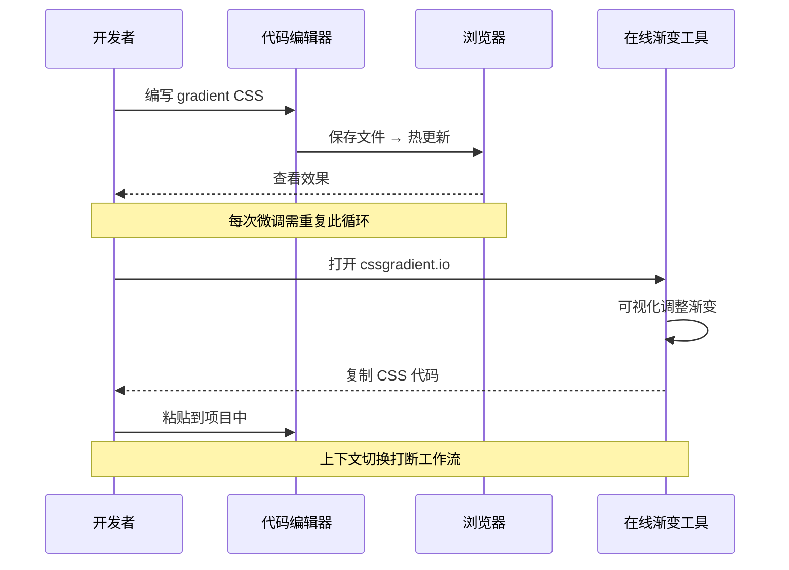
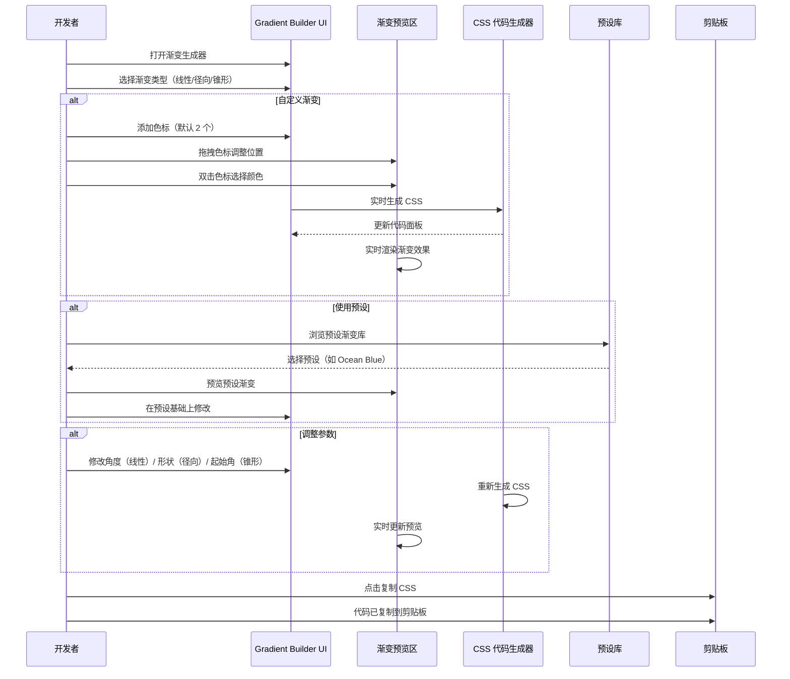
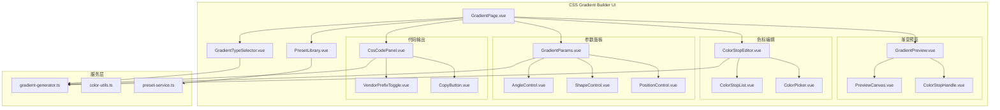

# YP-09-166: CSS 渐变生成器 — 可视化渐变构建、线性/径向/锥形渐变、色标拖拽编辑、渐变角度控制、实时预览、CSS 代码输出(含厂商前缀)、渐变预设库、一键复制 CSS

> 需求编号：YP-09-166 · 优先级：P2 · 人天：0.2d · 状态：需求已编写
> 依赖：无

## 背景

### 问题陈述

CSS 渐变是现代 Web 设计中最常用的视觉效果技术之一。从按钮背景、页面 Hero 区域、卡片装饰到数据可视化，渐变无处不在。然而，手写 CSS 渐变代码存在显著痛点：

1. **语法复杂难记**：线性渐变 `linear-gradient(angle, color-stop1, color-stop2, ...)` 的参数顺序和格式容易混淆；径向渐变的 `circle at center` 语法更复杂；锥形渐变 `conic-gradient` 兼容性差异大
2. **可视化调试困难**：修改颜色或角度后需要在浏览器中刷新才能看到效果，无法实时预览微调结果
3. **色标位置不直观**：手动计算百分比位置（如 `#ff0000 30%, #0000ff 70%`）无法直观看到颜色过渡效果
4. **厂商前缀繁琐**：旧版浏览器需要 `-webkit-`、`-moz-` 前缀，手动添加容易遗漏
5. **配色方案试错成本高**：找到一个好看的渐变配色组合需要反复试错，缺乏参考模板

**核心矛盾**：CSS 渐变是高频需求但手写效率低，缺少一个所见即所得的可视化构建工具来替代反复试错的手写流程。

### 影响范围

| # | 影响 | 严重程度 | 典型场景 |
|---|------|----------|----------|
| 1 | 渐变语法手写出错率高 | 高 | 忘记 `circle at center` 或 `from 0deg` 语法 |
| 2 | 配色试错耗时 | 高 | 尝试 5-10 种颜色组合才找到满意效果 |
| 3 | 色标位置调整不直观 | 中 | 调整渐变过渡位置需要多次修改百分比 |
| 4 | 厂商前缀遗漏 | 中 | 忘记添加 `-webkit-` 导致 Safari 不兼容 |
| 5 | 锥形渐变不熟悉 | 中 | `conic-gradient` 语法与线性/径向差异大 |
| 6 | 渐变代码复用困难 | 低 | 好的渐变配色无法快速保存和复用 |

### 挑战

| 挑战 | 说明 |
|------|------|
| 渐变预览渲染 | 需要实时将配置参数转换为 CSS 并渲染到预览区域 |
| 色标拖拽交互 | 在渐变预览条上拖拽色标调整位置，涉及鼠标事件和坐标计算 |
| 角度可视化 | 线性渐变的角度影响方向，锥形渐变的起始角度和旋转方向不同 |
| 厂商前缀生成 | 不同浏览器对不同渐变类型的支持有差异，需针对性生成前缀 |
| 预设管理 | 预设库的存储、分类、导入导出 |

---

## 一、现状分析

### 1.1 当前 CSS 渐变开发流程

```
开发者需要添加 CSS 渐变
  │
  ├─ 手写 CSS
  │   ├─ 回忆/搜索 linear-gradient 语法
  │   ├─ 挑选颜色（从设计稿或配色工具）
  │   ├─ 编写 CSS：background: linear-gradient(135deg, #667eea 0%, #764ba2 100%);
  │   ├─ 保存文件 → 等待热更新/刷新浏览器
  │   ├─ 查看效果
  │   ├─ 不满意 → 回到第 2 步调整颜色或角度
  │   └─ 重复 5-10 次直到满意
  │   问题: 每次微调都需要刷新页面，试错循环耗时长
  │
  ├─ 使用在线渐变生成器
  │   ├─ 打开 cssgradient.io 等工具
  │   ├─ 可视化调整颜色和角度
  │   ├─ 复制生成的 CSS
  │   └─ 粘贴到项目代码中
  │   问题: 需要切换浏览器标签页，无法保持工作上下文
  │
  └─ DevTools 中临时修改
      ├─ 打开 DevTools Elements 面板
      ├─ 找到目标元素
      ├─ 在 Styles 面板修改 background 值
      ├─ 实时预览效果
      └─ 满意后复制到代码
      问题: 修改的是运行时样式，刷新后丢失
```

### 1.2 当前可用能力

| 能力 | 可用性 | 获取方式 | 限制 |
|------|--------|----------|------|
| 线性渐变 | 是 | 手写 CSS | 语法易错 |
| 径向渐变 | 是 | 手写 CSS | 语法更复杂 |
| 锥形渐变 | 部分 | 手写 CSS（Chrome 69+） | Safari 需前缀 |
| 可视化预览 | 否 | 需在线工具 | 需切换上下文 |
| 色标拖拽编辑 | 否 | 无内置支持 | — |
| 渐变预设 | 否 | 需手动收集 | — |
| 厂商前缀 | 否 | 需手动添加 | — |

### 1.3 改造前数据流



### 1.4 根因矩阵

| 症状 | 根因 | 触发条件 | 频率 |
|------|------|----------|------|
| 语法错误 | 渐变参数多、顺序易混淆 | 手写复杂渐变时 | 高 |
| 配色试错多 | 无法实时可视化预览颜色组合 | 选择渐变配色时 | 高 |
| 色标位置不准 | 百分比位置与视觉效果无直接映射 | 创建多色标渐变时 | 中 |
| 厂商前缀遗漏 | 不同浏览器对渐变支持不同 | 多浏览器测试时 | 中 |
| 锥形渐变不会用 | conic-gradient 语法不熟悉 | 制作饼图/色轮时 | 中 |

---

## 二、设计决策

### 决策 1：渐变预览渲染方式 — CSS background vs Canvas vs SVG

| 选项 | 实现复杂度 | 编辑交互 | 性能 |
|------|-----------|----------|------|
| CSS background | 低（直接设置 style） | 无（静态） | 高 |
| Canvas 2D | 高 | 可绘制色标手柄 | 高 |
| SVG gradient | 中 | 有限 | 中 |

**选择：CSS background + Canvas 叠加层。** 预览区域使用 CSS background 渲染实际渐变效果（保证与最终效果完全一致），在预览区域上叠加一个 Canvas 层用于绘制色标手柄和拖拽交互。这样既保证了渐变渲染的准确性（使用浏览器原生渐变引擎），又实现了可视化的色标编辑交互。

### 决策 2：色标编辑器交互 — 独立颜色选择器 vs 拖拽条 vs 菜单

| 选项 | 精确度 | 直观性 | 实现复杂度 |
|------|--------|--------|-----------|
| 独立颜色选择器（列表+input） | 高 | 中 | 低 |
| 拖拽条（在预览上拖拽色标） | 中 | 高 | 高 |
| 右键菜单（添加/删除色标） | 高 | 中 | 中 |

**选择：拖拽条 + 颜色选择器组合。** 主交互为拖拽条——在渐变预览条上显示色标手柄，支持拖拽调整位置、双击编辑颜色、右键删除。辅助面板显示色标列表，精确输入位置百分比和颜色值。两种方式互补。

### 决策 3：渐变色标手柄实现 — 绝对定位 div vs Canvas 绘制

| 选项 | 拖拽流畅度 | 边界检测 | 实现复杂度 |
|------|-----------|----------|-----------|
| 绝对定位 div 元素 | 中 | 简单 | 低 |
| Canvas 绘制 | 高 | 需手动计算 | 中 |
| SVG circle | 中 | 简单 | 低 |

**选择：绝对定位 div 元素。** 色标手柄（小圆形+颜色填充）使用绝对定位的 div 元素，水平位置由色标百分比映射到预览条宽度。拖拽使用原生 mousedown/mousemove/mouseup 事件。每个色标最多 6 个手柄，div 方案性能足够且易于添加 tooltip、双击编辑等交互。

### 决策 4：厂商前缀策略 — 始终生成 vs 按需 vs 可配置

| 选项 | CSS 体积 | 兼容性 | 实现复杂度 |
|------|----------|--------|-----------|
| 始终生成全部前缀 | 大（~3x） | 最高 | 低 |
| 按目标浏览器生成 | 中 | 中 | 中 |
| 可配置（开关） | 灵活 | 灵活 | 中 |

**选择：可配置开关，默认生成标准 + -webkit-。** 线性渐变和径向渐变在现代浏览器中已不需要前缀，但锥形渐变在 Safari 中仍需 `-webkit-`。默认生成标准语法 + -webkit- 前缀，提供开关让用户选择是否添加 -moz- 前缀（Firefox 旧版）。

### 设计决策记录

| 决策 | 选项 A | 选项 B | 选项 C | 选择 | 理由 |
|------|--------|--------|--------|------|------|
| 预览渲染 | CSS bg | Canvas | SVG | **CSS + Canvas** | 预览准确 + 可交互 |
| 色标编辑 | 列表 | 拖拽条 | 右键菜单 | **拖拽+列表** | 直观且精确 |
| 手柄实现 | div | Canvas | SVG | **绝对定位 div** | 简单且足够 |
| 厂商前缀 | 全生成 | 按需 | 可配置 | **可配置** | 灵活覆盖所有场景 |

---

## 三、目标架构

### 3.1 改造后 CSS 渐变生成流程



### 3.2 组件结构



### 3.3 性能指标

| 指标 | 改造前 | 改造后 |
|------|--------|--------|
| 创建一个渐变 | 3-5min（手写+试错） | < 30s（拖拽色标+选择颜色） |
| 调整色标位置 | 需要修改百分比+刷新 | 实时拖拽预览 |
| 查找配色方案 | 需上网搜索 | 内置预设库一键选用 |
| 添加厂商前缀 | 手动编写多行 | 一键生成 |
| 复制 CSS 代码 | 手动选中+复制 | 一键复制 |

---

## 四、具体改动

### 4.1 渐变 CSS 生成器核心服务

```typescript
// 改造前：无渐变生成服务
// src/services/gradient-generator.ts (改造后)

type GradientType = 'linear' | 'radial' | 'conic';

interface ColorStop {
  color: string;
  position: number; // 0-100
  id: string;
}

interface GradientConfig {
  type: GradientType;
  colorStops: ColorStop[];
  angle?: number;             // 线性渐变角度 (0-360)
  shape?: 'circle' | 'ellipse'; // 径向渐变形状
  position?: string;          // 渐变中心位置 (如 'center', 'top left')
  conicFrom?: number;         // 锥形渐变起始角度
  repeating: boolean;
  vendorPrefix: {
    webkit: boolean;
    moz: boolean;
  };
}

class GradientGenerator {
  // 生成 CSS 渐变代码
  generate(config: GradientConfig): string {
    const gradients: string[] = [];

    // 构建渐变值
    const gradientValue = this.buildGradientValue(config);

    // 标准语法
    const propName = config.repeating
      ? `repeating-${config.type}-gradient`
      : `${config.type}-gradient`;

    // 生成各前缀版本
    if (config.vendorPrefix.webkit) {
      gradients.push(`background: -webkit-${propName}(${gradientValue});`);
    }
    if (config.vendorPrefix.moz) {
      gradients.push(`background: -moz-${propName}(${gradientValue});`);
    }
    gradients.push(`background: ${propName}(${gradientValue});`);

    return gradients.join('\n');
  }

  // 构建渐变参数值
  private buildGradientValue(config: GradientConfig): string {
    const parts: string[] = [];

    switch (config.type) {
      case 'linear':
        if (config.angle !== undefined) {
          parts.push(`${config.angle}deg`);
        }
        break;
      case 'radial':
        if (config.shape) {
          parts.push(`${config.shape} at ${config.position || 'center'}`);
        }
        break;
      case 'conic':
        if (config.conicFrom !== undefined) {
          parts.push(`from ${config.conicFrom}deg`);
        }
        if (config.position) {
          parts.push(`at ${config.position}`);
        }
        break;
    }

    // 色标列表
    const stops = [...config.colorStops]
      .sort((a, b) => a.position - b.position)
      .map(stop => `${stop.color} ${stop.position}%`)
      .join(', ');
    parts.push(stops);

    return parts.join(', ');
  }

  // 生成预览用的 CSS 字符串
  generatePreviewCss(config: GradientConfig): string {
    const value = this.buildGradientValue(config);
    const propName = config.repeating
      ? `repeating-${config.type}-gradient`
      : `${config.type}-gradient`;
    return `${propName}(${value})`;
  }

  // 添加色标
  addColorStop(config: GradientConfig, color: string, position: number): GradientConfig {
    const newStop: ColorStop = {
      color,
      position: Math.max(0, Math.min(100, position)),
      id: Date.now().toString(36),
    };
    return {
      ...config,
      colorStops: [...config.colorStops, newStop],
    };
  }

  // 移除色标
  removeColorStop(config: GradientConfig, stopId: string): GradientConfig {
    if (config.colorStops.length <= 2) return config; // 最少 2 个色标
    return {
      ...config,
      colorStops: config.colorStops.filter(s => s.id !== stopId),
    };
  }
}
```

### 4.2 渐变预览组件

```typescript
// src/components/tools/GradientPreview.vue (新增)

// 功能：
// - 渐变预览区域（默认 100% 宽度，等比高度）
// - 色标手柄：
//   - 圆形手柄，填充对应颜色，白色边框+阴影
//   - 拖拽水平移动调整位置（mousedown → mousemove → mouseup）
//   - 双击打开颜色选择器
//   - 右键菜单：删除色标、复制颜色值
//   - 悬停显示位置百分比 tooltip
// - 渐变预览条（底部）：
//   - 显示实际渐变效果的水平条
//   - 色标手柄映射到预览条上
//   - 点击空白区域添加新色标（取色为点击位置的插值颜色）
// - 响应式：窗口大小变化时重新计算手柄位置
```

### 4.3 色标编辑器组件

```typescript
// src/components/tools/ColorStopEditor.vue (新增)

// 功能：
// - 色标列表（排序显示）：
//   - 每行：颜色圆点 + 颜色值（HEX/RGB）+ 位置百分比输入框 + 删除按钮
//   - 拖拽排序（上下拖动调整色标顺序）
//   - 精确输入位置百分比（0-100）
// - 颜色选择器：
//   - 内置取色板（调色板 + 色相条 + 透明度条）
//   - 支持 HEX/RGB/HSL 输入
//   - 最近使用颜色
//   - 从页面取色（EyeDropper API，Chrome 95+）
// - 添加色标按钮：
//   - 在当前位置中间插入（取相邻两色标的插值色）
//   - 默认位置 = (前一个色标位置 + 后一个色标位置) / 2
```

### 4.4 参数控制面板

```typescript
// src/components/tools/GradientParams.vue (新增)

// 功能：
// - 线性渐变参数：
//   - 角度滑块（0-360）+ 数值输入
//   - 角度方向可视化（显示箭头指示渐变方向）
// - 径向渐变参数：
//   - 形状选择：圆形 / 椭圆形
//   - 中心位置：预设位置按钮（9 宫格：top-left/center/...）或自定义
//   - 大小控制：closest-side / farthest-side / closest-corner / farthest-corner
// - 锥形渐变参数：
//   - 起始角度滑块（0-360）
//   - 中心位置选择（同径向）
// - 重复标记：repeating-linear-gradient 等
// - 厂商前缀开关：-webkit- / -moz-
```

### 4.5 预设库组件

```typescript
// src/components/tools/PresetLibrary.vue (新增)

// 预设渐变列表：
// 内置预设（hard-coded）：
//   Ocean Blue: #2b5876 → #4e4376
//   Sunset: #ff7e5f → #feb47b
//   Purple Dream: #a18cd1 → #fbc2eb
//   Forest: #134e5e → #71b280
//   Fire: #f12711 → #f5af19
//   Frost: #00c6ff → #0072ff
//   Peach: #ee9ca7 → #ffdde1
//   Midnight: #232526 → #414345
//   Cherry: #eb3349 → #f45c43
//   Sky: #4facfe → #00f2fe
//
// 功能：
// - 预设卡片网格（显示渐变缩略图 + 名称）
// - 点击应用预设（替换当前色标配置）
// - 搜索/筛选预设
// - 收藏预设到本地
// - 自定义预设（保存当前渐变为预设）
```

### 4.6 CSS 代码输出面板

```typescript
// src/components/tools/CssCodePanel.vue (新增)

// 功能：
// - 代码区域（只读，语法高亮）：
//   - 显示生成的 CSS 代码
//   - 根据厂商前缀开关动态更新
//   - 实时随渐变配置变化
// - 工具栏：
//   - 复制按钮（一键复制全部 CSS）
//   - 复制纯渐变值（仅渐变函数参数，不含 background: 前缀）
//   - 厂商前缀切换开关
// - 代码格式：
//   background: -webkit-linear-gradient(135deg, #667eea 0%, #764ba2 100%);
//   background: linear-gradient(135deg, #667eea 0%, #764ba2 100%);
```

### 4.7 文件变更清单

| 文件 | 操作 | 说明 |
|------|------|------|
| `src/services/gradient-generator.ts` | 新增 | 渐变 CSS 生成核心服务 |
| `src/services/color-utils.ts` | 新增 | 颜色转换工具（HEX/RGB/HSL） |
| `src/services/preset-service.ts` | 新增 | 渐变预设管理服务 |
| `src/pages/tools/GradientPage.vue` | 新增 | 渐变生成器主页面 |
| `src/components/tools/GradientTypeSelector.vue` | 新增 | 渐变类型选择器（线性/径向/锥形） |
| `src/components/tools/GradientPreview.vue` | 新增 | 渐变预览区 + 色标手柄 |
| `src/components/tools/ColorStopHandle.vue` | 新增 | 色标手柄组件（可拖拽） |
| `src/components/tools/ColorStopEditor.vue` | 新增 | 色标编辑器面板 |
| `src/components/tools/ColorPicker.vue` | 新增 | 颜色选择器组件 |
| `src/components/tools/GradientParams.vue` | 新增 | 渐变参数面板 |
| `src/components/tools/AngleControl.vue` | 新增 | 角度控制组件 |
| `src/components/tools/CssCodePanel.vue` | 新增 | CSS 代码输出面板 |
| `src/components/tools/PresetLibrary.vue` | 新增 | 渐变预设库 |
| `src/components/tools/VendorPrefixToggle.vue` | 新增 | 厂商前缀开关 |
| `src/popup/router.ts` | 修改 | 添加渐变生成器路由 |
| `tests/unit/gradient-generator.test.ts` | 新增 | 渐变生成器测试 |

---

## 五、实施步骤

| 步骤 | 操作 | 路径 | 验证 | 人天 |
|------|------|------|------|------|
| 1 | 实现渐变 CSS 生成核心 | `src/services/gradient-generator.ts` | 三种渐变类型 CSS 生成正确 | 0.03 |
| 2 | 实现颜色工具和预设服务 | `color-utils.ts` + `preset-service.ts` | 颜色转换和预设加载正常 | 0.02 |
| 3 | 创建渐变预览+色标手柄 | `GradientPreview.vue` + `ColorStopHandle.vue` | 拖拽色标实时更新预览 | 0.05 |
| 4 | 创建参数控制面板 | `GradientParams.vue` + `AngleControl.vue` | 各参数调整实时反映到预览 | 0.03 |
| 5 | 创建色标编辑器 | `ColorStopEditor.vue` + `ColorPicker.vue` | 颜色选择和位置精确编辑 | 0.03 |
| 6 | 创建 CSS 代码面板和预设库 | `CssCodePanel.vue` + `PresetLibrary.vue` | 代码复制和预设应用 | 0.02 |
| 7 | 集成到 Popup 路由 | `src/popup/router.ts` | 渐变工具页面可访问 | 0.02 |

**总人天：0.2d**

---

## 六、测试规格

### 场景 1：创建线性渐变

**GIVEN** 用户打开渐变生成器
**WHEN** 默认显示线性渐变（135deg，#667eea 0%，#764ba2 100%）
**THEN** 预览区渲染蓝紫渐变
**AND** CSS 代码面板显示正确的 linear-gradient 代码

### 场景 2：拖拽色标调整位置

**GIVEN** 渐变有两个色标：红色（0%）和蓝色（100%）
**WHEN** 用户拖拽蓝色色标手柄到预览区 50% 位置
**THEN** 预览区渐变压缩（红→蓝过渡在 50% 处完成，剩余 50% 为纯蓝色）
**AND** 色标列表显示蓝色位置更新为 50%
**AND** CSS 代码更新为 `..., #0000ff 50%`

### 场景 3：添加和删除色标

**GIVEN** 渐变为 2 色标
**WHEN** 用户点击预览条中间位置
**THEN** 新色标添加在点击位置，颜色为插值色
**AND** 色标列表增加一项
**WHEN** 用户右键蓝色色标 → 选择删除
**THEN** 提示"至少保留 2 个色标"（或色标数 > 2 时删除）

### 场景 4：切换渐变类型

**GIVEN** 当前为线性渐变
**WHEN** 用户切换到径向渐变
**THEN** 预览区变为圆形渐变
**AND** 参数面板显示形状选择和中心位置控制
**AND** CSS 代码变为 radial-gradient
**WHEN** 用户切换到锥形渐变
**THEN** 预览区变为锥形渐变（色轮效果）
**AND** CSS 代码变为 conic-gradient（含 -webkit- 前缀）

### 场景 5：使用预设渐变

**GIVEN** 用户打开预设库
**WHEN** 点击 "Ocean Blue" 预设
**THEN** 渐变色标替换为 #2b5876（0%）→ #4e4376（100%）
**AND** 预览区更新为深蓝紫渐变
**AND** CSS 代码面板更新
**AND** 用户可以在此基础上修改色标

### 场景 6：复制 CSS 代码（含厂商前缀）

**GIVEN** 锥形渐变，厂商前缀开关全部打开
**WHEN** 点击复制按钮
**THEN** 剪贴板包含：
```
background: -webkit-conic-gradient(from 90deg, #667eea 0%, #764ba2 100%);
background: conic-gradient(from 90deg, #667eea 0%, #764ba2 100%);
```
**AND** 关闭 -webkit- 前缀后只复制标准语法行

---

## 七、风险与缓解

| 风险 | 概率 | 影响 | 缓解措施 |
|------|------|------|----------|
| 色标拖拽在触摸设备上不工作 | 低 | 低 | 使用 pointer events 替代 mouse events |
| 颜色选择器性能 | 低 | 中 | 使用原生 `<input type="color">` 作为基础，渐进增强自定义取色器 |
| Canvas 叠加层渲染闪烁 | 中 | 低 | 使用 requestAnimationFrame 同步 Canvas 渲染与 DOM 更新 |
| 预设库存储超限 | 低 | 低 | 用户自定义预设限制 20 个，超出时提示清理 |
| 锥形渐变在旧版 Safari 不兼容 | 低 | 中 | 默认生成 -webkit- 前缀，提示用户检查目标浏览器兼容性 |

---

## 八、回滚策略

| 场景 | 回滚操作 | 影响 |
|------|----------|------|
| 色标拖拽在特定页面冲突 | 禁用拖拽，仅保留列表编辑 | 编辑体验下降 |
| Canvas 叠加层 bug | 移除 Canvas 层，仅保留 CSS 渐变预览 | 色标手柄不可见 |
| 预设库加载失败 | 回退到仅内置预设（hard-coded） | 自定义预设丢失 |
| 路由冲突 | 移除渐变生成器路由 | 功能不可用 |

---

## 九、设计决策记录

### D-01：为什么使用 CSS background 渲染预览而非 Canvas？

Canvas 可以完全控制像素渲染，但与浏览器实际渲染渐变的算法可能不同（字体平滑、子像素渲染等）。使用 CSS background 渲染预览确保用户看到的渐变效果和实际应用在网页中的效果完全一致，避免"预览好看但实际不同"的预期偏差。

### D-02：为什么默认色标只有 2 个？

2 个色标是最简渐变（开始色→结束色），覆盖 80% 的渐变使用场景。用户可以根据需要添加更多色标。默认配置简单，降低了新用户的认知负担，符合"渐进复杂"的设计原则。

### D-03：为什么不支持渐变文字（background-clip: text）？

渐变文字需要 `-webkit-background-clip: text` + `-webkit-text-fill-color: transparent` 组合，属于高级特效且仅 WebKit 内核支持。CSS 渐变生成器聚焦于 `background` 渐变属性，渐变文字作为衍生功能在代码输出提示中说明即可。

### D-04：为什么预设库只有 10 个内置预设？

10 个精心挑选的预设覆盖常见配色风格（自然、科技、暖色、冷色、渐变趋势）。用户可以收藏和自定义更多预设。内置数量少是为了保持扩展体积轻量（预设数据 < 2KB），避免选择困难。

---

## 十、可观测性

### 指标

| 指标 | 类型 | 说明 |
|------|------|------|
| `yipet.gradient.type.linear` | Counter | 线性渐变使用次数 |
| `yipet.gradient.type.radial` | Counter | 径向渐变使用次数 |
| `yipet.gradient.type.conic` | Counter | 锥形渐变使用次数 |
| `yipet.gradient.colorstop.add` | Counter | 色标添加次数 |
| `yipet.gradient.preset.apply` | Counter | 预设应用次数 |
| `yipet.gradient.css.copy` | Counter | 复制 CSS 次数 |

### 告警

| 告警 | 条件 | 级别 |
|------|------|------|
| 色标数量异常 | 单次操作色标数 > 10 | INFO |
| 锥形渐变无前缀误用 | 锥形渐变关闭 -webkit- 前缀 | INFO（提示） |

---

## 十一、代码审查检查清单

- [ ] 三种渐变类型（线性/径向/锥形）CSS 生成正确
- [ ] 预览区域渐变效果与生成的 CSS 一致
- [ ] 色标手柄拖拽流畅（mousedown/mousemove/mouseup 正确绑定）
- [ ] 色标最小限制 2 个，删除到 2 个时按钮 disabled
- [ ] 色标位置输入限制 0-100
- [ ] 角度输入限制 0-360
- [ ] 颜色选择器支持 HEX/RGB/HSL 输入
- [ ] 径向渐变形状和位置参数正确
- [ ] 锥形渐变起始角度正确
- [ ] 重复渐变 repeating- 前缀正确
- [ ] 厂商前缀开关正确控制生成代码
- [ ] 预设库内置预设可点击应用
- [ ] 复制按钮复制内容与代码面板一致
- [ ] 拖拽色标到手柄外松开时位置正确

---

## 回归问题预测

| # | 预测问题 | 原因 | 验证方法 |
|---|---------|------|---------|
| 1 | 色标拖拽到极端位置（0% 或 100%）时手柄超出预览区边界，CSS 计算错误或手柄消失 | 拖拽事件中未对 mousemove 的 clientX 做边界限制，手柄位置计算可能产生负坐标或超宽坐标 | 拖拽色标到最左端和最右端，验证手柄不超出预览区，位置保持在 0%-100% 内 |
| 2 | 切换渐变类型（线性→径向）后，旧的角度参数残留导致径向渐变 CSS 无效 | 径向渐变不应有 angle 参数，但状态切换时未清理线性渐变的 angle 字段 | 从线性渐变（angle=135）切换到径向渐变，验证 CSS 生成不包含角度参数 |
| 3 | 色标排序错误时（如红色 80%、蓝色 20%），渐变出现硬边过渡而非平滑过渡 | 生成 CSS 时未对色标按 position 排序，导致浏览器渲染意外效果 | 创建乱序色标（80%, 20%, 60%），验证 CSS 输出中色标按位置升序排列 |
| 4 | 使用 EyeDropper API 取色时，用户取消取色（按 ESC）导致 Promise rejected，未处理异常导致颜色选择器状态异常 | EyeDropper.open() 用户取消时抛出 AbortError，未 catch 导致未处理的 Promise rejection | 打开取色器后按 ESC 取消，验证颜色选择器回到之前状态，无控制台报错 |
| 5 | 快速连续添加多个色标（依次点击预览条 5 个位置），最近添加的色标位置精度丢失（拖拽响应滞后） | 短时间内多个 DOM 更新（新色标手柄创建）未批量处理，导致渲染队列堆积 | 快速点击预览条添加 5 个色标，验证所有手柄正确渲染且拖拽响应及时（< 16ms） |
| 6 | 锥形渐变中自定义中心位置（如 at 30% 50%）后切换到径向渐变，径向渐变的位置默认为 center 但预览未重绘 | 渐变类型切换时位置参数默认值逻辑分支缺失，锥形渐变的 at 参数被径向渐变当作无效参数 | 锥形渐变设置中心位置 at 30% 50%，切换到径向渐变，验证预览正确渲染且位置为 center（或提示参数变更） |

---

## 性能分析

### CSS 渐变生成器关键操作耗时

| 操作 | 耗时 | 说明 |
|------|------|------|
| CSS 字符串生成 | < 1ms | 纯字符串拼接 |
| 色标拖拽 → CSS 更新 | < 5ms | DOM 更新 + CSS 重绘 |
| 渐变预览渲染 | < 16ms | 浏览器原生渐变渲染 |
| 颜色插值计算 | < 1ms | 两个 HEX 之间线性插值 |
| 预设列表渲染（10 条）| < 10ms | Vue 组件渲染 |
| CSS 复制到剪贴板 | < 5ms | 异步剪贴板 API |
| Canvas 手柄层绘制 | < 5ms | requestAnimationFrame 同步 |

### 数据量预估

| 数据项 | 大小 |
|--------|------|
| 渐变配置对象 | ~200B |
| 单条预设数据 | ~100B |
| 内置预设库（10 条） | ~1KB |
| 用户自定义预设（20 条） | ~2KB |
| 扩展存储空间占用（总计） | < 5KB |

### 对宿主页面的影响

| 场景 | 页面影响 | 说明 |
|------|----------|------|
| Popup 中使用 | 零影响 | 仅在 Popup 中运行 |
| 鼠标拖拽事件 | 零影响 | 事件在 Popup 内处理 |

---

## 相关文档

- [MDN - linear-gradient()](https://developer.mozilla.org/en-US/docs/Web/CSS/gradient/linear-gradient)
- [MDN - radial-gradient()](https://developer.mozilla.org/en-US/docs/Web/CSS/gradient/radial-gradient)
- [MDN - conic-gradient()](https://developer.mozilla.org/en-US/docs/Web/CSS/gradient/conic-gradient)
- [Can I Use - CSS Gradients](https://caniuse.com/css-gradients)