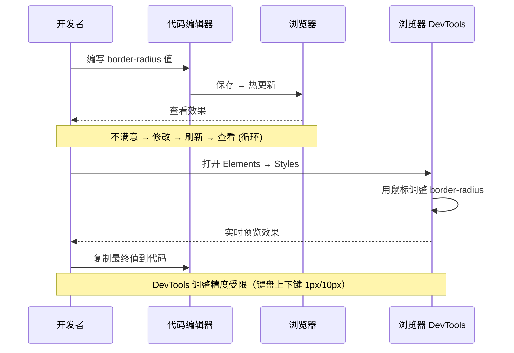
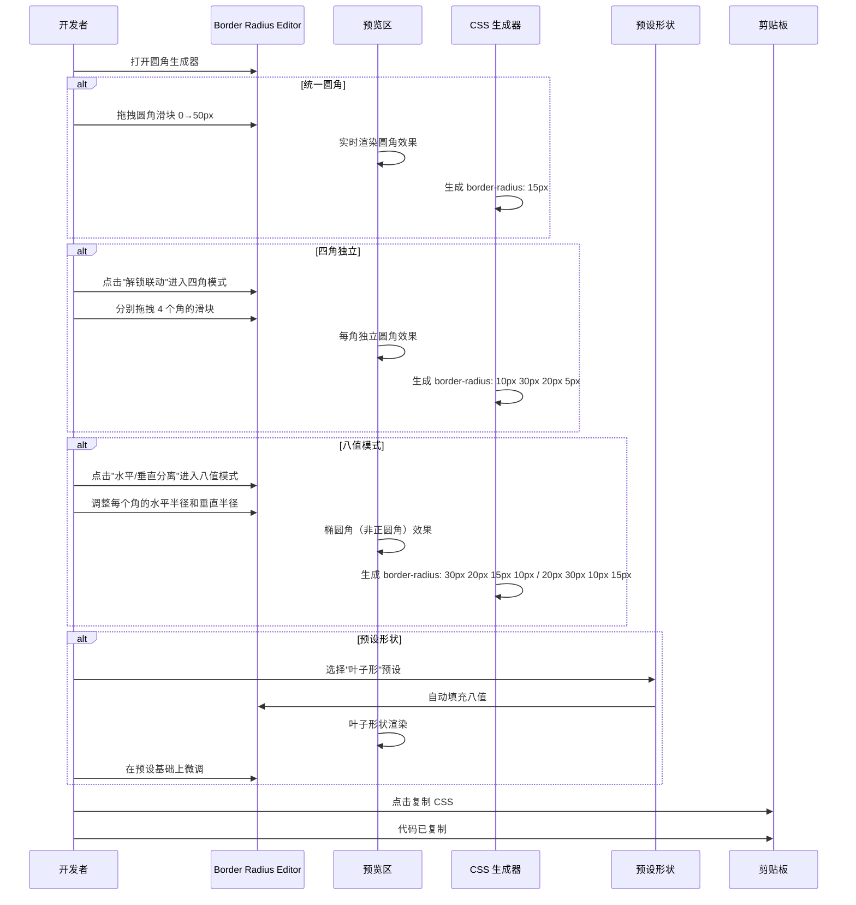
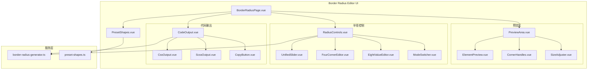

# YP-09-167: 边框圆角生成器 — 视觉化圆角编辑器、四角独立控制、实时预览、CSS/SCSS 输出、预设形状(圆形/胶囊形/叶子形/水滴形)、一键复制代码

> 需求编号：YP-09-167 · 优先级：P2 · 人天：0.2d · 状态：需求已编写
> 依赖：无

## 背景

### 问题陈述

`border-radius` 是 CSS 中使用频率最高的属性之一，用于创建圆角按钮、圆形头像、胶囊形标签、异形卡片等 UI 效果。然而，`border-radius` 的简写语法和八值语法极易出错：

1. **简写顺序易混淆**：`border-radius: 10px 20px 30px 40px` 的四值顺序（左上→右上→右下→左下）与 `margin`/`padding` 相同但用户常忘记方向映射
2. **八值语法几乎无法手写**：`border-radius: 10px 20px 30px 40px / 50px 60px 70px 80px` 的水平/垂直半径分开控制，手写出错率接近 100%
3. **非对称圆角无预览**：编辑器无法实时预览非对称圆角（如左上水平 50px 垂直 30px），只能写代码→刷新→看效果→调整的死循环
4. **复杂形状难以还原**：设计师给出的"叶子形"或"水滴形"的 border-radius 值，开发者需要反复计算水平/垂直半径比例才能还原
5. **不同单位混用混乱**：px/%/em/rem 混用时比例关系不直观

**核心矛盾**：border-radius 看似简单实则参数多，缺少一个所见即所得的可视化编辑器来替代反复试错的手写流程。

### 影响范围

| # | 影响 | 严重程度 | 典型场景 |
|---|------|----------|----------|
| 1 | 八值语法手写出错 | 高 | 创建非对称圆角需指定 8 个值 |
| 2 | 视觉效果无法预览 | 高 | 修改半径值后需刷新看效果 |
| 3 | 复杂形状还原困难 | 中 | 设计师要求"稍微椭圆一点的角" |
| 4 | 四值顺序混淆 | 中 | border-radius: 10px 20px 30px 40px 方向映射错误 |
| 5 | 百分比单位计算 | 低 | 50% 在不同尺寸元素上效果不同 |

### 挑战

| 挑战 | 说明 |
|------|------|
| 四角独立控制 UI | 如何直观展示 4 个角（每个角有水平/垂直半径），并提供独立编辑能力 |
| 同步联动 vs 独立控制 | 用户有时想统一修改 4 个角，有时想单独修改某一角，UI 需要支持双向模式 |
| 预设形状算法 | 圆形、胶囊形、叶子形、水滴形等预设需要精确的 border-radius 值计算 |
| 预览元素尺寸适配 | 预览元素的宽高比可调，border-radius 百分比值在不同宽高比下效果不同 |
| 不同单位处理 | px 和 % 的行为差异，用户切换单位时值的换算 |

---

## 一、现状分析

### 1.1 当前 border-radius 开发流程

```
开发者需要添加圆角效果
  │
  ├─ 简单圆角（4 角统一）
  │   ├─ 手写：border-radius: 8px;
  │   ├─ 保存 → 查看效果
  │   └─ 微调值（6px → 8px → 10px → 12px → 回到 8px）
  │   问题: 只能靠"猜 + 试"选值
  │
  ├─ 非对称圆角（各角不同）
  │   ├─ 手写四值语法（易混淆）
  │   ├─ 保存 → 查看 → 发现方向反了 → 重新写
  │   └─ 重复 3-4 次
  │   问题: 四值顺序和方向映射常出错
  │
  ├─ 八值语法（水平/垂直半径不同）
  │   ├─ 几乎不可能手写
  │   ├─ 只能用 DevTools 逐个调整
  │   └─ 每次修改后复制值到代码
  │   问题: 八值语法是 CSS 中最难手写的语法之一
  │
  └─ 异形形状（叶子形/水滴形）
      ├─ 搜索 "CSS leaf shape"
      ├─ 复制别人的 border-radius 值
      ├─ 调整以适配自己的元素尺寸
      └─ 微调比例直到满意
      问题: 高度依赖搜索，无法可视化调整
```

### 1.2 当前可用能力

| 能力 | 可用性 | 获取方式 | 限制 |
|------|--------|----------|------|
| 统一圆角 | 是 | `border-radius: Npx` | 无法实时预览 |
| 四角独立 | 是 | 四值简写 | 顺序易混淆 |
| 水平/垂直分离 | 是 | 八值语法 | 几乎无法手写 |
| 可视化编辑 | 否 | DevTools 中手动改 | 每次调整需鼠标操作 |
| 预设形状 | 否 | 需手动搜索 | — |

### 1.3 改造前数据流



### 1.4 根因矩阵

| 症状 | 根因 | 触发条件 | 频率 |
|------|------|----------|------|
| 圆角值试错多 | 无可视化实时预览 | 每次设置 border-radius | 高 |
| 四值顺序写错 | 简写顺序与方向映射不直观 | 四角不同值时 | 高 |
| 八值语法不会写 | 语法复杂，水平/垂直分离 | 需要椭圆角时 | 中 |
| 异形形状难还原 | 无预设模板和可视化调整 | 设计师要求特殊形状 | 中 |
| 不同元素尺寸适配 | 百分比圆角效果依赖元素尺寸 | 响应式设计时 | 中 |

---

## 二、设计决策

### 决策 1：圆角编辑模式 — 统一控制 vs 四角独立 vs 八值模式

| 选项 | 灵活性 | 实现复杂度 | 适用场景 |
|------|--------|-----------|----------|
| 统一控制（一个滑块控制 4 角） | 低 | 低 | 简单圆角 |
| 四角独立（每个角一个值） | 中 | 中 | 非对称圆角 |
| 八值模式（每个角水平/垂直分离） | 高 | 高 | 椭圆角、异形 |

**选择：三模式切换。** 提供"统一"、"四角独立"、"八值模式"三个选项卡。默认统一模式（大部分场景），点击"解锁联动"进入四角独立模式，再点击"水平/垂直分离"进入八值模式。渐进式的复杂度暴露，避免新用户被八值编辑面板吓到。

### 决策 2：预览元素 — 固定矩形 vs 可调整宽高比

| 选项 | 真实性 | 灵活性 | 实现复杂度 |
|------|--------|--------|-----------|
| 固定正方形（200x200） | 低 | 低 | 低 |
| 可调整宽高比的矩形 | 高 | 高 | 中 |
| 多种预设尺寸模板 | 中 | 中 | 中 |

**选择：可调整宽高比 + 预设尺寸模板。** 默认展示 300x200 矩形（更接近实际按钮/卡片尺寸），用户可调整宽高比（1:1、4:3、16:9、2:1、自定义）。这对百分比 border-radius 特别重要——50% 在正方形中是圆形，在矩形中是椭圆形。

### 决策 3：预设形状 — 仅 CSS 代码 vs 可继续编辑

| 选项 | 易用性 | 灵活性 | 实现复杂度 |
|------|--------|--------|-----------|
| 仅提供 CSS 代码 | 低 | 低 | 低 |
| 应用预设并可继续可视化编辑 | 高 | 高 | 中 |

**选择：应用预设并可继续编辑。** 用户选择"圆形"预设后，border-radius 值自动设置为 50%，但仍可在编辑面板中微调。选择"叶子形"预设后，八值自动填充为叶子形参数，用户可在可视化编辑器中继续调整每个角。

### 决策 4：输出格式 — 仅 CSS vs CSS + SCSS/Less

| 选项 | 覆盖面 | 实现复杂度 | 实用性 |
|------|--------|-----------|--------|
| 仅 CSS | 100% | 低 | 高 |
| CSS + SCSS | 90% | 中 | 中 |
| CSS + SCSS + Less | 95% | 高 | 中 |

**选择：CSS + SCSS 变量输出。** CSS 输出始终可用（所有项目都需要）。SCSS 输出将值分解为 SCSS 变量（`$br-top-left: 10px;`），方便组件化使用。Less 语法与 SCSS 相似，用户可自行调整，不单独支持以保持简洁。

### 设计决策记录

| 决策 | 选项 A | 选项 B | 选项 C | 选择 | 理由 |
|------|--------|--------|--------|------|------|
| 编辑模式 | 统一控制 | 四角独立 | 八值模式 | **三模式切换** | 渐进复杂度 |
| 预览元素 | 固定正方形 | 可调宽高比 | 多模板 | **可调宽高比+模板** | 百分比效果准确 |
| 预设形状 | 仅代码 | 可编辑 | — | **可继续编辑** | 预设是起点非终点 |
| 输出格式 | 仅 CSS | CSS+SCSS | CSS+SCSS+Less | **CSS+SCSS** | 覆盖主力技术栈 |

---

## 三、目标架构

### 3.1 改造后 border-radius 编辑流程



### 3.2 组件结构



### 3.3 性能指标

| 指标 | 改造前 | 改造后 |
|------|--------|--------|
| 设置一个简单圆角 | 1-2min（写代码+试值） | < 10s（拖拽滑块） |
| 创建非对称圆角 | 3-5min（手写四值） | < 30s（四角独立编辑） |
| 创建椭圆角 | 10min+（八值几乎不可手写） | < 1min（八值可视化） |
| 还原设计师形状 | 5-10min（反复试值） | < 30s（预设+微调） |

---

## 四、具体改动

### 4.1 border-radius CSS 生成服务

```typescript
// 改造前：无 border-radius 生成服务
// src/services/border-radius-generator.ts (改造后)

type RadiusUnit = 'px' | '%' | 'em' | 'rem';

interface CornerRadius {
  horizontal: number;
  vertical: number;
  unit: RadiusUnit;
}

interface BorderRadiusConfig {
  mode: 'unified' | 'four-corners' | 'eight-values';
  corners: {
    topLeft: CornerRadius;
    topRight: CornerRadius;
    bottomRight: CornerRadius;
    bottomLeft: CornerRadius;
  };
  unit: RadiusUnit;
}

class BorderRadiusGenerator {
  // 生成 CSS border-radius 值
  generateCss(config: BorderRadiusConfig): string {
    const corners = config.corners;

    if (config.mode === 'unified') {
      const r = corners.topLeft.horizontal;
      return `border-radius: ${this.formatValue(r, config.unit)};`;
    }

    if (config.mode === 'four-corners') {
      const tl = this.formatValue(corners.topLeft.horizontal, config.unit);
      const tr = this.formatValue(corners.topRight.horizontal, config.unit);
      const br = this.formatValue(corners.bottomRight.horizontal, config.unit);
      const bl = this.formatValue(corners.bottomLeft.horizontal, config.unit);

      if (tl === tr && tr === br && br === bl) {
        return `border-radius: ${tl};`;
      }
      if (tl === br && tr === bl) {
        return `border-radius: ${tl} ${tr};`;
      }
      if (tr === bl) {
        return `border-radius: ${tl} ${tr} ${br};`;
      }
      return `border-radius: ${tl} ${tr} ${br} ${bl};`;
    }

    // 八值模式
    const hTL = this.formatValue(corners.topLeft.horizontal, config.unit);
    const hTR = this.formatValue(corners.topRight.horizontal, config.unit);
    const hBR = this.formatValue(corners.bottomRight.horizontal, config.unit);
    const hBL = this.formatValue(corners.bottomLeft.horizontal, config.unit);
    const vTL = this.formatValue(corners.topLeft.vertical, config.unit);
    const vTR = this.formatValue(corners.topRight.vertical, config.unit);
    const vBR = this.formatValue(corners.bottomRight.vertical, config.unit);
    const vBL = this.formatValue(corners.bottomLeft.vertical, config.unit);

    return `border-radius: ${hTL} ${hTR} ${hBR} ${hBL} / ${vTL} ${vTR} ${vBR} ${vBL};`;
  }

  // 生成 SCSS 变量格式
  generateScss(config: BorderRadiusConfig): string {
    const u = config.unit;
    const c = config.corners;
    const lines: string[] = [];
    lines.push(`$br-top-left-h: ${this.formatValue(c.topLeft.horizontal, u)};`);
    lines.push(`$br-top-left-v: ${this.formatValue(c.topLeft.vertical, u)};`);
    lines.push(`$br-top-right-h: ${this.formatValue(c.topRight.horizontal, u)};`);
    lines.push(`$br-top-right-v: ${this.formatValue(c.topRight.vertical, u)};`);
    lines.push(`$br-bottom-right-h: ${this.formatValue(c.bottomRight.horizontal, u)};`);
    lines.push(`$br-bottom-right-v: ${this.formatValue(c.bottomRight.vertical, u)};`);
    lines.push(`$br-bottom-left-h: ${this.formatValue(c.bottomLeft.horizontal, u)};`);
    lines.push(`$br-bottom-left-v: ${this.formatValue(c.bottomLeft.vertical, u)};`);
    lines.push('');
    lines.push(`// Usage: border-radius: $br-top-left-h $br-top-right-h $br-bottom-right-h $br-bottom-left-h / $br-top-left-v $br-top-right-v $br-bottom-right-v $br-bottom-left-v;`);
    return lines.join('\n');
  }

  // 格式化数值
  private formatValue(value: number, unit: RadiusUnit): string {
    return unit === 'px' ? `${Math.round(value)}px`
      : `${Number(value.toFixed(1))}${unit}`;
  }

  // 应用预设形状
  applyPreset(preset: PresetShape, elementWidth: number, elementHeight: number): BorderRadiusConfig {
    return preset.generate(elementWidth, elementHeight);
  }
}
```

### 4.2 预设形状定义

```typescript
// src/services/preset-shapes.ts (新增)

interface PresetShape {
  name: string;
  description: string;
  generate: (w: number, h: number) => BorderRadiusConfig;
}

const presetShapes: PresetShape[] = [
  {
    name: '圆形 (Circle)',
    description: '完美的圆形 —— 宽高相等时',
    generate: (w, h) => ({
      mode: 'unified' as const,
      corners: cornerAll(h / 2, h / 2),
      unit: 'px' as const,
    }),
  },
  {
    name: '胶囊形 (Pill)',
    description: '两端半圆的长条形',
    generate: (w, h) => ({
      mode: 'four-corners' as const,
      corners: cornerAll(h / 2, h / 2),
      unit: 'px' as const,
    }),
  },
  {
    name: '叶子形 (Leaf)',
    description: '一片叶子的形状',
    generate: (w, h) => ({
      mode: 'eight-values' as const,
      corners: {
        topLeft: { horizontal: w * 0.7, vertical: h * 0.7, unit: 'px' },
        topRight: { horizontal: 0, vertical: 0, unit: 'px' },
        bottomRight: { horizontal: w * 0.7, vertical: h * 0.7, unit: 'px' },
        bottomLeft: { horizontal: 0, vertical: 0, unit: 'px' },
      },
      unit: 'px',
    }),
  },
  {
    name: '水滴形 (Blob)',
    description: '有机流畅的水滴形状',
    generate: (w, h) => ({
      mode: 'eight-values' as const,
      corners: {
        topLeft: { horizontal: w * 0.4, vertical: h * 0.5, unit: 'px' },
        topRight: { horizontal: w * 0.6, vertical: h * 0.4, unit: 'px' },
        bottomRight: { horizontal: w * 0.3, vertical: h * 0.6, unit: 'px' },
        bottomLeft: { horizontal: w * 0.5, vertical: h * 0.3, unit: 'px' },
      },
      unit: 'px',
    }),
  },
];
```

### 4.3 预览区组件

```typescript
// src/components/tools/PreviewArea.vue (新增)

// 功能：
// - 元素预览：
//   - 默认 300x200 圆角矩形（浅蓝背景 + 虚线轮廓）
//   - 实时渲染 border-radius 效果
//   - 可选显示网格参考线（帮助判断弧度）
// - 角手柄（四角独立/八值模式下显示）：
//   - 每个角显示 2 个小圆点（控制水平/垂直半径）
//   - 拖拽调整半径值
//   - 悬停显示当前半径值和角度位置
// - 尺寸调整器：
//   - 预设宽高比按钮：1:1, 4:3, 16:9, 2:1
//   - 自定义宽度/高度输入
//   - 尺寸变化时实时更新预览和百分比计算
```

### 4.4 半径控制器组件

```typescript
// src/components/tools/RadiusControls.vue (新增)

// 功能：
// - 模式切换器：
//   - 统一模式（一个滑块控制 4 角）
//   - 四角独立模式（4 个滑块，每个控制一个角）
//   - 八值模式（8 个滑块，每个角的水平/垂直分离）
//   - 切换模式时保持当前视觉效果的对应值
// - 统一模式 UI：
//   - 单个范围滑块（0-200px 或 0-50%）
//   - 数值输入框
//   - 步进按钮（+1/+10）
// - 四角模式 UI：
//   - 4 个滑块，标记角位置（↖左上、↗右上、↘右下、↙左下）
//   - "全部联动"按钮（临时统一调整，不影响锁状态）
// - 八值模式 UI：
//   - 8 个滑块分组：水平半径组（4）+ 垂直半径组（4）
//   - 每个滑块标记角位置 + H/V 标签
// - 单位选择器：px / % / em / rem
```

### 4.5 代码输出组件

```typescript
// src/components/tools/CodeOutput.vue (新增)

// 功能：
// - CSS 输出：
//   - 自动简写（四值相同时输出单值，对角相同时输出双值）
//   - 实时更新随编辑变化
//   - 语法高亮显示
// - SCSS 输出：
//   - 8 个 SCSS 变量（每个角的水平/垂直半径）
//   - 附带使用示例注释
// - 复制按钮：
//   - 复制 CSS
//   - 复制 SCSS 变量
// - 格式切换选项卡
```

### 4.6 文件变更清单

| 文件 | 操作 | 说明 |
|------|------|------|
| `src/services/border-radius-generator.ts` | 新增 | 圆角 CSS 生成核心服务 |
| `src/services/preset-shapes.ts` | 新增 | 预设形状算法 + 数据 |
| `src/pages/tools/BorderRadiusPage.vue` | 新增 | 圆角生成器主页面 |
| `src/components/tools/PreviewArea.vue` | 新增 | 预览区 + 角手柄 |
| `src/components/tools/ElementPreview.vue` | 新增 | 预览元素渲染 |
| `src/components/tools/CornerHandles.vue` | 新增 | 四角拖拽手柄 |
| `src/components/tools/SizeAdjuster.vue` | 新增 | 预览尺寸调整器 |
| `src/components/tools/RadiusControls.vue` | 新增 | 半径控制器面板 |
| `src/components/tools/UnifiedSlider.vue` | 新增 | 统一圆角滑块 |
| `src/components/tools/FourCornerEditor.vue` | 新增 | 四角独立编辑器 |
| `src/components/tools/EightValueEditor.vue` | 新增 | 八值编辑器 |
| `src/components/tools/ModeSwitcher.vue` | 新增 | 编辑模式切换器 |
| `src/components/tools/PresetShapes.vue` | 新增 | 预设形状选择器 |
| `src/components/tools/CodeOutput.vue` | 新增 | 代码输出面板 |
| `src/components/tools/CssOutput.vue` | 新增 | CSS 格式输出 |
| `src/components/tools/ScssOutput.vue` | 新增 | SCSS 格式输出 |
| `src/popup/router.ts` | 修改 | 添加圆角生成器路由 |
| `tests/unit/border-radius-generator.test.ts` | 新增 | 圆角生成器测试 |

---

## 五、实施步骤

| 步骤 | 操作 | 路径 | 验证 | 人天 |
|------|------|------|------|------|
| 1 | 实现 border-radius CSS 生成核心 | `src/services/border-radius-generator.ts` | 单值/四值/八值生成正确 | 0.03 |
| 2 | 实现预设形状算法 | `src/services/preset-shapes.ts` | 4 种预设形状 CSS 正确 | 0.02 |
| 3 | 创建预览区和角手柄 | `PreviewArea.vue` + `CornerHandles.vue` | 拖拽角手柄实时更新 | 0.04 |
| 4 | 创建半径控制器（三模式） | `RadiusControls.vue` + 子组件 | 模式切换保持视觉一致 | 0.04 |
| 5 | 创建代码输出面板 | `CodeOutput.vue` + 子组件 | CSS/SCSS 输出正确 | 0.02 |
| 6 | 创建预设形状选择器 | `PresetShapes.vue` | 点击预设正确应用 | 0.02 |
| 7 | 集成到 Popup 路由 | `src/popup/router.ts` | 圆角工具页面可访问 | 0.03 |

**总人天：0.2d**

---

## 六、测试规格

### 场景 1：设置统一圆角

**GIVEN** 用户打开圆角生成器（默认统一模式）
**WHEN** 用户拖拽圆角滑块到 20px
**THEN** 预览元素 4 个角显示 20px 圆角
**AND** CSS 输出为 `border-radius: 20px;`

### 场景 2：四角独立圆角

**GIVEN** 用户切换到"四角独立"模式
**WHEN** 设置 左上 10px、右上 30px、右下 20px、左下 5px
**THEN** 预览元素各角圆角不同
**AND** CSS 输出为 `border-radius: 10px 30px 20px 5px;`

### 场景 3：八值模式椭圆角

**GIVEN** 用户切换到"八值模式"
**WHEN** 左上水平半径 50px、垂直半径 30px
**AND** 其他角各有不同值
**THEN** 预览元素显示椭圆角（非正圆角）
**AND** CSS 输出为 `border-radius: 50px ... / 30px ...;`

### 场景 4：应用预设形状（圆形）

**GIVEN** 预览元素为正方形（200x200）
**WHEN** 用户点击"圆形"预设
**THEN** CSS 输出为 `border-radius: 100px;`（50% 等效）
**AND** 预览元素显示完美圆形
**AND** 用户可继续手动调整半径

### 场景 5：模式切换保持视觉效果

**GIVEN** 统一模式下圆角为 20px
**WHEN** 用户切换到四角独立模式
**THEN** 4 个角的初始值均为 20px（视觉效果不变）
**AND** CSS 输出由 `border-radius: 20px;` 变为 `border-radius: 20px;`

### 场景 6：切换单位

**GIVEN** 圆角值为 50px
**WHEN** 用户切换单位为 %
**THEN** 值自动换算为相对于当前预览元素宽度的百分比
**AND** CSS 输出为 `border-radius: 25%;`（200px 宽的 25% = 50px）
**AND** 切换回 px 时值恢复为 50px

---

## 七、风险与缓解

| 风险 | 概率 | 影响 | 缓解措施 |
|------|------|------|----------|
| 角手柄拖拽不精确 | 中 | 低 | 拖拽时按住 Shift 微调（1px 步进），提供数值输入精确控制 |
| 模式切换时值丢失 | 中 | 中 | 切换到更高阶模式时保留低阶模式的值作为初始值 |
| 百分比单位在不同尺寸下差异大 | 中 | 低 | 预览区提供多种尺寸模板切换，帮助理解百分比行为 |
| SCSS/Less 变量格式不受欢迎 | 低 | 低 | CSS 输出始终可用，SCSS 作为可选增强 |
| 八值手柄（16 个拖拽点）UI 拥挤 | 中 | 低 | 默认显示角选择器（点击哪个角编辑哪个角），可切换"全部显示" |

---

## 八、回滚策略

| 场景 | 回滚操作 | 影响 |
|------|----------|------|
| 角手柄拖拽 bug | 禁用拖拽，仅保留滑块+数值输入 | 编辑体验下降 |
| 八值模式 UI 过于复杂 | 隐藏八值模式，仅保留统一+四角模式 | 无法创建椭圆角 |
| 预设形状算法错误 | 移除预设，回退到纯手动编辑 | 失去快速创建能力 |
| 路由冲突 | 移除圆角生成器路由 | 功能不可用 |

---

## 九、设计决策记录

### D-01：为什么角手柄使用水平/垂直分离的两个拖拽点而非一个？

border-radius 的八值语法中，每个角可以有不同的水平半径和垂直半径。使用两个拖拽点（水平方向+垂直方向）直观对应这两个独立参数，比一个复合手柄更精确。默认模式下两个拖拽点联动（保持 1:1 比例），用户可通过"解锁 H/V 联动"独立调整。

### D-02：为什么预设形状包含"胶囊形"（实际是 50% 圆角）？

胶囊形（pill）是 UI 中最高频的非基础形状之一（标签、徽章、按钮常用）。`border-radius: 999px` 或 `border-radius: 50%`（高度的一半）都能创建胶囊形，但新手开发者不知道这个技巧。"胶囊形"预设直接应用正确的值，降低认知门槛。

### D-03：为什么单位切换时自动换算？

用户在 px 下设置 50px 圆角后切换到 %，如果不换算而直接使用 50%，视觉效果完全不同（正方形上 50% 是圆形而非 50px 圆角）。自动换算保持视觉一致性，避免"切换单位后预览突变"的困惑。

### D-04：为什么不支持多个圆角值叠加（如 border-radius + outline）？

border-radius 是独立属性，叠加 outline、box-shadow 等其他属性属于组合效果，超出了 border-radius 生成器的单一职责。用户可以在阴影生成器（YP-09-168）中配合使用。

---

## 十、可观测性

### 指标

| 指标 | 类型 | 说明 |
|------|------|------|
| `yipet.border-radius.mode.unified` | Counter | 统一模式使用次数 |
| `yipet.border-radius.mode.four` | Counter | 四角独立模式使用次数 |
| `yipet.border-radius.mode.eight` | Counter | 八值模式使用次数 |
| `yipet.border-radius.preset.apply` | Counter | 预设形状应用次数 |
| `yipet.border-radius.css.copy` | Counter | 复制 CSS 次数 |
| `yipet.border-radius.scss.copy` | Counter | 复制 SCSS 次数 |

### 告警

| 告警 | 条件 | 级别 |
|------|------|------|
| 角手柄拖拽边界越界 | 任何拖拽值超出 0-100% | WARNING |
| 模式切换值丢失 | 切换后半径值与目标模式不匹配 | WARNING |

---

## 十一、代码审查检查清单

- [ ] 统一模式、四角模式、八值模式 CSS 生成正确
- [ ] 模式切换时视觉效果不变（值向下兼容）
- [ ] CSS 输出自动简写（四值相同 → 单值，对角相同 → 双值）
- [ ] SCSS 变量格式正确，包含使用注释
- [ ] 角手柄拖拽范围限制在 0 到预览元素尺寸内
- [ ] 单位切换时自动换算（保持视觉效果）
- [ ] 预览元素尺寸调整正确影响百分比值渲染
- [ ] 4 种预设形状可用（圆形/胶囊形/叶子形/水滴形）
- [ ] 预设应用后可继续手动编辑
- [ ] 复制按钮复制内容与代码面板一致
- [ ] 点按步进按钮（+1/+10）正确增量

---

## 回归问题预测

| # | 预测问题 | 原因 | 验证方法 |
|---|---------|------|---------|
| 1 | 四角模式下设置 左上=30px 右上=30px 右下=10px 左下=10px（对角相等），CSS 简写为 `30px 10px`，与预期 `30px 30px 10px 10px` 视觉一致但代码不同 | 自动简写逻辑将 `tl === tr && br === bl` 简写为双值语法，但用户可能期望看到四值语法 | 设置对角相等的圆角，验证预览效果正确，CSS 代码面板显示简写格式并在旁边注释四值展开 |
| 2 | 预览元素尺寸从 200x200 调整为 300x100 时，px 单位的圆角值不变但视觉效果变了（因为元素变宽了），用户困惑 | 圆角值独立于元素尺寸，但视觉感知依赖宽高比 | 提供"按比例缩放"选项，选择后可锁定圆角与元素尺寸的比例（如圆角=高度的 10%） |
| 3 | 八值模式中只修改水平半径不修改垂直半径，生成 CSS 为水平值/垂直值简写，但修改后两个相邻角的垂直半径意外联动 | 八值编辑器的数据绑定使用了计算属性，相邻角的 v-model 双向绑定可能导致意外联动 | 修改一个角的水平半径，验证其他 7 个值不变，逐个验证每个值独立修改 |
| 4 | 预设"叶子形"在当前预览元素为正方形（200x200）时效果完美，但用户调整元素为 400x100 矩形后叶子形变形严重 | 叶子形预设的水平/垂直半径是基于初始元素尺寸按比例计算的，尺寸变化后比例关系被破坏 | 调整元素尺寸后重新应用预设，验证形状保持叶子形特征（比例自动适配新尺寸） |
| 5 | 切换单位从 px 到 % 时，值从 50px 换算为 25%（基于 200px 宽度），但用户切换单位后改变预览元素尺寸为 400px，圆角变成 100px 而非保持 50px 视觉效果 | % 值的视觉效果依赖元素尺寸，用户期望的是视觉效果锁定而非值锁定 | 文档中说明 % 和 px 的行为差异，或在切换单位时提示"切换后圆角视觉效果将随元素尺寸变化" |
| 6 | 八值模式中快速拖拽角手柄时，requestAnimationFrame 节流的更新导致手柄视觉位置与实际值存在 1-2 帧延迟，预览元素圆角"抖动" | rAF 节流导致状态更新和 CSS 渲染不同步 | 快速拖拽角手柄（> 60px/s），验证预览圆角平滑变化无抖动 |

---

## 性能分析

### 圆角生成器关键操作耗时

| 操作 | 耗时 | 说明 |
|------|------|------|
| CSS 字符串生成 | < 1ms | 纯字符串拼接 + 简写判断 |
| SCSS 变量生成 | < 1ms | 字符串拼接 |
| 角手柄拖拽 → 预览更新 | < 16ms | requestAnimationFrame 节流 |
| 单位换算（px↔%） | < 1ms | 简单数学运算 |
| 预设应用（8 值计算） | < 1ms | 数学运算 |
| 模式切换 | < 5ms | 状态迁移 + Vue 响应式 |

### 数据量预估

| 数据项 | 大小 |
|--------|------|
| 圆角配置对象 | ~300B |
| 单条预设数据 | ~100B |
| 预设形状库（4-6 条） | ~1KB |
| 扩展存储空间占用（总计） | < 2KB |

### 对宿主页面的影响

| 场景 | 页面影响 | 说明 |
|------|----------|------|
| Popup 中使用 | 零影响 | 仅在 Popup 中运行 |
| 角手柄拖拽 | 零影响 | 鼠标事件在 Popup 内处理 |

---

## 相关文档

- [MDN - border-radius](https://developer.mozilla.org/en-US/docs/Web/CSS/border-radius)
- [CSS Tricks - border-radius](https://css-tricks.com/almanac/properties/b/border-radius/)
- [Fancy Border Radius Generator](https://9elements.github.io/fancy-border-radius/)