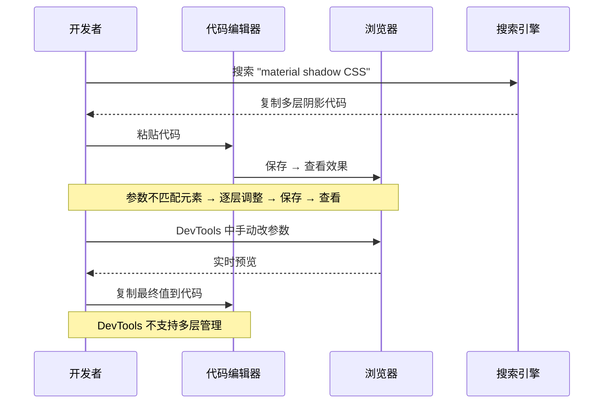
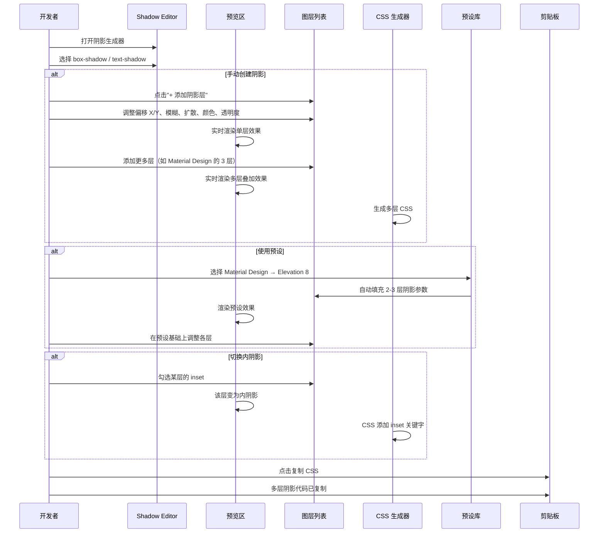

# YP-09-168: 阴影生成器 — box-shadow 和 text-shadow 可视化编辑器、多阴影层、颜色/偏移/模糊/扩散控制、实时预览、CSS 代码输出、阴影预设库、一键复制 CSS、内阴影切换

> 需求编号：YP-09-168 · 优先级：P2 · 人天：0.2d · 状态：需求已编写
> 依赖：无

## 背景

### 问题陈述

CSS 阴影（`box-shadow` 和 `text-shadow`）是现代 UI 设计中创造深度感、层次感和视觉焦点的核心手段。Material Design、Neumorphism（新拟物）、Glassmorphism（玻璃拟态）等设计趋势都高度依赖精细的阴影控制。然而，手写阴影 CSS 存在显著痛点：

1. **参数多且顺序难记**：`box-shadow: offset-x offset-y blur spread color` 五个参数的位置和含义容易混淆，`inset` 关键字的位置更增加了记忆负担
2. **多层阴影手写几乎不可行**：复杂的阴影效果（如 Material Design 的 3 层阴影叠加）需要逗号分隔多个阴影值，手写时难以预判叠加效果
3. **blur 和 spread 的区别不直观**：`blur`（模糊半径）和 `spread`（扩散半径）的视觉效果差异难以通过脑补判断，必须实际渲染才能对比
4. **Neumorphism 阴影参数敏感**：新拟物设计需要极精确的双阴影对（亮面+暗面），颜色对比度和偏移量的微小变化会导致效果天差地别
5. **text-shadow 不支持 spread**：与 box-shadow 相比，text-shadow 缺少 spread 参数，但许多开发者不知道这个差异，手写时添加无效参数

**核心矛盾**：CSS 阴影是视觉效果高度敏感的属性，手写无法即时验证效果，缺少一个可视化、支持多层叠加、带预设库的编辑器。

### 影响范围

| # | 影响 | 严重程度 | 典型场景 |
|---|------|----------|----------|
| 1 | 阴影参数手写出错 | 高 | blur/spread 混淆，inset 位置错误 |
| 2 | 多层阴影无法手写 | 高 | Material Design 3 层阴影叠加 |
| 3 | 颜色/透明度无法直观选 | 高 | rgba() 的 alpha 值对阴影效果影响大 |
| 4 | Neumorphism 参数难调 | 中 | 亮面/暗面双阴影的精确配比 |
| 5 | text-shadow 与 box-shadow 差异不清晰 | 中 | text-shadow 缺少 spread 参数 |
| 6 | 阴影预设缺乏 | 中 | 设计团队希望统一的阴影规范 |

### 挑战

| 挑战 | 说明 |
|------|------|
| 多层阴影管理 | 每个阴影层有 5 个独立参数，多层叠加时需要直观的列表管理 |
| 内阴影与外阴影切换 | inset 关键字改变整个阴影的渲染逻辑（内部 vs 外部），预览需正确反映 |
| text-shadow 的 spread 限制 | 渲染预览需正确处理 text-shadow 不支持 spread 的差异 |
| 阴影预览的准确性 | 不同浏览器对 blur 的实现有细微差异，预览应尽量接近实际效果 |
| 预设的存储和管理 | 多层阴影预设的数据结构复杂，需要序列化/反序列化 |

---

## 一、现状分析

### 1.1 当前阴影开发流程

```
开发者需要添加 CSS 阴影
  │
  ├─ 简单阴影（单层 box-shadow）
  │   ├─ 手写：box-shadow: 0 2px 4px rgba(0,0,0,0.1);
  │   ├─ 保存 → 查看效果
  │   ├─ 微调：blur 4px→8px, 透明度 0.1→0.2
  │   └─ 重复 5-8 次
  │   问题: 每次微调都需要"写→保存→看"循环
  │
  ├─ 多层阴影（Material Design 风格）
  │   ├─ 搜索 "material design box shadow"
  │   ├─ 复制多层阴影代码
  │   ├─ 粘贴，效果可能不符合元素尺寸
  │   └─ 逐层调整参数
  │   问题: 无法可视化调整每一层，叠加效果难以预测
  │
  ├─ Neumorphism（新拟物）
  │   ├─ 需要精确定义双阴影：亮面（左上白影）+ 暗面（右下黑影）
  │   ├─ 背景色、阴影色、偏移量精确匹配
  │   ├─ 参数不匹配时效果完全错误
  │   └─ 需要一个生成器工具
  │   问题: 参数容忍度极低，手写几乎不可能
  │
  └─ text-shadow
      ├─ 语法与 box-shadow 相似但不完全相同（无 spread、无 inset）
      ├─ 手写时容易把 box-shadow 的参数习惯带入
      └─ 多行文本阴影叠加效果需要实看
      问题: 语法差异容易导致错误
```

### 1.2 当前可用能力

| 能力 | 可用性 | 获取方式 | 限制 |
|------|--------|----------|------|
| 单层 box-shadow | 是 | 手写 CSS | 参数多易出错 |
| 多层 box-shadow | 是 | 手写逗号分隔 | 极难手写 |
| box-shadow: inset | 是 | 手写加 inset | 容易遗漏关键字 |
| text-shadow | 是 | 手写 CSS | 无 spread 参数 |
| 可视化编辑 | 否 | DevTools 中可调 | 不支持多层管理 |
| 阴影预设 | 否 | 需手动搜索 | — |

### 1.3 改造前数据流



### 1.4 根因矩阵

| 症状 | 根因 | 触发条件 | 频率 |
|------|------|----------|------|
| 参数写错 | 五参数顺序和含义混淆 | 手写 box-shadow | 高 |
| 多层阴影不可控 | 无法可视化叠加效果 | 复杂阴影设计 | 高 |
| Neumorphism 调参困难 | 参数极度敏感 | 新拟物风格设计 | 中 |
| text-shadow 误用 spread | 不了解两属性差异 | 第一次写 text-shadow | 中 |
| 阴影色透明度不准 | 颜色选择器与阴影预览分离 | 调阴影颜色时 | 中 |

---

## 二、设计决策

### 决策 1：图层管理模式 — 平铺列表 vs 堆叠预览 vs 图层树

| 选项 | 可操作性 | 直观性 | 实现复杂度 |
|------|----------|--------|-----------|
| 平铺列表（每层一行参数） | 高 | 中 | 低 |
| 堆叠预览（图层缩略图+深度） | 中 | 高 | 高 |
| 图层树（分组+嵌套） | 低 | 低 | 高 |

**选择：平铺列表 + 堆叠顺序指示器。** 每层阴影在列表中显示为一行（含偏移/模糊/扩散/颜色预览），可拖拽排序。顶部"综合预览"区域实时显示所有层叠加的最终效果。每层有独立开关（显示/隐藏该层），方便调试单层效果。

### 决策 2：阴影类型选择 — 两个独立工具 vs 统一工具切换 vs 统一工具混合

| 选项 | 清晰度 | 易用性 | 实现复杂度 |
|------|--------|--------|-----------|
| 两个独立工具（box-shadow 和 text-shadow 分开） | 高 | 中 | 低 |
| 统一工具切换（选项卡） | 中 | 高 | 中 |
| 统一工具混合（同一元素同时有 box-shadow 和 text-shadow） | 高 | 低 | 高 |

**选择：统一工具选项卡切换。** box-shadow 和 text-shadow 共享相同的图层管理架构和参数面板，仅预览元素和参数列表不同。text-shadow 模式下隐藏 spread 和 inset 参数。减少 UI 重复，用户可在同一个工具中完成所有阴影工作。

### 决策 3：颜色选择方式 — 仅 HEX vs HEX+RGBA vs 取色器（含透明度）

| 选项 | 灵活性 | 体验 | 实现复杂度 |
|------|--------|------|-----------|
| 仅 HEX（#000000） | 低 | 低 | 低 |
| HEX + RGBA 输入 | 高 | 中 | 中 |
| 取色器 + 透明度滑块 | 高 | 高 | 中 |

**选择：取色器 + 独立透明度滑块。** 阴影的透明度（alpha）是最关键的参数之一（比颜色本身更重要），所以将透明度作为独立滑块放在颜色选择器旁边，方便快速调整。取色器使用原生 `<input type="color">` + 自定义增强（最近使用颜色、预设色板）。

### 决策 4：预设类型范围 — 基础预设 vs 设计系统预设 vs 社区共享

| 选项 | 覆盖面 | 维护成本 | 实现复杂度 |
|------|--------|----------|-----------|
| 基础预设（5 种单层阴影） | 低 | 低 | 低 |
| 设计系统预设（Material/Neumorphism/Glassmorphism） | 高 | 中 | 中 |
| 社区共享（用户上传/下载预设） | 最高 | 高 | 高 |

**选择：设计系统预设。** 预置 3 套设计系统的阴影规范：

- Material Design 3（5 级海拔：1dp-24dp，多层叠加）
- Neumorphism（3 种风格：凸起/凹陷/浮雕）
- Glassmorphism（2 种：浅色/深色背景的玻璃态阴影）
每套预设包含 3-5 个预设项，覆盖主流设计趋势。

### 设计决策记录

| 决策 | 选项 A | 选项 B | 选项 C | 选择 | 理由 |
|------|--------|--------|--------|------|------|
| 图层管理 | 平铺列表 | 堆叠预览 | 图层树 | **平铺+排序** | 简单高效 |
| 类型选择 | 独立工具 | 选项卡切换 | 混合 | **选项卡** | 架构复用 |
| 颜色选择 | HEX | HEX+RGBA | 取色器+透明 | **取色器+透明** | 透明是关键参数 |
| 预设范围 | 基础 | 设计系统 | 社区共享 | **设计系统** | 聚焦主流 |

---

## 三、目标架构

### 3.1 改造后阴影编辑流程



### 3.2 组件结构

```mermaid
graph TD
    subgraph UI["Shadow Generator UI"]
        A[ShadowPage.vue]
        A --> B[ShadowTypeTabs.vue]
        A --> C[ShadowPreview.vue]
        A --> D[ShadowLayers.vue]
        A --> E[ShadowParams.vue]
        A --> F[PresetLibrary.vue]
        A --> G[CssOutput.vue]

        subgraph "预览区"
            C --> C1[BoxPreview.vue]
            C --> C2[TextPreview.vue]
        end

        subgraph "图层管理"
            D --> D1[LayerList.vue]
            D --> D2[LayerItem.vue]
            D --> D3[AddLayerButton.vue]
        end

        subgraph "参数面板"
            E --> E1[OffsetControls.vue]
            E --> E2[BlurControl.vue]
            E --> E3[SpreadControl.vue]
            E --> E4[ColorPicker.vue]
            E --> E5[OpacitySlider.vue]
            E --> E6[InsetToggle.vue]
        end

        subgraph "预设库"
            F --> F1[MaterialPresets.vue]
            F --> F2[NeumorphismPresets.vue]
            F --> F3[GlassmorphismPresets.vue]
        end
    end

    subgraph Services["服务层"]
        H[shadow-generator.ts]
        I[preset-service.ts]
    end

    D --> H
    E --> H
    G --> H
    F --> I
```



### 3.3 性能指标

| 指标 | 改造前 | 改造后 |
|------|--------|--------|
| 创建单层阴影 | 2-3min（手写+试值） | < 15s |
| 创建多层阴影 | 10min+（搜索+复制+调整） | < 1min |
| 调整阴影透明度 | 手写 rgba 值 | < 3s（拖动滑块） |
| Neumorphism 双阴影 | 几乎无法手写 | < 30s（预设+微调） |
| 阴影叠加预览 | 盲猜 | 实时渲染 |

---

## 四、具体改动

### 4.1 阴影 CSS 生成服务

```typescript
// 改造前：无阴影生成服务
// src/services/shadow-generator.ts (改造后)

type ShadowType = 'box' | 'text';

interface ShadowLayer {
  id: string;
  offsetX: number;
  offsetY: number;
  blur: number;
  spread: number;       // text-shadow 模式下禁用
  color: string;        // HEX 格式 #rrggbb
  opacity: number;      // 0-1
  inset: boolean;       // text-shadow 模式下禁用
  enabled: boolean;     // 是否参与预览和 CSS 生成
}

class ShadowGenerator {
  // 生成多层阴影 CSS
  generateCss(type: ShadowType, layers: ShadowLayer[]): string {
    const activeLayers = layers
      .filter(l => l.enabled)
      .map(l => this.generateLayerCss(type, l));

    if (activeLayers.length === 0) {
      return type === 'box'
        ? 'box-shadow: none;'
        : 'text-shadow: none;';
    }

    const property = type === 'box' ? 'box-shadow' : 'text-shadow';
    return `${property}: ${activeLayers.join(',\n       ')};`;
  }

  // 生成单层阴影 CSS
  private generateLayerCss(type: ShadowType, layer: ShadowLayer): string {
    const color = this.toRgba(layer.color, layer.opacity);
    const parts: string[] = [];

    if (layer.inset && type === 'box') {
      parts.push('inset');
    }

    parts.push(`${layer.offsetX}px`);
    parts.push(`${layer.offsetY}px`);
    parts.push(`${layer.blur}px`);

    if (type === 'box') {
      parts.push(`${layer.spread}px`);
    }

    parts.push(color);
    return parts.join(' ');
  }

  // HEX + opacity → rgba()
  private toRgba(hex: string, opacity: number): string {
    const r = parseInt(hex.slice(1, 3), 16);
    const g = parseInt(hex.slice(3, 5), 16);
    const b = parseInt(hex.slice(5, 7), 16);
    return `rgba(${r}, ${g}, ${b}, ${Number(opacity.toFixed(2))})`;
  }

  // 创建默认阴影层
  createDefaultLayer(type: ShadowType): ShadowLayer {
    return {
      id: Date.now().toString(36),
      offsetX: 0,
      offsetY: type === 'box' ? 4 : 2,
      blur: type === 'box' ? 8 : 4,
      spread: 0,
      color: '#000000',
      opacity: 0.15,
      inset: false,
      enabled: true,
    };
  }

  // 克隆图层
  duplicateLayer(layer: ShadowLayer): ShadowLayer {
    return {
      ...layer,
      id: Date.now().toString(36) + Math.random().toString(36).slice(2, 5),
    };
  }

  // 生成预览样式对象
  generatePreviewStyle(type: ShadowType, layers: ShadowLayer[]): Record<string, string> {
    const activeLayers = layers.filter(l => l.enabled);
    if (activeLayers.length === 0) {
      return type === 'box' ? { boxShadow: 'none' } : { textShadow: 'none' };
    }

    const cssValue = activeLayers
      .map(l => this.generateLayerCss(type, l))
      .join(', ');

    return type === 'box'
      ? { boxShadow: cssValue }
      : { textShadow: cssValue };
  }
}
```

### 4.2 阴影图层管理组件

```typescript
// src/components/tools/ShadowLayers.vue (新增)

// 功能：
// - 图层列表：
//   - 每行显示：图层缩略图预览（示意偏移方向）、序号、关键参数摘要、开关
//   - 拖拽排序（改变图层叠加顺序）
//   - 点击选中某层进入参数编辑
//   - 删除按钮（单层时禁用）
//   - 复制层按钮
// - 图层开关：
//   - 每层独立开关（显示/隐藏）
//   - 至少 1 层可见
// - 添加图层按钮：
//   - 在列表末尾添加新层（默认参数）
//   - 复制选中层
// - 图层面板：
//   - 总层数和可见层数统计
//   - 全部重置按钮
```

### 4.3 参数编辑面板

```typescript
// src/components/tools/ShadowParams.vue (新增)

// 功能：
// - 偏移 X/Y：
//   - 方向控制器（9 宫格点击选择方向 + 偏移量滑块）
//   - 直观显示阴影投射方向
//   - X：-50 到 +50（负左正右）
//   - Y：-50 到 +50（负上正下）
// - 模糊半径：
//   - 滑块 0-100px
//   - 数值越大阴影越柔和
// - 扩散半径（box-shadow 专属）：
//   - 滑块 -50 到 +50
//   - 正值扩大阴影，负值收缩阴影
// - 颜色 + 透明度：
//   - 颜色取色器
//   - 透明度独立滑块 0-1（步进 0.01）
//   - 实时预览当前颜色+透明度的 rgba 值
// - 内阴影开关（box-shadow 专属）：
//   - 勾选后阴影变为 inset
//   - 预览中阴影显示在元素内部
```

### 4.4 预览区域

```typescript
// src/components/tools/ShadowPreview.vue (新增)

// 功能：
// - box-shadow 预览：
//   - 预览元素：白色/浅灰圆角矩形（200x120）
//   - 可切换背景色（白色/浅灰/深色/自定义）验证不同背景下的阴影效果
//   - 实时渲染所有可见层的叠加效果
// - text-shadow 预览：
//   - 预览文本："The quick brown fox"（包含上行字母和下行字母）
//   - 可切换字体大小和字体族（sans-serif/serif/monospace）
//   - 实时渲染所有可见层的叠加效果
// - 辅助网格：
//   - 可开关的网格参考线
//   - 帮助判断阴影偏移方向和距离
```

### 4.5 预设库

```typescript
// src/components/tools/PresetLibrary.vue (新增)

// Material Design 3 预设（5 级海拔）:
//   Elevation 1 (1dp):  0 1px 2px rgba(0,0,0,0.3), 0 1px 3px 1px rgba(0,0,0,0.15)
//   Elevation 2 (3dp):  0 1px 2px rgba(0,0,0,0.3), 0 2px 6px 2px rgba(0,0,0,0.15)
//   Elevation 3 (6dp):  0 1px 2px rgba(0,0,0,0.3), 0 4px 8px 3px rgba(0,0,0,0.15)
//   Elevation 4 (8dp):  0 4px 8px 3px rgba(0,0,0,0.15), 0 1px 3px rgba(0,0,0,0.3)
//   Elevation 5 (12dp): 0 6px 10px 4px rgba(0,0,0,0.15), 0 2px 3px rgba(0,0,0,0.3)
//
// Neumorphism 预设:
//   凸起 (Raised):    -6px -6px 12px rgba(255,255,255,0.8), 6px 6px 12px rgba(0,0,0,0.15)
//   凹陷 (Pressed):   inset -3px -3px 6px rgba(255,255,255,0.8), inset 3px 3px 6px rgba(0,0,0,0.15)
//   浮雕 (Embossed):  -2px -2px 4px rgba(255,255,255,0.5), 2px 2px 4px rgba(0,0,0,0.2)
//
// Glassmorphism 预设:
//   浅色背景:          0 8px 32px rgba(0,0,0,0.1)
//   深色背景:          0 8px 32px rgba(255,255,255,0.1)
//   彩色叠加:          0 8px 32px rgba(31,38,135,0.37)
//
// 功能：
// - 按设计系统分类展示（Material / Neumorphism / Glassmorphism）
// - 点击预设缩略图应用
// - 悬停预览效果
```

### 4.6 文件变更清单

| 文件 | 操作 | 说明 |
|------|------|------|
| `src/services/shadow-generator.ts` | 新增 | 阴影 CSS 生成核心服务 |
| `src/services/preset-service.ts` | 新增 | 阴影预设服务 |
| `src/pages/tools/ShadowPage.vue` | 新增 | 阴影生成器主页面 |
| `src/components/tools/ShadowTypeTabs.vue` | 新增 | 阴影类型选项卡 |
| `src/components/tools/ShadowPreview.vue` | 新增 | 阴影预览区 |
| `src/components/tools/BoxPreview.vue` | 新增 | box-shadow 预览元素 |
| `src/components/tools/TextPreview.vue` | 新增 | text-shadow 预览元素 |
| `src/components/tools/ShadowLayers.vue` | 新增 | 阴影图层管理 |
| `src/components/tools/LayerItem.vue` | 新增 | 单层图层项 |
| `src/components/tools/ShadowParams.vue` | 新增 | 参数编辑面板 |
| `src/components/tools/OffsetControls.vue` | 新增 | 偏移方向/量控制器 |
| `src/components/tools/BlurControl.vue` | 新增 | 模糊控制 |
| `src/components/tools/SpreadControl.vue` | 新增 | 扩散控制 |
| `src/components/tools/ColorPicker.vue` | 新增 | 颜色选择器（复用） |
| `src/components/tools/OpacitySlider.vue` | 新增 | 透明度独立滑块 |
| `src/components/tools/InsetToggle.vue` | 新增 | 内阴影开关 |
| `src/components/tools/PresetLibrary.vue` | 新增 | 阴影预设库 |
| `src/components/tools/CssOutput.vue` | 新增 | CSS 代码输出面板 |
| `src/popup/router.ts` | 修改 | 添加阴影生成器路由 |
| `tests/unit/shadow-generator.test.ts` | 新增 | 阴影生成器测试 |

---

## 五、实施步骤

| 步骤 | 操作 | 路径 | 验证 | 人天 |
|------|------|------|------|------|
| 1 | 实现阴影 CSS 生成核心 | `src/services/shadow-generator.ts` | 单层/多层 box-shadow text-shadow 正确 | 0.03 |
| 2 | 实现预设服务 | `src/services/preset-service.ts` | 3 套预设数据加载和应用 | 0.02 |
| 3 | 创建预览区 | `ShadowPreview.vue` + Box/Text 子组件 | 实时渲染所有阴影层叠加 | 0.03 |
| 4 | 创建图层管理器 | `ShadowLayers.vue` + `LayerItem.vue` | 添加/删除/排序/开关 | 0.04 |
| 5 | 创建参数面板 | `ShadowParams.vue` + 子组件 | 所有参数正确联动 | 0.04 |
| 6 | 创建预设库和 CSS 输出 | `PresetLibrary.vue` + `CssOutput.vue` | 预设应用和代码复制 | 0.02 |
| 7 | 集成到 Popup 路由 | `src/popup/router.ts` | 阴影工具页面可访问 | 0.02 |

**总人天：0.2d**

---

## 六、测试规格

### 场景 1：创建单层 box-shadow

**GIVEN** 用户打开阴影生成器（默认 box-shadow 模式）
**WHEN** 用户设置偏移 X=2, Y=4, 模糊=8, 扩散=0, 颜色黑色透明度 0.15
**THEN** 预览元素右下出现柔和阴影
**AND** CSS 输出为 `box-shadow: 2px 4px 8px 0px rgba(0, 0, 0, 0.15);`
**AND** 阴影方向正确（右下）

### 场景 2：创建 Material Design 多层阴影

**GIVEN** 盒子阴影模式
**WHEN** 用户添加 2 个阴影层
**AND** 第 1 层：0 1px 2px rgba(0,0,0,0.3)
**AND** 第 2 层：0 1px 3px 1px rgba(0,0,0,0.15)
**THEN** 预览元素显示 Material 风格的双层阴影
**AND** CSS 输出包含逗号分隔的 2 个阴影值

### 场景 3：内阴影（inset）

**GIVEN** box-shadow 模式，单层阴影 Y=4
**WHEN** 用户勾选 inset 开关
**THEN** 预览元素内部顶部出现阴影（Y 方向反转）
**AND** CSS 输出包含 inset 关键字：`box-shadow: inset 0 4px ...`

### 场景 4：text-shadow 模式切换

**GIVEN** 用户在 box-shadow 模式下有 2 层阴影
**WHEN** 用户切换到 text-shadow 选项卡
**THEN** 图层保留（或重置为 text-shadow 默认层）
**AND** 参数面板中 spread 和 inset 控件隐藏或禁用
**AND** 预览区显示文本元素和文字阴影效果
**AND** CSS 输出变为 `text-shadow: ...`
**AND** 确认 CSS 中不含 spread 参数

### 场景 5：图层排序和开关

**GIVEN** 3 层阴影：第 1 层（大阴影）、第 2 层（小阴影）
**WHEN** 用户拖拽第 2 层到第 1 层上方
**THEN** 叠加顺序反转，预览效果变化（第 2 层遮挡第 1 层的部分区域）
**WHEN** 用户关闭第 1 层的开关
**THEN** 预览仅渲染第 2 层，CSS 仅包含第 2 层
**AND** 第 1 层参数保留但灰度显示

### 场景 6：应用 Neumorphism 预设后微调

**GIVEN** 阴影生成器
**WHEN** 用户选择 Neumorphism → "凸起 (Raised)" 预设
**THEN** 自动添加 2 层阴影：亮面（左上白影）+ 暗面（右下黑影）
**AND** 预览元素显示新拟物凸起效果
**WHEN** 用户调整背景色为深灰 #333
**AND** 调整暗面透明度从 0.15 到 0.3
**THEN** 效果更新为深色背景的凸起效果

---

## 七、风险与缓解

| 风险 | 概率 | 影响 | 缓解措施 |
|------|------|------|----------|
| 多层阴影性能 | 低 | 中 | 限制最大 5 层，超过提示性能警告 |
| inset 的偏移方向反转 | 中 | 低 | 预览区添加方向箭头指示，帮助理解 inset 行为 |
| 颜色透明度滑块精度不足 | 低 | 低 | 提供精确输入框（0.00-1.00），步进 0.01 |
| text-shadow 不支持 spread | 低 | 低 | 切换类型时自动移除 spread 参数并提示 |
| Neumorphism 预设依赖背景色 | 中 | 中 | 提供背景色选择器，预设根据背景色自动调整阴影色 |

---

## 八、回滚策略

| 场景 | 回滚操作 | 影响 |
|------|----------|------|
| 图层拖拽排序 bug | 禁用拖拽，改为按钮上移/下移 | 操作效率下降 |
| 预设库数据错误 | 移除预设功能，回退到手动编辑 | 失去快速应用能力 |
| 预览渲染性能 | 限制同时可见层数为 3 | 复杂阴影无法预览 |
| 路由冲突 | 移除阴影生成器路由 | 功能不可用 |

---

## 九、设计决策记录

### D-01：为什么透明度作为独立滑块而非集成在颜色选择器中？

阴影效果对透明度（alpha）极度敏感——有时 0.1 和 0.12 的效果差异就很大。独立透明度滑块+精确输入框（步进 0.01）提供更精细的控制。颜色选择器（色相+饱和度）和透明度（alpha）分离是专业设计工具的标准做法（如 Figma、Sketch）。

### D-02：为什么限制最大 5 层阴影？

超过 5 层的阴影叠加视觉效果提升极微（人眼难以区分第 5 层和第 6 层的差异），但计算成本显著增加。Material Design 3 的官方规范最多使用 3 层叠加。5 层已覆盖所有合理场景，同时保证预览渲染 < 16ms。

### D-03：为什么 text-shadow 模式下不保留 box-shadow 的图层？

text-shadow 和 box-shadow 的参数不完全相同（text-shadow 无 spread 和 inset），图层无法直接迁移。重置为 text-shadow 的默认配置（单层，适配文本尺寸的参数）是更安全的选择，避免用户困惑为什么 spread 值消失了。

### D-04：为什么 Neumorphism 预设包含背景色参数？

新拟物风格的效果严重依赖背景色——同样的阴影参数在白色背景（凸起效果好）和深色背景（几乎看不见）下效果截然不同。预设中包含推荐的背景色，并提示用户在预览区调整背景色以获得最佳效果。

---

## 十、可观测性

### 指标

| 指标 | 类型 | 说明 |
|------|------|------|
| `yipet.shadow.type.box` | Counter | box-shadow 使用次数 |
| `yipet.shadow.type.text` | Counter | text-shadow 使用次数 |
| `yipet.shadow.layers.count` | Histogram | 阴影层数分布 |
| `yipet.shadow.inset.use` | Counter | 内阴影使用次数 |
| `yipet.shadow.preset.material` | Counter | Material 预设应用次数 |
| `yipet.shadow.preset.neumorphism` | Counter | Neumorphism 预设应用次数 |
| `yipet.shadow.css.copy` | Counter | 复制 CSS 次数 |

### 告警

| 告警 | 条件 | 级别 |
|------|------|------|
| 阴影层数达到上限 | 层数 = 5 | INFO（提示） |
| text-shadow 使用 spread | 切换到 text-shadow 时有非零 spread 值 | INFO（自动移除） |

---

## 十一、代码审查检查清单

- [ ] box-shadow 和 text-shadow 的 CSS 生成正确
- [ ] 多层阴影使用逗号分隔
- [ ] inset 关键字位置正确（在颜色值之前）
- [ ] text-shadow 模式下 spread 和 inset 禁用/隐藏
- [ ] HEX+透明度正确转换为 rgba() 格式
- [ ] 图层列表支持拖拽排序、添加、删除、复制
- [ ] 图层开关独立控制各层可见性
- [ ] 偏移方向控制器 9 宫格 UX 正确
- [ ] 模糊和扩散滑块范围合理
- [ ] 预览区实时反映所有参数变化
- [ ] 背景色选择器影响阴影可见性
- [ ] 3 套预设正确应用
- [ ] 复制按钮复制完整多层 CSS

---

## 回归问题预测

| # | 预测问题 | 原因 | 验证方法 |
|---|---------|------|---------|
| 1 | 删除图层到只剩 1 层时，再次点击删除按钮应禁用但未禁用，导致唯一图层被删除，预览区和 CSS 输出异常 | 最小图层数限制逻辑未正确绑定到按钮 disabled 状态 | 从 3 层逐一删除到 1 层，验证删除按钮变为灰色不可点击 |
| 2 | 切换 box-shadow → text-shadow 后，某些图层的 spread 值为非零（如 10px），虽在 UI 中隐藏但仍保留在数据中，若用户切换回 box-shadow 该值"神秘"恢复 | 类型切换时未清理不属于目标类型的字段 | box-shadow 模式下设置 spread=10，切换到 text-shadow 再切回，验证 spread 值被正确保留 |
| 3 | 多层阴影中修改第 3 层的颜色，使用的是图层列表中第 2 层的颜色引用（浅拷贝导致引用共享） | 复制或添加图层时，color 字符串是值类型不应有问题，但若图层对象使用扩展运算符浅拷贝时未正确处理 | 修改第 3 层颜色，验证第 1、2 层颜色不变，所有图层颜色相互独立 |
| 4 | Neumorphism 预设应用后，背景色为默认白色，用户将背景色改为深色后阴影效果完全错误（亮面阴影比暗面还暗） | Neumorphism 阴影色假设浅色背景，深色背景需要反转亮面和暗面 | 应用 Neumorphism 预设后，选择深色背景，验证提示"建议调整阴影层颜色"或自动适配 |
| 5 | 图层拖拽排序后，CSS 生成顺序与预览叠加顺序不一致（拖拽更新了列表 UI 顺序但数据数组未更新） | 拖拽排序只更新了视图层（v-for 的 key 顺序）未更新底层数据数组 | 拖拽图层 2 到图层 1 上方，验证 CSS 输出中图层 2 的阴影在逗号列表的前面 |
| 6 | text-shadow 模式下多层阴影叠加时，blur 值较大的层覆盖了 blur 值较小的层，文字阴影出现预期外的模糊效果 | text-shadow 多层叠加时各层的模糊分别计算后叠加，而非先叠加颜色再统一模糊 | 创建 2 层 text-shadow：层1(blur=0 锐利)、层2(blur=10 模糊)，验证锐利阴影仍清晰可见 |

---

## 性能分析

### 阴影生成器关键操作耗时

| 操作 | 耗时 | 说明 |
|------|------|------|
| CSS 字符串生成 | < 1ms | 字符串拼接 |
| rgba 颜色转换 | < 1ms | parseInt 计算 |
| 单层阴影预览渲染 | < 5ms | 浏览器 CSS 渲染 |
| 5 层阴影叠加渲染 | < 16ms | 每层独立渲染后合成 |
| 图层拖拽排序 | < 5ms | Vue 响应式数组更新 |
| 预设应用（3-5 层填充） | < 10ms | 批量状态更新 |

### 数据量预估

| 数据项 | 大小 |
|--------|------|
| 单层阴影配置 | ~150B |
| 5 层阴影配置 | ~750B |
| 单条预设（多层） | ~500B |
| 3 套预设库（~15 条） | ~8KB |
| 扩展存储空间占用（总计） | < 10KB |

### 对宿主页面的影响

| 场景 | 页面影响 | 说明 |
|------|----------|------|
| Popup 中使用 | 零影响 | 仅在 Popup 中运行 |
| 多层阴影渲染 | 零影响 | 浏览器原生 GPU 加速渲染 |

---

## 相关文档

- [MDN - box-shadow](https://developer.mozilla.org/en-US/docs/Web/CSS/box-shadow)
- [MDN - text-shadow](https://developer.mozilla.org/en-US/docs/Web/CSS/text-shadow)
- [Material Design 3 - Elevation](https://m3.material.io/styles/elevation)
- [Neumorphism.io](https://neumorphism.io/)