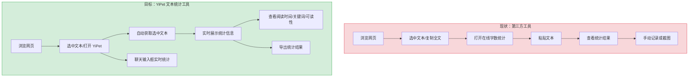
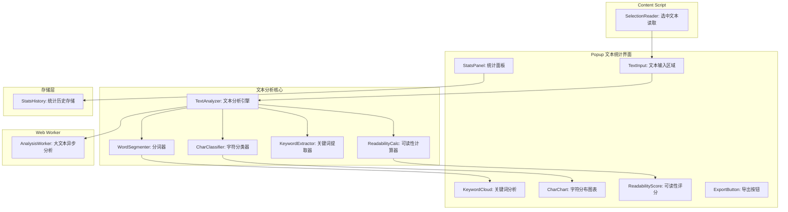
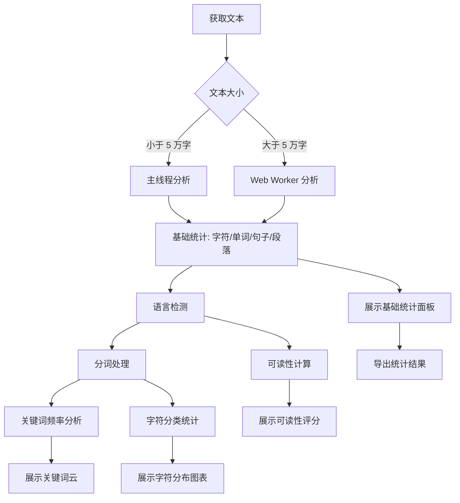

# YP-09-169: 文本统计与计数器 — 字符/单词/句子/段落计数、阅读时间估算、关键词频率分析、字符分布图表、可读性评分、导出统计、实时输入分析

> 需求编号：YP-09-169 · 优先级：P2 · 人天：0.2d · 状态：需求已编写
> 依赖：无

## 背景

### 问题陈述

用户在浏览或编辑网页内容时，经常需要了解文本的基本统计信息：字数、阅读时间、关键词分布等。当前用户需要将文本复制到第三方工具（Word、石墨文档、在线字数统计）中才能获取这些信息，流程割裂且耗时。

1. **文本统计信息零散**：字符数、单词数、段落数等基础统计分散在不同工具中
2. **阅读时间无法估算**：用户不知道某段内容需要多长时间阅读，影响时间规划
3. **关键词分析缺失**：无法快速了解文本的核心主题和关键词分布
4. **可读性无从评估**：用户不知道文本的阅读难度，无法判断是否适合目标受众
5. **输入时无实时反馈**：在 YiPet 聊天输入框中输入长文本时，无法实时了解文本统计

**核心矛盾**：用户需要便捷的文本统计工具，但现有方案要么需要切换应用，要么功能单一。YiPet 作为浏览器扩展，可以直接获取页面选中文本或聊天输入框内容，提供一站式的文本统计分析。

### 影响范围

| # | 影响 | 严重程度 | 典型场景 |
|---|------|----------|----------|
| 1 | 无法快速获取页面文本统计 | 高 | 阅读长文章时需要了解阅读时间 |
| 2 | 关键词分析缺失 | 中 | 需要快速了解文章主题 |
| 3 | 可读性无法评估 | 中 | 写作时需要确认文本难度 |
| 4 | 无实时输入反馈 | 中 | 聊天输入长文本时不知道字数 |
| 5 | 统计结果无法导出 | 低 | 需要将统计结果分享给他人 |

### 挑战

| 挑战 | 说明 |
|------|------|
| 中文分词准确性 | 中文不像英文有天然的空格分隔，分词需要专门的处理（Intl.Segmenter 或轻量分词库） |
| 可读性公式适配 | 常见的 Flesch-Kincaid 等可读性公式针对英文设计，中文需要不同的评估体系 |
| 大文本性能 | 10 万字以上的文本统计分析可能耗时，需要分块处理或 Web Worker |
| 选中文本获取 | Content Script 中获取的选中文本可能包含 HTML 标签，需要清洗 |
| 实时分析频率 | 输入时实时分析需要控制频率，避免频繁触发重计算 |

---

## 一、现状分析

### 1.1 当前文本统计功能

```
现有文本统计相关功能（无）:
├── YiPet Popup
│   ├── 聊天输入框：纯文本输入，无字数统计
│   └── 无文本统计工具入口
├── Content Script
│   ├── 选中文本获取：存在但仅用于发送到聊天
│   └── 无文本分析功能
├── Service Worker
│   └── 无文本处理逻辑
└── 依赖库
    └── 无文本分析相关依赖

缺失:
├── 字符/单词/句子/段落计数    # ❌ 不存在
├── 阅读时间估算               # ❌ 不存在
├── 关键词频率分析             # ❌ 不存在
├── 字符分布图表               # ❌ 不存在
├── 可读性评分                 # ❌ 不存在
├── 统计结果导出               # ❌ 不存在
└── 实时输入分析               # ❌ 不存在
```

### 1.2 用户文本统计流程（现状 vs 目标）



### 1.3 根因矩阵

| 症状 | 根因 | 触发条件 | 频率 |
|------|------|----------|------|
| 无文本统计功能 | 未实现文本分析模块 | 用户选中页面文本 | 高 |
| 阅读时间无法估算 | 未实现阅读速度模型 | 阅读长文章前 | 高 |
| 关键词分析缺失 | 未实现分词和频率统计 | 需要了解文章主题 | 中 |
| 可读性无法评估 | 未实现可读性公式 | 写作/审阅内容 | 中 |
| 无实时输入统计 | 聊天输入框未集成统计 | 输入长文本 | 中 |

---

## 二、设计决策

### 决策 1：文本分析引擎 — 纯前端 vs 调用 YiAi API vs Web Worker

| 选项 | 性能 | 离线可用 | 实现复杂度 | 准确性 |
|------|------|----------|-----------|--------|
| 纯前端（主线程） | 中（大文本可能阻塞） | 是 | 低 | 高 |
| 调用 YiAi API | 高（服务端计算） | 否 | 中 | 最高 |
| Web Worker | 高（不阻塞 UI） | 是 | 中 | 高 |

**选择：纯前端 + Web Worker。** 对于 99% 的使用场景（文本 < 5 万字），纯前端计算足够快（< 50ms）。对于超大文本（> 10 万字），通过 Web Worker 异步处理避免阻塞 UI。不调用 YiAi API 的理由是：文本统计是纯计算任务，不需要服务端能力，且离线可用是更好的用户体验。

### 决策 2：中文分词方案 — Intl.Segmenter vs jieba-wasm vs 简单正则

| 选项 | 体积 | 准确性 | 浏览器兼容性 |
|------|------|--------|-------------|
| Intl.Segmenter（浏览器原生） | 0 | 高（基于 ICU） | Chrome 87+ |
| jieba-wasm | ~500KB | 很高 | 所有浏览器 |
| 简单正则 + 规则 | 0 | 中 | 所有浏览器 |

**选择：Intl.Segmenter 优先，降级到正则。** Chrome 87+ 原生支持 `Intl.Segmenter`，基于 ICU 分词，准确率高且零依赖。对于不支持的浏览器（如部分旧版本），降级使用 CJK 字符范围 + 英文空格分词的混合策略。不使用 jieba-wasm 因为 500KB 对扩展太大。

### 决策 3：可读性公式 — Flesch-Kincaid vs 中文可读性 vs 简化指标

| 选项 | 适用语言 | 准确性 | 实现复杂度 |
|------|----------|--------|-----------|
| Flesch-Kincaid | 英文 | 高（英文） | 低 |
| 中文可读性（汉字难度+句长） | 中文 | 中 | 中 |
| 简化指标（平均句长+词长） | 多语言 | 低 | 低 |

**选择：混合策略。** 自动检测文本语言：如果是英文为主，使用 Flesch Reading Ease + Flesch-Kincaid Grade Level；如果是中文为主，使用基于平均句长和汉字笔画数的中文可读性评分。检测逻辑：统计 CJK 字符占比，> 50% 视为中文。

### 决策 4：字符分布图表 — Canvas 绘制 vs SVG vs 简单文本柱状图

| 选项 | 视觉效果 | 实现复杂度 | 体积 |
|------|----------|-----------|------|
| Canvas 绘制 | 高 | 中 | 低 |
| SVG | 高 | 中 | 低 |
| 简单文本柱状图（Unicode block） | 低 | 低 | 极低 |

**选择：Canvas 绘制柱状图。** 字符分布（字母/数字/空格/标点/其他）用简单的彩色柱状图展示，Canvas 2D 绘制足够，不需要引入 Chart.js 等库。柱状图直观展示各类字符占比，比纯数字更有可读性。

### 设计决策记录

| 决策 | 选项 A | 选项 B | 选项 C | 选择 | 理由 |
|------|--------|--------|--------|------|------|
| 分析引擎 | 纯前端 | YiAi API | Web Worker | **纯前端 + Worker** | 离线可用 + 大文本不阻塞 |
| 中文分词 | Intl.Segmenter | jieba-wasm | 正则 | **Intl.Segmenter** | 零依赖，准确率高 |
| 可读性 | Flesch-Kincaid | 中文可读性 | 简化指标 | **混合策略** | 自动检测语言 |
| 字符图表 | Canvas | SVG | 文本柱状图 | **Canvas** | 轻量直观 |

---

## 三、目标架构

### 3.1 文本统计系统架构



### 3.2 文本分析流程



### 3.3 性能指标

| 指标 | 目标值 | 说明 |
|------|--------|------|
| 文本统计（1 万字） | < 10ms | 基础统计 + 分词 + 关键词 |
| 文本统计（5 万字） | < 50ms | 主线程完整分析 |
| 文本统计（10 万字） | < 200ms | Web Worker 异步分析 |
| 可读性计算 | < 2ms | 公式计算 |
| 字符分布图表绘制 | < 5ms | Canvas 绘制 |
| 实时输入分析（防抖） | 300ms | 输入停止 300ms 后触发 |

---

## 四、具体改动

### 4.1 文本分析类型定义

```typescript
// src/textstats/types.ts (新增)

export interface TextStatistics {
  // 基础统计
  charCount: number;           // 总字符数（含空格）
  charCountNoSpaces: number;   // 字符数（不含空格）
  wordCount: number;           // 单词数（中文：词数，英文：word 数）
  sentenceCount: number;       // 句子数
  paragraphCount: number;      // 段落数
  lineCount: number;           // 行数

  // 语言检测
  detectedLanguage: 'zh' | 'en' | 'mixed' | 'other';
  cjkCharRatio: number;        // CJK 字符占比

  // 阅读时间
  readingTimeMinutes: number;  // 阅读时间（分钟）
  readingTimeFormatted: string;// 阅读时间（格式化："约 3 分钟"）
  speakingTimeMinutes: number; // 朗读时间（分钟）

  // 字符分布
  charDistribution: CharDistribution;
}

export interface CharDistribution {
  letters: number;             // 字母
  digits: number;              // 数字
  whitespace: number;          // 空格/换行
  punctuation: number;         // 标点符号
  cjk: number;                 // CJK 字符
  symbols: number;             // 符号
  other: number;               // 其他
}

export interface KeywordEntry {
  word: string;                // 关键词
  count: number;               // 出现次数
  frequency: number;           // 频率（百分比）
  tfidfScore?: number;         // TF-IDF 分数（如果有参考语料）
}

export interface ReadabilityScore {
  // 英文可读性
  fleschReadingEase?: number;  // Flesch Reading Ease (0-100)
  fleschGradeLevel?: number;   // Flesch-Kincaid Grade Level
  // 中文可读性
  chineseReadability?: number; // 中文可读性评分 (0-100)
  chineseDifficulty?: string;  // 难度等级（简单/中等/困难）
  // 通用指标
  avgSentenceLength: number;   // 平均句长（单词数）
  avgWordLength: number;       // 平均词长（字符数）
  complexWordRatio: number;    // 复杂词占比
}

export interface TextStatsExport {
  statistics: TextStatistics;
  keywords: KeywordEntry[];
  readability: ReadabilityScore;
  sourceText?: string;         // 前 200 字符预览
  analyzedAt: number;          // 分析时间戳
}

export const READING_SPEED = {
  zh: 400,  // 中文：400 字/分钟
  en: 238,  // 英文：238 词/分钟
  mixed: 300,
};
```

### 4.2 文本分析引擎

```typescript
// src/textstats/TextAnalyzer.ts (新增)

export class TextAnalyzer {
  private text: string = '';
  private langSegments: string[] = [];

  /** 分析文本，返回完整统计信息 */
  analyze(text: string): TextStatistics {
    this.text = text;

    const charCount = text.length;
    const charCountNoSpaces = text.replace(/\s/g, '').length;
    const lines = text.split('\n');
    const paragraphs = text.split(/\n\s*\n/).filter(p => p.trim());

    // 语言检测
    const cjkCount = (text.match(/[\u4e00-\u9fff\u3400-\u4dbf]/g) || []).length;
    const cjkCharRatio = charCount > 0 ? cjkCount / charCount : 0;
    const detectedLanguage = this.detectLanguage(cjkCharRatio);

    // 分词
    const words = this.segmentWords(text, detectedLanguage);
    const wordCount = words.length;

    // 句子拆分
    const sentences = this.splitSentences(text);
    const sentenceCount = sentences.length;

    // 阅读时间
    const speed = READING_SPEED[detectedLanguage];
    const readingTimeMinutes = wordCount / speed;
    const readingTimeFormatted = this.formatReadingTime(readingTimeMinutes);
    const speakingTimeMinutes = wordCount / 150; // 朗读约 150 词/分钟

    // 字符分布
    const charDistribution = this.classifyCharacters(text);

    return {
      charCount,
      charCountNoSpaces,
      wordCount,
      sentenceCount,
      paragraphCount: paragraphs.length,
      lineCount: lines.length,
      detectedLanguage,
      cjkCharRatio,
      readingTimeMinutes,
      readingTimeFormatted,
      speakingTimeMinutes,
      charDistribution,
    };
  }

  /** 关键词频率分析 */
  extractKeywords(text: string, topN: number = 20): KeywordEntry[] {
    const lang = this.cjkCharRatio > 0.5 ? 'zh' : 'en';
    const words = this.segmentWords(text, lang);

    // 停用词过滤
    const stopWords = this.getStopWords(lang);
    const filtered = words.filter(w => !stopWords.has(w) && w.length > 1);

    // 频率统计
    const freqMap = new Map<string, number>();
    for (const word of filtered) {
      freqMap.set(word, (freqMap.get(word) || 0) + 1);
    }

    const total = filtered.length;
    const entries: KeywordEntry[] = Array.from(freqMap.entries())
      .map(([word, count]) => ({
        word,
        count,
        frequency: total > 0 ? count / total : 0,
      }))
      .sort((a, b) => b.count - a.count)
      .slice(0, topN);

    return entries;
  }

  /** 可读性计算 */
  calcReadability(text: string, lang: 'zh' | 'en'): ReadabilityScore {
    const sentences = this.splitSentences(text);
    const words = this.segmentWords(text, lang);
    const avgSentenceLength = sentences.length > 0 ? words.length / sentences.length : 0;
    const avgWordLength = words.length > 0
      ? words.reduce((sum, w) => sum + w.length, 0) / words.length
      : 0;

    // 复杂词：音节数 > 2（英文）或笔画数 > 15（中文）
    const complexWords = words.filter(w => {
      if (lang === 'en') return this.countSyllables(w) > 2;
      return this.isComplexChinese(w);
    });
    const complexWordRatio = words.length > 0 ? complexWords.length / words.length : 0;

    const base: ReadabilityScore = { avgSentenceLength, avgWordLength, complexWordRatio };

    if (lang === 'en') {
      const totalWords = words.length;
      const totalSentences = sentences.length;
      const totalSyllables = words.reduce((sum, w) => sum + this.countSyllables(w), 0);

      base.fleschReadingEase = totalSentences > 0 && totalWords > 0
        ? 206.835 - 1.015 * (totalWords / totalSentences) - 84.6 * (totalSyllables / totalWords)
        : 0;
      base.fleschGradeLevel = totalSentences > 0 && totalWords > 0
        ? 0.39 * (totalWords / totalSentences) + 11.8 * (totalSyllables / totalWords) - 15.59
        : 0;
    } else {
      // 中文可读性：基于句长和复杂汉字比例
      const score = 100 - (avgSentenceLength * 0.8 + complexWordRatio * 100);
      base.chineseReadability = Math.max(0, Math.min(100, score));
      base.chineseDifficulty = score > 70 ? '简单' : score > 40 ? '中等' : '困难';
    }

    return base;
  }

  /** 字符分类统计 */
  classifyCharacters(text: string): CharDistribution {
    const dist: CharDistribution = {
      letters: 0, digits: 0, whitespace: 0,
      punctuation: 0, cjk: 0, symbols: 0, other: 0,
    };

    for (const ch of text) {
      if (/[a-zA-Z]/.test(ch)) dist.letters++;
      else if (/[0-9]/.test(ch)) dist.digits++;
      else if (/\s/.test(ch)) dist.whitespace++;
      else if (/[\u4e00-\u9fff\u3400-\u4dbf]/.test(ch)) dist.cjk++;
      else if (/[.,!?;:、。！？；：""''「」『』【】（）《》…—]/.test(ch)) dist.punctuation++;
      else if (/[\p{S}]/u.test(ch)) dist.symbols++;
      else dist.other++;
    }

    return dist;
  }

  // --- 私有方法 ---

  private detectLanguage(cjkRatio: number): 'zh' | 'en' | 'mixed' | 'other' {
    if (cjkRatio > 0.7) return 'zh';
    if (cjkRatio > 0.3) return 'mixed';
    if (cjkRatio < 0.1) return 'en';
    return 'mixed';
  }

  private segmentWords(text: string, lang: string): string[] {
    if (lang === 'zh') {
      // 使用 Intl.Segmenter 分词
      try {
        const segmenter = new Intl.Segmenter('zh-CN', { granularity: 'word' });
        return Array.from(segmenter.segment(text))
          .filter(s => s.isWordLike)
          .map(s => s.segment);
      } catch {
        // 降级：CJK 字符单字拆分 + 英文词空格拆分
        return this.fallbackSegment(text);
      }
    }
    // 英文：按空格和标点拆分
    return text.split(/[\s.,!?;:]+/).filter(w => w.length > 0);
  }

  private fallbackSegment(text: string): string[] {
    const result: string[] = [];
    let current = '';
    for (const ch of text) {
      if (/[\u4e00-\u9fff]/.test(ch)) {
        if (current) { result.push(current); current = ''; }
        result.push(ch);
      } else if (/[a-zA-Z0-9]/.test(ch)) {
        current += ch;
      } else {
        if (current) { result.push(current); current = ''; }
      }
    }
    if (current) result.push(current);
    return result;
  }

  private splitSentences(text: string): string[] {
    // 支持中英文句子拆分
    return text.split(/[.!?。！？\n]+/).filter(s => s.trim().length > 0);
  }

  private countSyllables(word: string): number {
    word = word.toLowerCase();
    if (word.length <= 3) return 1;
    const matches = word.match(/[aeiouy]+/g);
    return matches ? matches.length : 1;
  }

  private isComplexChinese(word: string): boolean {
    // 简化：长度 > 2 的 CJK 词视为复杂
    return word.length > 2 && /[\u4e00-\u9fff]/.test(word);
  }

  private getStopWords(lang: string): Set<string> {
    const zh = new Set(['的', '了', '在', '是', '我', '有', '和', '就',
      '不', '人', '都', '一', '一个', '上', '也', '很', '到', '说', '要', '去', '你',
      '会', '着', '没有', '看', '好', '自己', '这']);
    const en = new Set(['the', 'a', 'an', 'is', 'are', 'was', 'were', 'be',
      'been', 'being', 'have', 'has', 'had', 'do', 'does', 'did', 'will', 'would',
      'could', 'should', 'may', 'might', 'can', 'shall', 'to', 'of', 'in', 'for',
      'on', 'with', 'at', 'by', 'from', 'as', 'into', 'about', 'this', 'that',
      'it', 'its', 'and', 'or', 'but', 'not', 'so', 'if', 'than', 'too', 'very']);
    return lang === 'zh' ? zh : en;
  }

  private formatReadingTime(minutes: number): string {
    if (minutes < 1) return '不到 1 分钟';
    if (minutes < 2) return '约 1 分钟';
    return `约 ${Math.round(minutes)} 分钟`;
  }

  get cjkCharRatio(): number {
    const cjkCount = (this.text.match(/[\u4e00-\u9fff\u3400-\u4dbf]/g) || []).length;
    return this.text.length > 0 ? cjkCount / this.text.length : 0;
  }
}
```

### 4.3 字符分布图表组件

```typescript
// src/textstats/CharDistributionChart.ts (新增)

export class CharDistributionChart {
  private canvas: HTMLCanvasElement;
  private ctx: CanvasRenderingContext2D;

  constructor(canvas: HTMLCanvasElement) {
    this.canvas = canvas;
    this.ctx = canvas.getContext('2d')!;
  }

  /** 绘制字符分布柱状图 */
  draw(distribution: CharDistribution): void {
    const { width, height } = this.canvas;
    const ctx = this.ctx;

    // 清空画布
    ctx.clearRect(0, 0, width, height);

    const categories = [
      { label: '字母', value: distribution.letters, color: '#4CAF50' },
      { label: '中文', value: distribution.cjk, color: '#FF9800' },
      { label: '数字', value: distribution.digits, color: '#2196F3' },
      { label: '空格', value: distribution.whitespace, color: '#9E9E9E' },
      { label: '标点', value: distribution.punctuation, color: '#E91E63' },
      { label: '符号', value: distribution.symbols, color: '#9C27B0' },
    ];

    const total = categories.reduce((sum, c) => sum + c.value, 0);
    if (total === 0) return;

    const barWidth = Math.min(40, (width - 80) / categories.length);
    const chartHeight = height - 60;
    const maxValue = Math.max(...categories.map(c => c.value));
    const gap = (width - barWidth * categories.length) / (categories.length + 1);

    // 绘制 Y 轴
    ctx.strokeStyle = '#e0e0e0';
    ctx.lineWidth = 1;
    ctx.beginPath();
    ctx.moveTo(30, 10);
    ctx.lineTo(30, chartHeight + 10);
    ctx.stroke();

    // 绘制柱状图
    categories.forEach((cat, i) => {
      const x = gap + i * (barWidth + gap);
      const barHeight = maxValue > 0 ? (cat.value / maxValue) * chartHeight : 0;
      const y = chartHeight + 10 - barHeight;

      // 柱状图
      ctx.fillStyle = cat.color;
      this.roundRect(ctx, x, y, barWidth, barHeight, 4);
      ctx.fill();

      // 百分比标签
      const percentage = total > 0 ? ((cat.value / total) * 100).toFixed(1) : '0';
      ctx.fillStyle = '#333';
      ctx.font = '11px sans-serif';
      ctx.textAlign = 'center';
      ctx.fillText(`${percentage}%`, x + barWidth / 2, y - 5);

      // 分类标签
      ctx.fillText(cat.label, x + barWidth / 2, chartHeight + 35);
    });
  }

  private roundRect(
    ctx: CanvasRenderingContext2D,
    x: number, y: number, w: number, h: number, r: number,
  ): void {
    ctx.beginPath();
    ctx.moveTo(x + r, y);
    ctx.lineTo(x + w - r, y);
    ctx.arcTo(x + w, y, x + w, y + r, r);
    ctx.lineTo(x + w, y + h - r);
    ctx.arcTo(x + w, y + h, x + w - r, y + h, r);
    ctx.lineTo(x + r, y + h);
    ctx.arcTo(x, y + h, x, y + h - r, r);
    ctx.lineTo(x, y + r);
    ctx.arcTo(x, y, x + r, y, r);
    ctx.closePath();
  }
}
```

### 4.4 Vue 组件

```vue
<!-- src/components/TextStats.vue (新增) -->
<template>
  <div class="text-stats">
    <div class="stats-input">
      <textarea
        v-model="inputText"
        placeholder="粘贴或输入文本进行分析..."
        @input="onInput"
      />
    </div>

    <div class="stats-panel" v-if="statistics">
      <div class="stat-row">
        <div class="stat-item">
          <span class="stat-value">{{ statistics.charCount }}</span>
          <span class="stat-label">总字符</span>
        </div>
        <div class="stat-item">
          <span class="stat-value">{{ statistics.wordCount }}</span>
          <span class="stat-label">单词/词</span>
        </div>
        <div class="stat-item">
          <span class="stat-value">{{ statistics.sentenceCount }}</span>
          <span class="stat-label">句子</span>
        </div>
        <div class="stat-item">
          <span class="stat-value">{{ statistics.paragraphCount }}</span>
          <span class="stat-label">段落</span>
        </div>
        <div class="stat-item">
          <span class="stat-value">{{ statistics.readingTimeFormatted }}</span>
          <span class="stat-label">阅读时间</span>
        </div>
      </div>

      <div class="stats-section">
        <h4>字符分布</h4>
        <canvas ref="charChart" width="320" height="180" />
      </div>

      <div class="stats-section" v-if="keywords.length">
        <h4>关键词 Top-{{ keywords.length }}</h4>
        <div class="keyword-cloud">
          <span
            v-for="kw in keywords"
            :key="kw.word"
            class="keyword-tag"
            :style="{ fontSize: 12 + kw.frequency * 60 + 'px' }"
          >{{ kw.word }}</span>
        </div>
      </div>

      <div class="stats-section" v-if="readability">
        <h4>可读性评分</h4>
        <div class="readability-scores">
          <template v-if="statistics.detectedLanguage === 'en' && readability.fleschReadingEase != null">
            <div>Flesch Reading Ease: {{ readability.fleschReadingEase.toFixed(1) }}</div>
            <div>Grade Level: {{ readability.fleschGradeLevel?.toFixed(1) }}</div>
          </template>
          <template v-else>
            <div>中文可读性: {{ readability.chineseReadability?.toFixed(0) }}/100</div>
            <div>难度等级: {{ readability.chineseDifficulty }}</div>
          </template>
          <div>平均句长: {{ readability.avgSentenceLength.toFixed(1) }} 词</div>
        </div>
      </div>

      <button @click="exportStats">导出统计结果 (JSON)</button>
    </div>
  </div>
</template>
```

### 4.5 文件变更清单

| 文件 | 操作 | 说明 |
|------|------|------|
| `src/textstats/types.ts` | 新增 | 文本统计类型定义 |
| `src/textstats/TextAnalyzer.ts` | 新增 | 文本分析引擎 |
| `src/textstats/CharDistributionChart.ts` | 新增 | 字符分布图表绘制 |
| `src/textstats/analysis.worker.ts` | 新增 | Web Worker 大文本分析 |
| `src/components/TextStats.vue` | 新增 | 文本统计 UI 组件 |
| `src/popup/App.vue` | 修改 | 集成文本统计工具 Tab |

---

## 五、实施步骤

| 步骤 | 操作 | 路径 | 验证 | 人天 |
|------|------|------|------|------|
| 1 | 定义类型和常量 | `src/textstats/types.ts` | 类型检查通过 | 0.01 |
| 2 | 实现文本分析引擎 | `src/textstats/TextAnalyzer.ts` | 中英文文本统计分析正确 | 0.05 |
| 3 | 实现字符分布图表 | `src/textstats/CharDistributionChart.ts` | Canvas 柱状图渲染正确 | 0.02 |
| 4 | 实现 Web Worker | `src/textstats/analysis.worker.ts` | 大文本异步分析不阻塞 UI | 0.03 |
| 5 | 实现 UI 组件 | `src/components/TextStats.vue` | 输入文本实时显示统计 | 0.04 |
| 6 | 实现实时输入分析 | `src/components/TextStats.vue` | 300ms 防抖实时分析 | 0.02 |
| 7 | 集成到 Popup | `src/popup/App.vue` | 文本统计 Tab 可用 | 0.02 |
| 8 | 导出功能 | `src/components/TextStats.vue` | JSON 导出完整统计 | 0.01 |

**总人天：0.2d**

---

## 六、测试规格

### 场景 1：英文文本基础统计

**GIVEN** 输入文本 "The quick brown fox jumps over the lazy dog. This is a second sentence."
**WHEN** 触发文本分析
**THEN** charCount = 75, wordCount = 16, sentenceCount = 2, paragraphCount = 1
**AND** detectedLanguage = "en"
**AND** 阅读时间约 0.07 分钟（16 词 / 238 词每分钟）

### 场景 2：中文文本基础统计

**GIVEN** 输入文本 "今天天气很好。我们去公园散步吧。公园里有很多花。"
**WHEN** 触发文本分析
**THEN** detectedLanguage = "zh"
**AND** cjkCharRatio > 0.7
**AND** sentenceCount = 3
**AND** 阅读时间基于 400 字/分钟计算

### 场景 3：关键词频率分析

**GIVEN** 输入文本一段关于 "React 组件化开发" 的中文文章（含 50 处 "组件"、30 处 "React"、20 处 "状态"）
**WHEN** 提取 Top-10 关键词
**THEN** "组件" 排名第一，count = 50
**AND** "React" 排名第二，count = 30
**AND** 停用词（的、了、在）不应出现在关键词列表中

### 场景 4：字符分布图表

**GIVEN** 输入文本 "Hello 世界 123 !!!"
**WHEN** 计算字符分布
**THEN** letters = 5 (H, e, l, l, o), cjk = 2 (世, 界)
**AND** digits = 3 (1, 2, 3), symbols = 3 (!, !, !)
**AND** Canvas 柱状图能正确渲染各类别占比

### 场景 5：可读性评分

**GIVEN** 一段 500 词的英文文本，平均句长 15 词，复杂词占比 10%
**WHEN** 计算可读性
**THEN** fleschReadingEase 应为有效数值（0-100 区间）
**AND** fleschGradeLevel 应为有效数值

### 场景 6：大文本 Web Worker 分析

**GIVEN** 输入一段 15 万字的文本
**WHEN** 触发文本分析
**THEN** 分析在 Web Worker 中异步执行，UI 不阻塞
**AND** 分析完成时结果正确返回
**AND** 分析期间显示 "分析中..." 加载状态

---

## 七、风险与缓解

| 风险 | 概率 | 影响 | 缓解措施 |
|------|------|------|----------|
| Intl.Segmenter 在旧版浏览器不支持 | 低 | 中 | 降级到正则分词方案 |
| 大文本分析阻塞 UI | 中 | 中 | > 5 万字启用 Web Worker；添加取消分析功能 |
| 中文可读性公式准确性不足 | 中 | 低 | 标注"仅供参考"，提供多维度指标而非单一分数 |
| Canvas 柱状图在暗色模式下不可见 | 中 | 低 | 使用 CSS 变量适配暗色主题颜色 |
| 关键词提取对于短文本无意义 | 高 | 低 | 文本 < 100 词时隐藏关键词分析区域 |

---

## 八、回滚策略

| 场景 | 回滚操作 | 影响 |
|------|----------|------|
| 文本统计工具导致 Popup 加载异常 | 移除文本统计 Tab | 失去文本统计功能 |
| Web Worker 加载失败 | 降级为主线程同步分析（> 5 万字时提示） | 大文本分析可能卡顿 |
| Intl.Segmenter 导致特定文本崩溃 | 全局切换为正则分词 | 中文分词准确率下降 |
| Canvas 图表渲染异常 | 降级为纯数字表格展示 | 视觉效果下降 |

---

## 九、设计决策记录

### D-01：为什么选择纯前端而非调用 YiAi API？

文本统计（字符计数、分词、可读性）是纯计算任务，不涉及 AI 推理或数据存储。纯前端计算的优势：(1) 零网络延迟（即时反馈），(2) 离线可用，(3) 不消耗服务端资源，(4) 用户文本不离开浏览器（隐私）。仅在大文本场景（> 5 万字）使用 Web Worker 防止 UI 卡顿。

### D-02：为什么 Intl.Segmenter 优先级高于 jieba？

Intl.Segmenter 是 Chrome 87+ 内置的国际化分词 API，基于 ICU（International Components for Unicode）实现，(1) 零依赖体积，(2) 准确率接近 jieba，(3) 无需加载 WASM。jieba-wasm 需要额外的 500KB+ 下载，对浏览器扩展来说体积不可接受。

### D-03：为什么使用混合语言检测而非让用户手动选择？

自动语言检测（CJK 字符占比）可以让用户粘贴文本后立即看到正确的分析结果，无需额外操作。检测阈值 70% 的 CJK 字符即可判定为中文，30%-70% 为混合语言。误判概率较低（< 5%），即使误判用户也能从结果中轻松发现并手动校正。

### D-04：为什么阅读时间使用固定速度而非可配置？

固定阅读速度（中文 400 字/分钟、英文 238 词/分钟）基于学术研究的平均值，覆盖了大多数场景。可配置速度会增加 UI 复杂度但边际收益有限——阅读时间是粗略估计而非精确测量，固定基准已足够实用。未来版本可以将速度设置加入用户偏好。

---

## 十、可观测性

### 指标

| 指标 | 类型 | 说明 |
|------|------|------|
| `yipet.textstats.analyze_total` | Counter | 文本分析总次数 |
| `yipet.textstats.language_dist` | Histogram | 语言分布（zh/en/mixed） |
| `yipet.textstats.export_total` | Counter | 统计导出次数 |
| `yipet.textstats.worker_fallback` | Counter | Web Worker 降级次数 |
| `yipet.textstats.avg_text_length` | Histogram | 分析文本平均长度 |

### 告警

| 告警 | 条件 | 级别 |
|------|------|------|
| Web Worker 频繁降级 | 降级率 > 20% | WARNING |
| 大文本分析超时 | p95 延迟 > 500ms | INFO |

---

## 十一、代码审查检查清单

- [ ] TextAnalyzer 使用 Intl.Segmenter，且有降级方案
- [ ] 字符分类的正则覆盖所有 Unicode 类别
- [ ] 阅读时间格式化处理边界情况（0, < 1, 1, > 1）
- [ ] 停用词列表覆盖中英文常用停用词
- [ ] Canvas 图表在 resize 时正确重绘
- [ ] Web Worker 支持取消操作（AbortController）
- [ ] 导出 JSON 包含 sourceText 截断（前 200 字符）
- [ ] 防抖延迟 300ms 用于实时输入分析
- [ ] 暗色模式下图表颜色适配
- [ ] 大文本 (> 5 万字) 自动切换到 Worker

---

## 回归问题预测

| # | 预测问题 | 原因 | 验证方法 |
|---|---------|------|---------|
| 1 | `Intl.Segmenter` 对混合中英文文本的分词粒度过细，导致 wordCount 偏大（如 "HelloWorld" 被拆成 "Hello" 和 "World"，中文词被拆成单字） | `Intl.Segmenter` 的 `granularity: 'word'` 在不同语言边界处可能产生非预期的切分，中文词可能被过度切分 | 使用混合文本（含英文技术术语的中文文章）测试，手工对比分词结果与预期 |
| 2 | Canvas 柱状图的 `roundRect` 方法在绘制极高或极矮的柱状图时圆角效果异常，因为 barHeight < r * 2 时 arcTo 无法正确绘制 | `roundRect` 的圆角半径 r 为 4px，当柱状图高度 < 8px 时，上下圆角区域的 arcTo 会超出柱状图范围 | barHeight < 8 时降级为无圆角矩形（使用 fillRect） |
| 3 | `splitSentences` 的正则 `/[.!?。！？\n]+/` 不能正确处理省略号 "..." 和英文缩写 "Mr."、"Dr." 等，导致 sentenceCount 偏大 | 英文中的句号也是缩写的一部分（如 "Mr. Smith"），但正则将其视为句子分隔符 | 预处理文本，将常见缩写（Mr., Mrs., Dr., etc., vs., approx.）中的句号替换为占位符再拆分 |
| 4 | 关键词提取中的 `getStopWords` 返回的停用词集合与 `segmentWords` 的分词结果粒度不匹配，导致停用词过滤不完整 | 中文分词可能将"就好了"分成"就"和"好了"，停用词中只有"就"而没有"好了"，后者未被过滤 | 检查 Top-20 关键词中是否有明显的停用词残留，如有则补充停用词表或改为两阶段过滤（字符级 + 词级） |
| 5 | `countSyllables` 的简单正则 `/[aeiouy]+/g` 对不发音的 "e"（如 "like"、"cake"）和双元音（如 "boat"、"read"）计算不准确，导致 Flesch 可读性公式偏差 | 英语音节计算需要复杂的规则（Magic E 规则、双元音规则、R-Controlled 元音等），简单正则遗漏了大量特殊情况 | 使用已知音节数的单词（来自 CMU Pronouncing Dictionary）对比计算结果，偏差 > 20% 时标记为问题 |
| 6 | Web Worker 中导入 `TextAnalyzer` 时，如果 `TextAnalyzer` 依赖了 DOM API（如 `document.createElement`），Worker 环境会抛出 ReferenceError | Web Worker 环境没有 DOM API，`TextAnalyzer` 中如果有任何 DOM 引用都会导致 Worker 初始化失败 | 确保 `TextAnalyzer` 是纯 JS 类，不依赖 DOM；在 `analysis.worker.ts` 中仅导入和分析纯数据 |

---

## 性能分析

### 各阶段耗时

| 阶段 | 预估耗时 | 说明 |
|------|----------|------|
| 字符分类（遍历文本） | < 5ms/万字 | 单字符正则判断 |
| 语言检测 | < 0.5ms | 单次正则匹配 |
| 中文分词（Intl.Segmenter） | < 8ms/万字 | 浏览器原生 |
| 英文分词（split） | < 1ms/万字 | 正则拆分 |
| 关键词频率统计 | < 5ms/万字 | Map 计数 |
| 可读性计算 | < 2ms | 公式计算 |
| Canvas 图表绘制 | < 5ms | 6 个柱状图 |
| 总耗时（1 万字） | < 25ms | 主线程 |
| 总耗时（5 万字） | < 80ms | 主线程 |
| 总耗时（10 万字） | < 200ms | Web Worker |

### 体积预估

| 文件 | 大小 | 说明 |
|------|------|------|
| `src/textstats/types.ts` | ~1.5KB | 类型定义 |
| `src/textstats/TextAnalyzer.ts` | ~6KB | 分析引擎（含分词/可读性/关键词） |
| `src/textstats/CharDistributionChart.ts` | ~2KB | Canvas 图表 |
| `src/textstats/analysis.worker.ts` | ~1KB | Worker 入口 |
| `src/components/TextStats.vue` | ~4KB | UI 组件 |
| **总计** | **~14.5KB** | 无额外第三方依赖 |