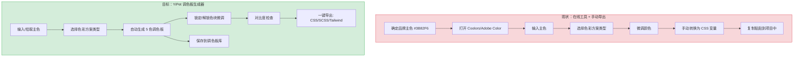
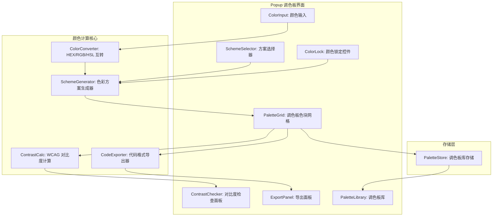
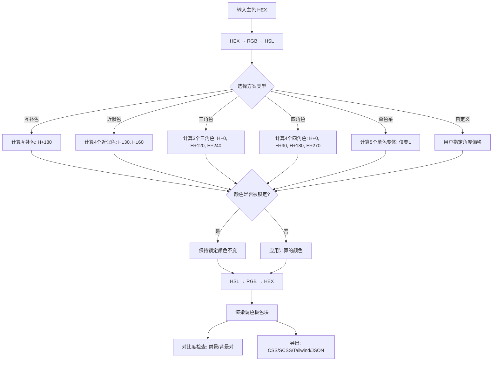

# YP-09-171: 颜色调色板生成器 — 互补色/近似色/类比色/三角色/四角色/单色系方案、颜色锁定、导出 CSS 变量/SCSS/Tailwind 配置、调色板库保存、颜色对无障碍对比度检查

> 需求编号：YP-09-171 · 优先级：P2 · 人天：0.2d · 状态：需求已编写
> 依赖：YP-09-143（颜色拾取器，共用颜色解析和转换工具）

## 背景

### 问题陈述

前端开发者和设计师在创建 UI 配色方案时，需要生成协调的颜色组合——从品牌主色出发，生成互补色、近似色、三角色等和谐方案。当前工作流依赖 Coolors、Adobe Color、Paletton 等在线工具，需要手动输入颜色、导出为代码、再粘贴到项目中。整个过程切换多个工具，效率低下。

1. **颜色方案生成需要切换工具**：从主色到完整调色板需要打开在线生成器
2. **颜色锁定操作繁琐**：手动锁定/解锁某些色块来控制方案变体
3. **导出代码格式不统一**：CSS 变量、SCSS、Tailwind 配置需要不同的格式，手动转换易出错
4. **无障碍对比度检查缺失**：选好的颜色组合可能不满足 WCAG 对比度要求
5. **调色板无法保存复用**：好的配色方案无法本地保存和快速复用

**核心矛盾**：开发者需要快速生成和导出调色板，但现有方案要么需要在线工具，要么导出流程繁琐。YiPet 作为本地浏览器扩展，可以纯前端完成颜色计算、对比度检查和多格式导出。

### 影响范围

| # | 影响 | 严重程度 | 典型场景 |
|---|------|----------|----------|
| 1 | 配色方案生成繁琐 | 高 | 从品牌色出发创建 UI 配色 |
| 2 | 颜色锁定不直观 | 中 | 锁定主色后自动生成辅助色 |
| 3 | 导出代码格式不统一 | 中 | 需要 CSS 变量和 Tailwind 配置两种格式 |
| 4 | 对比度检查缺失 | 高 | 文本/背景颜色组合可能不可读 |
| 5 | 调色板无法保存 | 中 | 好的配色方案需要下次复用 |

### 挑战

| 挑战 | 说明 |
|------|------|
| HSL 颜色空间转换精度 | 色彩方案生成基于 HSL 色相偏移，RGB ↔ HSL 转换需要精确的数学实现 |
| 对比度计算准确性 | WCAG 2.1 的对比度公式涉及相对亮度（sRGB → 线性 RGB），浮点精度要保证 |
| 多种导出格式 | CSS 变量、SCSS 变量和函数、Tailwind extend 配置——三种格式的映射和生成 |
| 色相环算法选择 | 互补色（+180度）、近似色（±30度）、三角色（±120度）、四角色（+90度间隔） |
| 暗色/亮色模式适配 | 导出的调色板需要考虑暗色模式和亮色模式两套方案 |

---

## 一、现状分析

### 1.1 当前颜色调色板功能

```
现有颜色相关功能:
├── YiPet Popup
│   ├── YP-09-143 颜色拾取器：从页面拾取颜色
│   │   └── 仅支持单色拾取和预览，无调色板生成
│   └── 无调色板生成工具入口
├── 颜色解析工具（YP-09-143 共享）
│   ├── HEX ↔ RGB ↔ HSL 转换（已存在）
│   └── 无色彩方案生成逻辑
└── 导出功能
    └── 无代码格式导出

缺失:
├── 色彩方案生成（互补/近似/三角/四角/单色）   # ❌ 不存在
├── 颜色锁定机制                              # ❌ 不存在
├── CSS 变量/SCSS/Tailwind 代码导出           # ❌ 不存在
├── WCAG 对比度检查                           # ❌ 不存在
├── 调色板库保存和加载                         # ❌ 不存在
└── 色相环可视化                              # ❌ 不存在
```

### 1.2 用户调色板工作流（现状 vs 目标）



### 1.3 根因矩阵

| 症状 | 根因 | 触发条件 | 频率 |
|------|------|----------|------|
| 无色彩方案生成 | 未实现色相环算法 | 从主色创建调色板 | 高 |
| 颜色无法锁定 | 未实现锁定机制 | 微调配色时保持部分颜色不变 | 中 |
| 不能导出代码 | 未实现多格式导出 | 集成配色到项目 | 高 |
| 无对比度检查 | 未实现 WCAG 对比度公式 | 文本配色可读性验证 | 高 |
| 无调色板库 | 未实现保存/加载 | 复用之前的好配色 | 中 |

---

## 二、设计决策

### 决策 1：颜色空间 — HSL vs HCL vs OKLCH

| 选项 | 感知均匀性 | 浏览器支持 | 方案效果 |
|------|-----------|-----------|----------|
| HSL（色相/饱和度/亮度） | 差（亮度不均匀） | 所有浏览器 | 可用 |
| HCL（色相/色度/亮度） | 好（感知均匀） | 需要 polyfill | 好 |
| OKLCH | 最好（感知极均匀） | Chrome 111+ | 最好 |

**选择：HSL 优先，OKLCH 增强。** HSL 是调色板生成的经典方案，所有浏览器原生支持，色相偏移算法简单。对于现代浏览器，额外提供 OKLCH 作为候选空间（OKLCH 的感知均匀性使单色系方案的明度渐变更自然）。用户可在设置中切换颜色空间偏好。

### 决策 2：色彩方案类型 — 5 种 vs 7 种 vs 自定义

| 选项 | 覆盖场景 | 实现复杂度 |
|------|----------|-----------|
| 5 种（互补/近似/三角/四角/单色） | 覆盖 95% 设计需求 | 低 |
| 7 种（+分裂互补/双互补） | 覆盖 99% | 中 |
| 自定义角度（用户输入偏移角度） | 覆盖 100% | 高 |

**选择：5 种核心方案 + 自定义滑块。** 5 种经典方案覆盖绝大多数场景。对于高级用户，提供一个自定义角度滑块（0-360度），可以创建任意色相关系的方案。分裂互补和双互补是这 5 种方案的变体，加入会增加 UI 复杂度但收益有限。

### 决策 3：对比度检查标准 — WCAG AA vs WCAG AAA vs 两者

| 选项 | 标准 | 严格度 | 适用场景 |
|------|------|--------|----------|
| 仅 WCAG AA（4.5:1 普通文本，3:1 大文本） | WCAG 2.1 AA | 中 | 通用 |
| 仅 WCAG AAA（7:1 普通文本，4.5:1 大文本） | WCAG 2.1 AAA | 高 | 高标准 |
| 两者（显示 AA/AAA 两级结果） | WCAG 2.1 AA + AAA | 最高 | 灵活 |

**选择：同时显示 AA 和 AAA 两级结果。** 对于每个颜色对，三个指示灯：AA 普通文本（绿色/红色）、AA 大文本（绿色/红色）、AAA 普通文本（绿色/红色）。用户可以根据场景选择所需的标准级别，不需要切换设置。

### 决策 4：导出格式 — 仅 CSS 变量 vs 多格式 vs 模板引擎

| 选项 | 灵活性 | 实现复杂度 |
|------|--------|-----------|
| 仅 CSS 变量 | 低 | 低 |
| 多格式（CSS/SCSS/Tailwind） | 高 | 中 |
| 模板引擎（用户自定义模板） | 最高 | 高 |

**选择：多格式（CSS/SCSS/Tailwind）+ JSON。** 覆盖前端开发中最常见的 3 种格式，加上 JSON 作为通用交换格式。模板引擎过于复杂且使用场景有限，暂不实现。

### 设计决策记录

| 决策 | 选项 A | 选项 B | 选项 C | 选择 | 理由 |
|------|--------|--------|--------|------|------|
| 颜色空间 | HSL | HCL | OKLCH | **HSL + OKLCH** | 兼容 + 现代 |
| 方案类型 | 5 种 | 7 种 | 自定义 | **5 + 自定义** | 够用且灵活 |
| 对比度标准 | AA | AAA | 两者 | **两者** | 全面 |
| 导出格式 | CSS | 多格式 | 模板 | **多格式** | 覆盖 90% |

---

## 三、目标架构

### 3.1 调色板生成器系统架构



### 3.2 色彩方案生成流程



### 3.3 性能指标

| 指标 | 目标值 | 说明 |
|------|--------|------|
| 色彩方案生成 | < 1ms | HSL 色相偏移计算 |
| 对比度计算（10 对） | < 2ms | WCAG 相对亮度 + 对比度公式 |
| 代码导出生成 | < 1ms | 字符串模板拼接 |
| 调色板库加载（100 条） | < 10ms | chrome.storage.local 读取 |
| 色块渲染（50 个色块） | < 5ms | DOM 渲染 |

---

## 四、具体改动

### 4.1 调色板类型定义

```typescript
// src/palette/types.ts (新增)

export type ColorScheme =
  | 'complementary'   // 互补色
  | 'analogous'       // 近似色
  | 'triadic'         // 三角色
  | 'tetradic'        // 四角色
  | 'monochromatic'   // 单色系
  | 'custom';         // 自定义角度

export type ExportFormat = 'css' | 'scss' | 'tailwind' | 'json';

export interface HSL {
  h: number;  // 0-360
  s: number;  // 0-100
  l: number;  // 0-100
}

export interface RGB {
  r: number;  // 0-255
  g: number;
  b: number;
}

export interface PaletteColor {
  id: string;
  hex: string;        // #RRGGBB
  rgb: RGB;
  hsl: HSL;
  locked: boolean;    // 是否锁定
  label: string;      // 标签（如 "Primary", "Accent 1"）
  role: 'primary' | 'secondary' | 'accent' | 'neutral' | 'semantic';
}

export interface Palette {
  id: string;
  name: string;
  colors: PaletteColor[];  // 5 个颜色
  scheme: ColorScheme;
  baseColor: string;        // 基准主色 HEX
  customAngle?: number;     // 自定义角度（custom 方案）
  createdAt: number;
  updatedAt: number;
}

export interface ContrastResult {
  pair: [string, string];          // [前景色, 背景色]
  contrastRatio: number;           // 对比度值（如 4.53）
  aaNormal: boolean;               // WCAG AA 普通文本通过？
  aaLarge: boolean;                // WCAG AA 大文本通过？
  aaaNormal: boolean;              // WCAG AAA 普通文本通过？
  aaaLarge: boolean;               // WCAG AAA 大文本通过？
  recommendation: string;          // 建议（如 "适合大文本"）
}

export interface PaletteExport {
  css: string;                     // CSS 自定义属性
  scss: string;                    // SCSS 变量
  tailwind: string;                // Tailwind extend 配置
  json: string;                    // JSON 对象
}
```

### 4.2 颜色转换器

```typescript
// src/palette/ColorConverter.ts (新增，与 YP-09-143 共用基础逻辑)

export class ColorConverter {
  /** HEX → RGB */
  hexToRgb(hex: string): RGB {
    const cleaned = hex.replace('#', '');
    const full = cleaned.length === 3
      ? cleaned.split('').map(c => c + c).join('')
      : cleaned;
    const num = parseInt(full, 16);
    return {
      r: (num >> 16) & 255,
      g: (num >> 8) & 255,
      b: num & 255,
    };
  }

  /** RGB → HEX */
  rgbToHex(rgb: RGB): string {
    const toHex = (n: number) => Math.round(n).toString(16).padStart(2, '0');
    return `#${toHex(rgb.r)}${toHex(rgb.g)}${toHex(rgb.b)}`.toUpperCase();
  }

  /** RGB → HSL */
  rgbToHsl(rgb: RGB): HSL {
    const r = rgb.r / 255;
    const g = rgb.g / 255;
    const b = rgb.b / 255;
    const max = Math.max(r, g, b);
    const min = Math.min(r, g, b);
    const delta = max - min;

    let h = 0;
    if (delta !== 0) {
      if (max === r) h = ((g - b) / delta) % 6;
      else if (max === g) h = (b - r) / delta + 2;
      else h = (r - g) / delta + 4;
      h = Math.round(h * 60);
      if (h < 0) h += 360;
    }

    const l = (max + min) / 2;
    const s = delta === 0 ? 0 : delta / (1 - Math.abs(2 * l - 1));

    return {
      h,
      s: Math.round(s * 100),
      l: Math.round(l * 100),
    };
  }

  /** HSL → RGB */
  hslToRgb(hsl: HSL): RGB {
    const h = hsl.h / 360;
    const s = hsl.s / 100;
    const l = hsl.l / 100;

    if (s === 0) {
      const v = Math.round(l * 255);
      return { r: v, g: v, b: v };
    }

    const hueToRgb = (p: number, q: number, t: number) => {
      if (t < 0) t += 1;
      if (t > 1) t -= 1;
      if (t < 1/6) return p + (q - p) * 6 * t;
      if (t < 1/2) return q;
      if (t < 2/3) return p + (q - p) * (2/3 - t) * 6;
      return p;
    };

    const q = l < 0.5 ? l * (1 + s) : l + s - l * s;
    const p = 2 * l - q;

    return {
      r: Math.round(hueToRgb(p, q, h + 1/3) * 255),
      g: Math.round(hueToRgb(p, q, h) * 255),
      b: Math.round(hueToRgb(p, q, h - 1/3) * 255),
    };
  }

  /** HEX → HSL（快捷方法） */
  hexToHsl(hex: string): HSL {
    return this.rgbToHsl(this.hexToRgb(hex));
  }

  /** HSL → HEX（快捷方法） */
  hslToHex(hsl: HSL): string {
    return this.rgbToHex(this.hslToRgb(hsl));
  }

  /** 微调颜色：保持色相，调整饱和度或亮度 */
  adjustColor(hex: string, sDelta: number, lDelta: number): string {
    const hsl = this.hexToHsl(hex);
    hsl.s = Math.max(0, Math.min(100, hsl.s + sDelta));
    hsl.l = Math.max(0, Math.min(100, hsl.l + lDelta));
    return this.hslToHex(hsl);
  }
}
```

### 4.3 色彩方案生成器

```typescript
// src/palette/SchemeGenerator.ts (新增)

export class SchemeGenerator {
  private converter = new ColorConverter();

  /** 生成调色板 */
  generate(
    baseColor: string,
    scheme: ColorScheme,
    lockedColors: Map<number, string> = new Map(),
    customAngle?: number,
  ): PaletteColor[] {
    const baseHsl = this.converter.hexToHsl(baseColor);
    const angles = this.getAngles(scheme, customAngle);

    const colors: PaletteColor[] = angles.map((angle, index) => {
      // 如果该位置被锁定，使用锁定的颜色
      if (lockedColors.has(index)) {
        const lockedHex = lockedColors.get(index)!;
        const lockedHsl = this.converter.hexToHsl(lockedHex);
        return {
          id: `color-${index}`,
          hex: lockedHex,
          rgb: this.converter.hexToRgb(lockedHex),
          hsl: lockedHsl,
          locked: true,
          label: this.getLabel(index, scheme),
          role: this.getRole(index, scheme),
        };
      }

      const newHsl = this.calculateHsl(baseHsl, angle, index, scheme);
      const newHex = this.converter.hslToHex(newHsl);

      return {
        id: `color-${index}`,
        hex: newHex,
        rgb: this.converter.hslToRgb(newHsl),
        hsl: newHsl,
        locked: false,
        label: this.getLabel(index, scheme),
        role: this.getRole(index, scheme),
      };
    });

    return colors;
  }

  /** 获取各方案的色相角度 */
  private getAngles(scheme: ColorScheme, customAngle?: number): number[] {
    switch (scheme) {
      case 'complementary':
        return [0, 180];      // 2 色：主色 + 互补色
      case 'analogous':
        return [0, 30, 60, -30, -60]; // 5 色：主色 + 两侧近似色
      case 'triadic':
        return [0, 120, 240, 30, 150]; // 5 色（加入近似变体）
      case 'tetradic':
        return [0, 90, 180, 270, 45];  // 5 色
      case 'monochromatic':
        return [0, 0, 0, 0, 0];  // 5 色：仅变亮度
      case 'custom':
        const angle = customAngle ?? 72;
        return [0, angle, angle*2, angle*3, angle*4];
      default:
        return [0, 30, 60, 90, 120];
    }
  }

  /** 计算单个颜色 */
  private calculateHsl(base: HSL, angle: number, index: number, scheme: ColorScheme): HSL {
    const newH = ((base.h + angle) % 360 + 360) % 360;

    if (scheme === 'monochromatic') {
      // 单色系：仅变亮度和饱和度
      const lOffsets = [0, -15, -30, +15, +30];
      const sOffsets = [0, +5, +10, -5, -10];
      return {
        h: base.h,
        s: Math.max(0, Math.min(100, base.s + sOffsets[index])),
        l: Math.max(5, Math.min(95, base.l + lOffsets[index])),
      };
    }

    // 其他方案：色相偏移 + 微调饱和度
    const sAdjust = index === 0 ? 0 : (index % 2 === 0 ? 5 : -5);
    return {
      h: newH,
      s: Math.max(0, Math.min(100, base.s + sAdjust)),
      l: base.l,
    };
  }

  private getLabel(index: number, scheme: ColorScheme): string {
    if (scheme === 'complementary' && index <= 1) {
      return ['Primary', 'Complement'][index];
    }
    const labels = ['Primary', 'Color 2', 'Color 3', 'Color 4', 'Color 5'];
    return labels[index] || `Color ${index + 1}`;
  }

  private getRole(index: number, scheme: ColorScheme): PaletteColor['role'] {
    if (index === 0) return 'primary';
    if (index === 1) return 'secondary';
    if (index === 2) return 'accent';
    return 'neutral';
  }
}
```

### 4.4 WCAG 对比度计算器

```typescript
// src/palette/ContrastCalc.ts (新增)

export class ContrastCalc {
  /** 计算两个颜色的 WCAG 对比度 */
  contrastRatio(hex1: string, hex2: string): ContrastResult {
    const lum1 = this.relativeLuminance(hex1);
    const lum2 = this.relativeLuminance(hex2);

    // 确保 L1 >= L2
    const [lighter, darker] = lum1 >= lum2 ? [lum1, lum2] : [lum2, lum1];
    const ratio = (lighter + 0.05) / (darker + 0.05);

    const aaNormal = ratio >= 4.5;
    const aaLarge = ratio >= 3.0;
    const aaaNormal = ratio >= 7.0;
    const aaaLarge = ratio >= 4.5;

    let recommendation = '';
    if (aaaNormal) {
      recommendation = '对比度优秀（通过 AAA）';
    } else if (aaNormal) {
      recommendation = '对比度良好（通过 AA），适合正文';
    } else if (aaLarge) {
      recommendation = '仅适合大文本（≥18px 或 ≥14px 粗体）';
    } else {
      recommendation = '对比度不足，建议调整颜色';
    }

    return {
      pair: [hex1, hex2],
      contrastRatio: Math.round(ratio * 100) / 100,
      aaNormal,
      aaLarge,
      aaaNormal,
      aaaLarge,
      recommendation,
    };
  }

  /** 计算颜色的相对亮度 */
  private relativeLuminance(hex: string): number {
    const rgb = new ColorConverter().hexToRgb(hex);
    // sRGB → 线性 RGB
    const linearize = (c: number): number => {
      const s = c / 255;
      return s <= 0.03928 ? s / 12.92 : Math.pow((s + 0.055) / 1.055, 2.4);
    };
    return 0.2126 * linearize(rgb.r) + 0.7152 * linearize(rgb.g) + 0.0722 * linearize(rgb.b);
  }

  /** 检查调色板中所有颜色对 */
  checkPalette(colors: PaletteColor[]): ContrastResult[] {
    const results: ContrastResult[] = [];
    // 检查每个颜色与白色和黑色背景的对比度
    const bgColors = ['#FFFFFF', '#000000', '#F5F5F5', '#1A1A1A'];
    for (const color of colors) {
      for (const bg of bgColors) {
        results.push(this.contrastRatio(color.hex, bg));
      }
    }
    return results;
  }

  /** 查找调色板中作为文字最适合的背景色 */
  findBestBackground(textColor: string, candidates: string[]): string | null {
    let bestRatio = 0;
    let bestColor: string | null = null;
    for (const candidate of candidates) {
      const result = this.contrastRatio(textColor, candidate);
      if (result.contrastRatio > bestRatio) {
        bestRatio = result.contrastRatio;
        bestColor = candidate;
      }
    }
    return bestRatio >= 4.5 ? bestColor : null;
  }
}
```

### 4.5 代码导出器

```typescript
// src/palette/CodeExporter.ts (新增)

export class CodeExporter {
  /** 导出为 CSS 自定义属性 */
  exportCSS(colors: PaletteColor[], paletteName: string): string {
    const lines: string[] = [
      `/* ${paletteName} */`,
      ':root {',
    ];
    for (const color of colors) {
      const varName = this.toVarName(color.label);
      lines.push(`  --color-${varName}: ${color.hex};`);
      // 同时生成 RGB 版本（用于 rgba() 调用）
      lines.push(`  --color-${varName}-rgb: ${color.rgb.r}, ${color.rgb.g}, ${color.rgb.b};`);
    }
    lines.push('}');
    return lines.join('\n');
  }

  /** 导出为 SCSS 变量 */
  exportSCSS(colors: PaletteColor[], paletteName: string): string {
    const lines: string[] = [
      `// ${paletteName}`,
    ];
    for (const color of colors) {
      const varName = this.toVarName(color.label);
      lines.push(`$${varName}: ${color.hex};`);
    }
    return lines.join('\n');
  }

  /** 导出为 Tailwind 配置 extend */
  exportTailwind(colors: PaletteColor[], paletteName: string): string {
    const name = paletteName.toLowerCase().replace(/\s+/g, '-');
    const lines: string[] = [
      `// tailwind.config.js extend`,
      `colors: {`,
      `  '${name}': {`,
    ];
    for (const color of colors) {
      const shade = color.label.toLowerCase().replace(/\s+/g, '-');
      lines.push(`    '${shade}': '${color.hex}',`);
    }
    lines.push('  },');
    lines.push('},');
    return lines.join('\n');
  }

  /** 导出为 JSON */
  exportJSON(colors: PaletteColor[], paletteName: string): PaletteExport['json'] {
    const obj = {
      name: paletteName,
      colors: colors.map(c => ({
        label: c.label,
        hex: c.hex,
        rgb: `rgb(${c.rgb.r}, ${c.rgb.g}, ${c.rgb.b})`,
        hsl: `hsl(${c.hsl.h}, ${c.hsl.s}%, ${c.hsl.l}%)`,
      })),
    };
    return JSON.stringify(obj, null, 2);
  }

  /** 全部格式导出 */
  exportAll(colors: PaletteColor[], paletteName: string): PaletteExport {
    return {
      css: this.exportCSS(colors, paletteName),
      scss: this.exportSCSS(colors, paletteName),
      tailwind: this.exportTailwind(colors, paletteName),
      json: this.exportJSON(colors, paletteName),
    };
  }

  /** 颜色标签 → 变量名 */
  private toVarName(label: string): string {
    return label.toLowerCase().replace(/\s+/g, '-').replace(/[^a-z0-9-]/g, '');
  }
}
```

### 4.6 文件变更清单

| 文件 | 操作 | 说明 |
|------|------|------|
| `src/palette/types.ts` | 新增 | 调色板类型定义 |
| `src/palette/ColorConverter.ts` | 新增 | HEX/RGB/HSL 颜色空间转换器 |
| `src/palette/SchemeGenerator.ts` | 新增 | 色彩方案生成器 |
| `src/palette/ContrastCalc.ts` | 新增 | WCAG 对比度计算器 |
| `src/palette/CodeExporter.ts` | 新增 | 代码格式导出器（CSS/SCSS/Tailwind/JSON） |
| `src/palette/PaletteStore.ts` | 新增 | 调色板库存储 |
| `src/components/PaletteGenerator.vue` | 新增 | 调色板生成器 UI 组件 |
| `src/components/ContrastChecker.vue` | 新增 | 对比度检查面板 |
| `src/popup/App.vue` | 修改 | 集成调色板生成工具 Tab |

---

## 五、实施步骤

| 步骤 | 操作 | 路径 | 验证 | 人天 |
|------|------|------|------|------|
| 1 | 定义类型 | `src/palette/types.ts` | 类型检查通过 | 0.01 |
| 2 | 实现颜色转换器 | `src/palette/ColorConverter.ts` | HEX/RGB/HSL 互转精度测试 | 0.02 |
| 3 | 实现色彩方案生成器 | `src/palette/SchemeGenerator.ts` | 5 种方案正确生成 5 色调色板 | 0.03 |
| 4 | 实现 WCAG 对比度计算 | `src/palette/ContrastCalc.ts` | 已知颜色对对比度与 WCAG 官方一致 | 0.02 |
| 5 | 实现代码导出器 | `src/palette/CodeExporter.ts` | 4 种格式导出正确 | 0.02 |
| 6 | 实现调色板库存储 | `src/palette/PaletteStore.ts` | 保存和加载调色板 | 0.01 |
| 7 | 实现生成器 UI | `src/components/PaletteGenerator.vue` | 方案选择 + 颜色锁定 + 色块展示 | 0.04 |
| 8 | 实现对比度检查 UI | `src/components/ContrastChecker.vue` | AA/AAA 指示灯正确显示 | 0.02 |
| 9 | 集成到 Popup | `src/popup/App.vue` | 调色板生成 Tab 可用 | 0.03 |

**总人天：0.2d**

---

## 六、测试规格

### 场景 1：互补色方案生成

**GIVEN** 主色 #3B82F6 (HSL: 217, 90%, 60%)
**WHEN** 选择互补色方案并生成调色板
**THEN** 应生成 5 个颜色，其中 Primary = #3B82F6
**AND** Complement 位置的色相约为 H=37（217+180, 取模 360）
**AND** 所有颜色 HEX 格式为 #RRGGBB

### 场景 2：颜色锁定机制

**GIVEN** 三角色方案已生成调色板 [#3B82F6, #xxxxxx, #yyyyyy, ...]
**WHEN** 锁定 Color 3 为 #FF0000
**THEN** 切换到互补色方案时，Color 3 保持 #FF0000 不变
**AND** 其余未锁定的颜色按互补色方案重新计算
**AND** 锁定的色块 UI 上显示锁定图标

### 场景 3：单色系方案

**GIVEN** 主色 #3B82F6 (HSL: 217, 90%, 60%)
**WHEN** 选择单色系方案
**THEN** 5 个颜色色相相同（217°）
**AND** 亮度从暗到亮均匀分布
**AND** 饱和度有细微变化（±10%）

### 场景 4：WCAG 对比度检查

**GIVEN** 前景色 #FFFFFF，背景色 #3B82F6
**WHEN** 计算对比度
**THEN** contrastRatio 应为有效数值
**AND** aaNormal 为 false（白字蓝底通常对比度不足）
**AND** aaLarge 可能为 true
**AND** recommendation 包含对比度评估

### 场景 5：CSS 变量导出

**GIVEN** 调色板 [Primary=#3B82F6, Secondary=#F6B83B, ...]
**WHEN** 导出为 CSS 自定义属性
**THEN** 输出包含 `--color-primary: #3B82F6;`
**AND** 输出包含 RGB 版本 `--color-primary-rgb: 59, 130, 246;`
**AND** 输出包裹在 `:root { }` 选择器中

### 场景 6：调色板库保存和加载

**GIVEN** 已生成一个完整的调色板
**WHEN** 保存到调色板库，然后在下次打开时加载
**THEN** 调色板库中显示已保存的调色板（名称 + 色块预览）
**AND** 点击加载后恢复完整的调色板数据和方案设置
**AND** 可以删除已保存的调色板

---

## 七、风险与缓解

| 风险 | 概率 | 影响 | 缓解措施 |
|------|------|------|----------|
| HSL → RGB 转换精度误差 | 中 | 中 | 四舍五入到整数 RGB 值；使用已知颜色对验证 |
| 色相偏移在某些颜色上产生视觉不协调 | 中 | 低 | 提供饱和度/亮度微调滑块；OKLCH 替代方案改善感知均匀性 |
| 对比度公式浮点精度 | 低 | 低 | 对比度值保留 2 位小数；与 WCAG 官方计算器对齐 |
| 导出代码格式化不正确 | 低 | 中 | 使用模板字符串确保格式一致性；一键复制功能 |
| 调色板库存储配额超限 | 低 | 低 | 限制最多 50 条；chrome.storage.local 限额约 10MB，远超过 50 条调色板需求 |

---

## 八、回滚策略

| 场景 | 回滚操作 | 影响 |
|------|----------|------|
| 调色板工具导致 Popup 异常 | 移除调色板 Tab | 失去调色板功能 |
| HSL 转换精度问题 | 降级为仅 HEX 编辑，关闭 HSL 方案生成 | 失去自动方案生成 |
| 对比度计算错误 | 隐藏对比度检查面板 | 失去无障碍检查 |
| 导出功能出错 | 降级为 JSON 导出 + 手动复制 HEX | 失去自动代码格式化 |

---

## 九、设计决策记录

### D-01：为什么使用 HSL 而非直接使用 RGB？

RGB 空间不支持直观的色相旋转。要将一个颜色旋转 180 度（互补色），在 RGB 空间中需要复杂的三维矩阵变换，而在 HSL 空间中只需要 `h = (h + 180) % 360`。同样，近似色（±30度）、三角色（±120度）在 HSL 中都是简单的色相加法。虽然 HSL 的亮度感知不均匀，但对于色相偏移操作，它是最高效的方案。

### D-02：为什么调色板固定为 5 个颜色？

5 个颜色是 UI 设计中最常见的调色板大小：(1) 1 个主色（Primary），(2) 1-2 个辅助色（Secondary/Accent），(3) 1-2 个中性色（Neutral）。4 个太少（缺少灵活性），6/7 个太多（增加决策负担）。5 个颜色提供良好的平衡，用户可以锁定需要的颜色后切换方案来探索更多变体。

### D-03：为什么同时显示 AA 和 AAA 对比度结果？

两者对应不同的应用场景：AA 是大多数网站的最低标准，AAA 是高标准（如政府网站、无障碍优先的应用）。显示两级结果让开发者可以根据项目要求做出判断，而不需要切换设置或重新计算。额外的计算成本可以忽略不计（AA 和 AAA 使用同一套对比度值，只是阈值不同）。

### D-04：为什么导出包含 RGB 版本（`--color-primary-rgb`）？

CSS 中经常需要 `rgba(var(--color-primary-rgb), 0.5)` 来设置半透明颜色。CSS 自定义属性不支持在 `var()` 中直接解构 HEX 颜色，所以必须同时提供 RGB 分量。这是实际开发中的常见需求，虽然增加了导出代码的行数，但大幅提升了可用性。

---

## 十、可观测性

### 指标

| 指标 | 类型 | 说明 |
|------|------|------|
| `yipet.palette.generate_total` | Counter | 调色板生成次数（按方案类型分组） |
| `yipet.palette.export_total` | Counter | 导出次数（按格式分组） |
| `yipet.palette.contrast_check_total` | Counter | 对比度检查次数 |
| `yipet.palette.save_total` | Counter | 保存到库的次数 |
| `yipet.palette.scheme_distribution` | Histogram | 方案类型使用分布 |

### 告警

| 告警 | 条件 | 级别 |
|------|------|------|
| 对比度不通过率高 | 不通过率 > 50% | INFO |

---

## 十一、代码审查检查清单

- [ ] ColorConverter: HEX ↔ RGB ↔ HSL 互转精度（四舍五入到整数）
- [ ] SchemeGenerator: 色相偏移符号处理（负数时 `(h + 360) % 360`）
- [ ] SchemeGenerator: 单色系方案的亮度和饱和度边界（0-100, 5-95）
- [ ] ContrastCalc: sRGB 线性化公式正确（阈值 0.03928）
- [ ] ContrastCalc: 相对亮度系数正确（0.2126/0.7152/0.0722）
- [ ] CodeExporter: CSS 变量名 sanitize（仅保留字母数字和连字符）
- [ ] 颜色锁定：切换方案时锁定颜色不参与重新计算
- [ ] 导出按钮支持一键复制到剪贴板
- [ ] 调色板库限制 50 条
- [ ] 暗色模式适配色块预览背景

---

## 回归问题预测

| # | 预测问题 | 原因 | 验证方法 |
|---|---------|------|---------|
| 1 | `rgbToHsl` 中 `((g - b) / delta) % 6` 在 JavaScript 中 `%` 是余数运算符（非模运算），负数结果可能产生负色相值 | JavaScript 的 `-1 % 6 === -1` 而非 `5`，后续的 `if (h < 0) h += 360` 可以修正，但如果 delta=0 时跳过了整个分支，h 保持为 0（正确） | 使用灰色 #808080 (R=G=B) 验证 delta=0 分支；使用 RGB(0, 255, 0) 验证色相值为 120 |
| 2 | `hslToRgb` 中的 `hueToRgb` 辅助函数在 `t < 0` 时使用 `t += 1` 而非 `t = (t % 1 + 1) % 1`，当 t 小于 -1 时可能仍为负 | `t += 1` 只能修正 [-1, 0) 区间，如果输入 h 为负数（虽然 HSL 中 h 已规范化为 0-360），但除以 360 后 t 在 [0, 1) 范围内，不会触发此问题 | 正常使用场景不会触发，但防御性编程可将 `t += 1` 改为 `t = ((t % 1) + 1) % 1` |
| 3 | 单色系方案中 `lOffsets = [0, -15, -30, +15, +30]`，如果 base.l=10，第一个变体 lOffset=-15 会得到 l=-5，被 clamp 到 0，导致额外变暗的颜色与纯黑无区分度 | 基础亮度接近极端值时，偏移可能导致多色合并为同一亮度 | 调整偏移策略：如果 base.l < 20，使用 [+5, +10, +15, +20, +25]；如果 base.l > 80，使用 [-25, -20, -15, -10, -5] |
| 4 | 互补色方案只生成 2 个颜色，但 `getAngles` 返回 `[0, 180]`，而 `getLabel` 中 index=2/3/4 去访问 `labels` 数组时会返回 "Color 3/4/5"，但这些颜色的 hsl 未定义会导致 `undefined` 错误 | `getAngles` 返回的数组长度用于 `generate` 中的 `angles.map`，2 个角度生成 2 个颜色，标签函数只为这 2 个索引服务。但如果某处代码期望固定 5 色，会出现问题 | 统一所有方案的调色板大小为 5：互补色 = [0, 180, 15, 195, 45]（互补 + 近似变体） |
| 5 | `CodeExporter.exportTailwind` 中 `label.toLowerCase().replace(...)` 将 "Color 2" 转为 "color-2"，但 Tailwind 的颜色键不应包含数字（应使用语义名称如 "secondary"） | 标签中包含数字和空格，直接用作 Tailwind 键名不符合语义化命名约定 | 导出前将标签映射为语义键名：Primary→primary, Color 2→secondary, Color 3→accent 等 |
| 6 | WCAG 对比度计算中的 `linearize` 函数使用 `s <= 0.03928` 作为阈值，但这是 sRGB 标准的分段点，实际标准使用 `<= 0.04045`（常见库如 colorjs.io 使用此值） | WCAG 2.1 使用特定版本的 sRGB 线性化公式，与更新的色彩科学标准有微小差异 | 确认使用 WCAG 2.1 规定值 (0.03928)，而非 WCAG 3.0 草案或其他标准的值 |

---

## 性能分析

### 各阶段耗时

| 阶段 | 预估耗时 | 说明 |
|------|----------|------|
| HEX → HSL 转换 | < 0.1ms | 纯数学运算 |
| 色彩方案生成（5 色） | < 0.5ms | HSL 色相偏移 + HSL → RGB → HEX |
| WCAG 对比度计算（20 对） | < 2ms | sRGB 线性化 + 相对亮度计算 |
| 代码导出（4 种格式） | < 1ms | 字符串模板拼接 |
| 调色板库加载（50 条） | < 5ms | chrome.storage.local.get |
| UI 色块渲染 | < 3ms | 5 个色块 DOM 更新 |

### 体积预估

| 文件 | 大小 | 说明 |
|------|------|------|
| `src/palette/types.ts` | ~2KB | 颜色类型定义 |
| `src/palette/ColorConverter.ts` | ~2KB | 颜色空间转换 |
| `src/palette/SchemeGenerator.ts` | ~3KB | 方案生成 |
| `src/palette/ContrastCalc.ts` | ~2KB | WCAG 对比度 |
| `src/palette/CodeExporter.ts` | ~2KB | 代码导出 |
| `src/palette/PaletteStore.ts` | ~1KB | 存储 |
| UI 组件（2 个 Vue 组件） | ~5KB | 生成器 + 对比度面板 |
| **总计** | **~17KB** | 无额外第三方依赖 |