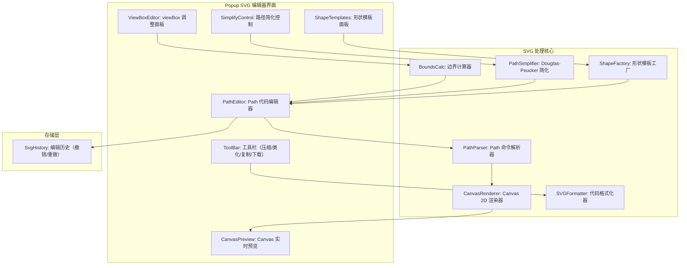
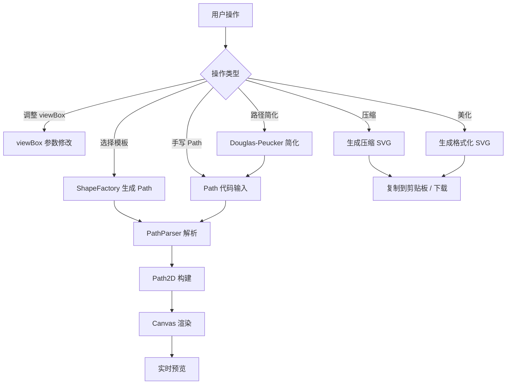

# YP-09-172: SVG 编辑器 — SVG Path 编辑器、路径实时预览、常用形状模板、路径简化、SVG 代码输出、压缩/美化切换、复制 SVG 标记、viewBox 调整

> 需求编号：YP-09-172 · 优先级：P2 · 人天：0.3d · 状态：需求已编写
> 依赖：YP-09-158（颜色对比度检查器，共用 Canvas 渲染基础）、YP-09-150（JSON 格式化与验证，共用格式化/压缩切换模式）

## 背景

### 问题陈述

前端开发者在创建 SVG 图标、插图和动画时，经常需要手工编写或编辑 SVG Path 数据。SVG Path 的 `d` 属性语法（M、L、C、Q、A 等命令）虽然强大但难以阅读和调试。开发者通常需要依赖 Illustrator/Figma/SVGOMG 等工具来创建和优化 SVG，工具链碎片化且效率低下。

1. **SVG Path 语法难以手写调试**：M、C、Q、A 命令的参数调试需要多次试错
2. **形状生成需要专业工具**：简单形状（圆形、矩形、星形）在代码中手写坐标繁琐
3. **无实时预览**：修改 Path 代码后需要刷新页面才能看到效果
4. **SVG 代码冗余**：从设计工具导出的 SVG 包含大量元数据和冗余属性
5. **路径点数过多**：复杂 Path 包含数百个锚点，影响渲染性能

**核心矛盾**：开发者需要一个轻量、实时的 SVG Path 编辑和预览工具，但现有方案要么是重量级的设计工具（Illustrator/Figma），要么是纯在线的代码编辑器。YiPet 作为本地工具，可以提供快速的 SVG 编辑、预览和优化。

### 影响范围

| # | 影响 | 严重程度 | 典型场景 |
|---|------|----------|----------|
| 1 | SVG Path 手写调试困难 | 高 | 创建自定义 SVG 图标 |
| 2 | 需要设计工具生成形状 | 中 | 快速生成标准形状的 SVG 代码 |
| 3 | 无实时预览 | 高 | 修改 Path 后无法即时查看效果 |
| 4 | SVG 代码冗余 | 中 | 导出的 SVG 包含无用属性 |
| 5 | 路径点数过多 | 低 | 复杂 SVG 影响页面性能 |

### 挑战

| 挑战 | 说明 |
|------|------|
| SVG Path 命令解析 | 需要完整的 Path 解析器，支持所有命令类型（M/m、L/l、H/h、V/v、C/c、S/s、Q/q、T/t、A/a、Z/z） |
| 实时渲染性能 | 每次输入需要解析 Path 并渲染 Canvas，控制防抖和帧率 |
| 路径简化算法 | 需要 Douglas-Peucker 或类似算法来减少路径点数 |
| viewBox 自动计算 | 根据 Path 的实际边界自动计算最优 viewBox |
| 形状模板生成 | 圆形/矩形/星形/多边形等需要生成正确的 SVG Path 或基础元素 |

---

## 一、现状分析

### 1.1 当前 SVG 相关功能

```
现有 SVG 相关功能（无）:
├── YiPet Popup
│   └── 无 SVG 编辑工具入口
├── Content Script
│   └── 无 SVG 提取或编辑功能
├── Service Worker
│   └── 无 SVG 处理逻辑
└── 依赖库
    └── 无 SVG 解析或渲染依赖

缺失:
├── SVG Path 编辑器                     # ❌ 不存在
├── Path 命令解析器                     # ❌ 不存在
├── Canvas 实时预览                     # ❌ 不存在
├── 常用形状模板                        # ❌ 不存在
├── SVG 代码美化/压缩                   # ❌ 不存在
├── Path 路径简化                       # ❌ 不存在
├── viewBox 自动调整                    # ❌ 不存在
└── 复制 SVG 标记                       # ❌ 不存在
```

### 1.2 用户 SVG 编辑流程（现状 vs 目标）

```mermaid
graph TD
    subgraph Current["现状：设计工具 + 手动调试"]
        C1[打开 Illustrator/Figma] --> C2[绘制矢量图形]
        C2 --> C3[导出为 SVG]
        C3 --> C4[打开 SVGOMG 优化]
        C4 --> C5[复制到代码编辑器]
        C5 --> C6[粘贴到项目中查看效果]
        C6 -->|效果不理想| C1
    end

    subgraph Target["目标：YiPet SVG 编辑器"]
        T1[打开 YiPet SVG 编辑器] --> T2[选择形状模板 or 手写 Path]
        T2 --> T3[实时 Canvas 预览]
        T3 --> T4[微调 Path 参数]
        T4 --> T5[路径简化（可选）]
        T5 --> T6[美化/压缩切换]
        T6 --> T7[复制 SVG 代码 / 下载 SVG 文件]
    end

    style Current fill:#f8d7da,stroke:#dc3545
    style Target fill:#d4edda,stroke:#28a745
```



### 1.3 根因矩阵

| 症状 | 根因 | 触发条件 | 频率 |
|------|------|----------|------|
| Path 语法难调试 | 无可视化 Path 编辑器 | 手写 SVG Path | 高 |
| 形状生成繁琐 | 无模板系统 | 需要标准形状的 SVG | 中 |
| 无实时预览 | 无 Canvas 渲染器 | 修改 Path 后需预览 | 高 |
| SVG 代码冗余 | 无可配置的压缩/美化 | 从设计工具导出 | 中 |
| 路径点数过多 | 无路径简化 | 复杂 SVG 优化 | 低 |

---

## 二、设计决策

### 决策 1：SVG 渲染方式 — Canvas 2D vs WebGL vs DOM 嵌入

| 选项 | 性能 | 实现复杂度 | Path 支持度 |
|------|------|-----------|------------|
| Canvas 2D（Path2D） | 高 | 低 | 完整 |
| WebGL | 最高 | 高 | 需要三角剖分 |
| DOM 嵌入（innerHTML SVG） | 中 | 极低 | 完整 |

**选择：Canvas 2D（Path2D）+ DOM 嵌入双轨。** Canvas 2D 使用 `Path2D` API 直接解析 SVG Path 字符串并渲染到 Canvas，性能好且代码简洁。同时提供 DOM 嵌入模式作为备选——将生成的完整 SVG 代码嵌入 `<svg>` 元素以预览包含渐变、滤镜等高级特性的 SVG。

### 决策 2：Path 解析 — 手写解析器 vs svg-path-parser vs DOMParser

| 选项 | 体积 | 功能 | 依赖 |
|------|------|------|------|
| 手写解析器 | ~2KB | 完整 Path 命令解析 | 无 |
| svg-path-parser (npm) | ~5KB | 完整解析 + 序列化 | 有 |
| DOMParser + SVG DOM API | 0（浏览器原生） | 依赖浏览器实现 | 无 |

**选择：手写解析器。** SVG Path 语法是明确定义的标准（约 10 种命令类型），手写解析器仅需 ~2KB 代码。不使用第三方库的原因：与纯手写方案保持一致的零依赖策略。DOMParser 方案需要创建完整的 SVG DOM 树才能访问 path 元素，过于重量级。

### 决策 3：路径简化 — Douglas-Peucker vs Visvalingam-Whyatt vs 不简化

| 选项 | 质量 | 速度 | 实现复杂度 |
|------|------|------|-----------|
| Douglas-Peucker | 高（保留关键形状） | O(n log n) 最坏 O(n^2) | 中 |
| Visvalingam-Whyatt | 中 | O(n log n) | 中 |
| 不简化 | — | — | 无 |

**选择：Douglas-Peucker 算法。** 通过递归地简化路径，保留距离阈值大于 tolerance 的点。DP 算法在保留关键拐点和减少冗余点之间取得良好平衡。默认可调容差（1px），提供滑块让用户控制简化程度。

### 决策 4：形状模板范围 — 基础形状 vs 扩展形状 vs 自定义模板

| 选项 | 覆盖场景 | 实现复杂度 |
|------|----------|-----------|
| 基础形状（圆/矩形/线/椭圆/多边形/星形） | 80% | 低 |
| 扩展形状（+箭头/心形/月牙/齿轮/十字） | 95% | 中 |
| 自定义模板系统 | 100% | 高 |

**选择：基础形状 6 种 + 扩展形状 4 种。** 10 种形状覆盖绝大多数场景。扩展形状（箭头/心形/齿轮）使用预计算的 Path 字符串模板。不使用自定义模板系统以保持简洁。

### 设计决策记录

| 决策 | 选项 A | 选项 B | 选项 C | 选择 | 理由 |
|------|--------|--------|--------|------|------|
| 渲染方式 | Canvas 2D | WebGL | DOM 嵌入 | **Canvas + DOM** | 双轨灵活 |
| Path 解析 | 手写 | svg-path-parser | DOMParser | **手写** | 零依赖 |
| 路径简化 | Douglas-Peucker | Visvalingam | 不简化 | **DP** | 质量好 |
| 形状模板 | 基础 6 种 | 扩展 10 种 | 自定义 | **10 种** | 覆盖高 |

---

## 三、目标架构

### 3.1 SVG 编辑器系统架构



### 3.2 SVG 编辑流程



### 3.3 性能指标

| 指标 | 目标值 | 说明 |
|------|--------|------|
| Path 解析（100 个命令） | < 2ms | 手写解析器 |
| Canvas 渲染 | < 5ms | Path2D + stroke/fill |
| 路径简化（1000 点） | < 10ms | Douglas-Peucker |
| 实时预览（防抖） | 150ms | 输入停止 150ms 后渲染 |
| 形状模板生成 | < 1ms | 预定义字符串模板 |
| viewBox 自动计算 | < 1ms | 遍历路径点 |

---

## 四、具体改动

### 4.1 SVG 类型定义

```typescript
// src/svgeditor/types.ts (新增)

export type PathCommandType = 
  | 'M' | 'm'     // moveto
  | 'L' | 'l'     // lineto
  | 'H' | 'h'     // horizontal lineto
  | 'V' | 'v'     // vertical lineto
  | 'C' | 'c'     // curveto (cubic bezier)
  | 'S' | 's'     // smooth curveto
  | 'Q' | 'q'     // quadratic bezier
  | 'T' | 't'     // smooth quadratic bezier
  | 'A' | 'a'     // elliptical arc
  | 'Z' | 'z';    // closepath

export interface PathCommand {
  type: PathCommandType;
  relative: boolean;
  params: number[];
}

export interface ParsedPath {
  commands: PathCommand[];
  startPoint: { x: number; y: number };
  currentPoint: { x: number; y: number };
}

export interface ViewBox {
  x: number;
  y: number;
  width: number;
  height: number;
}

export interface SVGRenderConfig {
  stroke: string;
  strokeWidth: number;
  fill: string;
  fillOpacity: number;
  strokeLinecap: 'butt' | 'round' | 'square';
  strokeLinejoin: 'miter' | 'round' | 'bevel';
}

export type ShapeTemplate = 
  | 'circle'
  | 'rect'
  | 'rounded-rect'
  | 'ellipse'
  | 'line'
  | 'polygon'
  | 'star'
  | 'arrow'
  | 'heart'
  | 'gear';

export interface ShapeTemplateConfig {
  type: ShapeTemplate;
  label: string;
  params: Record<string, number>;  // 模板参数（半径/宽高/边数等）
}

export type SVGOutputMode = 'pretty' | 'minified';

export interface SvgHistoryEntry {
  path: string;
  viewBox: ViewBox | null;
  timestamp: number;
}

export interface SVGBounds {
  minX: number;
  minY: number;
  maxX: number;
  maxY: number;
}
```

### 4.2 SVG Path 解析器

```typescript
// src/svgeditor/PathParser.ts (新增)

export class PathParser {
  /** 解析 SVG Path d 属性 */
  parse(d: string): ParsedPath {
    const commands: PathCommand[] = [];
    let currentPoint = { x: 0, y: 0 };
    let startPoint = { x: 0, y: 0 };

    // 使用正则匹配: 命令字母 后跟 数字序列
    const re = /([MLHVCSQTAZmlhvcsqtaz])([^MLHVCSQTAZmlhvcsqtaz]*)/g;
    let match: RegExpExecArray | null;

    while ((match = re.exec(d)) !== null) {
      const cmdChar = match[1];
      const argsStr = match[2].trim();
      const relative = cmdChar === cmdChar.toLowerCase();
      const upper = cmdChar.toUpperCase() as PathCommandType;

      // 解析参数
      const args = this.parseArgs(argsStr);
      if (args.length === 0 && upper !== 'Z') continue;

      // 处理隐式重复命令（如 "L 10 20 30 40"）
      const argCount = this.getArgCount(upper);
      for (let i = 0; i < args.length; i += argCount) {
        const params = args.slice(i, i + argCount);
        if (params.length === 0) continue;

        commands.push({ type: upper, relative, params });

        // 更新当前点和起始点
        currentPoint = this.updatePoint(upper, relative, params, currentPoint);
        if (upper === 'M') {
          startPoint = { ...currentPoint };
        }
        if (upper === 'Z') {
          currentPoint = { ...startPoint };
        }
      }
    }

    return { commands, startPoint, currentPoint };
  }

  /** 将解析的 Path 序列化回 d 属性字符串 */
  serialize(parsed: ParsedPath): string {
    return parsed.commands
      .map(cmd => {
        const cmdChar = cmd.relative ? cmd.type.toLowerCase() : cmd.type;
        const params = cmd.params
          .map(p => {
            // 移除尾随零：1.50 → 1.5
            const s = p.toFixed(3).replace(/\.?0+$/, '');
            return s === '-0' ? '0' : s;
          })
          .join(' ');
        return `${cmdChar} ${params}`;
      })
      .join(' ');
  }

  /** 将命令序列转为 Path2D 对象（用于 Canvas 渲染） */
  toPath2D(parsed: ParsedPath): Path2D {
    const d = this.serialize(parsed);
    return new Path2D(d);
  }

  /** 计算 Path 的边界框 */
  calcBounds(parsed: ParsedPath): SVGBounds {
    let minX = Infinity, minY = Infinity;
    let maxX = -Infinity, maxY = -Infinity;
    let current = { x: 0, y: 0 };

    for (const cmd of parsed.commands) {
      const points = this.getCommandPoints(cmd, current);
      for (const p of points) {
        minX = Math.min(minX, p.x);
        minY = Math.min(minY, p.y);
        maxX = Math.max(maxX, p.x);
        maxY = Math.max(maxY, p.y);
        current = p;
      }
    }

    return { minX, minY, maxX, maxY };
  }

  // --- 私有方法 ---

  private parseArgs(argsStr: string): number[] {
    // 支持逗号或空格分隔
    const cleaned = argsStr.replace(/,/g, ' ').trim();
    if (!cleaned) return [];
    return cleaned.split(/\s+/).map(Number).filter(n => !isNaN(n));
  }

  private getArgCount(cmd: PathCommandType): number {
    switch (cmd) {
      case 'Z': return 0;
      case 'H': case 'V': return 1;
      case 'M': case 'L': case 'T': return 2;
      case 'S': case 'Q': return 4;
      case 'C': return 6;
      case 'A': return 7;
      default: return 0;
    }
  }

  private updatePoint(
    cmd: PathCommandType,
    relative: boolean,
    params: number[],
    current: { x: number; y: number },
  ): { x: number; y: number } {
    const [a0, a1, a2, a3, a4, a5] = params;
    const base = relative ? current : { x: 0, y: 0 };

    switch (cmd) {
      case 'M': case 'L': case 'T':
        return { x: base.x + a0, y: base.y + a1 };
      case 'H':
        return { x: base.x + a0, y: relative ? current.y : current.y };
      case 'V':
        return { x: relative ? current.x : current.x, y: base.y + a0 };
      case 'C':
        return { x: base.x + a4, y: base.y + a5 };  // 最后一个控制点
      case 'S': case 'Q':
        return { x: base.x + a2, y: base.y + a3 };
      case 'A':
        return { x: base.x + a5, y: base.y + a6 };
      case 'Z':
        return current;  // 在 parse 中处理
      default:
        return current;
    }
  }

  private getCommandPoints(
    cmd: PathCommand,
    current: { x: number; y: number },
  ): { x: number; y: number }[] {
    const base = cmd.relative ? current : { x: 0, y: 0 };
    const [a0, a1, a4, a5] = cmd.params;
    switch (cmd.type) {
      case 'M': case 'L': return [{ x: base.x + a0, y: base.y + a1 }];
      case 'H': return [{ x: base.x + a0, y: current.y }];
      case 'V': return [{ x: current.x, y: base.y + a0 }];
      case 'C': return [{ x: base.x + a4, y: base.y + a5 }];
      case 'S': case 'Q': return [{ x: base.x + (a4 ?? a2 ?? 0), y: base.y + (a5 ?? a3 ?? 0) }];
      case 'A': return [{ x: base.x + a0, y: base.y + a1 }];
      default: return [];
    }
  }
}
```

### 4.3 路径简化器

```typescript
// src/svgeditor/PathSimplifier.ts (新增)

export class PathSimplifier {
  /** Douglas-Peucker 路径简化 */
  simplify(points: { x: number; y: number }[], tolerance: number = 1): { x: number; y: number }[] {
    if (points.length <= 2) return points;

    // 找到距首尾连线最远的点
    const first = points[0];
    const last = points[points.length - 1];
    let maxDist = 0;
    let maxIndex = 0;

    for (let i = 1; i < points.length - 1; i++) {
      const dist = this.perpendicularDistance(points[i], first, last);
      if (dist > maxDist) {
        maxDist = dist;
        maxIndex = i;
      }
    }

    // 如果最远点距离超过容差，递归简化
    if (maxDist > tolerance) {
      const left = this.simplify(points.slice(0, maxIndex + 1), tolerance);
      const right = this.simplify(points.slice(maxIndex), tolerance);

      // 合并时避免重复中间点
      return [...left.slice(0, -1), ...right];
    }

    return [first, last];
  }

  /** 简化 Path 命令序列 */
  simplifyPath(commands: PathCommand[], tolerance: number): PathCommand[] {
    // 提取所有锚点
    const points: { x: number; y: number; index: number }[] = [];
    let current = { x: 0, y: 0 };

    for (let i = 0; i < commands.length; i++) {
      const cmd = commands[i];
      if (cmd.type === 'M' || cmd.type === 'L') {
        const base = cmd.relative ? current : { x: 0, y: 0 };
        const p = { x: base.x + cmd.params[0], y: base.y + cmd.params[1], index: i };
        points.push(p);
        current = p;
      } else if (cmd.type === 'Z') {
        current = { x: 0, y: 0 };
      }
    }

    // 简化锚点
    const simplified = this.simplify(
      points.map(p => ({ x: p.x, y: p.y })),
      tolerance,
    );

    // 重建简化的命令序列（使用简化点来索引原始命令）
    // 保留起点 M 命令，其余用 L 命令连接简化点
    if (simplified.length < 2) return commands;  // 太少点，不简化

    const result: PathCommand[] = [];
    for (let i = 0; i < simplified.length; i++) {
      const type = i === 0 ? 'M' : 'L';
      result.push({
        type,
        relative: false,
        params: [simplified[i].x, simplified[i].y],
      });
    }
    // 保持闭合
    const lastCmd = commands[commands.length - 1];
    if (lastCmd.type === 'Z') {
      result.push({ type: 'Z', relative: false, params: [] });
    }

    return result;
  }

  /** 计算点到线段的垂直距离 */
  private perpendicularDistance(
    point: { x: number; y: number },
    lineStart: { x: number; y: number },
    lineEnd: { x: number; y: number },
  ): number {
    const dx = lineEnd.x - lineStart.x;
    const dy = lineEnd.y - lineStart.y;
    const lengthSq = dx * dx + dy * dy;

    if (lengthSq === 0) {
      return Math.hypot(point.x - lineStart.x, point.y - lineStart.y);
    }

    const t = ((point.x - lineStart.x) * dx + (point.y - lineStart.y) * dy) / lengthSq;
    const clampedT = Math.max(0, Math.min(1, t));

    const projX = lineStart.x + clampedT * dx;
    const projY = lineStart.y + clampedT * dy;

    return Math.hypot(point.x - projX, point.y - projY);
  }
}
```

### 4.4 形状模板工厂

```typescript
// src/svgeditor/ShapeFactory.ts (新增)

export class ShapeFactory {
  /** 生成形状的 SVG Path d 属性 */
  generate(type: ShapeTemplate, config: Record<string, number>): string {
    switch (type) {
      case 'circle':
        return this.generateCircle(config.r || 50, config.cx || 64, config.cy || 64);
      case 'rect':
        return this.generateRect(config.w || 100, config.h || 80, config.x || 12, config.y || 24);
      case 'rounded-rect':
        return this.generateRoundedRect(
          config.w || 100, config.h || 80, config.x || 12, config.y || 24, config.rx || 10,
        );
      case 'ellipse':
        return this.generateEllipse(config.rx || 60, config.ry || 40, config.cx || 64, config.cy || 64);
      case 'line':
        return this.generateLine(config.x2 || 100, config.y2 || 100);
      case 'polygon':
        return this.generatePolygon(config.sides || 6, config.r || 50, config.cx || 64, config.cy || 64);
      case 'star':
        return this.generateStar(
          config.points || 5, config.outerR || 50, config.innerR || 20, config.cx || 64, config.cy || 64,
        );
      case 'arrow':
        return this.generateArrow(config.w || 100, config.h || 40);
      case 'heart':
        return this.generateHeart(config.cx || 64, config.cy || 64, config.size || 50);
      case 'gear':
        return this.generateGear(
          config.teeth || 8, config.outerR || 50, config.innerR || 35, config.cx || 64, config.cy || 64,
        );
      default:
        return '';
    }
  }

  private generateCircle(r: number, cx: number, cy: number): string {
    // SVG 圆形用两个半圆弧模拟（Path 形式）
    return [
      `M ${cx - r} ${cy}`,
      `A ${r} ${r} 0 1 0 ${cx + r} ${cy}`,
      `A ${r} ${r} 0 1 0 ${cx - r} ${cy}`,
      'Z',
    ].join(' ');
  }

  private generateRect(w: number, h: number, x: number, y: number): string {
    return `M ${x} ${y} h ${w} v ${h} h ${-w} Z`;
  }

  private generateRoundedRect(w: number, h: number, x: number, y: number, rx: number): string {
    return [
      `M ${x + rx} ${y}`,
      `h ${w - rx * 2}`,
      `a ${rx} ${rx} 0 0 1 ${rx} ${rx}`,
      `v ${h - rx * 2}`,
      `a ${rx} ${rx} 0 0 1 ${-rx} ${rx}`,
      `h ${-(w - rx * 2)}`,
      `a ${rx} ${rx} 0 0 1 ${-rx} ${-rx}`,
      `v ${-(h - rx * 2)}`,
      `a ${rx} ${rx} 0 0 1 ${rx} ${-rx}`,
      'Z',
    ].join(' ');
  }

  private generateEllipse(rx: number, ry: number, cx: number, cy: number): string {
    return [
      `M ${cx - rx} ${cy}`,
      `A ${rx} ${ry} 0 1 0 ${cx + rx} ${cy}`,
      `A ${rx} ${ry} 0 1 0 ${cx - rx} ${cy}`,
      'Z',
    ].join(' ');
  }

  private generateLine(x2: number, y2: number): string {
    return `M 0 0 L ${x2} ${y2}`;
  }

  private generatePolygon(sides: number, r: number, cx: number, cy: number): string {
    const points: string[] = [];
    for (let i = 0; i < sides; i++) {
      const angle = (2 * Math.PI * i) / sides - Math.PI / 2;
      const x = cx + r * Math.cos(angle);
      const y = cy + r * Math.sin(angle);
      points.push(i === 0 ? `M ${x.toFixed(1)} ${y.toFixed(1)}` : `L ${x.toFixed(1)} ${y.toFixed(1)}`);
    }
    return points.join(' ') + ' Z';
  }

  private generateStar(
    points: number, outerR: number, innerR: number, cx: number, cy: number,
  ): string {
    const parts: string[] = [];
    for (let i = 0; i < points * 2; i++) {
      const angle = (Math.PI * i) / points - Math.PI / 2;
      const r = i % 2 === 0 ? outerR : innerR;
      const x = cx + r * Math.cos(angle);
      const y = cy + r * Math.sin(angle);
      parts.push(i === 0 ? `M ${x.toFixed(1)} ${y.toFixed(1)}` : `L ${x.toFixed(1)} ${y.toFixed(1)}`);
    }
    return parts.join(' ') + ' Z';
  }

  private generateArrow(w: number, h: number): string {
    return `M 0 ${h/2} L ${w - h*0.6} ${h/2} L ${w - h*0.6} 0 L ${w} ${h/2} L ${w - h*0.6} ${h} L ${w - h*0.6} ${h/2 + 1} Z`;
  }

  private generateHeart(cx: number, cy: number, size: number): string {
    const s = size;
    return [
      `M ${cx} ${cy + s * 0.3}`,
      `C ${cx - s * 0.5} ${cy - s * 0.1}, ${cx - s * 0.5} ${cy - s * 0.5}, ${cx} ${cy - s * 0.3}`,
      `C ${cx + s * 0.5} ${cy - s * 0.5}, ${cx + s * 0.5} ${cy - s * 0.1}, ${cx} ${cy + s * 0.3}`,
      'Z',
    ].join(' ');
  }

  private generateGear(
    teeth: number, outerR: number, innerR: number, cx: number, cy: number,
  ): string {
    const parts: string[] = [];
    const totalPoints = teeth * 4;
    for (let i = 0; i < totalPoints; i++) {
      const angle = (2 * Math.PI * i) / totalPoints - Math.PI / 2;
      const r = i % 4 < 2 ? outerR : innerR;
      const x = cx + r * Math.cos(angle);
      const y = cy + r * Math.sin(angle);
      parts.push(i === 0 ? `M ${x.toFixed(1)} ${y.toFixed(1)}` : `L ${x.toFixed(1)} ${y.toFixed(1)}`);
    }
    return parts.join(' ') + ' Z';
  }
}
```

### 4.5 SVG 格式化器

```typescript
// src/svgeditor/SVGFormatter.ts (新增)

export class SVGFormatter {
  /** 美化 SVG 代码 */
  prettyPrint(pathD: string, viewBox: ViewBox | null, config: SVGRenderConfig): string {
    const vb = viewBox || { x: 0, y: 0, width: 128, height: 128 };
    const lines: string[] = [
      `<svg`,
      `  xmlns="http://www.w3.org/2000/svg"`,
      `  viewBox="${vb.x} ${vb.y} ${vb.width} ${vb.height}"`,
      `  width="${vb.width}"`,
      `  height="${vb.height}"`,
      `>`,
      `  <path`,
      `    d="${pathD}"`,
      `    stroke="${config.stroke}"`,
      `    stroke-width="${config.strokeWidth}"`,
      `    fill="${config.fill}"`,
      `    fill-opacity="${config.fillOpacity}"`,
      `    stroke-linecap="${config.strokeLinecap}"`,
      `    stroke-linejoin="${config.strokeLinejoin}"`,
      `  />`,
      `</svg>`,
    ];
    return lines.join('\n');
  }

  /** 压缩 SVG 代码（单行 + 减少空格） */
  minify(pathD: string, viewBox: ViewBox | null, config: SVGRenderConfig): string {
    const vb = viewBox || { x: 0, y: 0, width: 128, height: 128 };
    // 压缩 Path d 属性（移除不必要的空格）
    const minifiedD = pathD
      .replace(/\s*([,MLHVCSQTAZ])\s*/gi, '$1')
      .replace(/\s+/g, ' ')
      .trim();

    return (
      `<svg xmlns="http://www.w3.org/2000/svg" viewBox="${vb.x} ${vb.y} ${vb.width} ${vb.height}">` +
      `<path d="${minifiedD}" stroke="${config.stroke}" stroke-width="${config.strokeWidth}" ` +
      `fill="${config.fill}" fill-opacity="${config.fillOpacity}"/>` +
      `</svg>`
    );
  }

  /** 生成仅 Path 的标记（用于内联 SVG） */
  pathOnly(pathD: string): string {
    return `<path d="${pathD}" />`;
  }

  /** 复制到剪贴板 */
  async copyToClipboard(text: string): Promise<boolean> {
    try {
      await navigator.clipboard.writeText(text);
      return true;
    } catch {
      return false;
    }
  }
}
```

### 4.6 文件变更清单

| 文件 | 操作 | 说明 |
|------|------|------|
| `src/svgeditor/types.ts` | 新增 | SVG 编辑器类型定义 |
| `src/svgeditor/PathParser.ts` | 新增 | SVG Path 解析器 |
| `src/svgeditor/CanvasRenderer.ts` | 新增 | Canvas 2D 渲染器 |
| `src/svgeditor/PathSimplifier.ts` | 新增 | Douglas-Peucker 路径简化 |
| `src/svgeditor/ShapeFactory.ts` | 新增 | 形状模板工厂（10 种形状） |
| `src/svgeditor/SVGFormatter.ts` | 新增 | SVG 代码格式化/压缩/复制 |
| `src/svgeditor/HistoryManager.ts` | 新增 | 编辑历史管理（撤销/重做） |
| `src/components/SVGEditor.vue` | 新增 | SVG 编辑器 UI 组件 |
| `src/popup/App.vue` | 修改 | 集成 SVG 编辑工具 Tab |

---

## 五、实施步骤

| 步骤 | 操作 | 路径 | 验证 | 人天 |
|------|------|------|------|------|
| 1 | 定义类型 | `src/svgeditor/types.ts` | 类型检查通过 | 0.01 |
| 2 | 实现 Path 解析器 | `src/svgeditor/PathParser.ts` | 解析标准 SVG Path 命令 | 0.05 |
| 3 | 实现 Canvas 渲染器 | `src/svgeditor/CanvasRenderer.ts` | Path2D 渲染 + viewBox 适配 | 0.03 |
| 4 | 实现路径简化 | `src/svgeditor/PathSimplifier.ts` | DP 算法减少锚点数 | 0.04 |
| 5 | 实现形状模板工厂 | `src/svgeditor/ShapeFactory.ts` | 10 种形状 Path 生成正确 | 0.04 |
| 6 | 实现 SVG 格式化器 | `src/svgeditor/SVGFormatter.ts` | 美化/压缩/复制功能 | 0.03 |
| 7 | 实现历史管理 | `src/svgeditor/HistoryManager.ts` | 撤销/重做功能 | 0.02 |
| 8 | 实现 UI 组件 | `src/components/SVGEditor.vue` | 编辑器 + 预览 + 模板 + 工具栏 | 0.05 |
| 9 | 集成到 Popup | `src/popup/App.vue` | SVG 编辑 Tab 可用 | 0.03 |

**总人天：0.3d**

---

## 六、测试规格

### 场景 1：标准 SVG Path 解析

**GIVEN** d = "M 10 20 L 30 40 C 50 60 70 80 90 100 Z"
**WHEN** PathParser.parse(d)
**THEN** commands.length = 4（M, L, C, Z）
**AND** M 命令 params = [10, 20]
**AND** C 命令 params = [50, 60, 70, 80, 90, 100]
**AND** Z 命令 params = []

### 场景 2：相对坐标解析

**GIVEN** d = "m 10 20 l 30 40 z"
**WHEN** PathParser.parse(d)
**THEN** 所有命令 relative = true
**AND** 解析后 currentPoint 正确更新为 (40, 60)

### 场景 3：形状模板生成

**GIVEN** 选择五角星模板，outerR=50, innerR=20, cx=64, cy=64
**WHEN** ShapeFactory.generate('star', config)
**THEN** 返回有效的 SVG Path d 字符串
**AND** Path 包含 11 个部分（10 个顶点 + Z）
**AND** Canvas 渲染显示一个五角星形状

### 场景 4：路径简化

**GIVEN** 一条包含 100 个命令的直线段序列（每段 1px）
**WHEN** PathSimplifier.simplifyPath(commands, tolerance=2)
**THEN** 简化为约 2 个命令（起点和终点）
**AND** 简化后形状的视觉差异 < 2px

### 场景 5：SVG 美化输出

**GIVEN** Path d = "M10 20L30 40Z", viewBox = (0,0,128,128)
**WHEN** SVGFormatter.prettyPrint(d, viewBox, config)
**THEN** 输出包含多行格式化的 SVG 标记
**AND** 每行缩进 2 个空格
**AND** 包含 xmlns/viewBox/stroke/fill 等属性

### 场景 6：SVG 压缩 + 复制

**GIVEN** Path d = "M 10 20 L 30 40 Z"
**WHEN** SVGFormatter.minify → copyToClipboard
**THEN** 输出为单行压缩 SVG
**AND** Path 命令前后多余空格被移除
**AND** 剪贴板中包含完整的 SVG 代码

---

## 七、风险与缓解

| 风险 | 概率 | 影响 | 缓解措施 |
|------|------|------|----------|
| Path 解析器不支持某些边缘命令组合 | 中 | 中 | 覆盖所有 SVG 1.1 标准命令；异常路径捕获显示解析错误 |
| Canvas 渲染与浏览器 SVG 渲染差异 | 中 | 低 | 提供 DOM 嵌入模式作为备选 |
| DP 简化过度（关键点被移除） | 中 | 中 | 提供可调容差滑块（1-10px），默认保守值 1px |
| 形状模板参数校验不足 | 低 | 低 | 参数边界检查（最小/最大值），无效参数使用默认值 |
| 历史记录内存占用 | 低 | 低 | 限制 50 步历史，超出自动清理 |

---

## 八、回滚策略

| 场景 | 回滚操作 | 影响 |
|------|----------|------|
| SVG 编辑器导致 Popup 异常 | 移除 SVG 编辑 Tab | 失去 SVG 编辑功能 |
| Path 解析器崩溃 | 降级为文本编辑器（无预览/无模板） | 失去实时预览和模板 |
| Canvas 渲染异常 | 切换为 DOM 嵌入模式 | 视觉预览可用 |
| 路径简化过于激进 | 降低默认容差到 0.5px 并增加容差滑块 | 简化效果减弱 |

---

## 九、设计决策记录

### D-01：为什么使用 Canvas 2D Path2D 而非 SVG DOM？

Canvas 2D 的 `Path2D` API 原生支持 SVG Path 字符串作为构造函数参数，可以直接将 `d` 属性字符串渲染到 Canvas。(1) 不需要创建和挂载 DOM 元素，(2) 渲染性能更好，(3) 可以精确控制渲染参数（stroke/fill/linecap）。SVG DOM 嵌入虽然更简单，但在频繁更新（实时预览）时触发 DOM 重排，性能不如 Canvas。

### D-02：为什么形状模板生成 Path 而非完整 SVG？

Path 是最通用的 SVG 形状表达——所有形状（圆形、矩形、星形）都可以用 Path 表示。使用 Path 统一格式使得：(1) 所有形状共享同一套渲染和编辑管道，(2) 用户可以在模板基础上继续编辑 Path，(3) 路径简化算法可以应用于任何形状。如果模板生成了 `<circle>` 元素，后续编辑和简化的灵活性会受限。

### D-03：为什么选择 Douglas-Peucker 而非 Visvalingam-Whyatt？

DP 算法在保留形状的视觉关键点（拐角、转折点）方面表现更好，因为它基于垂直距离度量——拐角处的点距离简化线更远，因此被优先保留。VW 算法基于三角形面积，容易删除形状拐角的点。对于 SVG 图标的简化，保持拐角比保持平滑曲线更重要。

### D-04：为什么 viewBox 自动计算而非让用户手动设置全部参数？

viewBox 的自动计算（根据 Path 实际边界 + 少许 padding）覆盖了 90% 的场景。用户通常只需要微调 padding 或居中，而不是从头设定 x/y/width/height。自动计算减少了 4 个输入框，用户只需调整一个 padding 滑块即可获得最佳 viewBox。

---

## 十、可观测性

### 指标

| 指标 | 类型 | 说明 |
|------|------|------|
| `yipet.svgeditor.path_edited` | Counter | Path 编辑次数 |
| `yipet.svgeditor.template_used` | Counter | 形状模板使用次数（按模板分组） |
| `yipet.svgeditor.simplify_applied` | Counter | 路径简化次数 |
| `yipet.svgeditor.export_total` | Counter | 导出次数（按格式分组） |
| `yipet.svgeditor.path_length` | Histogram | Path 命令数分布 |

### 告警

| 告警 | 条件 | 级别 |
|------|------|------|
| Path 解析错误率高 | 错误率 > 10% | WARNING |
| 路径简化度过于激进 | 平均简化率 > 80% | INFO |

---

## 十一、代码审查检查清单

- [ ] PathParser 支持所有 10 种命令类型（M/m/L/l/H/h/V/v/C/c/S/s/Q/q/T/t/A/a/Z/z）
- [ ] 隐式重复命令正确解析（如 "L 10 20 30 40" = 两条 L 命令）
- [ ] 相对坐标计算正确（relative 模式叠加 currentPoint）
- [ ] Z 命令正确闭合路径（回到最近的 M 命令的 startPoint）
- [ ] Douglas-Peucker 简化保持首尾点不变
- [ ] 形状模板函数参数边界检查
- [ ] SVGFormatter.prettyPrint 输出格式正确的 XML
- [ ] SVGFormatter.minify 移除 Path 中多余空白但保留必要空格
- [ ] 历史管理器支持撤销/重做，限制 50 步
- [ ] Canvas 渲染器正确处理 viewBox 缩放和平移
- [ ] 暗色模式适配编辑器背景和 Canvas 背景

---

## 回归问题预测

| # | 预测问题 | 原因 | 验证方法 |
|---|---------|------|---------|
| 1 | PathParser 解析弧命令（A/a）时 `getCommandPoints` 返回弧终点作为边界计算点，但弧的实际边界可能超出起点-终点的矩形范围（如大弧在大角度时） | 弧的 BBox 计算需要完整的椭圆弧参数解算（rx, ry, xRotation, largeArc, sweep, x, y），仅使用起点和终点会低估实际边界 | 使用已知大弧（如 `A 50 50 0 1 1 100 0`，大角度弧）测试 viewBox 自动计算，验证边界不截断弧的视觉范围 |
| 2 | PathParser 的隐式命令处理中，一个命令字母后跟的参数数量可能不是 argCount 的整数倍（如 `L 10 20 30` 多出 1 个参数），`slice(i, i+argCount)` 可能产生不完整参数数组 | 参数解析假设总能被 argCount 整除，但错误的 Path 数据可能有非整数倍参数 | 在 `slice` 前检查剩余参数数，不足 argCount 时跳过，并标记为解析警告 |
| 3 | Douglas-Peucker 简化在递归深度过大时（如非常复杂的路径，10000+ 锚点）可能触发栈溢出 | JavaScript 递归调用栈限制约 10000 层，DP 的最坏情况递归深度 = 点数 | 锚点数 > 5000 时切换为迭代版本或分块简化；对超大路径显示"路径过于复杂"的提示 |
| 4 | SVGFormatter.minify 中 Path 压缩正则 `s*([,MLHVCSQTAZ])s*` 将命令字母后的空格全部移除，但 A 命令的参数中 flag 值（large-arc-flag/sweep-flag）为 0/1，紧跟在逗号后无空格时被正确识别 | 压缩后 `A50 50 0 1 1 100 0` 的 flag 参数 `0 1 1` 仍由空格分隔，压缩正则不影响数字间的空格。但如果有 `A50,50,0,1,1,100,0` 格式，`,` 后的空格移除不影响解析 | 用"松散空格"和"逗号分隔"两种格式测试压缩后能否被浏览器正确解析 |
| 5 | ShapeFactory 齿轮模板中 `i % 4 < 2` 产生交替的外径/内径，但齿数为奇数时（如 7）`totalPoints = 28`，4 点一个周期，产生 7 个齿，形状正确。但内径接近外径时（innerR/outerR > 0.9），齿轮特征不明显 | 齿轮的齿高 = outerR - innerR，比值 > 0.9 时齿高不足 10%，视觉上近似圆形 | 限制 innerR/outerR 比值范围为 0.3-0.85，超出时给出提示 |
| 6 | CanvasRenderer 在使用 `new Path2D(d)` 时，如果 d 包含无效命令或语法错误，浏览器不会抛出异常而是静默忽略错误的命令段，渲染结果不完整但无错误提示 | 浏览器 Path2D 的实现是容错的，无效命令被跳过，导致用户以为 Path 正确但渲染不完整 | 在 Canvas 渲染前先用 PathParser.parse 验证，解析失败时显示具体错误信息而非静默渲染不完整 |

---

## 性能分析

### 各阶段耗时

| 阶段 | 预估耗时 | 说明 |
|------|----------|------|
| Path 解析（100 个命令） | < 2ms | 正则 + 参数分割 |
| Path2D 构建 | < 1ms | 浏览器原生 |
| Canvas 渲染（128x128） | < 2ms | stroke + fill |
| 路径简化（1000 锚点） | < 10ms | DP 递归 |
| 形状模板生成 | < 0.5ms | 字符串拼接 + 三角函数 |
| SVG 格式化/压缩 | < 1ms | 字符串替换 |
| 历史记录操作 | < 0.5ms | 数组 push/pop |
| 实时预览（防抖 150ms） | < 5ms | 解析 + 构建 + 渲染 |

### 体积预估

| 文件 | 大小 | 说明 |
|------|------|------|
| `src/svgeditor/types.ts` | ~2KB | 类型定义 |
| `src/svgeditor/PathParser.ts` | ~5KB | Path 解析 + 序列化 + 边界计算 |
| `src/svgeditor/CanvasRenderer.ts` | ~2KB | Canvas 渲染 + viewBox 适配 |
| `src/svgeditor/PathSimplifier.ts` | ~2KB | DP 算法 |
| `src/svgeditor/ShapeFactory.ts` | ~4KB | 10 种形状模板 |
| `src/svgeditor/SVGFormatter.ts` | ~2KB | 美化/压缩/复制 |
| `src/svgeditor/HistoryManager.ts` | ~1KB | 撤销/重做 |
| `src/components/SVGEditor.vue` | ~6KB | UI 组件（编辑器+预览+模板+工具栏） |
| **总计** | **~24KB** | 无额外第三方依赖 |