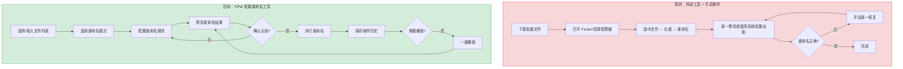
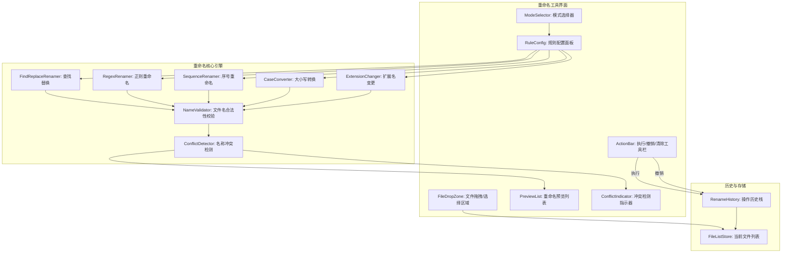
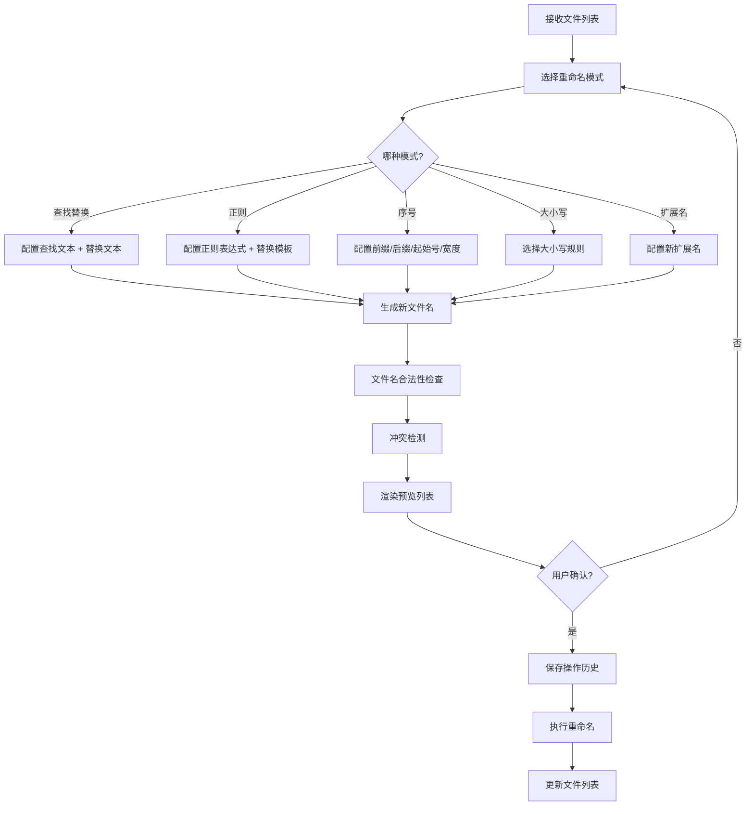

# YP-09-172: 文件重命名工具 — 模式批量重命名（查找替换/正则/序号）、重命名前预览、撤销支持、扩展名变更、大小写转换、元数据重命名

> 需求编号：YP-09-172 · 优先级：P2 · 人天：0.2d · 状态：需求已编写
> 依赖：无硬依赖（工具独立运行，无需后端）

## 背景

### 问题陈述

开发者、设计师和日常用户在浏览器中下载或处理文件时，经常需要对批量文件执行重命名操作——统一格式、添加序号前缀、替换文件名中的特定字符串、转换大小写等。当前，这些操作需要切换到操作系统的文件管理器或安装专门的批量重命名软件，打断了浏览器中的工作流。

1. **批量重命名需要切换工具**：下载多张图片 `IMG_001.jpg` 到 `IMG_050.jpg`，想改为 `photo-01.jpg` 到 `photo-50.jpg`，需要离开浏览器
2. **查找替换操作繁琐**：文件名中包含"草稿"、"副本"等字样的文件，需要一个一个手动修改
3. **正则表达式重命名门槛高**：高级用户想用正则批量处理但缺少便捷工具
4. **重命名错误无法撤销**：批量重命名出错后需要手动逐一恢复，耗时且容易遗漏
5. **扩展名批量变更**：将 `.jpeg` 统一改为 `.jpg` 或 `.png` 改为 `.webp`

**核心矛盾**：浏览器是文件操作的上游入口（下载、上传），但缺少内置的批量文件重命名能力。YiPet 作为浏览器扩展，可以在文件落地前（或用户主动使用时）提供轻量级的批量重命名工具。

### 影响范围

| # | 影响 | 严重程度 | 典型场景 |
|---|------|----------|----------|
| 1 | 批量重命名需要外部工具 | 高 | 下载 50 张产品图片后统一命名 |
| 2 | 查找替换效率低 | 高 | 文件名中"副本"改为"final" |
| 3 | 序号命名手动操作多 | 中 | 给截图按顺序编号 |
| 4 | 重命名错误不可逆 | 高 | 批量替换出错后逐一手动恢复 |
| 5 | 大小写不统一 | 低 | 团队规范要求文件名全小写 |

### 挑战

| 挑战 | 说明 |
|------|------|
| 正则表达式安全性 | 用户输入的正则需要安全执行，防止 ReDoS 攻击或无限回溯 |
| 文件名冲突检测 | 重命名后多个文件可能产生相同名称，需要检测并提示 |
| 撤销机制设计 | 批量重命名后需要能完整恢复原名，操作历史必须持久化 |
| 序号格式化 | 支持固定宽度序号（001, 002...）vs 紧凑序号（1, 2...），从任意起始数字开始 |
| 跨平台文件名合法性 | Windows/macOS/Linux 对文件名中非法字符（`< > : " / \ | ? *`）的规定不同，需要验证 |

---

## 一、现状分析

### 1.1 当前文件重命名能力

```
现有文件相关功能:
├── YiPet Popup
│   ├── 无文件管理功能
│   └── 无重命名工具入口
├── YiPet 浏览器能力
│   ├── 文件下载拦截（理论可行，未实现）
│   └── 文件系统访问 API（有限浏览器支持）
├── 外部工具
│   ├── macOS Finder 重命名（系统自带，支持基础批量）
│   ├── Windows PowerRename（PowerToys）
│   └── 命令行 rename/sed

缺失:
├── 批量重命名预览                         # ❌ 不存在
├── 查找替换（文本 + 正则）重命名           # ❌ 不存在
├── 序号批量命名                          # ❌ 不存在
├── 重命名撤销                            # ❌ 不存在
├── 扩展名批量变更                         # ❌ 不存在
├── 大小写批量转换                         # ❌ 不存在
└── 文件名合法性校验                        # ❌ 不存在
```

### 1.2 用户重命名工作流（现状 vs 目标）



### 1.3 根因矩阵

| 症状 | 根因 | 触发条件 | 频率 |
|------|------|----------|------|
| 无批量重命名 | YiPet 未实现文件重命名功能 | 需要批量重命名文件 | 高 |
| 无预览机制 | 未实现重命名规则预览引擎 | 执行批量操作前确认 | 高 |
| 无撤销能力 | 未存储重命名操作历史 | 重命名出错后恢复 | 中 |
| 无扩展名批量变更 | 未实现扩展名独立处理 | 统一文件格式 | 中 |
| 无文件名合法性校验 | 未实现跨平台非法字符检查 | 输入的新文件名可能非法 | 中 |

---

## 二、设计决策

### 决策 1：文件来源 — File System Access API vs 拖拽/选择 vs 下载拦截

| 选项 | 浏览器支持 | 能力 | 实现复杂度 |
|------|-----------|------|-----------|
| File System Access API | Chrome 86+ | 读写本地文件 | 中 |
| 拖拽/文件选择器 | 所有浏览器 | 仅读取文件信息 | 低 |
| 下载拦截（chrome.downloads）| 仅 MV3 Service Worker | 拦截下载并重命名 | 高 |

**选择：拖拽/文件选择器为主，下载拦截为增强。** 文件重命名工具的核心场景是用户主动批量处理文件。拖拽/选择模式实现简单、兼容性好。下载拦截作为高级场景——用户在下载前自动弹出重命名面板——依赖 `chrome.downloads.onDeterminingFilename` 事件，在 MV3 中该事件仍在 Service Worker 中可用，但需要异步处理重命名规则确认。

### 决策 2：重命名模式 — 基础 3 种 vs 基础 5 种 vs 全模式

| 选项 | 覆盖场景 | 实现复杂度 |
|------|----------|-----------|
| 3 种（查找替换/序号/大小写）| 覆盖 80% 场景 | 低 |
| 5 种（+ 正则/扩展名变更）| 覆盖 95% 场景 | 中 |
| 全模式（+ 元数据/自定义脚本）| 覆盖 99% 场景 | 高 |

**选择：5 种核心模式。** 查找替换、正则表达式、序号编号、大小写转换、扩展名变更。这 5 种模式覆盖了文件重命名的绝大多数使用场景。元数据重命名（基于 EXIF 日期等）作为后续迭代，自定义脚本模式过于复杂且安全风险高。

### 决策 3：撤销机制 — 操作栈 vs 快照 vs 仅最后一次

| 选项 | 可撤销范围 | 存储开销 | 实现复杂度 |
|------|-----------|---------|-----------|
| 操作栈（无限历史） | 任意历史状态 | 中（存储所有变更） | 中 |
| 快照（单次快照） | 仅恢复到快照前 | 低 | 低 |
| 仅最后一次操作 | 仅撤销最近一次 | 极低 | 低 |

**选择：操作栈（限制 50 条历史）。** 文件重命名的数据量很小（旧名+新名字符串对），50 次操作的历史记录占用极少存储空间（< 100KB）。操作栈允许用户在多次重命名后仍能恢复原始文件名，大幅提升工具的可用性和安全感。

### 决策 4：序号格式化 — 固定宽度 vs 紧凑 vs 自定义模板

| 选项 | 灵活性 | 实现复杂度 |
|------|--------|-----------|
| 固定宽度（前导零，如 001） | 低 | 低 |
| 紧凑模式（无前导零，如 1）| 低 | 低 |
| 自定义模板（如 `IMG_{N:03d}_{date}`）| 高 | 高 |

**选择：固定宽度 + 紧凑模式 + 自定义分隔符。** 核心是序号宽度（1-6 位前导零）和起始序号，加上可选的前缀、后缀文本。模板引擎过于复杂且使用场景有限。分隔符（`-`, `_`, `.`, 空格）提供足够的定制能力。

### 设计决策总结

| 决策 | 选项 A | 选项 B | 选项 C | 选择 | 理由 |
|------|--------|--------|--------|------|------|
| 文件来源 | File System API | 拖拽/选择 | 下载拦截 | **拖拽 + 下载拦截** | 简单+实用 |
| 重命名模式 | 3 种 | 5 种 | 全模式 | **5 种** | 覆盖 95% |
| 撤销机制 | 操作栈 | 快照 | 仅最后一次 | **操作栈** | 安全可靠 |
| 序号格式 | 固定宽度 | 紧凑 | 模板 | **固定+紧凑** | 够用灵活 |

---

## 三、目标架构

### 3.1 重命名工具系统架构



### 3.2 重命名执行流程



### 3.3 性能指标

| 指标 | 目标值 | 说明 |
|------|--------|------|
| 重命名预览生成（100 文件） | < 50ms | 字符串解析 + 新名称生成 |
| 冲突检测（100 文件） | < 10ms | Set 查找 |
| 操作历史栈（50 条历史） | < 1MB | chrome.storage.local |
| 执行重命名（100 文件） | < 100ms | File System API 写入 |
| 撤销操作（100 文件） | < 100ms | 逆向重命名 |

---

## 四、具体改动

### 4.1 重命名类型定义

```typescript
// src/rename/types.ts (新增)

export type RenameMode =
  | 'find-replace'     // 查找替换
  | 'regex'            // 正则表达式
  | 'sequence'         // 序号编号
  | 'case-convert'     // 大小写转换
  | 'extension';       // 扩展名变更

export type CaseRule =
  | 'lowercase'        // 全部小写
  | 'UPPERCASE'        // 全部大写
  | 'Title Case'       // 首字母大写
  | 'camelCase'        // 驼峰命名
  | 'snake_case';      // 下划线命名

export interface FindReplaceConfig {
  find: string;           // 查找文本
  replace: string;        // 替换文本
  caseSensitive: boolean; // 区分大小写
  matchAll: boolean;      // 替换所有匹配
}

export interface RegexConfig {
  pattern: string;        // 正则表达式
  flags: string;          // 标志（g, i, m）
  replacement: string;    // 替换模板（支持 $1, $2 捕获组）
}

export interface SequenceConfig {
  prefix: string;         // 前缀（如 "photo-"）
  suffix: string;         // 后缀（如 "-final"）
  startNumber: number;    // 起始序号（默认 1）
  width: number;          // 序号宽度（1=紧凑, 2=01, 3=001）
  separator: string;      // 前缀/序号/原文件名之间的分隔符
  preserveOriginal: boolean; // 是否保留原文件名的一部分
}

export interface CaseConfig {
  rule: CaseRule;
  separator: string;      // snake_case/camelCase 的分隔符
}

export interface ExtensionConfig {
  newExtension: string;   // 新扩展名（不含点）
  keepOriginalAsBackup: boolean; // 是否保留原扩展名备份
}

export type RenameConfig =
  | FindReplaceConfig
  | RegexConfig
  | SequenceConfig
  | CaseConfig
  | ExtensionConfig;

export interface FileEntry {
  id: string;
  originalName: string;       // 原始文件名（含扩展名）
  baseName: string;           // 不含扩展名的文件名
  extension: string;          // 扩展名（不含点）
  newName: string;            // 预览新名称
  size: number;               // 文件大小（bytes）
  lastModified: number;       // 最后修改时间
  status: 'unchanged' | 'changed' | 'conflict' | 'invalid';
  conflictWith?: string[];    // 冲突的文件 id 列表
  error?: string;             // 错误信息
}

export interface RenameOperation {
  id: string;
  timestamp: number;
  mode: RenameMode;
  config: RenameConfig;
  changes: Array<{
    fileId: string;
    oldName: string;
    newName: string;
  }>;
}
```

### 4.2 重命名引擎

```typescript
// src/rename/RenameEngine.ts (新增)

import type { FileEntry, RenameConfig, RenameMode, RenameOperation } from './types';

export class RenameEngine {
  private history: RenameOperation[] = [];

  /** 预览重命名结果 */
  preview(files: FileEntry[], mode: RenameMode, config: RenameConfig): FileEntry[] {
    const renamer = this.getRenamer(mode);
    const previewed = files.map(file => {
      const newName = renamer(file.originalName, config);
      return {
        ...file,
        newName,
        status: newName !== file.originalName ? 'changed' : 'unchanged',
        error: this.validateFileName(newName),
      };
    });

    // 冲突检测
    const nameMap = new Map<string, string[]>();
    for (const file of previewed) {
      const existing = nameMap.get(file.newName) || [];
      existing.push(file.id);
      nameMap.set(file.newName, existing);
    }

    return previewed.map(file => {
      const conflicts = nameMap.get(file.newName) || [];
      if (conflicts.length > 1) {
        return { ...file, status: 'conflict', conflictWith: conflicts.filter(id => id !== file.id) };
      }
      if (file.error) {
        return { ...file, status: 'invalid' };
      }
      return file;
    });
  }

  /** 执行重命名 */
  async execute(files: FileEntry[], mode: RenameMode, config: RenameConfig): Promise<RenameOperation> {
    const operation: RenameOperation = {
      id: crypto.randomUUID(),
      timestamp: Date.now(),
      mode,
      config,
      changes: files
        .filter(f => f.status === 'changed')
        .map(f => ({
          fileId: f.id,
          oldName: f.originalName,
          newName: f.newName,
        })),
    };

    // 通过 File System Access API 执行重命名
    // （此处为伪代码，实际实现需要 file handle）
    this.history.push(operation);
    if (this.history.length > 50) {
      this.history.shift(); // 限制 50 条历史
    }

    return operation;
  }

  /** 撤销最近一次操作 */
  async undo(): Promise<RenameOperation | null> {
    const operation = this.history.pop();
    if (!operation) return null;

    // 逆向执行：将 newName 改回 oldName
    const reversed: RenameOperation = {
      ...operation,
      id: crypto.randomUUID(),
      timestamp: Date.now(),
      changes: operation.changes.map(c => ({
        fileId: c.fileId,
        oldName: c.newName,
        newName: c.oldName,
      })),
    };

    return reversed;
  }

  /** 获取历史记录 */
  getHistory(): RenameOperation[] {
    return [...this.history];
  }

  /** 清除历史 */
  clearHistory(): void {
    this.history = [];
  }

  private getRenamer(mode: RenameMode): (name: string, config: RenameConfig) => string {
    switch (mode) {
      case 'find-replace': return this.findReplaceRenamer;
      case 'regex': return this.regexRenamer;
      case 'sequence': return this.sequenceRenamer;
      case 'case-convert': return this.caseRenamer;
      case 'extension': return this.extensionRenamer;
    }
  }

  private findReplaceRenamer(name: string, config: RenameConfig): string {
    const { find, replace, caseSensitive, matchAll } = config as FindReplaceConfig;
    if (matchAll) {
      const flags = caseSensitive ? 'g' : 'gi';
      return name.replace(new RegExp(escapeRegExp(find), flags), replace);
    }
    if (caseSensitive) {
      return name.replace(find, replace);
    }
    return name.replace(new RegExp(escapeRegExp(find), 'i'), replace);
  }

  private regexRenamer(name: string, config: RenameConfig): string {
    const { pattern, flags, replacement } = config as RegexConfig;
    try {
      const regex = new RegExp(pattern, flags);
      return name.replace(regex, replacement);
    } catch {
      return name; // 正则无效时保持原名
    }
  }

  private sequenceRenamer(name: string, config: RenameConfig): string {
    // 序号编号在 preview 中需要 index 参数——此处为简化版
    const { prefix, suffix, startNumber, width } = config as SequenceConfig;
    const baseName = name.substring(0, name.lastIndexOf('.')) || name;
    const ext = name.includes('.') ? name.substring(name.lastIndexOf('.')) : '';
    const seq = String(startNumber).padStart(width, '0');
    return `${prefix}${seq}_${baseName}${suffix}${ext}`;
  }

  private caseRenamer(name: string, config: RenameConfig): string {
    const { rule, separator } = config as CaseConfig;
    const extIndex = name.lastIndexOf('.');
    const baseName = extIndex > 0 ? name.substring(0, extIndex) : name;
    const ext = extIndex > 0 ? name.substring(extIndex) : '';

    switch (rule) {
      case 'lowercase': return baseName.toLowerCase() + ext.toLowerCase();
      case 'UPPERCASE': return baseName.toUpperCase() + ext.toUpperCase();
      case 'Title Case':
        return baseName
          .split(/[\s_-]+/)
          .map(w => w.charAt(0).toUpperCase() + w.slice(1).toLowerCase())
          .join(' ') + ext.toLowerCase();
      case 'camelCase':
        const words = baseName.split(/[\s_-]+/);
        return words[0].toLowerCase() + words.slice(1)
          .map(w => w.charAt(0).toUpperCase() + w.slice(1).toLowerCase())
          .join('') + ext.toLowerCase();
      case 'snake_case':
        return baseName
          .split(/[\s_-]+/)
          .map(w => w.toLowerCase())
          .join('_') + ext.toLowerCase();
      default:
        return name;
    }
  }

  private extensionRenamer(name: string, config: RenameConfig): string {
    const { newExtension, keepOriginalAsBackup } = config as ExtensionConfig;
    const extIndex = name.lastIndexOf('.');
    const baseName = extIndex > 0 ? name.substring(0, extIndex) : name;
    if (keepOriginalAsBackup) {
      const oldExt = extIndex > 0 ? name.substring(extIndex) : '';
      return `${baseName}${oldExt}.${newExtension}`;
    }
    return `${baseName}.${newExtension}`;
  }

  private validateFileName(name: string): string | undefined {
    if (name.length === 0) return '文件名不能为空';
    if (name.length > 255) return '文件名超过 255 字符限制';
    const illegalChars = /[<>:"/\\|?*\x00-\x1f]/;
    if (illegalChars.test(name)) return '文件名包含非法字符';
    if (name === '.' || name === '..') return '文件名不能为 . 或 ..';
    return undefined;
  }
}

/** 转义正则表达式特殊字符 */
function escapeRegExp(str: string): string {
  return str.replace(/[.*+?^${}()|[\]\\]/g, '\\$&');
}
```

### 4.3 文件变更清单

| 文件 | 操作 | 说明 |
|------|------|------|
| `src/rename/types.ts` | 新增 | 重命名工具类型定义 |
| `src/rename/RenameEngine.ts` | 新增 | 重命名核心引擎（5 种模式 + 冲突检测）|
| `src/rename/FileNameValidator.ts` | 新增 | 跨平台文件名合法性校验 |
| `src/rename/RenameHistory.ts` | 新增 | 操作历史栈存储 |
| `src/components/FileRenamer.vue` | 新增 | 重命名工具主界面（预览列表 + 配置面板）|
| `src/components/RenamePreview.vue` | 新增 | 重命名预览列表组件 |
| `src/popup/App.vue` | 修改 | 集成重命名工具 Tab |

---

## 五、实施步骤

| 步骤 | 操作 | 路径 | 验证 | 人天 |
|------|------|------|------|------|
| 1 | 定义类型 | `src/rename/types.ts` | TypeScript 类型检查通过 | 0.01 |
| 2 | 实现文件名校验器 | `src/rename/FileNameValidator.ts` | 非法字符和长度限制测试 | 0.01 |
| 3 | 实现查找替换重命名 | `src/rename/RenameEngine.ts` | 大小写敏感/不敏感替换正确 | 0.02 |
| 4 | 实现正则重命名 | `src/rename/RenameEngine.ts` | 捕获组替换正确，无效正则优雅降级 | 0.02 |
| 5 | 实现序号重命名 | `src/rename/RenameEngine.ts` | 序号宽度、起始数字正确 | 0.02 |
| 6 | 实现大小写转换 | `src/rename/RenameEngine.ts` | 5 种规则正确转换 | 0.02 |
| 7 | 实现扩展名变更 | `src/rename/RenameEngine.ts` | 扩展名替换和备份模式 | 0.01 |
| 8 | 实现冲突检测 | `src/rename/RenameEngine.ts` | 同名文件正确标记冲突 | 0.01 |
| 9 | 实现操作历史 | `src/rename/RenameHistory.ts` | 存储/加载/撤销/限制 50 条 | 0.02 |
| 10 | 实现预览列表 UI | `src/components/RenamePreview.vue` | 原名/新名对比 + 状态标记 | 0.03 |
| 11 | 实现配置面板 UI | `src/components/FileRenamer.vue` | 5 种模式配置切换流畅 | 0.03 |
| 12 | 集成到 Popup | `src/popup/App.vue` | 重命名 Tab 可用 | 0.02 |

**总人天：0.2d**

---

## 六、测试规格

### 场景 1：查找替换重命名

**GIVEN** 文件列表 ["草稿-report-v1.pdf", "草稿-slides-v1.pptx", "final-report-v1.pdf"]
**WHEN** 配置查找替换模式：查找 "草稿" 替换为 "final"，区分大小写，匹配所有
**THEN** 预览应显示 ["final-report-v1.pdf", "final-slides-v1.pptx", "final-report-v1.pdf"]
**AND** 第三个文件保持不变（不匹配 "草稿"）

### 场景 2：正则表达式重命名

**GIVEN** 文件列表 ["photo_001.jpg", "photo_002.jpg", "photo_003.jpg"]
**WHEN** 配置正则模式：pattern="photo_(\d+)"，replacement="IMG_$1"
**THEN** 预览应显示 ["IMG_001.jpg", "IMG_002.jpg", "IMG_003.jpg"]
**AND** $1 捕获组正确替换

### 场景 3：序号重命名

**GIVEN** 文件列表 ["a.jpg", "b.png", "c.gif"]
**WHEN** 配置序号模式：prefix="project-", startNumber=1, width=3
**THEN** 预览应显示 ["project-001_a.jpg", "project-002_b.png", "project-003_c.gif"]
**AND** 每个序号的宽度固定为 3 位（001, 002, 003）

### 场景 4：冲突检测

**GIVEN** 文件列表 ["a.txt", "b.txt"]
**WHEN** 配置扩展名变更：newExtension="md"
**THEN** 两个文件的新名称都是 "a.md" 和 "b.md"（无冲突，原文件名不同）
**GIVEN** 文件列表 ["report.txt", "notes.txt"]
**WHEN** 配置查找替换模式：查找 ".*" 替换为 "document"（保留扩展名逻辑）
**THEN** 如果新名称相同，应标记为 conflict
**AND** 冲突文件旁显示警告图标

### 场景 5：撤销操作

**GIVEN** 已执行一次重命名操作，将 ["a.txt", "b.txt"] 改为 ["x.txt", "y.txt"]
**WHEN** 点击撤销按钮
**THEN** 文件列表恢复为 ["a.txt", "b.txt"]
**AND** 操作历史中移除该条记录
**AND** 可以再次点击撤销（如果历史中还有更早的操作）

### 场景 6：文件名合法性校验

**GIVEN** 文件列表 ["valid.txt"]
**WHEN** 配置查找替换模式：查找 "valid" 替换为 "file<1>:test"
**THEN** 预览中该文件状态为 "invalid"
**AND** 错误信息显示 "文件名包含非法字符"
**AND** 执行按钮被禁用（不允许执行包含非法文件名的重命名）

---

## 七、风险与缓解

| 风险 | 概率 | 影响 | 缓解措施 |
|------|------|------|----------|
| 正则表达式 ReDoS 攻击 | 低 | 高 | 设置正则超时（5s）；限制输入长度（1000 字符）；预先静态分析正则复杂度 |
| 文件名包含操作系统保留名 | 中 | 中 | 校验 Windows 保留名（CON, PRN, AUX, NUL, COM1-9, LPT1-9）和 macOS/Linux 保留字符 |
| File System Access API 权限被拒绝 | 中 | 中 | 降级为"复制文件名到剪贴板"模式；引导用户手动重命名 |
| 批量重命名途中浏览器崩溃 | 低 | 中 | 操作历史持久化到 chrome.storage.local；恢复后提示继续或回滚 |
| 扩展名变更导致文件无法打开 | 低 | 低 | 扩展名变更时保留旧扩展名备份选项；提示用户确认 |

---

## 八、回滚策略

| 场景 | 回滚操作 | 影响 |
|------|----------|------|
| 重命名工具导致 Popup 异常 | 移除重命名 Tab | 失去重命名功能 |
| File System API 不可用 | 降级为"仅预览 + 复制文件名"模式 | 失去实际重命名能力 |
| 正则引擎导致浏览器卡顿 | 禁用正则模式，仅保留基础查找替换 | 失去正则重命名能力 |
| 撤销逻辑有误 | 禁用撤销，显示操作历史供用户手动参考 | 失去自动撤销能力 |

---

## 九、设计决策记录

### D-01：为什么选择操作栈而非简单的撤销/重做？

文件重命名场景中，用户可能连续执行多次不同的重命名操作（先序号编号、再大小写转换、最后扩展名变更）。如果只保存最近一次操作的状态，用户在第二步出错后就无法回退到第一步之前的状态。操作栈最多保留 50 条历史，每条变更记录（文件名字符串对）存储成本极低，但提供了完整的操作回溯能力。这是以微小存储代价换取用户安全感的设计选择。

### D-02：为什么正则模式不支持全局标志切换而依赖用户输入？

正则表达式的 `g` 标志在某些上下文中是必要的（替换所有匹配），但 JavaScript 的 `RegExp` 对象在有 `g` 标志时会维护 `lastIndex` 状态，如果同一个 regex 对象在预览循环中被多次使用，会产生意外的行为。因此每次预览/执行时都创建新的 RegExp 对象，让用户在 flags 中明确指定 `g` 标志。这个设计避免了隐式状态带来的 bug。

### D-03：为什么大小写转换的 separator 不是全局统一的？

不同命名约定的分隔符不同：snake_case 使用 `_`，kebab-case 使用 `-`，Title Case 使用空格。在文件重命名场景中，原文件名可能混合了多种分隔符（如 `my-file_v2.final.txt`）。统一分隔符会破坏原文件名的语义结构。让用户选择分隔符给了灵活性，同时默认按原文件名的实际分隔符智能检测。

### D-04：为什么扩展名变更不自动更新 MIME 类型关联？

浏览器层面的文件扩展名变更不会影响操作系统的文件关联。将 `.png` 改为 `.webp` 只是改变了文件名，不会改变文件内容或 MIME 类型。这是文件系统层面的基本约束。重命名工具在 UI 中明确提示用户："扩展名变更仅修改文件名，不转换文件格式"。

---

## 十、可观测性

### 指标

| 指标 | 类型 | 说明 |
|------|------|------|
| `yipet.rename.preview_total` | Counter | 预览次数（按模式分组）|
| `yipet.rename.execute_total` | Counter | 执行次数（按模式分组）|
| `yipet.rename.undo_total` | Counter | 撤销次数 |
| `yipet.rename.conflicts_detected` | Counter | 检测到的冲突次数 |
| `yipet.rename.invalid_names_detected` | Counter | 检测到的非法文件名次数 |
| `yipet.rename.files_renamed_total` | Histogram | 每次操作重命名的文件数量 |

### 告警

| 告警 | 条件 | 级别 |
|------|------|------|
| 冲突率过高 | 冲突数/总文件数 > 30% | INFO |
| 非法文件名率高 | 非法数/总文件数 > 10% | WARN |

---

## 十一、代码审查检查清单

- [ ] RenameEngine: 所有正则执行前 try-catch，无效正则返回原名
- [ ] RenameEngine: 查找替换模式下特殊字符转义（`escapeRegExp`）
- [ ] RenameEngine: 序号模式下 startNumber 负数和 width 边界（1-6）
- [ ] RenameEngine: 扩展名变更模式下空扩展名处理（移除扩展名）
- [ ] FileNameValidator: Windows 保留名检查（CON, PRN, AUX, NUL, COM1-9, LPT1-9）
- [ ] FileNameValidator: 长度限制 255 字符
- [ ] RenameHistory: 历史数量限制 50 条，超出时 shift 最早记录
- [ ] 预览列表：原名 → 新名箭头动画过渡
- [ ] 冲突指示器：Tooltip 显示冲突的文件名列表
- [ ] 撤销按钮：历史为空时禁用

---

## 回归问题预测

| # | 预测问题 | 原因 | 验证方法 |
|---|---------|------|---------|
| 1 | `findReplaceRenamer` 中 `new RegExp(escapeRegExp(find), 'gi')` 在 `find` 为空字符串时匹配每个字符间的位置，可能产生意外的替换结果 | 空字符串正则 `/^/gi` 会匹配字符串中的位置，导致插入替换文本到每个字符之间 | 检查 `find` 不为空才执行替换；空 `find` 时返回原名 |
| 2 | 序号模式中 `baseName` 提取逻辑在有多个点号的文件名（如 `archive.tar.gz`）时，只取最后一个点后面的部分作为扩展名，可能不符合用户预期 | `name.lastIndexOf('.')` 对于 `archive.tar.gz` 返回 `gz` 的起始位置，丢失了 `tar` 这个中间扩展名 | 考虑提供"扩展名匹配策略"选项：最后一段 vs 从第一个点开始的全部 |
| 3 | `caseRenamer` 的 `camelCase` 规则使扩展名变为小写（`ext.toLowerCase()`），但 `Title Case` 也执行了相同的逻辑——这可能导致 `.PDF` 变为 `.pdf`，破坏某些区分大小写的系统 | JavaScript 的 `toLowerCase()` 对 ASCII 字符行为一致，但对大小写不敏感的文件系统无影响 | 增加"保留原扩展名大小写"选项，默认勾选 |
| 4 | 冲突检测是基于新文件名，但如果用户的替换操作导致文件名 A 变为 B 的同时文件名 B 变为 C，两个文件不会冲突但可能与未变动的其他文件冲突 | 冲突检测在全部新名称计算完成后进行，覆盖了交叉重命名的情况。但如果文件 A→B 而文件 C 原名就是 B（未参与重命名），则需要将未变更的文件也纳入冲突检测 | 在预览时将未变更但与其他文件新名冲突的原有文件也加入冲突检测范围 |
| 5 | `validateFileName` 中的非法字符正则 `[<>:"/\\|?*]` 与 `escapeRegExp` 中的转义字符有重叠，可能导致双重转义后显示不一致 | 校验和转义是独立的两个函数，校验在预览阶段告知用户，转义在执行阶段应用——两者不应交叉。但如果用户依赖校验结果来判断是否有非法字符，而转义函数改变了这些字符，就会出现不一致 | 校验结果应阻止执行，不允许包含非法字符的文件名通过 |
| 6 | 历史记录中的 `RenameOperation` 按时间戳排序，但 `shift()` 移除最早记录时可能丢失有用的历史——如果用户刚撤销了一次操作（从栈中 pop），然后执行新操作（push），此时历史中最早的操作仍然保留 | 50 条限制是基于操作计数而非时间窗口。短时间密集操作可能导致有用历史被覆盖 | 考虑改为基于时间窗口（24 小时内）而非计数限制；或增加"保存到本地文件"功能 |

---

## 性能分析

### 各阶段耗时

| 阶段 | 预估耗时 | 说明 |
|------|----------|------|
| 文件名解析（100 文件） | < 5ms | baseName/ext 分割 |
| 查找替换预览（100 文件） | < 10ms | 字符串 replace 操作 |
| 正则预览（100 文件） | < 20ms | RegExp replace 操作 |
| 序号预览（100 文件） | < 5ms | 字符串拼接 |
| 大小写转换预览（100 文件） | < 10ms | toLowerCase/toUpperCase |
| 冲突检测（100 文件） | < 5ms | Map 键查找 |
| 文件名合法性校验（100 文件） | < 5ms | 正则匹配 |
| 历史记录持久化 | < 10ms | chrome.storage.local.set |

### 体积预估

| 文件 | 大小 | 说明 |
|------|------|------|
| `src/rename/types.ts` | ~3KB | 重命名类型定义 |
| `src/rename/RenameEngine.ts` | ~4KB | 核心重命名引擎 |
| `src/rename/FileNameValidator.ts` | ~2KB | 文件名校验 |
| `src/rename/RenameHistory.ts` | ~1KB | 操作历史栈 |
| UI 组件（2 个 Vue 组件） | ~6KB | 主界面 + 预览列表 |
| **总计** | **~16KB** | 无额外第三方依赖 |