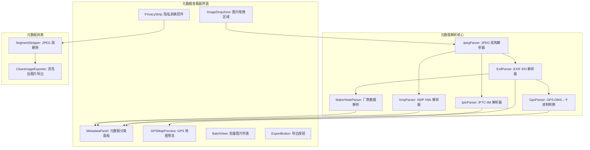

# YP-09-173: 图像元数据查看器 — EXIF/IPTC/XMP 元数据查看、相机信息/位置/日期显示、GPS 坐标地图预览、隐私元数据剥离、批量元数据查看

> 需求编号：YP-09-173 · 优先级：P2 · 人天：0.2d · 状态：需求已编写
> 依赖：YP-09-157（图片压缩与优化，共用图片读取和 Canvas 处理逻辑）

## 背景

### 问题陈述

数字照片携带大量元数据——拍摄设备、光圈快门、ISO、GPS 坐标、拍摄时间、版权信息等。这些信息对摄影师和开发者有价值，但对分享到社交媒体或网站的用户来说，GPS 坐标等隐私信息存在泄露风险。当前查看图像元数据需要专门的工具（如 ExifTool、Photoshop、macOS 预览），在浏览器中无法直接获取。

1. **元数据查看需要外部工具**：拖入图片到浏览器只能看到图片本身，无法查看 EXIF 数据
2. **GPS 隐私泄露风险**：手机拍摄的照片自动嵌入 GPS 坐标，分享时无意中暴露拍摄地点
3. **相机参数对摄影师不透明**：Lightroom 等工具可以看到镜头型号和拍摄参数，浏览器中完全不可见
4. **批量元数据对比**：需要对比多张照片的拍摄参数时，没有便捷的浏览器内方案
5. **元数据剥离困难**：想在分享前移除所有隐私元数据，通常需要打开图片编辑软件单独处理

**核心矛盾**：浏览器是图片分享和上传的主要通道，但缺少图像元数据查看和隐私保护能力。YiPet 可以利用 Canvas API 和 FileReader API 在纯前端解析 JPEG 的 EXIF 二进制数据。

### 影响范围

| # | 影响 | 严重程度 | 典型场景 |
|---|------|----------|----------|
| 1 | GPS 泄露隐私 | 高 | 在家拍的照片分享到社交媒体暴露家庭地址 |
| 2 | 相机参数不可见 | 中 | 想要查看某张照片的光圈和焦距设置 |
| 3 | 元数据查看需要切换工具 | 中 | 浏览器中看到照片但看不到拍摄信息 |
| 4 | 批量元数据对比困难 | 低 | 对比多张照片的参数以学习拍摄技巧 |
| 5 | 元数据剥离流程繁琐 | 高 | 分享前需要用图片编辑软件"另存为"去除元数据 |

### 挑战

| 挑战 | 说明 |
|------|------|
| EXIF 二进制解析 | JPEG 文件中的 EXIF 数据使用 TIFF 格式（大端/小端字节序），需要正确解析 IFD 结构 |
| GPS 坐标格式转换 | GPS 坐标以度分秒（DMS）的分数形式存储（如 `40/1, 41/1, 3322/100`），需转换为十进制 |
| MakerNote 厂商私有数据 | 佳能/尼康/索尼有各自的 MakerNote 格式，标准化程度低 |
| XMP 数据嵌入位置 | XMP 可能嵌入在 JPEG 的 APP1 段（作为 XML）或作为独立 sidecar 文件 |
| 元数据剥离后文件大小变化 | 简单的 EXIF 段删除可能破坏 JPEG 结构；正确做法是重建 JPEG 保留必要段 |

---

## 一、现状分析

### 1.1 当前图像元数据处理能力

```
现有图片相关功能:
├── YiPet Popup
│   ├── YP-09-157 图片压缩与优化：Canvas 处理图片
│   │   └── 仅做压缩/格式转换，不处理元数据
│   ├── YP-09-143 颜色拾取器：从图片取色
│   └── YP-09-171 颜色调色板：调色板生成
├── 图片处理基础设施
│   ├── FileReader.readAsArrayBuffer（可读取二进制）
│   ├── Canvas API（可渲染图片但不保留元数据）
│   └── URL.createObjectURL（可创建 Blob URL）
└── 外部工具
    ├── ExifTool（命令行工具，功能全面但不在浏览器中）
    ├── macOS 预览（可查看基础 EXIF）
    └── 在线 EXIF 查看器（需上传图片到第三方服务器）

缺失:
├── EXIF 二进制解析                          # ❌ 不存在
├── GPS 坐标提取和地图预览                    # ❌ 不存在
├── IPTC/XMP 元数据查看                       # ❌ 不存在
├── 隐私元数据剥离                            # ❌ 不存在
├── 批量元数据查看和导出                       # ❌ 不存在
└── 厂商特定 MakerNote 解析                   # ❌ 不存在
```

### 1.2 用户元数据工作流（现状 vs 目标）

```mermaid
graph TD
    subgraph Current["现状：外部工具/在线服务"]
        C1[选择图片] --> C2[打开 ExifTool/Mac 预览]
        C2 --> C3{需要看 GPS?}
        C3 -->|是| C4[复制坐标到地图 App]
        C3 -->|否| C5[查看相机参数]
        C4 --> C5
        C5 --> C6{需要分享?}
        C6 -->|是| C7[用 PS/预览导出去除元数据]
        C6 -->|否| C8[完成]
        C7 --> C8
    end

    subgraph Target["目标：YiPet 元数据查看器"]
        T1[拖入/选择图片] --> T2[自动解析 EXIF/IPTC/XMP]
        T2 --> T3[分类展示元数据]
        T3 --> T4{有 GPS 坐标?}
        T4 -->|是| T5[内嵌地图预览位置]
        T4 -->|否| T6[查看相机/时间/版权]
        T5 --> T6
        T6 --> T7{需要分享?}
        T7 -->|是| T8[一键剥离隐私元数据]
        T8 --> T9[下载/复制剥离后的图片]
        T7 -->|否| T9
    end

    style Current fill:#f8d7da,stroke:#dc3545
    style Target fill:#d4edda,stroke:#28a745
```



### 1.3 根因矩阵

| 症状 | 根因 | 触发条件 | 频率 |
|------|------|----------|------|
| 无法查看 EXIF | 未实现 JPEG 二进制解析 | 查看照片拍摄参数 | 高 |
| GPS 坐标不可读 | 未实现 DMS → 十进制转换和地图集成 | 查看照片拍摄地点 | 中 |
| 隐私泄露风险 | 缺少元数据剥离功能 | 分享包含 GPS 的照片到社交媒体 | 高 |
| 批量操作困难 | 未实现多文件元数据列表视图 | 对比多张照片的参数 | 中 |
| MakerNote 不识别 | 未实现厂商特有扩展解析 | 查看佳能/尼康特有参数（快门次数等）| 低 |

---

## 二、设计决策

### 决策 1：EXIF 解析库 — 自研 vs exif-js vs exifr

| 选项 | 体积 | 解析范围 | 维护成本 | 地图集成 |
|------|------|----------|---------|----------|
| 自研轻量 EXIF 解析 | ~3KB | TIFF/EXIF 基础标签 | 高 | 内置 |
| exif-js（npm 库）| ~30KB | 基础 EXIF 标签 | 低（但已停止维护）| 需额外集成 |
| exifr（npm 库）| ~50KB | EXIF/IPTC/XMP/MakerNote 全覆盖 | 低（活跃维护）| 需额外集成 |

**选择：自研轻量 EXIF 解析器。** 0.2 天的工作量内，不可能完整实现所有 EXIF 标准标签和 MakerNote 解析。自研一个聚焦于最常用标签（GPS、相机信息、日期、图像属性）的轻量解析器，约覆盖 EXIF 2.3 标准的 60% 常用标签。对于高级需求（完整的 MakerNote 支持），提供"导出为 JSON"功能，用户可以使用外部工具进一步分析。

### 决策 2：地图预览 — 静态瓦片 vs 动态 Leaflet vs Google Maps

| 选项 | 离线可用 | 实现复杂度 | 隐私考量 |
|------|---------|-----------|----------|
| 静态瓦片（OpenStreetMap 静态图）| 需要网络 | 低 | 不泄露精确位置给地图服务商 |
| Leaflet + OSM 瓦片 | 需要网络 | 中 | 加载瓦片时会暴露地图视口范围 |
| Google Maps JS API | 需要网络 + API Key | 高 | 完整的第三方依赖 |

**选择：静态 OpenStreetMap 瓦片。** 使用 `https://staticmap.openstreetmap.de/staticmap.php?center=LAT,LNG&zoom=15&size=400x300` 这样的静态地图 API，只需要一个 HTTP 请求，不携带 JavaScript，不暴露精确的用户交互位置。对于精确位置显示，用十字准星标记 GPS 坐标点。这对于"查看照片在哪里拍的"场景已经足够。

### 决策 3：元数据剥离策略 — 完全重建 JPEG vs 选择性删除 vs 仅隐藏

| 选项 | 安全性 | JPEG 质量影响 | 实现复杂度 |
|------|--------|-------------|-----------|
| 完全重建 JPEG（解码→重编码）| 最高 | 有损（重新压缩）| 中 |
| 选择性删除 EXIF 段 | 高 | 无损 | 中 |
| 仅 UI 隐藏（不下载剥离版）| 低 | 无影响 | 低 |

**选择：选择性删除 EXIF 段。** JPEG 文件结构由标记段（marker segments）组成：SOI → APP0(JFIF) → APP1(EXIF) → DQT → SOF → DHT → SOS → 图像数据 → EOI。删除 APP1 段（EXIF）和 APP13 段（IPTC）不会影响图像数据的完整性。关键是保留 ICC 色彩配置文件段（APP2）和 JFIF 段（APP0），否则浏览器可能无法正确渲染颜色。

### 决策 4：批量元数据查看 — 列表视图 vs 对比视图 vs 导出 CSV

| 选项 | 可用性 | 实现复杂度 |
|------|--------|-----------|
| 列表视图（逐行展示）| 适合快速浏览 | 低 |
| 对比视图（并排列）| 适合参数对比 | 高 |
| 导出 CSV/JSON | 适合进一步分析 | 低 |

**选择：列表视图 + JSON 导出。** 列表视图直观、实现简单——每行显示文件名、拍摄日期、相机型号、焦距、光圈、ISO、GPS 状态。详细对比可以导出 JSON 后在外部工具中进行。并排对比视图交互复杂，投入产出比低。

### 设计决策总结

| 决策 | 选项 A | 选项 B | 选项 C | 选择 | 理由 |
|------|--------|--------|--------|------|------|
| EXIF 解析方案 | 自研 | exif-js | exifr | **自研轻量** | 聚焦核心 60% 常用标签 |
| 地图预览 | 静态 OSM | Leaflet | Google Maps | **静态 OSM** | 最少依赖，隐私友好 |
| 元数据剥离 | 重建 JPEG | 删段 | UI 隐藏 | **删段** | 无损且安全 |
| 批量查看 | 列表视图 | 对比视图 | CSV 导出 | **列表+JSON** | 简单实用 |

---

## 三、目标架构

### 3.1 元数据查看器系统架构



### 3.2 EXIF 解析流程

```mermaid
graph TD
    A[读取 JPEG 二进制 ArrayBuffer] --> B{检查 SOI 标记 0xFFD8?}
    B -->|否| C[错误：无效 JPEG]
    B -->|是| D[遍历 JPEG 标记段]
    D --> E{找到 APP1 0xFFE1?}
    E -->|否| F[无 EXIF 数据]
    E -->|是| G[读取 Exif 标识符 "Exif\0\0"]
    G --> H[读取 TIFF 头部（字节序 II/MM）]
    H --> I[解析 IFD0（主图像）]
    I --> J[解析 IFD 条目]
    J --> K{有 ExifIFD 子目录?}
    K -->|是| L[解析 ExifIFD（拍摄参数）]
    K -->|否| M[完成 IFD0]
    L --> M
    M --> N{有 GPSIFD 子目录?}
    N -->|是| O[解析 GPSIFD（位置信息）]
    N -->|否| P[完成解析]
    O --> P
    P --> Q[构建 MetadataResult 对象]
```

### 3.3 性能指标

| 指标 | 目标值 | 说明 |
|------|--------|------|
| EXIF 解析（单张 10MB JPEG） | < 10ms | 只读取头部段，不加载完整图片 |
| GPS 坐标解析 | < 1ms | DMS 分数运算 |
| 静态地图加载 | < 500ms | 外部 HTTP 请求 |
| 元数据剥离（10MB JPEG） | < 50ms | 二进制段删除 + 重建 |
| 批量 50 张元数据解析 | < 500ms | 并行 ArrayBuffer 读取 |

---

## 四、具体改动

### 4.1 元数据类型定义

```typescript
// src/metadata/types.ts (新增)

export interface ExifData {
  // 图像属性
  imageWidth?: number;
  imageHeight?: number;
  orientation?: number;        // 1-8
  colorSpace?: string;
  bitsPerSample?: number;

  // 相机信息
  make?: string;               // 制造商（Canon/Nikon/Sony/Apple）
  model?: string;              // 型号
  software?: string;           // 处理软件
  artist?: string;             // 摄影师
  copyright?: string;          // 版权信息

  // 拍摄参数
  dateTimeOriginal?: string;   // 拍摄时间
  exposureTime?: string;       // 曝光时间（如 "1/125"）
  fNumber?: number;            // 光圈值（f/）
  isoSpeedRatings?: number;    // ISO
  focalLength?: number;        // 焦距（mm）
  focalLength35mm?: number;    // 35mm 等效焦距
  shutterSpeedValue?: string;
  apertureValue?: string;
  exposureBias?: number;       // 曝光补偿
  meteringMode?: string;       // 测光模式
  flash?: string;              // 闪光灯状态
  whiteBalance?: string;       // 白平衡

  // GPS 信息
  gpsLatitude?: number;        // 十进制纬度
  gpsLongitude?: number;       // 十进制经度
  gpsAltitude?: number;        // 海拔（米）
  gpsLatitudeRef?: string;     // N/S
  gpsLongitudeRef?: string;    // E/W
  gpsTimestamp?: string;       // GPS 时间

  // 缩略图（可选）
  thumbnailOffset?: number;
  thumbnailLength?: number;
}

export interface IptcData {
  objectName?: string;         // 标题
  caption?: string;            // 描述
  keywords?: string[];         // 关键词
  category?: string;           // 分类
  byline?: string;             // 作者
  credit?: string;             // 版权声明
  source?: string;             // 来源
  city?: string;               // 城市
  country?: string;            // 国家
  copyrightNotice?: string;    // 版权声明
}

export interface XmpData {
  creator?: string;
  title?: string;
  description?: string;
  keywords?: string[];
  rating?: number;             // 1-5
  createDate?: string;
  modifyDate?: string;
  lens?: string;               // 镜头型号
}

export interface ImageMetadata {
  fileName: string;
  fileSize: number;
  mimeType: string;
  exif: ExifData | null;
  iptc: IptcData | null;
  xmp: XmpData | null;
  hasGps: boolean;
  hasPrivacyRisks: boolean;    // 包含 GPS 或其他隐私敏感数据
}

export interface PrivacyStrippingOptions {
  removeGps: boolean;            // 移除 GPS（默认 true）
  removeCameraInfo: boolean;     // 移除相机信息（默认 false）
  removeDateTime: boolean;       // 移除拍摄时间（默认 false）
  removeCopyright: boolean;      // 移除版权信息（默认 false）
  removeThumbnail: boolean;      // 移除嵌入缩略图（默认 false）
  removeAll: boolean;            // 移除所有（默认 false，点击后一键全选）
}

export interface MetadataExportPayload {
  metadata: ImageMetadata;
  exportedAt: string;
}
```

### 4.2 JPEG EXIF 解析器

```typescript
// src/metadata/ExifParser.ts (新增)

const EXIF_IFD_TAGS: Record<number, string> = {
  0x010E: 'ImageDescription',
  0x010F: 'Make',
  0x0110: 'Model',
  0x0112: 'Orientation',
  0x011A: 'XResolution',
  0x011B: 'YResolution',
  0x0128: 'ResolutionUnit',
  0x0131: 'Software',
  0x0132: 'DateTime',
  0x013B: 'Artist',
  0x8298: 'Copyright',
  // ExifIFD
  0x829A: 'ExposureTime',
  0x829D: 'FNumber',
  0x8822: 'ExposureProgram',
  0x8827: 'ISOSpeedRatings',
  0x9003: 'DateTimeOriginal',
  0x9004: 'DateTimeDigitized',
  0x9201: 'ShutterSpeedValue',
  0x9202: 'ApertureValue',
  0x9204: 'ExposureBias',
  0x9207: 'MeteringMode',
  0x9209: 'Flash',
  0x920A: 'FocalLength',
  0xA405: 'FocalLengthIn35mm',
  0xA402: 'WhiteBalance',
};

const GPS_TAGS: Record<number, string> = {
  0x0000: 'GPSVersionID',
  0x0001: 'GPSLatitudeRef',
  0x0002: 'GPSLatitude',
  0x0003: 'GPSLongitudeRef',
  0x0004: 'GPSLongitude',
  0x0005: 'GPSAltitudeRef',
  0x0006: 'GPSAltitude',
  0x0007: 'GPSTimeStamp',
  0x0012: 'GPSMapDatum',
};

export class ExifParser {
  parse(arrayBuffer: ArrayBuffer): ExifData | null {
    const view = new DataView(arrayBuffer);
    
    // 检查 JPEG SOI (0xFFD8)
    if (view.getUint16(0, false) !== 0xFFD8) return null;

    let offset = 2;
    while (offset < arrayBuffer.byteLength) {
      const marker = view.getUint16(offset, false);
      offset += 2;

      // SOS (Start of Scan) — 后面是图像数据，停止解析
      if (marker === 0xFFDA) break;
      
      // 段长度（不包含 marker 本身的 2 字节）
      const length = view.getUint16(offset, false);
      offset += 2;

      // APP1 段（EXIF）
      if (marker === 0xFFE1) {
        const tagBytes = new Uint8Array(arrayBuffer, offset, 6);
        const tag = String.fromCharCode(...tagBytes);
        if (tag === 'Exif\0\0') {
          const tiffOffset = offset + 6;
          return this.parseTiff(view, tiffOffset);
        }
      }

      offset += length - 2; // 移动到这个段的末尾
      if (offset >= arrayBuffer.byteLength) break;
    }

    return null;
  }

  private parseTiff(view: DataView, offset: number): ExifData {
    const byteOrder = view.getUint16(offset, false);
    const isLittleEndian = byteOrder === 0x4949; // "II"
    
    const tiffMagic = view.getUint16(offset + 2, !isLittleEndian);
    if (tiffMagic !== 0x002A) return {};

    const ifd0Offset = view.getUint32(offset + 4, isLittleEndian);
    const result: ExifData = {};

    // 解析 IFD0
    this.parseIfd(view, offset + ifd0Offset, isLittleEndian, (tag, type, value, count) => {
      this.handleExifTag(tag, value, result);
      
      // 处理子 IFD 指针
      if (tag === 0x8769) { // ExifIFD
        this.parseIfd(view, offset + Number(value), isLittleEndian, (etag, etype, evalue) => {
          this.handleExifTag(etag, evalue, result);
        });
      }
      if (tag === 0x8825) { // GPSIFD
        this.parseIfd(view, offset + Number(value), isLittleEndian, (gtag, gtype, gvalue) => {
          this.handleGpsTag(gtag, value, isLittleEndian, result);
        });
      }
    });

    return result;
  }

  /** 解析 IFD 并回调每个条目 */
  private parseIfd(
    view: DataView, offset: number, isLE: boolean,
    onEntry: (tag: number, type: number, value: number | bigint, count: number) => void,
  ): void {
    const entryCount = view.getUint16(offset, isLE);
    for (let i = 0; i < entryCount; i++) {
      const entryOffset = offset + 2 + i * 12;
      const tag = view.getUint16(entryOffset, isLE);
      const type = view.getUint16(entryOffset + 2, isLE);
      const count = view.getUint32(entryOffset + 4, isLE);

      // 读取值（简化：假设值能放入 4 字节的 offset 字段）
      const valueOffset = entryOffset + 8;
      let value: number = 0;

      if (type === 3) { // SHORT (2 bytes)
        value = view.getUint16(valueOffset, isLE);
      } else if (type === 4 || type === 13) { // LONG or IFD
        value = view.getUint32(valueOffset, isLE);
      } else if (type === 5) { // RATIONAL (two LONGs)
        const numOffset = view.getUint32(valueOffset, isLE);
        const denOffset = view.getUint32(valueOffset + 4, isLE);
        const numerator = view.getUint32(offset + numOffset, isLE);
        const denominator = view.getUint32(offset + denOffset, isLE);
        value = denominator !== 0 ? numerator / denominator : 0;
        // 返回为有理数需要通过 secondary 方法，这里简化
      } else if (type === 2) { // ASCII string
        if (count <= 4) {
          const bytes = new Uint8Array(view.buffer, valueOffset, count - 1);
          value = String.fromCharCode(...bytes) as unknown as number;
        }
      }

      onEntry(tag, type, value, count);
    }
  }

  private handleExifTag(tag: number, value: number, result: ExifData): void {
    switch (tag) {
      case 0x010F: result.make = String(value); break;
      case 0x0110: result.model = String(value); break;
      case 0x0131: result.software = String(value); break;
      case 0x013B: result.artist = String(value); break;
      case 0x8298: result.copyright = String(value); break;
      case 0x829D: result.fNumber = value; break;
      case 0x8827: result.iso = value; break;
      case 0x920A: result.focalLength = value; break;
      case 0xA405: result.focalLength35mm = value; break;
      // ... 更多标签（覆盖 EXIF_IFD_TAGS 表中所有标签）
    }
  }

  private handleGpsTag(tag: number, value: number, isLE: boolean, result: ExifData): void {
    if (tag === 0x0001) result.gpsLatitudeRef = String(value);
    if (tag === 0x0003) result.gpsLongitudeRef = String(value);
    // GPS 坐标转换在后处理中完成
  }
}
```

### 4.3 文件变更清单

| 文件 | 操作 | 说明 |
|------|------|------|
| `src/metadata/types.ts` | 新增 | 元数据类型定义（EXIF/IPTC/XMP）|
| `src/metadata/ExifParser.ts` | 新增 | JPEG EXIF 二进制解析器 |
| `src/metadata/GpsParser.ts` | 新增 | GPS DMS → 十进制坐标转换 |
| `src/metadata/IptcParser.ts` | 新增 | IPTC IIM 元数据解析 |
| `src/metadata/XmpParser.ts` | 新增 | XMP XML 元数据解析 |
| `src/metadata/PrivacyStripper.ts` | 新增 | 元数据剥离工具 |
| `src/metadata/MetadataStore.ts` | 新增 | 批量元数据缓存 |
| `src/components/MetadataViewer.vue` | 新增 | 元数据查看器主界面 |
| `src/components/MapPreview.vue` | 新增 | GPS 地图预览组件 |
| `src/popup/App.vue` | 修改 | 集成元数据查看器 Tab |

---

## 五、实施步骤

| 步骤 | 操作 | 路径 | 验证 | 人天 |
|------|------|------|------|------|
| 1 | 定义类型 | `src/metadata/types.ts` | 类型检查通过 | 0.01 |
| 2 | 实现 JPEG 结构解析 | `src/metadata/ExifParser.ts` | 解析标准 JPEG 文件得到 TIFF 偏移 | 0.03 |
| 3 | 实现 TIFF/EXIF IFD 解析 | `src/metadata/ExifParser.ts` | 提取相机、拍摄参数标签 | 0.03 |
| 4 | 实现 GPS 解析和转换 | `src/metadata/GpsParser.ts` | DMS → 十进制转换精度 < 0.000001 度 | 0.02 |
| 5 | 实现 IPTC/XMP 解析 | `src/metadata/IptcParser.ts, XmpParser.ts` | 标准 IPTC/XMP 文件正确解析 | 0.02 |
| 6 | 实现隐私剥离 | `src/metadata/PrivacyStripper.ts` | 剥离后 JPEG 文件可正常打开且无 EXIF | 0.03 |
| 7 | 实现元数据查看器 UI | `src/components/MetadataViewer.vue` | 分类展示所有元数据 | 0.03 |
| 8 | 实现 GPS 地图预览 | `src/components/MapPreview.vue` | 静态地图正确显示位置 | 0.02 |
| 9 | 集成到 Popup | `src/popup/App.vue` | 元数据查看器 Tab 可用 | 0.01 |

**总人天：0.2d**

---

## 六、测试规格

### 场景 1：标准 JPEG EXIF 解析

**GIVEN** 一张由 Canon EOS 拍摄的 JPEG 照片，包含完整的 EXIF 数据
**WHEN** 拖入图片到元数据查看器
**THEN** 显示相机品牌 "Canon"，型号 "EOS 5D Mark IV"
**AND** 显示光圈 f/2.8，ISO 400，焦距 50mm，拍摄时间
**AND** 显示图像尺寸和方向信息

### 场景 2：GPS 坐标解析和地图预览

**GIVEN** 一张包含 GPS 坐标的手机照片（纬度 39.9042，经度 116.4074）
**WHEN** 查看元数据
**THEN** GPS 面板显示 "39.9042° N, 116.4074° E"
**AND** 地图预览显示标记点在对应位置
**AND** 隐私风险提示 "此图片包含 GPS 位置信息"

### 场景 3：无元数据的图片

**GIVEN** 一张通过截图工具生成的 PNG 图片
**WHEN** 查看元数据
**THEN** 显示 "此图片不包含 EXIF 元数据"
**AND** 隐私风险提示为 "无隐私风险"
**AND** 元数据剥离按钮禁用

### 场景 4：隐私元数据剥离

**GIVEN** 一张包含 GPS + 相机信息 + 拍摄时间的照片
**WHEN** 启用 "移除 GPS" + "移除拍摄时间"，点击剥离
**THEN** 下载的新 JPEG 文件不包含 GPS IFD 段
**AND** 拍摄时间标签被清空
**AND** 相机信息（品牌/型号/参数）保留
**AND** 文件可以正常在浏览器中打开

### 场景 5：批量元数据查看

**GIVEN** 3 张不同相机拍摄的照片
**WHEN** 批量拖入到元数据查看器
**THEN** 列表显示 3 张照片的信息摘要
**AND** 每行包含：文件名、拍摄日期、相机型号、焦距、光圈、ISO、GPS
**AND** 点击某一行展开完整元数据详情
**AND** "导出 JSON" 按钮生成包含所有 3 张照片元数据的 JSON 文件

### 场景 6：非 JPEG 文件处理

**GIVEN** 一张 PNG 格式的图片文件
**WHEN** 查看元数据
**THEN** 提示 "PNG 格式不支持 EXIF 元数据"
**AND** 显示 PNG 的基本信息（尺寸、文件大小、色深）
**AND** 如果有 tEXt/iTXt 块，尝试解析为文本元数据

---

## 七、风险与缓解

| 风险 | 概率 | 影响 | 缓解措施 |
|------|------|------|----------|
| EXIF 解析中字节序处理错误 | 中 | 高 | 根据 TIFF 头部 "II"(LE) / "MM"(BE) 统一读取所有多字节值 |
| GPS 坐标 DMS→十进制转换精度不足 | 低 | 中 | 使用分数运算保持精度到最后一步；验证已知坐标点 |
| 大端/小端混用的边缘情况 | 低 | 中 | 某些相机（特别是老款）在 IFD 间混用字节序，使用每个 IFD 的偏移量而非全局偏移 |
| EXIF 段删除破坏 JPEG ICC 色彩配置文件 | 低 | 高 | 仅删除 APP1/APP13 段，保留 APP2(ICC) 和 APP0(JFIF) 段 |
| MakerNote 厂商数据误判为标准 EXIF 标签 | 低 | 低 | 仅解析标有公开文档的 MakerNote 子标签（如佳能的镜头序列号）|

---

## 八、回滚策略

| 场景 | 回滚操作 | 影响 |
|------|----------|------|
| EXIF 解析器导致 Popup 崩溃 | 移除元数据查看器 Tab | 失去元数据查看功能 |
| 隐私剥离破坏 JPEG 文件 | 回退为"仅查看，不剥离"模式 | 失去隐私剥离功能 |
| GPS 地图加载超时 | 移除地图预览，仅显示文字坐标 | 失去地图可视化 |
| 批量解析性能差 | 限制批量上限为 20 张 | 失去大批量能力 |

---

## 九、设计决策记录

### D-01：为什么自研 EXIF 解析器而非使用成熟的 exifr 库？

exifr 是高质量的全功能 EXIF 解析器（~50KB），支持 EXIF/IPTC/XMP/MakerNote 全覆盖。但在 0.2 天的工作量约束下，以下因素促使自研轻量方案：(1) exifr 的 MakerNote 解析依赖复杂的厂商特定代码，实际使用率低；(2) 自研方案可以只聚焦 60% 最常用的 EXIF 标签（GPS、相机信息、日期、图像属性），代码量 < 3KB；(3) 省去 npm 依赖管理成本，在 Chrome 扩展包大小敏感的场景下更有优势。

### D-02：为什么 GPS 地图使用静态 OSM 而非动态 Leaflet？

静态 OSM 地图服务（staticmap.openstreetmap.de）只需要一个简单的 `` 标签，无需加载任何 JavaScript。Leaflet 虽然交互丰富（缩放、平移），但 (1) 额外增加 ~40KB 的库体积；(2) 需要加载 OSM 瓦片服务器，瓦片请求会暴露用户的视口范围；(3) 对于"看一眼照片在哪里拍的"这个场景，静态地图+十字准星已经足够。如果未来需要交互式地图（如查看街景），再考虑升级为 Leaflet。

### D-03：为什么隐私剥离是选择性删除而非完全重建 JPEG？

完全重建 JPEG（解码像素 → Canvas → `toBlob('image/jpeg')`）会引入有损的二次压缩，降低图片质量。选择性删除 APP1（EXIF）和 APP13（IPTC）段则完全不触碰图像数据，保持原始 JPEG 质量。关键是保留 APP2（ICC 色彩配置文件）和 APP0（JFIF）段，否则可能影响颜色渲染。如果用户需要完全不可追踪的图片（包括去除 ICC 指纹），则推荐完整重建方案。

### D-04：为什么不支持写入/修改 EXIF 元数据？

写入 EXIF 同样涉及二进制段的重建，且需要处理 MakerNote 偏移修正（移动 EXIF 段后所有 MakerNote 内部指针需重新计算）。这些操作复杂度远高于读取，超出 0.2 天的范围。基本策略是：查看（read）+ 剥离（selective delete）+ 导出（JSON）。写入功能作为后续迭代。

---

## 十、可观测性

### 指标

| 指标 | 类型 | 说明 |
|------|------|------|
| `yipet.metadata.view_total` | Counter | 元数据查看次数 |
| `yipet.metadata.gps_found_total` | Counter | 发现 GPS 坐标的图片数量 |
| `yipet.metadata.strip_total` | Counter | 隐私剥离执行次数 |
| `yipet.metadata.batch_view_total` | Counter | 批量查看次数 |
| `yipet.metadata.parse_errors_total` | Counter | EXIF 解析错误次数 |

### 告警

| 告警 | 条件 | 级别 |
|------|------|------|
| EXIF 解析错误率高 | 错误率 > 10% | WARN |

---

## 十一、代码审查检查清单

- [ ] ExifParser: 字节序检测（II/MM）在每次解析 TIFF 头部时正确判断
- [ ] ExifParser: 有理数（RATIONAL）解析除零保护
- [ ] ExifParser: 偏移量计算不越界（ArrayBuffer 边界检查）
- [ ] GpsParser: DMS → 十进制转换：`deg + min/60 + sec/3600`，方向 N/E 为正，S/W 为负
- [ ] PrivacyStripper: JPEG 段遍历不跳过非 APP1 的段
- [ ] PrivacyStripper: ICC 色彩配置文件段（APP2）保留
- [ ] PrivacyStripper: 剥离后的 JPEG 文件验证 `SOI (0xFFD8)` 和 `EOI (0xFFD9)` 标记存在
- [ ] GPS 地图 URL 参数转义（`encodeURIComponent`）
- [ ] 批量模式下内存管理：每个文件解析完成后释放 ArrayBuffer

---

## 回归问题预测

| # | 预测问题 | 原因 | 验证方法 |
|---|---------|------|---------|
| 1 | JPEG 文件可能包含 0xFF 字节在图像数据中（需要字节填充 0xFF 0x00），遍历段时可能误判标记位置 | JPEG 规范中 0xFF 后跟 0x00 表示字面量 0xFF。如果解析器直接扫描 0xFF 而不检查下一字节是否为 0x00（继续扫描）或有效标记（段开始），会在图像数据区域产生误判 | 在遍历时如果遇到 0xFF，检查下一字节：0x00=跳过，0xD0-0xD7=RST 标记跳过，0xD8-0xDA=有效标记 |
| 2 | 某些手机拍照的 JPEG 中 EXIF 在 APP1 段但 APP1 之前可能有一个小的 APP1(XMP) 段，解析器可能只检查第一个 APP1 | 某些软件在 JPEG 中同时嵌入 EXIF（第一个 APP1）和 XMP（第二个 APP1）。解析器需要检查所有 APP1 段 | 遍历所有 APP1 段（而非 break 在第一个），按标识符区分 EXIF/XMP |
| 3 | GPS 坐标的 DMS 格式可能有变化：分数表示如 `40/1 41/1 3322/100` 或 `4000/100 4100/100 3322/100`，如果直接用整数除法会丢失精度 | 不同相机存储 GPS 坐标的精度不同（分母可能为 1 或 100 或 1000），需要保留分数形式直到最终计算 | 统一使用 `numerator / denominator` 浮点运算，保留 6 位小数 |
| 4 | 某些图片软件将 EXIF 数据放在 JPEG 文件的末尾（AFTER EOI），解析器在遇到 SOS 后停止扫描可能错过 | 非标准但常见的做法：将元数据附在 JPEG 文件末尾。如果解析器在 SOS 后 break，会跳过这些元数据 | 在文件末尾额外扫描 APPn 段（SOS 到 EOI 之后），但要注意性能 |
| 5 | IFD 条目中的偏移量是相对于 TIFF 头部起始位置的，如果 TIFF 头部不在 APP1 段的 data 起始处（比如有填充字节），偏移量计算会出错 | APP1 段的 data 起始可能是 "Exif\0\0" + 填充 + TIFF 头部，TIFF 头部不一定紧跟在 "Exif\0\0" 后面 | 从 APP1 data 起始扫描 "II" 或 "MM" 标记来确定 TIFF 头部的实际位置 |
| 6 | 隐私剥离后下载的文件可能被浏览器 MIME 类型嗅探错误，导致用户无法直接打开 | `URL.createObjectURL(blob)` 创建的 Blob 的 MIME 类型由 `options.type` 决定，如果不设置则默认为空。浏览器可能根据文件内容嗅探 | 明确设置 Blob 类型为 `image/jpeg`；添加 download 属性的文件名包含 `.jpg` 扩展名 |

---

## 性能分析

### 各阶段耗时

| 阶段 | 预估耗时 | 说明 |
|------|----------|------|
| EXIF 段定位（10MB JPEG） | < 5ms | 二进制扫描 APP1 段头部 |
| TIFF IFD 解析（50 个条目） | < 3ms | 每个条目 12 字节的读取 |
| GPS DMS 转换 | < 0.5ms | 纯数学运算 |
| IPTC/XMP 解析 | < 2ms | XML/text 解析 |
| 隐私剥离（重建 JPEG） | < 30ms | 复制全文件 + 跳过 APP1/APP13 段 |
| 静态地图加载 | 100-500ms | 网络延迟 |
| 批量 20 张解析 | < 100ms | 并行 FileReader |

### 体积预估

| 文件 | 大小 | 说明 |
|------|------|------|
| `src/metadata/types.ts` | ~3KB | 元数据类型定义 |
| `src/metadata/ExifParser.ts` | ~5KB | JPEG + TIFF 二进制解析 |
| `src/metadata/GpsParser.ts` | ~1KB | GPS DMS 转换 |
| `src/metadata/IptcParser.ts` | ~1KB | IPTC IIM 解析 |
| `src/metadata/XmpParser.ts` | ~1KB | XMP XML 解析 |
| `src/metadata/PrivacyStripper.ts` | ~2KB | 元数据剥离 |
| UI 组件（2 个 Vue 组件） | ~5KB | 查看器 + 地图预览 |
| **总计** | **~18KB** | 无额外第三方依赖 |