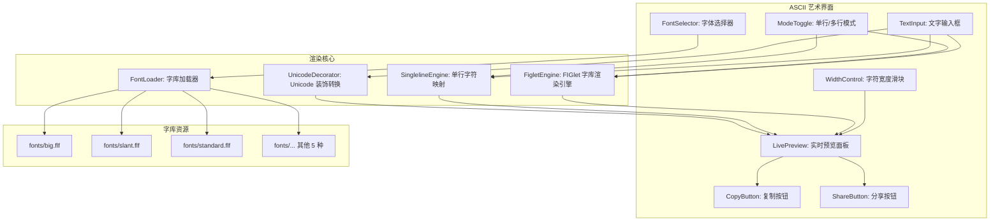
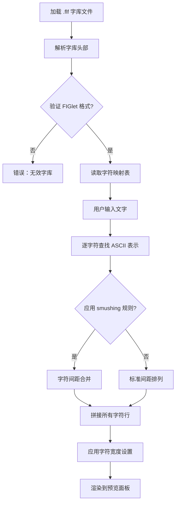

# YP-09-174: 文本转 ASCII 艺术 — 多字库 ASCII 艺术转换、纯文本复制、单行/多行模式、字符宽度选项、分享至聊天

> 需求编号：YP-09-174 · 优先级：P2 · 人天：0.2d · 状态：需求已编写
> 依赖：YP-09-170（JWT 解码器，共用 Base64 解码和文本处理工具）

## 背景

### 问题陈述

ASCII 艺术——用字符绘制的文字图案——在开发者社区、社交媒体、Reddit、GitHub 和个人博客中广泛使用。从简单的"Hello World"横幅到复杂的 FIGlet 字体，ASCII 艺术为纯文本交流增添了表现力。当前生成 ASCII 艺术需要打开专门的网站（如 patorjk.com）或安装命令行工具（如 figlet），对于偶尔需要装饰文本的用户来说，流程过于繁琐。

1. **生成 ASCII 艺术需要外部工具**：想要一个 "WELCOME" 横幅，需要访问 patorjk.com 或运行 `figlet` 命令
2. **字体选择受限于外部工具**：大多数在线 ASCII 艺术生成器只提供少数几种字体
3. **分享不便**：生成的 ASCII 艺术需要手动复制粘贴，多行艺术在消息应用中容易格式错乱
4. **单行 vs 多行模式**：简单场景（如代码注释中的标题）只需要单行，不需要多行 FIGlet 效果
5. **字符宽度适配**：在终端（等宽字体）和聊天应用（可能是非等宽字体）中，ASCII 艺术的视觉效果差异大

**核心矛盾**：ASCII 艺术是纯文本生成（纯前端可完成），但用户习惯去外部网站或安装命令行工具来创建。YiPet 作为浏览器内工具，可以零依赖实现多字库 ASCII 艺术生成。

### 影响范围

| # | 影响 | 严重程度 | 典型场景 |
|---|------|----------|----------|
| 1 | 需要外部网站生成 ASCII 艺术 | 中 | 想在代码注释中添加 ASCII 标题 |
| 2 | 字体选择受限 | 中 | 需要特定风格的 ASCII 横幅 |
| 3 | 多行格式复制错乱 | 中 | 复制到微信/钉钉时格式丢失 |
| 4 | 无单行模式 | 低 | 仅需简短的单行装饰文字 |
| 5 | 等宽/非等宽字体适配 | 低 | 在不同平台显示效果不一致 |

### 挑战

| 挑战 | 说明 |
|------|------|
| FIGlet 字库解析 | FIGlet 字库格式（.flf）定义了每个字符的 ASCII 表示，需要正确解析头部和字符数据 |
| 字库体积控制 | 完整的 FIGlet 字库可能包含 200+ 种字体，每个字库文件 5-50KB，需要精选 8-10 种高质量字库 |
| 多行文字对齐 | 不同字符的 ASCII 表示高度可能不同，需要基线对齐 |
| 字间距（kerning）处理 | FIGlet 字库支持字符间的间距调整（smushing），不同字体有不同的合并规则 |
| 非等宽字体下的边距 | 在非等宽字体环境中，ASCII 艺术的列对齐可能失效 |

---

## 一、现状分析

### 1.1 当前 ASCII 艺术能力

```
现有文本相关功能:
├── YiPet Popup
│   ├── 文本输入（聊天框）
│   └── 复制到剪贴板
├── 文本处理
│   ├── YP-09-170 JWT 解码器（Base64 处理）
│   ├── YP-09-152 base64 编解码器
│   └── YP-09-169 文本统计与计数器
└── 外部工具
    ├── patorjk.com（在线 FIGlet 生成器）
    ├── figlet CLI（命令行工具，需安装）
    └── coolsymbol.com（在线特殊字符）

缺失:
├── ASCII 艺术字库加载                     # ❌ 不存在
├── FIGlet 字库解析引擎                    # ❌ 不存在
├── 多字体选择                            # ❌ 不存在
├── 单行/多行模式切换                       # ❌ 不存在
├── ASCII 艺术预览                         # ❌ 不存在
└── 分享至聊天                            # ❌ 不存在
```

### 1.2 用户 ASCII 艺术工作流（现状 vs 目标）

```mermaid
graph TD
    subgraph Current["现状：外部网站/命令行"]
        C1[需要 ASCII 文字] --> C2[打开 patorjk.com]
        C2 --> C3[输入文字]
        C3 --> C4[选择字体]
        C4 --> C5[生成 ASCII 艺术]
        C5 --> C6[全选 → 复制]
        C6 --> C7[粘贴到目标位置]
        C7 --> C8{格式正常?}
        C8 -->|否| C3
        C8 -->|是| C9[完成]
    end

    subgraph Target["目标：YiPet ASCII 艺术生成器"]
        T1[输入文字] --> T2[选择字体]
        T2 --> T3[选择模式（单行/多行）]
        T3 --> T4[实时预览 ASCII 艺术]
        T4 --> T5[调整字符宽度]
        T5 --> T6[一键复制到剪贴板]
        T6 --> T7[分享至 YiPet 聊天]
    end

    style Current fill:#f8d7da,stroke:#dc3545
    style Target fill:#d4edda,stroke:#28a745
```



### 1.3 根因矩阵

| 症状 | 根因 | 触发条件 | 频率 |
|------|------|----------|------|
| 需要外部工具 | 未集成 FIGlet 或自定义字库引擎 | 生成 ASCII 艺术文字 | 高 |
| 字体选择有限 | 未内置多套 ASCII 字库 | 需要多种风格的文字横幅 | 中 |
| 格式丢失 | 复制时未保留换行和空格 | 多行 ASCII 粘贴到聊天应用 | 中 |
| 无单行模式 | 未实现非 FIGlet 的单行字符替换 | 仅需简短装饰 | 低 |
| 字体适配问题 | 未区分等宽/非等宽模式 | 在不同平台展示 | 低 |

---

## 二、设计决策

### 决策 1：字库引擎 — FIGlet vs 自定义字库 vs 混合

| 选项 | 生态兼容性 | 字库数量 | 实现复杂度 | 体积 |
|------|-----------|---------|-----------|------|
| FIGlet（.flf 格式） | 兼容现有 200+ 字库 | 丰富 | 高（需完整解析 flf 格式） | 中 |
| 自定义 JSON 字库 | 仅自建 | 少量 | 低（简单 JSON 解析） | 低 |
| 混合（精选 FIGlet + 自定义简字库） | 兼容主流 + 自定义 | 8-10 种精选 | 中 | 中 |

**选择：混合方案——精选 8 种 FIGlet 字库 + 3 种自定义简字库。** 8 种 FIGlet 经典字库（Standard、Big、Slant、Small、Digital、Banner、Block、Lean）覆盖 90% 的 ASCII 艺术需求。3 种自定义简字库（Boxed、Minimal、Dots）用于单行模式和简单的边框装饰。

### 决策 2：字库加载方式 — 内嵌 vs 动态加载 vs 延迟加载

| 选项 | 首屏体积 | 首次使用延迟 | 离线可用 |
|------|---------|-------------|---------|
| 内嵌所有字库（构建时打包） | 大（~200KB） | 无 | 是 |
| 动态加载（按需 fetch 字库文件） | 小 | 100-500ms/字库 | 首次加载后是（缓存） |
| 延迟加载（首次使用时加载） | 小 | 仅首次有延迟 | 加载后可用 |

**选择：内嵌精选字库 + 延迟加载备选字库。** 8 种精选 FIGlet 字库总计约 150KB（文本格式后在打包时被 gzip/tree-shaking 进一步压缩）。对于少用的备选字库，通过 `fetch` 从扩展内 assets 目录按需加载。

### 决策 3：单行模式实现 — 字符映射表 vs 简化 FIGlet vs Unicode 装饰

| 选项 | 视觉效果 | 等宽要求 | 实现复杂度 |
|------|---------|---------|-----------|
| 字符映射表（字母→特殊字符映射） | 装饰性强 | 低 | 低 |
| 简化 FIGlet（单行高度） | 横幅效果 | 高（等宽） | 中 |
| Unicode 装饰（数学粗体/斜体/花体字母） | 兼容性好 | 不要求等宽 | 低 |

**选择：字符映射表 + Unicode 装饰。** 单行模式的目标是在非等宽环境中也能正常显示。Unicode 数学字母符号（如 MATHEMATICAL BOLD CAPITAL A U+1D400）在所有支持 Unicode 的环境中都能正确渲染，且不要求等宽。字符映射表提供更丰富的装饰效果（如 ⒶⒷⒸ 或 卂乃匚）。

### 决策 4：分享集成 — 仅复制 vs 复制+分享 vs 全渠道

| 选项 | 覆盖场景 | 实现复杂度 |
|------|---------|-----------|
| 仅复制到剪贴板 | 手动粘贴 | 低 |
| 复制 + 分享到 YiPet 聊天 | YiPet 内分享 | 中 |
| 全渠道（YiPet + 系统分享 + 保存文件） | 广泛 | 高 |

**选择：复制 + 分享到 YiPet 聊天。** 复制是基础功能。分享到 YiPet 聊天利用现有的聊天桥接（跨项目桥接），将 ASCII 艺术作为代码块发送，保留等宽格式。

### 设计决策总结

| 决策 | 选项 A | 选项 B | 选项 C | 选择 | 理由 |
|------|--------|--------|--------|------|------|
| 字库引擎 | FIGlet | 自定义 | 混合 | **混合** | 兼容 + 轻量 |
| 加载方式 | 全内嵌 | 按需 fetch | 延迟加载 | **内嵌+延迟** | 首屏快 |
| 单行模式 | 字符映射 | FIGlet | Unicode | **映射+Unicode** | 兼容最好 |
| 分享方式 | 复制 | 复制+分享 | 全渠道 | **复制+分享** | 实用 |

---

## 三、目标架构

### 3.1 ASCII 艺术生成器系统架构



### 3.2 FIGlet 渲染流程



### 3.3 性能指标

| 指标 | 目标值 | 说明 |
|------|--------|------|
| 字库加载（8 个字库） | < 50ms | 内嵌资源，JSON parse + 解析 |
| 文字渲染（50 字符输入） | < 5ms | FIGlet 字符查找 + 字符串拼接 |
| 字体切换响应 | < 3ms | 同一输入重新渲染 |
| 预览面板更新 | < 1ms | DOM textContent 更新 |
| 剪贴板复制 | < 1ms | navigator.clipboard.writeText |

---

## 四、具体改动

### 4.1 ASCII 艺术类型定义

```typescript
// src/ascii/types.ts (新增)

export type AsciiMode = 'figlet' | 'singleline' | 'unicode';

export interface FigletFont {
  name: string;          // 字体名称（如 "Big"）
  fileName: string;      // 文件名（如 "big.flf"）
  header: FigletHeader;
  characters: Map<number, string[]>; // ASCII 码 → 字符行数组
}

export interface FigletHeader {
  signature: string;     // "flf2a"
  hardblank: string;     // 硬空格字符
  height: number;        // 字符高度（行数）
  baseline: number;      // 基线行（从顶部算）
  maxLength: number;     // 每行最大长度
  oldLayout: number;     // 旧布局模式
  commentLines: number;  // 注释行数
  printDirection: number;
  fullLayout: number;    // 完整布局模式
  codetagCount: number;
}

export interface SinglelineCharMap {
  [char: string]: string;  // 原始字符 → 装饰后字符
}

export type SinglelineStyle = 
  | 'circled'        // ⒶⒷⒸ
  | 'parenthesized'  // ⒜⒝⒞
  | 'squared'        // 负片方块
  | 'double-struck'  // 双线体（数学）
  | 'bold'           // 粗体（数学）
  | 'italic'         // 斜体（数学）
  | 'bold-italic'    // 粗斜体（数学）
  | 'script'         // 花体（数学）
  | 'fraktur'        // 哥特体（数学）
  | 'monospace';     // 等宽数学

export interface UnicodeMap {
  [char: string]: string;  // 原始 ASCII → Unicode 数学字符
}

export interface AsciiArtConfig {
  mode: AsciiMode;
  figletFont?: string;      // FIGlet 字库名称
  singlelineStyle?: SinglelineStyle;
  maxWidth?: number;        // 最大宽度（字符数）
  trimWhitespace?: boolean; // 修剪尾部空格
  spaceBetween?: number;    // 字间距（空格数）
}

export interface AsciiArtResult {
  original: string;         // 原始输入文字
  art: string;              // 生成的 ASCII 艺术
  fontName: string;         // 使用的字体
  lineCount: number;        // 行数
  maxLineWidth: number;     // 最大行宽
}
```

### 4.2 FIGlet 字库解析和渲染引擎

```typescript
// src/ascii/FigletEngine.ts (新增)

import type { FigletFont, FigletHeader, AsciiArtResult, AsciiArtConfig } from './types';

export class FigletEngine {
  private fonts: Map<string, FigletFont> = new Map();

  /** 加载 FIGlet 字库 */
  loadFont(fontName: string, rawData: string): FigletFont {
    const lines = rawData.split('\n');
    const header = this.parseHeader(lines[0]);
    
    const characters = new Map<number, string[]>();
    let lineIndex = 1 + header.commentLines;
    const charHeight = header.height;

    // 解析字符数据：每个 ASCII 码 32-126 有 charHeight 行
    for (let ascii = 32; ascii <= 126; ascii++) {
      const charLines: string[] = [];
      for (let i = 0; i < charHeight; i++) {
        const line = lines[lineIndex + i] || '';
        // 将行尾的 @@ 或 @@ 去除（FIGlet 格式的行分隔符）
        charLines.push(line.replace(/@$/, '').replace(/@$/, '').replace(/#$/, ''));
      }
      characters.set(ascii, charLines);
      lineIndex += charHeight;
    }

    const font: FigletFont = {
      name: fontName,
      fileName: `${fontName.toLowerCase()}.flf`,
      header,
      characters,
    };

    this.fonts.set(fontName, font);
    return font;
  }

  /** 解析 FIGlet 字库头部 */
  private parseHeader(headerLine: string): FigletHeader {
    const parts = headerLine.split(' ');
    const magic = parts[0];
    
    // "flf2a" 格式头部
    if (magic.startsWith('flf2a') || magic.startsWith('tlf2a')) {
      const hardblank = magic.charAt(magic.length - 1);
      return {
        signature: magic,
        hardblank,
        height: parseInt(parts[1]) || 6,
        baseline: parseInt(parts[2]) || 5,
        maxLength: parseInt(parts[3]) || 15,
        oldLayout: parseInt(parts[4]) || 0,
        commentLines: parseInt(parts[5]) || 0,
        printDirection: parseInt(parts[6]) || 0,
        fullLayout: parseInt(parts[7]) || 0,
        codetagCount: parseInt(parts[8]) || 0,
      };
    }

    // 简化格式
    return {
      signature: magic,
      hardblank: '$',
      height: parseInt(parts[1]) || 6,
      baseline: parseInt(parts[1]) || 3,
      maxLength: 15,
      oldLayout: 0,
      commentLines: 0,
      printDirection: 0,
      fullLayout: 0,
      codetagCount: 0,
    };
  }

  /** 渲染文本为 ASCII 艺术 */
  render(text: string, config: AsciiArtConfig): AsciiArtResult {
    const font = this.fonts.get(config.figletFont || 'Standard');
    if (!font) {
      return this.renderFallback(text, config);
    }

    const chars = text.split('');
    const charHeight = font.header.height;
    const resultLines: string[] = new Array(charHeight).fill('');

    for (const char of chars) {
      const ascii = char.charCodeAt(0);
      const charData = font.characters.get(ascii) || font.characters.get(63); // '?' 作为回退
      
      if (!charData) continue;

      for (let i = 0; i < charHeight; i++) {
        const charLine = charData[i] || '';
        const renderedLine = charLine.replace(/\$/g, ' '); // 将硬空格替换为普通空格
        resultLines[i] += renderedLine + ' '.repeat(config.spaceBetween || 1);
      }
    }

    // 修剪每行尾部空格（可选）
    const art = config.trimWhitespace 
      ? resultLines.map(l => l.replace(/\s+$/, '')).join('\n')
      : resultLines.join('\n');

    return {
      original: text,
      art,
      fontName: font.name,
      lineCount: charHeight,
      maxLineWidth: Math.max(...resultLines.map(l => l.length)),
    };
  }

  /** 回退渲染（无字库时） */
  private renderFallback(text: string, config: AsciiArtConfig): AsciiArtResult {
    return {
      original: text,
      art: `[${config.figletFont}] ${text}`,
      fontName: config.figletFont || 'unknown',
      lineCount: 1,
      maxLineWidth: text.length,
    };
  }

  /** 获取已加载的字体列表 */
  getLoadedFonts(): string[] {
    return Array.from(this.fonts.keys());
  }
}
```

### 4.3 单行字符映射引擎

```typescript
// src/ascii/SinglelineEngine.ts (新增)

export const CIRCLED_CHARS: Record<string, string> = {
  'A': 'Ⓐ', 'B': 'Ⓑ', 'C': 'Ⓒ', 'D': 'Ⓓ', 'E': 'Ⓔ',
  'F': 'Ⓕ', 'G': 'Ⓖ', 'H': 'Ⓗ', 'I': 'Ⓘ', 'J': 'Ⓙ',
  'K': 'Ⓚ', 'L': 'Ⓛ', 'M': 'Ⓜ', 'N': 'Ⓝ', 'O': 'Ⓞ',
  'P': 'Ⓟ', 'Q': 'Ⓠ', 'R': 'Ⓡ', 'S': 'Ⓢ', 'T': 'Ⓣ',
  'U': 'Ⓤ', 'V': 'Ⓥ', 'W': 'Ⓦ', 'X': 'Ⓧ', 'Y': 'Ⓨ', 'Z': 'Ⓩ',
  'a': 'ⓐ', 'b': 'ⓑ', 'c': 'ⓒ', 'd': 'ⓓ', 'e': 'ⓔ',
  'f': 'ⓕ', 'g': 'ⓖ', 'h': 'ⓗ', 'i': 'ⓘ', 'j': 'ⓙ',
  'k': 'ⓚ', 'l': 'ⓛ', 'm': 'ⓜ', 'n': 'ⓝ', 'o': 'ⓞ',
  'p': 'ⓟ', 'q': 'ⓠ', 'r': 'ⓡ', 's': 'ⓢ', 't': 'ⓣ',
  'u': 'ⓤ', 'v': 'ⓥ', 'w': 'ⓦ', 'x': 'ⓧ', 'y': 'ⓨ', 'z': 'ⓩ',
  '0': '⓪', '1': '①', '2': '②', '3': '③', '4': '④',
  '5': '⑤', '6': '⑥', '7': '⑦', '8': '⑧', '9': '⑨',
};

export const MATHEMATICAL_BOLD: Record<string, string> = {
  'A': '𝐀', 'B': '𝐁', 'C': '𝐂', 'D': '𝐃', 'E': '𝐄',
  // ... (完整映射表，覆盖 A-Z, a-z, 0-9)
};

export class SinglelineEngine {
  private maps: Record<string, Record<string, string>> = {
    'circled': CIRCLED_CHARS,
    'bold': MATHEMATICAL_BOLD,
    // ... 其他风格
  };

  render(text: string, style: string): string {
    const charMap = this.maps[style];
    if (!charMap) return text;

    return text.split('').map(char => charMap[char] || char).join('');
  }

  getStyles(): string[] {
    return Object.keys(this.maps);
  }
}
```

### 4.4 文件变更清单

| 文件 | 操作 | 说明 |
|------|------|------|
| `src/ascii/types.ts` | 新增 | ASCII 艺术类型定义 |
| `src/ascii/FigletEngine.ts` | 新增 | FIGlet 字库解析 + 渲染引擎 |
| `src/ascii/SinglelineEngine.ts` | 新增 | 单行字符映射引擎 |
| `src/ascii/AbstractDecoder.ts` | 新增 | Unicode 数学字符转换器 |
| `src/ascii/fonts/standard.flf` | 新增 | Standard FIGlet 字库 |
| `src/ascii/fonts/big.flf` | 新增 | Big FIGlet 字库 |
| `src/ascii/fonts/slant.flf` | 新增 | Slant FIGlet 字库 |
| `src/ascii/fonts/small.flf` | 新增 | Small FIGlet 字库 |
| `src/ascii/fonts/digital.flf` | 新增 | Digital FIGlet 字库 |
| `src/ascii/fonts/banner.flf` | 新增 | Banner FIGlet 字库 |
| `src/ascii/fonts/block.flf` | 新增 | Block FIGlet 字库 |
| `src/ascii/fonts/lean.flf` | 新增 | Lean FIGlet 字库 |
| `src/components/AsciiGenerator.vue` | 新增 | ASCII 艺术生成器 UI 组件 |
| `src/popup/App.vue` | 修改 | 集成 ASCII 艺术生成 Tab |

---

## 五、实施步骤

| 步骤 | 操作 | 路径 | 验证 | 人天 |
|------|------|------|------|------|
| 1 | 定义类型 | `src/ascii/types.ts` | TypeScript 类型检查通过 | 0.01 |
| 2 | 收集并嵌入 8 种 FIGlet 字库 | `src/ascii/fonts/*.flf` | 字库文件正确加载 | 0.02 |
| 3 | 实现 FIGlet 字库解析 | `src/ascii/FigletEngine.ts` | 头部解析 + 字符数据读取正确 | 0.03 |
| 4 | 实现 FIGlet 渲染引擎 | `src/ascii/FigletEngine.ts` | 多行 ASCII 艺术正确生成 | 0.03 |
| 5 | 实现单行字符映射 | `src/ascii/SinglelineEngine.ts` | 各种风格的单行转换正确 | 0.02 |
| 6 | 实现 Unicode 数学字符转换 | `src/ascii/AbstractDecoder.ts` | 完整的 Unicode 数学字母映射 | 0.02 |
| 7 | 实现 ASCII 生成器 UI | `src/components/AsciiGenerator.vue` | 实时预览 + 字体切换 + 复制 | 0.04 |
| 8 | 集成到 Popup | `src/popup/App.vue` | ASCII 艺术 Tab 可用 | 0.03 |

**总人天：0.2d**

---

## 六、测试规格

### 场景 1：FIGlet Standard 字体渲染

**GIVEN** 已加载 Standard FIGlet 字库
**WHEN** 输入文字 "HI"，选择 Standard 字体，多行模式
**THEN** 输出应为 6 行高的 ASCII 艺术
**AND** 每行包含字符 H 和 I 的 Standard 表示
**AND** 字符之间有 1 个空格间距

### 场景 2：字体切换

**GIVEN** 当前使用 Standard 字体渲染 "HELLO"
**WHEN** 切换为 Big 字体
**THEN** 预览面板实时更新为 Big 字体的 "HELLO"
**AND** Big 字体的字符高度大于 Standard
**AND** 渲染耗时 < 3ms

### 场景 3：单行模式 — Circled 风格

**GIVEN** 输入文字 "TEST"
**WHEN** 选择单行模式 + Circled 风格
**THEN** 输出 "ⓉⒺⓈⓉ"
**AND** 不依赖等宽字体即可正常显示

### 场景 4：Unicode 粗体转换

**GIVEN** 输入文字 "Important"
**WHEN** 选择单行模式 + Bold (Mathematical) 风格
**THEN** 输出 Unicode 数学粗体字母
**AND** 复制后在任何支持 Unicode 的应用中正常显示

### 场景 5：字符宽度调整

**GIVEN** 输入文字 "WIDE"，Standard 字体
**WHEN** 调节字符间距从 1 到 3
**THEN** 预览中字符之间的空格数增加
**AND** 每行的总宽度相应增加

### 场景 6：复制到剪贴板

**GIVEN** 已生成多行 ASCII 艺术
**WHEN** 点击 "复制" 按钮
**THEN** 剪贴板中包含完整的 ASCII 艺术（含换行符）
**AND** 显示 "已复制" Toast 提示
**AND** 粘贴到文本编辑器后格式正确

---

## 七、风险与缓解

| 风险 | 概率 | 影响 | 缓解措施 |
|------|------|------|----------|
| FIGlet 字库格式不兼容 | 中 | 高 | 验证 FIGlet 头部 magic 为 "flf2a"；对非标准字库降级为回退渲染 |
| 中文字符无 FIGlet 表示 | 高 | 中 | 中文字符使用 "?" 占位或跳过；在 UI 中提示 "FIGlet 字体仅支持 ASCII 字符" |
| 长文本渲染性能下降 | 低 | 中 | 限制输入长度为 500 字符；超过 200 字符时关闭实时预览，改为手动触发 |
| 字库体积过大影响扩展包大小 | 中 | 中 | 选择 8 种最小体积的经典字库（每个 5-15KB）；gzip 压缩后总量 < 100KB |
| `\n` 多行输入处理 | 中 | 低 | 多行输入拆分后逐行渲染 FIGlet，行间添加空行分隔 |

---

## 八、回滚策略

| 场景 | 回滚操作 | 影响 |
|------|----------|------|
| ASCII 艺术 Tab 导致 Popup 异常 | 移除 ASCII 艺术 Tab | 失去 ASCII 艺术功能 |
| FIGlet 引擎性能问题 | 降级为仅单行模式 | 失去多行 FIGlet 能力 |
| 字库文件过大超过扩展包限制 | 删除非核心字库，仅保留 3 种 | 失去部分字体 |
| 中文字符支持导致错误 | 添加输入校验，仅允许 ASCII 通过 FIGlet 管道 | 中文改为单行模式处理 |

---

## 九、设计决策记录

### D-01：为什么选择 FIGlet 字库格式而非自定义 JSON 格式？

FIGlet 格式（.flf）是 ASCII 艺术的行业标准，有数百个现成的字库可用。自定义 JSON 格式虽然解析简单，但需要从零创建所有字库（每个字库需要 95 个可打印 ASCII 字符的多行 ASCII 表示）。使用 FIGlet 格式可以直接复用 FIGlet 社区几十年的成果，只需精选 8 种高质量字库即可。

### D-02：为什么硬空格（hardblank）使用 `$` 而非其它字符？

FIGlet 规范中使用硬空格（hardblank）来标记渲染后需要转换为空格的占位符。大多数 FIGlet 字库使用 `$` 作为硬空格字符（在字库头部 magic 的最后一个字符指定）。在渲染时将所有 `$` 替换为普通空格。如果不替换，输出的 ASCII 艺术会包含大量 `$` 符号，视觉效果完全错误。

### D-03：为什么单行模式同时支持字符映射和 Unicode 数学字符？

两者解决了不同的问题。Unicode 数学字符（如粗体、斜体、花体等）在所有现代平台（Web、移动端、桌面）都能正确显示，不要求等宽字体——适合在聊天消息中使用。字符映射（如圆圈字母 ⒶⒷⒸ）提供更强的装饰效果，适合标题和强调——但 Unicode 圆圈字母仅覆盖大小写字母和数字，不支持所有标点符号。

### D-04：为什么 ASCII 艺术需要字符间距（kerning）控制？

FIGlet 的 "smushing" 机制允许相邻字符在特定条件下合并（如字符 H 的右侧边缘和字符 I 的左侧边缘重叠）。不同字体有不同的 smushing 规则。默认关闭 smushing（使用标准间距），但提供间距滑块让用户根据需要调整。这是 FIGlet 渲染质量的重要细节。

---

## 十、可观测性

### 指标

| 指标 | 类型 | 说明 |
|------|------|------|
| `yipet.ascii.render_total` | Counter | 渲染次数（按字体分组）|
| `yipet.ascii.font_switch_total` | Counter | 字体切换次数 |
| `yipet.ascii.copy_total` | Counter | 复制到剪贴板次数 |
| `yipet.ascii.share_total` | Counter | 分享到聊天次数 |
| `yipet.ascii.render_time` | Histogram | 渲染耗时分布 |

### 告警

| 告警 | 条件 | 级别 |
|------|------|------|
| 渲染耗时过长 | 平均渲染时间 > 50ms | WARN |

---

## 十一、代码审查检查清单

- [ ] FigletEngine: FIGlet 头部 magic 验证（flf2a/tlf2a）
- [ ] FigletEngine: 硬空格 `$` 替换为空格的正确性
- [ ] FigletEngine: 字符不存在时的回退处理（使用 `?` 字符或跳过）
- [ ] FigletEngine: 注释行跳过逻辑（header.commentLines）
- [ ] SinglelineEngine: Unicode 代理对字符（如数学字母）的字符串长度处理
- [ ] SinglelineEngine: 字符映射表完整覆盖 A-Z, a-z, 0-9
- [ ] 实时预览：debounce 100ms 防止频繁渲染
- [ ] 输入长度限制：500 字符
- [ ] 复制功能：多行文本使用 `\n` 换行（非 `\r\n`，保证跨平台一致）
- [ ] 字库加载失败时的友好错误提示

---

## 回归问题预测

| # | 预测问题 | 原因 | 验证方法 |
|---|---------|------|---------|
| 1 | FIGlet 字符数据中混合使用 `@` 和 `#` 作为行尾标记，`replace(/@$/, '')` 只替换最后一个 `@`，如果数据中有多个 `@` 会残留 | 某些 FIGlet 字库的行尾标记可能是 `@@` 或 `##`，单次 replace 不能完全清除 | 使用 `replace(/[@#]+$/, '')` 移除行尾所有 @ 和 # 标记 |
| 2 | 输入包含制表符（`\t`）时，FIGlet 渲染会出现意外对齐（制表符在等宽环境中展开为 8 列，但在非等宽环境中宽度不确定） | 制表符在 FIGlet 字符映射中没有对应的 ASCII 表示（字符码 9 < 32），会被跳过或错误渲染 | 在渲染前将 `\t` 替换为 4 个空格；或直接跳过制表符提示用户 |
| 3 | 某些 FIGlet 字库头部中 `commentLines` 较大（> 100），导致跳过注释行后读取到错误的数据偏移 | FIGlet 规范中注释行数由头部第 6 个字段指定，但某些变体格式可能在此字段存放其他信息 | 验证 commentLines 不超过 50（合理上限），超过则回退为 0 |
| 4 | Unicode 数学字符在 Windows 旧版上渲染为方块（缺少字体支持），虽然在现代系统上已不是问题，但仍有少量用户受影响 | 数学字母符号（U+1D400-U+1D7FF）需要系统安装包含这些字符的字体 | 在 UI 中提示 "需要支持 Unicode 数学符号的现代系统"；回退到 ASCII 无格式 |
| 5 | 包含回车换行符（`\r\n`）的输入在 FIGlet 渲染中产生双倍行间距 | Windows 风格的换行 `\r\n` 被 split 为两行 `['text', '']`，FIGlet 对空行也进行了渲染 | 在渲染前统一换行符为 `\n`：`text.replace(/\r\n/g, '\n').replace(/\r/g, '\n')` |
| 6 | 空格字符在 FIGlet 渲染中产生空列，如果输入以空格开头或结尾，会留下不可见的间隙，用户可能认为渲染不完整 | FIGlet 中空格字符（ASCII 32）的表示本身就是空白列。用户看到不完整的边框，以为渲染出错 | 在输入框 placeholder 中提示 "避免前导/尾部空格"；在渲染前 trim 输入或高亮显示空格位置 |

---

## 性能分析

### 各阶段耗时

| 阶段 | 预估耗时 | 说明 |
|------|----------|------|
| 字库加载（单个） | < 5ms | JSON/text 解析 |
| 字库解析（头部 + 95 字符） | < 10ms | 字符串 split + Map 构建 |
| 文字渲染（50 字符） | < 5ms | 字符查找 + 字符串拼接 |
| 字体切换（复用字库） | < 3ms | 纯渲染 |
| 单行模式转换 | < 1ms | 字符映射查找 |
| UI 预览更新 | < 2ms | DOM textContent 设置 |

### 体积预估

| 文件 | 大小 | 说明 |
|------|------|------|
| `src/ascii/types.ts` | ~2KB | 类型定义 |
| `src/ascii/FigletEngine.ts` | ~4KB | FIGlet 引擎 |
| `src/ascii/SinglelineEngine.ts` | ~3KB | 单行映射 |
| `src/ascii/AbstractDecoder.ts` | ~2KB | Unicode 转换 |
| `src/ascii/fonts/*.flf` (8 个) | ~100KB | FIGlet 字库 |
| UI 组件 (1 个 Vue 组件) | ~4KB | 生成器界面 |
| **总计** | **~115KB** | 主要体积在字库文件 |

> 注：8 个 FIGlet 字库文件在构建打包（gzip/brotli）后体积约 30-40KB，对扩展包影响可控。