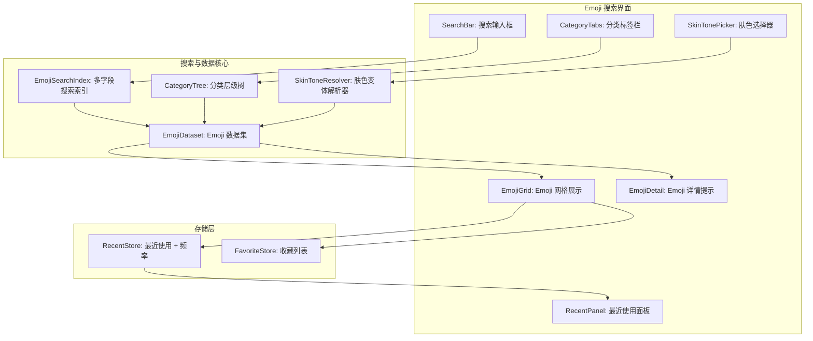
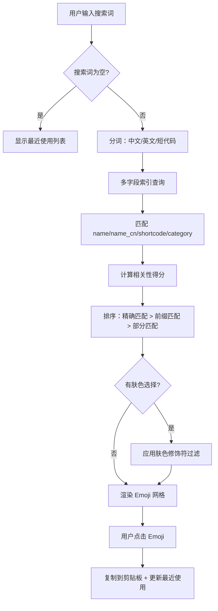

# YP-09-175: Emoji 搜索与复制 — 关键词搜索 Emoji、分类浏览、最近使用、肤色变体、Emoji 复制、短代码显示、多语言搜索

> 需求编号：YP-09-175 · 优先级：P2 · 人天：0.2d · 状态：需求已编写
> 依赖：无硬依赖（工具独立运行，纯前端数据）

## 背景

### 问题陈述

Emoji 已成为现代数字交流的通用语言——每天有超过 100 亿个 Emoji 在消息、社交媒体和协作工具中被使用。Unicode 15.1 包含超过 3,700 个 Emoji。然而，在桌面浏览器中查找和输入 Emoji 仍然不便：(1) 操作系统自带的 Emoji 面板（Win+. 或 Cmd+Ctrl+Space）功能简陋、搜索不智能；(2) Emoji 数量庞大，按分类浏览效率低；(3) 肤色变体选择需要通过长按或多步骤操作；(4) 开发者需要 Emoji 短代码（如 `:smile:`）用于 Markdown 和代码中。

1. **查找 Emoji 效率低**：想找一个特定的 Emoji（如 "💯"），需要翻遍操作系统 Emoji 面板或在搜索中猜关键词
2. **分类浏览不够精细**：操作系统只提供 8-9 大类，而 Unicode 标准有更细的子分类
3. **肤色变体隐藏太深**：想要 "👋" 的深色肤色变体 "👋🏿"，需要长按并滑动选择
4. **没有最近使用记录**：经常用的 Emoji 每次都要重新查找
5. **短代码不可见**：开发者需要 `:wave:` 这样的短代码来在 Markdown/GitHub/Slack 中使用 Emoji

**核心矛盾**：Emoji 是高频使用的文本元素，但桌面浏览器的 Emoji 输入体验远落后于移动端。YiPet 可以利用纯前端的 Emoji 数据集提供快速搜索、分类浏览和短代码显示能力。

### 影响范围

| # | 影响 | 严重程度 | 典型场景 |
|---|------|----------|----------|
| 1 | Emoji 查找效率低 | 高 | 在邮件/文档中输入特定 Emoji |
| 2 | 肤色变体难选择 | 中 | 需要特定肤色的手势 Emoji |
| 3 | 无使用历史 | 中 | 经常重复使用同一组 Emoji |
| 4 | 短代码不可见 | 低 | 开发者在 Markdown 中使用 Emoji |
| 5 | 分类不精准 | 中 | 想找"食物"类 Emoji 时只能在大类中翻 |

### 挑战

| 挑战 | 说明 |
|------|------|
| Emoji 数据集维护 | Unicode 每年更新 Emoji 列表（从 15.0 → 15.1 新增 118 个），需要可更新机制 |
| 多语言搜索索引 | 中文关键词（"微笑"→😊）、英文关键词（"smile"→😊）、短代码（`:smile:`→😊）需要建立搜索索引 |
| 肤色变体渲染 | ZWJ (Zero Width Joiner) 序列的正确渲染，如 `👋 + 🏿 = 👋🏿` |
| Emoji 在不同平台的显示差异 | 同一 Emoji 在 macOS/iOS/Windows/Android 上的外观不同 |
| 搜索性能 | 3700+ Emoji 的实时搜索需要高效的过滤算法 |

---

## 一、现状分析

### 1.1 当前 Emoji 处理能力

```
现有 Emoji 相关功能:
├── YiPet Popup
│   ├── 聊天输入框：原生浏览器 Emoji 输入
│   └── YP-09-107 表情与贴纸选择器：简单表情选择
├── 浏览器能力
│   ├── OS 原生 Emoji 面板（Win+. / Cmd+Ctrl+Space）
│   │   └── 基础搜索 + 最近使用
│   └── 文本渲染：支持完整 Emoji 渲染
└── 外部工具
    ├── emojipedia.org（Emoji 百科，信息全面但需在线）
    ├── getemoji.com（复制 Emoji）
    └── Slack/Discord 内置 Emoji 选择器（体验优秀但仅在各自平台）

缺失:
├── 智能关键词搜索                         # ❌ 不存在
├── 细粒度分类浏览                         # ❌ 不存在
├── 最近使用记录持久化                      # ❌ 不存在
├── 肤色变体面板                            # ❌ 不存在
├── Emoji 短代码（`:wave:`）显示和复制      # ❌ 不存在
└── 多语言搜索（中文 + 英文 + 短代码）       # ❌ 不存在
```

### 1.2 用户 Emoji 工作流（现状 vs 目标）

```mermaid
graph TD
    subgraph Current["现状：OS 原生 Emoji 面板"]
        C1[需要 Emoji] --> C2[Win+. 或 Cmd+Ctrl+Space]
        C2 --> C3[在面板中搜索或浏览分类]
        C3 --> C4{找到?}
        C4 -->|否| C5[尝试不同关键词]
        C5 --> C3
        C4 -->|是| C6[点击 Emoji 插入]
        C6 --> C7{需要肤色变体?}
        C7 -->|是| C8[长按选择肤色]
        C7 -->|否| C9[完成]
        C8 --> C9
    end

    subgraph Target["目标：YiPet Emoji 搜索面板"]
        T1[打开 Emoji 面板] --> T2[搜索关键词 / 浏览分类]
        T2 --> T3[实时过滤显示匹配 Emoji]
        T3 --> T4{需要肤色变体?}
        T4 -->|是| T5[点击肤色选择器切换]
        T4 -->|否| T6[点击 Emoji 复制到剪贴板]
        T5 --> T6
        T6 --> T7[自动加入最近使用]
        T7 --> T8[显示短代码提示]
    end

    style Current fill:#f8d7da,stroke:#dc3545
    style Target fill:#d4edda,stroke:#28a745
```



### 1.3 根因矩阵

| 症状 | 根因 | 触发条件 | 频率 |
|------|------|----------|------|
| Emoji 查找慢 | 搜索索引不智能（仅英文关键词） | 搜索中文描述的 Emoji | 高 |
| 分类浏览效率低 | 分类粒度粗 | 浏览特定子类 Emoji | 中 |
| 肤色变体难选 | 无皮肤色变体面板 | 需要非默认肤色 Emoji | 中 |
| 无使用历史 | 未持久化最近使用列表 | 找到后再次使用同一 Emoji | 高 |
| 短代码缺失 | 无 Emoji 到短代码的映射 | 在 Markdown/Slack 中使用 Emoji | 低 |

---

## 二、设计决策

### 决策 1：Emoji 数据集 — 静态内嵌 vs 动态 API vs CDN 加载

| 选项 | 更新难度 | 离线可用 | 体积 | 搜索性能 |
|------|---------|---------|------|---------|
| 静态内嵌 JSON | 需要发版更新 | 是 | ~300KB（gzip ~50KB） | 极快 |
| 动态 API（emojipedia/unicode.org） | 自动更新 | 否（需网络） | 0 | 依赖网络 |
| CDN 加载 + 本地缓存 | 首次网络 + 后续缓存 | 首次加载后可用 | ~50KB 网络传输 | 首次慢，后续快 |

**选择：静态内嵌 Emoji 数据集。** Unicode 标准每年更新一次 Emoji 列表，更新频率很低。将 Emoji 15.1 的完整数据集（3700+ Emoji）内嵌为 JSON，gzip 压缩后约 50KB，对扩展包体积影响小。搜索和渲染无需网络。

### 决策 2：搜索策略 — 前缀匹配 vs 关键词匹配 vs 模糊搜索

| 选项 | 精度 | 用户体验 | 实现复杂度 |
|------|------|---------|-----------|
| 前缀匹配（输入 "sm" → "smile"） | 高 | 一般（需要知道完整词） | 低 |
| 关键词匹配（输入 "笑" → "smile/laugh/grin"） | 高 | 好（中文/英文都可搜索） | 中 |
| 模糊搜索（Levenshtein/edit distance） | 中 | 好（容忍拼写错误） | 中 |

**选择：关键词匹配（多字段索引）。** 每个 Emoji 关联多个关键词（英文名、中文关键词、短代码、分类名）。用户输入匹配任意关键词字段。例如搜索 "猫" 可以找到 🐱(cat)、🐈(cat face)、😸(grinning cat)。前缀匹配也能兼顾——搜索 `:smile` 可以匹配短代码。不实现模糊搜索——Emoji 关键词通常很短（1-2 个词），模糊匹配误报率高。

### 决策 3：最近使用存储 — 仅数量 vs 数量+频率 vs +上下文

| 选项 | 个性化程度 | 实现复杂度 | 存储开销 |
|------|-----------|-----------|---------|
| 仅最近 N 个（N=50） | 中 | 低 | 极小 |
| 数量 + 使用频率排序 | 高 | 中 | 小 |
| + 上下文感知（按当前应用） | 很高 | 高 | 中 |

**选择：最近 50 个 + 使用频率排序。** 简单的性能开销和实现复杂度，提供良好的个性化体验。使用频率通过计数排序——用户常用 Emoji 自动排在最近使用列表顶部。不需要上下文感知——Emoji 使用偏好通常与用户个人风格相关，与当前应用关系不大。

### 决策 4：肤色变体实现 — 基础 Emoji + 修饰符 vs 预计算所有变体

| 选项 | 数据量 | 渲染兼容性 | 实现复杂度 |
|------|--------|-----------|-----------|
| 基础 Emoji + Fitzpatrick 修饰符组合 | 小 | 依赖平台渲染 | 低 |
| 预计算所有肤色变体并独立存储 | 大（6 倍条目） | 100% 兼容 | 中 |

**选择：基础 Emoji + Fitzpatrick 修饰符组合。** ZWJ 序列将基础 Emoji 和肤色修饰符用零宽连接符组合：`👋` + ZWJ + `🏿` = `👋🏿`。现代浏览器和操作系统都正确支持此组合。肤色修饰符有 5 种（🏻 Fitzpatrick-1/2 到 🏿 Fitzpatrick-6），通过位掩码标记哪些 Emoji 支持肤色变体。

### 设计决策总结

| 决策 | 选项 A | 选项 B | 选项 C | 选择 | 理由 |
|------|--------|--------|--------|------|------|
| 数据集 | 内嵌 JSON | 动态 API | CDN | **内嵌** | 离线+快速 |
| 搜索策略 | 前缀 | 关键词 | 模糊 | **关键词** | 精准+多语言 |
| 最近使用 | 50 个 | +频率 | +上下文 | **50+频率** | 个性且简单 |
| 肤色变体 | ZWJ 组合 | 预计算 | — | **ZWJ** | 标准兼容 |

---

## 三、目标架构

### 3.1 Emoji 搜索面板系统架构



### 3.2 Emoji 搜索流程



### 3.3 性能指标

| 指标 | 目标值 | 说明 |
|------|--------|------|
| 搜索过滤（3700+ Emoji） | < 5ms | 关键词索引查询 |
| 分类切换 | < 2ms | 按分类预过滤显示 |
| 肤色变体切换 | < 1ms | 替换码点 |
| 最近使用列表排序 | < 1ms | 频率排序 |
| Emoji 网格渲染（100 个） | < 10ms | DOM 节点创建 |

---

## 四、具体改动

### 4.1 Emoji 数据类型定义

```typescript
// src/emoji/types.ts (新增)

export type EmojiCategory =
  | 'smileys-emotion'   // 笑脸与情感
  | 'people-body'       // 人物与身体
  | 'animals-nature'    // 动物与自然
  | 'food-drink'        // 食物与饮品
  | 'travel-places'     // 旅行与地点
  | 'activities'        // 活动
  | 'objects'           // 物品
  | 'symbols'           // 符号
  | 'flags';            // 旗帜

export type FitzpatrickModifier = 0 | 1 | 2 | 3 | 4 | 5 | 6;
// 0 = 无肤色, 1-2 = 🏻, 3 = 🏼, 4 = 🏽, 5 = 🏾, 6 = 🏿

export interface EmojiEntry {
  emoji: string;              // Emoji 字符（如 "😊"）
  name: string;               // 英文名（如 "smiling face with smiling eyes"）
  nameCn: string;             // 中文名（如 "害羞微笑"）
  shortcodes: string[];       // 短代码（如 [":blush:", ":smile:"]）
  category: EmojiCategory;    // 主分类
  subcategory: string;        // 子分类（如 "face-smiling"）
  unicodeVersion: string;     // Unicode 版本（如 "15.1"）
  supportsSkinTone: boolean;  // 是否支持肤色修饰符
  keywords: string[];         // 搜索关键词（中英文混合）
}

export interface EmojiWithSkin extends EmojiEntry {
  skinTone: FitzpatrickModifier;
  displayEmoji: string;       // 带修饰符的最终展示 Emoji
}

export interface EmojiSearchResult {
  entry: EmojiEntry;
  score: number;              // 相关性得分
  matchField: string;         // 匹配的字段（name/nameCn/shortcodes/keywords）
}

export interface RecentEmoji {
  emoji: string;              // Emoji 字符
  codepoint: string;          // Unicode 码点（如 "U+1F60A"）
  useCount: number;           // 使用次数
  lastUsed: number;           // 最后使用时间戳
}

export type EmojiDataIndex = {
  byCategory: Map<EmojiCategory, EmojiEntry[]>;
  byKeyword: Map<string, EmojiEntry[]>;  // 关键词 → Emoji 列表
  all: EmojiEntry[];
};
```

### 4.2 Emoji 数据集和搜索索引

```typescript
// src/emoji/EmojiDataset.ts (新增)

import emojiData from './emoji-15.1.json'; // 内嵌的 Emoji 数据集
import type { EmojiEntry, EmojiCategory, EmojiDataIndex, EmojiSearchResult } from './types';

const SKIN_TONE_CODEPOINTS: Record<number, string> = {
  1: '\u{1F3FB}', // 🏻 light
  2: '\u{1F3FB}', // 🏻 medium-light (与 1 相同的基础修饰符)
  3: '\u{1F3FC}', // 🏼 medium
  4: '\u{1F3FD}', // 🏽 medium-dark
  5: '\u{1F3FE}', // 🏾 dark
  6: '\u{1F3FF}', // 🏿 dark
};

export class EmojiDataset {
  private index: EmojiDataIndex;

  constructor() {
    this.index = this.buildIndex(emojiData as EmojiEntry[]);
  }

  /** 构建搜索索引 */
  private buildIndex(entries: EmojiEntry[]): EmojiDataIndex {
    const byCategory = new Map<EmojiCategory, EmojiEntry[]>();
    const byKeyword = new Map<string, EmojiEntry[]>();

    for (const entry of entries) {
      // 按分类索引
      const catList = byCategory.get(entry.category) || [];
      catList.push(entry);
      byCategory.set(entry.category, catList);

      // 按关键词索引（包括 name、nameCn、shortcodes、keywords）
      const allWords = new Set<string>([
        ...entry.name.toLowerCase().split(/[\s-_]+/),
        ...entry.nameCn.split(/\s+/),
        ...entry.shortcodes.map(s => s.replace(/:/g, '')),
        ...entry.keywords.flatMap(k => k.toLowerCase().split(/[\s-_]+/)),
      ]);

      for (const word of allWords) {
        if (word.length === 0) continue;
        const wordList = byKeyword.get(word) || [];
        wordList.push(entry);
        byKeyword.set(word, wordList);
      }
    }

    return {
      byCategory,
      byKeyword,
      all: entries,
    };
  }

  /** 搜索 Emoji */
  search(query: string): EmojiSearchResult[] {
    if (!query.trim()) {
      return this.index.all.map(e => ({ entry: e, score: 0, matchField: 'default' }));
    }

    const q = query.toLowerCase().trim();
    const words = q.split(/[\s,，]+/).filter(w => w.length > 0);
    const results = new Map<string, EmojiSearchResult>();

    for (const word of words) {
      // 1. 精确名称匹配（最高优先级）
      for (const entry of this.index.all) {
        if (entry.name.toLowerCase() === word) {
          results.set(entry.emoji, { entry, score: 100, matchField: 'name' });
        }
      }

      // 2. 前缀/部分匹配（中等优先级）
      const matchingEntries = this.index.byKeyword.get(word) || [];
      for (const entry of matchingEntries) {
        if (results.has(entry.emoji)) continue;
        results.set(entry.emoji, { entry, score: 50, matchField: 'keywords' });
      }

      // 3. 包含匹配（低优先级）
      for (const entry of this.index.all) {
        if (results.has(entry.emoji)) continue;
        const searchText = `${entry.name} ${entry.nameCn} ${entry.shortcodes.join(' ')} ${entry.keywords.join(' ')}`.toLowerCase();
        if (searchText.includes(word)) {
          results.set(entry.emoji, { entry, score: 10, matchField: 'contains' });
        }
      }
    }

    // 按分数降序排列
    return Array.from(results.values()).sort((a, b) => b.score - a.score);
  }

  /** 按分类获取 Emoji */
  getByCategory(category: EmojiCategory): EmojiEntry[] {
    return this.index.byCategory.get(category) || [];
  }

  /** 获取所有分类 */
  getCategories(): EmojiCategory[] {
    return Array.from(this.index.byCategory.keys());
  }

  /** 应用肤色修饰符 */
  applySkinTone(emoji: string, tone: FitzpatrickModifier): string {
    if (tone === 0) return emoji;
    const modifier = '\u{200D}' + this.getSkinToneCodepoint(tone); // ZWJ + 肤色
    return emoji + modifier;
  }

  private getSkinToneCodepoint(tone: FitzpatrickModifier): string {
    // Fitzpatrick 1-2 → U+1F3FB, 3 → U+1F3FC, 4 → U+1F3FD, 5 → U+1F3FE, 6 → U+1F3FF
    const base = 0x1F3FB;
    const offset = tone <= 2 ? 0 : tone - 2;
    return String.fromCodePoint(base + offset);
  }
}
```

### 4.3 最近使用存储

```typescript
// src/emoji/RecentStore.ts (新增)

import type { RecentEmoji } from './types';

const STORAGE_KEY = 'yipet_emoji_recent';
const MAX_RECENT = 50;

export class RecentStore {
  private cache: RecentEmoji[] = [];

  async load(): Promise<RecentEmoji[]> {
    try {
      const data = await chrome.storage.local.get(STORAGE_KEY);
      this.cache = data[STORAGE_KEY] || [];
      return [...this.cache];
    } catch {
      return [];
    }
  }

  async record(emoji: string, codepoint: string): Promise<void> {
    const existing = this.cache.find(e => e.emoji === emoji);
    if (existing) {
      existing.useCount++;
      existing.lastUsed = Date.now();
    } else {
      this.cache.push({ emoji, codepoint, useCount: 1, lastUsed: Date.now() });
    }

    // 按频率排序 + 限制数量
    this.cache.sort((a, b) => {
      // 频率优先，频率相同按最后使用时间
      if (b.useCount !== a.useCount) return b.useCount - a.useCount;
      return b.lastUsed - a.lastUsed;
    });
    this.cache = this.cache.slice(0, MAX_RECENT);

    await chrome.storage.local.set({ [STORAGE_KEY]: this.cache });
  }

  getRecent(): RecentEmoji[] {
    return [...this.cache];
  }

  async clear(): Promise<void> {
    this.cache = [];
    await chrome.storage.local.remove(STORAGE_KEY);
  }
}
```

### 4.4 文件变更清单

| 文件 | 操作 | 说明 |
|------|------|------|
| `src/emoji/types.ts` | 新增 | Emoji 相关类型定义 |
| `src/emoji/emoji-15.1.json` | 新增 | Emoji 15.1 完整数据集（3700+ 条目） |
| `src/emoji/EmojiDataset.ts` | 新增 | 数据集加载 + 搜索索引构建 + 分类查询 |
| `src/emoji/RecentStore.ts` | 新增 | 最近使用 + 频率存储 |
| `src/emoji/SkinToneResolver.ts` | 新增 | 肤色修饰符应用 |
| `src/components/EmojiPanel.vue` | 新增 | Emoji 搜索面板主界面 |
| `src/components/EmojiGrid.vue` | 新增 | Emoji 网格展示（虚拟滚动可选） |
| `src/components/SkinTonePicker.vue` | 新增 | 肤色选择器 |
| `src/popup/App.vue` | 修改 | 集成 Emoji 搜索面板 Tab |

---

## 五、实施步骤

| 步骤 | 操作 | 路径 | 验证 | 人天 |
|------|------|------|------|------|
| 1 | 定义类型 | `src/emoji/types.ts` | 类型检查通过 | 0.01 |
| 2 | 准备 Emoji 数据集 | `src/emoji/emoji-15.1.json` | 3700+ 条目，每条包含完整字段 | 0.02 |
| 3 | 实现搜索索引构建 | `src/emoji/EmojiDataset.ts` | 按关键词/分类查询返回正确结果 | 0.03 |
| 4 | 实现搜索逻辑 | `src/emoji/EmojiDataset.ts` | 中文/英文/短代码可搜索 | 0.02 |
| 5 | 实现肤色修饰符解析 | `src/emoji/SkinToneResolver.ts` | ZWJ 序列生成正确 | 0.01 |
| 6 | 实现最近使用存储 | `src/emoji/RecentStore.ts` | 频率排序正确，限制 50 条 | 0.02 |
| 7 | 实现 Emoji 面板 UI | `src/components/EmojiPanel.vue` | 搜索 + 分类 + 网格 + 复制 | 0.04 |
| 8 | 实现肤色选择器 UI | `src/components/SkinTonePicker.vue` | 5+1 肤色选择 | 0.02 |
| 9 | 集成到 Popup | `src/popup/App.vue` | Emoji 搜索 Tab 可用 | 0.03 |

**总人天：0.2d**

---

## 六、测试规格

### 场景 1：英文关键词搜索

**GIVEN** Emoji 数据集已加载
**WHEN** 在搜索框输入 "smile"
**THEN** 搜索结果应包含 😊(blush), 😄(grin), 😃(smiley), 🙂(slight smile) 等
**AND** 精确名称匹配的 Emoji 排在最前面
**AND** 搜索结果实时更新（每次键盘输入后 < 5ms）

### 场景 2：中文关键词搜索

**GIVEN** Emoji 数据集已加载
**WHEN** 在搜索框输入 "猫"
**THEN** 搜索结果应包含 🐱(cat), 🐈(cat face), 😸(grinning cat), 😹(tears of joy cat), 😺(smiling cat), 😻(heart eyes cat)
**AND** 🐱 和 🐈 排在最前面（名称直接包含 "cat"）

### 场景 3：短代码搜索

**GIVEN** Emoji 数据集已加载
**WHEN** 在搜索框输入 ":wave"
**THEN** 搜索结果应包含 👋（对应短代码 `:wave:`）
**AND** 短代码前缀无需输入完整 `:wave:` 即可匹配

### 场景 4：分类浏览和切换

**GIVEN** 用户选择 "笑脸与情感" 分类
**WHEN** 切换到 "动物与自然" 分类
**THEN** Emoji 网格更新为动物和自然相关 Emoji
**AND** 切换响应 < 2ms
**AND** 每个 Emoji 显示正确渲染

### 场景 5：最近使用 + 频率排序

**GIVEN** 用户依次使用了 😊(5 次)、🚀(3 次)、💯(1 次)
**WHEN** 打开"最近使用"面板
**THEN** 排序为 😊(5) → 🚀(3) → 💯(1)
**AND** 使用计数在每次点击时正确递增

### 场景 6：肤色变体选择和复制

**GIVEN** 用户选择基础 Emoji 👋
**WHEN** 在肤色选择器中选择 🏿（深色肤色）
**THEN** 生成的 Emoji 为 👋🏿（ZWJ 序列）
**AND** 点击复制到剪贴板的为 👋🏿
**AND** 如果目标应用不支持 ZWJ 序列，可能只显示 👋（降级行为）

---

## 七、风险与缓解

| 风险 | 概率 | 影响 | 缓解措施 |
|------|------|------|----------|
| Emoji 数据集版本过时 | 中 | 低 | 在 Emoji 面板底部标注 Unicode 版本；提供"更新数据集"手动 reload 按钮 |
| 肤色修饰符在旧系统上不渲染 | 低 | 中 | 检测到不支持时，分离为基础 Emoji + 肤色方块（如 `👋 + 🏿`） |
| ZWJ 序列在某些剪贴板格式中丢失 | 中 | 中 | 同时复制基础 Emoji 和完整 ZWJ 序列；按钮区分"复制基础"和"复制带肤色" |
| 搜索索引内存占用 | 低 | 低 | 3700 条 Emoji 的关键词索引 < 500KB，Chrome 扩展可用内存充足 |
| 中英文搜索词冲突 | 低 | 低 | 中文使用独立字段 `nameCn`，英文使用 `name` 字段，索引分开构建 |

---

## 八、回滚策略

| 场景 | 回滚操作 | 影响 |
|------|----------|------|
| Emoji 面板导致 Popup 崩溃 | 移除 Emoji 搜索 Tab | 失去 Emoji 搜索功能 |
| 数据集文件过大超出扩展包限制 | 精简为仅 1000 个最常用 Emoji | 失去完整数据集 |
| 搜索性能不达标 | 降级为仅分类浏览（无搜索） | 失去搜索功能 |
| 肤色修饰符在部分平台异常 | 默认关闭肤色选择器，仅显示基础 Emoji | 失去肤色变体功能 |

---

## 九、设计决策记录

### D-01：为什么选择内嵌 JSON 数据集而非调用外部 API？

Emoji 列表的更新频率非常低（Unicode 每年发布一次更新），内嵌 3700+ 条目的数据集在 gzip 压缩后仅约 50KB。调用外部 API（如 emojipedia）会增加网络延迟、需要 API key 管理、且离线不可用。内嵌方案保证了：(1) 零网络延迟的搜索体验；(2) 离线完全可用；(3) 不依赖第三方服务稳定性。数据集版本标注在 UI 底部，用户知晓当前使用的 Unicode 版本。

### D-02：为什么最近使用按频率排序而非仅按时间排序？

仅按最后使用时间排序会导致一个场景：用户偶尔使用了一次某 Emoji，但它排在最近使用列表的最前面，挤掉了用户经常使用的 Emoji。按频率排序意味着用户真正常用的 Emoji 自然上升到列表顶部，偶尔使用的不干扰排序。当频率相同时，最后使用时间作为 tiebreaker。这是 macOS Emoji 面板和 iOS 键盘 Emoji 推荐的成熟设计模式。

### D-03：为什么同时支持中文、英文和短代码三套搜索？

不同用户群体的搜索习惯不同。中文用户倾向于用中文描述搜索（如 "微笑"），开发者倾向于用短代码搜索（如 `:smile:`），英语用户直接用英文名搜索。最极端的情况是同一个 Emoji 有三种完全不同的"名称"：😊 → "blush" / "害羞微笑" / `:blush:`。只支持一套搜索会让至少 2/3 的用户无法高效使用。

### D-04：为什么使用 ZWJ 序列而非预计算所有肤色变体？

ZWJ（Zero Width Joiner，U+200D）是 Unicode 标准定义的方式，将基础 Emoji 和修饰符组合。预计算所有肤色变体的做法（如 😊 + 🏿 = 单独的 Emoji 码点条目）会使数据集从 3700 膨胀到 15000+ 条目，且无法反映 Unicode 标准中"修饰符序列"的设计意图。ZWJ 序列在所有现代浏览器和操作系统中都正确渲染，是唯一正确的实现方式。

---

## 十、可观测性

### 指标

| 指标 | 类型 | 说明 |
|------|------|------|
| `yipet.emoji.search_total` | Counter | 搜索次数 |
| `yipet.emoji.category_browse_total` | Counter | 分类浏览次数（按分类） |
| `yipet.emoji.copy_total` | Counter | Emoji 复制次数 |
| `yipet.emoji.skin_tone_total` | Counter | 肤色变体使用次数 |
| `yipet.emoji.search_latency` | Histogram | 搜索延迟分布 |
| `yipet.emoji.recent_view_total` | Counter | 最近使用面板查看次数 |

### 告警

| 告警 | 条件 | 级别 |
|------|------|------|
| 搜索延迟过高 | p99 搜索延迟 > 20ms | WARN |

---

## 十一、代码审查检查清单

- [ ] EmojiDataset: 搜索索引构建是否去重（多个关键词映射到同一 Emoji）
- [ ] EmojiDataset: 搜索词为空时返回全部结果还是最近使用
- [ ] EmojiDataset: 短代码搜索去掉首尾的 `:` 符号
- [ ] EmojiDataset: 中文分词使用空格分割（中文关键词通常是单独的词）
- [ ] RecentStore: `chrome.storage.local` 读写异常处理
- [ ] RecentStore: 最大 50 条限制，超出后删除频率最低的
- [ ] SkinToneResolver: ZWJ 序列码点正确（U+200D + U+1F3FB 到 U+1F3FF）
- [ ] EmojiGrid: 虚拟滚动（如果性能需要，但 3700 个 Emoji 的 DOM 节点仍可控）
- [ ] 复制功能：`navigator.clipboard.writeText(emoji)` 需要 HTTPS 或 localhost 环境
- [ ] 多语言搜索：中文/英文/短代码三个维度的关键词索引正确分离

---

## 回归问题预测

| # | 预测问题 | 原因 | 验证方法 |
|---|---------|------|---------|
| 1 | 带有 ZWJ 序列的复合 Emoji（如 👨‍👩‍👧‍👦 家庭）在搜索中可能被计数为多个 Emoji 条目 | 复合 Emoji 包含多个 ZWJ 连接的基础 Emoji，字符串 length 属性大于 1。搜索索引用 `entry.emoji` 作为 Map 的 key，如果 ZWJ 序列的码点序列相同则视为同一 Emoji——实际上正确 | 验证复合 Emoji（家庭、职业、肤色变体）在 Map 中正确去重 |
| 2 | `buildIndex` 中 `name.toLowerCase().split(/[\s-_]+/)` 会将 "smiling face with smiling eyes" 拆分为 6 个独立词，其中 "smiling" 出现两次，但不会影响 Set 去重。然而 "smiling" 作为关键词会关联到所有包含此词的 Emoji，产生大量结果 | Emoji 名称中 "smiling"、"face" 等高频词出现在很多 Emoji 中，搜索这些词会返回大量结果，淹没目标 Emoji | 对高频停用词（如 "face", "with", "and", "of"）降低权重或排除；同时增加更细粒度的子关键词 |
| 3 | Emoji 15.1 数据集中部分 Emoji 的 `name` 字段使用下划线命名（如 `smiling_face`），`split(/[\s-_]+/)` 可以正确分割。但某些数据源可能使用驼峰命名（如 `smilingFace`），会导致整个词不被分割 | 数据集格式差异可能导致关键词索引不完整。驼峰命名需要额外的大小写边界分割 | 在数据集准备阶段统一转换为下划线分隔格式；或在 split 时增加 `/(?=[A-Z])/` 模式 |
| 4 | Fitzpatrick 肤色修饰符在 ZWJ 序列中的位置有特定要求：基础 Emoji + ZWJ (U+200D) + 肤色修饰符。如果将顺序写反（肤色修饰符在前面），渲染会失败 | 修饰符的使用顺序有规范约定。如果 SkinToneResolver 交换了顺序，可能产生无效序列 | 使用已知序列 `👋🏿` (= `👋` + `ZWJ` + `🏿`) 验证，检查渲染结果与预期一致 |
| 5 | Emoji 搜索中 `search` 函数会对每个搜索词执行三个层次（精确→前缀→包含）的遍历，worst-case 为 3 * 搜索词数 * 3700 次比较 = ~11100 次操作——仍在毫秒级完成 | 三层遍历是 O(n*m) 的，n=3700, m=搜索词数（通常 1-3 个），总比较次数约 10000，JavaScript 能在 < 10ms 内完成 | 性能测试用 5 个搜索词验证耗时 < 20ms；如果性能有问题，使用 inverted index 替代三遍扫描 |
| 6 | `chrome.storage.local.set` 在 Service Worker 中可能因为进程被终止而静默失败，导致最近使用记录丢失 | Service Worker 生命周期由浏览器管理，空闲时可能被终止。如果在 `set` 操作完成前 SW 被终止，数据会丢失 | 使用 `await` 确保 `set` 操作完成；在 `load` 时验证数据完整性（数组非 null） |

---

## 性能分析

### 各阶段耗时

| 阶段 | 预估耗时 | 说明 |
|------|----------|------|
| 搜索索引构建（启动时） | < 50ms | 一次性操作，可延迟到首次打开 Emoji 面板 |
| 搜索过滤（3700+ Emoji） | < 5ms | 多字段索引查询 |
| 分类过滤 | < 2ms | 按分类 Map 直接查找 |
| 肤色修饰符应用 | < 0.5ms | 字符串拼接 |
| 最近使用持久化 | < 5ms | chrome.storage.local.set |
| Emoji 网格渲染（100 个） | < 8ms | DOM 文本节点创建 |

### 体积预估

| 文件 | 大小 | 说明 |
|------|------|------|
| `src/emoji/types.ts` | ~2KB | 类型定义 |
| `src/emoji/emoji-15.1.json` | ~200KB (gzip ~50KB) | Emoji 数据集 |
| `src/emoji/EmojiDataset.ts` | ~5KB | 数据集 + 搜索索引 |
| `src/emoji/RecentStore.ts` | ~1KB | 最近使用存储 |
| `src/emoji/SkinToneResolver.ts` | ~1KB | 肤色修饰符 |
| UI 组件（3 个 Vue 组件） | ~6KB | 面板 + 网格 + 肤色选择器 |
| **总计** | **~65KB** (gzip 后) | 主要体积在 JSON 数据集 |