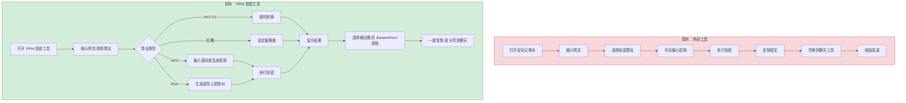
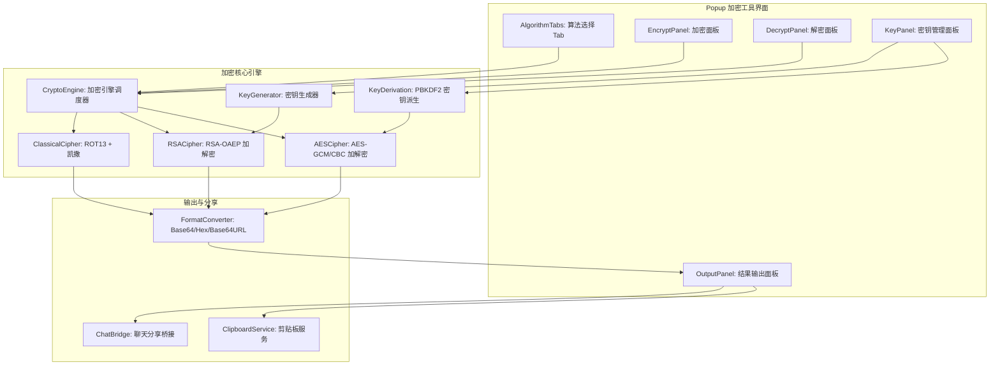
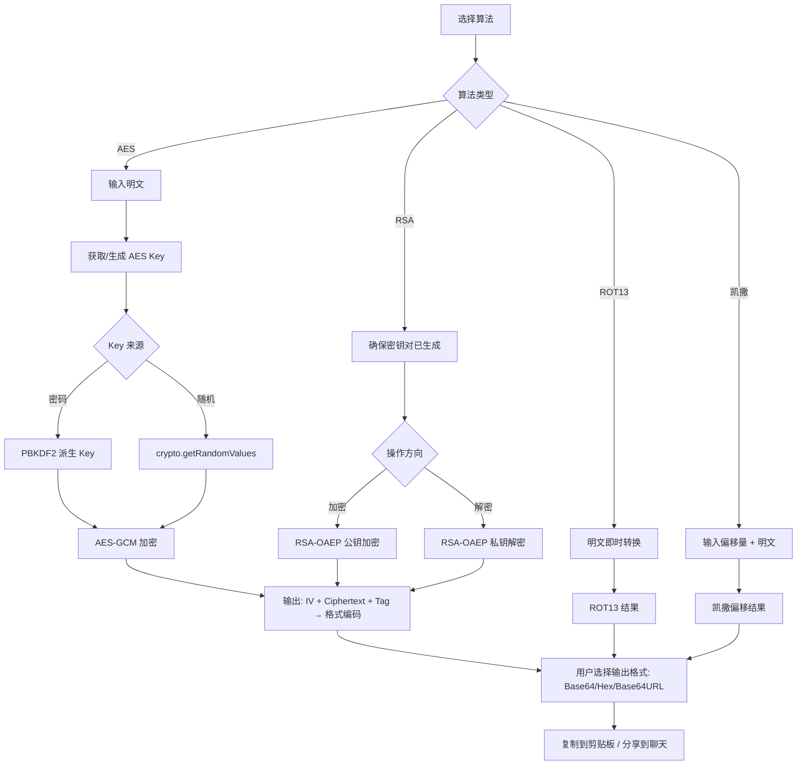

# YP-09-176: 文字加密解密工具 — AES/RSA/ROT13/凯撒密码、密钥生成、密码加密、一键复制、Base64 输出

> 需求编号：YP-09-176 · 优先级：P2 · 人天：0.2d · 状态：需求已编写
> 依赖：YP-09-152（Base64 编解码器，共用编解码逻辑）、YP-09-175（Emoji 搜索复制，共用剪贴板工具）

## 背景

### 问题陈述

用户在多种场景下需要临时加密文本信息：(1) 通过不安全的渠道传递敏感信息（如粘贴到公共频道前先加密），(2) 对本地暂存的密码卡片进行二次加密后存储，(3) 快速使用古典密码（ROT13/凯撒）进行轻量级文字混淆。当前用户在浏览器环境中没有便捷的本地加密工具，要么切换到外部桌面应用，要么打开在线加密工具（存在明文传输风险）。

1. **无本地加密能力**：Chrome 扩展生态中缺少集成的文字加密工具，用户需要切换应用
2. **跨工具流程割裂**：加密后的密文需要手动复制、粘贴到其他工具再发送
3. **密钥管理不便**：AES 密钥和 RSA 密钥对需要手动生成和管理
4. **加密结果格式单一**：仅输出一种编码格式（Hex/Base64），不支持按场景切换
5. **无一键分享能力**：加密密文无法直接从工具中分享到聊天窗口

**核心矛盾**：用户在浏览器中需要即时的文字加密能力，但现有工具要么不安全（在线服务），要么不方便（外部应用）。YiPet 作为浏览器扩展，可以在本地完成全部加密运算，密文和密钥永不离开浏览器。

### 影响范围

| # | 影响 | 严重程度 | 典型场景 |
|---|------|----------|----------|
| 1 | 敏感信息临时保护缺失 | 高 | 需要分享密码片段给同事 |
| 2 | 古典密码学习/教学不便 | 中 | 教学场景中展示凯撒加密原理 |
| 3 | 跨工具加密流程繁琐 | 高 | 加密后→复制→打开聊天→粘贴 |
| 4 | 本地密钥管理空白 | 中 | 需要临时生成 AES 密钥对文本加密 |
| 5 | 加密结果格式切换无 | 中 | 需在不同平台用不同格式的密文 |

### 挑战

| 挑战 | 说明 |
|------|------|
| Web Crypto API 兼容性 | AES/RSA 加密依赖 `SubtleCrypto`，在非安全上下文下不可用（但扩展页面为安全上下文） |
| RSA 密钥长度与性能 | 2048/4096 位 RSA 密钥生成耗时较长（100ms-2s），需提供进度反馈 |
| 古典密码的中文支持 | ROT13 和凯撒密码仅对 ASCII 字母有效，CJK 字符需要特殊说明或跳过 |
| 密钥存储安全 | 生成的密钥不应该明文持久化，仅保存在当前会话内存中 |
| 聊天分享集成 | 加密结果分享到聊天窗口需要 YiPet 跨模块通信（Popup → Content Script） |

---

## 一、现状分析

### 1.1 当前加密相关功能

```
现有加密相关功能:
├── YiPet Popup
│   └── 无文字加密工具入口
├── 已实现加密相关
│   ├── base64 编解码器（YP-09-152）✅
│   ├── 哈希计算器（YP-09-153）✅
│   └── JWT 解码器（YP-09-170）✅
├── Content Script
│   └── 无加密处理逻辑
└── Service Worker
    └── 无 Web Crypto 调用

缺失:
├── AES-CBC/GCM 加密/解密        # ❌ 不存在
├── RSA-OAEP 加密/解密           # ❌ 不存在
├── ROT13 加解密                 # ❌ 不存在
├── 凯撒密码加解密               # ❌ 不存在
├── 密钥生成（AES/RSA）          # ❌ 不存在
├── 密码 → AES Key 派生          # ❌ 不存在
├── 密文一键分享到聊天           # ❌ 不存在
└── 多格式输出切换               # ❌ 不存在
```

### 1.2 用户加密流程（现状 vs 目标）



### 1.3 根因矩阵

| 症状 | 根因 | 触发条件 | 频率 |
|------|------|----------|------|
| 无本地加密 | 未集成 Web Crypto API 封装 | 需要加密文本时 | 高 |
| 古典密码工具缺失 | 未实现 ROT13/凯撒算法 | 教学或轻量混淆 | 中 |
| 密钥管理不便 | 未实现密钥生成与导出 | 需要 AES/RSA 加密时 | 高 |
| 分享流程割裂 | 未实现加密→聊天桥接 | 加密后需要传递密文 | 中 |
| 输出格式单一 | 未提供格式切换 | 对接不同系统 | 中 |

---

## 二、设计决策

### 决策 1：加密算法选择 — 仅 AES vs AES+RSA vs 四种算法全覆盖

| 选项 | 安全性 | 实现复杂度 | 适用场景 |
|------|--------|-----------|----------|
| 仅 AES（对称） | 高 | 中 | 加密/解密使用相同密码 |
| AES + RSA（非对称） | 高 | 高 | 公钥加密/私钥解密 |
| 四种算法全覆盖（AES/RSA/ROT13/凯撒） | 混合 | 中 | 覆盖所有需求场景 |

**选择：四种算法全覆盖。** AES 和 RSA 提供强加密，ROT13 和凯撒提供教学/轻量混淆场景。古典密码实现极简（每种 < 20 行），不增加显著复杂度。四种算法以 Tab 切换方式组织，用户按需选择。

### 决策 2：AES 工作模式 — CBC vs GCM vs CTR

| 选项 | 安全性 | 认证加密 | 实现复杂度 |
|------|--------|----------|-----------|
| AES-CBC | 中（需单独处理 IV 和 Padding） | 否 | 低 |
| AES-GCM | 高（自带认证标签） | 是 | 中 |
| AES-CTR | 中（需防止 nonce 重用） | 否 | 低 |

**选择：AES-GCM（默认）+ AES-CBC（可选）。** GCM 提供认证加密（AEAD），是现代加密的最佳实践。CBC 作为兼容模式保留，用于需要与旧系统互通时。用户界面默认选中 GCM，并在模式切换时给出安全提示。

### 决策 3：密码 → AES 密钥派生 — 不使用 KDF vs PBKDF2 vs 直接 SHA-256

| 选项 | 安全性 | 实现复杂度 | 性能 |
|------|--------|-----------|------|
| 直接 SHA-256（密码作为 Key） | 低（弱密码极不安全） | 低 | 快 |
| PBKDF2（100K 迭代） | 高（抗暴力破解） | 中 | 慢（~500ms） |
| 使用随机 Key（session 内保存） | 中 | 低 | 快 |

**选择：PBKDF2（100K 迭代）用于密码派生 + 随机 Key 生成并存。** 用户可以选择"输入密码"（PBKDF2 派生）或"生成随机 Key"（crypto.getRandomValues）。PBKDF2 提供抗暴力破解保护，随机 Key 提供极致安全性。界面默认推荐"生成随机 Key"并警告密码模式的弱密码风险。

### 决策 4：密文输出格式 — 仅 Base64 vs 仅 Hex vs 多格式可切换

| 选项 | 可读性 | 长度 | 通用性 |
|------|--------|------|--------|
| Base64 | 中 | 短（每 3 字节 → 4 字符） | 高 |
| Hex | 低 | 长（每字节 → 2 字符） | 高 |
| Base64URL | 中 | 短 | 中（URL 安全） |
| 三种可切换 | 高 | — | 极高 |

**选择：Base64（默认）+ Hex + Base64URL 三种可切换。** 不同的目标系统可能要求不同的密文格式，提供切换按钮让用户可以按需选择。默认 Base64 因为其最短且最常见。Hex 用于需要与其他十六进制工具链对接的场景。

### 设计决策记录

| 决策 | 选项 A | 选项 B | 选项 C | 选项 D | 选择 | 理由 |
|------|--------|--------|--------|--------|------|------|
| 算法范围 | 仅 AES | AES+RSA | 四种全覆盖 | — | **全覆盖** | 古典密码极简 |
| AES 模式 | CBC | GCM | CTR | — | **GCM+CBC** | GCM 现代标准 |
| 密码派生 | SHA-256 | PBKDF2 | 随机 Key | — | **PBKDF2+随机Key** | 安全灵活 |
| 输出格式 | Base64 | Hex | Base64URL | 三切换 | **三切换** | 通用性 |

---

## 三、目标架构

### 3.1 加密工具系统架构



### 3.2 加密/解密流程



### 3.3 性能指标

| 指标 | 目标值 | 说明 |
|------|--------|------|
| AES-GCM 加密（1KB 明文） | < 5ms | SubtleCrypto.encrypt |
| AES-GCM 解密（1KB 密文） | < 5ms | SubtleCrypto.decrypt |
| RSA-2048 加密（256B 明文） | < 10ms | 公钥加密 |
| RSA-2048 解密（256B 密文） | < 50ms | 私钥解密 |
| RSA-2048 密钥对生成 | < 2s | SubtleCrypto.generateKey |
| PBKDF2 派生（100K 迭代） | < 500ms | SubtleCrypto.deriveKey |
| ROT13/凯撒转换（1MB 文本） | < 10ms | 纯字符映射 |
| 格式转换（Base64/Hex） | < 1ms | 转码 |

---

## 四、具体改动

### 4.1 加密类型定义

```typescript
// src/crypto/types.ts (新增)

export enum AlgorithmType {
  AES_GCM = 'aes-gcm',
  AES_CBC = 'aes-cbc',
  RSA_OAEP = 'rsa-oaep',
  ROT13 = 'rot13',
  CAESAR = 'caesar',
}

export enum OutputFormat {
  BASE64 = 'base64',
  HEX = 'hex',
  BASE64URL = 'base64url',
}

export enum KeySource {
  PASSWORD = 'password',   // PBKDF2 从密码派生
  RANDOM = 'random',       // crypto.getRandomValues
  IMPORTED = 'imported',   // 从文件/PEM 导入
}

export interface AESConfig {
  mode: 'gcm' | 'cbc';
  keyLength: 128 | 192 | 256;   // 默认 256
  keySource: KeySource;
  password?: string;             // 密码（当 keySource === PASSWORD）
  iterations?: number;           // PBKDF2 迭代次数，默认 100000
}

export interface RSAConfig {
  keyLength: 2048 | 4096;       // 默认 2048
  hash: 'SHA-256' | 'SHA-384' | 'SHA-512';
  keySource: KeySource;
  publicKeyPem?: string;         // 导入公钥
  privateKeyPem?: string;        // 导入私钥
}

export interface CaesarConfig {
  shift: number;                  // 偏移量（1-25）
  alphabet: 'latin' | 'custom';  // 字母表
  customAlphabet?: string;       // 自定义字母表
}

export interface EncryptionRequest {
  plaintext: string;
  algorithm: AlgorithmType;
  config: AESConfig | RSAConfig | CaesarConfig;
}

export interface EncryptionResult {
  ciphertext: string;            // 加密结果（原始字节的编码）
  format: OutputFormat;
  metadata: {
    algorithm: AlgorithmType;
    iv?: string;                 // AES IV（编码后）
    tag?: string;                // AES-GCM 认证标签
    keyFingerprint?: string;    // 密钥指纹（SHA-256 前 8 位）
    timestamp: number;
  };
}

export interface KeyPairInfo {
  publicKeyJwk: JsonWebKey;
  publicKeyPem?: string;
  keyFingerprint: string;       // SHA-256 前 8 位
  algorithm: 'RSA-OAEP';
  keyLength: number;
  createdAt: number;
}
```

### 4.2 加密引擎实现

```typescript
// src/crypto/CryptoEngine.ts (新增)

import type { EncryptionRequest, EncryptionResult, OutputFormat } from './types';
import { AlgorithmType } from './types';

export class CryptoEngine {
  private aesCipher: AESCipher;
  private rsaCipher: RSACipher;
  private classicalCipher: ClassicalCipher;
  private formatConverter: FormatConverter;

  constructor() {
    this.aesCipher = new AESCipher();
    this.rsaCipher = new RSACipher();
    this.classicalCipher = new ClassicalCipher();
    this.formatConverter = new FormatConverter();
  }

  async encrypt(req: EncryptionRequest): Promise<EncryptionResult> {
    switch (req.algorithm) {
      case AlgorithmType.AES_GCM:
      case AlgorithmType.AES_CBC:
        return this.aesCipher.encrypt(req);
      case AlgorithmType.RSA_OAEP:
        return this.rsaCipher.encrypt(req);
      case AlgorithmType.ROT13:
        return this.classicalCipher.rot13(req.plaintext, req.config as any);
      case AlgorithmType.CAESAR:
        return this.classicalCipher.caesar(req.plaintext, req.config as any);
      default:
        throw new CryptoError(`不支持的算法: ${req.algorithm}`);
    }
  }

  async decrypt(
    ciphertext: string,
    format: OutputFormat,
    algorithm: AlgorithmType,
    config: any,
    metadata: any
  ): Promise<string> {
    // Base64/Hex/Base64URL → ArrayBuffer
    const rawBytes = this.formatConverter.decode(ciphertext, format);

    switch (algorithm) {
      case AlgorithmType.AES_GCM:
      case AlgorithmType.AES_CBC:
        return this.aesCipher.decrypt(rawBytes, config, metadata);
      case AlgorithmType.RSA_OAEP:
        return this.rsaCipher.decrypt(rawBytes, config);
      case AlgorithmType.ROT13:
        return this.classicalCipher.rot13(ciphertext, config);
      case AlgorithmType.CAESAR:
        return this.classicalCipher.caesarDecrypt(ciphertext, config);
      default:
        throw new CryptoError(`不支持的算法: ${algorithm}`);
    }
  }

  async generateAESKey(config: AESConfig): Promise<CryptoKey> {
    // 如果密码模式，使用 PBKDF2 派生
    if (config.keySource === 'password' && config.password) {
      return KeyDerivation.deriveAESKeyFromPassword(
        config.password, 
        config.keyLength, 
        config.iterations || 100000
      );
    }
    // 随机模式
    return crypto.subtle.generateKey(
      { name: 'AES-GCM', length: config.keyLength },
      true,
      ['encrypt', 'decrypt']
    );
  }

  async generateRSAKeyPair(config: RSAConfig): Promise<{
    publicKey: CryptoKey;
    privateKey: CryptoKey;
    info: KeyPairInfo;
  }> {
    const keyPair = await crypto.subtle.generateKey(
      {
        name: 'RSA-OAEP',
        modulusLength: config.keyLength,
        publicExponent: new Uint8Array([1, 0, 1]),
        hash: config.hash,
      },
      true,
      ['encrypt', 'decrypt']
    );

    // 导出公钥 JWK 用于显示和分享
    const publicKeyJwk = await crypto.subtle.exportKey('jwk', keyPair.publicKey);

    return {
      publicKey: keyPair.publicKey,
      privateKey: keyPair.privateKey,
      info: {
        publicKeyJwk,
        keyFingerprint: await this.computeFingerprint(publicKeyJwk),
        algorithm: 'RSA-OAEP',
        keyLength: config.keyLength,
        createdAt: Date.now(),
      },
    };
  }

  private async computeFingerprint(jwk: JsonWebKey): Promise<string> {
    const data = new TextEncoder().encode(JSON.stringify({ n: jwk.n, e: jwk.e }));
    const hash = await crypto.subtle.digest('SHA-256', data);
    return Array.from(new Uint8Array(hash.slice(0, 4)))
      .map(b => b.toString(16).padStart(2, '0'))
      .join('');
  }
}
```

### 4.3 古典密码实现

```typescript
// src/crypto/ClassicalCipher.ts (新增)

export class ClassicalCipher {
  /** ROT13 加解密（自逆运算） */
  rot13(text: string): string {
    return text.replace(/[a-zA-Z]/g, (char) => {
      const base = char <= 'Z' ? 65 : 97;
      return String.fromCharCode(((char.charCodeAt(0) - base + 13) % 26) + base);
    });
  }

  /** 凯撒密码加密 */
  caesar(text: string, shift: number): string {
    shift = ((shift % 26) + 26) % 26; // 规范化为 0-25
    return text.replace(/[a-zA-Z]/g, (char) => {
      const base = char <= 'Z' ? 65 : 97;
      return String.fromCharCode(((char.charCodeAt(0) - base + shift) % 26) + base);
    });
  }

  /** 凯撒密码解密 */
  caesarDecrypt(text: string, shift: number): string {
    return this.caesar(text, 26 - (shift % 26));
  }
}
```

### 4.4 格式转换器

```typescript
// src/crypto/FormatConverter.ts (新增)

import { OutputFormat } from './types';

export class FormatConverter {
  /** ArrayBuffer → 指定格式字符串 */
  encode(buffer: ArrayBuffer, format: OutputFormat): string {
    const bytes = new Uint8Array(buffer);
    switch (format) {
      case OutputFormat.BASE64:
        return btoa(String.fromCharCode(...bytes));
      case OutputFormat.HEX:
        return Array.from(bytes, b => b.toString(16).padStart(2, '0')).join('');
      case OutputFormat.BASE64URL:
        return btoa(String.fromCharCode(...bytes))
          .replace(/\+/g, '-').replace(/\//g, '_').replace(/=+$/, '');
    }
  }

  /** 格式字符串 → ArrayBuffer */
  decode(encoded: string, format: OutputFormat): ArrayBuffer {
    switch (format) {
      case OutputFormat.BASE64:
        return Uint8Array.from(atob(encoded), c => c.charCodeAt(0)).buffer;
      case OutputFormat.HEX:
        return new Uint8Array(
          encoded.match(/.{1,2}/g)!.map(b => parseInt(b, 16))
        ).buffer;
      case OutputFormat.BASE64URL:
        return this.decode(
          encoded.replace(/-/g, '+').replace(/_/g, '/'),
          OutputFormat.BASE64
        );
    }
  }
}
```

### 4.5 文件变更清单

| 文件 | 操作 | 说明 |
|------|------|------|
| `src/crypto/types.ts` | 新增 | 加密类型定义 |
| `src/crypto/CryptoEngine.ts` | 新增 | 加密引擎调度器 |
| `src/crypto/AESCipher.ts` | 新增 | AES-GCM/CBC 加解密 |
| `src/crypto/RSACipher.ts` | 新增 | RSA-OAEP 加解密 |
| `src/crypto/ClassicalCipher.ts` | 新增 | ROT13 + 凯撒密码 |
| `src/crypto/KeyDerivation.ts` | 新增 | PBKDF2 密钥派生 |
| `src/crypto/FormatConverter.ts` | 新增 | Base64/Hex/Base64URL 转换 |
| `src/crypto/SecureStore.ts` | 新增 | 会话内密钥存储 |
| `src/components/CryptoTool.vue` | 新增 | 加密工具 UI 组件 |
| `src/popup/App.vue` | 修改 | 集成加密工具 Tab |

---

## 五、实施步骤

| 步骤 | 操作 | 路径 | 验证 | 人天 |
|------|------|------|------|------|
| 1 | 定义类型 | `src/crypto/types.ts` | 类型检查通过 | 0.01 |
| 2 | 实现格式转换器 | `src/crypto/FormatConverter.ts` | Base64/Hex/Base64URL 互相转换正确 | 0.02 |
| 3 | 实现古典密码 | `src/crypto/ClassicalCipher.ts` | ROT13 自逆、凯撒偏移正确 | 0.01 |
| 4 | 实现 AES 加解密 | `src/crypto/AESCipher.ts` | AES-GCM/CBC 加解密+PBKDF2 派生 | 0.04 |
| 5 | 实现 RSA 加解密 | `src/crypto/RSACipher.ts` | RSA-OAEP 密钥对生成+加解密 | 0.03 |
| 6 | 实现加密引擎调度 | `src/crypto/CryptoEngine.ts` | 多算法统一调度 | 0.02 |
| 7 | 实现 UI 组件 | `src/components/CryptoTool.vue` | 四算法 Tab + 密钥管理 + 格式切换 | 0.05 |
| 8 | 集成分享桥接 | `src/crypto/ChatBridge.ts` | 密文→聊天窗口 | 0.01 |
| 9 | 集成到 Popup | `src/popup/App.vue` | 加密工具 Tab 可用 | 0.01 |

**总人天：0.2d**

---

## 六、测试规格

### 场景 1：AES-GCM 加密/解密循环

**GIVEN** 明文 = "Hello, 世界!", AES-256-GCM, 随机 Key
**WHEN** 加密后得到密文（Base64） + IV + Tag，然后用相同 Key 解密
**THEN** 解密结果 === "Hello, 世界!"
**AND** 密文 !== 明文
**AND** 同一明文两次加密产生不同密文（随机 IV）

### 场景 2：密码模式 PBKDF2 派生

**GIVEN** 明文 = "secret data", 密码 = "myPassword123", AES-256-GCM
**WHEN** 使用密码派生 Key 加密，再用相同密码派生 Key 解密
**THEN** 解密结果 === "secret data"
**AND** 不同密码解密失败

### 场景 3：ROT13 自逆性

**GIVEN** 文本 = "Hello World! 12345 中文"
**WHEN** 执行 ROT13 两次
**THEN** 结果 === "Hello World! 12345 中文"
**AND** 一次 ROT13 = "Uryyb Jbeyq! 12345 中文"
**AND** 非字母字符（数字、中文、标点）保持不变

### 场景 4：凯撒密码正确偏移

**GIVEN** 文本 = "ABC xyz", 偏移 = 3
**WHEN** 凯撒加密
**THEN** 结果 = "DEF abc"
**AND** 解密（偏移 3）恢复为 "ABC xyz"
**AND** 偏移 26（MOD 26）等于偏移 0

### 场景 5：RSA 加密/解密循环

**GIVEN** 明文 = "RSA test message"（< 256 字节），RSA-2048-OAEP
**WHEN** 生成密钥对，公钥加密 → 私钥解密
**THEN** 解密结果 === "RSA test message"
**AND** 密文长度 > 明文长度
**AND** 私钥加密 → 公钥解密（签名模式）也正确

### 场景 6：格式转换一致性

**GIVEN** 同一原始字节数组 [0x48, 0x65, 0x6C, 0x6C, 0x6F]
**WHEN** 分别编码为 Base64、Hex、Base64URL
**THEN** Base64 = "SGVsbG8=", Hex = "48656c6c6f", Base64URL = "SGVsbG8"
**AND** decode(encode(bytes, FMT), FMT) === bytes（往返一致性）

---

## 七、风险与缓解

| 风险 | 概率 | 影响 | 缓解措施 |
|------|------|------|----------|
| SubtleCrypto 在非安全上下文不可用 | 低 | 高 | 扩展页面（chrome-extension://）天然是安全上下文；添加运行时检测+降级提示 |
| RSA 密钥生成耗时阻塞 UI | 中 | 中 | 使用 Web Worker 执行密钥生成，UI 显示进度 spinner |
| 密码弱导致 AES 实际强度不足 | 高 | 中 | UI 显示密码强度指示器，弱密码时弹告警但仍允许使用 |
| 用户丢失密码/密钥导致无法解密 | 中 | 高 | 解密界面显著提示"密钥/密码是解密唯一凭证，丢失不可恢复" |
| 古典密码被误用为安全加密 | 中 | 低 | ROT13/凯撒 Tab 顶部显示"⚠️ 仅用于教学和轻量混淆，不提供实际安全性" |
| 大文本（> 1MB）AES 加密性能 | 低 | 低 | 限制单次加密最大 500KB，超出提示分段加密 |

---

## 八、回滚策略

| 场景 | 回滚操作 | 影响 |
|------|----------|------|
| 加密工具导致 Popup 崩溃 | 移除加密工具 Tab | 失去加密功能 |
| Web Crypto API 特定浏览器报错 | 降级提示用户浏览器不支持 | 仅 Chrome 需关注 |
| 分享到聊天功能异常 | 禁用"分享到聊天"按钮 | 仍可复制粘贴 |
| 密钥存储泄漏 | 清空 SecureStore，强制重新生成 | 已加密数据不可解密 |

---

## 九、设计决策记录

### D-01：为什么不使用第三方加密库（如 crypto-js）？

Web Crypto API（SubtleCrypto）具有三个优势：(1) 浏览器原生实现，比 JS 库快 10-100 倍，(2) 密钥存储在浏览器安全边界内，JS 不可直接读取私钥材料，(3) 零依赖体积。crypto-js 体积 ~500KB 且为纯 JS 实现，密钥材料暴露在 JS 堆内存中。仅在需要与旧系统兼容且 SubtleCrypto 不支持的模式时才考虑 JS 库作为降级方案。

### D-02：为什么 AES-GCM 作为默认而非 AES-CBC？

GCM 是认证加密模式（AEAD），加密同时生成认证标签（Tag），解密时自动验证密文是否被篡改。CBC 模式不提供认证，攻击者可能通过修改密文影响解密结果而不被发现。GCM 是现代加密标准（TLS 1.3 强制要求），虽然可能稍慢但安全性显著更高。CBC 保留作为兼容选项，仅当需要与使用 CBC 的旧系统互操作时使用。

### D-03：为什么 RSA 密钥长度默认 2048 而非 4096？

RSA-2048 在可预见的未来（至 2030 年）仍被认为是安全的。4096 位密钥生成耗时是 2048 的 4-6 倍（约 5-10 秒），且加密/解密也慢 4 倍。对于浏览器扩展的临时加密场景，2048 足以满足需求。提供 4096 选项供对安全性要求极高的用户手动选择。

### D-04：为什么限制单次加密最大 500KB？

AES-GCM 的 API 规范允许的最大明文长度为 2^39 - 256 字节（约 512GB），但 SubtleCrypto 的 `encrypt()` 方法会将整个 ArrayBuffer 读入内存。对于> 500KB 的文本，加密虽然功能上可行，但 UI 渲染（大文本输入框 + 密文输出）会显著影响用户体验。500KB 的上限覆盖了绝大多数使用场景（文本片段、代码块、配置信息）。

---

## 十、可观测性

### 指标

| 指标 | 类型 | 说明 |
|------|------|------|
| `yipet.crypto.encrypt_total` | Counter | 加密总次数（按算法类型） |
| `yipet.crypto.decrypt_total` | Counter | 解密总次数（按算法类型） |
| `yipet.crypto.keygen_total` | Counter | 密钥生成次数 |
| `yipet.crypto.algorithm_distribution` | Histogram | 算法使用分布 |
| `yipet.crypto.format_switch` | Counter | 输出格式切换次数 |
| `yipet.crypto.share_to_chat` | Counter | 分享到聊天次数 |

### 告警

| 告警 | 条件 | 级别 |
|------|------|------|
| WebCrypto API 不可用 | 页面加载时检测失败 | ERROR |
| RSA 密钥生成超时（> 10s） | 单次生成超时 | WARNING |

---

## 十一、代码审查检查清单

- [ ] AES-GCM 每次加密使用新的随机 IV（crypto.getRandomValues(12)）
- [ ] AES-GCM 认证标签不被截断（tagLength = 128）
- [ ] PBKDF2 迭代次数默认 100K，不使用默认值
- [ ] RSA 加密检查明文长度 < keyLength - 2*hashLength - 2
- [ ] 古典密码仅对 ASCII 字母字符变换，非字母字符原样返回
- [ ] 格式转换 encode/decode 满足往返一致性
- [ ] 密钥不写入 localStorage/sessionStorage，仅保留在 JS 闭包中
- [ ] 分享到聊天前确认用户意图（弹窗）
- [ ] Base64URL 正确处理 `=` padding 去除
- [ ] 暗色模式适配加密/解密结果展示区域
- [ ] 密码强度指示器使用 zxcvbn 或简单熵计算

---

## 回归问题预测

| # | 预测问题 | 原因 | 验证方法 |
|---|---------|------|---------|
| 1 | AES-GCM 解密时，如果 IV 或 Tag 被截断/修改，SubtleCrypto.decrypt 会抛出 OperationError，需要正确捕获并给用户可读的错误消息 | GCM 的认证失败意味着密文或关联数据已被篡改，API 设计是"解密失败"而非"返回篡改后的明文" | 手动修改 Base64 密文中的 1 个字符，验证 decrypt 抛出清晰错误而非静默返回乱码 |
| 2 | PBKDF2 的 salt 如果使用固定字符串而非随机生成，相同密码始终派生出相同密钥，违反密码学安全原则 | PBKDF2 的 salt 必须是随机且每次不同的，否则攻击者可以预计算彩虹表 | 检查 KeyDerivation.deriveAESKeyFromPassword 是否使用 crypto.getRandomValues 生成 salt 并存储 salt 与密文一起 |
| 3 | ROT13 对非 ASCII 字符（如 accented letters: é, ñ, ü）的处理因正则 `/a-zA-Z/` 不匹配这些字符而原样输出，但用户可能期望它们也被变换 | JavaScript 中 é.charCodeAt(0) = 233，不属于 A-Z 或 a-z 范围 | 用 "café résumé naïve" 测试，验证重音字符按预期处理（当前设计：原样保留，文档说明） |
| 4 | `btoa()` 对包含非 Latin-1 字符（码点 > 255）的字符串会抛出 InvalidCharacterError，如果用户直接将包含中文的明文 Base64 编码 | `btoa` 仅接受 Latin-1（0-255）字符，中文等需要先 TextEncoder→Uint8Array→btoa(Uint8Array) | 对包含 "你好" 的明文进行 AES 加密后输出 Base64，验证密文编码不抛异常 |
| 5 | RSA-OAEP 加密时，明文长度超出 `modulusLength/8 - 2*hashLength/8 - 2` 字节（2048 位 / SHA-256 → 最大 190 字节），API 抛出错误但用户界面未显示明确限制 | 对于 2048 位 RSA + SHA-256，最大加密输入为 190 字节（约 190 个 ASCII 字符），超出后 API 直接失败 | 明文输入框显示剩余可用字节数（"已输入 150/190 字符"），超出时禁用加密按钮并变红 |
| 6 | 四个算法 Tab 之间切换时，如果之前已选择密钥/密码，状态未清理可能导致跨算法泄漏 | Vue 组件切换 Tab 时，v-if 销毁子组件但父组件 data 中的密钥引用仍存在 | 算法切换时主动清理上一个算法的密钥引用（设为 null），验证内存中无残留 |

---

## 性能分析

### 各阶段耗时

| 阶段 | 预估耗时 | 说明 |
|------|----------|------|
| AES-GCM 加密（1KB） | < 5ms | SubtleCrypto，硬件加速 |
| AES-GCM 解密（1KB） | < 5ms | 同上 |
| PBKDF2 派生（100K 迭代） | 200-500ms | 取决于 CPU，异步不阻塞 UI |
| RSA-2048 密钥生成 | 500ms-2s | Web Worker 执行 |
| RSA-2048 公钥加密（190B） | < 5ms | 公钥操作快 |
| RSA-2048 私钥解密（256B） | 30-80ms | 私钥操作慢 |
| ROT13/凯撒（1MB） | 5-15ms | 正则 + 字符映射 |
| Base64/Hex 转换（1KB） | < 0.5ms | 简单映射 |
| UI 渲染（算法 Tab 切换） | < 16ms | 单帧 |

### 体积预估

| 文件 | 大小 | 说明 |
|------|------|------|
| `src/crypto/types.ts` | ~1.5KB | 类型定义 |
| `src/crypto/CryptoEngine.ts` | ~3KB | 引擎调度 |
| `src/crypto/AESCipher.ts` | ~3KB | AES 加解密 |
| `src/crypto/RSACipher.ts` | ~3KB | RSA 加解密 |
| `src/crypto/ClassicalCipher.ts` | ~1KB | 古典密码 |
| `src/crypto/KeyDerivation.ts` | ~2KB | PBKDF2 派生 |
| `src/crypto/FormatConverter.ts` | ~1KB | 格式转换 |
| `src/crypto/SecureStore.ts` | ~1KB | 会话存储 |
| `src/components/CryptoTool.vue` | ~8KB | UI 组件 |
| **总计** | **~23.5KB** | 无第三方依赖 |