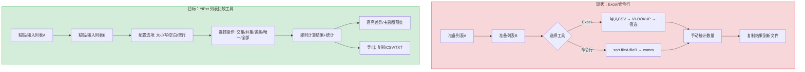
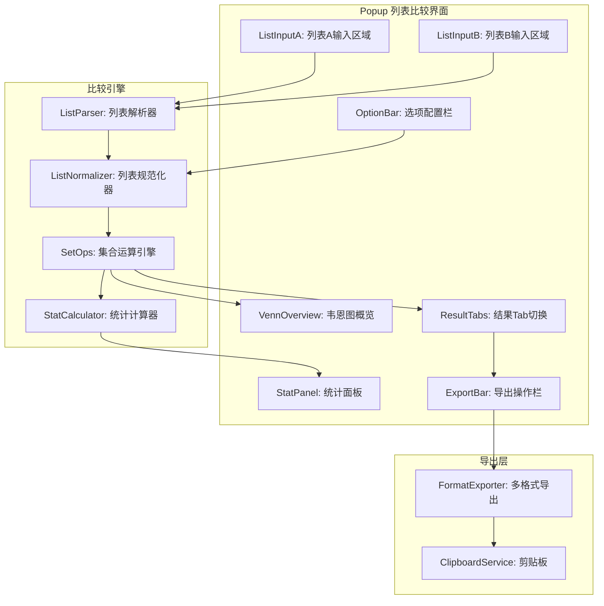

# YP-09-177: 列表比较工具 — 交集/并集/差集/唯一项、大小写开关、脱空白、结果统计、导出

> 需求编号：YP-09-177 · 优先级：P2 · 人天：0.2d · 状态：需求已编写
> 依赖：YP-09-149（正则测试器，共用文本输入布局）

## 背景

### 问题陈述

数据分析师、开发者和运营人员在日常工作中频繁需要比较两列数据：(1) 对比两个版本的配置列表差异，(2) 找出两个用户群体的交集，(3) 计算A列表独有而B列表没有的项，(4) 合并去重两份名单。当前大多数用户要么使用 Excel 的 VLOOKUP/条件格式，要么使用命令行 `comm`/`diff` 工具，要么通过在线工具完成——流程割裂且学习成本高。

1. **命令行门槛高**：`comm` 需要排序后的输入，`diff` 输出格式不够直观
2. **Excel 操作繁琐**：需要创建辅助列、编写公式、条件格式高亮
3. **在线工具数据安全**：粘贴敏感数据到第三方网站存在泄漏风险
4. **结果无法复用**：计算完结果后需要手动复制到其他工具做后续处理
5. **缺少统计信息**：大多数工具只输出结果，不输出数量统计

**核心矛盾**：列表比较是高频场景，但现有工具的易用性、安全性和统计能力都不足。YiPet 作为浏览器扩展可以零门槛使用，数据完全本地处理。

### 影响范围

| # | 影响 | 严重程度 | 典型场景 |
|---|------|----------|----------|
| 1 | 列表差异对比效率低 | 高 | 对比两个版本的配置项 |
| 2 | Excel 操作繁琐 | 中 | 运营同学用 Excel 分析用户列表 |
| 3 | 在线工具安全风险 | 中 | 粘贴客户名单到第三方比较网站 |
| 4 | 缺少统计信息 | 中 | 只知道差集项目，不知道数量 |
| 5 | 结果无法导出 | 中 | 结果需要手动复制再粘贴 |

### 挑战

| 挑战 | 说明 |
|------|------|
| 大小写敏感性 | 默认大小写敏感？还是提供开关？不同场景需求不同 |
| 空白字符处理 | 用户粘贴的数据可能包含前后空格、Tab、全角空格 |
| 大列表性能 | 两列各 100K 行的比较，纯 JS 集合运算可能耗时 |
| 重复项处理 | A 列表内或 B 列表内的重复项如何处理？去重后比较 vs 保留重复 |
| 导出格式 | 纯文本 vs CSV vs 复制到剪贴板 |

---

## 一、现状分析

### 1.1 当前列表比较功能

```
现有列表比较功能:
├── YiPet Popup
│   └── 无列表比较工具入口
├── 已实现数据对比相关
│   ├── 文本差异对比（YP-09-148）✅（逐行 diff）
│   ├── JSON 格式化验证（YP-09-150）✅
│   └── 文本统计计数器（YP-09-169）✅
├── Content Script
│   └── 无数据处理功能
└── 依赖库
    └── 无集合运算依赖

缺失:
├── 交集计算（A ∩ B）            # ❌ 不存在
├── 并集计算（A ∪ B）            # ❌ 不存在
├── 差集计算（A - B, B - A）     # ❌ 不存在
├── 唯一项（A Δ B 对称差）       # ❌ 不存在
├── 大小写不敏感选项             # ❌ 不存在
├── 空白裁剪选项                 # ❌ 不存在
├── 结果统计（计数+百分比）      # ❌ 不存在
├── 结果导出（JSON/CSV/TXT）     # ❌ 不存在
└── 忽略空行选项                 # ❌ 不存在
```

### 1.2 列表比较流程（现状 vs 目标）



### 1.3 根因矩阵

| 症状 | 根因 | 触发条件 | 频率 |
|------|------|----------|------|
| 无集成列表比较 | 未实现集合运算模块 | 需要比较列表时 | 高 |
| Excel 操作耗时 | 缺少浏览器本地工具 | 运营人员比较数据 | 高 |
| 统计信息缺失 | 仅输出结果不输出计数 | 需要了解差异规模 | 中 |
| 选项不灵活 | 未提供大小写/空白/空行配置 | 数据格式不规范时 | 中 |
| 结果无法复用 | 未实现导出功能 | 结果需要用于其他流程 | 中 |

---

## 二、设计决策

### 决策 1：比较算法 — 纯 Set vs Trie vs 排序后双指针

| 选项 | 时间复杂度 | 空间复杂度 | 实现复杂度 | 适用场景 |
|------|-----------|-----------|-----------|----------|
| 纯 Set（HashMap） | O(n+m) | O(n+m) | 低 | 通用，10K 以内 |
| Trie 树 | O(n+m) | O(n*m*alphabet) | 中 | 大量公共前缀 |
| 排序后双指针 | O(n log n) | O(1) 额外 | 中 | 内存敏感 |

**选择：纯 Set（JavaScript Set）。** (1) Set 是 ES6 原生实现，底层为 HashMap，交集/并集/差集均为 O(n+m)，(2) 100K 行列表的 Set 操作 < 50ms，足够快，(3) 实现极简。如果数据量 > 500K 行，考虑 Web Worker 中执行排序后双指针以节省内存。

### 决策 2：重复项处理 — 去重后比较 vs 保留重复项比较

| 选项 | 语义清晰度 | 适用场景 | 实现复杂度 |
|------|-----------|----------|-----------|
| 去重后比较（Set 语义） | 高 | 大部分场景 | 低 |
| 保留重复项（Bag/MultiSet 语义） | 中 | 频次分析 | 中 |
| 双模式（可选） | 高 | 全覆盖 | 高 |

**选择：去重后比较（默认）+ 保留重复项计数展示。** 大部分"列表比较"场景的语义是"有哪些不同/相同的条目"，而非"重复项影响"。Set 语义天然匹配。但额外在结果中展示"A 列表中重复项数量"和"B 列表中重复项数量"，让用户了解数据质量。

### 决策 3：结果展示 — 纯文本列表 vs 表格 vs 韦恩图+文本

| 选项 | 直观性 | 信息密度 | 实现复杂度 |
|------|--------|----------|-----------|
| 纯文本列表 | 低 | 高 | 低 |
| 表格（三项分列） | 中 | 高 | 中 |
| 韦恩图 + 可展开文本 | 高 | 高 | 高 |

**选择：韦恩图概览 + 多 Tab 结果展示。** 顶部一个简洁的韦恩图（两个圆圈 + 数字）展示整体关系，下方 Tab 切换：交集 Tab / A独有 Tab / B独有 Tab / 并集 Tab / 对称差 Tab。这种方式既提供了直观的概览，又提供了详细的可操作结果。

### 决策 4：导出格式 — 仅复制 vs 多格式

| 选项 | 用户价值 | 实现复杂度 |
|------|----------|-----------|
| 仅复制到剪贴板 | 中 | 低 |
| 复制 + 下载 TXT | 高 | 低 |
| 复制 + TXT + CSV + JSON | 高 | 中 |

**选择：复制 + TXT + CSV + JSON 全部支持。** 不同用户对导出格式有不同需求：TXT 用于快速粘贴，CSV 用于导入 Excel，JSON 用于程序化处理。四种格式的实现都很简单（formatItems.join('\n') / formatItems.join(',') / JSON.stringify），整体 < 20 行代码。

### 设计决策记录

| 决策 | 选项 A | 选项 B | 选项 C | 选项 D | 选择 | 理由 |
|------|--------|--------|--------|--------|------|------|
| 比较算法 | Set | Trie | 排序双指针 | — | **Set** | 简洁+够快 |
| 重复项 | 去重 | 保留 | 双模式 | — | **去重+统计** | 兼顾 |
| 结果展示 | 纯文本 | 表格 | 韦恩图 | — | **韦恩图+Tab** | 最直观 |
| 导出格式 | 仅复制 | 复制+TXT | 复制+TXT+CSV+JSON | — | **全格式** | 零成本 |

---

## 三、目标架构

### 3.1 列表比较工具系统架构



### 3.2 比较流程

```mermaid
graph TD
    A[输入列表A + 列表B] --> B[按行分割: split]
    B --> C{选项: 忽略空行?}
    C -->|是| D[过滤空行: filter line => line.trim() !== '']
    C -->|否| E[保留空行]
    D --> F{选项: 裁剪空白?}
    E --> F
    F -->|是| G[每行 trim + 合并连续空白]
    F -->|否| H[保留原始格式]
    G --> I{选项: 大小写不敏感?}
    H --> I
    I -->|是| J[每行 toLowerCase/toUpperCase]
    I -->|否| K[保留大小写]
    J --> L[构建 SetA + SetB]
    K --> L
    L --> M[集合运算]
    M --> N[交集: A ∩ B]
    M --> O[并集: A ∪ B]
    M --> P[差集A: A - B]
    M --> Q[差集B: B - A]
    M --> R[对称差: A - B ∪ B - A]
    N --> S[统计: 各项计数 + 百分比]
    O --> S
    P --> S
    Q --> S
    R --> S
    S --> T[韦恩图渲染 + Tab 结果展示]
```

### 3.3 性能指标

| 指标 | 目标值 | 说明 |
|------|--------|------|
| 列表解析（10K 行 x2） | < 5ms | split + trim + Set 构建 |
| 交集/并集/差集（10K x2） | < 2ms | Set 运算 |
| 列表解析（100K 行 x2） | < 50ms | 同上 |
| 交集/并集/差集（100K x2） | < 10ms | Set 运算 |
| 韦恩图渲染（Canvas/SVG） | < 16ms | 简单图形 |
| 结果导出（10K 行） | < 10ms | join + Blob |

---

## 四、具体改动

### 4.1 类型定义

```typescript
// src/compare/types.ts (新增)

export interface CompareOptions {
  caseSensitive: boolean;        // 大小写敏感，默认 true
  trimWhitespace: boolean;       // 裁剪首尾空白，默认 true
  ignoreEmptyLines: boolean;     // 忽略空行，默认 true
  normalizeWhitespace: boolean;  // 合并连续空白为单个空格，默认 false
}

export interface CompareResult {
  intersection: string[];        // 交集 A ∩ B
  union: string[];               // 并集 A ∪ B
  onlyInA: string[];             // A 独有的项 A - B
  onlyInB: string[];             // B 独有的项 B - A
  symmetricDifference: string[]; // 对称差 (A - B) ∪ (B - A)
}

export interface CompareStats {
  totalA: number;                // A 原始行数
  totalB: number;                // B 原始行数
  uniqueA: number;               // A 去重后数量
  uniqueB: number;               // B 去重后数量
  duplicatesA: number;           // A 中重复项数量
  duplicatesB: number;           // B 中重复项数量
  intersectionCount: number;
  unionCount: number;
  onlyInACount: number;
  onlyInBCount: number;
  symmetricDiffCount: number;
  // 百分比
  intersectionPct: number;       // |A ∩ B| / |A ∪ B|
  similarityPct: number;         // Jaccard 相似度
}

export enum ExportFormat {
  PLAIN_TEXT = 'txt',  // 每行一项
  CSV = 'csv',         // 逗号分隔
  JSON = 'json',       // JSON 数组
  CLIPBOARD = 'clip',  // 剪贴板
}
```

### 4.2 列表解析器与集合运算

```typescript
// src/compare/SetOps.ts (新增)

import type { CompareOptions, CompareResult, CompareStats } from './types';

export class SetOps {
  compare(listA: string, listB: string, options: CompareOptions): {
    result: CompareResult;
    stats: CompareStats;
    normalizedA: string[];
    normalizedB: string[];
  } {
    // 1. 解析列表
    let linesA = this.parseLines(listA, options);
    let linesB = this.parseLines(listB, options);

    // 2. 记录统计信息
    const totalA = linesA.length;
    const totalB = linesB.length;

    // 3. 规范化
    linesA = linesA.map(l => this.normalize(l, options));
    linesB = linesB.map(l => this.normalize(l, options));

    // 4. 构建 Set（去重）
    const setA = new Set(linesA);
    const setB = new Set(linesB);

    // 5. 集合运算
    const intersection = [...setA].filter(x => setB.has(x));
    const union = [...new Set([...setA, ...setB])];
    const onlyInA = [...setA].filter(x => !setB.has(x));
    const onlyInB = [...setB].filter(x => !setA.has(x));
    const symmetricDifference = [...onlyInA, ...onlyInB];

    // 6. 统计
    const stats: CompareStats = {
      totalA, totalB,
      uniqueA: setA.size, uniqueB: setB.size,
      duplicatesA: totalA - setA.size,
      duplicatesB: totalB - setB.size,
      intersectionCount: intersection.length,
      unionCount: union.length,
      onlyInACount: onlyInA.length,
      onlyInBCount: onlyInB.length,
      symmetricDiffCount: symmetricDifference.length,
      intersectionPct: union.length > 0 ? intersection.length / union.length : 0,
      similarityPct: setA.size + setB.size > 0
        ? intersection.length / (setA.size + setB.size - intersection.length) : 0,
    };

    return {
      result: { intersection, union, onlyInA, onlyInB, symmetricDifference },
      stats,
      normalizedA: linesA,
      normalizedB: linesB,
    };
  }

  private parseLines(text: string, options: CompareOptions): string[] {
    let lines = text.split(/\r?\n/);
    if (options.ignoreEmptyLines) {
      lines = lines.filter(line => line.trim() !== '');
    }
    return lines;
  }

  private normalize(line: string, options: CompareOptions): string {
    let result = line;
    if (options.trimWhitespace) {
      result = result.trim();
    }
    if (options.normalizeWhitespace) {
      result = result.replace(/\s+/g, ' ');
    }
    if (!options.caseSensitive) {
      result = result.toLowerCase();
    }
    return result;
  }
}
```

### 4.3 Vue 组件核心逻辑

```vue
<!-- src/components/ListCompare.vue (新增) -->
<template>
  <div class="list-compare">
    <div class="input-panels">
      <div class="list-panel">
        <div class="panel-header">
          <span>列表 A</span>
          <span class="line-count">{{ stats.totalA }} 行 (去重 {{ stats.uniqueA }})</span>
        </div>
        <textarea v-model="listA" placeholder="每行一项，粘贴或输入列表A..."/>
      </div>
      <div class="list-panel">
        <div class="panel-header">
          <span>列表 B</span>
          <span class="line-count">{{ stats.totalB }} 行 (去重 {{ stats.uniqueB }})</span>
        </div>
        <textarea v-model="listB" placeholder="每行一项，粘贴或输入列表B..."/>
      </div>
    </div>

    <div class="option-bar">
      <label><input type="checkbox" v-model="options.caseSensitive"> 区分大小写</label>
      <label><input type="checkbox" v-model="options.trimWhitespace"> 裁剪首尾空白</label>
      <label><input type="checkbox" v-model="options.ignoreEmptyLines"> 忽略空行</label>
      <label><input type="checkbox" v-model="options.normalizeWhitespace"> 合并连续空白</label>
      <button @click="compare">比较</button>
    </div>

    <div v-if="result" class="results">
      <!-- 韦恩图概览 -->
      <div class="venn-overview">
        <canvas ref="vennCanvas" width="400" height="250"></canvas>
        <div class="venn-legend">
          <div class="legend-item red">仅 A: {{ stats.onlyInACount }}</div>
          <div class="legend-item blue">仅 B: {{ stats.onlyInBCount }}</div>
          <div class="legend-item purple">交集: {{ stats.intersectionCount }}</div>
        </div>
      </div>

      <!-- 统计卡片 -->
      <div class="stats-cards">
        <div class="stat-card">Jaccard 相似度: {{ (stats.similarityPct * 100).toFixed(1) }}%</div>
        <div class="stat-card">A 重复项: {{ stats.duplicatesA }}</div>
        <div class="stat-card">B 重复项: {{ stats.duplicatesB }}</div>
      </div>

      <!-- 结果 Tab -->
      <div class="result-tabs">
        <button v-for="tab in tabs" :key="tab.key"
          :class="{ active: activeTab === tab.key }"
          @click="activeTab = tab.key">
          {{ tab.label }} ({{ tab.count }})
        </button>
      </div>
      <div class="result-list">
        <div v-for="(item, idx) in currentResult" :key="idx" class="result-item">
          {{ item }}
        </div>
      </div>

      <!-- 导出 -->
      <div class="export-bar">
        <button @click="exportResult('txt')">导出 TXT</button>
        <button @click="exportResult('csv')">导出 CSV</button>
        <button @click="exportResult('json')">导出 JSON</button>
        <button @click="copyToClipboard">复制到剪贴板</button>
      </div>
    </div>
  </div>
</template>
```

### 4.4 文件变更清单

| 文件 | 操作 | 说明 |
|------|------|------|
| `src/compare/types.ts` | 新增 | 比较类型定义 |
| `src/compare/SetOps.ts` | 新增 | 集合运算引擎 |
| `src/compare/ListNormalizer.ts` | 新增 | 列表规范化 |
| `src/compare/VennRenderer.ts` | 新增 | Canvas 韦恩图渲染 |
| `src/compare/ExportService.ts` | 新增 | 多格式导出 |
| `src/components/ListCompare.vue` | 新增 | 列表比较 UI 组件 |
| `src/popup/App.vue` | 修改 | 集成列表比较 Tab |

---

## 五、实施步骤

| 步骤 | 操作 | 路径 | 验证 | 人天 |
|------|------|------|------|------|
| 1 | 定义类型 | `src/compare/types.ts` | 类型检查通过 | 0.01 |
| 2 | 实现列表解析+规范化 | `src/compare/ListNormalizer.ts` | 空格/空白/大小写规范化正确 | 0.02 |
| 3 | 实现集合运算引擎 | `src/compare/SetOps.ts` | 五种运算结果正确 | 0.03 |
| 4 | 实现韦恩图渲染 | `src/compare/VennRenderer.ts` | Canvas 韦恩图正确+自适应 | 0.03 |
| 5 | 实现导出服务 | `src/compare/ExportService.ts` | TXT/CSV/JSON/Clipboard | 0.02 |
| 6 | 实现 UI 组件 | `src/components/ListCompare.vue` | 双输入+选项+韦恩图+Tab+导出 | 0.05 |
| 7 | 集成到 Popup | `src/popup/App.vue` | 列表比较 Tab 可用 | 0.02 |
| 8 | 测试 + edge cases | 大列表/特殊字符 | 全部测试通过 | 0.02 |

**总人天：0.2d**

---

## 六、测试规格

### 场景 1：基础交集计算

**GIVEN** 列表 A = ["a", "b", "c", "d"], 列表 B = ["c", "d", "e", "f"]
**WHEN** 默认选项比较
**THEN** 交集 = ["c", "d"], 仅A = ["a", "b"], 仅B = ["e", "f"]
**AND** 并集 = ["a", "b", "c", "d", "e", "f"]
**AND** 对称差 = ["a", "b", "e", "f"]

### 场景 2：大小写不敏感比较

**GIVEN** 列表 A = ["Apple", "banana", "CHERRY"], 列表 B = ["apple", "Banana", "cherry"]
**WHEN** 大小写不敏感模式比较
**THEN** 交集 = ["apple", "banana", "cherry"]
**AND** 仅A = [], 仅B = []
**AND** 相似度 100%

### 场景 3：空白裁剪

**GIVEN** 列表 A = ["hello ", " world", "  foo  "], 列表 B = ["hello", "world", "foo"]
**WHEN** 启用 trimWhitespace + normalizeWhitespace 比较
**THEN** 交集包含全部三项
**AND** 仅A = [], 仅B = []

### 场景 4：忽略空行

**GIVEN** 列表 A = ["a", "", "b", "   ", "c"], 列表 B = ["a", "b", "c"]
**WHEN** ignoreEmptyLines = true
**THEN** 有效行 A = ["a", "b", "c"], 交集 = ["a", "b", "c"]
**AND** 空行和纯空白行都被过滤

### 场景 5：大数据量性能

**GIVEN** 列表 A: 50,000 行随机 UUID, 列表 B: 50,000 行随机 UUID（50% 重叠）
**WHEN** 执行比较
**THEN** 总耗时 < 200ms
**AND** 结果各项计数之和 = 75,000（25K 交集 + 25K 仅A + 25K 仅B）

### 场景 6：导出格式验证

**GIVEN** 比较结果为 仅A = ["foo", "bar"]
**WHEN** 分别导出 TXT/CSV/JSON
**THEN** TXT = "foo\nbar"
**AND** CSV = "foo,bar"（可选带引号）
**AND** JSON = '["foo","bar"]'
**AND** 剪贴板内容 = "foo\nbar"（默认 TXT 格式）

---

## 七、风险与缓解

| 风险 | 概率 | 影响 | 缓解措施 |
|------|------|------|----------|
| 超大数据集（> 500K 行）浏览器卡顿 | 低 | 中 | 单次限制 200K 行；使用 Web Worker 计算；显示进度 |
| 列表包含特殊字符（逗号、引号）导出 CSV 格式错乱 | 中 | 低 | CSV 导出使用 RFC 4180 规范：字段含逗号/引号时用双引号包裹 |
| 韦恩图 Canvas 渲染在低配设备上慢 | 低 | 低 | 圆的大小根据计数自适应，仅重绘变化的部分 |
| 列表项为多字节字符（emoji 等）Set 去重问题 | 低 | 中 | JavaScript Set 使用 SameValueZero，emoji 正确处理 |
| 正则空白规范化 \s+ 误匹配 Unicode 空白字符 | 低 | 低 | 明确区分 \s（ASCII 空白）和 Unicode 空白处理 |

---

## 八、回滚策略

| 场景 | 回滚操作 | 影响 |
|------|----------|------|
| 列表比较导致 Popup 崩溃 | 移除列表比较 Tab | 失去列表比较功能 |
| 大列表性能不达标 | 降级为纯文本输出（无韦恩图） | 失去可视化 |
| 导出功能文件过大无法下载 | 限制导出行数上限（50K） | 大结果需分段导出 |

---

## 九、设计决策记录

### D-01：为什么使用韦恩图而非纯数据表格？

列表比较的结果本质上是集合之间的关系。韦恩图是人类理解集合关系最直觉的可视化方式——一眼就能看出"大部分是交集"还是"几乎没有重叠"。纯表格虽然信息完整，但需要用户阅读数字后自行构建心理模型。韦恩图 + 表格的组合覆盖了快速浏览和深入分析两种需求。

### D-02：为什么默认去重而非保留重复项？

在大部分列表比较场景中，"列表中有多个 'admin' 配置项"这个信息没有价值——用户想知道的是"这个配置项是否在两个列表中都存在"，而非"存在几次"。Set 去重语义正好匹配这种需求。但在统计面板中额外展示了重复项数量，让用户了解输入数据的质量。

### D-03：为什么选择 Canvas 而非 SVG 绘制韦恩图？

Canvas 在绘制两个圆 + 文字时更高效：(1) 不需要维护 DOM 节点，(2) 当计数更新时直接 clearRect + 重新绘制，不需要 diff 虚拟 DOM，(3) 简单的两个相交圆的绘制代码 < 50 行。SVG 更适合需要交互（点击/悬停）的复杂图表，而韦恩图仅作为概览，Canvas 是更轻量的选择。

### D-04：为什么导出支持 CSV 格式？

CSV 是最通用的数据交换格式：(1) 可以直接粘贴到 Excel/Google Sheets 中，(2) 可以直接用命令行工具处理（sort/uniq/grep），(3) 实现极简（join + 引号转义 < 10 行代码）。尽管 CSV 在包含逗号/引号时需要特殊处理，但 RFC 4180 规范已经很成熟，实现成本很低。

---

## 十、可观测性

### 指标

| 指标 | 类型 | 说明 |
|------|------|------|
| `yipet.compare.run_total` | Counter | 比较执行总次数 |
| `yipet.compare.option_distribution` | Histogram | 选项组合分布 |
| `yipet.compare.avg_input_size` | Histogram | 平均输入大小（行数） |
| `yipet.compare.export_total` | Counter | 导出次数（按格式） |
| `yipet.compare.operation_type` | Histogram | 用户查看的 Tab（交集/差集等） |

### 告警

| 告警 | 条件 | 级别 |
|------|------|------|
| 单次比较 > 200K 行 | 触发限制 | INFO |
| 比较操作耗时 > 2s | Web Worker 超时 | WARNING |

---

## 十一、代码审查检查清单

- [ ] 列表解析正确处理 CRLF/CR/LF 三种换行符
- [ ] ignoreEmptyLines 同时过滤空字符串和纯空白行
- [ ] 大小写不敏感使用 toLowerCase 而非 toUpperCase（处理土耳其语 İ 问题）
- [ ] Set 运算前先规范化再构建 Set（避免大小写不一致）
- [ ] CSV 导出正确转义包含逗号/双引号/换行的字段
- [ ] 韦恩图 Canvas 在窗口 resize 时重新计算大小
- [ ] 结果 Tab 切换时保持滚动位置
- [ ] 导出下载文件使用 Blob + URL.createObjectURL + 自动回收
- [ ] Jaccard 相似度分母为 0（两个空列表）时返回 NaN → 处理为 0
- [ ] 暗色模式适配选项栏和结果展示颜色

---

## 回归问题预测

| # | 预测问题 | 原因 | 验证方法 |
|---|---------|------|---------|
| 1 | 列表 A 中某行以换行符结尾（"a\n"）与列表 B 中相同内容无换行符（"a"）在 trimWhitespace=true 时视为相同，但 trimWhitespace=false 时视为不同——用户可能困惑 | trim() 只去除字符串两端的空白字符，\n 属于空白字符。trimWhitespace 关闭时，"a\n" !== "a" 导致预期匹配的项不匹配 | 测试 A="a\n" 和 B="a"，验证两种模式下结果的差异，UI 提示文档 |
| 2 | normalizeWhitespace 使用 `\s+` 正则，在 Chrome 中 `\s` 匹配的 Unicode 空白字符范围可能因版本而异，导致相同输入不同浏览器结果不同 | `\s` 在 ES2018 后支持 Unicode 属性转义 `\p{White_Space}`，但普通 `\s` 的行为是固定的（ASCII 空白 + 少数 Unicode） | 使用包含不间断空格（\u00A0）、全角空格（\u3000）的文本测试规范化行为 |
| 3 | Canvas 韦恩图在 devicePixelRatio > 1（Retina 屏）时文字和圆边缘模糊，因为未针对 devicePixelRatio 缩放 | Canvas 默认分辨率为 CSS 像素，Retina 屏上 1 CSS px = 2 device px，需要 canvas.width = width * dpr 并 scale | 在 Retina 屏幕上检查韦恩图文字清晰度，确认 Canvas 支持 HiDPI |
| 4 | Export CSV 时，如果列表项包含逗号，按照 RFC 4180 需要用双引号包裹字段，但如果字段内包含双引号，需要用两个双引号转义（`"` → `""`），未处理会导致 CSV 解析错误 | Excel 和大多数 CSV 解析器遵循 RFC 4180 的引号转义规则，如果只做简单的 join(',')，包含引号的字段会被错误拆分 | 测试导出包含 `He said, "Hello"` 的列表项，验证 CSV 文件在 Excel 中正确导入 |
| 5 | 当结果列表很大（> 10K 项）时，直接在 DOM 中渲染所有项会导致页面卡顿，因为浏览器需要布局计算 10K+ 个 DOM 节点 | Vue 的 v-for 将所有项渲染为 DOM 节点，大量节点消耗大量内存和渲染时间 | 使用虚拟滚动（如 RecycleScroller）或限制渲染数量（前 1000 项 + "显示全部"按钮） |
| 6 | `split(/\r?\n/)` 在最后一行后有换行符时会产生一个空字符串元素（"a\nb\n" → ["a", "b", ""]），与 ignoreEmptyLines 的交互可能导致预期外的行数计数 | 尾随换行符在很多文本编辑器中是默认行为，split 产生的尾随空字符串会误导 total 计数 | 在 parseLines 中去除尾随空字符串后再进行空行过滤 |

---

## 性能分析

### 各阶段耗时

| 阶段 | 预估耗时（10K 行）| 预估耗时（100K 行）| 说明 |
|------|-------------------|--------------------|------|
| 列表解析（split + filter） | < 3ms | < 30ms | 字符串操作 |
| 规范化（trim/toLowerCase） | < 5ms | < 50ms | 逐行处理 |
| Set 构建 | < 2ms | < 15ms | HashMap 插入 |
| 集合运算（交/并/差） | < 2ms | < 15ms | filter + has |
| 统计计算 | < 1ms | < 5ms | 纯数值 |
| 韦恩图渲染 | < 10ms | < 10ms | Canvas 绘图（与数据量无关） |
| 结果 10K 项 Tab 渲染 | 20-50ms | 200-500ms | DOM 节点创建 |
| 导出（TXT 10K 项） | < 5ms | < 30ms | join + Blob |

### 体积预估

| 文件 | 大小 | 说明 |
|------|------|------|
| `src/compare/types.ts` | ~1.5KB | 类型定义 |
| `src/compare/SetOps.ts` | ~3KB | 集合运算 |
| `src/compare/ListNormalizer.ts` | ~1.5KB | 列表规范化 |
| `src/compare/VennRenderer.ts` | ~3KB | Canvas 韦恩图 |
| `src/compare/ExportService.ts` | ~2KB | 多格式导出 |
| `src/components/ListCompare.vue` | ~8KB | UI 组件 |
| **总计** | **~19KB** | 无第三方依赖 |