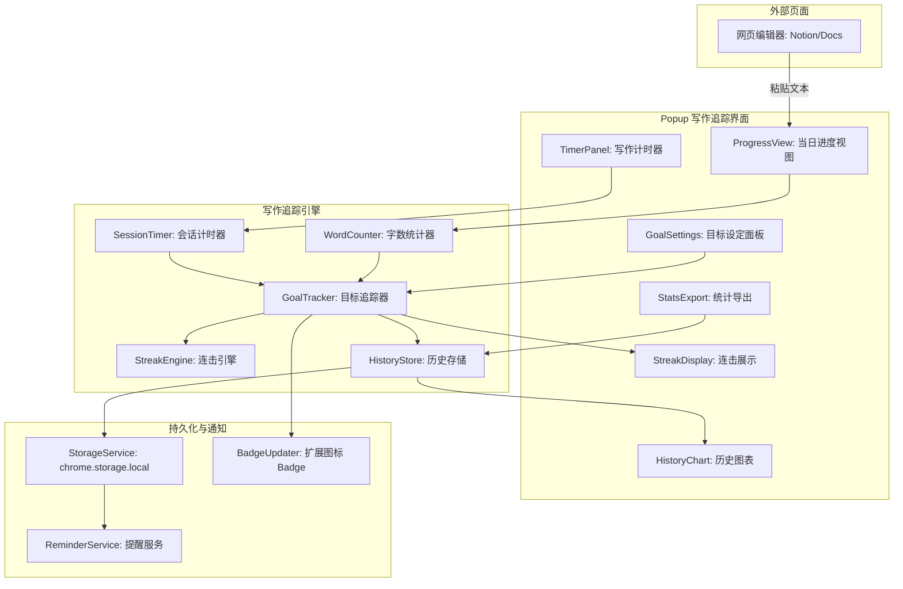
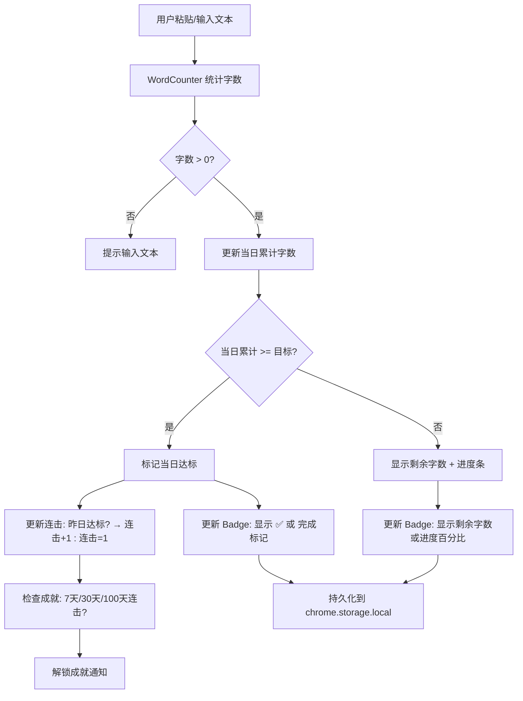

# YP-09-178: 字数统计目标 — 写作目标追踪、每日字数目标、进度可视化、连击追踪、计时器、历史图表

> 需求编号：YP-09-178 · 优先级：P2 · 人天：0.2d · 状态：需求已编写
> 依赖：YP-09-169（文本统计与计数器，共用字数统计逻辑）、chrome.storage.local（数据持久化）

## 背景

### 问题陈述

写作是知识工作者的日常活动——撰写文档、编写报告、记录笔记。许多人有写作目标（如每天写 1000 字），但追踪这些目标需要额外的工具。当前用户依赖：(1) 外部写作应用（如 Ulysses、Typora），(2) 手动在 Excel/Notes 中记录，(3) 不追踪——放弃目标。YiPet 作为浏览器常驻扩展，可以在用户使用在线编辑器（如 Notion、飞书文档、Google Docs）时提供无缝的字数追踪体验。

1. **外部写作工具与浏览器割裂**：大多数写作在浏览器中进行，但追踪工具不在浏览器中
2. **手动追踪繁琐且易中断**：每天手动记录字数 → 忘记 → 连击中断
3. **缺少视觉激励**：没有进度条、连击计数、成就系统，难以保持动力
4. **无法了解写作习惯**：没有历史数据查看自己的写作峰值时段和趋势
5. **无计时功能**：需要同时追踪写了多久和写了多少

**核心矛盾**：浏览器是主要的写作环境，但写作目标追踪工具都在浏览器之外。YiPet 可以在 Popup 中提供轻量级的写作追踪，并通过 Badge 在扩展图标上显示当日进度。

### 影响范围

| # | 影响 | 严重程度 | 典型场景 |
|---|------|----------|----------|
| 1 | 写作目标缺乏追踪 | 高 | 想坚持每天写 1000 字但经常忘记计数 |
| 2 | 外部追踪工具不便利 | 中 | 在 Notion 写作但要切换到独立 App 追踪 |
| 3 | 缺少连击激励 | 中 | 连续写了 5 天但没有可视化反馈 |
| 4 | 写作习惯无法量化 | 中 | 不知道自己的写作峰值时段和效率 |
| 5 | 无计时器结合字数 | 低 | 需要同时追踪时间和字数 |

### 挑战

| 挑战 | 说明 |
|------|------|
| 字数自动检测 | 如何从当前页面自动提取正在编辑的文本？Content Script 注入 vs 用户手动输入 |
| 多页面写作 | 用户可能在多个标签页中写作（Notion + Google Docs），如何合并统计 |
| 中文/英文/CJK 混合计数 | 不同语言的字数定义不同（中文按字符，英文按单词） |
| 数据持久化与隐私 | 写作内容可能敏感，本地存储 + 不传输到服务器 |
| Badge 更新 | chrome.action.setBadgeText 显示当日字数进度 |

---

## 一、现状分析

### 1.1 当前字数相关功能

```
现有字数相关功能:
├── YiPet Popup
│   └── 无写作目标追踪工具入口
├── 已实现文字统计相关
│   ├── 文本统计与计数器（YP-09-169）✅ 字符/单词/行数统计
│   └── 专注计时器（YP-09-138）✅ 番茄钟计时
├── Content Script
│   └── 无可编辑文本检测功能
├── Service Worker
│   └── 无 Badge 更新逻辑
└── 存储
    └── chrome.storage.local 可用于持久化

缺失:
├── 每日字数目标设定             # ❌ 不存在
├── 当日字数进度（输入/粘贴）    # ❌ 不存在
├── 连击天数追踪（Streak）       # ❌ 不存在
├── 写作计时器                   # ❌ 不存在
├── 历史字数图表（7/30/90天）    # ❌ 不存在
├── 目标完成提醒                 # ❌ 不存在
├── 扩展图标 Badge 进度显示      # ❌ 不存在
├── 写作统计导出                 # ❌ 不存在
└── 写作趋势分析                 # ❌ 不存在
```

### 1.2 写作追踪流程（现状 vs 目标）

```mermaid
graph TD
    subgraph Current["现状：外部工具或手动"]
        C1[在浏览器中写作] --> C2[手动复制全文]
        C2 --> C3[粘贴到外部字数统计工具]
        C3 --> C4[手动记录日期+字数]
        C4 --> C5[检查是否达标]
        C5 --> C6[更新连击状态]
        C6 --> C7{忘记记录了?}
        C7 -->|是| C8[连击中断，放弃追踪]
        C7 -->|否| C1
    end

    subgraph Target["目标：YiPet 写作追踪"]
        T1[设定每日字数目标] --> T2[开始写作]
        T2 --> T3[点击 YiPet 图标查看进度]
        T3 --> T4[粘贴文本自动统计字数]
        T4 --> T5[实时进度条 + 连击天数]
        T5 --> T6{目标达成?}
        T6 -->|是| T7[🎉 成就解锁 + 连击+1]
        T6 -->|否| T8[显示剩余字数]
        T7 --> T9[查看历史图表/趋势]
        T8 --> T2
    end

    style Current fill:#f8d7da,stroke:#dc3545
    style Target fill:#d4edda,stroke:#28a745
```



### 1.3 根因矩阵

| 症状 | 根因 | 触发条件 | 频率 |
|------|------|----------|------|
| 无写作目标追踪 | 未实现目标设定和进度模块 | 用户有写作目标时 | 高 |
| 连击中断 | 无自动检测+记录机制 | 忘记手动记录 | 高 |
| 激励不足 | 缺少进度可视化和成就系统 | 动力下降 | 中 |
| 历史数据分散 | 无统一的字数数据库 | 想回顾写作趋势 | 中 |
| 计时和计数割裂 | 无写作会话概念 | 需要分析效率 | 中 |

---

## 二、设计决策

### 决策 1：字数录入方式 — 自动检测 vs 手动粘贴 vs 两者混合

| 选项 | 准确性 | 实现复杂度 | 隐私 | 通用性 |
|------|--------|-----------|------|--------|
| Content Script 自动提取（DOM 探测） | 低（不同编辑器 DOM 差异大） | 极高 | 好 | 低 |
| 手动粘贴到 Popup | 高（用户控制） | 低 | 好（用户选择） | 高 |
| 浏览器剪贴板监控 | 低 | 中 | 差 | 低 |
| 混合：手动为主 + 自动可选 | 高 | 中 | 好 | 高 |

**选择：手动粘贴为主 + 剪贴板快捷按钮。** Content Script 自动检测编辑器的文本内容需要针对每个编辑器适配（Notion/contenteditable/textarea），可靠性低且维护成本高。手动粘贴是最简单、最准确、最尊重用户隐私的方式。配合一键"粘贴当前剪贴板"按钮，最大化便利性。

### 决策 2：字数统计模式 — 仅字符数 vs 中英文分模式

| 选项 | 中文场景 | 英文场景 | 通用性 |
|------|----------|----------|--------|
| 仅字符数（含标点） | 准确 | 不准（英文按单词计） | 中 |
| 中英文分模式（中：字符/英：单词） | 准确 | 准确 | 高 |
| 所有语言统一按词分割 | 不准（中文无空格） | 准确 | 低 |

**选择：中英文分模式统计。** 复用 YP-09-169 的字数统计逻辑：(1) CJK 字符按字数（每个字符 = 1 字），(2) 拉丁/西里尔等按单词数（空格分割），(3) 同时显示两组数字。用户可在设定目标时选择"按字数"或"按单词数"作为达标标准。

### 决策 3：连击规则 — 严格每日 vs 宽容窗口

| 选项 | 激励效果 | 公平性 | 防作弊 |
|------|----------|--------|--------|
| 严格每日（0:00 重置） | 中 | 低（夜猫子吃亏） | 高 |
| 宽容窗口（同日 6:00-次日 6:00） | 高 | 高 | 中 |
| 滚动 24 小时 | 低 | 中 | 中 |
| 周日历周（自然周） | 高 | 中 | 中 |

**选择：宽容窗口 + 自然周双轨。** 日目标以 6:00-次日 6:00 为窗口（包容夜猫子），周目标以自然周（周一-周日）为单位。连击基于"连续 N 天均达标"计算：当日窗口内字数 >= 目标 → 连击 +1，否则连击中断。同时追踪"最长连击"记录（全部历史最高）和"当前连击"。

### 决策 4：数据存储 — chrome.storage.local vs IndexedDB

| 选项 | 容量 | 数据持久性 | API 便利性 | 同步能力 |
|------|------|-----------|-----------|----------|
| chrome.storage.local | 10MB（无限制策略下更大） | 高 | 异步 Promise | chrome.storage.sync（8KB 限额） |
| IndexedDB | 无限制 | 高 | 异步回调/事务 | 无 |
| localStorage | 5-10MB | 中（Service Worker 不可用） | 同步 | 无 |

**选择：chrome.storage.local。** (1) 字数数据量小（每天一条记录 ~100B，一年 ~35KB），(2) Promise API 更简洁，(3) Service Worker 中也可访问（用于 Badge 更新），(4) 可选 `chrome.storage.sync` 同步目标设置到其他设备（仅目标，不同步数据）。

### 设计决策记录

| 决策 | 选项 A | 选项 B | 选项 C | 选择 | 理由 |
|------|--------|--------|--------|------|------|
| 录入方式 | 自动检测 | 手动粘贴 | 两者混合 | **手动为主** | 准确+隐私 |
| 计数模式 | 仅字符 | 中英分模式 | 统一分词 | **中英分模式** | 跨语言 |
| 连击规则 | 严格每日 | 宽容窗口 | 滚动24h | **宽容+自然周** | 包容+清晰 |
| 数据存储 | chrome.storage | IndexedDB | localStorage | **chrome.storage.local** | SW访问 |

---

## 三、目标架构

### 3.1 写作追踪系统架构



### 3.2 字数记录流程



### 3.3 性能指标

| 指标 | 目标值 | 说明 |
|------|--------|------|
| 字数统计（10K 字文本） | < 5ms | 正则+分割统计 |
| 当日数据加载 | < 50ms | chrome.storage.local 读取 |
| 历史图表渲染（90 天） | < 50ms | Canvas/SVG 绑定 |
| Badge 更新 | < 10ms | chrome.action API |
| 计时器精度 | ±1s 每小时 | setInterval 漂移校正 |

---

## 四、具体改动

### 4.1 类型定义

```typescript
// src/writing/types.ts (新增)

export interface WritingGoal {
  dailyTarget: number;       // 每日字数目标
  countMode: 'chars' | 'words'; // 统计模式：字符数/单词数
  windowStart: number;       // 日窗口起始小时（默认 6，即 6:00）
  weekTarget?: number;       // 每周目标（可选）
  reminderEnabled: boolean;  // 提醒开关
  reminderTime?: string;     // 提醒时间 "20:00"
}

export interface DailyRecord {
  date: string;              // "2026-09-09"
  wordCount: number;         // 当日字数
  targetMet: boolean;        // 是否达标
  sessionMinutes: number;    // 写作时长（分钟）
  entryCount: number;        // 录入次数
  lastUpdated: number;       // 最后更新时间戳
}

export interface StreakInfo {
  current: number;           // 当前连击天数
  longest: number;           // 历史最长连击
  longestStartDate: string;  // 最长连击起始日
  longestEndDate: string;    // 最长连击结束日
  thisWeek: number;          // 本周达标天数
  weekTarget: number;        // 周目标天数
}

export interface WritingSession {
  startTime: number;         // 会话开始时间戳
  wordCount: number;         // 会话内累计字数
  isRunning: boolean;        // 计时器是否运行中
  elapsedSeconds: number;    // 已用秒数
}

export interface WritingStats {
  totalWords: number;        // 总字数
  totalDays: number;         // 总追踪天数
  totalSessions: number;     // 总会话数
  totalMinutes: number;      // 总写作时长
  avgWordsPerDay: number;    // 日均字数
  avgWordsPerMinute: number; // 写作速度（字/分钟）
  bestDay: DailyRecord;      // 最佳单日
  bestWeek: string;          // 最佳单周
  history: DailyRecord[];    // 历史记录
}

export type Achievement = 
  | 'first_goal'       // 首次达标
  | 'streak_7'         // 7 天连击
  | 'streak_30'        // 30 天连击
  | 'streak_100'       // 100 天连击
  | 'total_10k'        // 累计 1 万字
  | 'total_100k'       // 累计 10 万字
  | 'total_1m';        // 累计 100 万字
```

### 4.2 写作追踪引擎

```typescript
// src/writing/GoalTracker.ts (新增)

import type { DailyRecord, StreakInfo, WritingGoal, WritingStats } from './types';

export class GoalTracker {
  private goal: WritingGoal;
  private history: DailyRecord[];

  constructor(goal: WritingGoal, history: DailyRecord[]) {
    this.goal = goal;
    this.history = history;
  }

  /** 记录字数并更新当日数据 */
  recordWords(wordCount: number): { 
    record: DailyRecord; 
    streak: StreakInfo; 
    achievement?: string;
  } {
    const today = this.getDateKey();
    let record = this.history.find(r => r.date === today);

    if (record) {
      record.wordCount += wordCount;
      record.entryCount += 1;
      record.lastUpdated = Date.now();
      record.targetMet = record.wordCount >= this.goal.dailyTarget;
    } else {
      record = {
        date: today,
        wordCount,
        targetMet: wordCount >= this.goal.dailyTarget,
        sessionMinutes: 0,
        entryCount: 1,
        lastUpdated: Date.now(),
      };
      this.history.push(record);
    }

    const streak = this.calculateStreak();
    const achievement = this.checkAchievements();

    return { record, streak, achievement };
  }

  /** 计算连击状态 */
  calculateStreak(): StreakInfo {
    const dates = this.history
      .filter(r => r.targetMet)
      .map(r => r.date)
      .sort();

    // 当前连击：从今天往回数连续达标天数
    let current = 0;
    const todayKey = this.getDateKey();
    let checkDate = this.parseDate(todayKey);

    for (let i = 0; i < 365; i++) {
      const checkKey = this.formatDate(checkDate);
      if (dates.includes(checkKey)) {
        current++;
        checkDate.setDate(checkDate.getDate() - 1);
      } else if (checkKey === todayKey) {
        // 今天还没达标，继续往回看
        checkDate.setDate(checkDate.getDate() - 1);
        continue;
      } else {
        break;
      }
    }

    // 最长连击
    let longest = 0;
    let tempStreak = 0;
    let longestStart = '';
    let longestEnd = '';
    let tempStart = '';

    for (let i = 0; i < dates.length; i++) {
      if (i === 0) {
        tempStreak = 1;
        tempStart = dates[i];
      } else {
        const prev = this.parseDate(dates[i - 1]);
        const curr = this.parseDate(dates[i]);
        const diffDays = (curr.getTime() - prev.getTime()) / 86400000;

        if (diffDays === 1) {
          tempStreak++;
        } else {
          if (tempStreak > longest) {
            longest = tempStreak;
            longestStart = tempStart;
            longestEnd = dates[i - 1];
          }
          tempStreak = 1;
          tempStart = dates[i];
        }
      }
    }

    if (tempStreak > longest) {
      longest = tempStreak;
      longestStart = tempStart;
      longestEnd = dates[dates.length - 1];
    }

    // 本周达标天数
    const weekStart = this.getWeekStart();
    const thisWeek = dates.filter(d => d >= this.formatDate(weekStart)).length;

    return {
      current,
      longest,
      longestStartDate: longestStart,
      longestEndDate: longestEnd,
      thisWeek,
      weekTarget: 7,
    };
  }

  /** 获取整体统计 */
  getStats(): WritingStats {
    const totalWords = this.history.reduce((sum, r) => sum + r.wordCount, 0);
    const totalDays = this.history.length;
    const totalMinutes = this.history.reduce((sum, r) => sum + r.sessionMinutes, 0);

    const bestDay = this.history.reduce((best, r) =>
      r.wordCount > best.wordCount ? r : best,
      { date: '', wordCount: 0, targetMet: false, sessionMinutes: 0, entryCount: 0, lastUpdated: 0 }
    );

    return {
      totalWords,
      totalDays,
      totalSessions: this.history.reduce((sum, r) => sum + r.entryCount, 0),
      totalMinutes,
      avgWordsPerDay: totalDays > 0 ? totalWords / totalDays : 0,
      avgWordsPerMinute: totalMinutes > 0 ? totalWords / totalMinutes : 0,
      bestDay,
      bestWeek: '',
      history: this.history,
    };
  }

  private checkAchievements(): string | undefined {
    const stats = this.getStats();
    const streak = this.calculateStreak();

    if (streak.current === 100) return '100 天连击！';
    if (streak.current === 30) return '30 天连击！';
    if (streak.current === 7) return '7 天连击！';
    if (stats.totalWords >= 1000000) return '累计 100 万字！';
    if (stats.totalWords >= 100000) return '累计 10 万字！';
    if (stats.totalWords >= 10000) return '累计 1 万字！';
    if (this.history.some(r => r.targetMet)) return '首次达标！';
    return undefined;
  }

  private getDateKey(date?: Date): string {
    const d = date || this.getToday();
    return this.formatDate(d);
  }

  private getToday(): Date {
    const now = new Date();
    if (now.getHours() < this.goal.windowStart) {
      now.setDate(now.getDate() - 1);
    }
    return now;
  }

  private formatDate(d: Date): string {
    return `${d.getFullYear()}-${String(d.getMonth() + 1).padStart(2, '0')}-${String(d.getDate()).padStart(2, '0')}`;
  }

  private parseDate(s: string): Date {
    const [y, m, d] = s.split('-').map(Number);
    return new Date(y, m - 1, d);
  }

  private getWeekStart(): Date {
    const d = new Date();
    const day = d.getDay();
    const diff = d.getDate() - day + (day === 0 ? -6 : 1);
    d.setDate(diff);
    d.setHours(0, 0, 0, 0);
    return d;
  }
}
```

### 4.3 写作计时器

```typescript
// src/writing/SessionTimer.ts (新增)

import type { WritingSession } from './types';

export class SessionTimer {
  private session: WritingSession;
  private timerId: ReturnType<typeof setInterval> | null = null;
  private startRealTime: number = 0;
  private accumulatedSeconds: number = 0;

  constructor() {
    this.session = {
      startTime: 0,
      wordCount: 0,
      isRunning: false,
      elapsedSeconds: 0,
    };
  }

  start(): void {
    if (this.session.isRunning) return;
    this.session.isRunning = true;
    this.session.startTime = Date.now();
    this.startRealTime = performance.now();
    this.accumulatedSeconds = this.session.elapsedSeconds;

    // 每秒更新，使用 performance.now 补偿漂移
    this.timerId = setInterval(() => {
      const realElapsed = (performance.now() - this.startRealTime) / 1000;
      this.session.elapsedSeconds = Math.floor(this.accumulatedSeconds + realElapsed);
    }, 1000);
  }

  pause(): void {
    if (!this.session.isRunning) return;
    this.session.isRunning = false;
    if (this.timerId) {
      clearInterval(this.timerId);
      this.timerId = null;
    }
    this.accumulatedSeconds = this.session.elapsedSeconds;
  }

  reset(): void {
    this.pause();
    this.session = {
      startTime: 0,
      wordCount: 0,
      isRunning: false,
      elapsedSeconds: 0,
    };
    this.accumulatedSeconds = 0;
  }

  getSession(): WritingSession {
    return { ...this.session };
  }

  getFormattedTime(): string {
    const h = Math.floor(this.session.elapsedSeconds / 3600);
    const m = Math.floor((this.session.elapsedSeconds % 3600) / 60);
    const s = this.session.elapsedSeconds % 60;
    return `${String(h).padStart(2, '0')}:${String(m).padStart(2, '0')}:${String(s).padStart(2, '0')}`;
  }
}
```

### 4.4 文件变更清单

| 文件 | 操作 | 说明 |
|------|------|------|
| `src/writing/types.ts` | 新增 | 写作追踪类型定义 |
| `src/writing/WordCounter.ts` | 修改 | 复用 YP-09-169，增强中英文分离统计 |
| `src/writing/GoalTracker.ts` | 新增 | 目标追踪与连击引擎 |
| `src/writing/SessionTimer.ts` | 新增 | 写作会话计时器 |
| `src/writing/HistoryStore.ts` | 新增 | chrome.storage.local 持久化 |
| `src/writing/ChartRenderer.ts` | 新增 | Canvas 历史图表渲染 |
| `src/components/WritingTracker.vue` | 新增 | 写作追踪 UI 组件 |
| `src/background/badgeUpdater.ts` | 新增 | Service Worker Badge 更新 |
| `src/popup/App.vue` | 修改 | 集成写作追踪 Tab |

---

## 五、实施步骤

| 步骤 | 操作 | 路径 | 验证 | 人天 |
|------|------|------|------|------|
| 1 | 增强字数统计（中英分离） | `src/writing/WordCounter.ts` | CJK 字符 + 拉丁单词双计数 | 0.02 |
| 2 | 实现目标追踪引擎 | `src/writing/GoalTracker.ts` | 达标判断+连击+成就 | 0.04 |
| 3 | 实现会话计时器 | `src/writing/SessionTimer.ts` | 开始/暂停/重置 | 0.02 |
| 4 | 实现持久化存储 | `src/writing/HistoryStore.ts` | chrome.storage 读写 | 0.02 |
| 5 | 实现历史图表 | `src/writing/ChartRenderer.ts` | Canvas 7/30/90天柱状图 | 0.03 |
| 6 | 实现 UI 组件 | `src/components/WritingTracker.vue` | 目标+进度+连击+图表+导出 | 0.04 |
| 7 | 实现 Badge 更新 | `src/background/badgeUpdater.ts` | 图标显示剩余字数 | 0.01 |
| 8 | 集成到 Popup | `src/popup/App.vue` | 写作追踪 Tab 可用 | 0.01 |
| 9 | 测试 + edge cases | 跨天/跨月/时区 | 全部测试通过 | 0.01 |

**总人天：0.2d**

---

## 六、测试规格

### 场景 1：基础字数记录

**GIVEN** 每日目标 = 1000 字, 当日字数 = 0
**WHEN** 用户粘贴文本 "你好世界 Hello World" (中文 4 字 + 英文 2 词)
**THEN** 中文字符数 = 4, 英文单词数 = 2
**AND** 当日字数 = 6（根据计数模式）
**AND** 目标未达标，剩余 994 字
**AND** 进度条 = 0.6%

### 场景 2：目标达标

**GIVEN** 每日目标 = 100 字, 当日已记录 90 字
**WHEN** 用户追加记录 20 字
**THEN** 当日字数 = 110, 达标 = true
**AND** 触发成就通知："首次达标！"
**AND** 扩展 Badge 显示 "OK" 或 "✓"

### 场景 3：连击计算

**GIVEN** 历史记录: 昨日达标, 前日达标, 3 天前未达标
**WHEN** 今日达标
**THEN** 当前连击 = 3（今天+昨天+前天）
**AND** 如果该连击为历史最长，更新最长连击记录
**AND** 本周达标天数 = 3

### 场景 4：宽容窗口跨夜

**GIVEN** 窗口起始 = 6:00, 当前时间 = 2026-09-09 02:00
**WHEN** 记录字数 500
**THEN** 记录日期 = "2026-09-08"（算在前一天）
**AND** 当日 6:00 后新的记录归入 "2026-09-09"

### 场景 5：写作计时器

**GIVEN** 计时器未启动
**WHEN** 用户点击"开始写作" → 等待 5 分钟 → 点击"暂停"
**THEN** 显示已用时 = 00:05:00 (±1s)
**AND** 再次开始 → 累计 2 分钟 → 总用时 = 00:07:00
**AND** 重置后计时归零

### 场景 6：统计导出

**GIVEN** 30 天历史数据
**WHEN** 用户导出统计
**THEN** JSON 导出包含每日记录数组
**AND** CSV 导出列 = 日期,字数,达标,分钟,录入次数
**AND** 导出文件名为 "writing-stats-2026-09-09.csv/json"

---

## 七、风险与缓解

| 风险 | 概率 | 影响 | 缓解措施 |
|------|------|------|----------|
| 用户忘记手动记录 → 连击中断 | 高 | 中 | 扩展 Badge 显示上次记录时间；每天 20:00 提醒弹窗（可选） |
| chrome.storage.local 超出配额 | 低 | 中 | 仅保留最近 365 天数据，旧数据自动压缩（年汇总） |
| 跨时区旅行导致日期错乱 | 低 | 中 | 使用本地时区 + Date 对象，不依赖 UTC |
| 计时器长时间运行后漂移 | 低 | 低 | 使用 performance.now() 而非 setInterval 计数 |
| 中英文混合文本计数偏差 | 中 | 中 | 明确显示两个数值，让用户选择达标标准 |

---

## 八、回滚策略

| 场景 | 回滚操作 | 影响 |
|------|----------|------|
| 写作追踪导致 Popup 异常 | 移除写作追踪 Tab | 失去追踪功能 |
| 持久化数据损坏 | 重置历史数据 | 历史记录丢失 |
| Badge 更新导致性能问题 | 禁用 Badge 更新 | 图标不显示进度 |
| 计时器内存泄漏 | 移除计时器功能 | 无写作计时 |

---

## 九、设计决策记录

### D-01：为什么采用手动录入而非自动检测？

浏览器的内容编辑环境差异巨大：(1) Notion 使用自定义 contenteditable 实现，DOM 结构复杂，(2) Google Docs 使用 canvas 渲染，无法从 DOM 提取文本，(3) 飞书文档使用 React 的虚拟 DOM，(4) textarea 最简单但使用场景有限。适配所有编辑器的工作量远远超过手动录入，且自动检测可能误读草稿/中间状态。手动录入给用户完全的控制权和隐私保护。

### D-02：为什么日窗口设为 6:00 而非 0:00？

夜猫子可能在 23:00-02:00 仍在写作。如果窗口在 0:00 重置，23:30 写的字和 00:30 写的字属于不同"写作日"，但用户心理上认为这是"同一个晚上的写作"。6:00 窗口确保了"睡觉前"的写作归入同一天，更符合生物钟节律。这一设计参考了 GitHub 贡献图（按用户本地时间计算）和 Strava 的活动日划分。

### D-03：为什么连击需要在历史中找到最长连击而非仅追踪当前？

连击是最强的行为激励因素。用户不仅想知道"我已经连续写了几天"，还想知道"我的最佳记录是多少"。最长连击数据创造了一个"击败自己"的目标——一旦接近历史最高记录，用户更有动力维持连击。这种游戏化设计已被 Duolingo（每日连续）、GitHub（贡献连续）等产品验证有效。

### D-04：为什么选择 Canvas 而非 ECharts/Chart.js 绘制历史图表？

历史图表仅需要简单的柱状图（每日字数）+ 目标线，不需要 ECharts 的复杂交互（tooltip/zoom/brush）。使用 Canvas 手绘：(1) 零依赖体积，(2) 自定义样式完全可控（匹配 YiPet 主题），(3) 渲染速度快。代码量约 80 行，远小于引入 ECharts（~1MB）或 Chart.js（~200KB）。如果需要更复杂的图表，后续可以通过 YiPet 的 CDN 资源加载系统（YP-09-08）按需加载。

---

## 十、可观测性

### 指标

| 指标 | 类型 | 说明 |
|------|------|------|
| `yipet.writing.record_total` | Counter | 字数记录总次数 |
| `yipet.writing.goal_met_daily` | Counter | 每日达标次数 |
| `yipet.writing.streak_current` | Gauge | 当前连击天数 |
| `yipet.writing.timer_start` | Counter | 计时器启动次数 |
| `yipet.writing.avg_words_per_entry` | Histogram | 每次录入平均字数 |
| `yipet.writing.export_total` | Counter | 统计导出次数 |

### 告警

| 告警 | 条件 | 级别 |
|------|------|------|
| 用户连续 7 天未记录 | 检测 | INFO（提醒推送） |
| 存储空间 > 8MB | chrome.storage 用量 | WARNING |

---

## 十一、代码审查检查清单

- [ ] WordCounter 正确处理 CJK 字符范围 (U+4E00-U+9FFF, U+3400-U+4DBF, U+F900-U+FAFF)
- [ ] 字数统计中排除纯标点/空白（或作为可选配置）
- [ ] 日窗口逻辑正确处理跨天（0:00-6:00 归前一天）
- [ ] 连击计算正确处理闰年/月末日期
- [ ] 计时器使用 performance.now() 而非 Date.now() 补偿漂移
- [ ] chrome.storage.local 读取错误有降级方案（返回空历史）
- [ ] Canvas 图表支持 Retina 屏（devicePixelRatio 缩放）
- [ ] Badge 文本限制 4 字符（如 "500" / "OK" / "✓"）
- [ ] 提醒使用 chrome.alarms API（而非 setTimeout）
- [ ] 历史数据迁移兼容（新增字段有默认值）
- [ ] 暗色模式适配图表颜色

---

## 回归问题预测

| # | 预测问题 | 原因 | 验证方法 |
|---|---------|------|---------|
| 1 | 连击计算在月末/月初边界时，如果用户 1 月 31 日达标而 2 月 1 日也达标，算法应判定为连续两天 | Date 对象在月边界时正确处理日期加减：`new Date(2026, 0, 31)` → 加 1 天 → `new Date(2026, 1, 1)` 自动进位到 2 月 1 日 | 测试跨月连击场景（1.31 → 2.1 → 2.2） |
| 2 | 夏令时切换日（如 3 月第二个周日）导致一天只有 23 或 25 小时，日窗口 6:00 的计算可能偏差 1 小时 | `Date.prototype.getHours()` 返回本地时间，夏令时切换时一天的小时数变化，但 6:00 作为"早晨"的语义不变 | 模拟夏令时切换日的 getHours() 行为，确认记录日期归属正确 |
| 3 | 用户一天内多次录入（如 50 次），EntryCount 累加虽然简单但可能导致 chrome.storage 频繁写入，触发 write 配额 | chrome.storage.local 每分钟写入限制为 120 次，但每个 key 独立计数。如果每次录入都立即持久化，高频录入可能触发限流 | 实现防抖写入（debounce 500ms），累计多次变更后一次性写入 |
| 4 | Canvas 历史图表在数据点过多时（365 天的柱状图），每个柱宽度 < 1px 导致视觉上不可见 | 365 天数据在 800px 宽 Canvas 上每柱仅 2px，可读性差。但 90 天视图每柱 ~8px 正常 | 7 天视图显示每天数据，30 天视图显示每天数据，90 天视图按周聚合显示 |
| 5 | 用户删除浏览器数据（"清除浏览数据"）时 chrome.storage.local 被一并清除，所有历史记录丢失 | Chrome 的"清除浏览数据"对话框中，"托管应用数据"选项会清除扩展的 storage.local 数据 | 提供 JSON 导出/导入功能作为备份手段；在设置中提示定期导出 |
| 6 | 计时器在 Popup 关闭后继续运行，但 Popup 的 JavaScript 上下文被销毁，setInterval 停止，导致计时器实际停止但用户以为仍在运行 | Popup 是短暂生命周期的页面，关闭后 JS 停止执行 | 在 Service Worker 中管理计时器状态（记录 startTime），Popup 打开时基于 startTime 计算已用时间 |

---

## 性能分析

### 各阶段耗时

| 阶段 | 预估耗时 | 说明 |
|------|----------|------|
| 字数统计（CJK + 单词分离） | < 5ms/10K 字 | 正则匹配 |
| 当日记录更新 | < 1ms | 对象操作 |
| 连击计算（365 天数据） | < 5ms | 遍历已排序数组 |
| chrome.storage.local 读取 | 1-20ms | 异步 I/O |
| chrome.storage.local 写入 | 1-30ms | 异步 I/O |
| Canvas 图表渲染（90 天） | < 30ms | 柱状图 + 目标线 |
| Badge 更新 | < 10ms | chrome.action.setBadgeText |
| 计时器精度（1 小时） | ±1s | performance.now 补偿 |

### 体积预估

| 文件 | 大小 | 说明 |
|------|------|------|
| `src/writing/types.ts` | ~2.5KB | 类型定义 |
| `src/writing/WordCounter.ts` | ~1.5KB | 字统计（增强） |
| `src/writing/GoalTracker.ts` | ~5KB | 追踪引擎 |
| `src/writing/SessionTimer.ts` | ~2KB | 计时器 |
| `src/writing/HistoryStore.ts` | ~2KB | 持久化层 |
| `src/writing/ChartRenderer.ts` | ~3KB | Canvas 图表 |
| `src/components/WritingTracker.vue` | ~8KB | UI 组件 |
| `src/background/badgeUpdater.ts` | ~1.5KB | SW Badge |
| **总计** | **~25.5KB** | 无第三方依赖 |