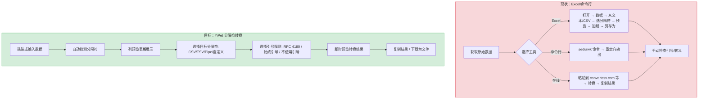
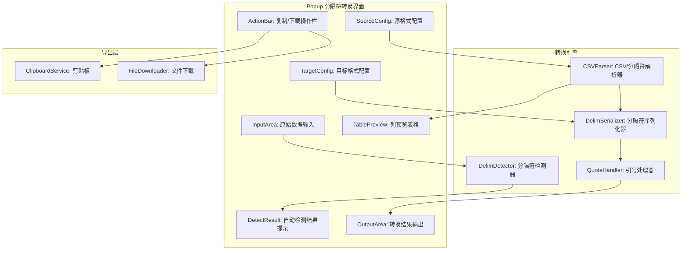
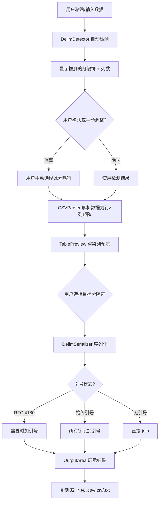

# YP-09-179: 分隔符转换工具 — CSV/TSV/Pipe/自定义分隔符互转、自动检测、列预览、引号处理

> 需求编号：YP-09-179 · 优先级：P2 · 人天：0.2d · 状态：需求已编写
> 依赖：YP-09-177（列表比较工具，共用文本输入布局和导出功能）

## 背景

### 问题陈述

数据工程师、分析师和开发者频繁需要在不同分隔符格式之间转换数据：(1) 从 API 返回的 JSON 转为 CSV 以便 Excel 打开，(2) 将 TSV 文件转为逗号分隔的 CSV，(3) 从日志中提取的管道符分隔文本转为表格，(4) 将自定义分隔符的数据标准化为通用格式。当前用户通常使用 Excel 导入向导、命令行 `sed`/`awk` 或在线转换工具——每种方式都有效率瓶颈。

1. **Excel 导入向导步骤繁琐**：数据 → 从文本/CSV → 选择分隔符 → 预览 → 加载 → 另存为
2. **命令行学习成本高**：`sed 's/\t/,/g'` 和 `awk` 对非技术人员不友好
3. **在线工具存在数据泄漏风险**：粘贴敏感的客户数据或内部数据到第三方转换网站
4. **分隔符自动检测缺失**：用户需要手动判断原始数据的分隔符
5. **引号处理不一致**：CSV 的引号转义规则在不同工具间存在差异

**核心矛盾**：分隔符转换是高频数据处理操作，但现有工具要么过于复杂（Excel），要么不够安全（在线工具），要么门槛高（命令行）。YiPet 扩展可以零门槛完成本地安全转换。

### 影响范围

| # | 影响 | 严重程度 | 典型场景 |
|---|------|----------|----------|
| 1 | 分隔符转换效率低 | 高 | 将 API 返回的 TSV 转为 CSV |
| 2 | Excel 导入流程繁琐 | 高 | 每天多次导入不同格式的数据文件 |
| 3 | 在线工具安全风险 | 中 | 粘贴包含客户信息的表格数据 |
| 4 | 引号转义错误 | 中 | 包含逗号的数据在 CSV 中错列 |
| 5 | 无法批量转换 | 中 | 多个文件需要逐个转换 |

### 挑战

| 挑战 | 说明 |
|------|------|
| CSV 引号转义 | RFC 4180 规范：字段含逗号/引号/换行时需用双引号包裹，内部引号双写 |
| 分隔符自动检测 | 需要在用户粘贴内容时智能推测分隔符（统计频率而非硬编码） |
| 大文件性能 | 10MB CSV 文件的转换不应阻塞 UI 线程 |
| 多字符分隔符 | 有些数据使用多字符分隔符（如 "||"、"::"），检测和转换都需支持 |
| 列预览宽度自适应 | 不等宽列需要根据内容自适应宽度，并支持横向滚动 |

---

## 一、现状分析

### 1.1 当前分隔符转换相关功能

```
现有分隔符转换功能:
├── YiPet Popup
│   └── 无分隔符转换工具入口
├── 已实现数据处理相关
│   ├── JSON 格式化验证（YP-09-150）✅
│   ├── 列表比较工具（YP-09-177）✅
│   └── URL 解析器（YP-09-151）✅
├── Content Script
│   └── 无数据处理功能
└── 依赖库
    └── 无 CSV 解析依赖

缺失:
├── CSV ↔ TSV 转换              # ❌ 不存在
├── CSV ↔ Pipe（|）转换          # ❌ 不存在
├── 自定义分隔符互转             # ❌ 不存在
├── 分隔符自动检测               # ❌ 不存在
├── 列预览（表格视图）           # ❌ 不存在
├── 引号处理（RFC 4180）         # ❌ 不存在
├── 结果复制/下载                # ❌ 不存在
└── 转置/行列互换               # ❌ 不存在
```

### 1.2 分隔符转换流程（现状 vs 目标）



### 1.3 根因矩阵

| 症状 | 根因 | 触发条件 | 频率 |
|------|------|----------|------|
| 无本地转换工具 | 未实现分隔符解析引擎 | 需要转换数据格式时 | 高 |
| Excel 导入流程长 | 缺少浏览器快捷转换 | 打开非 CSV 数据文件 | 高 |
| 引号处理错误 | 未遵循 RFC 4180 规范 | 数据包含逗号/引号 | 中 |
| 无法自动检测分隔符 | 未实现分隔符推测算法 | 不确定数据格式时 | 中 |
| 无列预览 | 未实现表格渲染 | 需要确认转换正确性 | 中 |

---

## 二、设计决策

### 决策 1：CSV 解析策略 — 手写状态机 vs Papa Parse vs 正则分割

| 选项 | 体积 | RFC 4180 兼容 | 性能（1MB） | 自定义能力 |
|------|------|-------------|-----------|-----------|
| 手写状态机 | ~3KB | 完全可控 | ~20ms | 高 |
| Papa Parse | ~60KB | 完全兼容 | ~15ms | 中 |
| 简单正则 split | ~0.2KB | 不兼容（引号内逗号会错误拆分） | ~3ms | 低 |

**选择：手写状态机（基于 RFC 4180）。** Papa Parse 是最完善的 CSV 解析库，但 (1) 60KB 对于扩展来说过大，(2) 我们不需要流式解析（数据量 < 10MB），(3) 手写状态机可以精确控制错误处理、自定义分隔符和多字符分隔符支持。状态机核心 ~100 行，易于维护和调试。

### 决策 2：分隔符自动检测算法 — 频率统计 vs 首行分析 vs 启发式

| 选项 | 准确率 | 实现复杂度 | 多行数据支持 |
|------|--------|-----------|------------|
| 频率统计（所有行计数字符频率） | 高 | 低 | 是 |
| 仅首行分析 | 中（单行可能误判） | 低 | 否 |
| 基于文件扩展名 | 低 | 极低 | N/A |
| 启发式组合（频率+扩展名+首行） | 极高 | 中 | 是 |

**选择：频率统计 + 首行验证。** 统计前 50 行中每个可能分隔符（逗号、Tab、管道、分号、空格）的出现次数和每行的出现次数方差。方差最小的字符（即每行该字符出现次数最稳定）最有可能是分隔符。同时检查首行是否为标题行（分隔符数量是否与其他行一致）。

### 决策 3：引号处理模式 — 仅 RFC 4180 vs 三种模式可选

| 选项 | 适用场景 | 兼容性 |
|------|----------|--------|
| 仅 RFC 4180（需要时才引号） | 通用 | 高 |
| 始终引号包裹所有字段 | 数据含特殊字符多 | 最高 |
| 不使用引号 | 数据确定无逗号/引号/换行 | 最低 |

**选择：三种模式可选。** RFC 4180 模式（默认）仅在字段含逗号/双引号/换行时包裹，最节省空间。"始终引号"保证最大兼容性。"不使用引号"用于性能优先或数据已知安全的场景。模式切换为下拉选择器，默认 RFC 4180。

### 决策 4：输出方式 — 仅文本预览 vs 表格预览 + 文本

| 选项 | 直观性 | 实现复杂度 |
|------|--------|-----------|
| 仅文本预览 | 低 | 低 |
| 仅表格预览 | 中 | 中 |
| 文本 + 表格双视图（Tab 切换） | 高 | 中 |

**选择：输入区显示表格预览 + 输出区显示原始文本。** 输入数据在上方以表格形式展示列预览（帮助用户确认分隔符正确），输出结果在下方以原始文本展示（方便复制/下载）。表格最多展示前 20 列和前 100 行，提供水平和垂直滚动。

### 设计决策记录

| 决策 | 选项 A | 选项 B | 选项 C | 选项 D | 选择 | 理由 |
|------|--------|--------|--------|--------|------|------|
| 解析策略 | 手写状态机 | Papa Parse | 正则 | — | **手写状态机** | 轻量+可控 |
| 自动检测 | 频率统计 | 首行分析 | 扩展名 | 启发式 | **频率+首行** | 高准确率 |
| 引号处理 | RFC 4180 | 始终引号 | 不使用 | — | **三模式** | 全覆盖 |
| 输出方式 | 文本 | 表格 | 双视图 | — | **表格预览+文本输出** | 直观+实用 |

---

## 三、目标架构

### 3.1 分隔符转换系统架构



### 3.2 分隔符转换流程



### 3.3 性能指标

| 指标 | 目标值 | 说明 |
|------|--------|------|
| 分隔符检测（100 行） | < 5ms | 频率统计 |
| CSV 解析（1MB） | < 30ms | 状态机逐字符扫描 |
| 序列化（1MB） | < 20ms | join + 引号插入 |
| 表格预览渲染（100 行 × 10 列） | < 30ms | DOM 表格创建 |
| 大文件解析（10MB） | < 300ms | 异步分块处理 |

---

## 四、具体改动

### 4.1 类型定义

```typescript
// src/delimiter/types.ts (新增)

export type DelimiterType = 'comma' | 'tab' | 'pipe' | 'semicolon' | 'space' | 'custom';

export interface DelimiterConfig {
  type: DelimiterType;
  customChar?: string;          // 自定义分隔符（支持多字符）
}

export enum QuoteMode {
  RFC4180 = 'rfc4180',          // 仅在需要时引号
  ALWAYS = 'always',           // 始终引号
  NEVER = 'never',             // 不使用引号
}

export interface ConvertConfig {
  source: DelimiterConfig;     // 源分隔符配置
  target: DelimiterConfig;     // 目标分隔符配置
  quoteMode: QuoteMode;        // 引号处理模式
  hasHeader: boolean;          // 首行是否为标题
  lineEnding: 'lf' | 'crlf';  // 行尾符
}

export interface DetectResult {
  detected: DelimiterType;
  confidence: number;          // 置信度 0-1
  columnCount: number;         // 检测到的列数
  rowCount: number;            // 检测到的行数
  alternatives: {              // 备选分隔符
    type: DelimiterType;
    confidence: number;
  }[];
}

export interface ParsedData {
  headers: string[];           // 解析后的标题行
  rows: string[][];            // 解析后的数据行
  columnCount: number;
  rowCount: number;
  rawColumnCounts: number[];   // 每行原始列数（用于检测不规则行）
}

export const DELIMITER_MAP: Record<DelimiterType, string> = {
  comma: ',',
  tab: '\t',
  pipe: '|',
  semicolon: ';',
  space: ' ',
  custom: '',
};

export const DELIMITER_LABELS: Record<DelimiterType, string> = {
  comma: 'CSV（逗号）',
  tab: 'TSV（Tab）',
  pipe: '管道符（|）',
  semicolon: '分号（;）',
  space: '空格',
  custom: '自定义',
};
```

### 4.2 分隔符检测器

```typescript
// src/delimiter/DelimDetector.ts (新增)

import type { DelimiterType, DetectResult } from './types';

export class DelimDetector {
  /** 自动检测分隔符（频率稳定性分析） */
  detect(text: string): DetectResult {
    const lines = text.split(/\r?\n/).filter(l => l.trim().length > 0);
    if (lines.length === 0) {
      return { detected: 'comma', confidence: 0, columnCount: 0, rowCount: 0, alternatives: [] };
    }

    // 候选分隔符及其每行出现次数的方差
    const candidates: { type: DelimiterType; char: string; counts: number[] }[] = [
      { type: 'comma', char: ',', counts: [] },
      { type: 'tab', char: '\t', counts: [] },
      { type: 'pipe', char: '|', counts: [] },
      { type: 'semicolon', char: ';', counts: [] },
    ];

    const sampleLines = lines.slice(0, Math.min(lines.length, 50));

    for (const line of sampleLines) {
      for (const candidate of candidates) {
        const count = this.countInUnquoted(line, candidate.char);
        candidate.counts.push(count);
      }
    }

    // 计算每个候选分隔符的稳定性和置信度
    const results = candidates
      .filter(c => {
        // 至少在一半的行中出现，且至少出现 1 次
        const nonZero = c.counts.filter(n => n > 0).length;
        return nonZero >= sampleLines.length * 0.3;
      })
      .map(c => {
        const nonZeroCounts = c.counts.filter(n => n > 0);
        if (nonZeroCounts.length === 0) return { type: c.type, confidence: 0, columnCount: 0 };

        const avg = nonZeroCounts.reduce((s, n) => s + n, 0) / nonZeroCounts.length;
        const variance = nonZeroCounts.reduce((s, n) => s + (n - avg) ** 2, 0) / nonZeroCounts.length;
        const consistency = nonZeroCounts.length / sampleLines.length;
        // 置信度：一致性 / (1 + 方差)
        const confidence = consistency / (1 + variance);

        return {
          type: c.type,
          confidence: Math.min(1, confidence),
          columnCount: Math.round(avg) + 1,
        };
      })
      .sort((a, b) => b.confidence - a.confidence);

    if (results.length === 0) {
      return { detected: 'comma', confidence: 0, columnCount: 1, rowCount: lines.length, alternatives: [] };
    }

    return {
      detected: results[0].type,
      confidence: results[0].confidence,
      columnCount: results[0].columnCount,
      rowCount: lines.length,
      alternatives: results.slice(1, 4),
    };
  }

  /** 计算字符在引号外的出现次数 */
  private countInUnquoted(line: string, char: string): number {
    let count = 0;
    let inQuotes = false;
    for (let i = 0; i < line.length; i++) {
      if (line[i] === '"') {
        if (inQuotes && line[i + 1] === '"') {
          i++; // 转义引号
        } else {
          inQuotes = !inQuotes;
        }
      } else if (line[i] === char && !inQuotes) {
        count++;
      }
    }
    return count;
  }
}
```

### 4.3 CSV 解析状态机

```typescript
// src/delimiter/CSVParser.ts (新增)

import type { ParsedData, DelimiterConfig, QuoteMode } from './types';
import { DELIMITER_MAP } from './types';

export class CSVParser {
  /** 解析分隔符分隔的文本为行列矩阵 */
  parse(text: string, config: DelimiterConfig): ParsedData {
    const delimiter = config.type === 'custom' 
      ? (config.customChar || ',') 
      : DELIMITER_MAP[config.type];

    const lines = text.split(/\r?\n/);
    const rows: string[][] = [];
    const rawColumnCounts: number[] = [];

    for (const line of lines) {
      if (line.trim() === '') continue; // 跳过空行
      const fields = this.parseLine(line, delimiter);
      rows.push(fields);
      rawColumnCounts.push(fields.length);
    }

    if (rows.length === 0) {
      return { headers: [], rows: [], columnCount: 0, rowCount: 0, rawColumnCounts: [] };
    }

    // 检测首行是否为标题（首行列数 = 众数列数）
    const modeColumnCount = this.mode(rawColumnCounts);
    const headers = rows[0].length === modeColumnCount 
      ? rows[0] 
      : rows[0].map((_, i) => `列${i + 1}`);
    const dataRows = rows[0].length === modeColumnCount ? rows.slice(1) : rows;

    return {
      headers,
      rows: dataRows,
      columnCount: modeColumnCount,
      rowCount: dataRows.length,
      rawColumnCounts,
    };
  }

  /** 解析一行（状态机，处理引号内分隔符） */
  private parseLine(line: string, delimiter: string): string[] {
    const fields: string[] = [];
    let current = '';
    let inQuotes = false;

    for (let i = 0; i < line.length; i++) {
      const char = line[i];

      if (inQuotes) {
        if (char === '"' && line[i + 1] === '"') {
          current += '"';
          i++; // 跳过转义引号
        } else if (char === '"') {
          inQuotes = false;
        } else {
          current += char;
        }
      } else {
        if (char === '"') {
          inQuotes = true;
        } else if (this.matchDelimiter(line, i, delimiter)) {
          fields.push(current);
          current = '';
          i += delimiter.length - 1; // 跳过分隔符
        } else {
          current += char;
        }
      }
    }
    fields.push(current); // 最后一个字段
    return fields;
  }

  private matchDelimiter(line: string, pos: number, delimiter: string): boolean {
    if (pos + delimiter.length > line.length) return false;
    return line.substring(pos, pos + delimiter.length) === delimiter;
  }

  private mode(arr: number[]): number {
    const freq: Record<number, number> = {};
    for (const n of arr) freq[n] = (freq[n] || 0) + 1;
    return Object.entries(freq).sort((a, b) => b[1] - a[1])[0]?.[0] as unknown as number || 0;
  }
}
```

### 4.4 分隔符序列化器

```typescript
// src/delimiter/DelimSerializer.ts (新增)

import type { ParsedData, DelimiterConfig, QuoteMode } from './types';
import { DELIMITER_MAP } from './types';

export class DelimSerializer {
  /** 将解析后的数据序列化为指定分隔符格式 */
  serialize(data: ParsedData, config: DelimiterConfig, quoteMode: QuoteMode, lineEnding: string): string {
    const delimiter = config.type === 'custom'
      ? (config.customChar || ',')
      : DELIMITER_MAP[config.type];

    const allRows = [data.headers, ...data.rows];
    const le = lineEnding === 'crlf' ? '\r\n' : '\n';

    return allRows
      .map(row => row.map(field => this.quoteField(field, quoteMode, delimiter)).join(delimiter))
      .join(le);
  }

  private quoteField(field: string, mode: QuoteMode, delimiter: string): string {
    switch (mode) {
      case QuoteMode.NEVER:
        return field;
      case QuoteMode.ALWAYS:
        return `"${field.replace(/"/g, '""')}"`;
      case QuoteMode.RFC4180:
        const needsQuoting = field.includes('"') 
          || field.includes(delimiter) 
          || field.includes('\n') 
          || field.includes('\r');
        return needsQuoting 
          ? `"${field.replace(/"/g, '""')}"` 
          : field;
    }
  }
}
```

### 4.5 文件变更清单

| 文件 | 操作 | 说明 |
|------|------|------|
| `src/delimiter/types.ts` | 新增 | 分隔符类型定义 |
| `src/delimiter/DelimDetector.ts` | 新增 | 分隔符自动检测 |
| `src/delimiter/CSVParser.ts` | 新增 | CSV 解析状态机 |
| `src/delimiter/DelimSerializer.ts` | 新增 | 分隔符序列化+引号处理 |
| `src/components/DelimiterTool.vue` | 新增 | 分隔符转换 UI 组件 |
| `src/popup/App.vue` | 修改 | 集成分隔符转换 Tab |

---

## 五、实施步骤

| 步骤 | 操作 | 路径 | 验证 | 人天 |
|------|------|------|------|------|
| 1 | 定义类型 | `src/delimiter/types.ts` | 类型检查通过 | 0.01 |
| 2 | 实现分隔符检测器 | `src/delimiter/DelimDetector.ts` | 频率方差算法正确检测 | 0.03 |
| 3 | 实现 CSV 解析状态机 | `src/delimiter/CSVParser.ts` | RFC 4180 解析正确 | 0.04 |
| 4 | 实现序列化器 | `src/delimiter/DelimSerializer.ts` | 三种引号模式正确 | 0.02 |
| 5 | 实现表格预览 | 组件内渲染 | 100 行 20 列流畅滚动 | 0.03 |
| 6 | 实现 UI 组件 | `src/components/DelimiterTool.vue` | 全流程可用 | 0.05 |
| 7 | 集成到 Popup | `src/popup/App.vue` | 分隔符 Tab 可用 | 0.01 |
| 8 | 测试 | 各种分隔符+引号场景 | 全部测试通过 | 0.01 |

**总人天：0.2d**

---

## 六、测试规格

### 场景 1：CSV → TSV 基础转换

**GIVEN** 输入 = "name,age,city\nAlice,30,NYC\nBob,25,LA"
**WHEN** 转换为 TSV（Tab 分隔）
**THEN** 输出 = "name\tage\tcity\nAlice\t30\tNYC\nBob\t25\tLA"
**AND** 列预览显示 3 列: name, age, city

### 场景 2：RFC 4180 引号处理

**GIVEN** 输入 = 'name,description\n"Smith, John","Manager, IT"'
**WHEN** CSV 解析，然后重新序列化为 CSV（引号 RFC 4180）
**THEN** 解析结果: row1 = ["Smith, John", "Manager, IT"]（引号内的逗号不被拆分）
**AND** 重新序列化后保持引号（因为字段含逗号）

### 场景 3：分隔符自动检测

**GIVEN** 输入 = "a|b|c\nd|e|f\ng|h|i"（管道符分隔）
**WHEN** 自动检测分隔符
**THEN** 检测结果 = pipe，置信度 > 0.8
**AND** 列数 = 3

### 场景 4：自定义分隔符

**GIVEN** 输入 = "a::b::c\nd::e::f"（双冒号分隔）
**WHEN** 设置自定义分隔符为 "::"
**THEN** 正确解析为 2 行 × 3 列
**AND** 转为逗号分隔输出 "a,b,c\nd,e,f"

### 场景 5：始终引号模式

**GIVEN** 数据 = [["a", "b", "c"], ["d", "e", "f"]]
**WHEN** 序列化为 CSV，quoteMode = ALWAYS
**THEN** 输出 = '"a","b","c"\n"d","e","f"'
**AND** 即使字段不含特殊字符也加引号

### 场景 6：引号内转义引号

**GIVEN** 输入 = 'name,quote\nAlice,"She said, ""Hello"""'
**WHEN** CSV 解析
**THEN** row1[1] = 'She said, "Hello"'
**AND** 重新序列化（RFC 4180）后引号正确转义

---

## 七、风险与缓解

| 风险 | 概率 | 影响 | 缓解措施 |
|------|------|------|----------|
| 分隔符检测误判（如数据中大量逗号但实际是 TSV） | 中 | 中 | 显示置信度 + 备选分隔符，用户可以一键切换 |
| 大文件（> 10MB）解析阻塞 UI | 低 | 高 | 使用 requestIdleCallback 分块处理；超过 5MB 提示 Web Worker |
| 数据包含多字符分隔符检测困难 | 中 | 中 | 仅支持单字符自动检测，多字符需手动指定 |
| 不规则行（不同行列数不同）导致表格显示异常 | 中 | 中 | 检测不规则行数量，占比 > 10% 时显示警告 |

---

## 八、回滚策略

| 场景 | 回滚操作 | 影响 |
|------|----------|------|
| 分隔符转换导致 Popup 崩溃 | 移除分隔符转换 Tab | 失去转换功能 |
| 解析错误导致数据损坏 | 禁用转换，提示使用原始文本 | 需外部工具处理 |
| 大文件性能不达标 | 限制最大 5MB，显示警告 | 大文件需外部工具 |

---

## 九、设计决策记录

### D-01：为什么手写状态机而非使用 Papa Parse？

Papa Parse 是行业标准的 CSV 解析库（60KB），但它提供了很多本需求不需要的功能：流式解析、Web Worker、自动检测类型。手写状态机（~3KB）专注于核心需求：(1) 精确的 RFC 4180 引号处理，(2) 支持多字符自定义分隔符，(3) 不规则的容错（某些行可能少列或多列）。对于一个轻量级的扩展工具，3KB vs 60KB 的差异是显著的。

### D-02：分隔符检测为什么使用方差分析而非简单频率？

简单的频率分析（计数哪个字符出现最多）有两个主要缺陷：(1) 逗号在数据中很常见（如 "New York, NY"），即使分隔符是 Tab，逗号频率可能也高，(2) 无法区分"每行稳定出现的分隔符"与"偶尔在某些行出现的字符"。方差分析检查的是候选字符在每行出现次数的稳定性——真正的分隔符每行出现次数几乎相同（低方差），而数据中的逗号可能在不同行中出现次数差异很大（高方差）。

### D-03：为什么支持"不使用引号"模式？

某些系统（如旧版数据库导入工具、遗留系统）不识别 CSV 引号转义。对于确定不含逗号/引号/换行的数据，无引号输出可以保证最大兼容性。该模式有明确的使用限制提示，防止用户误用。

### D-04：为什么表格预览最大 100 行而非全部？

100 行是"足够多"与"不卡"的平衡点。100 行的表格 DOM 节点约 100×N 列，即使 20 列也仅 2000 个节点，浏览器渲染流畅。1000 行 × 20 列 = 20000 个节点，开始出现可感知的渲染延迟。如果用户需要查看全部数据，可以通过下载功能获取完整文件。表格预览的定位是"验证转换正确性"而非"全量数据浏览"。

---

## 十、可观测性

### 指标

| 指标 | 类型 | 说明 |
|------|------|------|
| `yipet.delimiter.convert_total` | Counter | 转换总次数 |
| `yipet.delimiter.auto_detect_accuracy` | Histogram | 自动检测置信度分布 |
| `yipet.delimiter.source_format` | Histogram | 源格式分布 |
| `yipet.delimiter.target_format` | Histogram | 目标格式分布 |
| `yipet.delimiter.quote_mode` | Histogram | 引号模式使用分布 |
| `yipet.delimiter.download_total` | Counter | 下载次数 |

### 告警

| 告警 | 条件 | 级别 |
|------|------|------|
| 解析错误 > 10% | 连续 10 次解析失败 | WARNING |
| 文件 > 5MB 警告触发 | 自动检测 | INFO |

---

## 十一、代码审查检查清单

- [ ] 状态机正确处理引号内的转义双引号（"" → "）
- [ ] 多字符分隔符匹配使用 substring 而非单字符比较
- [ ] 分隔符检测跳过引号内的候选字符（countInUnquoted）
- [ ] 空行（全空白行）跳过，但保留空字段（连续两个分隔符）
- [ ] 行尾符选项（LF/CRLF）在序列化时正确应用
- [ ] 表格预览限制 100 行 × 20 列，超出部分显示省略
- [ ] 自定义分隔符输入框限制 10 字符
- [ ] 下载文件名根据目标格式生成（.csv/.tsv/.txt）
- [ ] 引号模式切换时即时更新输出预览
- [ ] 暗色模式适配表格边框和分隔符高亮颜色

---

## 回归问题预测

| # | 预测问题 | 原因 | 验证方法 |
|---|---------|------|---------|
| 1 | 状态机在解析不完整的引号（如 `"Hello, World` 缺少闭合引号）时，可能会一直处于 `inQuotes = true` 状态直到行尾，导致该行所有后续内容被合并为一个字段 | 引号缺失是不规范但常见的 CSV 输入，状态机应要么在行尾强制关闭引号，要么标记为警告行 | 测试缺少闭合引号的输入，验证解析不崩溃且结果合理 |
| 2 | 分隔符检测中的 `countInUnquoted` 函数在处理多个连续转义引号（如 `""""`）时可能错误切换 `inQuotes` 状态 | `""""` 在 RFC 4180 中表示一个双引号字面量后紧跟一个闭合引号——前两个 `""` 是转义，第三个 `"` 是闭合。但第四个 `"` 的逻辑流需要仔细处理 | 使用包含连续转义引号的文本测试 `countInUnquoted` 行为 |
| 3 | 多字符分隔符（如 `::`）在第 0 列位置出现时，`matchDelimiter` 正确匹配但偏移量计算可能跳过额外的字符 | `i += delimiter.length - 1` 在 for 循环中 plus 循环自增的 `i++` 实际跳过 `delimiter.length` 个字符，这是正确的。但需要验证 `substring(i, i + delimiter.length)` 和 `i += delimiter.length - 1` 的数学一致性 | 用分隔符为 `::` 的数据测试，确认每列正确分离 |
| 4 | 序列化时 `quoteField` 的 `needsQuoting` 判断中，`field.includes(delimiter)` 对于多字符分隔符正确匹配，但如果分隔符是 `\t`（Tab），用户在输入框中输入的反斜杠-t 字面量可能与实际 Tab 字符混淆 | 自定义分隔符输入框中用户输入 `\t` 应该是两个字符 `\` 和 `t`，而非 Tab 字符。需要明确文档说明或提供预设分隔符选择器 | 在自定义分隔符输入框旁边添加预设按钮（Tab/Comma/Pipe/Semicolon） |
| 5 | 表格预览在组件重新渲染时（如用户修改配置），如果数据未变化但 DOM 被重建，大量行可能导致闪烁 | Vue 的响应式系统在 data 变化时重新执行 v-for，如果给每行加 key 但 key 不唯一或重复，会导致不必要的 DOM patch | 表格行使用 rowIndex 作为 key，且仅在数据真正变化时更新 |
| 6 | 下载文件名根据目标格式生成时，如果目标格式标签包含非 ASCII 字符（如中文 "自定义分隔符"），Blob 文件名可能乱码 | `URL.createObjectURL` 和 `a.download` 属性使用 UTF-8 文件名在某些浏览器中需要 `encodeURIComponent` 或不支持 | 下载文件名统一使用 ASCII（如 "converted-data.csv"），不包含中文 |

---

## 性能分析

### 各阶段耗时

| 阶段 | 预估耗时（100KB）| 预估耗时（1MB）| 说明 |
|------|-----------------|---------------|------|
| 分隔符检测 | < 2ms | < 10ms | 前 50 行方差分析 |
| CSV 解析（状态机） | < 3ms | < 30ms | 逐字符扫描 |
| 表格预览渲染 | < 10ms | — | 限制 100 行 |
| 序列化 | < 2ms | < 20ms | join + 引号 |
| 下载 Blob 创建 | < 5ms | < 15ms | new Blob + URL |

### 体积预估

| 文件 | 大小 | 说明 |
|------|------|------|
| `src/delimiter/types.ts` | ~2KB | 类型定义 |
| `src/delimiter/DelimDetector.ts` | ~2.5KB | 检测算法 |
| `src/delimiter/CSVParser.ts` | ~3KB | 状态机解析 |
| `src/delimiter/DelimSerializer.ts` | ~2KB | 序列化+引号 |
| `src/components/DelimiterTool.vue` | ~7KB | UI 组件 |
| **总计** | **~16.5KB** | 无第三方依赖 |