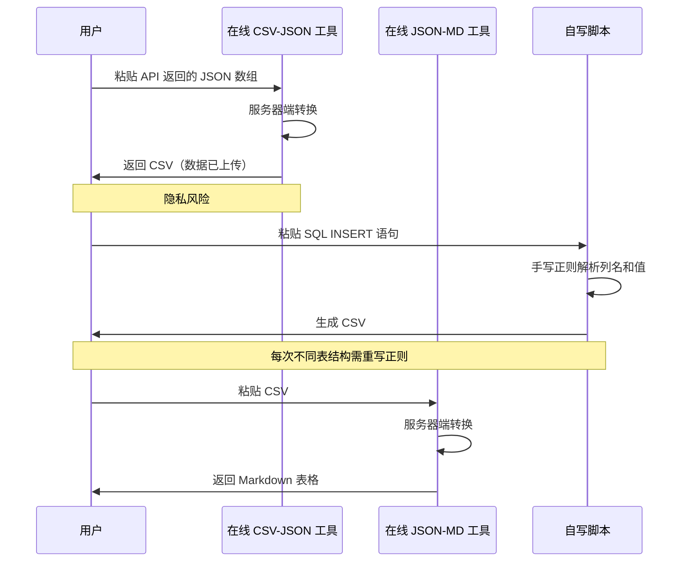
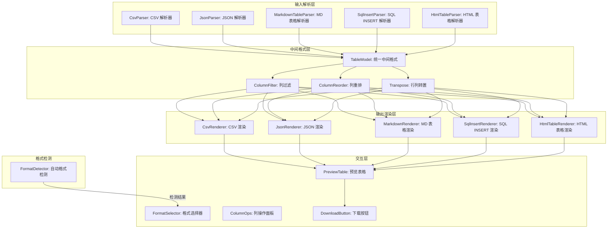

# YP-09-180: 表格数据转换器 — CSV/JSON/Markdown/SQL INSERT/HTML表格互转、自动格式检测、列映射、行列转置、列过滤、文件下载

> 需求编号：YP-09-180 · 优先级：P2 · 人天：0.2d · 状态：需求已编写
> 依赖：YP-09-150（JSON 格式化与验证）

## 背景

### 问题陈述

开发者和数据分析师在日常工作中频繁需要在不同表格格式之间转换数据。常见场景包括：从数据库导出 SQL INSERT 语句需要转为 CSV 进行数据分析、从 API 返回的 JSON 数组需要转为 Markdown 表格写入文档、从网页抓取的 HTML 表格需要转为 CSV 导入 Excel。然而，当前缺乏一站式本地表格转换工具：

1. **格式转换分散**：CSV 转 JSON 需要一个工具，JSON 转 Markdown 表需要另一个，SQL INSERT 转 CSV 又需要第三个
2. **在线工具有隐私风险**：表格数据常包含敏感信息（用户数据、财务数据），上传到第三方服务器不可接受
3. **格式检测困难**：用户需要手动判断输入格式，选错转换方向导致结果错误
4. **列操作缺失**：简单的列过滤、列重排、行列转置等操作需要切换到 Excel 或编写脚本
5. **循环转换精度损失**：多次格式互转（如 CSV→JSON→Markdown）可能丢失数据类型信息

**核心矛盾**：表格格式转换是多格式、高频的操作，但浏览器缺少支持所有常用表格格式互转的本地工具，用户被迫在多个外部工具间切换或编写临时脚本。

### 影响范围

| # | 影响 | 严重程度 | 典型场景 |
|---|------|----------|----------|
| 1 | 格式转换低效 | 高 | CSV 数据需嵌入文档为 Markdown 表格 |
| 2 | 数据隐私风险 | 高 | 包含敏感信息的表格上传到在线工具 |
| 3 | 格式选错导致数据错乱 | 中 | 粘贴 JSON 但选 CSV 转换，输出乱码 |
| 4 | 列操作需额外工具 | 中 | 仅需保留部分列时需打开 Excel |
| 5 | 循环转换精度损失 | 中 | 多次格式互转导致数字变字符串 |

### 挑战

| 挑战 | 说明 |
|------|------|
| 自动格式检测 | 用户输入一段文本，系统需自动判断是 CSV/JSON/Markdown 表格/SQL INSERT/HTML 表格中的哪种 |
| CSV 方言兼容 | CSV 分隔符可能是逗号、分号、Tab，引号可能是双引号或单引号，需自动检测 |
| SQL INSERT 解析 | 需解析多行 INSERT 语句，提取列名和值，处理字符串转义和 NULL 值 |
| HTML 表格解析 | 需处理 colspan/rowspan 合并单元格、嵌套表格、缺失的闭合标签 |
| 大表格性能 | 10000+ 行的表格转换可能耗时数秒，需不阻塞 UI |

---

## 一、现状分析

### 1.1 当前表格转换流程

```
用户需要转换表格格式
  │
  ├─ CSV → Markdown 表格
  │   ├─ 打开 csv-to-markdown.com
  │   ├─ 粘贴 CSV 数据（隐私风险）
  │   └─ 复制 Markdown 表格
  │
  ├─ JSON → HTML 表格
  │   ├─ 打开 convertjson.com/html-table
  │   ├─ 粘贴 JSON 数组
  │   └─ 复制 HTML 代码
  │
  ├─ SQL INSERT → CSV
  │   ├─ 写 Python/Node.js 脚本
  │   ├─ 正则提取列名和值
  │   └─ 导出 CSV
  │
  └─ 列过滤 + 转置
      ├─ 粘贴到 Excel/Google Sheets
      ├─ 手动操作（删除列、转置）
      └─ 导出为目标格式
  总耗时：3-10 分钟
```

### 1.2 当前可用能力

| 能力 | 可用性 | 获取方式 | 限制 |
|------|--------|----------|------|
| CSV 解析 | ❌ | 无内置 | 需手写 split 逻辑 |
| JSON 转表格 | ⚠️ | 手写代码 | 仅单向转换 |
| Markdown 表格解析 | ❌ | 无内置 | 需正则解析 |
| SQL INSERT 解析 | ❌ | 无内置 | 需正则 + SQL 知识 |
| HTML 表格解析 | ⚠️ | DOMParser | 需手动提取行列 |
| 格式自动检测 | ❌ | 无 | 用户手动判断 |

### 1.3 改造前数据流



### 1.4 根因矩阵

| 症状 | 根因 | 触发条件 | 频率 |
|------|------|----------|------|
| 格式转换分散 | 无多格式互转工具 | 每次需要转换表格 | 高 |
| 数据隐私风险 | 在线工具在服务器端处理数据 | 数据含敏感信息时 | 高 |
| 格式选错 | 无自动格式检测 | 用户不确定输入格式 | 中 |
| 列操作不便 | 无内置列过滤/重排/转置 | 仅需部分列时 | 中 |
| 精度损失 | 中间格式无类型保留 | 多次互转后 | 低 |
| SQL 解析困难 | 需手写正则或脚本 | 从数据库导出数据 | 中 |

---

## 二、设计决策

### 决策 1：格式检测策略 — 主动检测 vs 用户手动选择 vs 混合

| 选项 | 准确率 | 用户体验 | 实现复杂度 |
|------|--------|----------|-----------|
| 自动检测 + 自动转换 | 90%+ | 最好 | 中 |
| 用户手动选择格式 | 100%（用户知道时） | 中（需多一步） | 低 |
| 自动检测 + 手动覆盖 | 95%+ | 最好 | 中 |

**选择：自动检测 + 手动覆盖。** 系统自动分析输入文本特征（首字符、分隔符模式、关键字）判断格式，预选转换方向。用户可在格式不正确时手动切换。降低 90% 的手动选择操作。

### 决策 2：CSV 方言检测 — 固定格式 vs 自动检测 vs 手动配置

| 选项 | 兼容性 | 实现复杂度 | 误判率 |
|------|--------|-----------|--------|
| 固定逗号分隔 | 低（不支持 TSV/分号） | 低 | 高 |
| 自动检测分隔符和引号 | 高 | 中 | 低 |
| 手动配置所有参数 | 最高 | 中 | 零 |
| 自动检测 + 手动微调 | 最高 | 中 | 低 |

**选择：自动检测 + 手动微调。** 自动分析前 5 行数据检测分隔符（逗号/分号/Tab/竖线）、引号字符（双引号/单引号）、是否有标题行。用户可在高级选项中手动覆盖检测结果。

### 决策 3：转换引擎架构 — 中心化 vs 矩阵 vs 管道

| 选项 | 灵活性 | 代码量 | 可扩展性 |
|------|--------|--------|----------|
| 中心化（所有格式统一为中间格式再转换） | 中 | 低 | 高 |
| 矩阵（N×M 个转换器） | 高 | 高 | 低 |
| 管道（格式 → 中间格式 → 目标格式） | 高 | 中 | 高 |

**选择：管道架构（中间格式）。** 所有输入格式先解析为统一的中间格式（TableModel：columns + rows），再将中间格式渲染为目标输出格式。新增格式只需编写解析器和渲染器各一个，复杂度 O(n) 而非 O(n²)。

### 决策 4：列操作实现 — 在中间格式层 vs 在输入层 vs 在输出层

| 选项 | 性能 | 实现复杂度 | 功能完整性 |
|------|------|-----------|-----------|
| 在输入层（解析后立即操作） | 高 | 中 | 中 |
| 在中间格式层（TableModel 操作） | 中 | 低 | 高 |
| 在输出层（渲染前操作） | 低 | 高 | 中 |

**选择：在中间格式层操作。** TableModel 是列操作的自然位置——列过滤、列重排、行列转置都是对 columns 和 rows 的操作。统一在这一层实现，所有输入/输出格式自动获得列操作能力。

### 设计决策记录

| 决策 | 选项 A | 选项 B | 选项 C | 选择 | 理由 |
|------|--------|--------|--------|------|------|
| 格式检测 | 自动检测 | 手动选择 | 自动+覆盖 | **自动+覆盖** | 减少操作同时保证正确性 |
| CSV 方言 | 固定逗号 | 自动检测 | 自动+微调 | **自动+微调** | 兼容各种 CSV 变体 |
| 转换引擎 | 中心化 | 矩阵(N×M) | 管道(中间格式) | **管道(中间格式)** | O(n) 可扩展 |
| 列操作层 | 输入层 | 中间格式层 | 输出层 | **中间格式层** | 统一处理所有格式 |

---

## 三、目标架构

### 3.1 表格转换系统架构



### 3.2 格式检测决策树

```mermaid
graph TD
    A[用户粘贴文本] --> B{首字符判断}
    B -->|`{` 或 `[`| C{是 JSON 数组/对象?}
    C -->|是| D[JSON 格式]
    C -->|否| E[继续检测]
    B -->|`<`| F{包含 `<table>`?}
    F -->|是| G[HTML 表格]
    F -->|否| E
    B -->|`INSERT`/`insert`| H{匹配 SQL INSERT 模式?}
    H -->|是| I[SQL INSERT]
    H -->|否| E
    B -->|`|`| J{每行竖线分隔?}
    J -->|是| K[Markdown 表格]
    J -->|否| L[CSV（竖线分隔）]
    B -->|其他| E
    E --> M[分析分隔符模式]
    M --> N{主要分隔符?}
    N -->|逗号为主| O[CSV（逗号）]
    N -->|Tab 为主| P[TSV]
    N -->|分号为主| Q[CSV（分号）]
    N -->|无法判断| R[纯文本，提示选择]
```

### 3.3 性能指标

| 指标 | 目标值 | 说明 |
|------|--------|------|
| 小表格解析（< 100 行） | < 50ms | 格式检测 + 解析 + 渲染 |
| 中表格解析（100-1000 行） | < 200ms | 所有格式 |
| 大表格解析（1000-10000 行） | < 2s | Web Worker 处理 |
| 超大表格（> 10000 行） | < 5s | 限制渲染行数，提供下载 |
| 格式检测准确率 | > 95% | 5 种标准格式 |
| 列操作（过滤/转置） | < 50ms | 中间格式层操作 |

---

## 四、具体改动

### 4.1 中间格式数据模型

```typescript
// src/tools/table-converter/types.ts (新增)

export type TableFormat = 'csv' | 'json' | 'markdown' | 'sql-insert' | 'html';

export interface ColumnMeta {
  name: string;           // 列名
  index: number;          // 原始索引
  type: 'string' | 'number' | 'boolean' | 'null' | 'unknown';
  selected: boolean;      // 是否选中（列过滤）
}

export interface TableModel {
  columns: ColumnMeta[];
  rows: string[][];       // 所有值统一为字符串（避免精度损失）
  sourceFormat: TableFormat;
  rowCount: number;
  colCount: number;
}

export interface CsvDialect {
  delimiter: ',' | ';' | '\t' | '|';
  quoteChar: '"' | "'";
  hasHeader: boolean;
  lineBreak: '\n' | '\r\n';
}

export interface ParseResult {
  model: TableModel;
  detectedFormat: TableFormat;
  confidence: number;     // 0-1，格式检测置信度
  warnings: string[];     // 解析警告（如跳过空行）
}

export interface ConvertOptions {
  targetFormat: TableFormat;
  csvDialect?: CsvDialect;
  includeHeader?: boolean;
  tableName?: string;     // SQL INSERT 表名
  prettyPrint?: boolean;  // JSON 美化
}
```

### 4.2 格式检测器

```typescript
// src/tools/table-converter/FormatDetector.ts (新增)

import type { TableFormat, CsvDialect, ParseResult } from './types';

export class FormatDetector {
  private readonly detectors: Array<{
    format: TableFormat;
    detect: (text: string) => number; // 返回 0-1 置信度
  }>;

  constructor() {
    this.detectors = [
      { format: 'json', detect: this.detectJson.bind(this) },
      { format: 'html', detect: this.detectHtml.bind(this) },
      { format: 'sql-insert', detect: this.detectSqlInsert.bind(this) },
      { format: 'markdown', detect: this.detectMarkdown.bind(this) },
      { format: 'csv', detect: this.detectCsv.bind(this) },
    ];
  }

  detect(text: string): { format: TableFormat; confidence: number } {
    const trimmed = text.trim();
    if (!trimmed) return { format: 'csv', confidence: 0 };

    let bestFormat: TableFormat = 'csv';
    let bestConfidence = 0;

    for (const { format, detect } of this.detectors) {
      const confidence = detect(trimmed);
      if (confidence > bestConfidence) {
        bestConfidence = confidence;
        bestFormat = format;
      }
    }

    return { format: bestFormat, confidence: bestConfidence };
  }

  detectCsvDialect(text: string): CsvDialect {
    const lines = text.trim().split(/\r?\n/).filter(l => l.trim());
    if (lines.length === 0) return { delimiter: ',', quoteChar: '"', hasHeader: true, lineBreak: '\n' };

    // 检测分隔符：统计每行逗号/分号/Tab/竖线的数量
    const delimiters = [',', ';', '\t', '|'] as const;
    const counts = delimiters.map(d => {
      let total = 0, consistent = true;
      const firstCount = (lines[0].match(new RegExp(escapeRegex(d), 'g')) || []).length;
      for (const line of lines.slice(0, 5)) {
        const count = (line.match(new RegExp(escapeRegex(d), 'g')) || []).length;
        total += count;
        if (count !== firstCount && count !== firstCount + 1) consistent = false;
      }
      return { delimiter: d, count: total, consistent };
    });

    const best = counts.sort((a, b) => b.count - a.count)[0];
    return {
      delimiter: best.delimiter as CsvDialect['delimiter'],
      quoteChar: text.includes("'") && !text.includes('"') ? "'" : '"',
      hasHeader: true, // 默认假设有标题行
      lineBreak: text.includes('\r\n') ? '\r\n' : '\n',
    };
  }

  private detectJson(text: string): number {
    const trimmed = text.trim();
    if (trimmed.startsWith('[') && trimmed.endsWith(']')) {
      try { JSON.parse(trimmed); return 0.95; } catch { return 0.3; }
    }
    if (trimmed.startsWith('{')) {
      try { JSON.parse(trimmed); return 0.7; } catch { return 0.1; }
    }
    return 0;
  }

  private detectHtml(text: string): number {
    if (/<table[\s>]/i.test(text)) return 0.95;
    if (/<tr[\s>]/i.test(text) && /<t[dh][\s>]/i.test(text)) return 0.8;
    if (/<thead|<tbody/i.test(text)) return 0.6;
    return 0;
  }

  private detectSqlInsert(text: string): number {
    const hasInsert = /^\s*INSERT\s+INTO\s+\S+\s*\(/im.test(text);
    const hasValues = /\)\s*VALUES\s*\(/im.test(text);
    if (hasInsert && hasValues) return 0.95;
    if (hasInsert) return 0.5;
    return 0;
  }

  private detectMarkdown(text: string): number {
    const lines = text.trim().split('\n');
    if (lines.length < 2) return 0;
    // Markdown 表格：第一行是列名（|分隔），第二行是分隔符（|--|--|）
    const headerLine = lines[0];
    const separatorLine = lines[1];
    if (!headerLine.includes('|') || !separatorLine.includes('|')) return 0;
    if (/\|[\s]*[-:]+[\s]*\|/.test(separatorLine)) return 0.9;
    if (separatorLine.includes('--')) return 0.5;
    return 0;
  }

  private detectCsv(text: string): number {
    const lines = text.trim().split(/\r?\n/).filter(l => l.trim());
    if (lines.length < 2) return 0.1;
    // 检测分隔符一致性
    for (const d of [',', ';', '\t']) {
      const counts = lines.slice(0, 5).map(l => (l.match(new RegExp(escapeRegex(d), 'g')) || []).length);
      const allSame = counts.every(c => c > 0 && c === counts[0]);
      if (allSame) return 0.85;
      const mostSame = counts.filter(c => c === counts[0]).length >= 4;
      if (mostSame) return 0.6;
    }
    return 0.2;
  }
}

function escapeRegex(s: string): string {
  return s.replace(/[.*+?^${}()|[\]\\]/g, '\\$&');
}
```

### 4.3 CSV 解析器

```typescript
// src/tools/table-converter/CsvParser.ts (新增)

import type { TableModel, CsvDialect, ParseResult } from './types';

export class CsvParser {
  private detector = new FormatDetector();

  parse(text: string, dialect?: CsvDialect): ParseResult {
    const warnings: string[] = [];
    const d = dialect || this.detector.detectCsvDialect(text);

    const lines = text.trim().split(d.lineBreak);
    if (lines.length === 0) {
      return this.emptyResult('csv', warnings);
    }

    const rows = lines.map((line, i) => {
      const fields = this.splitLine(line, d.delimiter, d.quoteChar);
      if (fields.length === 0 && line.trim()) {
        warnings.push(`第 ${i + 1} 行为空，已跳过`);
      }
      return fields;
    }).filter(r => r.length > 0);

    if (rows.length === 0) return this.emptyResult('csv', warnings);

    const headerRow = d.hasHeader ? rows[0] : rows[0].map((_, i) => `列${i + 1}`);
    const dataRows = d.hasHeader ? rows.slice(1) : rows;

    const columns = headerRow.map((name, i) => ({
      name, index: i,
      type: this.inferColumnType(dataRows, i),
      selected: true,
    }));

    return {
      model: { columns, rows: dataRows, sourceFormat: 'csv', rowCount: dataRows.length, colCount: columns.length },
      detectedFormat: 'csv',
      confidence: 0.9,
      warnings,
    };
  }

  private splitLine(line: string, delimiter: string, quoteChar: string): string[] {
    const fields: string[] = [];
    let current = '';
    let inQuotes = false;

    for (let i = 0; i < line.length; i++) {
      const ch = line[i];
      if (inQuotes) {
        if (ch === quoteChar) {
          if (line[i + 1] === quoteChar) {
            current += quoteChar;
            i++; // 跳过转义的引号
          } else {
            inQuotes = false;
          }
        } else {
          current += ch;
        }
      } else {
        if (ch === quoteChar) {
          inQuotes = true;
        } else if (ch === delimiter) {
          fields.push(current.trim());
          current = '';
        } else {
          current += ch;
        }
      }
    }
    fields.push(current.trim());
    return fields;
  }

  private inferColumnType(rows: string[][], colIndex: number): ColumnMeta['type'] {
    let hasNumber = false, hasBoolean = false, hasNull = false;
    for (const row of rows.slice(0, 100)) {
      const val = row[colIndex]?.trim();
      if (!val || val === 'NULL' || val === 'null' || val === '') hasNull = true;
      else if (!isNaN(Number(val)) && val !== '') hasNumber = true;
      else if (val === 'true' || val === 'false') hasBoolean = true;
    }
    if (hasBoolean && !hasNumber) return 'boolean';
    if (hasNumber) return 'number';
    return 'string';
  }

  private emptyResult(format: TableFormat, warnings: string[]): ParseResult {
    return {
      model: { columns: [], rows: [], sourceFormat: format, rowCount: 0, colCount: 0 },
      detectedFormat: format, confidence: 0, warnings,
    };
  }
}
```

### 4.4 HTML 表格解析器

```typescript
// src/tools/table-converter/HtmlTableParser.ts (新增)

import type { TableModel, ParseResult } from './types';

export class HtmlTableParser {
  parse(html: string): ParseResult {
    const warnings: string[] = [];
    const parser = new DOMParser();
    const doc = parser.parseFromString(html, 'text/html');

    const table = doc.querySelector('table');
    if (!table) {
      return { model: { columns: [], rows: [], sourceFormat: 'html', rowCount: 0, colCount: 0 },
        detectedFormat: 'html', confidence: 0.3, warnings: ['未找到 <table> 元素'] };
    }

    // 提取表头
    const headerCells = table.querySelectorAll('thead th, thead td, tr:first-child th');
    let columns: ColumnMeta[];
    let dataRows: string[][];

    if (headerCells.length > 0) {
      columns = Array.from(headerCells).map((cell, i) => ({
        name: cell.textContent?.trim() || `列${i + 1}`,
        index: i,
        type: 'string' as const,
        selected: true,
      }));
      // 数据行从 thead 之后的 tr 开始
      const allRows = table.querySelectorAll('tr');
      const headerRowCount = table.querySelector('thead') ? 
        table.querySelectorAll('thead tr').length : 1;
      dataRows = Array.from(allRows).slice(headerRowCount).map(row =>
        Array.from(row.querySelectorAll('td')).map(td => td.textContent?.trim() || '')
      ).filter(r => r.length > 0);
    } else {
      // 无表头，取第一行作为列
      const allRows = Array.from(table.querySelectorAll('tr')).map(row =>
        Array.from(row.querySelectorAll('td, th')).map(cell => cell.textContent?.trim() || '')
      ).filter(r => r.length > 0);
      
      if (allRows.length === 0) {
        return { model: { columns: [], rows: [], sourceFormat: 'html', rowCount: 0, colCount: 0 },
          detectedFormat: 'html', confidence: 0.5, warnings: ['表格无可解析的行'] };
      }

      columns = allRows[0].map((name, i) => ({
        name: name || `列${i + 1}`, index: i, type: 'string' as const, selected: true,
      }));
      dataRows = allRows.slice(1);
    }

    return {
      model: { columns, rows: dataRows, sourceFormat: 'html', rowCount: dataRows.length, colCount: columns.length },
      detectedFormat: 'html', confidence: 0.9, warnings,
    };
  }
}
```

### 4.5 渲染器基类与实现

```typescript
// src/tools/table-converter/renderers/MarkdownRenderer.ts (新增)

import type { TableModel, ConvertOptions } from '../types';

export class MarkdownRenderer {
  render(model: TableModel, options?: ConvertOptions): string {
    const selectedCols = model.columns.filter(c => c.selected);
    if (selectedCols.length === 0) return '';

    // 表头行
    const header = '| ' + selectedCols.map(c => c.name).join(' | ') + ' |';

    // 分隔符行
    const separator = '|' + selectedCols.map(() => ' --- ').join('|') + '|';

    // 数据行
    const dataLines = model.rows.map(row =>
      '| ' + selectedCols.map(c => row[c.index] || '').join(' | ') + ' |'
    );

    return [header, separator, ...dataLines].join('\n');
  }
}
```

### 4.6 文件变更清单

| 文件 | 操作 | 说明 |
|------|------|------|
| `src/tools/table-converter/types.ts` | 新增 | 类型定义 |
| `src/tools/table-converter/FormatDetector.ts` | 新增 | 自动格式检测器 |
| `src/tools/table-converter/TableModel.ts` | 新增 | 中间格式数据模型操作 |
| `src/tools/table-converter/parsers/CsvParser.ts` | 新增 | CSV 解析器 |
| `src/tools/table-converter/parsers/JsonParser.ts` | 新增 | JSON 数组解析器 |
| `src/tools/table-converter/parsers/MarkdownParser.ts` | 新增 | Markdown 表格解析器 |
| `src/tools/table-converter/parsers/SqlInsertParser.ts` | 新增 | SQL INSERT 解析器 |
| `src/tools/table-converter/parsers/HtmlTableParser.ts` | 新增 | HTML 表格解析器 |
| `src/tools/table-converter/renderers/CsvRenderer.ts` | 新增 | CSV 渲染器 |
| `src/tools/table-converter/renderers/JsonRenderer.ts` | 新增 | JSON 渲染器 |
| `src/tools/table-converter/renderers/MarkdownRenderer.ts` | 新增 | Markdown 表格渲染器 |
| `src/tools/table-converter/renderers/SqlInsertRenderer.ts` | 新增 | SQL INSERT 渲染器 |
| `src/tools/table-converter/renderers/HtmlTableRenderer.ts` | 新增 | HTML 表格渲染器 |
| `src/tools/table-converter/TableConverter.vue` | 新增 | 主界面组件 |
| `src/tools/table-converter/ColumnPanel.vue` | 新增 | 列操作面板 |
| `src/popup/App.vue` | 修改 | 添加表格转换工具入口 |

---

## 五、实施步骤

| 步骤 | 操作 | 路径 | 验证 | 人天 |
|------|------|------|------|------|
| 1 | 定义类型和 TableModel | `types.ts` + `TableModel.ts` | 模型操作正确 | 0.01 |
| 2 | 实现格式检测器 | `FormatDetector.ts` | 5 种格式检测准确率 > 95% | 0.02 |
| 3 | 实现 5 个解析器 | `parsers/*.ts` | 每种格式解析正确 | 0.06 |
| 4 | 实现 5 个渲染器 | `renderers/*.ts` | 输出格式正确 | 0.04 |
| 5 | 实现列操作 | `TableModel.ts` 列方法 | 过滤/重排/转置正确 | 0.02 |
| 6 | 实现 UI 组件 | `TableConverter.vue` + `ColumnPanel.vue` | 交互流畅 | 0.04 |
| 7 | 编写测试 | `tests/unit/table-converter/` | 覆盖所有格式转换对 | 0.01 |

**总人天：0.2d**

---

## 六、测试规格

### 场景 1：CSV 转 Markdown 表格

**GIVEN** CSV 数据：
```
姓名,年龄,城市
张三,28,北京
李四,32,上海
```
**WHEN** 用户粘贴并选择输出格式为 Markdown 表格
**THEN** 输出正确的 Markdown 表格（含表头和分隔符行）
**AND** 预览表格显示 2 行 3 列数据

### 场景 2：自动格式检测

**GIVEN** 用户粘贴 JSON 数组 `[{"name":"张三","age":28},{"name":"李四","age":32}]`
**WHEN** 文本粘贴完成
**THEN** 自动检测为 JSON 格式
**AND** 格式选择器预选为 JSON
**AND** 输出格式默认设为 Markdown 表格

### 场景 3：列过滤操作

**GIVEN** 已解析的表格含 4 列（姓名/年龄/城市/电话）
**WHEN** 用户取消选中"电话"列
**THEN** 输出仅包含姓名/年龄/城市 3 列
**AND** "电话"列数据不出现在任何输出格式中

### 场景 4：行列转置

**GIVEN** 3 行 × 4 列的表格
**WHEN** 用户点击"行列转置"
**THEN** 输出 4 行 × 3 列的表格
**AND** 原列名变为第一列数据
**AND** 原第一列数据变为列名

### 场景 5：SQL INSERT 转 JSON

**GIVEN** SQL 语句：
```sql
INSERT INTO users (name, age, city) VALUES ('张三', 28, '北京'), ('李四', 32, '上海');
```
**WHEN** 用户选择输出格式为 JSON
**THEN** 输出 JSON 数组 `[{"name":"张三","age":"28","city":"北京"},...]`
**AND** 列名正确提取自 INSERT 列列表

### 场景 6：大表格处理

**GIVEN** 5000 行的 CSV 数据
**WHEN** 用户粘贴并转换
**THEN** 解析在 2 秒内完成
**AND** 预览表格限制显示前 100 行
**AND** 提供"下载完整文件"按钮
**AND** UI 保持响应（不卡顿）

---

## 七、风险与缓解

| 风险 | 概率 | 影响 | 缓解措施 |
|------|------|------|----------|
| CSV 引号嵌套解析错误 | 中 | 中 | 正确实现 RFC 4180 引号转义规则（双引号表示一个字面引号） |
| SQL INSERT 多行 VALUES 解析失败 | 中 | 中 | 支持多行 VALUES 子句，正则匹配 `\),\s*\(` 分割 |
| HTML 合并单元格数据丢失 | 中 | 中 | 对 colspan/rowspan 展开单元格，复制相邻单元格值 |
| 大表格阻塞主线程 | 中 | 中 | > 1000 行使用 Web Worker 解析，预览限制 100 行 |
| 格式检测误判 | 低 | 低 | 允许用户手动切换格式；显示检测置信度 |

---

## 八、回滚策略

| 场景 | 回滚操作 | 影响 |
|------|----------|------|
| 某格式解析器有严重 Bug | 禁用该格式输入，仅保留其他格式 | 该格式不可用 |
| 格式检测频繁误判 | 关闭自动检测，改为手动选择 | 需多一步操作 |
| Web Worker 解析崩溃 | 降级为主线程解析 + 限制行数 | 大表格可能卡顿 |
| 完全回滚 | 移除表格转换工具入口 | 功能回到改造前 |

---

## 九、设计决策记录

### D-01：为什么选择管道架构（中间格式）而非矩阵转换？

矩阵转换意味着 5×5=25 个转换器，每个都需要单独开发和维护。管道架构将所有输入格式先转为统一的 TableModel，再将 TableModel 转为目标格式，只需 5+5=10 个组件。新增一种格式只需添加 1 个解析器和 1 个渲染器，复杂度 O(n) 而非 O(n²)。

### D-02：为什么所有值统一为字符串？

不同类型的格式对数据类型的支持不同。JSON 支持 number/boolean/null，但 CSV 和 Markdown 表格不支持。如果用原始类型存储，CSV 转 JSON 再转 CSV 可能丢失数字精度或布尔值。统一为字符串避免了循环转换中的精度损失，列类型信息通过 ColumnMeta.type 单独保留。

### D-03：为什么格式检测使用多检测器加权而非规则链？

规则链（if JSON → else if HTML → else if CSV...）会导致检测顺序影响结果。多检测器加权方案为每种格式独立计算置信度（0-1），选择最高分。这更鲁棒——即使输入匹配多种格式特征，也能选择最可能的格式。

### D-04：为什么列操作放在中间格式层而非输入/输出层？

列操作（过滤、重排、转置）是对表格结构的操作，与输入格式和输出格式都无关。放在中间格式层（TableModel）意味着：一次列过滤，所有输出格式自动生效。如果放在输出层，每种输出格式都需要单独实现列过滤逻辑。

---

## 十、可观测性

### 指标

| 指标 | 类型 | 说明 |
|------|------|------|
| `yipet.table_conv.use_count` | Counter | 表格转换工具使用次数 |
| `yipet.table_conv.input_format` | Counter | 按输入格式统计 |
| `yipet.table_conv.output_format` | Counter | 按输出格式统计 |
| `yipet.table_conv.detect_accuracy` | Gauge | 格式检测准确率（用户手动切换时记录） |
| `yipet.table_conv.avg_rows` | Histogram | 平均处理行数 |
| `yipet.table_conv.col_ops` | Counter | 列操作使用次数（过滤/转置） |
| `yipet.table_conv.download_count` | Counter | 文件下载次数 |

### 告警

| 告警 | 条件 | 级别 |
|------|------|------|
| 解析失败率高 | 1h 内解析失败率 > 10% | WARNING |
| 大表格处理慢 | 5000+ 行表格 > 3s | WARNING |
| 格式检测频繁纠正 | 用户手动切换率 > 30% | INFO |

---

## 十一、代码审查检查清单

- [ ] 5 种格式（CSV/JSON/MD/SQL/HTML）均能正确解析
- [ ] 所有格式之间的转换矩阵（C(5,2)=10 对）均输出正确
- [ ] CSV 解析支持引号转义（RFC 4180）
- [ ] CSV 方言自动检测正确（逗号/分号/Tab/竖线）
- [ ] SQL INSERT 解析支持单行和多行 VALUES
- [ ] HTML 表格解析使用 DOMParser（安全解析）
- [ ] 格式自动检测准确率 > 95%
- [ ] 列过滤正确影响所有输出格式
- [ ] 行列转置正确（边界情况：1行×N列、N行×1列）
- [ ] 大表格（> 1000 行）使用 Web Worker
- [ ] 预览表格限制 100 行（防止 DOM 过大）
- [ ] 下载文件使用正确的 MIME 类型

---

## 回归问题预测

| # | 预测问题 | 原因 | 验证方法 |
|---|---------|------|---------|
| 1 | CSV 解析中，字段内容包含分隔符且未用引号包裹时，错误地拆分了该字段 | CSV 不是严格标准格式，用户可能粘贴非标准 CSV（如 `a,b,c,d` 但某字段是 `hello, world`） | 测试包含逗号的未引号字段，验证是否给出警告而非静默拆分 |
| 2 | SQL INSERT 解析中，VALUES 子句包含嵌套括号（如 `VALUES ('a(b)c', 1)`）时，正则分割错误地将字符串内的括号识别为新的 VALUES 组 | SQL 字符串值可以包含任意字符（包括括号），正则匹配 `\),\s*\(` 可能误分裂 | 测试包含括号的 SQL 字符串值，验证 VALUES 分组正确 |
| 3 | Markdown 表格解析中，表头分隔符行的对齐标记（`:---`, `:---:`, `---:`）被错误解析为列名的一部分 | 分隔符行以 `|` 开头和结尾时，首尾可能产生空字符串列 | 测试对齐标记的各种组合，验证列名数量始终正确且无空列名 |
| 4 | HTML 表格解析时，`<table>` 内部嵌有另一个 `<table>`（表格嵌套），内层表格的 `<tr>` 被错误地提取为外层表格的数据行 | `querySelectorAll('tr')` 在嵌套表格场景会选中所有层级的行 | 仅提取 `<table>` 直接子级中的 `<tr>`，跳过嵌套表格 |
| 5 | 行列转置后，原列名作为"新表第一列"的数据长度与原数据行数不一致 | 列名数量与行中列的数量不一致（某些行缺少字段），转置后出现缺值 | 转置后检查新表的每行列数一致性，缺失值填充为空字符串 |
| 6 | JSON 数组输入中，每个对象的键不完全相同（有些对象缺字段），CSV 输出时列数不一致 | JSON 数组允许异构对象，但 CSV 要求每行列数相同 | 解析时取所有对象的键的并集作为列，缺失值填充为空字符串 |

---

## 性能分析

### 各操作耗时

| 操作 | 预估耗时 | 说明 |
|------|----------|------|
| 格式检测（5 种格式） | < 5ms | 均基于正则和简单启发式 |
| CSV 解析（100 行） | < 10ms | split + 引号处理 |
| CSV 解析（1000 行） | < 100ms | 逐行解析 |
| JSON 解析（100 项） | < 20ms | JSON.parse + 遍历提取列 |
| Markdown 解析（100 行） | < 10ms | 正则匹配 |
| SQL INSERT 解析（100 行） | < 20ms | 正则提取列名 + VALUES 分组 |
| HTML 表格解析（100 行） | < 30ms | DOMParser + querySelector |
| 渲染器（任意格式，100 行） | < 5ms | 字符串拼接 |
| 列过滤（1000 行 × 10 列） | < 10ms | 内存过滤 |
| 行列转置（1000×10 → 10×1000） | < 50ms | 新建 rows 数组 |
| 总转换（100 行，任意格式对） | < 100ms | 检测 + 解析 + 渲染 |

### 文件体积预估

| 文件 | 大小 | 说明 |
|------|------|------|
| `types.ts` | ~1.5KB | 类型定义 |
| `FormatDetector.ts` | ~3KB | 格式检测（5 种格式检测器） |
| `TableModel.ts` | ~1KB | 中间格式 + 列操作 |
| `parsers/CsvParser.ts` | ~2KB | CSV + 方言检测 |
| `parsers/JsonParser.ts` | ~1KB | JSON 数组解析 |
| `parsers/MarkdownParser.ts` | ~1KB | Markdown 表格解析 |
| `parsers/SqlInsertParser.ts` | ~2KB | SQL INSERT 解析 |
| `parsers/HtmlTableParser.ts` | ~2KB | HTML 表格解析 |
| `renderers/*.ts` (5 个) | ~1KB each | 5 种渲染器 |
| `TableConverter.vue` | ~4KB | 主界面 |
| `ColumnPanel.vue` | ~2KB | 列操作面板 |

---

## 相关文档

- [YP-09-150: JSON 格式化与验证](150-需求-JSON格式化与验证.md)
- [RFC 4180 - CSV File Format](https://datatracker.ietf.org/doc/html/rfc4180)
- [Markdown Tables Spec](https://www.markdownguide.org/extended-syntax/#tables)