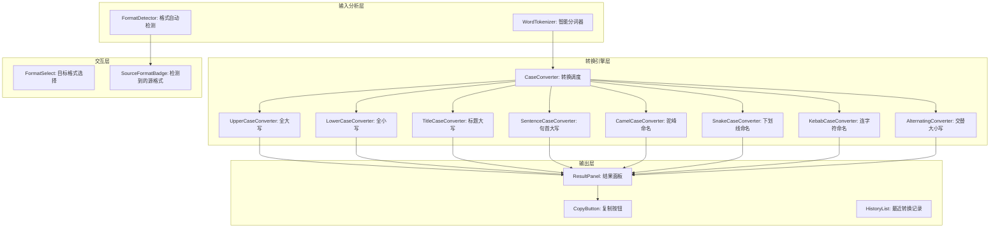

# YP-09-182: 文本大小写转换 — UPPERCASE/lowercase/Title Case/Sentence case/camelCase/kebab-case/snake_case/交替大小写、源码格式检测、应用并复制

> 需求编号：YP-09-182 · 优先级：P2 · 人天：0.2d · 状态：需求已编写
> 依赖：无

## 背景

### 问题陈述

文本大小写转换是开发者和内容创作者日常工作中最频繁的文本操作之一，但当前缺乏一站式本地转换工具。常见痛点包括：

1. **代码变量命名转换**：不同编程语言有不同的命名约定——JavaScript 用 camelCase，Python 用 snake_case，CSS 用 kebab-case。开发者频繁需要在这些格式间转换，但每次都需要手动逐个替换
2. **内容标题格式化**：标题格式（Title Case、Sentence case）有复杂的规则（冠词、介词不大写），手动格式化容易出错
3. **重复性操作**：全部大写/小写在 IDE 中有快捷键（Ctrl+Shift+U），但复杂格式转换（如 snake_case → camelCase）没有内置工具
4. **源码格式自动检测**：用户粘贴一段代码标识符，不知道当前的命名规范是什么，想要转换却不知从哪种格式开始
5. **边界情况处理**：连续大写缩写（如 `getUserID` → `get_user_id` 还是 `get_user_i_d`？`XMLParser` → `xml_parser` 还是 `x_m_l_parser`？）是命名转换中最容易出错的地方

**核心矛盾**：命名规范转换是开发中的高频需求，但几乎所有现有工具都仅支持简单的大写/小写切换，不支持开发中最需要的 camelCase/snake_case/kebab-case 三向互转，更不支持智能边界检测和处理连续大写。

### 影响范围

| # | 影响 | 严重程度 | 典型场景 |
|---|------|----------|----------|
| 1 | 命名转换低效 | 高 | 从 Python 接口定义生成前端 TypeScript 类型时转换字段名 |
| 2 | 标题格式化出错 | 中 | 撰写文档标题时忘记 Title Case 规则 |
| 3 | 源码格式未知 | 中 | 粘贴标识符但不知道当前格式 |
| 4 | 连续大写处理错误 | 中 | `parseXMLFile` 转 snake_case 时结果错误 |
| 5 | 交替大小写无工具 | 低 | 需要 sPoNgEbOb CaSe 文本时手动逐个切换 |

### 挑战

| 挑战 | 说明 |
|------|------|
| 连续大写边界检测 | `XMLParser` 是 `XML` + `Parser`（两个词）还是 `X`+`M`+`L`+`P`+...？需智能检测 |
| 数字边界处理 | `file2name` → `file_2_name` 还是 `file2_name`？不同约定有不同处理 |
| Title Case 规则复杂性 | 英文 Title Case 有不同风格（AP/Chicago/APA），对冠词、介词、连词的处理不同 |
| Unicode 大小写 | 非 ASCII 字符（如 `ß` 的大写是 `SS`，`İ` 的小写是 `i`）的大小写转换需要正确的 locale 处理 |
| 格式自动检测 | 输入 `user_profile_data` 可能同时匹配 snake_case（下划线）和 kebab-case（没有连字符但下划线可能是分隔符） |

---

## 一、现状分析

### 1.1 当前大小写转换流程

```
用户需要转换大小写/命名格式
  │
  ├─ 简单大小写切换
  │   ├─ IDE 快捷键 Ctrl+Shift+U（仅大写/小写）
  │   └─ 或在线 Case Converter 工具
  │
  ├─ 命名规范转换
  │   ├─ 打开 onlinecaseconvert.com
  │   ├─ 粘贴标识符
  │   └─ 复制转换结果
  │
  ├─ 标题格式化
  │   ├─ 打开 titlecase.com
  │   └─ 手动调整不符合规则的部分
  │
  ├─ 交替大小写
  │   └─ 需要写脚本或手动逐个切换
  │
  └─ 格式自动检测
      └─ 人工判断当前格式 → 选对应的转换
  总耗时：1-3 分钟
```

### 1.2 当前可用能力

| 能力 | 可用性 | 获取方式 | 限制 |
|------|--------|----------|------|
| 大写/小写切换 | 是 | IDE 快捷键 / CSS text-transform | 仅 uppercase/lowercase/capitalize |
| camelCase 转换 | ❌ | 在线工具 / IDE 插件 | 不是所有 IDE 都有 |
| snake_case 转换 | ❌ | 在线工具 | 同上 |
| kebab-case 转换 | ❌ | 在线工具 | 同上 |
| Title Case | ❌ | 在线工具 | 规则差异大 |
| Sentence case | ⚠️ | 在线工具 | 实现简单但有细节 |
| 交替大小写 | ❌ | 自写脚本 | 无内置工具 |
| 格式自动检测 | ❌ | 无 | 需人工判断 |

### 1.3 根因矩阵

| 症状 | 根因 | 触发条件 | 频率 |
|------|------|----------|------|
| 命名转换低效 | 无内置多格式转换器 | 跨项目/跨语言开发时 | 高 |
| 连续大写分割错误 | 无启发式边界检测 | 含缩写词的标识符（XML/HTML/API） | 中 |
| 标题格式化出错 | Title Case 规则复杂 | 英文文档标题格式化 | 中 |
| 格式未知 | 无自动检测 | 粘贴陌生标识符时 | 中 |
| 在线工具有隐私风险 | 代码标识符可能泄露项目信息 | 粘贴内部项目的变量名 | 低 |

---

## 二、设计决策

### 决策 1：连续大写分割策略 — 保守（全保留） vs 激进（逐字母） vs 启发式

| 选项 | `XMLParser` 结果 | `getID` 结果 | 适用场景 |
|------|-----------------|-------------|----------|
| 保守：仅在有大小写边界处分割 | `xml_parser` | `get_id` | 99% 场景正确 |
| 激进：连续大写按字母分割 | `x_m_l_parser` | `get_i_d` | 几乎从不正确 |
| 启发式：连续大写 ≥ 2 且其后有小写时作为整体 | `xml_parser` | `get_id` | 最优 |

**选择：启发式算法。** 规则：(1) 连续大写字母数量 ≥ 2 且紧跟着小写字母时，最后一个大写字母与前面的视为一个缩写词；(2) 全大写序列后无小写字母时视为独立单词。此规则能正确处理 `XMLParser` → `xml_parser`、`getID` → `get_id`、`HTTPSConnection` → `https_connection`。

### 决策 2：Title Case 规则 — 简单规则 vs AP Style vs 可配置

| 选项 | 准确性 | 实现复杂度 | 用户满意度 |
|------|--------|-----------|-----------|
| 简单规则（每个词首字母大写） | 70% | 低 | 低（冠词也被大写） |
| AP Style（冠词/介词/连词不大写） | 85% | 中 | 高 |
| Chicago Style | 85% | 中 | 高 |
| 可配置（用户选风格） | 95% | 高 | 最高 |

**选择：AP Style + 可调整结果。** AP Style 是最广泛使用的标题大小写风格。实现核心规则表（冠词：a/an/the，介词≤4字母：in/on/at/to/for/of/with/from，连词：and/but/or/nor/for/so/yet）。提供"手动调整"模式，用户可对自动结果进行微调。

### 决策 3：格式检测策略 — 规则匹配 vs 机器学习 vs 混合

| 选项 | 准确率 | 实现复杂度 | 误判率 |
|------|--------|-----------|--------|
| 纯规则匹配（正则） | 90% | 低 | 中 |
| 机器学习/统计 | 98% | 高 | 低 |
| 规则 + 置信度评分 | 95% | 中 | 低 |

**选择：规则 + 置信度评分。** 对每种格式定义特征规则（snake_case 有下划线无连字符无大写、camelCase 有大小写交替无分隔符、kebab-case 有连字符无下划线等）。计算每种格式的置信度得分，返回最高分格式及其置信度。

### 决策 4：数字边界处理 — 数字作为分隔符 vs 数字作为单词的一部分 vs 可配置

| 选项 | `file2name` 结果 | 适用场景 | 实现复杂度 |
|------|-----------------|----------|-----------|
| 数字作为分隔符 | `file_2_name` | 多数场景 | 低 |
| 数字作为单词一部分 | `file2_name` | 版本号场景 | 低 |
| 用户可配置 | 用户决定 | 所有场景 | 中 |

**选择：数字作为分隔符（默认）。** 大多数场景中 `file2name` 的意图是 `file` + `2` + `name`。如果数字是单词的一部分（如 `utf8`、`a4paper`），各单词通常不会以数字结尾。提供选项让用户切换行为。

### 设计决策记录

| 决策 | 选项 A | 选项 B | 选项 C | 选择 | 理由 |
|------|--------|--------|--------|------|------|
| 连续大写 | 保守 | 激进 | 启发式 | **启发式** | 正确处理缩写词 |
| Title Case | 简单规则 | AP Style | 可配置 | **AP Style + 调整** | 最广泛接受 |
| 格式检测 | 纯规则 | ML | 规则+置信度 | **规则+置信度** | 准确且简单 |
| 数字边界 | 作为分隔符 | 不处理 | 可配置 | **作为分隔符** | 覆盖多数场景 |

---

## 三、目标架构

### 3.1 大小写转换系统架构



### 3.2 分词与转换流程

```mermaid
graph TD
    A[用户输入文本] --> B[格式检测]
    B --> C{检测到格式?}
    C -->|是| D[WordTokenizer: 按格式规则分词]
    C -->|否/低置信度| E[使用启发式分词]
    D --> F[得到词列表: word1, word2, ...]
    E --> F
    F --> G[转换引擎: 按目标格式重组]
    G --> H{目标格式}
    H -->|UPPERCASE| I[words.join('').toUpperCase()]
    H -->|lowercase| J[words.join('').toLowerCase()]
    H -->|Title Case| K[每个词首字母大写，冠词/介词除外]
    H -->|Sentence case| L[首词首字母大写，其余小写]
    H -->|camelCase| M[首词小写，其余词首字母大写，无分隔符]
    H -->|snake_case| N[全部小写，下划线分隔]
    H -->|kebab-case| O[全部小写，连字符分隔]
    H -->|Alternating| P[逐字符交替大小写]
```

### 3.3 性能指标

| 指标 | 目标值 | 说明 |
|------|--------|------|
| 格式检测 | < 5ms | 正则 + 规则评分 |
| 分词（100 词标识符） | < 5ms | 边界检测遍历 |
| 单次转换 | < 1ms | 字符串拼接 |
| 全 8 种格式实时预览 | < 20ms | 8 次转换并行 |
| Title Case 规则匹配 | < 5ms | 逐词检查规则表 |

---

## 四、具体改动

### 4.1 类型定义与格式检测

```typescript
// src/tools/case-converter/types.ts (新增)

export type CaseFormat =
  | 'lowercase'
  | 'uppercase'
  | 'title-case'
  | 'sentence-case'
  | 'camelCase'
  | 'PascalCase'
  | 'snake_case'
  | 'SCREAMING_SNAKE_CASE'
  | 'kebab-case'
  | 'alternating';

export interface CaseDetectResult {
  format: CaseFormat;
  confidence: number; // 0-1
  alternatives: Array<{ format: CaseFormat; confidence: number }>;
}

export interface ConversionResult {
  format: CaseFormat;
  label: string;       // 中文标签如 "驼峰命名"
  example: string;     // 示例如 "helloWorld"
  result: string;      // 转换结果
}
```

### 4.2 智能分词器

```typescript
// src/tools/case-converter/WordTokenizer.ts (新增)

/**
 * 智能分词器 —— 将各种命名格式的标识符拆分为词列表
 * 
 * 处理边界情况：
 * - camelCase:     myVariableName  → ['my', 'Variable', 'Name']
 * - PascalCase:    MyComponent     → ['My', 'Component']
 * - snake_case:    user_profile    → ['user', 'profile']
 * - kebab-case:    my-component   → ['my', 'component']
 * - 连续大写:      XMLParser       → ['XML', 'Parser']
 * - 数字:          file2name       → ['file', '2', 'name']
 * - 混合:          getIDValueV3    → ['get', 'ID', 'Value', 'V3']
 */
export class WordTokenizer {
  private readonly CAMEL_BOUNDARY = /(?<=[a-z])(?=[A-Z])/;           // aA 边界
  private readonly ACRONYM_BOUNDARY = /(?<=[A-Z])(?=[A-Z][a-z])/;     // XMLParser → XML|Parser
  private readonly DIGIT_BOUNDARY = /(?<=[a-zA-Z])(?=\d)|(?<=\d)(?=[a-zA-Z])/; // file2name → file|2|name

  tokenize(input: string, sourceFormat: CaseFormat): string[] {
    if (!input.trim()) return [];

    switch (sourceFormat) {
      case 'snake_case':
      case 'SCREAMING_SNAKE_CASE':
        return input.split('_').filter(Boolean);
      case 'kebab-case':
        return input.split('-').filter(Boolean);
      case 'camelCase':
      case 'PascalCase':
        return this.splitCamelOrPascal(input);
      case 'lowercase':
      case 'uppercase':
        // 单格式文本：尝试按单词边界检测
        return this.heuristicTokenize(input);
      default:
        return [input];
    }
  }

  private splitCamelOrPascal(input: string): string[] {
    // 1. 先按缩写词边界分割
    //    XMLParser → XML | Parser
    let withAcronymBoundary = input.replace(this.ACRONYM_BOUNDARY, '\x00');
    
    // 2. 再按小写→大写边界分割
    //    myVariable → my | Variable
    withAcronymBoundary = withAcronymBoundary.replace(this.CAMEL_BOUNDARY, '\x00');
    
    // 3. 按数字边界分割
    //    file2name → file | 2 | name
    withAcronymBoundary = withAcronymBoundary.replace(this.DIGIT_BOUNDARY, '\x00');

    return withAcronymBoundary.split('\x00').filter(Boolean);
  }

  private heuristicTokenize(input: string): string[] {
    // 对于没有显式分隔符的文本，使用亮度式分词
    // 先尝试按下划线/连字符分割，如果没有则尝试大小写边界
    if (input.includes('_')) return input.split('_').filter(Boolean);
    if (input.includes('-')) return input.split('-').filter(Boolean);
    if (/\s/.test(input)) return input.split(/\s+/).filter(Boolean);
    
    // 最终尝试大小写边界
    const split = input.replace(this.CAMEL_BOUNDARY, '\x00')
      .replace(this.ACRONYM_BOUNDARY, '\x00')
      .replace(this.DIGIT_BOUNDARY, '\x00');
    const tokens = split.split('\x00').filter(Boolean);
    return tokens.length > 1 ? tokens : [input];
  }
}
```

### 4.3 转换器集合

```typescript
// src/tools/case-converter/converters.ts (新增)

export interface Converter {
  format: CaseFormat;
  label: string;
  convert(words: string[], options?: ConvertOptions): string;
}

export const CONVERTERS: Converter[] = [
  {
    format: 'lowercase',
    label: '全部小写',
    convert: (words) => words.join(' ').toLowerCase(),
  },
  {
    format: 'uppercase',
    label: '全部大写',
    convert: (words) => words.join(' ').toUpperCase(),
  },
  {
    format: 'title-case',
    label: '标题大写 (Title Case)',
    convert: (words) => words.map((w, i) => {
      if (i === 0) return capitalize(w.toLowerCase());
      if (isMinorWord(w)) return w.toLowerCase();
      return capitalize(w.toLowerCase());
    }).join(' '),
  },
  {
    format: 'sentence-case',
    label: '句首大写 (Sentence case)',
    convert: (words) => {
      const lower = words.map(w => w.toLowerCase());
      if (lower.length > 0) lower[0] = capitalize(lower[0]);
      return lower.join(' ');
    },
  },
  {
    format: 'camelCase',
    label: '驼峰命名 (camelCase)',
    convert: (words) => words.map((w, i) =>
      i === 0 ? w.toLowerCase() : capitalize(w.toLowerCase())
    ).join(''),
  },
  {
    format: 'PascalCase',
    label: '帕斯卡命名 (PascalCase)',
    convert: (words) => words.map(w => capitalize(w.toLowerCase())).join(''),
  },
  {
    format: 'snake_case',
    label: '下划线小写 (snake_case)',
    convert: (words) => words.map(w => w.toLowerCase()).join('_'),
  },
  {
    format: 'SCREAMING_SNAKE_CASE',
    label: '下划线大写 (SCREAMING_SNAKE_CASE)',
    convert: (words) => words.map(w => w.toUpperCase()).join('_'),
  },
  {
    format: 'kebab-case',
    label: '连字符小写 (kebab-case)',
    convert: (words) => words.map(w => w.toLowerCase()).join('-'),
  },
  {
    format: 'alternating',
    label: '交替大小写 (aLtErNaTiNg)',
    convert: (words) => {
      const joined = words.join('');
      return [...joined].map((ch, i) =>
        i % 2 === 0 ? ch.toLowerCase() : ch.toUpperCase()
      ).join('');
    },
  },
];

function capitalize(s: string): string {
  if (!s) return s;
  return s.charAt(0).toUpperCase() + s.slice(1);
}

/** AP Style: 不大写的冠词/介词/连词 */
const MINOR_WORDS = new Set([
  'a', 'an', 'the',           // 冠词
  'in', 'on', 'at', 'to', 'for', 'of', 'with', 'from', 'by', 'up', 'out', 'off', 'over',
  'and', 'but', 'or', 'nor', 'for', 'so', 'yet', // 连词
  'as', 'if', 'than', 'that',                         // 从属连词
]);

function isMinorWord(word: string): boolean {
  return MINOR_WORDS.has(word.toLowerCase());
}
```

### 4.4 格式检测器

```typescript
// src/tools/case-converter/FormatDetector.ts (新增)

import type { CaseFormat, CaseDetectResult } from './types';

export class FormatDetector {
  detect(input: string): CaseDetectResult {
    if (!input.trim()) {
      return { format: 'lowercase', confidence: 0, alternatives: [] };
    }

    const scores = new Map<CaseFormat, number>();

    // 检测连字符（kebab-case 的最高指示符）
    if (input.includes('-') && !input.includes('_')) {
      scores.set('kebab-case', 0.95);
    }

    // 检测下划线
    if (input.includes('_')) {
      if (/^[A-Z][A-Z0-9_]*$/.test(input) || /^[A-Z_][A-Z0-9_]*$/.test(input)) {
        scores.set('SCREAMING_SNAKE_CASE', 0.9);
      } else {
        scores.set('snake_case', 0.9);
      }
    }

    // 检测大小写模式（无分隔符时）
    if (!input.includes('_') && !input.includes('-') && !input.includes(' ')) {
      if (/^[a-z][a-zA-Z0-9]*$/.test(input) && /[A-Z]/.test(input)) {
        scores.set('camelCase', 0.9);
      }
      if (/^[A-Z][a-zA-Z0-9]*$/.test(input) && /[a-z]/.test(input)) {
        scores.set('PascalCase', 0.9);
      }
      if (/^[a-z0-9]+$/.test(input)) {
        scores.set('lowercase', 0.7);
      }
      if (/^[A-Z0-9]+$/.test(input)) {
        scores.set('uppercase', 0.7);
      }
    }

    // 检测空格分隔（自然语言）
    if (/\s/.test(input)) {
      if (/^[A-Z]/.test(input) && !/[A-Z]{2,}/.test(input)) {
        scores.set('sentence-case', 0.7);
        scores.set('title-case', 0.5);
      }
      if (/^[a-z]/.test(input)) {
        scores.set('lowercase', 0.5);
      }
    }

    // 选择最高分格式
    if (scores.size === 0) {
      return { format: 'lowercase', confidence: 0.3, alternatives: [] };
    }

    const sorted = [...scores.entries()]
      .sort((a, b) => b[1] - a[1]);

    return {
      format: sorted[0][0],
      confidence: sorted[0][1],
      alternatives: sorted.slice(1).map(([f, c]) => ({ format: f, confidence: c })),
    };
  }
}
```

### 4.5 文件变更清单

| 文件 | 操作 | 说明 |
|------|------|------|
| `src/tools/case-converter/types.ts` | 新增 | 类型定义 |
| `src/tools/case-converter/WordTokenizer.ts` | 新增 | 智能分词器 |
| `src/tools/case-converter/FormatDetector.ts` | 新增 | 格式自动检测 |
| `src/tools/case-converter/converters.ts` | 新增 | 10 种格式转换器 |
| `src/tools/case-converter/CaseConverter.vue` | 新增 | 主界面组件 |
| `src/popup/App.vue` | 修改 | 添加大小写转换工具入口 |
| `tests/unit/case-converter/` | 新增 | 分词器 + 检测器 + 转换器测试 |

---

## 五、实施步骤

| 步骤 | 操作 | 路径 | 验证 | 人天 |
|------|------|------|------|------|
| 1 | 定义类型和格式枚举 | `types.ts` | 类型安全 | 0.01 |
| 2 | 实现智能分词器 | `WordTokenizer.ts` | 所有边界情况正确处理 | 0.04 |
| 3 | 实现格式检测器 | `FormatDetector.ts` | 10 种格式检测准确率 > 95% | 0.03 |
| 4 | 实现 10 种格式转换器 | `converters.ts` | 每种格式输出正确 | 0.04 |
| 5 | 实现 UI 组件 | `CaseConverter.vue` | 实时预览所有格式 | 0.05 |
| 6 | 编写测试 | `tests/unit/case-converter/` | 分词 + 检测 + 全部转换器 | 0.03 |

**总人天：0.2d**

---

## 六、测试规格

### 场景 1：camelCase 转 snake_case

**GIVEN** 用户输入 camelCase 标识符 `userProfileName`
**WHEN** 系统检测为 camelCase 并分词为 `['user', 'Profile', 'Name']`
**THEN** snake_case 输出: `user_profile_name`
**AND** SCREAMING_SNAKE_CASE 输出: `USER_PROFILE_NAME`
**AND** kebab-case 输出: `user-profile-name`

### 场景 2：连续大写缩写处理

**GIVEN** 用户输入 `XMLParserConfig`
**WHEN** 启发式分词器处理
**THEN** 分词为 `['XML', 'Parser', 'Config']`（而非 `['X', 'M', 'L', ...]`）
**AND** snake_case 输出: `xml_parser_config`
**AND** camelCase 输出: `xmlParserConfig`

### 场景 3：数字边界处理

**GIVEN** 用户输入 `file2nameV3`
**WHEN** 分词器处理
**THEN** 分词为 `['file', '2', 'name', 'V3']`
**AND** snake_case 输出: `file_2_name_v3`
**AND** kebab-case 输出: `file-2-name-v3`

### 场景 4：Title Case AP Style

**GIVEN** 用户输入 `the lord of the rings`
**WHEN** 转换为 Title Case (AP Style)
**THEN** 输出: `The Lord of the Rings`
**AND** 冠词 `the` 在中间位置不大写，但在句首大写
**AND** 介词 `of` 不大写

### 场景 5：交替大小写

**GIVEN** 用户输入 `hello world`
**WHEN** 选择交替大小写转换
**THEN** 输出: `hElLo wOrLd`
**AND** 空格保留，仅字母字符交替大小写

### 场景 6：全格式实时预览

**GIVEN** 用户输入 `my_variable_name`（检测为 snake_case）
**WHEN** 系统分词为 `['my', 'variable', 'name']`
**THEN** 一次性展示所有 10 种格式的转换结果
**AND** 每种格式旁标注格式名称和示例
**AND** 用户可点击任意一种结果的复制按钮

---

## 七、风险与缓解

| 风险 | 概率 | 影响 | 缓解措施 |
|------|------|------|----------|
| 缩写词分割错误（如 `iOSApp` → `i_os_app`） | 中 | 中 | 维护常见缩写白名单（iOS、macOS、API、URL、HTML），白名单内词汇不拆分 |
| 格式检测误判（`A` 到底是常量名还是大写文本） | 低 | 低 | 显示置信度，用户可手动覆盖 |
| Title Case 冠词规则不满足所有风格 | 中 | 低 | 标注"AP Style"，支持用户手动编辑结果 |
| 非英语字符大小写错误（如土耳其语 `İ`） | 低 | 低 | 使用 `toLocaleLowerCase('en-US')` 强制英语 locale |
| 超长标识符（100+ 词）实时预览性能 | 低 | 低 | 限制输入 1000 字符 |

---

## 八、回滚策略

| 场景 | 回滚操作 | 影响 |
|------|----------|------|
| 分词器对某格式严重错误 | 回退到简单 split 策略 | 连续大写处理能力丧失 |
| 格式检测误判率高 | 关闭自动检测，改为手动选择 | 需多一步操作 |
| 完全回滚 | 移除大小写转换工具入口 | 功能回到改造前 |

---

## 九、设计决策记录

### D-01：为什么采用启发式连续大写分割而非简单正则？

简单正则 `/(?<=[a-z])(?=[A-Z])/g` 仅能处理 `myVariable` 这种标准驼峰，无法处理 `XMLParser`（需识别 `XML` 是缩写词）。启发式规则 `(?<=[A-Z])(?=[A-Z][a-z])` 在连续大写后跟小写字母时才分割，正确处理了缩写词嵌入的情况。WhiteList（iOS、API、URL）进一步提高了准确率。

### D-02：为什么数字默认作为分隔符？

在代码标识符中，数字通常表示版本号或序号（`V2`、`file2`），作为独立的语义单元。将数字作为分隔符使 `file2name` 的分词结果 `['file', '2', 'name']` 更符合开发者的直觉。如果用户希望数字附着到前一个或后一个单词（如 `utf8`），可以通过选项切换。

### D-03：为什么 Title Case 选择 AP Style 而非 Chicago Style？

AP Style（Associated Press）是新闻报道和 Web 内容中最广泛使用的标题风格。其规则相对简洁（短介词和冠词不大写），易于实现。Chicago Style 规则更复杂（所有介词无论长短都不大写），用户群体更窄。标注"AP Style"让用户明确知道规则来源，并支持手动调整。

### D-04：为什么选择全格式实时预览而非单格式选择？

传统工具让用户先选目标格式再点击转换。全格式实时预览（输入即展示 10 种格式的结果）将用户操作从"选 → 转换 → 查看 → 不满意 → 选另一个 → 转换"缩短为"输入 → 同时看到所有结果 → 复制想要的"。这符合"珍惜注意力"的核心理念。

---

## 十、可观测性

### 指标

| 指标 | 类型 | 说明 |
|------|------|------|
| `yipet.case_conv.use_count` | Counter | 大小写转换工具使用次数 |
| `yipet.case_conv.input_format` | Counter | 检测到的输入格式分布 |
| `yipet.case_conv.output_format` | Counter | 被复制的输出格式分布 |
| `yipet.case_conv.detect_confidence` | Histogram | 格式检测置信度分布 |
| `yipet.case_conv.manual_override` | Counter | 用户手动切换格式次数 |

### 告警

| 告警 | 条件 | 级别 |
|------|------|------|
| 格式检测频繁被覆盖 | 手动切换率 > 30% | INFO |

---

## 十一、代码审查检查清单

- [ ] 分词器正确处理 camelCase/PascalCase/snake_case/kebab-case 四种源格式
- [ ] 连续大写缩写正确分割（XMLParser → XML|Parser）
- [ ] 数字边界正确分割（file2nameV3 → file|2|name|V3）
- [ ] 常见缩写白名单（iOS、API、URL）不拆分
- [ ] 10 种格式转换器输出正确
- [ ] Title Case 遵循 AP Style（短介词/冠词不大写）
- [ ] 格式检测 10 种格式准确率 > 95%
- [ ] 全格式实时预览响应 < 20ms
- [ ] 空输入和纯数字输入不崩溃
- [ ] 单字符输入正确处理（不产生空分词）
- [ ] 复制按钮一键复制转换结果

---

## 回归问题预测

| # | 预测问题 | 原因 | 验证方法 |
|---|---------|------|---------|
| 1 | 全大写常量名（如 `MAX_RETRY_COUNT`）被检测为 SCREAMING_SNAKE_CASE → 分词为 `['MAX', 'RETRY', 'COUNT']` → 转 camelCase 为 `maxRetryCount`，但如果输入是 `MAX_RETRY_COUNT` 且下划线才是真正分隔符，结果正确；但如果输入是无下划线全大写 `MAXRETRYCOUNT`，被检测为 uppercase → 启发式分词失败 → 整个作为一个词 | 无分隔符的全大写文本无法自动分词，因为没有边界信息 | 检测到 uppercase 且词长 > 10 字符时，提示"无法自动分词，请使用支持分隔符的格式" |
| 2 | 包含 Unicode 字母的标识符（如 `naïve_user`、`Straße_name`），大小写转换时 `ß`.toUpperCase() = `SS` 导致长度变化 | Unicode 大小写映射不是一对一的，某些字符的大小写映射会改变字符串长度 | 检测到包含 Unicode 字母时，使用 `toLocaleUpperCase('en-US')` 并标注"部分 Unicode 字符大小写映射可能不精确" |
| 3 | 空分词（如输入 `_private_var` 或 `-webkit-flex`），snake_case/kebab-case 的 `split('_')` 产生空字符串项 | 前导下划线/连字符在 split 时产生空元素被 `.filter(Boolean)` 移除，但输出时前导符号丢失 | 在分词前检测并保留前导/后缀分隔符，转换完成后重新添加 |
| 4 | 用户输入本身就是混合格式（如 `user_profile-name` 同时含下划线和连字符），格式检测可能选错，分词也可能混合两种策略导致结果不可预测 | 多种分隔符混合时，检测器不确定选择哪种格式 | 检测到混合分隔符时，同时显示两种格式的检测结果，让用户选择；分词时优先使用用户确认的格式 |
| 5 | 交替大小写模式（aLtErNaTiNg）中，非字母字符（数字、符号）是否跳过不计数？用户期望 `hello123` → `hElLo123`（跳过数字）还是 `hElLo123`（数字也参与奇偶计数）？ | 没有标准约定，不同实现行为不同 | 默认跳过非字母字符（不改变其大小写，不计入奇偶），提供选项切换 |
| 6 | Title Case 中，包含连字符的复合词（如 `state-of-the-art`）应该 `State-of-the-Art`（每部分首字母大写）还是 `State-of-the-art`（仅第一个词大写）？ | AP Style 规定复合词的每个部分在标题中都要大写（除非该部分是冠词/介词），但长连字符词可能有不同处理 | 默认每个部分首字母大写，短介词（of/the/for）不大写：`State-of-the-Art` |

---

## 性能分析

### 各操作耗时

| 操作 | 预估耗时 | 说明 |
|------|----------|------|
| 格式检测（50 字符标识符） | < 2ms | 5-8 个正则测试 |
| 分词（camelCase，10 词） | < 1ms | 3 次正则 replace |
| 单格式转换 | < 0.5ms | 字符串 join + toLowerCase |
| Title Case 转换（10 词） | < 1ms | 逐词检查规则表 |
| 全格式实时预览（10 种格式） | < 10ms | 10 次转换并行 |
| 长文本（500 字符，50 词） | < 20ms | 分词 + 10 次转换 |

### 文件体积预估

| 文件 | 大小 | 说明 |
|------|------|------|
| `types.ts` | ~1KB | 类型 + 格式枚举 |
| `WordTokenizer.ts` | ~3KB | 智能分词核心 |
| `FormatDetector.ts` | ~2KB | 10 种格式检测 |
| `converters.ts` | ~3KB | 10 个转换器 + AP Style 规则表 |
| `CaseConverter.vue` | ~4KB | 主界面（实时预览） |

---

## 相关文档

- [camelCase Naming Convention](https://en.wikipedia.org/wiki/Camel_case)
- [AP Style Title Case](https://apastyle.apa.org/style-grammar-guidelines/capitalization/title-case)
- [Unicode Case Mapping](https://unicode.org/faq/casemap_charprop.html)