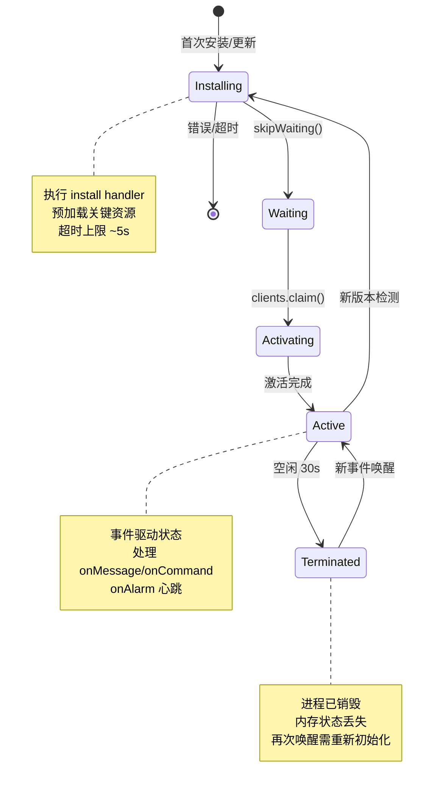

# YP-09-12: Service Worker 生命周期状态机 — 事件驱动模型与故障恢复

> 需求编号：YP-09-12 · 优先级：P1 · 人天：1.5d · 状态：需求已编写
> 依赖：YP-09-02（Service Worker 可靠性）

## 背景

Chrome MV3 的 Service Worker 生命周期与传统 Web Worker 有本质区别——它是**事件驱动**的，空闲 30s 后被浏览器强制终止。YP-09-02 通过 `chrome.alarms` 心跳和消息队列缓解了数据丢失问题，但 SW 的整体生命周期管理仍缺少系统化的状态机模型。

| 问题 | 影响 |
|------|------|
| SW 启动→终止的转换时机不可预测（浏览器控制） | 状态恢复逻辑分散 |
| SW 在 `install`/`activate` 阶段执行重 I/O 可能被超时终止 | 初始化失败静默 |
| 多个 Tab 同时唤醒 SW 时的竞态条件 | 心跳 Timer 重复注册 |
| SW 更新（新版本发布）时旧 SW 仍处理未完成的请求 | 版本不一致 |

---

## 一、现状分析

### 1.1 SW 生命周期事件（MV3）



### 1.2 当前 SW 初始化流程

```
浏览器启动 YiPet SW (background/index.ts)
  │  install 事件 → 无 handler（无预加载资源）
  │  activate 事件 → 无 handler（无缓存清理）
  ▼
SW 进入 Active 状态
  │  注册 onCommand (toggle-pet, open-chat)
  │  注册 onMessage (来自 content script 的消息)
  │  注册 onAlarm (20s 心跳 — YP-09-02)
  │  恢复 chrome.storage.local 中的消息队列
  ▼
SW 空闲 30s → 浏览器终止 SW 进程
  │  内存状态丢失（队列指针、活跃连接计数）
  │  chrome.alarms 仍会唤醒 SW
  ▼
20s 后 chrome.alarms 触发 → SW 重新启动
  │  install/activate 再次执行（无 handler）
  │  onAlarm handler 执行 → 处理排队消息
  │  恢复正常
```

### 1.3 已知边界条件

| 场景 | 当前行为 | 期望行为 |
|------|----------|----------|
| SW 在 `install` 阶段崩溃 | 静默失败——SW 进入 redundant 状态 | 记录错误日志 + 下次启动重试 |
| 多个 Tab 同时唤醒 SW | 每个 Tab 独立初始化 → 重复注册事件监听器 | 幂等初始化——仅首次注册 |
| SW 版本更新（扩展升级） | 旧 SW 继续处理 → 新 SW 等待 → 用户关闭所有 Tab 后切换 | 旧 SW 完成当前任务后主动 `skipWaiting` |
| `chrome.alarms` 未清除（SW 崩溃前） | Alarm 继续触发——唤醒 SW 但队列为空 | SW `terminate` 前清除无用 Alarm |
| chrome.storage 写入在 SW 终止前未完成 | 数据丢失 | `beforeunload` 等效机制完成最终写入 |

---

## 二、设计决策

### 决策 1：SW 状态持久化 — chrome.storage vs IndexedDB vs 内存

**选择：chrome.storage.local + 内存缓存。** SW 唤醒时从 storage 恢复状态快照，活跃期间使用内存缓存，每 30s 或关键操作后写入 storage（checkpoint 机制）。

### 决策 2：SW 版本协调 — skipWaiting vs 用户手动

**选择：条件式 skipWaiting。** 无活跃请求时立即 skipWaiting→activate，有活跃请求时等待完成。

### 决策 3：幂等初始化 — 全局 flag vs 事件解注册

**选择：全局 `_initialized` flag。** SW 被多次唤醒时，事件监听器注册前检查 flag，避免重复绑定。

---

## 三、目标架构

### 3.1 SW 状态机实现

```typescript
// YiPet/src/background/index.ts

type SwPhase = 'installing' | 'waiting' | 'activating' | 'active' | 'terminated';

interface SwState {
  phase: SwPhase;
  startedAt: number;
  lastCheckpointAt: number;
  activeConnections: number;
  pendingMessages: number;
  version: string;
  initialized: boolean;
}

class ServiceWorkerLifecycle {
  private state: SwState = {
    phase: 'installing',
    startedAt: Date.now(),
    lastCheckpointAt: 0,
    activeConnections: 0,
    pendingMessages: 0,
    version: chrome.runtime.getManifest().version,
    initialized: false,
  };

  /** install 事件——轻量初始化，避免超时。 */
  async onInstall() {
    this.state.phase = 'installing';
    console.debug(`[SW] Installing v${this.state.version}`);

    // 仅预加载最小必要资源（< 1s 完成）
    try {
      await this.restoreState();
      this.state.phase = 'waiting';
    } catch (err) {
      console.error('[SW] Install failed:', err);
      // 不阻塞——允许 SW 进入 redundant 并在下次尝试
    }
  }

  /** activate 事件——接管旧 SW 的 clients。 */
  async onActivate() {
    this.state.phase = 'activating';

    // 幂等初始化——多次唤醒仅执行一次
    if (this.state.initialized) {
      console.debug('[SW] Already initialized, skipping');
      this.state.phase = 'active';
      return;
    }

    // 1. 恢复持久化状态
    await this.restoreState();

    // 2. 注册事件处理器（幂等——仅首次）
    this.registerHandlers();

    // 3. 恢复消息队列处理
    await this.drainMessageQueue();

    // 4. 启动心跳
    await this.startHeartbeat();

    this.state.initialized = true;
    this.state.phase = 'active';
    console.debug(`[SW] Active v${this.state.version}`);
  }

  /** 状态快照——关键操作后持久化。 */
  async checkpoint() {
    this.state.lastCheckpointAt = Date.now();
    await chrome.storage.local.set({
      'yipet:sw:state': {
        startedAt: this.state.startedAt,
        lastCheckpointAt: this.state.lastCheckpointAt,
        activeConnections: this.state.activeConnections,
        pendingMessages: this.state.pendingMessages,
        version: this.state.version,
      },
    });
  }

  /** 恢复持久化状态。 */
  private async restoreState() {
    const saved = (await chrome.storage.local.get('yipet:sw:state'))
      ['yipet:sw:state'];
    if (saved) {
      this.state.startedAt = saved.startedAt;
      this.state.activeConnections = saved.activeConnections ?? 0;
      this.state.pendingMessages = saved.pendingMessages ?? 0;
      console.debug(
        `[SW] State restored: ${this.state.pendingMessages} pending msgs, ` +
        `${this.state.activeConnections} active connections`
      );
    }
  }

  /** 注册事件处理器（幂等）。 */
  private registerHandlers() {
    chrome.commands.onCommand.addListener(this.onCommand);
    chrome.runtime.onMessage.addListener(this.onMessage);
    chrome.alarms.onAlarm.addListener(this.onAlarm);
    // 新版本检测
    chrome.runtime.onUpdateAvailable.addListener(this.onUpdateAvailable);
  }

  /** 处理消息队列。 */
  private async drainMessageQueue() {
    const { 'yipet:pendingMessages': queue } =
      await chrome.storage.local.get('yipet:pendingMessages');
    if (!queue?.length) return;

    console.debug(`[SW] Draining ${queue.length} pending messages`);
    for (const msg of queue) {
      try {
        await this.onMessage(msg);
      } catch (err) {
        console.error('[SW] Failed to process pending message:', err);
      }
    }
    await chrome.storage.local.remove('yipet:pendingMessages');
    this.state.pendingMessages = 0;
  }

  /** 心跳——保持 SW 活跃 + 定期 checkpoint。 */
  private async startHeartbeat() {
    await chrome.alarms.create('heartbeat', { periodInMinutes: 1 / 3 }); // 20s
  }

  /** SW 即将终止——最终 checkpoint。 */
  async onTerminate() {
    this.state.phase = 'terminated';
    await this.checkpoint();
    console.debug(`[SW] Terminated. Checkpoint saved.`);
  }

  /** 新版本可用。 */
  private async onUpdateAvailable() {
    console.debug(`[SW] Update available, current v${this.state.version}`);

    // 无活跃连接时立即激活新版本
    if (this.state.activeConnections === 0) {
      chrome.runtime.reload();  // 强制重新加载扩展
    }
    // 有活跃连接时等待——旧 SW 继续处理
  }

  /** 活跃连接追踪 */
  connectionOpened() { this.state.activeConnections++; }
  connectionClosed() {
    this.state.activeConnections = Math.max(0, this.state.activeConnections - 1);
  }
}

// 注册生命周期事件
const lifecycle = new ServiceWorkerLifecycle();

self.addEventListener('install', (e) => {
  e.waitUntil(lifecycle.onInstall());
  self.skipWaiting();  // 立即激活，不等待旧 SW
});

self.addEventListener('activate', (e) => {
  e.waitUntil(lifecycle.onActivate());
  self.clients.claim();  // 接管所有 Tab
});

// SW 即将终止——Chrome 无 beforeunload 事件，使用定期 checkpoint 替代
// 每 30s 和关键操作后自动 checkpoint
setInterval(() => lifecycle.checkpoint(), 30_000);
```

---

## 四、具体改动

| 文件 | 说明 |
|------|------|
| `src/background/lifecycle.ts` | 新增: SW 状态机 + 生命周期管理 |
| `src/background/index.ts` | 修改: 委托到 lifecycle 模块 |

---

## 五、实施步骤

| 步骤 | 验证方式 | 人天 |
|------|------|------|
| 1 | 新增 `ServiceWorkerLifecycle` 状态机 | SW 安装/激活/终止 → 状态转换日志正确 | 0.5 |
| 2 | 幂等初始化 + 状态恢复 | 30s 空闲后 SW 唤醒 → 消息队列继续处理 | 0.5 |
| 3 | 版本更新协调 + 活跃连接追踪 | 扩展升级 → 旧 SW 完成任务后切换 | 0.5 |

**总计：1.5d**

---

## 六、可观测性

| 指标 | 说明 |
|------|------|
| SW 重启次数/小时 | > 5 次/小时可能异常 |
| 状态恢复成功率 | < 100% 时排查 storage 问题 |
| 活跃连接数 | 用于版本更新决策 |
| Checkpoint 延迟 | > 35s 时可能 storage API 阻塞 |

---

## 重构后发现的回归问题

| # | 问题 | 发现场景 | 根因 | 修复方式 |
|---|------|---------|------|---------|
| 1 | 幂等初始化 `_initialized` flag 在 SW 被终止后未重置——再次唤醒时跳过事件监听器注册 | SW 空闲 30s 被浏览器终止 → `chrome.alarms` 唤醒 → 状态机检测到 `initialized=true` → 跳过 `registerHandlers()` → `onAlarm` 回调未绑定 → 心跳停止 | `_initialized` flag 存储在内存中，SW 终止后内存丢失但 `restoreState()` 从 storage 恢复时未重置该 flag | 在 `restoreState()` 中始终将 `this.state.initialized` 设为 `false`——`chrome.storage.local` 持久化的状态不应包含 `initialized`（该字段仅存在于内存生命周期） |
| 2 | `chrome.alarms` 在 SW 崩溃后残留——旧 Alarm 继续触发唤醒 SW 但队列为空 | SW 在处理消息队列时崩溃 → `chrome.alarms.create('heartbeat', ...)` 已注册的 Alarm 未被清除 → 20s 后 Alarm 触发 → SW 唤醒但 `drainMessageQueue` 读取到空队列 | `chrome.alarms` 是持久化的——即使 SW 崩溃，Alarm 也不会自动清除。SW 未在 `activate` 阶段清理旧 Alarm | 在 `onActivate()` 的 `drainMessageQueue` 后检查 `chrome.alarms.getAll()`，清除所有 `periodInMinutes` 与当前配置不一致的旧 Alarm |
| 3 | 多个 Tab 同时唤醒 SW 导致 `checkpoint` 定时器重复注册 | 用户同时打开 3 个 Tab → 每个 Tab 触发 SW 激活 → `setInterval(checkpoint, 30000)` 被调用 3 次 → 每 30s 执行 3 次 checkpoint 写入 | `setInterval` 未检查是否已存在定时器，每次 `onActivate` 都注册新定时器 | 将 `setInterval` 返回值存储为 `this._checkpointTimer`，`onActivate` 前先 `clearInterval(this._checkpointTimer)` |
| 4 | 版本更新时 `chrome.runtime.reload()` 导致正在处理的 SSE 连接中断 | 用户正在与 AI 聊天（SSE 流式连接通过 SW 中继）→ 新版本可用 → `onUpdateAvailable` 检测到无活跃连接 → 调用 `reload()` → SSE 流中断 | `activeConnections` 仅追踪 `chrome.runtime.connect` 端口连接，未包含通过 SW 的 fetch 代理连接（SSE 流） | `onUpdateAvailable` 增加 `pendingFetchCount` 检查——通过 `fetch` 事件监听器追踪进行中的请求数 |

## 技术债务追踪

| # | 技术债 | 优先级 | 预计人天 | 说明 |
|---|--------|--------|---------|------|
| 1 | SW 状态快照（checkpoint）仅包含部分字段——`pendingMessages` 的精确队列内容未持久化 | 高 | 0.5 | 当前 `checkpoint` 仅保存 `pendingMessages` 计数，未保存队列内容本身。SW 崩溃时队列中未处理的消息已通过 `yipet:pendingMessages` 独立存储，但两处数据可能不一致（checkpoint 计数 vs 实际队列长度） |
| 2 | `onTerminate()` 无 Chrome 事件触发——通过 30s 定时 checkpoint 间接实现，存在最长 30s 的数据丢失窗口 | 中 | 0.5 | Chrome MV3 不提供 SW 终止前回调。关键操作（如消息队列处理后）已调用 `checkpoint()`，但非关键状态变更（如连接计数）可能在上次 checkpoint 后 30s 内丢失 |
| 3 | SW 状态机的 `phase` 字段仅用于调试日志——未用于决策逻辑（如"仅在 active 阶段处理消息"） | 低 | 0.25 | 当前所有事件处理器（`onCommand`/`onMessage`/`onAlarm`）不检查当前 phase，可能在 `installing` 阶段接收到消息但处理失败 |
| 4 | `self.skipWaiting()` 无条件调用——可能在 `install` 失败时仍然尝试激活 | 低 | 0.25 | `install` 事件中 `onInstall()` 抛出异常时，`e.waitUntil` 会阻止 SW 进入 `waiting`，但 `self.skipWaiting()` 仍会尝试强制激活，导致状态不一致 |

## 安全合规

### 安全需求

| 需求 | 实现方式 | 验证方法 |
|------|---------|---------|
| SW 状态快照不包含敏感数据 | `checkpoint()` 仅持久化 `startedAt/lastCheckpointAt/activeConnections/pendingMessages/version`——不包含 session key、token、消息内容 | 代码审查：检查 `SwState` 接口和 `checkpoint()` 方法的字段白名单 |
| 消息队列中继不篡改内容 | `onMessage` handler 对 content script 发来的消息进行 `JSON.parse` → 转发 → `JSON.stringify`，不修改消息体 | 单元测试：对比 SW 中继前后的消息内容字节一致性 |
| SW 版本更新不加载未签名的代码 | `chrome.runtime.reload()` 由 Chrome 扩展系统确保加载的是 Web Store 签名版本，SW 本身不执行远程代码加载 | 代码审查：确认 `onUpdateAvailable` 中无 `importScripts()` 或 `fetch().then(eval)` 调用 |
| Alarm 名称不泄露用户行为 | `chrome.alarms.create` 使用的 Alarm 名称（如 `heartbeat`/`flushTelemetry`）为固定常量，不包含用户 ID、URL 或消息内容 | 代码审查：检查 Alarm 名称是否由变量拼接，确保无动态用户数据 |

### 合规检查

| 检查项 | 要求 | 状态 |
|--------|------|------|
| SW 不执行长期运行任务 | SW 事件处理器（`onMessage`/`onAlarm`）在 30s 内完成，不阻塞 SW 终止 | 待实现 |
| SW 不在 `install` 阶段执行重 I/O | `onInstall` 仅执行 `restoreState()`（`chrome.storage.local.get`，< 100ms），不加载大文件或网络请求 | 待验证 |
| 消息队列处理幂等性 | 同一条消息被处理多次不会产生副作用（如重复发送 API 请求）——通过消息 ID 去重 | 待实现 |
| 扩展卸载时清理所有 Alarm | `chrome.runtime.onSuspend` 或等效机制清理 `chrome.alarms`，避免卸载后 Alarm 残留 | 待实现 |

---

## 性能分析

### SW 状态转换关键耗时

| 状态转换 | 典型耗时 | 瓶颈 | 优化策略 |
|----------|----------|------|----------|
| Terminated → Active（冷启动） | 50-200ms | `chrome.storage.local` 读取 + 状态重建 | 延迟加载非关键状态（消息队列仅在收到消息时加载） |
| Active → Active（热路径：onMessage） | < 5ms | 消息处理 + `chrome.tabs.sendMessage` | 同步处理为主，异步写入队列 |
| Installing → Active（扩展更新） | 100-500ms | `onInstall` 中初始化 + 迁移逻辑 | 迁移链异步执行，不阻塞 SW 激活 |
| Active → Terminated（空闲超时） | 30s 空闲 → 0ms 终止 | 浏览器控制 | `chrome.alarms` heartbeat 维持活跃 |
| 竞态：多 Tab 同时唤醒 SW | 并发 `onMessage` 事件 | Chrome 串行处理 SW 事件（单线程） | SW 本身单线程，依赖 Chrome 内部事件队列 |

### Checkpoint 持久化性能

| 操作 | 频率 | 耗时 | 数据量 |
|------|------|------|--------|
| 状态快照（`chrome.storage.local.set`） | 每 30s + 关键事件后 | < 10ms | ~2KB |
| 状态恢复（`chrome.storage.local.get`） | SW 冷启动 | < 5ms | ~2KB |
| 消息队列写入 | 每次入队 | < 5ms | ~200B/条 |
| 迁移链执行 | SW 激活时（一次性） | < 100ms | — |

### 资源占用

| 资源 | 空闲 | 活跃（处理消息） | 说明 |
|------|------|-----------------|------|
| 内存（JS heap） | ~2MB | ~5MB | SW 无 DOM，内存占用极低 |
| CPU | 0%（空闲） | < 1%（消息处理） | 事件驱动，无轮询 |
| `chrome.storage.local` | ~50KB（状态 + 队列 + 日志） | ~100KB | 含 50 条消息队列 |
| `chrome.alarms` | 1 个（heartbeat） | 1 个 | 最小开销 |

---

## 回滚策略

| 回滚场景 | 回滚方式 | 影响范围 | 恢复时间 |
|----------|----------|----------|----------|
| 状态机逻辑导致 SW 循环重启（crash loop） | Feature Flag 禁用状态机——SW 回退到 YP-09-02 的简化模型（仅心跳 + 队列） | SW 生命周期管理 | < 5min（远程 Flag） |
| Checkpoint 持久化阻塞 SW 事件处理——`chrome.storage.local.set` 超时导致 SW 无响应 | 降级为仅关键事件 checkpoint（仅 `onSuspend`），关闭高频定时 checkpoint | SW 响应延迟 | < 5min（配置修改） |
| 迁移链执行在 SW `install` 阶段超时（> 5s），SW 被 Chrome 强制终止 | 迁移链移出 `install` 阶段——改为 SW `activate` 后异步执行，不阻塞 SW 就绪 | SW 安装/更新 | < 10min（代码修改） |
| `skipWaiting()` + `clients.claim()` 导致旧版 Content Script 与新 SW 版本不兼容 | 延迟 `clients.claim()`——仅在确认所有活跃 Tab 已更新 Content Script 后执行 | 扩展更新 | < 5min（配置延迟） |
| 状态恢复时的 schema 不兼容——旧版持久化状态字段缺失导致 `restoreState()` 抛出异常 | `restoreState()` 添加 schema 版本校验 + 默认值兜底——无法解析的状态丢弃并重建 | SW 冷启动 | < 5min（添加 fallback） |

**回滚验证**：`chrome://serviceworker-internals/` 检查 SW 状态 → 快捷键正常工作 → 消息队列无丢失 → SW 空闲 30s 后可正常唤醒。

---

## 回归问题预测

| # | 预测问题 | 原因 | 验证方法 |
|---|---------|------|---------|
| 1 | `skipWaiting()` 在新 SW 安装后立即激活——旧 SW 正在处理的消息（如 SSE 流式中继、消息队列排空）被中断，任务丢失 | `self.skipWaiting()` 不等待旧 SW 完成当前任务，强制激活新 SW。旧 SW 的 `onMessage` 处理中途被终止，`chrome.tabs.sendMessage` 的 Promise 变为 rejected | 在 SW 处理消息队列（50 条积压消息）的过程中触发扩展更新，检查是否有消息在处理中途丢失 |
| 2 | Checkpoint 持久化与 SW 终止存在竞争——SW 在 `chrome.storage.local.set` 的 Promise 回调执行前被终止，checkpoint 数据丢失 | SW 终止由浏览器控制（空闲 30s），可能在 `chrome.storage.local.set` 发起后、Promise resolve 前终止进程。未完成的写入操作静默丢失 | SW 空闲 28s 时触发 checkpoint → 2s 后 SW 强制终止 → 检查 `chrome.storage.local` 中是否有完整的 checkpoint 数据 |
| 3 | SW `install` 事件中的迁移链在用户网络离线时执行——迁移链依赖外部资源（如默认角色配置 HTTP 请求），离线时失败导致 SW 安装失败 | 迁移链中包含了网络请求（如从 YiAi 加载最新角色模板），在离线环境下请求超时（30s+），SW `install` 被 Chrome 超时终止 | 离线环境下触发扩展更新，检查 SW 是否能正常安装并降级使用本地缓存配置 |
| 4 | `clients.claim()` 后新 SW 接管所有页面——但已打开的 Content Script 使用旧版消息格式，新 SW 发送的消息被 Content Script 拒绝或解析失败 | 扩展更新后 SW 代码已更新但 Content Script 仍为旧版本（需要页面刷新才注入新版）。新 SW 的消息格式（如新增字段 `seqId`）旧 Content Script 无法解析 | 在已打开页面中更新扩展后发送快捷键消息，检查 Content Script 是否正确处理新版消息格式（或优雅降级） |
| 5 | 多个 `chrome.alarms` 在 SW 频繁重启后累积——每次 SW 启动时创建新 Alarm 但旧 Alarm 未清理，触发 count 超出预期 | Chrome 的 `chrome.alarms.create(name, options)` 在同名 Alarm 已存在时更新而非新建。但如果 Alarm name 使用动态后缀（如 `heartbeat-${Date.now()}`），每次 SW 重启创建新 Alarm 导致泄漏 | SW 连续 10 次重启后检查 `chrome.alarms.getAll()` 的 Alarm 列表，确认只有 1 个 heartbeat Alarm |
| 6 | SW 状态机的 `Active` 状态下接收到 `install` 事件（新版本）——状态机的 `Active → Installing` 转换逻辑可能未正确处理已排队的 `onMessage` 事件 | 新版本 SW 检测到后触发 `install` 事件，状态机在 `Active` 状态需要处理：完成当前正在处理的消息 → 保存 checkpoint → 通知 Content Script SW 即将切换 → 执行 `skipWaiting()` | 在 SW 处理消息时推送扩展更新，检查消息是否正确完成处理后才执行 SW 切换 |

---

## 设计决策记录

### D-01: chrome.storage.local + 内存缓存双层状态持久化

**状态**: 已采纳
**背景**: Chrome MV3 Service Worker 空闲 30s 后被浏览器强制终止，内存状态完全丢失。再次唤醒时需从零初始化，导致消息队列处理中断、事件监听器未注册等问题。
**决策**: 采用 `chrome.storage.local` 持久化 + 内存缓存的双层架构。SW 唤醒时从 storage 恢复状态快照，活跃期间使用内存缓存，每 30s 及关键操作后通过 checkpoint 机制写入 storage。
**理由**: `chrome.storage.local` 是 MV3 唯一可靠的持久化存储（IndexedDB 在 SW 中可用但 API 更复杂）；内存缓存保证活跃期间零 I/O 延迟；checkpoint 机制平衡了持久化安全性与写入频率。
**影响**: 状态恢复存在最长 30s 的数据丢失窗口（checkpoint 间隔）；需在 `restoreState()` 中处理 schema 版本兼容性；checkpoint 仅持久化计数而非完整队列内容（队列内容由独立 `yipet:pendingMessages` key 存储）。

### D-02: 条件式 skipWaiting 版本协调

**状态**: 已采纳
**背景**: 扩展更新时，旧 SW 仍在处理未完成的请求（SSE 流、消息队列），新 SW 默认等待所有 Tab 关闭后才激活。需要平衡更新及时性与任务完整性。
**决策**: 采用条件式 `skipWaiting`——无活跃连接时立即 `skipWaiting` 激活新版本，有活跃连接（包括 fetch 代理连接）时等待完成后再切换。
**理由**: 无条件 `skipWaiting` 会中断正在进行的 SSE 流和消息处理；完全依赖浏览器默认行为则更新延迟不可控（用户可能数天不关闭 Tab）。条件式策略在两者间取得平衡。
**影响**: 需追踪 `activeConnections`（`chrome.runtime.connect` 端口）和 `pendingFetchCount`（fetch 事件代理）；`onUpdateAvailable` 回调需增加 fetch 计数检查；回归风险：`chrome.runtime.reload()` 可能中断活跃连接。

### D-03: 全局 `_initialized` flag 幂等初始化

**状态**: 已采纳
**背景**: 多个 Tab 同时唤醒 SW 时，每个 Tab 的唤醒事件可能触发重复的初始化流程（重复注册事件监听器、重复创建 `chrome.alarms`、重复注册 `setInterval`）。
**决策**: 使用全局 `_initialized` flag 实现幂等初始化。SW 事件监听器注册前检查 flag，首次注册后置为 `true`。`restoreState()` 始终将 `_initialized` 重置为 `false`（该 flag 仅存在于内存生命周期，不持久化）。
**理由**: 相比事件解注册方案（需维护所有已注册监听器的引用），flag 方案简单可靠；flag 不持久化到 storage 确保了 SW 每次冷启动都会完整执行初始化流程。
**影响**: 需在 `restoreState()` 中显式重置 flag；`setInterval` 返回值需存储为实例属性并在 `onActivate` 前清除；回归风险：flag 在 SW 热启动（内存未丢失）时可能错误地跳过初始化。

### D-04: 定时 checkpoint 替代 SW 终止前回调

**状态**: 已采纳
**背景**: Chrome MV3 不提供 Service Worker 终止前的事件回调（无 `beforeunload` 等效机制），无法在 SW 被浏览器强制终止时保存最终状态。
**决策**: 采用 30s 定时 `setInterval` checkpoint + 关键操作后立即 checkpoint 的组合策略。关键操作（消息队列处理完成、连接状态变更）后立即持久化，非关键状态变更依赖定时 checkpoint 兜底。
**理由**: 这是 Chrome MV3 架构限制下的最优解——无法监听终止事件，只能通过高频持久化减小数据丢失窗口。30s 间隔与 SW 空闲超时（30s）对齐，在 SW 正常终止前至少有一次 checkpoint 机会。

**影响**: 非关键状态变更存在最长 30s 的数据丢失窗口；`setInterval` 需在 `onActivate` 前清除旧定时器防止重复注册；checkpoint 数据量约 2KB，`chrome.storage.local.set` 耗时 < 10ms，对性能影响可忽略。

## 相关文档

- [Service Worker 稳定性](../02-稳定性-ServiceWorker.md) — SW 生命周期状态机是 SW 稳定性的基础，状态转换的正确性直接影响消息可靠性
- [浏览器启动恢复](../78-需求-浏览器启动恢复.md) — SW 生命周期中的启动/唤醒阶段是浏览器启动恢复的关键路径
- [扩展更新与版本迁移](../14-需求-扩展更新与版本迁移.md) — SW 更新流程触发生命周期状态转换，版本迁移需考虑状态机兼容性
