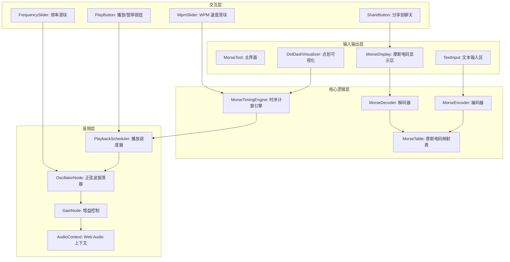
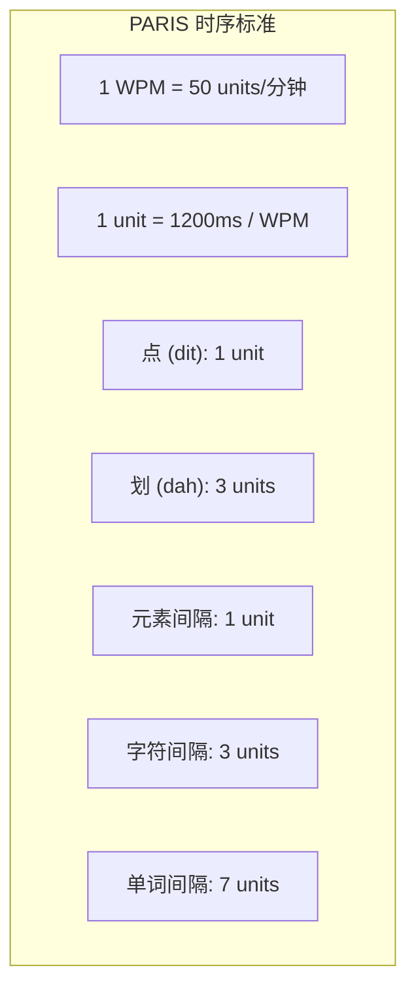
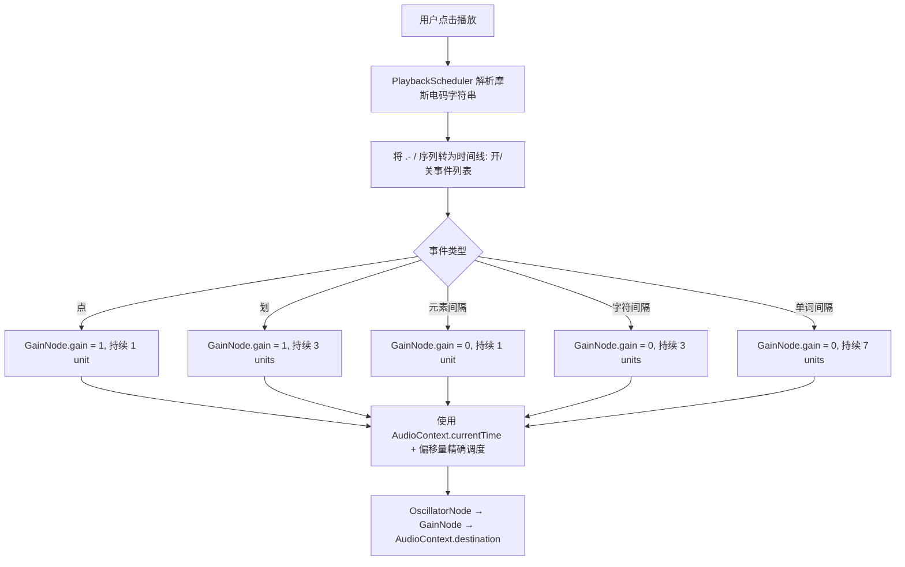

# YP-09-183: 摩斯电码转换器 — 文本↔摩斯电码双向转换、声音播放、WPM速度调节、可视点划显示、复制摩斯码、通过聊天分享、国际摩斯标准

> 需求编号：YP-09-183 · 优先级：P2 · 人天：0.2d · 状态：需求已编写
> 依赖：YP-09-100（文本转语音与朗读）

## 背景

### 问题陈述

摩斯电码（Morse Code）作为最古老的数字通信方式之一，至今仍在业余无线电、航空导航、紧急通信和军事领域广泛使用。对于业余无线电爱好者（HAM）、户外生存者和计算机历史爱好者，一个便捷的摩斯电码工具是必需品。当前痛点包括：

1. **学习工具缺失**：学习摩斯电码需要听到声音并看到可视化的点划，绝大多数在线工具仅支持文本转换，不支持声音播放
2. **WPM 无法调节**：摩斯电码的速度以 WPM（Words Per Minute）衡量，标准速度从 5 WPM（初学者）到 30+ WPM（专家），但现有工具多数速度固定
3. **解码工具不足**：将摩斯电码解码回文本需要手动查表，非常耗时
4. **声音生成麻烦**：需要专用的摩斯电码训练器硬件或桌面软件，Chromebook/平板用户没有好的选择
5. **分享不便**：编码后的摩斯电码想分享给朋友或通过 YiPet 聊天发送，需要手动复制粘贴

**核心矛盾**：摩斯电码是一个小众但真实的需求（HAM 无线电爱好者、户外生存者），但现有在线工具质量参差不齐（广告多、无声音、WPM 固定），需要一款集转换、声音、可视化和分享于一体的纯本地工具。

### 影响范围

| # | 影响 | 严重程度 | 典型场景 |
|---|------|----------|----------|
| 1 | 编码需外部工具 | 高 | 将文本转为摩斯电码 |
| 2 | 解码效率极低 | 高 | 收到摩斯电码需要手动查表 |
| 3 | 无声音反馈 | 高 | 学习摩斯电码时需要听觉训练 |
| 4 | WPM 无法调节 | 中 | 初学者需要慢速（5 WPM），专家需要快速（20+ WPM） |
| 5 | 可视化缺失 | 中 | 需要看到点划的视觉表示来辅助记忆 |

### 挑战

| 挑战 | 说明 |
|------|------|
| 声音生成 | 浏览器 Web Audio API 生成摩斯电码音（正弦波 600-1000Hz），点 = 1 unit，划 = 3 units |
| 精确时序 | 不同 WPM 下点/划/间隔的精确毫秒计算，遵循国际标准 PARIS 字长 |
| 实时播放 | 长文本的摩斯电码播放可能持续数分钟，需支持暂停/停止 |
| 字符集选择 | 国际摩斯标准 vs 扩展字符（@ 等）的支持范围 |
| 解码歧义 | 摩斯电码解码时遇到不标准的间隔（如多点合并或少点）的容错处理 |

---

## 一、现状分析

### 1.1 当前摩斯电码处理流程

```
用户需要摩斯电码转换
  │
  ├─ 文本 → 摩斯码
  │   ├─ 打开 morsecode.world 或其他在线工具
  │   ├─ 输入文本
  │   └─ 复制摩斯电码
  │
  ├─ 摩斯码 → 文本
  │   ├─ 手动查摩斯电码表（26 字母 + 10 数字）
  │   ├─ 逐字符对照翻译
  │   └─ 极大耗时且易出错
  │
  ├─ 声音播放
  │   ├─ 下载桌面软件（如 Morse Code Trainer）
  │   │   或使用在线工具（多数不支持声音）
  │   └─ 环境依赖高
  │
  └─ 学习练习
      ├─ 使用手机 App（需要安装）
      └─ 或购买专用硬件训练器
```

### 1.2 当前可用能力

| 能力 | 可用性 | 获取方式 | 限制 |
|------|--------|----------|------|
| 编码（文本→摩斯） | ⚠️ | 在线工具 | 广告多，无声音 |
| 解码（摩斯→文本） | ❌ | 无 | 需手动查表 |
| 声音播放 | ❌ | 需要桌面软件 | 平台限制 |
| WPM 调节 | ❌ | 无 | 在线工具多数不支持 |
| 可视化点划 | ⚠️ | 部分在线工具 | 显示简单 |
| 分享功能 | ❌ | 无 | 需手动复制 |

### 1.3 根因矩阵

| 症状 | 根因 | 触发条件 | 频率 |
|------|------|----------|------|
| 编码需外部工具 | 无内置摩斯码转换 | 每次需要编码 | 高 |
| 解码效率极低 | 无自动解码器 | 收到摩斯电码 | 高 |
| 无声音训练 | 浏览器工具不支持声音 | 学习摩斯电码时 | 中 |
| WPM 固定 | 工具不考虑学习曲线 | 初学者/进阶者 | 中 |
| 可视化单调 | 仅显示文本，不显示点划符号 | 视觉学习时 | 中 |

---

## 二、设计决策

### 决策 1：声音生成方式 — OscillatorNode vs AudioBuffer vs 预录制音频

| 选项 | 音质 | 灵活性 | 实现复杂度 |
|------|------|--------|-----------|
| OscillatorNode（实时生成） | 好 | 高（频率可调） | 中 |
| AudioBuffer（预计算波形） | 好 | 中 | 中 |
| 预录制音频文件 | 最好 | 低（WPM 变化需多文件） | 低 |

**选择：OscillatorNode + GainNode 实时合成。** 使用 Web Audio API 实时生成正弦波音频。频率可调（默认 700Hz，范围 500-1000Hz）。通过精确控制 GainNode 的启停时间来生成点和划。不需要任何音频文件，WPM 和频率任意可调。

### 决策 2：WPM 标准 — PARIS 标准 vs CODE 标准 vs 自定义

| 选项 | 业界认可 | 实现复杂度 | 用户熟悉度 |
|------|----------|-----------|-----------|
| PARIS 标准（1 word = 50 units） | 最高（ARRL 标准） | 低 | 高 |
| CODE 标准（1 word = 60 units） | 中 | 低 | 中 |
| 自定义 | 低 | 高 | 低 |

**选择：PARIS 标准。** PARIS 是国际业余无线电联盟（IARU）和美国无线电中继联盟（ARRL）采用的标准。在 PARIS 标准下：dit = 1 unit，dah = 3 units，元素间隔 = 1 unit，字符间隔 = 3 units，单词间隔 = 7 units。1 WPM = 50 units/分钟 → 1 unit = 1200/WPM 毫秒。

### 决策 3：字符集范围 — 仅 ITU-R 标准 vs 扩展字符 vs 完整 Unicode

| 选项 | 覆盖面 | 映射表体积 | 适用场景 |
|------|--------|-----------|----------|
| ITU-R M.1677-1（A-Z/0-9/标点） | 基础通信 | 极小 | 业余无线电 |
| 扩展（+ @ 等现代符号） | 现代通信 | 小 | 日常使用 |
| 完整 Unicode（中文等） | 无标准（中文无摩斯码） | — | 不可用 |

**选择：ITU-R M.1677-1 标准 + 常见扩展字符。** 支持 26 个大写字母、10 个数字、基本标点（. , ? / ( ) & : ; = + - _ " $ @ ! '）。小写字母自动转为大写。不在映射表中的字符（如中文、Emoji）在编码时跳过并给出警告。

### 决策 4：播放控制策略 — 单次播放 vs 循环播放 vs 渐进式训练

| 选项 | 学习效果 | 实现复杂度 | 用户控制 |
|------|----------|-----------|----------|
| 单次播放 + 暂停/停止 | 中 | 低 | 基本 |
| 循环播放 + WPM 递增 | 高 | 中 | 中等 |
| 渐进式训练模式（Koch/Farnsworth） | 最高 | 高 | 高 |

**选择：单次播放 + 循环选项（MVP），渐进式训练作为后续迭代。** MVP 阶段提供单次播放（播放/暂停/停止）和循环播放（连续重复）。Koch 方法（每次学习 2 个新字符）和 Farnsworth 时序（字符内快速、字符间慢速）作为后续版本功能。

### 设计决策记录

| 决策 | 选项 A | 选项 B | 选项 C | 选择 | 理由 |
|------|--------|--------|--------|------|------|
| 声音生成 | OscillatorNode | AudioBuffer | 预录制 | **OscillatorNode** | 灵活无需文件 |
| WPM 标准 | PARIS | CODE | 自定义 | **PARIS** | 业界标准 |
| 字符集 | ITU-R 基础 | 扩展 | 完整 Unicode | **ITU-R + 扩展** | 实用覆盖 |
| 播放控制 | 单次播放 | 循环播放 | 渐进式训练 | **单次+循环（MVP）** | 后续扩展 |

---

## 三、目标架构

### 3.1 摩斯电码系统架构



### 3.2 时序模型



### 3.3 音频生成流程



### 3.4 性能指标

| 指标 | 目标值 | 说明 |
|------|--------|------|
| 编码（100 字符） | < 10ms | 查表映射 |
| 解码（200 符号摩斯码） | < 10ms | 分割 + 查表 |
| 音频调度（100 字符） | < 20ms | 构建时间线 |
| 音频延迟（从点击到发声） | < 50ms | Web Audio latency |
| WPM 范围 | 5-40 | 可调范围 |

---

## 四、具体改动

### 4.1 摩斯电码映射表

```typescript
// src/tools/morse-code/MorseTable.ts (新增)

/** ITU-R M.1677-1 国际摩斯电码标准 */
export const MORSE_TABLE: ReadonlyMap<string, string> = new Map([
  // 字母 A-Z
  ['A', '.-'],   ['B', '-...'], ['C', '-.-.'], ['D', '-..'],
  ['E', '.'],    ['F', '..-.'], ['G', '--.'],  ['H', '....'],
  ['I', '..'],   ['J', '.---'], ['K', '-.-'],  ['L', '.-..'],
  ['M', '--'],   ['N', '-.'],   ['O', '---'],  ['P', '.--.'],
  ['Q', '--.-'], ['R', '.-.'],  ['S', '...'],  ['T', '-'],
  ['U', '..-'],  ['V', '...-'], ['W', '.--'],  ['X', '-..-'],
  ['Y', '-.--'], ['Z', '--..'],
  // 数字 0-9
  ['0', '-----'], ['1', '.----'], ['2', '..---'],
  ['3', '...--'], ['4', '....-'], ['5', '.....'],
  ['6', '-....'], ['7', '--...'], ['8', '---..'], ['9', '----.'],
  // 标点符号
  ['.', '.-.-.-'], [',', '--..--'], ['?', '..--..'],
  ["'", '.----.'], ['!', '-.-.--'], ['/', '-..-.'],
  ['(', '-.--.'],  [')', '-.--.-'], ['&', '.-...'],
  [':', '---...'], [';', '-.-.-.'], ['=', '-...-'],
  ['+', '.-.-.'],  ['-', '-....-'], ['_', '..--.-'],
  ['"', '.-..-.'], ['$', '...-..-'], ['@', '.--.-.'],
]);

/** 反向映射：摩斯码 → 字符 */
export const MORSE_REVERSE: ReadonlyMap<string, string> = (() => {
  const map = new Map<string, string>();
  for (const [char, morse] of MORSE_TABLE) {
    map.set(morse, char);
  }
  return map;
})();

/** 特殊信号 */
export const PROSIGNS: ReadonlyMap<string, string> = new Map([
  ['SOS', '... --- ...'],
  ['SK', '... -.-'],       // 结束联络
  ['AR', '.- .-.'],        // 消息结束
  ['KN', '-.-- -.'],       // 仅限指定电台
  ['BT', '-... -'],        // 分隔符
  ['CL', '-.-. .-..'],     // 关机
]);

/** 不可编码字符：返回 null 表示需跳过 */
export function canEncode(char: string): boolean {
  return MORSE_TABLE.has(char.toUpperCase());
}
```

### 4.2 编码器与解码器

```typescript
// src/tools/morse-code/MorseEncoder.ts (新增)

import { MORSE_TABLE, MORSE_REVERSE, canEncode } from './MorseTable';

export interface EncodeResult {
  morse: string;          // 摩斯电码字符串（如 "... --- ..."）
  skippedChars: string[]; // 跳过的字符
  charCount: number;      // 成功编码的字符数
}

export interface DecodeResult {
  text: string;
  unknownCodes: string[]; // 无法解码的摩斯码序列
  confidence: number;     // 0-1，解码置信度
}

export class MorseEncoder {
  /** 文本 → 摩斯电码 */
  encode(text: string): EncodeResult {
    const parts: string[] = [];
    const skipped: string[] = [];
    let count = 0;

    for (const char of text) {
      if (char === ' ') {
        parts.push('/'); // 单词分隔符
        continue;
      }

      const upper = char.toUpperCase();
      if (MORSE_TABLE.has(upper)) {
        parts.push(MORSE_TABLE.get(upper)!);
        count++;
      } else {
        skipped.push(char);
      }
    }

    return {
      morse: parts.join(' '),
      skippedChars: skipped,
      charCount: count,
    };
  }

  /** 摩斯电码 → 文本 */
  decode(morse: string): DecodeResult {
    // 按单词分隔符 '/' 分割（注意单词分隔符周围应有空格）
    const words = morse.split(/\s*\/\s*/);
    const unknown: string[] = [];
    let totalCodes = 0;
    let decodedCodes = 0;

    const decodedWords = words.map(word => {
      const codes = word.trim().split(/\s+/).filter(Boolean);
      return codes.map(code => {
        totalCodes++;
        if (MORSE_REVERSE.has(code)) {
          decodedCodes++;
          return MORSE_REVERSE.get(code)!;
        } else {
          unknown.push(code);
          return '?';
        }
      }).join('');
    });

    return {
      text: decodedWords.join(' '),
      unknownCodes: unknown,
      confidence: totalCodes > 0 ? decodedCodes / totalCodes : 0,
    };
  }
}
```

### 4.3 音频播放引擎

```typescript
// src/tools/morse-code/MorseAudioEngine.ts (新增)

export interface MorseTimelineEvent {
  type: 'on' | 'off';
  startTime: number;  // 秒（相对于播放开始）
  duration: number;   // 秒
}

export class MorseAudioEngine {
  private audioCtx: AudioContext | null = null;
  private oscillator: OscillatorNode | null = null;
  private gainNode: GainNode | null = null;
  private isPlaying = false;
  private scheduledNodes: Array<{ oscillator: OscillatorNode; gain: GainNode }> = [];
  private startTime = 0;
  private wpm = 15;
  private frequency = 700; // Hz

  get playing(): boolean { return this.isPlaying; }

  setWpm(wpm: number): void {
    this.wpm = Math.max(5, Math.min(40, wpm));
  }

  setFrequency(hz: number): void {
    this.frequency = Math.max(500, Math.min(1000, hz));
  }

  /** 构建播放时间线 */
  buildTimeline(morseCode: string): MorseTimelineEvent[] {
    const unitMs = 1200 / this.wpm; // 1 unit = 1200/WPM 毫秒（PARIS 标准）
    const unitSec = unitMs / 1000;
    const events: MorseTimelineEvent[] = [];
    let currentTime = 0;

    for (let i = 0; i < morseCode.length; i++) {
      const ch = morseCode[i];

      if (ch === '.') {
        events.push({ type: 'on', startTime: currentTime, duration: unitSec });
        currentTime += unitSec;
        // 元素间隔
        if (this.nextIsSignal(morseCode, i)) {
          currentTime += unitSec;
        }
      } else if (ch === '-') {
        events.push({ type: 'on', startTime: currentTime, duration: 3 * unitSec });
        currentTime += 3 * unitSec;
        if (this.nextIsSignal(morseCode, i)) {
          currentTime += unitSec;
        }
      } else if (ch === ' ') {
        // 字符间隔 = 3 units，但已经加了元素间隔的 1 unit，
        // 所以额外加 2 units
        if (this.nextIsSignal(morseCode, i)) {
          currentTime += 2 * unitSec;
        }
      } else if (ch === '/') {
        // 单词间隔 = 7 units，减去已加的字符间隔 3 units = 剩 4 units
        if (this.nextIsSignal(morseCode, i)) {
          currentTime += 4 * unitSec;
        }
      }
    }

    return events.filter(e => e.type === 'on');
  }

  private nextIsSignal(morse: string, currentIndex: number): boolean {
    for (let i = currentIndex + 1; i < morse.length; i++) {
      if (morse[i] === '.' || morse[i] === '-') return true;
      if (morse[i] === '/') return false; // 单词分隔符后无更多信号
    }
    return false;
  }

  /** 按时间线播放 */
  play(morseCode: string): void {
    this.stop();

    const ctx = new AudioContext();
    this.audioCtx = ctx;

    const timeline = this.buildTimeline(morseCode);
    this.startTime = ctx.currentTime;

    for (const event of timeline) {
      const osc = ctx.createOscillator();
      const gain = ctx.createGain();

      osc.type = 'sine';
      osc.frequency.setValueAtTime(this.frequency, ctx.currentTime);

      // 精确调度开关
      gain.gain.setValueAtTime(0, ctx.currentTime);
      gain.gain.setValueAtTime(0.5, ctx.currentTime + event.startTime);
      gain.gain.setValueAtTime(0, ctx.currentTime + event.startTime + event.duration);

      osc.connect(gain);
      gain.connect(ctx.destination);

      osc.start(ctx.currentTime + event.startTime);
      osc.stop(ctx.currentTime + event.startTime + event.duration + 0.01);

      this.scheduledNodes.push({ oscillator: osc, gain });
    }
    this.isPlaying = true;
  }

  /** 停止播放并清理资源 */
  stop(): void {
    for (const node of this.scheduledNodes) {
      try { node.oscillator.stop(); } catch {}
    }
    this.scheduledNodes = [];

    if (this.audioCtx && this.audioCtx.state !== 'closed') {
      this.audioCtx.close().catch(() => {});
    }
    this.audioCtx = null;
    this.isPlaying = false;
  }
}
```

### 4.4 点划可视化组件

```typescript
// src/tools/morse-code/DotDashVisualizer.vue (Vue 组件核心逻辑)

// 将摩斯电码字符串渲染为可视化的点划符号
// 点 (·) 显示为小实心圆，划 (—) 显示为长矩形
// 颜色区分：点 → 蓝色，划 → 橙色
// 播放时：当前播放到的符号高亮闪烁
//
// 示例：
// 输入 "... --- ..."
// 渲染：· · ·   — — —   · · ·
//       蓝蓝蓝   橙橙橙   蓝蓝蓝
```

### 4.5 文件变更清单

| 文件 | 操作 | 说明 |
|------|------|------|
| `src/tools/morse-code/types.ts` | 新增 | 类型定义 |
| `src/tools/morse-code/MorseTable.ts` | 新增 | 摩斯电码映射表（ITU-R + 扩展） |
| `src/tools/morse-code/MorseEncoder.ts` | 新增 | 编码器 + 解码器 |
| `src/tools/morse-code/MorseAudioEngine.ts` | 新增 | Web Audio 播放引擎 |
| `src/tools/morse-code/DotDashVisualizer.vue` | 新增 | 点划可视化组件 |
| `src/popup/components/MorseTool.vue` | 新增 | 主界面组件 |
| `src/popup/App.vue` | 修改 | 添加摩斯电码工具入口 |
| `tests/unit/morse-code/` | 新增 | 编解码 + 时序测试 |

---

## 五、实施步骤

| 步骤 | 操作 | 路径 | 验证 | 人天 |
|------|------|------|------|------|
| 1 | 构建映射表 | `MorseTable.ts` | 所有标准字符覆盖 | 0.01 |
| 2 | 实现编解码器 | `MorseEncoder.ts` | 双向转换正确 | 0.02 |
| 3 | 实现音频引擎 | `MorseAudioEngine.ts` | 点划时序精确 | 0.05 |
| 4 | 实现点划可视化 | `DotDashVisualizer.vue` | 同步高亮 | 0.03 |
| 5 | 实现 UI 组件 | `MorseTool.vue` | 输入/输出/控制面板 | 0.05 |
| 6 | 集成 WPM/频率滑块 | `MorseTool.vue` | 参数调节即时生效 | 0.02 |
| 7 | 编写测试 | `tests/unit/morse-code/` | 编解码 + PARIS 时序 | 0.02 |

**总人天：0.2d**

---

## 六、测试规格

### 场景 1：文本编码为摩斯电码

**GIVEN** 用户输入文本 `SOS`
**WHEN** 点击编码
**THEN** 输出 `... --- ...`
**AND** 每个字母的摩斯码用空格分隔

### 场景 2：摩斯电码解码为文本

**GIVEN** 用户输入摩斯电码 `.... . .-.. .-.. --- / .-- --- .-. .-.. -..`
**WHEN** 点击解码
**THEN** 输出 `HELLO WORLD`
**AND** `/` 被正确解析为单词分隔符

### 场景 3：声音播放

**GIVEN** 摩斯电码 `... --- ...`（SOS），WPM=20
**WHEN** 用户点击播放按钮
**THEN** 产生 `. . .`（三短）`- - -`（三长）`. . .`（三短）的摩斯音
**AND** 时序符合 PARIS 标准（20 WPM → 1 unit = 60ms）
**AND** 播放按钮变为暂停按钮
**AND** 播放完成后按钮恢复为播放按钮

### 场景 4：速度调节

**GIVEN** 摩斯电码 `.... . .-.. .-.. ---`
**WHEN** 用户将 WPM 从 15 调至 5
**THEN** 1 unit 时长从 80ms 变为 240ms
**AND** 再次播放时速度明显变慢（3 倍时长）

### 场景 5：点划可视化

**GIVEN** 摩斯电码 `.- -...`
**WHEN** 渲染点划可视化
**THEN** 显示：蓝色圆点 · + 橙色长条 —（A），空格，橙色长条 — + 三个蓝色圆点 · · ·（B）
**AND** 播放时当前点/划高亮闪烁

### 场景 6：无法编码的字符处理

**GIVEN** 用户输入 `你好 SOS 世界`
**WHEN** 点击编码
**THEN** 编码结果仅包含 `... --- ...`（SOS）
**AND** 显示警告"跳过了不可编码的字符：你、好、世、界"
**AND** 输出标注跳过了 4 个字符

---

## 七、风险与缓解

| 风险 | 概率 | 影响 | 缓解措施 |
|------|------|------|----------|
| Web Audio API 浏览器兼容性 | 低 | 高 | 检测 AudioContext 可用性，不可用时隐藏播放按钮并提示 |
| 长摩斯码播放内存占用 | 低 | 中 | 限制单次播放最长为 500 个摩斯符号 |
| AudioContext 被浏览器自动挂起 | 中 | 中 | 用户交互时调用 `audioCtx.resume()`，监听 `statechange` 事件 |
| WPM 极高（40+）时时序精度不足 | 低 | 低 | 限制 WPM 最大值 40，unit ≥ 30ms 精度足够 |
| 解码歧义（间隔不标准） | 中 | 中 | 显示解码置信度，低于 80% 时显示警告 |

---

## 八、回滚策略

| 场景 | 回滚操作 | 影响 |
|------|----------|------|
| 音频引擎异常 | 禁用播放功能，仅保留编解码和可视化 | 失去声音播放 |
| AudioContext 创建失败 | 隐藏播放按钮，显示"您的浏览器不支持音频播放" | 仅文本转换 |
| 解码置信度过低 | 显示原始摩斯码和"需人工确认"标记 | 功能仍可用 |
| 完全回滚 | 移除摩斯电码工具入口 | 功能回到改造前 |

---

## 九、设计决策记录

### D-01：为什么使用 OscillatorNode 实时合成而非预录制音频？

实时合成允许 WPM 和频率完全可调，而预录制音频需要为每种 WPM/频率组合准备音频文件，导致资源爆炸。OscillatorNode 生成的 700Hz 正弦波是摩斯电码训练的标准音调（"侧音"），音质完全满足需求。10 行代码即可替代数百个音频文件。

### D-02：为什么选择 PARIS 标准？

PARIS 是国际电信联盟（ITU）和业余无线电社区公认的摩斯电码速度标准。"PARIS"一词的摩斯电码恰好包含 50 个 time units，因此 1 WPM = 50 units/分钟 = 1 unit = 1.2 秒。这是所有摩斯电码训练软件和考试的基准标准，选择它确保了与其他工具的兼容性。

### D-03：为什么单词分隔符使用 `/` 而非其他符号？

`/` 是业余无线电文本表示中最常见的单词分隔符（如 `.... . .-.. .-.. --- / .-- --- .-. .-.. -..` = HELLO WORLD）。它不会与点（`.`）和划（`-`）混淆，且优于使用 7 个空格（不易阅读）或 `|`（可能与某些字体混淆）。输出格式遵循此惯例。

### D-04：为什么将不可编码字符静默跳过而非抛出错误？

在"发送消息"的场景中，用户可能输入混合中英文的文本。如果因为一个中文字符就中断整个编码过程，用户体验极差。静默跳过不可编码字符并给出警告信息，让用户可以继续处理可编码部分。这符合"Robustness Principle"（发送时保守，接收时宽容）。

---

## 十、可观测性

### 指标

| 指标 | 类型 | 说明 |
|------|------|------|
| `yipet.morse.use_count` | Counter | 摩斯电码工具使用次数 |
| `yipet.morse.encode_count` | Counter | 编码操作次数 |
| `yipet.morse.decode_count` | Counter | 解码操作次数 |
| `yipet.morse.play_count` | Counter | 音频播放次数 |
| `yipet.morse.avg_wpm` | Histogram | 平均 WPM 设置 |
| `yipet.morse.share_count` | Counter | 分享到聊天次数 |
| `yipet.morse.skip_count` | Counter | 不可编码字符跳过次数 |

### 告警

| 告警 | 条件 | 级别 |
|------|------|------|
| 高跳字率 | 单次编码跳字率 > 50% | INFO |
| AudioContext 创建失败 | 连续 5 次失败 | WARNING |

---

## 十一、代码审查检查清单

- [ ] 编码表覆盖 ITU-R M.1677-1 标准（26 字母 + 10 数字 + 标点）
- [ ] 双向编码映射正确（编码→解码→原始文本一致，仅限可编码字符）
- [ ] 不支持的字符给出警告而非静默丢失
- [ ] WPM 计算遵循 PARIS 标准（1 unit = 1200/WPM ms）
- [ ] 音频引擎使用 OscillatorNode + GainNode 精确调度
- [ ] 点划时序正确（点=1u, 划=3u, 元素间隔=1u, 字符间隔=3u, 单词间隔=7u）
- [ ] 播放按钮状态正确（播放/暂停/停止）
- [ ] AudioContext 在组件销毁时正确 close
- [ ] 播放完成后所有定时器/OscillatorNode 已清理
- [ ] WPM 和频率滑块范围限制正确（5-40 WPM, 500-1000Hz）
- [ ] 单词分隔符 `/` 在编解码中一致使用
- [ ] 解码置信度 < 80% 时提示用户
- [ ] 点划可视化与播放同步高亮

---

## 回归问题预测

| # | 预测问题 | 原因 | 验证方法 |
|---|---------|------|---------|
| 1 | 高频播放（40 WPM）时，Web Audio API 的 `setValueAtTime` 精度可能不足以精确调度 30ms 间隔的事件，导致点划之间出现音频"粘连" | 浏览器 AudioContext 的最小调度精度约为 3-5ms，40 WPM 的 1 unit = 30ms，仍在精度范围内但接近边界 | 以 40 WPM 播放 `.` 序列（5 个连续点），用耳朵验证每个点之间有清晰间隔 |
| 2 | AudioContext 在用户无交互时被浏览器的自动播放策略挂起（suspended），点击播放按钮时无声音 | Chrome 的自动播放策略要求 AudioContext 在用户手势中创建或恢复，如果 `ctx.state === 'suspended'` 但 resume 失败 | 播放按钮点击时先调用 `ctx.resume()`，失败时显示"请先与页面交互"提示 |
| 3 | 解码时摩斯电码的单词分隔符 `/` 前后如果没有空格（如 `...---.../...---...`），split 正则无法正确分割，导致整个字符串被当作一个"单词" | 用户可能从某些来源复制没有标准空格的摩斯电码，`/` 直接粘在前后符号上 | 在 split 前规范化空格：将 `/` 替换为 ` / `（前后加空格），再将连续空格压缩为 1 个 |
| 4 | 播放长摩斯电码（如 500+ 字符编码后约 2000+ 摩斯符号）时，构建时间线和调度 OscillatorNode 导致内存飙升和调度延迟 | 每个摩斯符号调度 1 个 OscillatorNode + 1 个 GainNode，2000 个符号 = 4000 个音频节点，超出浏览器 Web Audio 节点数限制 | 限制单次播放最多 500 个摩斯符号，超出时分段播放 |
| 5 | 播放过程中用户快速切换 WPM，已调度的音频节点仍使用旧时序，造成播放速度忽快忽慢 | `play()` 方法在调用时使用当时的 WPM 值调度所有节点，播放中途改变 WPM 不会影响已调度的事件 | 改变 WPM 时自动停止当前播放，提示"已停止播放以应用新速度"；或实现动态重调度 |
| 6 | 编码含 `/` 字符的文本（如 URL 路径 `api/v1/users`），`/` 被当作单词分隔符而非字面斜杠字符 | 摩斯电码编码约定中 `/` 既用于表示单词分隔符（如 " / "），也是可编码字符 `-..-.` | 区分场景：空格后的 `/` 是分隔符，紧邻字符的 `/` 是字面斜杠（编码为 `-..-.`） |

---

## 性能分析

### 各操作耗时

| 操作 | 预估耗时 | 说明 |
|------|----------|------|
| 编码（100 字符） | < 10ms | Map 查表，O(n) |
| 解码（200 符号摩斯码） | < 10ms | split + 查表 |
| 音频时间线构建（100 字符） | < 10ms | 遍历计算 time units |
| 音频调度（100 符号） | < 30ms | 创建 OscillatorNode + GainNode |
| 点划可视化渲染（100 符号） | < 20ms | Vue 虚拟 DOM |

### 音频引擎资源使用

| 资源 | 用量（100 字符编码） | 说明 |
|------|---------------------|------|
| 摩斯符号数 | ~200-400 个（取决于字符） | 每个字符 1-5 个符号 |
| AudioContext 数量 | 1 | 复用同一个 context |
| OscillatorNode 数量 | ~200-400 | 每个摩斯符号 1 个 |
| 播放时长（15 WPM） | ~10-15 秒 | 取决于文本长度 |
| 播放时长（30 WPM） | ~5-7 秒 | 速度翻倍 |

### 文件体积预估

| 文件 | 大小 | 说明 |
|------|------|------|
| `MorseTable.ts` | ~2KB | 映射表（~70 条目） |
| `MorseEncoder.ts` | ~1KB | 编解码逻辑 |
| `MorseAudioEngine.ts` | ~3KB | Web Audio 引擎 |
| `DotDashVisualizer.vue` | ~2KB | 点划可视化 |
| `MorseTool.vue` | ~4KB | 主界面 |

---

## 相关文档

- [ITU-R M.1677-1 International Morse Code](https://www.itu.int/rec/R-REC-M.1677-1-200910-I/en)
- [ARRL - Morse Code Timing](http://www.arrl.org/files/file/Technology/tis/info/pdf/160Qex013.pdf)
- [Web Audio API - MDN](https://developer.mozilla.org/en-US/docs/Web/API/Web_Audio_API)