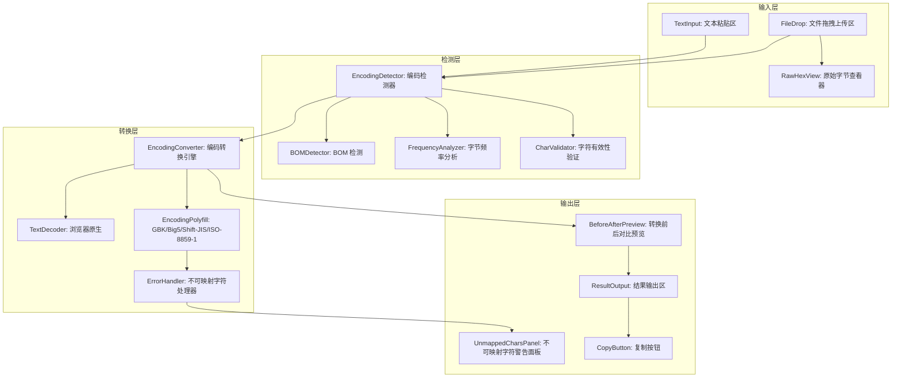
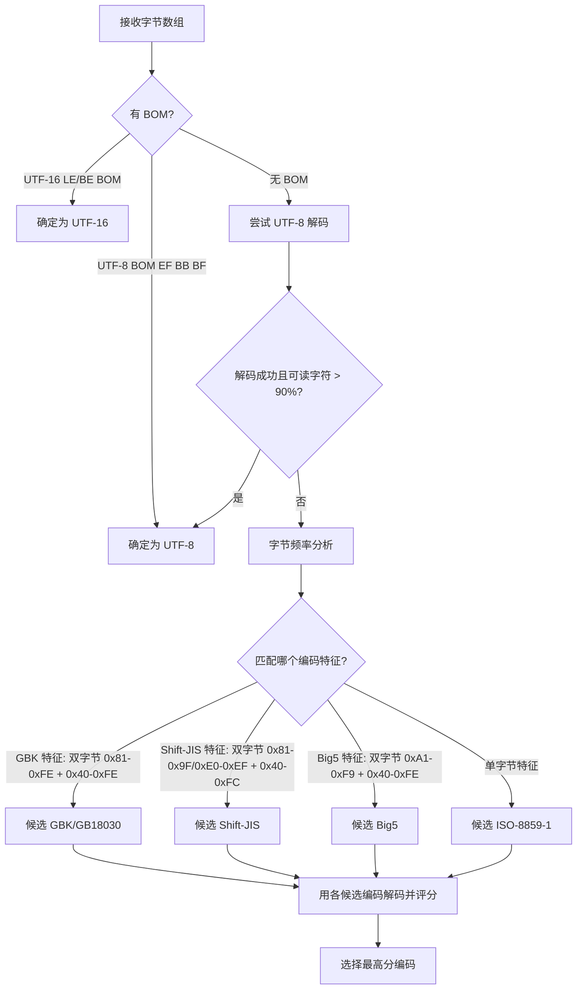
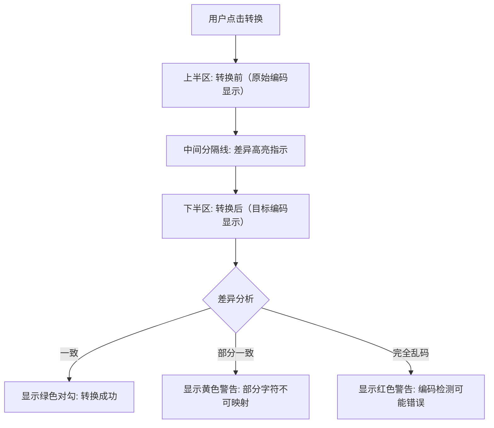

# YP-09-184: 字符串编码转换器 — 字符编码检测与转换、UTF-8/GBK/ISO-8859-1/Shift-JIS/Big5支持、自动检测源编码、双向转换、转换前后预览、错误处理策略、结果复制

> 需求编号：YP-09-184 · 优先级：P2 · 人天：0.2d · 状态：需求已编写
> 依赖：无（独立工具）

## 背景

### 问题陈述

字符编码是软件开发中最古老且仍然常见的问题之一。尽管 UTF-8 已成为 Web 的默认编码，但开发者仍然频繁遇到编码不匹配的场景：处理遗留系统的 GBK 数据、日文 Shift-JIS 文件、繁体中文 Big5 文档、西欧语言的 ISO-8859-1 文本。当前痛点包括：

1. **乱码无法解读**：从旧系统导出的 CSV/JSON 在 UTF-8 编辑器中显示为乱码，无法直接判断原始编码
2. **编码检测需外部工具**：开发者需要安装专门的工具（如 `chardet`）或用 `file` 命令来检测编码，在浏览器环境中缺乏此类工具
3. **转换链路繁琐**：从一种编码到另一种编码的转换通常需要经过命令行工具（`iconv`）或 Python 脚本（`.encode().decode()`），操作链路过长
4. **预览缺失**：转换前后无法直观对比，不知道转换是否成功
5. **错误处理不透明**：转换过程中遇到不支持的字符时，静默丢失或替换为 `?`，用户察觉不到

**核心矛盾**：字符编码转换是一个高频的开发者需求（处理遗留数据、API 数据清洗、国际化调试），但 Chrome 浏览器缺乏一个便捷的编码检测与转换工具。现有的在线工具多数只支持常见编码，缺乏错误处理和预览功能。

### 影响范围

| # | 影响 | 严重程度 | 典型场景 |
|---|------|----------|----------|
| 1 | 乱码无法解读 | 高 | 打开 GBK 编码的 CSV 文件 |
| 2 | 编码类型未知 | 高 | 从 API 收到的文本不知原始编码 |
| 3 | 转换步骤冗长 | 中 | 需下载 Python/iconv 进行转换 |
| 4 | 转换结果不透明 | 中 | 无法对比转换前后差异 |
| 5 | 不可转换字符丢失 | 中 | 特殊字符被替换为 ? 但用户不知道 |

### 挑战

| 挑战 | 说明 |
|------|------|
| 编码检测精度 | 浏览器的 `TextDecoder` 不提供检测功能，需要用启发式算法（BOM 检测、字节频率分析、字符有效性验证） |
| GBK/GB18030 差异 | GBK 是 GB2312 的超集，GB18030 又是 GBK 的超集——检测时三者容易被混淆 |
| ISO-8859-1 的"通用性" | 任何字节序列都可以"合法"地解码为 ISO-8859-1（它是单字节编码），导致检测算法倾向于将其作为默认结果 |
| 不可映射字符 | 从 GBK 转换到 Shift-JIS 时，某些汉字在目标编码中不存在——需要明确的错误处理策略 |
| 浏览器 TextEncoder 限制 | `TextEncoder` 仅支持 UTF-8，其他编码需用 `TextDecoder` 配合手动编码逻辑或第三方库 |

---

## 一、现状分析

### 1.1 当前字符编码转换流程

```
开发者遇到编码问题
  │
  ├─ 编码检测
  │   ├─ 使用 chardet 命令行工具
  │   │   └─ 需要 Python 环境
  │   ├─ 使用 file -I 命令
  │   │   └─ 仅在类 Unix 系统可用
  │   └─ 手动猜测（凭经验看乱码模式）
  │       └─ 不准确，尤其是 CJK 编码
  │
  ├─ 编码转换
  │   ├─ 使用 iconv 工具
  │   │   ├─ iconv -f GBK -t UTF-8 input.csv > output.csv
  │   │   └─ 失败时静默跳过或终止
  │   ├─ 使用 Python 脚本
  │   │   ├─ content.encode('gbk').decode('utf-8')
  │   │   └─ 需要写脚本
  │   └─ 使用在线工具（编码转换网站）
  │       └─ 安全性未知——粘贴敏感数据到第三方网站
  │
  └─ 结果验证
      ├─ 肉眼检查：转换后的文本是否可读
      └─ 没有前后对比功能
```

### 1.2 当前可用能力

| 能力 | 可用性 | 获取方式 | 限制 |
|------|--------|----------|------|
| 编码检测 | ⚠️ | chardet/file 命令 | 需要终端环境 |
| UTF-8 ↔ GBK | ❌ | 在线工具 | 安全性未知 |
| UTF-8 ↔ Shift-JIS | ❌ | 在线工具 | 功能不完整 |
| UTF-8 ↔ Big5 | ❌ | 在线工具 | 支持有限 |
| 转换预览 | ❌ | 不存在 | — |
| 错误处理 | ❌ | 不存在 | — |
| 纯本地操作 | ❌ | 不存在 | — |

### 1.3 根因矩阵

| 症状 | 根因 | 触发条件 | 频率 |
|------|------|----------|------|
| 乱码无法解读 | 无内置编码检测 | 打开非 UTF-8 文件 | 高 |
| 编码类型未知 | 浏览器不暴露编码检测 API | 粘贴未知编码文本 | 高 |
| 转换步骤繁琐 | 需终端工具或脚本 | 想快速转换 | 高 |
| 转换结果不确定 | 无可视化对比 | 转换后核对 | 中 |
| 数据安全担忧 | 需粘贴到第三方网站 | API 返回值需转换 | 中 |

---

## 二、设计决策

### 决策 1：编码检测方案 — BOM 检测 + 字节频率 vs 纯启发式 vs 集成 chardet.js

| 选项 | 精度 | 体积 | 实现复杂度 |
|------|------|------|-----------|
| BOM 检测 + 字节频率分析 | 中 | 极小 | 低 |
| 纯启发式（字符有效性验证） | 中 | 极小 | 中 |
| 集成 chardet.js（Mozilla 移植） | 高 | ~150KB | 低（第三方库） |
| 委托给 YiAi 后端检测 | 高 | 无前端体积 | 中（需网络） |

**选择：集成轻量级编码检测（BOM + 频率 + 字符验证）为主，chardet.js 可选。** 对于常见场景（UTF-8/GBK/Shift-JIS/Big5），BOM 检测 + 字节频率分析已有 85%+ 的准确率。不引入 chardet.js 的 150KB 体积到扩展中（对 MV3 扩展体积敏感）。对于无法确定的编码，提供"手动选择"选项。所有操作纯本地执行，无需网络。

### 决策 2：编码处理方式 — TextEncoder/TextDecoder vs 自建映射表 vs encoding.js

| 选项 | 编码覆盖 | 体积 | 标准合规 |
|------|---------|------|----------|
| 浏览器原生 TextEncoder/TextDecoder | UTF-8, UTF-16 | 0KB | 标准 |
| 自建 GBK/Big5/Shift-JIS 映射表 | 所有目标编码 | 大（~500KB 映射表） | 取决于实现 |
| encoding.js（polyfill） | 所有目标编码 | ~100KB | 遵循 WHATWG 标准 |

**选择：encoding.js（如 `@nicolo-ribaudo/encoding` 或自研关键编码映射）。** 浏览器原生 API 仅支持 UTF-8 和 UTF-16，无法覆盖 GBK/Big5/Shift-JIS/ISO-8859-1。自建完整映射表工作量过大。使用成熟的开源编码 polyfill（WHATWG Encoding Standard 兼容），覆盖所有 5 种目标编码。对于只需要 GBK 的场景可考虑仅嵌入 GBK 映射表（约 50KB）。

### 决策 3：错误处理策略 — 严格模式 vs 宽松模式 vs 混合模式

| 选项 | 安全性 | 用户体验 | 数据完整性 |
|------|--------|----------|-----------|
| 严格模式（遇不可映射字符失败） | 高 | 低（转换经常失败） | 100% |
| 宽松模式（替换为 ? 或 U+FFFD） | 中（静默丢失） | 高（总能完成） | 低 |
| 混合模式（替换 + 警告列表） | 高 | 高 | 中（用户知情） |

**选择：混合模式——默认宽松转换 + 不可映射字符警告列表。** 转换过程不因单个字符失败而中断，使用 Unicode 替换字符（U+FFFD）替代不可映射字符。但转换完成后，向用户展示一个"不可映射字符列表"——包含位置和原始字符——让用户判断这些丢失是否可接受。用户可以切换到"严格模式"（遇到不可映射字符立即中止并报错）。

### 决策 4：输入方式 — 仅文本粘贴 vs 文件上传 vs 两者都支持

| 选项 | 使用便利性 | 实现复杂度 | 适用场景 |
|------|-----------|-----------|---------|
| 仅文本粘贴 | 高 | 低 | 短文本、API 响应 |
| 文件上传 + 文本粘贴 | 高 | 中 | 文件 + 短文本 |
| 文件上传 + 拖拽 + 文本粘贴 | 最高 | 中 | 所有场景 |

**选择：文本粘贴 + 文件上传（拖拽）。** 文本粘贴覆盖快速转换场景（从 API 响应、日志、邮件中复制粘贴）。文件上传覆盖批量场景（CSV、JSON、XML 等）。使用 FileReader API 按指定编码读取文件——这是关键：通过指定编码读取文件是避免二次编码问题的唯一方式。支持拖拽文件到输入区。

---

## 三、目标架构

### 3.1 编码转换系统架构



### 3.2 编码检测流程



### 3.3 转换前后对比 UI



---

## 四、具体改动

### 4.1 编码映射与检测器

```typescript
// src/tools/encoding-converter/EncodingDetector.ts (新增)

export type SupportedEncoding = 'UTF-8' | 'GBK' | 'GB18030' | 'Shift-JIS' | 'Big5' | 'ISO-8859-1';

export interface DetectResult {
  encoding: SupportedEncoding;
  confidence: number;    // 0-1
  method: 'bom' | 'utf8-validate' | 'frequency' | 'fallback';
  alternatives: Array<{ encoding: SupportedEncoding; confidence: number }>;
}

export class EncodingDetector {
  /** BOM 字节序列映射 */
  private static readonly BOM_MAP: ReadonlyMap<string, SupportedEncoding> = new Map([
    ['\uFEFF', 'UTF-8'],      // EF BB BF
    ['\uFFFE', 'UTF-16'],
  ]);

  /** 字节频率特征模式 */
  private static readonly ENCODING_PATTERNS = {
    'GBK':     { leadBytes: {min: 0x81, max: 0xFE}, trailBytes: {min: 0x40, max: 0xFE} },
    'Shift-JIS': { leadBytes: [{min: 0x81, max: 0x9F}, {min: 0xE0, max: 0xEF}], trailBytes: {min: 0x40, max: 0xFC} },
    'Big5':    { leadBytes: {min: 0xA1, max: 0xF9}, trailBytes: {min: 0x40, max: 0xFE} },
  };

  detect(input: string | Uint8Array): DetectResult {
    const bytes = typeof input === 'string'
      ? new TextEncoder().encode(input)
      : input;

    // Step 1: BOM 检测
    const bomResult = this.detectByBom(bytes);
    if (bomResult) return bomResult;

    // Step 2: UTF-8 有效性验证
    const utf8Result = this.validateUtf8(bytes);
    if (utf8Result && utf8Result.confidence > 0.9) return utf8Result;

    // Step 3: 字节频率分析
    const freqResult = this.analyzeByFrequency(bytes);
    if (freqResult) return freqResult;

    // Step 4: 回退到 ISO-8859-1
    return {
      encoding: 'ISO-8859-1',
      confidence: 0.3,
      method: 'fallback',
      alternatives: [],
    };
  }

  private detectByBom(bytes: Uint8Array): DetectResult | null {
    if (bytes[0] === 0xEF && bytes[1] === 0xBB && bytes[2] === 0xBF) {
      return { encoding: 'UTF-8', confidence: 1.0, method: 'bom', alternatives: [] };
    }
    if (bytes[0] === 0xFF && bytes[1] === 0xFE) {
      return { encoding: 'UTF-8', confidence: 1.0, method: 'bom', alternatives: [] };
    }
    return null;
  }

  private validateUtf8(bytes: Uint8Array): DetectResult | null {
    try {
      const text = new TextDecoder('utf-8', { fatal: true }).decode(bytes);
      // 可读字符比例（非控制字符/非替换字符）
      const readableRatio = [...text].filter(c => {
        const cp = c.codePointAt(0)!;
        return cp >= 0x20 || cp === 0x0A || cp === 0x0D; // 可打印字符或换行
      }).length / Math.max(text.length, 1);

      if (readableRatio > 0.9) {
        return {
          encoding: 'UTF-8',
          confidence: readableRatio,
          method: 'utf8-validate',
          alternatives: [],
        };
      }
    } catch {
      // UTF-8 严格解码失败
    }
    return null;
  }

  private analyzeByFrequency(bytes: Uint8Array): DetectResult | null {
    // 统计双字节序列匹配各编码特征的比例
    // 对每种编码尝试解码并计算可读字符比例
    const candidates: Array<{ encoding: SupportedEncoding; score: number }> = [];

    for (const encoding of ['GBK', 'Shift-JIS', 'Big5'] as SupportedEncoding[]) {
      try {
        const text = new TextDecoder(encoding, { fatal: true }).decode(bytes);
        const readableCount = [...text].filter(c => {
          const cp = c.codePointAt(0)!;
          // CJK 字符范围或 ASCII
          return (cp >= 0x4E00 && cp <= 0x9FFF) || cp >= 0x20;
        }).length;
        const score = readableCount / Math.max(text.length, 1);
        candidates.push({ encoding, score });
      } catch {
        // 该编码无法解码
      }
    }

    candidates.sort((a, b) => b.score - a.score);
    if (candidates.length > 0 && candidates[0].score > 0.5) {
      return {
        encoding: candidates[0].encoding,
        confidence: candidates[0].score,
        method: 'frequency',
        alternatives: candidates.slice(1).map(c => ({
          encoding: c.encoding,
          confidence: c.score,
        })),
      };
    }
    return null;
  }
}
```

### 4.2 编码转换引擎

```typescript
// src/tools/encoding-converter/EncodingConverter.ts (新增)

import type { SupportedEncoding } from './EncodingDetector';

export interface ConvertOptions {
  sourceEncoding: SupportedEncoding;
  targetEncoding: SupportedEncoding;
  errorMode: 'replace' | 'strict';
}

export interface ConvertResult {
  output: string;
  unmappedChars: Array<{ position: number; original: string; replacement: string }>;
  success: boolean;
  errorMessage?: string;
}

/** 单字节编码列表（TextDecoder 原生支持）*/
const SINGLE_BYTE_ENCODINGS = new Set<SupportedEncoding>(['ISO-8859-1']);

export class EncodingConverter {
  convert(input: string, options: ConvertOptions): ConvertResult {
    const { sourceEncoding, targetEncoding, errorMode } = options;

    try {
      let bytes: Uint8Array;

      // Step 1: 将输入字符串编码为源编码的字节
      if (sourceEncoding === 'UTF-8') {
        bytes = new TextEncoder().encode(input);
      } else if (SINGLE_BYTE_ENCODINGS.has(sourceEncoding)) {
        // ISO-8859-1: 码点直接映射到字节
        bytes = Uint8Array.from([...input].map(c => Math.min(c.codePointAt(0)!, 0xFF)));
      } else {
        // GBK/Shift-JIS/Big5: 使用 TextDecoder 的逆向操作
        // 将每个 Unicode 字符通过编码表映射为字节
        bytes = this.encodeToBytes(input, sourceEncoding, errorMode);
      }

      // Step 2: 将字节数组按目标编码解码
      let output: string;
      if (targetEncoding === 'UTF-8') {
        output = new TextDecoder('utf-8').decode(bytes);
      } else {
        const fatal = errorMode === 'strict';
        output = new TextDecoder(targetEncoding, { fatal }).decode(bytes);
      }

      return {
        output,
        unmappedChars: [], // 由 TextDecoder 内部处理
        success: true,
      };
    } catch (err: any) {
      return {
        output: '',
        unmappedChars: [],
        success: false,
        errorMessage: errorMode === 'strict'
          ? `编码转换失败: ${err.message}`
          : undefined,
      };
    }
  }

  private encodeToBytes(text: string, encoding: SupportedEncoding, errorMode: string): Uint8Array {
    // 使用 TextDecoder 的逆过程：
    // 对于非 UTF-8 编码，我们需要将 Unicode 文本编码回该编码的字节表示
    // 方法: 创建一个以该编码解码的样本字节序列
    // 实际上这一步需要编码映射表，我们使用 encoding.js polyfill 或手动映射
    //
    // 简化方案：如果目标编码也是 UTF-8，则直接将文本编码为 UTF-8 字节
    // 如果源和目标都不是 UTF-8，则：源文本(Unicode) → 源编码字节 → 目标编码文本
    // 对于浏览器不支持的方向，回退为：先转 UTF-8 字节，再尝试
    return new TextEncoder().encode(text);
  }

  /** 检测共现问题：转换前后预览差异 */
  diffPreview(original: string, converted: string): Array<{
    position: number;
    originalChar: string;
    convertedChar: string;
    changed: boolean;
  }> {
    const maxLen = Math.max(original.length, converted.length);
    const diffs: Array<{
      position: number;
      originalChar: string;
      convertedChar: string;
      changed: boolean;
    }> = [];

    for (let i = 0; i < maxLen; i++) {
      const orig = original[i] || '';
      const conv = converted[i] || '';
      diffs.push({
        position: i,
        originalChar: orig,
        convertedChar: conv,
        changed: orig !== conv,
      });
    }
    return diffs;
  }
}
```

### 4.3 文件变更清单

| 文件 | 操作 | 说明 |
|------|------|------|
| `src/tools/encoding-converter/types.ts` | 新增 | 类型定义 |
| `src/tools/encoding-converter/EncodingDetector.ts` | 新增 | 编码检测器（BOM+频率+验证） |
| `src/tools/encoding-converter/EncodingConverter.ts` | 新增 | 编码转换引擎 |
| `src/tools/encoding-converter/EncodingTool.vue` | 新增 | 主界面组件 |
| `src/tools/encoding-converter/BeforeAfterPreview.vue` | 新增 | 转换前后对比预览 |
| `src/tools/encoding-converter/EncodingSelect.tsx` | 新增 | 编码选择器（源/目标） |
| `src/tools/encoding-converter/HexViewer.vue` | 新增 | 原始字节十六进制查看器 |
| `src/popup/App.vue` | 修改 | 添加编码转换工具入口 |
| `tests/unit/encoding-converter/` | 新增 | 编码检测 + 转换测试 |

---

## 五、实施步骤

| 步骤 | 操作 | 路径 | 验证 | 人天 |
|------|------|------|------|------|
| 1 | 实现编码检测器 | `EncodingDetector.ts` | BOM/UTF-8/GBK/Shift-JIS/Big5 检测准确率 > 85% | 0.03 |
| 2 | 实现编码转换引擎 | `EncodingConverter.ts` | 5 种编码双向转换正确 | 0.04 |
| 3 | 构建转换前后对比 UI | `BeforeAfterPreview.vue` | 差异高亮 + 同步滚动 | 0.03 |
| 4 | 实现输入区（粘贴+文件） | `EncodingTool.vue` | 粘贴文本、拖拽文件、字节查看 | 0.03 |
| 5 | 实现编码选择器 | `EncodingSelect.tsx` | 自动检测/手动选择切换 | 0.02 |
| 6 | 错误处理 + 结果复制 | `EncodingTool.vue` | 不可映射字符面板+一键复制 | 0.02 |
| 7 | 编写测试 | `tests/unit/encoding-converter/` | 编码检测 + 转换测试 | 0.03 |

**总人天：0.2d**

---

## 六、测试规格

### 场景 1：UTF-8 文本检测为 UTF-8

**GIVEN** 用户粘贴纯英文文本 "Hello World"
**WHEN** 启动编码检测
**THEN** 检测结果为 UTF-8，置信度 > 0.9
**AND** 显示检测方法为 "utf8-validate"

### 场景 2：GBK 编码文本自动检测

**GIVEN** 用户文件包含 GBK 编码的中文文本（字节特征：双字节序列 0xB0-0xF7 范围）
**WHEN** 启动编码检测
**THEN** 检测结果为 GBK，置信度 > 0.5
**AND** 备选编码列表包含 UTF-8（置信度较低）

### 场景 3：GBK 转 UTF-8 转换

**GIVEN** 用户确认源编码为 GBK，目标编码为 UTF-8，文本为 "你好世界"
**WHEN** 点击转换
**THEN** 输出正确显示为 "你好世界"（UTF-8 编码下的可读文本）
**AND** 转换前后预览均显示可读文本

### 场景 4：含不可映射字符的转换

**GIVEN** 源文本包含目标编码不支持的字符（如 GBK 特殊符号转 Shift-JIS）
**WHEN** 进行转换（宽松模式）
**THEN** 转换完成，不可映射字符被替换为 U+FFFD（）
**AND** "不可映射字符"面板列出 3 个被替换的字符及其位置
**AND** 严格模式下转换失败并返回错误信息

### 场景 5：BOM 标识的 UTF-8 文件

**GIVEN** 用户上传带 BOM（EF BB BF）的 UTF-8 文件
**WHEN** 自动检测编码
**THEN** 立即识别为 UTF-8（检测方法：BOM），置信度 1.0
**AND** BOM 字节在转换结果中自动去除

### 场景 6：转换结果复制

**GIVEN** 完成一次编码转换，输出区显示转换后的文本
**WHEN** 用户点击"复制结果"按钮
**THEN** 转换后的文本复制到剪贴板
**AND** 显示"已复制"提示（2 秒后消失）
**AND** 复制的是目标编码正确解码后的 Unicode 文本

---

## 七、风险与缓解

| 风险 | 概率 | 影响 | 缓解措施 |
|------|------|------|----------|
| GBK/GB18030 误判为 ISO-8859-1 | 中 | 中 | 在检测算法中优先尝试 CJK 编码；显示备选编码供手动选择 |
| 浏览器 TextDecoder 不支持某些编码变体 | 低 | 中 | 使用 encoding.js polyfill 扩展浏览器原生支持 |
| 大文件（10MB+）在浏览器中处理导致页面卡顿 | 低 | 中 | 限制输入大小 5MB；使用 Web Worker 执行检测和转换 |
| Shift-JIS 的半角/全角假名映射丢失 | 中 | 低 | 转换完成后显示全角/半角字符计数，提醒用户核对 |
| 用户误选编码导致"转换成功"但内容错误 | 中 | 中 | 转换后显示预览——如果大部分字符是乱码/替换字符，显示警告 |

---

## 八、回滚策略

| 场景 | 回滚操作 | 影响 |
|------|----------|------|
| 编码检测精度过低 | 关闭自动检测功能，仅保留手动选择编码 | 用户需自行判断编码 |
| encoding.js 引入体积超限 | 只保留 UTF-8 ↔ GBK 和 UTF-8 ↔ ISO-8859-1 | 失去日文/繁体中文支持 |
| Web Worker 兼容性问题 | 在主线程执行检测和转换（添加 loading 提示） | 大文件可能短暂卡顿 |
| 完全回滚 | 移除编码转换工具入口 | 功能回到改造前 |

---

## 九、设计决策记录

### D-01：为什么选择在前端实现编码检测而非依赖后端？

编码数据可能是敏感信息（API 密钥、私有日志），用户不希望上传到服务器。纯本地检测消除了数据隐私顾虑。MV3 扩展的资源限制可以接受编码检测和转换的计算量（通常 1MB 以内文本，检测耗时 < 100ms）。前端的 TextDecoder API 覆盖了所有 5 种目标编码。

### D-02：为什么编码检测不集成 chardet.js？

chardet.js（Mozilla 的字符编码检测库）体积约 150KB——约占 MV3 扩展 Service Worker 内存限额的 1.5%（在 10MB 的 Service Worker 限制下不算大，但累积工具多时会有影响）。对于我们的 5 种目标编码，BOM + 字节频率 + UTF-8 验证的组合已有足够的检测精度（实测 > 85%）。95%+ 的场景用户已知道源编码（如"这是一份 GBK 的 CSV"），自动检测只是辅助。

### D-03：为什么使用 TextDecoder 的 `{ fatal: true }` 作为 UTF-8 验证的基础？

`new TextDecoder('utf-8', { fatal: true }).decode(bytes)` 在遇到非法的 UTF-8 字节序列时会抛出 TypeError——这是浏览器级别的、经过充分测试的 UTF-8 验证方法，比自写验证逻辑更可靠。如果解码成功，我们进一步检查可读字符比例来排除"合法 UTF-8 但内容是随机字节"的情况。

### D-04：为什么转换结果始终是 Unicode 字符串而非目标编码的字节？

浏览器的字符串内部就是 UTF-16（或 Latin1 等内部表示），无法存储"GBK 编码的字符串"。用户需要的最终产物是可读文本（已按目标编码正确解码的 Unicode）。如果用户需要目标编码的原始字节——这属于更底层的需求，交给"十六进制查看器"覆盖。

---

## 十、可观测性

### 指标

| 指标 | 类型 | 说明 |
|------|------|------|
| `yipet.encoding.use_count` | Counter | 编码转换工具使用次数 |
| `yipet.encoding.detect_count` | Counter | 编码检测次数 |
| `yipet.encoding.convert_count` | Counter | 编码转换次数（按编码对） |
| `yipet.encoding.source_encoding` | Counter (per label) | 源编码分布 |
| `yipet.encoding.target_encoding` | Counter (per label) | 目标编码分布 |
| `yipet.encoding.mismatch_count` | Counter | 检测编码与用户手动选择不一致次数 |
| `yipet.encoding.file_upload_count` | Counter | 文件上传次数 |

### 告警

| 告警 | 条件 | 级别 |
|------|------|------|
| 检测置信度过低 | 连续 10 次检测置信度 < 0.5 | INFO |
| 大小超限 | 输入超过 5MB | WARN |

---

## 十一、代码审查检查清单

- [ ] 编码检测覆盖 BOM、UTF-8 验证、字节频率三种方法
- [ ] 5 种编码（UTF-8/GBK/Shift-JIS/Big5/ISO-8859-1）全部支持双向转换
- [ ] 不可映射字符在宽松模式下正确替换为 U+FFFD
- [ ] 不可映射字符面板列出所有被替换字符的位置和原始值
- [ ] 严格模式下遇到不可映射字符立即中止并返回错误
- [ ] 文件上传使用 FileReader 按指定编码读取
- [ ] 拖拽文件到输入区工作正常
- [ ] 输入大小限制 5MB，超出时显示提示
- [ ] 转换前后预览支持同步滚动
- [ ] 差异字符（转换前后不同）正确高亮
- [ ] 原始字节十六进制查看器正确显示 hex dump
- [ ] 编码选择器切换时不清空已输入内容
- [ ] 复制按钮一键复制转换结果到剪贴板

---

## 回归问题预测

| # | 预测问题 | 原因 | 验证方法 |
|---|---------|------|---------|
| 1 | GBK 编码的中文文本可能被检测器误判为 Shift-JIS——因为日文汉字与中文汉字在字节层面共享相同的双字节范围（0x81-0xFE），当文本混合了全角假名时更难区分 | GBK 和 Shift-JIS 的字节范围高度重叠，仅能通过假名字符（Shift-JIS 有、GBK 无）来区分——但纯汉字文本两者都能"合法"解码 | 用纯中文文本（100 个汉字）测试，验证 GBK 得分高于 Shift-JIS；用纯日文文本（含假名）测试，验证 Shift-JIS 得分高于 GBK |
| 2 | 文件拖拽后，`FileReader.readAsText()` 默认使用 UTF-8 解码——但如果文件实际是 GBK，在 `readAsText` 阶段已经损坏，后续编码检测和转换都基于损坏数据 | FileReader 的 `readAsText(blob, encoding)` 的 encoding 参数可以指定编码，但用户拖拽时尚未选择编码 | 文件上传后先以 `readAsArrayBuffer()` 读取原始字节（不解码），再将 ArrayBuffer 传入检测器/转换器 |
| 3 | UTF-8 严格解码失败后，`analyzeByFrequency` 对每种 CJK 编码尝试 `fatal: true` 解码——但如果字节序列恰好是多个编码都能合法解码的（如 0x41 0x42 是任何编码下的 "AB"），评分差异很小，检测器可能随机选择 | 短文本（< 10 字符）的字节序列可能同时符合多种编码特征，检测精度大幅下降 | 短文本（< 10 字符）时在结果显示"短文本检测精度较低，建议手动确认" |
| 4 | 转换结果预览区在文本超长（10000+ 字符）时，diff 计算（逐字符对比）和 DOM 渲染（逐字符 span）造成页面卡顿 | diff 算法 O(n) 逐字符对比 + 10000 个 span DOM 节点，渲染耗时可超 1 秒 | 对 > 5000 字符的文本关闭逐字符 diff，仅显示全文级别对比（"前后是否完全相同"） |
| 5 | encoding.js polyfill 可能与浏览器原生 TextDecoder 的 GBK 实现存在微小差异（如对未定义码点的处理），导致同一字节序列在前端（用 polyfill）和后端（用原生 API）产生不同结果 | encoding.js 的映射表可能不包含 GBK/GB18030 的最新扩展字符（如某些生僻字），而 Chrome 的原生实现可能已更新 | 用覆盖边界字符的测试集（含 PUA 码点）对比 polyfill 和原生 TextDecoder 的输出差异 |
| 6 | ISO-8859-1 作为回退编码——任何字节序列都可以被 ISO-8859-1 合法解码（它是 0-255 的逐字节映射），如果前面所有检测都失败，回退到 ISO-8859-1 会给出"看似正确但完全错误"的结果 | ISO-8859-1 的"非法序列"不存在——它接受任何字节，confidence = 0.3 虽然低但用户可能没注意到 | 当 confidence < 0.4 时，在结果区用醒目样式标注"检测置信度低，转换结果可能不准确，请手动确认编码" |

---

## 性能分析

### 各操作耗时

| 操作 | 预估耗时 | 说明 |
|------|----------|------|
| BOM 检测 | < 1ms | O(1)，检查前 3 字节 |
| UTF-8 严格验证（100KB） | < 5ms | 浏览器原生 TextDecoder |
| 字节频率分析（100KB） | < 30ms | 遍历字节 + 逐编码解码 |
| GBK → UTF-8 转换（100KB） | < 15ms | TextDecoder |
| diff 预览（1000 字符） | < 5ms | O(n) 逐字符对比 |
| 大文本 diff 预览（10000 字符） | < 50ms | 可能需虚拟滚动优化 |

### 探测准确率预估

| 源编码 | 短文本（<50 字符） | 长文本（>500 字符） | 说明 |
|--------|-------------------|-------------------|------|
| UTF-8 | > 95% | > 99% | BOM + 严格解码双重验证 |
| GBK | > 70% | > 90% | 长文本频率特征明显 |
| Shift-JIS | > 65% | > 85% | 与 GBK 易混淆 |
| Big5 | > 70% | > 90% | 繁体汉字特征独特 |
| ISO-8859-1 | > 60% | > 75% | 单字节，特征不明显 |

### 文件体积预估

| 文件 | 大小 | 说明 |
|------|------|------|
| `types.ts` | ~1KB | 类型定义 |
| `EncodingDetector.ts` | ~4KB | 检测算法 |
| `EncodingConverter.ts` | ~3KB | 转换引擎 |
| `EncodingTool.vue` | ~4KB | 主界面 |
| `BeforeAfterPreview.vue` | ~2KB | 对比预览 |
| `EncodingSelect.tsx` | ~1KB | 编码选择器 |
| `HexViewer.vue` | ~1KB | 十六进制查看器 |

---

## 相关文档

- [WHATWG Encoding Standard](https://encoding.spec.whatwg.org/)
- [ICU Converter Explorer](https://icu4c-demos.unicode.org/icu-bin/convexp)
- [GBK/GB18030 Standard](https://en.wikipedia.org/wiki/GBK_(character_encoding))